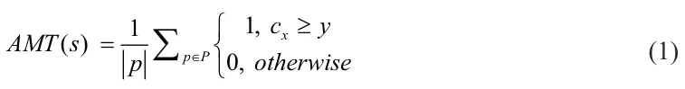
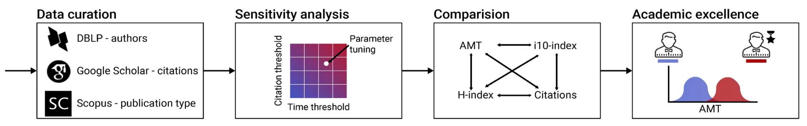
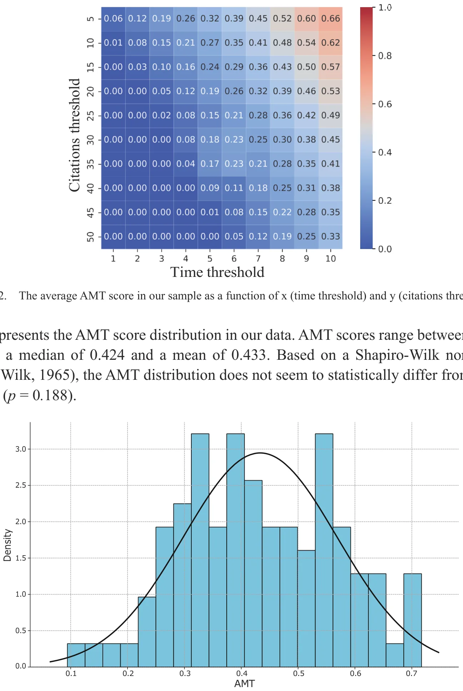
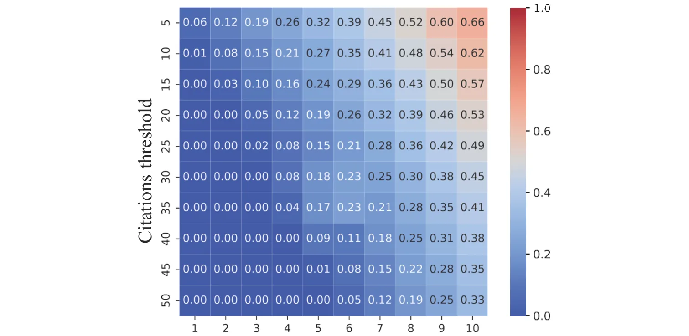
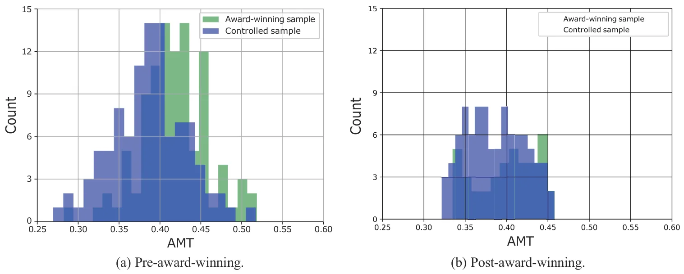

## 1 Introduction

Evaluating and assessing researchers’ academic performance is crucial to maintaining the quality and integrity of research, promoting scientific progress, allocating resources effectively, and ensuring accountability in the research community (Aithal & Aithal, 2023; Kumar et al., 2023; Lindahl, 2023; Rotem et al., 2021a, 2021b; Sahudin et al., 2023). A central issue within this realm is the identification and recognition of academic excellence (Abramo, 2018; Mavrogenis et al., 2020). Specifically, it is important to acknowledge researchers who perform outstanding science. This, in turn, can reinforce high-quality scientific progress and catalyze the pursuit of academic distinction, visibility, and impact.

Due to its amorphous nature, the term “academic excellence” is often interpreted in various ways which need not necessarily align. Indeed, over a hundred different researcher-level performance indicators, which are typically at the basis of academic excellence identification and exploration, have been proposed and evaluated in prior literature (Kulczycki et al., 2017; Salmi, 2011; Sziklai, 2021; Wildgaard et al., 2014). For example, Rodríguez‐Navarro (2011) showed that the number of publications, citations, and top one percent most cited publications correlate with Nobel Prize achievements. Similarly, Robinson et al. (2019a) showed that H-index and i10-index are useful indicators of medical consultants’ success in the United Kingdom, and Kpolovie and Onoshagbegbe (2017) showed these two indexes are also useful in distinguishing excellent academic departments and institutes. Amongst these measures of excellence, citation-based scientometrics seems to be the most widely accepted quantitative measure for assessing scientific excellence (Alexi et al., 2024; Borchardt & Hartings, 2018; Massucci & Docampo, 2019). These measures range from simple ones such as the number of publications at the top 5% most frequently cited publications in the field (Tijssen et al., 2002), the number of publications in highly-cited journals (Garousi & Fernandes, 2016), the number of publications which received at least 10 citations (aka i10-index) (Ansari et al., 2022; Kozak & Bornmann, 2012), a factoring of both citations and the number of publications such as the various versions of the h-index (Ball, 2007; Koltun & Hafner, 2021; Liu et al., 2023), to more sophisticated ones such as the g-index (Egghe, 2006), the scientist impact factor (Lippi & Mattiuzzi, 2017), and the u-index (Dillon, 2022), to name a few. Unfortunately, as most researchers tend to agree, defining “excellence” in a standardized and consistent way presents serious difficulties (Jong et al., 2021). Specifically, each researcher-level indicator reflects just one particular dimension of the general concept of research performance or excellence (Mryglod et al., 2013a, 2013b). Consequently, the use of only a single indicator to gauge the overall academic performance of a researcher may provide an incomplete picture, and thus a combination of the various types of indicators is needed in order to offer policymakers and evaluators valid and useful assessments (Froghi et al., 2012; Van den Besselaar & Sandström, 2019). Notably, an excellent researcher is not simply one whose work scores highly on the above metrics (Vinkler, 2010). Indeed, prior literature has suggested multiple aspects deemed desirable, characteristic, and perhaps defining, of excellent researchers such as student supervision (Serenko et al., 2022), funding acquisition (Glänzel & Schoepflin, 1994), the ability to generate disruptive science (Leibel & Bornmann, 2024), etc.

In this work, we study an under-explored aspect of academic excellence – *researchers’ propensity to produce highly-cited publications*. Specifically, we argue that an excellent researcher is expected to present sustained excellence characterized by a higher propensity to produce highly-cited publications compared to peers. We formalize this notion using a simple indicator measuring the portion of highly-cited publications within a researcher’s body of work. We term this indicator the “Academic Midas Touch” (AMT), drawing inspiration from the famous tale of King Midas from Greek mythology. Specifically, a researcher who produces only highly-cited publications can be considered to have the “Midas touch” – akin to how King Midas turned everything he touched to gold. To the best of our knowledge, a researcher’s tendency to produce highly-cited publications (i.e., “golden” publications), is an under-explored perspective on the relationship between productivity and impact, which need not necessarily be well represented within the existing evaluation frameworks. Following the formal introduction of the AMT indicator provided next, we present a thorough empirical investigation of both award-winning and non-award-winning mathematicians (*N* = 8,468).

The article is organized as follows: Section 2 formally defines the AMT indicator. Then, in Section 3, we present our investigation of the field of Mathematics. Finally, Section 4 interprets our results in context, discusses the main limitations of our work, and highlights potential future work directions.

## 2 The Academic Midas Touch

Formally, we represent each publication within *s*’s body of work (*p*) as a series *p* := *c*0*, c*1*, . . .* where *c*i is the number of citations *p* has accumulated in the first *i* years since its publication. A publication is deemed “highly-cited” (i.e., G(*p*) = 1) if and only if it has accumulated at least *y* citations over the first *x* years since its publication, and G(*p*) = 0 otherwise.

Based on the above, each researcher is then represented using the portion of publications within his/her total body of work that qualify as highly-cited publications using the following equation:

where *x* and *y* are configurable hyper-parameters denoting the “time threshold” and “citations threshold”, respectively. For an empty set of publications (i.e., |*P* | = 0), we define *AMT* (*s*) := 0.

## 3 Investigation

We conducted a four-phased empirical evaluation of mathematicians’ propensity to produce highly-cited works, as reflected by AMT, using a sample of 8,468 mathematicians. First, we discuss the data curation and processing procedures along with descriptive statistics of the sample. Second, we explore the parameter sensitivity of our definition for highly-cited publications and perform parameter tuning to determine appropriate parameters for the field of Mathematics. Third, we perform a statistical analysis of the propensity to produce highly-cited publications and its relation with researchers’ academic age, gender, affiliation continent. In addition, we contrast it with three popular scientometrics (H-index, i10-index, and citation count) through pair-wise correlation testing. Finally, we examine for possible differences between award-winning mathematicians and their age and productivity-matched peers in terms of AMT and popular scientometrics (H-index, i10-index, and citation count). Figure 1 presents a schematic view of the empirical evaluation process.

<figure id="fig-1">

<figcaption>Figure 1. A schematic view of the empirical evaluation process.</figcaption>
</figure>

### 3.1 Data curation and processing

For our empirical investigation, we used three popular academic datasets: DBLP①, Google Scholar②, and Scopus③. First, all researchers indexed in DBLP were extracted as of June 2023. Note that DBLP is a bibliometric dataset that focuses on the computational domain (i.e., Mathematics, Computer Science, and Engineering) (Biryukov & Dong, 2010; Cavacini, 2015; Kim, 2018, 2019) and is considered by many as the state of the art in coverage and accuracy (Rosenfeld, 2023). In order to single out researchers who primarily publish in the field of Mathematics, i.e., mathematicians, we rely on Scopus’s journal subject classification system (Singh et al., 2020). Specifically, a publication is considered to be “mathematical” if the journal it was published in was classified as a mathematical one according to the journal subject classification system. For our sample, we consider researchers who published at least five journal articles, of which more than 50% are classified as mathematical over a time span of at least three years. Overall, 8,468 mathematicians were selected for consideration. For each of these mathematicians, we extracted their publication records using Google Scholar along with the automatically calculated H-index, i10-index, and citation count. Google Scholar is considered to have favorable publication coverage compared to other indexes (Gusenbauer, 2019), and thus, it was chosen for this purpose.

We further identified each researcher’s main affiliation based on each Google Scholar’s profile and classified it to Europe, North America, Asia, Africa, Oceania, or Other/Unknown. Overall, 3,988 mathematicians (47.1%) are affiliated with European-based universities, 2,439 (28.8%) are affiliated with North American-based universities, 1,118 (13.2%) are affiliated with Asian-based universities, 398 (4.7%) are affiliated with African-based universities, 212 (2.5%) are affiliated with Oceania-based universities, and 313 (3.7%) are affiliated with other or unknown universities. Furthermore, we use the gender identification model proposed by (Hu et al., 2021), which was trained on around 100 million pairs of names and gender association, and a confidence threshold of 95% to assign each researcher with an estimated gender. Our sample consists of 7,460 (88.1%) male, 899 (10.6%) female, and 110 (1.3%) unknown mathematicians. The academic age (i.e., years since first publication) of the mathematicians in our sample ranges from 3 to 38 years with a mean and standard deviation of 24*.*18 ± 4*.*53. On average, mathematicians in our sample published 52*.*47 ± 23*.*09 publications with an average of 2*.*24 ± 2*.*91 publications each year. Overall, 486,622 publications were considered.

### 3.2 Sensitivity and parameter tuning

Eq. (1) consists of two hyper-parameters – *x* and *y*. In order to understand the sensitivity of the formula and identify a sensible tuning for the hyper-parameters, we explore several settings and report the average AMT score across the mathematicians of our sample. Namely, for each combination of *x* and *y* values, we computed the average AMT score over the 8,468 mathematicians population. As can be observed in Figure 2, the higher the values set for *x* and *y* – the higher the average AMT score in the sample. This result is very natural as the number of citations accumulated to a publication is monotonically non-decreasing over time. Using a least mean square approach (Transtrum & Sethna, 2012), we fit the results with a linear function obtaining: *C* = 0*.*0438 + 0*.*0659*x* − 0*.*0096*y* with a solid coefficient of determination of *R*2 = 0*.*837. That is, as the time threshold (*x*) increases and as the citation threshold (*y*) decreases, the average AMT score increases in an (almost) linear fashion.

For our subsequent evaluation, we use *x* = 3 and *y* = 15. These values were chosen for the following reasons: First, it is often argued that 10 citations are considered to be a worthy threshold to indicate that a publication has been accepted by the academic community (Bar-Ilan & Halevi, 2017) as also mirrored by the popular i10- index (Ansari et al., 2022; Kozak & Bornmann, 2012). As such, we chose to set a higher standard (by 50%) for what will be considered to be a highly-cited publication.

Second, three years are, arguably, enough exposure time to allow a publication to be cited in other researchers’ subsequent publications (Wang, 2013). Finally, using these parameters, on average, 10% a researcher’s publications in our data are considered highly-cited, providing a reasonable balance between ordinary and extra-ordinary (i.e., highly-cited) publications.

<figure id="fig-3">

<figcaption>Figure 3. AMT score distribution.</figcaption>
</figure>

<figure id="fig-2">

<figcaption>Figure 2. The average AMT score in our sample as a function of x (time threshold) and y (citations threshold).</figcaption>
</figure>

Figure 3 presents the AMT score distribution in our data. AMT scores range between 0.091 and 0.717, with a median of 0.424 and a mean of 0.433. Based on a Shapiro-Wilk normality test (Shapiro & Wilk, 1965), the AMT distribution does not seem to statistically differ from a Normal distribution (*p* = 0*.*188).

### 3.3 Statistical analysis

Considering academic age, we computed the Pearson correlation (Sedgwick, 2012) between researchers’ academic age and their AMT scores, showing a weak positive, yet statistically significant, correlation of 0.17 at *p* = 0*.*008. A statistically significant gender-based difference in AMT scores was also recorded using a Mann-Whitney U test (MacFarland et al., 2016), demonstrating a higher male tendency to produce highly-cited publications – an average AMT score of 0*.*39 ± 0*.*04 vs 0*.*38 ± 0*.*03 with *p* = 0*.*047. Lastly, for the researchers’ affiliation, we used the Kruskal–Wallis test with Bonferroni post-hoc correction (Ostertagova et al., 2014) and found that Europe and North America are associated with statistically significantly higher AMT scores compared to Asia and Africa with all *p* values below 0.05. Europe and North America do not statistically differ.

Table 1 reports the pair-wise Pearson correlations between AMT, H-index, i10-index, and citation count considering each researcher’s complete body of work. As can be observed from the table, high correlations between the H-index, i10-index, and total number of citations were recorded (correlations range between 0.62 and 0.81), aligning with prior work demonstrating that these three metrics capture similar perspectives on aca- demic performance (Minasny et al., 2013; Robinson et al., 2019b; Taylor et al., 2015). However, the AMT scores only moderately correlate with the other examined metrics (correlations range between 0.34 and 0.58), presumably indicating that the propensity to publish highly-cited publications captures a slightly different notion of academic performance which is similar, yet not entirely aligned, with popular metrics. In this context, it is important to note that no “ground truth” ranking of researchers is available, thus one cannot determine which metric is “favorable” based on the above.

<figure class="table-figure" id="table-1">
<figcaption>Table 1. Pair-wise Pearson correlations between the AMT and popular scientometrics. The results are shown in brackets as the correlation coefficient and the p-value.</figcaption>

<table><tr><th></th><th>AMT</th><th colspan="2">H-index</th><th>i10-index</th><th>Citations</th></tr><tr><td>AMT</td><td>1</td><td>0.44</td><td>(&lt; 0.001)</td><td>0.34 (&lt; 0.001)</td><td>0.58 (&lt; 0.01)</td></tr><tr><td>H-index</td><td>0.44 (&lt; 0.001)</td><td></td><td>1</td><td>0.81 (&lt; 0.01)</td><td>0.62 (&lt; 0.001)</td></tr><tr><td>i10-index</td><td>0.34 (&lt; 0.001)</td><td>0.81</td><td>(&lt; 0.01)</td><td>1</td><td>0.75 (&lt; 0.001)</td></tr><tr><td>Citations</td><td>0.58 (&lt; 0.01)</td><td>0.62</td><td>(&lt; 0.001)</td><td>0.75 (&lt; 0.001)</td><td>1</td></tr></table>

</figure>

### 3.4 Award winners

We consider a sample of 100 award-winning mathematicians who received at least one of the following distinctions: Fields Medal④, Abel Prize⑤, or Wolf Prize⑥. The mathematicians selected for this analysis, which we refer to as the award-winning sample, were chosen at random subject

#### to their having a Google Scholar profile

In order to examine whether award-winning mathematicians present a distinguished propensity to produce highly-cited works, we examine the AMT distribution of the award-winning sample and compare it to an age and productivity-matched group of non-award-winning mathematicians. The distributions are considered at two time points: the year of the award provision, and the last time point in the data. Specifically, we devise a matched group of mathematicians *n* = 100 who do not statistically differ from the award-winning group, using paired testing, in terms of academic age and number of publications at *p* = 0*.*328. Figure 4 depicts the AMT score distributions of the award-winning sample (in green) and the matched group (in blue). As can be observed from the figure, the award-winning group demonstrates a very different AMT score distribution, both at the time of award provision and as of the final time point in the data, where the award-winners are centered around higher AMT scores than the control group. Indeed, the two groups are statistically different, with the award-winning mathematicians demonstrating higher average AMT scores both at the prize provision year (0*.*42 ± 0*.*04 vs 0*.*39 ± 0*.*04) and the final year in the data (0*.*45 ± 0*.*06 vs 0*.*39 ± 0*.*05, at *p* = 0*.*014 and *p* = 0*.*042). A similar statistical comparison between the groups based on popular scientometrics (H-index, i10-index, and citation count), does not point to any statistically significant differences between the two groups at the two time points examined – the prize year (*p* = 0*.*079*,* 0*.*288*,* 0*.*147) and the last year in the data (*p* = 0*.*069, *p* = 0*.*115, and *p* = 0*.*163, respectively). The results are summarized in Table 2. Jointly, the AMT scores seem to distinguish award- winning mathematicians from others significantly better than the examined scientometrics.

<figure id="fig-4">

<figcaption>Figure 4. The AMT score distributions of the award winning sample (in green) and the control group (in blue).</figcaption>
</figure>

<figure class="table-figure" id="table-2">
<figcaption>Table 2. The relative difference (first row) and the statistical significance of the difference (second row) between the mean of the award-winning sample and the control group using the AMT and popular scientometrics (columns).</figcaption>

<table><tr><th>Time</th><th>Scientometric</th><th>AMT</th><th>H-index</th><th>i10-index</th><th>Citation count</th></tr><tr><td>Pre-prize year</td><td>Relative difference</td><td>7.59%</td><td>6.13%</td><td>2.72%</td><td>5.69%</td></tr><tr><td>Pre-prize year</td><td>p-value</td><td>0.014</td><td>0.079</td><td>0.288</td><td>0.147</td></tr><tr><td>2023</td><td>Relative difference</td><td>13.33%</td><td>11.07%</td><td>4.72%</td><td>6.83%</td></tr><tr><td>2023</td><td>p-value</td><td>0.042</td><td>0.069</td><td>0.115</td><td>0.163</td></tr></table>

</figure>

## 4 Discussion and conclusion

In this study, we formalized a novel perspective on academic excellence that captures the expectation from prominent researchers to produce highly-cited publications at a higher rate than others. We termed the resulting indicator – the Academic Midas Touch (AMT). In our simplistic yet effective instantiation of this intuition, we measure the rate of publications one has made that have attracted considerable academic attention (i.e., at least 15 citations) over a short period since their publication (i.e., three years), as indicated by two tunable hyper-parameters. Similar to popular scientometrics such as the H-index and its derivatives, AMT explicitly considers one particular aspect in the relationship between productivity and impact. Specifically, while the traditional H-index offers a balanced view of both productivity and impact, the AMT captures a slightly different viewpoint by considering the portion of highly-cited publications. Indeed, as shown in our empirical evaluation, AMT does not fully align with popular scientometrics (which, in turn, do align with one another) and brings about favorable indicative properties of award winning status. In particular, using extensive data from the field of Mathematics, we show that AMT scores correlate, but do not fully align, with the H-index, i10-index, and citation counts while favorably comparing to them in distinguishing highly acclaimed, award-winning, mathematicians from others. Taken jointly, these results seem to suggest that the propensity to produce highly-cited publications is a reason- able and arguably valuable perspective for the distinction of academic excellence that can complement established scientometrics.

Similar to other indicators, AMT is not immune to common shortcomings such as strategic behavior and interdisciplinarity (Hernández & Dorta-González, 2020; Meneghini & Packer, 2010). Importantly, AMT emphasizes short-term citation accumulation similar to the Journal Impact Factor (JIF) (Garfield, 1999) and the h5-index (Kusakunniran et al., 2021), for example. As such, it may be susceptible to short-term opportunism by researchers who may opt to “chase” research trends. While this concern is not unique to the AMT, it is important to note that citation dynamics are complex and influenced by many unpredictable factors, particularly in the early life of a research project (Bai et al., 2019). In the case of AMT, this concern can be partially mitigated by considering a wide time window (e.g., *x* = 10 years), as one’s ability to predict which topics will maintain or gain relevance over a long time becomes extremely challenging (Taheri & Aliakbary, 2022). It is also important to note that short-term citation accumulation, by definition, would result in overlooking “sleeping beauties” (Ke et al., 2015) – publications exhibiting minor citation activity for a notable period of time followed by a sudden spike of popularity. As before, this concern could be partially mitigated by considering a wide time window. Additionally, AMT is inherently affected by field-dependent citation norms, akin to other non-normalized indicators such as the h-index, i10-index, and total number of citations, which are also considered in this work. In this context, the rise of interdisciplinary collaborations and multi-disciplinary research necessitates mindful parameter tuning and contextual interpretation within the context of a specific discipline or a meaningful cohort of peers (Andersen et al., 2017). For this reason, our empirical analysis focused on mathematicians, thus allowing for a within-field investigation. To enhance cross-disciplinary applicability, we advise adopting field-specific parameterization where *x* and *y* can be dynamically determined using discipline-level citation distributions and temporal patterns. For instance, one may define *y* as the 95th percentile of citations received within *x* years based on historical citation patterns, where *x* is set to the median time-to-citation peak. Finally, it is important to note that AMT is not a universal solution, but rather it provides a complementary perspective on academic excellence that is best employed alongside other scientometrics and/or qualitative assessments.

It is important to note that this work has several limitations that offer fruitful opportunities for future work. First, our empirical evaluation focuses on a sample of mathematicians identified through their journal publications. Since the delineation of any scientific field is unclear and journals’ boundaries need not necessarily align with those of any given field of study, journal subject classifications may not align with one’s expectations (Aviv-Reuven & Rosenfeld, 2023). In other words, various other definitions of which scientists should be considered as “mathematicians” could be applied, leading to potentially different results. Second, as different scientific fields may have irregular publication patterns, citation practices, and evaluation criteria, our results may not generalize well outside the field of Mathematics. As such, the exploration of AMT in additional scientific fields seems merited. Third, our mathematical definition of AMT takes a simple function. Alternative formulations should be considered in the future. Fourth, in our analysis, all indexed publications and citations available in Google Scholar were considered. Replicating our analysis using different data, for example, by considering only journal publications or excluding self-citations, may alter the results. Last, it is important to note that, similar to other researcher-level performance indicators, AMT does not fully capture the multidimensional nature of academic conduct such as collaborations, mentoring, and societal impact which are, by themselves, highly complex and multifaceted. As such, it is intended as a complementary indicator which is to be considered in tandem with others.

## Author contributions

Ariel Rosenfeld (ariel.rosenfeld@biu.ac.il): Conceptualization (Equal), Investigation (Equal), Methodology (Equal), Supervision (Equal), Validation (Equal), Writing - original draft (Equal), Writing - review & editing (Equal);

Ariel Alexi (ariel.147@gmail.com): Formal analysis (Equal), Methodology (Equal); Liel Mushiev (lielli.hit@gmail.com): Data curation (Equal), Software (Equal);

Teddy Lazebnik (lazebnik.teddy@gmail.com): Conceptualization (Equal), Data curation (Equal), Formal analysis (Equal), Investigation (Equal), Methodology (Equal), Software (Equal), Supervision (Equal), Validation (Equal), Visualization (Equal), Writing - original draft (Equal), Writing - review & editing (Equal).

## Notes

① https://dblp.org/

② https://scholar.google.com/

③ https://www.scopus.com/home.uri

④According to the International Mathematical Union, the Fields Medal is awarded every four years to recognize outstanding mathematical achievement for existing work and for the promise of future achievement. It is considered the most prestigious award one can obtain for a mathematical work.

⑤The Abel Prize recognizes pioneering scientific achievements in mathematics, established by the Norwegian Parliament (The Storting) in 2002. ⑥The Wolf Prize has been provided since 1978 to outstanding scientists and artists from around the world by the Wolf Foundation.

## References

- Abramo, G. (2018). Revisiting the scientometric conceptualization of impact and its measurement. Journal of Informetrics, 12(3), 590–597.
- Aithal, P. S. & Aithal, S. (2023). Key performance indicators (kpi) for researchers at different levels & strategies to achieve it. International Journal of Management, Technology and Social Sciences (IJMTS), 8(3), 294–325.
- Alexi, A., Lazebnik, T., & Rosenfeld, A. (2024). The scientometrics and reciprocality underlying co-authorship panels in google scholar profiles. Scientometrics, 129(6), 3303–3313.
- Andersen, J. P., Didegah, F., and Schneider, J. W. (2017). The necessity of comparing like with like in evaluative scientometrics: A first attempt to produce and test a generic approach to identifying relevant benchmark units. In STI Conference Paris: Open indicators: innovation, participation and actor-based STI indicators.
- Ansari, M., Noruzi, A., Fallah, M., Saedmoucheshi, S., & Valinejadi, A. (2022). Bibliometric Analysis of the Top Ten Percent Iranian Medical Researchers Based on the I10-index and the H-index in Web of Science. Informology, 1(2), 27-40.
- Aviv-Reuven, S. & Rosenfeld, A. (2023). A logical set theory approach to journal subject classification analysis: intra-system irregularities and inter-system discrepancies in web of science and scopus. Scientometrics, 128(1), 157–175.
- Bai, X., Zhang, F., & Lee, I. (2019). Predicting the citations of scholarly paper. Journal of Informetrics, 13(1), 407–418.
- Ball, P. (2007). Achievement index climbs the ranks. NATURE-LONDON-, 448(7155), 737.
- Bar-Ilan, J. & Halevi, G. (2017). Post retraction citations in context: a case study. Scientometrics, 113(1), 547–565.
- Biryukov, M., & Dong, C. (2010). Analysis of computer science communities based on DBLP. In Research and Advanced Technology for Digital Libraries: 14th European Conference, ECDL 2010, Glasgow, UK, September 6-10, 2010. Proceedings 14 (pp. 228-235). Springer Berlin Heidelberg.
- Borchardt, R. & Hartings, M. R. (2018). The academic papers researchers regard as significant are not those that are highly cited. Impact of Social Sciences Blog.
- Cavacini, A. (2015). What is the best database for computer science journal articles? Scientometrics, 102, 2059– 2071.
- Dillon, R. (2022). The u-index: a simple metric to objectively measure academic impact of individual researchers. arXiv preprint arXiv:2205.14925.
- Egghe, L. (2006). Theory and practise of the g-index. Scientometrics, 69(1), 131–152.
- Froghi, S., Ahmed, K., Finch, A., Fitzpatrick, J. M., Khan, M. S., & Dasgupta, P. (2012). Indicators for research performance evaluation: An overview. BJU International-British Journal of Urology, 109(3), 321.
- Garfield, E. (1999). Journal impact factor: a brief review. Cmaj, 161(8), 979–980.
- Garousi, V. & Fernandes, J. M. (2016). Highly-cited papers in software engineering: The top-100. Information and Software Technology, 71, 108–128.
- Glänzel, W. & Schoepflin, U. (1994). Little scientometrics, big scientometrics... and beyond? Scientometrics, 30, 375–384.
- Gusenbauer, M. (2019). Google scholar to overshadow them all? comparing the sizes of 12 academic search engines and bibliographic databases. Scientometrics, 118(1), 177–214.
- Hernández, J. M. & Dorta-González, P. (2020). Interdisciplinarity metric based on the co-citation network. Mathematics, 8(4), 544.
- Hu, Y., Hu, C., Tran, T., Kasturi, T., Joseph, E., & Gillingham, M. (2021). What’s in a name?–gender classification of names with character based machine learning models. Data Mining and Knowledge Discovery, 35(4), 1537-1563.
- Jong, L., Franssen, T., and Pinfield, S. (2021). ‘excellence’in the research ecosystem: a literature review. RoRI Working Paper Series, 5(5).
- Ke, Q., Ferrara, E., Radicchi, F., and Flammini, A. (2015). Defining and identifying sleeping beauties in science. Proceedings of the National Academy of Sciences, 112(24), 7426–7431.
- Kim, J. (2018). Evaluating author name disambiguation for digital libraries: a case of dblp. Scientometrics, 116, 1867–1886.
- Kim, J. (2019). Correction to: Evaluating author name disambiguation for digital libraries: a case of dblp. Scientometrics, 118, 383–383.
- Koltun, V. & Hafner, D. (2021). The h-index is no longer an effective correlate of scientific reputation. PLoS One, 16(6): e0253397.
- Kozak, M. & Bornmann, L. (2012). A new family of cumulative indexes for measuring scientific performance. PloS one, 7(10): e47679.
- Kpolovie, P. J., Onoshagbegbe, E. S.(2017). Research productivity: h-index and i10-index of academics in nigerian universities. International Journal of Quantitative and Qualitative Research Methods, 5(2), 62–123.
- Kulczycki, E., Korzeń, M., & Korytkowski, P. (2017). Toward an excellence-based research funding system: Evidence from poland. Journal of Informetrics, 11(1), 282–298.
- Kumar, D., Bhowmick, P. K., & Paik, J. (2023). Researcher influence prediction (resip) using academic genealogy network. Journal of Informetrics, 17(2), 101392.
- Kusakunniran, W., Ponn, T., Boonsom, N., Wahakit, S., & Thongkanchorn, K. (2021). Construction of h5-index for conference ranking indicator and its correlation to era. Journal of Information & Knowledge Management, 20(01):2150011.
- Leibel, C. & Bornmann, L. (2024). What do we know about the disruption index in scientometrics? an overview of the literature. Scientometrics, 129(1), 601–639.
- Lindahl, J. (2023). Conscientiousness predicts doctoral students’ research productivity. Journal of Informetrics, 17(1):101353.
- Lippi, G. & Mattiuzzi, C. (2017). Scientist impact factor (sif): a new metric for improving scientists’ evaluation? Annals of Translational Medicine, 5(15).
- Liu, Y., Jiang, M., Hu, L., & He, Z. (2023). The statistical nature of h-index of a network node and its extensions. Journal of Informetrics, 17(3):101424.
- MacFarland, T. W., Yates, J. M., MacFarland, T. W., & Yates, J. M. (2016). Mann–whitney u test. Introduction to nonparametric statistics for the biological sciences using R, 103-132.
- Massucci, F. A. & Docampo, D. (2019). Measuring the academic reputation through citation networks via pagerank. Journal of Informetrics, 13(1), 185–201.
- Mavrogenis, A. F., Pećina, M., Chen, W., & Scarlat, M. M. (2020). Useful and useless publications measured by bibliometrics and scientometrics in orthopaedic surgery. Are the relevance of a journal and publication metrics useful enough for the scientific promotion of surgeons?. International Orthopaedics, 44, 1875–1879.
- Meneghini, R. & Packer, A. L. (2010). The extent of multidisciplinary authorship of articles on scientometrics and bibliometrics in brazil. Interciencia, 35(7), 510–514.
- Minasny, B., Hartemink, A. E., McBratney, A., & Jang, H.-J. (2013). Citations and the h index of soil researchers and journals in the web of science, scopus, and google scholar. PeerJ, 1:e183.
- Mryglod, O., Kenna, R., Holovatch, Y., & Berche, B. (2013a). Absolute and specific measures of research group excellence. Scientometrics, 95, 115–127.
- Mryglod, O., Kenna, R., Holovatch, Y., & Berche, B. (2013b). Comparison of a citation- based indicator and peer review for absolute and specific measures of research-group excellence. Scientometrics, 97, 767–777.
- Ostertagova, E., Ostertag, O., & Kováč, J. (2014). Methodology and application of the Kruskal-Wallis test. Applied mechanics and materials, 611, 115-120.
- Robinson, D. B. T., Hopkins, L., Brown, C., Abdelrahman, T., Powell, A. G., Egan, R. J., & Lewis, W. G. (2019a). Relative value of adapted novel bibliometrics in evaluating surgical academic impact and reach. World Journal of Surgery, 43, 967–972.
- Robinson, D. B. T., Hopkins, L., Brown, C., Abdelrahman, T., Powell, A. G., Egan, R. J., & Lewis, W. G. (2019b). Relative value of adapted novel bibliometrics in evaluating surgical academic impact and reach. World Journal of Surgery, 43, 967–972.
- Rodríguez‐Navarro, A. (2011). Measuring research excellence: Number of nobel prize achievements versus conventional bibliometric indicators. Journal of Documentation, 67(4), 582–600.
- Rosenfeld, A. (2023). Is DBLP a good computer science journals database? Computer, 56(3), 101–108.
- Rotem, N., Yair, G., & Shustak, E. (2021a). Dropping out of master’s degrees: Objective predictors and subjective reasons. Higher Education Research & Development, 40(5), 1070–1084.
- Rotem, N., Yair, G., & Shustak, E. (2021b). Open the gates wider: affirmative action and dropping out. Higher Education, 81(3), 551–566.
- Sahudin, Z., Mustaffa, A. H., Abdullah, H., Pramono, S. E., Wijaya, A., & Melati, I. S. (2023). Determinants of academic research productivity in malaysia: An integration of theory of planned behaviour and social capital theory. Asian Journal of University Education, 19(3), 486–505.
- Salmi, J. (2011). The road to academic excellence: Lessons of experience. The road to academic excellence: The making of world-class research universities, 323–347.
- Sedgwick, P. (2012). Pearson’s correlation coefficient. Bmj, 345.
- Serenko, A., Marrone, M., & Dumay, J. (2022). Scientometric portraits of recognized scientists: A structured literature review. Scientometrics, 127(8), 4827–4846.
- Shapiro, S. S. & Wilk, M. B. (1965). An analysis of variance test for normality (complete samples). Biometrika, 52(3-4), 591–611.
- Singh, P., Piryani, R., Singh, V. K., & Pinto, D. (2020). Revisiting subject classification in academic databases: A comparison of the classification accuracy of web of science, scopus & dimensions. Journal of Intelligent & Fuzzy Systems, 39(2), 2471–2476.
- Sziklai, B. R. (2021). Ranking institutions within a discipline: The steep mountain of academic excellence. Journal of Informetrics, 15(2),101133.
- Taheri, S. & Aliakbary, S. (2022). Research trend prediction in computer science publications: a deep neural network approach. Scientometrics, 127(2), 849–869.
- Taylor, D. R., Venable, G. T., Jones, G. M., Lepard, J. R., Roberts, M. L., Saleh, N., ... & Klimo, P. (2015). Five-year institutional bibliometric profiles for 103 US neurosurgical residency programs. Journal of neurosurgery, 123(3), 547–560.
- Tijssen, R., Visser, M., & van Leeuwen, T. (2002). Benchmarking international scientific excellence: Are highly cited research papers an appropriate frame of reference? Scientometrics, 54(3), 381–397.
- Transtrum, M. K., & Sethna, J. P. (2012). Improvements to the Levenberg-Marquardt algorithm for nonlinear least-squares minimization. arXiv preprint arXiv:1201.5885.
- Van den Besselaar, P. & Sandström, U. (2019). Measuring researcher independence using bibliometric data: A proposal for a new performance indicator. PloS one, 14(3): e0202712.
- Vinkler, P. (2010). The evaluation of research by scientometric indicators. Elsevier.
- Wang, J. (2013). Citation time window choice for research impact evaluation. Scientometrics, 94(3), 851–872.
- Wildgaard, L., Schneider, J. W., & Larsen, B. (2014). A review of the characteristics of 108 author-level bibliometric indicators. Scientometrics, 101, 125–158.
- Copyright: © 2025 Ariel Rosenfeld, Ariel Alexi, Liel Mushiev, Teddy Lazebnik. Published under a Creative
- Commons Attribution 4.0 International (CC BY 4.0) license.
