## 1 Introduction

Throughout history, pandemics had the potential to be a large-scale disaster to national and international populations, by causing significant mortality and economical instability [1]. A pandemics is in mostly a contagious disease that spread in the population by means of sexual activity [2], body fluids transfer [3], or airborne [4]. During a pandemic, the original pathogen can mutate as part of the reproduction process in the infectious hosts [5]. Most mutations produce changes that are not significant enough to change the biological-epidemiological behavior of the pathogen [6]. However, some pathogen mutations have modifications that enable the disease to be more contagious or deadly with more severe patients and higher mortality rate [7]. Available information regarding the pathogens’ structure and the mutations process has potential to improve medications, develop efficient vaccination, and change the pandemic spread course [8, 9], and can assist policymakers in adopting IPs with most effect [10, 11].

Mathematical models and computer simulation are powerful tools to represent and analyze biological and epidemiological processes [12, 13, 14, 15]. In particular, the Susceptible-Infected-Recovered (*SIR*) model [16] has been widely adopted as the baseline mathematical model to represent epidemiological dynamics [4, 17, 18, 19]. The *SIR* model describes the spread of a single pathogen in a mixed population and its main focus lies on how the prevalence and dynamics of infection vary with the transmission capacity of the pathogen and the characteristics of the host immune response [20]. Multiple extensions to the *SIR* model have been proposed in order to include different biological [21], economic [22, 23], and pandemic management decision-support [24, 25, 26, 27]. Particularly, the Susceptible-Exposed-Infected-Recovered (*SEIR*), Susceptible-Infected-Susceptible (*SIS*) and Susceptible-Infected-Recovered-Susceptible *SIRS* models are commonly used as extensions to the *SIR* model [28, 29, 30]. A schematic view of the *SIR*, *SIS*, and *SIRS* models is shown in Fig. 1, where *β* is the average infection rate, *γ* is the average recovery duration, and *λ* is the average duration of the acquired immunity after infection effect decline through time.

<figure id="fig-1">
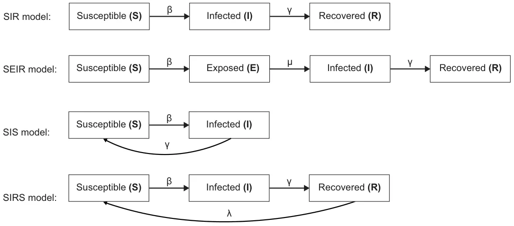
<figcaption>Figure 1: A schematic view of the <em>SIR</em>, <em>SEIR</em>, <em>SIS</em>, and <em>SIRS</em> models.</figcaption>
</figure>

These models can fit and predict the course of a pandemic spread for a short period and specific population, assuming adequate historical data to find the model’s parameters [31, 32]. In the case where the infectious pathogen mutates, these models fail to capture the pandemic spread over time. Consequently, to enhance the model accuracy it is required to incorporate into the model the effect of the pathogen mutations from epidemiological documentation based on population testing. Several models were adjudicated to handle more than one pathogen’s strains. Gubar et al. [33] used a *SIR* model with two strains. The authors assume that each strain has a unique infection and recovery rate and divide the infected group into two sub-groups: infected with no symptoms (asymptomatic) and symptomatic. This model does not take into consideration the similarity between the strains and is limited to only two strains. A *SIRS* model that allows each individual in the population to be infected by one strain and then reinfected by the other was proposed by Gordo et al. [34]. The authors represented the multi-strain dynamic in the population by using a meta-population of individuals. The model proposed by [34] has been validated on the influenza pandemic and is based on the collected influenza strain statistics that were collected between 1993 and 2006. The model provides a better estimation of the pandemic spread compared to other *SIR*-based models [34], but the model complexity, and the dependency on massive collected data, makes it cumbersome to adopt the model to other pandemics with limited collected data. A more recent *SEIR* (E-exposed) model with two strains for the COVID-19 pandemic proposed by Khayar and Allali [35]. The model assumes that infectious from one strain produces immunity to all other strains originated from the same pathogen. The model provides comparable results to the others, and the model was implied their model to examine the effect of the duration between exposed and infectious stages on the epidemiological model predictions. This model is not suitable for mutations that cause high functionality differences between the strain properties, in particular with the infectious property [36]. In a similar manner, Arruda et al. [37] proposed an *SEIR* model with arbitrary number of mutation and reinfection of the same strain dynamics. Fudolig et al. [38] proposed a multi-strain *SIR* based model with selective immunity by vaccination. The authors examined the influence of a new strain introduction is made to emerge in the population when a preexisting strain has reached equilibrium.

Non-model-based methods for the pandemic spread prediction are associated with a small number of assumptions, such as time serious neural networks. One can utilize such methods to deal with complex temporal dynamics with changes over time due to the appearance of mutations and IPs [39]. An ensemble of Recurrent Neural Networks (RNNs) was applied to capture the temporal epidemiological changes caused by the two first waves of the Coronavirus disease (COVID-19) [40]. To adopt the model to different countries while preserving the common nature of the disease they used transfer learning and incorporated to the model country-specific features representing the country-specific governmental constraints. Prediction of COVID-19 mortality based on blood tests with different machine learning models (neural networks, logistic regression, XGBoost, random forests, SVM, and decision trees) was examined in [41]. The XGBoost model, a scalable Tree Boosting System [42], achieved the highest prediction rate with an accuracy of 90 percent as early as 16 days before the outcome. The XGBoost model was also deployed successfully to estimate the number of COVID-19 infection cases overcoming 24 days in every province of South Korea [43]. These time series models achieved fair results but require a long training time and a large number of samples (records), and do not incorporate known medical priors like the one represented by transition probabilities between states based on immune efficiency, and the effect of the different characteristics of each strain.

In this research, we develop a biologically inspired epidemiological model named SIVRI (Suspected-Infected- Vaccinated-Recovered-reInfected). The suggested model supports an unlimited number of pathogen mutations (and as a private case, strains) and also includes the effect of policy intervention during the fitting process. The pathogen modeling characterizes the relation between the mutations, that usually originate from the initial strain, by genetic inspired representation based on recently available genetic data, and a similarity matrix between the strains (based on their mutations). The quantified similarity between the strains affects the infection probability, recovery rate, and recovery probability. Then we build new epidemiological states that incorporate also the effect of different policy interventions like vaccination and lockdown. We further develop in this work an *in silico* tool, allowing researchers to investigate multiple scenarios in a relatively quick, affordable, and controlled manner. We show the feasibility of the suggested model to evaluate the mortality rate and mean basic reproduction number of the COVID-19 pandemic in Israel.

The proposed model allows a more accurate investigation of the epidemiological dynamics by taking into consideration mutation processes of the pandemic with detailed biological dynamics of the infection and reinfection processes. This work has a four-fold contribution: 1) providing a new model with high performance and short convergence time; 2) the model includes support to more than two strains by generalizing the SIRS model to an arbitrary number of mutations originated from an ancestor pathogen; 3) incorporating to the model the effect of IPs like vaccination and lockdown; and 4) providing an *in silico* tool, allowing clinical and epidemiological researchers as well as policymakers to investigate multiple scenarios in a relatively quick, cheap, and controlled manner.

This paper is organized as follows: In Section 2, we provide biological inspiration for the proposed model definition, followed by a formal introduction of the multi-mutation biological-epidemiological model. Afterward, we present a novel method for fitting the proposed model on a reach historical data using an agent-based simulation. In Section 3, we present the implementation of the model for the COVID-19 pandemic in Israel and evaluate the performance of the proposed model. In Section 4, we discuss the main advantages and limitations of the model. In Section 5, we conclude our contribution and propose future work.

## 2 System Model

### 2.1 Biomedical inspiration

A pathogen like a virus or bacteria can be transmitted by interaction with other infected individuals [21]. The infected individual initiates the immune response. First, there is the innate immune response initiate to try to extinct the pathogen, which starts in a few minutes, and does not require recognition of the pathogen [44]. After the innate response, if needed, an adaptive immune response takes place, ranging from days to weeks, for a more continuous and pathogen specific immune reaction [45, 46]. During the attempt of the immune system to overpower the disease and recover, the reaction of the infected individual reflected by different level of symptoms, ranging from no symptoms at all (asymptomatic) up to severe symptoms. When the body can not fully combat the pathogen, it can lead to death, or long term effects after recovery [47].

The adaptive immune system tries to adapt the immune response to the specific pathogen by producing protein components called antibodies (humoral response) and cells like T-cells (cellular response), and then coordinating their reactions to eliminate the pathogen [48, 49]. The adaptive immune system efficiency decreases over time, which resulted by a a decrease in pathogen specific antibodies, and T-cells concentration for instance [50]. In case of reinfection with the same or similar pathogen, the immune system response would have higher efficiency in comparison with the original infection with usually a shorter recovery period. Even a long time after the recovery, the body can sometimes recover by reactivation of the stored immune response from a long-term immune memory associated more with T-cells and B-cells (to reproduce specific antibodies) [51]. This immune memory mechanism can decrease the chances of the individual having severe symptoms in case of reinfection after recovery.

Moreover, in the case of several strain that originated in one pathogen, the similarity between the strains is associated with the mutations and their change to the proteins that build the pathogen’s surface. In particular, a pathogen has several proteins (on its membrane, or in its body) that are encoded by its DNA [52]. The proteins can be divided into segments called epitopes that are the recognizable sections by the adaptive immune system that enable antibodies and T-cells to bind to the pathogen and start a process to eliminate it [53]. A similarity between two pathogen mutations therefore needs to be evaluated in relation to the change it cause to the pathogen epitopes genes and binding properties.

### 2.2 Model formulation

The proposed SIVRI model is represented by a spatial-temporal system. The clinical-epidemiological dynamics of individuals are represented by a temporal set of Ordinary Differential Equations (ODEs). The spatial locations of the individuals are described using a graph-based model. In particular, the model is implemented using an agent-based realization, where each individual in the population is represented by its current location (in the graph) and clinical-epidemiological state, as a timed finite state machine [26]. The model and its states are described in a stochastic manner per individual, where each individual has a separate set of equations [54].

#### 2.2.1 Epidemic dynamics

The model considers a constant initial fixed number of individuals *N*. We assume a pandemic has *M* := *{*1*, . . . , m}* different strains, where [2*, . . . m*] are strains with mutation indices (a change in the pathogen DNA sequence) originated from ”ancestor” single pathogen, m=1. Each individual can be at any given time, at one epidemiological state *p ∈* R8M+1. The states can be divided into five clinical matching categories: susceptible, infected, recovered, reinfected, and deceased. In the first (susceptible) category, there is one *i*-susceptible state, which includes uninfected individuals from any pathogen mutation or ones that are unvaccinated *i*. The second group of infected consists of two states: *i*-infected and *i*-severely-infected, where *i*-infected are both symptomatic and asymptomatic individuals that infected by the *i* mutation and *i*-severely-infected are only individuals with severe symptomatic that are likely to be hospitalized for life-saving medical care in intensive care units (ICU) for medical care. Additional epidemiological state in the infected group is a product of policy intervention of vaccination and is named the vaccinated state. The vaccinated state is part of the infected group since an individual that was to the pathogen is likely to develop protection against the pathogen like infected individuals. Though there might be side effects to the vaccine, we assume in this work that vaccinated individuals are asymptomatic-like. In the third (recovered) category, there are two states: *i*-short-recovered and *i*-long-recovered. The *i*-short-recovered state stands for the initial period of an individual’s recovery when the immune efficiency is high, usually as measured by antibody tests (serology testing). The *i*-long-recovered state where the immune efficiency declines over time, like the decrease in the antibody count after a few months from recovery or vaccination. The *i*-long-recovered state is only after the *i*-long-recovered, where the individual has a decline in his immune efficiency. However, has long memory immune system. We assume that only from *i*-long-recovered state the individual can be reinfected. The fourth category (reinfected) has two states: *i*-reinfected and *i*-severely-reinfected, where *i*-reinfected include symptomatic and asymptomatic individuals were reinfected by the *i* strain and *i*-severely-reinfected are symptomatic individuals that arrive at the ICU for intensive medical care treatment in the second or later infection. In the fifth (deceased) category there is only the state, which indicates individuals who died due to the disease.

Due to the similarity between the different pathogen strains (each with its unique difference in its mutations), the infection and recovery probabilities (both short and long term), and infection rate differ. Therefore, for a strain *i*, with a baseline infection probability of *β*i, and individual recovery history within *j ∈ P* (*M*) (the power group of the group of strains), the personalized infection probability *B*i is as follows:

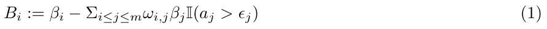

where *ω*i,j is the similarity coefficient between the strain *i* and *j* based on the number of significant mutations (mutations that change the binding properties of the pathogen’s strains epitopes), *a*j is the *j*′*th* strain antibodies (and/or T-cell) concentration in the body, *ϵ*j is the *j*′*th* antibodies (and/or T-cell) threshold that we assume satisfies high immunity efficiency, and I(*x*) is the indication function that return 1 if the condition *x* is fulfilled and 0 otherwise. The condition states that the *j*′*th* mutation pathogen from the historical record is dominant enough, having adequate concentration of antibodies (and/or T-cells), to contribute to the immunity efficiency and to decrease the infection probability. In case the condition is not fulfilled, then the immune efficiency declines, and the individual move from short-term to long-term immunity immunity state. Since the overall set of pathogen mutations are assumed to have a pairwise disjoint sets of biological marker, then the infection probability satisfy the probability constraints and 0 *≤ B*i.

Similarly, an individual recover from the *i*-infected with a rate Γi where the baseline recovery rate if the *i* strain is *γ*i, such that

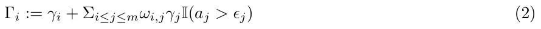

Γi representing a rate, and non feasible negative values of rate, Γi *<* 0, are set to zero, Γi = 0.

In the same sense, an individual recover from *i*-reinfection with mutation *i* at a rate Λi where the baseline reinfection recovery rate of the *i* mutation is *λ*i, such that

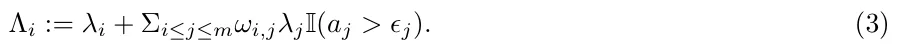

Likewise, Λi is defined for 0 *≤* Λi.

To formally define the duration of the transformation between short-term and long-term recovery, we use the exponential decay in the antibodies (and/or T-cell) with a threshold value of *ϵ*i that differ for each mutation, as follows:

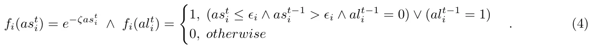

The threshold value *ϵ*i and antibodies (and/or T-cell) decrease value *ζ*i can be set based on clinical medical priors, or experimentally found by fitting the model on historical data.

We define a system characterized by nine model equations related to the 8*M* + 1 possible epidemiological states. In Eq. (5), dSi(t) is the dynamical amount of individuals that are susceptible to the mutation *i ∈ M dt* over time. It is affected by the amount of individuals that currently infected with mutation *i* in ether stage of infections in a probability *B*i.

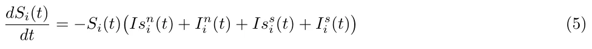

In Eq. (6), dIsn i (t) is the dynamical amount of non-severely infected by mutation *i ∈ M* individuals over *dt* time. It is affected by the following four terms. 1) Susceptible individuals that are infected by any *i*-infected individual is becoming infected in probability *B*i. 2) Individuals recover at a rate Γi. 3) Individuals become severely infected at a rate Φs i. 4) Individuals that are severely infected recover at a rate Φn i , becoming non-severely infected again.

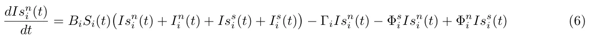

In Eq. (7), dIss i (t) is the dynamical amount of severely infected by mutation *i ∈ M* individuals over time, *dt* affected by the terms: 1) individuals become severely infected at a rate Φs i from non-severely infected; 2) individuals that are severely infected recover at a rate Φn i , become non-severely infected; and 3) individuals that are severely infected die at a rate Φd i .

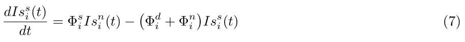

*dR*s i (*t*) In Eq. (8), is the dynamical amount of short-term recovered individuals from mutation *i ∈ M dt* over time, affected by the terms: 1) non-severely infected individuals recover at a rate Γi, move to short-term recovered state; 2) non-severely reinfected individuals recover at a rate Λi move to short-term recovered again; and 3) short-term recovered individuals become long-term recovered individuals at a rate *k*i:

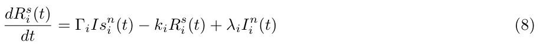

where *k*i is the time when the immunity move from short term to long term. Formally, it is defined as

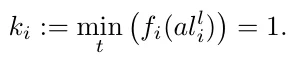

In Eq. (9), dRl i(t) is the dynamical amount of long-term individuals recovered from mutation *i ∈ M* over *dt* time, and affected by the terms: 1) short-term recovered individuals become long-term recovered individuals at a rate *k*i; and 2) long-term recovered individuals are reinfected in mutation *i* with a probability *B*i by any individual that infected by mutation *i*.

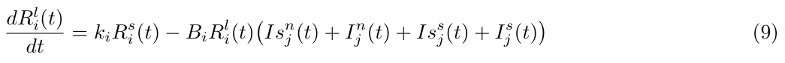

In Eq. (10), dIn i (t) is the dynamical amount of non-severely reinfected by mutation *i ∈ M* individuals over *dt* time. It is affected by the terms: 1) long-term recovered individuals who are infected by any of the *i*-infected individuals become non-severely reinfected in probability *B*i; 2) individuals recover at a rate Λi; 3) individuals become severely reinfected at a rate Ψs i; and 4) severely reinfected individuals recover at a rate Ψn i and become non-severely reinfected again.

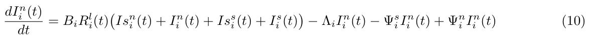

In Eq. (11), dIs i (t) is the dynamical amount of severely reinfected by mutation *i ∈ M* individuals over time, *dt* and is affected by the terms: 1) non-severely reinfected individuals become severely reinfected at a rate Ψs i; 2) individuals that are severely reinfected recover at a rate Ψn i , becoming non-severely reinfected again; and 3) severely reinfected individuals die at a rate Ψd i .

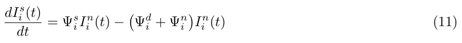

In Eq. (12), dDi(t) is the dynamical amount of deceased individuals over time due to mutation *i ∈ M*, and is *dt* affected by the number of deceased individuals from the severely infected and severely reinfected state at rates Φd i and Ψd i , respectively.

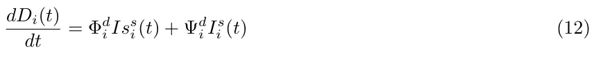

The dynamics of Eqs. (5-12) can be summarized in Eq. (13) for each mutation *i ∈ M* = [1*, . . . m*] as follows:

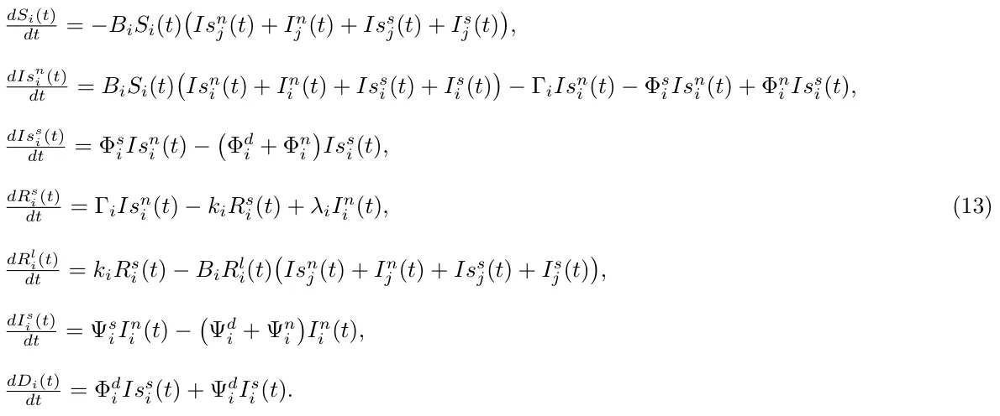

The initial conditions of Eq. (13) defined for the beginning of a pandemic as follows:

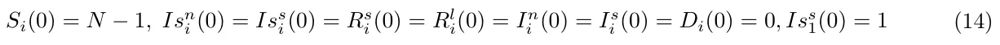

A schematic transition between epidemic states of an individual is shown in Fig. 2.

<figure id="fig-2">
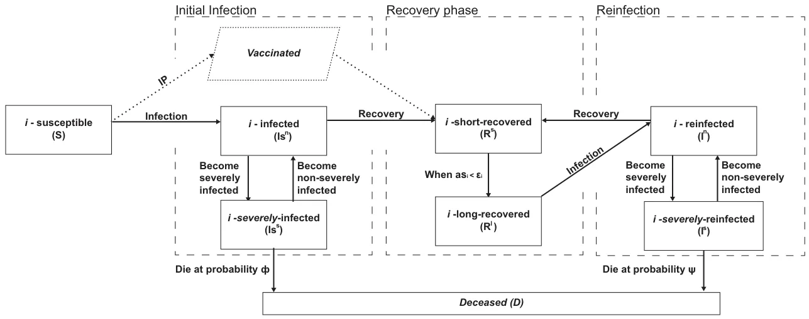
<figcaption>Figure 2: A schematic view of an individual’s transformation between epidemiological states for a single pathogen (<em>i</em>’th) variant. Each individual is represented by a separate agent. The population dynamics in a pandemic, with multiple pathogen’s variants, can be predicted by aggregation of all agents’ behavior (multi-agent model), each with his immune efficiency to previous infection (cross immunity) or vaccination.</figcaption>
</figure>

#### 2.2.2 Interaction dynamics

The social model is a graph-based model *G* := (*V, L ⊂ V × V* ) where *V* is a set of nodes, which represents locations and *L* is the set of edges, which represents the connections between these locations. Each individual in the population is assigned to one node *v*j *∈ V* in an undirected, connected graph *G*. Each agent has a separate clock (since individuals are represented by timed finite state machine based agents) where at each point in time they either stay in the same node (location) at a probability *α*, or move to one of the neighbor nodes (e.g., *{v*k *∈ V |* (*v*j*, v*k) *∈ L}*) with probability 1 *− α*. We assume the transition between the nodes is immediate. At a fixed rate, the epidemiological dynamics are executed simultaneously overall graph’s nodes. Individuals that are located in the same node *v*j *∈ V* can interact in a pair-wise manner and therefore can infect each other.

#### 2.2.3 Agent-based representation

The proposed model can be numerically solved using the agent-based technique [54]. An individual is defined by a tuple *p* = (*µ, l, τ*) where *µ* is the epidemiological state of the individual, *l* is the current individual’s location (corresponding to the node’s index), and *τ* is an inner clock counting the time pass from the last change in the epidemiological state. The epidemiological individual state changes based on the model equations (see Eq. (13)). To extend the model from a single agent representing an individual to a population, the parameters, and the probabilities can represent the mean value of the population. Then, for each time step, based on a synchronized clock, the population moves on the graph according to some policy.

### 2.3 Model Fitting

The proposed model epidemiological prediction quality depends on the model parameters fitting procedure and on the size, diversity, and accuracy of the historical data used to train the model.

#### 2.3.1 Inaccuracies in the sampled data

The sampling of the population statistic through epidemiological testing and medical data evaluation is biased, which can induce errors in the model. One example is the definition for *severe cases* that can differ between populations (states) and in some times its medical criterion can slightly change over time [55, 56]. Another example is the determination of the death cause, in particular when the deceased individual had other background diseases besides being positive for the pathogen [57, 58]. In addition to the non accurate medical data, the epidemiological data is commonly under-sampled in comparison with the real data [59, 60]. For example, less active sampling during the weekend compared to the rest of the week. In addition to the medical accuracy This article has been accepted for publication in a future issue of this journal, but has not been fully edited. Content may change prior to final publication. Citation information: DOI 10.1109/ACCESS.2022.3149956, IEEE Access of the samples and the inaccuracies in the sampling procedure, there is the effect on data of the epidemiological actions to decrease the pandemic spread taken by the policymakers like the government [61, 62]. For example, a government can force a lockdown for some period [63] or vaccinate a portion of its population [64, 65, 66]. These interventions are complex nonlinear processes that affect and alter the course of the natural pandemic spread and make the fitting more complex.

#### 2.3.2 Model fitting assumptions

In this work, the model-fitting has been performed using the official published historical data by the WHO and neglects the effect of under-sampling [67]. This is because the accuracy improvement of the measured medical data is not in the scope of this work. Still, We assume that the goodness of fit of the suggested model will be the same with more accurate data. In addition, due to the important effect of the policy intervention, we do incorporate the intervention policies data in addition to the epidemiological data to the suggested fitting model, the policy interventions. Consequently, to fit the proposed model we suggest the following types of data:

- Epidemiological data: the daily number of infected, recovered, and deceased individuals. In addition, new mutation introduction dates.
- Clinical data: the daily number of new ICU cases, representing the severely (re)infected individuals.
- Intervention policies data: binary values indicates if a lockdown is taking place and the daily number of fully (two doses and up to six months from the second dose) vaccinated individuals.
- Social data: distribution of the populations into settlements and the average traffic between them.

#### 2.3.3 model fitting procedure

Based on this data, one can use the fitting method proposed by [22]. Namely, set the model’s parameter values at random at the beginning. At each iteration of the algorithm, compute the fitness of the simulation using a given metric *d*. Afterward, for each parameter *p* run the simulation for *p ± λ* where *λ >* 0 *∈* R is a local environment coefficient. After computing for all the parameters, one obtains a *x*-dimensional sphere, where *x* is the number of parameters in the model, compute the numerical gradient in the parameter space and perform a learning step using the gradient descent method [68]. Repeat this process until the norm of the gradient of the algorithm is smaller than some pre-defined threshold *ϵ >* 0 *∈* R. Unlike in [22], the fitness function used in the fitting process is defined as follows to take into consideration more historical data:

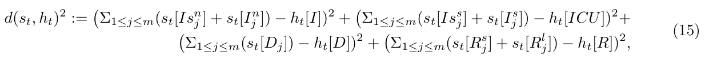

where *s*t is the model’s prediction to the *t*th day and *h*t is the historical record for the same day. In addition *h*t[*I*]*, h*t[*D*]*, h*t[*R*]*,* and *h*t[*ICU*] are the daily number of new infection, deceased, recovered, and hospitalized individuals, respectively. For a period [*t*0*, t*f] where the comparison between the two dynamics takes place, the fitness function takes the form

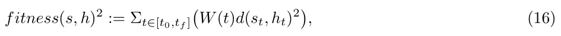

where *W* : N *→* R+ is a weight function such that Σt∈[t0,tf ]*W* (*t*) = 1, *∀t ∈* [*t*0*, t*f] : *W* (*t*) *≥* 0 and if *t*i *> t*j than *w*(*t*i) *> w*(*t*j).

The proposed fitness metric (Eq. (16)) can be improved if more detailed historical data is available. One option, in particular, is assuming the infection data is a classified permutation. In such a case, one would be able to compare the number of infected individuals for each mutation produced in the simulation compared to the historical data.

## 3 Model Evaluation

### 3.1 Evaluation model data

To evaluate the proposed model accuracy we used the COVID-19 virus pandemic in Israel in a period between March 1, 2020, and July 1, 2021. The data include epidemiological, policy interventions, and medical clinical data and is publicly available. The data was diverse, included in the examined period four major strains (all based on mutations from the original pathogen), and policy intervention and the data collection was according to the international committee standards [69, 70].

The epidemiological data were retrieved from the world health organization (WHO), the social data from google maps1, the clinical data from the Israeli ministry of health 2, and the intervention policies data was manually collected from the Israeli government’s official website’s news3. From WHO, we retrieved the daily number of infected, recovered, and dead individuals out of the assumed population of five million individuals. From google maps, we built our spatial locations model, where each settlement with more than 10*,* 000 individuals (picked manually) are the vertices, and the average daily traffic between two settlements of over 10*,* 000 transformations are the edges. The probability that an individual stays in the same node (*α*) is computed by the portion of transformations originated in the node *v*j *∈ V* divided by the overall population size in the same node. From the Israeli ministry of health, we collected the daily number of new hospitalized individuals in the ICU and the daily number of individuals that are fully vaccinated (obtained both injections of the vaccine). In addition, we obtain the total number of individuals registered in the health system which represents the initial size of the susceptible population. Finally, from the Israeli government’s official website we collected information related to the three lockdowns: the first lockdown took place between March 25, 2020, and April 18, 2021; second lockdown between September 25, 2020, and October 17, 2020; and the third lockdown was between December 27, 2020, and January 5, 2021. In addition, a one-day lockdown took place on April 29, 2020.

Formally, the data is than organized as a table such that each record representing the amount of individuals in the population at each epidemiological state on a daily basis, divided by the infectious mutation if such information is available. In addition, a binary feature indicating if their is a lockdown or not is included.

### 3.2 Model fitting quality

To evaluate the fitting quality we examined three fundamental epidemiological parameters: basic reproduction number, mortality rate, and severe (hospitalized) cases rate. These parameters are fundamental parameters used in epidemiology and are assumed to capture the epidemiological dynamics, including the effect of policy interventions. The basic reproduction number, defined as *R*0(*t*) = *I*(*t*) *−I*(*t −*1) */ R*(*t*) *−R*(*t −*1) , provides an estimation to the average pandemic spread, where *R*0 *>* 1 indicates on continuous outbreak while *R*0 *<* 1 indicates on a decay in the pandemic decay. Policy interventions like lockdowns or vaccinations aim to decrease *R*0(*t*). The mortality rate and the severe cases rate, are both markers of the severity of the pandemic, but also indicate the medical treatment quality and success, which can decrease the mortality and severe cases rate.

The fitting results are shown in Fig. 3. The fitting seems to track well over the real data and capture the dynamics of the main parameters over time, where it seems that the fitting has an averaging the data, and excludes intermediate artifacts, as expected. The fitting has a low mean square error (MSE) of 0*.*024 *±* 0*.*07, 0*.*0008 *±* 0*.*0004, and 0*.*0004 *±* 0*.*0003, for the *R*0, mortality rate, and severe cases rate, respectively.

### 3.3 Model predictions

A prediction of the epidemic spread is essential for policymakers to design their IP (intervention policy) and control the epidemic spread. To evaluate the prediction power of the model and its generalization properties for periods in a range of weeks and months we predict the three epidemiological parameters values that were used for fitting (the basic reproduction number, mortality rate, and severe cases rate) based on fitting on historical data. For this, we trained the model from the start of the pandemic and predicated the values of the parameters for two months between May 2, 2021, and July 1, 2021. The fitting results are shown in Fig. 4c.

The prediction model seems to follow the real-data trends with Pearson correlation of 0*.*918, 0*.*763, and 0*.*802, and mean square error (MSE) of 0*.*043, 0*.*051, and 0*.*033, for the *R*0, mortality rate, and severe cases rate, respectively. For all parameters, the prediction accuracy at the start of the prediction period is higher. This can be explained by the training data capturing more accurately the recent epidemiological statistics at the start of the prediction period. The predictions are smoother in the suggested model compared to the real data, as expected from a high-quality statistical fitting process. There is a higher difference and lower correlation of the mortality rate and for the severe cases rate between the predicted and the real data. It can be explained for the mortality rate by instantaneous jumps in death rate, which can be also linked to the limited sample process with a limited number, medical care treatment, and data collection bias. The higher estimation of severe cases and the mortality rate mainly towards the end of the prediction can be explained by better medical care in the months of the testing or the effect of vaccination that was not captured well in the training data and is a topic for further investigation.

<figure id="fig-3">
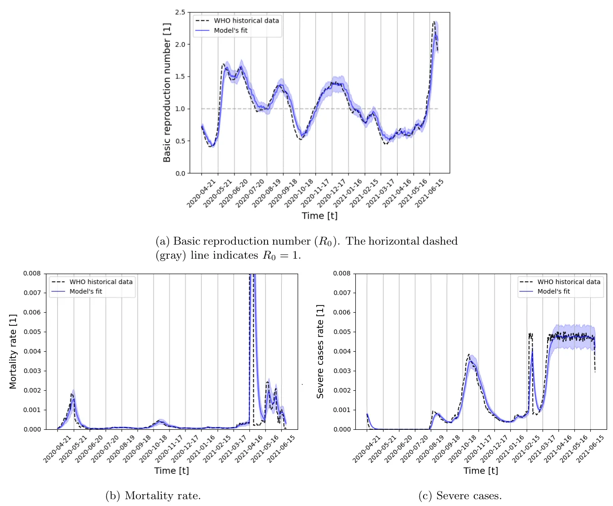
<figcaption>Figure 3: Model’s fitting of three epidemiological parameters between March 1, 2020, to May 1, 2021.</figcaption>
</figure>

### 3.4 Model convergence

A major property to evaluate stochastic model properties is its two main convergence properties: model convergence time of its parameters; and model parameters final residual error.

Figure 5 describes the mean value of the three fitting parameters residuals over 40 iterations. The error residuals were compared to the asymptotic value after 500 iterations. To ensure the asymptotic value we cross-verified it with a two-tailed paired T-test and show the mean of the distribution has a P-value of less than 0.01. The iteration number that ensures that the residual value is less than 0.1 percent from the maximal (0.001, compared to maximum parameters values of 1) was found to be *n* = 37 iterations. The results of the mean value of the parameters are shown in Fig. 5. From these results, we can see that the mortality rate and the *R*0, even converge close to their final value only after 4 iterations, where the severe cases rate, which is a more sensitive parameter that is related to complex model iterations require longer convergence time.

<figure id="fig-4">
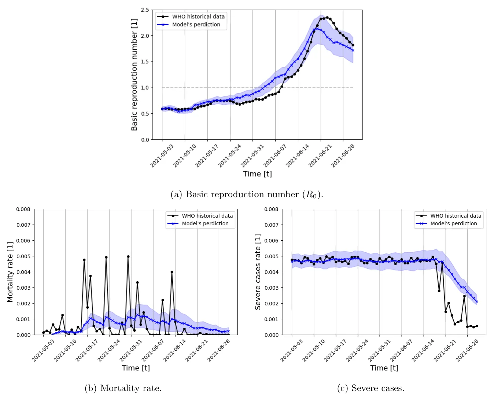
<figcaption>Figure 4: Model’s predictions between May 2, 2021 and July 1, 2021. The parameters are fitted on the data from March 1, 2020, to May 1, 2021.</figcaption>
</figure>

### 3.5 Comparison with other models

To evaluate the performance of the proposed model we compare the model prediction accuracy to the common analytical SIRS model [71], and to the efficient machine learning model, XGboost [42]. The SIRS model was chosen since our proposed model extends it by introducing multi-mutation dynamics and clinical-epidemiological priors. The XGboost model was chosen since epidemiological properties prediction over time is a time series task, and XGboost is state of the art machine learning technique for clinical time-series tasks in general [39, 72], and in epidemiology in particular [73, 43]. The XGboost model is obtained the same data as the proposed model (see Section 3.1) up to a desired date as the training cohort. The model is trained on the data with the k-fold (*k* = 5) cross-validation approach [74] and the hyperparameters are obtained using the grid-search approach [75] such that at each day *t* we predicted the next day *t* + 1 similarly to the proposed model. Afterward, during the testing phase, we query the trained model on the testing cohort, using the latest day of the training cohort as the input of the sequential queries process.

We compare the model’s mean square error for the three epidemiological parameters over one month (30 days), given data of three months (90 days) before. The fitting phase used the WHO [67] data about the daily number of susceptible, infected, recovered, and dead individuals. The proposed model was fitted as described in Section 2.3.3. Then the prediction phase continued the simulation for additional 30 days with a time step of 15 minutes (resulting in 2880 steps in time total). For fare comparison, we choose a test period that was without significant PIs (policy intervention).

<figure id="fig-5">
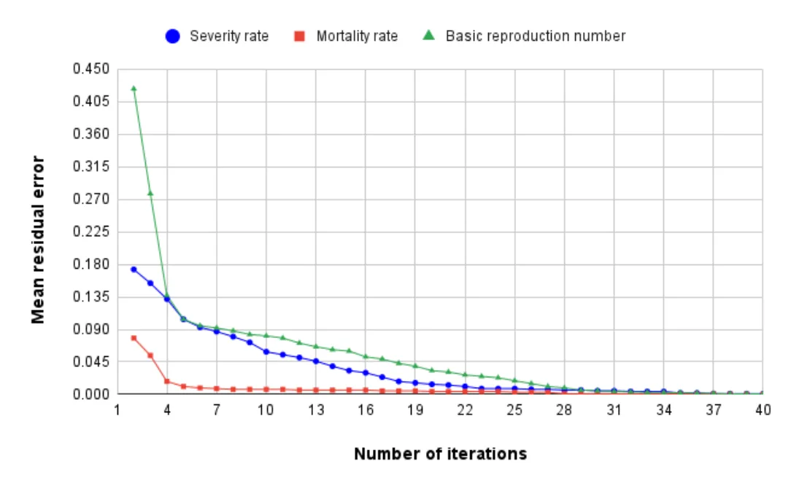
<figcaption>Figure 5: The mean residual error compared compared to asymptotic value for the epidemiological parameters of <em>R</em>0, mortality rate, and severe cases rate.</figcaption>
</figure>

The SIRS model’s model contains three parameters: the average infection rate (*β*), the average recovery rate (*γ*), the average rate which recovered individuals return to the susceptible statue due to loss of immunity (*λ*). During the fitting phase, these values were estimated using the least mean square [76] method, and during the prediction phase, the historical values of the beginning of the month are set as the initial condition and the model is solved using the fourth-order Runge-Kutta algorithm [77]. The XGboost is trained on a four-dimensional feature dataset with the epidemiological data from WHO [67]. The training and prediction phases have been performed using the Python XGboost package4.

The results summary for the prediction of the proposed model in comparison to the other models is shown in Table 1. The proposed model outperforms both the model-based SIRS model which it extends and the more data-based machine-learning model of XGboost on average. The SIRS model did not outperform our model, which approves our model is a modified improved extension for the SIRS model, and for two out of the five periods, the XGboost model slightly outperforms the proposed model.

<figure class="table-figure" id="table-1">
<figcaption>Table 1: The daily prediction error for basic reproduction number (<em>R</em>0) for the proposed SIVRI, SIR data driven based (XGboost) models for 5 different time periods. Bold font indicates the most accurate model for each period</figcaption>

<table><tr><th>Fitting Period</th><th>Mar 2020 - Jun 2020</th><th>Jun 2020 - Oct 2020</th><th>Oct 2020 - Dec 2020</th><th>Dec 2020 - Feb 2021</th><th>Feb 2021 - May 2021</th><th></th></tr><tr><th>Testing period</th><th>Jun 2020</th><th>Oct 2020</th><th>Dec 2020</th><th>Feb 2021</th><th>May 2021</th><th>mean ± std</th></tr><tr><td>Proposed model</td><td>0.68</td><td>0.29</td><td>0.23</td><td>0.09</td><td>0.28</td><td>0.314 ± 0.196</td></tr><tr><td>SIRS model</td><td>0.91</td><td>0.76</td><td>0.31</td><td>0.15</td><td>0.31</td><td>0.488 ± 0.293</td></tr><tr><td>XGboost model</td><td>0.78</td><td>0.38</td><td>0.22</td><td>0.10</td><td>0.27</td><td>0.350 ± 0.233</td></tr></table>

</figure>

Since the SIRS model does not contain severe infected and diseased states, we compare the other two parameters with the XGboost only. The results are given in Tables 2 and 3. As for the (*R*0), our suggested model also outperforms on average the XGboost model. Still, like for the (*R*0), we do see that in some periods the predictions based on the XGboost model are slightly better. This indicates that the pure data approach (with some medical priors), with data-driven features, and higher computations has some advantages over the model-based approach.

<figure class="table-figure" id="table-2">
<figcaption>Table 2: The daily prediction error for morality rate for the SIVRI model in comparison to the XGboost model for 5 different time periods. Bold font indicates the most accurate model for each period.</figcaption>

<table><tr><th>Fitting Period</th><th>Mar 2020 - Jun 2020</th><th>Jun 2020 - Oct 2020</th><th>Oct 2020 - Dec 2020</th><th>Dec 2020 - Feb 2021</th><th>Feb 2021 - May 2021</th><th></th></tr><tr><th>Testing period</th><th>Jun 2020</th><th>Oct 2020</th><th>Dec 2020</th><th>Feb 2021</th><th>May 2021</th><th>mean ± std</th></tr><tr><td>Proposed model</td><td>0.28</td><td>0.35</td><td>0.19</td><td>0.07</td><td>0.11</td><td>0.200 ± 0.103</td></tr><tr><td>XGboost model</td><td>0.39</td><td>0.32</td><td>0.26</td><td>0.14</td><td>0.06</td><td>0.234 ± 0.120</td></tr></table>

</figure>

<figure class="table-figure" id="table-3">
<figcaption>Table 3: The daily prediction error for sevre rate for the SIVRI model in comparison to the XGboost model for 5 different time periods. Bold font indicates the most accurate model for each period.</figcaption>

<table><tr><th>Fitting Period</th><th>Mar 2020 -</th><th>Jun 2020 -</th><th>Oct 2020 -</th><th>Dec 2020 -</th><th>Feb 2021 -</th><th></th></tr><tr><th></th><th>Jun 2020</th><th>Oct 2020</th><th>Dec 2020</th><th>Feb 2021</th><th>May 2021</th><th></th></tr><tr><th>Testing period</th><th>Jun 2020</th><th>Oct 2020</th><th>Dec 2020</th><th>Feb 2021</th><th>May 2021</th><th>mean ± std</th></tr><tr><td>Proposed model</td><td>0.22</td><td>0.17</td><td>0.18</td><td>0.05</td><td>0.06</td><td>0.136 ± 0.068</td></tr><tr><td>XGboost model</td><td>0.33</td><td>0.29</td><td>0.13</td><td>0.14</td><td>0.10</td><td>0.198 ± 0.093</td></tr></table>

</figure>

## 4 Discussion

The proposed SIVRI (Suspected-Infected-Vaccinated-Recovered-reInfected) model developed in this study allows us to better represent and predict pandemic spread dynamics for a long period including changes to the pandemic’s pathogen throughout the mutation process and intervention policies (such as lockdowns and vaccination). The proposed model extends the traditional SIRS model by introducing a deceased group, splitting the infected state into non-severely and severely infected individuals, introducing transformation between short-term and long-term immunity memory states rather than a single recovery state, divide between reinfection and infection for a second time or more via long-term immunity memory, and by introducing spatial dynamics. On top of that, the model takes into consideration an arbitrary number of strains *m* and the similarity between them in the case of the strain mutations being mutated from an ancestor pathogen, as presented in Fig. 2.

Based on the proposed model, we introduced a novel fitting method taking into consideration four types of data: epidemiological, clinical, intervention policies, and social. The fitting process integrated the different information stream signals into one fitting process like in the case of vaccination it reduced the likelihood to be infected, or in case of a lockdown, it freeze the spatial state of an individual represented by an agent. This flexibility of the model enables more flexibility to the model to correspond to temporal changes like pathogen mutations or vaccinations that can alter the pandemic course as shown in Section 2.3.3.

The proposed model predication was tested on the data from the COVID-19 outbreak in Israel, using the historical data from March 1, 2020, to May 1, 2021 (14 months), as shown in Fig. 3. The fitting phase used the WHO [67] data about the daily number of susceptible, infected, recovered, and dead individuals. In addition, the data about the number of vaccinated and lockdowns in Israel from the Israeli ministry of health are taken into consideration as well. The proposed model was fitted as described in Section 2.3.3, obtaining a MSE of 0*.*024 *±* 0*.*07, 0*.*0008 *±* 0*.*0004, and 0*.*0004 *±* 0*.*0003 for the basic reproduction number (*R*0), mortality rate, and severe cases rate, respectively.

Furthermore, we showed that the model prediction for the fundamental epidemiological parameters of the basic reproduction number (*R*0), mortality rate, and severe cases between May 2, 2021, and July 1, 2021, obtained a daily MSE of 0.043, 0.051, 0.033, respectively, as shown in Figs. (4a-4c). Moreover, we presented that the model parameters converge to their steady-state value with an error of fewer than 0.1 percent for all the three epidemiological parameters in less than 37 iterations of the model, making it relatively stable and applicable in the manner of computation time.

We compare the model’s performance to two state-of-the-art methods for analytical model-based, and machine learning-based: the SIRS, and the XGboost models. The comparison was performed with three epidemiological parameters over one month (30 days), given the data of the previous three months (90 days). The SIRS model did not outperform our model, which approves that our model is a well-defined extension for the SIRS model. For two out of the five periods, the XGboost model slightly outperforms the proposed model, which indicates that the pure data approach, with data-driven features, and higher computations have some advantages over the model-based approach. Of note, the proposed comparison emphasizes the scenario in which models are provided with partial epidemiological data and required to predict for a relatively long (33% of the length of the fitting period) period.

The results indicate that the proposed model can be used as the baseline socio-epidemiological model for further analysis such as pandemic management using non-pharmaceutical and pharmaceutical IPs. Moreover, the fitting process highlights the deep connection between the pandemic dynamics and government-driven IPs when one is aiming to analyze historical epidemiological data and predict the course of a pandemic, as already proposed by a large number of models [78, 79, 80, 81].

## 5 Conclusion and future work

The proposed SIVRI model is a theoretical platform that has a potential to assist policymakers in the decision-making process by providing predictions on the effect of different policy interventions on the pandemic spread.

We plan the following future work: 1) include in the model and in the immune system efficacy more accurate information related to the mutation structure similar to the one used in [34]; 2) incorporate into the model more policy interventions to make the model reflect better the pandemic dynamics and have more accurate model’s parameters (like a building-level interaction model as proposed by [82]); 3) add an expose and not infected states; 4)use correction model to compensate for testing inaccuracies; 5) take into account the differences of the immune response between the antibodies and T-cell; and and 6)include the effect of re-vaccination; These future directions can represent better the real pandemic dynamics and further improve the SICRI model prediction quality.

## Declarations

### Funding

This research did not receive any specific grant from funding agencies in the public, commercial, or not-for-profit sectors.

### Conflicts of interest/Competing interests

The authors have no relevant financial or non-financial interests to disclose.

### Data availability

All the data used in this research is available online, the sources are cited in the text.

### Code availability

The code is available via written request from the authors.

### Author Contributions

Conceptualization, data gathering, formal analysis and investigation, coding, manuscript preparation, were performed by Teddy Lazebnik; Conceptualization, Formal analysis, investigation and manuscript preparation were performed by Gaddi Blumrosen.

### Acknowledgements

The authors would like to thank Svetlana Bunimovich-Mendrazitsky for the thoughtful discussions on the mathematical modelling.

## Notes

1https://www.google.com/maps

2https://data.gov.il/dataset/covid-19

3https://www.gov.il/en/

4The original code can be found at https://github.com/dmlc/xgboost

## References

1. A. A. Conti. “Historical and methodological highlights of quarantine measures: from ancient plague epidemics to current coronavirus disease (COVID-19) pandemic”. In: Acta bio-medica : Atenei Parmensis 91.2 (2020), pp. 226–229.
2. H-F. Huo, Q. Yang, and H. Xiang. “Dynamics of an edge-based SEIR model for sexually transmitted diseases”. In: Mathematical Biosciences and Engineering 17 (2019), pp. 669–699.
3. X. Wang, Z. Wang, and H. Shen. “Dynamical analysis of a discrete-time SIS epidemic model on complex networks”. In: Applied Mathematics Letters 94 (2019), pp. 292–299.
4. I. Cooper, A. Mondal, and C. G. Antonopoulos. “A SIR model assumption for the spread of COVID-19 in different communities”. In: Chaos, Solitons Fractals 139 (2020), p. 110057.
5. C. Pan, B. Cheung, S. Tan, C. Li, L. Li, S. Liu, and S. Jiang. “Genomic Signature and Mutation Trend Analysis of Pandemic (H1N1) 2009 Influenza A Virus”. In: Plos One (2010).
6. N. D. Grubaugh, M. E. Petrone, and E. C. Holmes. “We shouldn’t worry when a virus mutates during disease outbreaks Nathan D. Grubaugh, Mary E. Petron”. In: Nature Microbiology 5 (2020), pp. 529–530.
7. S. P. Laynearnold, S. Montoand, and J. K. Taubenberger. “Pandemic Influenza: An Inconvenient Mutation”. In: Science 323.5921 (2009), pp. 1560–1561.
8. B. T. Grenfell, O. G. Pybus, J. R. Gog, J. L. Wood, J. M. Daly, J. A. Mumford, and E. C. Holmes. “Unifying the epidemiological and evolutionary dynamics of pathogens”. In: Science 303.5656 (2004), pp. 327–332.
9. D. J. Wilson, D. Falush, and G. McVean. “Germs, genomes and genealogies”. In: Trends in Ecology Evolution 20.39-45 (2005).
10. P. R. A. Campos and I. Gordo. “Pathogen genetic variation in small-world host contact structures”. In: Journal of Statistical Mechanics-Theory and Experiment (2006).
11. I. Gordo and P. R. A. Campos. “Patterns of genetic variation in populations of infectious agents”. In: BMC Evolutionary Biology (2007).
12. T. Lazebnik and S. Bunimovich-Mendrazitsky. “The signature features of COVID-19 pandemic in a hybrid mathematical model - implications for optimal work-school lockdown policy”. In: advanced theory and simulations (2021).
13. T. L. Drake, Z. Chalabi, and R. Coker. “Cost-effectiveness analysis of pandemic influenza preparedness: what’s missing?” In: Bulletin of the World Health Organization 90 (2012), pp. 940–941.
14. L. Nesteruk. “Statistics-based Predictions of Coronavirus Epidemic Spreading in Mainland China”. In: Innov Biosyst Bioeng 8 (2020), pp. 13–18.
15. T. Lazebnik, N. Aaroni, and S. Bunimovich-Mendrazitsky. “PDE based geometry model for BCG immunotherapy of bladder cancer”. In: Biosystems 200 (2021).
16. W. O. Kermack and A. G. McKendrick. “A contribution to the mathematical theory of epidemics”. In: Proceedings of the Royal Society 115 (1927), pp. 700–721.
17. M. Agarwal and A. S. Bhadauria. “Modeling Spread of Polio with the Role of Vaccination”. In: Applications and Applied Mathematics 6 (2 2011), pp. 552–571.
18. S. Bunimovich-Mendrazitsky and L. Stone. “Modeling polio as a disease of development”. In: Journal of Theoretical Biology 237 (2005), pp. 302–315.
19. H. Weiss. “The SIR model and the Foundations of Public Health”. In: Materials Matem\`atics (2013), pp. 1–17.
20. M.G. Gomes, L. J. White, and G. F. Medley. “Infection, reinfection, and vaccination under suboptimal immune protection: epidemiological perspectives”. In: Journal Theoretical Biology 228 (2004), pp. 539– 549.
21. F. Libi, S. Weiguo, L. Wei, and L. Siuming. “Simulation of emotional contagion using modified SIR model: A cellular automaton approach”. In: Physica A: Statistical Mechanics and its Applications 405.1 (2014), pp. 380–391.
22. T. Lazebnik, L. Shami, and S. Bunimovich-Mendrazitsky. “Spatio-Temporal Influence of Non-Pharmaceutical Interventions Policies on Pandemic Dynamics and the Economy: The Case of COVID-19”. In: Economic Research-Ekonomska Istrazivanja (2021).
23. M. Bognanni, D. Hanley, D. Kolliner, and K. Mitman. “Economics and Epidemics: Evidence from an Estimated Spatial Econ-SIR Model PDF Logo”. In: Institute of Labor Economics (2020).
24. S. Towers, K. Vogt Geisse, Y. Zheng, and Z. Feng. “Antiviral treatment for pandemic influenza: Assessing potential repercussions using a seasonally forced SIR model”. In: Journal of Theoretical Biology 289 (2011), pp. 259–268.
25. C. Kamp, M. Heiden, O. Henseler, and R. Seitz. “Management of blood supplies during an influenza pandemic”. In: Transfusion 50 (2010), pp. 231–239.
26. T. Lazebnik, S. Bunimovich-Mendrazitsky, and L. Shami. “Pandemic management by a spatio–temporal mathematical model”. In: International Journal of Nonlinear Sciences and Numerical Simulation (2021).
27. T. Lazebnik, S. Bunimovich-Mendrazitsky, and L. Shaikhet. “Novel Method to Analytically Obtain the Asymptotic Stable Equilibria States of Extended SIR-type Epidemiological Models”. In: Symmetry (2021).
28. L. J. S. Allen. “Some discrete-time SI, SIR, and SIS epidemic models”. In: Mathematical Biosciences 124.1 (1994), pp. 83–105.
29. S. He, Y. Peng, and K. Sun. “SEIR modeling of the COVID-19 and its dynamics”. In: Nonlinear Dynamics (2020), pp. 1667–1680.
30. S. Mwalili, M. Kimathi, V. Ojiambo, D. Gathungu, and R. Mbogo. “SEIR model for COVID-19 dynamics incorporating the environment and social distancing”. In: BMC Research Notes 13 (2020), p. 352.
31. S. Moein, N. Nickaeen, A. Roointan, N. Bohani, Z. Heidary, S. H. Javanmard, J. Ghaisari, and Y. Gheisari. “Inefficiency of SIR models in forecasting COVID-19 epidemic: a case study of Isfahan”. In: Scientific Reports 11 (2021), p. 4725.
32. G. Chowell, L. Sattenspiel, S. Bansal, and C. Viboud. “Mathematical models to characterize early epidemic growth: A review”. In: Physics of Life Reviews 18 (2016), pp. 66–97.
33. E. Gubar, V. Taynitskiy, and Q. Zhu. “Optimal Control of Heterogeneous Mutating Viruses”. In: Games 9.4 (2018), p. 103.
34. I. Gordo, M. G. M. Gomes, D. G. Reis, and P. R. A. Campos. “Genetic Diversity in the SIR Model of Pathogen Evolution”. In: Plos One 4.3 (2009), e4876.
35. O. Khyar and K. Allali. “Global dynamics of a multi-strain SEIR epidemic model with general incidence rates: application to COVID-19 pandemic”. In: Nonlinear Dynamics 102 (2020), pp. 489–509.
36. Y. Abdullahi, S. Qureshi, I. Mustafa, I. A. Aliyu, B. Dumitru, and A. S. Asif. “Two-strain epidemic model involving fractional derivative with Mittag-Leffler kernel”. In: Chaos 28 (2018).
37. E. F. Arruda, S. S. Das, C. M. Dias, and D. H. Pastore. “Modelling and optimal control of multi strain epidemics, with application to COVID-19”. In: PLOS ONE 16.9 (2021), pp. 1–18.
38. M. Fudolig and R. Howard. “The local stability of a modified multi-strain SIR model for emerging viral strains”. In: PLOS ONE 15.12 (2020), e0243408.
39. M. Alim, G-H. Ye, P. Guan, D-S. Huang, B-S. Zhou, and W. Wu. “Comparison of ARIMA model and XGBoost model for prediction of human brucellosis in mainland China: a time-series study”. In: BMJ Open 10.12 (2020).
40. L. R. Kolozsvári, T. Bérczes, A. Hajdu, R. Gesztelyi, A. Tiba, I. Varga, and J. Zsuga. “Predicting the epidemic curve of the coronavirus (SARS-CoV-2) disease (COVID-19) using artificial intelligence: An application on the first and second waves”. In: Informatics in Medicine Unlocked (2021).
41. A. Karthikeyan, A. Garg, P. K. Vinod, and U. D. Priyakumar. “Machine learning based clinical decision support system for early COVID-19 mortality prediction”. In: Frontiers in public health, 9 (2021).
42. C. Tianqi and G. Carlos. “XGBoost: A Scalable Tree Boosting System”. In: Proceedings of the 22nd ACM SIGKDD International Conference on Knowledge Discovery and Data Mining. Association for Computing Machinery, 2016, pp. 785–794.
43. Y. Suzuki, A. Suzuki, S. Nakamura, T. Ishikawa, and A. Kinoshita. “Machine learning model estimating number of COVID-19 infection cases over coming 24 days in every province of South Korea (XGBoost and MultiOutputRegressor)”. In: medRxiv (2020).
44. A. Casadevall. “Passive Antibody Administration (Immediate Immunity) as a Specific Defense Against Biological Weapons”. In: Emerg Infect Dis (2002).
45. S. S. Chaves, G. Fischer, J. Groeger, P. R. Patel, N. D. Thompson, E. H. Teshale, K. Stevenson, V. M. Yano, G. L. Armstrong, T. Samandari, S. Kamili, and D. J. Drobeniuc J. Hu. “Persistence of long-term immunity to hepatitis B among adolescents immunized at birth”. In: Vaccine 30.9 (2012), pp. 1644–1649.
46. E. Papachristodoulou, L. Kakoullis, K. Parperis, and G. Panos. “Long-term and herd immunity against SARS-CoV-2: implications from current and past knowledge”. In: Pathogens and Disease 78 (2020).
47. M. Koblischke, M.T. Traugott, I. Medits, F.S. Spitzer, A. Zoufaly, L. Weseslindtner, C. Simonitsch, T. Seitz, W. Hoepler, E. Puchhammer-Stöckl, S.W. Aberle, M. Födinger, A. Bergthaler, M. Kundi, F.X. Heinz, K. Stiasny, and J.H. Aberle. “Dynamics of CD4 T cell and antibody responses in COVID-19 patients with different disease severity”. In: Frontiers in medicine (2020).
48. R. J. Cox and K. A. Brokstad. “Not just antibodies: B cells and T cells mediate immunity to COVID-19”. In: Nature Reviews Immunology 20 (2020), pp. 581–582.
49. D. A. Winer, S. Winder, L. Shen, P. P. Wadia, J. Yantha, G. Paltser, H. Tsui, P. Wu, M. G. Davidson, M. N. Alonso, H. X. Leong, A. Glassford, M. Caimol, J. A. Kenkel, T. F. Tedder, T. McLaughlin, D. B. Miklos, H-M. Dosch, and E. G. Engleman. “B-cells promote insulin resistance through modulation of T cells and production of pathogenic IgG antibodies”. In: Nature Medicine 17 (2011), pp. 610–617.
50. M. Hellerstein. “What are the roles of antibodies versus a durable, high quality T-cell response in protective immunity against SARS-CoV-2?” In: Vaccine (2020).
51. A. Grifoni, S. I. Weiskopf D. Ramirez, J. Mateus, J. M. Dan, C. R. Moderbacher, and A. Sette. “Targets of T cell responses to SARS-CoV-2 coronavirus in humans with COVID-19 disease and unexposed individuals”. In: Cell (2020).
52. M. Shen, Y. Zhou, J. Ye, A. A. A. Al-Maskri, Y. Kang, S. Zeng, and S. Cai. “Recent advances and perspectives of nucleic acid detection for coronavirus”. In: Journal of pharmaceutical analysis (2020).
53. S. Mukherjee, D. Tworowski, R. Detroja, S. B. Mukherjee, and M. Frenkel-Morgenstern. “Immunoinfor-matics and structural analysis for identification of immunodominant epitopes in SARS-CoV-2 as potential vaccine targets”. In: Vaccines (2020).
54. C. M. Macal. “To agent-based simulation from System Dynamics”. In: Proceedings of the 2010 Winter Simulation Conference. 2010, pp. 371–382.
55. M. Ou, J. Zhu, P. Ji, H. Li, Z. Zhong, B. Li, J. Pang, J. Zhang, and X. Zheng. “Risk factors of severe cases with COVID-19: a meta-analysis”. In: Nature Medicine (2020).
56. P. Weiss and D. R. Murdoch. “Clinical course and mortality risk of severe COVID-19”. In: The Lancet 395.10229 (2020), pp. 1014–1015.
57. J. W. Zylke and H. Bauchner. “Mortality and Morbidity: The Measure of a Pandemic”. In: JAMA 324.5 (2020), pp. 458–459.
58. G. Chowell, L. Simonsen, J. Flores, M. A. Miller, and C. Viboud. “Death Patterns during the 1918 Influenza Pandemic in Chile”. In: Emerg Infect Dis 20.11 (2014), pp. 1803–1811.
59. K. M. Jagodnik, F. Ray, F. M. Giorgi, and A. Lachmann. “Correcting under-reported COVID-19 case numbers: estimating the true scale of the pandemic”. In: medRxiv (2020).
60. T. Oladunni, S. Tossou, Y. Haile, and A. Kidane. “COVID-19 County Level Severity Classification with Imbalanced Dataset: A NearMiss Under-sampling Approach”. In: medRxiv (2021).
61. O. Aglar, A. Baxter, P. Keskinocak, J. Asplund, and N. Serban. “Homebound by COVID19: The Benets and Consequences of Non-pharmaceutical Intervention Strategies”. In: Research Square (2020).
62. P. Keskinocak, J. Asplund, N. Serban, B. Eylul, and O. Aglar. “Evaluating Scenarios for School Reopening under COVID19”. In: medRxiv (2020).
63. O. Aglar, A. Baxter, P. Keskinocak, J. Asplund, and N. Serban. “Homebound by COVID19: The Benets and Consequences of Non-pharmaceutical Intervention Strategies”. In: Research Square (2020).
64. M. Setbon and J. Raude. “Factors in vaccination intention against the pandemic influenza A/H1N1”. In: European Journal of Public Health 20.5 (2010), pp. 490–494.
65. A. Boretti. “A Higher Number of Covid19 Cases and Fatalities in Israel Phased With the Start of the Mass Vaccination”. In: Health Services Research and Managerial Epidemiology (2021).
66. G. P. Marchildon. “The rollout of the COVID-19 vaccination: what can Canada learn from Israel?” In: Israel Journal of Health Policy Research 10.1 (2021), p. 12.
67. WHO. WHO Coronavirus Disease (COVID-19) Dashboard. (accessed: 08.09.2021). url: https://covid19.who.int/.
68. H. B. Curry. “The method of steepest descent for non-linear minimization problems”. In: Quarterly of Applied Mathematics 2.3 (1944), pp. 258–261.
69. H. Rossman, S. Shilo, T. Meir, M. Gorfine, U. Shalit, and E. Segal. “COVID-19 dynamics after a national immunization program in Israel”. In: Nature Medicine 27 (2021), pp. 1055–1061.
70. H. Rossman, T. Meir, J. Somer, S. Shilo, R. Gutman, A. B. Arie, E. Segal, U. Shalit, and M. Gorfine. “Hospital load and increased COVID-19 related mortality in Israel”. In: Nature Communications 12 (2021), p. 1904.
71. Y. Jin, W. Wang, and S. Xiao. “An SIRS model with a nonlinear incidence rate”. In: Chaos, Solitons Fractals 34.5 (2007).
72. K. Davagdorj, V. H. Pham, M. Theera-Umpon, and K. H. Ryu. “XGBoost-Based Framework for Smoking- Induced Noncommunicable Disease Prediction”. In: Int J Environ Res Public Health 17.18 (2020), p. 6513.
73. C. X. Lv, S. Y. An, B. J. Qiao, and W. Wu. “Time series analysis of hemorrhagic fever with renal syndrome in mainland China by using an XGBoost forecasting model”. In: BMC Infect Dis 21.839 (2021).
74. Ron Kohavi. “A Study of Cross Validation and Bootstrap for Accuracy Estimation and Model Select”. In: International Joint Conference on Artificial Intelligence. 1995.
75. R. Liu, E. Liu, J. Yang, M. Li, and F. Wang. “Optimizing the Hyper-parameters for SVM by Combining Evolution Strategies with a Grid Search”. In: Intelligent Control and Automation 344 (2006).
76. A. Bjorck. “Numerical Methods for Least Squares Problems”. In: Society for Industrial and Applied Mathematics 5 (1996), pp. 497–513.
77. A. R. Yaakub and D. J. Evans. “A fourth order Runge–Kutta RK(4,4) method with error control”. In: International Journal of Computer Mathematics (1996), pp. 383–411.
78. L. Nesteruk. “Statistics-based Predictions of Coronavirus Epidemic Spreading in Mainland China”. In: Innov Biosyst Bioeng 4 (2020), pp. 13–18.
79. B. Ivorra, M. R. Ferrandez, M. Vela-Perez, and A. M. Ramos. “Mathematical modeling of the spread of the coronavirus disease 2019 (COVID-19) taking into account the undetected infections: The case of China”. In: Communications in nonlinear science and numerical simulation 88 (2020), p. 105303.
80. Z. Allam, G. Dey, and D. S. Jones. “Artificial Intelligence (AI) Provided Early Detection of the Coronavirus (COVID-19) in China and Will Influence Future Urban Health Policy Internationally”. In: AI 1 (2020), pp. 156–165.
81. L. Di Domenico, G. Pullano, C. E. Sabbatini, P. Y. Bo Elle, and V. Colizza. “Impact of lockdown on COVID-19 epidemic in Ile-de-France and possible exit strategies”. In: BMC Medicine (2020).
82. T. Lazebnik and A. Alexi. “Comparison of Pandemic Intervention Policies in Several Building Types Using Heterogeneous Population Model”. In: medRxiv (2021).
