## 1 Introduction

There is a growing emergence of systems where people and agents work together [1–3]. These systems, often called Human-Agent Systems or Human-Agent Cooperatives, have moved from theory to reality in many forms, including digital personal assistants, recommendation systems, training and tutoring systems, service robots, chatbots, planning systems, and self-driving cars [4–10]. The ability of human teammates to understand the logic behind the artificial intelligence system (namely, explainability) is important [11]. As a result, eXplainable Artificial Intelligence (XAI) is fast becoming a critical element of these systems.

Feature selection (FS) algorithms reduce the number of features in a system - potentially improving both system performance and explainability. FS was previously shown to improve learning model accuracy, especially when handling complex data inputs with high dimensionality [12–14]. The

#### B Teddy Lazebnik

- t.lazebnik@ucl.ac.uk
- 1 Department of Cancer Biology, University College London, London, UK
- 2 Department of Mathematics, Ariel University, Ariel, Israel
- 3 Department of Computer Science, Jerusalem College of Technology, Jerusalem, Israel

reduced number of inputs also facilitates better XAI as the intended user can potentially better understand the causal relationship between the system’s dependent and independent variables [7, 11, 15].

Many FS algorithms exist, making the task of choosing the best one for a given learning problem a difficult task [16–20]. One possible solution is to use ensembles of FS algorithms [12, 21–25]. However, as we further detail in the next section, current FS and ensemble FS algorithms focus on improving the agent’s accuracy and not explainability [26]. While several works have suggested that a model’s explainability can be enhanced by reducing the resulting model’s size [12, 27], the specific nature of this relationship was not previously formally defined or analyzed [28].

### 1.1 Motivation

The precise way to quantify explainability has only recently begun to be explored. Rosenfeld [7] suggests quantifying elements of the explanation’s input, output, stability, and performance to quantify this value. Following these ideas, the explainability of feature ensembles can be quantified using an explainability metric tied to the ensemble’s size. Similarly, work by Rudin [29] focuses on the number of features used by the agent’s model as the base for quantifying explainability. The key assumption behind these metrics is that a model must have fewer than a certain number of features for it to be explainable as the logical connection between the data input and output cannot be understood if too many features are included. A second approach is to quantify explainability based on the ensemble’s stability. In this approach, explanations can be quantified based on how resilient they are to small differences within the data. In this paper we consider both metrics for explainability and consider performance metrics that are combination of these explainability metrics and predictive accuracy. Specifically, we ran two sets of experiments using the harmonic average between each of the explainability metrics and accuracy across nine canonical datasets. This use of the harmonic mean between two evaluation metrics is similar to how the *F*1*(recall, precision)* := *(*2 ·*recall* · *precision)/(recall* + *precision)* measure balances between recall and precision.

### 1.2 Contribution

This work presents the **O**ptimizing **F**eature **E**nsembles for **E**xplainability (OFEE) algorithm, which contains three main contributions:

- OFEE is the first algorithm that considers explainability as an optimization problem and creates an optimal model given an explainability metric / performance combination.
- OFEE is parameter-free and thus automatically finds the values of the optimal hyperparameters to maximize any potential tradeoff of explainability and performance.
- OFEE obtains better explainability than other basic and ensemble FS algorithms across many canonical datasets.

In order to highlight these contributions, in the next section, we discuss general motivations and potential definitions of XAI, why FS ensembles are useful for XAI, and how ensembles’ explainability can be measured. Second, we present the OFEE algorithm including its complexity and memory consumption analysis. We present the three hyper-parameters in OFEE and present how the algorithm self-tunes these parameters using an iterative process. While this work work considers two specific measures to quantify explainability – ensemble size and stability, OFEE can optimize explainability based on **any** XAI metric and performance. We then evaluate the performance of the OFEE algorithm within nine canonical datasets with highly different feature space characteristics for the two explainability metrics we considered. For the explainability size metric, we found that the OFEE algorithm performed 8% better than the same model without any FS algorithm and better than all the FS algorithms used in the ensemble. It is worthy to stress that all other algorithms in the evaluation, including those contained within OFEE, require the user to set the number of features desired. In contrast, OFEE optimized itself to significantly higher performance levels than all of the FS algorithms that we manually tuned for their relatively best performance. OFEE was even more successful when considering the stability explainability metric, performing 12% better than the same model without any FS algorithm and better than all the FS algorithms used in the ensemble. These extensive results further stress the significance of OFEE’s success. Finally, we discuss the improvements and limitations of OFEE and suggest future directions.

## 2 Related work

### 2.1 Definitions and reasons for XAI

XAI research has focused on creating agent interpretability, transparency, fairness, explicitness, and faithfulness. Rosenfeld and Richardson defined interpretability as focusing on the clarity of the system’s internal logic and explainability as the ability of human users to understand that logic [11]. In contrast, Rudin defined explanation as to the agent’s attempt to explain its logic in a post-hoc fashion without necessarily being tied to the agent’s true decision model, while interpretations are inherently tied to the agent’s logic [29]. Both works agree that the XAI goal is to completely, accurately and clearly quantify the agent’s logic, which refereed to as transparency by Rosenfeld and Richardson [11] and Rudin terms fidelity [29]. To avoid terminology confusion, we will use these terms synonymously as both focus on the same paramount XAI goal.

System explainability can be important for a variety of reasons. First, such systems can enable trust between AI and its users. This element can be more important in repeated interactions, especially after the agent has made a mistake [30]. Second, explainability can lead to better and more general systems. These types of explanations are geared for system designers to help them better apply the agent to new situations or to evaluate and test its safety [31]. A third type of explanation helps facilitate knowledge discovery [32, 33]. The fourth motivation is based on legal needs. As per the EU’s “General Data Protection Regulation" (GDPR), users are legally entitled to obtain “meaningful explanation of the logic involved" of these decisions and additional legislation exists to ensure that automated decisions are not biased against any ethnic or gender groups [31]. While transparent explanations are likely needed to satisfy some XAI goals, less transparent post-hoc models are likely sufficient in other situations [11].

### 2.2 Motivations for using FS and FS ensembles

Using FS has previously been suggested as a significant direction for creating XAI [11]. FS has long been established as an effective to overcome the *curse of dimensionality* by reducing the feature space and creating simpler models [13]. Moreover, reducing the feature space size typically makes the relationship between the dependent and independent variables clearer and thus easier to interpret [34] either before or after building a model [13, 35]. FS algorithms can be used in conjunction with non-transparent models to make them more understandable or in conjunction with transparent “white box” models to help make their logic clear to the intended user.

It is possible to divide the FS algorithmic family into three main groups: filters, wrappers, and embedded. Filter FS algorithms decide which subset of features to choose based on the connection between the inputs independently of any machine learning (ML) algorithm under consideration. Examples include the Mutual Information [16], Anova [17], and Chi2 [18] algorithms. These FS algorithms contain parameters that the user can explicitly use to optimize their performance for each dataset. These parameters are typically to select the best k features (e.g. 20) as per a specific FS algorithm/dataset combination, or all features above a certain feature score (e.g. Mutual Information *>* 0.1). Wrapper FS algorithms use the prediction provided by a specific ML classifier to evaluate feature subsets. One example includes the recursive feature elimination algorithm (RFE) which removes features and checks if the model using the remaining features yields better performance [36]. Embedded algorithms perform FS as a part of the learning process. Examples include decision trees and neural networks which inherently choose which features to use, and/or the weight for each feature, as they construct their learning models [29]. As filter methods are independent of the learning algorithm being used, they seem to hold the most promise for providing general explanations [11]. As a result, this work will focus on using filter algorithms within the presented OFEE ensemble algorithm.

There are several advantages to using ensembles of FS algorithms instead of individual ones. As is the case with ensemble learning in general, advocates for creating ensembles of FS algorithms claim that these approaches yield better performing and more stable models [12, 21, 22]. This is because all individual FS algorithms may produce a subset of features that is a local optimum in the feature space but not a global optimum [37]. Furthermore, ensembles potentially have the power to obviate the need to choose between different FS algorithms as the aggregation mechanism within the ensemble method can match the best algorithm for a given problem without prior evaluation [12, 22, 27]. Not only do ensembles often perform better, but their combination of features from different algorithms lends themselves to output more robust and stable features [26]. Two major ways have been suggested for creating feature ensembles: either through homogeneous ensembles that use the same type of base learner with different bootstraps of data or through heterogeneous ensembles that use different types of base learners trained on the same data [21]. Once candidate features for the ensemble have been established, a method for aggregating the final ensemble must be established: typically either from the intersection or the union of the subsets of candidate features. The union of the subsets has typically been selected as the most popular choice to date as it has been empirically found to typically yield the best results [12]. However, the union aggregation is ill-suited for explainability, as ensembles created by this approach as typically significantly larger than those of any of the basic FS algorithms used.

## 3 The OFEE algorithm

OFEE focuses on creating explainable feature ensembles based on their size. This parameter can be set as either a percentage of the original features (for example only 10% of the original number of features) or as an absolute maximum of features regardless of the original input size. The inputs of the algorithm are the initial feature space and the dependent variables of a particular dataset. As we now detail, the decision of whether to include a feature in the ensemble or not is controlled by three parameters in OFEE: *t*1, *t*2, and *t*3.

While this work focuses on ensemble size and stability as the explainability metrics, the OFEE algorithm can be used to balance other explainability metrics with performance concerns. To do this, OFEE uses three hyperparameters, *t*1*, t*2*, t*3, a dataset (as a matrix), an ML model, and the explainability-performance metric. *t*1 indicates the absolute number of features the algorithm returns, *t*2 indicates the subset of features we are desire to choose in each iteration, and *t*3 indicates the aggregation function according to the occurrence of each feature in each FS algorithm. Therefore, the OFEE algorithm theoretically can produce any feature set. Hence, it is able to optimize any provided metric from FS perspective of producing the subset of features by optimizing the given metric. It follows that the proposed algorithm can be used in a wider scope.

The OFEE algorithm operates using a two-stage process. First, an ensemble FS is constructed using the three hyper-parameters, *t*1*, t*2*, t*3. These parameters are needed to facilitate the optimization of the model’s explainability while minimally negatively impacting its performance (e.g. model accuracy). Second, OFEE self-optimizes the values of the *t*1*, t*2*, t*3 hyperparameters for a given model, dataset, performance, and explainability metric. Formally, we define the search space of the OFEE algorithm as a three-dimensional space *S*. Given a dataset *D*, list of FSA *F*, ML model *M*, and explainability-performance metric *C*, the FS layer in the OFEE algorithm defines a function *E(s* ∈ *S)* → *A* ⊂ *D* such that *C(M(E(t*1*, t*2*, t*3*, D, F)))* = *s*. Therefore, using the optimization layer of the OFEE, the algorithm can be defined as

*E(t*1*, t*2*, t*3*)* such that {t1,t2,t3} *C(M(E(t*1*t*2*, t*3*, D, F))).* (1) max

One can solve the optimization task defined by (1), abbreviating the need to define *t*1*, t*2*, t*3 manually.

Practically, it is possible to implement OFEE using any optimization algorithms such as grid search [38], gradient descent [39] or any other optimization layer. In this paper, we use the grid search algorithm because we are willing to provide the computation time needed in order to obtain a good approximation of the optimum values even for complex functions, as other optimization algorithms may experience converging difficulties, we do not focus on these algorithms in this work.

The OFEE algorithm works as follows. In lines 1–2, the best feature set and the score of this set for a given ML model (*M*) and dataset (*X, Y*) are initialized. In lines 3– 32 the main loop of the algorithm takes place and runs until some optimization condition (*OC*) is met. We considered two different optimization conditions in this work, one that quantifies explainability through feature stability and the second based on feature size. In lines 4–11 the algorithm begins by initializing the sets of the training input and the ranked feature vectors as dictated by the FS algorithm (FSA), *F S*1 *. . . F S*n which are outputted to *R*1 *. . . R*n. *R*1 *. . . R*n are first initialized to *n* empty vectors that will store the scores for each feature and FSA combination. *R*1 *. . . R*n is then assigned with the set of the scores from *F S*1 *. . . F S*n sorted from highest to lowest score value for each algorithm, *a*. In line 12 we initialize *H* which will serve as the output of OFEE in the generated heterogeneous ensemble until the desired subset of features is obtained. In line 13, we set *t*1 to control the number of features we want at the end of the ensemble creation process. Line 14 sets a variable *c* for a local variable for the ranking of one of the algorithms previously defined (line 11). In lines 15–18 we then keep only the top *t*2 features from this list and store the new vector in the same position of *R*1 *. . . R*n as *R*c, where *R*1 *. . . R*c == *R*1 *. . . R*n, but with fewer features. *t*2 controls either the percentage or absolute value of features we wish to cut in every iteration until the size requirement of *H* is satisfied as defined by *t*1 (line 14). Lines 19-24 form a loop that iterates over the *r* features in the ranked vector (line 19). Line 20 presents a third threshold (*t*3) that defines how many times a feature must be chosen within *R*1 *. . . R*n before OFEE retains it within the ensemble. Assuming *t*3 is set to *n*, e.g. the total number of algorithms in *F S*1 *. . . F S*n, then OFEE will use the intersection aggregation method. If *t*3 is set to 1 it will use the union aggregation. Line 21 performs this aggregation, finishing this iteration of the ensemble formation, *H*. In line 25, the obtained features are used as a sub-space of the training data (X,Y) and to then train a model *m* using algorithm *M*. In line 26, the score of the model *ms* is calculated by the explainability-performance metric *C*. In lines 27–30, the algorithm checks if the best feature set’s score on the model (*bs*) is worse than the current one score *ms* and if so, *bs* and *bh* are set to be *ms* and *m*, respectively. Finally, in line 32, the best feature set is returned. A schematic view of how the OFEE algorithm works is shown in Fig. 1. A Python (version 3.7) implementation of the OFEE algorithm is available as free open source at https://github.com/teddy4445/OFEE.

<figure class="table-figure" id="alg-1">
<figcaption><strong>Algorithm 1</strong> The OFEE algorithm.</figcaption>
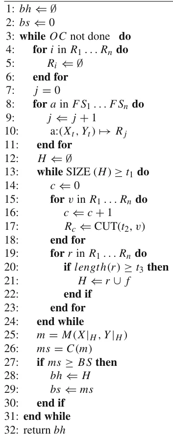

</figure>

The complexity and memory consumption of an algorithm in an ML pipeline is important when implementing OFEE. As current ML datasets are getting larger in size, the asymptotic analysis of the algorithmic behavior becomes more increasingly relevant. As the optimization algorithm/layer is independent of OFEE, we focus our analysis on the feature selection layer instead of the optimization layer as well.

We mark the size of the initial dataset by *(n, m)* as the dimensions of the inputted dataset where *n* is the number of rows and *m* is the number of columns (features). In addition, we assume the complexity and memory consumption of the most expensive FSA algorithm used by the IEI algorithm are *O(F S A*c*)* and *O(F S A*m*)*, respectively. We denote the num-ber of FS algorithms by *k*. In lines 4-12 the algorithm iterates over all the FSA results making the upper bounds of OFEE’s complexity and memory consumption equal to *O(F S A*c*)* and *O(F S A*m*)* respectively. Lines 13-24 repeat *O(log*t2*(m))* times because during the first iteration of the loop there are *m* features while for each progression iteration only *m* · *t*2 remain. Therefore, the number of iteration occurs in lines 13- 24 is bounded by *m* ·*t*α 2 *< t*1 where *α* = *log*t2*(m)*−*log*t2*(t*1*)*. Lines 15-23 are linear to the number of features making the complexity *O(k)*. As a result, the overall complexity of the feature selection layer in the OFEE algorithm is *O(max(k* · *log*t2*(m), F S A*c*))* and the memory consumption is *O(max(nm, FSA*m*))*.

<figure id="fig-1">
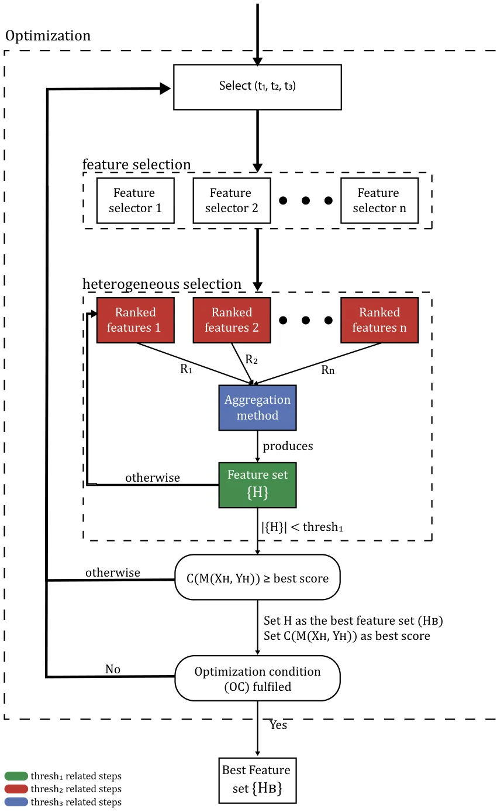
<figcaption><strong>Fig. 1</strong> The OFEE algorithm’s logical flow</figcaption>
</figure>

## 4 Results

To empirically study OFEE’s performance, we evaluated it within nine canonical datasets. In the following section we present two sets of results given the two explainability measures we consider and their impact for various values for *t*1, *t*2, and *t*3.

### 4.1 Experiment setup

We studied nine canonical datasets that have been previously studying in FS and ensemble problems [40–42]. These datasets are: Arcene, Arrhythmia, Dexter, Lsvt-Voice, Madelon, Ovarian, Micro-Mass, Semeion, and Sonar. Table 1 summarizes each of the datasets considered and their main attributes. Of note, we run a Kolmogorov-Smirnov test between each target feature and an uniformly distribution, obtaining that all datasets are balanced with p-value of 0*.*1 or less. The Arcene and Dexter datasets are characterized by feature spaces (column space) that are much bigger than the sample size (row space). Such cases create “the curse of dimensionality” as they increase the computational cost and complexity of classification. Ovarian is a dataset to derive insights into ovarian cancer, particularly in differentiating between benign or malignant cells. The microarray data were derived from hospital laboratory test results. As is the case for the Arcene dataset, this dataset contains much more features (genes) than the samples. One reason for the imbalance is that generating large amounts of genomic data is relatively less expensive than recruiting additional participants in studies. Dexter is a text classification task using a bag-of-word representation. Madelon is an artificial dataset that containing data points grouped in 32 clusters placed on the vertices of a five-dimensional hypercube and randomly labeled. Arrhythmia is a dataset that presents the rhythm change of the human heart from electrocardiogram (ECG) records. LSVT (Lee Silver-man Voice Treatment) is a dataset that predicts Parkinson’s disease using voice recognition. Finally, the sonar dataset is used to classifying sonar signals. The task is to train a network to discriminate between sonar signals that bounce off metal cylinders versus signals that bounce off rocks.

While the OFEE algorithm is general and can be used with any FS algorithms, we focused on using three filter FS algorithms – Chi2 [18], Anova [17], and Mutual information [16] due to their explainability as explained in Section 2.2. Another reason to choose these FS algorithms as the different types of features they are designed for (i.e., numerical and/or categorical) [43].

In order to quantify explainability, we quantified explainability based on a metric proposed by Rudin [29]:

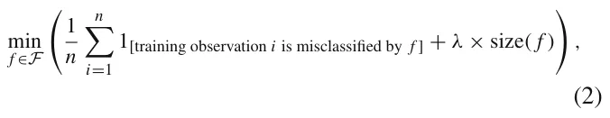

where the training samples are indexed from *i* = 1*, . . . , n,* and *F* is a group of logical models. The size of the model is commonly measured by the number of logical conditions in the model where *λ* is a regularization (weight) parameter between the error of the model and the model’s size. However, since the first term in (2) is a performance metric, it can be removed when creating an explainability metric, yielding:

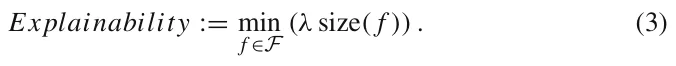

In addition, as the regularization between the error of the model and the model’s size is not of concern in our experiments, we set *λ* = 1. We used the decision tree model since there is a straightforward connections between the number of Boolean rules within the model and (3), and as decision trees are widely shown to be useful in applicable settings [44, 45]. We used accuracy as the performance metric since it is considered to be intuitive for inexpert users [46]. Hence, we define the model’s score to be the harmonic mean of the explainability and performance metrics:

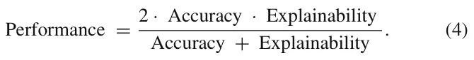

Formally, in the following experiments, OFEE aims to optimize (4) where explainability is defined in (3). Moreover, in order to show the generality of OFEE for any explainability metric, we also considered a stability algorithm within Equation (4). We specifically used the incremental data-stability metric [47] with the intersection over union (IOU) similarity metric [48] to quantify explainability. This measure can be formally defined for a given FS algorithm as a similarity metric between two sets of features (such as the IOU), and a number of folds. In the proposed analysis we used *k* = 5 folds and the dataset is divided into 5 incremental portions. The incremental data-stability metric is defined as the mean similarity between any two feature sets obtained using the FS algorithm and a cumulative sum of the portions of the data.

<figure class="table-figure" id="table-1">
<figcaption><strong>Table 1</strong> The datasets used in the evaluation of the OFEE algorithm</figcaption>

<table><tr><th>dataset</th><th>Domain</th><th># Features</th><th># Samples</th><th># Numerical features</th><th># classes</th></tr><tr><td>Arcene</td><td>Mass Spectrometry</td><td>10000</td><td>900</td><td>7000</td><td>2</td></tr><tr><td>Arrhythmia</td><td>ECG Recordings</td><td>279</td><td>452</td><td>278</td><td>16</td></tr><tr><td>Dexter</td><td>Text Classification</td><td>20000</td><td>2600</td><td>20000</td><td>2</td></tr><tr><td>Lsvt-Voice</td><td>Voice Recognition</td><td>309</td><td>126</td><td>309</td><td>2</td></tr><tr><td>Madelon</td><td>Artificial</td><td>500</td><td>2600</td><td>500</td><td>2</td></tr><tr><td>Ovarian</td><td>Mass Spectrometry</td><td>15154</td><td>253</td><td>15154</td><td>2</td></tr><tr><td>Micro-Mass</td><td>Mass Spectrometry</td><td>1300</td><td>571</td><td>1300</td><td>20</td></tr><tr><td>Semeion</td><td>Writing Recognition</td><td>256</td><td>1593</td><td>256</td><td>10</td></tr><tr><td>Sonar</td><td>Signal processing</td><td>60</td><td>208</td><td>60</td><td>2</td></tr></table>

The class distribution for each dataset is provided in the project’s code repository at GitHub

</figure>

### 4.2 Evaluation

In order to evaluate the OFEE algorithm in respect to the other FS algorithms, one initially needs to obtain the optimal performance of the OFEE algorithm. OFEE’s performance is depended on three hyper-parameters (*t*1*, t*2*, t*3). Thus, we start by examining the influence of these hyper-parameters on the OFEE algorithm within the nine canonical datasets (see Section 4.1) with the hyperparameters *t*1 ∈[10*,* 20*, ...,* 90], *t*2 ∈[0*.*1*,* 0*.*2*, ...,* 0*.*9], and *t*3 ∈[1*,* 2*,* 3]. Recall that *t*3 = 1 indicates that the union aggregator is used as only one FS algorithm needs to selected a given feature before its inclusion in the ensemble, whereas *t*3 = 3 is the intersection function as we considered three FS algorithms. *t*3 = 2 requires that two of the three FS algorithms needed to select a feature before its inclusion in the ensemble. As our goal was to demonstrate the impact of each of the hyperparameters separately and without the self-tuning element of the algorithm, we do not use the optimization layer within this first set of experiments.

Line 3 of Algorithm 1 is implemented using a search process to find the optimal value for the explainability / accuracy combination. In our experiments, we considered two different explainability measures, one based on the ensemble size and the second based on the data-stability of the ensemble. Regardless of the explainability measure selected, OFEE searches for the optimal combination. In our implementation OFEE uses a grid search method as the optimizer algorithm with 90 steps for both thresholds *t*1 and *t*2 where *t*1 ∈[10*,* 100] and *t*2 ∈[0*.*1*,* 0*.*9] (marked as *OFEE Best*) on the datasets (see Section 4.1). Similarly, the mutual information, ANOVA, and Chi2 algorithms which the OFEE is based on in the experiment are calculated on the datasets as well in order to evaluate the performance of the OFEE algorithms in comparison with the algorithms they are based on. For every algorithm in the ensemble, we find the optimal hyperparameters using the grid search method as well to facilitate a fair comparison. We also implemented a random search optimization approach for the OFEE algorithm where 10 (picked manually) DT models were obtained using random values of (*t*1*, t*2*, t*3). This approach used a Monte- Carlo based optimization [49] method in the OFEE algorithm rather than the grid-search method. As a baseline for how effective OFEE’ self-tuning process was, we ran the algorithm with the grid search as the optimization algorithm but optimized for 1 −*score* to obtain the worst-performing features set (marked as *OFEE Worst*). Finally, we computed the baseline decision tree (DT) model to be a DT without any FS algorithm performed before training. We first performed this set of experiments using the ensemble size explainability metric within OFEE and then with the ensemble stability explainability metric. In both cases and within both sets of experiment OFEE was highly successful, as we now detail.

#### 4.2.1 Feature set’s size depended explainability

We first considered the harmonic average (see (4)) between the explainability and the accuracy (the model’s performance) and considered differing values for the three hyper-parameters (*t*1*, t*2*, t*3) as explained above. The results of this experiment are shown in Fig. 2, where the y-axis is the value of *t*1, the x-axis is the value of *t*2 such that the values are average of *t*3 = [1*,* 2*,* 3]. One can notice that in general larger values for *t*2 as well as *t*1 lead to a better score, as can be seen from the positive coefficients of *t*2 and *t*1 in (5).

In order to better understand the influence of *t*1 and *t*2 on the model’s performance, a fitting function was calculated to estimate the influence of *t*1 and *t*2 on the model’s score. The values used for this computation are taken from Fig. 2. Formally, the data shown in Figure 2 is mapped into a three-dimensional array where the first value is *t*1, the second value is *t*2 and the third value is the value shown in the matrix for these values of *(t*1*, t*2*)*. The fitting function is calculated using the least mean square method [50]. In order to use this method, one needs to define the function family (a set of functions, differing by a set of parameters) approximating the desired function. We picked the function family

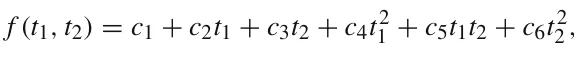

to balance between the accuracy of the sampled data on the one hand and the simplicity of usage on the other hand [51]. The function takes the form:

<figure id="fig-2">
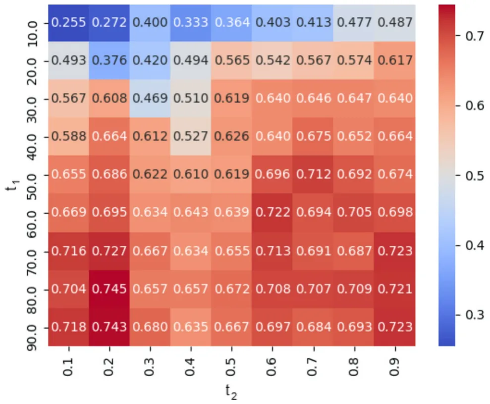
<figcaption><strong>Fig. 2</strong> Heatmap of the average between the explainability and performance metrics where the y-axis is the <em>t</em>1 threshold and x-axis is the <em>t</em>2 threshold such that the values are the average of <em>t</em>3 = [1<em>,</em> 2<em>,</em> 3]. The results are shown as an average of the datasets in Table 1</figcaption>
</figure>

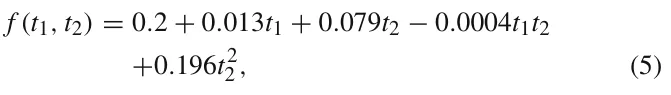

and was obtained with a coefficient of determination *R*2 = 0*.*890. Of note, *R*2 := 1 − *SS*res*/SS*tot where *SS*res is the residual sum of squares and *SS*tot is the total sum of squares. Namely, (5) describes 89%of the variance of the data and provides an analytical approximation to the influence of *t*1 and *t*2 on the model’s score. Therefore, from (5), the *t*2 threshold has 608 times more linear influence on the score compared to *t*1, because *t*1 range between 101 and 102, *t*2 range between 0 and 100 and the coefficient of *t*2 is 6.08 times bigger than the coefficient of *t*1 in Equation (5). In addition *t*2 has ∼ 103 times larger second order influence on the score (as the coefficient of *t*2 2 is 0*.*198 while the coefficient of *t*2 1 is less than 0*.*001). As a result, the *t*2 threshold has significantly more influence on the average explainability-performance score compared to the *t*1 threshold.

These results are shown in Fig. 3 where the x-axis is the model’s score over three metrics. Specificity, the blue (lower) bar indicates the model’s explainability score. The green (upper) bar indicates the model’s accuracy score. The black (middle) bar indicates the average of the explainability-performance, as defined in (4). The values shown are the average across all nine datasets.

The performance of each FS algorithm is dependant on the dataset’s number of features (before FS), the number of samples, domain, and other properties related to the data itself. The average accuracy and explainability metrics of each FS algorithm are shown in Fig. 3. A full breakdown of the accuracy and explainability metrics for each dataset from Table 1 are presented in Table 2.

The *OFEE best* model obtained the best score (0.75) which is 12% improvement over the baseline DT model (0.63). Unsurprisingly, the *OFEE worst* model achieved an average score of 0*.*36 which is the worst of all eight models. This shows that the OFEE algorithm indeed optimizes the average explainability-performance score to the given dataset. In all cases, note that the accuracy of all models (in green) is typically higher than the explainability metric based on ensemble size (in blue). The models’ scores (in grey) are the harmonic mean of these two values. Note that in all cases the OFEE algorithm *OFEE best* outperforms all FS algorithms it uses by an average of 8% for all three categories, demonstrating its success.

<figure id="fig-3">
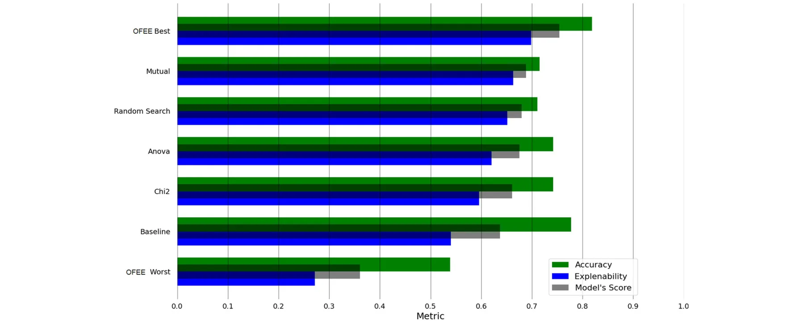
<figcaption><strong>Fig. 3</strong> The mean explainability, accuracy, and harmonic mean of the explainability metric based on size for nine datasets datasets for OFEE compared to other FS algorithms</figcaption>
</figure>

<figure class="table-figure" id="table-2">
<figcaption><strong>Table 2</strong> The explainability and accuracy of each FS algorithm (with DT model) (see Fig. 3) over the nine datasets in Table 1</figcaption>

<table><tr><th></th><th>OFEE Best</th><th>Mutual</th><th>Anova</th><th>Random Search</th><th>Chi2</th><th>Baseline</th></tr><tr><td>Arcene</td><td>0.80/0.76</td><td>0.60 / 0.22</td><td>0.60 / 1.00</td><td>0.65 / 0.31</td><td>0.6 / 0.83</td><td>0.75 / 0.00</td></tr><tr><td>Arrhythmia</td><td>0.72 / 0.42</td><td>0.68 / 0.38</td><td>0.69 / 0.35</td><td>0.64 / 0.41</td><td>0.61 / 0.21</td><td>0.69/0.68</td></tr><tr><td>Dexter</td><td>0.91/0.93</td><td>0.77 / 1.00</td><td>0.90 / 0.58</td><td>0.85 / 0.50</td><td>0.85 / 0.56</td><td>0.85 / 0.36</td></tr><tr><td>Lsvt-Voice</td><td>0.83/1.00</td><td>0.61 / 0.75</td><td>0.71 / 0.25</td><td>0.72 / 0.74</td><td>0.72 / 1.00</td><td>0.74 / 0.00</td></tr><tr><td>Madelom</td><td>0.81 / 0.50</td><td>0.71 / 0.51</td><td>0.80 / 0.51</td><td>0.75 / 0.91</td><td>0.81 / 0.50</td><td>0.72/0.96</td></tr><tr><td>Ovarian</td><td>0.95/1.00</td><td>0.99 / 0.33</td><td>0.99 / 0.33</td><td>0.96 / 0.65</td><td>0.99 / 0.33</td><td>0.96 / 0.33</td></tr><tr><td>Micro-Mass</td><td>0.75 / 0.57</td><td>0.66/0.71</td><td>0.73 / 0.54</td><td>0.55 / 0.52</td><td>0.68 / 0.43</td><td>0.77 / 0.60</td></tr><tr><td>Semeion</td><td>0.76/1.00</td><td>0.72 / 0.96</td><td>0.72 / 0.91</td><td>0.58 / 0.69</td><td>0.66 / 0.85</td><td>0.73 / 0.80</td></tr><tr><td>Sonar</td><td>0.76 / 0.63</td><td>0.68/0.93</td><td>0.54 / 1.00</td><td>0.66 / 0.64</td><td>0.72 / 0.64</td><td>0.75 / 0.50</td></tr></table>

The results are shown as <em>e/a</em> where <em>e</em> is the normalized explainability metric and <em>a</em> is the accuracy metric. The bold text indicated the best-performing algorithm for each dataset according to the harmonic mean metric between <em>a</em> and <em>e</em>

</figure>

#### 4.2.2 OFEE experiments using stability to quantify explainability

We repeated all of the above experiments for the case when OFEE optimized for explainability based on stability instead of size. No other modifications were performed to the OFEE algorithm. The success of the results below stress that OFEE can optimize for any explainability metric, as we now detail.

In order to evaluate the influence of different values of [*t*1*, t*2*, t*3], we again ran the OFEE algorithm upon the nine datasets (see Section 4.1), without using the optimization layer in the same ranges as presented in Section 4.2. The harmonic average (see (4)) between the explainability and the accuracy of each case is shown in Fig. 4, where the y-axis is the value of *t*1, the x-axis is the value of *t*2 such that the values are average of *t*3 = [1*,* 2*,* 3]. A fitting function over Fig. 4 now takes the form:

<figure id="fig-4">
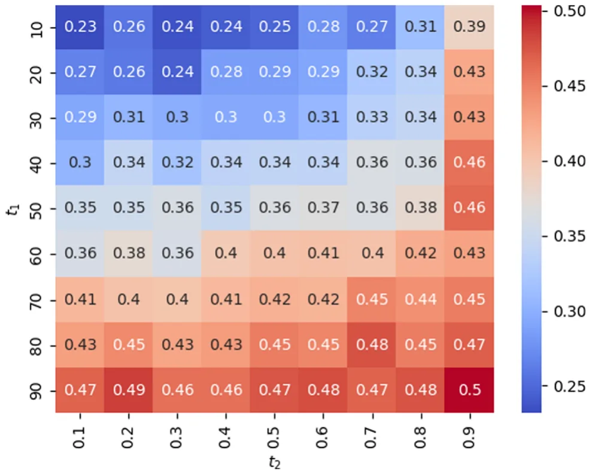
<figcaption><strong>Fig. 4</strong> Heatmap of the average between the data-stability and accuracy metrics where the y-axis is the <em>t</em>1 threshold and x-axis is the <em>t</em>2 threshold such that the values are the average of <em>t</em>3 = [1<em>,</em> 2<em>,</em> 3]. The results are shown as an average of the datasets in Table 1</figcaption>
</figure>

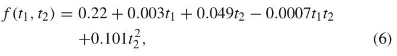

and was obtained with a coefficient of determination *R*2 = 0*.*821.

Next, we repeated the model’s performance evaluation on the nine datasets. The results are shown in Fig. 5 where the x-axis is the model’s score over three metrics. Specificity, the blue (lower) bar indicates the model’s data-stability (explainability) score. The green (upper) bar indicates the model’s accuracy (performance) score. The black (middle) bar indicates the average of the explainability-performance, as defined in (4). The values shown are the average across all nine datasets. OFEE is able to outperform the FS algorithms used as part of the algorithm on average by 7*.*1 percent. Furthermore, the *OFEE best* performed 19*.*2 percent better than the baseline.

The results in Fig. 5 are parallel to those within Fig. 3 but for the new explainability metric. Similarly, a breakdown of the model’s score for the first set of experiments is presented in Table 3. For this analysis, we used the datasets presented in Table 1.

#### 4.2.3 Meta-learning of OFEE performance

Following the previous results, one might notice that OFEE is outperforming the FS algorithms that construct it most of the time but not always. This raises the question of is there are properties of the dataset or learning model that can predict when OFEE is outperforming the FS algorithms that constructing it. In order to tackle this challenge, we used a meta-learning approach. First, we represent each dataset using a 20-dimensional vector [52]. Afterward, we computed the performance of each FS (OFEE, Mutual, Anova, Random Search, Chi2) on the dataset with one of three machine learning models: decision tree, support vector machine (SVM) [53], and Lasso [54]. Hence, we obtained a dataset of 27 samples and 22 features. Using this dataset, we trained a decision tree model with a maximum depth of three and cross-entropy as the splitting condition, aiming to predict if OFEE would perform better compared to the other FS algorithms using the remaining properties. The obtained model achieves an accuracy of 0.77 when trained on the entire dataset and 0*.*703 ± 0*.*048 with K-fold cross-validation with *k* = 5. As such, the model is somewhat able to predict if OFEE would perform better compared to the other FS algorithm. Thus, we computed the feature importance of the obtained meta decision tree model, obtaining that the learning algorithm used has 32% importance. The remaining 68% are divided between the other features such that the number of classes is the second largest with 4.6%. Based on these results, we fitted an SVM model with linear kernel on the data in order to obtain an equation that best separates between the two categories. We obtained that in general, OFEE better performs on mostly numerical datasets (i.e., most of the features are numerical) with small number of classes. More interestingly, OFEE outperform the FS algorithms that construct it when the average pearson value between the source and target feature in the dataset is small.

<figure id="fig-5">
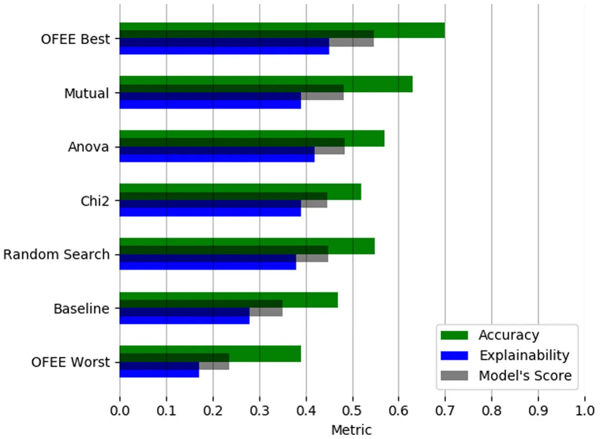
<figcaption><strong>Fig. 5</strong> The mean explainability, accuracy, and harmonic mean of the explainability metric based on stability for nine datasets datasets for OFEE compared to other FS algorithms</figcaption>
</figure>

## 5 Conclusions and future work

In this paper, we introduce the OFEE algorithm which provides several significant contributions to construct XAI through feature ensembles. As OFEE is designed to explicitly considers an explainability metric as part of the process in building its ensemble, which yields better explainability. The intersection of features from several FS algorithms within OFEE is able to better find features thus reducing the number of required features in the ensemble. The result is a more explainable model while not significantly compromising on model accuracy, as shown in Fig. 3. In contrast to the simple feature selection algorithms OFEE is based upon, it is hyperparameter-free, eliminating any need for the user to set any values within the ML pipeline. Nonetheless, as shown in Fig. 3, OFEE on average performs better results than other FS algorithms, even after considering the optimal tuning for those algorithms.

<figure class="table-figure" id="table-3">
<figcaption><strong>Table 3</strong> The data-stability (as explainability metric) and accuracy of each FS algorithm (with DT model) over the nine datasets in Table 1</figcaption>

<table><tr><th></th><th>OFEE Best</th><th>Mutual</th><th>Anova</th><th>Random Search</th><th>Chi2</th><th>Baseline</th></tr><tr><td>Arcene</td><td>0.39 / 0.72</td><td>0.60 / 0.46</td><td>0.34 / 1.00</td><td>0.44 / 0.35</td><td>0.40/0.83</td><td>0.36 / 0.00</td></tr><tr><td>Arrhythmia</td><td>0.88/0.40</td><td>0.69 / 0.38</td><td>0.93 / 0.37</td><td>0.76 / 0.31</td><td>0.89 / 0.21</td><td>0.27 / 0.68</td></tr><tr><td>Dexter</td><td>0.34/0.88</td><td>0.26 / 1.00</td><td>0.35 / 0.58</td><td>0.29 / 0.44</td><td>0.27 / 0.56</td><td>0.22 / 0.36</td></tr><tr><td>Lsvt-Voice</td><td>0.28 / 1.00</td><td>0.32/0.75</td><td>0.44 / 0.25</td><td>0.18 / 0.67</td><td>0.24 / 1.00</td><td>0.27 / 0.00</td></tr><tr><td>Madelom</td><td>0.78/0.50</td><td>0.65 / 0.51</td><td>0.60 / 0.51</td><td>0.71 / 0.45</td><td>0.46 / 0.50</td><td>0.37 / 0.96</td></tr><tr><td>Ovarian</td><td>0.13/0.92</td><td>0.08 / 0.63</td><td>0.11 / 0.52</td><td>0.11 / 0.63</td><td>0.09 / 0.63</td><td>0.11 / 0.33</td></tr><tr><td>Micro-Mass</td><td>0.37 / 0.52</td><td>0.30 / 0.71</td><td>0.34 / 0.54</td><td>0.32 / 0.54</td><td>0.49/0.43</td><td>0.60 / 0.28</td></tr><tr><td>Semeion</td><td>0.45/0.82</td><td>0.37 / 0.96</td><td>0.39 / 0.91</td><td>0.36 / 0.71</td><td>0.36 / 0.85</td><td>0.30 / 0.80</td></tr><tr><td>Sonar</td><td>0.41/0.55</td><td>0.25 / 0.93</td><td>0.28 / 1.00</td><td>0.31 / 0.61</td><td>0.27 / 0.64</td><td>0.33 / 0.50</td></tr></table>

The results are shown as <em>e/a</em> where <em>e</em> is the normalized data-stability metric and <em>a</em> is the accuracy metric. Bold text indicated the best performing algorithm for each dataset according to the harmonic mean metric between <em>a</em> and <em>e</em>

</figure>

Another advantage of the OFEE algorithm is that the integrated optimization layer can be used as a black box. In this work we used the grid search method, allowing us to obtain a global optimal result for the cost despite the relatively high cost of this method. If desired, other less costly optimization methods such as the gradient descent optimization algorithm [39] can be used instead as per the needs of any future dataset being considered. However, we avoid this method in this work as it may converge to a local optimum rather than to the global optimum as shown in Fig. 2. We evaluated the Monte-Carlo optimization approach in Section 4.2.2 using the random search approach, showing that even for a small number of iterations (10) outperforms the Chi2 FS algorithm.

We evaluated the OFEE algorithm using the harmonic average (see (4)) between the model’s accuracy and two explainability metrics – Rudin’s [29] ensemble size metric [29] and the intersection over union (IOU) stability metric [48]. In theory, other combinations between accuracy and explainability could be considered, including simpler metrics such as simple average between the model’s accuracy and explainability, or more complex combinations than the harmonic mean. The OFEE does not depend on the metric it receives and these can be replaced according to the user’s wish without modifying the algorithm yet obtain significantly better results as presented in Section 4.2.

Moreover, one can take advantage of the OFEE algorithm to optimize for either performance or explainability. However, using only one of the metrics loses the uniqueness of the proposed approach as the optimization process may result in extreme and undesirable results. For example, optimizing only for Rudin’s [29] explainability metric, feature input size, will always output only the one best-performing feature in each dataset. It is clear that such an outcome will often not produce the best-performing model. At the other extreme, optimizing for performance alone will yield an ensemble optimized for performance, but not explainability. Additionally, while we optimized for explainability based on the number of inputted features based on previous suggestions [7, 29, 55], other explainability metrics exist and as the optimization process within OFEE is general, it can be applied to other explainability metrics as well.

While OFEE on average outperformed all other FS algorithms by a significant margin, we noted that the degree of its success was dependent on the specific dataset considered. For future work, one can study which dataset characteristics can best predict these differences in OFEE. Similarly, while we present results from decision tree classifiers, we did consider other ML algorithms and noted that OFEE overall did perform better than other methods there as well. Nonetheless, we did note that the ML algorithm did at times impact the degree of OFEE’s success. Consequently, we are also considering what dataset/ML combinations best predict OFEE’s success. Based on these results, researchers are encouraged to create new algorithms that optimize based on dataset features and machine learners as well.

**Acknowledgements** The authors wish to thank Roni Reznik for his valuable help in the algorithm’s implementation and experiments running.

**Author Contributions Teddy Lazebnik:** Methodology, Software, Formal analysis, Investigation, Writing - Original Draft, Writing - Review & Editing, Visualization. **Svetlana Bunimovich-Mendrazitsk:** Conceptualization, Writing - Review & Editing, Supervision, Project administration. **Avi Rosenfeld:** Conceptualization, Validation, Investigation, Writing - Review & Editing, Supervision.

**Funding** The authors have no financial or proprietary interests in any material discussed in this article.

**Data Availability** The data used for this work is publicly available and hosted in the project’s GitHub repository https://github.com/teddy4445/OFEE/tree/main/Datasets.

### Declarations

**Competing Interests** The authors did not receive support from any organization for the submitted work.

**Ethical standard** The data used in this study does not require informed consent or ethical approval as the data is open accessed and generated by others.

## References

1. Amir O, Gal K (2013) Plan recognition and visualization in exploratory learning environments. ACM Transactions on Interactive Intelligent Systems (TiiS) 3(3):16
2. Azaria A, Rabinovich Z, Goldman CV, Kraus S (2015) Strategic information disclosure to people with multiple alternatives. ACM Transactions on Intelligent Systems and Technology (TIST) 5(4):64
3. Barrett S, Rosenfeld A, Kraus S, Stone P (2017) Making friends on the fly: Cooperating with new teammates. Artificial Intelligence 242:132–171
4. Richardson A, Rosenfeld A (2018) A survey of interpretability and explainability in human-agent systems. XAI 2018, 137
5. Jennings NR, Moreau L, Nicholson D, Ramchurn S, Roberts S, Rodden T, Rogers A (2014) Human-agent collectives. Communications of the ACM 57(12):80–88
6. Keren LS, Liberzon A, Lazebnik T (2023) A computational framework for physics-informed symbolic regression with straightforward integration of domain knowledge. Scientific Reports 13:1249
7. Rosenfeld A (2021) Better metrics for evaluating explainable artificial intelligence. In: AAMAS ’21: 20th international conference on autonomous agents and multiagent systems, ACM, pp 45–50
8. Xiao B, Benbasat I (2007) E-commerce product recommendation agents: use, characteristics, and impact. MIS quarterly 31(1):137– 209
9. Savchenko E, Lazebnik T (2023) Computer aided functional style identification and correction in modern Russian texts. Journal of Data, Information and Management 4:25–32
10. Lazebnik T, Bahouth Z, Bunimovich-Mendrazitsky S, Halachmi S (2022) Predicting acute kidney injury following open partial nephrectomy treatment using sat-pruned explainable machine learning model. BMC Med Inform Decis Mak 22:133
11. Rosenfeld A, Richardson A (2019) Explainability in human-agent systems. Auton Agent Multi-Agent Syst 33(6):673–705
12. Bolón-Canedo V, Alonso-Betanzos A (2019) Ensembles for feature selection: a review and future trends. Inf Fusion 52:1–12
13. Guyon I, Elisseeff A (2003) An introduction to variable and feature selection. J Mach Learn Res 3(Mar):1157–1182
14. Liu H, Motoda H, Setiono R, Zhao Z (2010) Feature selection: An ever evolving frontier in data mining. In: Feature selection in data mining, PMLR, pp 4–13
15. Linardatos P, Papastefanopoulos V, Kotsiantis S (2021) Explainable ai: a review of machine learning interpretability methods. Entropy 23(1):18
16. Viola P, Wells WM III (1997) Alignment by maximization of mutual information. Int J Comput Vis 24(2):137–154
17. Hoaglin DC, Welsch RE (1978) The hat matrix in regression and anova. Am Stat 32(1):17–22
18. Plackett RL (1983) Karl pearson and the chi-squared test. Int Stat Rev/Revue Int Stat 59–72
19. Xue Y, Tang Y, Xu X, Liang J, Neri F (2021) Multi-objective feature selection with missing data in classification. IEEE Trans Emerg Top Comput Intell
20. Song X, Zhang Y, Guo Y, Sun X (2020) Variable-size cooperative coevolutionary particle swarm optimization for feature selection on high-dimensional data. IEEE Trans Evol Comput 24(5):882–895
21. Ben Brahim A, Limam M (2018) Ensemble feature selection for high dimensional data: a new method and a comparative study. Adv Data Anal Classif 12(4):937–952
22. Saeys Y, Abeel T, Van de Peer Y (2008) Robust feature selection using ensemble feature selection techniques. In: Daelemans W, Goethals B, Morik K (eds) Machine learning and knowledge discovery in databases, Berlin, Heidelberg, 2008. Springer, Berlin Heidelberg, pp 313–325
23. Chen K, Xue B, Zhang M, Zhou F (2021) Correlation-guided updating strategy for feature selection in classification with surrogate-assisted particle swarm optimisation. IEEE Trans Evol Comput
24. Netzer M, Millonig G, Osl M, Pfeifer B, Praun S, Villinger J, Vogel W, Baumgartner C (2009) A new ensemble-based algorithm for identifying breath gas marker candidates in liver disease using ion molecule reaction mass spectrometry. Bioinformatics 25(7):941– 947
25. Osl M, Dreiseitl S, Cerqueira F, Netzer M, Pfeifer B, Baumgartner C (2009) Demoting redundant features to improve the discriminatory ability in cancer data. J Biomed Inform 42(4):721–725
26. Saeys Y, Abeel T, Van de Peer Y (2008) Robust feature selection using ensemble feature selection techniques. In: Joint european conference on machine learning and knowledge discovery in databases, Springer, pp 313–325
27. Mallipeddi R, Suganthan PN (2010) Differential evolution with ensemble of constraint handling techniques for solving cec 2010 benchmark problems. In: IEEE congress on evolutionary computation, IEEE, pp 1–8
28. Lipton ZC (2018) The mythos of model interpretability: in machine learning, the concept of interpretability is both important and slippery. Queue 16(3):31–57
29. Rudin C (2019) Stop explaining black box machine learning models for high stakes decisions and use interpretable models instead. Nat Mach Intell 1(5):206–215
30. Chen JY, Procci K, Boyce M, Wright J, Garcia A, Barnes M (2014) Situation awareness-based agent transparency. Technical report, Army Research Lab Aberdeen Proving Ground MD Human Research and Engineering Directorate
31. Guidotti R, Monreale A, Ruggieri S, Turini F, Giannotti F, Pedreschi D (2018) A survey of methods for explaining black box models. ACM Comput Surv 51(5):93:1–93:42
32. Sørmo F, Cassens J (2004) Explanation goals in case-based reasoning. In: Proceedings of the ECCBR 2004 workshops number 142-04, pp 165–174
33. Sørmo F, Cassens J, Aamodt A (2005) Explanation in case-based reasoning-perspectives and goals. Artif Intell Rev 24(2):109–143
34. Kononenko I (1999) Explaining classifications for individual instances. In: Proceedings of IJCAI’99. Citeseer
35. Hall MA, Holmes G (2003) Benchmarking attribute selection techniques for discrete class data mining. IEEE Trans Knowl Data Eng 15(3):1437–1447
36. Duan K-B, Rajapakse JC, Wang H, Azuaje F (2005) Multiple svm-rfe for gene selection in cancer classification with expression data. IEEE Trans Nanobioscience 4(3):228–234
37. Wolpert DH, Macready WG (1997) No free lunch theorems for optimization. IEEE Trans Evol Comput 67
38. Liu R, Liu E, Yang J, Li M, Wang F (2006) Optimizing the hyper-parameters for svm by combining evolution strategies with a grid search. Intell Control Autom 344
39. Haskell BC (1944) The method of steepest descent for non-linear minimization problems. Quart Appl Math 2:258–261
40. Bolón-Canedo V, Sánchez-Marono N (2014) Alonso-Betanzos A (2014) Data classification using an ensemble of filters. Neurocom-puting 135:13–20
41. Pes B (2019) Ensemble feature selection for high-dimensional data: a stability analysis across multiple domains. Neural Comput & Applic pp 1–23
42. Seijo-Pardo B, Porto-Díaz I, Bolón-Canedo V, Alonso-Betanzos A (2017) Ensemble feature selection: homogeneous and heterogeneous approaches. Knowl-Based Syst 118:124–139
43. Moreno-Sanchez PA (2021) An automated feature selection and classification pipeline to improve explainability of clinical prediction models. In: 2021 IEEE 9th international conference on healthcare informatics (ICHI), pp 527–534
44. Swain PH, Hauska H (1977) The decision tree classifier: design and potential. IEEE Trans Geosci Electron 15(3):142–147
45. Stiglic G, Kocbek S, Pernek I, Kokol P (2012) Comprehensive decision tree models in bioinformatics. Plos One 7(3):e33812
46. Sanchez D, Batet M, Martinez S, Domingo-Ferrer J (2015) Semantic variance: an intuitive measure for ontology accuracy evaluation. Eng Appl Artif Intell 39:89–99
47. Khaire UM, Dhanalakshmi R (2019) Stability of feature selection algorithm: a review. J King Saud Univ Comput Inform Sci
48. Rezatofighi H, Tsoi N, Gwak K, Sageghain A, Reid I, Savarese S (2019) Generalized intersection over union: a metric and a loss for bounding box regression. roceedings of the IEEE/CVF Conference on Computer Vision and Pattern Recognition
49. Kudelic R (2016) Monte-carlo randomized algorithm for minimal feedback arc set problem. Appl Soft Comput 41:235–246
50. Bjorck A (1996) Numerical methods for least squares problems. J Soc Ind Appl Math Mathmatic 5:497–513
51. Shanock LR, Baran BE, Gentry WA, Pattison SC, Heggestad ED (2010) Polynomial regression with response surface analysis: a powerful approach for examining moderation and overcoming limitations of difference scores. J Bus Psychol 25:543–554
52. Lazebnik T, Rosenfeld A (2023) FSPL: filter and embedding feature selection pipeline meta learning. Int J Appl Math Comput Sci
53. Neumann J, Schnorr C, Steidl G (2005) Combined svm-based feature selection and classification. Mach Learn 61:129–150
54. Muthukrishnan R, Rohini R (2016) Lasso: a feature selection technique in predictive modeling for machine learning. In: 2016 IEEE international conference on advances in computer applications (ICACA), pp 18–20
55. Lazebnik T, Bunimovich-Mendrazitsky S (2023) Decision tree post-pruning without loss of accuracy using the SAT-PP algorithm with an empirical evaluation on oncology data. Data Knowl Eng 102173
