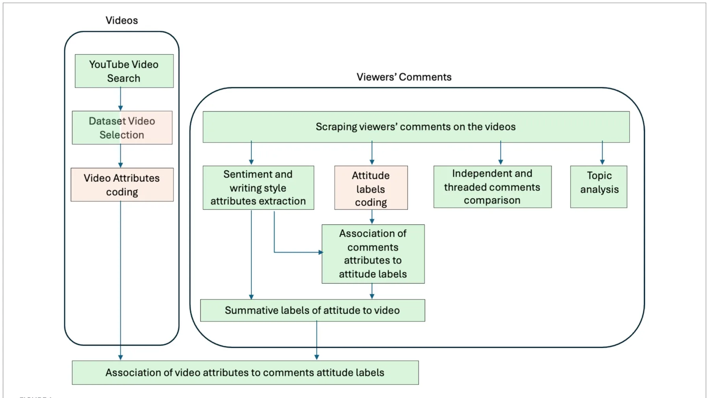
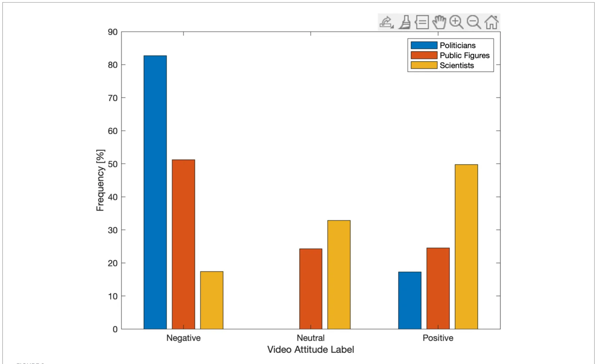
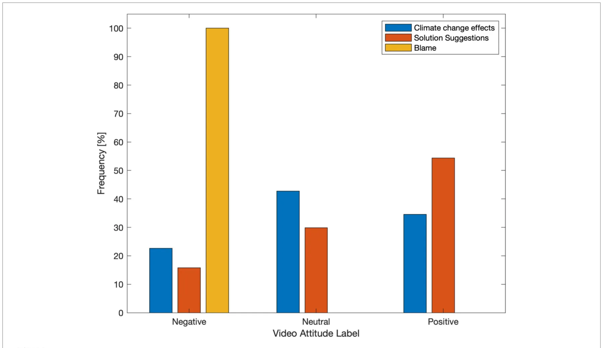
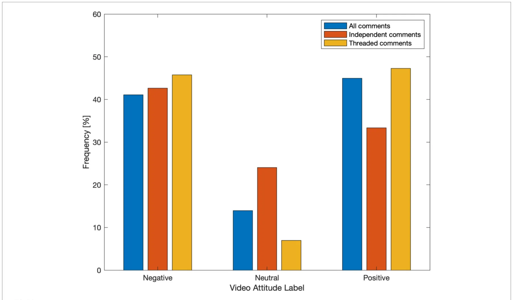

## 1 Introduction

### 1.1 Climate change communication and sustainability challenges

Effective public communication is widely recognised as a critical component in addressing complex sustainability challenges that require large-scale societal engagement and behavioural change. Climate change, in particular, remains at the centre of scientific, political, and policy discourse, with sustained efforts to identify communication strategies that can enhance public understanding, foster engagement, and support collective action (Aikens et al., 2016).

While substantial research has focused on environmental education and stewardship within formal educational contexts (Ardoin et al., 2020), it is increasingly recognised that public learning and opinion formation regarding climate change occur predominantly outside traditional academic settings. Digital and social media platforms have emerged as influential spaces for informal learning, public discourse, and the circulation of climate-related information (Hong and Jeon, 2025).

Due to their extensive reach and interactive nature, social media platforms play a significant role in shaping public perceptions of climate change, influencing support for mitigation and adaptation policies, and enabling participation in sustainability-related debates (Bergquist et al., 2022). Video-based communication has attracted particular attention, as audiovisual narratives can convey complex information in accessible and emotionally resonant ways. Previous research has shown that video-centred environmental communication can support knowledge acquisition, enhance awareness, and contribute to the development of ecological citizenship (Takahashi and Tandoc, 2016).

### 1.2 Online engagement as a mechanism for sustainability communication

Beyond exposure to information, social media platforms facilitate *engagement* through interactive features that enable users to respond, discuss, share, and collectively interpret content. In this study, online engagement is understood as a spectrum of observable user interactions with digital content, including viewing, reacting, commenting, and participating in threaded discussions, reflecting both individual and social dimensions of involvement (Giglietto et al., 2012).

Engagement with socio-scientific issues such as climate change has been shown to support public understanding, stimulate reflection, and contribute to individual and collective orientation toward sustainability (Shapiro and Park, 2018; Hendriks et al., 2020). A key mechanism underlying such engagement is interpersonal exchange, whereby users articulate viewpoints, encounter alternative perspectives, and negotiate meaning through online discussion. Conceptual frameworks such as the AC3 model (Jeong et al., 2017) describe engagement as a progression from individual cognitive activity (e.g., content consumption and reflection) to shared responsibility and collective knowledge construction through social interaction.

Importantly, the presence of interactive discussion does not guarantee meaningful engagement; rather, the quality, structure, and social dynamics of interaction are likely shaped by characteristics of the communicated content itself. Understanding how specific features of climate-related videos relate to observable engagement patterns is therefore essential for designing digital communication strategies that support sustainability-oriented discourse.

### 1.3 Gaps in understanding engagement with climate videos on social media

Controlled experimental studies have demonstrated that climate-related audiovisual materials can increase knowledge, influence attitudes, and affect behavioural intentions (Michalovich and Hershkovitz, 2020). More recent experimental work has also conceptualised engagement beyond popularity indicators, focusing on psychological, behavioural, and discursive dimensions. Experimental studies simulating social media environments and using diverse stimuli (e.g., blog posts, videos, memes) have examined engagement-related processes through outcomes such as perceived risk, consensus, planned pro-environmental behaviours, empathic responses, and intentions for civic engagement (Lewandowsky et al., 2019; Vasi and Paez-Arellano, 2025; Zhang and Pinto, 2021). However, considerably less is known about how such effects translate into *naturalistic social media environments*, where communication is unmoderated, audiences are heterogeneous, and interactions unfold dynamically.

Empirical research examining engagement with videos on social media platforms has largely relied on coarse popularity indicators such as view counts, likes, dislikes, and sharing metrics (Welbourne and Grant, 2016). While these measures capture visibility and popularity, they provide limited insight into how audiences cognitively and emotionally engage with climate-related content. In particular, they do not account for the substance or structure of user discussions, which may reflect deeper forms of engagement with sustainability issues. Recent work has also conceptualised engagement as the extent of discursive participation on social media platforms, including negotiating meanings in online discussions (Wang and Huan, 2024). These approaches highlight the multidimensional nature of engagement, extending beyond indicators of popularity.

Moreover, relatively few studies have focused specifically on climate change–related videos within social media contexts, despite the prominence of such platforms in recent environmental communication. This gap is partly attributable to the methodological challenges of analysing large-scale, unstructured user-generated data, especially when user identities and intentions are not directly observable. Consequently, there remains limited understanding of how audiences engage with climate videos in real-world social media settings, particularly in ways that capture cognitive, emotional, and discursive dimensions simultaneously.

Addressing this gap requires methodological approaches capable of analysing large-scale textual data while retaining interpretability and theoretical alignment.

Recent NLP literature increasingly applies transformer and LLM-based methods to sentiment and opinion analysis in climate and policy discourse (Aharonson and Bovan, 2026). At the same time, traditional NLP pipelines remain appropriate for theory-driven communication research when the main goal is transparent and reproducible inference. Feature-based methods and linear classifiers provide interpretable outputs, work reliably with moderate annotated data, and require substantially lower computational resources.

### 1.4 Video attributes and user interaction as drivers of engagement

Identifying content attributes that are associated with higher-quality engagement is essential for improving digital sustainability communication. Prior research in science communication suggests that the *presenter* of scientific content is a critical factor influencing trust, credibility, and audience response. Presenters perceived as scientists or experts tend to elicit higher trust and learning outcomes in educational contexts (Zagzebski, 2012; Zhang and Lu, 2023). However, this relationship has not been systematically examined in the context of climate change videos on social media, where communicators must navigate scientific complexity alongside political and emotional sensitivities (Kelly et al., 2020).

Another important attribute is message framing. Climate communication often employs diverse framing strategies, including factual descriptions, blame attribution, and solution-oriented narratives (Fløttum and Gjerstad, 2017).

Entman (1993) theoretical framework provides a widely used basis for categorising such framing. It distinguishes between problem definition (factual descriptions), causal interpretation (including blame attribution), moral evaluation, and treatment recommendations (solutions). This framework aligns closely with the categories of factual, blame-oriented, and solution-focused communication commonly found in climate communication and adopted in this study.

Alternative frameworks, such as collective action framing (Benford and Snow, 2000), conceptualise communication in terms of diagnostic (problem definition), prognostic (solutions), and motivational (calls to action) elements. However, these approaches are primarily oriented toward social mobilisation and place less emphasis on distinguishing evaluative or blame-related content.

Blame-focused discourse is however common in environmental debates and has been shown to influence audience attitudes. Prior research suggests that such framing may reduce content sharing or constructive engagement in some contexts. In contrast, solution-focused framing has been shown to enhance perceptions of self-efficacy and stimulate discussion related to environmental action (Jacobson et al., 2018; McIntyre, 2019; Kotcher et al., 2021).

User interaction patterns themselves constitute a further dimension of engagement. Comment threads that involve replies and conversational exchange may indicate deeper emotional and cognitive involvement compared to isolated comments (Williams et al., 2015; Hendriks et al., 2020). At the same time, social media interactions can reinforce attitudinal alignment within communities or contribute to polarisation in climate-related discourse (Kahan et al., 2012; Williams et al., 2015).

### 1.5 Study context, approach, and research aims

This study examines audience engagement with climate change content on YouTube, a leading global video-sharing platform characterised by community-driven interaction and content-centred networks rather than reciprocal social ties (Wattenhofer et al., 2012). YouTube has been shown to play a significant role in disseminating scientific information and supporting informal science learning (Thelwall et al., 2012; Takahashi and Tandoc, 2016), making it a suitable context for investigating sustainability communication at scale.

Focusing on naturally occurring, unmoderated user comments, this study employs advanced analytical methods, including natural language processing (NLP), to examine how user interaction patterns relate to key video attributes. By moving beyond surface-level engagement metrics and analysing the content and structure of user discussions, this approach aims to capture richer indicators of audience engagement in real-world conditions.

### 1.6 Hypotheses

Guided by prior research in science communication, framing theory, and online engagement, this study tests the following hypotheses.

- *H1*: Climate change videos presented by scientists elicit more favourable user comments than videos presented by celebrities or politicians.
- *H2*: Videos employing blame-focused framing generate less positive user sentiment than videos employing neutral or solution-oriented framing.
- *H3*: Comments that occur within threaded interactions exhibit higher emotional engagement than standalone comments.

### 1.7 Contribution to environmental and sustainability communication

By examining how presenter type, message framing, and interaction structure relate to audience attitudes toward climate videos on YouTube, this study contributes empirical evidence to environmental and sustainability communication. The findings identify communication features associated with constructive climate discourse, and may also inform broader public risk communication practice in digital settings.

## 2 Methods

### 2.1 Study design and ethics

This study employed a mixed-methods design integrating manual content analysis with automated natural language processing (NLP) and supervised machine learning (ML) to examine audience engagement with climate change content on YouTube. The research was reviewed by the Cyprus National Bioethics Committee (application reference: ΕΕΒΚ ΕΠ 2023.01.115). The Committee confirmed that the use of publicly available, non-identifiable online data did not require a separate ethics application. All data were analysed in anonymised form.

Figure 1 presents an overview of the analytical workflow, with automated procedures shown in green and manual coding steps in pink.

<figure id="fig-1">

<figcaption>FIGURE 1 Workflow of the study. Automated procedures are shown in green and manual coding steps in pink.</figcaption>
</figure>

### 2.2 Video identification and dataset construction

In March 2021, we compiled a preliminary list of the top 200 YouTube videos returned for the keyword ‘climate change.’ This timestamp refers to the retrieval date of the ranked search results, not to the upload period of the videos. The retrieved list reflected YouTube’s algorithmic ranking at that time, based on relevance and popularity signals.

Videos were included if they met the following criteria: (1) At least 200 comments and replies. (2) At least 90% of comments in English, and (3) Alignment with the scientific consensus on climate change. Videos denying climate change or discouraging mitigation or behavioural change were excluded following manual review. The final dataset included 129 videos.

### 2.3 Manual coding of video attributes

#### 2.3.1 Presenter type

Each video was coded into one of three categories: (1) Scientists/experts, (2) Politicians/public officials, and (3) Public figures (nonpolitical high-profile individuals, including business leaders, artists, and influencers).

#### 2.3.2 Framing style

Videos were coded into one primary framing category: (1) Blame-oriented. (2) Solution-focused and. (3) Descriptions of climate change effects.

Manual coding was necessary to capture implicit framing and presenter identity that automated tools cannot reliably infer. The coding was conducted independently by two annotators, with an overlap of 39 videos. Inter-rater reliability was *κ* = 0.88 for presenter type, and κ = 0.83 for framing style. Disagreements were resolved by discussion with a third adjudicator.

### 2.4 Comment collection and feature extraction

All publicly available comments and replies were collected using a custom Python script. Metadata recorded included whether comments were independent (top-level) or part of threaded discussions.

Automated feature extraction included linguistic characteristics (e.g., comment length, punctuation, emoji use) and sentiment polarity, computed using the TextBlob library.

### 2.5 Manual attitude labelling and classification

A random subset of 20 comments per video (2,580 comments total) was manually labelled as Positive, Neutral, or Negative, based on stance relative to the scientific consensus on climate change. The labels were produced by two annotators on an overlapping subset of 600 comments. Inter-rater reliability yielded κ = 0.79. Final labels were assigned for unresolved cases by discussion with a third adjudicator.

Two logistic regression models were trained: A binary model (Positive vs. Negative), and a three-class model (Positive, Neutral, Negative). Data were split using stratified sampling (75% training, 25% testing). Performance was evaluated using accuracy and F1 scores. Due to weaker performance on the neutral class, the binary model was used for subsequent analyses.

### 2.6 Video-level attitude aggregation

Predicted comment labels were aggregated into a summative video-level attitude using the ratio of positive to negative comments. Videos were classified as positive (>1.05), Negative (<0.95), or Neutral otherwise. The ±5% threshold band around the ratio = 1.00 was defined as a practical “indifference zone” to reduce unstable assignment for videos with near-balanced positive and negative counts, conceptually consistent with neutral-zone thresholds (Lakens et al., 2018).

### 2.7 Independent vs. threaded comments

The comments were split per video into two subsets: independent comments (top-level comments without reply-chain participation) and threaded comments (top-level comments with replies, plus all reply comments). Using the same classification and aggregation pipeline (Sections 2.5 and 2.6), we recalculated video-level positive, neutral, and negative sentiment labels for each subset. Label frequencies were then computed for three conditions: all comments, independent comments, and threaded comments.

### 2.8 Exploratory topic analysis

Sentiment polarity alone does not convey whether comments are about climate change. Therefore, we conducted an exploratory check of comment content. The comments text underwent preprocessing with NLTK (Bird et al., 2009; Fernandes et al., 2023), which included lowercasing, removal of symbols and emoticons, lemmatization, and negation marking (for example, token\_NEG) to preserve polarity context (Becker and Aharonson, 2010). We then extracted n-grams (Allen et al., 2021): unigrams (single words), bigrams (two-word terms), and trigrams (three-word terms). The most frequent n-grams were manually inspected to examine whether the dominant discourse was climate-related.

### 2.9 Statistical analysis

Binary logistic regression was used as the primary inferential method to predict video-level attitudes from presenter type, framing style, and interaction structure. Results are reported as odds ratios (ORs) with 95% confidence intervals (CIs) and exact *p*-values. Chi-square tests of independence were conducted as supporting analyses and were performed on raw contingency counts. In figures, label frequencies across conditions (presenter type, framing style, and comment structure) are shown as normalized percentages to display within-condition distributions of positive, neutral, and negative labels. These percentages are descriptive only and were not used for inferential testing.

## 3 Results

### 3.1 Classification performance

The three-class model achieved an accuracy of 0.66, with F1 scores of 0.73 (Negative), 0.71 (Positive), and 0.40 (Neutral). The binary model achieved higher accuracy (0.79) with balanced F1 scores (0.79 Negative; 0.78 Positive).

### 3.2 Presenter type and audience attitudes (H1)

Binary logistic regression showed that videos presented by scientists were significantly more likely to elicit positive audience attitudes than those presented by politicians (OR > 4, *p* < 0.001). Public figures showed intermediate effects. A supporting *χ*2 test confirmed a strong association between presenter type and video attitude (*χ*2(4) = 90.61, *p* < 0.001, Figure 2), supporting H1.

### 3.3 Framing style and audience attitudes (H2)

Solution-focused videos were significantly more likely to elicit positive attitudes than blame-oriented videos (OR > 7, *p* < 0.001). Effects-focused videos showed intermediate odds.

Supporting *χ*2 analysis indicated a very strong association between framing style and video attitude (*χ*2(4) = 184.56, *p* < 0.001, Figure 3), supporting H2.

### 3.4 Independent vs. threaded comments (H3)

Threaded comments were significantly more likely to be associated with positive attitudes than independent comments (OR ≈ 1.8, *p* = 0.004). Supporting *χ*2 analysis confirmed this difference (*χ*2(2) = 11.59, *p* = 0.003; Figure 4), supporting H3.

### 3.5 Exploratory topic analysis

Table 1 presents the 15 most frequent unigrams, bigrams, and trigrams, separately for comments associated with positive-attitude videos and negative-attitude videos. Across both subsets, frequent terms included climate-relevant vocabulary such as “climate,” “change,” “global warm,” “greenhouse gas,” “fossil fuel,” and mitigation-related expressions.

## 4 Discussion

This study demonstrates that both who communicates climate change information and how it is framed substantially shape audience engagement on YouTube. Scientist-led videos elicited more positive engagement than those presented by politicians or public figures, consistent with theories of epistemic authority and trust in science (Hendriks et al., 2020; Zagzebski, 2012). Solution-focused framing proved markedly more effective than blame-oriented narratives, aligning with sustainability communication approaches that emphasise agency and self-efficacy (Feldman and Hart, 2018).

One framework that may explain these findings is the theory of epistemic authority (Zagzebski, 2012), which suggests that the credibility of information sources depends on factors such as expertise, trustworthiness, and potential conflicts of interest. In the context of climate change, scientists may be perceived as more credible than politicians, whose interests may be viewed as conflicting. Consistent with this, prior research shows that aggressive or blaming communication styles are perceived as less credible (König and Jucks, 2019), a pattern also reflected in the present findings. Furthermore, these results align with evidence that audiences tend to prefer factual and solution-focused messages on environmental issues (Kotcher et al., 2021). Together, these findings suggest that environmental communication will benefit from emphasising credible sources and constructive, solution-oriented framing, in line with solutions-oriented media approaches (McIntyre, 2019). Beyond replicating previous findings, this study contributes by examining source credibility and message framing within a single research context. The results suggest that epistemic authority and solution-focused framing may operate in parallel to enhance engagement. These findings indicate that effective climate communication depends not only on the authority of the message source, but also on how credibility is conveyed through the messaging style.

<figure id="fig-2">

<figcaption>FIGURE 2 Distribution of video-level attitude labels by presenter type.</figcaption>
</figure>

<figure id="fig-3">

<figcaption>FIGURE 3 Distribution of video-level attitude labels by content framing style.</figcaption>
</figure>

<figure id="fig-4">

<figcaption>FIGURE 4 Comparison of video-level attitudes derived from all, independent, and threaded comments.</figcaption>
</figure>

<figure class="table-figure" id="table-1">
<figcaption>TABLE 1 Most frequent monograms, bigrams, and trigrams in comments associated with positive and negative attitudes.</figcaption>

<table><tr><th colspan="2">Unigrams</th><th colspan="2">Bigrams</th><th colspan="2">Trigrams</th></tr><tr><td>Positive</td><td>Negative</td><td>Positive sentiment</td><td>Negative</td><td>Positive sentiment</td><td>Negative sentiment</td></tr><tr><td>sentiment</td><td>sentiment</td><td>videos</td><td>sentiment</td><td>videos</td><td>videos</td></tr><tr><td>videos</td><td>videos</td><td></td><td>videos</td><td></td><td></td></tr><tr><td>Year_NEG</td><td>Get</td><td>(Greenhouse, gas)_NEG</td><td>(Gone, na)_NEG</td><td>(Cause, climate, change)_NEG</td><td>(Flight, climate, change)</td></tr><tr><td>Warm_NEG</td><td>Trump</td><td>(Year, ago)_NEG</td><td>(Bill, gate)</td><td>(Climate, change, hoax)</td><td>(Vostok, ice, core)_NEG</td></tr><tr><td>Would_NEG</td><td>Say</td><td>(Go, vegan)</td><td>(Bill, gate)_NEG</td><td>(Million, year, ago)_NEG</td><td>(Green, new, deal)</td></tr><tr><td>Plant_NEG</td><td>Bill</td><td>(Plant, tree)_NEG</td><td>(Look, like)</td><td>(Burn, fossil, fuel)_NEG</td><td>(Green, house, gas)</td></tr><tr><td>Tree_NEG</td><td>World</td><td>(eat,meat)_NEG</td><td>(Joe, biden)_NEG</td><td>(Deny, climate, change)_NEG</td><td>(Global, warm, real)</td></tr><tr><td>Go_NEG</td><td>Gate</td><td>(Nuclear, power)</td><td>(Climate, scientist)</td><td>(Cause, global, warm)_NEG</td><td>(Man, make, climate)</td></tr><tr><td>Like</td><td>People</td><td>(Save, planet)</td><td>(Don’t, think)</td><td>(Go, back, school)_NEG</td><td>(Sorry sorry sorry)</td></tr><tr><td>Love</td><td>Climate</td><td>(Climate, change)</td><td>(Climate, change)_NEG</td><td>(Tree, tree, tree)</td><td>(f*, im, clam)</td></tr><tr><td>Earth</td><td>Change</td><td>(Global, warm)</td><td>(Global, warm)_NEG</td><td>(We, love, earth)</td><td>(Climate, change, denier)</td></tr><tr><td>People</td><td>f*</td><td>(Climate, change)_NEG</td><td>(Year, ago)</td><td>(Love, earth, planet)</td><td>(People, dislike, video)</td></tr><tr><td>Change</td><td>Make</td><td>(Love, earth)</td><td>(People, dislike)</td><td>(Sea, level, rise)</td><td>(Climate, change, real)</td></tr><tr><td>Make</td><td>Get</td><td>(Global, warm)_NEG</td><td>(Dislike, video)</td><td>(Im, pretty, sure)</td><td>(Gon, na, die)</td></tr><tr><td>Climate</td><td>Say</td><td>(Forgive, germany)</td><td>(Lil, dicky)</td><td>(Love, earth, home)</td><td>(Climate, change, hoax)</td></tr><tr><td>Get</td><td>Im</td><td>(Ice, age)</td><td>(Fat, f*)</td><td>(Cause, global, warm)</td><td>(Believe, climate, change)_NEG</td></tr><tr><td>Say</td><td>Go</td><td>(Look, like)</td><td>(Im, sorry)</td><td>(Climate, change, real)</td><td>(Fat, f*, pig)</td></tr></table>

</figure>

Threaded discussions were associated with more positive engagement, suggesting that conversational interaction may facilitate collective meaning-making and constructive discourse as suggested by the AC3 conceptual model (Jeong et al., 2017). The results highlight the importance of user interaction in shaping engagement on YouTube. At scale, automated analyses showed that comments within discussion threads were associated with more positive and fewer neutral attitudes compared to standalone comments, suggesting that dialogic interaction may foster deeper forms of engagement. These findings align with prior work indicating that cognitive engagement on social media is reflected in users’ active elaboration on others’ contributions, and more broadly with research distinguishing between individual and dialogic engagement in online environments (Hendriks et al., 2020) which is linked to higher levels of cognitive processing and deliberation. These findings build on prior work distinguishing between individual and dialogic engagement by providing further evidence that interactive comment sections on online platforms can facilitate more constructive and reflective dialogue. This suggests that engagement is shaped not only by message content but also by the interactive affordances of the platform. At the same time, it is important to acknowledge that online discussions of climate change do not always align with the scientific consensus (Williams et al., 2015). In this context, the use of prompts or moderation strategies may help harness the potential of interactive features while supporting more evidence-based and constructive discussions.

Methodologically, the integration of manual coding with supervised machine learning offers a scalable approach to analysing engagement beyond simple popularity metrics. Our methodology reflects a common tradeoff in NLP between predictive performance and explainability. We prioritised an interpretable analysis process that supports hypothesis testing on presenter identity, framing, and interaction structure, while maintaining computational efficiency and reproducibility. This design is well-suited to inferential communication analysis at the video level, where clear model behaviour and traceable coding decisions are central.

Our model performance is consistent with prior climate-text classification work. In our dataset, the binary model reached an accuracy of 0.79 (balanced F1: 0.78–0.79), whereas the three-class setting was lower (accuracy 0.66), with weaker neutral-class performance (F1 = 0.40). reported 75% accuracy for sentence-level global-warming stance in news media, and Aharonson and Bovan (2026) reported F1 score of 0.88 for sentiment polarity recognition in large-scale YouTube comments. Direct comparisons should be interpreted carefully because label definitions, annotation protocols, and text units differ (e.g., sentence-level opinion framing versus short social media comments).

Our exploratory topic inspection showed that the most frequent words and terms in the analysed corpus were directly connected to climate discourse. This step was included as a topical relevance check and is interpreted as exploratory support, rather than as a separate inferential test.

Study limitations include the English-language focus, platform-specific dynamics, and challenges in reliably classifying the neutral sentiment class. While understanding how videos engage social media users is valuable, an important caveat remains: online engagement with sustainability topics does not necessarily translate into pro-environmental behaviour offline. As such, the engagement metrics used in this study should be interpreted as proximal indicators rather than behavioural outcomes.

Our data is modest in size (129 videos) and its collection was based on a single retrieval snapshot in March 2021, which refers to when ranked results were captured, not to a restriction on video upload month. As this limitation may introduce platform-timepoint sampling bias we interpret the findings as hypothesis-supporting rather than population-estimating. Although the study targets mechanism-level associations that are likely more stable than popularity levels, changes in ranking systems and misinformation policies since 2021 limit direct prevalence claims for 2026. Future work should scale this design through repeated retrieval at multiple timepoints, automated pre-labelling, and targeted human annotation, and should extend analysis to cross-cultural and multilingual settings.

## 5 Conclusion

This study provides empirical evidence that climate videos are more likely to elicit positive audience attitudes when they are presented by scientists, framed around solutions, and accompanied by threaded discussion. The findings offer practical guidance for designing climate communication that supports constructive public discourse in digital environments. Methodologically, the study shows the value of combining theory-driven manual coding with scalable computational analysis. Future research should test these mechanisms across languages, platforms, and repeated timepoints to strengthen generalisability.

## Data availability statement

The raw data supporting the conclusions of this article will be made available by the authors, without undue reservation.

## Ethics statement

Ethical approval was not required for the study involving human data in accordance with the local legislation and institutional requirements. Written informed consent was not required, for either participation in the study or for the publication of potentially/indirectly identifying information, in accordance with the local legislation and institutional requirements. The social media data was accessed and analyzed in accordance with the platform’s terms of use and all relevant institutional/national regulations.

## Author contributions

VA: Conceptualization, Data curation, Formal analysis, Funding acquisition, Investigation, Methodology, Project administration, Resources, Software, Supervision, Visualization, Writing – original draft, Writing – review & editing. VC: Formal analysis, Investigation, Methodology, Writing – original draft, Writing – review & editing. CK: Conceptualization, Formal analysis, Investigation, Methodology, Validation, Writing – original draft, Writing – review & editing. JJ: Data curation, Formal analysis, Investigation, Methodology, Writing – original draft, Writing – review & editing. SN: Formal analysis, Investigation, Methodology, Writing – original draft, Writing – review & editing. TL: Funding acquisition, Resources, Validation, Writing – review & editing. KI: Conceptualization, Formal analysis, Investigation, Methodology, Project administration, Writing – original draft, Writing – review & editing.

## Funding

The author(s) declared that financial support was not received for this work and/or its publication.

## Conflict of interest

The author(s) declared that this work was conducted in the absence of any commercial or financial relationships that could be construed as a potential conflict of interest.

## Correction note

This article has been corrected with minor changes. These changes do not impact the scientific content of the article.

## References

- Aharonson, V., and Bovan, O. S. (2026) Topic and tone in YouTube climate discussions.
- In: The Proceedings of the 9th European Conference on Social Media
- Aikens, K., McKenzie, M., and Vaughter, P. (2016). Environmental and sustainability
- education policy research: a systematic review of methodological and thematic trends. [doi:10.1080/13504622.2015.1135418](https://doi.org/10.1080/13504622.2015.1135418)
- Environ. Educ. Res. 22, 333–359. [doi:10.1080/13504622.2015.1135418](https://doi.org/10.1080/13504622.2015.1135418)
- Allen, L. K., Creer, S. D., and Poulos, M. C. (2021). Natural language processing as a
- technique for conducting text-based research. Lang. Linguist. Compass 15:e12433. doi: [doi:10.1111/lnc3.12433](https://doi.org/10.1111/lnc3.12433)
- 10.1111/lnc3.12433 [doi:10.1111/lnc3.12433](https://doi.org/10.1111/lnc3.12433)
- Ardoin, N. M., Bowers, A. W., and Gaillard, E. (2020). Environmental education out [doi:10.1016/j.biocon.2019.108224](https://doi.org/10.1016/j.biocon.2019.108224)
- comes for conservation: a systematic review. Biol. Conserv. 241:108224. [doi:10.1016/j](https://doi.org/10.1016/j)
- biocon.2019.108224 [doi:10.1016/j.biocon.2019.108224](https://doi.org/10.1016/j.biocon.2019.108224)
- Becker, I., and Aharonson, V.. (2010). Last but definitely not least: on the role of the last
- sentence in automatic polarity classification. In: Proceedings of the Annual Association of
- Computational Linguistics
- Benford, R. D., and Snow, D. A. (2000). Framing processes and social movements: an [doi:10.1146/annurev.soc.26.1.611](https://doi.org/10.1146/annurev.soc.26.1.611)
- overview and assessment. Annu. Rev. Sociol. 26, 611–639. [doi:10.1146/annurev](https://doi.org/10.1146/annurev)
- soc.26.1.611 [doi:10.1146/annurev.soc.26.1.611](https://doi.org/10.1146/annurev.soc.26.1.611)
- Bergquist, P., Marlon, J. R., Goldberg, M. H., Gustafson, A., Rosenthal, S. A., and
- Leiserowitz, A. (2022). Information about the human causes of global warming influences
- causal attribution, concern, and policy support related to global warming. Think. Reason. [doi:10.1080/13546783.2022.2030407](https://doi.org/10.1080/13546783.2022.2030407)
- 28, 465–486. [doi:10.1080/13546783.2022.2030407](https://doi.org/10.1080/13546783.2022.2030407)
- Bird, S., Klein, E., and Loper, E. (2009). Natural Language Processing with Python.
- Springfield, MO: O’Reilly.
- Feldman, L., and Hart, P. S. (2018). Is there any hope? How climate change news imagery
- and text influence audience emotions and support for climate mitigation policies. Risk [doi:10.1111/risa.12868](https://doi.org/10.1111/risa.12868)
- Anal. 38, 585–602. [doi:10.1111/risa.12868](https://doi.org/10.1111/risa.12868)
- Fernandes, A. A., Koehler, M., Konstantinou, N., Pankin, P., Paton, N. W., and
- Sakellariou, R. (2023). Data preparation: a technological perspective and review. SN [doi:10.1007/s42979-023-01828-8](https://doi.org/10.1007/s42979-023-01828-8)
- Comput. Sci. 4, 425–445. [doi:10.1007/s42979-023-01828-8](https://doi.org/10.1007/s42979-023-01828-8)
- Fløttum, K., and Gjerstad, Ø. (2017). Narratives in climate change discourse. WIREs Clim. [doi:10.1002/wcc.429](https://doi.org/10.1002/wcc.429)
- Change 8:e429. [doi:10.1002/wcc.429](https://doi.org/10.1002/wcc.429)
- Giglietto, F., Rossi, L., and Bennato, D. (2012). The open laboratory: limits and possibili
- ties of using Facebook, Twitter, and YouTube as a research data source. J. Technol. Hum. [doi:10.1080/15228835.2012.743797](https://doi.org/10.1080/15228835.2012.743797)
- Serv. 30, 145–159. [doi:10.1080/15228835.2012.743797](https://doi.org/10.1080/15228835.2012.743797)
- Hendriks, F., Mayweg-Paus, E., Felton, M., Iordanou, K., Jucks, R., and Zimmermann, M.
- (2020). Constraints and affordances of online engagement with scientific information: a [doi:10.3389/fpsyg.2020.572744](https://doi.org/10.3389/fpsyg.2020.572744)
- literature review. Front. Psychol. 11:572744. [doi:10.3389/fpsyg.2020.572744](https://doi.org/10.3389/fpsyg.2020.572744)
- Hong, J., and Jeon, C.-Y. (2025). Linking perceptions, emotions, and actions: how
- psychological distance, media framing, and guilt about climate crisis promote com [doi:10.3390/su17062409](https://doi.org/10.3390/su17062409)
- munication and pro-environmental behavior. Sustainability 17:2409. doi: 10.3390/ [doi:10.3390/su17062409](https://doi.org/10.3390/su17062409)
- su17062409 [doi:10.3390/su17062409](https://doi.org/10.3390/su17062409)
- Jacobson, S. K., Morales, N. A., Chen, B., Soodeen, R., Moulton, M. P., and Jain, E.
- (2018). Love or loss: effective message framing to promote environmental
- Generative AI statement The author(s) declared that Generative AI was not used in the
- creation of this manuscript. Any alternative text (alt text) provided alongside figures in this
- article has been generated by Frontiers with the support of artificial
- intelligence and reasonable efforts have been made to ensure accuracy,
- including review by the authors wherever possible. If you identify any
- issues, please contact us. All claims expressed in this article are solely those of the authors
- and do not necessarily represent those of their affiliated organizations,
- or those of the publisher, the editors and the reviewers. Any product
- that may be evaluated in this article, or claim that may be made by its
- manufacturer, is not guaranteed or endorsed by the publisher.
- conservation. Appl. Environ. Educ. Commun. 18, 252–265. doi: [doi:10.1080/1533015X.2018.1456380](https://doi.org/10.1080/1533015X.2018.1456380)
- 10.1080/1533015X.2018.1456380 [doi:10.1080/1533015X.2018.1456380](https://doi.org/10.1080/1533015X.2018.1456380)
- Jeong, H., Cress, U., Moskaliuk, J., and Kimmerle, J. (2017). Joint interactions in large
- online knowledge communities: the A3C framework. Int. J. Comput. Support. Collab. [doi:10.1007/s11412-017-9256-8](https://doi.org/10.1007/s11412-017-9256-8)
- Learn. 12, 133–151. [doi:10.1007/s11412-017-9256-8](https://doi.org/10.1007/s11412-017-9256-8)
- Kahan, D. M., Peters, E., Wittlin, M., Slovic, P., Ouellette, L. L., Braman, D., et al. (2012).
- The polarizing impact of science literacy and numeracy on perceived climate change risks. [doi:10.1038/nclimate1547](https://doi.org/10.1038/nclimate1547)
- Nat. Clim. Chang. 2, 732–735. [doi:10.1038/nclimate1547](https://doi.org/10.1038/nclimate1547)
- Kelly, R., Nettlefold, J., Mossop, D., Bettiol, S., Corney, S., Cullen-Knox, C., et al. (2020).
- Let’s talk about climate change: developing effective conversations between scientists and [doi:10.1016/j.oneear.2020.09.009](https://doi.org/10.1016/j.oneear.2020.09.009)
- communities. One Earth 3, 415–419. [doi:10.1016/j.oneear.2020.09.009](https://doi.org/10.1016/j.oneear.2020.09.009)
- König, L., and Jucks, R. (2019). Aggressive language decreases credibility. Public Underst. [doi:10.1177/0963662519833903](https://doi.org/10.1177/0963662519833903)
- Sci. 28, 401–416. [doi:10.1177/0963662519833903](https://doi.org/10.1177/0963662519833903)
- Kotcher, J., Feldman, L., Luong, K. T., Wyatt, J., and Maibach, E. (2021). Advocacy mes
- sages about climate and health are more effective when they include information about
- risks, solutions, and a normative appeal: Evidence from a conjoint experiment. J. Clim. [doi:10.1016/j.joclim.2021.100030](https://doi.org/10.1016/j.joclim.2021.100030)
- Change Health 3:100030. [doi:10.1016/j.joclim.2021.100030](https://doi.org/10.1016/j.joclim.2021.100030)
- Lakens, D., Scheel, A. M., and Isager, P. M. (2018). Equivalence testing for psychological [doi:10.1177/2515245918770963](https://doi.org/10.1177/2515245918770963)
- research: a tutorial. Adv. Methods Pract. Psychol. Sci. 1, 259–269. [doi:10.1177/2515245918770963](https://doi.org/10.1177/2515245918770963)
- Lewandowsky, S., Cook, J., Fay, N., and Gignac, G. E. (2019). Science by social media:
- attitudes towards climate change are mediated by perceived social consensus. Mem. Cogn. [doi:10.3758/s13421-019-00948-y](https://doi.org/10.3758/s13421-019-00948-y)
- 47, 1445–1456. [doi:10.3758/s13421-019-00948-y](https://doi.org/10.3758/s13421-019-00948-y)
- McIntyre, K. (2019). Solutions Journalism: the effects of including solution information
- in news stories about social problems. Journal. Pract. 13, 16–34. doi: [doi:10.1080/17512786.2017.1409647](https://doi.org/10.1080/17512786.2017.1409647)
- 10.1080/17512786.2017.1409647 [doi:10.1080/17512786.2017.1409647](https://doi.org/10.1080/17512786.2017.1409647)
- Michalovich, A., and Hershkovitz, A. (2020). Assessing YouTube science news’ credibility:
- the impact of web-search on the role of video, source, and user attributes. Public Underst. [doi:10.1177/0963662520905466](https://doi.org/10.1177/0963662520905466)
- Sci. 29, 376–391. [doi:10.1177/0963662520905466](https://doi.org/10.1177/0963662520905466)
- Shapiro, M. A., and Park, H. W. (2018). Climate change and YouTube: deliberation potential in [doi:10.1080/17524032.2017.1289108](https://doi.org/10.1080/17524032.2017.1289108)
- post-video discussions. Environ. Commun. 12, 115–131. [doi:10.1080/17524032.2017.1289108](https://doi.org/10.1080/17524032.2017.1289108)
- Takahashi, B., and Tandoc, E. C. (2016). Media sources and credibility. Public Underst. [doi:10.1177/0963662515574986](https://doi.org/10.1177/0963662515574986)
- Sci. 25, 674–690. [doi:10.1177/0963662515574986](https://doi.org/10.1177/0963662515574986)
- Thelwall, M., Sud, P., and Vis, F. (2012). Commenting on YouTube videos: from Guatemalan [doi:10.1002/asi.21679](https://doi.org/10.1002/asi.21679)
- rock to El Big Bang. J. Am. Soc. Inf. Sci. Technol. 63, 616–629. [doi:10.1002/asi.21679](https://doi.org/10.1002/asi.21679)
- Vasi, I. B., and Paez-Arellano, M. (2025). Video communication, blue marble awe, and
- attitudes toward climate change and renewable energy. NPJ Climate Action 4:5. doi: [doi:10.1038/s44168-024-00203-4](https://doi.org/10.1038/s44168-024-00203-4)
- 10.1038/s44168-024-00203-4 [doi:10.1038/s44168-024-00203-4](https://doi.org/10.1038/s44168-024-00203-4)
- Wang, G., and Huan, C. (2024). Negotiating climate change in public discourse: insights
- from critical discourse studies. Crit. Discourse Stud. 21, 133–145. doi: [doi:10.1080/17405904.2023.2198725](https://doi.org/10.1080/17405904.2023.2198725)
- 10.1080/17405904.2023.2198725 [doi:10.1080/17405904.2023.2198725](https://doi.org/10.1080/17405904.2023.2198725)
- Wattenhofer, M., Wattenhofer, R., and Zhu, Z. (2012). The YouTube social network. [doi:10.1609/icwsm.v6i1.14243](https://doi.org/10.1609/icwsm.v6i1.14243)
- ICWSM 6, 354–361. [doi:10.1609/icwsm.v6i1.14243](https://doi.org/10.1609/icwsm.v6i1.14243)
- Welbourne, D. J., and Grant, W. J. (2016). Science communication on YouTube: factors that affect [doi:10.1177/0963662515572068](https://doi.org/10.1177/0963662515572068)
- channel and video popularity. Public Underst. Sci. 25, 706–718. [doi:10.1177/0963662515572068](https://doi.org/10.1177/0963662515572068)
- Williams, H. T. P., McMurray, J. R., Kurz, T., and Lambert, F. H. (2015). Network
- analysis reveals open forums and echo chambers in social media discussions of climate [doi:10.1016/j.gloenvcha.2015.03.006](https://doi.org/10.1016/j.gloenvcha.2015.03.006)
- change. Glob. Environ. Change 32, 126–138. [doi:10.1016/j.gloenvcha.2015.03.006](https://doi.org/10.1016/j.gloenvcha.2015.03.006)
- Zagzebski, L. T. (2012). Epistemic Authority. Oxford: Oxford University Press.
- Zhang, A. L., and Lu, H. (2023). Scientists as influencers: the role of source identity,
- self-disclosure, and anti-intellectualism in science communication on social media. Soc. [doi:10.1177/20563051231180623](https://doi.org/10.1177/20563051231180623)
- Media Soc. 9, 1–16. [doi:10.1177/20563051231180623](https://doi.org/10.1177/20563051231180623)
- Zhang, B., and Pinto, J. (2021). Changing the world one meme at a time: the effects of
- climate change memes on civic engagement intentions. Environ. Commun. 15, 749–764. [doi:10.1080/17524032.2021.1894197](https://doi.org/10.1080/17524032.2021.1894197)
-  [doi:10.1080/17524032.2021.1894197](https://doi.org/10.1080/17524032.2021.1894197)
