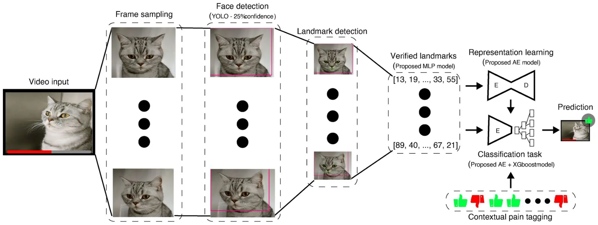
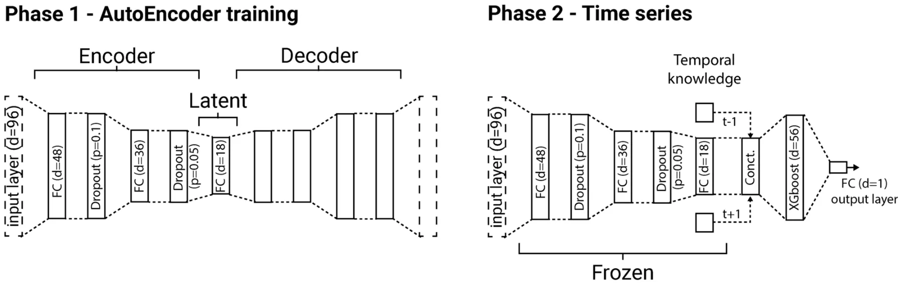
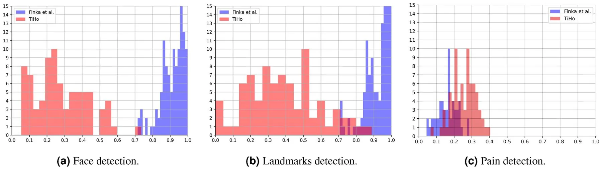
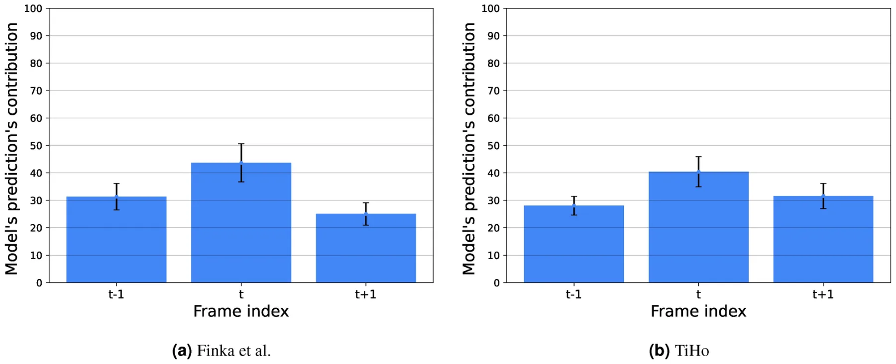

It is widely recognized that facial expressions play a crucial role in the recognition of emotional states1,2. In the context of humans, they serve as a primary nonverbal mechanism for regulating social interactions3and the connection between facial expressions and emotional states has been widely investigated in psychology4,5. In the wider biological context, facial expressions are exhibited by all mammalian species6, and, akin to humans, they are believed to convey information regarding emotional states1,2. Consequently, there is a growing interest in the study of facial expressions in the context of animal emotion and welfare studies7–10. Specifically, pain is a subjective experience that poses significant challenges in measurement. In the realm of human studies, self-reporting is considered one of the least intrusive and non-invasive methods for establishing ground truth in both pain11and emotion research12. However, these methods are not applicable to animals.

Thus for assessing pain in animals, the most common approach involves behavior scoring by trained human experts13. Various grimace scales, which are species-specific pain assessment tools focusing on changes in the facial features of animals, as well as behavioral instruments, have been developed and validated for all commonly domesticated species. The first grimace scales were developed for rodents and they are now available for many mammalian species14, including rats15, rabbits16, horses17, pigs18, ferrets19, sheep20,21and cats22,23.

Pain assessment and management in cats pose significant challenges, making them one of the most demanding species in this regard. There is currently a lack of consensus over key behavioral pain indicators24.

Moreover, population level visual differences in cat facial features based on pain status are extremely subtle25, and the difficulties humans face in accurately interpreting facial expressions in cats have been discussed in various contexts, which challenge expert-based labeling26–28. This phenomenon makes the detection of pain in cats challenging given that ground truth based on the subjective opinions of experts is a central instrument in pain detection studies. Reduced physiological tolerance and adverse effects to common veterinary analgesics29, and a lack of strong consensus over key behavioral pain indicators24pose additional challenges in accurately interpreting feline facial expressions26, making cats a particularly challenging species in this context. Three different manual pain assessment scales have been developed and validated (in English) for domestic cats: the UNESP-Botucatu multidimensional composite pain scale (MCPS)30, the feline Glasgow composite measure pain scale (CMPS-feline31,) and the Feline Grimace Scale (FGS)23. The latter was further used for a comparative study in which humans assigned FGS to cats during real-time observations and then subsequent FGS scoring of the same cats from still images were compared. It was shown that there was no significant difference between the scoring methods32, indicating images can be a reliable medium from which to assess pain, compared to direct, real-time observations. Nonetheless, despite the established agreement between FGS scorers with different experiences and backgrounds33, there are other less-investigated factors that could impact the trustworthiness and accuracy of such manual scoring techniques that hinge on human subjective assessments. This underscores the importance of creating more objective pain scoring and evaluation methods that minimize human bias.

To this end, Finka et al25. developed a scheme of 48 geometric facial landmarks to quantify facial shape changes associated with pain, which were specifically chosen for their relationship with underlying facial musculature and their relevance to cat-specific facial action units. The authors used a dataset of 29domestic short-haired female cats undergoing ovariohysterectomy. The images of the cats were manually annotated using these 48 landmarks by experts, and a significant relationship was found between pain-linked Principal Components related to facial shape variation underpinned by the 48 landmarks and the UNESP-Botucatu MCPS tool30. The dataset created by Finka et al25. formed the starting point for the exploration of automated detection of pain in cats34, where two different approaches were compared: a manually annotated facial landmark-based approach (with landmark-based vectors used as features) and a deep learning based approach (where features were learnt from data). While both approaches reached a comparable accuracy of approximately 72% in pain recognition, a significant limitation was that the study population was highly homogenous, limited to young female cats of a single breed, and evaluated using only one type of postoperative pain condition. In a follow-up study, Feighelstein et al. have addressed this gap using another dataset with a more naturalistic or ‘noisy’ population (with variations in breed, sex, and painful conditions)35. The dataset was collected at the Department of Small Animal Medicine and Surgery of the University of Veterinary Medicine Hannover and included individuals of different breeds, ages, sexes, and with varying medical conditions/medical histories. Cats were scored by veterinary experts using the feline Glasgow composite measure pain scale31in combination with the well-documented and comprehensive clinical history of those patients. The obtained scoring was then used for training Artificial Intelligence (AI) models using two different approaches. The landmark-based approach performed better, reaching accuracy above 77% in pain detection, as opposed to only above 65% reached by the deep learning approach. Steagall et al36. also applied another landmark scheme for pain assessment based on images of cat faces on a large and diverse dataset.

Despite the relatively high accuracy of these methods, they have several significant limitations. First, only static rather than dynamic representations of facial shape variations can be captured, meaning important micro- and macro- facial expression changes may go undetected37,38. This is potentially problematic given that behavioural expressions of pain may have important dynamic and temporal dimensions39. Moreover, manually extracting individual frames from videos is time and labour intensive and decision making over which frames are deemed suitable/unsuitable for extraction and annotation may be subject to various human bias. Manual image annotation also requires a degree of annotator training and expertise, is therefore resource intensive could also be prone to human annotator error. Consequently, Martvel et al. developed an automated detector for cat facial landmarks40,41. The model, based on convolutional neural networks and using a magnifying ensemble method, detects 48 cat facial landmarks with 2.91 normalized mean error (NME) on the CatFLW dataset40. The above achievements create a yet unprecedented opportunity to explore the temporal dimensions of landmark-based approaches, moving from single frames to videos, where each individual frame can be automatically annotated. Such an approach does not require any manual labor-intensive efforts: neither in landmark annotation nor in the selection of “good” quality images, which were necessary for the AI models developed in34,35. The latter issue is particularly impractical for clinical applications of pain recognition models, analogous to apps like PainChek for humans42,43.

The current study uses the cat pain datasets previously explored in34,35to investigate the problem of automated landmark-based cat pain recognition from videos. To this end we use previously obtained AI models for landmark detection41and pain recognition in cats34,35, integrating them together into an end-to-end fully automated pipeline which gets raw video as input. The presented video-based AI pipeline reaches over 70% and 66% accuracy respectively in the two investigated datasets, outperforming previous landmark-based approaches using single frames under similar conditions, leading to the conclusion that dynamics matter in cat pain recognition.

However, transitioning to video introduces a new set of challenges, including various forms of deficiencies that were not present when working with high-quality standalone images: the cat’s face may be occluded, the landmark automated detection may not be accurate, and the pain recognition model may not be sufficiently confident. Another contribution of this paper is a precise definition of metrics for measuring different dimensions of deficiencies in datasets with animal pain faces, and an investigation of their impact on the performance of the pain recognition model in the two used datasets.

The rest of the paper is organized as follows. Section *Methods* initially describes the used datasets, followed by a formal introduction of the AI pipeline used for this study and the experimental design. Next, Section *Results* outlines the results obtained as part of this study. Finally, in Section *Discussion*, we analyze and discuss the results as well as propose possible future work directions.

## Methods

This section presents the three main components of constructing this study: the datasets, the AI pipeline, and the performed experiments. Datasets from previous research in the field of cat pain detection are utilized for this study. Afterward, we formally introduce the proposed AI pipeline used to detect pain from videos, including the computer vision component responsible for facial landmarks detection and the time-series-based model that uses facial landmarks over time to detect the presence of pain. Finally, based on both the datasets and AI pipeline, we describe several experiments designed to reveal the promise of using videos for pain detection compared to images as well as the limitations and properties of such an approach.

### Datasets

For this study, we used two datasets: (i) Finka et al25. and (ii) the TiHo Cat Pain dataset35. The first dataset was collected under the ethical approvals of the Institutional Animal Research Ethical Committee of the FMVZ- UNESP-Botucatu (protocol number of 20/2008) and the University of Lincoln, (UID: CoSREC252) as per Finka et al25.. All relevant institutional guidelines and codes of conduct for ethical research were followed. Included in the current study were video data collected from cats recorded at two points in time corresponding to absence and presence of acute post-operative pain: Pre-surgery (between 18-24 hours during the preoperative period) and 1-hour post-surgery (between 30 minutes and 1 hour after the end of surgery). Overall, 27 cats were included in this dataset, resulting in 54 videos, in total. The raw data comprised of roughly six hours of video footage from 27 healthy mixed breeds (domestic short hair) female cats (2*.*8 *±* 0*.*5 kg; 14*.*1 *±* 5*.*2months old) undergoing ovariohysterectomy; for further details of the study population and experimental protocols see Brondani et al30.. Notably, the videos have an average length of three minutes and a rate of 30 frames per second (FPS). The TiHo dataset was collected at the Department of Small Animal Medicine and Surgery of the University of Veterinary Medicine Hannover (TiHo)35. Owners provided written informed consent to share data that can be used for research, regulated by the law and regulations for research in Lower Saxony (Germany). All experiments were performed in accordance with relevant guidelines and regulations. The protocol was reviewed and approved by the Ethical Committee of the Medical University of Hannover. The overall duration of the videos in the dataset is roughly twenty minutes with an average length of half a minute per video. Cats were recorded in a cage, where they were free to move (and hide), having also free access to water and food during the whole “hospitalisation period, as well as to a litter box inside their cage. The cats were captured using a mobile phone (recording distance of approximately 10 centimeters). Fig. 1. shows several images from the dataset where cats of different breeds, ages, sexes, and medical histories were included. For this dataset, the binary labeling of pain presence was obtained using experts that manually scored each video based on the CMPS-feline instrument31. Videos labeled as including pain presence if the cats in the video obtained a CMPS-feline score greater or equal to 5, and labeled as ‘no pain’ with scores lower than 4 (score 4 was excluded for better distinction). Overall, 72 videos where obtained with 36 labeled as including pain presence, and 36 with no pain.

### The AI pipeline overview

The AI pipeline consists of two main parts. The first part automatically produces 48 cat facial landmarks on each frame, leading to a time-series signal over time from a video. The second part uses the obtained signal to predict the presence of cat pain in a video. Fig. 2 shows a schematic view of the proposed pipeline.

#### Facial landmark detector

The facial landmark scheme used here was introduced in Finka et al25. and used with manual annotation in Feighelstein et al34,35. in the context of pain detection. These works also demonstrated the effect of a cat’s internal state on facial morphometry and landmark position, highlighting differences between painful and non-painful expressions.

<figure id="fig-1">

<figcaption><strong>Fig. 1</strong>. Example images from the TiHo dataset.</figcaption>
</figure>

<figure id="fig-2">

<figcaption><strong>Fig. 2</strong>. A schematic view of the AI pipeline. First, the video is divided into frames such that for each frame, the face of the cat is detected using a custom-trained YOLOv844model. For each frame where the cat’s face is detected, the ELD41 model is used to detect the landmarks on the cat’s face. These landmarks are afterward verified using a shallow fully-connected neural network. These signals are used to train an AutoEncoder model to obtain a more meaningful representation space. Finally, a moving window on the landmarks is provided in an XGboost model. The final prediction was obtained as a majority vote over the prediction of all the frames.</figcaption>
</figure>

The landmark detector is an adaptation of the facial landmark detector from images developed in Martvel et al41. based on the dataset from40. We introduced the following modifications into the ensemble landmark detector (ELD) from Martvel et al41.. Instead of the EfficientNetV245used in the original detector, we used here a custom-trained YOLOv844 model to identify and localize the cat’s face in the image. This modification allowed for the filtering of noisy frames (where a cat was identified with a confidence less then 25%, i.e., the cat’s face was not visible or even present). The 48 facial landmarks were then detected for each frame that was not filtered out by this pre-processing. For post-processing, an additional fully connected neural network classifier was trained that measures the “quality” of the detected landmarks, removing those of low quality (in which the model was not successful in placing the landmarks with sufficiently high confidence). The input to this quality detector components are the 48 landmarks (96 numbers).

#### Time-series analysis

The input of the second part is a time-series: a sequence of 48 cat facial landmark locations on each frame. Different sampling rates can be used to produce the time series. We experiment with three different frame sampling rates: 6, 3, and 1.5 FPS, balancing between the model’s temporal data’s richness and computational burden. Using the chosen FPS rate *ρ ∈* **N**, we represent the data of each frame using a tuple *f* := (*l,* ∆*t, c*) where *l ∈* **R**96 is the vector of the facial landmark’s position in Cartesian coordinates (48 points, in total), ∆*t* is the time passed since the previous frame, and *c* is the landmark verification model’s confidence in its landmark prediction.

The proposed model is based on two parts — fully connected AutoEncoder (AE) neural networks (NN) and XGboost46,47. The first is responsible for extracting a computationally useful feature space while the latter is designed for the classification task of detecting pain and is able to capture temporal patterns from multiple frames. Formally, the model has five layers: a fully-connected (FC) layer with 48 dimensions, a dropout layer with a drop-out rate of *p* = 0*.*1, an FC layer with 36 dimensions, a dropout layer with a drop-out rate of *p* = 0*.*05 , and an FC layer with 18 dimensions. The FC layers are all followed by a ReLu activation function48. Afterward, the latent space of the AE is contaminated with one of the frames before and after it. Moreover, the time duration between the previous and current frames as well as the current and following frames are also introduced, resulting in 56 = 18 *·* 3 + 2 dimensions in total. This data is provided as the input for an XGboost model which predicts the probability of pain present in a specific frame. The maximum depth of each tree in the XGboost model is set to 9 and a minimal number of observations for a split in a tree was set to 12. Notably, frames with a confidence (*c*) of 58% or less are removed from the training set. This is to reduce frames where the landmarks are poorly obtained and might introduce noise to the model, dooming them to be non-beneficial for the training process. For a full video, we first filter the probabilities predicted by the pain detection model that are below a 65% threshold as these can be caused by a deficiency in the video such as poorly detected landmarks. This approach assures only frames that are meaningful in terms of the pain-detection are taken into consideration when computing the final prediction of a given video. The probabilities that remain are averaged and reported as the final prediction. Notably, this structure is decided upon after exploring a similar architecture where the temporal information is introduced in the AE, in the form of multiple landmarks with the time delta between them as an input layer, obtaining unstable results for fully connected AE architectures with up to ten layers in the encoder and decoder parts of the model and followed by a classification model.

This architecture is obtained using a genetic algorithm49–53 which is a search and optimization method inspired by the evolution of species to achieve a biological objective. In our context, the number of FC layers of the AE, the dimensions of these layers, the probability of the dropout layers, the number of frames concatenated, the classification model, the hyper-parameter values of the classification model, the classification model’s confidence threshold, the frame’s confidence threshold, AE’s optimization, and loss function are obtained by testing a wide range of combinations, aiming to maximize the accuracy of the model on the test set while trained on the training set. Overall, a total of 15 thousand models were evaluated to obtain the model presented above.

AEs are designed to have two parts - an encoder and decoder with a “latent” space between them. Intuitively, the model searches for a smaller representation space with more computationally meaningful features, commonly called the “latent” space, to represent most (or even all) the data provided in the input layer. This is done by first encoding the data from the input space to the latent space and then decoding it back into the input space and checking if the input and output are identical54. However, the decoder part of the AutoEncoder is not useful as part of prediction processes and therefore was removed once the entire AutoEncoder model is trained, leaving only the encoder part of the NN. We use the Adam optimizer55 with a learning rate of 10−4, momentum of 0*.*9, and a 32-observation batch size. Moreover, we used the *L*1 distance between the output and input layers and the RMSE metric as the loss function. Then, we train the XGboost model for the classification task of pain detection. A schematic view of the proposed model and the training procedure of the model is described in Fig. 3.

### Experiments

Below, we describe the different experiments performed with the pipeline and compare them to previously obtained results using single-frame recognition.

We performed landmark detection on a Supermicro 5039AD-I workstation with a single Intel Core i7-7800X CPU (6 cores, 3.5GHz), 64GB of RAM, a 500GB SSD, and an NVIDIA GP102GL GPU. Pain classification was performed on Lenovo ThinkPad with a single Inter Core i7-9700K (8 cores, 3.6GHz), 32GB of RAM, and a 256GB SSD.

#### Data quality analysis

The move from manually selected single frames to video data introduces additional complications in the form of different types of data deficiency issues, which were not present at the previous stage of working with single-quality images. We classify the types of ‘deficient frames’ of low quality which negatively impact the task of pain recognition to the following categories:

- *Multiple cat detection.* More than one cat is detected on frame.
- *Cat face detection.* The cat’s face is not detected with sufficient confidence (using a face detection model threshold).
- *Deficient cat facial landmarks detection.* A single cat is detected, its face is well detected, but the landmarks are not detected with sufficient confidence (using the landmark verification model’s confidence threshold).
- *Deficient cat pain detection.* A single cat is detected, its face is well detected, the landmarks are detected with sufficient confidence and verified, but the pain recognition model does not have sufficient confidence to make a decision.

Based on the above categorization, we introduce three metrics for data quality measurement on landmark detection and pain classification stages and apply them to measure deficiency in the two datasets investigated here. These metrics refer to the three types of AI models used in our pipeline: detection of a cat’s face, facial landmarks, and pain. Each of these models produces in its turn a confidence level for each prediction. Intuitively, as the confidence is higher, the “easier” it was for the model to make a decision which can be associated with a lower “deficiency” level of each model experience. Therefore, for a model, *m*, the deficiency of a sample is defined to be 1 *− ξ* where *ξ ∈* [0*,* 1] is the confidence level of the models of this sample. For simplicity, for a dataset, *D* , of size *n* := *|D| ∈* **N**, the dataset’s level of deficiency is defined as the average of the individual deficiency level such as: *Def*(*D, m*) := 1 i=1(1 *− ξ*i). To this end, the overall pipeline’s deficiency metric can be defined by the *n n* multiplication of deficiencies in the sample level: *Def*(*D,* [*m*1*, . . . , m*k]) := 1 i=1 Πk j=1(1 *− ξ*i,j). Using this *n n* metric, we explore the deficiency levels of each of the two datasets given the trained AI pipeline to evaluate where the model struggles for each dataset.

<figure id="fig-3">

<figcaption><strong>Fig. 3</strong>. A schematic view of the pain detection model from videos. During phase 1, the AutoEncoder model is trained to obtain a computationally meaningful representation of the landmarks data as present in the latent layer. In a complementary manner, during phase 2, the XGboost model is trained for a binary classification pain detection task.</figcaption>
</figure>

#### Performance analysis

For each of the two datasets, we evaluated the performance of the video-based pipeline using the accuracy and *F*1metrics56. It is important to note that the validation method for each dataset is different as we adopted the original methods used by the original datasets to make the comparison between image-based and video-based prediction more accurate and fair34,35. This is according to the general guidelines recommended by Broome et al57.. More specifically, for the Finka et al. dataset we used the leave-one-animal-out cross-validation method as in Feighelstein et al34.. On the other hand, for the TiHo dataset, we used the *k*-fold cross-validation method with *k* = 10as in Feighelstein et al35..

We further compared the results to previous results obtained using a single-frame approach in34,35on the two datasets correspondingly. In Feighelstein et al34. two types of machine learning classifiers were used: Multilayer Perceptron (MPL) and Random Forest (RF), while in35only the MPL model. For this reason, we used MPL for a fair comparison between the two datasets. Another crucial point is that these works used manually annotated landmarks which while requiring a laborious human effort, may have a positive impact on the accuracy of the classifier. To make a more fair comparison, we reran the MPL classifiers from Feighelstein et al34,35. with landmarks automatically produced by the landmark detector used in the current pipeline.

We further performed an ablation study with the dynamic pipeline, exploring three different frame sampling (FPS) rates (1.5, 3, and 6 frames per second). Moreover, after detecting the best rate in terms of accuracy, we explore the contribution of the temporal knowledge provided to the XGboost model operating as pain detection. As explained above, this model is “looking” at three consecutive frames: previous, current, and next. This number *k* = 3 was found to be an optimal window. We further investigate the importance of each of the three consecutive frames for the model’s prediction.

Finally, we studied the generalization capabilities of the presented pipeline by evaluating its performance when training on one (source) dataset, and testing on another (target) dataset.

#### Code availability

The custom code API for landmark detection is available here. The rest of the mathematical algorithms and data are available upon reasonable request from the corresponding author.

## Results

In this section, we outline the obtained results, divided into two main outcomes: the datasets’ deficiency levels with respect to the obtained AI pipeline and the AI pipeline’s performance compared to previous single frame-based solutions as well as the AI pipeline’s properties and generalization capabilities.

### Dataset quality analysis

Fig. 4 presents histograms of the distribution of deficiency metrics on the two datasets for the frame rate of 6 FPS. In terms of cat face and landmark detection, the Finka et al. dataset is has lower quality than the TiHo dataset. This indicates that the former dataset has much more frames in which the faces of cats are not present, occluded, partially cropped or heavily rotated. However, in terms of the pain detection metrics, the Finka et al. dataset has higher quality than TiHo, indicating the presence of a stronger signal for pain in it.

<figure id="fig-4">

<figcaption><strong>Fig. 4</strong>. Distribution of deficiency metrics for each model independently. The results are shown as the distribution of the mean value for each video, divided between the Finka et al. (blue) and TiHo (red) datasets.</figcaption>
</figure>

<figure class="table-figure" id="table-1">
<figcaption><strong>Table 1</strong>. Performance of the video-based pipeline at different FPS on the two datasets.</figcaption>

<table><tr><th>Dataset</th><th>FPS</th><th>Accuracy</th><th>F1 Score</th></tr><tr><td></td><td>6</td><td>0.7</td><td>0.73</td></tr><tr><td>Finka et al.</td><td>3</td><td>0.68</td><td>0.72</td></tr><tr><td></td><td>1.5</td><td>0.62</td><td>0.59</td></tr><tr><td></td><td>6</td><td>0.66</td><td>0.65</td></tr><tr><td>TiHo</td><td>3</td><td>0.65</td><td>0.65</td></tr><tr><td></td><td>1.5</td><td>0.59</td><td>0.60</td></tr></table>

</figure>

<figure class="table-figure" id="table-2">
<figcaption><strong>Table 2</strong>. Single-frame Approaches using Multilayer Perceptron Classifier (MPL).</figcaption>

<table><tr><th>Dataset</th><th>Model</th><th>Best accuracy (manual)</th><th>Current accuracy (automated)</th></tr><tr><td>Finka et al34.</td><td>MPL</td><td>0.7239</td><td>0.65</td></tr><tr><td>TiHo35</td><td>MPL</td><td>0.7166</td><td>0.51</td></tr></table>

</figure>

<figure class="table-figure" id="table-3">
<figcaption><strong>Table 3</strong>. Performance of the video-based pipeline with a different number of successive frames on the two datasets.</figcaption>

<table><tr><th>Dataset</th><th>Frames</th><th>F1 Score</th></tr><tr><td></td><td>1</td><td>0.64</td></tr><tr><td>Finka et al.</td><td>3</td><td>0.73</td></tr><tr><td></td><td>5</td><td>0.72</td></tr><tr><td></td><td>7</td><td>0.72</td></tr><tr><td></td><td>1</td><td>0.59</td></tr><tr><td>TiHo</td><td>3</td><td>0.65</td></tr><tr><td></td><td>5</td><td>0.63</td></tr><tr><td></td><td>7</td><td>0.64</td></tr></table>

</figure>

### AI pipeline performance in pain detection

Table 1 shows the performance of the proposed AI pipeline on both of the datasets in terms of the accuracy and *F*1 metrics. The best performance is achieved with the highest FPS rate of 6, reaching 70% for Finka et al. dataset, and 66% for TiHo dataset. For both datasets, as the FPS rate is higher, the results are improved or stay identical, at least. However, accuracy is only marginally improved with 6 FPS compared to 3 FPS while requiring twice as much computation. This result can be explained by the slight difference between the landmarks between consecutive frames. The performance of the pain detection pipeline on the Finka et al. video dataset is better than on TiHo for all FPS values, with 3-4% improvement for the accuracy metric.

Table 2highlights the performance of the MPL model from Feighelstein et al34,35. on the two datasets using a single-frame approach: using manually and automatically annotated landmarks without alignment and preprocessing. Comparing our pipeline to the latter results, the dynamic pipeline outperforms the static (single-frame) one on both datasets, leading to the conclusion that dynamics matter in cat pain recognition.

In order to assess the impact of the temporal dimension on our classifier, we trained the XGboost model with a different number of successive frames on 6 FPS. As shown in Table 3, the increase of the number of frames does not contribute to the model’s performance while increasing its computational complexity. Fig. 5 presents the relative feature contribution used by the 3-frame XGboost model in terms of the frame index. The central (main) frame contributes around 42% to the prediction ability. The two other frames contribute around 29% such that the frame before the main one (*t −* 1) contributes slightly more than the one after the main one (*t* + 1).

Table 4 presents the generalization capability of the proposed model. The model is trained on the entire source dataset and tested on the entire target dataset. One can notice that a generalization from the TiHo dataset to the Finka et al. while the other way around does not show good generalization as the performance drops by 0.15 and 0.23 for the accuracy and *F*1 score.

## Discussion

This is the first study to introduce a completely automated AI pipeline for cat pain recognition working with raw videos and requiring no manual efforts in frame selection or landmark annotation, unlike previous attempts in the field.

In order to explore the performance of the proposed AI pipeline, we used two already investigated datasets in cat pain — Finka et al34. and TiHo35. Fig. 4 reveals that the two datasets have quite different characteristics in terms of the computational difficultyfor the AI pipeline. While presenting clearer pain signals, the Finka et al. dataset is more challenging for the computer vision models to process whereas pain signals in the TiHo are less clear, but processing is improved. More specifically, we have categorized the deficiency types that negatively impact the performance of the studied AI pipelines into three distinct categories: (i) cat face detection, (ii) landmark detection, and (iii) pain detection. While (i) and (ii) seem to be mostly related to the angle, lightning and cat pose in the video footage, and are dependent (deficiency of type (i) also impacts deficiency of type (ii)), (iii) seems to be an orthogonal dimension which is more dependent on the protocol of data collection and ground truth annotation/labelling. The Finka et al. dataset was shown to be much noisier in terms of categories (i) and (ii). This can be explained by the fact that the TiHo dataset was collected by a self-developed designated app, with a video recorder zooming in as much as possible on the cat’s face, while the Finka et al. dataset was collected from afar, with the intention of manually selecting one representative frame. However, measuring the total deficiency on both datasets, we discover that Finka et al. is actually better than TiHo dataset in terms of deficiency of category (iii). This analysis of different types of deficiency in the two datasets explains the comparable performance of the model on the two datasets in terms of pain detection: while the TiHo dataset video footage is less noisy and allows for the landmark detector to work better, the pain signal seems stronger in the dataset of Finka et al. It should be noted that in the latter dataset, annotation of pain/no pain classes was done using time points reflecting experimentally induced, closely controlled pain/no pain conditions. This is in contrast to the TiHo dataset where a much more diverse cohort of cats were included, with pain cases reflecting spontaneously occurring cases of pain from a diverse range of conditions reflecting variations in pain intensity, and with pain/no pain status derived from human expert scoring. Thus the TiHo data set is likely to contain much greater biological ‘noise’ and possibly more heterogeneity in the behavioral presentation of pain signal signals, with pain/no pain labelling also potentially subject to human error or bias some bias into labeling. Importantly, the approaches and metrics for noise analysis introduced here can be reused for investigating pain and affect recognition from facial expressions for other species.

<figure id="fig-5">

<figcaption><strong>Fig. 5</strong>. The contribution of each frame to the classification model’s prediction. The results are shown as the mean ± standard deviation for the <em>F P S</em> = 3 case.</figcaption>
</figure>

<figure class="table-figure" id="table-4">
<figcaption><strong>Table 4</strong>. Generalization capability of the proposed model. The proposed model is trained on the entire source dataset and tested on the entire target dataset with FPS=3.</figcaption>

<table><tr><th>Source-target dataset</th><th>Source accuracy</th><th>Source F1</th><th>Target accuracy</th><th>Target F1</th></tr><tr><td>Finka et al. - TiHo</td><td>0.68</td><td>0.72</td><td>0.53</td><td>0.49</td></tr><tr><td>TiHo - Finka et al.</td><td>0.65</td><td>0.65</td><td>0.63</td><td>0.62</td></tr></table>

</figure>

Comparing to previous work that used only manually selected single images (while keeping the landmark annotation automated), the current AI pipeline presents an improvement in the prediction’s accuracy for the Finka et al. and TiHo datasets, respectively. This improvement can be associated with the temporal dimension available in a video format, which can explain the outperforming of previous models. Indeed, when exploring the results, addressing the recognition of pain in cats over multiple frames of a video while taking into account local temporal knowledge in the form of a sequence of (encoded) landmarks on the cat’s face, increases the AI pipeline’s prediction accuracy. This outcome is consistent with similar indications obtained in Broome et al39. on horse pain. However, the latter work applied a deep learning approach; it is an immediate future research direction to compare the landmark-based approach presented here to deep learning-based approaches for cat pain recognition from videos. The role of dynamics in pain recognition is further emphasized in Fig. 5, which shows the importance each frame plays in the model’s prediction. While the current frame plays a pivotal role in the model’s decision, both past and future frames also have a notable impact.

An interesting finding is presented in Table 4 concerning the question now well our pipeline trained on one dataset generalizes to the other. Clearly, one direction, going from TiHo to Finka et al. has better performance than the other way around. This can be explained by the fact that the latter dataset is less diverse, containing female cats of one particular breed, as well as undergoing one surgical procedure and being otherwise healthy, while the other set is multi-gender and multi-breed with a more diverse clinical population and different medications. However, the generalization capability is still quite low, and ways to improve it deserve further investigation.

A notable limitation of our study is the use of relatively small datasets, which were collected in a specific and limited context. Future research should aim to expand and diversify AI model training data to enable comparison with more advanced models like vision transformers. In addition, it is important to note that at least in the dataset of Finka et al., ‘Pain’ faces were collected one hour after administration of analgesia, which could also have an effect on the facial expressions58. This limitation can also be addressed by considering more diverse contexts and enlarging the datasets. An example of a potentially useful dataset is that of Marangoni et al59., presenting a compilation of videos of pain behaviors in cats.

The fully automated end-to-end AI pipeline for cat pain recognition presented here is an important step towards practical applications of cat facial analysis. One application we envision is the development of a mobile app for use in clinical settings in the spirit of PainChek for human patients, which has been already integrated in clinical settings for patients with dementia42and infants43. One important consideration for the real-time use of the AI pipeline is the need for them to run in real-time and produce timely results, leading to the need to investigate considerations of computational resources. We have made a step in this direction by investigating the impact of frame rate on performance and observing the trade-off between running faster and having a more accurate result. Making the parts of the presented AI pipeline more lightweight and systematically investigating performance issues is a crucial step toward realistic platforms to be integrated into the field in clinical settings and at the owners’ homes.

## Data availability

The datasets used in this paper are available from the corresponding author upon reasonable request.

Received: 14 December 2023; Accepted: 30 October 2024

## References

1. Descovich, K. A. et al. Facial expression: An under-utilised tool for the assessment of welfare in mammals. Altex (2017).
2. Mota-Rojas, D. et al. Current advances in assessment of dog’s emotions, facial expressions, and their use for clinical recognition of pain. Animals 11, 3334 (2021).
3. Ekman, P. & Friesen, W. V. Measuring facial movement. Environmental psychology and nonverbal behavior 1, 56–75 (1976).
4. Ekman, P. & Keltner, D. Universal facial expressions of emotion. Segerstrale U, P. Molnar P, eds. Nonverbal communication: Where nature meets culture 27, 46 (1997).
5. Russell, J. A., Bachorowski, J.-A. & Fernández-Dols, J.-M. Facial and vocal expressions of emotion. Annual review of psychology 54, 329–349 (2003).
6. Diogo, R., Abdala, V., Lonergan, N. & Wood, B. From fish to modern humans-comparative anatomy, homologies and evolution of the head and neck musculature. Journal of Anatomy 213, 391–424 (2008).
7. Boneh-Shitrit, T. et al. Explainable automated recognition of emotional states from canine facial expressions: the case of positive anticipation and frustration. Scientific reports 12, 22611 (2022).
8. Merkies, K., Ready, C., Farkas, L. & Hodder, A. Eye blink rates and eyelid twitches as a non-invasive measure of stress in the domestic horse. Animals (Basel) (2019).
9. Andresen, N. et al. Towards a fully automated surveillance of well-being status in laboratory mice using deep learning: Starting with facial expression analysis. PLOS ONE 15, e0228059 (2020).
10. Gleerup, K. B., Forkman, B., Lindegaard, C. & Andersen, P. H. An equine pain face. Veterinary anaesthesia and analgesia 42, 103–114 (2015).
11. Labus, J. S., Keefe, F. J. & Jensen, M. P. Self-reports of pain intensity and direct observations of pain behavior: when are they correlated?. Pain 102, 109–124 (2003).
12. Barrett, L. F. Feelings or words? Understanding the content in self-report ratings of experienced emotion. Journal of personality and social psychology 87, 266–281 (2004).
13. Hernandez-Avalos, I. et al. Review of different methods used for clinical recognition and assessment of pain in dogs and cats. International Journal of Veterinary Science and Medicine 7, 43–54 (2019).
14. Mogil, J. S., Pang, D. S., Dutra, G. G. S. & Chambers, C. T. The development and use of facial grimace scales for pain measurement in animals. Neuroscience & Biobehavioral Reviews 116, 480–493 (2020).
15. Sotocina, S. G. et al. The rat grimace scale: a partially automated method for quantifying pain in the laboratory rat via facial expressions. Molecular pain 7, 1744–8069 (2011).
16. Keating, S. C., Thomas, A. A., Flecknell, P. A. & Leach, M. C. Evaluation of emla cream for preventing pain during tattooing of rabbits: changes in physiological, behavioural and facial expression responses. PLoS One (2012).
17. Dalla Costa, E. et al. Development of the horse grimace scale (hgs) as a pain assessment tool in horses undergoing routine castration. PLOS ONE 9, e92281 (2014).
18. Di Giminiani, P. et al. The assessment of facial expressions in piglets undergoing tail docking and castration: toward the development of the piglet grimace scale. Frontiers in veterinary science 3, 100 (2016).
19. Reijgwart, M. L. et al. The composition and initial evaluation of a grimace scale in ferrets after surgical implantation of a telemetry probe. PLOS ONE 12, e0187986 (2017).
20. McLennan, K. M. et al. Development of a facial expression scale using footrot and mastitis as models of pain in sheep. Applied Animal Behaviour Science 176, 19–26 (2016).
21. Häger, C. et al. The sheep grimace scale as an indicator of post-operative distress and pain in laboratory sheep. PLOS ONE 12, e0175839 (2017).
22. Holden, E. et al. Evaluation of facial expression in acute pain in cats. Journal of Small Animal Practice 55, 615–621 (2014).
23. Evangelista, M. C. et al. Facial expressions of pain in cats: the development and validation of a feline grimace scale. Scientific reports 9, 1–11 (2019).
24. Merola, I. & Mills, D. S. Behavioural signs of pain in cats: an expert consensus. PLOS ONE 11, e0150040 (2016).
25. Finka, L. R. et al. Geometric morphometrics for the study of facial expressions in non-human animals, using the domestic cat as an exemplar. Scientific reports 9, 1–12 (2019).
26. Dawson, L., Cheal, J., Niel, L. & Mason, G. Humans can identify cats’ affective states from subtle facial expressions. Animal Welfare 28, 519–531. (2019). [doi:10.7120/09627286.28.4.519](https://doi.org/10.7120/09627286.28.4.519)
27. Steagall, P. V. Analgesia: what makes cats different/challenging and what is critical for cats?. Veterinary Clinics: Small Animal Practice 50, 749–767 (2020). [doi:10.7120/09627286.28.4.519](https://doi.org/10.7120/09627286.28.4.519)
28. Monteiro, B. P., Lee, N. H. & Steagall, P. V. Can cat caregivers reliably assess acute pain in cats using the feline grimace scale? a large bilingual global survey. Journal of Feline Medicine and Surgery 25, 1098612X221145499 (2023).
29. Lascelles, B. D. X. & Robertson, S. A. Djd-associated pain in cats: what can we do to promote patient comfort?. Journal of Feline Medicine & Surgery 12, 200–212 (2010).
30. Brondani, J. T. et al. Validation of the english version of the unesp-botucatu multidimensional composite pain scale for assessing postoperative pain in cats. BMC Veterinary Research 9, 1–15 (2013).
31. Reid, J., Scott, E., Calvo, G. & Nolan, A. Definitive glasgow acute pain scale for cats: validation and intervention level. Veterinary Record 108 (2017).
32. Evangelista, M. C. et al. Clinical applicability of the feline grimace scale: real-time versus image scoring and the influence of sedation and surgery. PeerJ 8, e8967 (2020).
33. Evangelista, M. C. & Steagall, P. V. Agreement and reliability of the feline grimace scale among cat owners, veterinarians, veterinary students and nurses. Scientific reports 11, 1–9 (2021).
34. Feighelstein, M. et al. Automated recognition of pain in cats. Scientific Reports 12, 9575 (2022).
35. Feighelstein, M. et al. Explainable automated pain recognition in cats. Scientific reports 13, 8973 (2023).
36. Steagall, P., Monteiro, B., Marangoni, S., Moussa, M. & Sautié, M. Fully automated deep learning models with smartphone applicability for prediction of pain using the feline grimace scale. Scientific Reports 13, 21584 (2023).
37. Bentley, W. E., Davis, R. H. & Kompala, D. S. Dynamics of induced cat expression in e. coli. Biotechnology and Bioengineering 38, 749–760 (1991).
38. Liong, S.-T. et al. Spontaneous subtle expression detection and recognition based on facial strain. Signal Processing: Image Communication 47, 170–182 (2016).
39. Broomé, S., Gleerup, K. B., Andersen, P. H. & Kjellstrom, H. Dynamics are important for the recognition of equine pain in video. In Proceedings of the IEEE/CVF Conference on Computer Vision and Pattern Recognition, 12667–12676 (2019).
40. Martvel, G., Farhat, N., Shimshoni, I. & Zamansky, A. Catflw: Cat facial landmarks in the wild dataset. arXiv preprint[SPACE]arXiv:2305.04232 (2023). [link](http://arxiv.org/abs/2305.04232)
41. Martvel, G., Shimshoni, I. & Zamansky, A. Automated detection of cat facial landmarks. International Journal of Computer Vision 1–16 (2024). [link](http://arxiv.org/abs/2305.04232)
42. Babicova, I., Cross, A., Forman, D., Hughes, J. & Hoti, K. Evaluation of the psychometric properties of painchek® in uk aged care residents with advanced dementia. BMC geriatrics 21, 1–8 (2021).
43. Hoti, K., Chivers, P. T. & Hughes, J. D. Assessing procedural pain in infants: a feasibility study evaluating a point-of-care mobile solution based on automated facial analysis. The Lancet Digital Health 3, e623–e634 (2021).
44. Jocher, G., Chaurasia, A. & Qiu, J. YOLO by Ultralytics (2023).
45. Tan, M. & Le, Q. Efficientnetv2: Smaller models and faster training. In International conference on machine learning, 10096–10106 (PMLR, 2021).
46. Chen, T. & Guestrin, C. Xgboost: A scalable tree boosting system. In Proceedings of the 22nd ACM SIGKDD International Conference on Knowledge Discovery and Data Mining, 785-794 (Association for Computing Machinery, 2016).
47. Rowel, A. Advanced Deep Learning with Keras: Apply deep learning techniques, autoencoders, GANs, variational autoencoders, deep reinforcement learning, policy gradients, and more. (Packt Publishing Ltd, 2018).
48. Rouast, P. V. & Adam, M. & Chiong, R (Insights and new developments. IEEE Transactions on Affective Computing, Deep learning for human affect recognition, 2019).
49. Li, Z. & Liu, J. A multi-agent genetic algorithm for community detection in complex networks. Physica A: Statistical Mechanics and its Applications 449, 336–347 (2016).
50. Macy, M. Natural selection and social learning in prisoner’s dilemma: Coadaptation with genetic algorithms and artificial neural networks. Sociological Methods & Research 25, 103–137 (1996).
51. Chung, H. & Shin, K.-S. Genetic algorithm-optimized long short-term memory network for stock market prediction. Sustainability 10 (2018).
52. Lazebnik, T., Fleischer, T. & Yaniv-Rosenfeld, A. Benchmarking biologically-inspired automatic machine learning for economic tasks. Sustainability 15 (2023).
53. Lazebnik, T., Somech, A. & Weinberg, A. I. Substrat: A subset-based optimization strategy for faster automl. Proc. VLDB Endow. 16, 772–780 (2022).
54. Dong, G., Liao, G., Liu, H. & Kuang, G. A review of the autoencoder and its variants: A comparative perspective from target recognition in synthetic-aperture radar images. IEEE Geoscience and Remote Sensing Magazine 6, 44–68 (2018).
55. Kingma, D. P. & Ba, J. A method for stochastic optimization (In ICLR, Adam, 2015).
56. Novakovic, J. D., Veljovic, A., Ilic, S. S., Papic, Z. & Tomovic, M. Evaluation of classification models in machine learning. Theory and Applications of Mathematics & Computer Science 7, 39–46 (2017).
57. Broomé, S. et al. Going deeper than tracking: a survey of computer-vision based recognition of animal pain and affective states. arXiv preprint[SPACE]arXiv:2206.08405 (2022). [link](http://arxiv.org/abs/2206.08405)
58. Watanabe, R. et al. The effects of sedation with dexmedetomidine-butorphanol and anesthesia with propofol-isoflurane on feline grimace scale scores. Animals 12, 2914 (2022). [link](http://arxiv.org/abs/2206.08405)
59. Marangoni, S. & Steagall, P. V. Video-based compilation of acute pain behaviours in cats. Journal of Feline Medicine and Surgery 26, 1098612X241260712 (2024). Acknowledgements The last author was supported by the Israel Science Foundation, 1050/24, Joint SNSF-ISF Research Grant Program. The first author was partially supported by the Data Science Research Center at the University of Haifa. We thank Yaron Yossef and Nareed Farhat for their technical support, Ephantus Kanyugi for data management, and the cat, Mary, for the inspiration for this study. Author contributions LF, SL, DM, LH, SM, FT, AS, NF, SK and HV acquired the data. GM, TL, MF, and AZ conceived the experiment(s). GM, TL, and MF conducted the experiment(s). GM, TL, MF, IS, and AZ analyzed and/or interpreted the results. All authors reviewed the manuscript. Additional information Correspondence and requests for materials should be addressed to A.Z. Reprints and permissions information is available at www.nature.com/reprints.© The Author(s) 2024
