## 1 Introduction

Optimization techniques are foundational to advancing computer vision, enabling models to learn from data through the minimization of loss functions efficiently. With the increasing complexity of visual tasks–such as object detection, image segmentation, and fine-grained classification, the need for optimizers that strike a delicate balance between computational efficiency and generalization performance has never been more critical. Stochastic Gradient Descent (SGD) (Robbins and Monro, 1951) laid the foundation for modern optimization Communicated by Lam Nguyen.

by uniformly updating parameters based on gradient information. Momentum (Qian, 1999) enhanced SGD by incorporating past gradients, smoothing the update trajectory, and accelerating convergence. However, SGD’s computational demands, particularly in the high-dimensional parameter spaces of current vision models, necessitated the development of adaptive learning rate methods that dynamically adjust learning rates based on gradient history (Mulloy, 1994). Adaptive optimization methods introduced a different paradigm by assigning individualized learning rates to each parameter, significantly improving convergence speed in complex loss landscapes. Therefore, current optimization approaches can be broadly categorized into two classes: momentum-based techniques, which focus on stabilizing gradient updates for smoother convergence, and adaptive learning rate methods, which scale updates dynamically based on past gradient magnitudes. AdaGrad (Duchi et al., 2011) pioneered the latter approach by adjusting learning rates based on accumulated gradient information, while RMSProp (Tieleman and Hinton, 2012) mitigated AdaGrad’s diminishing learning rate issue through exponential decay. Kingma and Ba (2014) combined the strengths of both by leveraging exponential moving averages (EMA) for moment estimation, refining gradient updates to improve adaptability. Building on these foundations, newer optimizers have introduced refinements to address their respective limitations. AMSGrad (Reddi et al., 2019) stabilizes updates by preventing learning rate increases, (Loshchilov et al., 2017) decouples weight decay for better generalization, and AdaBound (Luo et al., 2019) dynamically constrains learning rates to mitigate excessive adaptation. AdaHessian (Yao et al., 2021) further extends these ideas by incorporating second-order curvature information for better navigation of complex loss surfaces. Despite their rapid convergence, EMA-based adaptive optimizers often struggle with generalization, particularly in deep vision tasks. Conversely, while SGD is widely recognized for its strong generalization ability, recent studies suggest that its effectiveness is largely limited to classical ConvNets and faces challenges when applied to modern architectures (Xie et al., 2024; Yu et al., 2022; Li et al., 2024). Hybrid approaches, such as SWATS (Keskar and Socher, 2017) and Mixing Adam and SGD (MAS) (Landro et al., 2020), aim to bridge this gap by dynamically shifting between optimization strategies. However, they fall short of fully exploiting the strengths of both paradigms.

This persistent challenge highlights the need for a new optimization framework–one that preserves the fast convergence of adaptive methods while enhancing generalization and stability in large-scale vision models. To address this, we introduce FAME and its following key contributions:

- **Advanced High-Order Optimization:** FAME is the first deep learning optimizer to integrate **Triple Exponential Moving Average (TEMA)**, establishing a *hierarchical multi-level structure* that significantly improves optimization precision, stability, and adaptability.
- **Overcoming the Limitations of EMA-based Optimizers:** Traditional adaptive methods often struggle with inaccurate gradient adaptation and instability, particularly in large-scale vision tasks. FAME introduces an advanced tracking mechanism that *strategically balances short-term responsiveness to gradient variations with long-term stability, mitigating the inherent lag of EMA-based approaches*. This enables more precise trend identification and robust optimization dynamics, leading to improved convergence and generalization.
- **Extensive Validation:** Rigorous experiments across *22 model architectures*, spanning diverse vision tasks and five major benchmarks, confirm FAME’s *consistent superiority in accuracy, robustness, and computational efficiency* compared to widely used optimizers.

**2 FAME: Fast-Adaptive Moment Estimation** **2.1 EMA: A Foundation for Trend Analysis** EMA enables temporal data analysis. At its core, EMA implements a theoretically grounded weighting scheme that decays exponentially over time, and balances noise reduction and trend preservation. This mathematical foundation sets it apart from conventional smoothing operators, particularly Gaussian kernels, by minimizing temporal lag while maintaining signal fidelity. Formally, let *x* = *x*1:t *∈* Rt represents a temporal sequence up to time step *t*. EMA can be elegantly expressed through a recursive formulation:

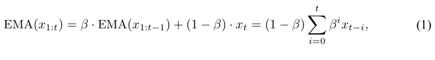

EMA relies on its smoothing coefficient *β ∈* [0*,* 1], which forces a critical trade-off: small *β* values allow quick adaptation but amplify noise, while large *β* values reduce noise but introduce significant delays. This means first-order EMA must always sacrifice either speed or stability.

Although first-order EMA’s exponentially decaying memory structure helps stabilize gradient estimates, it fundamentally suffers from two problems: it lags behind actual changes and tends to over-smooth important gradient patterns. These issues can significantly impact optimization performance, especially in complex deep learning tasks.

Higher-order EMA techniques systematically address these limitations. By using multiple levels of exponential smoothing, they can achieve both quick adaptation and noise reduction - capabilities that are mathematically impossible with first-order EMA’s single smoothing coefficient (illustrated in Fig. 1).

<figure id="fig-1">
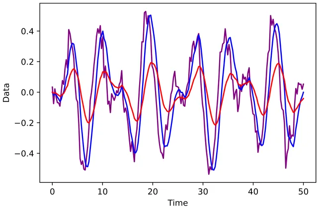
<figcaption><strong>Fig. 1</strong> Simulated demonstration of gradient trend estimation and lagging. Ground truth (GT, purple), triple exponential moving average (TEMA)-based estimation (blue), and exponential moving average (EMA)-based estimation (red)</figcaption>
</figure>

### 2.2 Double Exponential Moving Average (DEMA)

We introduce advanced smoothing techniques that address the inherent lag limitations of traditional Exponential Moving Averages (EMA). The Double Exponential Moving Average (DEMA) incorporates a lag-correction mechanism through:

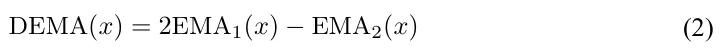

where EMAk(*x*) represents k recursive applications of EMA:

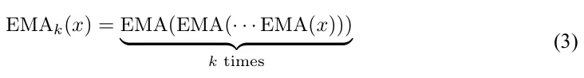

The key innovation in DEMA lies in its lag-correction term [EMA1(*x*) *−* EMA2(*x*)], which provides a robust estimation of the temporal displacement between raw data *x* and its primary smooth estimate *EMA*1(*x*). This formulation enables DEMA to achieve superior temporal responsiveness while preserving signal fidelity.

### 2.3 Triple Exponential Moving Average (TEMA)

Building upon DEMA’s foundation, the Triple Exponential Moving Average (TEMA) introduces a second-order correction mechanism:

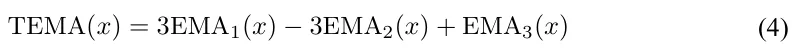

TEMA formulation emerges from a hierarchical lag correction process:

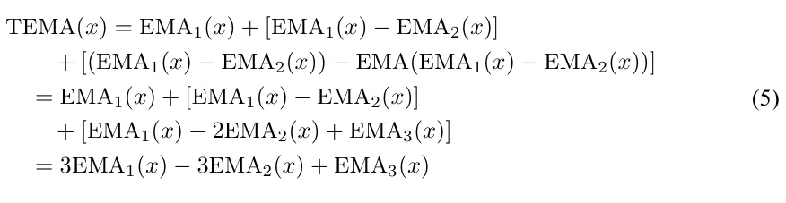

The formulation consists of three critical components: (1) the initial smooth estimate EMA1(*x*), (2) the first-order lag correction [EMA1(*x*) *−* EMA2(*x*)], and (3) the second-order refinement term [EMA1(*x*) *−* 2EMA2(*x*) + EMA3(*x*)]. This hierarchical structure enables TEMA to achieve unprecedented adaptability to temporal dynamics while maintaining signal coherence.As visualized in Fig. 2, TEMA’s components exhibit distinct phase characteristics that, when combined, achieve optimal lag reduction while preserving signal integrity. The complementary nature of these components enables robust temporal adaptation across diverse signal dynamics.

<figure id="fig-2">
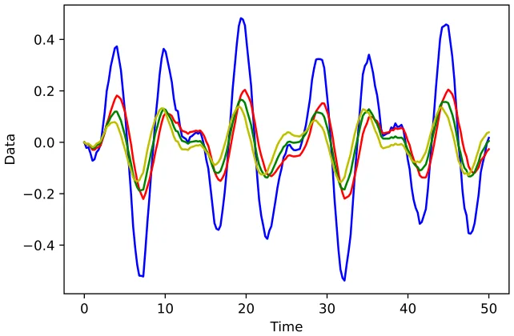
<figcaption><strong>Fig. 2</strong> Decomposition of TEMA (blue) into its constituent components: EMA1 (red), first-order correction (EMA1 <em>−</em> EMA2) (green), and second-order correction (EMA1 <em>−</em> 2EMA2 + EMA3) (yellow). The composite TEMA signal demonstrates the synergistic integration of these components</figcaption>
</figure>

### 2.4 Generalized k-th Order Exponential Moving Average

We further generalize this framework to arbitrary orders through the k-th order EMA formulation:

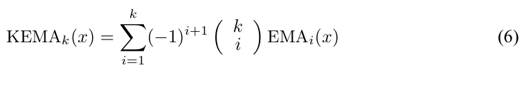

This generalization provides fine-grained control over the temporal responsiveness-smoothness trade-off, enabling optimal adaptation to specific optimization scenarios. The binomial coefficients in this formulation ensure proper weighting of higher-order corrections, maintaining mathematical consistency with lower-order variants.

### 2.5 FAME Intuition

This section provides a rigorous analysis of FAME’s underlying mechanisms and its advantages, rooted in mathematical foundations. Exponential Moving Average (EMA) is a core smoothing technique that dynamically weights sequential data, emphasizing recent values while exponentially attenuating the influence of older ones. This adaptive weighting forms a local observation window that captures short-term patterns while maintaining long-term trends. However, when EMA is recursively applied–smoothing an already smoothed signal (EMA(EMA))–the hierarchical compounding effect extends the effective observation window, facilitating more advanced trend extraction. Building upon this principle, FAME introduces three fundamental advancements:

- 1. **Hierarchical Multi-Scale Optimization**: Traditional EMA-based optimizers face an inherent trade-off: short smoothing windows enable rapid adaptation but amplify noise, while larger windows enhance stability at the cost of responsiveness. FAME overcomes this limitation through a hierarchical triple-EMA (TEMA) structure, forming a cascading filtering pyramid. The first level captures immediate gradient fluctuations, the second level refines short-term variations and consolidates emerging trends, and the third level enforces long-term stability, mitigating premature convergence and excessive

oscillations. This multi-scale architecture enables FAME to swiftly adapt to gradient changes while maintaining robust convergence, outperforming conventional first-order EMA-based optimizers.

- 2. **Adaptive Trend Identification**: Standard EMA-based optimizers react passively to past gradients, often struggling to detect new optimization patterns in real time. FAME’s TEMA mechanism integrates a three-stage verification process in which the first level detects potential shifts, the second level validates their consistency, and the third level confirms their significance. This hierarchical verification enables FAME to distinguish meaningful optimization signals from transient fluctuations, accelerating adaptation and improving convergence robustness.
- 3. **Resilient Error Correction**: First-order EMA-based optimizers exhibit slow error recovery due to their constrained smoothing capacity. FAME mitigates this limitation through its recursive multi-level filtering, where erroneous updates at one level are dynamically compensated by higher-order corrections that refine subsequent estimates. This recursive adjustment rapidly neutralizes incorrect updates, preventing instability and enhancing recovery efficiency. By continuously recalibrating its optimization trajectory, FAME ensures sustained performance even under noisy or rapidly changing gradient landscapes.

FAME’s hierarchical TEMA-based framework fundamentally enhances deep learning optimization, offering a novel synergy between adaptive responsiveness, precise trend detection, and robust error mitigation. This enables fast adaptation to gradient shifts while preserving long-term stability, establishing FAME as a superior alternative to traditional EMA-based methods.

### 2.6 Formulation of FAME

Let *f*(*θ*) be a differentiable stochastic scalar function that depends on the parameters *θ*. It is a noisy version of the expected objective function *F* (*θ*) = E[*f*(*θ*)]. Our goal is to minimize *F* (*θ*) with respect to its parameters *θ*, given only a sequence *f*1(*θ*)*, . . . , f*T (*θ*) of realizations of the stochastic function *f* at subsequent time steps 1*, . . . , T*. The stochasticity in *f* may originate from evaluations on random subsamples of data points or from inherent function noise.

#### 2.6.1 Gradient Estimation

The gradient, i.e., the vector of partial derivatives of *f*t with respect to *θ*, evaluated at time step *t*, is denoted by:

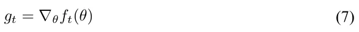

#### 2.6.2 Moment Estimation

Similar to Adam, FAME tracks the first-order and second-order moments (*m*t*, v*t) of the gradients using an exponential moving average (EMA):

*m*t = *β*1*m*t−1 + (1 *− β*1)*g*t *v*t = *β*2*v*t−1 + (1 *− β*2)*g*2 *t*

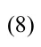

where the hyperparameters *β*1*, β*2 *∈* [0*,* 1) control the exponential decay rates of these moving averages.

FAME extends beyond traditional optimizers by incorporating higher-order moment estimations. It tracks additional variables (*dm*t*, dv*t) for estimating EMA2:

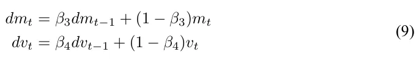

Based on (*dm*t*, dv*t), FAME further estimates EMA3 using variables (*tm*t*, tv*t):

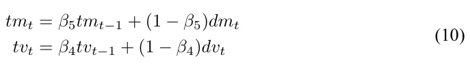

Here, (*m*0*, v*0), (*dm*0*, dv*0), and (*tm*0*, tv*0) are all initialized to 0.

Incorporating Eqs. (8–10) into the Triple Exponential Moving Average (TEMA) equation (Eq. 4) yields:

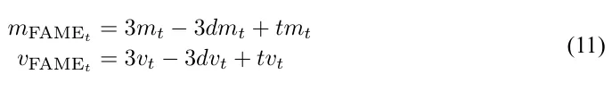

#### 2.6.3 Parameter Update Rule

The final parameter update equation for FAME is given by:

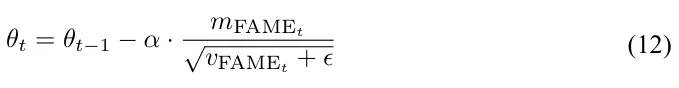

where *α* is the learning rate and *ϵ* is a small constant to prevent division by zero.

In our experiments, we assigned the following values for the hyper-parameters: *α* = 0*.*001, *β*1 = 0*.*9, *β*2 = 0*.*999. These values are commonly used by Adam in literature. We also selected *β*3 = 0*.*3, *β*4 = 0*.*7, *β*5 = 0*.*8 and *ϵ* = 1*e −* 8 for our FAME. These values were chosen empirically as they supplied the best results. The FAME’s pseudo-code is provided in Algorithm 1.

<figure class="table-figure" id="alg-1">
<figcaption><strong>Algorithm 1</strong> FAME Optimizer</figcaption>
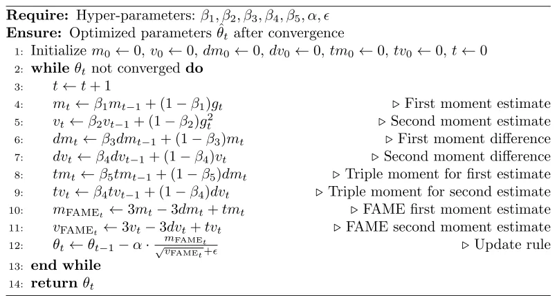

</figure>

## 3 Experiments

We validated the FAME optimizer across *five diverse benchmarks* and *22 model architectures* with varying complexities, covering tasks like detection, classification, and semantic understanding. Importantly, we compared our FAME optimizer to *Adam, SGD, and AdamW as they are the most widely used and well-established baselines in deep learning.* SGD serves as the fundamental optimizer with strong generalization properties, while Adam introduces adaptive learning rates and is the default choice for many architectures. AdamW further improves weight decay handling, making it a strong benchmark. The literature indicates that most alternative optimizers are merely refinements of Adam and SGD, typically yielding only marginal improvements (at best scenario). As a result, additional comparisons would offer limited new insights and are, therefore, redundant. Furthermore, prior literature primarily benchmarks against these three, ensuring our results remain comparable to existing studies.

### 3.1 Experimental Data

We tested our proposed FAME on five public benchmarks: CIFAR-100 (Krizhevsky, 2009), MS-COCO (Lin et al., 2014), PASCAL-VOC (Everingham et al., 2015), Cityscapes (Cordts et al., 2016), and the large scale ImageNet (Russakovsky et al., 2015).

### 3.2 Implementation Details

Four key methodological choices were carefully implemented to isolate the optimizer’s true impact and ensure comparisons that are fully controlled, fair, rigorous, and transparent:

**First**, the optimizer was the only variable altered across experiments; all other components of the training pipeline–including model architecture and training procedures–were held strictly constant. This design eliminates confounding factors and ensures that any minor deviations from literature-reported results–arising from weight initialization or inherent stochastic dynamics–impact all optimizers.

**Second**, all models were trained from scratch, deliberately avoiding pretrained weights. This enables a pure and unbiased assessment of the influence of each optimizer on model performance and generalization. While this choice may lead to slightly lower absolute accuracy compared to pretrained settings, it provides a pure evaluation of the optimizer behavior.

**Third**, we adhered to the optimal hyperparameters reported in the literature for baseline optimizers, ensuring that our baseline results are consistent with established practice. Minor variations (compared with literature) are naturally expected due to the inherent stochasticity of training and weight initialization.

**Fourth**, we used identical random seeds across all optimizers for each model, rigorously controlling for randomness and ensuring that all observed differences in performance are attributable solely to the optimizer choice.

## 4 Results

In pursuit of a comprehensive analysis, we computed several statistical metrics, including accuracy, mAP (mean Average Precision), precision, recall, and F1-score. This involved evaluating the average and standard deviation across three distinct model initializations, solidifying the robustness of our method’s validation.

### 4.1 Image Classification

#### 4.1.1 CIFAR-100 Benchmark

FAME demonstrates superior performance on CIFAR-100 across 17 diverse models (Table 1). When compared with commonly used optimizers, FAME achieved superior accuracy in 84.6% of the models, consistently outperforming existing methods with averaged accuracy improvements of 1.16% over AdamW, 1.57% over AdaBound, 3.52% over AdaHessian, and 16.33% over AdaGrad.

Beyond accuracy gains, FAME demonstrated superior training stability across diverse models. For CNN-based models, FAME reduced epoch-wise accuracy variance by 29.27% compared with existing optimizers (Adam, SGD, AdamW, AdaBound, AdaHessian, AdaGrad). This stability advantage persisted in transformer-based models, where FAME achieves a 21.54% variance reduction compared with the same baseline optimizers. Such consistent stability across different models highlights FAME’s robustness to gradient dynamics, effectively mitigating the training fluctuations common in current methods.

#### 4.1.2 ImageNet Benchmark

Our ImageNet experiments reveal FAME’s compelling advantages across models. For CNN-based models, FAME achieved consistent accuracy improvements of 0.8% over Adam and 0.65% over SGD. The gains were even more pronounced in Transformer-based models, where FAME surpassed Adam by 0.97% and SGD by 1.27%. Beyond accuracy improvements, FAME enhanced the training process in two critical aspects. First, it provided superior training stability, reducing accuracy fluctuations variance by 5.64% compared with SGD, Adam, and AdamW. Second, it accelerated convergence significantly, reaching 90% of peak accuracy while using only 78% of the epochs required by other optimizers. This comprehensive enhancement in accuracy, stability, and training efficiency establishes FAME as a powerful optimization solution for large-scale vision tasks.

<figure class="table-figure" id="table-1">
<figcaption><strong>Table 1</strong> Performance comparison of various models using different optimization techniques on CIFAR-100 and ImageNet datasets</figcaption>
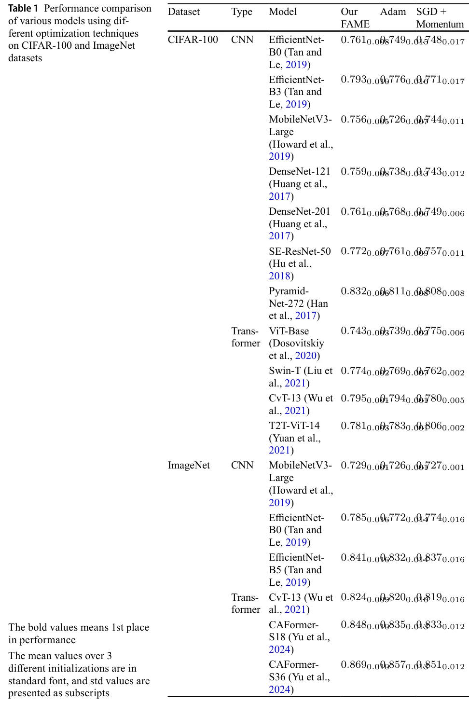

</figure>

### 4.2 Object Detection

#### 4.2.1 MS-COCO Benchmark

Table 2 demonstrates FAME’s effectiveness on the MS-COCO benchmark using YOLOv5- S model, where it consistently outperforms standard optimizers including SGD, Adam, and AdamW. FAME achieved a mean Average Precision (mAP@0.5) of 0.569, surpassing SGD (0.549), Adam (0.265), and AdamW (0.446), and also excelled in mAP@0.5:0.95 with a score of 0.375 compared to 0.352 for SGD, 0.211 for Adam, and 0.271 for AdamW. In terms of Precision, FAME scored 0.663, indicating a high proportion of true positives, while Recall was at 0.521, showcasing its effectiveness in capturing relevant objects. Additionally, FAME’s F1-Score of 0.583 reflects a strong balance between precision and recall, significantly outperforming SGD (0.518), Adam (0.275), and AdamW (0.471). Overall, these results affirm FAME’s enhanced object detection capabilities, positioning it as a robust optimization method in comparison to established techniques.

#### 4.2.2 Pascal-VOC Benchmark

Table 3 presents the analysis of the Pascal Visual Object Classes (VOC) dataset for detection and classification tasks, highlighting FAME’s advantages over conventional optimizers like SGD, Adam, and AdamW. For the YOLOv5-S model, FAME achieved a mean Average Precision (mAP) of 0.812, which exceeds the performance of SGD (0.787), Adam (0.651), and AdamW (0.801). Similarly, FAME recorded an impressive mAP of 0.851 for the YOLOv5-m model, compared with SGD (0.828), Adam (0.662), and AdamW (0.83). In classification using the RevViT model, FAME reached an AUC score of 0.696, surpassing SGD (0.679), Adam (0.637), and AdamW (0.671). These findings demonstrate that FAME consistently enhances performance in both detection and classification tasks, underscoring its efficacy as an optimization technique relative to commonly used methods.

<figure class="table-figure" id="table-2">
<figcaption><strong>Table 2</strong> Object detection results on MS-COCO using YOLOv5-s (Li et al., 2023) and different optimization techniques</figcaption>

<table><tr><th>Metric</th><th>Our FAME</th><th>SGD Adam AdamW</th></tr><tr><td>mAP@0.5</td><td>0.5690.003</td><td>0.5490.0050.2650.021 0.4460.013</td></tr><tr><td>mAP@0.5:0.95</td><td>0.3750.003</td><td>0.3520.0050.2110.021 0.2710.014</td></tr><tr><td>Precision</td><td>0.6630.009</td><td>0.6580.0110.3320.013 0.5420.011</td></tr><tr><td>Recall</td><td>0.5210.006</td><td>0.4270.0060.2340.019 0.4170.007</td></tr><tr><td>F1-Score</td><td>0.5830.008</td><td>0.5180.0120.2750.014 0.4710.004</td></tr><tr><td>The bold values</td><td>means 1st place in</td><td>performance</td></tr><tr><td>The mean accuracy</td><td>values over</td><td>3 different initializations are in</td></tr><tr><td>standard font, and</td><td>std values are</td><td>presented as subscripts. The results</td></tr><tr><td>match those of</td><td>training from scratch,</td><td>as reported in the literature</td></tr></table>

</figure>

<figure class="table-figure" id="table-3">
<figcaption><strong>Table 3</strong> Pascal Visual Object Classes (VOC) for detection/classification tasks using various models and different optimization techniques</figcaption>
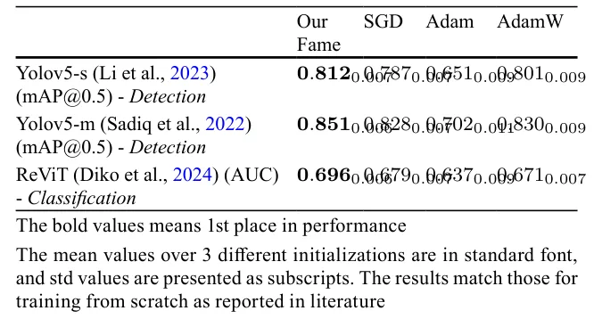

</figure>

<figure class="table-figure" id="table-4">
<figcaption><strong>Table 4</strong> Cityscapes semantic segmentation. Performance comparison of various deep models using different optimization techniques</figcaption>

<table><tr><th>Model</th><th>Our FAME</th><th>Adam</th><th>SGD</th></tr><tr><td>DL-V3+ResNet50*</td><td>0.8060.009</td><td>0.8030.011</td><td>0.7690.013</td></tr><tr><td>DL-V3+ResNet101*</td><td>0.7980.009</td><td>0.7850.014</td><td>0.7630.012</td></tr><tr><td>DL-V3+MobileNetV2*</td><td>0.7300.013</td><td>0.7230.014</td><td>0.6670.018</td></tr><tr><td>HANet-ResNet101*</td><td>0.8360.001</td><td>0.8330.001</td><td>0.8170.013</td></tr><tr><td>DL-V3+Xception</td><td>0.7080.002</td><td>0.7030.001</td><td>0.6790.008</td></tr></table>

Cityscapes benchmark. "DL" - DeepLab (Chen et al., 2018). Comparison of classification mIoU (Mean ± Std) supplied by different optimizers across models. <strong>Best results for each model are bolded</strong>. All SGD and Adam results are comparable to the literature results when training from <strong>scratch</strong>. The mean values over 3 different initializations are in standard font, and std values are presented as subscripts. * indicated pretrained on ImageNet to show FAME’s strength also in pretrained scenarios, otherwise - training from scratch (DL-V3+Xception)

</figure>

### 4.3 Semantic Segmentation

Our evaluation of the Cityscapes benchmark demonstrates FAME’s consistent superiority across diverse models (Table 4). FAME achieved for all tested models, with improvements ranging from 0.003% to 1.3% over Adam and 2.5% to 6.3% over SGD. The results also reveal FAME’s stability advantage, evidenced by consistently lower standard deviations across three initializations.

### 4.4 Robustness across Datasets, models, and Weight Initializations

Tables 1, 2, 3 and 4 show that for 87.16% of the models, FAME outperforms all the other optimizers examined in this study, and its performance is comparable with those of the other optimizers for the remaining 12.9% cases. Thus, its high robustness within and across datasets was established. Furthermore, FAME demonstrated a lower standard deviation across the different weight initializations.

<figure class="table-figure" id="table-5">
<figcaption><strong>Table 5</strong> Effect of the EMA order on the model’s performance</figcaption>

<table><tr><th>Dataset</th><th>Model</th><th>EMA DEMA Our FAME</th></tr><tr><td>CIFAR-100</td><td>ResNet34</td><td>0.7210.008 0.7270.0060.7360.006</td></tr><tr><td>MS-COCO</td><td>YOLOv5-s (Li et al., 2023)</td><td>0.2650.021 0.3170.0040.5690.013</td></tr><tr><td>PASCAL-VOC</td><td>YOLOv5-m (Sadiq et al., 2022)</td><td>0.6620.011 0.8060.0050.8510.006</td></tr><tr><td>Cityscapes</td><td>DL-V3+ResNet50*</td><td>0.7430.008 0.7510.0050.7570.005</td></tr></table>

Comparison of model performance (Mean and Std) supplied by different optimizers across datasets. <strong>Best results for each dataset are bolded</strong>. The mean values over 3 different initializations are in standard font, and std values are presented as subscripts

</figure>

<figure class="table-figure" id="table-6">
<figcaption><strong>Table 6</strong> Ablation study</figcaption>
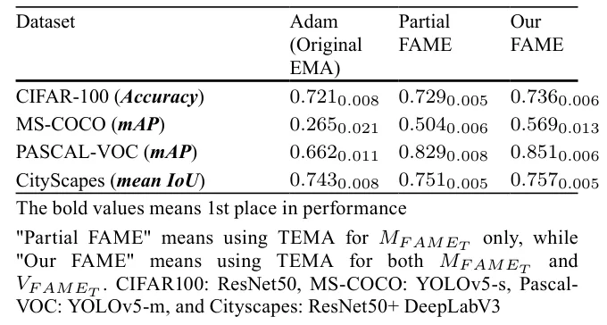

</figure>

### 4.5 Ablation Study

- **Effect of High-Order EMAs**—Table 5 shows that increasing the order of the EMA from simple EMA to DEMA, and then to TEMA, leads to improved model performance. Although the 4th order was also tested, it underperformed compared to TEMA, which balanced between trend estimation, smoothness and lag reduction. The results emphasize that our triple-based FAME consistently outperformed other high-order EMAs across various datasets, tasks, and models, delivering superior accuracy.
- **Effect of TEMA on Different Moments**—Table 6 illustrates how incorporating TEMA into the 1st and 2nd moments of FAME enhanced its performance. The shift from EMA to Partial TEMA (for 1st *m*FAMEt moment only) and then to full FAME (for both *m*FAMEt and *v*FAMEt moments) consistently boosted accuracy. This demonstrates FAME’s capability to improve optimization across object detection, classification, and segmentation tasks, regardless of the dataset or model.

### 4.6 Sensitivity to Hyper-parameters Tuning

#### 4.6.1 FAME’s Hyper-parameter Robustness

Although FAME introduces three additional hyperparameters (*β*3, *β*4, *β*5) beyond Adam’s *β*1 and *β*2, it demonstrates consistently higher robustness to varied hyperparameter settings.

For **Adam**, *β*1 and *β*2 were independently swept over the range [0.9, 0.99], which encompasses their values recommended in the literature. We used a 9 *×* 9 grid with 0.01 increments to include all optional combinations of *β*1 and *β*2. Following best known practices, Adam’s hyperparameters were then fixed to rigorously isolate and assess the sensitivity of the additional parameters of FAME. We conducted independent sweeps of FAME’s *β*3, *β*4, and *β*5 in a substantially broader and more challenging range (compared to Adam’s) of [0.1, 0.9], using a 9 *×* 9 *×* 9 grid with 0.1 increments. This more extensive exploration further underscores the inherent stability of FAME in diverse hyperparameter configurations. Evaluated on example models from three main benchmarks, FAME exhibited only 3.72% performance variation across all models and datasets tested, compared to 10.12% supplied by Adam (Table 7 in the Supplementary material). Importantly, FAME’s hyperparameters were fixed after choosing their optimal combination and were used consistently in all tasks, eliminating the need for per-task adjustment and further highlighting the practical robustness of FAME.

#### 4.6.2 General Deep Model’s Hyper-parameters

While we initially adopted hyperparameter values from the literature, we conducted a further focused grid search around these well-explored defaults in selective representative models, systematically exploring neighboring configurations for all core hyperparameters, including batch size, learning rate, momentum, weight decay, and number of epochs. This rigorous exploration provided a robust and consistent foundation for our evaluation.

### 4.7 Memory Cost and Computational Efficiency

FAME introduces only a marginal per-epoch overhead of 3.7% in memory usage and 2.85% in computation time, relative to Adam’s 1st-order *EMA* baseline (averaged across all tested models). These values were measured on an NVIDIA A100 GPU.

Importantly, this minimal overhead is more than offset by the superior training efficiency of FAME that requires only 76.3% of the total training epochs that Adam typically needs to achieve convergence. As a result, FAME not only preserves comparable memory and computational efficiency but also delivers substantially faster convergence.

As illustrated in Table 8 (Supplementary Material), these trends remain consistent across a broad range of models and datasets.

### 4.8 Convergence Analysis

To demonstrate the convergence of the proposed FAME algorithm, we begin by establishing a mathematical framework. Let *d ∈* N represent the number of parameters in the function *F* : Rd *→* R that we aim to optimize. In the domain of machine learning, *F* embodies the complete training objective function, and optimization algorithms are employed to locate critical points within *F*. Specifically, our focus lies on optimization techniques that expand upon the classical Gradient Descent (GD) algorithm by integrating a heavy-ball style momentum parameter (Polyak, 1964). These algorithms exhibit a continuously diminishing step size from an initial finite step, leading to a monotonically decreasing process (Kingma and Ba, 2014). This behavior underscores their progression towards convergence.

Let us assume several constraints: 0 *≤ β*5 *≤ β*3 *≤ β*1 *≤* 1 and 0 *≤ β*4 *≤ β*2 *≤* 1, along with the condition *β*1 *≤ β*2, and a non-negative value for *α*.

According to Algorithm 1, we define three sequences, *m*i*, v*i*, θ*i *∈* Rn, where *n* denotes the dimension of the parameter space. Given an initial point *θ*0 *∈* Rn and setting *m*0 = *v*0 = 0, we proceed under three primary assumptions:

- The loss function *F* is bounded below by an arbitrary function *F* ∗ for any point *∀θ ∈* Rn : *F* ∗(*θ*) *≤ F* (*θ*).
- The loss function, concerning the max-norm (*l*∞), is uniformly and surely bounded: *∀ϵ >* 0*, ∃r > ϵ∀θ ∈* Rn : *||∇F||*∞ *≤ r − ϵ*.
- The loss function maintains L-Lipschitz continuity concerning the *l*2-norm: *∀θ, ζ ∈* Rn : *||∇F* (*θ*) *− F* (*ζ*)*||*2 *≤ L||θ − ζ||*2.

For a specific number of iterations *N ∈* N, we introduce *τ* as a random index ranging from *{*0*, . . . , N −* 1*}*, where *∀i ∈* N : *i < N, P* [*τ* = *i*] *∝* 1 *− β*N−i 1 . This implies that for *β*1 = 0, *τ* is uniformly sampled, while higher orders approaching zero lead to fewer samples in later iterations. This stratagem aims to limit the expected squared gradient norm at iteration *τ*.

For *N > β*1*/*(1 *− β*1) *∈* N, the following inequality holds:

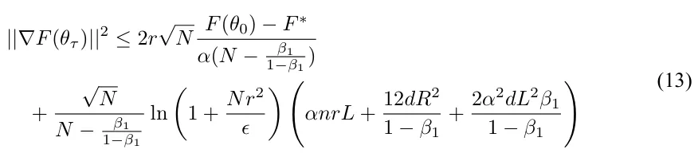

Continuing with Algorithm 1, we can split the proof into two cases:

- When *β*3 = *β*5 = *β*4 = 0, the algorithm adopts the form *θ*t = *θ*t−1 *− α* mt vt , akin to the AdaGrad algorithm, known for convergence (Defossez et al., 2022).
- For *∃j ∈{*3*,* 4*,* 5*}* : *β*j *>* 0, *dm*t*, tm*5*, dv*t*,* and *tv*t depend on *m*t and *v*t, converging at some point following the first case. Thus, a *δ ∈* N emerges with *ϵ∥ψ*δ *− ψ*δ−1*∥*2 *≤ ϵ*∗ for *ψ ∈{dm, tm, dv, tv}*. Consequently, beyond this interaction (*δ*), the update rule transforms into *∀t > δ* : *θ*t = *θ*t−1 *− α* mt+c1 vt+c2 , with *c*1*, c*2 *∈* Rn. This update rule can be upper-bounded by a constant *c*3 *∈* Rn, resembling ADAgrad, because the adaptive update roughly aligns with the descent direction. Thus, the convergence at *τ ∈* N implies subsequent steps being smaller, bounded by ADAgrad convergence processes from the same initial configuration.

Ultimately, by establishing an upper limit to convergence in the second case, we demonstrate convergence in this scenario as well.

## 5 Conclusion

FAME represents a substantial advancement in core optimization algorithms, leveraging TEMA to effectively address the well-known limitations of EMA-based optimizers in gradient tracking and optimization lag. In comprehensive evaluations spanning 22 diverse architectures across classification, detection, and dense prediction tasks, FAME demonstrated consistent superiority – achieving state-of-the-art performance in 88.46% of all models’ experiments while maintaining exceptional stability. Critically, FAME delivered a 23.7% reduction in the total number of training epochs while maintaining robust performance across vastly different architectures and benchmarks. This combination of superior accuracy, high robustness, and faster convergence, grounded in the hierarchical EMA structure of FAME, establishes FAME as a powerful optimizer that contributes to the theoretical understanding of optimization dynamics and delivers substantial practical improvements.

While FAME exhibits significant advantages over previous optimizers, its triple EMA structure adds a *∼* 3% per-epoch overhead in memory and computation. Though this overhead is generally mitigated by its accelerated convergence, it could potentially present a per-epoch challenge in extremely resource-constrained settings.

**Supplementary Information** The online version contains supplementary material available at https://doi.org /10.1007/s10994-025-06992-x.

**Author Contributions** R.P. contributed to methodology, software development, formal analysis, investigation, data curation, and visualization, as well as manuscript review and editing. Y.S. was involved in software development and experimental work. T.L. was responsible for formal analysis, and manuscript review and editing. A.H. provided overall leadership overseeing conceptualization, methodology, validation, and formal analysis while also managing computational resources, conducting investigations, drafting the manuscript, supervising the research, and overseeing project administration.

**Funding** Open access funding provided by Ariel University. The authors did not receive support from any organization for the submitted work.

**Data Availability** All the analyzed data consists of publicly available benchmark datasets that are widely used for validating techniques in computer vision. Detailed references to these datasets are provided within the paper.

### Declarations

**Conflict of interest** The authors declare no Conflict of interest.

**Ethics Approval and Consent to Participate** Not applicable.

## References

1. Chen, L., Zhu, Y., Papandreou, G., Schroff, F., & Adam, H. (2018). Encoder-decoder with atrous separable convolution for semantic image segmentation. CoRR abs/1802.02611 Cordts, M., Omran, M., Ramos, S., Rehfeld, T., Enzweiler, M., Benenson, R., Franke, U., Roth, S., & Schiele, B. (2016). The cityscapes dataset for semantic urban scene understanding. In Proceedings of the IEEE conference on computer vision and pattern recognition, pp. 3213–3223. Defossez, A., Bottou, L., Bach, F., & Usunier, N. (2022). A simple convergence proof of adam and adagrad. Machine Learning Research. Diko, A., Avola, D., Cascio, M., & Cinque, L. (2024). ReViT: Enhancing vision transformers feature diversity with attention residual connections, https://arxiv.org/abs/2402.11301.Dosovitskiy, A., Beyer, L., Kolesnikov, A., Weissenborn, D., Zhai, X., Unterthiner, T., Dehghani, M., Minderer, M., Heigold, G., Gelly, S., Uszkoreit, J., & Houlsby, N. (2020). An image is worth 16 × 16 words: Transformers for image recognition at scale. CoRR abs/2010.11929. Duchi, J., Hazan, E., & Singer, Y. (2011). Adaptive subgradient methods for online learning and stochastic optimization. Journal of Machine Learning Research, 12, 2121–2159. Everingham, M., Eslami, S. M. A., Van Gool, L., Williams, C. K. I., Winn, J., & Zisserman, A. (2015). The pascal visual object classes challenge: A retrospective. International Journal of Computer Vision,111(1), 98–136. Han, D., Kim, J., & Kim, J. (2017). Deep pyramidal residual networks. In 2017 IEEE conference on computer vision and pattern recognition (CVPR), pp. 6307–6315. Howard, A., Sandler, M., Chen, B., Wang, W., Chen, L.-C., Tan, M., Chu, G., Vasudevan, V., Zhu, Y., Pang, R., Adam, H., & Le, Q. (2019). Searching for MobileNetV3 . In IEEE/CVF international conference on computer vision (ICCV) pp. 1314–1324. Hu, J., Shen, L., & Sun, G. (2018). Squeeze-and-excitation networks. In 2018 IEEE/CVF conference on computer vision and pattern recognition, pp. 7132–7141. Huang, G., Liu, Z., Van Der Maaten, L., & Weinberger, K.Q. (2017). Densely connected convolutional networks. In 2017 IEEE conference on computer vision and pattern recognition (CVPR), pp. 2261–2269. Keskar, N.S., & Socher, R. (2017). Improving generalization performance by switching from adam to sgd. arXiv Kingma, D.P., & Ba, J. (2014). Adam: A method for stochastic optimization. arXiv preprint arXiv:1412.6980 Krizhevsky, A. (2009). Learning multiple layers of features from tiny images. Technical report, 32–33. Landro, N., Gallo, I., & Grassa, R.L. (2020). Mixing ADAM and SGD: A combined optimization method. CoRR abs/2011.08042 arXiv:2011.08042 Li, S., Tian, J., Wang, Z., Zhang, L., Liu, Z., Jin, W., Liu, Y., Sun, B., & Li, S. Z. (2024). Unveiling the backbone-optimizer coupling bias in visual representation learning https://arxiv.org/abs/2410.06373 Lin, T.-Y., Maire, M., Belongie, S., Hays, J., Perona, P., Ramanan, D., Dollár, P., & Zitnick, C. L. (2014). Microsoft coco: Common objects in context. In European conference on computer vision, pp. 740–755. Springer. Li, A., Sun, S., Zhang, Z., Feng, M., Wu, C., & Li, W. (2023). A multi-scale traffic object detection algorithm for road scenes based on improved yolov5. Electronics, 12(4), 878. Liu, Z., Lin, Y., Cao, Y., Hu, H., Wei, Y., Zhang, Z., Lin, S., & Guo, B. (2021). Swin transformer: Hierarchical vision transformer using shifted windows. CoRR abs/2103.14030 Loshchilov, I., & Hutter, F. (2017). Fixing weight decay regularization in adam. arXiv preprint arXiv:1711.05101, 5:5 Luo, L., Xiong, Y., Liu, Y., & Sun, X. (2019). Adaptive gradient methods with dynamic bound of learning rate. CoRR arxiv:1902.09843 Mulloy, P. G. (1994). Smoothing data with faster moving averages. Technical Analysis of Stocks & Commodities. Polyak, B. T. (1964). Some methods of speeding up the convergence of iteration methods. USSR computational Mathematics and Mathematical Physics. Qian, N. (1999). On the momentum term in gradient descent learning algorithms. Neural networks: the official journal of the International Neural Network Society, 12(1), 145–151. Reddi, S. J., Kale, S., & Kumar, S. (2019). On the convergence of adam and beyond. CoRR arxiv:1904.09237 Robbins, H., & Monro, S. (1951). A stochastic approximation method. The annals of mathematical statistics, 400–407. Russakovsky, O., Deng, J., Su, H., Krause, J., Satheesh, S., Ma, S., Huang, Z., Karpathy, A., Khosla, A., Bernstein, M., Berg, A. C., & Fei-Fei, L. (2015). ImageNet large scale visual recognition challenge. International Journal of Computer Vision (IJCV), 115(3), 211–252. Sadiq, M., Masood, S., & Pal, O. (2022). Fd-yolov5: A fuzzy image enhancement based robust object detection model for safety helmet detection. International Journal of Fuzzy Systems, 24. Tan, M., & Le, Q. V. (2019). Efficientnet: Rethinking model scaling for convolutional neural networks. CoRR abs/1905.11946. Tieleman, T., & Hinton, G. (2012). Lecture 6.5—RmsProp: Divide the gradient by a running average of its recent magnitude. COURSERA: Neural Networks for Machine Learning. Wu, H., Xiao, B., Codella, N., Liu, M., Dai, X., Yuan, L., & Zhang, L. (2021). Cvt: Introducing convolutions to vision transformers. In 2021 IEEE/CVF international conference on computer vision (ICCV), pp. 22–31. Xie, X., Zhou, P., Li, H., Lin, Z., & Yan, S. (2024). Adan: Adaptive nesterov momentum algorithm for faster optimizing deep models. IEEE Transactions on Pattern Analysis and Machine Intelligence, 46(12), 9508–9520. https://doi.org/10.1109/TPAMI.2024.3423382 Yao, Z., Gholami, A., Shen, S., Mustafa, M., Keutzer, K., & Mahoney, M. (2021). Adahessian: An adaptive second order optimizer for machine learning. Proceedings of the AAAI Conference on Artificial Intelligence, 35, 10665–10673. Yu, W., Luo, M., Zhou, P., Si, C., Zhou, Y., Wang, X., Feng, J., & Yan, S. (2022). Metaformer is actually what you need for vision. In 2022 IEEE/CVF conference on computer vision and pattern recognition (CVPR), pp. 10809–10819. https://doi.org/10.1109/CVPR52688.2022.01055 Yuan, L., Chen, Y., Wang, T., Yu, W., Shi, Y., Jiang, Z., Tay, F.E.H., Feng, J., & Yan, S. (2021). Tokens-to-token vit: Training vision transformers from scratch on imagenet. In 2021 IEEE/CVF international conference on computer vision (ICCV), pp. 538–547. Yu, W., Si, C., Zhou, P., Luo, M., Zhou, Y., Feng, J., Yan, S., & Wang, X. (2024). Metaformer baselines for vision. IEEE Transactions on Pattern Analysis and Machine Intelligence, 46(2), 896–912. Authors and Affiliations Roi Peleg1,2 · Yair Smadar1,2 · Teddy Lazebnik3,4 · Assaf Hoogi1,2 Assaf Hoogi ahoogi@gmail.com Roi Peleg roi2307@gmail.com Yair Smadar yair.smadar1@gmail.com Teddy Lazebnik teddy.lazebnik@ju.se [doi:10.1007/s11263-015-0816-y](https://doi.org/10.1007/s11263-015-0816-y) · [link](https://arxiv.org/abs/2402.11301) · [link](http://arxiv.org/abs/1412.6980)
1. 1 School of Computer Science, Ariel University, Ariel, Israel
2. 2 Data Science and Artificial Intelligence Research Center, Ariel University, Ariel, Israel
3. 3 Department of Information Systems, Haifa University, Haifa, Israel
4. 4 Department of Computing, Jonkoping University, Jonkoping, Sweden
