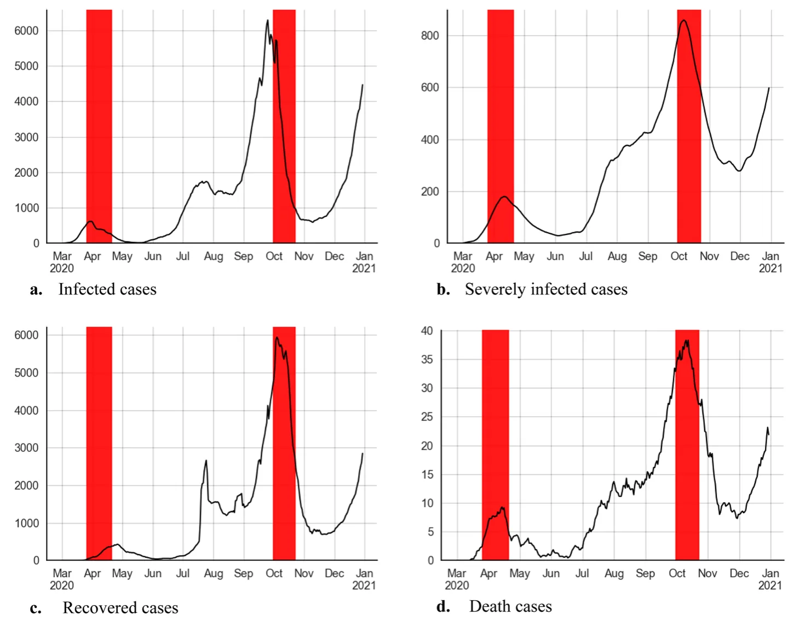
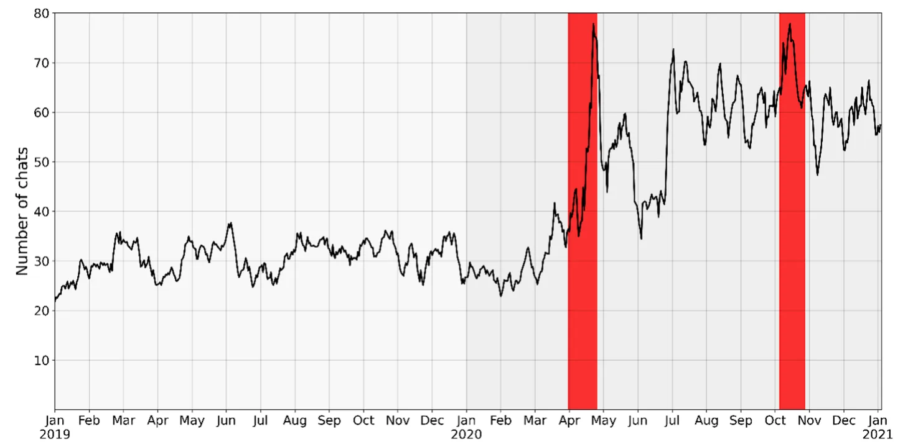
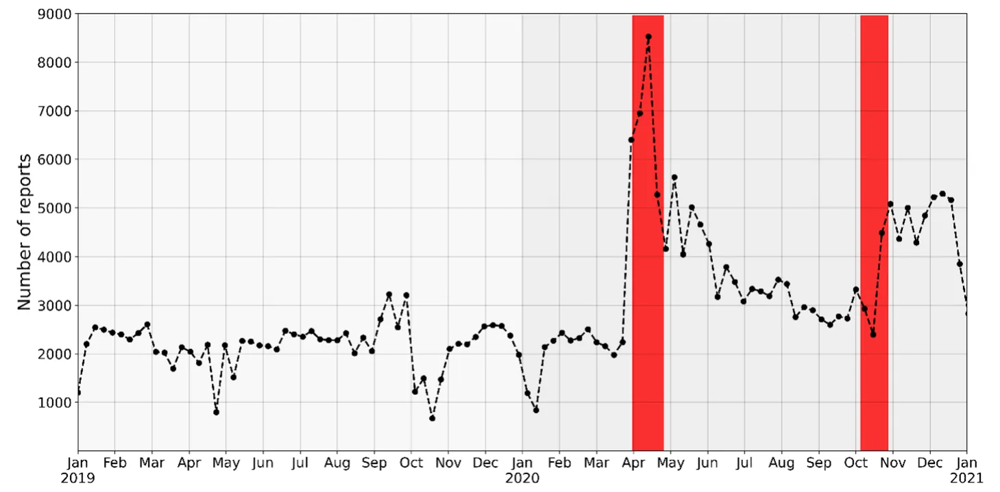
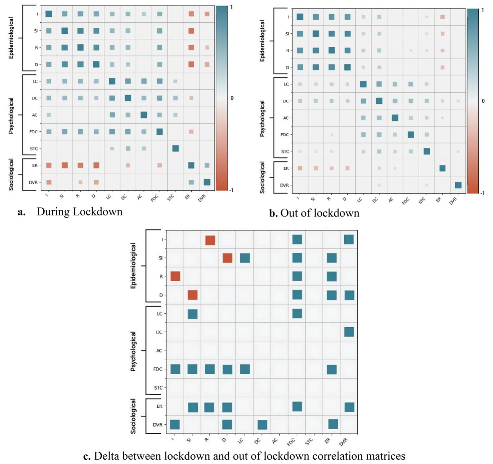
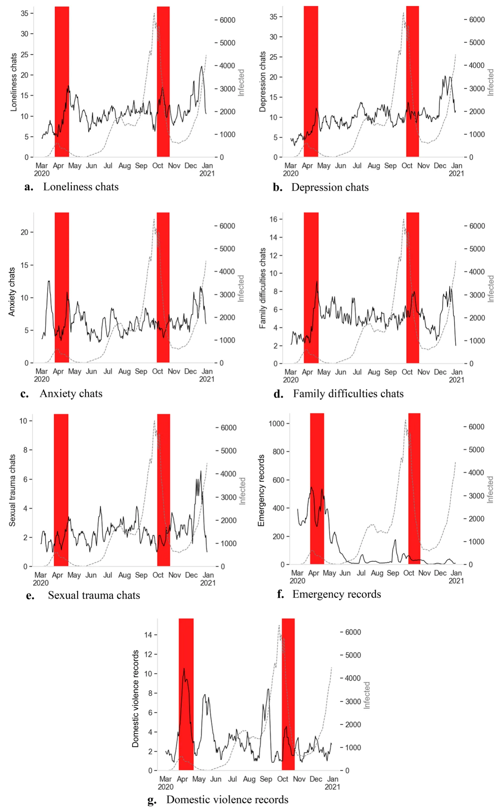
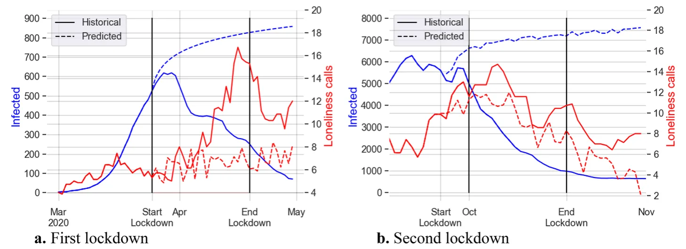
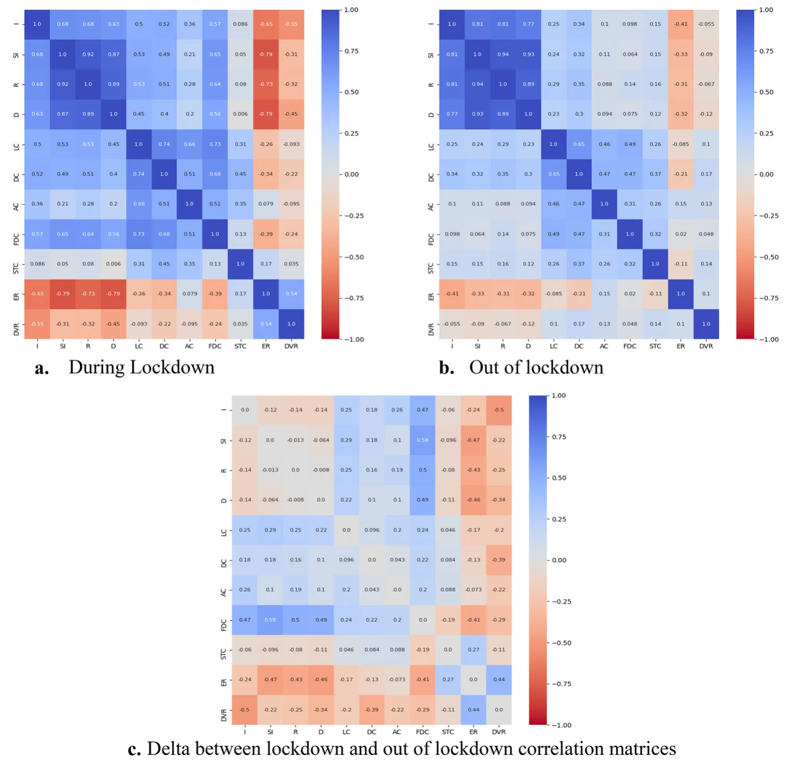
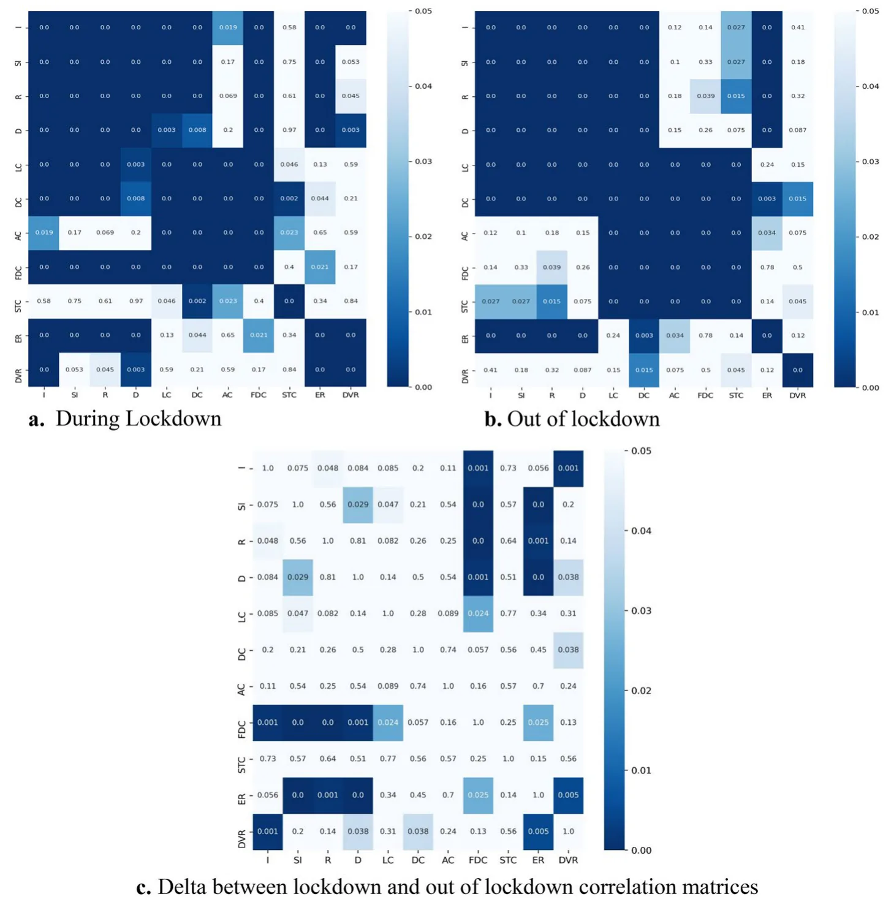

## Introduction

The severe acute respiratory syndrome coronavirus pandemic, also known as the COVID-19 pandemic, reached Europe and the western world from China at the beginning of 2020. Following massive worldwide infections and loss of lives, the World Health Organization has declared a public health emergency [1]. The state of Israel

Noa Vardi and Teddy Lazebnik contributed equally to this work.

was no different, and in 2020 tens of thousands of infected individuals and hundreds of deaths have been recorded due to the COVID-19 pandemic [2]. Around the world, governments implemented various pandemic intervention policies (PIPs) to control the pandemic and reduce its spread. Responses included social distancing, wearing a mask, closing schools, prohibiting mass public gatherings, and non-essential worker restrictions. In cases where these containment strategies have been insufficient to overthrow the pandemic spread, and the threat and panic intensified, governments have adopted a lockdown PIP [3]. Indeed, in Israel (2020), due to the pandemic outbreak, policymakers conducted a tightened lockdown between March 25th, 2020, and April 18th, 2020 (in this work, “the first lockdown”). Later, another COVID-19 wave was recorded in Israel, and a second tightened lockdown took place between September 25th, 2020, and October 17th, 2020 (in this work, “the second lockdown”). Studies have shown that an implementation of a lockdown is effective in reducing the number of infections and death, preventing congestion in hospitals, reducing the reproduction rate, and altering the course of the pandemic [4, 5], but not without psychological and sociological costs for the population [6, 7].

Lockdowns involve significant short- and long-term negative consequences on the population’s mental health [8]. In the general population, depressive, anxiety, and post-traumatic stress symptoms arose among a large percentage of the population (e.g., [9]). People reported a sense of losing control over their lives and their future, psychological distress, and negative feelings such as stress, low mood, and loneliness (e.g., [10]), and the condition of individuals dealing with psychiatric illness has worsened [11]. Financially, a considerable percentage of people lost their jobs and got into financial difficulties that affected their relationships, decreased their well-being, and might accompany them for many years [12]. Moreover, social support was largely limited due to lockdowns and prolonged isolation [13]. Intimate and romantic relationships were undermined, and divorce rates have risen [14].

These studies place the adverse emotional impact experienced by the population alongside the benefits with respect to limited pandemic spread. However, they involve two notable drawbacks. First, most of them used self-reporting tools, known as a biased index. For example, exaggerating the severity of health problems in situations of application for disability benefits, as well as underreporting as a result of shame, have been documented ([15, 16]; respectively). Second, the lockdown has delayed effects on physical and mental health [17], but relatively minor attention has been dedicated to the delayed processes, the dynamics of mental difficulties, and the causal role of lockdowns, among others, due to the limitations of cross-sectional design and spot sampling.

The pandemic period in general, and lockdown days in particular, have driven various sociological processes [18]. Mixed findings appear in the literature regarding the effect of the COVID-19 pandemic on crime rates. In the United States, a decline in the crime rate has been documented, including decreasing violent crimes, robberies, assaults, and burglaries, as reflected in the number of calls to relevant government services [19, 20]. However, there are reservations about this trend, showing that the decline in service calls has arisen for certain crimes in certain cities and time frames, and is not unequivocal [19–21]. In a report on behalf of the European Police College, which includes information from 21 European states, 76% of countries reported an increase in domestic violence cases [22]. An increase in the prevalence of domestic violence and gender-based violence was also reported in further studies [23–25]. Regarding sociological trends, as the psychological ones, the existing research enables drawn conclusions concerning mainly time points rather than the dynamic or causality of processes.

Studies discussed the accompanying psychological and sociological dynamics of the epidemiologic COVID-19 situation, which have received the title "the parallel pandemic” [26–28]. Since these epidemiological, psychological, and sociological processes are taking place in parallel and are usually affected by the same factors, the associations between them are unavoidable. Hence, a shift in the dynamic of one segment would have immediate and delayed influences on the others. In particular, studies have highlighted the role of lockdowns in influencing these dynamics [8, 25, 28–30]. As mentioned, to date no objective daily data has been documented that allows for an integrative and deep understanding of the dynamics between epidemiological, psychological, and sociological processes during the pandemic. Also, the role of lockdown in these dynamics has not yet been clarified. Considering the above, along with the epidemiological benefits of lockdown in saving lives, it has far-reaching harmful effects on society. The trade-off between the different needs of the state and citizens has been discussed in studies [31–33]. However, the challenges of assessing the causal role of lockdown, and examining the psychological and sociological processes in the context of epidemiological variability and PIPs, which is highly important for making informed decisions, remain unchanged.

In the present study, by using documented daily data, we investigated daily epidemiology data, the daily number of support calls to a hotline and daily data on the number of reports to the Ministry of Welfare and Social Affairs (MWSA). We investigated the differences between pre- to after-pandemic onset, and between in and out of lockdown situations. We also examined the associations between these signals during and out of lockdown and the differences in signal relationships in these two situations. Besides the immediate impacts of lockdowns, we analyzed the evolution of psychological and sociological processes concerning epidemiological dynamics and lockdown status.

Utilizing these insights, we posit that pandemic onset, epidemiological dynamics, and lockdown PIP relate to a deterioration in the population’s psychological and sociological states. In addition, lockdown status significantly impacts epidemiological, psychological, and sociological dynamics as well as their associations. Finally, we hypothesize that lockdowns are more influential in forming emotional and behavioral processes than morbidity rates.

## Method

### Data Acquiring and Arranging

The epidemiological data were obtained from the Israeli Ministry of Health (https://data.gov.il/dataset/covid-19). Lockdown dates were taken from the official declaration of the government, found on its website (https://www.gov.il). Since the restrictions during lockdown usually apply in stages, in our work, we referred to lockdown as the days when the broadest limitations have taken effect, similar to Yaniv-Rosenfeld et al. [34]. The psychological data was acquired from the Israeli Sahar non-profit organization for emotional support and suicide prevention, which provides anonymous, confidential, and free crisis support via a chat hotline (https://sahar.org.il/). Those contain the number of daily online chats for 2019–2020; labels specifying the conversation key topics that were given manually by Sahar volunteers (loneliness, depression, anxiety, family difficulties, sexual trauma, and “other”) for September to December 2019, and all of 2020; and the number of chat requests, which includes those that were not actually conducted due to consumers’ inquiry load, for 2020. This data was acquired through an official request from the organization. The sociological dataset has been obtained from the MWSA (https://www.gov.il/en/depar tments/molsa) via a formal request to the ministry.1 The data documents the total number of MWSA’s weekly records from 2019 to 2020 and the daily numbers of emergency and domestic violence reports from March to the end of 2020. The use of the data is done while adhering to ethical standards such as maintaining the applicants’ privacy and limited access to the data. All methods were carried out in accordance with the ethical standards as laid down in the 1964 Declaration of Helsinki and its later amendments. In accordance, all the data can be found as supplemental materials to this work, except Sahar’s one, which is confidential data according to Israeli privacy law2 and available on reasonable request from Sahar.

### Data Analysis

For evaluating the epidemiological, physiological, and sociological dynamics taking place in Israel during the COVID-19 pandemic in general, and during lockdowns, we first referred to each data segment separately. We examined the differences between 2019 and 2020 dynamics, the changes that occurred during the pandemic outbreak, and the difference between in and out of lockdown periods. Afterward, the relationships between data-sets were investigated. For choosing appropriate analysis methods, we performed the Shapiro–Wilk test for normality [35], which revealed that all signals are not normally distributed (*Ws* < 1, *Ps* < 0.005). Additionally, since epidemiological data is known to follow non-linear dynamics [36], we chose non-linear models.

For understanding the impact of pandemic onset, we explored the differences between pre-pandemic and pandemic periods in the psychological and sociological signals. For this purpose, we conducted the Mann–Whitney U test for independent samples [37], and in the case of multiple comparisons, multiple testing corrections based on the False Discovery Rate (FDR) were applied [38]. Effect sizes were calculated by Rank-Biserial Correlation (*r*rb, [39]). Pending, we calculated the interconnections of study signals in vs. out of lockdown days, by Spearman correlation coefficients [40] and compared them by Fisher’s *Z* transformation [41].

Additionally, in order to detect the roles of epidemiological dynamics and lockdowns in the evolution of psychological and sociological processes, we examined the psychological/sociological dynamics with reference to epidemiological data and lockdown periods. Finally, further examination of the role of lockdown was carried out using a prediction model of Lazebnik and colleagues [42] for the case in which lockdowns did not take place.

Signals are displayed by moving average with a seven-day (week) window [43]. To avoid sharp drops due to the inactivity of the reporting facilities (during Fridays in Sahar and Saturdays in the MWSA), we filled these days with the value of the previous day for visual amenities only.

All analyses and calculations were conducted in the Python programming language in JetBrains PyCharm software, version *Community 2020.2.3*.

## Results

### Epidemiological Dynamics

The COVID-19 pandemic started spreading in Israel in March, resulting in an increased infection number. The Israeli government adopted a lockdown PIP at the end of March, and following this (first) lockdown, a reduction in infection numbers was reported. During the following months, especially in September, the indicators’ numbers rose again, which led to a second lockdown. The second lockdown also led to relief, but shortly after (at the end of 2020), another increase in the infection rate was recorded. Epidemiological signals of infected, severely infected, recovered, and dead cases positively correlated with each other (0.79 < *r*s < 0.95, *p*s < 0.001). Figures 1a-d show the moving average of such signals from the pandemic outbreak to the end of 2020.

<figure id="fig-1">

<figcaption><strong>Fig. 1</strong> Epidemiological dynamics of infected, severely infected, recovered, and dead daily cases <strong>a</strong>. Infected cases <strong>b</strong>. Severely infected cases <strong>c</strong>. Recovered cases <strong>d</strong>. Death cases. The figures present the weekly average signals of infected, severely infected, recovered, and dead numbers. The x-axis indicates dates from March to the end of 2020, and the y-axis indicates the weekly average number of individuals in each epidemiological state. Lockdown days appear in red</figcaption>
</figure>

<figure id="fig-2">

<figcaption><strong>Fig. 2</strong> Daily number of chats conducted by Sahar volunteers from 2019 to 2020. The figure presents the weekly average number of chats Sahar conducted in 2019—2020. The x-axis indicates the dates, and the y-axis indicates the weekly number of chats. Lockdown days appear in red</figcaption>
</figure>

### Psychological Dynamics

During 2019, 9,381 chat calls were conducted by Sahar, with an average of 30.76 (*SD* = 6.15) chats per day. In 2020, 16,456 chat calls were conducted by Sahar, with an average of 50.79 (*SD* = 21.02) chats a day, which is 75% higher than in 2019. For the total number of chats conducted by Sahar volunteers from 2019 to 2020, see Fig. 2.

For examination of the pandemic onset influences on the psychological topics which arose in chats, we compared the topics numbers five months before the pandemic onset, and five months after the outbreak, due to the unavailability of entire data (dates before the pandemic: September 2019 – January 2020; dates during the pandemic: March 2020 – July 2020). Mann–Whitney tests were conducted with time (pre-pandemic / pandemic) as an independent variable, and the number of chat support topics (loneliness, depression, anxiety, family difficulties, and sexual trauma) as dependent variables, while controlling the FDR. A significant effect of time was found for all five topics, expressing a considerable increase in requests for support in all conversation topics. For *U*-values, effect sizes, medians, interquartile range (IQR), and the rise of conversation topics in percentages, see Table 1.

While comparing in (*N* = 43) and out of (*N* = 230) lockdown days from March to the end of 2020, Mann–Whitney tests (using adjusted *p*-value by the FDR) showed that there were no differences in requested (*U* = 4,528.0, *p* > 0.05) and conducted (*U* = 4,537.0, *p* > 0.05) chats number in the two lockdown situations. The medians (and IQR in parentheses) of requested chats were 60.00 (42.50—79.00) during the lockdown and 65.00 (53.00—78.00) out of lockdown, and for conducted chats 50.00 (41.00— 68.00) and 57.00 (44.25—68.00) respectively. As for the topics raised in the conversations, no differences were found in the comparison during and out of lockdown, except for sexual trauma, which was higher out of lockdown (median = 2, IQR 1.00—3.75) than during lockdown (median = 1, IQR 1.00—2.00), *U* = 3,279.5, *p* < 0.01, *r*rb = 0.34 (for the analysis details see Table 3 in the appendices).

<figure class="table-figure" id="table-1">
<figcaption><strong>Table 1</strong> Changes in the daily support topics in Sahar hotline following pandemic onset, by Mann–Whitney test</figcaption>

<table><tr><th>Topic</th><th>U</th><th>r rb</th><th>Time</th><th>Median</th><th>IQR (LL-UL)</th><th>Increase in percentage</th></tr><tr><td>Loneliness</td><td>3,233.0***</td><td>0.62</td><td>Pre-pandemic</td><td>3.00</td><td>2.00—5.00</td><td>200%</td></tr><tr><td></td><td></td><td></td><td>Pandemic</td><td>9.00</td><td>5.00—13.00</td><td></td></tr><tr><td>Depression</td><td>5,095.5***</td><td>0.41</td><td>Pre-pandemic</td><td>4.00</td><td>3.00—6.00</td><td>75%</td></tr><tr><td></td><td></td><td></td><td>Pandemic</td><td>7.00</td><td>4.00—12.00</td><td></td></tr><tr><td>Anxiety</td><td>3,518.0***</td><td>0.59</td><td>Pre-pandemic</td><td>2.00</td><td>1.00—3.00</td><td>150%</td></tr><tr><td></td><td></td><td></td><td>Pandemic</td><td>5.00</td><td>3.00—8.00</td><td></td></tr><tr><td>Family difficulties</td><td>1,166.5***</td><td>0.86</td><td>Pre-pandemic</td><td>0.00</td><td>0.00—0.00</td><td>a</td></tr><tr><td></td><td></td><td></td><td>Pandemic</td><td>4.00</td><td>2.00—7.00</td><td></td></tr><tr><td>Sexual trauma</td><td>6,415.5***</td><td>0.25</td><td>Pre-pandemic</td><td>1.00</td><td>0.75—2.25</td><td>100%</td></tr><tr><td></td><td></td><td></td><td>Pandemic</td><td>2.00</td><td>1.00—3.00</td><td></td></tr></table>

Pre-pandemic dates: September 2019—January 2020 (<em>N</em> = 120). Pandemic dates: March 2020 – July 2020 (<em>N</em> = 143) <em>IQR</em> Interquartile range, <em>LL</em> Lower limit, <em>UL</em> Upper limit ***adjusted <em>p</em> &lt; 0.001 a cannot be calculated

</figure>

### Sociological Dynamics

During 2019, 114,086 records were documented in the MWSA, with an average of 2,152.57 (*SD* = 501.02) per week. In 2020, 192,439 records were documented, with an average of 3,630.93 (*SD* = 1,426.36) a week, which is 69% higher than in 2019. For the number of records in the MWSA from 2019 to 2020, see Fig. 3.

<figure id="fig-3">

<figcaption><strong>Fig. 3</strong> Weekly number of records in the Ministry of Welfare and Social Affairs from 2019 to 2020. The figure presents the weekly numbers of records documented by the MWSA in 2019—2020. The x-axis indicates the dates, and the y-axis indicates the weekly number of records. Lockdown days appear in red</figcaption>
</figure>

To examine the pandemic onset influences on the number of records in the MWSA, we compared the records numbers five months before the pandemic outbreak, and five months after the outbreak (dates before the pandemic: September 2019 – January 2020; dates during the pandemic: March 2020 – July 2020). Mann–Whitney test was conducted with time (pre-pandemic / pandemic) as an independent variable and records number per week as a dependent variable. The analysis revealed a significant difference between pre- and during-pandemic in weekly records number (*U* = 37.0, *p* < 0.001, *r*rb = 0.85), while pre-pandemic the records number was lower than records number during the pandemic. Additionally, regarding the difference of weekly records in vs. out of lockdown during 2020, on lockdown days there was a higher number of records each week compared to out of lockdown days, *U* = 71, *p* < 0.05, *r*rb = 0.50. Sample sizes, medians, and IQRs are present in Table 2.

Regarding daily records in the MWSA, from March to the end of 2020, 31,946 emergency records were documented, with a daily average of 121.47 (*SD* = 183.68) records, and 913 domestic violence records were recorded with a daily average of 3.47 (*SD* = 3.01). Regarding lockdown situations, the daily emergency records number was higher in (*N* = 40, median = 189.00, IQR 35.75 – 426.50) compared to out of lockdown days (*N* = 223, median = 22.00, IQR 11.00 – 104.00), *U* = 1,940.00, *p* < 0.001, *r*rb = 0.57. Records of domestic violence were also higher in lockdown (*N* = 40, median = 4.50, IRQ 1.75 – 8.25) compared with out of lockdown days (*N* = 223, median = 3.00, IQR 1.00 – 4.00), *U* = 3,142.00, *p* < 0.01, *r*rb = 0.30.

### Integrated Analyses

### Immediate Impacts of the Lockdown on Associations Between Signals

To understand the effects of lockdown on the associations between epidemiological, psychological, and sociological dynamics, we calculated the Spearman correlation coefficients between those signals from the pandemic outbreak (Merch 1st, 2020) to the end of 2020 for lockdown and out of lockdown days separately. In addition, to investigate the gaps in trends in those two situations, Fisher’s Z transformation was applied for the comparison of correlation coefficients. Matrices of the correlations are present in Fig. 4. Figures 4a, b describe the significant correlations between signals in and out of lockdown, respectively. Figure 4c indicates the correlations which significantly differed in and out of the lockdown and the situation in which the absolute correlation was stronger. See Appendix for correlation coefficients and *p*-values.

As the matrices show, during lockdown (Fig. 4a) almost all the signals correlated with each other. The epidemiological signals were positively correlated with psychological signals, so as the epidemiological indices worsened, the requests for support on various topics increased. The prominent correlations were signals of loneliness, depression, anxiety, and family difficulties signals. In contrast to psychological signals, the sociological ones (emergency and domestic violence) were negatively correlated with epidemiological signals during the lockdown, so an increase in morbidity and death was related to a decrease in reports to MWSA. In the out of lockdown period (Fig. 4b), the associations of epidemiological signals and psychological/sociological signals generally weakened, while only the correlation between epidemiological signals and loneliness, depression, and emergency records signals remained significant. Interestingly, out of lockdown sexual trauma chats positively correlate with epidemiological signals. Another surprising finding is the lack of correlation between the support request on family difficulties in Sahar and records of domestic violence in MWSA in and out of lockdown, and also the negative correlation between family difficulties (Sahar) and emergency reports (MWSA) during the lockdown.

<figure class="table-figure" id="table-2">
<figcaption><strong>Table 2</strong> Sample sizes, medians, and IQRs of weekly records in the Ministry of Welfare and Social Affairs, in the division of pandemic onset (before, after) and lockdown (in, out)</figcaption>

<table><tr><th></th><th>N</th><th>Median</th><th>IQR (LL-UL)</th></tr><tr><td>Pre-pandemic</td><td>23</td><td>2,269.00</td><td>1,738.50 – 2,556.50</td></tr><tr><td>Pandemic</td><td>22</td><td>3,660.00</td><td>3,214.25 – 4,926.25</td></tr><tr><td>Out of lockdown</td><td>47</td><td>3,174.00</td><td>2,604.00 – 4,271.00</td></tr><tr><td>During lockdown</td><td>6</td><td>4,784.00</td><td>4,238.50 – 5,223.00</td></tr></table>

Pre-pandemic dates: September 2019—January 2020. Pandemic dates: March 2020 – July 2020

<em>IQR</em> Interquartile range, <em>LL</em> Lower limit, <em>UL</em> Upper limit

</figure>

<figure id="fig-4">

<figcaption><strong>Fig. 4</strong> Spearman correlation matrices between all the study signals, in and out of lockdown, and the delta between the two situations <strong>a</strong>. During Lockdown <strong>b</strong>. Out of lockdown <strong>c</strong>. Delta between lockdown and out of lockdown correlation matrices. N range during lockdown = 35–48; N range out of lockdown = 196–258; I, Infected; SI, Severely Infected; R, Recovered; D, Dead; LC, Loneliness chats; DC, Depression chats; AC, Anxiety chats; FDC, Family Difficulties chats; STC, Sexual Trauma chats; ER, Emergency records; DVR, Domestic Violence records. Blue and red squares represent positive and negative correlations, respectively. In Fig. 4a, b, the size of the squares indicates the correlation strength. In Fig. 4c the squares present the correlations that differ significantly comparing 4a and 4b, while blue squares represent stronger absolute correlations in lockdown, and red squares represent stronger absolute correlations out of lockdown</figcaption>
</figure>

**Fig. 5** Psychological/sociological dynamics in relation to the numbers of infected cases and lockdowns **a**. Loneliness **b**. Depression chats **c**. Anxiety chats **d**. Family difficulties chats **e**. Sexual trauma chats **f**. Emergency records **g**. Domestic violence records. The x-axis indicates dates from March to the end of 2020 and the y-axis represents the weekly average. The left-side y-axis indicates psychological/sociological variables (the black line), and the right-side y-axis indicates infected cases (the gray line); Lockdown days appear in red

Comparing the two lockdown situations, some trends can be noticed (Fig. 4c). First, a significant difference between the correlations of family difficulties chat signal and epidemiological signals was found, while these signals were strongly correlated during the lockdown, but not out of lockdown. Second, the correlations between epidemiological signals and sociological ones were significantly stronger during than out of lockdown. While the correlations with emergency records weakened, the correlations with domestic violence disappeared.

### Processes’ Development Following Epidemiological Dynamic and Lockdowns

For the investigation of psychological and sociological processes’ development, we examined these dynamics’ development while referring to both the epidemiological dynamic and the dates of lockdowns. Of the epidemiological dynamics, we used only the infected signal, due to the high correlation between the different signals. Figure 5 shows each of the psychological/sociological signals with reference to the trend of the infected cases and the lockdown dates.

As for the first months of the pandemic, quite clear trends can be seen. While the number of anxiety-related chats increased at the pandemic onset and later during the lockdown, the number of chats about loneliness, depression, and family difficulties increased in the first lockdown. After the first lockdown, the frequency of chats on various topics usually remained higher compared to before the lockdown period. Specifically, the number of sexual trauma chats was low during the first lockdown relating to the number at the lockdown end and after it. In sociological terms, the number of emergency and domestic violence reports increased with the rising of infected cases number before the lockdown, but the lockdown resulted in further records increasing.

Further waves of infections occurred between the lockdowns, mainly in July, September, and October. Nonetheless, an increase in the number of chats about loneliness and family difficulties comes during the second lockdown. On the other hand, there were no specific changes in the trend of chats number on the topic of depression, neither between the lockdowns nor towards the second lockdown. Regarding anxiety, a slight decrease towards the second lockdown can be noticed. Similar to the first lockdown, the number of sexual trauma chats decreased towards the second lockdown and stayed relatively low during it. An unequivocal effect of epidemiological data or the second lockdown on the emergency records signal was not seen. On the other hand, further peaks of domestic violence records were documented after the first lockdown, while the infection was low, and in the month of September, when there was an increase in morbidity.

For further examination of the possible causal role of the lockdown in psychological/sociological processes’ development, we estimated the daily number of infected cases and the daily number of support chats on the topic of loneliness, for the case in which the first or second lockdown did not take place. We fitted the epidemiological model proposed by Lazebnik et al. [42], while altering the model’s parameter values for the case of Israel, on the epidemiological data from the beginning of the pandemic and up to the first day of each lockdown. Using the obtained model, we predicted two weeks of the epidemiological dynamics and the psychological prediction by introducing the epidemiological states’ dynamics. For the prediction demonstration, see Fig. 6.

<figure id="fig-x5">

</figure>

<figure id="fig-6">

<figcaption><strong>Fig. 6</strong> Prediction demonstration of the infected cases and loneliness-related chats at Sahar in case the first or second lockdown did not take place <strong>a</strong>. First lockdown <strong>b</strong>. Second lockdown. The x-axis indicates dates, and the y-axis represents the weekly average. The left-side y-axis indicates the infected dynamic (the blue lines), and the right-side y-axis indicates chats on the topic of loneliness (the red lines). The continuous lines represent the development of the dynamics realistically, and the dashed line represents the prediction of the dynamics if no lockdown was applied</figcaption>
</figure>

It can be noticed that in both periods, non-implementation of lockdown policy would have led to a further increase in infected cases, and apparently, the lockdowns have changed the trend. Regarding support chats on the topic of loneliness, in the first lockdown, the model predicted keeping the number of chats similar at the beginning and the end of the lockdown. In the second lockdown, the gap between the predicted and the real numbers of chats was smaller. The prediction of the second lockdown is less accurate compared to the first lockdown as it more depends on epidemiological processes and pandemic intervention policies the government enforced (for example, social distancing and mask-wearing) which interfere with the trend and results in a greater error in the model [44].

## Discussion

COVID-19, like other pandemics in history, has had far-reaching effects on all domains of life. A great deal of research has been done in an endeavor to trace these influences [45]. However, there is a deficiency in the literature in assessing the impacts of the epidemiological situation and PIP of lockdown with reference to the timing of psychological and sociological processes’ development. In the present study, by using multi-disciplinary daily-level data as well as advanced mathematical methods, we examined the epidemiological, psychological, and sociological dynamics during the pandemic in general and the relationship of lockdown with these dynamics, in particular.

### Consequences of Pandemic Outbreak in Psychological and Sociological Terms

Overall, findings show that the pandemic onset caused great distress and panic. From a psychological point of view, the demand for mental health support plunged by 75%, as expressed in chat numbers on the Sahar hotline in 2020 compared to 2019. This result agrees with findings from previous studies (e.g., [46]). The increase from pre- to after-pandemic onset has been observed in high percentages on all the support conversation topics. These increases are consistent with reports about population panic at the beginning of the pandemic, rooted in the physical health, economic, and social worldwide uncertainty experience (e.g., [27, 29, 47]).

The sociological data also reflects the crisis, with an increase of 69% in the records number in the MWSA from 2019 to 2020. Moreover, findings showed a significantly higher number of records after the pandemic onset compared to before the onset, as reported in past studies about the COVID-19 pandemic [48, 49].

### Consequences of Lockdown PIP in Psychological and Sociological Terms

During the pandemic, multiple governments utilized the lockdown PIP to control the pandemic spread. Indeed, data from all over the world clearly shows a reduction in the number of infected and dead individuals shortly after the lockdown begins and even after it ends (e.g., [50]), trends that are also found in our study. Along with the benefits, lockdowns are known to have mental and social prices (for a review, [7]). Surprisingly, no differences were found in the requested and conducted chats at Sahar comparing these two periods, i.e., contrary to expectations, the medians of requested and conducted chats did not increase during the lockdown. Also, medians of conversation topics did not differ in these times, except for sexual trauma chats that were higher out of lockdown. Regarding the higher frequency of chats about sexual trauma outside of lockdown compared to the lack of difference in the other support topics, it is possible that the difficulty involved in a lockdown situation does not leave mental resources to deal with issues beyond immediate distress that may arise at a current time, such as feelings of loneliness, depression and anxiety, and family difficulties. Thus, handling other difficulties will be postponed to a more relaxed time (see Freud’s intentional repression, [51]). On the other hand, the overall records number of MWSA, as well as the daily records of emergency and domestic violence cases, were higher during lockdown than out of lockdown, which might be the result of the multitude of distress caused together with the restrictions on leaving homes, as previously reported [52, 53].

### Cross‑domain Integration

### Immediate Impacts of the Lockdown on Associations Between Signals

Results point to positive correlations between epidemiological signals and asking for mental support in all topics of conversation. As morbidity cases increased, so did the demand for mental support, strengthening the conclusion presented by Blanchflower and Bryson [54]. Interestingly, epidemiological signals negatively correlated with sociological ones, thus, increasing morbidity cases were related to a decrease in emergency and domestic violence records. Along with the finding on the higher records number during compared to out of lockdown, it is possible that lockdown was related to higher MWSA emergency and domestic violence records because of the widespread distress, while morbidity trends were moderating factors that may cause people to behave more morally due to the face of a threat [55].

Additionally, our findings show that the lockdown plays a crucial role in the formation of dynamics relationships; while during a lockdown, strong correlations were found between epidemiological, psychological, and sociological signals, outside the lockdown, for the most part, correlations have weakened. More specifically, chats on the topic of family difficulties and records of domestic violence cases correlated with epidemiological signals only within the lockdown but sexual trauma only out of the lockdown. This result supports the role of lockdown in these dynamics occurring, as previously suggested (e.g., [8, 29]).

### Processes’ Development Following Epidemiological Dynamic and Lockdowns

For apprehending the roles of epidemiological dynamics and lockdown in the development of psychological and sociological dynamics, we examined the processes’ evolution regarding the epidemiological signal and lockdown dates. Factors that influenced the evolution of the psychological and sociological processes during the pandemic, as revealed by the data, are detailed below.

The analysis of the requests for support trends in the context of epidemiological data and lockdowns shows that the lockdown plays a central role in the emergence of mental difficulties, to a greater extent than the increase in the number of infected cases, especially for loneliness and family difficulties. In fact, this can be seen as an ABAB research design, so that the implementation of lockdown results in an increase in the requests for support compared to the days before, after the lockdown there is a decrease, and with the reimplemen-tation of the lockdown, one can again see an increase in the request for support for issues of loneliness and family difficulties. ABAB design helps establish causal relationships [56], in our case, between lockdown, distress, and need for support. Together with the model that predicted no change in support requests in a situation where no lockdown was implemented when in practice the number leaped upwards, it appears that lockdowns played a causal role in the difficulties emergence among the population. Meaning that the government intervention has led to severe distress among the population, perhaps even more than the pandemic itself. These findings are consistent with previous studies that brought lockdown prices to the front (e.g., [8]) and are of great significance for decision-makers.

Anxiety, on the other hand, seems to be an immediate reaction to the pandemic outbreak. As can be seen in Fig. 5c, the onset of the pandemic, the increase in the number of infected cases, and the lockdown played roles in raising anxiety levels. Towards the second lockdown, despite the increase in the number of infected cases, the chats on the topic of anxiety relatively subsided. That raises the possibility that the anxiety was a result of an uncertainty sense that arose extensively at the beginning of the pandemic more than the government intervention [57].

Taken together, during the onset of the pandemic there was a significant increase in the number of requests for support, as expressed in the contacts number with the Sahar association. On the one hand, no difference was found when comparing in versus out of lockdown. On the other hand, analysis of the entire signal pointed to lockdown as playing an essential role in the variety of difficulties emergence. The lack of difference between the two lockdown situations might be related to the high number of support requests observed even after the lockdown ended. In other words, the median index representing the time of lockdown vs. out of lockdown is not sufficient for revealing the significant role of lockdown in these processes’ development. A synthesis of these leads us to conclude that the pandemic is a stress factor that results in a considerable increase in the mental distress of the population. Furthermore, the lockdown is responsible for further radicalization involving a widespread need for support. An exception is the number of chats on the sexual trauma topic, which came down during the lockdown.

Regarding the role of lockdown and epidemiological trends in emergency and domestic violence reports dynamics, during the pandemic onset, there was an increase in the number of reports to MWSA with a further spike when the lockdown began. After the lockdown, the number of domestic violence reports had another peak, which does not seem to be related to the number of infections that decreased, or to a lockdown, that did not implement at that time. Instead, it may be a delayed impact of the lockdown, as suggested by specialists in Williamson and colleagues’ study (2020). In September, there was a sharp increase in the number of infected cases, as well as in emergency and domestic violence reports. No noticeable effect was evident for the second lockdown on these signals. Apparently, the lockdowns had a role in the number of reports, although it seems that other factors are significant in this context, such as the infection rate.

Taken together, during the pandemic onset there was a significant increase in the reports to the MWSA, and during the lockdown, more inquiries were recorded compared to outside the lockdown. Moreover, findings indicated negative correlations between epidemiological data and sociological signals and showed mixed effects of the lockdown and infected cases number on emergency and domestic violence reports. Given these, we concluded that the increase in the emergency and domestic violence reports took place in distress times, be it the spread of the virus or lockdown PIP. Interestingly, over time (contrary to what we would conclude from the point sampling data), the pandemic development was accompanied by a decrease in the number of reports.

The present work is essential to understanding the causal role of lockdown during a pandemic for several reasons. First, the data that was used in our research is empirical data that does not depend on self-reporting and therefore does not involve a subjective interpretation of reality, unlike other corona studies that are limited in concluding due to their reliance on self-report only (e.g., [9, 58]). Second, many studies have raised the need for longitudinal studies to provide evidence for processes’ development in the context of COVID-19 that cross-sectional studies and point estimation do not allow (e.g., [59]). The daily data of this research made it possible to indicate the timing of processes’ development. Third, this study integrates data from different fields. A combination of epidemiological, psychological, and sociological data allows for drawing broad conclusions. Fourth, it is known that despite the benefits of a lockdown, it has weighty costs, but the causality relationship between lockdown and psychological or sociological processes has not yet been proven (e.g., [60]). Using the daily data and a prediction model allowed us to strengthen the evidence for the role of lockdown in psychological and sociological processes’ development.

Alongside the advantages, this work has limitations. Since the data was collected in Israel, and the epidemiological trends differ between countries (see [61]), the findings’ generalizability to other countries should be tested. Additionally, gathered epidemiological and sociological data tend to be under-reported ([62, 63], respectively), which might affect the results in an unknown manner. Also, due to inquiries’ anonymity, we have no information on applicants’ demographic characteristics, nor whether the referrals are by the same people who have returned several times or by new applicants which limits our understanding of the trends in support requests.

### Implications

In pandemics, wars, natural disasters, and other extreme conditions, policymakers should consider the trade-off between improvement of the current situation in some terms and worsening in others for making informed decisions. In the present study, we provided empirical evidence of the psychological and sociological prices involved in applying PIP of lockdown to decrease the level of morbidity. Increases in infections and mortality often stress the policymakers (and rightfully so), bringing them to adopt a strict policy. However, the present study shows that the lockdown has a causal role in a high percentage increase in requests for psychological support or complaints about domestic violence, which reflects a worsening of the population’s situation that could lead to the breakup of families and long months of distress. Continued stress, as known, might cause the emergence of mental disorders or the use of drugs and alcohol, which have a broad impact in years to come [17, 64]. Therefore, when there are no other options, and a lockdown is necessary to restrain the spread of the disease (which in itself may prevent further deterioration of the population caused by multiple infections), at the very least, the governments must prepare accordingly.

Based on our findings, we suggest that in times of crisis, such as the COVID-19 onset, there is an immediate need for mental support. Due to the illness and the application of interventions like social isolation and lockdown, people might experience anxiety and distress. Early intervention by therapists, through support groups for processing the situation in school classrooms, for example, may promote mental health and resilience even before symptoms appear and demand for extensive mental support arises. Another important finding that must be considered is that the distress awakening occurs significantly during the lockdown but remains high for a long time after. Therefore, it is not enough to concentrate the resources for dealing with the pandemic’s consequences in the acute occurrence, such as the onset of the pandemic or the beginning of the lockdown. Instead, the professionals’ recruitment to support the community should grow over time and not decrease.

In addition, the government must prepare for sociological processes that take place in crisis. For example, to maintain security forces in places prone to calamity, and to increase supervision of social injustices.

## Conclusion

A pandemic is an event with far-reaching consequences. Mental difficulties that arise during a pandemic, and emergency and domestic violence cases, may accompany the population long after the pandemic is over. The intervention of a lockdown has a trade-off that requires discretion based on empirical data, as well as political-level preparation for the difficulties that will arise.

## Appendix

<figure class="table-figure" id="table-3">
<figcaption><strong>Table 3</strong> Changes in the daily support topics in Sahar hotline during and out of lockdown, by Mann–Whitney test</figcaption>

<table><tr><th>Topic</th><th>U</th><th>r rb</th><th>Time</th><th>Median</th><th colspan="2">IQR (LL-UL)</th></tr><tr><td>Loneliness</td><td>4219.0</td><td>0.15</td><td>out of lockdown</td><td>10</td><td></td><td>7.00—14.00</td></tr><tr><td></td><td></td><td></td><td>lockdown</td><td>8</td><td></td><td>4.00—16.00</td></tr><tr><td>Depression</td><td>4000.0</td><td>0.19</td><td>out of lockdown</td><td>9</td><td></td><td>6.00—13.00</td></tr><tr><td></td><td></td><td></td><td>lockdown</td><td>7</td><td></td><td>5.00—11.00</td></tr><tr><td>Anxiety</td><td>3972.5</td><td>0.20</td><td>out of lockdown</td><td>6</td><td></td><td>4.00—9.00</td></tr><tr><td></td><td></td><td></td><td>lockdown</td><td>5</td><td></td><td>2.00—6.50</td></tr><tr><td>Family difficulties</td><td>4630.5</td><td>0.06</td><td>out of lockdown</td><td>5</td><td></td><td>2.00—7.00</td></tr><tr><td></td><td></td><td></td><td>lockdown</td><td>4</td><td></td><td>2.00—7.00</td></tr><tr><td>Sexual trauma</td><td>3279.5**</td><td>0.34</td><td>out of lockdown</td><td>2</td><td></td><td>1.00—3.75</td></tr><tr><td></td><td></td><td></td><td>lockdown</td><td>1</td><td></td><td>1.00—2.00</td></tr></table>

<em>IQR</em> Interquartile range, <em>LL</em> Lower limit, <em>UL</em> Upper limit, <em>N</em> out of lockdown = 230, <em>N</em> during lockdown = 43 **adjusted <em>p</em> &lt; 0.01

</figure>

<figure id="fig-7">

<figcaption><strong>Fig. 7</strong> Matrices of Spearman correlation coefficients between all the study signals. During Lockdown b. Out of lockdown c. Delta between lockdown and out of lockdown correlation matrices. N range during lockdown = 35–48; N range out of lockdown = 196–258; I, Infected; SI, Severely Infected; R, Recovered; D, Dead; LC, Loneliness chats; DC, Depression chats; AC, Anxiety chats; FDC, Family Difficulties chats; STC, Sexual Trauma chats; ER, Emergency records; DVR, Domestic Violence records. Blue and red squares represent positive and negative correlations, respectively. Matrix a presents the correlation coefficients during the lockdown; matrix b presents the correlation coefficients out of lockdown; matrix c presents the gap between these correlation coefficients calculated by subtracting the correlation outside the lockdown from the correlation inside the lockdown</figcaption>
</figure>

<figure id="fig-8">

<figcaption><strong>Fig. 8</strong> Matrices of Spearman correlations’ p-values between all the study signals. <strong>a</strong>. During Lockdown <strong>b</strong>. Out of lockdown <strong>c</strong>. Delta between lockdown and out of lockdown correlation matrices. <em>N</em> range during lockdown = 35–48; <em>N</em> range out of lockdown = 196–258; I, Infected; SI, Severely Infected; R, Recovered; D, Dead; LC, Loneliness chats; DC, Depression chats; AC, Anxiety chats; FDC, Family Difficulties chats; STC, Sexual Trauma chats; ER, Emergency records; DVR, Domestic Violence records. A darker color indicates a smaller <em>p</em>-value. Matrix a presents the correlations’ <em>p</em>-values during the lockdown; matrix b presents the correlations’ <em>p</em>-values out of lockdown; matrix c presents the <em>p</em>-values of the differences between in and out of lockdown correlations</figcaption>
</figure>

**Supplementary Information** The online version contains supplementary material available at https://doi.org/10.1007/s11126-023-10035-w.

**Acknowledgements** We would like to express our appreciation to the managers of the Sahar Association and its volunteers for their meaningful and dedicated work.

## Declarations

**Conflict of Interests** We have no known conflict of interest to disclose.

## Notes

1 Based on the Freedom of Information Law (1998) Section 1.

2 Protection of Privacy Law (1981) Section 7.

## References

1. Eurosurveillance Editorial Team. Note from the editors: World Health Organization declares novel coronavirus (2019-nCoV) sixth public health emergency of international concern. Eurosurveillance. 2020;25(5):200131e. [doi:10.2807/1560-7917.ES.2020.25.5.200131e](https://doi.org/10.2807/1560-7917.ES.2020.25.5.200131e)
2. Voinsky I, Baristaite G, Gurwitz D. Effects of age and sex on recovery from COVID-19: Analysis of 5769 Israeli patients. J Infect. 2020;81(2):e102–3. [doi:10.1016/j.jinf.2020.05.026](https://doi.org/10.1016/j.jinf.2020.05.026)
3. Hale T, Angrist N, Goldszmidt R, Kira B, Petherick A, Phillips T, Webster S, Cameron-Blake E, Hallas L, Majumdar S, Tatlow H. A global panel database of pandemic policies (Oxford COVID-19 Government Response Tracker). Nat Hum Behav. 2021;5(4):529–38. [doi:10.1038/s41562-021-01079-8](https://doi.org/10.1038/s41562-021-01079-8)
4. Alfano V, Ercolano S. The Efficacy of Lockdown Against COVID-19: A Cross-Country Panel Analysis. Appl Health Econ Health Policy. 2020;18(4):509–17. [doi:10.1007/s40258-020-00596-3](https://doi.org/10.1007/s40258-020-00596-3)
5. Lau H, Khosrawipour V, Kocbach P, Mikolajczyk A, Schubert J, Bania J, Khosrawipour T (2020) The positive impact of lockdown in Wuhan on containing the COVID-19 outbreak in China. J Travel Med 1–7. [doi:10.1093/JTM/TAAA037](https://doi.org/10.1093/JTM/TAAA037)
6. Atalan A. Is the lockdown important to prevent the COVID-19 pandemic? Effects on psychology, environment and economy-perspective. Ann Med Surg. 2020;56:38–42. [doi:10.1016/j.amsu.2020.06.010](https://doi.org/10.1016/j.amsu.2020.06.010)
7. Onyeaka H, Anumudu CK, Al-Sharify ZT, Egele-Godswill E, Mbaegbu P. COVID-19 pandemic: A review of the global lockdown and its far-reaching effects. Sci Prog. 2021;104(2):1–18. [doi:10.1177/00368504211019854](https://doi.org/10.1177/00368504211019854)
8. Brooks SK, Webster RK, Smith LE, Woodland L, Wessely S, Greenberg N, Rubin GJ. The psychological impact of quarantine and how to reduce it: rapid review of the evidence. The Lancet. 2020;395(10227):912–20. [doi:10.1016/S0140-6736(20)30460-8](https://doi.org/10.1016/S0140-6736%2820%2930460-8)
9. Liu CH, Zhang E, Wong GTF, Hyun S, Hahm H “Chris”. Factors associated with depression, anxiety, and PTSD symptomatology during the COVID-19 pandemic: Clinical implications for U.S. young adult mental health. Psychiatry Res. 2020;290(113172). [doi:10.1016/j.psychres.2020.113172](https://doi.org/10.1016/j.psychres.2020.113172)
10. Serafini G, Parmigiani B, Amerio A, Aguglia A, Sher L, Amore M. The psychological impact of COVID-19 on the mental health in the general population. QJM. 2020;113(8):229–35. [doi:10.1093/qjmed/hcaa201](https://doi.org/10.1093/qjmed/hcaa201)
11. Chaudhury S, Samudra M. COVID - 19 lockdown: psychological effects. Med J Dr DY Patil Vidyapeeth. 2020;13(6):580–4. [doi:10.1093/qjmed/hcaa201](https://doi.org/10.1093/qjmed/hcaa201)
12. Prickett KC, Fletcher M, Chapple S, Doan N, Smith C. Life in lockdown: the economic and social effect of lockdown during alert level 4 in New Zealand. 2020.
13. Saltzman LY, Hansel TC, Bordnick PS. Loneliness, isolation, and social support factors in post- COVID-19 mental health. Psychol Trauma Theory Res Pract Policy. 2020;12:S55–7. [doi:10.1037/tra0000703](https://doi.org/10.1037/tra0000703)
14. Zhang H. The Influence of the Ongoing COVID-19 Pandemic on Family Violence in China. J Fam Violence. 2020. [doi:10.1007/s10896-020-00196-8](https://doi.org/10.1007/s10896-020-00196-8)
15. Benítez-Silva H, Buchinsky M, Man Chan H, Cheidvasser S, Rust J. How large is the bias in self-reported disability? Journal of Applied Econometrics. 2004;19(6):649–70. [doi:10.1007/s10896-020-00196-8](https://doi.org/10.1007/s10896-020-00196-8)
16. Hunt M, Auriemma J, Cashaw AC. Self-report bias and underreporting of depression on the BDI- II. Journal of personality assessment. 2003;80(1):26–30.
17. Andrade C. COVID-19 and lockdown: Delayed effects on health. Indian J Psychiatry. 2020;62(3): 247–9. [doi:10.4103/psychiatry.IndianJPsychiatry_379_20](https://doi.org/10.4103/psychiatry.IndianJPsychiatry_379_20)
18. Adolph C, Amano K, Bang-Jensen B, Fullman N, Wilkerson J. Pandemic politics: timing state-level social distancing responses to COVID-19. J Health Polit Policy Law. 2021;46(2):211–33. [doi:10.1215/03616878-8802162](https://doi.org/10.1215/03616878-8802162)
19. Boman JH, Gallupe O. Has COVID-19 Changed Crime? Crime Rates in the United States during the Pandemic. Am J Crim Justice. 2020;45(4):537–45. [doi:10.1007/s12103-020-09551-3](https://doi.org/10.1007/s12103-020-09551-3)
20. Miller JM, Blumstein A. Crime, Justice & the COVID-19 Pandemic: Toward a National Research Agenda. Am J Crim Justice. 2020;45(4):515–24. [doi:10.1007/s12103-020-09555-z](https://doi.org/10.1007/s12103-020-09555-z)
21. Ashby MPJ. Initial evidence on the relationship between the coronavirus pandemic and crime in the United States. Crime Sci. 2020;9(1):1–16. [doi:10.1186/s40163-020-00117-6](https://doi.org/10.1186/s40163-020-00117-6)
22. CEPOL. Impact of COVID-19 on domestic violence law enforcement operations and training needs. European Union Agency for Law Enforcement Training. 2020. [doi:10.1186/s40163-020-00117-6](https://doi.org/10.1186/s40163-020-00117-6)
23. John N, Casey SE, Carino G, McGovern T. Lessons Never Learned: Crisis and gender-based violence. Dev World Bioeth. 2020;20(2):65–8. [doi:10.1111/dewb.12261](https://doi.org/10.1111/dewb.12261)
24. Usher K, Bhullar N, Durkin J, Gyamfi N, Jackson D. Family violence and COVID-19: Increased vulnerability and reduced options for support. Int J Ment Health Nurs. 2020;29(4):549–52. [doi:10.1111/inm.12735](https://doi.org/10.1111/inm.12735)
25. Williamson E, Lombard N, Brooks-Hay O. Domestic violence and abuse, coronavirus, and the media narrative. Volunt Sector Rev. 2020;11(2):289–94. [doi:10.1332/239868020X15893043718030](https://doi.org/10.1332/239868020X15893043718030)
26. Cardenas MC, Bustos SS, Chakraborty R. A ‘parallel pandemic’: The psychosocial burden of COVID-19 in children and adolescents. Acta Paediatr Int J Paediatr. 2020;109(11):2187–8. [doi:10.1111/apa.15536](https://doi.org/10.1111/apa.15536)
27. Hossain MM, Tasnim S, Sultana A, Faizah F, Mazumder H, Zou L, McKyer ELJ, Ahmed HU, Ma P. Epidemiology of mental health problems in COVID-19: A review. F1000Research. 2020;9(636):1–16. [doi:10.1111/apa.15536](https://doi.org/10.1111/apa.15536)
28. Mucci F, Mucci N, Diolaiuti F. lockdown and isolation: psychological aspects of COVID-19 pandemic in the general population. Clin Neuropsychiatry. 2020;17(2):63–4. [doi:10.1002/wps.20764](https://doi.org/10.1002/wps.20764)
29. Dubey S, Biswas P, Ghosh R, Chatterjee S, Dubey MJ, Chatterjee S, Lahiri D, Lavie CJ. Psychosocial impact of COVID-19. Diabetes Metab Syndr. 2020;14(5):779–88. [doi:10.1016/j.dsx.2020.05.035](https://doi.org/10.1016/j.dsx.2020.05.035)
30. Piquero AR, Riddell JR, Bishopp SA, Narvey C, Reid JA, Piquero NL. Staying Home, Staying Safe? A Short-Term Analysis of COVID-19 on Dallas Domestic Violence. Am J Crim Justice. 2020;45(4):601– 35. [doi:10.1007/s12103-020-09531-7](https://doi.org/10.1007/s12103-020-09531-7)
31. Balmford B, Annan JD, Hargreaves JC, Altoè M, Bateman IJ. Cross-Country comparisons of covid- 19: policy, politics and the price of life. Environ Resource Econ. 2020;76(4):525–51. [doi:10.1007/s10640-020-00466-5](https://doi.org/10.1007/s10640-020-00466-5)
32. Chorus C, Sandorf ED, Mouter N. Diabolical dilemmas of COVID-19: An empirical study into Dutch society’s trade-offs between health impacts and other effects of the lockdown. PLoS ONE. 2020;15(9):1–19. [doi:10.1371/journal.pone.0238683](https://doi.org/10.1371/journal.pone.0238683)
33. Mishra K, Rampal J. The COVID-19 pandemic and food insecurity: A viewpoint on India. World Dev. 2020;135. [doi:10.1016/j.worlddev.2020.105068](https://doi.org/10.1016/j.worlddev.2020.105068)
34. Yaniv-Rosenfeld A, Rosenfeld A, Hirsch Klein E. COVID-19 restrictions and visitations to an Israeli psychiatric emergency department: A four-lockdowns retrospective study. Psychiatry Res. 2023;319:115004. [doi:10.1016/j.psychres.2022.115004](https://doi.org/10.1016/j.psychres.2022.115004)
35. Shapiro SS, Wilk MB. An analysis of variance test for normality (complete samples). Biometrika. 1965;52(3/4):591–611. [doi:10.1016/j.psychres.2022.115004](https://doi.org/10.1016/j.psychres.2022.115004)
36. Kermack WO, McKendrick AG. A contribution to the mathematical theory of epidemics. Proc R Soc Lond Ser A Contain Papers Math Phys Char. 1927;115(772):700–21. [doi:10.1098/rspa.1927.0118](https://doi.org/10.1098/rspa.1927.0118)
37. Mann HB, Whitney DR. On a Test of Whether one of Two Random Variables is Stochastically Larger than the Other. Ann Math Stat. 1947;18(1):50–60. [doi:10.1214/aoms/1177730491](https://doi.org/10.1214/aoms/1177730491)
38. Benjamini Y, Hochberg Y. Controlling the false discovery rate : a practical and powerful approach to multiple testing. J Roy Stat Soc: Ser B (Methodol). 1995;57(1):289–300. [doi:10.1214/aoms/1177730491](https://doi.org/10.1214/aoms/1177730491)
39. Cureton EE. Rank-biserial correlation. Psychometrika. 1956;21(3):287–90. [doi:10.1007/BF02289138](https://doi.org/10.1007/BF02289138)
40. Spearman C. The proof and measurement of association between two things. Am J Psychol. 1904;15(1): 72–101. [doi:10.2307/1412159](https://doi.org/10.2307/1412159)
41. Fisher RA. Statistical methods for research workers. In: Breakthroughs in statistics. Springer; 1992. p. 66–70. [doi:10.2307/1412159](https://doi.org/10.2307/1412159)
42. Lazebnik T, Bunimovich-Mendrazitsky S, Shami L. Pandemic management by a spatio–temporal mathematical model. International Journal of Nonlinear Sciences and Numerical Simulation. 2021. [doi:10.1515/ijnsns-2021-0063](https://doi.org/10.1515/ijnsns-2021-0063)
43. Chiarella C, He XZ, Hommes C. A dynamic analysis of moving average rules. J Econ Dyn Control. 2006;30(9–10):1729–53. [doi:10.1016/j.jedc.2005.08.014](https://doi.org/10.1016/j.jedc.2005.08.014)
44. Venkatraman A, Hebert M, Bagnell JA. Improving multi-step prediction of learned time series models. Twenty-Ninth AAAI Conference on Artificial Intelligence. 2015. [doi:10.1016/j.jedc.2005.08.014](https://doi.org/10.1016/j.jedc.2005.08.014)
45. Naumann E, Möhring K, Reifenscheid M, Wenz A, Rettig T, Lehrer R, Krieger U, Juhl S, Friedel S, Fikel M, Cornesse C, Blom AG. COVID-19 policies in Germany and their social, political, and psychological consequences. Eur Policy Anal. 2020;6(2):191–202. [doi:10.1002/epa2.1091](https://doi.org/10.1002/epa2.1091)
46. Brülhart M, Klotzbücher V, Lalive R, Reich SK. Mental health concerns during the COVID-19 pandemic as revealed by helpline calls. Nature. 2021;600(7887):121–6. [doi:10.1038/s41586-021-04099-6](https://doi.org/10.1038/s41586-021-04099-6)
47. Nicomedes CJC, Avila RMA. An analysis on the panic during COVID-19 pandemic through an online form. J Affect Disord. 2020;276:14–22. [doi:10.1016/j.jad.2020.06.046](https://doi.org/10.1016/j.jad.2020.06.046)
48. Ghoshal R. Twin public health emergencies : Covid-19 and domestic violence. Indian J Med Ethics. 2020. [doi:10.20529/IJME.2020.056](https://doi.org/10.20529/IJME.2020.056)
49. Richards TN, Nix J, Mourtgos SM, Adams IT. Comparing 911 and emergency hotline calls for domestic violence in seven cities: What happened when people started staying home due to COVID-19? Criminol Public Policy. 2021;20(3):573–91. [doi:10.1111/1745-9133.12564](https://doi.org/10.1111/1745-9133.12564)
50. Haider N, Osman AY, Gadzekpo A, Akipede GO, Asogun D, Ansumana R, Lessells RJ, Khan P, Hamid MMA, Yeboah-Manu D, Mboera L, Shayo EH, Mmbaga BT, Urassa M, Musoke D, Kapata N, Ferrand RA, Kapata PC, Stigler F, McCoy D. Lockdown measures in response to COVID-19 in nine sub-Saharan African countries. BMJ Glob Health. 2020;5(10):1–10. [doi:10.1136/bmjgh-2020-003319](https://doi.org/10.1136/bmjgh-2020-003319)
51. Erdelyi MH. The unified theory of repression. Behav Brain Sci. 2006;29(5):499–551. [doi:10.1017/S0140525X06009113](https://doi.org/10.1017/S0140525X06009113)
52. Kelly J, Morgan T. Coronavirus: Domestic abuse calls up 25% since lockdown, charity says. BBC News. 2020. [doi:10.1017/S0140525X06009113](https://doi.org/10.1017/S0140525X06009113)
53. Mahase E. Covid-19: EU states report 60% rise in emergency calls about domestic violence. BMJ: British Med J. 2020;369:m1872. [doi:10.1136/bmj.m1872](https://doi.org/10.1136/bmj.m1872)
54. Blanchflower DG, Bryson A. Covid and mental health in America. PLoS ONE. 2022;17(7):e0269855. [doi:10.1371/journal.pone.0269855](https://doi.org/10.1371/journal.pone.0269855)
55. Yetzer AM, Pyszczynski T, Greenberg J. A Stairway to Heaven: A Terror Management Theory Perspective on Morality. In: Gray K, Graham J, editors. Atlas of Moral Psychology. The Guilford Press; 2018. p. 241–51. [doi:10.1371/journal.pone.0269855](https://doi.org/10.1371/journal.pone.0269855)
56. Kazdin AE. Single-case research designs: methods for clinical and applied settings. Oxford University Press. 1982.
57. Del-Valle MV, Lopez-Morales H, Andres ML, Yerro-Avincetto M, Trudo RG, Urquijo S, Canet- Juric L. Intolerance of COVID-19-related uncertainty and depressive and anxiety symptoms during the pandemic: A longitudinal study in Argentina. J Anxiety Disord. 2022;86:102531. [doi:10.1016/j.janxdis.2022.102531](https://doi.org/10.1016/j.janxdis.2022.102531)
58. Cellini N, Di Giorgio E, Mioni G, Di Riso D. Sleep and Psychological Difficulties in Italian School- Age Children During COVID-19 Lockdown. J Pediatr Psychol. 2021;46(2):153–67. [doi:10.1093/jpepsy/jsab003](https://doi.org/10.1093/jpepsy/jsab003)
59. Liang L, Ren H, Cao R, Hu Y, Qin Z, Li C, Mei S. The Effect of COVID-19 on Youth Mental Health. Psy-chiatr Q. 2020;91(3):841–52. [doi:10.1007/s11126-020-09744-3](https://doi.org/10.1007/s11126-020-09744-3)
60. Schiff M, Zasiekina L, Pat-Horenczyk R, Benbenishty R. COVID-related functional difficulties and concerns among university students during COVID-19 pandemic: a binational perspective. J Community Health. 2021;46(4):667–75. [doi:10.1007/s10900-020-00930-9](https://doi.org/10.1007/s10900-020-00930-9)
61. James N, Menzies M, Bondell H. Comparing the dynamics of COVID-19 infection and mortality in the United States, India, and Brazil. Physica D. 2022;432:133158. [doi:10.1016/j.physd.2022.133158](https://doi.org/10.1016/j.physd.2022.133158)
62. Gracia E. Unreported cases of domestic violence against women: Towards an epidemiology of social silence, tolerance, and inhibition. J Epidemiol Community Health. 2004;58(7):536–7. [doi:10.1136/jech.2003.019604](https://doi.org/10.1136/jech.2003.019604)
63. Paixão B, Baroni L, Pedroso M, Salles R, Escobar L, de Sousa C, de FreitasSaldanha R, Soares J, Coutinho R, Porto F, Ogasawara E. Estimation of COVID-19 Under-Reporting in the Brazilian States Through SARI. N Gener Comput. 2021;39:623–45. [doi:10.1007/s00354-021-00125-3](https://doi.org/10.1007/s00354-021-00125-3)
64. Veldhuis CB, Nesoff ED, McKowen ALW, Rice DR, Ghoneima H, Wootton AR, Papautsky EL, Arigo D, Goldberg S, Anderson JC. Addressing the critical need for long-term mental health data during the COVID-19 pandemic: Changes in mental health from April to September 2020. Prev Med. 2021;146:106465. Nature or its licensor (e.g. a society or other partner) holds exclusive rights to this article under a publishing agreement with the author(s) or other rightsholder(s); author self-archiving of the accepted manuscript version of this article is solely governed by the terms of such publishing agreement and applicable law. Noa Vardi finished her Ph.D. in Psychology and Neuroscience at Bar Ilan University. Her main research focuses on ruminative thinking in psychopathology. Teddy Lazebnik is a postdoctoral research associate at the University College London, Cancer Institute. His main research focuses on personalized medicine on both the individual and organization levels. [doi:10.1016/j.ypmed.2021.106465.Springer](https://doi.org/10.1016/j.ypmed.2021.106465.Springer)
