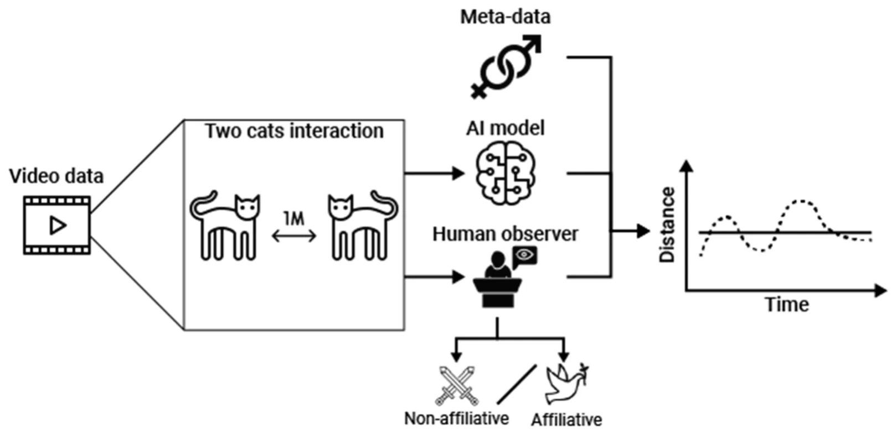
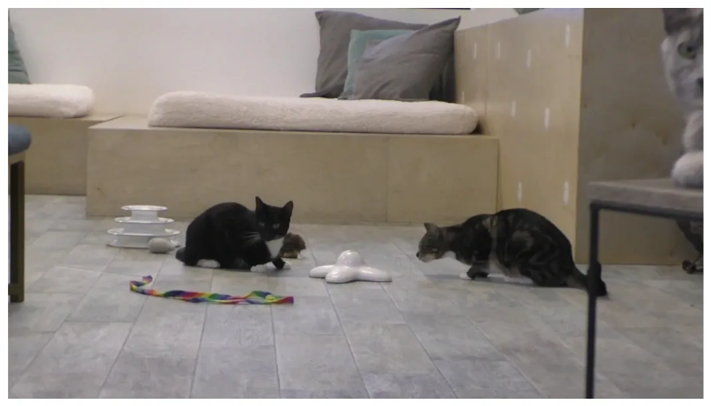
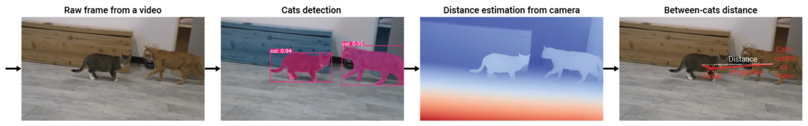
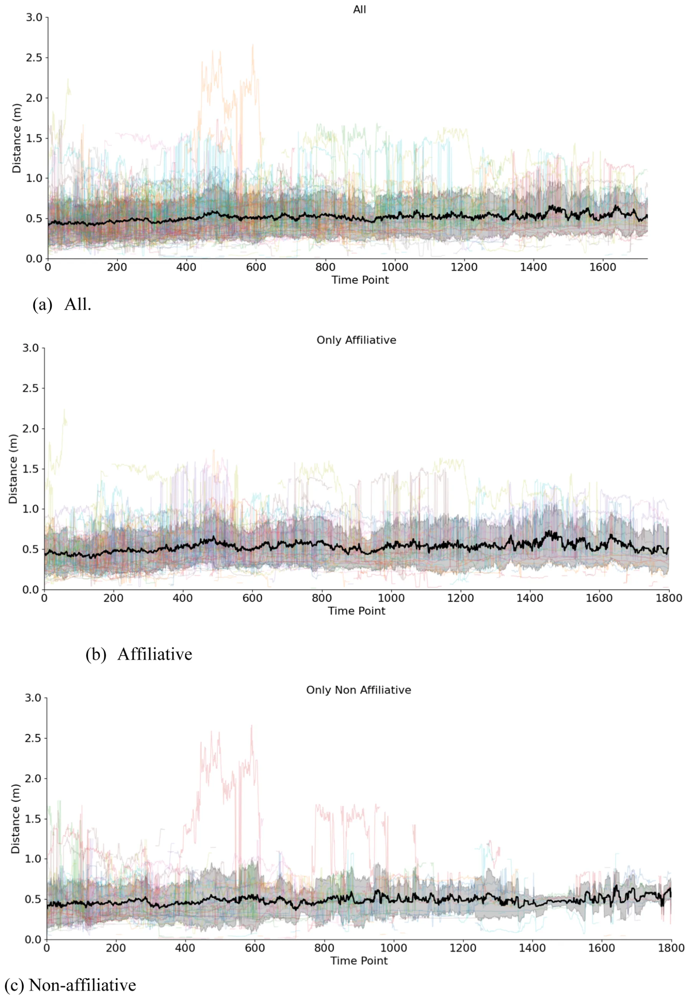
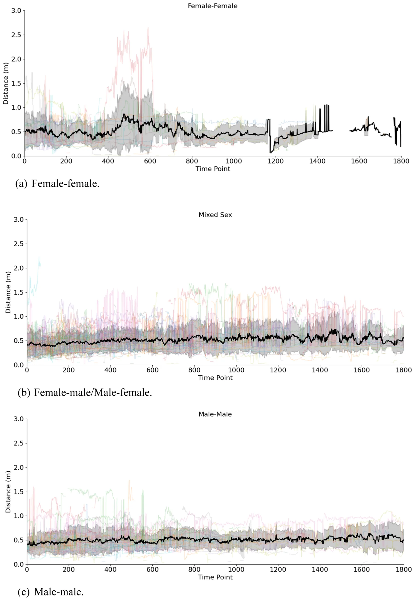

## Introduction

Animals establish and maintain a wide range of social bonds (i.e., friendships) through consistent and frequent affiliative interactions (Busia and Griggio, 2020). Social bonding can provide various benefits to inclusive fitness, including increased mating opportunities (Cameron et al., 2009; Schülke et al., 2010; Bray and Gilby, 2020), better access to food sources (Dale et al., 2017; Samuni et al., 2018), cooperative rearing of young (Curley and Keverne, 2005), and enhanced defense against predators and territorial conflicts (Busia and Griggio, 2020). One ongoing question in animal behavior research is how to quantify the strength of a social bond between two (or more) individuals (Dunbar and Shultz, 2010; Fischer et al., 2017). The answer to this question varies across species, primarily because different types of affiliative behaviors can be part of the social bonding process (Dunbar and Shultz, 2010). In mammals, for example, allogrooming plays a crucial role in establishing and reinforcing bonds between adult individuals (Dunbar, 1991; Spruijt et al., 1992), and as a result, it is included as a variable in most social bonding calculations (Sapolsky et al., 1997; Silk, Alberts, et al., 2006; Silk, Altmann, et al., 2006). There is variation in when young mammals transition from being recipients of grooming to initiating their own grooming behavior, highlighting the importance of social input in establishing this behavior (Lange et al., 2023).

It is important to note that the prevalence and significance of allogrooming in the bonding process vary across mammal species (Dunbar and Shultz, 2010). Some mammals often rely on allogrooming 1558-7878/© 2025 The Authors. Published by Elsevier Inc. This is an open access article under the CC BY license ( http://creativecommons.org/licenses/by/4.0/ ).

to strengthen social bonds, whereas others engage in allogrooming less frequently, often due to their unique social structures (Lehmann et al., 2007) or greater dependence on other bonding mechanisms (such as communicative synchrony (Chereskin et al., 2024)). While social bonding behaviors can vary among different mammal species, a consistent factor in calculating bond strength through spatial proximity (Cairns and Schwager, 1987; Bales et al., 2021). It is generally assumed that individuals who spend more time together in close proximity, both consistently and frequently, are likely to develop stronger social bonds than those who are rarely near each other (Silk et al., 2013). Many affiliative activities that enhance social bonds, such as allogrooming, take place in close proximity (Jablonski, 2021), reinforcing this idea.

By using a broader variable such as spatial proximity, researchers can account for variation in social bonding activities based on factors such as age, sex, or social rank. However, the operationalization of “close” proximity varies across different species and studies. In some cases, it is defined as being within touching distance or one body length apart (Sapolsky et al., 1997; Florkiewicz et al., 2018; Wolter et al., 2018; Camerlink et al., 2022; Florkiewicz and Lazebnik, 2025). Other studies have also assessed proximity based on individuals' locations in relation to their socio-ecological environment (Chadwick et al., 2015), such as when two individuals spend time together in the same sleeping quarters (Torres Borda et al., 2025) or party (Pepper et al., 1999). The advantage of these two methods is that the exact distance is not necessary, allowing for quicker and easier confirmation for behavioral recordings. However, subtle differences may exist even within these categories, emphasizing qualitative aspects of the relationship between two animals (such as distinguishing between proximity within touching distance versus outside of touching distance; (Jablonski, 2021)).

Achieving a higher level of precision with proximity calculations is made possible with AI-based technology and data extraction techniques (Gomes et al., 2021). In captive settings, this involves using digital (2D) and depth (3D) cameras alongside segmentation and feature extraction techniques applied to the recorded video footage through various algorithms (Wurtz et al., 2019). For wild animals, proximity loggers (such as Advanced Tracking and Localization of Animals in Real-Life Systems, or ATLAS) may also be used, as they are able to collect data on the identity of the encountered conspecific, the time and the received signal strength, which can be correlated with distance (Toledo et al., 2020; Beardsworth et al., 2022). Proximity loggers are particularly useful when mounting 2D and 3D cameras is not feasible due to environmental obstacles, such as poor visibility.

One question arising from these innovative tools and techniques is whether the proximity measurements gathered can also serve as reliable indicators for identifying social interactions and potentially measuring the strength of social bonds across animal species. Domesticated animals have been at the forefront of testing AI-based approaches for estimating proximity; however, many of these studies have largely involved farm animals like pigs and chickens (Wurtz et al., 2019). The domestic cat (*Felis silvestrus catus*) is a useful model for examining the relationship between spatial proximity, affiliative behavior, and social bonding using AI-based approaches in our current study for two reasons.

First, domesticated cats display high levels of social flexibility compared to their wildcat counterparts. Domesticated cats can live in small multi-cat households or in large colonies spanning across entire islands (Crowell-Davis et al., 2004; Vitale, 2022), which provide them with opportunities to establish and maintain a variety of social bonds (Crowell-Davis et al., 2004; Vitale, 2022). For instance, young kittens often develop strong attachments to their mothers to ensure their survival (Bradshaw, 2016; Vitale, 2022). As they grow, they also establish connections with other kittens in their age group (Bradshaw, 2016; Vitale, 2022), which facilitates play (promoting socio-cognitive and motor development; (Crowell-Davis, 2007)). In adulthood, female cats tend to form bonds with each other, which helps them collaboratively care for their offspring (Bradshaw, 2016; Vitale, 2022). Additionally, both female and male adult cats may form relationships that enhance their chances of reproduction and support territorial defense (Natoli et al., 2001; Bradshaw, 2016; Vitale, 2022). While male adult cats can form bonds with one another, they also frequently engage in aggressive interactions due to territorial disputes (Cafazzo and Natoli, 2009; Bradshaw, 2016; Vitale, 2022). Considering the adaptive functions of various bond types in cats and their prevalence, we can generate predictions as to how cats will spatially interact with each other based on sex.

Second, domesticated cats participate in various affiliative activities that strengthen their bonds with one another, including allogrooming, allorubbing, and co-sleeping (Dards, 1983; Crowell-Davis et al., 2004; Cafazzo and Natoli, 2009; Brown and Bradshaw, 2014; Bradshaw, 2016; Vitale, 2022). These affiliative activities are coordinated through various facial signals (Scott and Florkiewicz, 2023), which are subject to rapid mimicry (Martvel et al., 2024). This rapid facial mimicry helps individuals connect both psychologically and physically, thereby strengthening their bond (Davila-Ross and Palagi, 2022). As a result, we can predict how cats will spatially interact with one another based on whether these types of affiliative activities are occurring.

In our current study, we use AI-based computer vision systems to investigate how the social context and sex composition of domestic cat (*Felis silvestris catus*) dyads influence their spatial proximity during social interactions. We utilize video footage (and associated behavioral observations) obtained from our two previously published studies on communicative interactions that involve the production of intraspecific facial signaling behaviors (both affiliative and non-affiliative) to conduct this investigation (Scott and Florkiewicz, 2023; Martvel et al., 2024). The usage of AI in animal behavior studies, in general, and for cats, in particular, allows an automatic and systematic analysis of large volumes of data which allows both more statistically significant evaluations and wider range of exploratory analysis.

Using this AI-based system, we extracted and analyzed proximity data from video recordings of cat-cat social interactions. Our methodology allowed us to track distance fluctuations over time with high temporal resolution, enabling a fine-grained analysis of spatial dynamics. Fig. 1 presents a schematic view of the study’s methodological design.

Based on the current understanding of social bonding behaviors and social organization in domesticated cats, we have developed two testable predictions using this approach:

- 1. **Prediction 1 (P1)**: we predict that cats would be in closer proximity during affiliative facial signaling interactions than during non-affiliative ones. Since rapid facial mimicry involves imitating both subtle and clear facial muscle movements, we anticipate that closer proximity will be preferred to facilitate this process. Being closer together decreases the likelihood of miscommunication, which is crucial considering the over 200 distinct facial signals that cats use with one another during intraspecific social interactions (Scott and Florkiewicz, 2023).
- 2. **Prediction 2 (P2)**: we predict that adult sex composition would influence proximity, with female–female dyads expected to exhibit the closest proximity, followed by female–male\\male–female, and male–male dyads. This is based on the idea that female cats may form stronger bonds with each other, while male cats are often more aggressive during territorial disputes, which could lead to decreased social bonding between them.

***P1*** allows us to examine the relationship between spatial proximity and affiliative behavior using AI-based approaches, while ***P2*** allows us to examine the relationship between spatial proximity and social bonding using these same methods. Our study also enhances the understanding of intraspecific communication among cats, an area that has received less attention compared to interspecific communication (between humans and cats; see Bennett et al., 2017; Caeiro et al., 2017) and research on facial behaviors linked to pain (Reid et al., 2018; Evangelista et al., 2019; Steagall and Monteiro, 2019).

<figure id="fig-1">

<figcaption><strong>Fig 1.</strong> <em>A schematic view of the study’s methodological design</em>.</figcaption>
</figure>

## Methods

Our study protocol was approved by the CatCafe Lounge and adhered to the NC3R’s ARRIVE guidelines and the Association for the Study of Animal Behaviour’s guidelines for the treatment of animals in behavioral research (Anonymous, 2020). Due to the use of non-invasive behavioral observations conducted in staff and visitor viewing areas, formal review by the Institutional Animal Care and Use Committee (IACUC) was waived by all associated institutions.

## The dataset

Video footage was collected at the CatCafe Lounge, a non-profit cat rescue and adoption organization located in Los Angeles, CA. The lounge provides an indoor space where visitors can interact with approximately 20–30 adult domestic shorthair cats (all of which are spayed or neutered) available for adoption at any given time. We collected video footage with a Panasonic Full HD Video Camcorder HC-V770 (at 60 fps) from 2021 to 2022 using the opportunistic sampling method (Florkiewicz and Campbell, 2021a), focusing on recording naturally occurring communicative events between cat dyads (i.e., pairings). An example frame from the video database is shown in Fig. 2. Video clips were recorded just before the communicative event began (using the pre-record function) and ended shortly after the interaction concluded. Over the course of one year, we collected video footage of 53 unique adult cats engaging in 186 communicative interactions. These 186 communicative interactions spanned across 184 video clips, totaling 194 min. These 186 communicative interactions involved 53 unique adult cats, resulting in 688 coded facial signals. While multiple signals were recorded per dyad, we treated dyad identity as a random effect in all statistical models to account for non-independence of repeated interactions between the same pairs.

<figure id="fig-2">

<figcaption><strong>Fig. 2.</strong> A representative frame illustrating a typical cat interaction captured in the video dataset.</figcaption>
</figure>

## Data coding

In our current study, the first author (BNF) coded all observed combinations of facial muscle movements made by cats during their interactions with other cats (which we refer to as ***facial signals***; Smith and Harper, 1995; Florkiewicz et al., 2023; Scott and Florkiewicz, 2023). BNF documented facial muscle movement combinations observed (using catFACS coding protocols; Caeiro et al., 2017) when one cat turned its head towards another, fixing its gaze on them while producing these movements. Our goal was to ensure that these facial muscle movement combinations considered served a communicative function (Florkiewicz et al., 2023). All other combinations of facial muscle movements, whether produced in isolation, directed at inanimate objects, or aimed towards humans, were excluded from our analyses. In line with the catFACS certification test, we evaluated coding agreement on combinations of facial muscle movements using Wexler's ratio (with an average ratio of ≥0.70 indicating good agreement; Caeiro et al., 2017). A research assistant (LS) was recruited to help assess inter-observer reliability for BNF’s catFACS coding at the beginning of data coding efforts. We chose to assess agreement using inter-observer reliability instead of intra-observer reliability for two reasons. First, inter-observer reliability is a crucial component of catFACS coding certification (Caeiro et al., 2017) and is commonly utilized in establishing FACS protocols for multiple species (see Waller et al., 2020 for a review). Second, intra-observer reliability is generally very high when using FACS, likely due to the specialized training and mandatory evaluations required for its use (Florkiewicz et al., 2018). BNF and LS randomly selected 10% of video clips and their corresponding facial muscle movement combinations for reliability coding. The average Wexler’s ratio was 0.707, indicating good agreement between BNF and LS. After both BNF and LS reached a satisfactory agreement, BNF coded all remaining video clips. In the 186 communicative interactions observed, we documented 688 intraspecific facial signals using these coding criteria.

For each facial signal, BNF also coded the ***identity*** and ***sex*** of both the cat producing the facial signal and the intended recipient. Additionally, BNF coded whether each facial signal was produced in an affiliative or non-affiliative context (i.e., ***social context***). Social contexts were assigned using the presence or absence of specific non-communicative behaviors strongly associated with each context. Affiliative interactions were characterized by behaviors such as mutual grooming, allorubbing, and vertical tail positioning (Dards, 1983; Crowell-Davis et al., 2004; Cafazzo and Natoli, 2009; Brown and Bradshaw, 2014; Bradshaw, 2016; Vitale, 2022). Conversely, non-affiliative interactions involved vigilance behaviors (e.g., staring, slow approaches), defensive posturing (e.g., stiffening, piloerection), and fighting-related behaviors (e.g., biting, hissing, scratching, swatting; (Stelow et al., 2016; Penar and Klocek, 2018)). When assigning social contexts to facial signaling interactions, BNF and LS considered the behavior(s) of both the signaler and intended recipient(s).

Percentage of agreement was evaluated for social context (affiliative vs. non-affiliative), with prior research suggesting that a threshold of 70% signifies good agreement (Florkiewicz and Campbell, 2021b; Scott and Florkiewicz, 2023). Similar to our catFACS coding protocols, LS assisted in evaluating inter-observer reliability for social context at the beginning of data coding efforts. Agreement for social context was assessed for 10% of randomly selected video clips (and associated facial signals) that were used to evaluate agreement for facial muscle movement combinations. BNF and LS agreed on the contextual classification of 75% of the sampled facial signals. Discrepancies in context classification may have arisen from varying behaviors exhibited by both the signaler and the recipient. Furthermore, social interactions can fluctuate across different behavioral contexts, which adds complexity to the definition of a singular context type. After both BNF and LS reached a satisfactory percentage of agreement, BNF coded all remaining video clips.

## Proximity calculations

To estimate the three-dimensional spatial relationships between cats within each video frame during facial signaling interactions, a multistage image processing pipeline was implemented, leveraging pre-trained deep learning models. First, the Segment Anything Model (SAM) Large (Kirillov et al., 2023) was applied to each frame to generate segmentation masks delineating individual cats. For this model, we used the same hyperparameter used in the original study. Subsequently, the Depth Anything V2 model (Yang et al., 2024) was used to estimate a dense depth map for each frame, providing a per-pixel estimate of distance from the camera. Similarly, we used this model “as-is” with the hyperparameters from the original study. For each segmentation mask generated by SAM, the centroid (center of mass) was computed by computing the average location of each masked pixel of the cat-detected object (Bai and Breen, 2008). The corresponding depth value (z-coordinate) from the Depth Anything V2 output was then extracted at the centroid location. This process yielded a two-dimensional image coordinate (x, y) from SAM, along with an estimated depth value (z) from Depth Anything V2 for each identified cat.

These (x, y, z) coordinates were then transformed into a three-dimensional coordinate system. This transformation involved a scaling procedure to convert pixel coordinates to metric units (e.g., meters). To determine the scaling factor, we employed an anthropometric estimation approach, assuming that a cat standing perpendicular to the camera plane has a height of 34 centimeters (O'Connor, 2007). The xy-orientation of each cat was approximated by detecting keypoints on the cat's head, enabling the projection of the 34 cm height to a pixel height by correcting with the angle of the cat in relation to the camera. This projected pixel height served as a reference for scaling all other distances within the frame. Finally, the Euclidean distance between the three-dimensional coordinates of each pair of cats within the frame was calculated, providing an estimate of the spatial separation between the cats. Fig. 3 presents an example of this computational pipeline for a random frame and video in the dataset. Several more examples are provided as supplementary material.

To mitigate potential artifacts in the distance estimation, a post-processing step was implemented. For each video, a moving-average z-score was calculated for its distance values across the temporal dimension. Z-scores were calculated with a window size of 7. Any z-score value exceeding 2 standard deviations from the mean was considered an outlier and replaced with the mean distance value during the period the average was calculated. This correction helped to reduce the impact of spurious distance estimations on the overall distance calculations.

## Signal processing analysis

To further investigate the spatial characteristics of cat-cat facial signaling interactions, a series of analyses were conducted focusing on the dynamic changes in distance and the overall proximity patterns observed in the video data.

## Generalized linear mixed models

To examine the influence of dyad sex combinations and social context on proximity patterns, we assessed the ‘proximity polarization’ of each facial signaling interaction (N=688). Unlike simple averages of distance, which obscure variability within interactions, proximity polarization captures the extent to which dyads oscillated between very close and very distant spacing. This is particularly relevant for cats, whose affiliative behaviors (e.g., grooming, rubbing) and non-affiliative behaviors (e.g., swatting, fleeing) both involve periods of close contact but differ in whether these moments are sustained or unstable. Thus, polarization provides a dynamic measure of social spacing that better reflects the underlying communicative strategies.

To achieve this, for each facial signaling event, we computed the variance of the distances recorded over the video segments. Then, a Generalized Linear Mixed Model (GLMM) was implemented with the proximity polarization metric as the dependent variable, dyad sex type (Female-Female, Female-Male, and Male-Male) and social context (affiliative vs. non-affiliative) as fixed effects, and dyad identity (facial signaler ID x facial signaling recipient ID) as a random effect (to account for idiosyncratic differences in behavior; (Waller et al., 2013)), thereby accounting for the repeated sampling of individuals and dyads and reducing the potential for pseudo-replication. We compared our full GLMM to a null counterpart, which eliminated fixed effects and only included our random effect, to ensure that sex and social context significantly impacted our proximity polarization metric. We implemented our GLMMs using the “lme4” package in R 4.1.1 (Bates et al., 2015), and we compared the models with the ANOVA function in base R (Waller et al., 2013). To draw comparisons between the different dyad sex combinations, we performed a Tukey test using the “multcomp” package (Hothorn et al., 2021).

<figure id="fig-3">

<figcaption><strong>Fig. 3.</strong> An example of the between-cat distance approximation computational pipeline for a random frame and video in the dataset.</figcaption>
</figure>

## Distance dynamics

To quantify the dynamic nature of distance changes between interacting cats and to contextualize the results of our GLMM, we calculated a metric called "distance fluctuation." This metric was defined as the number of transitions between increasing and decreasing distances observed within each facial signaling interaction. Specifically, for each pair of cats, we counted the instances where the distance between them switched from increasing to decreasing or from decreasing to increasing within a short time frame. A 1-second rolling window was used to compute a moving average of the distance and detect these turning points. The distance fluctuation metric was then compared between affiliative and non-affiliative interactions using descriptives.

## Power and stability check

To assess the robustness of our results, we conducted a downsampling stability analysis. We randomly subsampled 90%, 80%, 70%, and 60% of the data (500 replicates at each level) and re-estimated our GLMM for each subset. This procedure allowed us to evaluate whether the fixed effects of social context and dyad sex composition remained consistent under reduced sample sizes.

## Results

We first addressed the two predictions (***P1*** and ***P2***) at the base of this study. The results of our ANOVA indicate that the sex of each dyad, as well as the social context, significantly influences spatial proximity during intraspecific facial signaling (p*<*0.001). Initially, ***P1*** proposed that domesticated cats would exhibit significantly closer proximity during affiliative facial signaling interactions compared to non-affiliative ones. However, our GLMM results indicate that non-affiliative facial signaling interactions occur at closer spatial proximity than affiliative ones (β=-0.32, CI=-0.39 – − 0.26, p*<*0.001). Second, ***P2*** predicted a specific pattern in average proximity according to dyad sex composition, with Female–Female dyads expected to be in closest proximity during facial signaling interactions, followed by Female–Male/Male–Female, and finally Male–Male dyads. The results of our GLMM confirmed this pattern (p*<*0.001), and a Tukey test indicated that differences among dyad sex types are all statistically significant (p*<*0.001). Additionally, the results of our GLMM show that dyad sex type followed a consistent increasing pattern across both social contexts, with Female-Female dyads being the closest and Male-Male dyads being the furthest during facial signaling interactions. A visual representation of the fixed effect of dyad sex type can be found in Table 1.

In order to contextualize the general spatial scale of intraspecific cat facial signaling interactions as they unfold, we examined the overall distribution of inter-cat distances. The results showed that 99% of all recorded distances fell within a range of 0–1.7 m, with an average inter-cat distance of approximately 0.5 m. Additionally, we found that instances of very close physical contact, defined as the estimated distance between cat centers of mass being near zero (approximately touching), were rare, occurring in only 0.3% of the recorded observations. Fig. 4 illustrates the distance between cats over time during intraspecific facial signaling interactions, with a focus on social context. In contrast, Fig. 5 depicts the distance between cats over time based on the sex of the dyad. For more visual representations of the spatial proximity of intraspecific cat social interactions, which consider both sex and social context, please refer to the electronic supplement.

<figure class="table-figure" id="table-1">
<figcaption><strong>Table 1</strong> The results of our GLMM illustrating the effect of social context and dyad sex type during intraspecific facial signaling interactions.</figcaption>

<table><tr><th>Predictors</th><th>Estimates</th><th>CI</th><th>p-value</th></tr><tr><td>(Intercept)</td><td>0.45</td><td>0.37–0.54</td><td>&lt;0.001</td></tr><tr><td>Sex Pair (female*male)</td><td>0.22</td><td>0.11–0.32</td><td>&lt;0.001</td></tr><tr><td>Sex Pair (male*female)</td><td>0.54</td><td>0.44–0.64</td><td>&lt;0.001</td></tr><tr><td>Sex Pair (male*male)</td><td>0.70</td><td>0.61–0.80</td><td>&lt;0.001</td></tr><tr><td>Context (non-affiliative)</td><td>-0.32</td><td>-0.39 - −0.26</td><td>&lt;0.001</td></tr></table>

</figure>

Importantly, the downsampling stability analysis showed that results for both social context and dyad sex composition were highly robust. At 90%, 80%, and 70% of the dataset, fixed-effect estimates were consistent with the full-sample model in sign, relative magnitude, and statistical significance across all replicates. Only when reduced to 60% of the dataset did we observe attenuation in effect detection for the smaller contrasts. This indicates that our dataset is sufficiently powered, as results remain stable down to 70% of the available sample.

## Discussion

The aim of our current study was to evaluate how the social context and the sex composition of domestic cat (*Felis silvestris catus*) pairs influence their spatial proximity during facial signaling interactions, utilizing innovative AI-based computer visual systems. Research on the spatial proximity and social behavior of cats is limited compared to other domesticated animals, despite cats exhibiting significant social complexity through their diverse social bonds and bonding strategies (Crowell-Davis et al., 2004; Vitale, 2022). Our study aims to address this gap by focusing on this often-neglected species. We generated two key research predictions to assess the relationship between spatial proximity, affiliative behavior, and social bonding, using information about the social behavior and organization of domesticated cats.

First, we predicted (***P1***) that domesticated cats would maintain closer proximity during affiliative facial signaling interactions compared to non-affiliative ones. This prediction was not supported, as cats tend to stay significantly closer to one another during non-affiliative facial signaling interactions. One possible explanation for this behavior is that non-affiliative interactions often involve maintaining close proximity, particularly when aggressive behaviors (such as biting and swatting) occur (Stelow et al., 2016; Penar and Klocek, 2018). Distance fluctuations during facial signaling interactions (Fig. 4) provide some support for this idea. In affiliative interactions, the distance between the individuals tends to remain stable over time. In contrast, during non-affiliative interactions, there is often more variation in distance at the beginning. This divergence may be attributed to physical altercations or fleeing behavior that occurs during those interactions. One potential shortcoming of this explanation, though, is that our sample was comprised exclusively of spayed and neutered cats, which is likely to decrease instances of hormone-driven aggression (Fig. 5). In other words, non-affiliative interactions should be reduced compared to affiliative interactions. One previous study involving a colony of 16 free-roaming cats found that after spaying and neutering, overall activity levels decreased which included territorial behaviors, most notably urine spraying (Cafazzo et al., 2019). Interestingly, this study also found that instances of close proximity decreased after spaying/neutering interventions, which the authors attributed to a reduced need for maintaining close relationships for mating purposes (Cafazzo et al., 2019). This finding somewhat aligns with our results in the current study, as we found that interactions involving affiliative facial signaling do not necessarily result in closer proximity. Methodologically, by adopting proximity polarization rather than mean distance, our analysis accounts for the inherently dynamic nature of cat interactions. This metric highlights whether individuals consistently share close space or instead oscillate between approach and avoidance, offering a richer view of interactional style. For example, non-affiliative contexts often involved abrupt fluctuations in spacing, whereas affiliative contexts were characterized by more stable close proximity. Such insights would be missed by static distance measures alone.

Another explanation is that visual signaling may require close spatial proximity to effectively communicate with conspecifics (Echeverri et al., 2021). Given the impact that physical altercations have on an individual's direct fitness, it is likely even more crucial to communicate non-affiliative signals clearly and effectively (Gonz´alez-Santoyo et al., 2014). However, it is also important to communicate visual affiliative signals clearly for more complex mechanisms, such as rapid facial mimicry, which involves imitating both overt and subtle facial movements (Davila-Ross and Palagi, 2022). This may especially be the case in low-visibility environments. But given the open layout of the cat caf´e lounge where the video footage was recorded, it is likely that visibility is higher, which reduces the need for cats to stay close together for affiliative signaling. Further research is needed to explore the relationship between rapid facial mimicry and spatial proximity in domesticated cats to confirm these ideas. Finally, the lack of support for P1 may be due to challenges associated with manual coding approaches. In our study, one researcher (BNF) was responsible for coding social interactions between cats as either affiliative or non-affiliative. To ensure consistency in our coding of social contexts, we evaluated inter-observer reliability with a research assistant experienced in cat communication research. However, the level of agreement was only 75%, which indicates the potential for human coding errors. The boundaries between social contexts can be unclear, as the behaviors of both the signaler and recipient can shift during the interaction. To address these potential limitations, it is recommended that future studies consider expanding beyond a binary classification of context. These studies should account for the nuanced shifts in behavior among individual cats and incorporate both inter-observer and intra-observer reliability to ensure agreement in their findings.

<figure id="fig-4">

<figcaption><strong>Fig. 4.</strong> Distance between cats over time during intraspecific facial signaling interactions, divided into social context. The black-bold line with background shows the mean ± standard deviation of the distances from all videos.</figcaption>
</figure>

<figure id="fig-5">

<figcaption><strong>Fig. 5.</strong> Distance between cats over time during intraspecific facial signaling interactions, divided based on dyad sex types. The black-bold line with background shows the mean ± standard deviation of the distances from all videos.</figcaption>
</figure>

We also predicted (***P2***) that female-female dyads would maintain closer proximity to each other than mixed-sex or male-male dyads. Our findings supported this prediction: female cats maintained close spatial proximity during facial signaling, especially when those recipients were also female (Table 1). This pattern was consistent for both affiliative and non-affiliative facial signaling interactions. Adult female cats typically form and maintain bonds with other adults to rear their offspring, acquire food, enhance reproductive opportunities, and support territorial behaviors (Natoli et al., 2001; Bradshaw, 2016; Vitale, 2022). While our video footage was collected in a captive environment, some of these fitness obstacles remain relevant, as preferred feeding and sleeping sites can still be monopolized by other cats, and bonding opportunities with conspecifics are abundant. As previously noted, female cats appear to stay closer to one another during non-affiliative interactions, even with other females. While male-male pairs are known to engage in territorial disputes, females may also collaborate with other adults to help defend their territory (Bradshaw, 2016; Natoli et al., 2001; Vitale, 2022). This behavior could explain the observed proximity among female cats in our sample. Therefore, additional research is needed to better understand how specific social behaviors (both affiliative and non-affiliative) affect spatial proximity.

Our study results have significant implications for managing larger cat colonies in both captive and wild environments. AI-based computer vision systems can assist with monitoring the behaviors and social relationships of cats through spatial proximity measurements, similar to their use with other domesticated animals. This approach could be beneficial in settings with numerous cats, where it can be challenging to document every interaction taking place among them. However, since only one of our two research predictions were supported, it is essential to complement visual AI approaches with other distance measurements and methods if possible. Our findings could also be used to inform housing decisions and intervention strategies for new colony members based on their age, sex, and expected social behaviors and relationships with each other. However, cat colonies show significant variation in size, group membership, and behavior patterns (Vitale, 2022). Additionally, given the complexities of intraspecific cat communication, disagreement (as reflected in our percentage of agreement scores for social context) is possible and may impact model performance. We encourage further studies using our methods to further assess the utility

## Ethics

of our approaches.

Our study has several limitations that could also be addressed in future research. First, it focuses on the behavior of a single group of captive domesticated cats, all of which are adult rescue cats with relatively unknown breeds and origins. Although cat caf´es provide valuable environments for gathering data on many individual cats, they are also subject to significant variations in the composition of the group, which can lead to greater social instability. Human caregivers (volunteers and staff) are present in this environment, potentially influencing the types of behaviors cats produce. Additional studies examining cats living in different social (and stable) conditions are necessary. Second, our study does not measure the strength of social bonds between cat dyads using alternative calculations that have been previously documented (Silk et al., 2013), which is essential for evaluating methodological accuracy and trade-offs. This was not feasible in the current study because video footage was collected opportunistically during facial signaling interactions, making it challenging to calculate behavior rates. This brings us to our third study limitation, which is that all our video footage was collected using an opportunistic sampling method with the same handheld camcorder. Using video footage captured at higher resolutions and different sampling methods, such as focal sampling, could result in different findings. Fourth, another limitation concerns our assumption of uniform cat size in the 3D scaling process. We standardized distances by estimating a fixed height of 34 cm for all cats to transform pixel coordinates into metric units. While this anthropometric proxy enabled consistent scaling across videos, individual variation in body size, age, and posture could introduce minor inaccuracies in absolute distance estimation. Importantly, because our analyses focused on relative differences across contexts and dyad types, we expect this limitation to affect absolute values more than comparative patterns. Nonetheless, future work could incorporate individual morphometric data or calibration objects in the recording environment to refine scaling accuracy. Fifth, all cats in our study were spayed/neutered and mixed breed. Further research with unspayed/unneutered cats of various breeds and origins is necessary for better generalization of our findings. Finally, as previously noted in our discussion of prediction P1, additional studies that consider various social behaviors and contexts, alongside assessments of both inter-observer and intra-observer reliability, could enhance coding consistency and model performance.

## Code and data availability

Our code and raw data are freely available and provided as supplementary materials. Video footage is available upon request.

## CRediT authorship contribution statement

**Anna Zamansky:** Supervision. **Eddie Kanevsky:** Software, Methodology. **Brittany N. Florkiewicz:** Writing – review & editing, Writing – original draft, Visualization, Software, Methodology, Investigation, Formal analysis, Data curation. **Teddy Lazebnik:** Writing – review & editing, Writing – original draft, Visualization, Supervision, Project administration, Methodology, Investigation, Formal analysis, Conceptualization.

Our study protocol was approved by the CatCafe Lounge and adhered to the NC3R’s ARRIVE guidelines and the Association for the Study of Animal Behaviour’s guidelines for the treatment of animals in behavioral research (Anonymous, 2020). Due to the use of non-invasive behavioral observations conducted in staff and visitor viewing areas, formal review by the Institutional Animal Care and Use Committee (IACUC) was waived by all associated institutions.

## Funding

No funding was received to assist with the preparation of this manuscript.

## Declaration of Competing Interest

The authors declare that they have no known competing financial interests or personal relationships that could have appeared to influence the work reported in this paper.

## Acknowledgements

The authors wish to thank the staff and volunteers at the CatCafe Lounge in Los Angeles, California for access to their cats and their insight into domestic cat behaviors. The authors also thank Ilan Shimshoni for the guidance regarding the computer vision model.

## Appendix A. Supporting information

Supplementary data associated with this article can be found in the online version at doi:10.1016/j.jveb.2025.12.006.

## References

- Anonymous, 2020. Guidelines for the treatment of animals in behavioural research and teaching (i-xi). Anim. Behav. 159. [doi:10.1016/j.anbehav.2019.11.002](https://doi.org/10.1016/j.anbehav.2019.11.002)
- Bai, L., Breen, D., 2008. Calculating center of mass in an unbounded 2D environment. J. Graph. Tools 13 (4), 53–60. [doi:10.1016/j.anbehav.2019.11.002](https://doi.org/10.1016/j.anbehav.2019.11.002) · [link](http://refhub.elsevier.com/S1558-7878%2825%2900125-X/sbref2)
- Bales, K.L., Ardekani, C.S., Baxter, A., Karaskiewicz, C.L., Kuske, J.X., Lau, A.R., Savidge, L.E., Sayler, K.R., Witczak, L.R., 2021. What is a pair bond? Horm. Behav. 136, e105062. [doi:10.1016/j.yhbeh.2021.105062](https://doi.org/10.1016/j.yhbeh.2021.105062) · [link](http://refhub.elsevier.com/S1558-7878%2825%2900125-X/sbref2)
- Bates, D., M¨achler, M., Bolker, B., Walker, S., 2015. Fitting linear mixed-effects models using lme4. J. Stat. Softw. 67 (1), 1–48. [doi:10.18637/jss.v067.i01](https://doi.org/10.18637/jss.v067.i01)
- Beardsworth, C.E., Gobbens, E., van Maarseveen, F., Denissen, B., Dekinga, A., Nathan, R., Toledo, S., Bijleveld, A.I., 2022. Validating ATLAS: A regional-scale high-throughput tracking system. Methods Ecol. Evol. 13 (9), 1990–2004. [doi:10.1111/2041-210X.13913](https://doi.org/10.1111/2041-210X.13913)
- Bennett, V., Gourkow, N., Mills, D.S., 2017. Facial correlates of emotional behaviour in the domestic cat (Felis catus). Behav. Proc. 141, 342–350. [doi:10.1111/2041-210X.13913](https://doi.org/10.1111/2041-210X.13913) · [link](http://refhub.elsevier.com/S1558-7878%2825%2900125-X/sbref6)
- Bradshaw, J.W.S., 2016. Sociality in cats: A comparative review. J. Vet. Behav. 11, 113–124. [doi:10.1016/j.jveb.2015.09.004](https://doi.org/10.1016/j.jveb.2015.09.004) · [link](http://refhub.elsevier.com/S1558-7878%2825%2900125-X/sbref6)
- Bray, J., Gilby, I.C., 2020. Social relationships among adult male chimpanzees (Pan troglodytes schweinfurthii): Variation in the strength and quality of social bonds. Behav. Ecol. Socio 74 (112). [doi:10.1007/s00265-020-02892-3](https://doi.org/10.1007/s00265-020-02892-3)
- Brown, S.L., Bradshaw, J.W., 2014. Communication in the domestic cat: Within-and between-species. Domest. Cat Biol. Behav. 37–59. [doi:10.1007/s00265-020-02892-3](https://doi.org/10.1007/s00265-020-02892-3) · [link](http://refhub.elsevier.com/S1558-7878%2825%2900125-X/sbref9)
- Busia, L., Griggio, M., 2020. The dawn of social bonds: what is the role of shared experiences in non-human animals? Biol. Lett. 16 (7), 20200201. [doi:10.1098/rsbl.2020.0201](https://doi.org/10.1098/rsbl.2020.0201) · [link](http://refhub.elsevier.com/S1558-7878%2825%2900125-X/sbref9)
- Caeiro, C.C., Burrows, A.M., Waller, B.M., 2017. Development and application of CatFACS: are human cat adopters influenced by cat facial expressions? Appl. Anim. Behav. Sci. 189, 66–78. [doi:10.1098/rsbl.2020.0201](https://doi.org/10.1098/rsbl.2020.0201) · [link](http://refhub.elsevier.com/S1558-7878%2825%2900125-X/sbref11)
- Cafazzo, S., Bonanni, R., Natoli, E., 2019. Neutering effects on social behaviour of urban unowned free-roaming domestic cats. Animals 9 (12), 1105. [doi:10.3390/ani9121105](https://doi.org/10.3390/ani9121105) · [link](http://refhub.elsevier.com/S1558-7878%2825%2900125-X/sbref11)
- Cafazzo, S., Natoli, E., 2009. The social function of tail up in the domestic cat (Felis silvestris catus). Behav. Proc. 80 (1), 60–66. [doi:10.1016/j.beproc.2008.09.008](https://doi.org/10.1016/j.beproc.2008.09.008)
- Cairns, S.J., Schwager, S.J., 1987. A comparison of association indices. Anim. Behav. 35 (5), 1454–1469. [doi:10.1016/S0003-3472(87)80018-0](https://doi.org/10.1016/S0003-3472%2887%2980018-0)
- Camerlink, I., Scheck, K., Cadman, T., Rault, J.-L., 2022. Lying in spatial proximity and active social behaviours capture different information when analysed at group level in indoor-housed pigs. Appl. Anim. Behav. Sci. 246, 105540. [doi:10.1016/j.applanim.2021.105540](https://doi.org/10.1016/j.applanim.2021.105540)
- Cameron, E.Z., Setsaas, T.H., Linklater, W.L., 2009. Social bonds between unrelated females increase reproductive success in feral horses. Proc. Natl. Acad. Sci. 106 (33), 13850–13853. [doi:10.1016/j.applanim.2021.105540](https://doi.org/10.1016/j.applanim.2021.105540) · [link](http://refhub.elsevier.com/S1558-7878%2825%2900125-X/sbref16)
- Chadwick, C.L., Springate, D.A., Rees, P.A., Armitage, R.P., O’Hara, S.J., 2015. Calculating association indices in captive animals: controlling for enclosure size and shape. Appl. Anim. Behav. Sci. 169, 100–106. [doi:10.1016/j.applanim.2015.05.001](https://doi.org/10.1016/j.applanim.2015.05.001) · [link](http://refhub.elsevier.com/S1558-7878%2825%2900125-X/sbref16)
- Chereskin, E., Allen, S.J., Connor, R.C., Krützen, M., King, S.L., 2024. In pop pursuit: social bond strength predicts vocal synchrony during cooperative mate guarding in bottlenose dolphins. Philos. Trans. R. Soc. B Biol. Sci. 379 (1905), e20230194. [doi:10.1098/rstb.2023.0194](https://doi.org/10.1098/rstb.2023.0194)
- Crowell-Davis, S.L., 2007. Cat behaviour: Social organization, communication and development. The welfare of cats. Springer, pp. 1–22. [doi:10.1098/rstb.2023.0194](https://doi.org/10.1098/rstb.2023.0194) · [link](http://refhub.elsevier.com/S1558-7878%2825%2900125-X/sbref19)
- Crowell-Davis, S.L., Curtis, T.M., Knowles, R.J., 2004. Social organization in the cat: A modern understanding. J. Feline Med. Surg. 6 (1), 19–28. [doi:10.1016/j.jfms.2003.09.013](https://doi.org/10.1016/j.jfms.2003.09.013)
- Curley, J.P., Keverne, E.B., 2005. Genes, brains and mammalian social bonds. Trends Ecol. Evol. 20 (10), 561–567. [doi:10.1016/j.tree.2005.05.018](https://doi.org/10.1016/j.tree.2005.05.018)
- Dale, R., Range, F., Stott, L., Kotrschal, K., Marshall-Pescini, S., 2017. The influence of social relationship on food tolerance in wolves and dogs. Behav. Ecol. Socio 71 (7), 107. [doi:10.1007/s00265-017-2339-8](https://doi.org/10.1007/s00265-017-2339-8)
- Dards, J.L., 1983. The behaviour of dockyard cats: Interactions of adult males. Appl. Anim. Ethol. 10 (1-2), 133–153. [doi:10.1007/s00265-017-2339-8](https://doi.org/10.1007/s00265-017-2339-8) · [link](http://refhub.elsevier.com/S1558-7878%2825%2900125-X/sbref23)
- Davila-Ross, M., Palagi, E., 2022. Laughter, play faces and mimicry in animals: Evolution and social functions. Philos. Trans. R. Soc. B Biol. Sci. 377 (1863), 20210177. [doi:10.1098/rstb.2021.0177](https://doi.org/10.1098/rstb.2021.0177) · [link](http://refhub.elsevier.com/S1558-7878%2825%2900125-X/sbref23)
- Dunbar, R.I.M., 1991. Functional significance of social grooming in primates. Folia Prima 57 (3), 121–131. [doi:10.1159/000156574](https://doi.org/10.1159/000156574)
- Dunbar, R.I.M., Shultz, S., 2010. Bondedness and sociality. Behaviour 147 (7), 775–803. 〈http://www.jstor.org/stable/27822152〉. [doi:10.1159/000156574](https://doi.org/10.1159/000156574) · [link](http://www.jstor.org/stable/27822152)
- Echeverri, S.A., Miller, A.E., Chen, J., McQueen, E.W., Plakke, M., Spicer, M., Hoke, K.L., Stoddard, M.C., Morehouse, N.I., 2021. How signaling seometry shapes the efficacy and evolution of animal communication systems. Int. Compar. Biol. 61 (3), 787–813. [doi:10.1093/icb/icab090](https://doi.org/10.1093/icb/icab090) · [link](http://www.jstor.org/stable/27822152)
- Evangelista, M.C., Watanabe, R., Leung, V.S.Y., Monteiro, B.P., O’Toole, E., Pang, D.S.J., Steagall, P.V., 2019. Facial expressions of pain in cats: The development and validation of a Feline Grimace Scale. Sci. Rep. 9 (1), 19128. [doi:10.1093/icb/icab090](https://doi.org/10.1093/icb/icab090) · [link](http://refhub.elsevier.com/S1558-7878%2825%2900125-X/sbref28)
- Fischer, J., Farnworth, M.S., Sennhenn-Reulen, H., Hammerschmidt, K., 2017. Quantifying social complexity. Anim. Behav. 130, 57–66. [doi:10.1016/j.anbehav.2017.06.003](https://doi.org/10.1016/j.anbehav.2017.06.003) · [link](http://refhub.elsevier.com/S1558-7878%2825%2900125-X/sbref28)
- Florkiewicz, B.N., Campbell, M.W., 2021a. A comparison of focal and opportunistic sampling methods when tudying chimpanzee facial and gestural communication. Folia Prima 92 (3), 164–174. [doi:10.1159/000516315](https://doi.org/10.1159/000516315)
- Florkiewicz, B.N., Campbell, M.W., 2021b. Chimpanzee facial gestures and implications for the evolution of language. PeerJ 9, 12237. [doi:10.1159/000516315](https://doi.org/10.1159/000516315) · [link](http://refhub.elsevier.com/S1558-7878%2825%2900125-X/sbref31)
- Florkiewicz, B.N., Lazebnik, T., 2025. Predicting social rankings in captive chimpanzees (Pan troglodytes) through communicative interactions-based data-driven model. Int. Zoo. [doi:10.1111/1749-4877.12967](https://doi.org/10.1111/1749-4877.12967) · [link](http://refhub.elsevier.com/S1558-7878%2825%2900125-X/sbref31)
- Florkiewicz, B.N.O., O˜na, L.S., Campbell, M.W., 2023. Primate socio-ecology shapes the evolution of distinctive facial repertoires. J. Compar. Psy. [doi:10.1037/com0000350](https://doi.org/10.1037/com0000350)
- Florkiewicz, B., Skollar, G., Reichard, U.H., 2018. Facial expressions and pair bonds in hylobatids. Am. J. Phys. Anthr. 167 (1), 108–123. [doi:10.1002/ajpa.23608](https://doi.org/10.1002/ajpa.23608)
- Gomes, A.C.R., Boogert, N.J., Cardoso, G.C., 2021. Network structure and the optimization of proximity-based association criteria. Methods Ecol. Evol. 12 (1), 88–100. [doi:10.1111/2041-210X.13387](https://doi.org/10.1111/2041-210X.13387)
- Gonz´alez-Santoyo, I., Gonz´alez-Tokman, D.M., Munguía-Steyer, R.E., C´ordoba- Aguilar, A., 2014. A mismatch between the perceived fighting signal and fighting ability reveals survival and physiological costs for bearers. PLOS ONE 9 (1), e84571. [doi:10.1371/journal.pone.0084571](https://doi.org/10.1371/journal.pone.0084571)
- Hothorn, T.B., Frank, Westfall, Peter. 2021. Package 'multcomp'. Retrieved December 6 from 〈http://multcomp.R-forge.R-project.org〉. [doi:10.1371/journal.pone.0084571](https://doi.org/10.1371/journal.pone.0084571) · [link](http://multcomp.R-forge.R-project.org)
- Jablonski, N.G., 2021. Social and affective touch in primates and its role in the evolution of social cohesion. Neuroscienc 464, 117–125. [doi:10.1016/j.neuroscience.2020.11.024](https://doi.org/10.1016/j.neuroscience.2020.11.024) · [link](http://multcomp.R-forge.R-project.org)
- Kirillov, A., Mintun, E., Ravi, N., Mao, H., Rolland, C., Gustafson, L., Xiao, T., Whitehead, S., Berg, A.C., Lo, W.-Y., 2023. Segment anything. Proc. IEEE/CVF Int. Conf. Comput. Vis. [doi:10.1016/j.neuroscience.2020.11.024](https://doi.org/10.1016/j.neuroscience.2020.11.024) · [link](http://refhub.elsevier.com/S1558-7878%2825%2900125-X/sbref38)
- Lange, E.C., Griffin, M., Fogel, A.S., Archie, E.A., Tung, J., Alberts, S.C., 2023. Environmental, sex-specific and genetic determinants of infant social behaviour in a wild primate. Proc. Natl. Acad. Sci. 290 (2011), 20231597. [doi:10.1098/rspb.2023.1597](https://doi.org/10.1098/rspb.2023.1597) · [link](http://refhub.elsevier.com/S1558-7878%2825%2900125-X/sbref38)
- Lehmann, J., Korstjens, A.H., Dunbar, R.I.M., 2007. Group size, grooming and social cohesion in primates. Anim. Behav. 74 (6), 1617–1629. [doi:10.1016/j.anbehav.2006.10.025](https://doi.org/10.1016/j.anbehav.2006.10.025)
- Martvel, G., Scott, L., Florkiewicz, B., Zamansky, A., Shimshoni, I., Lazebnik, T., 2024. Computational investigation of the social function of domestic cat facial signals. Sci. Rep. 14 (1), 27533. [doi:10.1038/s41598-024-79216-2](https://doi.org/10.1038/s41598-024-79216-2)
- Natoli, E., Baggio, A., Pontier, D., 2001. Male and female agonistic and affiliative relationships in a social group of farm cats (Felis catus L.). Behav. Proc. 53 (1-2), 137–143. [doi:10.1038/s41598-024-79216-2](https://doi.org/10.1038/s41598-024-79216-2) · [link](http://refhub.elsevier.com/S1558-7878%2825%2900125-X/sbref42)
- O'Connor, T., 2007. Wild or domestic? Biometric variation in the cat Felis silvestris Schreber. Int. J. Osteoarchaeol 17 (6), 581–595. [link](http://refhub.elsevier.com/S1558-7878%2825%2900125-X/sbref42) · [link](http://refhub.elsevier.com/S1558-7878%2825%2900125-X/sbref43)
- Penar, W., Klocek, C., 2018. Aggressive behaviors in domestic cats (Felis catus). Ann. Wars. Univ. Life Sci. SGGW Land. Reclam. 52, 143–150. [doi:10.22630/AAS.2018.57.2.14](https://doi.org/10.22630/AAS.2018.57.2.14) · [link](http://refhub.elsevier.com/S1558-7878%2825%2900125-X/sbref43)
- Pepper, J.W., Mitani, J.C., Watts, D.P., 1999. General gregariousness and specific social preferences among wild chimpanzees. Int. J. Prima 20 (5), 613–632. [doi:10.1023/A:1020760616641](https://doi.org/10.1023/A:1020760616641)
- Reid, J., Nolan, A., Scott, E., 2018. Measuring pain in dogs and cats using structured behavioural observation. Vet. J. 236, 72–79. [doi:10.1023/A:1020760616641](https://doi.org/10.1023/A:1020760616641) · [link](http://refhub.elsevier.com/S1558-7878%2825%2900125-X/sbref46)
- Samuni, L., Preis, A., Mielke, A., Deschner, T., Wittig, R.M., Crockford, C., 2018. Social bonds facilitate cooperative resource sharing in wild chimpanzees. Proc. Natl. Acad. Sci. 285 (1888), 20181643. [doi:10.1098/rspb.2018.1643](https://doi.org/10.1098/rspb.2018.1643) · [link](http://refhub.elsevier.com/S1558-7878%2825%2900125-X/sbref46)
- Sapolsky, R.M., Alberts, S.C., Altmann, J., 1997. Hypercortisolism associated with social subordinance or social isolation among wild baboons. Arch. Gen. Psy. 54 (12), 1137–1143. [doi:10.1001/archpsyc.1997.01830240097014](https://doi.org/10.1001/archpsyc.1997.01830240097014)
- Schülke, O., Bhagavatula, J., Vigilant, L., Ostner, J., 2010. Social bonds enhance reproductive success in male macaques. Curr. Biol. 20 (24), 2207–2210. [doi:10.1016/j.cub.2010.10.058](https://doi.org/10.1016/j.cub.2010.10.058)
- Scott, L., Florkiewicz, B.N., 2023. Feline faces: unraveling the social function of domestic cat facial signals. Behav. Proc. 213, 104959. [doi:10.1016/j.beproc.2023.104959](https://doi.org/10.1016/j.beproc.2023.104959)
- Silk, J.B., Alberts, S.C., Altmann, J., 2006. Social relationships among adult female baboons (Papio cynocephalus) II. Variation in the quality and stability of social bonds. Behav. Ecol. Socio 61 (2), 197–204. [doi:10.1007/s00265-006-0250-9](https://doi.org/10.1007/s00265-006-0250-9)
- Silk, J.B., Altmann, J., Alberts, S.C., 2006. Social relationships among adult female baboons (Papio cynocephalus) I. Variation in the strength of social bonds. Behav. Ecol. Socio 61 (2), 183–195. [doi:10.1007/s00265-006-0249-2](https://doi.org/10.1007/s00265-006-0249-2)
- Silk, J., Cheney, D., Seyfarth, R., 2013. A practical guide to the study of social relationships. Evol. Anthropol. Issues N. Rev. 22 (5), 213–225. [doi:10.1002/evan.21367](https://doi.org/10.1002/evan.21367)
- Smith, M.J., Harper, D.G.C., 1995. Animal signals: models and terminology. J. Theor. Biol. 177 (3), 305–311. [doi:10.1006/jtbi.1995.0248](https://doi.org/10.1006/jtbi.1995.0248)
- Spruijt, B.M., van Hooff, J.A., Gaspin, W.H., 1992. Ethology and neurobiology of grooming behavior. Psych. Rev. 72 (3), 825–852. [doi:10.1152/physrev.1992.72.3.825](https://doi.org/10.1152/physrev.1992.72.3.825)
- Steagall, P.V., Monteiro, B.P., 2019. Acute pain in cats: recent advances in clinical assessment. J. Feline Med. Surg. 21 (1), 25–34. [doi:10.1152/physrev.1992.72.3.825](https://doi.org/10.1152/physrev.1992.72.3.825) · [link](http://refhub.elsevier.com/S1558-7878%2825%2900125-X/sbref56)
- Stelow, E.A., Bain, M.J., Kass, P.H., 2016. The relationship between coat color and aggressive behaviors in the domestic cat. J. Appl. Anim. Welf. Sci. 19 (1), 1–15. [doi:10.1080/10888705.2015.1081820](https://doi.org/10.1080/10888705.2015.1081820) · [link](http://refhub.elsevier.com/S1558-7878%2825%2900125-X/sbref56)
- Toledo, S., Shohami, D., Schiffner, I., Lourie, E., Orchan, Y., Bartan, Y., Nathan, R., 2020. Cognitive map–based navigation in wild bats revealed by a new high-throughput tracking system. Science 369 (6500), 188–193. [doi:10.1126/science.aax6904](https://doi.org/10.1126/science.aax6904)
- Torres Borda, L., Auer, U., Jenner, F., 2025. The role of space availability and affiliation in shaping equine social distances and dynamics. Sci. Rep. 15 (1), 10273. [doi:10.1038/s41598-025-92943-4](https://doi.org/10.1038/s41598-025-92943-4)
- Vitale, K.R., 2022. The social lives of free-ranging cats. Animals 12 (1). [doi:10.3390/ani12010126](https://doi.org/10.3390/ani12010126)
- Waller, B.M., Julle-Daniere, E., Micheletta, J., 2020. Measuring the evolution of facial 'expression' using multi-species FACS. Neurosci. Biobehav. Rev. 113, 1–11. [doi:10.1016/j.neubiorev.2020.02.031](https://doi.org/10.1016/j.neubiorev.2020.02.031)
- Waller, B.M., Warmelink, L., Liebal, K., Micheletta, J., Slocombe, K.E., 2013. Pseudoreplication: a widespread problem in primate communication research. Anim. Behav. 86 (2), 483–488. [doi:10.1016/j.anbehav.2013.05.038](https://doi.org/10.1016/j.anbehav.2013.05.038)
- Wolter, R., Stefanski, V., Krueger, K., 2018. Parameters for the analysis of social bonds in horses. Animals 8 (11). [doi:10.3390/ani8110191](https://doi.org/10.3390/ani8110191)
- Wurtz, K., Camerlink, I., D'Eath, R.B., Fern´andez, A.P., Norton, T., Steibel, J., Siegford, J., 2019. Recording behaviour of indoor-housed farm animals automatically using machine vision technology: a systematic review. PLOS ONE 14 (12), e0226669. [doi:10.1371/journal.pone.0226669](https://doi.org/10.1371/journal.pone.0226669)
- Yang, L., Kang, B., Huang, Z., Zhao, Z., Xu, X., Feng, J., Zhao, H., 2024. Depth anything v2. Adv. Neural Inf. Process. Syst. 37, 21875–21911. [doi:10.1371/journal.pone.0226669](https://doi.org/10.1371/journal.pone.0226669) · [link](http://refhub.elsevier.com/S1558-7878%2825%2900125-X/sbref65)
