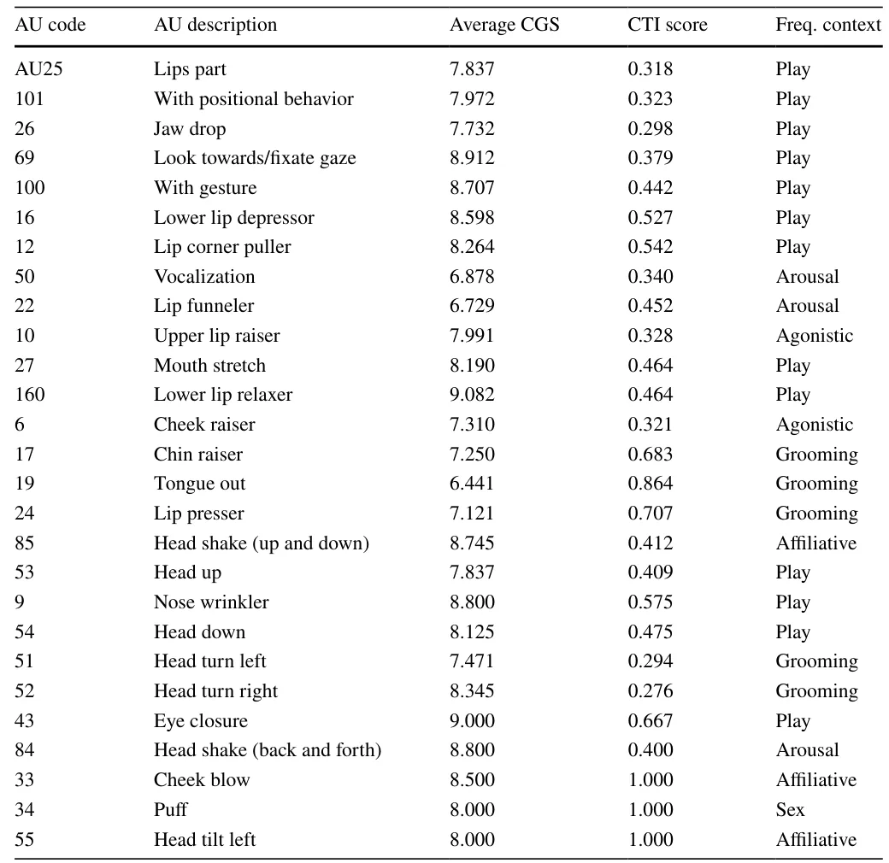
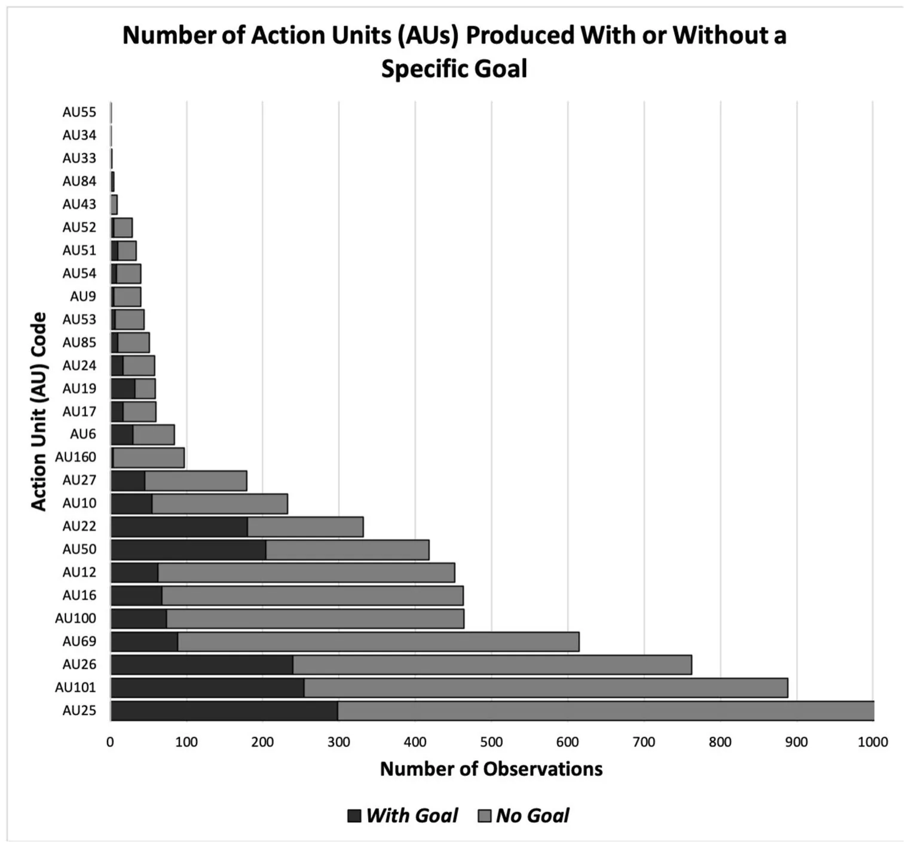
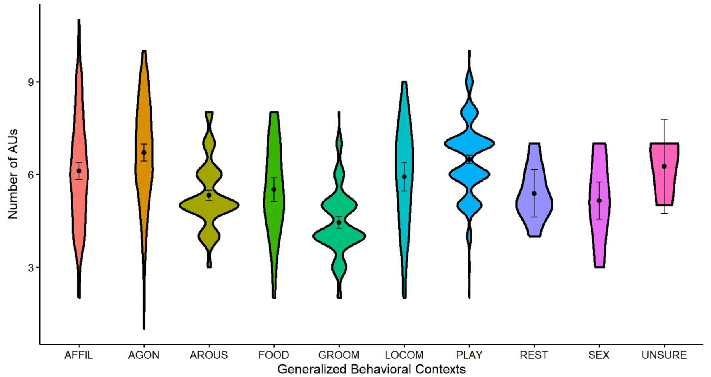

## Introduction

Primates communicate using a wide array of facial signals (Van Hooff 1967), a capability likely enhanced by their increased visual acuity (Martin and Ross 2005; Waller

- \* Brittany N. Florkiewicz brittany.florkiewicz@lyon.edu
- lazebnik.teddy@gmail.com
- 1 Department of Psychology, Lyon College, Batesville, AR, USA
- 2 Department of Mathematics, Ariel University, Ariel, Israel
- 3 Department of Cancer Biology, Cancer Institute, University of College London, London, UK

et al. 2022). Variation in facial signaling behavior appears to occur within (Kimock et al. 2025) and between (Scheider et al. 2014; Florkiewicz et al. 2023) species, likely due to morphological constraints (Dobson 2009a, b; Burrows et al. 2016a, b) along with differences in their socio-ecology (Dobson 2009a, b; Burrows et al. 2016a, b; Clark et al. 2020; Florkiewicz et al. 2023). Over the years, researchers have worked diligently to document the various facial signals of primates through different methods (Darwin 1872; Andrew 1963; Bolwig 1964; Van Hooff 1967; Parr et al. 2007, 2010; Ekman 2009; Waller et al. 2012, 2020; Caeiro et al. 2013; Julle-Danière et al. 2015; Correia-Caeiro et al. 2021, 2022). Early naturalists, such as Charles Darwin, primarily relied on illustrations and written descriptions to study these signals (Darwin 1872; Ekman 2009; Waller et al. 2020). In the 1960s, the focus shifted to a more detailed examination of the muscle movements that underlie these facial expressions, utilizing behavioral observations and photographs for analysis (Andrew 1963; Bolwig 1964; Van Hooff 1967). In recent years, advancements in research techniques, particularly the introduction of the Facial Action Coding System (FACS), have significantly improved our understanding of primate facial signals (Parr et al. 2007, 2010; Waller et al. 2012; Caeiro et al. 2013; Julle-Danière et al. 2015; Correia-Caeiro et al. 2021, 2022). FACS provides a structured framework for analyzing facial behavior by breaking down expressions into specific units of movement, known as Action Units (AUs) (2005). The Facial Action Coding System (FACS) breaks down facial signals into distinct units of movement, known as Action Units (AUs). This method minimizes observer bias and enhances the detection of subtle facial movements (Wathan et al. 2015), allowing researchers to identify combinations of movements that may not have been previously recognized. As a result, it increases the chances of detecting subtle movements of facial muscles and identifying combinations that may not have been previously documented. For instance, research utilizing FACS has shown that primates can produce numerous AUs (Waller et al. 2020), which are combined to create, in some cases, hundreds of facial signals (or AU combinations, Florkiewicz et al. 2023).

Research on the physical characteristics of facial signals in primates often examines their social functions. Charles Darwin initially explored the reflexes and emotional states that lead to facial signaling behaviors (Darwin 1872), adopting what is known as the Emotional View (Fridlund 1994). Darwin believed that individuals create facial signals primarily to express underlying emotions (Darwin 1872; Waller et al. 2017). This perspective has persisted among some researchers and was foundational in the development of the Facial Action Coding System (FACS) (Ekman 1970, 2009; Ekman and Friesen 1978; Ekman and Rosenberg 2005). However, in the 1960s, primate researchers began shifting their focus toward the behaviors that occur before and after the production of facial signals (Andrew 1963; Bolwig 1964; Van Hooff 1967). This change paved the way for a more predictive framework called the Behavioral Ecology View (Preuschoft and van Hooff 1995; Preuschoft 2000; Waller et al. 2017). Researchers under this framework sought to understand the reasons signals are produced for recipients while remaining neutral about the motivations behind why a signaler might create a facial signal in the first place (Fridlund 1994, 2002). This approach contrasts with the Emotional View, which centers on the reasons behind signal production by the signaler (Fridlund 1994; Parkinson 2005). The Behavioral Ecology View offers a fresh approach to exploring the evolutionary significance of facial signals, making it possible to use both observational and experimental methods (Crivelli and Fridlund 2018). For example, using FACS within this predictive framework, studies have revealed that different facial signals in primates are often linked to various social outcomes and can be influenced by audience effects (Waller et al. 2015; Scheider et al. 2016). Additionally, factors such as group size (Florkiewicz et al. 2023), social tolerance (Rincon et al. 2023), and bond strength (Florkiewicz et al. 2018) play significant roles in shaping the facial signaling behaviors of different primate species.

Research on facial signaling in primates has traditionally been separate from studies on gestural communication, largely due to the longstanding debate about the relationship between facial expressions and emotions (Darwin 1872; Ekman 1970; Lang et al. 2012). While primate gestures are perceived as intentional and flexible communicative signals aimed at achieving specific goals (Byrne et al. 2017; Tomasello and Call 2019), facial signals are generally viewed as spontaneous and inflexible expressions of emotion (Ekman 1970). This distinction has led to a focus on hand and torso movements in studies of gestural communication (Byrne et al. 2017; Florkiewicz and Campbell 2021a, b), further emphasizing the perceived divide between facial and gestural signaling. However, emerging research suggests that in certain primate species, particularly great apes, facial signals can potentially function as gestures (i.e., facial “gestures”; Liebal et al. 2006; Cartmill and Byrne 2010; Florkiewicz and Campbell 2021a, b). These facial “gestures” are similar to manual gestures in that they can also exhibit specific features associated with communicativeness, intentionality, flexibility, and goal association. It is important to note, though, that previously published studies on facial and manual gesturing often use different variables to assess these four key properties. For instance, research on the intentionality of primate gestures has examined a variety of related variables, including social use, attentional states, response waiting, persistence, elaboration, and goal satisfaction (Graham et al. 2020). Furthermore, some of the variables that have been used to measure intentionality (like goal satisfaction) have also been used to assess other key gesture properties, such as goal association (Hobaiter and Byrne 2014; Halina et al. 2018). Due to variations in criteria, definitions, and key variables among gesture studies, some researchers have suggested that examining multiple variables simultaneously, along with their interactions, is more effective than evaluating them individually (Florkiewicz and Campbell 2021a, b). While not all potential variables have been thoroughly examined in great ape facial gestures, preliminary results suggests that the distinction between facial and manual gestures may not be as straightforward as previously thought (Florkiewicz and Campbell 2021a, b). It is also becoming increasingly evident that emotion need not exclude facial signals from the study of gestural communication, as gestures can also result from emotional arousal (Kipp and Martin 2009; Noroozi et al. 2018).

Despite calls to better integrate the study of facial and gestural communication—both in theory and methodology—in light of these findings (Liebal and Oña 2018), few researchers have taken this step (Liebal et al. 2022), and to date, no studies have used FACS-based approaches to investigate the physical characteristics of these great ape facial “gestures”. Most studies have used ethograms or signaling frequencies to evaluate changes in the physical characteristics of facial and manual gestures (Leavens et al. 2005; Roberts et al. 2013; Roberts and Roberts 2019; Florkiewicz and Campbell 2021a, b). One recent study effectively combined FACS with signaling ethograms to analyze the combinatorial properties of great ape visual signaling (Oña et al. 2019). However, this study utilized FACS to categorize facial signals alongside manual gestures into distinct categories. It did not examine the subtle variations in facial muscle movements that may occur as signals are produced in different contexts, to the same extent that it did for manual gestures. Often, these ethograms excel when studying the social functions of facial "gestures" but fall short when examining their physical forms.

One effective way to address this research gap is to incorporate FACS-based methods with gesture ethograms to further investigate the flexibility in the facial gesturing behavior of great apes. One important characteristic of great ape gestures is their flexibility in both physical form and social use. For example, great apes can either persist in or elaborate on their signaling behavior if they do not receive a desired response from a conspecific that aligns with their goals (Roberts et al. 2012, 2013; Florkiewicz and Campbell 2021a, b). Persistence may involve holding a signal for an extended period, such as maintaining a *reaching* gesture for one minute, or repeating the signal, like producing a *clapping* gesture multiple times in succession (Roberts 2010; Roberts and Roberts 2019; Florkiewicz and Campbell 2021a, b). Furthermore, great apes can enhance their signaling behavior by altering the types of signals they use or adjusting their intensity (Leavens and Hopkins 1998; Roberts et al. 2013; Florkiewicz and Campbell 2021a, b). For example, one individual might replace a *clapping* gesture with a *reaching* gesture, or they might increase the volume of their claps. Both persistence and elaboration involve modifying the physical aspects of gesturing behavior. Some researchers also argue that gestures have specific meanings but can be used in a variety of contexts (Pollick and Waal 2007; Roberts et al. 2013; Graham et al. 2024), meeting the criteria for communicative flexibility. For example, a great ape may use the *grab* gesture, which often communicates the desire for specific individuals to stop their behavior (Hobaiter and Byrne 2014), in the context of feeding (*stop taking my food*) or play (*stop chasing me*).

Although persistence and elaboration are assessed at the signal level (such as repeating the signal or transitioning to a new signal entirely), they can also be applied to the signal's discrete components, such as facial muscle movements and their combinations. This extension can be achieved through more systematic and standardized approaches, such as the FACS. Although individual facial muscle movements, known as Action Units (AUs), may not always be produced under complete voluntary control or in isolation, since some movements rely on others for their execution (Mahmoud et al. 2025), adopting a FACS-based approach enables us to understand how specific movements and combinations of facial muscle movements affect the progression and conclusion of a social interaction. To initiate play, for example, non-human primates often produce a relaxed open-mouth expression, known as the play face (Davila-Ross and Palagi 2022). This expression is characterized by parted lips, a relaxed jaw, and the visibility of the bottom row of teeth (Palagi 2008; Palagi and Mancini 2011; Mancini et al. 2013; Ross et al. 2014; Davila-Ross et al. 2015; Palagi et al. 2019; Bresciani et al. 2022). In situations where there is a high risk of aggression, such as during rough-and-tumble play, the primate may modify this play face by also exposing the upper row of teeth (AU10). Previous studies have found that this adjustment serves to communicate that play is still desired and that the interaction is unlikely to escalate into aggression (Waller and Cherry 2012; Bresciani et al. 2022). During these adjustments, the signaler enhances the intensity of their play face by engaging more facial muscles, which results in the production of additional associated AUs (such as AU10). Some studies on manual gestures have found that intensifying a specific gesture can serve as a form of elaboration, which can be achieved by increasing the amplitude of the auditory components of the signal or enhancing physical contact (Roberts et al. 2013). While these studies primarily focus on increasing signaling intensity through hand movements, a similar concept can also be applied to individual facial muscle movements (such as the addition of AU10 to an already produced play face).

FACS-based approaches may also be used to assess flexibility in the social function of facial muscle movements and their combinations. Among different non-human primate species, AU10 appears in various contexts and may fulfill distinct social functions as a result. In crested macaques (*Macaca nigra*), for example, AU10 is often linked to submissive behavior, leading to more positive social interactions (such as grooming; (Clark et al. 2020, 2022). The production of AU10 also differs by age and sex among primates, with certain species (such as orangutans) producing this movement more frequently towards younger females, while chimpanzees tend to produce AU10 more frequently towards older individuals (Crepaldi et al. 2024).

Our current study aims to evaluate flexibility in the physical form of great ape facial “gestures” using Facial Action Coding System (FACS). Additionally, we aim to evaluate how the flexibility in the physical form of facial signals (using FACS) influences their social use. We draw upon data from two previously published studies conducted by the first author involving captive chimpanzees (*Pan troglodytes*). In the first study, we found evidence for flexibility in the physical forms of chimpanzee facial signals, focusing specifically on persistence and elaboration, using established definitions and ethograms (Florkiewicz and Campbell 2021a, b). However, flexibility in the physical form of these facial signals had not been assessed using more systematic and standardized approaches (i.e., FACS-based approaches). The second study by BNF utilized FACS data to compare the complexity and combinatorics of facial signals in chimpanzees to hylobatids (Florkiewicz et al. 2023). We found that chimpanzees produce a greater variety of distinct AU combinations than hylobatids, and these combinations tend to be more complex, consisting of a greater number of AUs compared to those found in hylobatids. The second study, however, did not evaluate the four key properties of gestures and their various associated variables. Instead, it only focused on the number and types of facial muscle movements exhibited by chimpanzees in comparison to hylobatids (Florkiewicz et al. 2023). By integrating data from both prior studies, our current research allows for a more detailed assessment of the flexibility of facial signaling forms.

We have divided our study objective into three key research questions and associated predictions, drawing on information from existing literature regarding great ape facial and gestural signaling. Previous studies have assessed differences in the presence/absence of certain AUs and the number of AUs produced in a given signal (Waller et al. 2015; Florkiewicz et al. 2023) as ways to quantify physical changes. These variables are associated with *combinatorics* (the types of AUs produced in a given facial signal) and complexity (the number of AUs produced in a given facial), respectively, and are adopted in our current study (as two measures of physical flexibility). Each of the three research questions below corresponds to measures of flexibility in social use of chimpanzee facial signals:

- 1. Do chimpanzee facial signals change in combinatorics (A) and complexity (B) based on the number of gesture properties (and their associated variables) exhibited (i.e., communicativeness, intentionality, flexibility, and goal-association)? One of the major challenges of our current study is that facial signals from BNF’s first study exhibited variation in the number of gesture variables. Out of the 11 gesture variables surveyed, the median number of chimpanzee facial signal types

observed was 8.13 (range: 6.08–9.27; (Florkiewicz and Campbell 2021a, b). This is because some variables may be relevant or irrelevant to a signaler, depending on the response from the recipient. For example, if a chimpanzee produces a signal and achieves their goal immediately, there may be no need for response waiting, which is one of the variables used to measure intentionality (Florkiewicz and Campbell 2021a, b). For this reason, we will investigate whether the physical form of facial signals changes based on the number of gesture variables they exhibit. By adopting a combined approach that evaluates the total number of gesture variables instead of merely considering the presence or absence of individual ones, we can tackle a significant challenge in our study: the inconsistency in how prior research defines and categorizes the four key gesture variables. As noted earlier, some of these variables can be utilized to assess multiple properties of gestures, making a unified analysis crucial for clarity. We predict that as chimpanzee facial signals exhibit a greater number of gesture variables, they will also exhibit significant shifts in their combinatorics and greater complexity in their physical form.

- 2. Do chimpanzee facial signals change in combinatorics (A) and complexity (B) when the signaler has a specific goal? Great apes use gestures with specific goals in mind, meaning they communicate to achieve desirable outcomes in social interactions (Hobaiter and Byrne 2014). To achieve a desirable outcome, chimpanzees may persist and/or elaborate on their signaling behavior (Roberts et al. 2013). We will examine whether chimpanzees modify their facial signals based on their goals and the extent to which they accomplish them. Focusing on goal association (i.e., whether the signaler has a specific behavioral response they aim to elicit from the recipient) is an effective way to address the fact that the remaining gesture properties and their associated variables are often produced because there is a specific goal that the chimpanzee aims to achieve. We predict that, since great ape gestures are characterized by their flexibility (Pollick and Waal 2007; Roberts et al. 2013) and that chimpanzee facial signals often exhibit flexibility in physical form (measured through persistence and elaboration) and social function (Florkiewicz and Campbell 2021a, b), facial signals related to specific goals will differ significantly in their composition. Additionally, we expect these goal-associated facial signals to exhibit greater complexity, measured by the number of action units (AUs), compared to facial signals that are not linked to specific goals.
- 3. Do chimpanzee facial signals change in combinatorics (A) and complexity (B) based on context? Great ape

gestures demonstrate contextual flexibility, where the same gesture type can be used in different social situations (Pollick and Waal 2007). Additionally, persistence and elaboration are influenced by context, occurring more frequently in competitive settings than in affiliative ones (Roberts et al. 2013). For these two reasons, we will examine whether chimpanzees modify their facial signals based on the contexts in which the social interactions occur in. In line with previous research (Roberts et al. 2013), we predict that chimpanzee facial signals will exhibit significant shifts in their combinatorics and greater complexity in their physical form when they are produced in non-affiliative contexts.

## Methods

We adhered to the Animal Behavior Society’s Guidelines on the Use of Animals (No authorship 2020). Additionally, we complied with the American Society of Primatologists' Principles regarding the Ethical Treatment of Non-Human Primates. Since we conducted non-invasive behavioral observations in areas accessible to visitors, approval from the Institutional Animal Care and Use Committee (IACUC) was not required for our study. It is important to note that our current study utilizes data on facial signaling behavior that were previously collected, coded, and analyzed for different research questions. Due to a unique and unplanned collaborative partnership between the two authors (BNF and TL), we were able to use this data to address new and important follow-up questions after the previous studies were published. The first author's (BNF) two earlier studies demonstrate the following: (1) chimpanzees can produce facial signals that share many properties and variables observed with manual gestures, and (2) they can create a wide variety of facial muscle movement combinations as part of their signaling repertoire (Florkiewicz and Campbell 2021a, b; Florkiewicz et al. 2023). Our current study serves as a follow-up by examining the relationship between key gesture properties and the various facial muscle movements and combinations produced by chimpanzees.

### Field site

We gathered data on a single troop of chimpanzees (*Pan troglodytes*) being housed at the Los Angeles Zoo from 2017 to 2019, observing a total of 18 individuals during this period (13 adults and 5 infants under the age of 7). The chimpanzees were housed in one large, naturalistic outdoor habitat, spanning approximately 3500 m2, featuring various natural elements such as a waterfall, trees, and cliffs, along with enriching items like termite mounds, slack lines, and nesting supplies to promote natural behaviors. Our research primarily focused on observing the chimpanzees within this outdoor space. However, in addition to their large outdoor habitat, the chimpanzees also had access to an indoor off-display area and an on-display 'penthouse' area, which included numerous slack lines and nesting sites designated for their care. The chimpanzees were fed fresh fruits and vegetables three times daily at 9:30 a.m., 12:30 p.m., and 4:00 p.m. in their outdoor enclosure, and they had unlimited access to water and any remaining food from previous meals.

### Data collection

Data collection took place on weekdays during the designated visiting hours from June 2017 to August 2019. We employed two distinct sampling methods for data collection: the focal individual sampling method in 2017 (Altmann 1974) and the opportunistic sampling method from 2018 to 2019 (Florkiewicz and Campbell 2021a, b). Using the focal individual sampling method, we continuously recorded videos of each troop member at 30-min intervals. Each individual was sampled once a week (so long as they had not been previously recorded that week), with the order and timing randomized. Each day, we observed the behavior of 3–4 chimpanzees, provided they were out and visible in their main enclosure, to ensure that all 18 chimpanzees were sampled each week. If a chimpanzee was not present (i.e., they were in their indoor enclosure), we postponed recording their behavior until they were available the following day. This approach yielded 72 h of video footage, averaging 4 h per individual. For the opportunistic sampling method, we concentrated on the most active groups of chimpanzees within the troop, documenting all social interactions through video recordings. Recordings commenced just prior to a social interaction and concluded when the chimpanzees either dispersed or stopped communicating. As a result, the duration of our video recordings varied depending on the length of these social interactions, ultimately totaling to 84.5 h of footage. Taken together, our combined sampling methods resulted in 156.5 h of video footage. All video footage was recorded on a Panasonic Full HD Camcorder HC-V770 (with a Sennheiser MKE400 external shotgun microphone attached).

### Data coding

We defined a *facial signal* as the movement of the face region that a signaler exhibits during communication with conspecifics, drawing from the broader understanding of a communicative signal (Smith and Harper 1995). Our definition specifically excludes facial muscle movements that are solely related to biological functions (such as breathing or chewing). Additionally, we opted not to include head movements in this study, as it is challenging to determine whether they hold communicative significance. For each facial signal, we recorded the identity of the facial signaler (*signaler ID*) and the intended recipient(s) (*recipient ID*).

Each facial signal was coded according to the guidelines established in the chimpanzee Facial Action Coding System, or chimpFACS (Parr et al. 2007). ChimpFACS employs video recordings instead of anatomical diagrams to train users to recognize both subtle and pronounced facial muscle movements. We coded all observed *Action Units* (*AUs*) for each facial signal at its peak production, assigning an individual *Action Unit* (*AU*) *combination* to each signal. We also counted the number of AUs used to produce a given AU combination, which we used for our *facial signaling complexity* variable (Florkiewicz et al. 2023). A greater number of AUs present within a given signal indicates greater morphological complexity. A list of AUs considered (and observed) in our current study can be found in Table 1.

We then categorized facial signals into commonly referenced behavioral types (i.e., *facial signal types*) based on similarities in key muscle movements at the peak of signaling behavior, using information about the presence or absence of specific AUs (Parr et al. 2005, 2008; Florkiewicz and Campbell 2021a, b). For example, play faces are typically identified by the parting of the lips (AU25) and the relaxation or stretching of the jaw (AU26 or AU27), which exposes the bottom row of teeth (AU16). To be classified as a play face, these specific facial muscle movements must be present. Additional movements, such as pulling the corners of the lips back to help reveal the bottom row of teeth (AU12), also occur frequently. However, as long as the key movements are evident, the signal will be classified accordingly. It's important to note that some facial muscle movements, like AU25, can appear in multiple signal types. The presence or absence of other key movements assists us in distinguishing one signal from another. For instance, when chimpanzees produce a pant hoot face, they part their lips (AU25) and funnel them (AU22) while also producing an audible vocalization (AU50). If there is no lip funneling and the vocalization is not clearly audible, it suggests that a different type of signal may have been produced instead. In our study, we included a total of nine facial signal types, with six being based on the work of Parr et al. (ambiguous face, bared teeth face, pant-hoot face, play face, pout face, and scream face (Parr et al. 2005, 2008). Additionally, we incorporated three more facial signal types after conducting a 2016 pilot study: the lipsmacking face, lower lip relaxer face, and raspberry face (Florkiewicz and Campbell 2021a, b). We chose not to include neutral signals in our coding protocols due to the challenges in assessing their potential for communicative purposes. We also omitted facial signal types that had a low number of observations (such as the whimper face, N = 1).

<figure class="table-figure" id="table-1">
<figcaption><strong>Table 1</strong> The four fundamental characteristics of gestures and their 12 associated variables, as identified and compiled in the first author's previous study (Florkiewicz and Campbell 2021a, b)</figcaption>

<table><tr><th>Property</th><th>Variable</th><th>Type</th><th>Definition</th></tr><tr><td>Communicative</td><td>Mechanical ineffectiveness</td><td>Binary</td><td>Facial muscle movement(s) are not used for biological maintenance or object manipulation</td></tr><tr><td>Communicative</td><td>Recipient ID</td><td>Binary</td><td>Facial muscle movement(s) are socially directed towards a conspecific</td></tr><tr><td>Flexible</td><td>Elaboration</td><td>Binary</td><td>The signaler alters the facial signal’s physical form after its initial production or transitions to a different type of facial signal</td></tr><tr><td>Flexible</td><td>Persistence</td><td>Binary</td><td>The signaler repeats and/or holds the facial signal they are producing for at least 3 s in length</td></tr><tr><td>Flexible</td><td>Generalized behavioral context</td><td>Categorical</td><td>Facial signals were categorized into one of ten behavioral contexts that best represent the overall social interaction</td></tr><tr><td>Intentional</td><td>Receiver attention</td><td>Binary</td><td>The recipient turns their gaze and body towards the signaler while the facial signal is produced</td></tr><tr><td>Intentional</td><td>Response waiting at the end</td><td>Binary</td><td>The signaler fixates their gaze on the recipient, waiting for a response at the end of the facial signal</td></tr><tr><td>Intentional</td><td>Response waiting while persisting</td><td>Binary</td><td>The signaler fixates their gaze on the recipient, waiting for a response while they are producing the facial signal</td></tr><tr><td>Intentional</td><td>Response waiting overall</td><td>Binary</td><td>One or both forms of response waiting (at the end and/or while persisting) are observed. This variable was incorporated into the study due to the general significance of response waiting. Combining both forms of response waiting also allows us to examine the total duration of response waiting, rather than just a small portion occurring during the signal production or at the signal's end</td></tr><tr><td>Goal associated</td><td>Immediate interaction outcome</td><td>Binary</td><td>There is an immediate behavioral change in the recipient following the production of the facial signal (within 1 s after the signal has been produced at its apex or peak)</td></tr><tr><td>Goal associated</td><td>Final interaction outcome</td><td>Binary</td><td>Once communication ceases, the recipient clearly exhibits a change in their behavior (when comparing their behavior at the initial start of the social interaction to their behavior towards the end of the interaction)</td></tr><tr><td>Goal associated</td><td>Presumed goal</td><td>Binary</td><td>The signaler has a specific behavioral response they aim to elicit from the recipient. Examples include: groom me, stop your behavior, follow me, etc</td></tr></table>

</figure>

We coded all facial signals using the four fundamental characteristics that are widely recognized in the gesture research literature. Gestures are often described as body movements that are (1) communicative, (2) flexible, (3) intentional, and (4) goal-associated (Hobaiter and Byrne 2011, 2014; Byrne et al. 2017; Graham et al. 2018; Tomasello and Call 2019). To quantify these four fundamental characteristics, we assessed 12 different variables (2 for communicativeness, 3 for flexibility, 4 for intentionality, and 3 for goal-association). Of these, 11 were coded as binary variables (presence or absence), and the final was coded as a categorical variable (generalized behavioral context). For example, one of the gesture variables we used to measure flexibility was persistence. This refers to the signaler repeating or holding a facial signal for at least three seconds. In our binary coding scheme, a signal either meets this criterion (present) or does not (absent). For more details about each gesture variable, please refer to Table 1. Once we had coded all gesture variables, we calculated a *Composite Gesture Score (CGS)* for each observed facial signal (Florkiewicz and Campbell 2021a, b). This score was derived by adding the total number of binary variables coded as present (1), out of a possible 11. For example, a facial signal that was mechanically ineffective, directed toward one clear recipient, and linked to a specific interaction outcome would receive a CGS of 3, as these three variables were marked as being present.

Inter-observer reliability was assessed for approximately 10% of video clips collected during 2017, which included approximately 14% (N = 149) of all observed facial signals (i.e., AU combinations). The primary coder and first author of our study, BNF, collaborated with two additional coders, SY and MC, to assess reliability. BNF and SY coded facial signals using the protocols outlined in chimpFACS (Vick et al. 2007), also categorizing the facial signals based on the types described previously (Parr et al. 2007; Florkiewicz and Campbell 2021a, b). Additionally, BNF and MC recorded the presence and absence of the key gesture variables listed in Table 1. A high level of agreement was achieved using the chimpFACS coding methods (Wexler’s ratio = 0.75), the ethogram of facial signal types (percentage of agreement = 74.83%), and the ethogram of key gesture variables (average percentage of agreement = 82.87% Hobaiter and Byrne 2011; Florkiewicz and Campbell 2021a, b). It is important to note that Wexler’s ratio is a widely used metric for evaluating agreement in FACS coding (Ekman and Rosenberg 2005; Parr et al. 2007). Wexler’s ratio is a metric used to determine whether a researcher has achieved a high level of agreement with other established FACS users who create those systems, thereby earning FACS certification (Ekman and Rosenberg 2005). It is calculated by taking the number of Action Units (AUs) in which two coders agree, multiplying that by 2, and then dividing by the total number of AUs scored by both coders (Wathan et al. 2015). This method is particularly useful in FACS, where there are numerous potential codes and coders may score a large number of items (Wathan et al. 2015). Agreement is evaluated at the level of the AU combination rather than at the individual AU level using this approach. However, as Wexler's ratio increases, the agreement on the types of AUs present in a given facial signal also is likely to increase.

Intraclass Correlation Coefficients (ICC) and Cohen’s Kappa (K) are commonly used to assess agreement in primate communication studies. However, Cohen’s Kappa is typically more suitable for categorizing signals into typologies (Pollick and de Wall 2007; Waller et al. 2015; Rincon et al. 2023), while ICC may yield artificially inflated or deflated agreement scores if there is significant variation among the muscle movement combinations across facial signals (Lee et al. 2012). For instance, previous studies that utilized ethograms and FACS-based methods have employed Cohen’s Kappa to evaluate agreement for categories of facial signals and behavioral contexts, while using Wexler’s ratio to measure agreement with animalFACS coding (Rincon et al. 2023; Scheider et al. 2016). To maintain consistency with other FACS studies and follow the recommendations outlined in the FACS coding manual, we have chosen to use Wexler’s ratio instead of these other agreement measures.

### Data analysis

Data were coded using ELAN 5.6 with a custom annotation template (Wittenburg et al. 2006). The coded data were then exported to an Excel sheet, which was subsequently uploaded to R 4.4.2 for analysis (Ihaka and Gentleman 1996). A copy of the raw data and the R code can be found in the electronic supplement.

#### Assessing combinatorics

When evaluating combinatorics, it's important to recognize that the specific facial muscle movements (Action Units, or AUs) generated may be linked to the type of signal being produced. For instance, certain facial signals, like play faces, have strong connections with particular facial muscle movements (such as AU12 and AU16, Parr et al. 2007; Davila-Ross and Palagi 2022). AUs do not have an exclusive relationship with facial signal typologies, meaning that a single AU can still appear in multiple contexts (Parr et al. 2007; Florkiewicz et al. 2023). In this study, our focus is on the composition of facial signals, rather than their typologies, and how this composition changes during the gesturing process. To address this consideration for research questions 1A and 2A, which relate to Composite Gesture Scores (CGS) and the presence of a specific goal, we utilized Generalized Linear Mixed Models (GLMMs). GLMMs are beneficial for studying primate communication, as they reduce the risk of pseudoreplication by incorporating multiple fixed and random effects (Waller et al. 2013). For both research questions 1A and 2A, we treated facial signal type and signaler ID as random intercepts. This approach was used to acknowledge individual behavioral differences as well as variation in combinatorics based on previously reported signal types. Our focus in this study was on understanding how each AU relates to different contexts, while also acknowledging that variations may arise due to similarities in typologies (through random intercepts). The presence or absence of each type of AU documented, such as AU12 and AU16, was treated as binary dependent variables (i.e., our response variable) for research questions 1A and 2A and their associated models. Our study considered 27 different AUs, allowing for a total of 27 models to be run for each question (one for each AU), provided that each AU had an adequate number of observations (N > 10).

For research question 1A, the Composite Gesture Score (CGS), representing the total count of binary gesture variables observed as being present for each facial signal (out of 11), served as our independent variable. In research question 2A, the presence of a specific goal, which was also treated as a binary variable, was designated as the independent variable. To ensure that our independent variables significantly impacted the dependent variable, we compared our full models to their null counterparts (with the independent variables removed) using the ANOVA function in R. We only report on full models that demonstrate a significantly better fit compared to their null counterparts. The outputs for all our models, both full and null, can be found in the electronic supplement. We ran our binomial GLMMs using the package “lme4” (Bates et al. 2015).

For research question 3A, we adopted a different approach due to the various types of generalized behavioral contexts and Action Units (AUs) that needed assessment. One method used to assess contextual flexibility was through Context Tie Indices (or CTI scores, Florkiewicz and Campbell 2021a, b). CTI scores were originally developed by Pollick and de Waal to evaluate the strength of the association between contexts and facial signal types (Pollick and Waal 2007). CTI scores are calculated by identifying the largest proportion of occurrences (and the corresponding behavioral context) observed for each facial signal type (Pollick and Waal 2007; Florkiewicz and Campbell 2021a, b). For example, if a "play face" is produced in the context of play 75% of the time and in the context of grooming the remaining 25% of the time, the CTI score for that signal type would be 0.75. In this study, we decided to apply this measure to individual AUs rather than facial signal types. By doing this, we can evaluate how each individual AU is used across contexts. We recorded the most frequently observed context for each AU along with its corresponding proportion to assign a CTI score. We then analyzed the distribution of CTI scores to qualitatively assess how context influences the combinatorics of facial signals.

#### Assessing complexity

To assess whether chimpanzee facial signals change in complexity based on the number of gesture variables (CGS) and whether the signaler has a specific goal (research questions 1B and 2B), we made use of Generalized Linear Mixed Models (GLMMs). In our first GLMM (Model 1), we used the Composite Gesture Score (CGS) as the dependent variable and the number of Action Units (AUs) as the independent variable. For the second GLMM, we set the presence or absence of a specific goal as the dependent variable, while the number of AUs remained the independent variable (Model 2). The first model was a Poisson GLMM suitable for count data, whereas the second model was a binomial model appropriate for binary variables. For both models, the identity of the signaler was set as our random variable. To ensure that our independent variables significantly impacted the dependent variable, we compared our full models to their null counterparts (with the independent variables removed) using the ANOVA function in R. Both models fit the data significantly better than our null counterparts (*p* < 0.001). We ran our GLMMs using the package “lme4” in R (Bates et al. 2015), and extracted p-values for our fixed effects using “sjstats” (Lüdecke and Lüdecke 2019).

To determine if chimpanzee facial signals vary in complexity depending on the generalized behavioral context (research question 3B), we performed a one-way ANOVA test, comparing the average number of AUs produced in each facial signal across various behavioral contexts. We examined facial signals across multiple contexts (N = 10); therefore, descriptive statistics were used when the results of our one-way ANOVA was significant.

## Results

We observed a total of 1090 facial signals across 9 distinct types. We observed 27 distinct Action Units (AUs) and 356 AU combinations across these 1,091 facial signals. Further details on the specific AU and AU combinations observed are available in the electronic supplement. On average, chimpanzee facial signals exhibited approximately 7.837 gesture variables (SD = 2.285) and are comprised of 5.897 Action Units (AUs, SD = 1.562). More information on the proportion of facial signals exhibiting each variable can also be found in the electronic supplement.

### Facial signaling combinatorics

We coded a total of 6,423 Action Units (AUs) across 27 distinct types of AUs (Table 2 and Fig. 1). The average number of AU observations across categories was 237.889 (SD = 295.414). Some AUs were rarely observed (N < 10). These AUs with low observations were excluded from the subsequent analyses (i.e., the GLMMs for research questions 1A & 2A).

Out of the 27 AUs observed, 22 were further examined using binomial GLMMs to address research questions 1A and, as they had more than 10 observations within our dataset. In research question 1A, we explored whether there were significant differences in the production of each AU based on the gestural nature of each facial signal (as measured through Composite Gesture Scores, or CGS). Out of the 22 AUs examined, 10 showed significant differences in production based on their CGS (Table 3). Out of the 10 AUs analyzed, 4 of them—AU17, AU24, AU50, and AU6—were significantly more likely to occur in facial signals that displayed fewer gesture variables, as indicated with lower Composite Gesture Scores. In contrast, the remaining 6 AUs— AU85, AU52, AU53, AU69, AU100, and AU101—were significantly more likely to occur in facial signals exhibiting a greater number of gesture variables. The remaining 12 AUs exhibited no significant differences in production based on CGS.

For research question 2A, we investigated whether signalers were more or less likely to use certain AUs if they had a specific goal. Out of the 22 AUs examined, 8 showed significant differences in production based on the presence of a specific goal (Table 4). Out of the 8 AUs analyzed, 6 of them—AU160, AU85, AU52, AU53, AU69, and AU100—were significantly more likely to be produced if the signaler is communicating about a clear goal that they have. In contrast, the remaining 2 AUs—AU50 and AU6— were significantly less likely to be produced if the signaler was communicating about a clear goal that they have.

<figure class="table-figure" id="table-2">
<figcaption><strong>Table 2</strong> The average Composite Gesture Score (CGS) and the Composite Tie Index (CTI) for each AU observed (columns 3 and 4)</figcaption>

The most frequently observed context associated with each AU and corresponding CTI score is found in the last column

</figure>

<figure id="fig-1">

<figcaption><strong>Fig. 1</strong> A visual representation of the number (and types) of AUs observed in our study. Observations for each AU are color-coded based on whether they were produced in association with a specific goal</figcaption>
</figure>

For research question 3A, we calculate Context Tie Indices (CTI scores) for each of the 27 distinct types of AUs observed (Table 1). The average CTI score across AU types was 0.525 (SD = 0.226). Out of the 10 generalized behavioral contexts examined, 6 emerged as the most frequently observed across the various AU types. For instance, “play” was identified as the most common context for 13 different AU types, followed by “grooming” (N = 5). Out of the 27 AU types, 22 were the most frequently observed in “positive” contexts, such as affiliation, sex, grooming, and play. Some AUs that were linked to lower Composite Gesture Scores (CGS), such as AU17 and AU24, exhibited higher average CTI scores (0.683 and 0.707, respectively). However, AUs that occurred more frequently in facial signals without a specific goal, such as AU50 and AU6, exhibited lower average CTI scores (0.340 and 0.321, respectively).

### Facial signaling complexity

The results of our Generalized Linear Mixed Models (GLMMs) show that there are significant differences in the complexity of facial signals, measured by the number of Action Units (AUs) within a given combination (AU combination; Table 5). As the Composite Gesture Scores (CGS) increase, the number of AUs within a specific facial signal’s AU combination also increases (*p* < 0.001). Additionally, the number of produced AUs increases when the signaler has a clear goal they are trying to communicate (*p* < 0.001). Furthermore, the results of our one-way ANOVA indicate significant differences in the complexity of facial signals based on the generalized behavioral contexts in which they were produced (F(9, 1080) = 34.47, *p* < 0.001; Fig. 2). In line with our third research question, we discovered that the complexity of facial signals was greater in non-affiliative contexts. For instance, the average number of action units (AUs) per signal in the “affiliative” context was lower (mean = 6.110, SD = 1.753) than the average observed in the “agonistic” context (mean = 6.700, SD = 1.678). This pattern was also observed in other positive contexts, such as grooming (mean = 4.438, SD = 1.084), play (mean = 6.486, SD = 1.216), and sex (mean = 5.143, SD = 1.314), all of which had lower average numbers of AUs compared to the agonistic context.

<figure class="table-figure" id="table-3">
<figcaption><strong>Table 3</strong> The results of our binomial Generalized Linear Mixed Models (GLMMs) for research question 1A</figcaption>

<table><tr><th>AU code</th><th>AU description</th><th>Predictor variable</th><th>ß</th><th>SE</th><th>z value</th><th>p value</th></tr><tr><td>AU17</td><td>Chin raiser</td><td>(Intercept)</td><td>− 10.347</td><td>0.002</td><td>− 5890.8</td><td>p &lt; 0.001</td></tr><tr><td></td><td></td><td>CGS</td><td>− 0.437</td><td>0.002</td><td>− 248.8</td><td>p &lt; 0.001</td></tr><tr><td>AU24</td><td>Lip presser</td><td>(Intercept)</td><td>− 8.264</td><td>4.201</td><td>− 1.967</td><td>p = 0.049</td></tr><tr><td></td><td></td><td>CGS</td><td>− 0.786</td><td>0.365</td><td>− 2.153</td><td>p = 0.031</td></tr><tr><td>AU50</td><td>Vocalization</td><td>(Intercept)</td><td>0.126</td><td>1.159</td><td>0.109</td><td>p = 0.913</td></tr><tr><td></td><td></td><td>CGS</td><td>− 0.257</td><td>0.052</td><td>− 4.977</td><td>p &lt; 0.001</td></tr><tr><td>AU6</td><td>Cheek raiser</td><td>(Intercept)</td><td>− 3.774</td><td>1.956</td><td>− 1.930</td><td>p = 0.054</td></tr><tr><td></td><td></td><td>CGS</td><td>− 0.248</td><td>0.076</td><td>− 3.252</td><td>p = 0.001</td></tr><tr><td>AU85</td><td>Head shake (up and down)</td><td>(Intercept)</td><td>− 9.307</td><td>1.646</td><td>− 5.656</td><td>p &lt; 0.001</td></tr><tr><td></td><td></td><td>CGS</td><td>0.351</td><td>0.099</td><td>3.557</td><td>p &lt; 0.001</td></tr><tr><td>AU52</td><td>Head turn right</td><td>(Intercept)</td><td>− 5.591</td><td>1.004</td><td>− 5.570</td><td>p &lt; 0.001</td></tr><tr><td></td><td></td><td>CGS</td><td>0.218</td><td>0.107</td><td>2.037</td><td>p = 0.042</td></tr><tr><td>AU53</td><td>Head up</td><td>(Intercept)</td><td>− 5.379</td><td>0.873</td><td>− 6.164</td><td>p &lt; 0.001</td></tr><tr><td></td><td></td><td>CGS</td><td>0.226</td><td>0.093</td><td>2.429</td><td>p = 0.012</td></tr><tr><td>AU69</td><td>Look towards/fixate gaze</td><td>(Intercept)</td><td>− 4.535</td><td>0.444</td><td>− 10.21</td><td>p &lt; 0.001</td></tr><tr><td></td><td></td><td>CGS</td><td>0.640</td><td>0..046</td><td>14.03</td><td>p &lt; 0.001</td></tr><tr><td>AU100</td><td>With manual gesture</td><td>(Intercept)</td><td>− 2.392</td><td>0.426</td><td>− 5.620</td><td>p &lt; 0.001</td></tr><tr><td></td><td></td><td>CGS</td><td>0.220</td><td>0.037</td><td>5.891</td><td>p &lt; 0.001</td></tr><tr><td>AU101</td><td>With positional behavior</td><td>(Intercept)</td><td>0.394</td><td>0.447</td><td>0.883</td><td>p = 0.377</td></tr><tr><td></td><td></td><td>CGS</td><td>0.126</td><td>0.042</td><td>2.967</td><td>p = 0.003</td></tr></table>

We set the presence or absence of each Action Unit (AU) within a given facial signal as our dependent variable. Signaler ID and signal type were included as random variables. The Composite Gesture Score (CGS) for each facial signal served as our independent variable. Below, we present the outputs for the full models that were significantly better fits than their null counterparts

</figure>

<figure class="table-figure" id="table-4">
<figcaption><strong>Table 4</strong> The results of our binomial Generalized Linear Mixed Models (GLMMs) for research question 2A</figcaption>

<table><tr><th>AU code</th><th>AU description</th><th>Predictor variable</th><th>ß</th><th>SE</th><th>z value</th><th>p value</th></tr><tr><td>AU160</td><td>Lower lip relaxer</td><td>(Intercept)</td><td>− 6.656</td><td>1.906</td><td>− 3.493</td><td>p &lt; 0.001</td></tr><tr><td></td><td></td><td>Specific goal</td><td>1.862</td><td>0.799</td><td>2.331</td><td>p = 0.020</td></tr><tr><td>AU85</td><td>Head shake (up and down)</td><td>(Intercept)</td><td>− 7.076</td><td>1.408</td><td>− 5.025</td><td>p &lt; 0.001</td></tr><tr><td></td><td></td><td>Specific goal</td><td>0.957</td><td>0.464</td><td>2.061</td><td>p = 0.039</td></tr><tr><td>AU52</td><td>Head turn right</td><td>(Intercept)</td><td>− 4.592</td><td>0.585</td><td>− 7.848</td><td>p &lt; 0.001</td></tr><tr><td></td><td></td><td>Specific goal</td><td>1.019</td><td>0.537</td><td>1.900</td><td>p = 0.058</td></tr><tr><td>AU53</td><td>Head up</td><td>(Intercept)</td><td>− 4.253</td><td>0.516</td><td>− 8.246</td><td>p &lt; 0.001</td></tr><tr><td></td><td></td><td>Specific goal</td><td>0.952</td><td>0.482</td><td>1.978</td><td>p = 0.048</td></tr><tr><td>AU69</td><td>Look towards/fixate gaze</td><td>(Intercept)</td><td>− 0.626</td><td>0.274</td><td>− 2.285</td><td>p = 0.022</td></tr><tr><td></td><td></td><td>Specific goal</td><td>1.490</td><td>0.174</td><td>8.561</td><td>p &lt; 0.001</td></tr><tr><td>AU100</td><td>With manual gesture</td><td>(Intercept)</td><td>− 1.179</td><td>0.357</td><td>− 3.302</td><td>p = 0.001</td></tr><tr><td></td><td></td><td>Specific goal</td><td>0.714</td><td>0.187</td><td>3.816</td><td>p &lt; 0.001</td></tr><tr><td>AU50</td><td>Vocalization</td><td>(Intercept)</td><td>− 0.794</td><td>1.122</td><td>− 0.708</td><td>p = 0.479</td></tr><tr><td></td><td></td><td>Specific goal</td><td>− 1.510</td><td>0.263</td><td>− 5.742</td><td>p &lt; 0.001</td></tr><tr><td>AU6</td><td>Cheek raiser</td><td>(Intercept)</td><td>− 4.884</td><td>1.932</td><td>− 2.528</td><td>p = 0.012</td></tr><tr><td></td><td></td><td>Specific goal</td><td>− 1.252</td><td>0.377</td><td>− 3.318</td><td>p = 0.001</td></tr></table>

We set the presence or absence of each Action Unit (AU) within a given facial signal as our dependent variable. Signaler ID and signal type were included as random variables. The presence or absence of a specific goal for each facial signal was our independent variable. Below, we present the outputs for the full models that were significantly better fits than their null counterparts

</figure>

<figure class="table-figure" id="table-5">
<figcaption><strong>Table 5</strong> The results of our GLMMs indicate significant differences (bolded) in the complexity of facial signals based on Composite Gesture Scores (Model 1) and whether the signaler has a clear, specific goal (Model 2)</figcaption>

<table><tr><th>Model ID</th><th>Independent variable</th><th>ß</th><th>SE</th><th>z value</th><th>p value</th></tr><tr><td>Model 1</td><td>(Intercept)</td><td>1.790</td><td>0.050</td><td>35.500</td><td>p &lt; 0.001</td></tr><tr><td></td><td>Composite gesture</td><td>0.044</td><td>0.007</td><td>5.953</td><td>p &lt; 0.001</td></tr><tr><td></td><td>score</td><td></td><td></td><td></td><td></td></tr><tr><td>Model 2</td><td>(Intercept)</td><td>− 0.066</td><td>0.382</td><td>− 0.174</td><td>p = 0.862</td></tr><tr><td></td><td>Specific goal</td><td>0.202</td><td>0.050</td><td>4.043</td><td>p &lt; 0.001</td></tr></table>

</figure>

## Discussion

Our study aimed to assess the flexibility of chimpanzee facial “gestures” in both their physical form and social use using the Facial Action Coding System (FACS). To achieve this, we explored three key research questions examining the combinatorics (A) and complexity (B) of chimpanzee facial signals based on: (1) the number of gesture properties and associated variables exhibited; (2) whether the signaler has a specific goal when producing the signal; and (3) the social context that the signals are used in.

We observed significant differences in the combinatorics (A) of chimpanzee facial signals based on our three variables of interest (research questions 1A-3A). First, certain facial muscle movements were less likely to occur when the facial signal was employed in a more gestural manner, and if the chimpanzee signaling lacked a specific goal. These movements included AU50 (vocalization) and AU6 (cheek raiser). In our current study, we frequently observed vocalizations (AU50) paired with facial signals during periods of high arousal, particularly when all the chimpanzees were engaged in a pant-hoot chorus. In fact, 56.70% (N = 237) of all observations of AU50 occurred during the production of pant hoot faces. Pant hoots are long-distance calls typically used to maintain contact with neighboring chimpanzees within the troop (Fedurek et al. 2013). The frequency and duration of pant hoot chorusing in chimpanzees are influenced by socio-ecological factors. Pant hoots are most commonly produced by high-ranking chimpanzees (Clark 1993; Leroux et al. 2021), especially in environments where there is minimal risk of visual detection (Wilson et al. 2007) and abundant food sources (Leroux et al. 2021). One possible explanation is that vocal utterances, rather than visual facial muscle movements, are associated with the four key gesturing properties. For example, previous studies have provided evidence for the intentional and flexible production of chimpanzee pant hoots (Soldati et al. 2022; Watson et al. 2022). Some researchers have even drawn comparisons between the strategic and non-random combinations of pant hoots with other vocalizations (such as food calls) and the syntactic structure of human language (Leroux et al. 2021). The remaining 43.30% of AU50 instances (N = 181) were linked to raspberry faces, which captive chimpanzees typically use to attract the attention of human caregivers (Hopkins et al. 2007). In our current study, however, it was found that raspberry faces with distinct vocal elements (AU50) were mainly directed toward other chimpanzees in the context of grooming (N = 37 or 72.55% of vocal raspberry faces). Interestingly, raspberry faces, along with vocalizations, also involve raising the chin (AU17) and pressing the lips (AU24). These two movements were significantly less likely to occur when the facial signal was used in a more gestural manner. However, there were no significant differences in their occurrence based on whether the signaler had a specific goal. Further research is required to determine if the acoustic properties of raspberry faces demonstrate the same intentionality and flexibility as those of chimpanzee pant hoots.

<figure id="fig-2">

<figcaption><strong>Fig. 2</strong> Violin plots illustrating the distribution of the number of AUs observed in each facial signal across different social contexts. The black dots represent means, and 95% Confidence Intervals (CIs) are also presented</figcaption>
</figure>

AU6 (cheek raiser) was associated with facial signals that were less gestural and not linked to a specific goal. AU6 is primarily linked to the production of non-affiliative facial displays, such as the bared-teeth face, scream face, and whimper face (Parr et al. 2007). Interestingly, recent studies have found different morphological variants of the bared-teeth faces (silent and vocal) that correspond to various social contexts and depend on social rank (Kim et al. 2022). Among the 53 observed instances of bared-teeth faces, only 6 were accompanied by a distinct vocalization (AU50). Our small sample sizes make it challenging to compare silent and vocal variants effectively. However, based on our available data, vocal variants have, on average, a higher average CGS of 7.000 and a greater average number of AUs at 8.000, compared to their silent counterparts, which have averages of 6.511 and 6.681, respectively. Further research is needed to determine if the differences in CGS and the number of AUs between vocal and silent facial signals are significant. If the vocal aspects of chimpanzee facial signals are linked to key gesture properties, as previously discussed in relation to pant hoot faces, then the preliminary data presented here for bared teeth faces challenge this idea. Vocal variants of the bared teeth face demonstrate greater contextual flexibility than their visual counterparts. However, additional data are necessary to thoroughly examine the connection between vocalizations and key gesture properties for both pant hoots and bared teeth faces. In our current study, we focused solely on coding the presence or absence of clearly identifiable vocal utterances (AU50), as our main interest was in the visual aspects of chimpanzee facial signals. It is possible that subtle vocalizations occurred during the production of silent bared-teeth expressions.

An alternative interpretation of our findings for AU50 and AU6 is that vocalizations might be less gestural than visual signals due to the anatomical constraints of the primate vocal tract. Compared to humans, non-human primates have a limited range of vocal utterances, and as a result, cannot achieve the same degree of acoustic modification (Cheney and Seyfarth 2018). Facial and manual gestures could have preceded the increased reliance on vocalizations for intentional and flexible communication due to anatomical constraints of the vocal tract (Corballis 2009). However, the notion of a constrained vocal tract in non-human primates has been challenged in recent years. Researchers have discovered that the vocal folds of non-human primates are flexible and capable of executing movements akin to those used in human vocalization (Lameira et al. 2016). Even with flexible vocal folds, differences in vocalizations among non-human primates are still noticeable, possibly due to variations in neural control (Fitch et al. 2016). In this case, variations in neural control may have limited the capacity to produce vocal gestures among non-human primates.

The capacity for frequent vocal gesturing could have emerged more recently in evolutionary history, after the divergence of the last common ancestor between chimpanzees and humans (Corballis 2003). However, this idea does not necessarily imply that essential gesture characteristics are completely absent from vocalizations. There is some evidence indicating that chimpanzee vocalizations, generally speaking, are produced in an intentional and flexible manner (Townsend et al. 2020; Slocombe et al. 2022). In our current study, we found that AU6 and AU50 demonstrate a relatively high degree of contextual flexibility, as indicated by their lower CTI scores. However, we previously found that facial signals (as a whole) that are often associated with vocalizations exhibit a relatively lower degree of contextual flexibility. Our new findings suggest that there is a complex relationship between vocal production and contextual flexibility. Further research is needed to determine if the distinct vocal elements of chimpanzee vocalizations undergo changes in combinatorics and complexity, as shown in this study with other frequently observed facial muscle movements. Certain movements, including AU52, AU53, AU69, AU85, and AU100, are associated with higher Composite Gesture Scores, specific goals, and lower CTI scores. When combined, these three variables indicate a greater level of intentional and flexible production. Notably, these AUs encompass movements of the head (AU52, AU53, AU85), the eyes (AU69), and the hands (AU100). Future studies should examine how other types of head movements, such as jaw movements, influence the production of facial signals and whether they display similar flexibility, as they can be associated with vocal production.

Chimpanzee facial signals appear to be significantly influenced by various visual movements and visual signals, including manual gestures (AU100). While chimpanzee facial signals retain their gestural quality even when not accompanied by manual gestures (Florkiewicz and Campbell 2021a, b), the production of a manual gesture correlates with an increased likelihood of a facial signal being utilized in a more gestural context, suggesting an additive effect. This finding highlights intriguing parallels to human language. Manual gestures play a crucial role in human conversation (Quek et al. 2002), and the ability for multimodal communication is observable across various primate species (Liebal et al. 2013). It is proposed that human language evolved by building upon existing multimodal communicative frameworks (Gillespie-Lynch et al. 2014). While the connection between vocalization and gestures is not entirely clear in our study, it is evident that the visual communicative strategies employed by chimpanzees resemble certain aspects of human linguistic behavior, as demonstrated by our current and previous findings (Florkiewicz and Campbell 2021a, b; Florkiewicz et al. 2023). Chimpanzees use multicomponent facial signals (i.e., unique combinations of facial muscle movements; Waller et al. 2022) and multimodal visual signals (involving both facial and manual gesturing components) that allow them to communicate in an intentional and flexible manner to accomplish specific goals. This may be comparable to the hierarchical nature of human language and the gestural behaviors that accompanies such vocal utterances.

Regarding facial signaling complexity (research questions 1B-3B), we found that the complexity of chimpanzee facial signals increases as these signals become more gestural (1B) and when the signaler has a specific goal (2B). This enhanced communicative complexity is likely advantageous for chimpanzees in their complex socio-ecological environments (which has sometimes been referred to as the socio-ecological or socio-communicative complexity hypothesis; Freeberg 2006; Freeberg et al. 2012; Florkiewicz et al. 2023). Compared to other apes (such as hylobatids), chimpanzees exhibit greater complexity in their facial signaling behavior (Florkiewicz et al. 2023). This complexity may be attributed to the addition of facial “gestures” in their repertoire, which help them navigate different types of social interactions indicative of large-scale social living. Chimpanzees live in large groups that exhibit fission–fusion dynamics (Aureli et al. 2008; Campbell et al. 2010; Sueur et al. 2011; Matthews 2021), with smaller subgroups providing opportunities for cooperative activities (Boesch and Boesch 1989) and social learning (Lonsdorf 2006). In our current study, we demonstrate that as facial signals become more gestural, they also increase in complexity. Further studies on the facial gestural abilities of other species, such as hylobatids, and their relation to the complexity of facial signals (using FACS-based approaches) will be essential to confirm this connection. We also discovered that the complexity of facial signaling is highest in non-affiliative contexts, which aligns with findings from previously published studies (research question 3B; Roberts et al. 2013). Previous studies have found that chimpanzees produce a significantly greater number of multi-gesture sequences during competitive contexts, indicating greater persistence (and communicative flexibility; Roberts et al. 2013). Our finding may be attributed to signaling arousal or to a desire for clear and purposeful communication, which is especially beneficial in high-stakes situations like fighting. Both explanations suggest that the motivation to signal and respond varies based on the context.

Our study is one of the first to integrate FACS (Facial Action Coding System) into the examination of facial gesturing in non-human primates such as chimpanzees. However, our study has some limitations, including the reliance on data from a single captive troop of chimpanzees and a specific focus on visual, rather than vocal, elements of facial signals. Despite these limitations, our findings suggest that the cognitive ability for flexible communication may operate across various aspects of facial signaling. This includes facial muscle movements, their combinations, and overall facial signals, functioning in a way similar to the hierarchical structure of human language. Additionally, our study opens up opportunities for further research that combines the study of both facial and manual gesturing in non-human primates. It also highlights potential pathways for integrating vocalizations into this analysis by encouraging a more detailed exploration of the individual acoustic features of vocalizations and their relationship to key gesture properties.

**Supplementary Information** The online version contains supplementary material available at https://doi.org/10.1007/s10071-025-01955-0.

**Author contributions** B.F. formulated the research questions and established the theoretical framework for this manuscript. Both authors (B.N.F. an T.L.) contributed equally to data cleaning, data analysis, manuscript writing, and proofreading.

**Data availability** Our raw data and R code utilized in this study are available in the electronic supplement.

### Declarations

**Conflict of interest** The authors of this study (BNF & TL) have no competing interests to disclose. We adhered to the Animal Behavior Society’s Guidelines on the Use of Animals and complied with the American Society of Primatologists' Principles regarding the Ethical Treatment of Non-Human Primates. Since we conducted non-invasive and non-harmful behavioral observations in areas accessible to visitors, we were exempt from requiring full IACUC approval for this study (Animal Welfare Act).

## References

- Ekman P, Rosenberg EL (2005) What the face reveals: basic and applied studies of spontaneous expression using the facial action coding system (FACS), 2nd edn. Oxford University Press, New York
- Altmann J (1974) Observational study of behavior: sampling methods. Behaviour 49(3/4):227–267
- Andrew RJ (1963) The origin and evolution of the calls and facial expressions of the primates. Behaviour 20(1–2):1–109
- Aureli F, Schaffner CM, Boesch C, Bearder SK, Call J, Chapman CA, Connor R, Fiore AD, Robin IM, Dunbar SP, Henzi KH, Korstjens AH, Layton R, Lee P, Lehmann J, Manson JH, Ramos-Fernandez G, Strier KB, v. Schaik CP (2008) Fission-fusion dynamics: new research frameworks. Curr Anthropol 49(4):627–654
- Bates D, Mächler M, Bolker B, Walker S (2015) Fitting linear mixed-effects models using lme4. J Stat Softw 67(1):1–48
- Boesch C, Boesch H (1989) Hunting behavior of wild chimpanzees in the Taï National Park. Am J Phys Anthropol 78(4):547–573
- Bolwig N (1964) Facial expression in primates with remarks on a parallel development in certain carnivores (a preliminary report on work in progress). Behaviour 22(3–4):167–192
- Bresciani C, Cordoni G, Palagi E (2022) Playing together, laughing together: rapid facial mimicry and social sensitivity in lowland gorillas. Curr Zool 68(5):560–569
- Burrows AM, Li L, Waller BM, Micheletta J (2016a) Social variables exert selective pressures in the evolution and form of primate mimetic musculature. J Anat 228(4):595–607
- Burrows AM, Waller BM, Micheletta J (2016b) Mimetic muscles in a despotic macaque (Macaca mulatta) differ from those in a closely related tolerant macaque (M. nigra). Anat Rec 299(10):1317–1324
- Byrne RW, Cartmill E, Genty E, Graham KE, Hobaiter C, Tanner J (2017) Great ape gestures: intentional communication with a rich set of innate signals. Anim Cogn 20(4):755–769
- Caeiro CC, Waller BM, Zimmermann E, Burrows AM, Davila-Ross M (2013) OrangFACS: a muscle-based facial movement coding system for orangutans (Pongo spp.). Int J Primatol 34(1):115–129
- Campbell CJ, Fuentes A, MacKinnon KC, Bearder SK, Stumpf R (2010) Primates in perspective. Oxford University Press, New York
- Cartmill EA, Byrne RW (2010) Semantics of primate gestures: intentional meanings of orangutan gestures. Anim Cogn 13(6):793–804
- Cheney DL, Seyfarth RM (2018) Flexible usage and social function in primate vocalizations. Proc Natl Acad Sci USA 115(9):1974–1979
- Clark AP (1993) Rank differences in the production of vocalizations by wild chimpanzees as a function of social context. Am J Primatol 31(3):159–179
- Clark PR, Waller BM, Burrows AM, Julle-Danière E, Agil M, Engel-hardt A, Micheletta J (2020) Morphological variants of silent bared-teeth displays have different social interaction outcomes in crested macaques (Macaca nigra). Am J Phys Anthropol 173(3):411–422
- Clark PR, Waller BM, Agil M, Micheletta J (2022) Crested macaque facial movements are more intense and stereotyped in potentially risky social interactions. Philos Trans R Soc B Biol Sci 377(1860):20210307
- Corballis MC (2003) From hand to mouth: the gestural origins of language. Language evolution. Oxford University Press, New York, pp 201–218
- Corballis MC (2009) Language as gesture. Hum Mov Sci 28(5):556–565
- Correia-Caeiro C, Holmes K, Miyabe-Nishiwaki T (2021) Extending the MaqFACS to measure facial movement in Japanese macaques (Macaca fuscata) reveals a wide repertoire potential. PLoS ONE 16(1):e0245117
- Correia-Caeiro C, Burrows A, Wilson DA, Abdelrahman A, Miyabe- Nishiwaki T (2022) CalliFACS: the common marmoset facial action coding system. PLoS ONE 17(5):e0266442
- Crepaldi F, Rocque F, Dezecache G, Proops L, Davila-Ross M (2024) Orangutans and chimpanzees produce morphologically varied laugh facesin response to the age and sex of their social partners. Sci Rep 14(1):26921
- Crivelli C, Fridlund AJ (2018) Facial displays are tools for social influence. Trends Cogn Sci 22(5):388–399
- Darwin C (1872) The expression of the emotions in man and animals. John Murray, London
- Davila-Ross M, Palagi E (2022) Laughter, play faces and mimicry in animals: evolution and social functions. Philos Trans R Soc B Biol Sci 377(1863):20210177
- Davila-Ross M, Jesus G, Osborne J, Bard KA (2015) Chimpanzees (Pan troglodytes) produce the same types of ‘laugh faces’ when they emit laughter and when they are silent. PLoS ONE 10(6):e0127337
- Dobson SD (2009a) Allometry of facial mobility in anthropoid primates: implications for the evolution of facial expression. Am J Phys Anthropol 138(1):70–81
- Dobson SD (2009b) Socioecological correlates of facial mobility in nonhuman anthropoids. Am J Phys Anthropol 139(3):413–420
- Ekman P (2009) Darwin’s contributions to our understanding of emotional expressions. Philos Trans R Soc Lond B Biol Sci 364(1535):3449–3451
- Ekman P, Rosenberg EL (2005) What the face reveals: basic and applied studies of spontaneous expression using the Facial Action Coding System (FACS). Oxford University Press, New York
- Ekman P, Friesen WV (1978) Facial action coding system: a technique for the measurement of facial movement
- Ekman P (1970) Universal facial expressions of emotion, pp 151–158
- Fedurek P, Machanda ZP, Schel AM, Slocombe KE (2013) Pant hoot chorusing and social bonds in male chimpanzees. Anim Behav 86(1):189–196
- Fitch WT, de Boer B, Mathur N, Ghazanfar AA (2016) Monkey vocal tracts are speech-ready. Sci Adv 2(12):e1600723
- Florkiewicz B, Campbell M (2021a) Chimpanzee facial gestures and the implications for the evolution of language. PeerJ 9:e12237
- Florkiewicz BN, Campbell MW (2021b) A comparison of focal and opportunistic sampling methods when studying chimpanzee facial and gestural communication. Folia Primatol 92(3):164–174
- Florkiewicz B, Skollar G, Reichard UH (2018) Facial expressions and pair bonds in hylobatids. Am J Phys Anthropol 167(1):108–123
- Florkiewicz BN, Oña LS, Oña L, Campbell MW (2023) Primate socio-ecology shapes the evolution of distinctive facial repertoires. J Comp Psychol 138:32
- Freeberg TM (2006) Social complexity can drive vocal complexity: group size influences vocal information in Carolina chickadees. Psychol Sci 17(7):557–561
- Freeberg TM, Dunbar RI, Ord TJ (2012) Social complexity as a proximate and ultimate factor in communicative complexity. Philos Trans R Soc B Biol Sci 367(1597):1785–1801
- Fridlund AJ (1994) Human facial expression: an evolutionary view. Academic Press, San Diego
- Fridlund AJ (2002) The behavioral ecology view of smiling and other facial expressions. An empirical reflection on the smile. Edwin Mellen Press, Lewiston, pp 45–82
- Gillespie-Lynch K, Greenfield PM, Lyn H, Savage-Rumbaugh S (2014) Gestural and symbolic development among apes and humans: support for a multimodal theory of language evolution. Front Psychol. [doi:10.3389/fpsyg.2014.01228](https://doi.org/10.3389/fpsyg.2014.01228)
- Graham KE, Hobaiter C, Ounsley J, Furuichi T, Byrne RW (2018) Bonobo and chimpanzee gestures overlap extensively in meaning. PLoS Biol 16(2):e2004825 [doi:10.3389/fpsyg.2014.01228](https://doi.org/10.3389/fpsyg.2014.01228)
- Graham KE, Wilke C, Lahiff NJ, Slocombe KE (2020) Scratching beneath the surface: intentionality in great ape signal production. Philos Trans R Soc B 375(1789):20180403
- Graham KE, Rossano F, Moore RT (2024) The origin of great ape gestural forms. Biol Rev 100:190–204
- Halina M, Liebal K, Tomasello M (2018) The goal of ape pointing. PLoS ONE 13(4):e0195182
- Hobaiter C, Byrne RW (2011) The gestural repertoire of the wild chimpanzee. Anim Cogn 14(5):745–767
- Hobaiter C, Byrne RW (2014) The meanings of chimpanzee gestures. Curr Biol 24(14):1596–1600
- Hopkins WD, Taglialatela J, Leavens DA (2007) Chimpanzees differentially produce novel vocalizations to capture the attention of a human. Anim Behav 73(2):281–286
- Ihaka R, Gentleman R (1996) R: a language for data analysis and graphics. J Comput Graph Stat 5(3):299–314
- Julle-Danière É, Micheletta J, Whitehouse J, Joly M, Gass C, Burrows AM, Waller BM (2015) MaqFACS (Macaque Facial Action Coding System) can be used to document facial movements in Barbary macaques (Macaca sylvanus). PeerJ 3:e1248–e1248
- Kim Y, Vlaeyen JMR, Heesen R, Clay Z, Kret ME (2022) The association between the bared-teeth display and social dominance in captive chimpanzees (Pan troglodytes). Affect Sci 3(4):749–760
- Kimock CM, Ritchie C, Whitehouse J, Witham C, Tierney CM, Jeffery N, Waller BM, Burrows AM (2025) Linking individual variation in facial musculature to facial behavior in rhesus macaques. Anat Rec
- Kipp M, Martin J-C (2009) Gesture and emotion: Can basic gestural form features discriminate emotions? In: 2009 3rd international conference on affective computing and intelligent interaction and workshops. IEEE
- Lameira AR, Hardus ME, Mielke A, Wich SA, Shumaker RW (2016) Vocal fold control beyond the species-specific repertoire in an orang-utan. Sci Rep 6(1):30315
- Lang C, Wachsmuth S, Hanheide M, Wersing H (2012) Facial communicative signals: valence recognition in task-oriented human-robot interaction. Int J Soc Robot 4:249–262
- Leavens DA, Hopkins WD (1998) Intentional communication by chimpanzees: a cross-sectional study of the use of referential gestures. Dev Psychol 34(5):813–822
- Leavens DA, Russell JL, Hopkins WD (2005) Intentionality as measured in the persistence and elaboration of communication by chimpanzees (Pan troglodytes). Child Dev 76(1):291–306
- Lee KM, Lee J, Chung CY, Ahn S, Sung KH, Kim TW, Lee HJ, Park MS (2012) Pitfalls and important issues in testing reliability using intraclass correlation coefficients in orthopaedic research. Clin Orthop Surg 4(2):149–155. ( ; PMCID: PMC3360188) [doi:10.4055/cios.2012.4.2.149](https://doi.org/10.4055/cios.2012.4.2.149) · [PubMed 22662301](https://pubmed.ncbi.nlm.nih.gov/22662301/)
- Leroux M, Bosshard AB, Chandia B, Manser A, Zuberbühler K, Townsend SW (2021) Chimpanzees combine pant hoots with food calls into larger structures. Anim Behav 179:41–50 [doi:10.4055/cios.2012.4.2.149](https://doi.org/10.4055/cios.2012.4.2.149)
- Liebal K, Oña L (2018) Mind the gap–moving beyond the dichotomy between intentional gestures and emotional facial and vocal signals of nonhuman primates. Interact Stud 19(1–2):121–135
- Liebal K, Pika S, Tomasello M (2006) Gestural communication of orangutans (Pongo pygmaeus). Gesture 6(1):1–38
- Liebal K, Waller B, Burrows A, Slocombe K (2013) Primate communication: a multimodal approach. Cambridge University Press
- Liebal K, Slocombe KE, Waller BM (2022) The language void 10 years on: multimodal primate communication research is still uncommon. Ethol Ecol Evol 34(3):274–287
- Lonsdorf EV (2006) What is the role of mothers in the acquisition of termite-fishing behaviors in wild chimpanzees (Pan troglodytes schweinfurthii)? Anim Cogn 9(1):36–46
- Lüdecke D, Lüdecke MD (2019) Package ‘sjstats’. In: Statistical functions for regression models, Version 0.17, vol 3
- Mahmoud A, Scott L, Florkiewicz BN (2025) Examining Mammalian facial behavior using Facial Action Coding Systems (FACS) and combinatorics. PLoS ONE 20(1):e0314896
- Mancini G, Ferrari PF, Palagi E (2013) In play we trust. Rapid facial mimicry predicts the duration of playful interactions in geladas. PLoS ONE 8(6):e66481
- Martin RD, Ross CF (2005) The evolutionary and ecological context of primate vision. In: The primate visual system: a comparative approach, pp 1–36
- Matthews JK (2021) Ecological and reproductive drivers of fission-fusion dynamics in chimpanzees (Pan troglodytes schweinfurthii) inhabiting a montane forest. Behav Ecol Sociobiol 75(1):1–9
- No authorship, i (2020) Guidelines for the treatment of animals in behavioural research and teaching. Anim Behav 159:i–xi
- Noroozi F, Corneanu C, Kamińska D, Sapiński T, Escalera S, Anbar-jafari G (2018) Survey on emotional body gesture recognition. IEEE Trans Affect Comput 12:505–523
- Oña LS, Sandler W, Liebal K (2019) A stepping stone to composition-ality in chimpanzee communication. PeerJ 7:e7623
- Palagi E (2008) Sharing the motivation to play: the use of signals in adult bonobos. Anim Behav 75(3):887–896
- Palagi E, Mancini G (2011) Playing with the face: Playful facial “chattering” and signal modulation in a monkey species (Thero-pithecus gelada). J Comp Psychol 125(1):11
- Palagi E, Norscia I, Pressi S, Cordoni G (2019) Facial mimicry and play: a comparative study in chimpanzees and gorillas. Emotion 19:665–681
- Parkinson B (2005) Do facial movements express emotions or communicate motives? Pers Soc Psychol Rev 9(4):278–311
- Parr LA, Cohen M, Waal Fd (2005) Influence of social context on the use of blended and graded facial displays in chimpanzees. Int J Primatol 26(1):73–103
- Parr LA, Waller BM, Vick SJ, Bard KA (2007) Classifying chimpanzee facial expressions using muscle action. Emotion (Washington, DC) 7(1):172–181
- Parr LA, Waller BM, Heintz M (2008) Facial expression categorization by chimpanzees using standardized stimuli. Emotion (Washington, DC) 8(2):216–231
- Parr LA, Waller BM, Burrows AM, Gothard KM, Vick SJ (2010) Brief communication: MaqFACS: a muscle-based facial movement coding system for the rhesus macaque. Am J Phys Anthropol 143(4):625–630
- Pollick AS, Waal FBMd (2007) Ape gestures and language evolution. Proc Natl Acad Sci 104(19):8184–8189
- Preuschoft S (2000) Primate faces and facial expressions. Soc Res 67(1):245–271
- Preuschoft S, van Hooff JARAM (1995) Homologizing primate facial displays: a critical review of methods. Folia Primatol 65(3):121–137
- Quek F, McNeill D, Bryll R, Duncan S, Ma X-F, Kirbas C, McCullough KE, Ansari R (2002) Multimodal human discourse: gesture and speech. ACM Trans Comput-Hum Interact 9(3):171–193
- Rincon AV, Waller BM, Duboscq J, Mielke A, Pérez C, Clark PR, Micheletta J (2023) Higher social tolerance is associated with more complex facial behavior in macaques. eLife Sciences Publications, Ltd
- Roberts AI, Roberts SGB (2019) Persistence in gestural communication predicts sociality in wild chimpanzees. Anim Cogn 22(5):605–618
- Roberts AI, Vick S-J, Buchanan-Smith HM (2012) Usage and comprehension of manual gestures in wild chimpanzees. Anim Behav 84(2):459–470
- Roberts AI, Vick SJ, Buchanan-Smith HM (2013) Communicative intentions in wild chimpanzees: persistence and elaboration in gestural signalling. Anim Cogn 16(2):187–196
- Roberts AI (2010) Emerging language: cognition and gestural communication in wild and language trained chimpanzees (Pan troglodytes)
- Ross KM, Bard KA, Matsuzawa T (2014) Playful expressions of one-year-old chimpanzee infants in social and solitary play contexts. Front Psychol. [doi:10.3389/fpsyg.2014.00741](https://doi.org/10.3389/fpsyg.2014.00741)
- Scheider L, Liebal K, Oña L, Burrows A, Waller B (2014) A comparison of facial expression properties in five hylobatid species. Am J Primatol 76(7):618–628 [doi:10.3389/fpsyg.2014.00741](https://doi.org/10.3389/fpsyg.2014.00741)
- Scheider L, Waller BM, Oña L, Burrows AM, Liebal K (2016) Social Use of Facial Expressions in Hylobatids. PLoS ONE 11(3):e0151733
- Slocombe KE, Lahiff NJ, Wilke C, Townsend SW (2022) Chimpanzee vocal communication: what we know from the wild. Curr Opin Behav Sci 46:101171
- Smith MJ, Harper DGC (1995) Animal signals: models and terminology. J Theor Biol 177(3):305–311
- Soldati A, Fedurek P, Dezecache G, Call J, Zuberbühler K (2022) Audience sensitivity in chimpanzee display pant hoots. Anim Behav 190:23–40
- Sueur C, Deneubourg J-L, Petit O, Couzin ID (2011) Group size, grooming and fission in primates: a modeling approach based on group structure. J Theor Biol 273(1):156–166
- Tomasello M, Call J (2019) Thirty years of great ape gestures. Anim Cogn 22(4):461–469
- Townsend SW, Watson SK, Slocombe KE (2020) Flexibility in great ape vocal production. Chimpanzees in context: a comparative perspective on chimpanzee behavior, cognition, conservation, and welfare. The University of Chicago Press, Chicago, pp 260–280
- Van Hooff JARAM (1967) The facial displays of the catarrhine monkeys and apes. Primate ethology. AldineTransaction, New Brunswick, pp 7–68
- Vick S-J, Waller BM, Parr LA, Smith Pasqualini MC, Bard KA (2007) A cross-species comparison of facial morphology and movement in humans and chimpanzees using the Facial Action Coding System (FACS). J Nonverbal Behav 31(1):1–20
- Waller BM, Cherry L (2012) Facilitating play through communication: significance of teeth exposure in the gorilla play face. Am J Primatol 74(2):157–164
- Waller BM, Lembeck M, Kuchenbuch P, Burrows AM, Liebal K (2012) GibbonFACS: a muscle-based facial movement coding system for hylobatids. Int J Primatol 33(4):809–821
- Waller BM, Warmelink L, Liebal K, Micheletta J, Slocombe KE (2013) Pseudoreplication: a widespread problem in primate communication research. Anim Behav 86(2):483–488
- Waller BM, Caeiro CC, Davila-Ross M (2015) Orangutans modify facial displays depending on recipient attention. PeerJ 3:e827–e827
- Waller BM, Whitehouse J, Micheletta J (2017) Rethinking primate facial expression: a predictive framework. Neurosci Biobehav Rev 82:13–21
- Waller BM, Julle-Daniere E, Micheletta J (2020) Measuring the evolution of facial ‘expression’ using multi-species FACS. Neurosci Biobehav Rev 113:1–11
- Waller BM, Kavanagh E, Micheletta J, Clark PR, Whitehouse J (2022) The face is central to primate multicomponent signals. Int J Primatol 45:526–542
- Wathan J, Burrows AM, Waller BM, McComb K (2015) EquiFACS: the equine facial action coding system. PLoS ONE 10(8):e0131738
- Watson SK, Lambeth SP, Schapiro SJ (2022) Innovative multi-material tool use in the pant-hoot display of a chimpanzee. Sci Rep 12(1):20605
- Wilson M, Hauser M, Wrangham R (2007) Chimpanzees (Pan troglodytes) modify grouping and vocal behaviour in response to location-specific risk. Behaviour 144(12):1621–1653
- Wittenburg P, Brugman H, Russel A, Klassmann A, Sloetjes H (2006) ELAN: a professional framework for multimodality research. In: 5th international conference on language resources and evaluation (LREC 2006)
