## 1. Introduction

The spread of cancer is one of the central challenges in oncology, as the ability of tumor cells to grow and invade surrounding tissue directly affects prognosis and treatment strategies [1–3]. To gain insight into these processes, researchers have relied heavily on mathematical and computational models [4–6]. Such models provide a way to connect biological mechanisms with emergent tumor behavior, test hypotheses that are difficult to address experimentally, and guide potential therapeutic interventions [7].

Dominantly, partial differential equation (PDE) models, which describe cancer growth in terms of continuous variables such as cell densities, nutrient concentrations, and signaling molecules are used to capture these biological processes [8–10]. These models allow for analytical treatment and can reproduce global tumor dynamics, but they rely on simplifying assumptions. In particular, the tumor boundary is unknown and must be imposed through approximations such as uniform velocity fields, constant total density, or Darcy-type flow with curvature-based pressure [11]. To be exact, in practice radiometric features are dimensionless measures with a range of asphericity between 0 and 1, where 1 is a perfect circle or sphere; the complexity of tumor shape and its spiculatedness (sharp points) correlates with tumor radionic shape features [12]. Quantitative radiomic shape features provide important information on tumor characteristics [12].

The shape of the tumor may affect whether cells can metastasize [13]. A benign tumor has distinct, smooth, regular borders, while a malignant tumor has irregular borders and grows faster than a benign tumor [14]. Indeed, this has been observed, and used, as a biomarker of prognosis, in glioblastoma [15] and breast cancer mammograms [16], and theoretically demonstrated in a few simple shapes [17]. The vast majority of invasive cancer and ductal carcinoma is situ (DCIS) in breast cancer are not spherical, and knowledge of tumor shape may allow surgeons to excise breast cancer more precisely [18].

In this context, the tumor boundary is unknown in advance. Thus, this scenario defines a ‘‘free boundary’’, which needs to be solved together with the system of PDEs. In spherically symmetric tumors the simulation of the profiles of the density of the tumor variables and of the tumor volume can be done by using the Runga-Kutta method [19] and the Python programming language [20]. Nonetheless, for more complex geometric configurations, using PDE is infeasible. Thus, in this paper, we use instead the method of agent-based simulation (ABS), in both symmetric and general-shape tumors. For the sake of clarity, we consider a simple spatio-temporal model of cancer.

ABS have emerged as a promising alternative, in which each cell is represented as an autonomous agent with simple rules for proliferation, death, motility, and interaction with its neighbors and environment. ABS naturally captures stochasticity, heterogeneity, and irregular tumor shapes without requiring ad-hoc boundary conditions [21]. Indeed, ABS is widely used to model complex systems of interacting autonomous ‘‘agents’’ [22–24]. Agents are characterized by behaviors often described by simple rules that are implemented using functions operating on a set of finite state machines [25]. By modeling each agent individually, ABS captures the diverse attributes and behaviors of agents, revealing the dynamic behavior of the entire system [26].

ABS is formally defined by the following tuple [27]:

*𝑎𝑏𝑠* ∶= {*𝐴*𝑡*, 𝐸*𝑡*, 𝐹*𝑠*, 𝐹*𝑎𝑎*, 𝐹*𝑎𝑒}*,* where *𝐴*𝑡 is a set of agents at time *𝑡* such that each agent is defined by a finite state machine [28], *𝐸*𝑡 is an environment where the agents are located at time *𝑡*, *𝐹*𝑠(*𝐴*𝑡) → *𝐴*𝑡+1∕3 is the spontaneous function which accepts each agent in the population and alters its state based only the time passed (*𝑡*), *𝐹*𝑎𝑎(*𝐴*𝑡+1∕3) → *𝐴*𝑡+2∕3 is the agent-agent interaction function that specifies which agents in the population would interact at time *𝑡* and how such interactions change these agents’ states, and *𝐹*𝑎𝑒(*𝐴*𝑡+2∕3*, 𝐸*𝑡) → *𝐴*𝑡+1*, 𝐸*𝑡+1 is the agent-environment interaction function that specifies which agents in the population would interact at time *𝑡* with the environment and how such interactions would change both the agents’ state and the environment. This three-function formalization is constrained to ABS cases where the agents operate in discrete steps in time and share a global clock; this process is not able to capture continuous dynamics. In the present paper, the agents are cells of specific types (cancer cells, dendritic cells, T cells), and each cell has an internal clock. A cell is eliminated when its internal clock time exceeds its life span.

ABS modeling approach has been used for exploring cell-to-cell and cell-to-environment interactions in cancer progression, therapeutic resistance, and metastasis [29–33]. A recent review [34], includes references to ABS models in cancer biomedicine that use differential equations models to quantify selected pathways or communication between cells [35–38]. A review of cell-based methods such as cellular automata and Potts models, including a list of open-source toolkits, appeared in [39]. Interplay between PDE and cell matrix-components was considered in breast cancer [40] and in cancer invasion [41]. However, moving between the two approaches is not straightforward: PDEs operate in a continuous deterministic framework, while ABS is discrete and stochastic. Establishing a direct correspondence between them so that ABS can inherit parameter values from PDEs and extend their applicability remains an open challenge.

In this paper, we focus on using ABS to determine the shape of the tumor and its boundary, using the parameter values of the PDE system in the interactions between cell-to-cell and cells-to-proteins. We first demonstrate, in the case of a spherical tumor, that the ABS and PDE volume profiles are in good agreement. We then proceed to use ABS to simulate tumors with different shapes: a sphere with irregular boundary, an ellipsoid, which could represent ductal carcinoma, and skin cancer, which could represent melanoma; such cases are numerically challenging to compute for the PDE model, in part due to potential singularities in the boundary. Our simulations reveal the radiographic features in each of these cases, and could also be used in the assessment of tumor margin [18]. We note that since ABS is a stochastic process, each simulation yields a somewhat different shape; hence we repeated each simulation many times in order to derive ‘‘shape-average’’ (or representative shape) in the above examples.

## 2. Partial differential equation model definition

### 2.1. Model equations

We denote the tumor volume at time *𝑡* by *𝛺*(*𝑡*) and its boundary by *𝜕𝛺*(*𝑡*). The tumor boundary is unknown in advance. We consider a simple tumor model (simplified from a general breast cancer model [42]) with three types of cells: cancer cells (*𝐶*), dendritic cells (*𝐷*), and CD8+ T cells (*𝑇*). We assume that all cells move with velocity *⃖⃗𝑢*, and this velocity also moves the tumor boundary. We assume that all cells are dispersing with the same diffusion coefficient *𝛿*.

We write the equation for the cell density *𝐶* as follows:

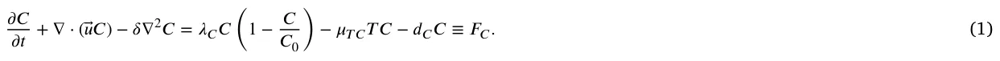

The first term on the right-hand side is a logistic growth at rate *𝜆*𝐶, the third term is death at rate *𝑑*𝐶, and the second term represents the killing of cancer cells by T cells.

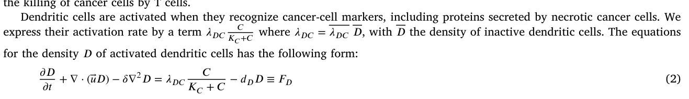

<figure id="fig-1">
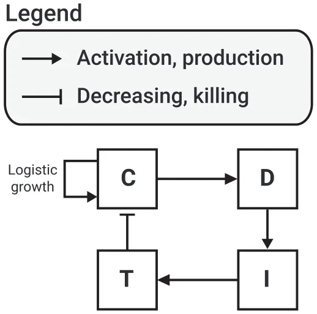
<figcaption><strong>Fig. 1.</strong> A schematic view of the network of the model’s variables, where <em>𝐶</em> – cancer cells, <em>𝐷</em> – activated dendritic cells, <em>𝑇</em> – CD8+ T cells, <em>𝐼</em> – interleukin 12.</figcaption>
</figure>

where *𝑑*𝐷 is the death rate of dendritic cells.

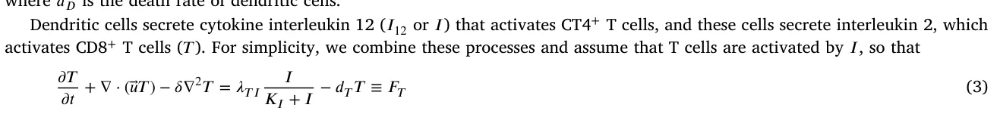

where *𝜆*𝑇 𝐼 = *𝜆*𝑇 𝐼 *𝑇*, with *𝑇* the density of inactive T cells. Interleukin 12 (*𝐼*) is secreted by dendritic cells, hence:

*𝜕𝐼 𝜕𝑡* + ∇ ⋅ (⃖⃗𝑢𝐼) − 𝛿𝐼∇2𝐼 = 𝜆𝐼𝐷𝐷 − 𝑑𝐼𝐼 ≡ 𝐹𝐼 where *𝛿*𝐼 is the diffusion coefficient of *𝐼*, and *𝑑*𝐼 is the degradation rate. Fig. 1 presents a schematic view of the network of the model’s variables. In order to derive a dynamic equation for the unknown tumor boundary, we assume that for some constant *𝜃* (0 *< 𝜃<* 1), *𝐶* + *𝐷* + *𝑇* = *𝜃* in *𝛺*(*𝑡*)*, 𝑡>* 0*.*

Hence, by adding Eqs. (1)–(4), we get

*𝜃*∇*⃖⃗𝑢* = *𝐹*𝐶 + *𝐹*𝐷 + *𝐹*𝑇 ≡ *𝐻.*

In the special case of a spherical tumor, *𝛺*(*𝑡*) = {0 ≤ *𝑟* ≤ *𝑅*(*𝑡*)} and *𝑟* = *𝑅*(*𝑡*) satisfies the following equations:

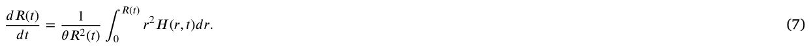

For general shaped tumors, we need additional assumptions. We assume that the tissue in the tumor has the structure of a porous medium, so that, by the Darcy law, *𝑢* = −∇*𝑝* (8)

where *𝑝* is the internal pressure, and we also assume that *𝑝* is proportional to the mean curvature at the tumor boundary. Hence,

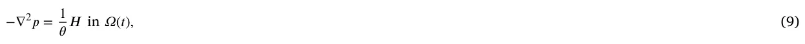

*𝑝* = *𝜈𝜅* on *𝜕𝛺*(*𝑡*)

for some parameter *𝜈*.

We can then express the velocity *𝑉⃗*𝑛 of *𝜕𝛺*(*𝑡*) in the outward normal direction as follows:

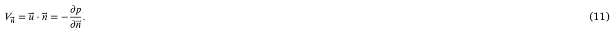

### 2.2. Boundary conditions

We assume no-flux of *𝐷* and *𝐼* at the tumor boundary, and *𝐶* = *𝜃* − *𝐷* − *𝑇* (which follows from Eq. (5)). T cells migrate from the lymph nodes to the tumor boundary, where their density *̂𝑇* at the boundary is expected to be larger than the density of *𝑇* from inside the boundary. Hence, there is a fixed *𝜕𝑇*∕*𝜕⃖⃗𝑛* at the boundary proportional to *𝑇* −*̂ 𝑇*, and we assume that it depends on the density of *𝐼*. Thus, our boundary conditions are given as follows:

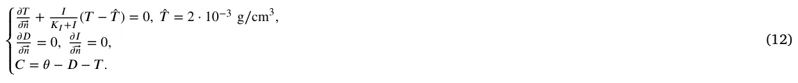

### 2.3. Initial conditions (in units of g∕cm3)

We take *𝜃* = 0*.*4014 g∕cm3 from [42], and initial condition in units of g∕cm3:

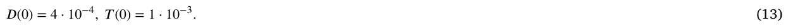

Then, from Eq. (5) it follows that *𝐶*(0) = 0*.*4. Since we take *𝜃* to be a constant, we chose for simplicity initial values that are constant functions. The boundary condition for *𝑇* then implies that *𝑇* starts immediately to increase at the boundary.

### 2.4. Parameter estimates

The mathematical model is a very simplified version of the breast cancer model in [42]. We accordingly take, as in [42],

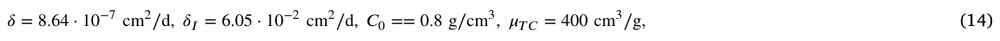

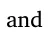

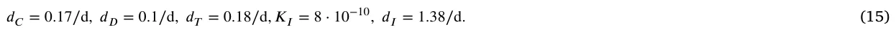

We recall that the activation rates of dendritic cells and T cells depend on the available pools of inactive cells, denoted *𝐷* and *𝑇*, respectively (see Eqs. (2)–(3)). These pools represent the total precursor populations that can be recruited into the tumor microenvironment. Biologically, this ensures that the number of activated cells cannot exceed the upstream reservoir. In this simplified model, we do not explicitly track the dynamics of *𝐷* and *𝑇*. Instead, we assume they remain constant background supplies, consistent with reduced models of tumor–immune interactions. As a result, their values are effectively absorbed into the estimated parameters *𝜆*𝐷𝐶 and *𝜆*𝑇 𝐼, which were determined under steady-state assumptions (see Eq. (17)). This formulation allows us to focus on the activated populations within the tumor while preserving biological realism regarding recruitment limits.

To estimate the remaining parameters, we assume ‘‘steady state’’ in the equation for *𝐷, 𝑇*, and *𝐼*, by making the right-hand side of the equations equals to zero. We also take, in steady state,

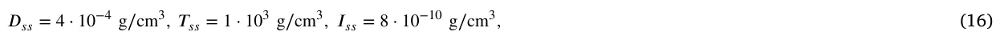

where *𝐷*𝑠𝑠*, 𝑇*𝑠𝑠, and *𝐼*𝑠𝑠 are the values of *𝐷, 𝑇*, and *𝐼* at steady state, respectively. By Eqs. (5) and (13), it follows that *𝐶*𝑠𝑠 = 0*.*4 g∕cm3. Taking *𝐾*𝐶 = *𝐶*𝑠𝑠*, 𝐾*𝐼 = *𝐼*𝑠𝑠 as in [42], we find that

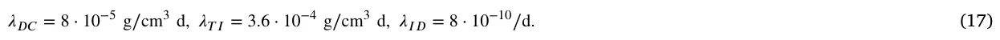

The steady state of Eq. (1) gives *𝜆*𝐶 = 1*.*14∕d. However, since tumor volume is increasing, we must have *𝜆*𝐶 *>* 1*.*14∕d; we take *𝜆*𝐶 = 1*.*94∕d.

Table 1 summarizes the model’s parameters with their values.

## 3. Agent based simulation model definition

We introduce, in the three-dimensional space with *𝑥, 𝑦, 𝑧* axes, a uniform grid of mesh size *𝛥* by parallel planes. We denote the set of centers of the generated cubes by *𝑁*3. The Manhatten distance between two points (*𝑥*1*, 𝑦*1*, 𝑧*1) and (*𝑥*2*, 𝑦*2*, 𝑧*2) in *𝑁*3 is the length of the diagonal connecting them, namely, |*𝑥*1 − *𝑥*2| + |*𝑦*1 − *𝑦*2| + |*𝑧*1 − *𝑧*2|. The adjacent cubes to a given cube with center (*𝑎, 𝑏, 𝑐*) are all the 27 cubes with centers (*𝑎*+ *𝑖, 𝑏*+ *𝑗, 𝑐* + *𝑘*) where *𝑖, 𝑗, 𝑘* vary in the set {−1*,* 0*,* 1}. We consider cells as agents. Each cube can be occupied by at most one cell, or agent, located at the center of the cube.

In agent based simulation (ABS) based on the PDE model (Eqs. (1)–(17)), the agents are cells from *𝐶, 𝐷, 𝑇* and the environment is associated with proteins *𝐼*12 (*𝐼*). In setting up the ABS model, we use only Eqs. (1)–(4) and assumed that new T cells arrive from the boundary and that new *𝐷* cells are activated nearby *𝐶* cells; see example in Fig. 2. We refer to the distribution of agents as the ‘‘geometry’’ of the model, and assume any initial geometry. More precisely, an agent is defined by five parameters (*𝜏,̄ 𝑥, 𝜓, 𝜉, 𝑝*); *𝜏* is the cell type, *𝜏* ∈{*𝐶, 𝐷, 𝑇*} in our specific model, *̄𝑥* is the center of the cube where the cell is located, *𝜓* is the life-span of the cell, *𝜉* is the inner clock of the cell (in minutes) and *𝑝* is the non-zero pressure vector that represents the force applied to the agent by other agents to move in the geometry.

<figure class="table-figure" id="table-1">
<figcaption><strong>Table 1</strong> Summary of the model parameters with their values and sources; ‘‘estimated’’ means by steady state assumption. For the PDE model, the values are rates while for the ABS model, these are probabilities with respect to a single step in time.</figcaption>

<table><tr><th>Parameter</th><th>Description</th><th>Value</th><th>Reference</th></tr><tr><td>𝛿</td><td>Diffusion coefficient of 𝐶, 𝐷, 𝑇</td><td>8.64 ⋅10−7 cm2∕d</td><td>[42]</td></tr><tr><td>𝛿𝐼</td><td>Diffusion coefficient of 𝐼12</td><td>6.05 ⋅10−2 cm2∕d</td><td>[42]</td></tr><tr><td>𝑑𝐶</td><td>Death rate of cancer cells</td><td>0.17 d</td><td>[42]</td></tr><tr><td>𝑑𝐷</td><td>Death rate of dendritic cells</td><td>0.1 d</td><td>[42]</td></tr><tr><td>𝑑𝑇</td><td>Death rate of T cells</td><td>0.18 d</td><td>[42]</td></tr><tr><td>𝑑𝐼</td><td>Degradation rate of 𝐼12</td><td>1.38 d</td><td>[42]</td></tr><tr><td>𝜆𝐶</td><td>Profiteration rate of cancer cells</td><td>1.94 d</td><td>Estimated</td></tr><tr><td>𝜆𝐷𝐶</td><td>Profiteration rate of dendritic cells</td><td>8 ⋅10−5 g∕cm3 d</td><td>Estimated</td></tr><tr><td>𝜆𝑇𝐼</td><td>Profiteration rate of T cells</td><td>3.6 ⋅10−4 g∕cm3 d</td><td>Estimated</td></tr><tr><td>𝜆𝐼𝐷</td><td>Production of 𝐼12</td><td>8.0 ⋅10−10 d−1</td><td>Estimated</td></tr><tr><td>𝜇𝑇𝐶</td><td>Killing rate of 𝐶 by 𝑇</td><td>400 cm3∕g d</td><td>[42]</td></tr><tr><td>𝐶0</td><td>Carrying capacity of 𝐶</td><td>0.8 g∕cm3</td><td>[42]</td></tr><tr><td>𝐾𝐶</td><td>Half-saturation of 𝐶</td><td>0.4 g∕cm3</td><td>[42]</td></tr><tr><td>𝐾𝐼</td><td>Half-saturation of 𝐼12</td><td>8 ⋅10−10 g∕cm3</td><td>[42]</td></tr><tr><td>𝑇</td><td>density of CD8+ T cells from lympth nodes</td><td>2 ⋅10−3 g∕cm3</td><td>[42]</td></tr><tr><td>𝜃</td><td>Density of 𝐶+ 𝐷+ 𝑇 cells</td><td>0.4014 g∕cm3</td><td>[42]</td></tr><tr><td>𝜈</td><td>The effect of internal pressure on curvature</td><td>1</td><td>[42]</td></tr></table>

</figure>

<figure id="fig-2">
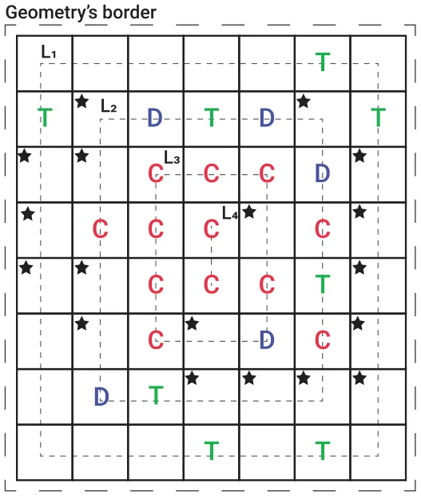
<figcaption><strong>Fig. 2.</strong> An example of the locations in which new T and dendritic cells are added to the geometry where existing cancer, dendritic, and T cells are marked by <em>𝐶</em>, <em>𝐷</em>, and <em>𝑇</em>, respectively. New dendritic cells are added next to cancers in locations marked by a star icon, in a uniform manner. T cells are added to unoccupied locations in the first layer from the geometry’s border (marked by <em>𝐿</em>1) and continue to inner layers, as needed.</figcaption>
</figure>

Following the ABS framework, we define three operators: spontaneous (*𝐼*𝑠), agent-agent (*𝐼*𝑎𝑎), and agent-environment (*𝐼*𝑎𝑒). Given initial geometry at time *𝑡*0 = 0, we run the operators *𝐼*𝑠*, 𝐼*𝑎𝑎*, 𝐼*𝑎𝑒 successively at times *𝑡*1*, 𝑡*2*,* … *, 𝑡*𝑛*,* … with equal time steps *𝑡*𝑛−*𝑡*𝑛−1 = *𝛥𝑡* for all *𝑛*. In the sequel we take *𝛥𝑡* = 1 min. Remarkably, due to the stochastic nature of the ABS modeling, we adopted the PDE parameters as probabilities rather than rates after normalizing to one step in time. We proceed to explain these operators with the aid of four algorithms (pseudo-codes).

### 3.1. Operator 𝐼𝑠 (spontaneous dynamics)

The life-span of *𝐶* cells is derived from the equation 𝑑𝐶 𝑑𝑡 = −*𝑑*𝐶*𝐶*, or *𝐶*(*𝑡*) = *𝐶*(0)*𝑒*−𝑑𝐶𝑡 [43]. Then, full life-span ∫ ∞ *𝐶*(*𝑡*)*𝑑𝑡* = 1 means 0 that ∫ ∞ *𝑑*𝐶*𝑒*−𝑑𝐶𝑡*𝑑𝑡* = 1, and the discrete probability *𝜓* is given by the exponential distribution: {*𝑑*𝐶*𝑒*−𝑑𝐶𝑛*, 𝑛* = 1*,* 2*,* … }*, 𝑑*𝐶 = 1∕(*𝑒*𝑑𝐶 −1) in units of days (60 × 24 min). 0

We set *𝑡*𝑛 = *𝑡* and *𝑡*𝑛+1 = *𝑡*+ 1. For any cancer cell *𝑏* ∈ *𝐶*(*𝑡*), if *𝜉* ≥ *𝜓* then we eliminate *𝑏*, while if *𝜉< 𝜓* then we increase the cell inner clock time to *𝜉*+ 1; see Algorithm 1, lines 1–7. We do the same operation for cells *𝑑* ∈ *𝐷* and *𝑎* ∈ *𝑇* (Algorithm 1, lines 8–21).

We denote by |*𝐶*(*𝑡*)| the number of cancer cells at *𝑡* = *𝑡*𝑛 and introduce ⌊*𝜆*𝐶|*𝐶*(*𝑡*)|(1 − |𝐶(𝑡)| 𝐶0 )⌋ new cells (the largest integer smaller than *𝜆*𝐶|*𝐶*(*𝑡*)|(1− |𝐶(𝑡)| 𝐶0 )). Each new cell *𝑏* ∈ |*𝐶*(*𝑡*)|𝑛𝑒𝑤 is added to the geometry in a uniformly distributed manner at a random location adjacent to a cancer cell. We denote the location of that cell by *̄𝑥* and the location of the new cell by *̄𝑥*𝑛𝑒𝑤. We assign a random choice of *𝜓* from the exponential distribution of *𝑑*𝐶, and *𝜉* = 0 to the new *𝑏* cell, and pressure vector *𝑝* =*̄ 𝑥*𝑛𝑒𝑤 −*̄ 𝑥*. The new cell (now denoted by *𝑏*𝑛𝑒𝑤) is then given by *𝑏*𝑛𝑒𝑤 = (*𝜏* = *𝐶,̄ 𝑥*𝑛𝑒𝑤*, 𝜓* sampled from the exponential distribution of *𝑑*𝐶, *𝜉* = 0*, 𝑝* =*̄ 𝑥*𝑛𝑒𝑤 −*̄ 𝑥*); see algorithm 1, lines 22–28.

If the location *̄𝑥*𝑛𝑒𝑤 was already occupied, we move the occupant to an adjacent cube in the direction of the stress vector of the occupant. This process repeats until the last displaced cell is moved to a non-occupied cube.

After ending to add all the cells from |*𝐶*(*𝑡*)|𝑛𝑒𝑤, we begin to add new dendritic cells. The number of new dendritic cells is ⌊*𝜆*𝐷𝐶|*𝐶*(*𝑡*)|∕(*𝐾*𝐶 + |*𝐶*(*𝑡*)|)⌋. Each *𝑑* ∈ |*𝐷*(*𝑡*)|𝑛𝑒𝑤 is added in a uniformly distributed manner at random to an unoccupied cube *̄𝑥*𝑛𝑒𝑤 adjacent to a cancer cell. The new cell, denoted by *𝑑*𝑛𝑒𝑤, is defined by *𝑑*𝑛𝑒𝑤 = (*𝜏* = *𝐷,̄ 𝑥* =*̄ 𝑥*𝑛𝑒𝑤*, 𝜓* sampled from the exponential distribution *𝑑*𝐷, *𝜉* = 0*, 𝑝* = 0); see Algorithm 1, lines 29–33.

If the set, *𝐶*𝐴𝑑1 of all adjacency sets of cancer cell is fully occupied, we insert *𝑑* randomly in an unoccupied cubes in the set *𝐶*𝐴𝑑2 of the adjancy set of *𝐶*𝐴𝑑1, etc.

As indicated in Algorithm 1, lines 35–37, the new ⌊*𝜆*𝑇 𝐼|*𝐼*(*𝑡*)|∕(*𝐾*𝐼 + |*𝐼*(*𝑡*)|)⌋, T cells are added at the boundary of the geometry. Formally, these cells are introduced, in a uniformly distributed manner, to unoccupied cubes in the geometry that are closest to the border of the geometry. If there are no such cubes left, the next set of equally-distanced cubes from the borders is used, and when this set is filled, we go to the next set of cubes, etc., as illustrated in Fig. 2. These sets are obtained by computing the Manhattan distance between each location in the geometry to the border of the geometry, divided into sets with equal distance, and ordered from the lowest distance to the highest one. Algorithm 2 presents a pseudo-code of this process. Technically, the Manhattan distance metric corresponds to the minimal number of axis-aligned steps required to move from one lattice site to the other. Since our ABS model is implemented on a cubic lattice where agents interact through orthogonal adjacency, the Manhattan distance naturally encodes the geometry of cell movement and placement. The algorithm contains two computer functions declared in lines 1 and 17 and named *GetBorderLayers* and *AddCellsFromBorder*, respectively. The first maps the geometry to locations with increasing distance from the geometry’s border, and the latter adds new cells from a given cell type to the geometry according to the locations obtained from the first function. Focusing on the first function (lines 2–16), line 2 initializes an empty list. Lines 3–15 loop for distance from right next to the border (*𝑟* ← 1) to the center of the geometry (*𝑟* ← min(*𝑑𝑥, 𝑑𝑦, 𝑑𝑧*)∕2) such that a set, referred to as *layer*, is initialized in line 4. Lines 5, 6, 7 to 11, 12, 13 loop over a three-dimensional space where line 8 checks whether a location is within a distance *𝑟* from the border of the geometry. If so, in line 9, this location is added to the set *layer*. In line 14, after the set *layer* is filled with locations, it is appended to the list *layers*. In lines 19–28, a loop over the layers in the layers set produced by the *GetBorderLayers* computer function takes place such that if a layer is non-empty, as tested in line 20 (i.e., the size of the set is larger than zero), a random location inside this layer is chosen and removed from the set so it will not be picked again — lines 21 and 22. In line 23, we check if there is no other cell that already occupies this location. If no cell occupies this location, the new T cell is created with a lifespan that is sampled from the exponential distribution of *𝑑*𝑇 and inserted in this location (lines 24 and 25).

Fig. 2 presents an example of the locations in which new dendritic cells and T cells are added to the geometry.

The final part in the *𝐼*𝑠 operator is the application of the diffusion operator to cells. We introduce a set, *𝜂*, of unit vectors in directions {1*,* −1} along the *𝑥, 𝑦, 𝑧* axes, and take from any *𝑏* cell from *𝐶*(*𝑡*)∪*𝐶*(*𝑡*)𝑛𝑒𝑤 a random vector *𝑝* from *𝜂*. We move the location *𝑥* of *𝑏* to *̄𝑥* + *𝛥𝑝*. If the new location was occupied, we do not move *̄𝑥*. Next, we apply the same diffusion operator to the dendritic cells and T cells; see Algorithm 1, lines 38–51.

### 3.2. Operator 𝐼𝑎𝑎 (agent-agent)

This operator involves just one process; T cell located at *̄𝑥*𝑇 and cancer cell located at *̄𝑥*𝐶 have probability *𝜇*𝑇 𝐶 that the T cell √ would eliminate the cancer cell, if ‖*̄𝑥*𝐶 −*̄ 𝑥*𝑇‖ ≤ *𝜌*, where *𝜌* is a given interaction radius; see Algorithm 3. The parameter *𝜌* is 3 times the grid size *𝛥*; this value is used to capture all the cubes that share a vertex with a given cube.

### 3.3. Operator 𝐼𝑎𝑒 (agent-environment)

At the beginning of the simulation (*𝑡* = *𝑡*0), interleukin 12 is divided in an equally distributed manner to all cubes in the geometry, such that each cube obtains the same number |*𝐼*(0)|. Next, for each iteration, under the agent-environment operator (*𝐼*𝑎𝑒), the interleukin 12 is generated due to the dendritic cells, at a rate *𝜆*𝐼𝐷, in each location in the geometry where dendritic cells are present and it then diffuses and decays over time. Thus, for each location in the geometry, the new amount of interleukin 12 is obtained using the following formula with degradation coefficient of *𝑑*𝐼:

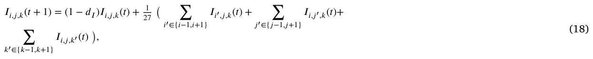

where *𝐼*𝑖,𝑗,𝑘 stands for the amount of interleukin 12 in location (*𝑖, 𝑗, 𝑘*); see Algorithm 4.

Fig. 3 presents a schematic view of the ABS model spatio-temporal dynamics in a single step in time. As an example, we assume the initial spatial condition is a sphere of cancer cells covered by a single-layer sphere of T and dendritic cells, and the interleukin 12 **Algorithm 1** Spontaneous Dynamics (*𝐼*𝑠) at time *𝑡* 1: **for** each cancer cell in cancer cells (*𝑏* ∈ *𝐶*(*𝑡*)) **do if** *𝑏.𝜉* ≥ *𝑏.𝜓* **then** 2: Eliminate cancer cell (b) 3: **else** 4: 5: *𝑏.𝜉* ← *𝑏.𝜉* + 1 **end if** 6: 7: **end for** 8: **for** each dendritic cell in dendritic cells (*𝑑* ∈ *𝐷*(*𝑡*)) **do if** *𝑑.𝜉* ≥ *𝑑.𝜓* **then** 9: Eliminate dendritic cell (d) 10: **else** 11: 12: *𝑑.𝜉* ← *𝑑.𝜉* + 1 **end if** 13: 14: **end for** 15: **for** each T cell in T cells (*𝑎* ∈ *𝑇* (*𝑡*)) **do if** *𝑎.𝜉* ≥ *𝑎.𝜓* **then** 16: Eliminate T cell (a) 17: **else** 18: 19: *𝑎.𝜉* ← *𝑎.𝜉* + 1 **end if** 20: 21: **end for** 22: |*𝐶*(*𝑡*)𝑛𝑒𝑤| ← ⌊*𝜆*𝐶|*𝐶*(*𝑡*)| ∗(1 − |*𝐶*(*𝑡*)|∕*𝐶*0)⌋ 23: **for** *𝑏* ∈ |*𝐶*(*𝑡*)𝑛𝑒𝑤| **do** original cancer cell (b) ← select at random from *𝐶*(*𝑡*) 24: new location (*̄𝑥*𝑛𝑒𝑤) ← determine\_adjacent\_location(*𝑏.̄𝑥*) 25: new cancer cell: *𝑏*𝑛𝑒𝑤 ← (*𝜏* = *𝐶,̄ 𝑥* =*̄ 𝑥*𝑛𝑒𝑤*, 𝜓* = sample\_exponential(*𝑑*𝐶)*, 𝜉* = 0*, 𝑝* = 0) 26: 27: *𝑏*𝑛𝑒𝑤*.𝑝* ←*̄ 𝑥*𝑛𝑒𝑤 − *𝑏.̄𝑥* 28: **end for** 29: |*𝐷*(*𝑡*)𝑛𝑒𝑤| ← ⌊*𝜆*𝐷𝐶|*𝐶*(*𝑡*)|∕(*𝐾*𝐶 + |*𝐶*(*𝑡*)|)⌋ 30: **for** *𝑑* ∈ |*𝐷*(*𝑡*)𝑛𝑒𝑤| **do** original cancer cell (b) ← select at random from *𝐶*(*𝑡*) 31: new location (*̄𝑥*𝑛𝑒𝑤) ← determine\_adjacent\_ unoccupied\_location(*𝑏.̄𝑥*) 32: new dendritic cell: *𝑑*𝑛𝑒𝑤 ← (*𝜏* = *𝐷,̄ 𝑥* =*̄ 𝑥*𝑛𝑒𝑤*, 𝜓* = sample\_exponential(*𝑑*𝐷)*, 𝜉* = 0*, 𝑝* = 0) 33: 34: **end for** 35: |*𝑇* (*𝑡*)𝑛𝑒𝑤| ← ⌊*𝜆*𝑇 𝐼|*𝐼*(*𝑡*)|∕(*𝐾*𝐼 + |*𝐼*(*𝑡*)|)⌋ 36: layers ← GetBorderLayers() 37: AddCellsFromBorder(|*𝑇* (*𝑡*)𝑛𝑒𝑤|, *𝑇*, *𝑑*𝑇, layers) 38: **for** each cancer cell in cancer cells (*𝑏* ∈ *𝐶*(*𝑡*) ∪ *𝐶*(*𝑡*)𝑛𝑒𝑤) **do** 39: *𝜈* ← generate\_random\_unit\_vector() 40: *𝑏.𝑝* ← *𝜈* 41: *𝑏.̄𝑥* ← *𝑏.̄𝑥* + *𝑏.𝑝* 42: **end for** 43: **for** each dendritic cell in dendritic cells (*𝑑* ∈ *𝐷*(*𝑡*) ∪ *𝐷*(*𝑡*)𝑛𝑒𝑤) **do** 44: *𝜈* ← generate\_random\_unit\_vector() 45: *𝑑.𝑝* ← *𝜈* 46: *𝑑.̄𝑥* ← *𝑑.̄𝑥* + *𝑑.𝑝* 47: **end for** 48: **for** each T cell in T cells (*𝑎* ∈ *𝑇* (*𝑡*) ∪ *𝑇* (*𝑡*)𝑛𝑒𝑤) **do** 49: *𝜈* ← generate\_random\_unit\_vector() 50: *𝑎.𝑝* ← *𝜈* 51: *𝑎.̄𝑥* ← *𝑎.̄𝑥* + *𝑎.𝑝* 52: **end for** is uniformly distributed in the geometry. To demonstrate the ABS simulation, we cut the geometry on the equatorial plane *𝑍* = *𝑅*. Cells die of natural decay as indicated by the black locations, and new cells are introduced and added pressure, *𝑝*, in the direction they are introduced. Both of these processes are spontaneous over time. Afterward, focusing on the cell–cell (i.e., agent-agent) interactions, T cells eliminate cancer cells as indicated by the black locations. In addition, the cells are moving due to the pressure applied to them as well as the random walk, which simulates diffusion dynamics at the population level. Finally, as part of the cells’

**Algorithm 2** T cells location picking at borders 1: define function GetBorderLayers(): 2: *𝑙𝑎𝑦𝑒𝑟𝑠* ← [] 3: **for** *𝑟* ← 1 to min(*𝑑𝑥, 𝑑𝑦, 𝑑𝑧*)∕2 **do** 4: *𝑙𝑎𝑦𝑒𝑟* ← [] **for** *𝑥* ← 0 **to** *𝑑𝑥* −1 **do** 5: **for** *𝑦* ← 0 **to** *𝑑𝑦* −1 **do** 6: **for** *𝑧* ← 0 **to** *𝑑𝑧* −1 **do** 7: **if** *𝑥* == *𝑟* **or** *𝑥* == *𝑑𝑥* − *𝑟* −1 **or** *𝑦* == *𝑟* **or** *𝑦* == *𝑑𝑦* − *𝑟* −1 **or** *𝑧* == *𝑟* **or** *𝑧* == *𝑑𝑧* − *𝑟* −1 **then** 8: 9: Append (*𝑥, 𝑦, 𝑧*) to *𝑙𝑎𝑦𝑒𝑟* **end if** 10: **end for** 11: **end for** 12: **end for** 13: 14: Append *𝑙𝑎𝑦𝑒𝑟* to *𝑙𝑎𝑦𝑒𝑟𝑠* 15: **end for** 16: Return *𝑙𝑎𝑦𝑒𝑟𝑠* 17: Define function AddCellsFromBorder(*𝑛𝑢𝑚*\_*𝑐𝑒𝑙𝑙𝑠*, *𝑐𝑒𝑙𝑙*\_*𝑡𝑦𝑝𝑒*, *𝑎*, *𝑏𝑜𝑟𝑑𝑒𝑟*\_*𝑙𝑎𝑦𝑒𝑟𝑠*): 18: **for** *𝑖* ← 1 **to** *𝑛𝑢𝑚*\_*𝑐𝑒𝑙𝑙𝑠* **do for** *𝑙𝑎𝑦𝑒𝑟* **in** *𝑏𝑜𝑟𝑑𝑒𝑟*\_*𝑙𝑎𝑦𝑒𝑟𝑠* **do** 19: **if** size(*𝑙𝑎𝑦𝑒𝑟*) *>* 0 **then** 20: 21: *𝑛𝑒𝑤*\_*𝑙𝑜𝑐𝑎𝑡𝑖𝑜𝑛* ← RandomChoice(*𝑙𝑎𝑦𝑒𝑟*) 22: Remove *𝑛𝑒𝑤*\_*𝑙𝑜𝑐𝑎𝑡𝑖𝑜𝑛* from *𝑙𝑎𝑦𝑒𝑟* **if** GridIsEmpty(*𝑛𝑒𝑤*\_*𝑙𝑜𝑐𝑎𝑡𝑖𝑜𝑛*) **then** 23: Create *𝑛𝑒𝑤*\_*𝑐𝑒𝑙𝑙* of type *𝑐𝑒𝑙𝑙*\_*𝑡𝑦𝑝𝑒* at *𝑛𝑒𝑤*\_*𝑙𝑜𝑐𝑎𝑡𝑖𝑜𝑛* 24: Place *𝑛𝑒𝑤*\_*𝑐𝑒𝑙𝑙* in grid at *𝑛𝑒𝑤*\_*𝑙𝑜𝑐𝑎𝑡𝑖𝑜𝑛* 25: **end if** 26: **end if** 27: **end for** 28: 29: **end for** **Algorithm 3** Agent-Agent Interactions (*𝐼*𝑎𝑎) at time *𝑡* 1: **for** each T cell in T cells (*𝑎* ∈ *𝑇* (*𝑡*)) **do for** each cancer cell in cancer cells (*𝑏* ∈ *𝐶*(*𝑡*)) **do** 2: 3: **if** ||*𝑎.̄𝑥* − *𝑏.̄𝑥*||2 ≤ *𝜌* ∧ sample(Uniform[0, 1]) *< 𝜇*𝑇 𝐶 **then** Eliminate cancer cell (b) 4: **end if** 5: **end for** 6: 7: **end for**

**Algorithm 4** Agent-Environment Interactions (*𝐼*𝑎𝑒) at time *𝑡* 1: **for** each dendritic cell in dendritic cells (*𝑑* ∈ *𝐷*(*𝑡*)) **do** 2: *𝐼*𝑑.̄𝑥 ← *𝐼*𝑑.̄𝑥 + *𝜆*𝐼𝐷

- 3: **end for**
- 4: Diffuse and decay the drug in the geometry using Eq. (18)

interaction with the environment (i.e., agent-environment), the interleukin 12 is generated due to the presence of the dendritic cells and diffuses in the geometry following Eq. (18). It is important to emphasize the figure provides a conceptual illustration of the ABS update cycle. Within each discrete time step, the operators *𝐼*𝑠, *𝐼*𝑎𝑎, and *𝐼*𝑎𝑒 are executed sequentially. Cell death is therefore assessed at multiple points (spontaneously, through immune–cancer interactions, and after environmental updates), and movement already occurs during *𝐼*𝑠 due to both diffusion-like random walks and displacement caused by the insertion of new cells. Accordingly, the black markers indicating dead cells and the apparent shifts in cell positions differ across the three panels, as the figure accumulates the outcomes of each operator in sequence.

We note that in performing the ABS computations, we took *𝐶*0, *𝐾*𝐶, *𝐾*𝐼, and |*𝐼*(0)| to be 0*.*842 g∕cm3*,* 0*.*421 g∕cm3*,* 7*.*985⋅10−8 g∕cm3, and 2*.*788 ⋅ 10−10, respectively. These values are obtained by using the genetic algorithm (GA) coupled with the Monte Carlo (MC) process (i.e., the MCGA scheme) [44] with initial parameter values from Table 1, and by trying to maximize the coefficient of determination between the ABS and PDE model for the spherical case under the constrain that *𝐶*0∕*𝐾*𝐶 = 2.

<figure id="fig-3">
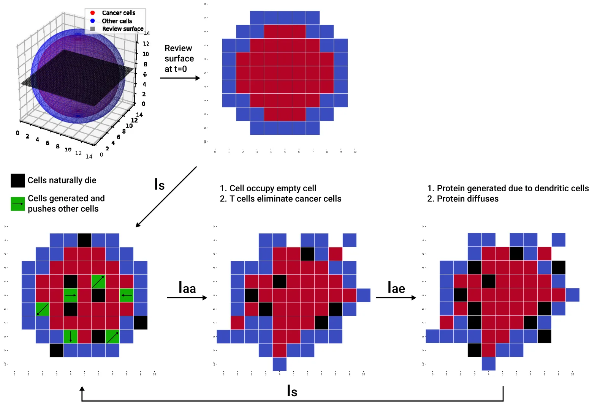
<figcaption><strong>Fig. 3.</strong> A schematic view of the ABS model spatio-temporal dynamics in a single step in time. The lower row illustrates the sequential execution of the three interaction operators: <em>𝐼</em>𝑠 (spontaneous), <em>𝐼</em>𝑎𝑎 (agent–agent), and <em>𝐼</em>𝑎𝑒 (agent–environment). Cell movement visible under <em>𝐼</em>𝑠 reflects both random walk (diffusion) and mechanical displacement due to pressure from newly generated cells. Black markers denote cell death events, which are evaluated at each stage of the update cycle rather than only at the end of the time step; hence, different sets of black markers appear across the three panels. The figure should be interpreted as a conceptual illustration of the update cycle, not as a literal snapshot of a single sub-step.</figcaption>
</figure>

### 3.4. Shape boundary detection

Once the final state of the system was computed, we considered the spatial distribution of the cancer cells. In order to find the boundary of the tumor, defined by its cancer cells, we computed two versions of the boundary: ‘‘schematic’’ and ‘‘detailed’’.

For both boundaries, we start with three pre-processing steps. First, we begin by projecting the 3d distribution onto the XY, XZ, and YZ planes, which is done by calculating the average density of cancer cells along the axis orthogonal to the projection plane. For example, to obtain the projection onto the XY plane, we average the density of cancer cells along the Z axis. This projection method transforms the 3d data into 2d representation for each plane, where the pixel corresponds to the average density of cancer cells. Once the projections are generated, noise reduction becomes necessary to ensure that boundary detection is not affected by small-scale fluctuations in the data. To achieve this, we apply a Gaussian filter [45] with a kernel size of 5 × 5. The Gaussian filter smooths the pixel intensity by averaging the surrounding values, which suppresses noise while preserving the overall structure of the density distribution. Following the Gaussian filter’s output, we use the Canny edge detection algorithm [46] to identify the boundaries of the cancer cell distribution in each 2d projection. The Canny algorithm works by detecting areas with significant gradients in pixel intensity, which in this case represents the transition between regions of high and low cancer cell density. The output is a binary image (i.e., each pixel is either of value one or zero indicating if the boundary is presented in this pixel or not) where the edges form a preliminary outline of the boundary of the cancer cells distribution in the projected plane. This method effectively isolates the shape of the distribution from the background, but it may still contain noise or irregularities along the edges.

For the schematic boundary, we apply the convex hull algorithm [47] to the edge points obtained from the Canny algorithm. The convex hull is the smallest convex polygon that encloses all the edge points, effectively eliminating any concavities or irregularities that might have been introduced by noise or artifacts in the data. This step ensures that the boundary is well-defined and free from distortions, providing a smooth and continuous outline of the cancer cell distribution in each 2d plane. Due to the stochastic nature of the ABS simulation, in order to obtain a representative shape, we repeated this algorithm for multiple repetitions of the ABS model, overlaying them one on top of the other.

For the detailed boundary, we repeated the pre-processing steps for *𝑛* = 10 ABS repetitions. For each of these, we computed a boundary polygon using the *𝛼*-concave hull algorithm [48] which is similar to the convex hull algorithm but allows non-convex shapes. The boundary shape can be represented by its tangent vectors, or by its corner points, in the order they appear when the boundary is traced in the counter-clockwise direction. We take a vector *𝑣*1 = ((*𝑥*1*, 𝑦*1)*,* (*𝑥*2*, 𝑦*2)*,* … *,* (*𝑥*𝑘*, 𝑦*𝑘)) with (*𝑥*𝑖*, 𝑦*𝑖) the sequential corner points along one of the ABS boundaries, and, similarly, a vector *𝑣*2 = ((*̂𝑥*1*,̂ 𝑦*1)*,* (*̂𝑥*2*,̂ 𝑦*2)*,* … *,* (*̂𝑥*𝑚*,̂ 𝑦*𝑚)), for another ABS repeat. We want to find the highest agreement between them. To do that, we first make *𝑚* = *𝑘* by adding non-corner points to either *𝑣*1 or *𝑣*2. We next scale *𝑣*2 and rotate it to decrease the distances between (*𝑥*𝑖*, 𝑦*𝑖) and (*̂𝑥*𝑖*,̂ 𝑦*𝑖). We then compute the linear transformation *𝑇* which minimize ‖*𝑇* (*𝑣*1) −*𝑣*2‖2, i.e., making the difference between *𝑇* (*𝑣*1) and *𝑣*2 minimal. In order to find the linear transformation *𝑇* efficiently, we used the Moore–Penrose Pseudoinverse algorithm [49], achieving *𝑇* = *𝑣*2*𝑣*+ 1 where *𝑣*+ 1 is the Moore–Penrose pseudoinverse of *𝑣*1, which is computed as *𝑣*+ 1 = *𝑣*𝑇 1 ∕‖*𝑣*1‖2 where *𝑣*𝑇 1 is the transpose of the *𝑣*1 vector. We now replace the two shapes with boundaries *𝑣*1 and *𝑣*2 by a single new shape with boundary *𝑣*2*𝑣*+ 1 . This process is repeated such as the result of each iteration (*𝑣*2*𝑣*+ 1 ) is used as *𝑣*1 of the following iteration. The iterative process allows us to ‘‘average’’ a set of the boundaries into a single one. Finally, in order to reduce stochastic noise, we fitted Bezier curves to the boundary [50] to obtain a smooth boundary.

<figure id="fig-4">
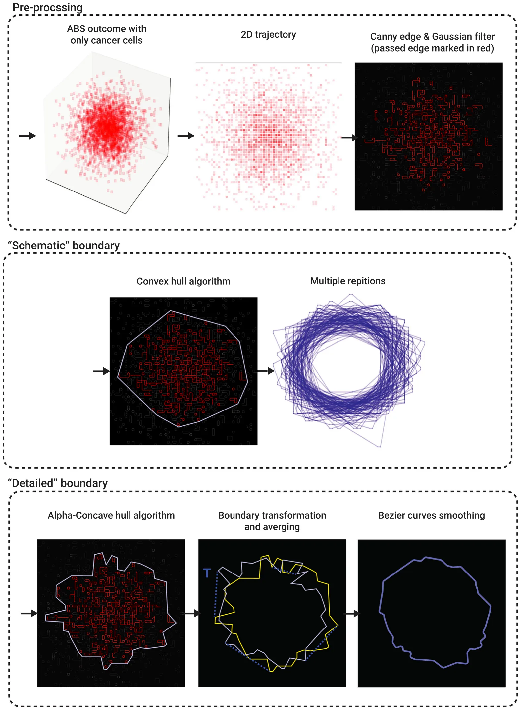
<figcaption><strong>Fig. 4.</strong> A schematic view of the computational steps used to determinate the schematic and detailed boundaries of the tumors.</figcaption>
</figure>

<figure id="fig-5">
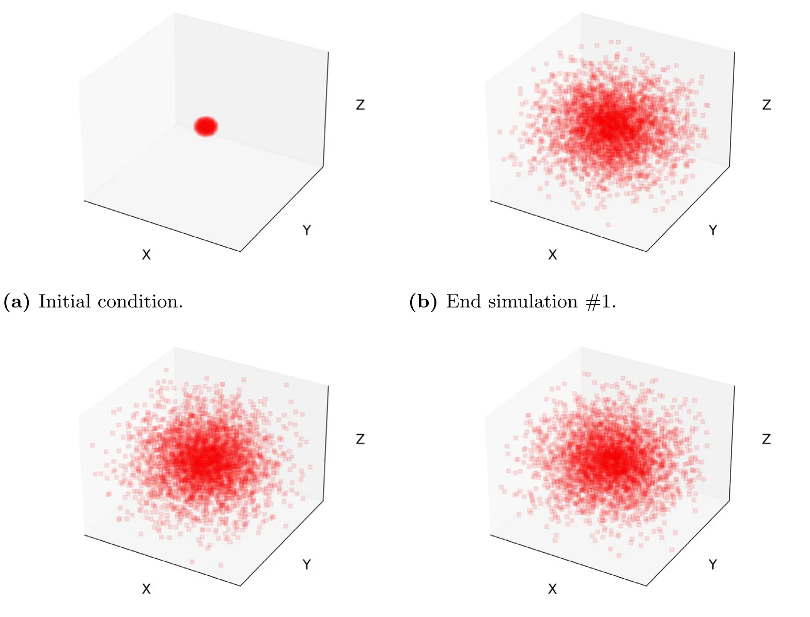
<figcaption><strong>Fig. 5.</strong> The ABS’s geometry, in terms of the cancer (C) cells with a spherical initial condition and three same endtime simulation scenarios.</figcaption>
</figure>

Fig. 4 shows a schematic view of the computational steps used to determinate the schematic and detailed boundaries of the tumors.

## 4. Numerical investigation

The proposed PDE model (see Eqs. (1)–(4)) takes a second-order and nonlinear form with a free boundary spherical geometrical configuration. As such, one can numerically solve the proposed model using the Runge–Kutta method [19]. In particular, all the numerical analysis in this study was performed using the Python programming language [51].

### 4.1. Spherical case

We assess the agreement between the PDE and ABS (with *𝛥* = 0*.*002 cm) models for the spherical case where the PDE was numerically solved. The volume of cancer in the ABS simulations is computed by counting the number of cancer cells and multiplying it by their volume, while the volume in the PDE simulations for a spherical tumor is computed by multiplying the density *𝐶*(*𝑡*) by the volume *𝑉* (*𝑡*) = 4𝜋 3 *𝑅*3(*𝑡*) where *𝑅*(*𝑡*) is the tumor radius. Fig. 5 shows three simulations of ABS in the spherical case at the same endtime. Since ABS is a stochastic process, the three geometries of cancer-cells distribution are not identical. More importantly, we note that the density of cancer cells is not uniform, it is higher in the center, and is decreasing toward the boundary. This is in contrast to PDE tumor cells density, which is a fixed constant everywhere, with *𝐶*(*𝑡*) ∼0*.*40∕cm3 for all *𝑡*. In order to derive an ‘‘acceptable’’ ABS volume, we need to use a large number of ABS repetitions. We performed 100 repetitions and took the average of tumor volume. We then repeated this process *𝑛* = 10 times, and then computed the average and standard deviation (STD). The resulting tumor volume profile is shown in Fig. 5, together volume profile computed by PDE simulations. Comparing the coefficient of determination (*𝑅*2) which measures the goodness of fitting between the two profiles, we found that *𝑅*2 = 0*.*940. We take this result as a validation of the ABS model’s ability to reproduce the PDE model’s results in the spherical case when the cell-to-cell and cell-to-environment parameters are the same.

Fig. 7 shows that the goodness of fitting parameter, *𝑅*2, between ABS and PDE volume profiles is increasing when the number of ABS repetitions increases from 10 to 100 (see Fig. 6).

<figure id="fig-6">
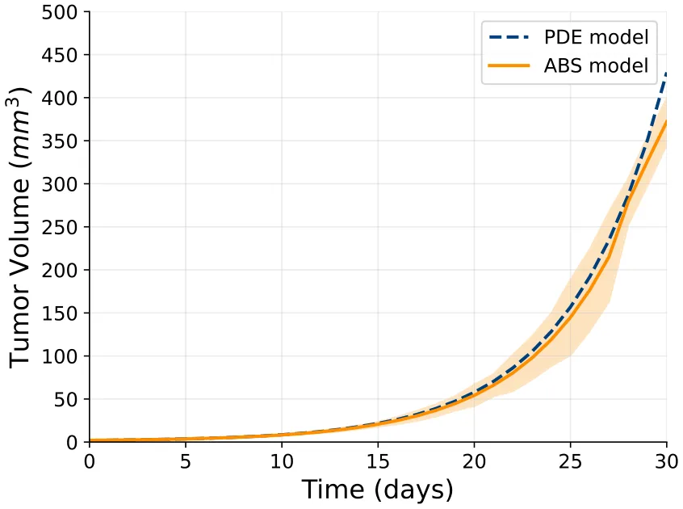
<figcaption><strong>Fig. 6.</strong> Comparison between the partial differential equations (PDE) and agent based simulation (ABS) models in terms of the tumor volume over 30 days.</figcaption>
</figure>

<figure id="fig-7">
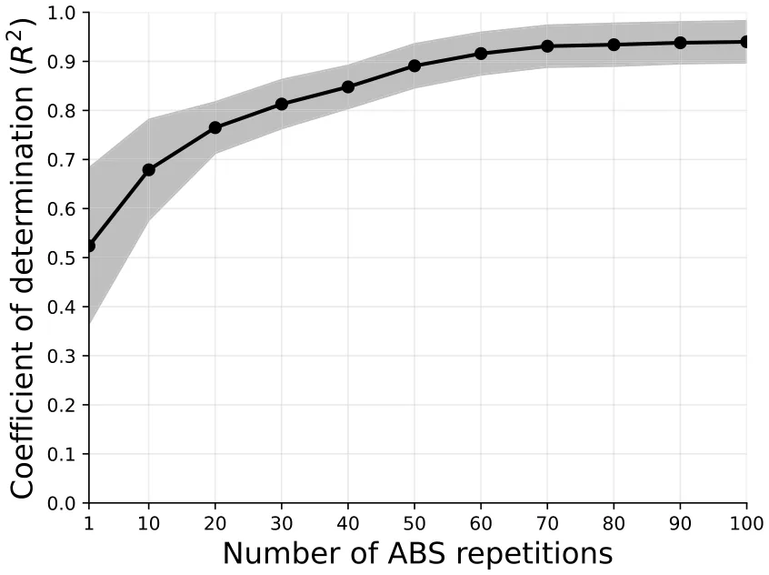
<figcaption><strong>Fig. 7.</strong> Relative error analysis between the partial differential equations and the agent based simulations with respect to the number of averaged ABS repetitions. The results are shown as the mean ± standard deviation of <em>𝑛</em> = 10.</figcaption>
</figure>

In addition to tumor volume comparisons, we examined the dynamics of all four model variables (*𝐶, 𝐷, 𝑇, 𝐼*) under both PDE and ABS formulations. The results, shown in Supplementary material Fig. 12, demonstrate that despite stochastic fluctuations in the ABS runs with *𝑛* = 100, the PDE captures the mean-field dynamics of each variable.

### 4.2. Asymmetric case

In Figs. 8–10, we simulated three non-spherical tumors. Fig. 8 shows an initial irregular sphere (i.e. a sphere with a perturbed irregular boundary), and one 3d simulation of its cancer cells (after 30 days). We also see the schematic boundary with 100 ABS repetitions of the 2d planes XY, YZ, and XZ.

<figure id="fig-8">
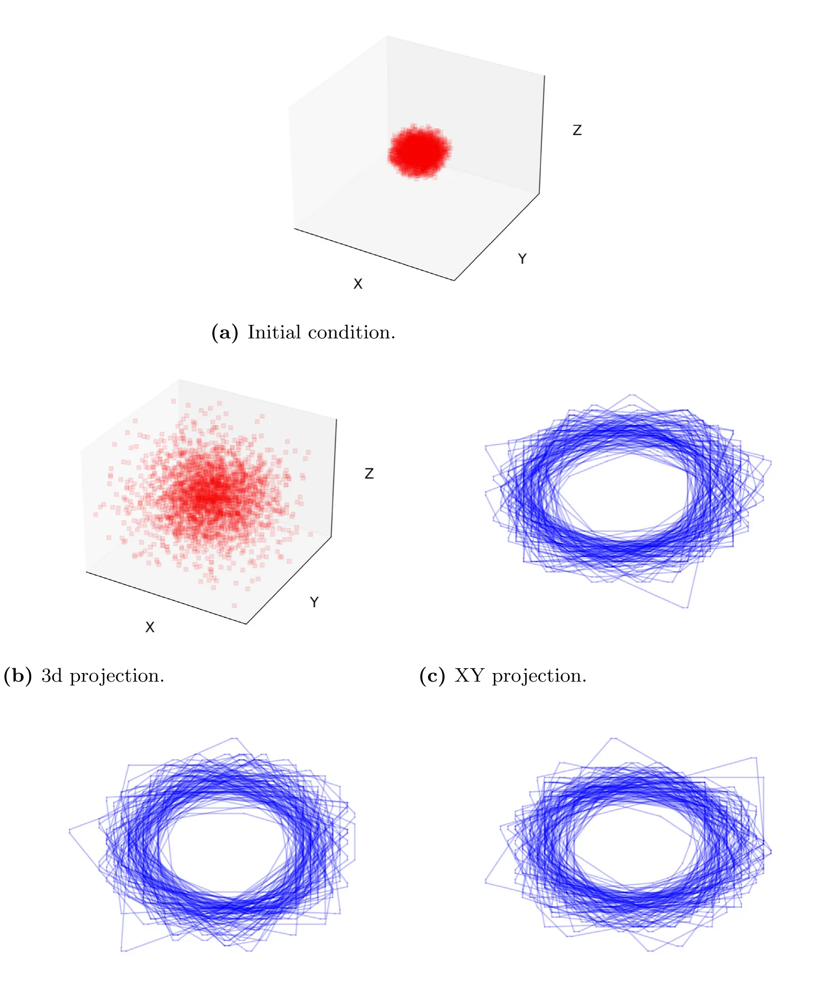
<figcaption><strong>Fig. 8.</strong> Simulation results for irregular sphere initial conditions, with 100 ABS repetitions, after 30 days.</figcaption>
</figure>

Similar simulations in the case of an initial ellipsoid are shown in Fig. 9, and, in the case of melanoma, in Fig. 10.

In Fig. 11, we simulated the detailed boundary of the irregular sphere, ellipsoid, and melanoma. In order to ease the comparison between them, we normalize the size of all four to be nearly identical.

## 5. Discussion

In PDE models of cancer, the variables are densities of cells, and concentrations of proteins and other molecules. In ABS, the variables are individual cells, while proteins and other molecules are diffusing by random walk along grid lines, forming the cancer environment. ABS models are able to express individual cell reactions to their neighbors. For example, a new dendritic cell will become activated by identifying a cancer cell in its vicinity, and a T cell kills a cancer cell only if they are adjacent to each other. Each cell has a life expectancy randomly chosen from the exponential distribution of the deterministic death rate. Each cell is subjected to a pressure vector to move one step under overcrowding conditions. Diffusion of cells is modeled as a random walk along the grid lines as long as free space is available. Proteins are produced by cells, and they affect cells activation and proliferation.

<figure id="fig-9">
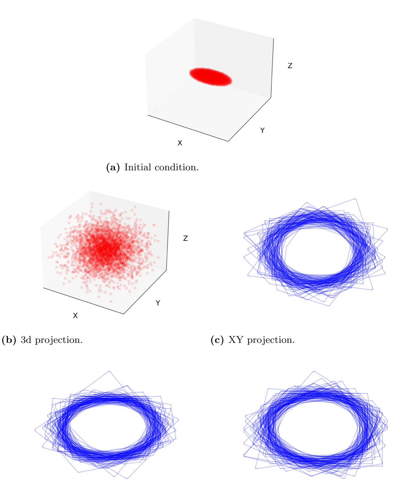
<figcaption><strong>Fig. 9.</strong> Simulation results for ellipsoid (4 × 2 × 1) initial conditions, with 100 ABS repetitions, after 30 days.</figcaption>
</figure>

In this paper, we consider a simple model of cancer, and we take all the ABS model parameters that express interactions among the variables to be the same as in the PDE model. But there are important differences between the two models:

- In ABS, the boundary is automatically generated by the proliferating cancer cells and the interactions among all cells. But in order to solve and simulate the PDE system, we must *a priori* determine the dynamics of the unknown boundary. This requires some assumptions. Typical ad-hoc assumptions for a solid tumor are the following: (a) All cells move with the same velocity; (b) The sum of all cell densities is a constant independent of location in space and time (Eq. (5)); (c) The tumor tissue is a porous medium (Eq. (8)).
- While the PDE model is a deterministic process, ABS is a stochastic process, and many repetitions of ABS need to be performed in order to derive ‘‘reliable’’ results, as demonstrated in Fig. 7.

<figure id="fig-10">
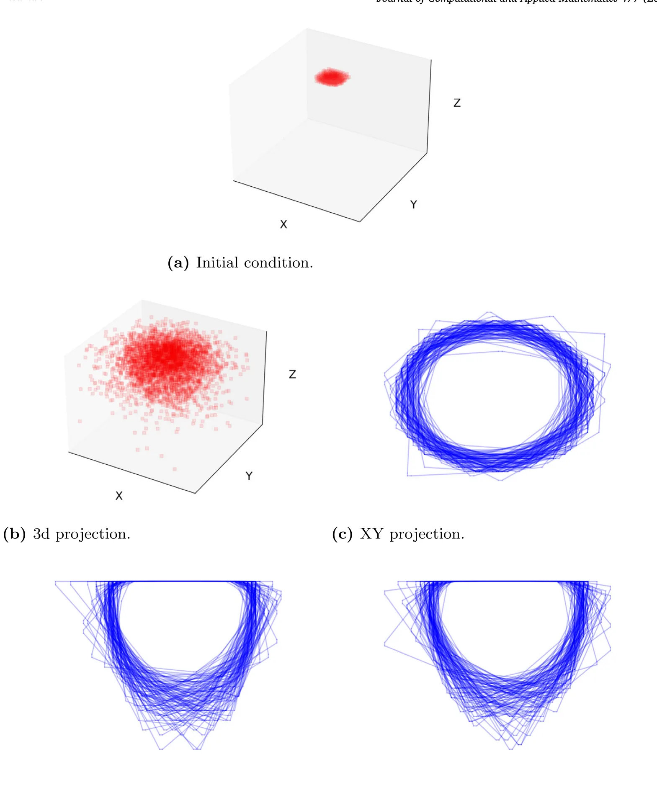
<figcaption><strong>Fig. 10.</strong> Simulation results for melanoma with an initial irregular circle on the skin surface, with 100 ABS repetitions after 30 days.</figcaption>
</figure>

In the case of a spherical tumor, we have shown that, by 100 repetitions of ABS the profile of the cancer-cells volume is in good agreement with the tumor volume derived by the PDE model, for 30 days; more precisely, the coefficient of determination (*𝑅*2) that measures the goodness of fitness between two profiles is *𝑅*2 = 0*.*940. This agreement can be associated with the fact that both models capture the same biological dynamics, and the assumptions that tumor boundary moves with velocity *𝑣* while Eq. (5) holds made in the PDE model, and the corresponding fact that new cells are introduced in unoccupied uniform volumes *𝛥*3 at a specific fixed rate in the ABS model. However, we cannot expect 100% agreement between the two models due to differences in the boundary conditions, and the difference in the definition of cell velocity, which is defined by *𝑣* in the PDE model, and by the pressure vector *𝑝* in the ABS model.

We next used the ABS model to determine the shape of the cancer-cells boundary, after 30 days, in non-spherical cases. We considered three initial conditions: a sphere with an irregular boundary, an ellipsoid, and a dermal cancer, such as melanoma. We first used the Canny algorithm, followed by the convex hull algorithm. This yields the convex hull of the cancer-cells region. Figs. 8–10 shows 100 repetitions of ABS boundary obtained by this method. They point to a minimally convex region outside which no cancer cell can be found.

<figure id="fig-11">
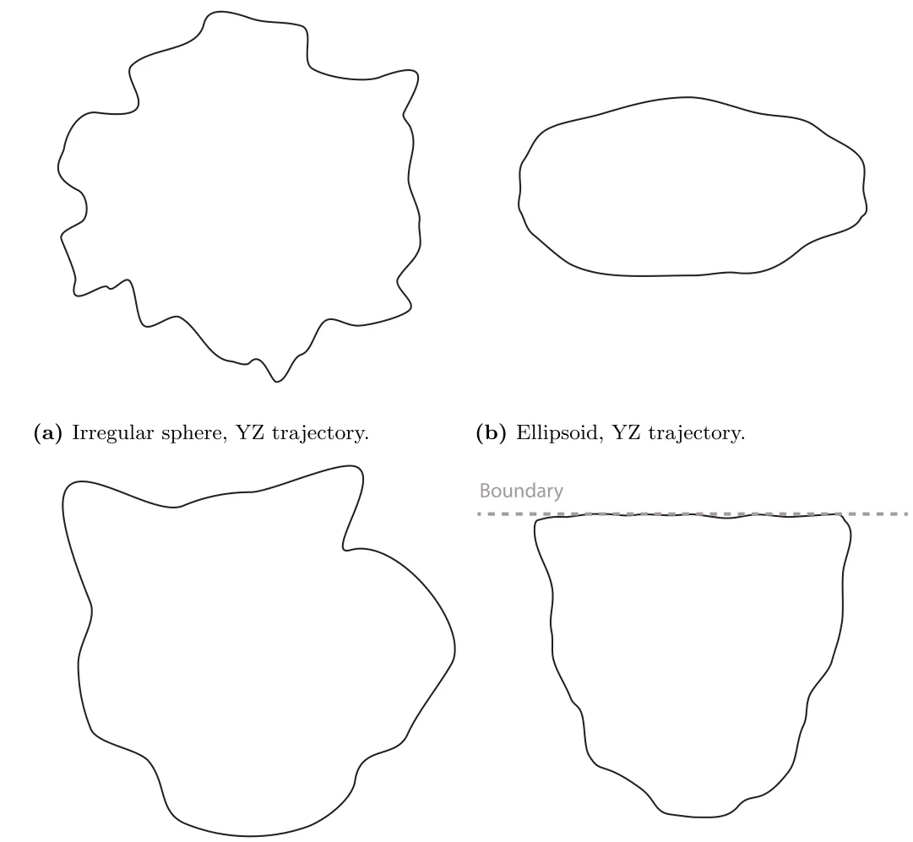
<figcaption><strong>Fig. 11.</strong> Computationally-obtained detailed boundary of the three initial conditions.</figcaption>
</figure>

We next used the Canny algorithm combined with *𝛼*-concave algorithm applied to 10 ABS repeats, with some scaling. The results for all three cases are shown in Fig. 11, and provide radiometric features for each case: asphericity is low in the cases irregular sphere and melanoma and is high in the case of ellipsoid.

Notably, a natural question is whether one can directly compare the tumor boundary predicted by the PDE formulation with the boundary obtained from the ABS simulations. However, such a comparison is not straightforward. By construction, the PDE boundary evolves smoothly and deterministically, governed by Darcy’s law and curvature-dependent pressure. In contrast, the ABS boundary emerges from discrete, stochastic cell arrangements and may contain local irregularities, protrusions, or even small gaps within the tumor volume.

## 6. Conclusion

A primary challenge in mathematical models of cancer is to determine (and simulate) the unknown shape of the tumor, or its boundary. In PDE models this challenge is usually addressed by making several ad-hoc assumptions. In ABS approach, no such assumptions are needed, since applying cell-to-cell and cell-environment rules, the boundary is automatically formed along grid lines. However, unlike PDE models, ABS is a stochastic process, and this deficiency is addressed by performing many repetitions of ABS.

In this paper, we considered a simple model of cancer and used the ABS approach using the same values of cell-to-cell and cell-environment parameters as in the corresponding PDE model. We showed that for a spherical tumor, the tumor volume profile (for 30 days) produced by the ABS approach is in good agreement with the one simulated by the PDE model.

<figure id="fig-12">
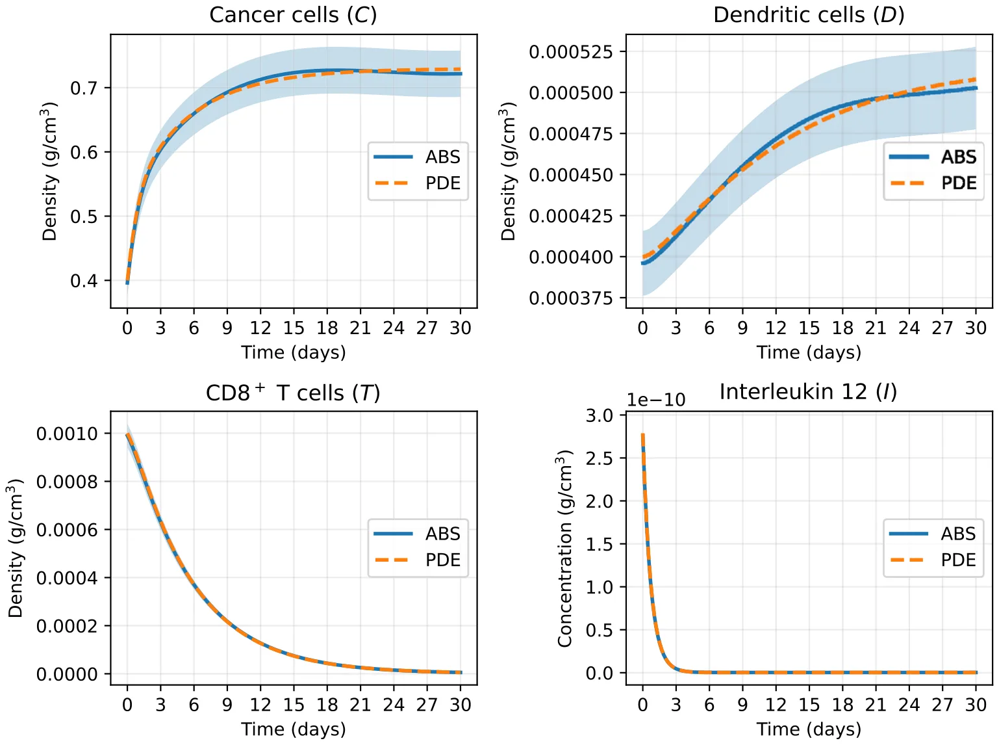
<figcaption><strong>Fig. 12.</strong> Comparison between PDE (dashed lines) and ABS (mean ± standard deviation across <em>𝑛</em> = 100 runs) for all four variables: cancer cells (<em>𝐶</em>), dendritic cells (<em>𝐷</em>), T cells (<em>𝑇</em>), and interleukin 12 (<em>𝐼</em>).</figcaption>
</figure>

We next used ABS to determine the tumor shape, at day 30, for three initially non-spherical tumors: sphere with irregular boundary, ellipsoid, and dermal cancer (e.g., melanoma). We applied two different methods to produce (what we call) schematic shapes and detailed shapes. A schematic shape produces the smallest convex set which contains all the cancer cells. Figs. 8–10 shows the schematic shape of the three non-spherical tumors, with 100 ABS repeats. Such pictures could potentially be useful in the assessment of cancer surgical margin [52,53].

The detailed shape allows parts of the boundary to be concave. In Fig. 11, we used 10 repetitions of ABS to produce detailed shapes for the same three non-spherical cases. We see that in terms of radiometric features, the asphericity of the sphere with irregular boundary and of the dermal cancer are small indicating high malignancy potential, while the asphericity of the ellipsoid is large suggesting a benign tumor.

For clarity, we included in this paper several algorithms that were used to implement the ABS model. The same ABS approach can be extended to more complex cancer models, which also include drug treatments, with similar but more complex, algorithms. The same tools we used to simulate the shape of regions that contain cancer cells can also be applied to such cancers.

## Code availability

All the code developed for this study is publicly available at: https://github.com/teddy4445/abs\_pde\_cancer\_spread\_model.

## Appendix. Supplementary material

*Comparison of PDE and ABS variables for the spherical case.* We compared the temporal dynamics of all four variables in the model for the spherical case: cancer cells (*𝐶*), dendritic cells (*𝐷*), T cells (*𝑇*), and interleukin 12 (*𝐼*). Fig. 12 shows the PDE solutions (solid lines) alongside the mean ± standard deviation of 100 ABS repetitions. Despite stochastic fluctuations inherent to the ABS, the PDE model accurately captures the expected mean-field trajectories of all populations. This reinforces the interpretation of the PDE as providing smoothed deterministic dynamics, while the ABS reveals variability and heterogeneity around those averages.

## Data availability

No data was used for the research described in the article.

## References

1. D.C.C. Tsui, D.R. Camidge, C.G. Rusthoven, Managing central nervous system spread of lung cancer: the state of the art, J. Clin. Oncol. 40 (6) (2022) 642–660. [link](http://refhub.elsevier.com/S0377-0427%2825%2900697-1/sb1)
2. F. Tausk, Psychoneuro-oncology: How chronic stress grows cancer, Clin. Dermatol. 41 (1) (2023) 95–104. [link](http://refhub.elsevier.com/S0377-0427%2825%2900697-1/sb1) · [link](http://refhub.elsevier.com/S0377-0427%2825%2900697-1/sb2)
3. N. PN, S. Mehla, A. Begum, H.K. Chaturvedi, R. Ojha, C. Hartinger, M. Plebanski, S.K. Bhargava, Smart nanozymes for cancer therapy: the next frontier in oncology, Adv. Healthcare Mater. 12 (25) (2023) 2300768. [link](http://refhub.elsevier.com/S0377-0427%2825%2900697-1/sb2) · [link](http://refhub.elsevier.com/S0377-0427%2825%2900697-1/sb3)
4. A. Uthamacumaran, H. Zenil, A review of mathematical and computational methods in cancer dynamics, Front. Oncol. 12 (2022) 850731. [link](http://refhub.elsevier.com/S0377-0427%2825%2900697-1/sb3) · [link](http://refhub.elsevier.com/S0377-0427%2825%2900697-1/sb4)
5. T. Lazebnik, N. Aaroni, S. Bunimovich-Mendrazitsky, PDE based geometry model for BCG immunotherapy of bladder cancer, Biosystems 200 (2021) 104319. [link](http://refhub.elsevier.com/S0377-0427%2825%2900697-1/sb4) · [link](http://refhub.elsevier.com/S0377-0427%2825%2900697-1/sb5)
6. X. Lai, A. Friedman, Combination therapy of cancer with cancer vaccine and immune checkpoint inhibitors: A mathematical model, PLoS One 12 (5) (2017) e0178479. [link](http://refhub.elsevier.com/S0377-0427%2825%2900697-1/sb5) · [link](http://refhub.elsevier.com/S0377-0427%2825%2900697-1/sb6)
7. K. Dehingia, H.K. Sarmah, M.B. Jeelani, A brief review on cancer research and its treatment through mathematical modelling, Ann. Cancer Res. Ther. 29 (1) (2021) 34–40. [link](http://refhub.elsevier.com/S0377-0427%2825%2900697-1/sb6) · [link](http://refhub.elsevier.com/S0377-0427%2825%2900697-1/sb7)
8. D. Katsaounis, M.A. Chaplain, N. Sfakianakis, Stochastic differential equation modelling of cancer cell migration and tissue invasion, J. Math. Biol. 87 (1) (2023) 8. [link](http://refhub.elsevier.com/S0377-0427%2825%2900697-1/sb7) · [link](http://refhub.elsevier.com/S0377-0427%2825%2900697-1/sb8)
9. M.B. Mansour, H.S. Hussien, A.H. Abobakr, Numerical simulations of wave propagation in a stochastic partial differential equation model for tumor–immune interactions, Int. J. Nonlinear Sci. Numer. Simul. 24 (5) (2023) 1601–1612. [link](http://refhub.elsevier.com/S0377-0427%2825%2900697-1/sb8) · [link](http://refhub.elsevier.com/S0377-0427%2825%2900697-1/sb9)
10. N. Mohammad Mirzaei, Z. Tatarova, W. Hao, N. Changizi, A. Asadpoure, I.K. Zervantonakis, Y. Hu, Y.H. Chang, L. Shahriyari, A PDE model of breast tumor progression in MMTV-PyMT mice, J. Pers. Med. 12 (5) (2022) 807. [link](http://refhub.elsevier.com/S0377-0427%2825%2900697-1/sb9) · [link](http://refhub.elsevier.com/S0377-0427%2825%2900697-1/sb10)
11. R. Granero-Belinchón, M. Magliocca, A nonlocal equation describing tumor growth, Math. Models Methods Appl. Sci. 35 (03) (2025) 585–609. [link](http://refhub.elsevier.com/S0377-0427%2825%2900697-1/sb10) · [link](http://refhub.elsevier.com/S0377-0427%2825%2900697-1/sb11)
12. E.J. Limkin, S. Reuzé, A. Carré, R. Sun, A. Schernberg, A. Alexis, E. Deutsch, C. Ferté, C. Robert, The complexity of tumor shape, spiculatedness, correlates with tumor radiomic shape features, Sci. Rep. 9 (2019) 4329. [link](http://refhub.elsevier.com/S0377-0427%2825%2900697-1/sb11) · [link](http://refhub.elsevier.com/S0377-0427%2825%2900697-1/sb12)
13. J. Lee, A.A. Abdeen, K.L. Wycislo, T.M. Fan, K.A. Kilian, Interfacial geometry dictates cancer cell tumorigenicity, Nat. Mater. 15 (2016) 856–862. [link](http://refhub.elsevier.com/S0377-0427%2825%2900697-1/sb12) · [link](http://refhub.elsevier.com/S0377-0427%2825%2900697-1/sb13)
14. Cleveland Clinic, Benign tumor, 2024, Available from: https://my.clevelandclinic.org/health/diseases/22121-benign-tumor. [link](http://refhub.elsevier.com/S0377-0427%2825%2900697-1/sb13) · [link](https://my.clevelandclinic.org/health/diseases/22121-benign-tumor)
15. L. Curtin, P. Whitmire, H. White, K.M. Bond, M.M. Mrugala, L.S. Hu, K.R. Swanson, Shape matters: morphological metrics of glioblastoma imaging abnormalities as biomarkers of prognosis, Sci. Rep. 11 (2021) 23202. [link](https://my.clevelandclinic.org/health/diseases/22121-benign-tumor) · [link](http://refhub.elsevier.com/S0377-0427%2825%2900697-1/sb15)
16. L.W. Bassett, K. Conner, The abnormal mammogram, in: D.W. Kufe, R.E. Pollock, R.R. Weichselbaum, et al. (Eds.), Holland-Frei Cancer Medicine, sixth ed., BC Decker, Hamilton, ON, 2003, Available from: https://www.ncbi.nlm.nih.gov/books/NBK12642/. [link](http://refhub.elsevier.com/S0377-0427%2825%2900697-1/sb15)
17. A. Ghanbari, R. Khordad, M. Ghaderi-Zefrehei, Tumor shapes effect on metastatic state: A theoretical derivation embedding thermodynamic laws, Chinese J. Phys. 68 (2020) 684–698. [link](http://refhub.elsevier.com/S0377-0427%2825%2900697-1/sb17)
18. B.K. Byrd, V. Krishnaswamy, J. Gui, T. Rooney, R. Zuurbier, K. Rosenkranz, K. Paulsen, R.J. Barth Jr., The shape of breast cancer, Breast Cancer Res. Treat. 183 (2) (2020) 403–410. [link](http://refhub.elsevier.com/S0377-0427%2825%2900697-1/sb17) · [link](http://refhub.elsevier.com/S0377-0427%2825%2900697-1/sb18)
19. J.G. Verwer, B.P. Sommeijer, An implicit-explicit Runge–Kutta–Chebyshev scheme for diffusion-reaction equations, SIAM J. Sci. Comput. 25 (5) (2004) 1824–1835. [link](http://refhub.elsevier.com/S0377-0427%2825%2900697-1/sb18) · [link](http://refhub.elsevier.com/S0377-0427%2825%2900697-1/sb19)
20. K.R. Srinath, Python – The fastest growing programming language, Int. Res. J. Eng. Technol. 4 (12) (2017). [link](http://refhub.elsevier.com/S0377-0427%2825%2900697-1/sb19) · [link](http://refhub.elsevier.com/S0377-0427%2825%2900697-1/sb20)
21. P. Macklin, J. Kim, G. Tomaiuolo, M.E. Edgerton, V. Cristini, Agent-based modeling of ductal carcinoma in situ: application to patient-specific breast cancer modeling, in: Computational Biology: Issues and Applications in Oncology, Springer, 2009, pp. 77–111. [link](http://refhub.elsevier.com/S0377-0427%2825%2900697-1/sb20) · [link](http://refhub.elsevier.com/S0377-0427%2825%2900697-1/sb21)
22. B. Johansson, A. Fast-Berglund, J. Stahre, Enabling flexible manufacturing systems by using level of automation as design parameter, in: Proceedings of the 2009 Winter Simulation Conference, WSC, IEEE, 2009, pp. 2009–2020. [link](http://refhub.elsevier.com/S0377-0427%2825%2900697-1/sb21) · [link](http://refhub.elsevier.com/S0377-0427%2825%2900697-1/sb22)
23. M.J. North, C.M. Macal, Managing Business Complexity: Discovering Strategic Solutions with Agent-Based Modeling and Simulation, Oxford University Press, Oxford, 2007. [link](http://refhub.elsevier.com/S0377-0427%2825%2900697-1/sb22) · [link](http://refhub.elsevier.com/S0377-0427%2825%2900697-1/sb23)
24. G. Ciatto, M.I. Schumacher, A. Omicini, D. Calvaresi, Agent-based explanations in AI: Towards an abstract framework, in: International Workshop on Explainable, Transparent Autonomous Agents and Multi-Agent Systems, Springer, 2020, pp. 3–20. [link](http://refhub.elsevier.com/S0377-0427%2825%2900697-1/sb23) · [link](http://refhub.elsevier.com/S0377-0427%2825%2900697-1/sb24)
25. Y. Al-Saawy, A. Al-Ajlan, K. Aldrawiesh, A. Bajahzer, The development of multi-agent system using finite state machine, in: 2009 International Conference on New Trends in Information and Service Science, 2009, pp. 203–206. [link](http://refhub.elsevier.com/S0377-0427%2825%2900697-1/sb24) · [link](http://refhub.elsevier.com/S0377-0427%2825%2900697-1/sb25)
26. F. Klügl, A.L.C. Bazzan, Agent-based modeling and simulation, AI Mag. 33 (3) (2012) 29. [link](http://refhub.elsevier.com/S0377-0427%2825%2900697-1/sb25) · [link](http://refhub.elsevier.com/S0377-0427%2825%2900697-1/sb26)
27. T. Lazebnik, Computational applications of extended SIR models: A review focused on airborne pandemics, Ecol. Model. 483 (2023) 110422. [link](http://refhub.elsevier.com/S0377-0427%2825%2900697-1/sb26) · [link](http://refhub.elsevier.com/S0377-0427%2825%2900697-1/sb27)
28. V.S. Alagar, K. Periyasamy, Extended finite state machine, in: Specification of Software Systems, Springer London, 2011, pp. 105–128. [link](http://refhub.elsevier.com/S0377-0427%2825%2900697-1/sb27) · [link](http://refhub.elsevier.com/S0377-0427%2825%2900697-1/sb28)
29. J. West, M. Robertson-Tessi, A.R.A. Anderson, Agent-based methods facilitate integrative science in cancer, Trends Cell Biol. 33 (4) (2023) 300–311. [link](http://refhub.elsevier.com/S0377-0427%2825%2900697-1/sb28) · [link](http://refhub.elsevier.com/S0377-0427%2825%2900697-1/sb29)
30. T.E. Gorochowski, Agent-based modelling in synthetic biology, Essays Biochem. 60 (4) (2016) 325–336. [link](http://refhub.elsevier.com/S0377-0427%2825%2900697-1/sb29) · [link](http://refhub.elsevier.com/S0377-0427%2825%2900697-1/sb30)
31. Z. Zhang, O.A. Igoshin, C.R. Cotter, L.J. Shimkets, Agent-based modeling reveals possible mechanisms for observed aggregation cell behaviors, Biophys. J. 115 (12) (2018) 2499–2511. [link](http://refhub.elsevier.com/S0377-0427%2825%2900697-1/sb30) · [link](http://refhub.elsevier.com/S0377-0427%2825%2900697-1/sb31)
32. R.W. Gregg, F. Shabnam, J.E. Shoemaker, Agent-based modeling reveals benefits of heterogeneous and stochastic cell populations during cGAS-mediated IFN𝛽 production, Bioinformatics 37 (10) (2021) 1428–1434. [link](http://refhub.elsevier.com/S0377-0427%2825%2900697-1/sb31) · [link](http://refhub.elsevier.com/S0377-0427%2825%2900697-1/sb32)
33. M.N. van Genderen, J. Kneppers, A. Zaalberg, E.M. Bekers, A.M. Bergman, W. Zwart, F. Eduati, Agent-based modeling of the prostate tumor microenvironment uncovers spatial tumor growth constraints and immunomodulatory properties, Npj Syst. Biol. Appl. 10 (1) (2024) 20. [link](http://refhub.elsevier.com/S0377-0427%2825%2900697-1/sb32) · [link](http://refhub.elsevier.com/S0377-0427%2825%2900697-1/sb33)
34. N. Cogno, C. Axenie, R. Bauer, V. Vavourakis, Agent-based modeling in cancer biomedicine: applications and tools for calibration and validation, Cancer Biol. Ther. 25 (1) (2024). [link](http://refhub.elsevier.com/S0377-0427%2825%2900697-1/sb33) · [link](http://refhub.elsevier.com/S0377-0427%2825%2900697-1/sb34)
35. L. Zhang, B. Jiang, Y. Wu, C. Strouthos, P.Z. Sun, J. Su, X. Zhou, Developing a multiscale, multi-resolution agent-based brain tumor model by graphics processing units, Theor. Biol. Med. Model. 8 (2011) 46. [link](http://refhub.elsevier.com/S0377-0427%2825%2900697-1/sb34) · [link](http://refhub.elsevier.com/S0377-0427%2825%2900697-1/sb35)
36. C. Gong, O. Milberg, B. Wang, P. Vicini, R. Narwal, L. Roskos, A.S. Popel, A computational multiscale agent-based model for simulating spatio-temporal tumour immune response to PD1 and PDL1 inhibition, J. Royal Soc. Interface 14 (134) (2017) 20170320. [link](http://refhub.elsevier.com/S0377-0427%2825%2900697-1/sb35) · [link](http://refhub.elsevier.com/S0377-0427%2825%2900697-1/sb36)
37. Y. Cai, J. Wu, S. Xu, Z. Li, A hybrid cellular automata model of multicellular tumour spheroid growth in hypoxic microenvironment, J. Appl. Math. 2013 (2013) 1–10. [link](http://refhub.elsevier.com/S0377-0427%2825%2900697-1/sb36) · [link](http://refhub.elsevier.com/S0377-0427%2825%2900697-1/sb37)
38. T. Lazebnik, Cell-level spatio-temporal model for a bacillus Calmette–Guérin-based immunotherapy treatment protocol of superficial bladder cancer, Cells 11 (15) (2022) 2372. [link](http://refhub.elsevier.com/S0377-0427%2825%2900697-1/sb37) · [link](http://refhub.elsevier.com/S0377-0427%2825%2900697-1/sb38)
39. J. Metzcar, Y. Wang, R. Heiland, P. Macklin, A review of cell-based computational modeling in cancer biology, JCO Clin. Cancer Inform. (3) (2019) 1–13. [link](http://refhub.elsevier.com/S0377-0427%2825%2900697-1/sb38) · [link](http://refhub.elsevier.com/S0377-0427%2825%2900697-1/sb39)
40. D. Pally, D. Pramanik, R. Bhat, An interplay between reaction-diffusion and cell-matrix adhesion regulates multiscale invasion in early breast carcinomatosis, Front. Physiol. 10 (2019). [link](http://refhub.elsevier.com/S0377-0427%2825%2900697-1/sb39) · [link](http://refhub.elsevier.com/S0377-0427%2825%2900697-1/sb40)
41. N. Sfakianakis, A. Madzvamuse, M.A.J. Chaplain, A hybrid multiscale model for cancer invasion of the extracellular matrix, Multiscale Model. Simul. 18 (2) (2020) 824–850. [link](http://refhub.elsevier.com/S0377-0427%2825%2900697-1/sb40) · [link](http://refhub.elsevier.com/S0377-0427%2825%2900697-1/sb41)
42. X. Lai, A. Stiff, M. Duggan, R. Wesolowski, W.E. Carson, A. Friedman, Modeling combination therapy for breast cancer with BET and immune checkpoint inhibitors, Proc. Natl. Acad. Sci. USA 115 (21) (2018) 5534–5539. [link](http://refhub.elsevier.com/S0377-0427%2825%2900697-1/sb41) · [link](http://refhub.elsevier.com/S0377-0427%2825%2900697-1/sb42)
43. D.A. Charlebois, G. Balázsi, Modeling cell population dynamics, Silico Biol. 13 (1–2) (2019) 21–39. [link](http://refhub.elsevier.com/S0377-0427%2825%2900697-1/sb43)
44. T. Lazebnik, A. Friedman, Spatio-temporal model of combining chemotherapy with senolytic treatment in lung cancer, Math. Biosci. (2025). [link](http://refhub.elsevier.com/S0377-0427%2825%2900697-1/sb43) · [link](http://refhub.elsevier.com/S0377-0427%2825%2900697-1/sb44)
45. G. Deng, L.W. Cahill, An adaptive Gaussian filter for noise reduction and edge detection, in: 1993 IEEE Conference Record Nuclear Science Symposium and Medical Imaging Conference, 1993, pp. 1615–1619. [link](http://refhub.elsevier.com/S0377-0427%2825%2900697-1/sb44) · [link](http://refhub.elsevier.com/S0377-0427%2825%2900697-1/sb45)
46. W. Rong, Z. Li, W. Zhang, L. Sun, An improved CANNY edge detection algorithm, in: 2014 IEEE International Conference on Mechatronics and Automation, 2014, pp. 577–582. [link](http://refhub.elsevier.com/S0377-0427%2825%2900697-1/sb45) · [link](http://refhub.elsevier.com/S0377-0427%2825%2900697-1/sb46)
47. G.T. Toussaint, D. Avis, On a convex hull algorithm for polygons and its application to triangulation problems, Pattern Recognit. 15 (1) (1982) 23–29. [link](http://refhub.elsevier.com/S0377-0427%2825%2900697-1/sb46) · [link](http://refhub.elsevier.com/S0377-0427%2825%2900697-1/sb47)
48. S. Asaeedi, F. Didehvar, A. Mohades, 𝛼-Concave hull, a generalization of convex hull, Theoret. Comput. Sci. 702 (2017) 48–59. [link](http://refhub.elsevier.com/S0377-0427%2825%2900697-1/sb47) · [link](http://refhub.elsevier.com/S0377-0427%2825%2900697-1/sb48)
49. J.C.A. Barata, M.S. Hussein, The Moore–Penrose pseudoinverse: A tutorial review of the theory, Braz. J. Phys. 42 (2012) 146–165. [link](http://refhub.elsevier.com/S0377-0427%2825%2900697-1/sb48) · [link](http://refhub.elsevier.com/S0377-0427%2825%2900697-1/sb49)
50. P. Saint-Marc, J.S. Chen, G. Medioni, Adaptive smoothing: A general tool for early vision, IEEE Trans. Pattern Anal. Mach. Intell. 13 (6) (1991) 514–529. [link](http://refhub.elsevier.com/S0377-0427%2825%2900697-1/sb49) · [link](http://refhub.elsevier.com/S0377-0427%2825%2900697-1/sb50)
51. H.P. Langtangen, A. Logg, Solving PDEs in Python, Simula SpringerBriefs on Computing, Springer, Cham, 2016, p. XI, 146. [link](http://refhub.elsevier.com/S0377-0427%2825%2900697-1/sb50) · [link](http://refhub.elsevier.com/S0377-0427%2825%2900697-1/sb51)
52. J. Heidkamp, M. Scholte, C. Rosman, S. Manohar, J.J. Fütterer, M.M. Rovers, Novel imaging techniques for intraoperative margin assessment in surgical oncology: A systematic review, Int. J. Cancer 149 (3) (2021) 635–645. [link](http://refhub.elsevier.com/S0377-0427%2825%2900697-1/sb51) · [link](http://refhub.elsevier.com/S0377-0427%2825%2900697-1/sb52)
53. M.T. Scimone, S. Krishnamurthy, G. Maguluri, D. Preda, J. Park, J. Grimble, M. Song, K. Ban, N. Iftimia, Assessment of breast cancer surgical margins with multimodal optical microscopy: A feasibility clinical study, PLoS One 16 (2) (2021) e0245334. [link](http://refhub.elsevier.com/S0377-0427%2825%2900697-1/sb52) · [link](http://refhub.elsevier.com/S0377-0427%2825%2900697-1/sb53)
