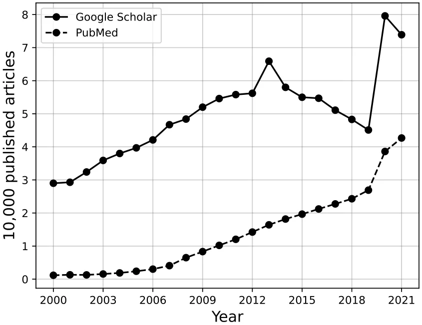
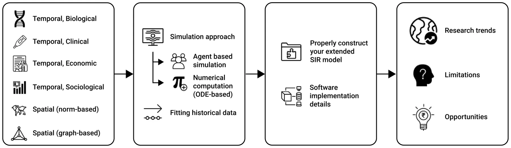
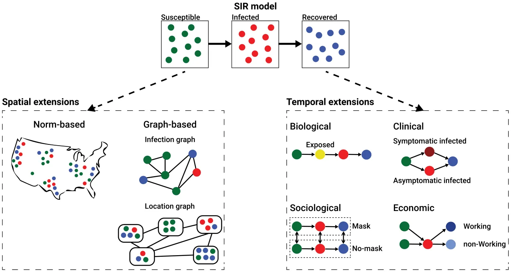
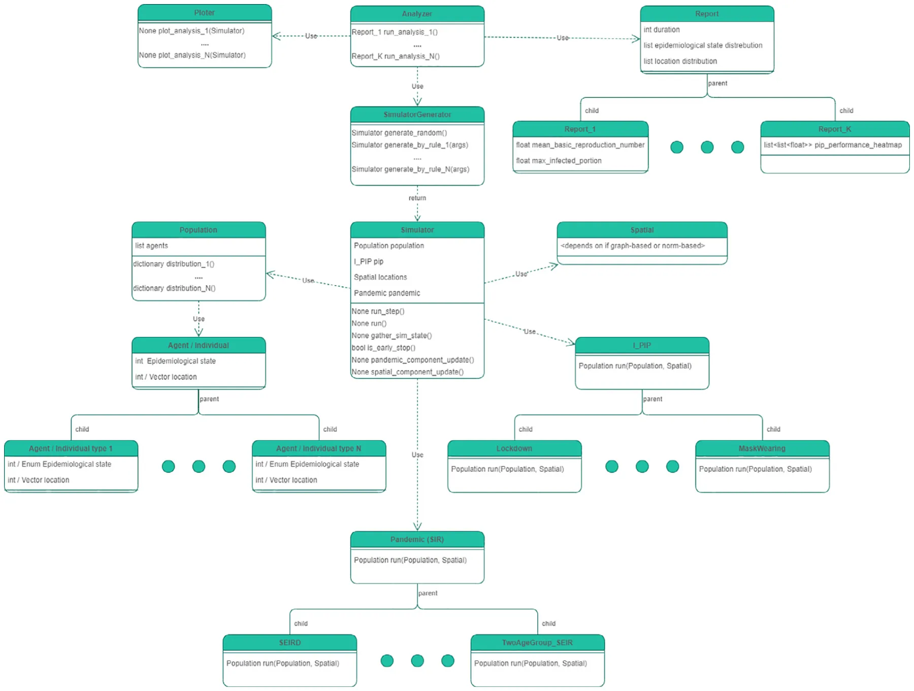

## 1. Introduction

Historical records show that pandemics caused significant mortality, economical crises, and political shifts for centuries (Conti, 2020). In the twenty-first century alone, many emerging and reemerging infectious diseases threaten the human race (Brodeur et al., 2020). Globalization processes combined with social-economic processes such as urbanization in the developing world which is bringing more people into denser neighborhoods have facilitated pandemic spread, keeping it near-constant in the near future although the advances in clinical and engineering preventing methods (Wu et al., 2017; Lederberg, 1988). These diseases are often disseminated at unprecedented speed. A few recent examples of such outbreaks are the severe acute respiratory syndrome (SARS) in 2003, the H1N1 influenza pandemic of 2009, the Middle East respiratory syndrome coronavirus (MERS-CoV) in Saudi Arabia in 2012, the Ebola virus in the West African region in 2014, and the global severe acute respiratory syndrome coronavirus 2 (SARS-CoV-2) also known as the COVID-19 pandemic that caused eight million recorded death worldwide in just two years (Wiratsudakul et al., 2018; Eurosurveillance Editorial Team, 2020; Mackey and Liang, 2012; Dea Groot et al., 2013).

While there are many types of pandemics such as sexually transmitted diseases (Genuis et al., 2004; Quinn, 1996), socially influenced behavior (Djillali et al., 2021a,b), and airborne diseases (Domingo et al., 2020; Ferguson et al., 2006), the group of airborne pandemics caused the most concern due to their high infection rate and unrestricted target population (Fernandez-Montero et al., 2020). The airborne pandemic groups include multiple pathogens such as influenza, Lassa virus, COVID-19, Nipah virus, and others. In addition, pandemic intervention policies (PIPs) for airborne pandemics are relatively more harmful to the economy and psychological state of the population in comparison to the other types of pandemic (Araz et al., 2012; Kabir et al., 2020; Meltzer et al., 1999; Taylor et al., 2008; Perrin et al., 2009).

As such, policymakers are required to be ready for outbreak events to react to them properly. To serve this purpose, policymakers have relied on real-time and historical data gathered on a variety of epidemiological, healthcare, and social processes (Liu et al., 2018; Ritterman et al., 2009; Barclay, 2008). Descriptive summaries of raw data alone do not reveal the complex dynamics underlying pandemics. To fill this gap, epidemiological-mathematical models are exploited to predict, monitor, and evaluate the pandemic course and the influence of PIPs to alter it (Adiga et al., 2020).

<figure id="fig-1">

<figcaption><strong>Fig. 1.</strong> The yearly number of papers found by the query ‘‘SIR model’’ in both the Google Scholar and PubMed academic search engines.</figcaption>
</figure>

Modeling pandemic spread and control is an interdisciplinary task, obligating to comprehend not only the mathematical frameworks but also biological, clinical, social, economic, and other knowledge that influence or influenced the pandemic and PIPs (Rock et al., 2014). These Epidemiological-mathematical models can be divided into two main groups: statistical models and mechanistic models. Models that belong to the first group use a data-driven approach without any assumptions on the dynamics while the latter group of models is based on theoretical principles that aim to explain the dynamics of the pandemic. Statistical models commonly use statistical and machine learning (ML) methods to forecast a wide range of outcomes. Many models that belong to this group have been developed using a wide range of methods such as auto-regressive time series methods, Bayesian optimization techniques, and recently even deep learning models (Desai et al., 2019; Ivorra et al., 2020; Long and Ehrenfeld, 2020; Salgotra et al., 2020; Agarwal and Jhajharia, 2021). On the other hand, mechanistic models, such as the SIR model, uses a set of rules or processes between individuals in a population (Tuite et al., 2020; Miller, 2017a; Berge et al., 2017; Miller, 2017b). Hybrid models that combine mechanistic models with data-driven ML approaches are also starting to become popular, usually showing superior performance in comparison to the previous models (Funk et al., 2018; Shariful et al., 2021; Shen et al., 2020a; Lazebnik and Blumrosen, 2022). The most popular epidemiological-mathematical modeling approach is the Susceptible– Infected–Recovered (SIR) model (Al-Raeei, 2020; Fernández-Villaverde and Jones, 2020; Ellison, 2020), proposed by Kermack and McKendrick (1927). The SIR model assumes that the population is divided into susceptible, infected, and recovered individuals such that each infected individual infected on average *𝛽* susceptible individuals and that infected individuals recover and become recovered at a rate *𝛾*. However, the SIR model by itself is usually too simplistic to capture real-world pandemic spread (Cooper et al., 2020; Atkeson, 2020; Moein et al., 2021). As a result, multiple extensions of the SIR model have been developed to improve the SIR-based models’ expressiveness, prediction accuracy, and robustness (Rahimi et al., 2021). Indeed, an increasing number of SIR model-based works are published over the last two decades on a yearly basis as shown in Fig. 1. One can notice a peak in 2020 which can be associated with the outbreak of the COVID-19 pandemic worldwide (Eurosurveillance Editorial Team, 2020).

These models would be kept in theory without computer software that allows both professional and non-professional users to query the models on a broad spectrum of realistic scenarios (Wang et al., 2020; Jiomekong and Camara, 2020; Maryam et al., 2020). However, the implementation of such models as computer simulations is not trivial since it requires the researchers to overcome several technical and computational challenges to obtain a useful tool for policymakers (Chumachenko et al., 2018; Priest et al., 2021; Carley et al., 2006). For example, fitting the model on historical data. The present work aims to provide an overview of extended SIR-based mathematical models, particularly those developed for airborne pandemics with a special focus on their implementation as computer software. In addition, following the presented approaches, we provide a manual for new epidemiological modelers on how to develop and implement their models.

This paper is organized as follows. Section 2 provides an overview of the common temporal and spatial extensions of the SIR model including biological, clinical, economic, and sociological. In particular, the influence of such decisions on numerical calculation or simulation implementation is discussed. Next, Section 3 review the two main approach to the extended SIR-based model’s implementation from the point of view of a computational design and provide examples of how to fit them into historical data. Afterward, Section 4 outlines a manual for epidemiological-mathematical modelers on how to develop and implement their model. In Section 5, we discuss the research trends, current models limitations, and opportunities. Finally, Section 6 concludes the work and proposes possible future work. A schematic view of this structure is presented in Fig. 2.

## 2. Extended SIR models

The SIR model can be extended by introducing more temporal processes that maintain the well-mixture assumption of the SIR model or spatial extensions that violate this assumption. In the spatial extensions, there are two main groups: norm-based and graph-based spatial extensions. The norm-based spatial extensions assume a continuous spatial domain that obeys known physical rules up to some level, while the graph-based spatial extensions assume discrete (and usually abstract) spatial domains which also ignore physical rules. In particular, one can divide the graph-based spatial extensions into *infection graphs* where individuals are the nodes of the graphs, and *location graphs* where nodes describe locations in which the individuals are located (and can move between them). The temporal extensions can be roughly divided into four main groups: biological, clinical, social, and economic. The biological extensions are focused on the biological processes of the pathogen such as mutation and interaction with the host’s immune system. The clinical extensions are focused on the clinical processes that occur due to the pathogen such as different infection severity and clinical treatment efficiency. The sociological extensions are focused on the influence of information spread and decision-making of individuals in the population due to the pandemic such as willingness to obey PIPs. The economic extensions are focused on the influence of the pandemic on the workforce and its production on the population behavior during the pandemic such as introducing constraints on PIPs that aim to control the pandemic spread such that the economy will not crash. A schematic view of possible extensions to the SIR model is shown in Fig. 3.

<figure id="fig-2">

<figcaption><strong>Fig. 2.</strong> The review’s structure.</figcaption>
</figure>

<figure id="fig-3">

<figcaption><strong>Fig. 3.</strong> A schematic view of possible extensions to the SIR model.</figcaption>
</figure>

### 2.1. Temporal extensions

The temporal extensions are defined by the introduction or modification of existing processes in the SIR model in which the well-mixture assumption is not affected. Namely, the population has more complex dynamics which are usually reflected in more epidemiological states.

In this section, we explore four common extension strategies, divided into biological, clinical, economic, and sociological. Nonetheless, this division is artificial since most of the time dynamics that are rooted in one category (for instance, economic) influences or cause changes in the processes of another category (like, sociological).

#### 2.1.1. Biological

The biological extensions are associated with the dynamics related to the pathogen and its interaction with the host’s immune system.

Nisar et al. (2021) proposed a fractional-order SIRD model where *𝐷* is the death state that individuals can reach after being infected (*𝐼*). The authors study the analytical results of the basic reproduction number using the next-generation matrix (Diekmann et al., 2010) as well as its stability. Furthermore, the authors fitted their model to data from WHO (WHO, 2022) about the COVID-19 pandemic in China, focusing on the beginning of the pandemic and on the city of Wuhan. The authors used an Adams–Bashforth method (Wang, 2013) of fractional order to find the numerical solution for the proposed model.

Piccirillo (2021) used an SEIR model where *𝐸* is the exposed state in which individuals are already infected by the pathogen but not infectious yet. Technically, an infection period is added to the SIR model such that infected individuals first become exposed and only after some time transformed into the infected (*𝐼*) state. The author also introduces an abstract preventive measure on the infection spread in the form of a control parameter to the infection rate (usually marked by *𝛽*). The authors used a numerical Ordinary Differential Equations (ODEs) solver to evaluate several scenarios of the preventive measures applied by the government. Validation of the model on historical data is not provided.

In recent years the study of multi-strain pandemics is gathering popularity. This popularity can be associated with the ever-improved ability to analyze and distinguish pathogen strains in a timely manner. For instance, Minayev and Ferguson (2008) investigate the interaction between epidemiological and evolutionary dynamics for multiple pathogens. The authors proposed a set of deterministic models of the transmission dynamics of multi-strain pathogens which provide increased biological realism but assumed clinical-epidemiological dynamics that hold only for a set of pathogens with cross-immunity of fewer than 0.4 (Minayev and Ferguson, 2008). While of interest, it means only a very limited portion of the theoretical multi-strain pandemics can be analyzed using these models. Another example is the stochastic SIRS model proposed by Gordo et al. (2009) which takes into consideration two strains and divides the population into sub-groups according to their clinical properties. The authors validated their model on the influenza pandemic in the State of New York (USA) between 1993 and 2006, showing promising results. In a similar manner, Khyar and Allali (2020) proposed an SEIR model for the COVID-19 pandemic with two strains while proposing an extension to the model for multi-strain dynamics as well. In their model, an individual can be infected only once and develop immunity to all strains (Khyar and Allali, 2020). Lazebnik and Bunimovich-Mendrazitsky (2022) relaxed this assumption, allowing an individual to be infected and recovered with each one of the strains while taking into consideration the order of infection which is shown to better represent actual biological dynamics (Cox and Brokstad, 2020; Winer et al., 2011; Mukherjee et al., 2020; Yaqinuddin, 2020).

#### 2.1.2. Clinical

The clinical extensions are usually associated with either introduction of new epidemiological states that are related to the original infection (*𝐼*) state in the SIR model or the division of the population into sub-groups (typically referred to as metapopulations). In addition, from the PIP point of view, clinical extensions are referred to the ability of the healthcare system as well as clinical facilities (such as hospitals) to help severely infected individuals to recover.

Chen (2020) proposed a SIR model with two levels of infection severity — symptomatic and asymptomatic for the case of COVID- 19. The author also differs in the transmission path between the two cases in which susceptible individuals become asymptomatic infected immediately while symptomatic infected individuals first go through the exposed stage. In addition, each infection severity is assumed to have a unique infection and recovery rates. The author also suggested a stochastic version of the proposed model by introducing a random noise to each parameter value over time. A comparison between the two versions of the model has been investigated by solving the model using a numerical ODE solver has been conducted but no validation of the model’s performance on historical data or fitting on this data has been provided.

Kozyreff (2021) used a SIR model with hospitalized patient dynamics which is assumed to be proportional to the number of infected individuals with some delay and exponential decay in the meantime of hospitalization stay. One can note that the hospitalized population does not influence the remaining epidemiological states which are expected to accurately describe the hospitalization dynamics. Indeed, the author addressed this issue, explaining that ‘‘the present paper is to invoke the simplest possible model in order to exploit simple explicit formulas’’ (Kozyreff, 2021). They fitted their proposed model on the COVID-19 pandemic for five states (Belgium, France, Italy, Switzerland, and New York City [US]), focusing on the first three months of the pandemic in each state. In practice, the author used the Mathematica (version 8.0)1 with the ‘‘FindFit’’ and ‘‘NonlinearModelFit’’ functions that utilize the least mean square regression method (Bjorck, 1996). It is worth noting, that while the author provided a figure to visualize the fitting results, no empirical analysis has been provided which limits the ability to evaluate the model’s expressiveness.

Rost and Wu (2008) studied an SEIR epidemic model with varying infectivity by considering the infection age of infected individuals. This assumption leads to a system of differential equations with distributed infinite delay. Extension of this work has been proposed by Bajiya et al. (2021) which introduced an abstract heterogeneous population dynamics by dividing into multiple sub-groups of the population and assuming known infection interactions between any two sub-groups. In particular, Bajiya et al. (2021) provided a close form for the global stability of disease-free equilibrium as well as endemic equilibrium. The authors also empirically studied these analytical outcomes using a numerical ODE-solver, unsurprisingly obtaining the analytically predicted results. The division into age-groups was also studied by Bunimovich-Mendrazitsky and Stone (2005) for Polio and Lazebnik and Bunimovich-Mendrazitsky (2021) for COVID-19. In particular, Lazebnik and Bunimovich-Mendrazitsky (2021) fitted a two-age-group SIR model on the COVID-19 data for Israel using a least mean square error with grid-search (Liu et al., 2006) on the parameters process, showing better prediction results compared to one age group SIR model for the middle of the pandemic in general and one implementing a PIP that unbalances influence different age groups in the population such as the closure of schools.

Ram and Schaposnik (2021) used a stochastic multi-age-group SIR model such that the probability of two individuals from two age groups meeting is an input to the model. The authors also introduced the social distance PIP such that as more people obey social distance, the probability two individuals interact is reduced in a logarithmic manner. The authors implemented their model for the COVID-19 pandemic in Washington State (USA) by minimizing the prediction of the mean absolute error over time by the model and the three epidemiological parameters: hospitalization rate, ICU rate among hospitalizations, and mortality rate, taken from Ferguson et al. (2020). The authors also used the pandemic state as the initial condition and the population’s age distribution from the US government’s public datasets (Ram and Schaposnik, 2021).

Lazebnik and Blumrosen (2022) used a multi-strain extended SIRS model with nine states: susceptible, infected, severely infected, short-recovered, long-recovered, reinfected, severely reinfected, and deceased. The authors assumed that the pandemic is associated with a pathogen with two or more strains such that there is some level of similarity between the strains. As such, the authors integrated knowledge from microbiology about the pharmacokinetics dynamics that occur as the host’s immune system fights the pathogen. Namely, the authors assumed that after recovering from the infection state, an individual has a large number of antibodies that keep the individual immune from reinfection. Nevertheless, the amount of antibodies is reduced over time until their amount is too small to make the individual immune from reinfection while the number of long-term immune cells (i.e., T-cells and B-cells) are generated by the individual’s body. As such, reinfection is possible but has a different infection and recovery rate due to the long-term immune cells. Moreover, due to the similarity between the strains, antibodies as well as long-term immune cells have a proportional effect on the other strains, corresponding to the similarity between them. The authors implemented their model using the agent-based simulation approach (Raberto et al., 2001). They implemented the proposed model for the COVID-19 pandemic in the case of Israel. The fitting function that has been used is a variation on the mean square error such that the total prediction of all strains in each epidemiological state is compared to the historical records over time, due to the lack of diversion to strains in the publicly available historical data. The fitting procedure is adapted from Lazebnik et al. (2021b). The data is divided into fitting and validation cohorts such that the fitting cohort is the first 18 months of the data and the validation cohort is the additional two months. In order to evaluate the model’s performance, three epidemiological parameters (the mean reproduction number, mortality rate, and severe cases/hospitalization rate) are computed for both the fitting and validation cohorts.

#### 2.1.3. Economic

The economic extensions are associated with the workforce and how they influence the infection dynamics. Moreover, the economic dynamics commonly introduce constraints for the execution of PIPs implementation to make sure the damage to the economy is limited. A similar approach is the introduction of a multi-objective PIP implementation such that the pandemic spread is minimized as well as the economic damage that usually occurs with some level of trade-off between them.

Alvarez et al. (2020) used a SIR model with the lockdown dynamics implemented as the number of individuals in lockdown multiplied by the lockdown effectiveness are deduced from the infection rate (*𝛽*) in the susceptible and infection equations. Moreover, unorthodoxly, the authors assumed the death state is not part of the epidemiological state but rather the population size is reduced over time proportionally to the number of infected individuals. Not only that, this proportion is not constant (as commonly found in SIRD models) but a function of the number of infected (e.g., *𝐼*(*𝑡*)) itself. On top of that, the authors introduce an economic model in which: (1) the lockdown population size is limited in order to make sure some sectors would not shut down; (2) individuals who are infected, but not in lockdown, can still produce as much as those susceptible or recovered not in lockdown; and (3) lockdown individuals do not produce. The authors also assumed that individuals are homogeneous in the manner that they produce at the same rate. Based on this model, the authors aimed to find the optimal number of lockdown individuals such that the population production is maximized while the pandemic spread is minimized.

Farboodi et al. (2021) used a SIRD model with an economic model. In their economic models, the authors have taken into consideration social activity such that individuals get utility from a level of social activity. In addition, an individual is aware of being recovered from the disease but cannot differ from susceptible and infected states. Using the proposed model, the authors study several types of equilibria including the laissez-faire (Knight, 1967) and social optimum scenarios.

Krueger et al. (2020) extended the model proposed by Eichenbaum et al. (2020) by combining the SIRD model and allowing individuals in the population to decide at each point in time the amount of their consumption of goods. The individuals have a budget that is based on their salary from being employed. Nonetheless, the availability of employment is dependent on the epidemiological state of the population and in turn influences the transmission rate. The authors aim to capture the interplay between infection dynamics and the demand side or the supply side. However, the authors were not able to analyze both of them simultaneously which is further highlighting the importance of sectoral heterogeneity.

Shami and Lazebnik (2022) considered a multi-strain pandemic with a SEIHRD (H — hospitalized) model with a mutation mechanism driven by simple modeling of a random mutation process occurring during infection of individuals in the population. The authors included a non-linear economic model that takes into consideration the direct cost of the pandemic in the form of hospitalization costs as well as costs associated with dead individuals and the cost to manage a pandemic in the form of testing for the emergence of new strains throughout the mutation process. They trained a reinforcement learning agent to manage the intervention policy over time, showing its effectiveness on real-world data.

#### 2.1.4. Sociological

The sociological extensions are associated with the natural processes that happen in the population regardless of the pandemic as well as changes in the population’s behavior as a result of the execution of PIPs.

Adamu et al. (2019) proposed a SIR model where the susceptible (*𝑆*) is growing at a constant rate (*𝑏*) due to the birth of new individuals to the population and all the epidemiological states losing individuals in a constant rate (*𝑐*) due to natural death (i.e., unrelated to the pandemic) over time. The authors show that the values of *𝑏* and *𝑐* strongly change the long-term projection of the pandemic. Furthermore, the authors investigated the influence of these parameters on the stability of the asymptotic state, showing a phase transition where *𝑐> 𝑏*, *𝑐< 𝑏* and *𝑐* = *𝑏*. As such, one can conclude that taking into consideration the natural growth in the population and death unrelated to the pandemic has an influence on the long-term dynamics of relatively large population size. As such, for a short-term simulation (e.g., hours, days, and even weeks) one can avoid these processes to obtain a simpler model without a significant loss of accuracy.

Shanta and Buswas (2020) also included birth and natural death rates and added a media awareness component to study the impact of media awareness programs that are covered by media during the disease period. Formally, the authors introduced to the SIR model two new states: media awareness and isolation (which operates as the PIP following the media awareness) such that the media awareness grows proportionally to the number of infected individuals while decaying over time and the number of isolated individuals grows proportionally to the media awareness and the susceptible individuals while decaying over time as well. The authors fitted the model on the COVID-19 pandemic using reported data from Yang and Wang (2020), Rong et al. (2020) while the media awareness parameters’ values are assumed. The authors solved their model using the *ode45* numerical ODE-solver available in Matlab.2

Li et al. (2020) used an extended SEIR model that integrates the mask-wearing PIP to study the COVID-19 pandemic spread. The model takes into consideration asymptomatic and symptomatic infected individuals, the public awareness of mask usage as a function of the pandemic spread, mask generation by the market, and several levels of mask quality based on commercial or homemade production. Specifically, the authors highlighted that the percentage of people wearing a mask during a pandemic depends on several factors such that culture and social awareness of a pandemic which integrated into the model as the proportion of mask-wearing individuals from the population proportional to the change in the number of infected individuals.

### 2.2. Spatial extensions

The spatial extensions are defined by the introduction of dynamics that override the well-mixture assumption3 of the SIR model by making the probability that an individual would interact with other individuals non-uniform. In this section, we explore two common extension strategies: graph-based and norm-based spatial extensions.

However, some models integrate the spatial dynamics into the temporal one by introducing a new epidemiological state as well as modifying the model’s parameters to be based on spatial data. For instance, Berke et al. (2022) presented an SEIR model that integrates mobile data obtained from the mobile phone location service to approximate the movement of the population. The model has been implemented for the COVID-19 pandemic in Andorra, with comprehensive datasets that include telecoms data covering 100% of mobile subscribers in the country, and a serology testing program that more than 90% of the population participants. The authors assume three versions of the model, where the infection rate over time (*𝛽*(*𝑡*)) is either constant (i.e., ‘‘regular’’ SEIR model), exponential to the average number of trips, or exponential to the number of trips with the entrance of additional individuals from ‘‘outside’’ the country. In addition, the authors assumed that only a portion of the recovered individuals is reported with some fixed delay and reflected in the historical records. The authors used a daily number of infected individuals over five months such that the first half was used for training and the remaining half was used for validation of the model. The model’s parameters were obtained by minimizing the negative log-likelihood using the L-BFGS- B method (Byrd et al., 1995). For the validation phase, they used the Median Absolute Percentage Error (MAPE) over cumulative estimates, as proposed by Friedman et al. (2021). Unsurprisingly, the authors reported the version of the model that integrates mobility outperforms on average the one that does not on the validation data.

#### 2.2.1. Graph-based

*Infection networks* A stochastic SIR model with a spatial graph-based component is constructed as follows: each individual in the population is a node in the graph that is associated with one of the three epidemiological states and connected to some other nodes. If a susceptible node is connected to an infected node it has a non-negative probability to become infected. After some time, each node infected node becomes a recovered node. Almost all infection network epidemiological models start with these settings (Masuda and Holme, 2017). However, after this agreed common ground, models start to differ from one another by the graph constriction methods as well as the epidemiological logic.

Ellison (2020) provided an extended review of infection networks based on the SIR model (e.g., without other temporal extensions). The author started with the homogeneous SIR model, showing that a fully-connected infection graph that is also static in time (i.e., the edges of the graph do not change over time) obtains similar behavior to the classical SIR model. Afterward, heterogeneous SIR models with uniform matching and homophily are investigated showing significantly different results where the latter is better suited for realistic social networks (McAuley and Leskovec, 2012). The authors highlighted that this approach is somewhat problematic for applicative usage due to the complexity of fitting the model for realistic pandemics and since this representation is relatively sensitive to the topology of the graph which may cause an overestimation of the difficulty of controlling an epidemic as well as the damage incurred in reaching herd immunity for even minor fitting error.

Holme (2021) studied the implementation of the (agent-based) infection graph representation. The author started with the same common settings (see Section 2.2.1) and proposed an algorithm for the construction of infection network models in order to balance realism and computational efficiency. First, all nodes in the graph are initialized as susceptible. Second, the algorithm runs through the contacts in increasing order of time and if there is a contact between a susceptible and infectious node, then infect the susceptible node (i.e., transform to the infected epidemiological state) with a pre-defined probability. In such a case, sample a personal recovery duration from an exponential distribution and transform the node into the recovered epidemiological state when needed. Finally, the simulation is terminated when there are no infectious nodes. Furthermore, the authors also suggest a better-performing simulation approach based on the *event-driven* algorithm proposed by Kiss et al. (2017). They show that on realistic networks the improved algorithm outperforms the naive approach both via complexity analysis and empirical experiments. In particular, their experiments show that for low infection rate (*<* 0*.*1) and short recovery duration (*<* 10 time steps) the *event-driven* algorithm is at least ten times faster.

*Location networks* Bognanni et al. (2020) developed a model of the joint determination of epidemiological and economic variables in epidemic settings they called ‘‘Econ-SIR’’. The authors used an agent-based representation of the SIR model in which agents are able to make economic decisions based on the state of the economy. These decisions influence the economy which has a feedback loop with the pandemic spread rate. Of interest, the authors proposed an enriched version of the model to tackle the unique characteristics of the COVID-19 pandemic, including other extensions and a spatial component. They assume the initial version occurs on a single node of a graph and allow individuals to move between nodes (location) freely given information about the infection risk in each node. The agents perceived infection risk can be different from the true value based on inaccurate information they obtain. The implementation and fitting of the spatial component of the extended version of the model are based on a panel of daily county-level observations that included infection cases, death cases, point-of-interest visits, and hours worked. The authors used the log-likelihood minimization criteria for the model’s parameters on the node level while minimizing the cumulative error of the entire graph over time, measured on four signals obtained from the model’s prediction.

Goel and Sharma (2020) proposed a location graph-based SIR model in which each node of the graph is a location where a subset of the population is located. In their proposed model, each susceptible individual can be infected by infected individuals located in the same node (local infection) or by infected individuals visiting its node from neighbor nodes (global infection). The authors introduced social connectivity indicating the average number of individuals that move between nodes and therefore cause global infection. The authors tried to fit the proposed model to the COVID-19 pandemic in Estonia but obtained poor results since the model is too simplistic. Nevertheless, one can notice the solid mathematical ground for spatial PIPs evaluation like social distance, reduced social connectivity, and even community-based lockdowns.

#### 2.2.2. Norm-based

Viguerie et al. (2021) developed a partial differential equation (PDE) representation of the SEIRD model in which the spatial component is defined on a continuous two-dimensional domain. The model also takes into consideration the natural birth and death rates, division of the infection and recovery rates for both asymptomatic and symptomatic (unconformably, the authors do not divide the infection (*𝐼*) into two states), and diffusion parameters respectively corresponding to the different population groups. Moreover, a portion of the exposed individuals does not develop symptoms and transform directly into the recovered epidemiological state. The spatial movement over a large population is described by an inhomogeneous random walk, which in the limit tends to a second-order differential operator (Viguerie et al., 2021; Salsa, 2009). The authors implemented their model for the COVID-19 pandemic in Lombardy, Italy (focusing on the first half-year of the pandemic). They used a finite-element spatial discretization (Benaroya and Rehak, 1988) and the backward-Euler method (Biswas et al., 2013) for time integration and solve each time step fully implicitly with a Picard iteration for stability (Huang et al., 1996). The resulting linear systems are solved by the GMRES algorithm using a Jacobi preconditioner (Chen and Shen, 2006).

Milner and Zhao (2008) proposed a SIR model with a one-dimensional finite and continuous spatial domain obtaining a PDE representation. In their model, susceptible individuals move away from the previous location of the infection, and all individuals move away from overcrowded regions, following diffusion dynamics. The authors numerically solve the model for different diffusion coefficients (resulting in either hyperbolic or parabolic second-order PDE) using the Runge–Kutta Discontinuous Galerkin Method (RKDG) method (Cockburn and Shu, 2001) for the temporal component and the finite element method (Benaroya and Rehak, 1988) for the spatial component. Using this numerical calculation approach, the authors show that the MSE and MAE errors reduced linearly to the number of partitions for both the one-dimensional and two-dimensional cases.

Paeng and Lee (2017) proposed a SIR model where individuals are assumed to move stochastically within a small fixed radius rather than a random walk. The authors proposed continuous and discrete SIR models that show spatial distributions which differ by the radius value. They show that the propagation speed and size of an epidemic depend on the population density and the infectious radius.

## 3. Model implementation

Once the mathematical model is designed, researchers are faced with the challenge of implementing it like computer software. One is able to divide the process of implementing a mathematical model into three main tasks: a simulation approach, fitting procedure on historical data, and extraction of high-level epidemiological properties. In the following section, a review of how several researchers overcome these challenges with their strength and limitations are provided.

### 3.1. Simulation approach

There are two main simulation approaches: ODE-based numerical calculation and agent-based simulation. The first is using numerical algorithms to approximate the analytical solution of ODE (and PDE) based representation of the SIR model. The latter approach takes advantage of the unique representation of the SIR model which represents the number of individuals in each epidemiological state over time and simulated the interactions between the individuals in the population to match the global SIR dynamics. It is worth stating that even for the classical SIR model (without any extensions) the predictions of the numerical calculation and agent-based simulation are highly differing (Connell et al., 2009a,b). This phenomenon occurs with other complex social systems simulations as well (Macal, 2010).

One can argue the methods are complementary to one another since the advantages of one method are usually the limitation of the other. The numerical computations simulation approach is usually used either with a norm-based spatial component or no spatial component at all. Infection graphs by definition do not characterize by ODEs. Location-based graphs result in the multiplication of the extended SIR equations for each one of the nodes and dynamic construction of additional equations to capture the movement between nodes which results in an extremely large number of ODEs that make the approximation error grow over time and the overall computation unstable. In particular, for realistic location graph-based SIR models, modern numerical ODE solvers are not able to compute the results in a feasible time and therefore impractical. However, for the cases in which numerical computation is fitting, it has two advantages: first, the computation time is independent of the population size (*𝑂*(1) for a population of size *𝑁*) which allows computing the dynamics of a large population such as one found in the scope of cities or countries. Second, the implementation is relatively simple and there are multiple open-source ODE solvers available (Andersson et al., 2015; Stadter et al., 2021; Pastawa et al., 2020). To name a few, Ketcheson et al. developed a package for the design of numerical ODE solvers in Matlab if one wishes to introduce modifications to existing ODE solvers given the need (Ketcheson et al., 2020a). This is in addition to a large number of built-in MatLab ODE and PDE solving methods (Rackauckas, 2018). Python is gathering popularity in the last two decades and ODE solver packages become increasingly available for it as well (Ketcheson et al., 2020b; Dahlgren, 2018). Another package named ‘‘DynamicalSystems.jl’’ is designed on the Julia programming language which is considered a novel and promising programming language for efficient numerical computation (and relatively easy to use) (Bezanson et al., 2017; Datseris, 2018).

On the other hand, agent-based simulation extends the numerical computation method for all temporal and spatial extensions discussed in Section 2. In practice, the agent-based simulation approach allows describing local interactions between agents in three ways in order to obtain global behavior: ‘‘spontaneous’’ interactions, interactions between individuals, and interactions of an individual and the environment. The first group includes interactions that usually depend on time. For example, the transformation from the infection epidemiological state to the recovery after *𝛾* time steps. The interactions between individuals are often the most intuitive ones and include interactions between two or more individuals that change the state of at least one of them. For instance, an infected individual infects a susceptible individual after physical contact. Lastly, interactions between individuals and the environment can influence the decisions and the state of the agents throughout the underacted change of state for a global or local element. An example can be a central economy that defines constraints for policymakers in applying PIPs that can influence the pandemic spread. This economy at each point in time is defined by the overall interactions with the individuals with it and each following step in time influences the conditions that might define their next state. Two of the main advantages of agent-based simulations are the easy implementation of heterogeneous behavior and the introduction of the decision-making process. These two additions allow the simulation of complex dynamics that better capture the real dynamics that happen in nature. On the flip side, agent-based simulations are computationally expensive in comparison with the numerical computation approach. First, the naive (and the most broad-used) implementation of the agent-based simulation is asymptotically linear to the size of the population. Moreover, heterogeneity in the population makes the simulation stochastic. As such, in order to obtain statistically significant results, one is ordinarily required to run the simulation multiple times. Besides, the introduction of the decision-making process generates a set of new difficulties in the simulation such that ‘‘is the decision making is optimal?’’, ‘‘based on what data an agent makes a decision?’’, and ‘‘what is the decision-making model?’’ to name a few. These questions are not in the scope of this review but one should take them into consideration when using this approach.

A comparison between the two approaches, divided into the eight discussed properties is provided in Table 1.

### 3.2. Fitting historical data

The implementation of the fitting procedure can take multiple shapes and sizes, mainly influenced by the simulation approach one chooses. Nonetheless, these procedures have several properties in common: they all used the model, historical data of some dynamics that can be computed using the model, and an optimization/search algorithm that can change a set of parameters in the model to make it more similar to the historical data.

Indeed, Roberty and de Araujo (2021) used a SIR model with data about the evolution of the COVID-19 pandemic compiled by the Johns Hopkins University Center for Systems Science and Engineering. The authors used an ODE-based numerical calculation to solve the model. The authors used the Newton–Raphson optimization algorithm (Lindstrom and Bates, 1988) on the mean absolute error (MAE) between the historical number of recovered individuals and the one predicted by the model over time. This approach is feasible as the authors take advantage of the fact that it is relatively easy to get an analytical description of the number of recovered individuals over time (*𝑅*(*𝑡*)) from the classical SIR model. In addition, the authors used ridge regression, repeating the same method but also normalizing the MAE value using a moving average of 14 days (Hoerl and Kennard, 1970). The author provided their software as open access, written in Python (version 3.7) (Roberty and de Araujo, 2021). The proposed approach and the corresponding software provide a simple but effective fitting procedure for the ODE-based simulation approach. That said, the method the authors proposed will be extremely hard to utilize for an even slightly more complex model where the identification and extraction of a single parameter’s formula for the optimization process is not feasible.

<figure class="table-figure" id="table-1">
<figcaption><strong>Table 1</strong> A comparison of the eight discussed properties between the numerical calculation and agent-based simulation approaches.</figcaption>

<table><tr><th>Property</th><th>Numerical calculation</th><th>Agent-based simulation</th></tr><tr><td>Computation for population of size 𝑁</td><td>O(1)</td><td>O(N)</td></tr><tr><td>The level of interaction definition</td><td>Population level</td><td>Individual level</td></tr><tr><td>Support in spatial extensions</td><td>Partial support in norm-based and location graph-based spatial extensions</td><td>Full support in all discussed spatial extensions</td></tr><tr><td>Support in temporal extensions</td><td>Yes</td><td>Yes</td></tr><tr><td>Support in heterogeneous population</td><td>Possible but hard as each division multiplies the number of equations and make the system unstable and computationally expensive</td><td>Possible and relatively easy since these changes are defined on the individual level</td></tr><tr><td>Support in decision making logic</td><td>No</td><td>Yes</td></tr><tr><td>Support in stochastic version</td><td>Partial, unstable for even medium size ODE model (a few dozen equations)</td><td>Yes</td></tr><tr><td>Fitting to historical data</td><td>Relatively easy, a lot of available methods</td><td>Relatively hard, requires to define several unique components</td></tr></table>

</figure>

Ambrosio and Aziz-Alaoui (2020) used a SIR model with COVID- 19 data for the month of March 2020 in New York (NY) and New Jersey (NJ) states. The authors used the data reported in the news4 and assumed the number of individuals in NY is *𝑁* = 19453556 based on the available data from 2019 reported by the USA Census bureau.5 The authors taking into consideration the historical recorded number are probably underestimating the actual number of infected individuals due to unreported infection cases by normalizing the recorded number to be just 10% from the real historical number based on infected to tested positive rate in the same time frame and location. The authors used a trial-and-error approach allowing for each parameter to obtain different values over time while trying to minimize the model’s total infected individuals over the period compared to the same recorded value. Moreover, the authors proposed a spatial–temporal extension of the SIR model taking a two-node graph-based spatial model for NY and NJ and the transformation rate of individuals between these two cities. The fitting method remains the same for the extended version of the model as the spatial dynamics are formally represented as additional three equations to the ODE-based representation of the SIR model.

Lazebnik et al. (2021b) used a spatio-temporal two age group SIRD model such that adults are divided into working and non-working groups and a three-node line graph as the spatial component. The authors implemented their model for the COVID-19 pandemic in Israel. In order to fit the model on historical data, the authors first approximated the initial conditions of their model based on the best available data at the time of the initial condition of the model (The Israeli Central Bureau of Statistics, 2020a,b, 2017; WHO, 2022). Afterward, the authors defined a mean square error loss function based on the three infection and dead states of the model compared to historical data. Using this loss function, the authors used the gradient descent (Haskell, 1944) algorithm by computing the symmetric difference quotient numerical derivative (Mercer, 2014) for each one of the model’s parameters to get the numerical gradient for the point in the parameter space. This process was repeated until the gradient’s norm was smaller than a pre-defined threshold. This process was repeated multiple times (1000) such that the initial condition was taken at random using the Monte-Carlo method (Liu et al., 2000) and the parameter’s values that minimize the loss function.

## 4. Develop your model

This section provides a high-level guide for new and experienced modelers that are interested in developing their own epidemiological-mathematical model that extends the SIR model and implements it as computer software. Since there is a wide diversity of modeling options and even more implementation methods and practices, in this section we would use the object-oriented programming (OOP) approach with the popular Python programming language (Srinath, 2017). In addition, we would assume one is interested in empirical results rather than analytical ones and as such focus on the accuracy of the model rather than simplicity for analytical analysis. Hence, we first outline how one would pick the right extensions for the SIR model, model scope, state of the pandemic, and available data. Afterward, we discuss several important software implementation details.

### 4.1. Construct your extended SIR model

The construction of one’s extended SIR model should start with getting familiar with the biological, clinical, economic, and sociological settings as well as the pandemic state and duration of interest. Consider you are given the task to model the spread of influenza in your local school building in the course of several weeks just before winter begins and the number of influenza patients starts to increase. Furthermore, you are requested to evaluate the effectiveness of asking only staff to wear masks during their entire stay in the school. The attentive reader would immediately notice that the (mini) pandemic is not yet arrived so the state of the pandemic is just the beginning and the duration of interest is several weeks. More importantly, we are interested in only a small size population (i.e., the students and staff visiting the school).

Following this example, it is immediately noticeable that taking into consideration the natural birth and death in the population is redundant since in the course of a few weeks, these values would be so small that their influence on the pandemic spread would be insignificant. A borderline but still intuitive decision would be to add the exposed and death states. A quick review of the literature (Iuliano et al., 2018) would reveal that the exposed phase (in which individuals are already infected but not yet infectious) is common in influenza while the mortality rate in the last several decades is extremely low. Thus, including the exposed (*𝐸*) epidemiological state would be appropriate while adding the death state (*𝐷*) is less important.

Moreover, as the dynamics occur in a single building one can (and should) introduce a spatial component to the model. Here, the availability of the data plays a role. If no spatial data is available, one would have to use the well-mixture assumption. Nevertheless, as more data is available more complex spatial models become available. Imagine a list of historical interactions available between any two individuals in the population. Using this data, one can extract the probability of each pair-wise interaction in the population. Thus, an infection graph can be a decent spatial model. On the other hand, it would be hard (to impossible) to obtain such data. As an alternative, visiting the school and marking the rooms and the average location of the population over time is more realistic (Lazebnik and Alexi, 2022). Given this data, one can use a location graph for the spatial component. On top of that, one can take another step further during the school visit and capture a 3D scan of the building, which would allow a highly-detailed norm-based spatial model (Dai and Zhao, 2020; Kwon et al., 2020; Peng and Jimenez, 2021; Shen et al., 2020b).

Now, focusing on the PIP part of the assignment, one can conclude that a division of the population into two sub-populations: stuff and not-stuff (i.e., students) is required so the model would be able to differ between the two groups in the PIP settings. At this point, the modeler would probably ask itself if further division can be beneficial. One option is a division by age group. Another option could be a division by sex. Another check in the clinical literature would reveal that such differences are existing for both different sex and age. Nonetheless, these are relatively small. As such, the modeler can decide if to take them into consideration or not based on the initial condition. An extreme but easy-to-analyze case would be a 95% female and 5% male school in which using the knowledge (e.g., parameter values) of female-centric clinical dynamics would be more appropriate than the average in the population or even male-centric one (assuming such data is available).

In the same manner, we can evaluate the advantage of including the other extensions reviewed in Section 2 to the effectiveness and relevance of the model. These extensions are summarized in Table 2 with the most generic feasibility criteria and implementation class for an agent-based simulation approaches further discussed in Section 4.2. This is not a full list of possible extensions for the SIR model but of the most popular ones. In addition, modelers are encouraged to develop new extensions for their unique cases, providing more processes to known dynamics (for example, biological) or integrating new disciplines (for instance, psychology).

Concluding the provided example, when one aims to develop an extended SIR model, a review of the aspects that influence the pandemic spread as well as the task scope are the keys to properly choosing the relevant extensions of the SIR model. Of note, some would try to take the ‘‘largest’’ and ‘‘most sophisticated’’ model in order to take as many processes into consideration, thinking it would work well for the ‘‘private case’’ of interest. While this thinking process is true in theory, it is inferior to the proposed approach as such large models usually require much more data for proper configuration, more computation power, and are less stable compared to a dedicated model (Vytla et al., 2021).

### 4.2. Software implementation details

Once the model is well defined, we assume a modeler wants to implement it as computer software. As mentioned in Section 2.2, there are two main approaches for implementing extended SIR based models: numerical calculation of ODE (or PDE) based models or agent-based simulations.

The implementation of numerical ODE solvers is hard and out of the scope of this review. We swiftly state that such solvers are required to comply with multiple objectives such as small errors, fast computation time, and robustness. As a result, it is considered to be a hard task to properly develop a new solver with superior properties. Hence, the modeler who is interested in epidemiological-mathematical models rather than numerical computation should probably use one of the many available solvers. For a recent review please see Byakatonda (2020).

On the other hand, the implementation of agent-based simulation is more straightforward when one is breaking the simulation into the three types of interactions an individual in the population might have: spontaneous, individual–individual, and individual–environment interactions. In practice, it is convenient to represent an agent (we would use ‘‘agent’’ and ‘‘individual’’ in this section interchangeably) as a timed finite state machine with or without the ability to make decisions that change its, other agents, or the environment’s state. This logic can define multiple types of agents, each one belonging to a different sub-population, and as such single agents and multiple inherent Agent classes can be useful. Moreover, as often querying subsets of the population or even the entire population is needed in such models, a ‘‘Population’’ class provides a good solution to this need.

In addition, one can use a ‘‘Spatial’’ class that describes the spatial component of the model. This approach is useful for the location graph-based and norm-based types of the spatial component while the infection graph model is better to be developed as a property of the ‘‘Agent’’ and ‘‘Population’’ classes. Since spatial implementation can highly differ, especially for the norm-based spatial approach, it is recommended that all the logic of the spatial component would be wrapped with this single class. In particular, how it influences the population’s state and vice-versa. This way, one can experiment with different spatial components with minimal change to the software structure. A similar logic can be applied to the ‘‘Pandemic’’ class which holds the logic of the used extended SIR model and the ‘‘PIP’’ class which contains the logic of the PIPs configuration and usage.

These four components are the building blocks of the simulator and as such can be used by utilized by a ‘‘Simulator’’ class. This class is responsible for the simulation, including computing and recording the change in both the population’s and environment’s states over simulation steps. An instance of this class can be generated by three main processes: first, a manual configuration, a random configuration with some requirements (for example, used in sensitivity analysis), and a result of fitting on historical data. All three approaches can be methods of a ‘‘SimulatorGenerator’’ class.

Finally, as the modeler (and other users) would like to study and analyze multiple configurations of the simulator, an interface class, we named ‘‘Analyzer’’ can be used to externalize a list of possible simulation configurations generated by the ‘‘SimulatorGenerator’’ class. After one or more simulations are computed, the ‘‘Analyzer’’ can take advantage of a ‘‘Ploter’’ class and a ‘‘Report’’ class to return a report with the asked data with the relevant figures and schemes. In particular, the ‘‘Report’’ class can be inherent to produce a wide spectrum of report types, each one associated with one or more analysis types of the simulation.

A Unified Modeling Language (UML) graph of the proposed structure with complimented technical details is provided in Fig. 4.

## 5. Discussion

### 5.1. Research trends

As models’ size is enlarging to take into consideration a growing number of processes, aiming to more accurately capture pandemic spread dynamics, it is becoming harder up to infeasible to obtain theoretical results. For example, it is impossible to obtain a radical-based formula for the basic reproduction number (*𝑅*0) for a multi-strain SIR-based model with more than two strains (Lazebnik and Bunimovich-Mendrazitsky, 2022) using the well-established *next generation matrix* method (Diekmann et al., 2010). Thus, a larger number of analysis methods move from analyzing ODEs and dynamic system approaches into stochastic processes and functional analysis (Lazebnik et al., 2021a; Cortés et al., 2020; Hamra et al., 2013). These methods have shown promising results in different dynamic systems such as astronomy, biology, economics, etc. (Sharma, 2017; Nix and Vose, 1992; Bojanic, 2021; Privault, 2018; Shaikhet, 1996). Therefore, it is not a surprise that these methods gaining popularity in the epidemiological context when the models become too complex to model and analyzed using their classical ODE representation.

<figure class="table-figure" id="table-2">
<figcaption><strong>Table 2</strong> A summary of extensions of the SIR model with feasibility criteria and implementation method according to the proposed agent-based simulation approach. The class implementations refer to the suggested agent-based simulation’s class design shown in Fig. 4.</figcaption>

<table><tr><th>Extension</th><th>Category</th><th>Type</th><th>Feasibility criteria</th><th>Implementation method [classes]</th></tr><tr><td>Exposed state</td><td>Temporal</td><td>Biological</td><td>According to the pathogen</td><td>Agent, Temporal</td></tr><tr><td>Death state</td><td>Temporal</td><td>Biological</td><td>According to the scope of the model</td><td>Agent, Temporal</td></tr><tr><td>Multi-strain</td><td>Temporal</td><td>Biological</td><td>According to historical record about hospitalization</td><td>Agent, Temporal</td></tr><tr><td>Several infection severities</td><td>Temporal</td><td>Clinical</td><td>According to historical record about hospitalization</td><td>Agent, Temporal</td></tr><tr><td>Hospitalization dynamics</td><td>Temporal</td><td>Clinical</td><td>According to historical record and the scope of the model</td><td>Agent, Temporal</td></tr><tr><td>Sub-populations (metapopulations)</td><td>Temporal</td><td>Clinical</td><td>According to the differences in dynamics in sub-groups of the population</td><td>Agent, Temporal</td></tr><tr><td>Several recovery phases</td><td>Temporal</td><td>Clinical</td><td>According to the medical records of patients after being infected</td><td>Agent, Temporal</td></tr><tr><td>Re-infection</td><td>Temporal</td><td>Clinical</td><td>According to epidemiological records about re-infection</td><td>Agent, Temporal</td></tr><tr><td>Central or sectoral economy</td><td>Temporal</td><td>Economic</td><td>According to the scope of the model</td><td>Agent, Temporal</td></tr><tr><td>Natural birth and death</td><td>Temporal</td><td>Sociological</td><td>According to the scope of the model</td><td>Population</td></tr><tr><td>Media awareness</td><td>Temporal</td><td>Sociological</td><td>According to the scope of the model</td><td>Agent, I_PIP, Population</td></tr><tr><td>Cultural bias</td><td>Temporal</td><td>Sociological</td><td>According to the scope of the model</td><td>Agent, I_PIP, Spatial, Population</td></tr><tr><td>Individual decision making</td><td>Temporal &amp; Spatial</td><td>All</td><td>According to the scope of the model</td><td>I_PIP, Agent, Population, Spatial, Pandemic, Simulator</td></tr><tr><td>Policymakers decision making</td><td>Temporal &amp; Spatial</td><td>All</td><td>According to the scope of the model</td><td>I_PIP, Agent, Population, Spatial, Pandemic, Simulator</td></tr><tr><td>Spatial component</td><td>Spatial</td><td>Norm-based, Graph-based, or both</td><td>According to the scope of the model</td><td>Spatial, Agent, Population, Pandemic, Simulator</td></tr><tr><td>PIPs</td><td>Temporal &amp; Spatial</td><td>All</td><td>According to the scope of the model</td><td>I_PIP, Agent, Population, Spatial, Pandemic, Simulator</td></tr></table>

</figure>

In addition, as single-type PIPs are repeatably shown to be too simplistic and obtain sub-optimal results for multi-objective settings, models that allow to combine or even generate PIPs on-the-fly becoming more popular. These models provide a more reach configuration space that policymakers can explore and as such can be considered a more useful and reliable tool. Indeed, multiple epidemiological simulators allow the combination of several PIPs while also allowing some space to explore several different extensions of the SIR model (Lorch et al., 2020; Bhatele et al., 2017; Cota and Ferreira, 2017).

### 5.2. Limitations

The current models are facing a catch-22 situation. On the one hand, simple models are of interest as these are more explainable and require less data. Thus, it makes them more appealing for policymakers to use (Selbst and Barocas, 2018; Bertossi and Geerts, 2020; Deeks, 2019). On the other hand, these models are usually poorly performed for even a slightly different usage from the original one the researchers aimed to address. Similar issues with the models’ performance are taking place for long periods of time. A similar but opposite situation occurs for complex models that show better prediction accuracy on a larger set of configurations. These models are usually not interoperable and require a lot and reach data that is commonly unavailable or too noisy to serve as legitimate training/fitting data. As such, the usefulness of these models is often limited by the amount and diversity of the available data.

Furthermore, SIR-based (and other epidemiological) models experiencing hardships in predicting the course of the pandemic across locations and time frames since the dynamics they aim to capture are consistently changing due to active intervention of policymakers, a social and economic adaption of the population, and stochastic changes in the pathogen’s behavior. A similar issue is commonly addressed in the ML-based model and called *concept drift* (Gama et al., 2014; Karnick et al., 2008; Aztiria et al., 2012; Hoens et al., 2012; Lazebnik et al., 2022). However, currently, the *concept drift* challenge is remaining mainly unaddressed for ML-based models and the situation is even worse for the case of SIR-based models (Xu and Wilson, 2021; Lima et al., 2022). Unfortunately, there is no clear direction to tackle this challenge, and further investigation is required, leaving an open and promising door for future research to accomplish.

From the proposed review, a more technically fundamental issue in the way authors showcase their work is revealed. Most of the extended SIR-based papers show the performance of their models on historical data, claiming to fit it on the historical data, and even fewer show a validation using this data. In either case, it seems that a significant number of papers do not outline in detail the fitting and validation procedure as well as the data used for these two processes. This phenomenon makes it practically impossible to reproduce the proclaimed results and more importantly, compare new models with these models or even build upon them.

<figure id="fig-4">

<figcaption><strong>Fig. 4.</strong> A schematic UML graph of the suggested extended SIR-based epidemiological model with all the presented extensions.</figcaption>
</figure>

### 5.3. Opportunities

Since current epidemiological-mathematical models are focused on a narrow field of interest to capture the unique properties and complex dynamics of each case individually, a multi-scale ensemble model that takes into consideration the interactions between these models can capture more accurately the global course of the pandemic while keeping the local, smaller dynamics accurate infeasible computation resources. For example, one can combine a norm-based spatial model in the scale of a single room (Lazebnik and Alexi, 2023; Peng et al., 2020) to a location graph-based spatial model for an airborne pandemic spread in a building (Lazebnik and Alexi, 2022). This way, one can exploit the high accuracy of a norm-based model without the need to simulate a large-size spatial location since the latter is abstracted by the graph-based model.

Another promising line of work is the usage of ML and agent-based simulations together to simulate an extremely heterogeneous population. This approach can be used to integrate a personalized decision-making model for each agent in the population, allowing it to make a unique set of actions based on feedback from the environment (Jang et al., 2018; Wang and Usher, 2005; Jalalimanesh et al., 2017; Alexi et al., 2023). These actions would alter the course of the pandemic and allow a more realistic representation of reality. In particular, one can investigate the influence of the online information consumed by individuals in the population over time from multiple sources (television, social media, ads, etc.) on their willingness to obey PIPs and therefore on the course of the pandemic.

## 6. Conclusion

The paper discusses a few important epidemiological-mathematical extended SIR models, focusing on airborne pandemics. These models have been used by policymakers and public health officials in the recent COVID-19 and other pandemics to assess the evolution of the pandemic, design and analyze PIPs, and study various what-if scenarios. We show how those modelers face the challenges related to properly developing these models and converting them into applicative software tools. One conclusion that can be drawn from this review is that modelers need to be more transparent in the description of their models by clearly stating the implementation details of their model, the fitting procedure, and the data used. In addition, a more detailed sensitivity and stability quantification of the proposed models is advised, allowing us to draw the limitation of usage for each model. A future review can therefore focus on the current state-of-the-art sensitivity and stability analysis methods with how to successfully implement them in a new model. From a more applicative point of view, mathematicians and engineers are advised to collaborate with social and natural science researchers, aiming to reveal new promising extensions to the SIR model, hopefully making it even more accurate and expressive.

## Funding

This research did not receive any specific grant from funding agencies in the public, commercial, or not-for-profit sectors.

## CRediT authorship contribution statement

**Teddy Lazebnik:** Conceptualization, Data curation, Formal analysis, Funding acquisition, Investigation, Methodology, Project administration, Resources, Software, Supervision, Validation, Visualization, Writing – original draft, Writing – review & editing.

## Declaration of competing interest

The authors declare that they have no known competing financial interests or personal relationships that could have appeared to influence the work reported in this paper.

## Data availability

No data was used for the research described in the article.

## Acknowledgments

The author wishes to thank Elizaveta Savchenko, Labib Shami, Ariel Alexi, and Nana Mensah for their critical review of the manuscript and valuable discussions about the manuscript’s structure and content.

## Notes

2 https://www.mathworks.com/products/matlab.html

3 The well-mixture assumption assumes that for each point in time *𝑡*, the probability two random individuals in the population would interact is uniformly distributed.

4 https://www.nytimes.com/article/coronavirus-county-data-us.html?action=click&module=Spotlight&pgtype=Homepage

5 https://www.census.gov/

## References

- Adamu, H.A., Muhammad, M., Jingi, A.M., Usman, M.A., 2019. Mathematical modelling using improved SIR model with more realistic assumptions. Int. J. Eng. Appl. Sci. 6 (1), 2394–3661. [link](http://refhub.elsevier.com/S0304-3800%2823%2900153-9/sb1)
- Adiga, A., Dubhashi, D., Lewis, B., Marathe, M., Venkatramanan, S., Vollikanti, A., 2020. Mathematical models for COVID–19 pandemic: A comparative analysis. J. Indian Inst. Sci. 100 (4), 793–807. [link](http://refhub.elsevier.com/S0304-3800%2823%2900153-9/sb2)
- Agarwal, P., Jhajharia, K., 2021. Data analysis and modeling of COVID-19. J. Stat. Manag. Syst. 24 (1), 1. [link](http://refhub.elsevier.com/S0304-3800%2823%2900153-9/sb3)
- Al-Raeei, M., 2020. The forecasting of COVID-19 with mortality using SIRD epidemic model for the United States, Russia, China, and the Syrian Arab Republic. AUO Adv. 10 (6). [link](http://refhub.elsevier.com/S0304-3800%2823%2900153-9/sb4)
- Alexi, A., Lazebnik, T., Shami, L., 2023. Microfounded tax revenue forecast model with heterogeneous population and genetic algorithm approach. Comput. Econ.. [link](http://refhub.elsevier.com/S0304-3800%2823%2900153-9/sb5)
- Alvarez, F.E., Argente, D., Lippi, F., 2020. A simple planning problem for COVID-19 lockdown. Working Paper 26981, National Bureau of Economic Research. [link](http://refhub.elsevier.com/S0304-3800%2823%2900153-9/sb6)
- Ambrosio, B., Aziz-Alaoui, M.A., 2020. On a coupled time-dependent SIR models fitting with New York and New-Jersey States COVID-19 data. Biology 9 (6), 135. [link](http://refhub.elsevier.com/S0304-3800%2823%2900153-9/sb7)
- Andersson, C., Fuhrer, C., Åkesson, J., 2015. Assimulo: A unified framework for ODE solvers. Math. Comput. Simulation 116, 26–43. [link](http://refhub.elsevier.com/S0304-3800%2823%2900153-9/sb8)
- Araz, O.M., Damien, P., Paltiel, D.A., Burke, S., van de Geijn, B., Galvani, A., MEyers, L.A., 2012. Simulating school closure policies for cost effective pandemic decision making. BMC Public Health 449. [link](http://refhub.elsevier.com/S0304-3800%2823%2900153-9/sb9)
- Atkeson, A., 2020. On using SIR models to model disease scenarios for COVID-19. Q. Rev., Federal Reserve Bank of Minneapolis 41 (1), 1–35. [link](http://refhub.elsevier.com/S0304-3800%2823%2900153-9/sb10)
- Aztiria, A., Farhadi, G., Aghajan, H., 2012. User Behavior Shift Detection in Intelligent Environments. Springer. [link](http://refhub.elsevier.com/S0304-3800%2823%2900153-9/sb11)
- Bajiya, V.P., Tripathi, J.P., Kakkar, V., Wang, J., Sun, G., 2021. Global dynamics of a multi-group SEIR epidemic model with infection age. Chinese Ann. Math. Ser. B 42, 833–860. [link](http://refhub.elsevier.com/S0304-3800%2823%2900153-9/sb12)
- Barclay, E., 2008. Predicting the next pandemic. Lancet 372 (9643), 1025–1026. [link](http://refhub.elsevier.com/S0304-3800%2823%2900153-9/sb13)
- Benaroya, H., Rehak, M., 1988. Finite element methods in probabilistic structural analysis: A selective review. Appl. Mech. Rev. 41 (5), 201–213. [link](http://refhub.elsevier.com/S0304-3800%2823%2900153-9/sb14)
- Berge, T., Lubuma, J.-S., Moremedi, G., Morris, N., Kondera-Shava, R., 2017. A simple mathematical model for Ebola in Africa. J. Biol. Dyn. 11 (1), 42–74. [link](http://refhub.elsevier.com/S0304-3800%2823%2900153-9/sb15)
- Berke, A., Doorley, R., Alonso, L., Arroyo, V., Pons, M., Larson, K., 2022. Using mobile phone data to estimate dynamic population changes and improve the understanding of a pandemic: A case study in Andorra. Plos One 17 (4), e0264860. [link](http://refhub.elsevier.com/S0304-3800%2823%2900153-9/sb16)
- Bertossi, L., Geerts, F., 2020. Data quality and explainable AI. J. Data and Inf. Qual. 12 (2), 1–9. [link](http://refhub.elsevier.com/S0304-3800%2823%2900153-9/sb17)
- Bezanson, B., Edelman, A., Karpinski, S., Viral, B., 2017. Julia: A fresh approach to numerical computing. SIAM Rev. 59 (1), 65–98. [link](http://refhub.elsevier.com/S0304-3800%2823%2900153-9/sb18)
- Bhatele, A., Yeom, J.-S., Jain, N., Kuhlman, C.J., Livnat, Y., Bisset, K.R., Kale, L.V., Marathe, M.V., 2017. Massively parallel simulations of spread of infectious diseases over realistic social networks. In: Proceedings of the 17th IEEE/ACM International Symposium on Cluster, Cloud and Grid Computing. IEEE Press, pp. 689–694. [link](http://refhub.elsevier.com/S0304-3800%2823%2900153-9/sb19)
- Biswas, B.N., Chatterjee, S., Mukherjee, S.P., Pal, S., 2013. A discussion on Euler method: A review. Electron. J. Math. Anal. Appl. 1 (2), 294–317. [link](http://refhub.elsevier.com/S0304-3800%2823%2900153-9/sb20)
- Bjorck, A., 1996. Numerical methods for least squares problems. Soc. Ind. Appl. Math. 5, 497–513. [link](http://refhub.elsevier.com/S0304-3800%2823%2900153-9/sb21)
- Bognanni, M., Doug, H., Kolliner, D., Mitman, K., 2020. Economics and Epidemics: Evidence from an Estimated Spatial Econ-SIR Model. Finance and Economics Discussion Series 2020-091, Board of Governors of the Federal Reserve System, Washington. [link](http://refhub.elsevier.com/S0304-3800%2823%2900153-9/sb22)
- Bojanic, A.N., 2021. A Markov-switching model of inflation in Bolivia. Economies 9 (1), 37. [link](http://refhub.elsevier.com/S0304-3800%2823%2900153-9/sb23)
- Brodeur, A., Gray, D., Islam, A., Bhuiyan, S., 2020. A Literature Review of the Economics of COVID-19. IZA Discussion Paper No. 13411, Available At SSRN: https://Ssrn.Com/Abstract=3636640. [link](https://Ssrn.Com/Abstract=3636640)
- Bunimovich-Mendrazitsky, S., Stone, L., 2005. Modeling polio as a disease of development. J. Theoret. Biol. 237, 302–315. [link](http://refhub.elsevier.com/S0304-3800%2823%2900153-9/sb25)
- Byakatonda, D., 2020. An overview of numerical and analytical methods for solving ordinary differential equations. ArXiv. [link](http://refhub.elsevier.com/S0304-3800%2823%2900153-9/sb26)
- Byrd, R.H., Lu, P., Nocedal, J., Zhu, C., 1995. A limited memory algorithm for bound constrained optimization. SIAM J. Sci. Comput. 16 (5), 1190–1208. [link](http://refhub.elsevier.com/S0304-3800%2823%2900153-9/sb27)
- Carley, K.M., Fridsma, D.B., Casman, E., Yahja, A., Altman, N., C., L.-C., Kaminsky, B., Nave, D., 2006. BioWar: scalable agent-based model of bioattacks. IEEE Trans. Syst. Man Cybern. A 36 (2), 252–265. [link](http://refhub.elsevier.com/S0304-3800%2823%2900153-9/sb28)
- Chen, X., 2020. Infectious disease modeling and epidemic response measures analysis considering asymptomatic infection. IEEE Access 8, 149652–149660. [link](http://refhub.elsevier.com/S0304-3800%2823%2900153-9/sb29)
- Chen, Y., Shen, C., 2006. A Jacobian-free Newton-GMRES(m) method with adaptive preconditioner and its application for power flow calculations. IEEE Trans. Power Syst. 21 (3), 1096–1103. [link](http://refhub.elsevier.com/S0304-3800%2823%2900153-9/sb30)
- Chumachenko, D., Dobriak, V., Mazorchuk, M., Meniailov, I., Bazilevych, K., 2018. On agent-based approach to influenza and acute respiratory virus infection simulation. In: 2018 14th International Conference on Advanced Trends in Radioelecrtronics, Telecommunications and Computer Engineering. TCSET, pp. 192–195. [link](http://refhub.elsevier.com/S0304-3800%2823%2900153-9/sb31)
- Cockburn, B., Shu, C.W., 2001. Runge–Kutta discontinuous Galerkin methods for convection-dominated problems. J. Sci. Comput. 16, 173–261. [link](http://refhub.elsevier.com/S0304-3800%2823%2900153-9/sb32)
- Connell, R., Dawson, P., Alex, S., 2009a. Comparison of an Agent-based Model of Disease Propagation with the Generalised SIR Epidemic Model. Defense Science and Technology Organization Victoria, ADA510899. [link](http://refhub.elsevier.com/S0304-3800%2823%2900153-9/sb33)
- Connell, R., Dawson, P., Alex, S., 2009b. Comparison of an Agent-based Model of Disease Propagation with the Generalised SIR Epidemic Model. Defense Science and Technology Organization Victoria, ADA510899. [link](http://refhub.elsevier.com/S0304-3800%2823%2900153-9/sb34)
- Conti, A.A., 2020. Historical and methodological highlights of quarantine measures: from ancient plague epidemics to current coronavirus disease (COVID-19) pandemic. Acta Bio-Med. : Atenei Parmensis 91 (2), 226–229. [link](http://refhub.elsevier.com/S0304-3800%2823%2900153-9/sb35)
- Cooper, I., Mondal, A., Antonopoulos, C.G., 2020. A SIR model assumption for the spread of COVID-19 in different communities. Chaos Solitons Fractals 139, 110057. [link](http://refhub.elsevier.com/S0304-3800%2823%2900153-9/sb36)
- Cortés, J.-C., El-Labany, S.K., Navarro-Quiles, A., Selim, M.M., Slama, H., 2020. A comprehensive probabilistic analysis of approximate SIR-type epidemiological models via full randomized discrete-time Markov chain formulation with applications. Math. Methods Appl. Sci. 43 (14), 8204–8222. [link](http://refhub.elsevier.com/S0304-3800%2823%2900153-9/sb37)
- Cota, W., Ferreira, S.C., 2017. Optimized Gillespie algorithms for the simulation of Markovian epidemic processes on large and heterogeneous networks. Comput. Phys. Comm. 219, 303–312. [link](http://refhub.elsevier.com/S0304-3800%2823%2900153-9/sb38)
- Cox, R.J., Brokstad, K.A., 2020. Not just antibodies: B cells and T cells mediate immunity to COVID-19. Nat. Rev. Immunol. 20, 581–582. [link](http://refhub.elsevier.com/S0304-3800%2823%2900153-9/sb39)
- Dahlgren, B., 2018. Pyodesys: Straightforward numerical integration of ODE systems from python. J. Open Source Soft. 3 (21), 490. [link](http://refhub.elsevier.com/S0304-3800%2823%2900153-9/sb40)
- Dai, H., Zhao, B., 2020. Association of the infection probability of COVID-19 with ventilation rates in confined spaces. Build. Simul. 13, 1321–1327. [link](http://refhub.elsevier.com/S0304-3800%2823%2900153-9/sb41)
- Datseris, 2018. DynamicalSystems.jl: A Julia software library for chaos and nonlinear dynamics. J. Open Source Softw. 3 (23), 598. [link](http://refhub.elsevier.com/S0304-3800%2823%2900153-9/sb42)
- Dea Groot, R.J., Baker, S.C., Baric, R.S., Brown, C.S., Drosten, C., Enjuanes, L., Fouch-ier, R.A.M., Galiano, M., Gorbalenya, A.E., Memish, Z.A., Perlman, S., Poon, L.L.M., Snijder, E.J., Stephens, G.M., Woo, P.C.Y., Zaki, A.M., Zambon, M., Ziebuhr, J., 2013. Middle East respiratory syndrome coronavirus (MERS-CoV): announcement of the Coronavirus Study Group. J. Virol. 87, 77907792. [link](http://refhub.elsevier.com/S0304-3800%2823%2900153-9/sb43)
- Deeks, A., 2019. The judicial demand for explainable artificial intelligence. Columbia Law Rev. 119 (7), 1829–1850. [link](http://refhub.elsevier.com/S0304-3800%2823%2900153-9/sb44)
- Desai, A., Kraemer, M., Bhatia, S., Cori, A., Nouvellet, P., Herringer, M., Cohn, E., Carrion, M., Brownstein, J., Madoff, L., Lassmann, B., 2019. Real-time epidemic forecasting: challenges and opportunities. Health Secur. 17 (8), 268–275. [link](http://refhub.elsevier.com/S0304-3800%2823%2900153-9/sb45)
- Diekmann, O., Heesterbeek, J.A., Roberts, M.G., 2010. The construction of next-generation matrices for compartmental epidemic models. J. R. Soc. 7 (47), 873–885. [link](http://refhub.elsevier.com/S0304-3800%2823%2900153-9/sb46)
- Djillali, S., Bentout, S., Touaoula, T.M., Tridane, A., 2021b. Global dynamics of alcoholism epidemic model with distributed delays. Math. Biosci. Eng. 18. [link](http://refhub.elsevier.com/S0304-3800%2823%2900153-9/sb47)
- Djillali, S., Bentout, S., Touaoula, T.M., Tridane, A., Kumar, S., 2021a. Global behavior of Heroin epidemic model with time distributed delay and nonlinear incidence function. Results Phys. 31. [link](http://refhub.elsevier.com/S0304-3800%2823%2900153-9/sb48)
- Domingo, J.L., Marques, M., Rovira, J., 2020. Influence of airborne transmission of SARS-CoV-2 on COVID-19 pandemic. a review. Environ. Res. 188, 109861. [link](http://refhub.elsevier.com/S0304-3800%2823%2900153-9/sb49)
- Eichenbaum, M.S., Rebelo, S., Trabandt, M., 2020. The macroeconomics of epidemics. Working Paper 26882, National Bureau of Economic Research. [link](http://refhub.elsevier.com/S0304-3800%2823%2900153-9/sb50)
- Ellison, G., 2020. Implications of heterogeneous SIR models for analyses of COVID-19. Working paper 27373, National Bureau of Economic Research. [link](http://refhub.elsevier.com/S0304-3800%2823%2900153-9/sb51)
- Eurosurveillance Editorial Team, 2020. Note from the editors: World Health Organization declares novel coronavirus (2019-nCoV) sixth public health emergency of international concern. Euro. Surveill. 25, 200131e. [link](http://refhub.elsevier.com/S0304-3800%2823%2900153-9/sb52)
- Farboodi, M., Jarosch, G., Shimer, R., 2021. Internal and external effects of social distancing in a pandemic. J. Econom. Theory 196, 105293. [link](http://refhub.elsevier.com/S0304-3800%2823%2900153-9/sb53)
- Ferguson, N.M., Cummings, D.A.T., Fraser, C., Cajka, J.C., Cooley, P.C., Burke, D.S., 2006. Strategies for mitigating an influenza pandemic. Nature 448–452. [link](http://refhub.elsevier.com/S0304-3800%2823%2900153-9/sb54)
- Ferguson, N., et al., 2020. Report 9: Impact of non-pharmaceutical interventions (NPIS) to reduce covid-19 mortality and healthcare demand. Imperial College London. [link](http://refhub.elsevier.com/S0304-3800%2823%2900153-9/sb55)
- Fernandez-Montero, J.V., Soriano, V., Barreiro, P., de Mendoza, C., Artacho, M.Á., 2020. Coronavirus and other airborne agents with pandemic potential. Curr. Opin. Environ. Sci. Health 17, 41–48. [link](http://refhub.elsevier.com/S0304-3800%2823%2900153-9/sb56)
- Fernández-Villaverde, J., Jones, C.I., 2020. Estimating and simulating a SIRD model of COVID-19 for many countries, states, and cities. Working Paper Series 27128, National Bureau of Economic Research. [link](http://refhub.elsevier.com/S0304-3800%2823%2900153-9/sb57)
- Friedman, J., Liu, P., Troeger, C.E., Carter, A., Reiner, R.C., Barber, R.M., Collins, J., Lim, S.S., Pigott, D.M., Vos, T., Hay, S.I., Murray, C.J.L., Gakidou, E., 2021. Predictive performance of international COVID-19 mortality forecasting models. Nature Commun. 12, 2609. [link](http://refhub.elsevier.com/S0304-3800%2823%2900153-9/sb58)
- Funk, S., Camacho, A., Kucharski, A.J., Eggo, R.M., Edmunds, W.J., 2018. Real-time forecasting of infectious disease dynamics with a stochastic semi-mechanistic model. Epidemics 22, 56–61. [link](http://refhub.elsevier.com/S0304-3800%2823%2900153-9/sb59)
- Gama, J., Zliobaite, I., Bifet, A., Pechenizkiy, M., A., B., 2014. A survey on concept drift adaptation. ACM Comput. Surv. 46 (4). [link](http://refhub.elsevier.com/S0304-3800%2823%2900153-9/sb60)
- Genuis, S.J., Dabog, F., Genuis, S.K., 2004. Managing the sexually transmitted disease pandemic: A time for reevaluation. Am. J. Obstet. Gynecol. 191 (4), 1103–1112. [link](http://refhub.elsevier.com/S0304-3800%2823%2900153-9/sb61)
- Goel, R., Sharma, R., 2020. Mobility based SIR model for pandemics – with case study of COVID-19. In: IEEE/ACM International Conference on Advances in Social Networks Analysis and Mining (ASONAM). [link](http://refhub.elsevier.com/S0304-3800%2823%2900153-9/sb62)
- Gordo, I., Gomes, M.G.M., Reis, D.G., Campos, P.R.A., 2009. Genetic diversity in the SIR model of pathogen evolution. Plos One 4 (3), e4876. [link](http://refhub.elsevier.com/S0304-3800%2823%2900153-9/sb63)
- Hamra, G., MacLehose, R., Richardson, D., 2013. Markov chain Monte Carlo: an introduction for epidemiologists. Int. J. Epidemiol. 42, 627–634. [link](http://refhub.elsevier.com/S0304-3800%2823%2900153-9/sb64)
- Haskell, B.C., 1944. The method of steepest descent for non-linear minimization problems. Quart. Appl. Math 2, 258–261. [link](http://refhub.elsevier.com/S0304-3800%2823%2900153-9/sb65)
- Hoens, T.R., Polikar, R., Chawla, N.V., 2012. Learning from streaming data with concept drift and imbalance: an overview. Prog. Artif. Intell. 1, 89–101. [link](http://refhub.elsevier.com/S0304-3800%2823%2900153-9/sb66)
- Hoerl, A.E., Kennard, R.W., 1970. Ridge regression: Biased estimation for nonorthogonal problems. Technometrics 12 (1), 55–67. [link](http://refhub.elsevier.com/S0304-3800%2823%2900153-9/sb67)
- Holme, P., 2021. Fast and principled simulations of the SIR model on temporal networks. Plos One 16 (2), e0246961. [link](http://refhub.elsevier.com/S0304-3800%2823%2900153-9/sb68)
- Huang, K., Mohanty, B., van Genuchten, M.T., 1996. A new convergence criterion for the modified Picard iteration method to solve the variably saturated flow equation. J. Hydrol. 178 (1), 69–91. [link](http://refhub.elsevier.com/S0304-3800%2823%2900153-9/sb69)
- Iuliano, A.D., et al., 2018. Estimates of global seasonal influenza-associated respiratory mortality: a modelling study. Lancet 391 (10127), 1285–1300. [link](http://refhub.elsevier.com/S0304-3800%2823%2900153-9/sb70)
- Ivorra, B., Ferrandez, M.R., Vela-Perez, M., Ramos, A.M., 2020. Mathematical modeling of the spread of the coronavirus disease 2019 (COVID-19) taking into account the undetected infections. The case of China. Commun. Nonlinear Sci. Numer. Simul.. [link](http://refhub.elsevier.com/S0304-3800%2823%2900153-9/sb71)
- Jalalimanesh, A., Haghighi, H.S., Ahmadi, A., Soltani, M., 2017. Simulation-based optimization of radiotherapy: Agent-based modeling and reinforcement learning. Math. Comput. Simulation 133 (1), 235–248. [link](http://refhub.elsevier.com/S0304-3800%2823%2900153-9/sb72)
- Jang, I., Kim, D., Lee, D., Son, Y., 2018. An agent-based simulation modeling with deep reinforcement learning for smart traffic signal control. In: 2018 International Conference on Information and Communication Technology Convergence. ICTC, pp. 1028–1030. [link](http://refhub.elsevier.com/S0304-3800%2823%2900153-9/sb73)
- Jiomekong, A., Camara, G., 2020. Model-Driven Architecture Based Software Development for Epidemiological Surveillance Systems. vol. 264, IOS Press, pp. 531–535. [link](http://refhub.elsevier.com/S0304-3800%2823%2900153-9/sb74)
- Kabir, M., Afzai, M.S., Khan, A., Ahmed, H., 2020. COVID-19 pandemic and economic cost; impact on forcibly displaced people. Travel Med. Infect. Dis. 35, 101661. [link](http://refhub.elsevier.com/S0304-3800%2823%2900153-9/sb75)
- Karnick, M., Ahiskali, M., Muhlbaier, M.D., Polikar, R., 2008. Learning concept drift in nonstationary environments using an ensemble of classifiers based approach. In: 2008 IEEE International Joint Conference on Neural Networks (IEEE World Congress on Computational Intelligence). pp. 3455–3462. [link](http://refhub.elsevier.com/S0304-3800%2823%2900153-9/sb76)
- Kermack, W.O., McKendrick, A.G., 1927. A contribution to the mathematical theory of epidemics. Proc. R. Soc. 115, 700–721. [link](http://refhub.elsevier.com/S0304-3800%2823%2900153-9/sb77)
- Ketcheson, D.I., Parsani, M., Grant, Z., Ahmadia, A., Ranocha, H., 2020a. RK-Opt: A package for the design of numerical ODE solvers. URL: http://hdl.handle.net/10754/665742, [link](http://hdl.handle.net/10754/665742)
- Ketcheson, D.I., Ranocha, H., Parsani, M., Waheed, U.B., Hadjimichael, Y., 2020b. Nodepy: A package for the analysis of numerical ODE solvers. URL: http://hdl.handle.net/10754/666086, [link](http://hdl.handle.net/10754/666086)
- Khyar, O., Allali, K., 2020. Global dynamics of a multi-strain SEIR epidemic model with general incidence rates: application to COVID-19 pandemic. Nonlinear Dynam. 102, 489–509. [link](http://refhub.elsevier.com/S0304-3800%2823%2900153-9/sb80)
- Kiss, I.Z., Miller, J.C., Simon, P.L., 2017. Mathematics of Epidemics on Networks. Cham: Springer. [link](http://refhub.elsevier.com/S0304-3800%2823%2900153-9/sb81)
- Knight, F.H., 1967. Laissez faire: Pro and con. J. Polit. Econ. 75 (6). [link](http://refhub.elsevier.com/S0304-3800%2823%2900153-9/sb82)
- Kozyreff, G., 2021. Hospitalization dynamics during the first COVID-19 pandemic wave: SIR modelling compared to Belgium, France, Italy, Switzerland and New York City data. Infecti. Dis. Model. 6, 398–404. [link](http://refhub.elsevier.com/S0304-3800%2823%2900153-9/sb83)
- Krueger, D., Uhlig, H., Xie, T., 2020. Macroeconomic dynamics and reallocation in an epidemic. CEPR COVID Economics 1 (5), 21–55. [link](http://refhub.elsevier.com/S0304-3800%2823%2900153-9/sb84)
- Kwon, K.S., Park, J.I., Park, Y.J., Jung, D.M., Ryu, K.W., Lee, J.H., 2020. Evidence of long-distance droplet transmission of SARS-CoV-2 by direct air flow in a restaurant in Korea. J. Korean Med. Sci. 35 (46), e415. [link](http://refhub.elsevier.com/S0304-3800%2823%2900153-9/sb85)
- Lazebnik, T., Alexi, A., 2022. Comparison of pandemic intervention policies in several building types using heterogeneous population model. Commun. Nonlinear Sci. Numer. Simul. 107 (4), 106176. [link](http://refhub.elsevier.com/S0304-3800%2823%2900153-9/sb86)
- Lazebnik, T., Alexi, A., 2023. High resolution spatio-temporal model for room-level airborne pandemic spread. Mathematics 11 (2), 426. [link](http://refhub.elsevier.com/S0304-3800%2823%2900153-9/sb87)
- Lazebnik, T., Blumrosen, G., 2022. Advanced multi-mutation with intervention policies pandemic model. IEEE Access 10, 22769–22781. [link](http://refhub.elsevier.com/S0304-3800%2823%2900153-9/sb88)
- Lazebnik, T., Bunimovich-Mendrazitsky, S., 2021. The signature features of COVID-19 pandemic in a hybrid mathematical model—Implications for optimal work–school lockdown policy. Adv. Theory Simul. 4 (5), e2000298. [link](http://refhub.elsevier.com/S0304-3800%2823%2900153-9/sb89)
- Lazebnik, T., Bunimovich-Mendrazitsky, S., 2022. Generic approach for mathematical model of multi-strain pandemics. Plos One 17 (4), e0260683. [link](http://refhub.elsevier.com/S0304-3800%2823%2900153-9/sb90)
- Lazebnik, T., Bunimovich-Mendrazitsky, S., Shaikhet, L., 2021a. Novel method to analytically obtain the asymptotic stable equilibria states of extended SIR-type epidemiological models. Symmetry 13 (7), 1120. [link](http://refhub.elsevier.com/S0304-3800%2823%2900153-9/sb91)
- Lazebnik, T., Shami, L., Bunimovich-Mendrazitsky, S., 2021b. Spatio-temporal influence of non-pharmaceutical interventions policies on pandemic dynamics and the economy: The case of COVID-19. Res. Econ.. [link](http://refhub.elsevier.com/S0304-3800%2823%2900153-9/sb92)
- Lazebnik, T., Weitman, H., Goldberg, Y., Kaminka, G.A., 2022. Rivendell: Project-based academic search engine. [link](http://refhub.elsevier.com/S0304-3800%2823%2900153-9/sb93)
- Lederberg, J., 1988. Medical science, infectious disease, and the unity of humankind. JAMA 260 (5), 684–685. [link](http://refhub.elsevier.com/S0304-3800%2823%2900153-9/sb94)
- Li, T., Liu, Y., Li, M., Qian, X., Dai, S.Y., 2020. Mask or no mask for COVID-19: A public health and market study. Plos One 15 (8), e0237691. [link](http://refhub.elsevier.com/S0304-3800%2823%2900153-9/sb95)
- Lima, M., Neto, M., Filho, T.S., de A. Fagundes, R.A., 2022. Learning under concept drift for regression- a systematic literature review. IEEE Access. [link](http://refhub.elsevier.com/S0304-3800%2823%2900153-9/sb96)
- Lindstrom, M.J., Bates, D.M., 1988. Newton—Raphson and EM algorithms for linear mixed-effects models for repeated-measures data. J. Amer. Statist. Assoc. 83 (404), 1014–1022. [link](http://refhub.elsevier.com/S0304-3800%2823%2900153-9/sb97)
- Liu, W.J., Bi, Y., Wang, D., Gao, G.F., 2018. On the centenary of the Spanish Flu: being prepared for the next pandemic. Virol. Sinica 33, 463–466. [link](http://refhub.elsevier.com/S0304-3800%2823%2900153-9/sb98)
- Liu, J., Liang, F., Wong, W., 2000. The multiple-try method and local optimization in Metropolis sampling. J. Amer. Statist. Assoc. 95, 121–134. [link](http://refhub.elsevier.com/S0304-3800%2823%2900153-9/sb99)
- Liu, R., Liu, E., Yang, J., Li, M., Wang, F., 2006. Optimizing the hyper-parameters for SVM by combining evolution strategies with a grid search. In: Intelligent Control and Automation. In: Lecture Notes in Control and Information Sciences, vol. 344, Springer, Berlin, Heidelberg. [link](http://refhub.elsevier.com/S0304-3800%2823%2900153-9/sb100)
- Long, J.B., Ehrenfeld, J.M., 2020. The role of Augmented Intelligence (AI) in detecting and preventing the spread of novel Coronavirus. J. Med. Syst. 44. [link](http://refhub.elsevier.com/S0304-3800%2823%2900153-9/sb101)
- Lorch, L., Kremer, H., Trouleau, W., Tsirtsis, S., Szanto, A., Scholkopf, B., Gomez- Rodriguez, M., 2020. Quantifying the effects of contact tracing, testing, and containment measures in the presence of infection hotspots. ArXiv. [link](http://refhub.elsevier.com/S0304-3800%2823%2900153-9/sb102)
- Macal, C.M., 2010. To agent-based simulation from system dynamics. In: Proceedings of the 2010 Winter Simulation Conference. pp. 371–382. [link](http://refhub.elsevier.com/S0304-3800%2823%2900153-9/sb103)
- Mackey, T., Liang, B., 2012. Lessons from SARS and H1N1/A: employing a WHO–WTO forum to promote optimal economic-public health pandemic response. J. Public Health Policy 33, 119–139. [link](http://refhub.elsevier.com/S0304-3800%2823%2900153-9/sb104)
- Maryam, D., Ghorabi, S.T., Sayehmiri, K., 2020. SIR model for estimations of the Coronavirus epidemic dynamics in Iran. J. Biostat. Epidemiol. 6 (2), 101–106. [link](http://refhub.elsevier.com/S0304-3800%2823%2900153-9/sb105)
- Masuda, N., Holme, P., 2017. Temporal Network Epidemiology. Springer, Singapore. [link](http://refhub.elsevier.com/S0304-3800%2823%2900153-9/sb106)
- McAuley, J., Leskovec, J., 2012. Learning to Discover Social Circles in Ego Networks. NIPS. [link](http://refhub.elsevier.com/S0304-3800%2823%2900153-9/sb107)
- Meltzer, M.I., Cox, N.J., Fukuda, K., 1999. The economic impact of pandemic influenza in the United States: priorities for intervention. Emerg. Infect. Diseases 5 (5), 659–671. [link](http://refhub.elsevier.com/S0304-3800%2823%2900153-9/sb108)
- Mercer, P.R., 2014. More Calculus of a Single Variable: Convex Functions and Taylor’s Theorem. Springer, p. 173. [link](http://refhub.elsevier.com/S0304-3800%2823%2900153-9/sb109)
- Miller, J.C., 2017a. Mathematical models of SIR disease spread with combined non-sexual and sexual transmission routes. Infect. Dis. Model. 2, 35–55. [link](http://refhub.elsevier.com/S0304-3800%2823%2900153-9/sb110)
- Miller, J.C., 2017b. Mathematical models of SIR disease spread with combined non-sexual and sexual transmission routes. Infect. Dis. Model. 2 (1), 35–55. [link](http://refhub.elsevier.com/S0304-3800%2823%2900153-9/sb111)
- Milner, F.A., Zhao, R., 2008. S-I-R model with directed spatial diffusion. Math. Popul. Stud. 15 (3). [link](http://refhub.elsevier.com/S0304-3800%2823%2900153-9/sb112)
- Minayev, P., Ferguson, N., 2008. Improving the realism of deterministic multi-strain models: implications for modelling influenza A. J. R. Soc. Interface. [link](http://refhub.elsevier.com/S0304-3800%2823%2900153-9/sb113)
- Moein, S., Nickaeen, N., Roointan, A., Borhani, N., Heidary, Z., Javanmard, S.H., Ghaisari, Y., 2021. Inefficiency of SIR models in forecasting COVID-19 epidemic: a case study of Isfahan. Sci. Rep. 11, 4725. [link](http://refhub.elsevier.com/S0304-3800%2823%2900153-9/sb114)
- Mukherjee, S., Tworowski, D., Detroja, R., Mukherjee, S.B., Frenkel-Morgenstern, M., 2020. Immunoinformatics and structural analysis for identification of immunodom-inant epitopes in SARS-CoV-2 as potential vaccine targets. Vaccines. [link](http://refhub.elsevier.com/S0304-3800%2823%2900153-9/sb115)
- Nisar, K.S., Ahmad, S., Ullah, A., Shah, K., Alrabaiah, H., Arfan, M., 2021. Mathematical analysis of SIRD model of COVID-19 with Caputo fractional derivative based on real data. Results Phys. 21, 103772. [link](http://refhub.elsevier.com/S0304-3800%2823%2900153-9/sb116)
- Nix, A.E., Vose, M.D., 1992. Modeling genetic algorithms with Markov chains. Ann. Math. Artif. Intell. 5 (1). [link](http://refhub.elsevier.com/S0304-3800%2823%2900153-9/sb117)
- Paeng, H., Lee, J., 2017. Continuous and discrete SIR-models with spatial distributions. J. Math. Biol. 74, 1709–1727. [link](http://refhub.elsevier.com/S0304-3800%2823%2900153-9/sb118)
- Pastawa, K., Szczygiel, J., Kutazynski, M., 2020. A comprehensive comparison of ODE solvers for biochemical problems. Renew. Energy 156, 624–633. [link](http://refhub.elsevier.com/S0304-3800%2823%2900153-9/sb119)
- Peng, Z., Jimenez, J.L., 2021. Exhaled CO2 as a COVID-19 infection risk proxy for different indoor environments and activities. Environ. Sci. Technol. Lett. 8 (5), 392–397. [link](http://refhub.elsevier.com/S0304-3800%2823%2900153-9/sb120)
- Peng, Z., Rogas, P.A.L., Kropff, E., Bahnfleth, W., Buonanno, G., Dancer, S.J., Kur-nitski, J., Li, Y., Loomans, M.G.L.C., Marr, L.C., Morawska, L., Nazaroff, W., Noakes, C., Querol, X., Sekhar, C., Tellier, R., Greenhalgh, T., Bourouiba, L., Boerstra, A., Tang, J.W., Miller, S.L., Jimenez, J.L., 2020. Practical indicators for risk of airborne transmission in shared indoor environments and their application to COVID-19 outbreaks. Environ. Sci. Technol. 56, 1125–1137. [link](http://refhub.elsevier.com/S0304-3800%2823%2900153-9/sb121)
- Perrin, P., McCabe, O., Everly, G., Links, J., 2009. Preparing for an influenza pandemic: Mental health considerations. Prehospital and Disaster Medicine 24 (3). [link](http://refhub.elsevier.com/S0304-3800%2823%2900153-9/sb122)
- Piccirillo, V., 2021. Nonlinear control of infection spread based on a deterministic SEIR model. Chaos, Solitions & Fractals 149, 111051. [link](http://refhub.elsevier.com/S0304-3800%2823%2900153-9/sb123)
- Priest, J.D., Kishore, A., Machi, L., Kuhlman, C.J., Machi, D., Ravi, S.S., 2021. CSonNet: An agent-based modeling software system for discrete time simulation. In: 2021 Winter Simulation Conference. WSC, pp. 1–12. [link](http://refhub.elsevier.com/S0304-3800%2823%2900153-9/sb124)
- Privault, N., 2018. Understanding Markov Chains. Springer Singapore. [link](http://refhub.elsevier.com/S0304-3800%2823%2900153-9/sb125)
- Quinn, T.C., 1996. Global burden of the HIV pandemic. Lancet 348 (9020), 99–106. [link](http://refhub.elsevier.com/S0304-3800%2823%2900153-9/sb126)
- Raberto, M., Cincotti, S., Focardi, S.M., Marchesi, M., 2001. Agent-based simulation of a financial market. Phys. A 299, 319–327. [link](http://refhub.elsevier.com/S0304-3800%2823%2900153-9/sb127)
- Rackauckas, C., 2018. A Comparison Between Differential Equation Solver Suites In MATLAB, R, Julia, Python, C, Mathematica, Maple, and Fortran. vol. 5, The Winnower, e153459. [link](http://refhub.elsevier.com/S0304-3800%2823%2900153-9/sb128)
- Rahimi, I., Chen, F., Gandomi, A.H., 2021. A review on COVID-19 forecasting models. Neural Comput. Appl.. [link](http://refhub.elsevier.com/S0304-3800%2823%2900153-9/sb129)
- Ram, V., Schaposnik, L.P., 2021. A modified age-structured SIR model for COVID-19 type viruses. Sci. Rep. 11, 15194. [link](http://refhub.elsevier.com/S0304-3800%2823%2900153-9/sb130)
- Ritterman, M., Osborne, J., Klein, E., 2009. Using prediction markets and Twitter to predict a swine flu pandemic. In: Proceedings of the 1st International Workshop of Mining Social Media. pp. 9–17. [link](http://refhub.elsevier.com/S0304-3800%2823%2900153-9/sb131)
- Roberty, N.C., de Araujo, L.S.F., 2021. SIR model parameters estimation with COVID-19 data. J. Adv. Math. Comput. Sci. 36 (3), 97–117. [link](http://refhub.elsevier.com/S0304-3800%2823%2900153-9/sb132)
- Rock, K., Brand, S., Moir, J., Keelingm, M.J., 2014. Dynamics of infectious diseases. Rep. Progr. Phys. 77, 26602. [link](http://refhub.elsevier.com/S0304-3800%2823%2900153-9/sb133)
- Rong, X., Yang, L., Chu, H., Fan, M., 2020. Effect of delay in diagnosis on transmission of COVID-19. Math. Biosci. Eng. 17 (3), 2725–2740. [link](http://refhub.elsevier.com/S0304-3800%2823%2900153-9/sb134)
- Rost, G., Wu, J., 2008. Seir epidemiological model with varying infectivity and infinite delay. Math. Biosci. Eng. 5 (2), 389–402. [link](http://refhub.elsevier.com/S0304-3800%2823%2900153-9/sb135)
- Salgotra, R., Gandomi, M., Gandomi, A.H., 2020. Time series analysis and forecast of the COVID-19 pandemic in India using genetic programming. Chaos Solitons Fractals 138, 109945. [link](http://refhub.elsevier.com/S0304-3800%2823%2900153-9/sb136)
- Salsa, S., 2009. Partial Differential Equations in Action, from Modeling to Theory. Springer. [link](http://refhub.elsevier.com/S0304-3800%2823%2900153-9/sb137)
- Selbst, A.D., Barocas, S., 2018. The intuitive appeal of explainable machines. Fordham Law Rev. 87 (3), 1085–1140. [link](http://refhub.elsevier.com/S0304-3800%2823%2900153-9/sb138)
- Shaikhet, L.E., 1996. Stability of stochastic hereditary systems with Markov switching. Theory Stoch. Process. 2 (18), 180–184. [link](http://refhub.elsevier.com/S0304-3800%2823%2900153-9/sb139)
- Shami, L., Lazebnik, T., 2022. Economic aspects of the detection of new strains in a multi-strain epidemiological–mathematical model. Chaos Solitons Fractals 165, 112823. [link](http://refhub.elsevier.com/S0304-3800%2823%2900153-9/sb140)
- Shanta, S.S., Buswas, H.A., 2020. The impact of media awareness in controlling the spread of infectious diseases in terms of SIR model. Math. Modell. Eng. Probl. 7 (3), 368–376. [link](http://refhub.elsevier.com/S0304-3800%2823%2900153-9/sb141)
- Shariful, I., Enamul, H., Amin, M.R., 2021. Integration of Kalman filter in the epidemiological model: A robust approach to predict COVID-19 outbreak in Bangladesh. Internat. J. Modern Phys. C 32 (8), 2150108. [link](http://refhub.elsevier.com/S0304-3800%2823%2900153-9/sb142)
- Sharma, S., 2017. Markov chain Monte Carlo methods for Bayesian data analysis in astronomy. Annu. Rev. Astron. Astrophys. 55 (1), 213–259. [link](http://refhub.elsevier.com/S0304-3800%2823%2900153-9/sb143)
- Shen, Y., Li, C., Dong, H., Wang, Z., Martinez, L., Sun, Z., Handel, A., Chen, Z., Chen, E., Ebell, M.H., Wang, F., Yi, B., Wang, H., Wang, X., Wang, A., Chen, B., Qi, Y., Liang, L., Li, Y., Ling, F., Chen, J., Xu, G., 2020a. Community outbreak investigation of SARS-CoV-2 transmission among bus riders in Eastern China. JAMA Internal Medicine 180 (12), 1665–1671. [link](http://refhub.elsevier.com/S0304-3800%2823%2900153-9/sb144)
- Shen, Y., Li, C., Dong, H., Wang, Z., Martinez, L., Sun, Z., Handel, A., Chen, Z., Chen, E., Ebell, M.H., Wang, F., Yi, B., Wang, H., Wang, X., Wang, A., Chen, B., Qi, Y., Liang, L., Li, Y., Ling, F., Chen, J., Xu, G., 2020b. Community outbreak investigation of SARS-CoV-2 transmission among bus riders in Eastern China. JAMA Internal Medicine 180 (12), 1665–1671. [link](http://refhub.elsevier.com/S0304-3800%2823%2900153-9/sb145)
- Srinath, K.R., 2017. Python – the fastest growing programming language. Int. Res. J. Eng. Technol. 4 (12). [link](http://refhub.elsevier.com/S0304-3800%2823%2900153-9/sb146)
- Stadter, P., Schalte, Y., Schmiester, L., Hasenauer, J., Stapor, P.L., 2021. Benchmarking of numerical integration methods for ODE models of biological systems. Sci. Rep. 11, 2696. [link](http://refhub.elsevier.com/S0304-3800%2823%2900153-9/sb147)
- Taylor, M.R., Agho, K.E., Stevens, G.J., Raphael, B., 2008. Factors influencing psychological distress during a disease epidemic: Data from Australia’s first outbreak of equine influenza. BMC Public Health 8, 347. [link](http://refhub.elsevier.com/S0304-3800%2823%2900153-9/sb148)
- The Israeli Central Bureau of Statistics, 2017. Population by social group, religion, age, sex, district, and sub-district. In Hebrew URL: https://old.cbs.gov.il/shnaton69/st02\_19x.pdf. [link](https://old.cbs.gov.il/shnaton69/st02_19x.pdf)
- The Israeli Central Bureau of Statistics, 2020a. The percentage in labour force of employed persons temporarily absent from work all week due to reasons related to the Coronavirus pandemic, by sex. In Hebrew URL: https://old.cbs.gov.il/hodaot2020n/20\_20\_328t6.pdf. [link](https://old.cbs.gov.il/hodaot2020n/20_20_328t6.pdf)
- The Israeli Central Bureau of Statistics, 2020b. Social and economic consequences of the outbreak of the corona plague. The Israeli Central Bureau of Statistics [In Hebrew] URL: https://www.cbs.gov.il/he/Statistical/statistical-182-corona.pdf. [link](https://www.cbs.gov.il/he/Statistical/statistical-182-corona.pdf)
- Tuite, A.R., Fisman, D.N., Greer, A.L., 2020. Mathematical modelling of COVID-19 transmission and mitigation strategies in the population of Ontario, Canada. CMAJ 192, E497–E505. [link](http://refhub.elsevier.com/S0304-3800%2823%2900153-9/sb152)
- Viguerie, A., Lorenzo, G., Auricchio, F., Baroli, D., Hughes, T.J.R., Patton, A., Reali, A., Yankeelov, T.E., Veneziani, A., 2021. Simulating the spread of COVID-19 via a spatially-resolved susceptible–exposed–infected–recovered–deceased (SEIRD) model with heterogeneous diffusion. Appl. Math. Lett. 111, 106617. [link](http://refhub.elsevier.com/S0304-3800%2823%2900153-9/sb153)
- Vytla, V., Ramakuri, S.K., Peddi, K.K., Ragav, N.N., 2021. Mathematical models for predicting Covid-19 pandemic: A review. J. Phys. Conf. Ser. 1797, 012009. [link](http://refhub.elsevier.com/S0304-3800%2823%2900153-9/sb154)
- Wang, Z., 2013. A numerical method for delayed fractional-order differential equations. J. Appl. Math. 2013, 256071. [link](http://refhub.elsevier.com/S0304-3800%2823%2900153-9/sb155)
- Wang, Y.-C., Usher, J.M., 2005. Application of reinforcement learning for agent-based production scheduling. Eng. Appl. Artif. Intell. 18 (1), 73–82. [link](http://refhub.elsevier.com/S0304-3800%2823%2900153-9/sb156)
- Wang, L., Zhou, Y., He, J., Zhu, B., Wang, F., Tang, M., Barker, D., Eisenberg, M.C., Song, P.X.K., 2020. An epidemiological forecast model and software assessing interventions on the COVID-19 epidemic in China. J. Data Sci. 18, 409–432. [link](http://refhub.elsevier.com/S0304-3800%2823%2900153-9/sb157)
- WHO, 2022. WHO Coronavirus Disease (COVID-19) dashboard. URL: https://covid19.who.int/. [link](https://covid19.who.int/)
- Winer, D.A., Winder, S., Shen, L., Wadia, P.P., Yantha, J., Paltser, G., Tsui, H., Wu, P., Davidson, M.G., Alonso, M.N., Leong, H.X., Glassford, A., Caimol, M., Kenkel, J.A., Tedder, T.F., McLaughlin, T., Miklos, D.B., Dosch, H.-M., Engleman, E.G., 2011. B-cells promote insulin resistance through modulation of T cells and production of pathogenic IgG antibodies. Nat. Med. 17, 610–617. [link](http://refhub.elsevier.com/S0304-3800%2823%2900153-9/sb159)
- Wiratsudakul, A., Suparit, P., Modchang, C., 2018. Dynamics of Zika virus outbreaks: an overview of mathematical modeling approaches. PeerJ. [link](http://refhub.elsevier.com/S0304-3800%2823%2900153-9/sb160)
- Wu, T., Perrings, C., Kinzig, A., Collins, J.P., Minteer, B.A., Daszak, P., 2017. Economic growth, urbanization, globalization, and the risks of emerging infectious diseases in China: A review. Ambio 46 (1), 18–29. [link](http://refhub.elsevier.com/S0304-3800%2823%2900153-9/sb161)
- Xu, Y., Wilson, K., 2021. Early alert systems during a pandemic: A simulation study on the impact of concept drift. In: LAK21: 11th International Learning Analytics and Knowledge Conference. Association for Computing Machinery, pp. 504–510. [link](http://refhub.elsevier.com/S0304-3800%2823%2900153-9/sb162)
- Yang, C., Wang, J., 2020. A mathematical model for the novel coronavirus epidemic in Wuhan, China. Math. Biosci. Eng. 17 (3), 2708–2724. [link](http://refhub.elsevier.com/S0304-3800%2823%2900153-9/sb163)
- Yaqinuddin, A., 2020. Cross-immunity between respiratory coronaviruses may limit COVID-19 fatalities. Med. Hypotheses. [link](http://refhub.elsevier.com/S0304-3800%2823%2900153-9/sb164)
