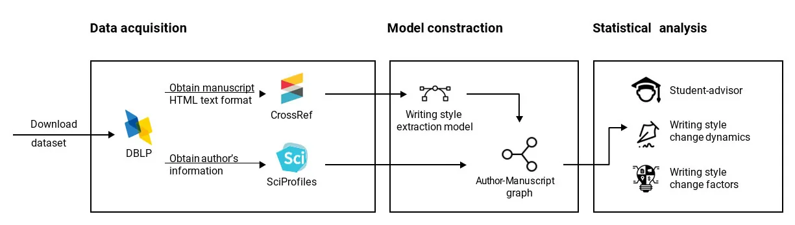
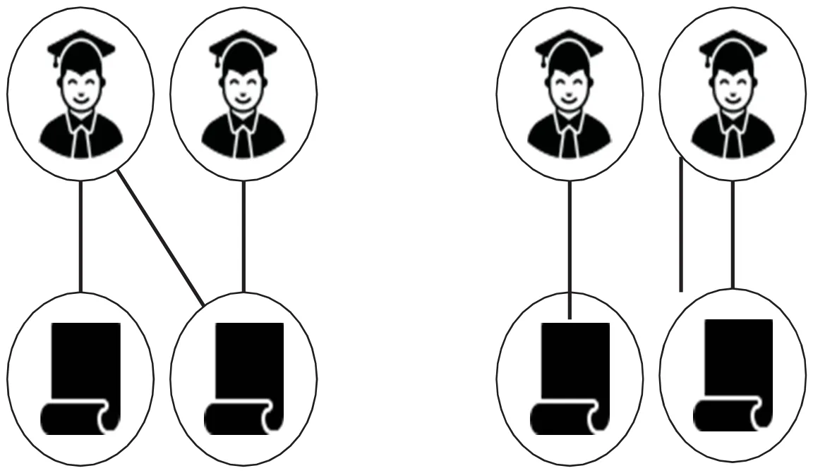
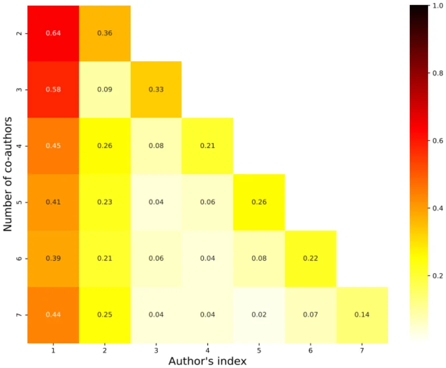
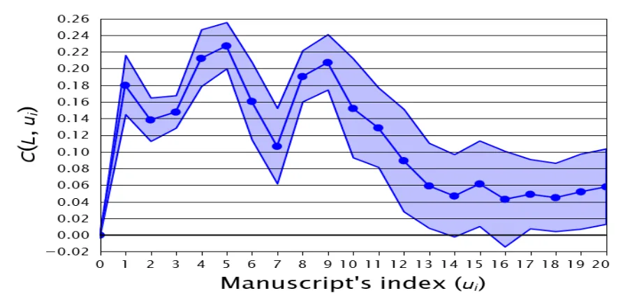
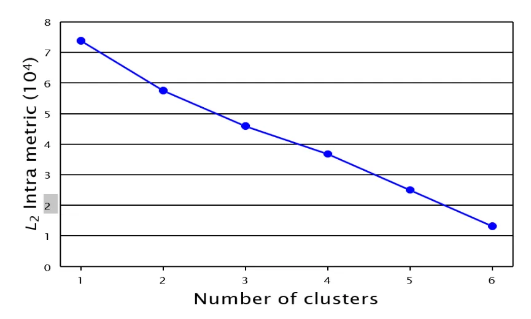
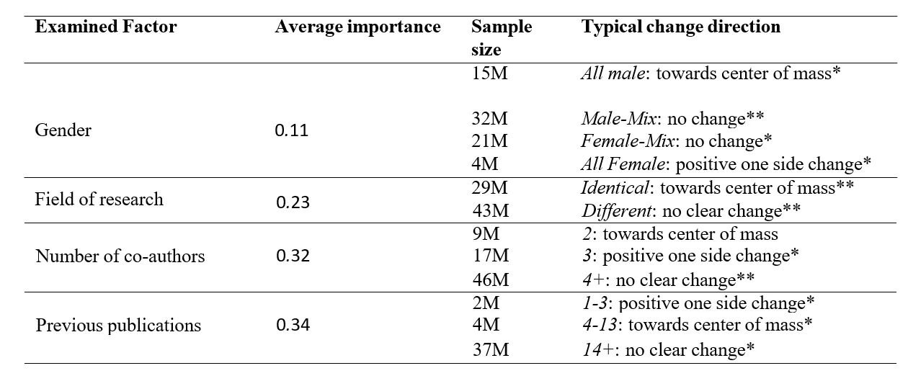
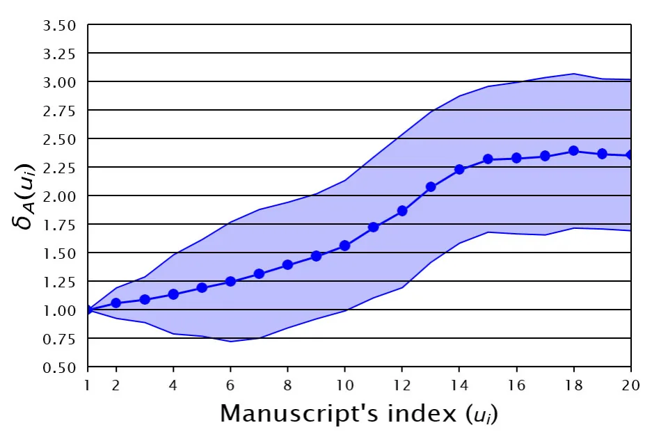
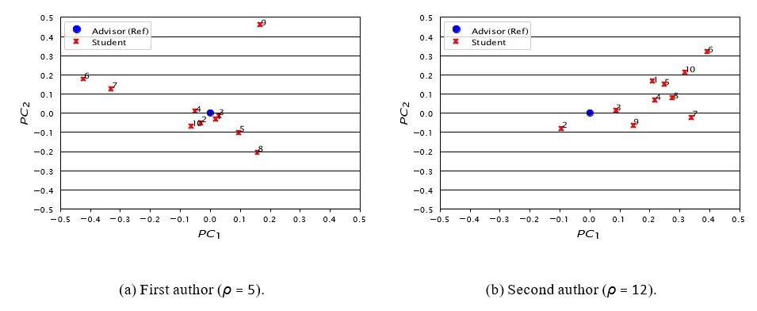

## 1. Introduction

Academic publications play a crucial role in the advancement and dissemination of knowledge and information (Livesey, 1981, Shah et al., 2023). In addition to many discipline-specific factors, such as scientific originality and validity, the way in which the manuscript is written, also known as the manuscript’s style, is pivotal in de- termining its readership, influence, and impact (Xiao and Askin, 2012, Sun and Giles, 2007, Diego et al., 2003, van den Besselaar and Mom, 2022, Sun et al., 2021). Specifically, a manuscript that is well-written, clear, easy to understand, and follows a logical flow and structure usually results in shorter reviewing time, higher read- ership, and greater attention from subsequent literature and, in some cases, from the general and social media (Matsuda and Tardy, 2007, Hartley et al., 2003a, Duszak, 1994, Vysotska et al., 2018). It is important to note that this phenomenon is not unique to academic publications and, in fact, it has been well documented for news pieces (Hendriks et al., 2012), literature (Shiyab and Lynch, 2006), and social media posts (dos Santos et al., 2018), to name a few. Research has shown that, in many cases, scholars present a unique writing style (WS), resulting in im- pressively accurate authorship classification and profiling algorithms (Singh et al., 2021, Koppel and Winter, 2014, Akiva and Koppel, 2012, Koppel and Winter, 2013, Lu et al., 2019). However, as collaboration among scholars has become increasingly prevalent in modern science (Amjad et al., 2017, Wuchty et al., 2007, Zhang et al., 2018), so did the practice of collaborative writing (Holcombe, 2019, Bozeman and Corley, 2004, Zhang et al., 2018), resulting in many co-authored manuscripts having a “mixed style”. Namely, the individual style of each scholar is reflected differently, and to a different extent, in the resulting co-authored manuscripts (Hartley et al., 2003b, Hartley et al., 2001).

Common to the literature in this realm is the focus on manuscripts as the unit of analysis (Song et al., 2023). In other words, past research has predominantly considered each manuscript separately, analyzing its content and/or its’ (co-)authors’ identity or characteristics. However, research in WS considering scholars as the unit of analysis is significantly less prevalent.

WS changes have been extensively investigated from a social, cultural, and professional perspective (Can and Patton, 2004, Snow et al., 2015, McNamara et al., 2010, Crossley et al., 2014a, Allen et al., 2016). For instance, (Zheng et al., 2006) developed a computational model that can detect authors of online messages. The authors show that parameters such as age, gender, and mother tongue are strong indicators, on average, for one’s WS. In a similar manner, (Rubin and Greene, 1992) show that gender is statistically associated with the WS of individuals in multiple types of texts. Moreover, (Rosenthal and McKeown, 2011) show that, at the same point in time, authors from differ- ent ages have different WS. (Haverals et al., 2022) extended this line of work, showing that the same individuals changed their WS as they grew up from

## 89 | Journal of Writing Research

children to adults. To the best of our knowledge, an investigation into how a scholar’s academic WS is evolving and shaping throughout one’s career, especially considering its academic relations with his/her advisors and peers, has yet to be examined in the literature.

Within the larger academic landscape, the study of scholars’ WS has been the focus of a wide variety of prior works which range in both purpose and methodology. For example, the evolution of academic writing style as a whole, and specifically the temporal deviation from formal writing, have been extensively studied (Wheeler et al., 2021, Li, 2022). Similarly, gender-based differences (Lerchenmueller et al., 2019, Kosnik, 2023), age-related shifts (Hartley and Cabanac, 2015, Kosnik and Hamermesh, 2023), methodological influences (Argamon et al., 2008, Dodick et al., 2009) and discipline-specific factors (Gray, 2011, Alluqmani and Shamir, 2018), to name but a few, have been investigated in the context of scholars’ WS. In this work, we seek to extend our existing understanding of scholars’ WS by addressing the following key questions:

- ♣ How do individual scholars’ WSs change over time?
- ♣ How do research students (i.e., advisees) part from their advisors’ WSs?
- ♣ How do scholars’ WSs change following collaborations?

To answer these questions, we develop a computational methodology combining a mathematical temporal graph representation of co-authorship dynamics, natural language processing, and deep learning techniques. Cen- tral to our methodology is the use of a transformer-based model to represent academic manuscripts within a latent space and associate different parts of each text to its most likely author. Through this non-trivial computational embedding, we quantify and study the possible changes in one’s WS. We apply our methodology to real-world, large-scale bibliographic data from the Computer Science (CS) discipline consisting of around 570,000 CS scholars.

The remainder of this manuscript is organized as follows: Section 2 presents the background concerning the computational methods we use in the course of this work. Section 3, details the methods and data used. Section 4 outlines the results obtained from our analysis followed by their discussion in Section 5. Finally, Section 6 draws conclusions, and highlights possible future work avenues.

## 2. Related Work

In this section, we briefly discuss the computational methods used in this study. Initially, we discuss social graph- based models with their mathematical formalization and how they are utilized in practice. Then, we present natural language processing using deep learning methods, in general, and their use of transformers, in particular. Finally, we review the notion WS through the perspective of writing profiles.

LAZEBNIK1 & ROSENFELD A COMPUTATIONAL MODEL FOR WRITING STYLE DYNAMICS | 90

### 2.1 Social graph-based models

Social interactions and communication naturally occur between individuals in a population. The occurrence, rate, and properties of these interactions define complex dynamics in a population that is the core of many areas of science (Tabassum et al., 2018). Mathematically, one can utilize the well-established graph theory framework in order to capture these dynamics. Namely, treating the individuals in a population as nodes of a graph and the interactions between them as edges seems to offer a versatile framework that allows for a a wide range of social interactions to be modeled and investigated (Nettleton, 2013). For example, in the physical realm, graphs that track infection patterns due to social interactions are a powerful tool in epidemiological studies (Lazebnik, 2023). Simi- larly, in the virtual realm, interactions on social media can be used to classify individual personality characteristics (Staiano et al., 2012).

A common graph-based model assumes that individuals do not directly interact with each other but rather interact with so-called “intermediate objects”. Formally, the intermediate object is commonly referred to as “item” and defined as a different type of node in the graph (Pham et al., 2015). More often than not, this defines a bilateral graph with individuals on one side and items on the other. For example, one can consider online text editing platforms such as Google Docs where individuals write together a file. The set of all files and individuals in the system defines the social graph with the individuals conceptually forming one side of the graph and the documents conceptually forming the other. Similarly, in the context of recommendation systems, items such as movies or products on e-commerce platforms can be represented with reviews, ratings, or simply the act of purchasing or watching by users capturing the interactions. In this case, the representation is not only useful for understanding consumer behavior but also instrumental in tailoring personalized experiences based on user-item interaction patterns (Gulati and Eirinaki, 2018).

In this work, social graph-based models with intermediate objects seem to pose a natural modeling option to represent the complex interaction between scholars through manuscript co-authorship.

### 2.2 Natural language processing using deep learning

The field of natural language processing (NLP) covers a broad range of topics related to the computational analysis and interpretation of human languages. This field has progressively embraced a data-driven approach that incor- porates elements of statistics, probability, and machine learning (Otter et al., 2021a). Advances in computational capabilities and the advent of graphical processing units (GPUs) have further propelled the field into the era of deep learning, characterized by the use of complex neural networks (NNs) with potentially billions of adjustable parameters (Raina et al., 2009). Moreover, the modern capability to amass large-scale datasets, thanks to advanced data- 91 | JOURNAL OF WRITING RESEARCH gathering techniques, has made it feasible to train these intricate models (LeCun et al., 2015).

NNs consist of nodes (or neurons) linked together, where each node processes inputs to produce an output through weighted sums and nonlinear transformations. Adjustments to these weights are based on the network’s errors, often using a method known as backpropagation with stochastic gradient descent, which leverages error derivatives (Schmidhuber, 2015). The primary distinctions among neural network types lie in the nodes’ con- nections and the network’s depth. There are multiple types of NNs such as fully-connected, convolutional, and recursive NN, to name a few (Schmidhuber, 2015). In the context of NLP, Recurrent NN (RNN) gains popularity due to its ability to capture temporal information in the data which is found to be useful to also capture the dependency structure of text (Yu et al., 2019). For example, the Long-Short Term Memory (LSTM) NN where the recursive nodes are composed of several individual neurons connected in a manner designed to retain, forget, or expose specific information is widely used for NLP tasks (Yu et al., 2019).

Recently, the concept of attention has been introduced to NN models. Namely, the attention mechanisms dynamically weigh the importance of different input features, allowing the model to focus more on relevant parts of the input data for the task at hand (Vaswani et al., 2017). This innovation gave rise to new NN architecture - transformers. Transformers are sequence-to-sequence models with the ability to handle long-range dependencies (Graves, 2012). An example of such a task is machine translation, where the model is provided with a text in the original language (sequence of words) and required to transform it to a text in the target language (another sequence of words) (Zhao et al., 2023). A popular recent example of a transformer model is the chatGPT model (Wu et al., 2023, Rosenfled and Lazebnik, 2024).

Focusing on transformers, these models are based on the AutoEncoder NN structure (Acheampong et al., 2021). Namely, they consist of an encoder network that compresses the input data into a low-dimensional representa- tion, also known as the latent space, and a decoder network that reconstructs the original data from the com- pressed representation (Dong et al., 2018). The latent space can be used for a variety of tasks instead of the original one as it captures the most prominent and distinctive properties of the data (Shi et al., 2023). For ex- ample, in the context of text analysis, the T5 model (also known as the “Text-to-Text Transfer Transformer”) (Raffel et al., 2020) is a transformer model that trained on 20TB of data and for eight different tasks, to make sure the latent space of this model captures the complexity of natural language. Later works adopted the T5 models for an extensive amount of different tasks such as style transfer (dos Santos et al., 2018). Indeed, multiple studies used transformer-based models for writing-based challenges such as authorship attribution and profiling (Huertas-Tato et al., 2022b, Huertas-Tato et al., 2024). For instance, (Polignano et al., 2020) adopted the popular BERT transformer for the author profiling task and demonstrated its superior performance compared to classical methods that involve manual feature engineering.

LAZEBNIK1 & ROSENFELD A COMPUTATIONAL MODEL FOR WRITING STYLE DYNAMICS | 92

Similarly, (Huertas-Tato et al., 2022a) introduced PART, a model specially designed to learn authorship embedding for authorship attribution.

A popular WS-extracting transformer model is TextSETTR (Rileya et al., 2021). TextSETTR introduces a unique approach to text style computational modeling by using unlabeled text and extracting a style vector from adjacent sentences, leveraging labeled data only at inference. It adapts the T5 architecture for style vector extrac- tion and conditions the decoder for style transfer through “targeted restyling” method. The model employs tunable inference for precise token control and generalizes across multiple style dimensions using few-shot examples. The training of TextSETTR involved fine-tuning a modified T5 model with a style extractor on corrupted input sen- tences, using noise, back-translation, and noisy back-translation tasks to optimize a reconstruction loss. The model’s output retains original content while transferring the style attributes, balancing style transformation with content preservation and maintaining coherence and readability. Due to these favorable properties, TextSETTR was chosen as a central instrument for our work.

Importantly, due to the computational complexity of virtually all transformer models and the high dimension- ality of their latent spaces, they are widely considered to be “black box” models (Terreau et al., 2021). In other words, the resulting embedding is not readily interpretable, specifically in terms of its linguistic properties. Nev- ertheless, recent advances in explainable machine learning may suggest that such interpretation could be achieved in the future (Rao et al., 2022).

### 2.3 Writing profiles

Writing profiles refer to the distinct patterns or characteristics exhibited by individuals or groups in their writing practices (Van Waes and Schellens, 2003). These profiles are often used to understand and categorize various as- pects of writing behavior, such as cognitive processes, stylistic preferences, rhetorical strategies, and genre-specific conventions (Negretti et al., 2023). Writing profiles can be analyzed to identify strengths and weaknesses in writ- ing, to tailor instructional methods, and to enhance writing performance in academic and professional contexts (van der Loo et al., 2018). Specifically, writing profiles include WS and its interaction with content-wise layers of a text (Lavelle, 1997). In the academic writing context, writing profiles are shown to play a central role in the way a manuscript is evaluated and consumed (Xin and Lim, 2023). To this end, (Knight et al., 2020) developed an open-source tool, which provides feedback on rhetorical moves, with a design that allows feedback customization for specific contexts. This way, scholars can improve their text structures and therefore written communication. (Lonka et al., 2014) even show the connection between writing profiles and PhD students’ conceptions of aca- demic writing with their emotional state, further highlighting the unique characteristics of one’s writing profile, in general, and WS, in particular.

## 93 | Journal of Writing Research

Over the years, a growing body of work focused on different properties of both the writing process and the resulting texts (Baker, 2016, Abdel Latif, 2008, Hartley and Branthwaite, 1989, Torrance et al., 2000). For exam- ple, (Chandler, 1992) argues that people differ in their underlying orientation to the experience of using writing media. The authors show that there is a continuous variable describing the WS from “planners” which use the writing process as a tool to record or communicate ideas to “discovers” which see themselves as engaging with the medium as a way of discovering what they think. Similar results were obtained by (Torrance et al., 1994) for U.K. domiciled, social science research students. (Crossley et al., 2014b) identified multiple profiles of successful essays via a cluster analysis approach using linguistic features reported by a variety of NLP tools. The authors identify four main types of styles that differ by their linguistic properties - depiction, academic, accessible, and lexical. (Torrance et al., 1999) establish that student writers develop stable writing strategies with their WS being mostly consistent across two writing activities occurring in a short period of time.

In this study, we adopted a computational WS definition which is based on capturing complex statistical pat- terns in one’s text and extracting the stylistic properties of the text rather than the informative or structural ones inherent to it. Thus, unlike linguistic-based WS definitions, and in particular the notion of writing profiles, the computational WS is not directly associated with a specific level of text (i.e., word, sentence, or paragraph) but rather uses a highly-dimensional and mathematically complex combination of all of these levels. This computa- tional WS approach facilitates a deeper investigation into WS at scale yet limits one’s ability to provide a nuanced and fine-grained linguistic understanding of the studied phenomenon.

## 3. Methods and Materials

Our methodology consists of three phases: First, we rely on the extensive CS literature indexed by the popular DBLP (DataBase systems and Logic Programming) dataset (Aggrawal and Arora, 2016) and retrieve the original manuscripts and author profiles from CrossRef1 and SciProfiles2, respectively.

<figure id="fig-1">

<figcaption>Figure 1. A schematic view of the study’s methodology.</figcaption>
</figure>

LAZEBNIK1 & ROSENFELD A COMPUTATIONAL MODEL FOR WRITING STYLE DYNAMICS | 94

Second, the acquired data is used to populate a time-depended social graph-based mathematical model. Third, the resulting non-trivial model is analyzed to address the three research questions introduced above. Figure 1 presents a schematic view of the study’s methodology.

### 3.1 Data acquisition

The DBLP database is a specialized bibliographic database that provides open bibliographic information on major CS journals and conference proceedings with decent coverage and accuracy (Rosenfeld, 2023). The database was retrieved on March 20th, 2023 resulting in 14,301,639 publications. Using their DOIs (Digital Object Identifiers), 13,874,575 (97%) publications were matched to their original online source using CrossRef. The entire text (in HTML format) was successfully retrieved for 13.2% of these publications, resulting in 1,830,817 texts in total. The entire dataset of publications was authored by 610,281 different authors. Using SciProfiles, 593,513 (97.2%) were matched and their profiles were retrieved. To be exact, if multiple profiles are provided by SciProfile’s API, we checked for each of these profiles if the titles of the manuscripts associated with the author from DBLP are presented. Technically, authors without a full name provided by DBLP are removed from the sample as their SciProfile could not be found. The profile with the highest count of matches is chosen. We filter out scholars who published over 500 manuscripts as well as authors with less than five manuscripts. On average, each author published 23.42 ± 40.44 manuscripts in our data.

### 3.2 Model construction

It is important to note that formally representing the WS of any given text is a challenging task as no clear, agreed- upon, definition of WS is currently available (Hartley et al., 2001). As such, prior computational studies that dealt with large volumes of texts, which are self-evidently infeasible for domain experts to manually tag, adopted a data- driven approach (Gridach, 2020). Specifically, deep-learning-based models are considered state-of-the-art in this realm (Otter et al., 2021b). For our study, we align with prior work and represent a manuscript’s WS using a state- of-the-art model proposed by (Rileya et al., 2021). The adopted model is based on the assumption that large pre- trained text-to-text artificial neural networks encompass the textual WS that can be used to condition the decoder of a style Transfer-based models (Acheampong et al., 2021) through a fine-tuning procedure (Rileya et al., 2021). Technically, a text-to-text transformer model based on the T5 architecture called TextSETTR (Raffel et al., 2020), is adopted. TextSETTR generates a 1024-dimensional vector and accepts an arbitrarily long text using the attention layer in the transformer model. The original developers of the model have shown that the model outperforms the previous models in a wide range of settings. Of interest to our context, the model was shown to align with WS expert opinions more than 80% of the time. This exceptional performance is obtained using the Few-shot machine

## 95 | Journal of Writing Research

learning approach (Xu et al., 2020) which, unlike other approaches such as supervised or unsupervised learning (Jhamtani et al., 2017, Lample et al., 2019), requires very few labeled training examples during inference. Taken jointly, these properties make the proposed model seem especially suited for our research challenge.

By applying the TextSETTR model to a given manuscript we are provided with a representation of that manuscript’s WS. However, for our purposes, we are mainly interested in representing a scholar’s WS. Accordingly, if the manuscript is authored by a single scholar then that manuscript’s WS can be fully attributed to the scholar alone at that time. However, if the manuscript is co-authored by several scholars, the resulting manuscript’s WS is assumed to be a mixture of its co-authors’ prior WSs. In order to disentangle this WS mixture, we assume that each part of the manuscript was written by a single scholar, as is commonly assumed in prior literature (Bevendorff et al., 2021). Accordingly, we perform the following process: First, we divide the manuscript into textual components such that each one presents a distinct, yet consistent, WS. To that end, we utilize the state-of- the-art model proposed by (Singh et al., 2021) which demonstrated 85% accuracy for this task on a large volume of documents. An example of such separation is provided in Appendix A. Once the division into textual components is obtained, we use the TextSETTR model discussed above to get a vector representation of each component in the text separately. Finally, we map each of the resulting WS vectors to their assumed source (i.e., scholar) by matching each vector to the co-author who is currently represented by the most similar WS vector using a standard Euclidean distance metric3. Given the inherent complexity of correctly assigning authorship in co-authored publications, we verify the adequacy of the above process in Section 4. If a scholar is associated with a single component, then that component’s WS is treated as that scholar’s WS at that point in time. However, if more than a single component is associated with a scholar, then the proportional average of the components’ WS vectors is used instead. Clearly, to perform the last step (i.e., components to scholars mapping), each co-author’s prior WS is needed. Assuming a scholar has at least one single-authored manuscript, that manuscript’s WS can be used as a starting point for our iterative procedure. Specifically, starting from a scholar’s first solo-authored manuscript, the identified WS at that time point is iteratively propagated to the proceeding and precluding manuscripts according to the procedure outlined above. In other words, starting at each scholar’s first single-authored manuscript, we use the obtained WS to assign the components (and their WS) of the immediately proceeding and precluding manuscripts which, in turn, are used for their proceeding and precluding manuscripts, and so on. Scholars without any single-authored publications were omitted from further consideration (less than 13%).

LAZEBNIK1 & ROSENFELD A COMPUTATIONAL MODEL FOR WRITING STYLE DYNAMICS | 96

### 3.3 Author-Manuscript Graph

To capture the collaboration and WS dynamics over time, we define a graph, *G* = (*S, M, E)*, where each scholar is represented as a node in the graph *s* ∈ *S*, each manuscript is represented as a different type of node in the graph *m* ∈ *M* , and a directed edge *e* ∈ E ⊆ S *X M* connects each scholar to each of his/her manuscripts. Formally, a scholar node *s* ∈ *S* is defined by the tuple *s* := (*f, g*) where *f* is the scholar’s main field of the study as indicated by the name of its primary-associated department (e.g., computer science, mathematics, physics)4 and *g* is the scholar’s gender that can take one of the values *male, female, unknown* . The scholar’s gender is obtained based on a query to the model proposed by (Hu et al., 2021) which was trained on around 100 million pairs of names and gender association, as collected by *Yahoo!*. A scholar’s gender is taken only if the model’s prediction confidence is higher than 95% (true for 94.6% of the scholars). A manuscript node m ∈ M is defined by the WS vectors associated with the manuscript’s components and the time the manuscript has been published, denoted by ξ and t, respectively. Last, an edge *e* = (*s, m*) ∈ *E* indicates that a scholar s is a (co-)author of the manuscript m. Overall, we find the main field of study of 81.3% of the scholars and the gender of 94.6%. In total, 80.5% of scholars’ profiles included both parameters. Figure 2 presents a schematic view of the author-manuscript graph where the graph has a bipartite representation with authors on one side and manuscripts on the other. An edge indicates a scholar is listed as a co-author of a manuscript.

<figure id="fig-2">

<figcaption>Figure 2: A schematic view of the author-manuscript graph.</figcaption>
</figure>

97 | JOURNAL OF WRITING RESEARCH

### 3.4 Writing style analysis

The statistical analysis is divided into three parts, each corresponding to one of our primary research questions.

**WS Dynamics**: To quantify the WS change over time for a given scholar, we define a function *C* : Rκ×N*x* RN → R+ where *κ* is the yearly average number (rounded to the closest natural number) of manuscripts an author publishes in a year. In addition, *N* ∈ N is the WS representation vector’s dimension. Formally, *C* accepts a list (L) of |L| = κ ∈ N WS vectors corresponding to κ WS vectors published before a reference WS, *u*, which is also provided to *C*: where ||*x*|| is the *L*1 norm of a vector *x*. Intuitively, the above calculation quantifies the extent to which a currently exhibited WS is different compared to former WSs presented roughly during the preceding year.

**WS Emergence**: To capture how research students’ WS emerges, one needs to determine who were a student’s advisors and when that student graduated. While some crowd-sourced advisor-advisee data is available by the Mathematics Genealogy Project5 and Academic Family Tree6, from our preliminary investigation, it does not cover a significant portion of our data. As such, we adopt a heuristic approach which was successfully applied in prior works (e.g., (Suresh et al., 2007)) where we consider the individual(s) a scholar has co-authored the most manuscripts during their first three publications years as their advisor(s). Note that this simple heuristic may capture both “official” and “unoffical” advisors alike, which seems favorable for our purposes. Formally, let us denote the set of manuscripts the student and advisor(s) co-authored during the first three years to be A and ρ := |A| ∈ N. Thus, the student’s exposure to the advisor’s WS is set to be the average WS of the advisor from the manuscripts in set A. Hence, the student’s style emergence function with respect to his/her advisor(s) (A) is defined as follows:

where *u* ∈ RN is the student’s WS vector one wishes to compare with the baseline WS which is computed by . . Since we are interested in the temporal change of a scholar’s WS, let us define ui to be a scholar’s ith WS vector such that *u*0 is the first manuscript the scholar published following the latest manuscript in A. Intuitively, we compare a currently exhibited WS to the advisor’s average WS presented to the student as part of their co-authored manuscripts during the student’s training period.

LAZEBNIK1 & ROSENFELD A COMPUTATIONAL MODEL FOR WRITING STYLE DYNAMICS | 98

**WS and Collaborations**: For each co-authored manuscript, we extract the following features: for each co- author, we retrieve the main field of study (f ), gender (g), and the number of previously published manuscripts. The number of co-authors listed in the manuscript’s byline is also extracted. These values are considered as a feature vector x for our learning model. We define the scholar’s WS change which was observed due to a co- authored manuscript as defined by Eq. (1), to be the target value – denoted as y. Since the number of co-authors can be arbitrary, we set x’s size to be the maximal size required by any manuscript in the database and padded the non-required positions in x accordingly.

The resulting dataset of samples, consisting of the features of each co-author as input and the observed WS change as an output, is fed to a Tree-based Pipeline Optimization Tool (TPOT) automatic machine learning model (AutoML) (Olson and Moore, 2016, Lazebnik and Somech, 2022) that is especially suited for complex regression tasks and seeks to minimize the predictions’ mean absolute error. Feature importance is computed and reported to determine the perceived influence each parameter had on the prediction capability of the model (Li et al., 2020).

In addition, we classify each WS change (i.e., y) to one of the following types: 1) towards the center of mass (i.e., all co-authors’ WS move closer to the average WS of the group); 2) positive one-side change (i.e., the scholar in question moves closer to the average WS of the group but the prior criterion is not met); 3) negative one-side change (i.e., the scholar in question moves away from the average WS of the group) and 4) no clear change (i.e., if no other criteria are met). Accordingly, we perform a statistical analysis to determine if certain circumstances, as detailed in the following analysis, are statistically associated with different WS change types using an ANOVA test with post-hoc Tukey correction.

## 4. Results

In the following, we first verify the adequacy of our authorship assignment process. Then, we address the three main research questions defined for this study.

**Authorship Assignment**: In order to verify the adequacy of our authorship assignments, we perform two anal- yses: First, we compare the resulting assignments to a na¨ve method which assigns WS vectors uniformly at random to the manuscript’s co-authors. Second, we show that the resulting assignments are generally aligned with the evidence-based expectation of the authors’ writing distribution.

Specifically, we repeated the authorship assignment process but this time, each WS vector was mapped to a random co-author. Now, for each author, we compute the radius of the set of assigned WS vectors (i.e., the average distance from the center of mass of the set) twice; once using our original assignments and once using the na¨ve approach. Clearly, a smaller radius is an indicator of stronger cohesiveness. Since the random 99 | JOURNAL OF WRITING RESEARCH assignment was performed 100 times, the best-performing assignment was selected. Using a one-sided paired t-test, the results show that our assignment brings about a statistically significant lower average radius at p < 0.005. Moreover, as shown in Figure 3, our assignment suggests that the first author is responsible for most of the writing regardless of the number of co-authors (ranging from 64% of the text in the case of two co-authors to 39% of the text in the case of six co-authors). In addition, the second and last co-authors seem to contribute significantly more to the writing compared to other co-authors (if such exist). These results seem to align with the expected distribution in academic co-authorship as observed in prior literature (Correa Jr. et al., 2017, Lazebnik et al., 2023).

<figure id="fig-3">

<figcaption>Figure 3: Average portion of text, in length, associated with each co-author considering the number of co-authors.</figcaption>
</figure>

**WS Dynamics**: Figure 4 presents the authors’ WS changes over manuscripts, where |L| = 3. As one can notice, for roughly the first 12 published manuscripts, a scholar’s WS varies significantly from one manuscript to the next. From that point on, the scholar’s WS is *not* constant (i.e., the WS change is not zero) yet the WS change seems to be mild and relatively stable over time. That is, the measured change in WS from one manuscript to LAZEBNIK1 & ROSENFELD A COMPUTATIONAL MODEL FOR WRITING STYLE DYNAMICS | 100 the next remains roughly steady. In order to mathematically capture this phenomenon, we introduce a threshold over the WS change to determine if and when a scholar’s WS has converged. Formally, the convergence point, α ∈ N, for a threshold ω ∈ R +, is defined as The results of this analysis are summarized in Table 1. Note that since not all scholars converge for a given threshold ω, we stated the percentage of scholars that did coverage given the specified threshold.

<figure class="table-figure" id="table-1">
<figcaption>Table 1: Writing style converge. The results are reported as the mean standard deviation of the convergence point (top row) and the percentage of converging scholars (bottom row) for each examined threshold (columns).</figcaption>

<table><tr><td>Threshold (ω)</td><td>0.01</td><td>0.02</td><td>0.03</td><td>0.04</td><td>0.05</td></tr><tr><td>Convergance point (α)</td><td>13.3 ± 6.7</td><td>10.8 ± 4.9</td><td>8.5 ± 4.2</td><td>7.1 ± 3.6</td><td>5.2 ± 3.0</td></tr><tr><td>Convergence (%)</td><td>89.4</td><td>92.3</td><td>95.7</td><td>96.5</td><td>96.9</td></tr></table>

</figure>

One may speculate that the WS change dynamics may be significantly different for different scholars. In order to examine this hypothesis, we used the classic k-mean algorithm adapted to time series data (Niennattrakul and Ratanamahatana, 2007) using the popular tslearn library (Tavenard et al., 2020) with the expectations of finding significantly different groups of scholars in terms of WS change dynamics. Figure 5 shows the *L*2 intra metric for a different number of clusters on our data. Commonly, when the data is inherently divided into *k* > 1 clusters, one expects to witness an “elbow” in the graph which reveals a point in which the decrease in the intra metric changes from large to small.

<figure id="fig-4">

<figcaption>Figure 4: Changes in writing style from one manuscript to the next. The results are reported as the mean standard deviation for the entire studied population..</figcaption>
</figure>

101 | JOURNAL OF WRITING RESEARCH However, as shown in Figure 4, this is not the case here. Hence, the data does not seem to support this hypothesis.

**WS Emergence:** Figure 6 presents the students’ WS emergence from the student’s graduation. The figure depicts a sigmoid-like increase in the WS difference from one’s advisor(s) over manuscripts. Similarly to the analysis of WS change over time, roughly around the graduate’s 14th publication, the difference from one’s advisor(s) seems to converge to a relatively steady distance. In other words, on average, after 14 publications, the difference in WS between a graduate and his/her advisor is roughly stable.

Let us consider the two authors of this manuscript as illustrative examples. Figure 7 presents a 2-d standard PCA dimensionality reduction projection of each of their first 10 publications after graduation compared to their respective advisors’ WS during their training periods. The second author (presented on the right), demonstrates a rather consistent WS emergence pattern that moves away from his advisor’s WS in the same direction over time. However, the first author (presented on the left) demonstrates a more cluttered pattern without a clear direction over time.

<figure id="fig-5">

<figcaption>Figure 5: Clustering scholars based on their WS change dynamics. The Elbow graph presents the results of the k-means clustering method with the <em>L</em>2 distance. No apparent elbow point is observed.</figcaption>
</figure>

**WS and Collaboration**: Since the number of features is considerably large due to the arbitrary number of co- authors in each manuscript, we focused on the four factors summarized in Table 2. Specifically, we first consider the genders involved in the co-authored manuscript, and for each examined scholar we classify each co-authored manuscript into one of four categories: 1) All male (i.e., all co-authors are male); 2) Male- LAZEBNIK1 & ROSENFELD A COMPUTATIONAL MODEL FOR WRITING STYLE DYNAMICS | 102

Mix (i.e., the scholar in question is Male and the remaining co-authors consist of both male and female co-authors); 3) Female-Mix (i.e., the scholar in question is Female and the remaining co-authors consist of both male and female co-authors); 4) All female (i.e., all co-authors are female). We then consider whether the field of research of all co-authors is the same or not (acknowledging minor differences such as word order and the insignificance of generic terms such as “department” or “faculty”). The “number of co-authors” factor refers to the number of authors listed in a manuscript’s byline and the previous publications factor refers to the number of prior publications made by the scholar in question. For each of these factors, the average importance of changing one’s WS is presented. In addition, the statistical relation between each value and a specific type of WS change is reported.

<figure class="table-figure" id="table-2">
<figcaption>Table 2: For each examined factor (rows) we report the estimated importance in explaining the WS change ob- served as a result of a joint publication and the statistical association with a specific type of WS change. Statisti- cally significant results are marked by * for p ≤ 0.05 and ** for p ≤ 0.01</figcaption>

</figure>

## 5. Discussion

Let us revisit the original research questions posed for this study.

First, we have asked “How do individual scholars’ WS change over time?”. The results seem to indicate that the vast majority of scholars exhibit an evolving WS which, at first, presents a cluttered behavior that soon converges to mild and steady changes around their 13th manuscript. The fact that one’s WS converges to small and steady changes between one manuscript to the next is somewhat intuitive as it reflects the process of forming one’s unique academic personality, style, and practices which are ever-evolving. However, the fact that this convergence occurs early in one’s career is, to us, very surprising. In our data, on average, convergence occurs after four publication years. This means that the scholars’ WS “learning curve” has flattened extremely early. One possible explanation may be the infamous pressure to publish extensively during

## 103 | Journal of Writing Research

one’s first years in academia, partially, to secure a permanent position (Waaijer et al., 2017). Specifically, during these first years a scholar may avoid the long, arguably needed, process of perfecting their WS in exchange for improving their body of work.

Second, we have asked “How do research students (i.e., advisees) part from their advisors’ WS?”. The results seem to suggest that the distance between one’s WS and his/her advisors’ WS is increasing in a sigmoid-like fashion until convergence is reached around one’s 14th publication. Interestingly, this convergence seems to agree with the one obtained from the previous analysis as well. The observed pattern seems to align with the histori- cally observed dynamics of apprenticeship (Fuller and Unwin, 2009). The results also demonstrate an increasing pattern in standard deviation presented in Fig. 6. These indicate that one’s departure from his/her advisors’ WS is very personal, aligning with the results of a recent study dedicated to the advisor-advisee collaboration patterns in Computer Science (Rosenfeld and Maksimov, 2022). A complimentary explanation may posit that the WS change should be partially associated with the possible change in research focus and theme often observed in young re- searchers (Chatzea et al., 2024). That is, as young researcher academically mature, they often find their unique research themes which may entail some writing style nuances. Given the complexities associated with identify- ing, measuring, and quantifying changes in one’s research themes, and more generally in sub-field demarcation (Aviv-Reuven and Rosenfeld, 2023a), we believe that this possible explanation points to a promising future work direction.

Last, we have asked “How do scholars’ WSs change following collaborations?”. The results point to several statistically significant factors that seem to govern the way collaborations influence one’s WS. Starting with gender, it is found to be the least influential factor out of the examined ones. Interestingly, while the interactions between males and females are symmetric in the sense that, statistically, they do not have a specific way of changing one’s WS, interactions between the same gender result in different outcomes. This outcome agrees with a wide range of prior studies about collaborations and gender which showed that cross-gender collaboration results in asymmetric influence on the genders (Abramo et al., 2019, Leman et al., 2011, Nunkoo et al., 2020). The field of research seems to play a slightly more central role. Specifically, co-authors from the same field are well influenced by each other’s WS while co-authors from different fields are not. This result is, perhaps, counter-intuitive as one could expect scholars from different disciplines to have a greater impact on each other as they are accustomed to slightly different writing standards and practices.

However, this result is similar in spirit to how scholars react and adopt ideas from peers within and outside their research field (Lazebnik et al., 2022). In addition, the number of co-authors encompasses great importance in predicting the WS change due to collaboration. Albeit statistically insignificant, when there are only two co-authors, both seem to learn from each other and slightly adopt each other’s WS.

LAZEBNIK1 & ROSENFELD A COMPUTATIONAL MODEL FOR WRITING STYLE DYNAMICS | 104

<figure id="fig-6">

<figcaption>Figure 6: WS difference between a graduate and his/her advisor over manuscripts. The results are reported as the mean ± standard deviation over the entire population.</figcaption>
</figure>

<figure id="fig-7">

<figcaption>Figure 7: Scholars’ manuscripts published after graduation are marked by ’x’ and numbered by order of publication.</figcaption>
</figure>

## 105 | Journal of Writing Research

\-However, when three co-authors are concerned, and especially when more than three are considered, scholars are less influenced by their co-authors’ WS. The most significant factor is the previous number of manuscripts a scholar has. Similar to the results discussed earlier for the student-advisor dynamics, young scholars (in terms of published manuscripts) tend to be more influenced by others’ WS compared to more experienced authors which have already established a personal WS and thus are less prone to changes.

## 6. Conclusions

In this study, we explored how scholars’ writing styles evolve throughout their careers focusing on their academic relations with their advisors and peers. To this end, we proposed and implemented a computational framework that captures how scholars’ WS changes over time due to co-authorship and advisor-advisee relationships. The obtained results point to several fundamental phenomena: First, we find that for most scholars, writing style tends to converge early in their career (around their 13th publication). Similarly, for most scholars, the departure from their advisor’s writing style seems to converge roughly after 14 publications. In the same vein, we find that the writing style of less seasoned scholars tends to be more influenced by their collaborators’ styles than others. Other collaboration characteristics, such as gender, discipline, and the number of co-authors, were also linked with the changes in one’s writing style, albeit to a lower extent. Taken jointly, in addition to their fundamental role in understanding academic WS dynamics, these results can be instrumental in enhancing Ph.D. and young faculty programs. Practical steps may include academic writing workshops and seminars for those who struggle to find their own writing style, encouragement and assistance in pursuing one’s own work and writing style during their training or early on in their careers, and the promotion of collaborations with accomplished writers from whom young scholars can learn, to name a few.

It is important to note that the proposed model and analysis are not without limitations. First, our analysis focuses on the Computer Science discipline. In future work, we intend to extend our analysis to include additional disciplines that need not necessarily align with the practices and standards of Computer Science (e.g., Humanities and Social Sciences). Second, several parts of our implementation, such as the attribution of specific parts of a text to co-authors, are open challenges in the literature and cannot be deemed accurate almost by definition. Thus, the raw results used for our analysis are not without noise and errors. Notably, name disambiguation and gender inference in our data are challenging since DBLP provides only the author’s name (and his/her list of CS publications) as an indicator of their identity and gender. As such, authors with identical full names are possibly inaccurately considered as one author, and gender may not be inferred for authors with unisex names. Similarly, since our analysis considers only a subset of the DBLP-indexed data (see Data acquisition above), it may inadvertently LAZEBNIK1 & ROSENFELD A COMPUTATIONAL MODEL FOR WRITING STYLE DYNAMICS | 106 introduce some form of data-selection bias. Improving these components could lead to more robust outcomes and conclusions. One possible remedy for this challenge is to limit future investigations to scholars working in a specific sub-field for whom data quality control is more manageable. However, the delineation of a specific scientific sub-field is, itself, unclear and journals and conferences’ boundaries need not necessarily align with those of any given sub-field (Aviv-Reuven and Rosenfeld, 2023b). We intend to pursue such a non-trivial investigation in future work. Additionally, the proposed analysis does not take into consideration additional social and cultural features that might also govern scholars’ WS and its changes (Savchenko and Lazebnik, 2022). For example, a scholar’s nationality may likely play a central role in shaping his/her WS and its dynamics. We intend to explore this and additional socio-demographic features in the future. Moreover, we believe that a complementary line of work that adopts a more classic linguistic-based approach to model and analyze scholars’ writing style dynamics could be pursued based on the results of this study to further advance and deepen our understanding of this complex phenomenon. In particular, due to the “black-box” nature of the WS definition used in this study, our ability to pin-point the linguistic and artistic properties of the WS dynamics is currently limited. Finally, with the emergence of Large Language Models (LLMs) (Yao et al., 2024, Thirunavukarasu et al., 2023) and their usage in academic writing (Lazebnik and Rosenfeld, 2024, Potter and Palmer, 2023), a natural extension of this study may include LLMs as potentially implicit co-authors of a manuscript.

## Notes

- 1. https://api.crossref.org
- 2. https://sciprofiles.com
- 3. Unlikely ties may result in a single component being assigned to multiple co-authors. 4. We extracted this information by searching the scholar’s name in Google and retrieving the data from the first link, followed by a manual regular expression data standardization.
- 5. https://www.genealogy.math.ndsu.nodak.edu
- 6. https://academictree.org

## Declarations

### Funding

This research did not receive any specific grant from funding agencies in the public, commercial, or not-for-profit sectors.

### Conflicts of interest/Competing interests

None.

107 | JOURNAL OF WRITING RESEARCH

### Data availability

The data that has been used is presented in the manuscript with the relevant sources.

### Author contribution

Teddy Lazebnik: Conceptualization, Methodology, Software, Formal analysis, Investigation, Data Curation, Writ- ing - Original Draft, Visualization. Ariel Rosenfeld: Conceptualization, Validation, Investigation, Writing - Original Draft, Writing - Review & Editing.

**Appendix A: An example of the similar writting style (WS) splitting process**

”Botanical-epidemiological models (BEMs) are special mathematical models that are used for the study of epidemiological dynamics in plant populations [25, 26, 27, 28]. These models are used to investigate factors that potentially contribute to the transmission and spread of diseases, as well as to predict the potential impacts of these diseases on crop yields and quality, food security, and many more [29, 30, 31, 32]. BEMs share common fea- tures and properties with animal and human-focused epidemiological models such as epidemiological states and infection mechanisms [33, 34, 35]. As such, it is common to find BEMs that are based on the popular Susceptible- Infected-Recovered (SIR) model proposed by [36] for a human population. However, when tested on historical data, these SIR-based models demonstrate limited capabilities due to their over-simplicity and lack of considera- tion for the unique properties of the plant population and plant-based pathogens [37]. Over time, researchers have been developing more complex and sophisticated BEMs that incorporate novel factors such as plant spatial distri- bution, host resistance, and pathogen virulence. For instance, [38] used Gaussian interaction and discretized SIR models to analyze disease spread in spatial populations with constant populations in 2-dimentional patches. Daily neighborhood interactions and contagion rates impact disease spread, with results indicating multiple waves with increasing size and a contagion rate determined by distance from the origin. Similarly, [39] used a spatio-temporal extended SIR epidemiological model with a non-linear output economic model to model the profit from a farm of plants during a botanical pandemic. In [40], the authors analyzed the stability, existence of a periodic solution, and coexistence of multiple strains in a multistrain Susceptible-Infected-Susceptible (SIS) epidemic model. Generally speaking, extended SIR-based models, with unique properties to the pathogen, plant, and environment are taken into consideration for multiple scenarios, providing decent prediction capabilities [41, 47, 48, 49, 50, 51, 52, 53, 54, 42, 43, 44, 45, 46]. The adoption of a model from one pathogen or plant to another is challenging due to the unique properties each combination of plant and pathogen has. Focusing on CLR dynamics, at a high level, the disease’s local spread follows two stages that are similar to other diseases directly transmitted [55]. During the first stage, wind-carried urediniospores land on coffee farms and penetrate the stomata on the underside of the coffee leaves. Then, the urediniospores grow haustoria to extract nutrients from the leaf tissue, exiting again through the stomata and producing more spores. Pending, in the second stage, the urediniospores are dispersed to nearby coffee plants either through direct contact, water splash, or turbulent wind. It is also possible for the spores to be lifted into the atmosphere and contribute to the disease’s spread in a larger area.”

Such that the red text indicates the first author while the blue text indicates the second author.

## References

- Abdel Latif, M. M. (2008). A state-of-the-art review of the real-time computer-aided study of the writing process. International Journal of English Studies, 8(1á), 29–50.
- Abramo, G., D’Angelo, C., & Di Costa, F. (2019). A gender analysis of top scientists’ collaboration behavior: evidence from italy. Scientometrics, 120, 405–418. [doi:10.1007/s11192-019-03136-6](https://doi.org/10.1007/s11192-019-03136-6)
- Acheampong, F. A., Nunoo-Mensah, H., & Chen, W. (2021). Transformer models for text-based emotion detection: a review of bert-based approaches. Artif Intell Rev, 54, 5789–5829 [doi:10.1007/s10462-021-09958-2](https://doi.org/10.1007/s10462-021-09958-2)
- Aggrawal, N., & Arora, A. (2016). Visualization, analysis and structural pattern infusion of dblp co-authorship network using gephi. In 2016 2nd International Conference on Next Generation Computing Technologies (NGCT), (pp. 494–500). [doi:10.1109/ngct.2016.7877466](https://doi.org/10.1109/ngct.2016.7877466)
- Akiva, N., & Koppel, M. (2012). Identifying distinct components of a multi-author document. In 2012 European Intelligence and Security Informatics Conference, (pp. 205–209). [doi:10.1109/eisic.2012.16](https://doi.org/10.1109/eisic.2012.16)
- Allen, L. K., Snow, E. L., & McNamara, D. S. (2016). The narrative waltz: The role of flexibility in writing proficiency. Journal of Educational Psychology, 108(7á), 911–924. [doi:10.1037/edu0000109](https://doi.org/10.1037/edu0000109)
- Alluqmani, A., & Shamir, L. (2018). Writing styles in different scientific disci- plines: a data science approach. Scientometrics, 115(2á), 1071–1085. [doi:10.1007/s11192-018-2688-8](https://doi.org/10.1007/s11192-018-2688-8)
- Amjad, T., Ding, Y., Xu, J., Zhang, C., Daud, A., Tang, J., & Song, M. (2017). Standing on the shoulders of giants. Journal of Informetrics, 11(1á), 307–323. [doi:10.1016/j.joi.2017.01.004](https://doi.org/10.1016/j.joi.2017.01.004)
- Argamon, S., Dodick, J., & Chase, P. (2008). Language use reflects scientific methodol- ogy: A corpus-based study of peer-reviewed journal articles. Scientometrics, 75(2á), 203–238. [doi:10.1007/s11192-022-04576-3](https://doi.org/10.1007/s11192-022-04576-3)
- Aviv-Reuven, S., & Rosenfeld, A. (2023a). A logical set theory approach to journal subject classification analysis: intra-system irregularities and inter-system discrepancies in web of science and scopus. Scientometrics, 128, 157–175. [doi:10.1007/s11192-022-04576-3](https://doi.org/10.1007/s11192-022-04576-3)
- Aviv-Reuven, S., & Rosenfeld, A. (2023b). A logical set theory approach to journal subject classification analysis: intra-system irregularities and inter-system discrepancies in web of science and scopus. Scientometrics, 128(1á), 157–175. [doi:10.1007/s11192-022-04576-3](https://doi.org/10.1007/s11192-022-04576-3)
- Baker, K. M. (2016). Peer review as a strategy for improving students’ writing process. Active Learning in Higher Education, 17(3á), 179–192. [doi:10.1177/1469787416654794](https://doi.org/10.1177/1469787416654794)
- Bevendorff, J., Chulvi, B., De La Pen˜a Sarrace´n, G. L., Kestemont, M., Manjavacas, E., Markov, I., Mayerl, M., Potthast, M., Rangel, F., Rosso, P., Stamatatos, E., Stein, B., Wiegmann, M., Wolska, M., & Zangerle, E. (2021). Overview of pan 2021: Authorship verification, profiling hate speech spreaders on twitter, & style change detection. In Candan, K. S., Ionescu, B., LAZEBNIK1 & ROSENFELD A COMPUTATIONAL MODEL FOR WRITING STYLE DYNAMICS | 108 Goeuriot, L., Larsen, B., Mu¨ller, H., Joly, A., Maistro, M., Piroi, F., Faggioli, G., & Ferro, N., editors, Experimental IR Meets Multilinguality, Multimodality, and Interaction, (pp. 419–431). Springer International Publishing. [doi:10.1007/978-3-030-85251-1_26](https://doi.org/10.1007/978-3-030-85251-1_26)
- Bozeman, B., & Corley, E. (2004). Scientists’ collaboration strategies: implica- tions for scientific and technical human capital. Research policy, 33(4á), 599–616. [doi:10.1016/j.respol.2004.01.008](https://doi.org/10.1016/j.respol.2004.01.008)
- Can, F., & Patton, J. M. (2004). Change of writing style with time. Computers and the Humanities, 38, 61–82. [doi:10.1023/b:chum.0000009225.28847.77](https://doi.org/10.1023/b:chum.0000009225.28847.77)
- Chandler, D. (1992). The phenomenology of writing by hand. Intelligent Tutoring Media, 3(2–3á), 65–74. [doi:10.1080/14626269209408310](https://doi.org/10.1080/14626269209408310)
- Chatzea, V.-E., Mechili, E. A., Melidoniotis, E., Petrougaki, E., Nikiforidis, G., Argyriadis, A., & Sifaki-Pistolla, D. (2024). Recommendations for young researchers on how to better advance their scientific career: A systematic review. Population Medicine, 4. [doi:10.18332/popmed/152571](https://doi.org/10.18332/popmed/152571)
- Correa Jr., E. A., Silva, F. N., da F. Costa, L., & Amancio, D. R. (2017). Patterns of authors contribution in scientific manuscripts. Journal of Informetrics, 11(2á), 498–510. [doi:10.1016/j.joi.2017.03.003](https://doi.org/10.1016/j.joi.2017.03.003)
- Crossley, S. A., Roscoe, R., & McNamara, D. S. (2014). What is successful writing? an investigation into the multiple ways writers can write successful essays. Written Communication, 31, 184– 214. [doi:10.1177/0741088314526354](https://doi.org/10.1177/0741088314526354)
- Diego, M. A., Field, T. M., & Sanders, C. E. (2003). Academic performance, popularity, and depression predict adolescent substance use. Adolescence, 38, 149.
- Dodick, J., Argamon, S., & Chase, P. (2009). Understanding scientific methodology in the historical and experimental sciences via language analysis. Science & Education, 18, 985–1004. [doi:10.1007/s11191-008-9146-6](https://doi.org/10.1007/s11191-008-9146-6)
- Dong, G., Liao, G., Liu, H., & Kuang, G. (2018). A review of the autoencoder and its vari- ants: A comparative perspective from target recognition in synthetic-aperture radar images. IEEE Geoscience and Remote Sensing Magazine, 6(3á), 44–68. [doi:10.1109/mgrs.2018.2853555](https://doi.org/10.1109/mgrs.2018.2853555)
- dos Santos, C. N., Melnyk, I., & Padhi, I. (2018). Fighting offensive language on social media with unsupervised text style transfer. arXiv. [doi:10.18653/v1/p18-2031](https://doi.org/10.18653/v1/p18-2031)
- Duszak, A. (1994). Academic discourse and intellectual styles. Journal of Pragmatics, 21(3á), 291– 313. [doi:10.1016/0378-2166(94)90003-5](https://doi.org/10.1016/0378-2166%2894%2990003-5)
- Fuller, A., & Unwin, L. (2009). Change and continuity in apprenticeship: the re- silience of a model of learning. Journal of Education and Work, 22(5á), 405–416. [doi:10.1080/13639080903454043](https://doi.org/10.1080/13639080903454043)
- Graves, A. (2012). Sequence Transduction with Recurrent Neural Networks. arXiv.
- Gray, B. E. (2011). Exploring academic writing through corpus linguistics: When discipline tells only part of the story. PhD thesis, Northern Arizona University.
- Gridach, M. (2020). A framework based on (probabilistic) soft logic and neural network for NLP. Applied Soft Computing, 93:106232.
- Gulati, A., & Eirinaki, M. (2018). Influence propagation for social graph-based recommendations. In 2018 IEEE International Conference on Big Data (Big Data), (pp. 2180–2189). [doi:10.1109/bigdata.2018.8622213](https://doi.org/10.1109/bigdata.2018.8622213)
- Hartley, J., & Branthwaite, A. (1989). The psychologist as wordsmith: A ques- tionnaire study of the writing strategies of productive british psychologists. Higher Education, 18, 423–452. [doi:10.1007/bf00140748](https://doi.org/10.1007/bf00140748)
- Hartley, J., & Cabanac, G. (2015). An academic odyssey: Writing over time. Scientometrics, 103, 1073–1082. [doi:10.1007/s11192-015-1562-1](https://doi.org/10.1007/s11192-015-1562-1)
- 109 | JOURNAL OF WRITING RESEARCH
- Hartley, J., Howe, M., & McKeachie, W. (2001). Writing through time: longitudinal studies of the effects of new technology on writing. British Journal of Educational Technology, 32(2á), 141– 151. [doi:10.1111/1467-8535.00185](https://doi.org/10.1111/1467-8535.00185)
- Hartley, J., Pennebaker, J. W., & Fox, C. (2003a). Abstracts, introductions and discus- sions: How far do they differ in style? Scientometrics, 57, 389–398.
- Hartley, J., Pennebaker, J. W., & Fox, C. (2003b). Using new technology to assess the academic writing styles of male and female pairs and individuals. Journal of Technical Writing and Communi cation, 33(3á), 243–261. [doi:10.2190/9vpn-rrx9-g0uf-cj5x](https://doi.org/10.2190/9vpn-rrx9-g0uf-cj5x)
- Haverals, W., Geybels, L., & Joosen, V. (2022). A style for every age: A stylometric inquiry into crosswriters for children, adolescents, and adults. Language and Literature, 31(1á), 62–84. [doi:10.1177/09639470211072163](https://doi.org/10.1177/09639470211072163)
- Hendriks, B., Van Meurs, F., Korzilius, H., le Pair, R.,, & le Blanc-Damen, S. (2012). Style congruency and persuasion: A cross-cultural study into the influence of differences in style dimensions on the persuasiveness of business newsletters in great britain and the netherlands. IEEE Transactions on Pro- fessional Communication, 55(2á), 122–141. [doi:10.1109/tpc.2012.2194602](https://doi.org/10.1109/tpc.2012.2194602)
- Holcombe, A. O. (2019). Contributorship, not authorship: Use credit to indicate who did what. Publications, 7(3). [doi:10.3390/publications7030048](https://doi.org/10.3390/publications7030048)
- Hu, Y., Hu, C., Tran, T., Kasturi, T., Joseph, E., & Gillingham, M. (2021). What’s in a name? – gender classification of names with character based machine learning models. Data Mining and Knowledge Discovery, 4. [doi:10.1007/s10618-021-00748-6](https://doi.org/10.1007/s10618-021-00748-6)
- Huertas-Tato, J., Huertas-Garcia, A., Martin, A., & Camacho, D. (2022a). Part: Pre-trained authorship representation transformer. arXiv.
- Huertas-Tato, J., Martin, A., Huertas-Garcia, A., & Camacho, D. (2022b). Gener- ating authorship embeddings with transformers. In 2022 International Joint Conference on Neural Networks (IJCNN), (pp. 1–8). [doi:10.1109/ijcnn55064.2022.9892173](https://doi.org/10.1109/ijcnn55064.2022.9892173)
- Huertas-Tato, K., Mart´n, A., & Camacho, D. (2024). Understanding writing style in social media with a supervised contrastively pre-trained transformer. Knowledge-Based Systems, 296, 111867. [doi:10.1016/j.knosys.2024.111867](https://doi.org/10.1016/j.knosys.2024.111867)
- Jhamtani, H., Gangal, V., Hovy, E., & Nyberg, E. (2017). Shakespearizing modern language using copy-enriched sequence to sequence models. In Proceedings of the Workshop on Stylistic Variation, (pp. 10–19). [doi:10.18653/v1/w17-4902](https://doi.org/10.18653/v1/w17-4902)
- Knight, S., Shibani, A., Abel, S., Gibson, A., Ryan, P., Sutton, N., Wight, R., Lucas, C., Sandor, A., Kitto, K., Liu, M., Vijay Mogarkar, R., & Buckingham Shum, S. (2020). Acawriter: A learning analytics tool for formative feedback on academic writing. Journal of Writing Research, 12(1), 141–186. [doi:10.17239/jowr-2020.12.01.06](https://doi.org/10.17239/jowr-2020.12.01.06)
- Koppel, M., & Winter, Y. (2013). Authorship attribution: What’s easy and what’s hard? Journal of Law and Policy, 21(2á), 317–331.
- Koppel, M., & Winter, Y. (2014). Determining if two documents are written by the same author. Journal of the Association for Information Science and Technology, 65(1á), 178–187.
- Kosnik, L.-R. (2023). Additional evidence on gender and language in academic economics research. Scientometrics, (pp. 1–20).
- Kosnik, L.-R., & Hamermesh, D. S. (2023). Aging in style: Seniority and sentiment in scholarly writing. Technical report, National Bureau of Economic Research. [doi:10.3386/w31150](https://doi.org/10.3386/w31150)
- Lample, G., Subramanian, S., Smith, E., Denoyer, L., Ranzato, M., & Boureau, Y. (2019). Multiple-attribute text rewriting. In International Conference on Learning Representations.
- Lavelle, E. (1997). Writing style and the narrative essay. British Journal of Educational Psychology, 67, 475–482. [doi:10.1111/j.2044-8279.1997.tb01259.x](https://doi.org/10.1111/j.2044-8279.1997.tb01259.x)
- Lazebnik, T. (2023). Computational applications of extended sir models: A review focused on airborne pandemics. Ecological Modelling, 483, 110422. LAZEBNIK1 & ROSENFELD A COMPUTATIONAL MODEL FOR WRITING STYLE DYNAMICS | 110 [doi:10.1016/j.ecolmodel.2023.110422](https://doi.org/10.1016/j.ecolmodel.2023.110422)
- Lazebnik, T., Beck, S., & Shami, L. (2023). Academic co-authorship is a risky game.Scientometrics, 128, 6495–6507. [doi:10.1007/s11192-023-04843-x](https://doi.org/10.1007/s11192-023-04843-x)
- Lazebnik, T., Bunimovich-Mendrazitsky, S., Ashkenazi, S., Levner, E., & Benis, A. (2022). Early detection and control of the next epidemic wave using health communications: Development of an artificial intelligence-based tool and its validation on covid-19 data from the us. International Journal of Environmental Research and Public Health, 19(23). [doi:10.3390/ijerph192316023](https://doi.org/10.3390/ijerph192316023)
- Lazebnik, T., & Rosenfeld, A. (2024). Detecting llm-assisted writing in scientific communication: Are we there yet? Journal of Data and Information Science. [doi:10.2478/jdis-2024-0020](https://doi.org/10.2478/jdis-2024-0020)
- Lazebnik, T., & Somech, A. (2022). Demonstrating substrat: A subset-based strategy for faster automl on large datasets. In Proceedings of the 31st ACM International Conference on Information & Knowledge Management, (pp. 4907–4911). Association for Computing Machinery. [doi:10.1145/3511808.3557160](https://doi.org/10.1145/3511808.3557160)
- LeCun, Y., Bengio, Y., & Hinton, G. (2015). Deep learning. Nature, 521:436–444. [Leman et al., 2011] Leman, P. J., Macedo, A. P., Bluschke, A., Hudson, L., Rawling, C., & Wright, H. (2011).The influence of gender and ethnicity on children’s peer collaborations. British Journal of Developmental Psychology, 29(1á), 131–137. [doi:10.1348/026151010x526344](https://doi.org/10.1348/026151010x526344)
- Lerchenmueller, M. J., Sorenson, O., & Jena, A. B. (2019). Gender differences in how scientists present the importance of their research: observational study. bmj, 367. [doi:10.1136/bmj.l6573](https://doi.org/10.1136/bmj.l6573)
- Li, X., Zhou, Y., Dvornek, N. C., Gu, Y., Ventola, P., & Duncan, J. S. (2020). Efficient shapley explanation for features importance estimation under uncertainty. In Martel, A. L., Abolmaesumi, P., Stoyanov, D., Mateus, D., Zuluaga, M. A., Zhou, S. K., Racoceanu, D., & Joskowicz, L., editors, Medical Image Computing and Computer Assisted Intervention – MICCAI 2020, (pp. 792–801). [doi:10.1007/978-3-030-59710-8_77](https://doi.org/10.1007/978-3-030-59710-8_77)
- Li, Z. (2022). Is academic writing less passivized? corpus-based evidence from research article abstracts in applied linguistics over the past three decades (1990–2019). Scientometrics, 127(10á), 5773–5792. [doi:10.1007/s11192-022-04498-0](https://doi.org/10.1007/s11192-022-04498-0)
- Livesey, F. (1981). The market for academic manuscripts. European Journal of Marketing, 15(7á), 52–67.
- Lonka, K., Chow, A., Keskinen, J., Hakkarainen, K., Sandstrom, N., & Pyhalto, K. (2014). How to measure phd students’ conceptions of academic writing – and are they related to well-being? Journal of Writing Research, 5(3á), 245–269. [doi:10.17239/jowr-2014.05.03.1](https://doi.org/10.17239/jowr-2014.05.03.1)
- Lu, C., Bu, Y.and Wang, J., Ding, Y., Torvik, V., Schnaars, M., & Zhang, C. (2019). Examining scientific writing styles from the perspective of linguistic complexity. Journal of the Association for Information Science and Technology, 70(5á), 462–475.
- Matsuda, P. K., & Tardy, C. M. (2007). Voice in academic writing: The rhetorical construction of author identity in blind manuscript review. English for Specific Purposes, 26(2á), 235–249.
- McNamara, D. S., Crossley, S. A., , & McCarthy, P. M. (2010). The linguistic features of writing quality. Written Communication, 27, 57–86. [doi:10.1177/0741088309351547](https://doi.org/10.1177/0741088309351547)
- Negretti, R., Sjoberg-Hawke, C., Persson, M., & Cervin-Ellqvist, M. (2023). Thinking outside the box: Senior scientists’ metacognitive strategy knowledge and self-regulation of writing for science communication. Journal of Writing Research, 15(2). [doi:10.17239/jowr-2023.15.02.04](https://doi.org/10.17239/jowr-2023.15.02.04)
- Nettleton, D. F. (2013). Data mining of social networks represented as graphs. Computer Science Review, 7, 1–34. [doi:10.1016/j.cosrev.2012.12.001](https://doi.org/10.1016/j.cosrev.2012.12.001)
- Niennattrakul, V., & Ratanamahatana, C. A. (2007). On clustering multimedia time series data using k-means and dynamic time warping. In 2007 International Conference on Multimedia and Ubiquitous Engineering (MUE’07), (pp. 733–738). [doi:10.1109/mue.2007.165](https://doi.org/10.1109/mue.2007.165)
- 111 | JOURNAL OF WRITING RESEARCH
- Nunkoo, R., Thelwall, M., Ladsawut, J., & Goolaup, S. (2020). Three decades of tourism scholarship: Gender, collaboration and research methods. Tourism Management, 78, 104056. [doi:10.1016/j.tourman.2019.104056](https://doi.org/10.1016/j.tourman.2019.104056)
- Olson, R. S., & Moore, J. H. (2016). Tpot: A tree-based pipeline optimization tool for automating machine learning. In Workshop on automatic machine learning, (pp. 66–74). PMLR. [doi:10.1007/978-3-030-05318-5_8](https://doi.org/10.1007/978-3-030-05318-5_8)
- Otter, D. W., Medina, J. R., & Kalita, J. K. (2021a). A survey of the usages of deep learning for natural language processing. IEEE Transactions on Neural Networks and Learning Systems, 32(2á), 604–624. [doi:10.1109/tnnls.2020.2979670](https://doi.org/10.1109/tnnls.2020.2979670)
- Otter, D. W., Medina, J. R., & Kalita, J. K. (2021b). A survey of the usages of deep learning for natural language processing. IEEE Transactions on Neural Networks and Learning Systems, 32(2á), [doi:10.1109/tnnls.2020.2979670604–624](https://doi.org/10.1109/tnnls.2020.2979670604–624)
- Pham, T.-A. N., Li, X., Cong, G., & Zhang, Z. (2015). A general graph-based model for recommendation in event-based social networks. In 2015 IEEE 31st International Conference on Data Engineering (pp. 567–578). [doi:10.1109/icde.2015.7113315](https://doi.org/10.1109/icde.2015.7113315)
- Polignano, M., de Gemmis, M., & Semeraro, G. (2020). Contextualized bert sentence embeddings for author profiling: The cost of performances. In Computational Science and Its Applications – ICCSA 2020, volume 12252 of Lecture Notes in Computer Science. Springer. [doi:10.1007/978-3-030-58811-3_10](https://doi.org/10.1007/978-3-030-58811-3_10)
- Potter, L., & Palmer, X. L. (2023). Post-llm academic writing considerations. In Arai, K., editor, Proceedings of the Future Technologies Conference (FTC) 2023, Volume 4. FTC 2023. Lecture Notes in Networks and Systems, volume 816. [doi:10.1007/978-3-031-47448-4_12](https://doi.org/10.1007/978-3-031-47448-4_12)
- Raffel, C., Shazeer, N., Roberts, A., Lee, K., Narang, S., Matena, M., Zhou, Y., Li, W., & Liu, P. J. (2020). Exploring the limits of transfer learning with a unified text-to-text transformer. Journal of Machine Learning Research, 21(140á), 1–67.
- Raina, R., Madhavan, A., & Ng, A. Y. (2009). Large-scale deep unsupervised learning using graphics processors. In Proceedings of the 26th Annual International Conference on Machine Learning (pp. 873–880). Association for Computing Machinery. [doi:10.1145/1553374.1553486](https://doi.org/10.1145/1553374.1553486)
- Rao, S., Li, Y., Ramakrishnan, R., Hassaine, A., Canoy, D., Cleland, J., Lukasiewicz, T., Salimi- Khorshidi, G., & Rahimi, K. (2022). An explainable transformer-based deep learning model for the prediction of incident heart failure. IEEE Journal of Biomedical and Health Informatics, 26(7), 3362–3372. [doi:10.1093/ehjci/ehaa946.3553](https://doi.org/10.1093/ehjci/ehaa946.3553)
- Rileya, P., Constantb, N., Guob, M., Kumarc, G., Uthusb, D., & Parekhb, Z. (2021). Textsettr: Few-shot text style extraction and tunable targeted restyling. arXiv.
- Rosenfeld, A. (2023). Is DBLP a good computer science journals database? Computer, 56(3á), 101– 108. [doi:10.1109/mc.2022.3181977](https://doi.org/10.1109/mc.2022.3181977)
- Rosenfeld, A., & Maksimov, O. (2022). Should young computer scientists stop collaborating with their doctoral advisors? Commun. ACM, 65(10á), 66–72. [doi:10.1145/3529089](https://doi.org/10.1145/3529089)
- Rosenfled, A., & Lazebnik, T. (2024). Whose llm is it anyway? Linguistic comparison and llm attribution for gpt-3.5, gpt-4 and bard. arXiv.
- Rosenthal, S., & McKeown, K. (2011). Age prediction in blogs: A study of style, content, & online behavior in pre- and post-social media generations. The 49th Annual Meeting of the Association for Computational Linguistics: Human Language Technologies, Proceedings of the Conference, (pp. 19–24).
- Rubin, D. L. and Greene, K. (1992). Gender-typical style in written language. Research in the Teaching of English, 26(1á), 7–40. [doi:10.58680/rte199215447](https://doi.org/10.58680/rte199215447)
- Savchenko, E. and Lazebnik, T. (2022). Computer aided functional style iden- tification and correction in modern Russian texts. Journal of Data, Information and Management, 4:25–32. [doi:10.1007/s42488-021-00062-2](https://doi.org/10.1007/s42488-021-00062-2)
- Schmidhuber, J. (2015). Deep learning in neural networks: An overview. Neural Networks, 61:85– 117. LAZEBNIK1 & ROSENFELD A COMPUTATIONAL MODEL FOR WRITING STYLE DYNAMICS | 112 [doi:10.1016/j.neunet.2014.09.003](https://doi.org/10.1016/j.neunet.2014.09.003)
- Shah, U. U., Mushtaq, R., Bhat, S. A., & Gul, S. (2023). Does publication history influence the integrity of the journals: studying publication timelines and their impact on journal metrics? Online Information Review, 47(4á), 765–781. [doi:10.1108/oir-02-2022-0108](https://doi.org/10.1108/oir-02-2022-0108)
- Shi, Y., Dong, Y., Tan, Q., Li, J., & Liu, N. (2023). Gigamae: Generalizable graph masked autoencoder via collaborative latent space reconstruction. In Proceedings of the 32nd ACM International Con- ference on Information and Knowledge Management, (pp. 2259–2269). [doi:10.1145/3583780.3614894](https://doi.org/10.1145/3583780.3614894)
- Shiyab, S., & Lynch, M. S. (2006). Can literary style be translated? Babel, 52(3á), 262– 275. [doi:10.1075/babel.52.3.04shi](https://doi.org/10.1075/babel.52.3.04shi)
- Singh, R., Weerasinghe, J., & Greenstadt, R. (2021). Writing style change detection on multi-author documents. In CLEF 2021– Conference and Labs of the Evaluation Forum.
- Snow, E. L., Allen, L. K., Jacovina, M. E., Perret, C. A., & McNamara, D. S. (2015). You’ve got style: Detecting writing flexibility across time. In Proceedings of the Fifth International Conference on Learning Analytics And Knowledge, (pp. 194–202). Association for Computing Machinery. [doi:10.1145/2723576.2723592](https://doi.org/10.1145/2723576.2723592)
- Song, N., Chen, K., & Zhao, Y. (2023). Understanding writing styles of scientific papers in the is-ls domain: Evidence from abstracts over the past three decades. Journal of Informetrics, 17(1á), 101377. [doi:10.1016/j.joi.2023.101377](https://doi.org/10.1016/j.joi.2023.101377)
- Staiano, J., Lepri, B., Aharony, N., Pianesi, F., Sebe, N., & Pentland, A. (2012). Friends don’t lie: inferring personality traits from social network structure. In Proceedings of the 2012 ACM Conference on Ubiquitous Computing, (pp. 321–330). [doi:10.1145/2370216.2370266](https://doi.org/10.1145/2370216.2370266)
- Sun, K., Liu, H., & Xiong, W. (2021). The evolutionary pattern of language in scientific writ- ings: A case study of philosophical transactions of royal society (1665–1869). Scientometrics, 126, 1695–1724. [doi:10.1007/s11192-020-03816-8](https://doi.org/10.1007/s11192-020-03816-8)
- Sun, Y., & Giles, C. L. (2007). Popularity weighted ranking for academic digital libraries. In Amati, G., Carpineto, C., & Romano, G., editors, Advances in Information Retrieval, (pp. 605–612). [doi:10.1007/978-3-540-71496-5_57](https://doi.org/10.1007/978-3-540-71496-5_57)
- Suresh, V., Raghupathy, N., Shekar, B., & Madhavan, C. E. V. (2007). Discovering men- torship information from author collaboration networks. In Corruble, V., Takeda, M., & Suzuki, E., editors, Discovery Science, (pp. 197–208). [doi:10.1007/978-3-540-75488-6_19](https://doi.org/10.1007/978-3-540-75488-6_19)
- Tabassum, S., Pereira, F. S. F., Fernandes, S., & Gama, J. (2018). Social network analysis: An overview. WIREs Data Mining and Knowledge Discovery, 8(5á), e1256.
- Tavenard, R., Faouzi, J., Vandewiele, G., Divo, F., Androz, G., Holtz, C., Payne, M., Yurchak, R., Russwurm, M., Kolar, K., & Woods, E. (2020). Tslearn, a machine learning toolkit for time series data. J. Mach. Learn. Res., 21(1á), 118.
- Terreau, E., Gourru, A., & Velcin, J. (2021). Writing style author embedding evaluation. In Gao, Y., Eger, S., Zhao, W., Lertvittayakumjorn, P., & Fomicheva, M., editors, Proceedings of the 2nd Workshop on Evaluation and Comparison of NLP Systems, (pp. 84–93). [doi:10.18653/v1/2021.eval4nlp-1.9](https://doi.org/10.18653/v1/2021.eval4nlp-1.9)
- Thirunavukarasu, A. J., Ting, D. S. J., Elangovan, K., Gutierrez, L., Tan, T. F., & Ting, D. S. W. (2023). Large language models in medicine. Nature Medicine, 29, 1930–1940. [doi:10.1038/s41591-023-02448-8](https://doi.org/10.1038/s41591-023-02448-8)
- Torrance, M., Thomas, G., & Robinson, E. (1994). The writing strategies of graduate research students in the social sciences. Higher Education, 27, 379–392. [doi:10.1007/bf03179901](https://doi.org/10.1007/bf03179901)
- Torrance, M., Thomas, G. V., & Robinson, E. J. (1999). Individual differences in the writing behaviour of undergraduate students. British Journal of Educational Psychology, 69:189–199. [doi:10.1348/000709999157662](https://doi.org/10.1348/000709999157662)
- Torrance, M., Thomas, G. V., & Robinson, E. J. (2000). Individual differences in under- graduate essay-writing strategies: A longitudinal study. Higher Education, 39, 181–200.
- 113 | JOURNAL OF WRITING RESEARCH
- Van den Besselaar, P., & Mom, C. (2022). The effect of writing style on success in grant applications. Journal of Informetrics, 16(1á), 101257. [doi:10.1016/j.joi.2022.101257](https://doi.org/10.1016/j.joi.2022.101257)
- Van der Loo, J., Krahmer, E., & van Amelsvoort, M. (2018). Learning how to write an academic text: The effect of instructional method and writing preference on academic writing performance. Journal of Writing Research, 9(3á), 233–258. [doi:10.17239/jowr-2018.09.03.01](https://doi.org/10.17239/jowr-2018.09.03.01)
- Van Waes, L., & Schellens, P. J. (2003). Writing profiles: The effect of the writing mode on pausing and revision patterns of experienced writers. Journal of Pragmatics, 35(6á), 829–853. [doi:10.1016/s0378-2166(02)00121-2](https://doi.org/10.1016/s0378-2166%2802%2900121-2)
- Vaswani, A., Shazeer, N., Parmar, N., Uszkoreit, J., Jones, L., Gomez, A. N., Kaiser, L., & Polosukhin, I. (2017). Attention is all you need. In Guyon, I., Von Luxburg, U., Bengio, S., Wallach, H., Fergus, R., Vishwanathan, S., & Garnett, R., editors, Advances in Neural Information Processing Systems, volume 30. Curran Associates, Inc.
- Vysotska, V., Burov, Y., Lytvyn, V., & Demchuk, A. (2018). Defining author’s style for plagiarism detection in academic environment. In 2018 IEEE Second International Conference on Data Stream Mining & Processing (DSMP), (pp. 128–133). [doi:10.1109/dsmp.2018.8478574](https://doi.org/10.1109/dsmp.2018.8478574)
- Waaijer, C. J. F., Teelken, C., Wouters, P. F., & van der Weijden, I. C. M. (2017). Competition in science: Links between publication pressure, grant pressure and the academic job market. Higher Education Policy, 31, 225–243. [doi:10.1057/s41307-017-0051-y](https://doi.org/10.1057/s41307-017-0051-y)
- Wheeler, M. A., Vylomova, E., McGrath, M. J., & Haslam, N. (2021). More confident, less formal: stylistic changes in academic psychology writing from 1970 to 2016. Scientometrics, 126, 9603– 9612. [doi:10.1007/s11192-021-04166-9](https://doi.org/10.1007/s11192-021-04166-9)
- Wu, T., He, S., Liu, J., Sun, S., Liu, K., Han, Q.-L., & Tang, Y. (2023). A brief overview of Chatgpt: The history, status quo and potential future development. IEEE/CAA Journal of Automatica Sinica, 10(5á), 1122–1136. [doi:10.1109/jas.2023.123618](https://doi.org/10.1109/jas.2023.123618)
- Wuchty, S., Jones, B. F., & Uzzi, B. (2007). The increasing dominance of teams in production of knowledge. Science, 316(5827á), 1036–1039. [doi:10.1126/science.1136099](https://doi.org/10.1126/science.1136099)
- Xiao, L., & Askin, N. (2012). Wikipedia for academic publishing: advantages and challenges. Online Information Review, 36(3á), 359–373. [doi:10.1108/14684521211241396](https://doi.org/10.1108/14684521211241396)
- Xin, R., & Lim, Y. (2023). Bibliometric analysis of literature on social media trends during the covid-19 pandemic. Online Information Review.
- Xu, P., Cheung, J. C. K., & Cao, Y. (2020). On variational learning of controllable representa- tions for text without supervision. In Proceedings of the 37th International Conference on Machine Learning, volume 119 of Proceedings of Machine Learning Research, (pp. 10534–10543). [doi:10.1108/oir-05-2023-0194](https://doi.org/10.1108/oir-05-2023-0194)
- Yao, Y., Duan, J., Xu, K., Cai, Y., Sun, Z., & Zhang, Y. (2024). A survey on large language model (llm) security and privacy: The good, the bad, and the ugly. High-Confidence Computing, 4(2á), 100211. [doi:10.1016/j.hcc.2024.100211](https://doi.org/10.1016/j.hcc.2024.100211)
- Yu, Y., Si, X., Hu, C., & Zhang, J. (2019). A Review of Recurrent Neural Networks: LSTM Cells and Network Architectures. Neural Computation, 31(7á), 1235–1270. [doi:10.1162/neco_a_01199](https://doi.org/10.1162/neco_a_01199)
- Zhang, C., Bu, Y., Ding, Y., & Xu, J. (2018). Understanding scientific collaboration: Homophily, transitivity, & preferential attachment. Journal of the Association for Information Science and Technology, 69(1á), 72–86. [doi:10.1002/asi.23916](https://doi.org/10.1002/asi.23916)
- Zhao, Y., Zhang, J., & Zong, C. (2023). Transformer: A general framework from machine translation to others. Machine Intelligence Research, 20(4á), 514–538. [doi:10.1007/s11633-022-1393-5](https://doi.org/10.1007/s11633-022-1393-5)
- Zheng, R., Li, J., Chen, H., & Huang, Z. (2006). A framework for authorship identification of online messages: Writing-style features and classification techniques. Journal of the American Society for Information Science and Technology, 57(3á), 378–393. [doi:10.1002/asi.20316](https://doi.org/10.1002/asi.20316)
- LAZEBNIK1 & ROSENFELD A COMPUTATIONAL MODEL FOR WRITING STYLE DYNAMICS | 114
