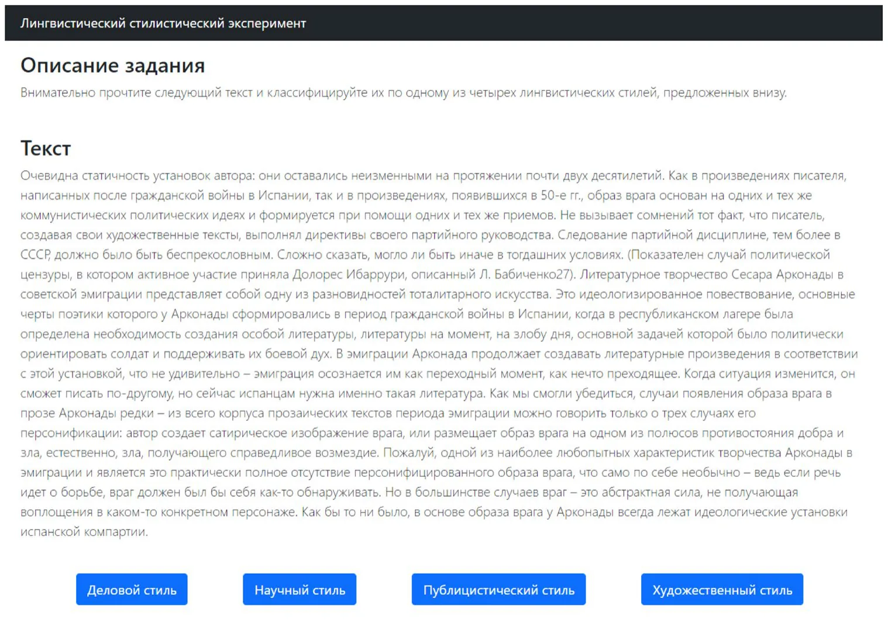
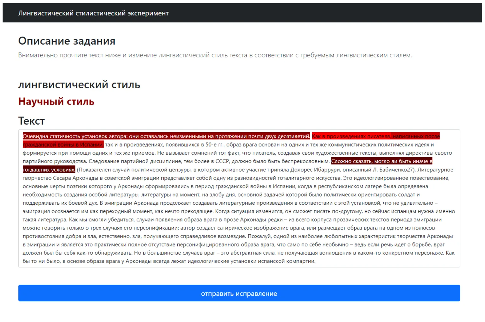
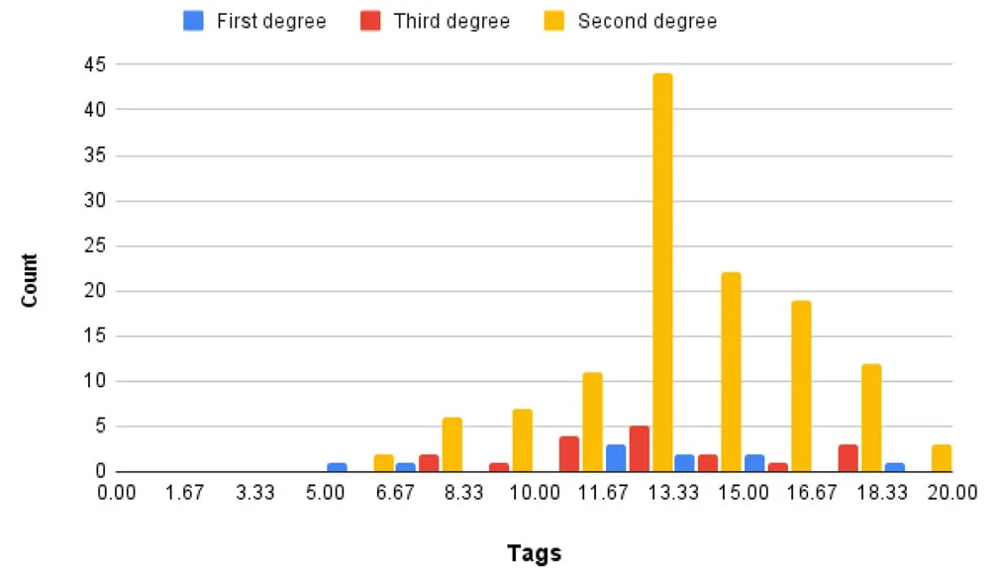

## 1 Introduction

The recent research of artificial intelligence (AI) resulted in promising outcomes such as several steps towards automatic vehicles (Guo and Gao 2020), optimization of clinical processes (Briganti and Le Moine 2020), and improved agriculture growing (Niraj and Thangadurai 2019). In particular, AI allowing computer to more naturally interact with humans throughout natural language processing (NLP) (Nadkarni et al. 2011). These NLP models are able to extract the subject of a text (Pan and Chen 2021), classify texts into categories (Li et al. 2018), and provide summary of long texts (Christian et al. 2016). Nevertheless, current AI models are not able to fully replace human abilities in multiple areas and in particular in ones that based on a less strict definitions (Zanzotto 2019; Li 2017), including NLP tasks (Lertvittayakumjorn et al. 2020; Wang et al. 2020).

There is a growing emergence of systems where people and agents work together (Ofra and Kobi 2013). These systems, often called Human-Agent Systems or Human- Agent Cooperatives, have moved from theory to reality in many forms, including digital personal assistants, recommendation systems, training and tutoring systems, service robots, chatbots, planning systems, and self-driving cars (Richardson and Rosenfeld 2018; Fox et al. 2017; Jennings et al. 2014; Kleinerman et al. 2018; Langley et al. 2017; Lazebnik et al. 2021; Richardson et al. 2008; Rosenfeld et al. 2017; Lazebnik and Alexi 2021; Salem et al. 2015; Sheh 2017; Sierhuis et al. 2003; Lazebnik et al. 2021; Traum et al. 2003; VanLehn et al. 2011; Xiao and Benbasat 2007; Lazebnik and Bunimovich-Mendrazitsky 2021). The ability of computers teammates to accelerate and improve human-performed tasks is known as computer-aided systems.

One NLP-related task that is considered important for generating convincing texts by an AI is functional style (FS) identification (Michos et al. 1996a). This task has been tackled using statistical methods (Michos et al. 1996b), domain-expert based rules (Roudsari et al. 2020), and machine learning (ML) models (Dubovik 2017). In particular, Dubovik (2017) showed promising results in FS identification for Russian texts with multiple similar linguistic properties using a ML-based model. The author suggested that text style correction using ML is still a challenging task due to the multiple correct options and the deep content understanding required by a model to correctly handle this task (Dubovik 2017).

Our work proposes a FS identification model that is based on the deep learning attention architecture and trained on domain-expert tagged modern Russian texts. We relax the linguistic similarity between texts of the same FS category requirement proposed by Dubovik (2017) by taking random texts from the literature and the internet. In addition, the proposed model is used to aid users in performing the text style correction (TSC) task in a faster and more accurate way in order to better fulfill language norms. As a result, semi-automating the TSC task. Therefore, the main contribution of this work lies in the empirical proof that attention-based deep learning models used in a human-in-the-loop approach can reduce time and improve performance in text styling tasks in Russian.

The paper is organized as follows. In Section 2, we provide a short overview of FS identification solutions and the unique FS categories and challenges with modern Russian texts. Afterward, in Section 3, we describe the data gathering process with the validation of the tagging process, followed by a description of the attention neural network used as the base of the model. In addition, we introduce the TSC computer-aided experiment, using the obtained FS identification model. Then, in Section 4, we present the obtained tagged corpus of texts, the model’s performance, and the improvement in individuals’ performance in the TSC task using the obtained model. Finally, in Section 5, some conclusions are drawn and future research directions are suggested.

## 2 Related work

In modern times, written communication is taking an increasing place in the way individuals share information, keep records, and entertain (Zhu et al. 2005; Whitemna 1981). Due to the wide range of cases where written communication is used, unique language norms are emerged to fit each one of them Kraus (1987); Michos et al. (1987).

In particular, the Russian language’s style is significantly altered according to the time and social context it is used Koltsova and Bodrunova (2019). Russian is an East-Slavic language from the Indo-European language family. Today, estimations suggest that there are 258 million Russian speakers, of which 154 million (59.6%) of them are native speakers, making it the eighth-most widespread language in the world (Yanushevskaya and Buncic 2015). Socio-political changes taking place during the 20th century radically influenced the current state of the Russian language. The collapse of the Union of Soviet Socialist Republics (USSR), the transition from a planned to a market economy, the abolition of censorship, and the emergence of the internet have largely affected the vocabulary and styling of the Russian language. These changes lead to a new and more diverse range of social situations, making the identification of linguistics styles more complex since the borders between the styles became less clear (Ryazanova-Clarke and Wade 1999; Golub and Starodubets 2008).

According to Vinogradov (1955), the general term “functional style” (FS) was coined in 1955 aiming to categories socially accepted, functionally differentiated set of methods for selecting, combining, and using linguistic means. In addition, Rosenthal (2001) treated FS as different variations of a language, characterized by a unique set of lexical, phraseological, and syntactic means used entirely or predominantly in this variant. Similarly, Golovin (1988) defines FS as the structural and functionally determined part of the language, correlated with certain types of social activity (Golovin 1988).

Multiple interpretations and classifications have been proposed for FS in modern Russian. For example, Vinogradov (1963) identify the following eight FS: 1) colloquial; 2) oratorical; 3) administrative-academic; 4) newspaper; 5) publicistic; 6) official; 7) belles-lettres and poetical; and 8) scientific styles. The author proposed these categories based on their functionality which is measured by the communicative purpose, referential (e.g., a combination of cognitive and communicative functions), and expressive (Vinogradov 1963). On the other hand, Kozhina and Salimovsky (Kozhina and Salimovsky 2008) proposed six FS: 1) scientific; 2) business; 3) journalistic; 4) belles-letter; 5) religious; and 6) conversational styles. A distinctive feature of this classification is the separation of the religious style. The separation of the religious style in the Soviet-Russian stylistics is associated with the changes in the state policy towards religion. In the context of stylistics, the religious style has a basis for separation due to its distinctive features which appear at all the linguistics levels of the language. However, in practice, this separation is not common. In terms of sociolinguistics, the linguistic FS is a sign of the communication scenario, not the other way around (Kirilenko 2015). Consequently, Kirilenko (2015) proposed the following four FS categories: 1) formal; 2) informal; 3) professional; and 4) ritual styles. This classification approach is rooted in the idea that human communication is strictly regulated. Hence, the communication form is determined by the social situation in which individuals are participating (Nikolski 1976).

Nevertheless, there is a broad consensus about five main FS: 1) academic; 2) business; 3) journalistic; 4) belles-lettres and poetical; and 5) conversational styles (Goldin et al. 2001; Solganik 2001; Matveeva 1990; Maximov et al. 2010). Even so, the conversational style is still considered inappropriate by many (Lapteva 1974; Gorshkov 2006). In this work, we adhere to this classification for the Russian FS, including the reduction of the conversational style since it is predominantly oral and does not require stylistic identification nor correction in written text.

From a computational point of view, style classification is a complex task that has been tackled multiple times in general (Yang et al. 2018; Malmi et al. 2020; Michielutte et al. 1992; Li et al. 2019; Sudhakar et al. 2019) and for FS identification in particular (Michos et al. 1996a, b). One approach to tackle this task is by using a structured representation of stylistic rules, usually defined by a domain expert (Wong et al. year; Schneider et al. 1990). Moreover, several attempts used statistical analysis of style by counting certain words or phrases texts and comparing the results to a “representing” candidates in each classification to decide the FS of the text (Cluett 1990; DiMarco and Hirst 1993; Hovy 1990). While these attempts performed well they are considered outdated since the introduction of large neural-network-based language models (Che and Zhang 2021; Magnini et al. 2021). These methods obtain satisfactory results for multiple languages such as English (Wong et al. year) and Greek (Michos et al. 1996a) but as far as we know do not produce similar success in Russian. In addition, none of the above tackled the task of human-in-the-loop style correction in general and in Russian, in particular.

## 3 Materials and methods

### 3.1 FS identification data acquisition

Since the Russian language changed dramatically over the last three centuries (Ryazanova-Clarke and Wade 2002), we decided to gather modern Russian text from the internet. We used the *Google* and *Yandex* search engines to find a wide range of texts. The obtained web pages are manually reviewed to find texts associated with the modern Russian language (Vinogradov 1955).

In order to classify each text into the appropriate FS category, we deploy a website with a tagging tool that works as follows. First, the web-page shows an explanation regarding the experiment alongside a form requesting participants to declare their level of formal education in Russian linguistics - first, second, or third degree. After the participants declare their level of formal education, they are introduced with a random text out of the database (excluding texts that already had three tags from previous participants), and four buttons following the proposed classification paradigm: business, academic, journalistic, and belles-lettres and poetical, as shown in Fig. 1. This tagging process repeats itself until the participant is no longer willing to tag more texts. After all the texts have been tagged exactly three times. The classification that all three participants agreed on is declared as the final classification of the text (Poesio et al. 2019). Texts which ambiguity removed from the dataset.

### 3.2 FS identification model

We based our model on the deep learning technology, as this technology is able to extract complex, multidimensional properties in unstructured data such as free text (Socher et al. 2021; Kulkarni and Shivananda 2021; Ramaswamy and DeClerck 2018). Specifically, we used the AttentionXML architecture, which is an attention-aware deep learning model with a bidirectional long short-term memory (BiLSTM) with a multi-label attention layer (You et al. 2019). The AttentionXML model requires a text representation in the form of a numerical vector rather than the text itself (You et al. 2019). Therefore, we used the RuBERT model (Kuratov and Arkhipov 2019) which is a bidirectional encoder representation from Transformers (BERT) model (Devlin et al. 2018) that is pre-trained on masked language corpora and next sentence prediction tasks to convert text into a vector-representation for the AttentionXML model. Peculiarly, the RuBERT model is trained on the Russian part of Wikipedia. This data has been used to build a vocabulary of Russian words (Kuratov and Arkhipov 2019).

In order to evaluate the model, we divided the data set into training and validation cohorts with sizes of 80% and 20% from the data, respectively. In addition, both cohorts had the same distribution of samples for all four categories. Moreover, we performed a five-fold cross-validation (Kohavi 1995) to make sure the results are stable. The training cohort was divided into five cohorts where four cohorts were used for the training cohort and one for the testing cohort. The process was repeated five times, allowing each text to be included in both the training and test cohorts. We computed the accuracy of the model on each one of the five iterations and obtain the mean and standard deviation of both of them. Later, the entire training set is used to train the model and the model’s accuracy is computed using the validation cohort.

### 3.3 Text style correction

Once the FS identification model is obtained (see Section 3.2), we perform additional experiment to evaluate if the model help domain experts and non-domain expert users to fix misplaced words and sentences given a text and intended FS - also known as TSC. The experiment goes as follows. First, the participants were introduced with an explanation of the task, alongside a form requesting participants to declare their level of formal education (either first, second, or third degree) and that Russian is their mother language. Afterward, participants arrive at a web-page where they are presented with a text and intended FS (out of the four possible FS). For half of the participants, the text is highlighted in shades of red indicating the words the model identifies as unfitted to the intended FS, using the self-attention layer. While for the other half, the text is not highlighted. The participants from both groups are asked to modify the presented text to make it more aligned with the intended FS. While the participants of both groups are performing the task, we stored the indexes of the words they change and the duration it took for finishing the task. A screenshot of the experiment webpage is presented in Fig. 2. The task repeated for five different texts, pick randomly in a uniform distribution from the data obtained in the FS identification’s data acquisition process (see Section 3.1).

<figure id="fig-1">

<figcaption><strong>Fig. 1</strong> The user interface of a linguistic text classification (in Russian)</figcaption>
</figure>

In parallel, to define the correctness of the participants in modifying the text presented to them, each text is reviewed by three experts (with a third degree in either linguistics or Russian language and Russian as a mother language). The words that were modified by at least one of the three reviewers are defined as the correct modification of the text. We define this metric as the *legitimate-fixing* metric.

<figure id="fig-2">

<figcaption><strong>Fig. 2</strong> The user interface for the linguistic style text correction using the proposed model to mark suggestions (in Russian)</figcaption>
</figure>

## 4 Results

### 4.1 Data acquisition

We mainly picked 668 texts and classify them into the four FS categories. While this classification is replaced later during the experiment, this initial classification provides an estimation for the number of texts that would be in each FS category to have a balanced dataset for the FS identification model later on under the assumption that the agreement between experts in this task is high.

In the experiment, participated *n* = 154 individuals such that 6.6% (10) of them had a first degree, 81.1% (125) had a second degree, and 12.3% (19) had a third degree in either linguistic or journalistic and Russian is there mother language. The participants were recruited by posting in academic forms and by personal invite emails sent to lecturers in Russian universities, listed on their respected universities’ websites. Each participant tagged 13.1 texts on average with 2.9 standard deviation. A detailed distribution of the number of tagging by a participant, divided by the level of expertly of the participants is shown in Fig. 3. In addition, Table 1 shows the mean ± standard deviation of the number of tagging for each level of expertly.

After all the participants tagged the texts, each text had exactly three tags. By filtering only the texts that the majority tagged in the same FS category, we left with 614 ( 91.9% ) of the texts. Moreover, only 578 ( 86.5% ) texts were tagged identically by all three taggers. Therefore, we obtain a dataset with 142 (24.57%), 147 (25.44%), 141 (24.39%), and 148 (25.60%) samples for the business, academic, journalistic, and belles-lettres FS categories, respectively. Hence, the dataset is well balanced.

<figure id="fig-3">

<figcaption><strong>Fig. 3</strong> Histogram of the number of tags per participant in the first experiment</figcaption>
</figure>

<figure class="table-figure" id="table-1">
<figcaption><strong>Table 1</strong> Mean and standard deviation of tags per participant, divided by the participant’s level of expertise</figcaption>

<table><tr><th>Level of expertly</th><th>First degree</th><th>Second degree</th><th>Third degree</th></tr><tr><td>Tags</td><td>12.7 ± 3.9 ,</td><td>13.3 ± 2.7 ,</td><td>12.2 ± 3.3 ,</td></tr><tr><td></td><td>n = 10</td><td>n = 125</td><td>n = 19</td></tr></table>

</figure>

<figure class="table-figure" id="table-2">
<figcaption><strong>Table 2</strong> A confusion matrix between the four FS categories</figcaption>

<table><tr><th></th><th>Business</th><th>Academic</th><th>Journalistic</th><th>Belles-Lettres</th></tr><tr><td>Business</td><td>79</td><td>36</td><td>24</td><td>3</td></tr><tr><td>Academic</td><td>13</td><td>126</td><td>7</td><td>1</td></tr><tr><td>Journalistic</td><td>28</td><td>14</td><td>91</td><td>8</td></tr><tr><td>Belles-Lettres</td><td>5</td><td>4</td><td>18</td><td>120</td></tr></table>

</figure>

### 4.2 Model’s validation

Using the obtained tagged data, we train the proposed model (see Section 3.2). From the k-fold ( *k* = 5 ) cross-validation (Kohavi 1995) we obtain an accuracy of 0.73 ± 0.02 . When evaluating the model on the test cohort, an accuracy of 0.72 is obtained, showing the model is well generalized. The confusion matrix between the four FS categories is shown in Table 2. One can see that the academic and belles-lettres are classified better compared to the business and journalistic FS. In particular, the belles-lettres and academic FS are classified currently 81.08% and 85.71% of the time, respectively. This is significantly higher compared to the business and journalistic FS that classified correctly only 55.63% and 64.53% of the time, respectively.

### 4.3 Text style correction

Using Amazon Mechanical Turk1, we hire qualified workers with 1) over 100 approved assignments; 2) a 98% approval rate; 3) Russian as their mother language. Furthermore, for the domain-expert group, we required the workers to have a second- or third- degree in the language-related subject (for example, linguistics). Similarly, workers with a first degree or without any relevant higher education are allocated to the second, non-domain-expert (NDE) group. We paid participants 0.5$ per text correction, resulting in 2.5$ per participant. In the experiment participated *n* = 160 individuals, such that half (80) of the participants belong to the domain-expert group while the other half (80) belong to the NDE group. In addition, each of these groups is divided into two, where half (40) were shown the proposed model’s markers while the second half (40) were not provided with these markers. In total, 200 texts have been corrected, each one four times by members of each one of the four groups, respectively. The four groups of participants were divided by their level of expertise and if they showed the model’s markers or not. A summary of each group’s performance is shown in Table 3.

<figure class="table-figure" id="table-3">
<figcaption><strong>Table 3</strong> Summary of the mean ± standard deviation of the participants’ accuracy in fixing the text’s FS as defined by the <em>legitimate-fixing</em> metric. In addition the mean ± standard deviation of the time in seconds that took the workers to fulfil a single text’s style fixing assignment</figcaption>

<table><tr><th></th><th>Domain experts</th><th>Non domain experts (NDEs)</th></tr><tr><td>Baseline</td><td>84 ± 05% (172 ± 31s)</td><td>67 ± 11% (153 ± 51s)</td></tr><tr><td>Computer aided</td><td>87 ± 03% (114 ± 27s)</td><td>78 ± 05% (105 ± 34s)</td></tr></table>

</figure>

## 5 Conclusion and future work

To the best of our knowledge, our model is the first to provide FS identification for computer-aided FS correction in modern Russian. The proposed model has been developed based on the Russian part of Wikipedia as the baseline language model and fine-tune for the FS identification using 578 samples, as described in Sections 3.1 and 3.2. The proposed model obtain an accuracy of 0, 72 on the test cohort and 0.73 ± 0.03 for 5-fold cross-validation on the training cohort. This indicates that the proposed model can classify the text to the FS correctly with fine accuracy. Moreover, the model can classify the academic and belles-lettres FS categories with 81.08% and 85.71%, respectively, due to the unique properties of such FS, as shown in Table 2. On the other hand, the Business and journalistic FS are more diverge, commonly contain both belles-lettres and academic properties which makes the division line between them less clear. Indeed, the proposed model obtain only 55.63% and 64.53% accuracy on these FS. These results agree with the one obtained by Dubovik (2017) using a ML-based model.

In addition, a list of 668 texts equally divided into four FS categories (167 texts per FS category) is presented to a wide range of domain experts operating as taggers, resulting in 614 (91.4%) texts which the majority of taggers (at least two out of three) agree upon the FS classification of these texts. Similarly, 578 (86.5%) texts are tagged identically by all three taggers. Hence, there is a wide acceptance regarding the FS of texts by domain experts. This outcome highlights that while the task is relatively easy for trained taggers, there is still a subset of non-trivial cases (formally, 13.5% of the cases) classified differently at least by one of three taggers and 8% tagged differently by all three taggers. As such, a suggested FS identified by an AI can help in improving the agreement across domain experts.

Moreover, our TSC experiment (see Section 3.3) suggests that domain experts do not gain a significant increase in performance (i.e., (3%) improvement) on average by using the markers suggested by the proposed model. Nonetheless, they shorten the duration to accomplish the TSC task by 58 seconds which is 34% improvement on average, as shown in Table 3. Contrastingly, for the NDE group, the proposed model’s markers increase the average accuracy in 11% and provide statistically significant ( *p <* 0.05 , two-tailed T-test) improvement. In addition, the standard deviation of the NDE with the computer aid is identical to the one obtained for the domain experts without the computer aid of (5%). This indicates that the proposed model help NDE to focus on relevant parts in the text when compared to the standard deviation of the same group without the computer aid of 11% . Furthermore, the TSC task’s duration for NDCs is shortened by 48 seconds on average which is 31% improvement.

Thus, the usage of the computer-aided FS identification model in other text styling tasks (e.g., the TSC task) provides a significant time reduction for both domain experts and NDE. Moreover, the performance of both groups is improving while the improvement NDEs gain is more significant compared to these of the domain experts. These results show that AI-driven models that teammate with humans on “soft” text styling tasks provide a significant improvement in time and performance. Practically, one can integrate the proposed model to a text editor and introduce a window asking the user to explicitly state the wanted FS. This way, the text editor software can mark words and phrases that potently do not fit the chosen FS, similar to the grammatical errors correction of such text editor software.

Accordingly, future work may take into consideration a more fine division of the FS categories, also known as FS sub-categories. For example, one can extend the proposed model to take into consideration the common 16 sub-categories in the modern Russian language. Moreover, it would be appealing to investigate our method on other style-related tasks, examine if models with self-attention layer-based markers can aid in these tasks as well.

**Author Contributions** Conceptualization, formal analysis and investigation, data gathering, original draft preparation, and manuscript editing were performed by Elizaveta Savchenko; Conceptualization, formal analysis and investigation, coding, and manuscript editing were performed by Teddy Lazebnik.

**Funding** The authors did not receive support from any organization for the submitted work.

**Data and Code Availibility** The texts used as part of this study, including the manual tagging are provided as supplementary material. Upon acceptance, we will publish all the source code used in a GitHub repository.

### Compliance with ethical standards

**Conflicts of interest** The authors have no relevant financial or non-financial interests to disclose.

## Notes

1 https://www.mturk.com

## References

- Briganti G, Le Moine O (2020) Artificial intelligence in medicine: today and tomorrow. Frontiers in Medicine 7(27)
- Che W, Zhang Y (2021) Deep learning in lexical analysis and parsing. In: Natural language processing. Springer, pp 79–116
- Christian H, Agus MP, Suhartono D (2016) Single document automatic text summarization using term frequency-inverse document frequency (TF-IDF). ComTech: Comput Math Eng Appl 7(4)
- Cluett R (1990) Canadian literary prose: a preliminary stylistic atlas. ECW Press
- Devlin J, Chang MW, Lee K, Toutanova K (2018) BERT: Pre-training of deep bidirectional transformers for language understanding. arXiv
- DiMarco C, Hirst G (1993) A computational theory of goal-directed style in syntax. Computational Linguistics 19(3):452–459
- Dubovik AR (2017) Automatic determination of the stylistic affiliation of texts by their statistical parameters. Computational linguistics and computational ontologies. In: Russian
- Fox M, Long D, Magazzeni D (2017) Explainable planning. arxiv: 1709.10256 [link](http://arxiv.org/abs/1709.10256)
- Goldin VE, Sirotinina OB, Yagubova MA (2001) Russian language and culture of speech. Saratov State University Publishing House, Russian, p 86 [link](http://arxiv.org/abs/1709.10256)
- Golovin BN (1988) The basic language norm. Higher School Publishing House, Russian, p 261
- Golub IB, Starodubets SN (2008) Stylistics of the Russian language and culture of speech. Urait:91
- Gorshkov AI (2006) Russian stylistics. Textual and functional stylistics, Astrel, Russian, p 269
- Guo P, Gao F (2020) Automated scenario generation and evaluation strategy for automatic driving system. In: 2020 7th International conference on information science and control engineering (ICISCE), pp 1722–1733
- Hovy EH (1990) Pragmatics and natural language generation. Artificial Intelligence 43:153–197
- Jennings NR, Moreau L, Nicholson D, Ramchurn S, Roberts S, Rodden T, Rogers A (2014) Human-agent collectives. Communications of the ACM 57(12):80–88
- Kirilenko CV (2015) The processes of forming the conceptual apparatus of sociolinguistics. Russian, Institute of Linguistics RAS, p 237
- Kleinerman A, Rosenfeld A, Kraus S (2018) Providing explanations for recommendations in reciprocal environments. In: Proceedings of the 12th ACM conference on recommender systems, pp 22–30
- Kohavi R (1995) A study of cross validation and bootstrap for accuracy estimation and model select. Int Joint Conf Artif Intell
- Koltsova, Bodrunova SS (2019) Public discussion in russian social media: an introduction. Media Commun 7(3)
- Kozhina MN, Salimovsky VA (2008) Stylistics of the Russian language. Nauka, Russian, pp 412–432
- Kraus J (1987) On the sociolinguistic aspects of the notion of functional style. Reader in Czech Sociolinguistics, Russian
- Kulkarni A, Shivananda A (2021) Deep learning for NLP. In: Natural language processing recipes, Springer
- Kuratov Y, Arkhipov M (2019) Adaptation of deep bidirectional multilingual transformers for russian language. arXiv
- Langley P, Meadows B, Sridharan M, Choi D (2017) Explainable agency for intelligent autonomous systems. In: AAAI, pp 4762–4764
- Lapteva OA (1974) Oral-colloquial variety of the modern Russian literary language. Stylistics issues of Saratov State University, Russian, pp 8–9
- Lazebnik T, Alexi A (2021) Comparison of pandemic intervention policies in several building types using heterogeneous population model. Medrxiv
- Lazebnik T, Bunimovich-Mendrazitsky S (2021) The signature features of COVID-19 pandemic in a hybrid mathematical model–implications for optimal work–school lock-down policy. Adv Theory Simul
- Lazebnik T, Bunimovich-Mendrazitsky S, Shami L (2021) Pandemic management by a spatio-temporal mathematical model. Int J Nonlinear Sci Numer Simul
- Lazebnik T, Shami L, Bunimovich-Mendrazitsky S (2021) Spatio-temporal influence of non-pharmaceutical interventions policies on pandemic dynamics and the economy: the case ofCOVID-19. economic research-ekonomska istrazivanja
- Lertvittayakumjorn P, Specia L, Toni F (2020) FIND: human-in-the-loop debugging deep text classifiers. arXiv
- Li G (2017) Human-in-the-loop data integration. Proceedings of the VLDB Endowment 10(12):2006–2017
- Li D, Zhang Y, Gan Z, Cheng Y, Brockett C, Sun MT, Dolan B (2019) Domain adaptive text style transfer. arXiv
- Li C, Zhan G, Li Z (2018) News text classification based on improved Bi-LSTM-CNN. In: 9th International conference on information technology in medicine and education (ITME), pp 890–893
- Magnini B, Lavelli A, Magnolini S (2021) Comparing machine learning and deep learning approaches on NLP tasks for the italian language. In: Proceedings of the 12th language resources and evaluation conference, pp 2110–2119
- Malmi E, Severyn A, Rothe S (2020) Unsupervised text style transfer with padded masked language models. In: Proceedings of the 2020 conference on empirical methods in natural language processing, pp 8671–8680
- Matveeva TV (1990) Functional styles in the aspect of text categories. Ural University Publishing House, Russian, pp 36–158
- Maximov BI, Baranova NR, Ivanov AF, Kazarinova NV (2010) Russian language and the literary norm. Publising house Zlatoust, Russian, p 55
- Michielutte R, Bahnson J, Dignan MB, Schroeder EM (1992) The use of illustration sand narrative text style to improve readability of a health education brochure. Journal of Cancer Education 7(3):251–260
- Michos SE, Fakotakis N, Kokkinakis G (1987) Using functional style features to enhance information extraction from greek texts. Advances in Intelligent System, Springer
- Michos SE, Stamatatos E, Fakotakis N, Kokkinakis G (1996a) Categorizing texts by using a three-level functional style description. Artif Intell Methodol, Syst, Appl:191–198
- Michos SE, Stamatatos E, Fakotakis N, Kokkinakis G (1996b) Identification of functional style in unrestricted texts based on a three-level stylistic description. In: Proceedings of the AISB 1996 workshop on language engineering for document analysis and recognition
- Nadkarni PM, Ohno-Machado L, Chapman WW (2011) Natural language processing: an introduction. Journal of the American Medical Informatics Association 18(5):544–551
- Nikolski LN (1976) Synchronous sociolinguistics (theory and problems). Nauka Publishers, Russian, p 48
- Niraj PB, Thangadurai N (2019) Utilization of IOT and AI for agriculture applications. Int J Eng Adv Technol 8(5)
- Ofra A, Kobi G (2013) Plan recognition and visualization in exploratory learning environments. ACM Transactions on Interactive Intelligent Systems 3(3):16
- Pan P, Chen Y (2021) Automatic Subject Classification of Public Messages in E-government Affairs. Journal of Data, Information and Management 5(3):336–347
- Poesio M, Chamberlain J, Paun S, Yu J, Uma A, Kruschwitz U (2019) A crowd sourced corpus of multiple judgments and disagreement on anaphoric interpretation. In: Proceedings of the 2019 conference of the north american chapter of the association for computational linguistics: human language technologies. Association for Computational Linguistics, pp 1778–1789
- Ramaswamy S, DeClerck N (2018) Customer perception analysis using deep learning and NLP. Procedia Computer Science 140:170–178
- Richardson A, Kraus S, Weiss PL, Rosenblum S (2008) COACH-cumulative online algorithm for classification of handwriting deficiencies. In: AAAI, pp 1725–1730
- Richardson A, Rosenfeld A (2018) A survey of interpretability and explainability in human-agent systems. XAI:37
- Rosenfeld A, Agmon N, Maksimov O, Kraus S (2017) Intelligent agent supporting human-multi-robot team collaboration. Artificial Intelligence 252:211–231
- Rosenthal DE (2001) Practical stylistics, pelling and literary editing. Onyx 21st Century, 12
- Roudsari AH, Afshar J, Lee CC, Lee W (2020) Multi-label patent classification using attention-aware deep learning model. In: IEEE International conference on big data and smart computing
- Ryazanova-Clarke L, Wade T (2002) Changes in the Russian language in the post-soviet period. Dialog on Language Instruction 15(1–2):19–25
- Ryazanova-Clarke L, Wade T (1999) The russian language today. Taylor and Francis Group
- Salem M, Lakatos G, Amirabdollahian F, Dautenhahn K (2015) Would you trust a (faulty) robot?: Effects of error, task type and personality on human-robot cooperation and trust. In: IEEE International conference on human-robot interaction, pp 141–148
- Schneider W, Korkel J, Weinert FE (1990) Expert knowledge, general abilities, and text processing. Interactions among Aptitudes, Strategies, and Knowledge in Cognitive Performance, Springer 8(2):133–156
- Sheh R (2017) Why did you do that? explainable intelligent robots. In: AAAI workshop on human-aware artificial intelligence
- Sierhuis M, Bradshaw JM, Acquisti A, Van Hoof R, Jeffers R, Uszok A (2003) Human-agent teamwork and adjustable autonomy in practice. In: Proceedings of the seventh inter-national symposium on artificial intelligence, robotics and automation in space
- Socher R, Bengio Y, Manning CD (2012) Deep learning for NLP (without magic). Association for Computational Linguistics
- Solganik GY (2001) Stylistics of the modern Russian language and the literary norm. Publishing house Academia, Russian, p 86
- Sudhakar A, Upadhyay B, Maheswaran A (2019) Transforming delete, retrieve, generate approach for controlled text style transfer. arXiv
- Traum D, Rickel J, Gratch J, Marsella S (2003) Negotiation over tasks in hybrid human-agent teams for simulation-based training. In: Proceedings of the second international joint conference on autonomous agents and multiagent systems, pp 441–448
- VanLehn K (2011) The relative effectiveness of human tutoring, intelligent tutoring systems, and other tutoring systems. Educational Psychologist 46(4):197–221
- Vinogradov VV (1955) Results of discussion of issues of stylistics. Topics in the Study of Language, Russian, pp 1–73
- Vinogradov VV (1963) Stylistics: The theory of poetic speech. USSR’s Academy of Sciences, Russian, pp 5–6
- Wang ZJ, Choi D, Xu D, Yang D (2020) Putting humans in the natural language processing loop: A survey. arXiv
- Whitemna MF (1981) Variation in writing: functional and linguistic-cultural differences. Writing: the nature, development, and teaching of written communication, Routledge
- Wong KC, Pulos HG, Thorne CP (1989) Site classification by expert systems. Computers and Geotechnics 8(2):133–156
- Xiao B, Benbasat I (2007) E-commerce product recommendation agents: use, characteristics, and impact. MIS Quarterly 31(1):137–209
- Yang Z, Hu Z, Xing EP, Berg-Kirkpatrck T (2018) Unsupervised text style transfer using language models as discriminators. In: 32nd Conference on neural information processing systems
- Yanushevskaya I, Buncic D (2015) Russian. Journal of the International Phonetic Association 45(2):221–228
- You R, Zhang Z, Wang Z, Dai S, Mamitsuka H, Zhu S (2019) Attention XML: label tree-based attention-aware deep model for high-performance extreme multi-label text classification. arXiv
- Zanzotto FM (2019) Viewpoint: human-in-the-loop artificial intelligence. J Artif Intell Res 64
- Zhu Y (2005) A sociocognitive perspective on business genres. Written Communication across Cultures
