## I. Introduction

For thousands of years, humankind based its food supply on agriculture.1 Multiple historical records show large-size agricultural pandemics that cause heavy losses for farmers and society.2 In particular, multiple plant virus disease pandemics and major botanical pandemics occurred worldwide in the last century.3–7 Overall, the number of agricultural crop epidemics exhibits a monotonic increase while recently reaching an asymptotic rate.8

In recent times where agriculture is part of the multi-sectoral economy, an agricultural pandemic has a twofolded impact on society: food shortages and direct economic losses to the agriculture sector.9,10 For instance, during 2014 alone, virus disease pandemics were estimated to have a global economic impact of at least 30 billion dollars.11 Moreover, as farmers and companies aim to increase their profit from the same land and to cope with growing demand, they adopted multiple methods such as the cultivation of annual crops as monocultures and plant breeding.12,13 As a direct result, the plants’ immunity is often harmed due to these practices, which provide an underlying basic ingredient of instability.14 In repercussion, severe virus disease epidemics became regularly recurring features in many herbaceous crops.13 Hence, it is of interest to farmers and policymakers to control such pandemics, minimizing their negative impacts.

Mathematical and computational models are key tools for understanding pandemic spread and designing intervention policies that help control a pandemic’s spread. In particular, coupled ordinary and partial differential equations, as well as simpler growth-curve equations, are especially useful deterministic models for representing plant disease development in fields.9,15–17 The authors of Ref. 8 used the Susceptible-Infected-Removed (SIR) model, originally proposed by Ref. 18 to describe pandemics in humans, to examine the effects of different models for the effect of host responses to a load of infection on the production of susceptible tissue. The authors tested their model on the stem canker disease of potatoes caused by the soil-borne fungus (Rhizoctonia Solani), showing a promising prediction capability on historical data. The authors of Ref. 19 utilized a Healthy-Latently- Infected-Diseased (HLD) model for tomato bacterial canker (TBC) caused by the pathogenic plant bacteria Clavibacter Michiganensis Subsp. Michiganensis (Cmm). They assumed the infection was transferred to healthy plants through contaminated scissors used to cut symptomless infected plants and fitted the model on a dedicated experiment. Their results show that the model can fairly predict the number of diseased plants over time. The authors of Ref. 20 extended the SIR model, proposing an SIRX model that incorporates two sources of infection, with primary infection arising from “free-living” inoculum and secondary infection occurring by transmission from infected to susceptible hosts. Their model focused on soil-borne plant diseases caused by various fungal and bacterial pathogens in crops. The authors analyzed the sensitivity of various epidemiological and botanical properties, showing that the infection rate is susceptible to most of them.

This paper focuses on the grid-based seeding strategy during a botanical pandemic from an economic perspective. Namely, the novelty of the proposed work is the formalization and analysis of a two-parametric seeding strategy for a field experiencing a botanical pandemic. To accomplish this objective, we developed a spatiotemporal stochastic SIR model with an economic dynamic where the plants are organized on a two-dimensional grid, seeded at the beginning of a season, and harvested and sold at the end of the season.

The remainder of this paper is organized as follows. Section II formally introduces the proposed model and formalizes the objective. Next, Sec. III describes an algorithm to obtain the optimal seeding strategy for the worst-case pandemic, given initial conditions. Afterward, Sec. IV presents *in silico* experiment of the proposed model, analyzing the sensitivity of the pandemic spread and economic profit to the pathogen’s properties and the optimal seeding strategy for different scenarios. Lastly, in Sec. V, we discuss the results and suggest possible future work.

## Ii. Model Definition

The proposed model M is defined as a tuple of two interconnected components M := (P, E), where P is the epidemiological component responsible for capturing the spatiotemporal pandemic spread of a pathogen in a population of plants and E is the economy component responsible for capturing the economic profit the field’s owner obtain over time. Below, a formal description of the two components and their interactions is provided. Moreover, a description of the model’s implementation as a computer simulation is also provided. A schematic view of the model’s dynamics over time (*t* ∈ [1, . . . , *T*) is presented in Fig. 1.

### A. The epidemiological component

Let us define a sub-model (i.e., component) that takes into consideration a population of plants, *P* (|*P*| := *N* ∈ N), that is allocated in a finite and rectangular-shaped field *F* := (*W*, *H*) ⊂ R2. The model treats both space and time as continuous variables. Importantly, in Sec. II C, during the implementation of this model as a computer simulation, we would discrete both space and time.21–24 Interactions are local and stochastic. It is further assumed that *F* is homogeneous and isotropic.25 The plant population, *P*, is allocated to the field *F* such that it creates rows and columns with a distance *d*x and *d*y between them, respectively.

Each plant in the population, *p* ∈ *P*, belongs to one of three epidemiological groups: Susceptible (*S*), Infected (*I*), or Removed (*R*) such that *N* := *S* + *I* + *R*. Plants in the first group have no immunity and are susceptible to infection. When a plant in the susceptible group (*S*) is exposed to the pathogen, the plant is transferred to the infected group (*I*), at an average rate β. The plant stays in the infected group for γ steps in time, after which the plant is transferred to the removed group (*R*). Removed plants do not practice in any epidemiological nor economic dynamics. We define the infection rate, β, to be *distance-depended*. Particularly, the rate at which plant *p*i is infecting plant *p*j is defined to be

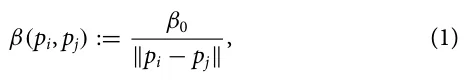

where β0 ∈ [0, 1] is the basic infection probability of the pathogen and ∥*p*i − *p*j∥ stands for the Euclidean distance between the plants *p*i and *p*j. Thus, the spatiotemporal epidemiological dynamics obey the following system of coupled ordinary differential equations:

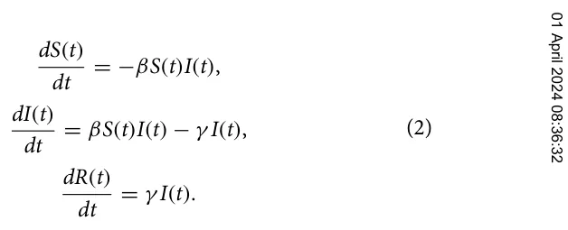

### B. The economic component

Continuing the definition of the epidemiological component, let us define the economic sub-model of the same population of plants over time. The economic component considers the cost of seeding, growing, and harvesting plants and the profit one obtains from selling them. Formally, at the beginning of the session, one is required to seed the plants. This process is associated with a cost for each plant (0 ≤ *a*s 1 ∈ R) and some fixed overhead cost (0 ≤ *a*s 2 ∈ R). However, the cost per plant is growing in a logarithmic manner to the size of the plant population.26,27 Thus, for a plant population of size *N*, the seeding cost is *O*seeding(*N*) = *a*s 1*ln*(*N*) + *a*s 2. In the same manner, the cost of growing the plants in a single step in time corresponds to some fixed overhead and a cost per plant, increas- *g g* ing in a logarithmic manner: *O*growing(*N*) = *a*1*ln*(*N*) + *a*2. Finally, the cost of harvesting a plant population follows the same dynamics: *O*harvesting(*N*) = *a*h 1*ln*(*N*) + *a*h 2. After harvesting, the plants can be sold. The plants has a fixed price, 0 < ψ1 ∈ R, while the overall sales size results in a reduced value, 0 < ψ2 ∈ R, in a logarithmic manner to the size of the plant population:28–30 *O*sell(*N*) = ψ1*N* − ψ2*ln*(*N*). Therefore, the economic output of the field at time *t* ∈ [1, . . . , *T*] is as follows:

<figure id="fig-1">
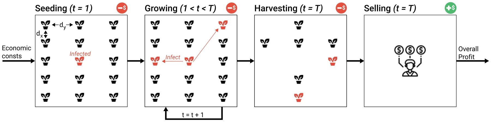
<figcaption><strong>FIG. 1.</strong> A schematic view of the model’s spatiotemporal dynamics. At the beginning (<em>t</em> = 1), the field is seeded and some plants are infected. Next, for a duration, <em>T</em> &lt; ∞, the plants grow and infect each other. After <em>T</em> steps in time, the plants are harvested and the non-infected plants are sold for profit.</figcaption>
</figure>

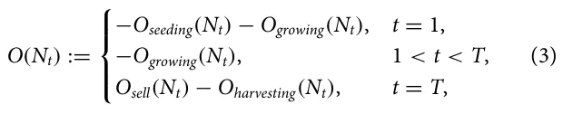

such that *O*(*N*1) = 0 and *N*t := *N* − *R*(*t*).

Importantly, as plants require some minimal area for seeding and growing, there exists a minimal seeding distance, 1 ∈ R+, to allow plants to grow. A seeding with a distance smaller than 1 will result in the early death of the plant and no profit, as a result.

### C. Computer simulation

In order to simulate the model, we used an agent-based simulation approach.31,32 To this end, we assume a discrete version of the proposed model. The plants in the population interacts in rounds *t* ∈ [1, . . . , *T*], where *T* < ∞. Each plant in the population, *p*j := (*x*j, *y*j, ξi,j) ∈ P, is represented by a timed finite state machine33 such that, at round *i*, ξi,j denotes the plant’s epidemiological status *p*j ∈{*S*, *I*, *R*} and (*x*j, *y*j) denoted the plant’s location in the field (*F*). At the first round (*t* = 1), the population (P) is allocated to *F* given the values *d*x and *d*y. In practice, during the seeding or immediately after the plants are susceptible, and only a subset is infected by a pathogen. At the beginning of the pandemic (*t* = 1), the seeding cost is computed. Then, at each round 1 ≤ *t* < *T*, the pathogen spreads between the plants, and the growing cost is computed. After *T* rounds, the economic profit from the field, *E*, is computed after taking the harvesting cost and profits from selling into account.

## Iii. Optimal Seeding Strategy

In the case of a pandemic where the pathogen properties and the economic costs are known, one can aim to optimize its profit from a given field by strategically seeding the plant population. On the one hand, seeding the plants as close to each other as possible would lead to a maximum profit, assuming the profit from selling the entire plant population is higher than the overall cost. However, on the other hand, it would increase the average infection rate [see Eq. (1)] and result in more removed plants that cause economic loss.

Hence, one can formalize the above motivation as follows. Given the proposed model, one wishes to maximize the economic profit of the field during a single session (i.e., *t* ∈ [1, *T*]) while controlling the seeding strategy. Formally, the optimization task takes the form

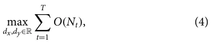

where *d*x, *d*y > 0. Furthermore, it is assumed assume that *k* plants are exposed to a pathogen immediately after seeding, setting the initial condition to be *S*(0) = *N* − *k*, *I*(0) = *k*, *R*(0) = 0.

Now, the locations of the initially infected plants in the field play a critical role in the pandemic spread rate, as one can see from Eq. (1). Thus, it is possible to provide a worst-case scenario as a boundary condition by choosing the *k* plants that the maximum distance between at least one of them to any other plant is minimal (i.e., the *metric k-center* task).34 Let us denote this distance by 0 < *r* ∈ R such that *r* := q*d*2 x + *d*2 y.

Assuming the worst-case scenario, in order to compute Eq. (3), one is required to compute *N*t for *t* ∈ [1, . . . , *T*]. Hence, to obtain the number of removed plants, one can compute

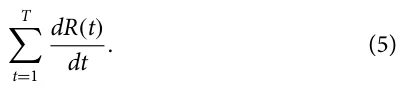

Now, using the next generation matrix (NGM) method,35 we can bound the value of *I*(*t*) for each *t* ∈ [0, . . . , *T*] using the formula: *I*(*t* + 1) ≤ β*I*(*t*). By setting this condition to Eq. (5) and using Eq. (1), one obtains

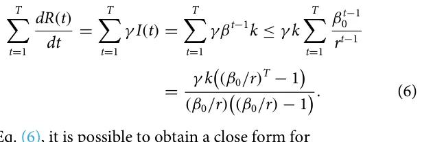

From Eq. (6), it is possible to obtain a close form for

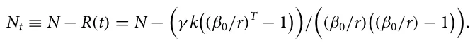

As a result, Eq. (4) can be rewritten as the following optimization tasks, solving for the worst-case scenario. For the conditions approximation with less computational burden.36

<figure class="table-figure" id="table-1">
<figcaption><strong>TABLE I.</strong> The model’s parameters notations, descriptions, and values.</figcaption>

<table><tr><th>H, no plants are seeded in the field which</th><th>Symbol</th><th>Parameter definition</th><th>Value</th></tr><tr><td>to return 0. As a result, the problem an optimization problem to N,</td><td>S(t) I(t)</td><td>Susceptible plants at time t (1) Infected plants at time t (1)</td><td></td></tr><tr><td></td><td>R(t)</td><td>Removed plants at time t (1)</td><td></td></tr><tr><td>max XT O(Nt) dx,dy t=1</td><td>Nt</td><td>Number of plants in the population at time t (1)</td><td></td></tr><tr><td></td><td>r</td><td>The minimal distance of the maximum distance</td><td></td></tr><tr><td>s.t.</td><td></td><td>between an susceptible and infected plant at</td><td></td></tr><tr><td>(7) dx ≤W,</td><td></td><td>t = 1 (m)</td><td></td></tr><tr><td></td><td>N</td><td>Default plant population size (plants)</td><td>25000</td></tr><tr><td>dy ≤H,</td><td>dx</td><td>Default x axis distance between plants (m)</td><td>0.2</td></tr><tr><td>dx, dy ≥0.</td><td>dy</td><td>Default y axis distance between plants (m)</td><td>0.2</td></tr><tr><td></td><td>W</td><td>The fields width (m)</td><td>100</td></tr><tr><td>spatial step of size δ ∈R+, one can solve this</td><td>H</td><td>The fields height (m)</td><td>100</td></tr><tr><td>brute force or using Monte Carlo for good</td><td>T</td><td>The duration of a session (plants)</td><td>3</td></tr><tr><td>computational burden.36</td><td>β0</td><td>Basic infection probability (t−1 plants−1)</td><td>0.003</td></tr><tr><td></td><td>γ</td><td>Removed rate (t−1)</td><td>1/42</td></tr><tr><td>ANALYSIS</td><td>k</td><td>The initial number of infected plants at the</td><td></td></tr><tr><td>model and its implementation as a com- investigate several scenarios of interest for the</td><td>as 1</td><td>beginning of the pandemic (plants) Average cost per plant for seeding ($)</td><td>3 0.01</td></tr><tr><td>that influences potatoes. The param-</td><td>as 2</td><td>Average overhead for seeding ($)</td><td>0.14N</td></tr><tr><td>calculations (if not stated otherwise) are</td><td>g a 1</td><td>Average cost per plant for growing per day ($)</td><td>0.033</td></tr><tr><td>values are taken from the United States constantly change over time. First, we</td><td>g a 2</td><td>Average overhead for growing per day ($)</td><td>0.019N</td></tr><tr><td>spread and economic profit for small,</td><td>ah 1</td><td>Average cost per plant for harvesting ($)</td><td>0.06</td></tr><tr><td>Subsequently, a sensitivity analysis of the</td><td>ah 2</td><td>Average overhead for harvesting ($)</td><td>0.11N</td></tr><tr><td>properties on the pandemic spread and eco- Finally, a comparison of default and for random and worst-case initial condi-</td><td>ψ1 ψ2</td><td>Average cost per plant for selling ($) Average discount for selling plants ($)</td><td>5.32 1.71</td></tr></table>

</figure>

## Iv. Numerical Analysis

tions is analyzed. In order to capture the pandemic spread, we used the basic reproduction number (*R*0) over time which is defined as *I*(*t*+1)−*I*(*t*) *R*0(*t*) := R(t+1)−R(t) for *R*(*t* + 1) > *R*(*t*) and *R*0(*t*) := *I*(*t* + 1) − *I*(*t*), otherwise.37 In a complementary manner, the average basic reproduction number, *E*[*R*0], is defined as follows: *E*[*R*0] := 1 t=1 *R*0(*t*). T PT

<figure id="fig-2">
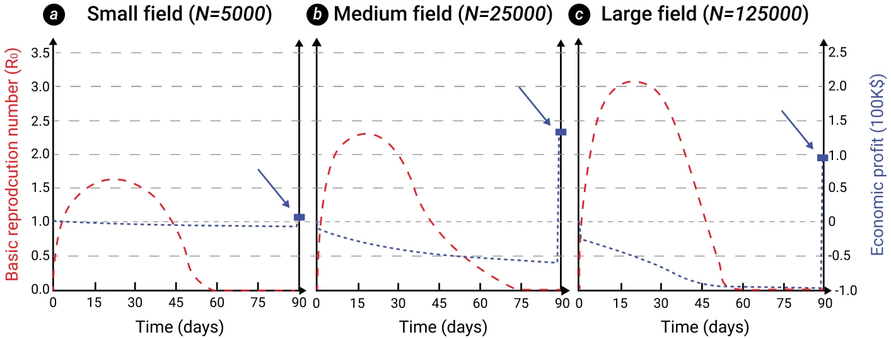
<figcaption><strong>FIG. 2.</strong> The basic reproduction number (dashed, red) and economic profit (dotted, blue) over time, divided into (a) small, (b) medium, and (c) large-size fields. The results are shown as an average of <em>n</em> = 1000 random instances with the parameter values from Table I.</figcaption>
</figure>

### A. Baseline

Figure 2 shows the basic reproduction number and economic profit over time, divided into small (*N* = 5000), medium (*N* = 25 000), and large (*N* = 125 000) fields with the same size. All fields are of the same size. The results show the average of *n* = 1000 simulations for each field that differ from each other by the position of initially infected plants. The overall infection rate over time increases as the field size increases and the distance between plants decreases. As a direct outcome, the economic profit at the end of the session is not monotonically increasing as expected (assuming it is profitable to grow a single plant) since a more significant portion of the plants is removed.

### B. Sensitivity analysis

In order to capture the influence of the epidemiological parameters associated with the pathogen, β0 and γ , a sensitivity analysis of the pandemic spread as the average basic reproduction number (a) and economic profit (b) are shown in Fig. 3. The results are shown relative to the baseline configuration provided in Table I, where β0 = 0.003 and γ = 1/42. We fitted the numerical data with an analytical two-dimensional linear function using the least mean square (LMS) method,38 obtaining

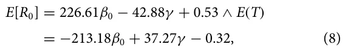

with a coefficient of determination (*R*2) of 0.896 and 0.954, respectively.

In addition, we measured the influence of three economic ratios *g g g a*1/*a*2, ψ1/ψ2, and *a*1/ψ1 on the economic profit as shown in Fig. 4. The results are shown as mean ± standard deviation of *n* = 1000 instances. The square (red) value indicates the baseline configura- *g g* tion shown in Table I. One can notice that *a*1/*a*2 obtains an optimum around 2. The economic profit is monotonically increasing as a function of ψ1/ψ2. Oppositely, the economic profit is monotonically *g* decreasing as a function of *a*1/ψ1.

### C. Optimal seeding strategy

Following the algorithm for the optimal seeding strategy (see Sec. III), we computed the difference between the default (*d*x = *d*y = 0.2) and optimal seeding strategy for random and worst case of initial condition. The results are summarized in Fig. 5 such that the results obtained from *n* = 10 000 random instances where the field size (*W*, *H*) and pathogen properties (β0, γ ) are different for each instance. The blue and green area indicates the convex hull obtained from the dots using the Graham scan algorithm.39

In order to capture the underline functional dynamics generating the economic profit from the economic and epidemiological parameters, we utilized the *SciMED* symbolic regression tool.40 Symbolic regression involves conducting regression analysis by exploring the realm of mathematical expressions to discover the most suitable model for a provided data set, prioritizing both accuracy and simplicity. We obtained the following equation:

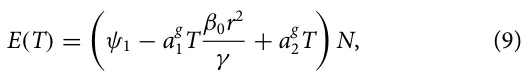

<figure id="fig-3">
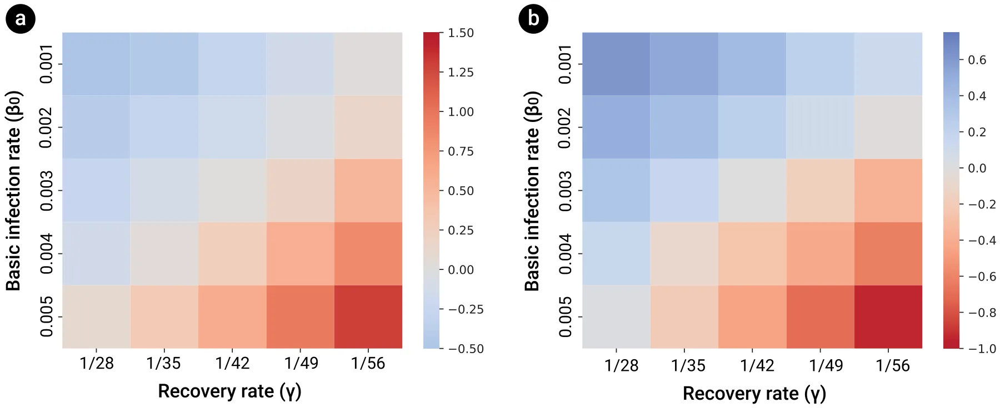
<figcaption><strong>FIG. 3.</strong> Sensitivity analysis of the (a) average basic reproduction number and (b) economic profit as a function of the basic infection rate and recovery rate, relative to the baseline configuration—β0 = 0.003, γ = 1/42. The results are shown as an average of <em>n</em> = 1000 random instances with the parameter values from Table I. The reader should note the different color scales in panels (a) and (b).</figcaption>
</figure>

<figure id="fig-4">
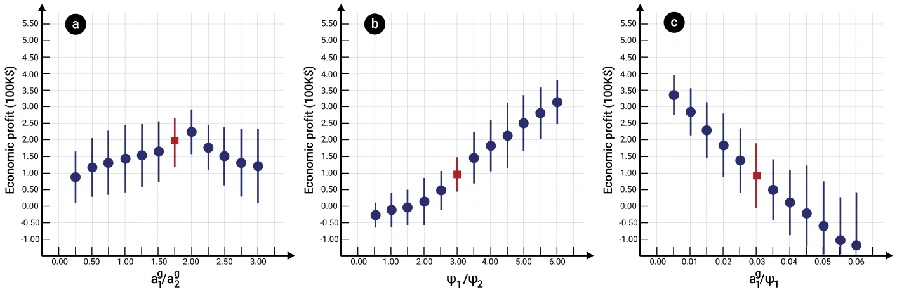
<figcaption><strong>FIG. 4.</strong> Sensitivity analysis of the economic profit as a function of several economic ratios—(a) <em>a</em>g 1/<em>a</em>g 2, (b) ψ1/ψ2, and (c) <em>a</em>g 1/ψ1. The results are shown as an average ± standard deviation of <em>n</em> = 1000 random instances with the parameter values from Table I. The square (red) value indicates the baseline configuration shown in Table I.</figcaption>
</figure>

with a coefficient of determination *R*2 = 0.741 for the random case with the optimal seeding strategy.

## V. Discussion

In this study, we have developed a mathematical model to establish the economic profit from a field of plants during a botanical pandemic. The proposed model establishes the connection between a spatiotemporal SIR-based epidemiological model and a non-linear economic production model. Based on this model, we propose an algorithm to find the economically optimal seeding strategy given a known pathogen and economic properties.

Considering *Rhizoctonia solani* for potatoes as a representative example, we implemented an agent-based simulation. We studied the influence of several environmental, epidemiological, and economic properties of the pandemic spread and economic profit. In particular, we demonstrate the potential benefits of the proposed seeding strategy for both a random and worst-case pandemic scenario, regardless of the pathogen’s properties and field size.

The baseline analysis aims to indicate a connection between the plant population size and the pandemic spread. On average, as the plant population size increases, the infection rate, reflected by the mean basic reproduction number (*R*0), increases as well, as shown in Fig. 2. Moreover, the economic profit, at the end of the season (*T*), first increases and then decreases, demonstrating a parabolic-like behavior. These results agree with multiple spatiotemporal epidemiological models, and historical data in human and animal pandemics.41,42

Following the same path, an analysis of the pandemic spread and economic profit as a function of the basic infection rate (β0) and recovery rate (γ ) is conducted as shown in Fig. 3. Unsurprisingly, as the basic infection rate increases and the recovery rate decreases, the pandemic spread increases, and the economic profit decreases. Moreover, from Eq. (8), one can see that the basic infection rate has six times more influence on the decrease in economic profit compared to the recovery rate. Thus, when designing pandemic intervention policies, researchers and developers might prefer to focus on the pandemic intervention policies or the development of plants that are more resilient to an infection to reduce the pandemic spread.

In an interconnected way, the sensitivity analysis of the economic profit as a function of the ratio between growing overhead and per plant cost, the ratio between the average plant selling price and overall reduced price, and the ratio between average growing cost per plant to the selling cost is studied in Fig. 4. Figure 4(a) reveals that as the ratio between the per plant growing cost and the growing overhead cost increases, it reaches an optimum and then sharply decreases. However, for the two other quantities, the dynamics are monotonic, agreeing with previous economic models.43,44

Most importantly, Fig. 5 reveals that the optimal seeding strategy indeed increases the average (and in general) economic profit while decreasing the pandemic spread for both the random and worst-case scenarios. Specifically, the improvement for the random case is statistically significantly better than for the worst-case scenario (*p* < 0.005), obtained using an ANOVA test. Nevertheless, for both the random and worst case, the optimal seeding configuration is statistically outperforming the default seeding configuration (*p* < 0.001), obtained using a paired two-sided T-test. Interestingly, while the relationship between the average basic reproduction number and the economic profit for both cases is complex and non-linear, the figure reveals a somewhat linear decreasing trend. Moreover, one can notice that the improvement of using the optimal seeding configuration compared to the default seeding configuration in the random case has less impact compared to the worst case.

Altogether, field owners and policymakers can adopt the seeding strategy at the beginning of a new session, assuming they are familiar with the possible pathogen that might cause a pandemic in their field, given a crop they wish to grow. Moreover, the proposed model provides a tool to approximate the economic influence such a pandemic might have on a specific situation. Our model and simulator are published as open source (the source code is available at https://github.com/teddy4445/pandemic\_in\_the\_field), so other researchers and policymakers can replicate and extend our study for their needs.

<figure id="fig-5">
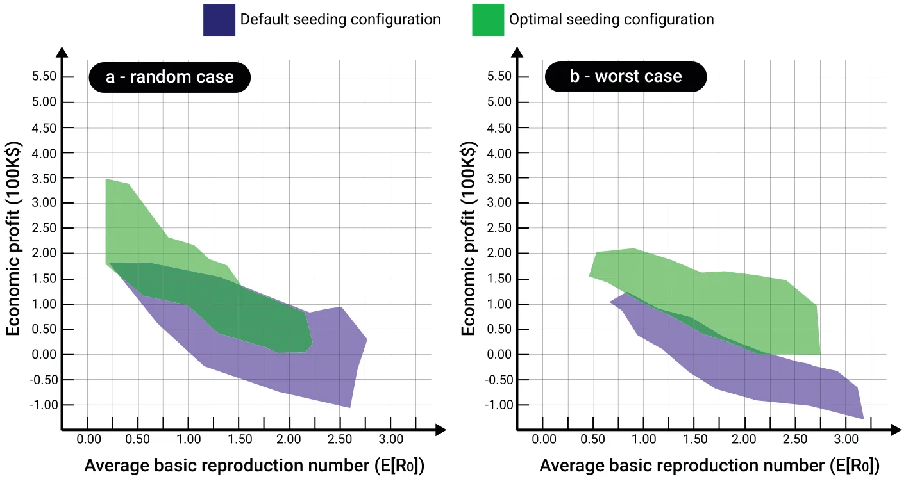
<figcaption><strong>FIG. 5.</strong> The average pandemic spread and economic profit for the (a) random case and (b) worst-case optimal seeding strategy. The results are based on <em>n</em> = 10 000 random instances with the parameter values from Table I and <em>W</em> ∈ [50, 250], <em>H</em> ∈ [50, 250], β0 ∈ [0.001, 0.005], γ ∈ [1/65, 1/21].</figcaption>
</figure>

This study has several limitations, which provide opportunities for future research. First, the proposed model assumes that the plant population is homogeneous in its epidemiological and economic properties, an assumption known to be false.45,46 As such, by introducing unique epidemiological and economic properties for each individual plant, such as recovery rate and amount of profit from selling, one would obtain a more accurate economic profit prediction. In a complementary manner, the proposed work focused on the seeding strategy alone, ignoring current and novel possible monitoring and intervention policies strategies that can control a pandemic spread and, therefore, increase the economic profit.47,48 In addition, as each plant type is susceptible to multiple pathogens, an extension of the proposed model for the case of a multi-strain pandemic can be of great interest.49–53 Finally, the proposed analysis was conducted for a single pathogen, as shown in Table I, which limits our current understanding of the model’s generalization capabilities. Future work can explore the proposed model for more pathogens. Moreover, in this work, we assume a two-dimensional field. However, many fields take advantage of three-dimensional phenomena. A possible extension of this work is to include a three-dimensional surface.

## Author Declarations

## Conflict of Interest

The author has no conflicts to disclose.

## Author Contributions

**Teddy Lazebnik:** Conceptualization (equal); Data curation (equal); Formal analysis (equal); Investigation (equal); Methodology (equal); Project administration (equal); Resources (equal); Software (equal); Visualization (equal); Writing – original draft (equal); Writing – review & editing (equal).

## Data Availability

The data that support the findings of this study are openly available in arXiv at https://arxiv.org/abs/2301.02817, Ref. 54. The code and materials are available from the corresponding author upon reasonable request.

## References

- 1R. A. C. Jones, “Global plant virus disease pandemics and epidemics,” Plants 10(2), 233 (2021). 2J. C. Zadoks, “Twenty-five years of botanical epidemiology,” Philos. Trans. R. Soc. Lond. B 321, 377–387 (1988). 3J. M. Thresh, “The impact of plant virus diseases in developing countries,” in Virus and Virus-like Diseases of Major Crops in Developing Countries, edited by G. [doi:10.3390/plants10020233](https://doi.org/10.3390/plants10020233)
- Loebenstein and G. Thottappilly (Springer, 2004). 4M. J. Jeger and J. M. Thresh, “Modelling reinfection of replanted cocoa by swollen shoot virus in pandemically diseased areas,” J. Appl. Ecol. 30, 187–196 (1993). 5G. W. Otim-Nape and J. M. Thresh, “The current pandemic of cassava mosaic virus disease in Uganda,” in The Epidemiology of Plant Diseases, edited by D. [doi:10.2307/2404282](https://doi.org/10.2307/2404282)
- Gareth Jones (Springer, 1998). 6D. J. Bailey, W. Otten, and C. A. Gilligan, “Saprotrophic invasion by the soil-borne fungal plant pathogen Rhizoctonia solani and percolation thresholds,” New Phytol. 146(3), 535–544 (2000). 7S. Poggi, F. M. Neri, V. Deytieux, A. Bates, W. Otten, C. A. Gilligan, and D. J. Bailey, “Percolation-based risk index for pathogen invasion: Application to soilborne disease in propagation systems,” Phytopathology 103(10), 1012–1019 (2013). 8C. A. Gilligan, S. Gubbins, and S. A. Simons, “Analysis and fitting of an SIR model with host response to infection load for a plant disease,” Philos. Trans. R. Soc. Lond. Ser. B Biol. Sci. 352(1351), 353–364 (1997). 9L. V. Madden, “Botanical epidemiology: Some key advances and its continuing role in disease management,” Eur. J. Plant. Pathol. 115, 3–23 (2006). 10S. Galiani, “On the application of the window of opportunity and complex network to risk analysis of process plants operations during a pandemic,” J. Econ. Behav. Organ. 193, 269–275 (2022). 11S. K. Sastry and T. A. Zitter, “Management of virus and viroid diseases of crops in the tropics,” in Plant Virus and Viroid Diseases in the Tropics, Epidemiology and Management, edited by K. Subramanya Sastry and Thomas A. Zitter (Springer, 2014), Vol. 2. 12P. K. Anderson, A. A. Cunningham, N. G. Patel, F. J. Morales, P. R. Epstein, and P. Daszak, “Emerging infectious diseases of plants: Pathogen pollution, climate change and agrotechnology drivers,” Trends Ecol. Evol. 19, 535–544 (2004). 13J. M. Thresh, “The origins and epidemiology of some important plant virus diseases,” Appl. Biol. 5, 1–65 (1980). 14J. M. Thresh, “Cropping practices and virus spread,” Annu. Rev. Phytopathol. 20, 193–218 (1982). 15P. Kampmeijer and J. C. Zadoks, EPIMUL: A simulator of foci and epidemics in mixtures, multilines, and mosaics of resistant and susceptible plants, edited by P. [doi:10.1046/j.1469-8137.2000.00660.x](https://doi.org/10.1046/j.1469-8137.2000.00660.x)
- Kampmeijer and J. C. Zadoks (Wagenin Center for Agricultural Publishing and Documentation, 1997), p. 50. 16L. V. Madden and F. Van den Bosch, “A population-dynamics approach to assess the threat of plant pathogens as biological weapons against annual crops,” BioScience 52, 65–74 (2002). 17C. A. Gilligan and S. Gubbins, “Analysis and fitting of an SIR model with host response to infection load for a plant disease,” Philos. Trans. R. Soc. B Biol. Sci. 352, 353–364 (1997). 18W. O. Kermack and A. G. McKendrick, “A contribution to the mathematical theory of epidemics,” Proc. R. Soc. 115, 700–721 (1927). 19A. Kawaguchi, S. Kitabayashi, K. Inoue, and K. Tanina, “An HLD model for tomato bacterial canker focusing on epidemics of the pathogen due to cutting by infected scissors,” Plants 11(17), 2253 (2022). 20N. J. Cunniffe and C. A. Gilligan, “Invasion, persistence and control in epidemic models for plant pathogens: The effect of host demography,” J. R. Soc. Interface 7, 439–451 (2010). 21T. Lazebnik and A. Alexi, “Comparison of pandemic intervention policies in several building types using heterogeneous population model,” Commun. [doi:10.1641/0006-3568(2002)052[0065:APDATA]2.0.CO;2](https://doi.org/10.1641/0006-3568%282002%29052[0065:APDATA]2.0.CO;2)
- Nonlinear Sci. Numer. Simul. 107(4), 106176 (2022). 22D. Chumachenko, V. Dobriak, M. Mazorchuk, I. Meniailov, and K. Bazilevych, “On agent-based approach to influenza and acute respiratory virus infection simulation,” in 2018 14th International Conference on Advanced Trends in Radioele-crtronics, Telecommunications and Computer Engineering (TCSET) (IEEE, 2018), pp. 192–195. 23J. D. Priest, A. Kishore, L. Machi, C. J. Kuhlman, D. Machi, and S. S. Ravi, “Csonnet: An agent-based modeling software system for discrete time simulation,” in 2021 Winter Simulation Conference (WSC) (ACM, 2021), pp. 1–12. 24K. M. Carley, D. B. Fridsma, E. Casman, A. Yahja, N. Altman, C. Li-Chiou, B. [doi:10.1016/j.cnsns.2021.106176](https://doi.org/10.1016/j.cnsns.2021.106176)
- Kaminsky, and D. Nave, “Biowar: Scalable agent-based model of bioattacks,” IEEE Trans. Syst. Man Cybern. A Syst. Humans 36(2), 252–265 (2006). 25N. Cressie, Statistics for Spatial Data (John Wiley & Sons, 1991). 26D. Levy, S. Dutta, M. Bergen, and R. Venable, “Price adjustment at multiproduct retailers,” Manag. Decis. Econ. 19(2), 81–120 (1998). 27P. J. Klenow and B. A. Malin, “Microeconomic evidence on price-setting,” in Handbook of Monetary Economics (Elsevier, 2010), Vol. 3, pp. 231–284. 28M. G. Dekimpe and D. M. Hanssens, “Advertising response models,” in The Sage Handbook of Advertising (Sage Publications, 2007), pp. 247–263. 29J. L. Simon, Issues in the Economics of Advertising (University of Illinois Press, 1970). 30J. L. Simon and J. Arndt, “The shape of the advertising response function,” J. Adv. Res. 20(4), 11–28 (1980). 31L. Tesfatsion, “Agent-based computational economics: Growing economies from the bottom up,” Art. Life 8(1), 55–82 (2002). 32T. Lazebnik, S. Bunimovich-Mendrazitsky, and L. Shami, “Pandemic management by a spatio–temporal mathematical model,” Int. J. Nonlinear Sci. Numer. Simul. 107(4), 106176 (2021). 33V. S. Alagar and K. Periyasamy, Extended Finite State Machine (Springer London, 2011), pp. 105–128. 34J. Chuzhoy, S. Guha, E. Halperin, S. Khanna, G. Kortsarz, R. Krauthgamer, and J. Naor, “Asymmetric k-center is log\* n-hard to approximate,” J. ACM 52(4), 538–551 (2005). 35O. Diekmann, J. A. Heesterbeek, and M. G. Roberts, “The construction of next-generation matrices for compartmental epidemic models,” J. R. Soc. 7(47), 873–885 (2010). 36E. Zio, Monte Carlo Simulation: The Method (Springer London, London, 2013), pp. 19–58. 37T. Lazebnik and S. Bunimovich-Mendrazitsky, “The signature features of COVID-19 pandemic in a hybrid mathematical model—Implications for optimal work-school lockdown policy,” Adv. Theory Simul. 4(5), 2000298 (2021). 38A. Bjorck, “Numerical methods for least squares problems,” Soc. Ind. Appl. Math. 5, 497–513 (1996). 39R. L. Graham, “An efficient algorithm for determining the convex hull of a finite planar set,” Inf. Process. Lett. 1(4), 132–133 (1972). 40L. S. Keren, A. Liberzon, and T. Lazebnik, “A computational framework for physics-informed symbolic regression with straightforward integration of domain knowledge,” Sci. Rep. 13, 1249 (2023). 41M. J. Keeling and K. T. D. Eames, “Networks and epidemic models,” J. R. Soc. [doi:10.1109/TSMCA.2005.851291](https://doi.org/10.1109/TSMCA.2005.851291)
- Interface 2, 295–307 (2005). 42C. Moore and M. E. J. Newman, “Epidemics and percolation in small-world networks,” Phys. Rev. E 61, 5678–5682 (2000). 43A. Atkeson, M. C. Droste, M. J. Mina, and J. Stock, “Economic benefits of COVID-19 screening tests with a vaccine rollout,” medRxiv (2021). 44M. Bognanni, H. Doug, D. Kolliner, and K. Mitman, Economics and epidemics: Evidence from an estimated spatial ECON-SIR model, Finance and Economics Discussion Series 2020-091 (Board of Governors of the Federal Reserve System, Washington, 2020). 45H. Sun, H. Wang, M. Yang, and G. Reniers, “On the application of the window of opportunity and complex network to risk analysis of process plants operations during a pandemic,” J. Loss Prev. Process Ind. 68, 104322 (2020). 46C.-H. Li, C.-C. Tsai, and S.-Y. Yang, “Analysis of epidemic spreading of an SIRS model in complex heterogeneous networks,” Commun. Nonlinear Sci. Numer. Simul. 19(4), 1042–1054 (2014). 47J. B. Ristaino, P. K. Anderson, D. P. Bebber, K. A. Brauman, N. J. Cunniffe, N. V. Fedoroff, C. Finegold, K. A. Garrett, C. A. Gilligan, C. M. Jones, M. D. Martin, G. K. MacDonald, P. Neenan, A. Records, D. G. Schmale, L. Tateosian, and Q. [doi:10.1098/rsif.2005.0051](https://doi.org/10.1098/rsif.2005.0051)
- Wei, “The persistent threat of emerging plant disease pandemics to global food security,” Proc. Natl. Acad. Sci. U.S.A. 118(23), e2022239118 (2021). 48J. P. Legg, R. Shirima, L. S. Tajebe, D. Guastella, S. Boniface, S. Jeremiah, E. Nsami, P. Chikoti, and C. Rapisarda, “Biology and management of Bemisia whitefly vectors of cassava virus pandemics in Africa,” Pest Manage. Sci. 70(10), 1446–1453 (2014). 49I. Gordo, M. G. M. Gomes, D. G. Reis, and P. R. A. Campos, “Genetic diversity in the SIR model of pathogen evolution,” PLoS One 4(3), e4876 (2009). 50O. Khyar and K. Allali, “Global dynamics of a multi-strain SEIR epidemic model with general incidence rates: Application to COVID-19 pandemic,” Nonlinear Dyn. 102, 489–509 (2020). 51T. Lazebnik and S. Bunimovich-Mendrazitsky, “Generic approach for mathematical model of multi-strain pandemics,” PLoS One 17(4), e0260683 (2022). 52P. Minayev and N. Ferguson, “Improving the realism of deterministic multi-strain models: Implications for modelling influenza A,” J. R. Soc. Interface 6(35), 509 (2008). 53Y.-X. Dang, X.-Z. Li, and M. Martcheva, “Competitive exclusion in a multi-strain immuno-epidemiological influenza model with environmental transmission,” J. Biol. Dyn. 10(1), 416–456 (2016). 54T. Lazebnik, “Cost-optimal seeding strategy during a botanical pandemic in domesticated fields,” arXiv (2023). [doi:10.1073/pnas.2022239118](https://doi.org/10.1073/pnas.2022239118)
