## 1. Introduction

Effective hospital staff and resources allocation (HSRA) is critical for optimizing healthcare delivery and ensuring that patients receive the care they need in a timely and cost-effective manner (Khashayar et al., 2007; Asante and Zwi, 2009; Fagerstrom, 2009). Currently, many hospitals face many challenges in allocating staff and resources, including patient demand variability (Gupta and Denton, 2008), limited resources (such as staff, beds, and equipment) (Luscombe and Kozan, 2016), high-quality care and costs balancing (Moleman et al., 2022), and strict organizational structure (Harris, 1977).

In the past, HSRA has typically been done using a combination of manual planning and ad-hoc adjustments (Talati et al., 2014). This often involved hospital managers and staff manually estimating the staffing and resource needs for different departments and units, based on their experience and expert judgment. One common approach to hospital staff allocation has been to use fixed staffing ratios, where the number of staff is determined based on the number of beds in a unit or the volume of patients seen (Athanassopoulos and Gounaris, 2001; Ordu et al., 2021a; Lowery, 2021). However, this approach can be inflexible and may not adequately account for variations in patient demand or the specific needs of individual patients. In particular, these methods relied on a combination of high-level forecasting and just-in-time management to ensure that resources are available when needed.

These approaches to HSRA have two main limitations: they can be time-consuming and labor-intensive, and may not adequately take into account changes in patient demand or the availability of staff and resources; and they may not be able to effectively optimize the allocation of staff and resources during anomalies such as large-scale security events and sudden outbreaks of plague, leading to inefficiencies and suboptimal patient care.

In recent years, there has been growing interest in using machine learning (ML) approaches to improve the efficiency and accuracy of HSRA methods (Bushaj et al., 2022). ML algorithms have the ability to process large amounts of data and make predictions or decisions based on that data (Boehm et al., 2019; Nurcahyani and Lee, 2021; Morariu et al., 2020). This can be particularly useful in the context of HSRA, where there may be a large number of factors to consider and complex trade-offs to be made (Chen and Asch, 2017). By using machine learning techniques, it is possible to develop models that can predict the staffing and resource needs of a hospital with greater accuracy and speed than manual methods (Kwak and Lee, 1997; Anderson et al., 2022). Indeed, several different machine-learning techniques have been applied to the HSRA task, including decision trees, neural networks, and support vector machines (Kotsiantis, 2007).

There are several limitations of the current ML models for HSRA. From the data perspective, they often trained on data from a single hospital or healthcare system, which may not be representative of even a single country. As a result, these models may not generalize well to other hospitals or healthcare systems, and may not be effective in predicting staffing needs or resource allocation in these settings. From the dynamical perspective, current models are designed to optimize one objective at a unit or hospital level while ignoring the effects it has on the entire system and vice versa. A schematic view of the HSRA task, as defined in this work, is presented in Fig. 1.

In this paper, we present a data-driven HSRA model that addresses these challenges by tackling both the data and modeling fronts. The novelty of the proposed work is two-folded:

- We incorporate data from four community health clinics in Israel about the clinical and operational demands over time. Second, we proposed an agent-based simulation (ABS) with a deep reinforcement learning (DRL) agent model to find an optimal HSRA for different objectives.
- Using this state-of-the-art computational approach and relatively more data compared to previous studies, we were able to provide improved results for the HSRA task.

Using the proposed model, we show that for the four hospitals in our dataset, the average treatment success score is improved by 4*.*24±1*.*23% over a period of an entire year. Moreover, we show that HSRA agents that focus on shorter event horizons have better performance during patient administration anomalies while HSRA agents with longer event horizons are more resilient to budget changes. The novelty of our solution lies in the combination of a multi-agent simulation approach together with a global decision-making mechanism in the form of DRL agent to solve an HRSA which as far as we know, is the first attempt.

The remainder of the paper is organized as follows. In Section 2, we review data-driven approaches for resource allocation tasks in a clinical context. In Section 3, we describe the modeling approach used in our model and the data used to train it. In Section 3, we outline the experiments’ environment development and usage. In Section 5, we present the results of our model with a comparison to other HSRA methods. In Section 6, we discuss the clinical and healthcare outcomes from the model. Finally, in Section 7, we summarize the key findings, the proposed model’s limitations, and possible future research.

## 2. Related work

Healthcare organizations face the challenge of efficiently allocating their resources, such as staff, equipment, and supplies, to provide high-quality care to patients while operating under strict budget constraints. As such, HSRA is associated with a wider group of tasks aiming to optimize a resource allocation in resource-bounded scenarios (Arnold et al., 2009). In the extended context, Fiedrich et al. (2000) investigated the optimal assignment of available emergency response resources to operational areas shortly after earthquake disasters. The authors first modeled the main properties of such areas and the linear allocation restrictions to obtain a realistic model. Following the linear restrictions on the resource allocation task, the authors describe the task as a linear optimization one, solving it heuristically using the Simulated Annealing algorithm (Guilmeau et al., 2021). Wang et al. (2018) proposed a machine learning (k-nearest neighbors algorithm) to facilitate the application of new design philosophy in the cloud where users have a restricted amount of credits to run cloud computation. The authors show that using historical records of resource allocation, even if not optimal, can provide a solid starting point for supervised machine learning models to improve resource allocation. In the narrow context of healthcare systems and more specifically, hospital management, many HSRA tasks are solved, mainly focusing on a specific process or department in the hospital (Lehaney and Hlupic, 1995a; Ordu et al., 2021b). For instance, Elitzur et al. (2023) show how predictive analytics methods using machine learning algorithms can be combined with optimal pre-test screening mechanisms in order to increase test efficiency and even allow healthcare professionals to make treatment-related decisions with partial test results without almost reducing the treatment efficiency, on average. Similarly, Xu et al. (2023) proposed a reinforcement learning-based model for managing an elective surgery backlog after pandemic disruption. The authors tested their model through a set of simulated datasets that were based on an elective surgery backlog in a China-based hospital, following the COVID-19 outbreak.

<figure id="fig-1">
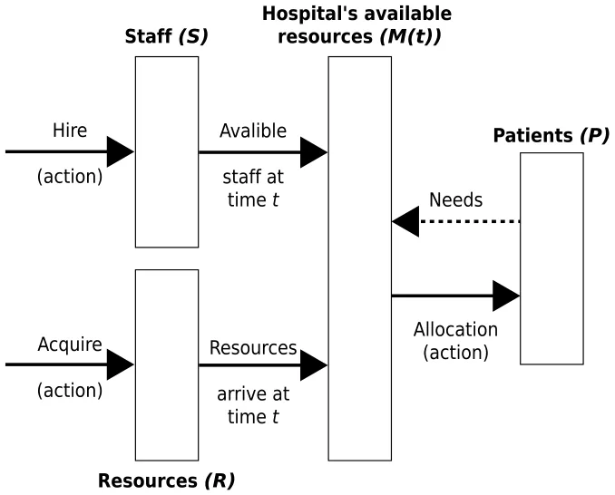
<figcaption><strong>Fig. 1.</strong> A schematic view of the HSRA task, divided into its components and the interactions between them. The ABS is responsible for the patient population and the hospital’s resources interactions, as influenced by the DRL agent’s decisions in the form of staff hiring, resource acquiring, and available resource allocation.</figcaption>
</figure>

Generally. traditional approaches to RSHA rely on heuristic rules, expert judgment, or historical data analysis, which may not capture the complex dynamics and uncertainties of healthcare operations (Jakovljevic, 2013; Talati et al., 2014; Athanassopoulos and Gounaris, 2001; Ordu et al., 2021a; Lowery, 2021). To overcome these limitations, recent studies have proposed using simulation and optimization techniques, combined with machine learning and data analytics, to support decision-making in hospitals (Boehm et al., 2019; Morariu et al., 2020). For instance, Zlotnik et al. (2015) used data from over a thousand beds in hospitals with more than half of a million patients yearly. The authors tested support vector regression, M5P, and stratified average time series with human-in-the-loop, tested with several prediction horizons, from 2 to 24 weeks. The authors showed that while the ML models provide similar and promising outcomes, human intervention significantly increases the model’s performance. Lehaney and Hlupic (1995b) reviewed multiple simulation applications for the healthcare sector with different tasks such as bed planning, anomaly-case prediction and handling, ambulance allocation, and others. The authors conclude that simulation-based solutions that integrate unique features are shown to be promising tools in practice. Liu and Zhang (2016) present a dynamic logistics model for HSRA that can be used to control epidemic diffusion. The authors’ model couples a forecasting mechanism implemented using the Susceptible-Exposed-Infected-Recovered epidemiological model (Lazebnik et al., 2021) and constructed for the demand of medicine in the course of such epidemic diffusion, and a logistics planning system to satisfy the forecasted demand while minimizing the total cost over time.

Another line of work, focused on the more generic task of job scheduling shop problems and its specific implementations in the healthcare domain (P. and K., 2008). For example, Ni et al. (2021)

proposed a multi-graph attributed reinforcement learning based optimization algorithm for a hybrid flow shop scheduling problem. The authors focused on optimizing the sequence of jobs and the assignment of machines to utilize the makespan in warehouses in real-time settings. In a similar manner, Zhang et al. (2020) proposed to automatically learn priority dispatching rules to solve job-shop scheduling problems as manually obtaining them is a time- and resource-consuming task that often requires domain expertise. To this end, the authors utilize the disjunctive graph representation of the problem and a graph neural network showing through several simulated experiments that the agent can learn useful priority dispatching rules while using only a small number of simple features. Despite the promise of this group of models for RSHA, current attempts do not take into consideration the complex dynamics that occur in hospitals and the many types of constraints the algorithm has to comply with in order to produce a feasible outcome. In addition, adoptive scheduling models commonly aim to operate in real-time, as the ones presented above, which is required in our settings. In this work, we partially tackle this issue by formally defining the RSHA task as a resource-bounded optimization task.

In parallel, recent developments in reinforcement learning (RL) in general and deep reinforcement learning (DRL), in particular, have shown to be powerful tools in many resource management and allocation tasks (Mao et al., 2016a; Hurtado Sánchez et al., 2022; Giupponi et al., 2005). For example, Fujimoto et al. (2018) shows that the double deep Q-learning model outperforms other data-driven models for all the tasks included in the OpenAI gym (Brockman et al., 2016) which also includes complex resource management. Schulman et al. (2017) propose a new family of policy gradient methods for RL, which alternate between sampling data through interaction with the environment, and optimizing a ‘‘surrogate’’ objective function using stochastic gradient ascent. The authors show that their method obtains a favorable balance between sample complexity, simplicity, and computational time compared to other RL methods. In addition, other advances in RL allow this method to obtain state-of-the-art performance on a wide range of tasks (Tang et al., 2022; Ma et al., 2021).

Specifically, RL gains popularity in resource allocation tasks (El- Bouri et al., 2021). Hao et al. (2021) propose a hierarchical RL-based model with a decomposed action space to deal with the countless choices to ensure efficient and real-time strategies in the context of resource allocation during the COVID-19 pandemic. To train and test their model, the authors developed a pandemic spreading simulator based on real-world data and showed their model reduces infections and death better than other machine learning models. In this work, we adopt this approach as well. Weltz et al. (2022) reviewed multiple usages of RL in public health, concluding that RL has the potential to make a transformative impact in a range of sequential decision problems in public health, by allocating resources if, when, and where they are most impactful. While the RL and DRL agents differ in their computational formalization, the underline idea is closely similar, showing repeatedly to outperform other computational methods in the healthcare-related resource allocation task (Abdellatif et al., 2018).

## 3. Model definition

We propose an ABS with DRL agent model for the HSRA task**, which is formally defined below**. The ABS environment is used to train a DRL model which later can be deployed in a realistic environment. The ABS is designed to model the interaction between patients, staff, and resources in a hospital setting over time. The DRL agent obtains the hospital state over time and made decisions on the policy level that effecting which kind of patient gets what kind of staff treatment and resources, based on the hospital states over time.

Our approach is inspired by the work of Bushaj et al. (2022), who have used DRL for resource allocation and intervention policies in pandemic control settings. We extend their approach by incorporating a more detailed model of patient demand and hospital resources.

### 3.1. HSRA task definition

Formally, the HSRA is an instance of a resource-bounded optimization task (Fioretto et al., 2018; Sheth and Umbarkar, 2015). Following these lines, HSRA is a function, *𝛷*, that accepts the hospital’s state, *𝑀*(*𝑡*), over a fixed duration, [*𝑡, 𝑡*+ *ℎ*] as defined by the patient’s clinical status, the staff population, and the resources population and returns a matrix, *𝑂*, such that the *𝑜*𝑖,𝑗 ∈ *𝑂* indicates the amount of the *𝑖*𝑡ℎ resource that should be acquired at time *𝑡* + *𝑗*. Since the hospital is limited by some budget, *𝐵* ∈ R+, for a fixed duration [*𝑡*0*, 𝑡*𝑓] such that *𝑡*0 *< 𝑡*𝑓, deriving a HSRA can be formulated as follows:

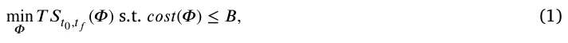

where *𝑇 𝑆*[𝑡0,𝑡𝑓] is a function that returns the average treatment success rate during [*𝑡*0*, 𝑡*𝑓] for *𝛷* and *𝑐𝑜𝑠𝑡*(*𝛷*) is a function that returns the total cost of the HSRA *𝛷*.

### 3.2. Agent-based simulation

The ABS consists of three populations — a patient population (*𝑃*), a staff population (*𝑆*), and a resource population (*𝑅*). The agents of all the population types are represented using a timed finite state machine (Alagar and Periyasamy, 2011). In particular, patients are represented by the following tuple *𝑝* ∈ *𝑃* ∶ *𝑝* ∶= (*𝑡*𝑒*, 𝜏, 𝜈, 𝜋*) where *𝑡*𝑒 ∈ N is the patient’s enter time, *𝜏* ∈ N is the patient’s minimal treatment duration, *𝜈* ∈ N(|𝑅|+|𝑆|)×𝜏 is the matrix of resources and staff required over time, and *𝜋* ∈[1*,* … *𝛱*] is the index of the patient’s disease, such that *𝛱<* ∞. Similarly, staff members are represented by the following tuple *𝑠* ∈ *𝑆* ∶ *𝑠* ∶= (*𝑐, 𝛼, 𝛽, 𝜌*) where *𝑐* ∈ R is the average cost of the staff member for a single step in time she works, *𝛼* ∈ N is the number of time steps a staff member can work in a row, *𝛽* ∈ N is the number of time steps a staff member cannot in a row after working, and *𝜌* ∈{0*,* 1}|𝑅| is a binary classification vector indicates what resources the staff member is able to use for a patient. Resources are represented by the following tuple *𝑟* ∈ *𝑅* ∶ *𝑟* ∶= (*𝑐, 𝛿, 𝑑*) where *𝑐* ∈ R is the cost associated with the resource, *𝛿* ∈ N is the number of time steps from the acquisition of the resource and until it is available to use by the patients, and *𝑑* ∈ N∪∞ is the duration a resource can be used (such as expiry date for medicine).

These populations change over time. First, the arrival of new patients to the hospital is defined by a function over time that does not relate to the hospital’s state. Second, the staff population can grow or shrink according to the hospital’s decision on how much staff to hire at each point in time, under some constraints. Similarly, the amount of resources changes over time as patients consume them and the hospital acquires more of them. The latter two decisions as well as the allocation of staff and resources to the patients are made by the hospital and can be changed every several steps in time, *𝜉* ∈ N. It is assumed the user has a non-negative amount of money *𝜇*(*𝑡*) ∈ R+ in its budget, at each point in time *𝑡*, and it is used to pay for the HSRA. Since hospitals are commonly funded by governments, a fixed budget *𝑏* ∈ R+ is provided to the hospital every *𝜁* ∈ N steps in time. In addition, if a patient’s needs are not met at some step in time *𝑡*∗ ∈[*𝑡*0*, 𝑡*0 + *𝜏*], that a function *𝐷*𝜋(*𝜈, 𝑡*∗) → *𝜈*, that depended on the patient’s disease, updates the needs of the patient and can lengthen its stay. After several times, the function can return that the patient dies.

The ABS is operated in rounds where each round *𝑡* ∈[*𝑡*0*, 𝑡*𝑓] such that *𝑡*0 *< 𝑡*𝑓 *<* ∞. *𝑡* represents a single step in time with a duration that is collaborated by the user. At the first round (*𝑡* = *𝑡*0), the populations (*𝑃, 𝑆, 𝑅*) are allocated, which defines the initial condition of the proposed model. Then, at each round *𝑡*, four processes take place. First, the available staff and resources are computed to define the hospital’s state at time *𝑡*. Afterward, HSRA is computed according to a policy defined by the user. Next, a reward is computed based on the hospital’s and patient population’s states, and published to the user. Pending, a payment for the hospital’s operation is computed and added to the hospital’s budget. Finally, the user updates its policy.

<figure id="fig-2">
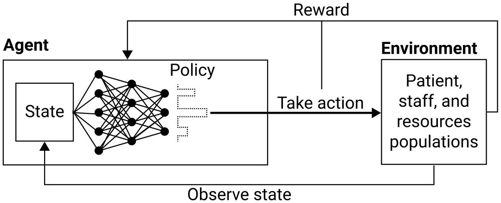
<figcaption><strong>Fig. 2.</strong> The proposed deep reinforcement learning agent’s architecture with policy represented via FcNN. The environment is implemented by the agent based simulation that accepts resource allocation action at each step in time by an agent which gets as a reward the patient treatment success rate as well as the environment’s state.</figcaption>
</figure>

### 3.3. Deep reinforcement learning agent

In order to use a DRL agent, one is required to define an environment, state, action space, and reward function. Moreover, a training procedure should be defined to make sure the agent is exposed to a representative distribution of real-world scenarios. For our usage, we assume an agent aims to optimize a finite horizon of duration *ℎ* ∈ N at each step in time. As described above, the ABS is operating as the DRL agent’s environment. The remaining components are described below.

#### 3.3.1. State

The DRL agent’s state at time *𝑡* is composed of the following information: (a) the state of the three populations (*𝑃* (*𝑡*)*, 𝑆*(*𝑡*)*, 𝑅*(*𝑡*)); (b) the available budget (*𝜇*); (c) a prediction of the new arrival patient population states during the next *ℎ* steps in time ({*𝑃*′(*𝑡*+ *𝑖*) −*𝑃* (*𝑡*)}ℎ 𝑖=1); (d) the amount of money that will be added to the budget during the next *ℎ* steps in time ({*𝑏*I(*𝑚𝑜𝑑*(*𝑡* + *𝑖, 𝜉*) = 0)}ℎ 𝑖=1. As such, we formulate our state as a one-dimensional array containing this information and denoted by *𝑀*(*𝑡*). Formally, the DRL agent’s state for time *𝑡* is:

*𝑀*(*𝑡*) ∶= [*𝑃* (*𝑇*)*, 𝑆*(*𝑡*)*, 𝑅*(*𝑡*)*, 𝜇, 𝑃*′(*𝑡* + 1) − *𝑃* (*𝑡*)*,* … *, 𝑃*′(*𝑡* + *ℎ*) − *𝑃* (*𝑡*)*,*

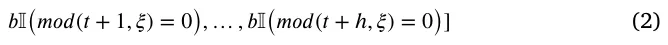

#### 3.3.2. Action

The proposed DRL agent has three actions it should make: hiring staff, acquiring resources, and allocating available staff and resources to patients. Since the first two decisions are integrated, they are treated as one. Moreover, there is a finite number of staff members’ types (i.e., different types of healthcare professionals) and resource types, each one of them is represented by a non-negative vector where its values indicate how much staff hired and resources acquired at time *𝑡*. Regarding the allocation decision, an agent is required to allocate a vector of staff and resources to a set of patients, it is represented using a matrix where the columns are the patients, the rows are the staff and resources, and the matrix values are binary, indicating which staff member or resource allocated to a given patient. For convenience, both vector and matrix are merged into a single vector such that the matrix is padded to the maximal number of patients the hospital is allowed to treat at the same time.

#### 3.3.3. Reward

While there are multiple possible objectives for the HSRA task such as minimal cost and maximum resource utilization, they can be considered secondarily objective to the main objective of hospitals of treating patients. As such, we use the treatment success rate as the reward of the proposed DRL agent. Formally, the reward of the agent at time *𝑡* is as follows:

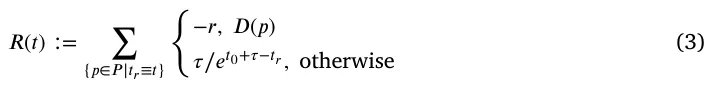

where *𝑡*𝑟 ∈ N is the release date of the patient, *𝑟≫* 1 ∈ R is a punishment score for a case in which a patient dies, and *𝐷*(*𝑝*) is a binary function that gets a patient and returns if it died or not. Intuitively, we assume that a delay in the treatment protocol results in worse performance and dead patients is an outcome that the agent wishes to avoid as much as possible.

#### 3.3.4. Architecture

In this study, we adopted the DRL agent architecture proposed by Mao et al. (2016b). Namely, the agent’s state and policy for this state are operating as the input and output layers of a Fully connected Neural Network (FcNN) (Sainath et al., 2015). This FcNN is used to learn the policy. The action with the highest probability to produce the largest reward is picked for the agent’s action on the environment. As a result, the environment’s state is altered and provided back to the agent, alongside a reward for the action. Namely, we used four fully connected layers with {(1 −0*.*1*𝑗*)*𝑁*𝑖 + (0*.*1 + 0*.*1*𝑗*)*𝑁*𝑜}4 𝑗=1 where *𝑁*𝑖 and *𝑁*𝑜 are the sizes of the input and output layers. All hidden layers have a Leaky ReLU (Xu et al., 2020) activation function following them. We update the policy network parameters using the *rmsprop* (Zou et al., 2019) algorithm with a learning rate of 0.001 and batch size of 8. The hyperparameters values are chosen following the default value from Zou et al. (2019). A schematic view of the agent’s architecture is shown in Fig. 2.

## 4. Experiment setup

The goal of our experiments is to evaluate the performance of our proposed ABS with DRL agent for the HSRA. We want to be flexible and generalize over different possible scenarios and hospital settings. We use a combination of real and synthetic data to train and evaluate the proposed model. The real data is consist of historical records of patient clinical needs, treatment duration, and hospital resources from four community health clinics located in Israel. The data is mapped exactly to the ABS model in Section 3.2. In a complementary manner, the synthetic data will be generated as follows to assure realistic scenarios on the one hand and produce as many cases as needed on the other hand. We define a parametric space for the initial condition, as well as a parametric space for the dynamical process. The first is associated with the patient population, staff population, resource population, and initial amount of money. The latter is associated with the administration rate over time of patients with their needs and the amount of budget the hospital obtains over time. Each scalar parameter is associated with a normally distributed random variable with a mean and standard deviation obtained from the historical data of a real hospital. Non-scaler parameters are divided recursively until scalar parameters are obtained and fitted in the same manner. Using the obtained parameter distributions for both the initial condition and the dynamics, a synthetic instance of the simulation begins by sampling the initial condition distribution. Afterward, at each step in time, new patients as well as the needs of current patients are updated by recursively sampling the related parameter distributions.

To be exact, in the simulation we take into consideration three types of staff members: administrative workers, nurses, and doctors. For simplicity, it is assumed all the staff tasks are associated with the treatment of the patients. In addition, we assume all staff members are identical, different only by their role, ignoring personal professionalize. Moreover, we ignore most employment laws, taking into consideration that staff members cannot work more than 12 h a day, in a row, and must be provided a work of between 160 and 220 h a month.2 Moreover, we assume there are only five types of resources: beds, small-size diagnosis machines, large-size diagnosis machines, surgery rooms, and drugs.

Using the synthetic data, we first train the model on *𝑛* = 10000 instances (i.e., epochs) with a horizon of *ℎ* = 30 days, if not stated otherwise. The parameter source sample from the set of real-world records is picked randomly in a uniform manner. We set a simulation’s step in time to be of a single day (*𝛥𝑡* = 1 day) and the stop condition to be a year (*𝑡*0 = 0*, 𝑡*𝑓 = 365 days). For the DRL agent’s training, we used Algorithm 1 in Bushaj et al. (2022). A summary of the staff and resource amount for the four real-world cases and their distributions is provided in Table 1.

## 5. Results

The following section presents the simulated results of the proposed HSRA. Firstly, we compare the proposed DRL agent with the historical records, checking if it is possible to obtain better results. This allows us to check if the agent learns useful policies for similar scenarios to those it has already been exposed to. Afterward, we examine the agent’s ability to generalize its RHSA policy for both new hospitals and to handle anomalies in the hospitals it trained upon. Next, a sensitivity analysis of the main agent’s hyperparameters is conducted. Finally, a comparison of the proposed model with other resource allocation methods is computed and analyzed. **All experiments are conducted on a Ubuntu 18.04 operation system with a 16-Core (Intel Xeon) LGA 3647 CPU while no other processes are run in parallel.**

### 5.1. Baseline

In order to evaluate the ability of the proposed DRL agent to learn useful HSRA policies, we trained the model on the synthetic data only and tested it on real-world data. Since the historical records define the baseline of the patient’s needs, the treatment success of the historical records would be 100%. However, this is not the case. Therefore, to remedy this bias, we manually divided the patient into 18 groups, based on their initial diagnosis. For each group, the minimal treatment duration, in days, is taken to represent the *optimal* treatment protocol of the patient. Thus, patients with longer treatment durations contributed to the historical records of a treatment success score according to Eq. (3). The results, divided into the four hospitals, are summarized in Table 2.

<figure class="table-figure" id="table-1">
<figcaption><strong>Table 1</strong> A summary of the staff and resource amount for the four real-world cases and their distributions. The real-world mean value is based on historical data from four different health service providers in Israel while the synthetic standard deviations are heuristically set to represent a feasible range for each type of resource.</figcaption>

<table><tr><th>Hospital</th><th>Staff or resource</th><th>Real-world</th><th>Synthetic standard</th></tr><tr><td></td><td></td><td>mean value</td><td>deviation</td></tr><tr><td></td><td>Administrative workers</td><td>18</td><td>3</td></tr><tr><td></td><td>Nurses</td><td>42</td><td>8</td></tr><tr><td></td><td>Doctors</td><td>8</td><td>1</td></tr><tr><td></td><td>Beds</td><td>218</td><td>10</td></tr><tr><td>1</td><td>Small-size diagnosis machines</td><td>24</td><td>2</td></tr><tr><td></td><td>Large-size diagnosis machines</td><td>3</td><td>0</td></tr><tr><td></td><td>Surgery rooms</td><td>1</td><td>0</td></tr><tr><td></td><td>Drugs</td><td>1</td><td>0</td></tr><tr><td></td><td>Administrative workers</td><td>25</td><td>2</td></tr><tr><td></td><td>Nurses</td><td>48</td><td>3</td></tr><tr><td></td><td>Doctors</td><td>10</td><td>0</td></tr><tr><td></td><td>Beds</td><td>266</td><td>12</td></tr><tr><td>2</td><td>Small-size diagnosis machines</td><td>29</td><td>3</td></tr><tr><td></td><td>Large-size diagnosis machines</td><td>2</td><td>0</td></tr><tr><td></td><td>Surgery rooms</td><td>0</td><td>0</td></tr><tr><td></td><td>Drugs</td><td>6220</td><td>810</td></tr><tr><td></td><td>Administrative workers</td><td>50</td><td>7</td></tr><tr><td></td><td>Nurses</td><td>65</td><td>6</td></tr><tr><td></td><td>Doctors</td><td>12</td><td>2</td></tr><tr><td></td><td>Beds</td><td>340</td><td>20</td></tr><tr><td>3</td><td>Small-size diagnosis machines</td><td>40</td><td>4</td></tr><tr><td></td><td>Large-size diagnosis machines</td><td>5</td><td>1</td></tr><tr><td></td><td>Surgery rooms</td><td>3</td><td>0</td></tr><tr><td></td><td>Drugs</td><td>6750</td><td>920</td></tr><tr><td></td><td>Administrative workers</td><td>12</td><td>1</td></tr><tr><td></td><td>Nurses</td><td>8</td><td>2</td></tr><tr><td></td><td>Doctors</td><td>3</td><td>0</td></tr><tr><td></td><td>Beds</td><td>30</td><td>2</td></tr><tr><td>4</td><td>Small-size diagnosis machines</td><td>6</td><td>1</td></tr><tr><td></td><td>Large-size diagnosis machines</td><td>2</td><td>0</td></tr><tr><td></td><td>Surgery rooms</td><td>0</td><td>0</td></tr><tr><td></td><td>Drugs</td><td>680</td><td>90</td></tr></table>

</figure>

<figure class="table-figure" id="table-2">
<figcaption><strong>Table 2</strong> A comparison of the proposed model and historical records with respect to the average treatment success score over a year.</figcaption>

<table><tr><th>Hospital</th><th>Model</th><th>Average treatment success score</th><th>Delta</th></tr><tr><td></td><td>Historical records</td><td>77.47%</td><td></td></tr><tr><td>1</td><td></td><td></td><td>4.82%</td></tr><tr><td></td><td>Proposed model</td><td>82.29%</td><td></td></tr><tr><td></td><td>Historical records</td><td>81.19%</td><td></td></tr><tr><td>2</td><td></td><td></td><td>5.91%</td></tr><tr><td></td><td>Proposed model</td><td>87.10%</td><td></td></tr><tr><td></td><td>Historical records</td><td>86.82%</td><td></td></tr><tr><td>3</td><td></td><td></td><td>3.51%</td></tr><tr><td></td><td>Proposed model</td><td>90.33%</td><td></td></tr><tr><td></td><td>Historical records</td><td>83.05%</td><td></td></tr><tr><td>4</td><td></td><td></td><td>2.69%</td></tr><tr><td></td><td>Proposed model</td><td>85.74%</td><td></td></tr><tr><td>Average ±</td><td>Historical records</td><td>82.13 ± 3.37%</td><td></td></tr><tr><td>standard deviation</td><td>Proposed model</td><td>86.36 ± 2.88%</td><td>4.23 ± 1.23%</td></tr></table>

</figure>

### 5.2. Generalization

An agent’s ability to generalize well for new cases is central in the development of artificially intelligent agents (Ridhawi et al., 2021; Shan et al., 1995). In our case, one can identify two main types of generalization. First, new hospitals with different sizes or distribution of patients’ needs. Second, the ability of the agent to handle anomalies in the patients’ administration rate or needs. To evaluate the agent’s ability in these two cases, we conducted two experiments, as detailed below.

#### 5.2.1. New hospitals

For the evaluation of the ability to generalize for new hospitals, the DRL agent is trained on the synthetic and real-world data of three out of the four hospitals available. Afterward, the agent is tested on the real-world data of the three hospitals used for training as control and on the remaining hospital. Fig. 3 outlines the results of this analysis where the *𝑦*-axis is the average treatment success rate. The average treatment success rate of the control test is the average score of the three hospitals at each time.

<figure id="fig-3">
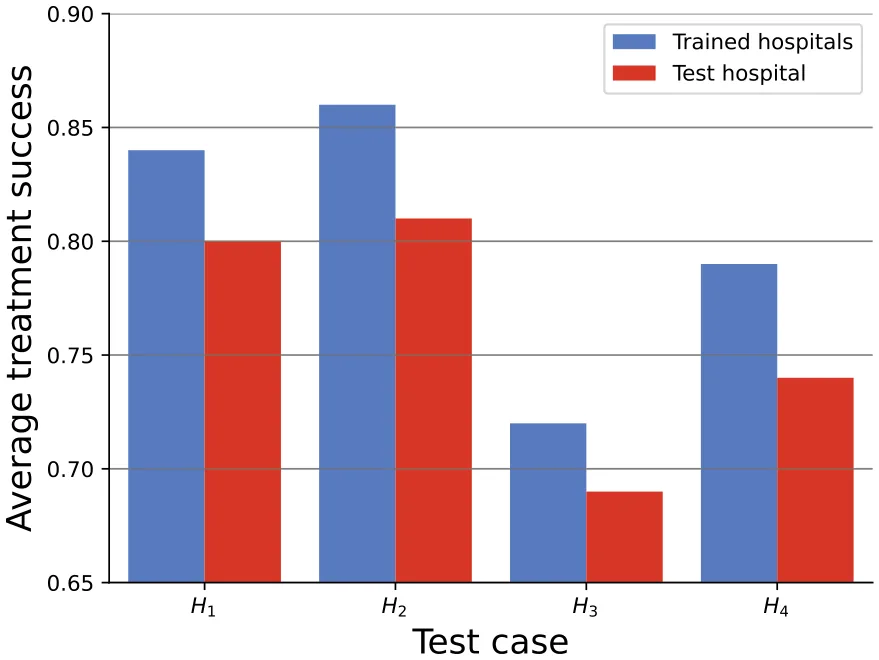
<figcaption><strong>Fig. 3.</strong> The HSRA agent’s average treatment success score for each hospital after training on synthetic and real-world data of the remaining hospitals. Namely, a k-fold cross-validation with <em>𝑘</em> = 4 is presented.</figcaption>
</figure>

<figure id="fig-4">
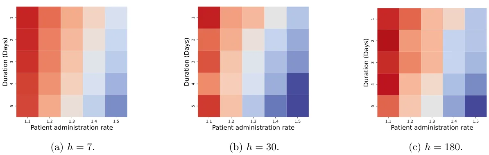
<figcaption><strong>Fig. 4.</strong> The DRL agent’s average treatment success score as a function of anomaly duration and amplitude. The results are shown as the mean of <em>𝑛</em> = 100 repetitions.</figcaption>
</figure>

#### 5.2.2. Anomalies handling

Since hospitals are very now and then handle peaks in patients’ administration rate due to a wide range of social, economic, and natural events such as wars and pandemics (Mowafi et al., 2016; Valdmanis et al., 2010). To simulate these cases, we tested the model’s ability to handle picks in demand following a two-dimensional parameter space. First, the rate between the patients’ administration normal rate and the one during the peak. Second, the duration in days in which the peak is taking place. The beginning of the artificial peak event is decided at random between *𝑡*0 and *𝑇*, in a uniformly distributed manner. Fig. 4 presents the results of this analysis, divide into short-term (*ℎ* = 7), middle-term (*ℎ* = 30), and long-term (*ℎ* = 180) horizons.

In order to evaluate the average influence of the patient administration rate and duration of the peak in patient administration rate on the average treatment success rate, we fitted the results from the simulation using a linear function. Namely, the fitting function is calculated using the least mean square (LMS) method (Bjorck, 1996). The results for the fitting for each horizon value are as follows:

*𝐴𝑇 𝑆𝑅*ℎ=7 = 132*.*01 −0*.*99*𝑃 𝐴𝑅* −43*.*34*𝐷,*

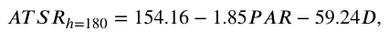

obtained with the coefficient of determination of *𝑅*2 = 0*.*865*,* 0*.*960, and 0.917, respectively; where *𝐴𝑇 𝑆𝑅, 𝑃 𝐴𝑅*, and *𝐷* stands for the average treatment success rate, patient administration rate, and the duration of the peak in patient administration rate, respectively. These fittings

### 5.3. Sensitivity

The agent’s performance is directly dependent on the external factors that define its behavior and constraints. Specifically, the agent’s horizon (*ℎ*), the duration between funding to the hospital budget (*𝜉*), and the amount of funding the hospital receives at a time (*𝜇*). To evaluate the influence of these parameters on the agent’s performance, we examined instances of the agent after re-training for each configuration (Hamby, 1995). We tested the obtained agent each time on *𝑛* = 100 random synthetic instances. Fig. 4 shows the results of the sensitivity analysis.

<figure id="fig-5">
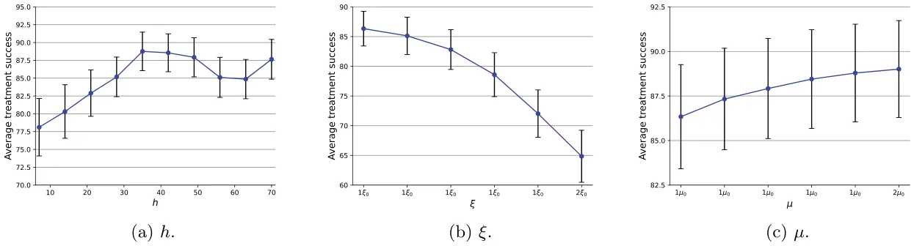
<figcaption><strong>Fig. 5.</strong> Sensitivity analysis of the DRL agent’s treatment success score as a function of several model parameters. The results are shown as the mean ± standard divination of <em>𝑛</em> = 100 repetitions.</figcaption>
</figure>

In order to capture the underline functional dynamics revealed by the sensitivity analysis, we utilized the *SciMED* symbolic regression tool (Simon et al., 2023), obtaining:

*𝐴𝑇 𝑆𝑅*(*𝑇*) = 85*.*59 + 1*.*54*𝜉* −0*.*84*𝜉*2*,*

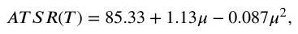

with coefficient of determination *𝑅*2 = 0*.*98 and 0.97, respectively.

*5.4. Comparison*

We compare the performance of the proposed model to three baseline approaches, greedy (Federgruen and Groenevelt, 1986), ML with Discrete-Event Simulation (ML-DES) (Atalan et al., 2022), and an automatic deep learning model (ADL) (Jin et al., 2019). Formally, the greedy algorithm is designed to optimize the treatment success metric for each step in time. The ML-DES algorithm is described in detail in Atalan et al. (2022). We adopt this algorithm in our case by formalizing each patient’s administration as a need. Since the ML-DES is a supervised ML algorithm, the training set is defined to be the set of states, actions, and results used by the proposed algorithm to make sure both algorithms are exposed to the same data. Similarly, we used the ADL algorithm, implemented using the Auto-Keras framework (Jin et al., 2019), and trained on the data generated by the proposed model during its training phase. Fig. 6 shows the performance of all four algorithms where the y-axis is the average treatment success rate presented as mean ± standard deviation of *𝑛* = 100 random and synthetic cases.

## 6. Discussion

In this paper, we solve the hospital staff and resources allocation (HSRA) task using a novel agent-based simulation (ABS) with Deep Reinforcement Learning (DRL) model. In particular, we propose an agent that can be trained to plan ahead and allocate staff and resources under both legal and economic constraints in a stochastic environment. To this end, we used synthetic data originating in real-world data to enrich the training data for the DRL agent. Since the proposed model is based on real data from several healthcare service providers, the following results can be considered to fairly approximate realistic scenarios.

In order to evaluate the proposed model, we compared it to the historical records (see Table 2). It is clear that the agent was able to learn a feasible HSRA policy from synthetic data and *in silico* experiments for realistic settings with 4*.*23±1*.*23% improvement on average for the four hospitals used a test set. The comparison is done under the assumption of the shortest duration treatment protocol of the historical patient with the same diagnosis. This assumption ignores the complexity of differences between patients and the stochastic nature of the treatments required for each one. Nonetheless, this is a common reduction in clinical settings (Verdi et al., 2021). In such settings, these results show improvement over the decision made historically, which is based on an unknown HSRA model.

The baseline results show that the model is able to achieve better results on previous results but one can question if it can generalize to a new hospital without a reach historical records on even none at all. To this end, Fig. 3 shows that the model is able to generalize to other hospitals while training only on a small number of hospitals (namely, three hospitals). That said, a reduction of around four percent in the average treatment success, on average, is revealed by this analysis. This reduction in performance is expected in data-driven-based solutions such as the proposed one (Zhang et al., 2018; Packer et al., 2019; Witty et al., 2021). Moreover, Fig. 4 and Eq. (4) show that the patient administration rate and the duration of the peak in the patient administration rate have a mostly linear relationship to the average treatment success rate such that the duration has slightly more negative effect for all three optimization horizons. This can indicate that a longer anomaly causes the agent to perform more sub-optimal decisions which result in lower performance.

Any HSRA agent is influenced by economic and organizational properties that impact the hospital’s action space and therefore an agent’s policy. We tested three of such properties — the optimization horizon (*ℎ*), the rate at which the hospital receives budget (*𝜉*), and the amount of budget the hospital receives every *𝜉* step in time *𝜇* on the model’s performance, as presented in Figs. 5(a), 5(b), and 5(c), respectively. We found that the optimization horizon, *ℎ*, has a non-linear and even non-monotonic behavior. This outcome is common for DRL operating in complex settings (Hao et al., 2023; Stooke and Abbeel, 2019; Kahn et al., 2018). In addition, we found a cubic decreasing performance for a longer budget duration. Oppositely, a cubic increasing performance is detected for a larger budget. Both are well-known by economics based on both empirical and theoretical studies (O’Reilly et al., 2012; Newhouse, 1970). The fact that these properties are well-known in the literature, supports that the proposed DRL agent is able to capture realistic hospital dynamics and reconstruct pragmatic dynamics associated with hospitals and their funding and management. Moreover, our proposed model can be adapted to other resource allocation, management, and scheduling tasks common in the hospital on various levels such as surgical case scheduling (May et al., 2011). Since Pham and Klinkert (2008) show that the surgical case scheduling is a generalized instance of the job shop scheduling problem, it can be also, in the generic context, efficiently solved by the proposed method.

Moreover, Fig. 6 shows that the proposed model outperforms significantly three such algorithms. Specifically, an ANOVA test (Girden, 1992) results in a *𝑝*-value smaller than 0.05. From the graph, the greedy algorithm obtained an average treatment success of 18.6%. This outcome is expected as the uncertain dynamical nature of hospitals requires planning ahead. Indeed, the ML-DES and ADL algorithms that can plan ahead achieve betters results compared to the greedy algorithm. The ML-DES still obtained poor results as it seems to search for a pattern in the dynamics of the events which is not in the scope of its fidelity due to a large number of parallel processes and parameters participating in the dynamics. Unsurprisingly, the ADL algorithm obtained decent results with an average treatment success rate of around 70% as out-of-the-box deep learning solutions showed promising results in many optimization tasks, given enough data (Marcus and Papaemmanouil, 2018; Cummins et al., 2017; Kreinovich and Kosheleva, 2021). Theoretically, the ADL can be even further improved given a larger training set and deeper architecture (Karmaker et al., 2021). Thus, the better performance of the proposed model compared to others is the usage of DRL, allowing the agent to intelligently sample the action and state space.

<figure id="fig-6">
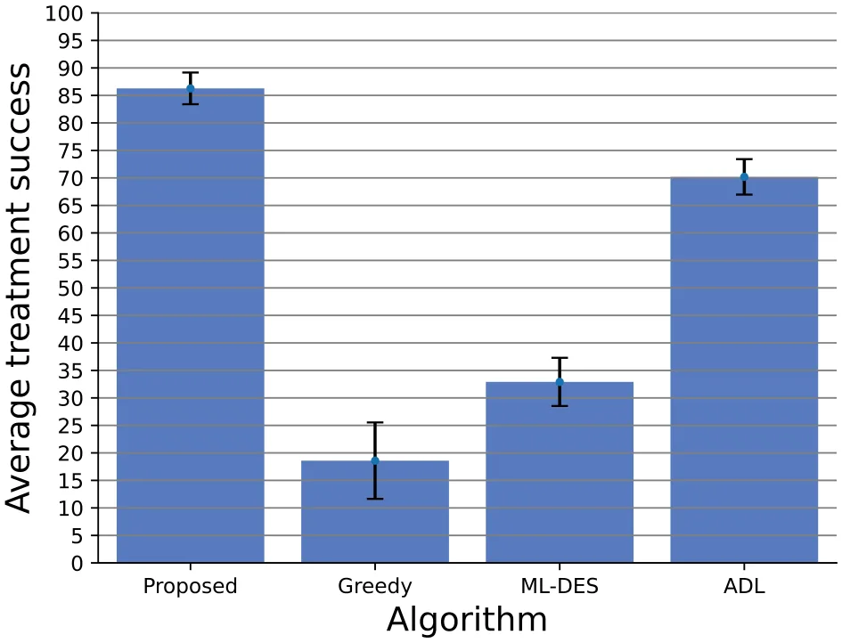
<figcaption><strong>Fig. 6.</strong> A comparison of the proposed model with the greedy, ML-DES, and ADL methods in terms of the average treatment success score. The results are shown as the average of <em>𝑛</em> = 100 random, synthetic cases.</figcaption>
</figure>

When manually analyzed to capture a systematic behavior of the agent over multiple scenarios, it shows that allocating resources for low-risk patients that required fewer treatments (e.g., they have fewer treatment needs) yields better results compared to allocating resources for more demanding cases. While this outcome is expected from a purely computational point of view as the reward for a successful treatment is identical for both cases while the latter consumes more resources from the overall pool. This kind of behavior often collides with the humanitarian, social, and cultural objectives of civil populations. Hence, such objectives can be integrated into the system in order to obtain more balanced results. Nonetheless, this outcome is supported by previous empirical research (Zlotnik et al., 2015; Clark et al., 2015; Kirubarajan et al., 2020). Moreover, algorithms from the scheduling domain can be adopted for the HRSA task and provide similar or even better results. Further investigation in this direction might result in better HRSA models.

Our results suggest that the proposed approach is a promising solution for the HSRA task, with the potential for improved decision-making and resource allocation in hospitals. That said, the proposed model requires relatively a lot of computational power and it is very sensitive to changes in the task’s definition such as changes in employment policies, the introduction of new resource types, or changes in the objective’s definition.

## 7. Conclusion

In this paper, we presented a novel approach for solving the hospital staff and resources allocation (HSRA) task using a Deep Reinforcement Learning (DRL) model in an agent-based simulation (ABS) framework. Our proposed approach is able to learn a feasible HSRA policy from synthetic data and in silico experiments for realistic settings with a 4*.*23 ± 1*.*23% improvement on average compared to historical records. We further demonstrated the generalization ability of our model to new hospitals while training only a small number of hospitals. We evaluated the impact of economic and organizational properties on the model’s performance and found that the optimization horizon, budget duration, and budget size have non-linear and non-monotonic behaviors. Additionally, we compared the proposed model with other optimization algorithms and demonstrated its superiority in terms of average treatment success rate.

The proposed model has several limitations that restrict its usability in real-world scenarios. First, the proposed model does not take into consideration spontaneous events of the staff and resources demand. For example, staff members can get sick, take a vacation, go to a course for professional training, or even resign. In a similar manner, the number of resources can be limited over time due to changes in the supply chain (Shukar et al., 2021). Second, the proposed model assumes a fixed cost for staff and resources over time. This assumption is a good approximation for a short period of time. However, an analysis of longer duration should integrate a more complex employee payment model and resources cost over time (Giri and Chudhuri, 1997; Franklin et al., 2001). Third, the model takes into consideration only patient-facing staff such as doctors and nurses, and neglects the complex organizational operation required by a hospital. In the same manner, the patient-facing staff is assumed to have only treatment-related tasks while in practice additional administrative tasks are commonly part of their duties. Fourth, the model assumes simple employment laws for the staff, which is normally not the case as a wide range of regulations and laws limits the operation space a hospital has on how to manage its staff (Witkoski and Dickson, 2010; Springer, 1971; Munnich, 2014). Fifth, the proposed model does not handle the case of patients that are known to pass from the beginning even if their needs are met. This extension of the model raises also ethical questions as treating such patients is mathematically non-optimal (Hinkka et al., 2001; Swartz, 1985; De Vries and Plaskota, 2017). Sixth, during the training phase of the DRL agent, we used only the treatment success rate, ignoring secondary objectives such as minimal cost and maximum resource utilization. Thus, introducing these objectives with lower weight to the agent’s loss function might result in even better policies. **Seventh, we adopt the DRL’s architecture from** Zou et al. (2019) **which obtained them for a different dataset and use-case entirely. As such, one can obtain even sightly better results by performing a hyperparameter tuning and architecture search.** Finally, it is assumed that each patient has a perfect analysis and a known treatment plan. However, this is not true most of the time (Meyer et al., 2021; Korb and Blackie, 2015). This results in an additional level of uncertainty in the HSRA agent’s decision-making process. As possible future work, one can remedy one or more of these limitations to obtain more realistic HSRA simulations and agents.

## Funding

This research did not receive any specific grant from funding agencies in the public, commercial, or not-for-profit sectors.

## Declaration of competing interest

The authors declare that they have no known competing financial interests or personal relationships that could have appeared to influence the work reported in this paper.

## Data availability

Data will be made available on request.

## Notes

2 For more details, refer to https://www.nevo.co.il/law\_html/law01/p222\_001.htm (in Hebrew).

## References

- Abdellatif, A.A., Mhaisen, N., Chkirbene, Z., Mohamed, A., Erbad, A., Guizani, M., 2018. Reinforcement learning for intelligent healthcare systems: A comprehensive survey. In: arXiv. [link](http://refhub.elsevier.com/S0952-1976%2823%2900967-3/sb1)
- Alagar, V.S., Periyasamy, K., 2011. Extended finite state machine. In: Specification of Software Systems. Springer London, pp. 105–128. [link](http://refhub.elsevier.com/S0952-1976%2823%2900967-3/sb2)
- Anderson, D., Bjarnadottir, M.V., Nenova, Z., 2022. Machine learning in healthcare: Operational and financial impact. In: Babich, V., Birge, J.R., Hilary, G. (Eds.), Innovative Technology at the Interface of Finance and Operations: Volume I. Springer International Publishing, pp. 153–174. [link](http://refhub.elsevier.com/S0952-1976%2823%2900967-3/sb3)
- Arnold, D., Girling, A., Stevens, A., Lilford, R., 2009. Comparison of direct and indirect methods of estimating health state utilities for resource allocation: review and empirical analysis. BMJ 339, b2688. [link](http://refhub.elsevier.com/S0952-1976%2823%2900967-3/sb4)
- Asante, A.D., Zwi, A.B., 2009. Factors influencing resource allocation decisions and equity in the health system of Ghana. Public Health 123 (5), 371–377. [link](http://refhub.elsevier.com/S0952-1976%2823%2900967-3/sb5)
- Atalan, A., Şahin, H., Atalan, Y.A., 2022. Integration of machine learning algorithms and discrete-event simulation for the cost of healthcare resources. Healthcare 10 (10). [link](http://refhub.elsevier.com/S0952-1976%2823%2900967-3/sb6)
- Athanassopoulos, A., Gounaris, C., 2001. Assessing the technical and allocative efficiency of hospital operations in greece and its resource allocation implications. European J. Oper. Res. 133 (2), 416–431. [link](http://refhub.elsevier.com/S0952-1976%2823%2900967-3/sb7)
- Bjorck, A., 1996. Numerical Methods for Least Squares Problems, Vol. 5. Society for Industrial and Applied Mathmatics, pp. 497–513. [link](http://refhub.elsevier.com/S0952-1976%2823%2900967-3/sb8)
- Boehm, M., Antonov, I., Baunsgaard, S., Dokter, M., Ginthör, R., Innerebner, K., Klezin, F., Lindstaedt, S., Phani, A., Rath, B., et al., 2019. SystemDS: A declarative machine learning system for the end-to-end data science lifecycle. arXiv preprint arXiv:1909.02976. [link](http://arxiv.org/abs/1909.02976)
- Brockman, G., Cheung, V., Pettersson, L., Schneider, J., Schulman, J., Tang, J., Zaremba, W., 2016. Openai gym. In: arXiv. [link](http://refhub.elsevier.com/S0952-1976%2823%2900967-3/sb10)
- Bushaj, S., Yin, X., Beqiri, A., et al., 2022. A simulation-deep reinforcement learning (SiRL) approach for epidemic control optimization. Ann. Oper. Res.. [link](http://refhub.elsevier.com/S0952-1976%2823%2900967-3/sb11)
- Chen, J.H., Asch, S.M., 2017. Machine learning and prediction in medicine - Beyond the peak of inflated expectations. N. Engl. J. Med. 376 (26), 2507–2509. [link](http://refhub.elsevier.com/S0952-1976%2823%2900967-3/sb12)
- Clark, A., Moule, P., Topping, A., Serpell, M., 2015. Rescheduling nursing shifts: scoping the challenge and examining the potential of mathematical model based tools. J. Nurs. Manag. 23 (4), 411–420. [link](http://refhub.elsevier.com/S0952-1976%2823%2900967-3/sb13)
- Cummins, C., Petoumenos, P., Wang, Z., Leather, H., 2017. End-to-End deep learning of optimization heuristics. In: 2017 26th International Conference on Parallel Architectures and Compilation Techniques (PACT). pp. 219–232. [link](http://refhub.elsevier.com/S0952-1976%2823%2900967-3/sb14)
- De Vries, K., Plaskota, M., 2017. Ethical dilemmas faced by hospice nurses when administering palliative sedation to patients with terminal cancer. Palliat. Support. Care 15 (2), 148–157. [link](http://refhub.elsevier.com/S0952-1976%2823%2900967-3/sb15)
- El-Bouri, R., Taylor, T., Youssef, A., Zhu, T., Clifton, D.A., 2021. Machine learning in patient flow: a review. Prog. Biomed. Eng. 3 (2), 022002. [link](http://refhub.elsevier.com/S0952-1976%2823%2900967-3/sb16)
- Elitzur, R., Krass, D., Zimlichman, E., 2023. Machine learning for optimal test admission in the presence of resource constraints. Health Care Manage.. [link](http://refhub.elsevier.com/S0952-1976%2823%2900967-3/sb17)
- Fagerstrom, L., 2009. Evidence-based human resource management: a study of nurse leaders’ resource allocation. J. Nurs. Manag. 17 (4), 415–425. [link](http://refhub.elsevier.com/S0952-1976%2823%2900967-3/sb18)
- Federgruen, A., Groenevelt, H., 1986. The greedy procedure for resource allocation problems: Necessary and sufficient conditions for optimality. Oper. Res. 34 (6), 909–918. [link](http://refhub.elsevier.com/S0952-1976%2823%2900967-3/sb19)
- Fiedrich, F., Gehbauer, F., Rickers, U., 2000. Optimized resource allocation for emergency response after earthquake disasters. Saf. Sci. 35 (1), 41–57. [link](http://refhub.elsevier.com/S0952-1976%2823%2900967-3/sb20)
- Fioretto, F., Pontelli, E., Yeoh, W., 2018. Distributed constraint optimization problems and applications: A survey. European J. Oper. Res. 61. [link](http://refhub.elsevier.com/S0952-1976%2823%2900967-3/sb21)
- Franklin, D., Richard, E., Michael, M.H., 2001. A statistical analysis of weekday operating room anesthesia group staffing costs at nine independently managed surgical suites. Anesth. Analg. 92 (6), 1493–1498. [link](http://refhub.elsevier.com/S0952-1976%2823%2900967-3/sb22)
- Fujimoto, S., van Hoof, H., Meger, D., 2018. Addressing function approximation error in actor-critic methods. In: Proceedings of the 35th International Conference on Machine Learning. 80, PMLR, pp. 1587–1596. [link](http://refhub.elsevier.com/S0952-1976%2823%2900967-3/sb23)
- Girden, E.R., 1992. ANOVA: Repeated Measures, Vol. 84. Sage. [link](http://refhub.elsevier.com/S0952-1976%2823%2900967-3/sb24)
- Giri, B.C., Chudhuri, K.S., 1997. Heuristic models for deteriorating items with shortages and time-varying demand and costs. Internat. J. Systems Sci. 28 (2), 153–159. [link](http://refhub.elsevier.com/S0952-1976%2823%2900967-3/sb25)
- Giupponi, L., Agusti, R., Perez-Romero, J., Sallent, O., 2005. A novel joint radio resource management approach with reinforcement learning mechanisms. In: PCCC 2005. 24th IEEE International Performance, Computing, and Communications Conference, 2005.. pp. 621–626. [link](http://refhub.elsevier.com/S0952-1976%2823%2900967-3/sb26)
- Guilmeau, T., Chouzenoux, E., Elvira, V., 2021. Simulated annealing: a review and a new scheme. In: 2021 IEEE Statistical Signal Processing Workshop (SSP). pp. 101–105. [link](http://refhub.elsevier.com/S0952-1976%2823%2900967-3/sb27)
- Gupta, D., Denton, B., 2008. Appointment scheduling in health care: Challenges and opportunities. IIE Trans. 40 (9), 800–819. [link](http://refhub.elsevier.com/S0952-1976%2823%2900967-3/sb28)
- Hamby, D.M., 1995. A comparison of sensitivity analysis techniques. Health Phys. 68 (2), 195–204. [link](http://refhub.elsevier.com/S0952-1976%2823%2900967-3/sb29)
- Hao, Q., Xu, F., Chen, L., Hui, P., Li, Y., 2021. Hierarchical reinforcement learning for scarce medical resource allocation with imperfect information. In: Proceedings of the 27th ACM SIGKDD Conference on Knowledge Discovery & Data Mining. pp. 2955–2963. [link](http://refhub.elsevier.com/S0952-1976%2823%2900967-3/sb30)
- Hao, J., Yang, T., Tang, H., Bai, C., Liu, J., Meng, Z., Liu, P., Wang, Z., 2023. Exploration in deep reinforcement learning: A comprehensive survey. In: arXiv. [link](http://refhub.elsevier.com/S0952-1976%2823%2900967-3/sb31)
- Harris, J.E., 1977. The internal organization of hospitals: Some economic implications. Bell J. Econ. 8 (2), 467–482. [link](http://refhub.elsevier.com/S0952-1976%2823%2900967-3/sb32)
- Hinkka, H., Kosunen, E., Metsanoja, R., Lammi, U.-K., Kellokumpu-Lehtinen, P., 2001. To resuscitate or not: a dilemma in terminal cancer care. Resuscitation 49 (3), 289–297. [link](http://refhub.elsevier.com/S0952-1976%2823%2900967-3/sb33)
- Hurtado Sánchez, J.A., Casilimas, K., Caicedo Rendon, O.M., 2022. Deep reinforcement learning for resource management on network slicing: A survey. Sensors 22 (8). [link](http://refhub.elsevier.com/S0952-1976%2823%2900967-3/sb34)
- Jakovljevic, M.B., 2013. Resource allocation strategies in southeastern european health policy. Eur. J. Health Econ. 14, 153–159. [link](http://refhub.elsevier.com/S0952-1976%2823%2900967-3/sb35)
- Jin, H., Song, Q., Hu, X., 2019. Auto-Keras: An efficient neural architecture search system. In: Proceedings of the 25th ACM SIGKDD International Conference on Knowledge Discovery & Data Mining. pp. 1946–1956. [link](http://refhub.elsevier.com/S0952-1976%2823%2900967-3/sb36)
- Kahn, G., Villaflor, A., Ding, B., Abbeel, P., Levine, S., 2018. Self-supervised deep reinforcement learning with generalized computation graphs for robot navigation. In: 2018 IEEE International Conference on Robotics and Automation (ICRA). pp. 5129–5136. [link](http://refhub.elsevier.com/S0952-1976%2823%2900967-3/sb37)
- Karmaker, S.K., Hassan, M.M., Smith, M.J., Xu, L., Zhai, C., Veeramachaneni, K., 2021. Automl to date and beyond: challenges and opportunities. ACM Comput. Surv. 54 (8), 1–36. [link](http://refhub.elsevier.com/S0952-1976%2823%2900967-3/sb38)
- Khashayar, V., Jason, R., Samir, F., 2007. Optimizing physician staffing and resource allocation: Sine-wave variation in hourly trauma admission. J. Trauma: Injury Infect. Crit. Care 62 (3), 610–614. [link](http://refhub.elsevier.com/S0952-1976%2823%2900967-3/sb39)
- Kirubarajan, A., Taher, A., Khan, S., Masood, S., 2020. Artificial intelligence in emergency medicine: A scoping review. J. Am. Coll. Emerg. Phys. Open 1 (6), 1691–1702. [link](http://refhub.elsevier.com/S0952-1976%2823%2900967-3/sb40)
- Korb, D.R., Blackie, C.A., 2015. ‘‘Dry eye’’ is the wrong diagnosis for millions. Optom. Vis. Sci. 92 (9). [link](http://refhub.elsevier.com/S0952-1976%2823%2900967-3/sb41)
- Kotsiantis, S.B., 2007. Supervised machine learning: A review of classification techniques. Informatica 249–268. [link](http://refhub.elsevier.com/S0952-1976%2823%2900967-3/sb42)
- Kreinovich, V., Kosheleva, O., 2021. Optimization under uncertainty explains empirical success of deep learning heuristics. In: Pardalos, P.M., Rasskazova, V., Vrahatis, M.N. (Eds.), Black Box Optimization, Machine Learning, And No-Free Lunch Theorems. pp. 195–220. [link](http://refhub.elsevier.com/S0952-1976%2823%2900967-3/sb43)
- Kwak, N.K., Lee, C., 1997. A linear goal programming model for human resource allocation in a health-care organization. J. Med. Syst. 21, 129–140. [link](http://refhub.elsevier.com/S0952-1976%2823%2900967-3/sb44)
- Lazebnik, T., Bunimovich-Mendrazitsky, S., Shaikhet, L., 2021. Novel method to analytically obtain the asymptotic stable equilibria states of extended SIR-type epidemiological models. Symmetry 13 (7). [link](http://refhub.elsevier.com/S0952-1976%2823%2900967-3/sb45)
- Lehaney, B., Hlupic, V., 1995a. Simulation modelling for resource allocation and planning in the health sector. J. R. Soc. Health 115 (6), 382–385. [link](http://refhub.elsevier.com/S0952-1976%2823%2900967-3/sb46)
- Lehaney, B., Hlupic, V., 1995b. Simulation modelling for resource allocation and planning in the health sector. J. R. Soc. Health 115 (6), 382–385. [link](http://refhub.elsevier.com/S0952-1976%2823%2900967-3/sb47)
- Liu, M., Zhang, D., 2016. A dynamic logistics model for medical resources allocation in an epidemic control with demand forecast updating. J. Oper. Res. Soc. 67 (6), 841–852. [link](http://refhub.elsevier.com/S0952-1976%2823%2900967-3/sb48)
- Lowery, J.C., 2021. Simulations of a hospital’s surgical suite and critical care area. J. Oper. Res. Soc. 72 (3), 485–500. [link](http://refhub.elsevier.com/S0952-1976%2823%2900967-3/sb49)
- Luscombe, R., Kozan, E., 2016. Dynamic resource allocation to improve emergency department efficiency in real time. European J. Oper. Res. 255 (2), 593–603. [link](http://refhub.elsevier.com/S0952-1976%2823%2900967-3/sb50)
- Ma, Y., Hao, X., Hao, J., Lu, J., Liu, X., Xialiang, T., Yuan, M., Li, Z., Tang, J., Meng, Z., 2021. A hierarchical reinforcement learning based optimization framework for large-scale dynamic pickup and delivery problems. In: Ranzato, M., Beygelzimer, A., Dauphin, Y., Liang, P.S., Vaughan, J.W. (Eds.), Advances in Neural Information Processing Systems, Vo. 34. pp. 23609–23620. [link](http://refhub.elsevier.com/S0952-1976%2823%2900967-3/sb51)
- Mao, H., Alizadeh, M., Menache, I., Kandula, S., 2016a. Resource management with deep reinforcement learning. In: Proceedings of the 15th ACM Workshop on Hot Topics in Networks. Association for Computing Machinery, pp. 50–56. [link](http://refhub.elsevier.com/S0952-1976%2823%2900967-3/sb52)
- Mao, H., Alizadeh, M., Menache, I., Kandula, S., 2016b. Resource management with deep reinforcement learning. In: Proceedings of the 15th ACM Workshop on Hot Topics in Networks. Association for Computing Machinery, pp. 50–56. [link](http://refhub.elsevier.com/S0952-1976%2823%2900967-3/sb53)
- Marcus, R., Papaemmanouil, O., 2018. Towards a hands-free query optimizer through deep learning. In: arXiv. [link](http://refhub.elsevier.com/S0952-1976%2823%2900967-3/sb54)
- May, J.H., Spangler, W.E., Strum, D.P., Vargas, L.G., 2011. The surgical scheduling problem: current research and future opportunities. Prod. Oper. Manage. 20 (3), 392–405. [link](http://refhub.elsevier.com/S0952-1976%2823%2900967-3/sb55)
- Meyer, F.M.L., Filipovic, M.G., Balestra, G.M., Tisljar, K., Sellmann, T., Marsch, S., 2021. Diagnostic errors induced by a wrong a priori diagnosis: A prospective randomized simulator-based trial. J. Clin. Med. 10 (4). [link](http://refhub.elsevier.com/S0952-1976%2823%2900967-3/sb56)
- Moleman, M., Zuiderent-Jerak, T., Lageweg, M., van den Braak, G.L., Schuitmaker- Warnaar, T.J., 2022. Doctors as resource stewards? Translating high-value, cost-conscious care to the consulting room. Health Care Anal. 30, 215–239. [link](http://refhub.elsevier.com/S0952-1976%2823%2900967-3/sb57)
- Morariu, C., Morariu, O., Raileanu, S., Borangiu, T., 2020. Machine learning for predictive scheduling and resource allocation in large scale manufacturing systems. Comput. Ind. 120, 103244. [link](http://refhub.elsevier.com/S0952-1976%2823%2900967-3/sb58)
- Mowafi, H., Hariri, M., Alnahhas, H., Ludwig, E., Allodami, T., Mahameed, B., Koly, J.K., Aldbis, A., Saqqur, M., Zhang, B., Al-Kassem, A., 2016. Results of a Nationwide Capacity Survey of Hospitals Providing Trauma Care in War-Affected Syria. JAMA Surg. 151 (9), 815–822. [link](http://refhub.elsevier.com/S0952-1976%2823%2900967-3/sb59)
- Munnich, E.L., 2014. The labor market effects of California’s minimum nurse staffing law. Health Econ. 23 (8), 935–950. [link](http://refhub.elsevier.com/S0952-1976%2823%2900967-3/sb60)
- Newhouse, J.P., 1970. Toward a theory of nonprofit institutions: An economic model of a hospital. Am. Econ. Rev. 60 (1), 64–74. [link](http://refhub.elsevier.com/S0952-1976%2823%2900967-3/sb61)
- Ni, F., Hao, J., Lu, J., Tong, X., Yuan, M., Duan, J., Ma, Y., He, K., 2021. A multi-graph attributed reinforcement learning based optimization algorithm for large-scale hybrid flow shop scheduling problem. In: Proceedings of the 27th ACM SIGKDD Conference on Knowledge Discovery & Data Mining. pp. 3441–3451. [link](http://refhub.elsevier.com/S0952-1976%2823%2900967-3/sb62)
- Nurcahyani, I., Lee, J.W., 2021. Role of machine learning in resource allocation strategy over vehicular networks: A survey. Sensors 21 (19). [link](http://refhub.elsevier.com/S0952-1976%2823%2900967-3/sb63)
- Ordu, M., Demir, E., Tofallis, C., Gunal, M.M., 2021a. A novel healthcare resource allocation decision support tool: A forecasting-simulation-optimization approach. J. Oper. Res. Soc. 72 (3), 485–500. [link](http://refhub.elsevier.com/S0952-1976%2823%2900967-3/sb64)
- Ordu, M., Demir, E., Tofallis, C., Gunal, M.M., 2021b. A novel healthcare resource allocation decision support tool: A forecasting-simulation-optimization approach. J. Oper. Res. Soc. 72 (3), 485–500. [link](http://refhub.elsevier.com/S0952-1976%2823%2900967-3/sb65)
- O’Reilly, J., Busse, R., Häkkinen, U., Or, Z., Street, S., Wiley, M., 2012. Paying for hospital care: the experience with implementing activity-based funding in five European countries. Health Econ. Policy Law 7 (1), 73–101. [link](http://refhub.elsevier.com/S0952-1976%2823%2900967-3/sb66)
- P., D.-N., K., A., 2008. Surgical case scheduling as a generalized job shop scheduling problem. European J. Oper. Res. 185 (3), 1011–1025. [link](http://refhub.elsevier.com/S0952-1976%2823%2900967-3/sb67)
- Packer, C., Gao, K., Kos, J., Krähenbühl, P., Koltun, V., Song, D., Packer, C., Gao, K., Kos, J., Krähenbühl, P., Koltun, V., Song, D., 2019. Assessing generalization in deep reinforcement learning. In: arXiv. [link](http://refhub.elsevier.com/S0952-1976%2823%2900967-3/sb68)
- Pham, D.-N., Klinkert, A., 2008. Surgical case scheduling as a generalized job shop scheduling problem. European J. Oper. Res. 185 (3), 1011–1025. [link](http://refhub.elsevier.com/S0952-1976%2823%2900967-3/sb69)
- Ridhawi, I.A., Otoum, S., Aloqaily, M., Boukerche, A., 2021. Generalizing AI: Challenges and opportunities for plug and play AI solutions. IEEE Netw. 35 (1), 372–379. [link](http://refhub.elsevier.com/S0952-1976%2823%2900967-3/sb70)
- Sainath, T.N., Vinyals, O., Senior, A., Sak, H., 2015. Convolutional, long short-term memory, fully connected deep neural networks. In: 2015 IEEE International Conference on Acoustics, Speech and Signal Processing (ICASSP). pp. 4580–4584. [link](http://refhub.elsevier.com/S0952-1976%2823%2900967-3/sb71)
- Schulman, J., Wolski, F., Dhariwal, P., Radford, O., 2017. Proximal policy optimization algorithms. In: arXiv. [link](http://refhub.elsevier.com/S0952-1976%2823%2900967-3/sb72)
- Shan, N., Ziarko, W., Hamilton, H.J., Cercone, N., 1995. Using rough sets as tools for knowledge discovery. In: KDD-95 Proceedings. pp. 263–268. [link](http://refhub.elsevier.com/S0952-1976%2823%2900967-3/sb73)
- Sheth, P., Umbarkar, A., 2015. Constrained optimization problems solving using evolutionary algorithms: A review. In: 2015 International Conference on Computational Intelligence and Communication Networks (CICN). pp. 1251–1257. [link](http://refhub.elsevier.com/S0952-1976%2823%2900967-3/sb74)
- Shukar, S., Zahoor, F., Hayat, K., Saeed, A., Gillani, A.H., Omer, S., Hu, S., Babar, Z.- U.-D., Fang, Y., Yang, C., 2021. Drug shortage: causes, impact, and mitigation strategies. Front. Pharmacol. 12. [link](http://refhub.elsevier.com/S0952-1976%2823%2900967-3/sb75)
- Simon, L., Liberzon, A., Lazebnik, T., 2023. A computational framework for physics-informed symbolic regression with straightforward integration of domain knowledge. Sci. Rep.. [link](http://refhub.elsevier.com/S0952-1976%2823%2900967-3/sb76)
- Springer, E.W., 1971. Medical staff law and the hospital. N. Engl. J. Med. 285 (17), 952–959. [link](http://refhub.elsevier.com/S0952-1976%2823%2900967-3/sb77)
- Stooke, A., Abbeel, P., 2019. Accelerated methods for deep reinforcement learning. In: arXiv. [link](http://refhub.elsevier.com/S0952-1976%2823%2900967-3/sb78)
- Swartz, M., 1985. The patient who refuses medical treatment: A dilemma for hospitals and physicians. Am. J. Law Med. 11 (2), 147–194. [link](http://refhub.elsevier.com/S0952-1976%2823%2900967-3/sb79)
- Talati, S., Bhatia, P., Kumar, A., Gupta, A.K., Ojha, C.D., 2014. Strategic planning and designing of a hospital disaster manual in a tertiary care, teaching, research and referral institute in india. World J. Emerg. Med. 5 (1), 35–41. [link](http://refhub.elsevier.com/S0952-1976%2823%2900967-3/sb80)
- Tang, H., Meng, Z., Hao, J., Chen, C., Graves, D., Li, D., Yu, C., Mao, H., Liu, W., Yang, Y., Tao, W., Wang, L., 2022. What about inputting policy in value function: policy representation and policy-extended value function approximator. In: Proceedings of the AAAI Conference on Artificial Intelligence, Vol. 36. pp. 8441–8449, (8). [link](http://refhub.elsevier.com/S0952-1976%2823%2900967-3/sb81)
- Valdmanis, V., Bernet, P., Moises, J., 2010. Hospital capacity, capability, and emergency preparedness. European J. Oper. Res. 207 (3), 1628–1634. [link](http://refhub.elsevier.com/S0952-1976%2823%2900967-3/sb82)
- Verdi, S., Marquand, A.F., Schott, J.M., Cole, J.H., 2021. Beyond the average patient: how neuroimaging models can address heterogeneity in dementia. Brain 144 (10), 2946–2953. [link](http://refhub.elsevier.com/S0952-1976%2823%2900967-3/sb83)
- Wang, J.-B., Wang, J., Wu, Y., Wang, J.-Y., Zhu, H., Lin, M., Wang, J., 2018. A machine learning framework for resource allocation assisted by cloud computing. IEEE Netw. 32 (2), 144–151. [link](http://refhub.elsevier.com/S0952-1976%2823%2900967-3/sb84)
- Weltz, J., Volfovsky, A., Laber, E.B., 2022. Reinforcement learning methods in public health. Clin. Ther. 44 (1), 139–154. [link](http://refhub.elsevier.com/S0952-1976%2823%2900967-3/sb85)
- Witkoski, A., Dickson, V.V., 2010. Hospital staff nurses’ work hours, meal periods, and rest breaks: A review from an occupational health nurse perspective. AAOHN J. 58 (11), 489–497. [link](http://refhub.elsevier.com/S0952-1976%2823%2900967-3/sb86)
- Witty, S., Lee, J.K., Tosch, E., Atrey, A., Clary, K., Littman, M.L., Jensen, D., 2021. Measuring and characterizing generalization in deep reinforcement learning. Appl. AI Lett. 2 (4), e45. [link](http://refhub.elsevier.com/S0952-1976%2823%2900967-3/sb87)
- Xu, H., Fang, Y., Chou, C.-A., Luo, L., 2023. A reinforcement learning-based optimal control approach for managing an elective surgery backlog after pandemic disruption. Health Care Manage.. [link](http://refhub.elsevier.com/S0952-1976%2823%2900967-3/sb88)
- Xu, J., Li, Z., Du, B., Zhang, M., Liu, J., 2020. Reluplex made more practical: Leaky relu. In: 2020 IEEE Symposium on Computers and Communications (ISCC). pp. 1–7. [link](http://refhub.elsevier.com/S0952-1976%2823%2900967-3/sb89)
- Zhang, C., Song, W., Cao, Z., Zhang, J., Tan, P.S., Xu, C., 2020. Learning to dispatch for job shop scheduling via deep reinforcement learning. In: 34th Conference on Neural Information Processing Systems. [link](http://refhub.elsevier.com/S0952-1976%2823%2900967-3/sb90)
- Zhang, C., Vinyals, O., Munos, R., Bengio, S., 2018. A study on overfitting in deep reinforcement learning. In: arXiv. [link](http://refhub.elsevier.com/S0952-1976%2823%2900967-3/sb91)
- Zlotnik, A., Gallardo-Antolin, A., Alfaro, M.C., Perez, M.C.R., Martinez, J.M.M., 2015. Emergency department visit forecasting and dynamic nursing staff allocation using machine learning techniques with readily available open-source software. Comput. Inform. Nurs. 33 (8), 368–377. [link](http://refhub.elsevier.com/S0952-1976%2823%2900967-3/sb92)
- Zou, F., Shen, L., Jie, Z., Zhang, W., Liu, W., 2019. A sufficient condition for convergences of adam and RMSProp. In: Proceedings of the IEEE/CVF Conference on Computer Vision and Pattern Recognition (CVPR). [link](http://refhub.elsevier.com/S0952-1976%2823%2900967-3/sb93)
