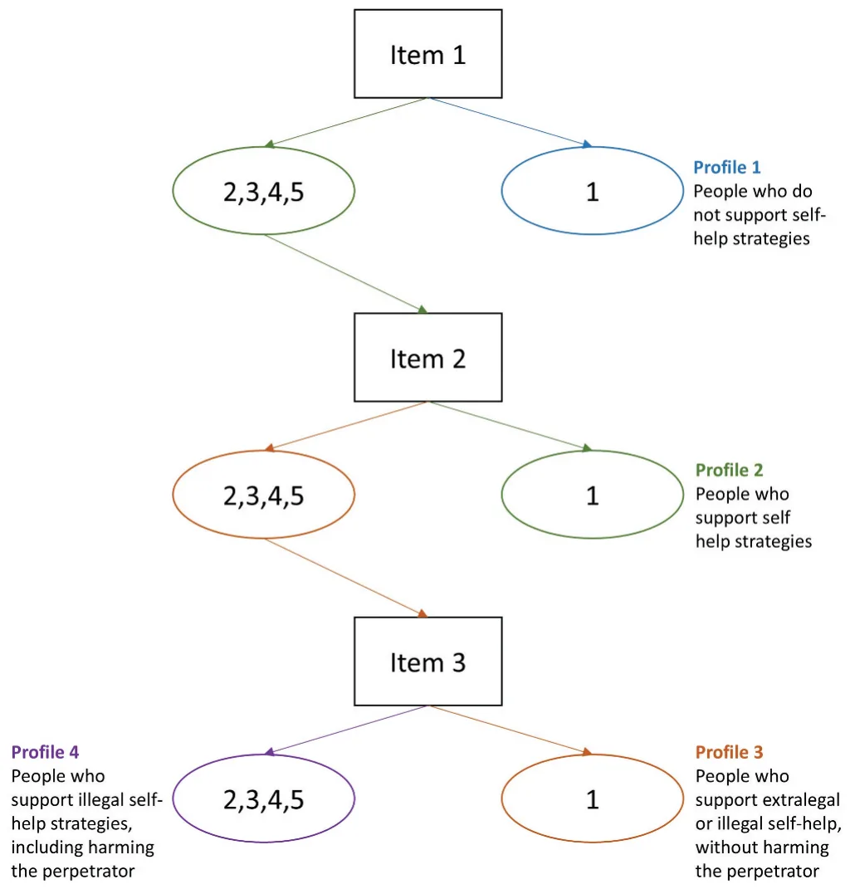
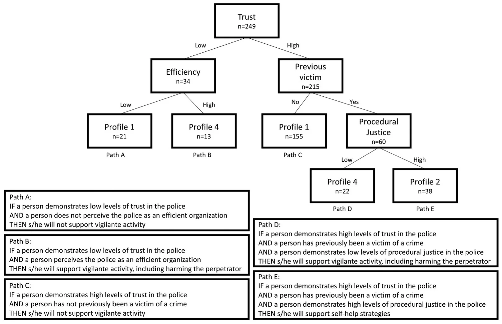

## Introduction

Compliance with the law and the authorities is a crucial matter in the field of public administration and policy research. The literature has long been captivated by the complex interplay of the factors that motivate individuals to either adhere to the law or transgress it. Ongoing research has sought to unravel the complexities shaping citizens’ compliance with or defiance of the law. In the attempt to understand the psychology behind these behaviors, Tyler’s (2006, 1990) seminal work, *Why People Obey the Law*, explored the reasons people obey – and break – the law. Since then, researchers have explored the factors that influence and determine people’s willingness to comply with the law and with the public administrators in charge of implementing it (Gofen et al. 2019; Im et al. 2014; Mizrahi 2012). In particular, some have focused on the tendency of certain individuals, such as crime victims, to resort to self-help, sometimes illegal, strategies (Edri-Peer and Cohen 2023, 2024; Haas, de Keijser, and Bruinsma 2014).

Self-help (or self-provision) strategies are considered informal methods used by individuals and groups to satisfy their immediate interests and need for services, as they attempt to improve their outcomes through extralegal or illegal strategies (Mizrahi 2012). The use of such self-help strategies among citizens, especially in the context of law enforcement agencies, encompasses greater concerns about the state’s monopoly of the use of power, indicating that people are questioning the authorities’ ability to perform their duties (Tankebe 2009). Thus, identifying those who are likely to act as deviants is vital, because the alternative, illegal provision of public services, in this case, administering justice, might make people less willing to comply with the authorities in broader areas and damage their view of the authorities’ legitimacy (Tyler 2004).

The literature acknowledges several factors that may explain self-help deviant behavior among citizens. These factors are associated with citizens’ perceptions of the performance of state’s authorities and are mostly divided into outcome-related variables (Hirschman 1970), such as efficiency and distributive justice (Cohen and Filc 2017; Mizrahi 2012; Tankebe 2009) and process-related variables such as trust and procedural justice (Edri-Peer and Cohen 2023; Gau & Brunson, 2015).

Although numerous studies have independently examined these variables, a systematic, integrated analysis of the factors explaining self-help strategies is still missing. Thus, our aim is to develop such a profile based on the significant factors that have been previously studied. This profile may help identify those likely to engage in such behavior and provide tools for minimizing this phenomenon.

To this end, we employ a quantitative design, using survey data of self-reported attitudes of 461 participants collected in Israel. To create the profile of the deviant citizen, we use the popular decision tree model (Lazebnik and Bunimovich-Mendrazitsky 2023; Swain and Hauska 1977). This method is designed to detect significant interactive effects between factors and suggest a combination of factors for optimal predictions. Social scientists use this method for identifying subgroups (Deslauriers-Varin 2022).

Our study makes several contributions to theory and practice regarding self-help strategies. With regard to theory, we propose a profile of potential deviant citizens. As mentioned, the literature refers to several factors that may independently influence this behavior (Haas, de Keijser, and Bruinsma 2014; Tankebe 2009). However, we examine the influence of all of these factors together and create several classifications of profiles of deviant citizens and self-help strategies. Empirically, we use a decision tree to develop our classifications. Previous studies have investigated a subgroup of the relationships we explored using traditional statistical methods, such as regressions. However, our approach is novel in using a new method to research illegal self-help – the decision tree model. From a policy perspective, this profiling approach allows for the identification of distinct population segments with higher propensity to support self-help strategies, thereby enabling policymakers to design more targeted interventions and communication strategies aimed at mitigating such behaviors.

The rest of this paper is structured as follows. Initially, we define self-help behaviors among citizens and explore the factors that researchers have established to explain this phenomenon. Then, we describe the methodology used to create the profiles of the deviant citizens, and the use of decision tree analysis in this process. Afterward, we present our findings and the different profiles that emerged from the collected data. Finally, we discuss the meaning of these findings and propose possible future studies that could be promising.

Self-help Strategies: Definition Self-help in the context of public service delivery refers to informal methods used by individuals and groups to satisfy their immediate interests and need for services, as they attempt to improve their outcomes through extralegal or illegal strategies (Mizrahi 2012). The literature often draws on Hirschman’s (1970) “Exit, Voice, Loyalty” framework to understand how dissatisfied service recipients react (Dowding and John 2008; Gofen 2012; James and Jilke 2017; Peeters, Gofen, and Meza 2020). According to Hirschman, individuals faced with declining service quality can either exit, by abandoning the provider, or voice their discontent in an effort to change the status quo. These responses are not mutually exclusive and can influence one another and are often shaped by the degree of loyalty individuals feel toward the provider.

While Hirschman originally argued that exiting public services is often not a viable option, later research introduced the concept of quasi-exit, a form of partial withdrawal whereby individuals find alternative ways to secure the desired service (Lehman-Wilzig 1991; Lyons and Lowery 1986; Mizrahi 2012; Rusbult and Lowery 1985). In such cases, people bypass official channels and informally procure the public good themselves. This has also been conceptualized as entrepreneurial exit, where citizens actively create substitute service arrangements (Gofen 2012), and as a form of co-production in which individuals take over parts of public service provision (Howlett 2024).

The phenomenon of self-help has been examined in various policy contexts. For instance, Golan- Nadir, Cohen, and Rubin (2020) analyzed how public officials influence the development of alternative religious services. In the health sector, Cohen (2012) and Cohen and Filc (2017) showed how citizens engage in informal and illegal transactions, referred to as “black medicine,” to obtain better healthcare services.

Importantly, while individuals may perceive these actions as legitimate necessary or even heroic (Meade and Castle 2022), especially in contexts of institutional failure or limited access, states and legal authorities often view them as deviant. From a governance perspective, self-help challenges the state’s monopoly over the legitimate use of force and its exclusive authority in dispute resolution. As Black (1983) argues, although self-help may operate as an informal mechanism of social control, it is classified as deviance by legal institutions precisely because it circumvents formal legal processes and authority.

When it comes to policing, this type of behavior is often described as vigilantism. Vigilantism has been conceptualized in diverse and sometimes conflicting ways, with ongoing debates about who engages in such actions, what forms they take, and the motivations behind them (Cubellis, Evans, and Fera 2019; Dumsday 2009; Johnston 1996, Tankebe, 2009; Weisburd 1988). While some scholars associate vigilantism primarily with violence (Moncada 2017; Rosenbaum and Sederberg 1974), others propose broader definitions that include a range of illegal but nonviolent responses to perceived wrongdoing. Black (1983) famously framed vigilantism as a subset of “self-help,” characterized by unilateral, extralegal action to resolve grievances.

This study adopts a definition grounded in the work of Haas, de Keijser, and Bruinsma (2012, 2014), who view vigilantism as deliberate, illegal action by civilians in response to crime or perceived threat. This approach is broad enough to encompass a range of behaviors while maintaining a clear boundary. Importantly, vigilantism can escalate in severity, ranging from symbolic gestures of resistance to acts of physical harm.

Self-help: Explanations The literature recognizes that people’s willingness to support or engage in self-help responses is driven by strong justice motivations that are shaped by social context. According to Adams and Mullen (2014), civilians may act either to restore a sense of moral balance through retribution or to prevent future harm by protecting their community when they believe authorities are not doing enough. Thus, individuals who perceive the law and its agents as illegitimate or ineffective are more likely to disengage from formal institutions and consider alternative forms of action (Sampson and Bartusch 1998).

These motivations do not operate in isolation, rather, they are influenced by perceptions of how state representatives respond, shared norms about security and order, and social expectations regarding the appropriate boundaries of citizen action. From this perspective, self-help can also be understood as a form of informal social control that emerges when formal institutions are perceived as weak or unresponsive (Sampson, Raudenbush, and Earls 1997). As such, the social environment plays a crucial role in shaping the psychological processes through which civilians decide whether to intervene when formal enforcement appears insufficient.

### Outcome-related factors

According to the literature, exiting public services is associated with perceptions regarding the outcome (Hirschman 1970). Thus, self-help or self-provision can occur because of gaps in distributive justice, meaning a gap between the desired outcome and the actual outcome of the official response (Cohen 2012; Cohen and Filc 2017; Exline et al. 2003). Deviant behavior is a way for the citizen to reduce this perceived gap and regain a sense of justice being served. This phenomenon occurs when citizens do not want the involvement of official authorities, when these authorities fail to provide the service, or when the authorities are involved but not to the satisfaction of these citizens (Adinkrah 2005).

Similarly, researchers have highlighted the importance of people’s perceptions regarding the efficiency and responsiveness of public service suppliers in this decision (Ballucci and Drakes 2021; Mizrahi 2012). In the context of policing, Haas (2010) claimed that the response to crime victims’ complaints is the major reason for their decision to use extralegal or illegal self-help strategies. Studies have demonstrated an association between the responsiveness of the police and support for vigilantism (Haas, de Keijser, and Bruinsma 2014). Others have examined the relationship between perceptions about the police’s efficiency and citizens’ attitudes toward illegal self-provision of justice (Tankebe 2009).

### Process-related factors

Theories of distributive justice maintain that people seek a fair allocation of resources and want to receive the outcomes they believe they deserve. Nevertheless, theories of procedural justice suggest that the process is important as well (Cohen and Headley 2024), as people are affected by the resource allocation process itself and their experience with the authorities (Tyler 1990). Consistent with defiance theory, perceptions of unfair or ineffective treatment by authorities may lead individuals to reject formal rules and engage in oppositional or extralegal behaviors (Sherman 1993). The literature shows that the decision-making process is significant because it indicates to citizens their value and place in society (Lind and Tyler 1988). Processes that lack procedural justice prevent citizens from voicing their concerns and imply that decisions are being made based on personal opinions (Huo 2003; Lind and Tyler 1988; Tyler and Blader 2003).

Several studies have found this factor to be important in the context of extralegal or illegal self-help strategies and deviancy. Gua and Brunson (2015) demonstrated how citizens who felt the police were not acting in a procedurally just manner resorted to self-help strategies. Moule et al. (2019) found that procedural justice is associated with the concept of “the code of the street,” which includes violent self-help. Other studies have explored the relationship between procedural justice and the concept of vigilantism specifically (Edri-Peer and Cohen 2023; Tankebe 2009).

Another important factor that concerns the process is trust and confidence in the police. Trust is particularly relevant when discussing civic engagement and cooperation (Yang 2008) and is an important predictor of noncompliance behavior (Im et al. 2014; Tankebe 2009). Indeed, several studies maintain that the confidence that people have in the police is associated with support for extralegal or illegal self-help strategies (Haas, de Keijser, and Bruinsma 2012, 2014; Zizumbo-Colunga 2010, 2017). This contention accords with the theories about procedural justice, because one of the main characteristics of procedural justice refers to the trustworthiness of the decision maker (Tyler 2004).

### Personal characteristics

The literature has discussed several demographic factors such as age, education and income, and their relationship with extralegal or illegal self-help behavior. Previous findings suggest that older people and less educated people are more likely to take matters into their own hands (Tankebe 2009). As for income, studies maintain that low levels of income and the marginality of minority groups are also associated with such tendencies (Gua & Brunson, 2015). Gender, on the other hand, has proven insignificant (Tankebe 2009). Indeed, there are findings suggesting that deviant clients can be both men and women (Haas, de Keijser, and Bruinsma 2012; White and Rastogi 2009; Wilke 2023).

In the context of policing, another factor that may be important is whether the person was previously the victim of a crime. Studies show that previous encounters with the police shape people’s perceptions of police legitimacy (Gau and Brunson 2010; Lorenz 2023; Mazerolle et al. 2013; Miller and Hefner 2015). Crime victims are particularly sensitive to such encounters (Ballucci and Drakes 2021; Murphy and Barkworth 2014; Vinod Kumar 2018). Researchers have reported that they are strongly affected by the way the authorities treat them when filing their complaint, and in terms of their responsiveness and responsibility (Edri-Peer and Cohen 2023; Skogan 2006). Studies on the subject have indicated that victims of a crime who have filed a complaint with the police are often dissatisfied with the service and treatment given to them (Skogan 2005). Such experiences may influence people’s decision to take the law into their own hands and not to wait for the police to respond the next time they are victimized (Edri-Peer and Cohen 2023).

Despite these findings, prior research has not examined all of these factors together. To address this gap, we analyzed how these factors are interrelated and used the results to classify individuals based on their support for vigilante behavior. These categories may help not only identify potential vigilantes but also improve our understanding of the mechanisms that lead to such behavior, ultimately contributing to efforts to minimize it.

## Methodology

***The context: Israeli citizens and the Israeli police*** We investigated this phenomenon by focusing on self-help activities in Israel and the Israeli National Police. The Israeli National Police is an established law enforcement organization with a presence in local communities throughout the country and responsibilities, strategies, and constraints similar to those of police agencies in many Western democracies (Jonathan-Zamir and Harpaz 2018; Jonathan- Zamir, Weisburd, and Hasisi 2015). Like police forces globally, the Israeli National Police is responsible for preventing and combating crime (Cohen and Hertz 2020). In 2024, Israel’s population was approximately 9.8 million, served by 36,013 police personnel, corresponding to roughly 3.7 police personnel per 1,000 residents (Israel Police 2024). During the same year, the national crime rate stood at 28.8 criminal investigation cases per 1,000 residents (Israel Police 2024).

Despite crime rates that are broadly comparable to those of other OECD countries, public perceptions of safety and confidence in the police remain relatively modest (IDI 2016). According to the 2024 Israeli Democracy Index, only 37% of Israelis reported trust in the police, placing it among the least trusted public and security institutions in the country (Hermann et al. 2024). These characteristics provide important context for understanding police-citizen interactions and discretionary decision-making within the Israeli policing environment.

Nevertheless, there is empirical evidence supporting the existence of extralegal or illegal self-help activities in Israel, even among otherwise law-abiding citizens (Edri-Peer and Cohen 2023, 2024).

### Sample

To create the profile of a deviant citizen, we collected data from a sample of 551 Israeli citizens in September 2022. An a priori sample size calculation was conducted using conventional assumptions (α = .05, power = .80). Assuming a four-category outcome variable, the analysis indicated a target sample size of approximately 562 respondents. Thus, the achieved sample closely matched the calculated target.

We used an Internet panel of participants from iPanel, an Israeli research institute commonly used by Israeli scholars. While panel surveys are a common method in the social sciences (Lehdonvirta et al. 2021), they have some weaknesses, such as selection bias and panel attrition (Lohse, Bellman, and Johnson 2000). To mitigate these limitations, we structured the sample to closely mirror the characteristics of the Israeli population.

To balance sample size and response quality, we restricted the analysis to respondents with sufficiently complete data. Specifically, we excluded respondents who completed the questionnaire in less than one-third of the average completion time and those who did not complete the questionnaire. As a result, the final analytical sample included 461 participants, representing 83% of the original sample.

<figure class="table-figure" id="table-1">
<figcaption><strong>Table 1.</strong> Descriptive demographic statistics.</figcaption>

<table><tr><th></th><th>N</th><th>% in sample</th><th>% in population</th><th>Total</th></tr><tr><td>Age</td><td></td><td></td><td></td><td>461</td></tr><tr><td>18–34</td><td>158</td><td>34.2</td><td>35</td><td></td></tr><tr><td>35–54</td><td>165</td><td>35.7</td><td>37</td><td></td></tr><tr><td>55+</td><td>138</td><td>29.9</td><td>29</td><td></td></tr><tr><td>Gender</td><td></td><td></td><td></td><td>445</td></tr><tr><td>Man</td><td>223</td><td>50.1</td><td>49</td><td></td></tr><tr><td>Woman</td><td>222</td><td>49.8</td><td>51</td><td></td></tr><tr><td>Religion</td><td></td><td></td><td></td><td>454</td></tr><tr><td>Israeli Jews</td><td>367</td><td>80.8</td><td>80</td><td></td></tr><tr><td>Israeli Arabs</td><td>77</td><td>16.9</td><td>17</td><td></td></tr><tr><td>Other</td><td>11</td><td>2.4</td><td>3</td><td></td></tr><tr><td>Income Level (Average = App. 3,100$)</td><td></td><td></td><td></td><td>442</td></tr><tr><td>Below Average</td><td>237</td><td>53.6</td><td>66</td><td></td></tr><tr><td>Average or above</td><td>205</td><td>46.2</td><td>34</td><td></td></tr><tr><td>Education</td><td></td><td></td><td></td><td>455</td></tr><tr><td>Academic</td><td>146</td><td>32</td><td>32</td><td></td></tr><tr><td>Non-Academic</td><td>309</td><td>67.9</td><td>68</td><td></td></tr><tr><td>Previous Victimization</td><td>127</td><td>28</td><td>n/a</td><td>453</td></tr></table>

</figure>

To ensure that these exclusions did not introduce systematic bias, we compared included and excluded respondents on key demographic variables (age and gender) using a Kolmogorov-Smirnov test. The results indicated no statistically significant differences between the groups (*p* > .05), suggesting that the final sample did not differ systematically from those excluded.

The composition of the final sample broadly aligns with the demographic distribution of the Israeli population, as reported by the Israeli Central Bureau of Statistics (see Table 1), suggesting reasonable representativeness across key characteristics. Of the total sample, 50.1% identified as men and 49.9% as women, closely resembling the proportions in the general population (49% and 51%, respectively). The respondents’ age distribution was also similar to that of the Israeli population. Individuals aged 18–34 comprised 34.2% of the sample (35% in the population), those aged 35–54 comprised 35.6% (37% in the population), and those aged 55 and older comprised 29.9% (29% in the population).

With regard to education, 32% of the participants had an academic degree (bachelor’s degree or higher), mirroring 32% of the entire population. In terms of ethnicity, 80.8% of the participants identified as Israeli Jews, while 16.9% identified as Israeli Arabs, mirroring to some extent the population distribution of approximately 80% and 17%, respectively. The remaining 2.4% reported other ethnic backgrounds. In the Israeli context, ethnicity and religion also plays a central role in defining majority and minority groups. When considering the income distribution, 53.6% had a monthly income below the average in Israel for 2022 (approximately $3,100), 46.2 had an income around the average or above. Additionally, 28% of the participants indicated that they had been victims of a crime in the past, but only 53% of those individuals had filed a complaint with the police.

Overall, the typical participant in our study was a middle-aged Israeli adult, almost equally likely to be a man or a woman, with about one-third holding an academic degree. Most participants identified as Jewish and roughly half reported earning below the national average income. About one-quarter had been victims of crime in the past, though only half of those filed a complaint with the police. This profile reflects the demographic characteristics of the broader Israeli population and situates our findings within that social context.

### Measures

We utilized established measures previously used and validated in studies on procedural and distributive justice, trust, efficiency, and extralegal or illegal self-help strategies (Haas, de Keijser, and Bruinsma 2012, 2014; Sunshine and Tyler 2003; Tankebe 2009). Our questionnaire was adapted to the context of this study, including translation into Hebrew and adjustments to ensure cultural relevance and measure attitudes toward self-help across varying levels of severity. The participants indicated the degree to which they agreed with the statements we presented to them on a Likert scale ranging from 1 to 5.

To ensure construct validity and reduce measurement error, we conducted a confirmatory factor analysis (CFA). The measurement model was an acceptable fit with the data according to multiple fit indices (RMSEA = .05; CFI = .97; TLI = .96). See Appendix for factor loadings. Internal consistency was evaluated using Cronbach’s alpha, and results for all variables, including the newly constructed self-help measure, demonstrated acceptable reliability.

*Procedural justice* was measured on a 7-item scale. Items were based on the elements of procedural justice (Tyler 1990): the ability to have a voice, respectful treatment, neutrality, and trustworthiness. For example, participants were asked to indicate the degree to which they agreed with statements such as: “The police treat all citizens equally,” “The police treat all citizens with respect,” and “The police follow through on their decisions and promises they make.” The consistency of this variable was *a* = .94.

*Distributive justice* was measured with one item: “In my opinion, the actions of the police result in fair outcomes for citizens.”

*Trust* was measured with three items referring to trust in different levels of the police force: “I trust the police,” “I trust the police officers in Israel,” and “I trust the police commissioners in Israel.” The consistency of this variable was *a* = .92.

*Efficiency* was measured using a 3-item scale, referring to the efficiency of the police and their responsiveness to people’s needs. Examples of the items are: “The police work efficiently” and “The police respond promptly to calls about crimes.” The consistency of this variable was *a* = .85.

*Attitudes toward self-help strategies* were measured using a 3-item scale referring to general attitudes toward the activity: “If a victim of a crime feels that s/he is not receiving an adequate response from the police, s/he is allowed to act on his/her own in order to obtain justice for himself/herself or for those close to him/her” (Item 1); “If a victim of a crime feels that the police cannot protect him/her, it is okay for him/her to take the law into his/her own hands” (Item 2); and “In my opinion, a victim of a crime is allowed to harm the person who harmed him” (Item 3). The consistency of this variable was *a* = .78.

### Profiles

The items in the *attitudes toward strategies* scale can be used to create profiles. The items on the scale escalate in the severity of the behavior, with each item being more severe than the item before it. The first item refers to acting on your own in response to inadequate treatment from the police, the second item speaks of taking the law into your own hands, i.e. breaking the law, after feeling unprotected. While these two items speak in general terms of the type of reaction, the last item refers to actual harm to the perpetrator. Thus, these items demonstrate an escalation in people’s attitudes.

Respondents who disagreed with the first statement were allocated to profile 1. Respondents who agreed to some extent with the statement (ranging from 2–5) proceeded to the next item and were allocated to a profile based on the said protocol. Ultimately, this process yielded four profiles: (1) people who do not support self-help strategies; (2) people who support self-help strategies; (3) people who support extralegal or illegal self-help, without harming the perpetrator; and (4) people who support illegal self-help strategies, including harming the perpetrator. Figure 1 illustrates how we allocated the participants to the various profiles.

However, due to the very small number of participants classified under Profile 3, this profile was omitted from the final analysis. The limited size of this group made it statistically unreliable and retaining it would have compromised the robustness of the findings. Thus, while the initial classification scheme was theoretically derived and included four profiles, the decision tree analysis empirically validated only four profiles, of which three were ultimately used in the modeling process. Technically, during the training of the decision tree model, we provided all four profiles but during the post pruning phase (i.e., the procedure taking place after the initial development of the decision tree which remove leaf nodes recursively to improve the generalization capabilities of the model) the third profile is omitted.

<figure id="fig-1">

<figcaption><strong>Figure 1.</strong> Profiles of deviant clients.</figcaption>
</figure>

### Data analysis

We conducted a four-step analysis using the data. Initially, we computed and examined the statistical properties of the dataset. Subsequently, we divided the data into training and validation groups to train a decision tree model and evaluate the results. We then developed a machine learning based model, the decision tree model, in order to capture the non-linear patterns in our data.1 Finally, we assessed the significance of each parameter in predicting the individual’s profile based on the model. All analyses were carried out using the Python programming language (version 3.8.5).

At the outset, we conducted a statistical examination of the data, analyzing the distribution of the categorical features of all 461 people in the dataset. Next, we divided the study’s population into a training group, from which the proposed model was derived, and a validation group, which was used to test the performance of the resulting model. We employed the widely used cross-validation approach (Jung 2018), which iteratively splits the study’s population into training and validation sets to obtain a statistically robust evaluation of a prediction tool’s performance (Wong and Yeh 2020). Specifically, we adopted the k-fold cross-validation method, dividing the data into *k* groups of equal size that are pairwise distinct. Each group serves as the validation group in turn, while the remaining groups constitute the training sets. The average performance of the model across these validation results provides an overall estimation of its performance. Specifically, we maintained similar demographic properties in each group using the popular “directed bee colony optimization” algorithm (Rajeswari et al. 2017), which is commonly used to this purpose (Forsati, Keikha, and Shamsfard 2015;

Glebov et al. 2023). In this case, this algorithm searches for 5 subsets of the data of equal size such that the co-distribution of the demographic variables between them is the smallest.

Next, for each partition of the data into training and validation groups, we used the decision tree model (Rokach 2016). A decision tree is constructed by dividing the data recursively based on the most informative features – usually by the statistical information gain that such a division creates. The algorithm identifies the optimal decision points by evaluating the features that best discriminate between data points. This hierarchical structure, resembling a flowchart, culminates in terminal nodes providing final predictions or classifications. The decision tree is trained using the training group. Validation ensures the tree accurately predicts behaviors or phenomena. Once established, it facilitates systematic decision-making about new, unseen data by traversing the branches according to feature values, represented by the validation group. We fine-tuned the model using the grid-search method to improve its performance in terms of accuracy (LaValle, Branicky, and Lindemann 2004). This method determines which parameters is necessary for the decision tree to use the optimal number of branches to predict the outcome in the most accurate way (Lazebnik and Bunimovich-Mendrazitsky 2023).

Lastly, we assessed the importance of the parameters using the information gain method (Wu and Xu 2015). Simply put, we iteratively removed one feature at a time from the model, retrained it, and recorded the average accuracy based on the k-fold cross-validation analysis. This method, which we used with every feature in the model, resulted in an accuracy score for each excluded feature. Thereafter, we introduced a new parameter to the proposed model, generated by sampling from a normal distribution with a mean of 0 and a standard deviation of 1. Finally, we normalized all values to ensure that their sum equaled 1 to indicate the importance of the proposed model’s features.

## Findings

Decision tree models are used primarily for classification and prediction (Massou, Prodromitis, and Papastamou 2022). Each path through a decision tree model represents a rule for creating a classification or making a prediction. We used decision tree analysis to create a model that would help us predict support for self-help strategies based on four profiles. In total, five variables were included in the model, based on previous theoretical relationships about support for and the tendency to engage in self-help strategies in the context of policing (Edri-Peer and Cohen 2023; Haas, de Keijser, and Bruinsma 2012, 2014; Tankebe 2009): efficiency, trust, procedural justice, distributive justice, and previous victimization; and five demographic variables identified in the literature.2 The decision tree has a classification accuracy of 45% and the mean correct is 41%. These results suggest that the tree is a modest fit for the data. Nevertheless, relative to a 25% baseline in a four-category classification, this represents a substantial improvement over random assignment.

Figure 2 illustrates the routes that establish the profiles of deviant citizens. While we began our examination using four possible profiles, our data indicate that there are, in fact, three central profiles – as profile 3 was eliminated in the decision tree analysis. Thus, we were left with profile 1, which refers to people who do not support self-help strategies at all, profile 2, which refers to people willing to use self-help strategies, and profile 4, which refers to people willing to use illegal self-help strategies and even harm the perpetrator. We can understand that once people support extralegal or illegal self-help activity even to a small extent, they are more likely to accept the use of violent strategies as well.

After identifying the remaining profiles, we continued to explore the factors that researchers have indicated characterize the different profiles. While most of our findings are consistent with theory, there are findings that require further consideration. The analysis identified specific interactive effects and excluded several factors from the analysis. Interestingly, through this process, we eliminated distributive justice as a factor, even though previous research has maintained that it is a major factor related to self-help strategies in the context of policing (Exline et al. 2003). The decision tree also excluded all of the demographic variables as factors. Decision tree models, particularly those based on recursive partitioning such as in our case, are designed to optimize prediction by selecting variables that produce the greatest reduction in impurity at each split. Consequently, variables with more global or additive effects, such as demographic covariates, may be omitted if they do not contribute substantial discriminatory power in conditional subgroups.

<figure id="fig-2">

<figcaption><strong>Figure 2.</strong> Deviant clients profiles using decision tree analysis.</figcaption>
</figure>

Decision tree analysis involves an iterative process at each branch of the tree, starting with the factor that has the strongest relationship with the outcome variable. The strongest factor in our analysis is *trust*. The next two important factors are *efficiency of the police* and whether the respondent is a *previous crime victim*. Next is *procedural justice.*

The right-hand part of the tree presents some interesting findings. The division into this part of the tree is associated with high levels of trust (trust > 1.167). Respondents with high levels of trust split to this side, then split again under the variable *previous crime victim*. The decision tree assigned respondents who have high levels of trust and were not victims of a crime in the past to profile 1. Respondents who have high levels of trust and were victims of a crime in the past were split once again under the *procedural justice* variable. The decision tree assigned respondents who reported high levels of procedural justice (PJ > 1.875) to profile 2, and those who reported low levels of procedural justice (PJ ≤ 1.875) to profile 4. Thus, people who have high levels of trust and were not previously a victim of a crime do not support self-help strategies. In contrast, for those who have high levels of trust but were victims of a crime in the past, procedural justice is a decisive factor in their decision about whether to support self-help strategies or to support illegal self-help activity, including harming the perpetrator.

While the right-hand part of the tree matches the theory regarding self-help and deviant behavior, the left-hand part of the tree provides findings that appear inconsistent with initial theoretical expectations. Here, the initial division in the tree also concerns trust. Respondents with low levels of trust (trust ≤ 1.167) split to this side, then split again under the *efficiency of the police* variable. However, surprisingly, the decision tree assigned respondents with low levels of trust who regard the police as inefficient (efficiency ≤ 1.167) to profile 1. In contrast, it assigned those with low levels of trust who regard the police as efficient (efficiency > 1.167) to profile 4.

## Discussion and conclusions

Our main goal was to develop a model for identifying and classifying deviant citizens based on their attitudes toward self-help strategies. Using decision tree analysis, we demonstrated how factors previously suggested in the literature interrelate and can help create specific profiles of possible deviancy. Furthermore, while our examination began with four suggested profiles, our analysis revealed that there are, in fact, just three profiles.

Altogether, our findings demonstrate that process-related factors such as trust and procedural justice in the police play an important role in shaping people’s support for self-help strategies. This outcome accords with previous findings that demonstrate the important role of procedural justice in the work of police officers with crime victims (Edri-Peer and Cohen 2023), as well as the role of trust in promoting the legitimacy of law enforcement agencies (Zhang, Li, and Yang 2022; Tyler, 2006). Indeed, trust is an important factor in shaping the relationship between state agencies and the public (Bouckaert and Van de Walle 2003; Van Ryzin 2007). Studies maintain that trust, both institutional trust and interpersonal trust, is important for the cooperation of citizens with such agencies (Campos- Castillo et al. 2016; Sunshine and Tyler 2003). Furthermore, perceptions about the trustworthiness of the frontline workers of the public sector such as police officers can shape institutional trust (Mazerolle et al. 2013). Our findings stress the importance of trust in all of these relationships, as it emerged as the most important factor in our analysis, dividing the data initially into two branches.

We also found that having been the victim of a crime may shape these perceptions. While we examined the mere experience of being a crime victim, previous findings suggest that crime victims’ perceptions about the procedural justice of the police are especially important (Skogan 2005, 2006). Thus, it is possible that the experience of filing a complaint with the police as a crime victim might play a role in shaping support for self-help strategies in the context of policing (Edri-Peer and Cohen 2023). However, no other personal characteristics emerged as important in this analysis.

We also found that outcome-related factors were less important in profiling deviant citizens. Consequently, our model eliminated distributive justice as a predictor of support for self-help strategies. As noted, the decision tree model did not identify distributive justice or any demographic variables as predictive of profile membership. We do not interpret this as evidence of the irrelevance of these variables per se, but rather as a reflection of the specific structure uncovered by the tree-based algorithm. This surprising result contradicts some earlier studies (Cohen and Filc 2017; Exline et al. 2003), yet aligns with more recent work suggesting that process-related factors are more influential (Edri-Peer and Cohen 2024).

In addition, perceptions about the efficiency of the police emerged as an important factor, but in some surprising ways. Those who regarded the police as very efficient were also more likely to support self-help strategies, including harming the perpetrator. Indeed, one of the most puzzling findings in our analysis is that individuals who report low trust in the police but perceive them as efficient are the most likely to support vigilante activity, including harming perpetrators. While counterintuitive, this may reflect a perception that the police can act but choose not to, for example, by deprioritizing certain cases or communities. Prior research shows that citizens are sensitive to such signals, when they perceive that law enforcement is capable but unwilling to intervene, they may lose trust and turn to extralegal means (Edri-Peer and Cohen 2023). Scholars have further shown that when institutions are seen as effective but illegitimate, support for vigilante violence can grow (Tankebe, 2009, Nivette 2016). Ethnographic work also illustrates how moral detachment and exclusion from legal protection, even in the presence of functioning institutions, can prompt communities to take justice into their own hands (Goldstein 2003). Accordingly, a recent study maintained that the importance of efficiency to citizens may be related to procedural justice perceptions (Nam and Melde 2024).

Another counterintuitive finding is that individuals who lack trust in the police and perceive them as ineffective are among the least likely to support self-help or vigilante justice. At first glance, this seems to contradict existing literature, which often links state distrust and weak institutional performance to greater support for extra-legal responses. One possible explanation is that this group experiences not just dissatisfaction, but resignation, a sense that no actor, state or non-state, can be relied upon to deliver justice. This form of disengagement may reflect what Tankebe (2009) describes as “dull compulsion,” in which individuals comply or withdraw not out of agreement with authority, but out of fatalism and perceived powerlessness. A second explanation relates to fear. People who perceive the police as both untrustworthy and ineffective may fear that if they take action themselves, they will face retaliation and will not be protected. Research shows that fear of reprisal is a key factor shaping individuals’ willingness to cooperate with legal authorities (Papp et al. 2019), and that even the perception of danger can deter people from acting, regardless of their personal convictions (Clayman and Skinns 2012). Together, these dynamics suggest that passivity may not signal support for the system, but rather a rational strategy of self-preservation in the face of state absence, risk, and social vulnerability.

Our study makes four main contributions. First, we provide a classification for deviant citizens and the types and levels of support for self-help strategies. We employed previously used scales for measuring attitudes toward self-help support in the context of policing (Haas, de Keijser, and Bruinsma 2012, 2014; Tankebe 2009) and turned them into four suggested profiles. Using machine learning, our data demonstrated that in fact, there are three profiles: people who do not support self-help strategies, people who support self-help strategies, and people who support illegal self-help strategies, including harming the perpetrators in that process. Notably, the fourth theoretical profile, support for illegal self-help strategies without harming the perpetrator, was virtually absent in our data. This suggests that once individuals are willing to endorse illegal self-help, they also tend to condone violence against perpetrators, making a clean distinction between these two categories empirically difficult. This classification can help improve existing definitions of deviancy in terms of support for such actions and the behavior related to it.

Second, we identify the factors that shape each of these profiles and that can better explain who will support self-help strategies. While previous studies discussed various factors separately, we examined them altogether. Moreover, using decision tree analysis, we were able to identify the complex relationship and interactions between these factors, and the different possible routes to different levels of support for the phenomenon. While some of the findings correspond with the previous literature, other findings were more surprising and call for further exploration and reflection.

Third, the use of decision tree analysis makes an empirical contribution, as this type of analysis has not been used in previous studies about self-help and illegal self-help behavior. Compared to conventional statistical approaches, this type of analysis allows for the examination of the hierarchical structure of predictions, enabling the simultaneous analysis of both categorical and continuous predictors. In recent years, more research has used decision tree analysis in the fields of social psychology and criminology (Ahishakiye et al. 2017; Deslauriers-Varin 2022; Lussier et al. 2019; Ortega-Campos et al. 2016; Vowels et al. 2022), maintaining that there are lessons to be learned from such an approach.

These findings carry important practical implications for policymakers and police reform efforts. The counterintuitive result, that support for vigilantism is highest among those who distrust the police yet perceive them as efficient, suggests that improving institutional capacity without rebuilding public trust may produce unintended consequences. Citizens who view the police as capable but unaccountable may see them not as allies but as tools of selective enforcement, prompting them to take justice into their own hands. This highlights a critical insight for reform: efforts to enhance police performance, such as increasing efficiency, responsiveness, or visible presence, must be paired with investments in procedural justice, fairness, and transparency. Without such parallel efforts, well-intentioned reforms risk strengthening public perceptions of a powerful but morally disconnected institution, which may ultimately erode, rather than reinforce, democratic authority and social stability. Future reforms should therefore view trust-building not as a complementary measure, but as a core component of public safety policy.

## Limitations

As with all studies, our research has limitations. First, is that we used a relatively small sample for machine learning based analysis. While in some context this sample may be considered small and may limit the generalizability of the research findings, previous studies that employed decision tree analysis has used small samples (e.g. Deslauriers-Varin 2022) and managed to demonstrate significant contributions to the literature. In our case, the model achieved an overall accuracy of 45%, which, although modest, represents a substantial improvement over the 25% chance baseline expected with four equally likely classes. This suggests that the model was able to detect meaningful structure in the data, even under conservative evaluation criteria. Nevertheless, a 45% accuracy still indicates that most cases would be wrongfully classified by the model. This results can be rooted in two main technical and methodological limitations of the study: data size and feature space. Namely, the study’s dataset if of a few hundred samples (461 to be exact), which may not fully capture the statistical complexity of the dynamics; and the features used are small in size as well, which may neglect other socio-economic features that could be better associated with the prediction task. Nevertheless, future research should seek to replicate and extend these findings using larger datasets.

The second limitation concerns the use of self-reported data. As such, we created the profiles based on people’s statements, not their actual behavior. When discussing a sensitive topic such as potentially illegal behavior, it is difficult to measure actual behavior. Therefore, we must rely on self-reports. However, behavioral studies maintain that there is a strong correlation between attitudes, intentions, and behavior (Ajzen 1991). Thus, while we are unable to predict who will take the law into their own hands, we can claim that people who support such behavior will be more inclined to act this way if needed. Nevertheless, future research could explore profiling various types of deviant self-help behavior and in different institutional contexts.

A third limitation concerns our measurement of distributive justice. This item was adapted from Tankebe’s (2009) original two-item measure and adjusted to Hebrew, in line with the structure of our questionnaire and prior studies. Nevertheless, this variable was assessed using a single item, which may have impacted its ability to predict outcomes in our model. While we believe it provides a valid indication of perceived fairness, we acknowledge that the use of a single-item measure limits the construct’s robustness and should be addressed in future studies. Thus, one should take the conclusion that process-related factors are more important than outcome-related ones with a grain of salt.

Fourth, this study was conducted in Israel, a country with its own distinct legal and institutional structures. While this may raise concerns about the generalizability of the findings, Israel is broadly comparable to other OECD countries in both its crime rates and the mission and structure of its national police force (Cohen and Hertz 2020; IDI 2016; Jonathan-Zamir, Weisburd, and Hasisi 2015). Moreover, the data were collected in 2022, prior to the significant political and security crises that have since emerged. As such, the attitudes captured in this study were not shaped by those later developments.

Finally, the decision tree model employed in this study follows a fixed, unidirectional sequence, which inherently restricts its ability to capture bidirectional or feedback relationships (Kim et al. 2015). As the objective of this study is classification, not causal inference, decision tree is well-suited for the task. However, it affects interpretability regarding causal or bidirectional relationships. Future studies could address this limitation by employing models capable of capturing bidirectional or cyclic relationships, such as Bayesian networks, structural equation models, or graph-based machine learning approaches (Kaddour et al. 2022).

## Notes

## Disclosure statement

The author declares no conflict of interest.

## Funding

This research received no external funding.

## Notes on contributors

***Ofek Edri-Peer*** is a PhD candidate in Public Administration and Policy at the University of Haifa, an Idit Fellow, and an ISEF Fellow. Her research focuses on procedural justice, law enforcement, and street-level bureaucracy, examining how frontline public servants shape citizens’ experiences of fairness, trust, and policy implementation.

***Nissim Cohen*** is a professor of Public Administration and Policy and the Head of the School of Political Sciences at the University of Haifa.

***Prof’ Teddy Lazebnik*** is a researcher in applied mathematics and computer science, with academic affiliations including Jönköping University and the University of Haifa. His work focuses on computational mathematics, applied artificial intelligence, biomathematics, scientometrics, and socio-economic simulations. He has contributed to interdisciplinary research across computational biology, epidemiology, medicine, economics, and information systems.

## Appendix. Confirmatory Factor Analysis

<figure class="table-figure" id="table-x2">

<table><tr><th></th><th>Indicator</th><th>Factor Loadings (Estimate</th><th>Std. Error</th><th>p- value</th></tr><tr><td>Procedural</td><td>The police treat all citizens with respect</td><td>1.00</td><td></td><td></td></tr><tr class="row-group"><td>Justice</td><td></td><td></td><td></td><td></td></tr><tr><td></td><td>The police treat all citizens equally</td><td>.98</td><td>.034</td><td>.000</td></tr><tr><td></td><td>The police follow through on their decisions and promises they make</td><td>.96</td><td>.036</td><td>.000</td></tr><tr><td></td><td>The police consider the needs and concerns of the citizens</td><td>.98</td><td>.035</td><td>.000</td></tr><tr><td></td><td>The police really try to help the citizens</td><td>.98</td><td>.038</td><td>.000</td></tr><tr><td></td><td>The police provide explanations for their actions</td><td>.93</td><td>.034</td><td>.000</td></tr><tr><td></td><td>The police are attentive to what citizens have to say</td><td>.97</td><td>.026</td><td>.000</td></tr><tr><td>Trust</td><td>I trust the Israel Police</td><td>1.00</td><td></td><td></td></tr><tr><td></td><td>I trust the police officers in Israel</td><td>.99</td><td>.029</td><td>.000</td></tr><tr><td></td><td>I trust the police commanders</td><td>.98</td><td>.035</td><td>.000</td></tr><tr><td>Efficiency</td><td>The police respond as soon as possible to public inquiries about cases of crime or injury to citizens</td><td>1.00</td><td></td><td></td></tr><tr><td></td><td>The police work efficiently</td><td>.96</td><td>.046</td><td>.000</td></tr><tr><td></td><td>The police are prepared to provide assistance to those who need it</td><td>.98</td><td>.044</td><td>.000</td></tr><tr><td>Attitudes toward</td><td>If a victim of a crime feels that s/he is not receiving an adequate response from the</td><td>1.00</td><td></td><td></td></tr><tr><td>Vigilantism</td><td>police, s/he is allowed to act on his/her own in order to obtain justice for himself/herself or for those close to him/her</td><td></td><td></td><td></td></tr><tr><td></td><td>If a victim of a crime feels that the police cannot protect him/her, it is okay for him/her to take the law into his/her own hands</td><td>.83</td><td>.085</td><td>.000</td></tr><tr><td></td><td>In my opinion, a victim of a crime is allowed to harm the person who harmed him</td><td>.72</td><td>.1</td><td>.000</td></tr></table>

</figure>

## Notes

1. As a robustness check, we estimated an additional logistic regression model following a reviewer suggestion. The model achieved an overall classification accuracy of 36%, compared with 45% for the decision tree model reported in the main analysis. Given the lower predictive performance of the logistic regression and the ability of decision trees to capture potentially non-linear relationships among variables, we retained the decision tree as our primary analytical approach.

2. In the Israeli context, religion can indicate membership in majority and minority groups.

## References

- Adams, Gabrielle S. and Elizabeth Mullen. 2014. “Punishing the Perpetrator Decreases Compensation for Victims.” Social Psychological and Personality Science 6(1): 31–38. . [doi:10.1177/1948550614542346](https://doi.org/10.1177/1948550614542346)
- Adinkrah, Menash 2005. “Vigilante Homicides in Contemporary Ghana.” Journal of Criminal Justice 33(5): 413–27. . [doi:10.1016/j.jcrimjus.2005.06.008](https://doi.org/10.1016/j.jcrimjus.2005.06.008)
- Ahishakiye, Emmanuel, Danison Taremwa, Elisha O. Omulo, and Ivan Niyonzima. 2017. “Crime Prediction Using Decision Tree (J48) Classification Algorithm.” International Journal of Computer and Information Technology 6(3): 188–195.
- Ajzen, Icek 1991. “The Theory of Planned Behavior.” Organizational Behavior and Human Decision Processes 50(2): 179–211. . [doi:10.1016/0749-5978(91)90020-T](https://doi.org/10.1016/0749-5978%2891%2990020-T)
- Ballucci, Dale and Keyanna Drakes. 2021. “Beyond Convictions: Negotiating Procedural and Distributive Justice in Police Response to Sex Crimes Victims.” Victims & Offenders 16(1): 81–98. . [doi:10.1080/15564886.2020.1766613](https://doi.org/10.1080/15564886.2020.1766613)
- Black, Donald 1983. “Crime as Social Control.” American Sociological Review 48(1): 34–45. . [doi:10.2307/2095143](https://doi.org/10.2307/2095143)
- Bouckaert, Geert and Steven Van de Walle. 2003. “Comparing Measures of Citizen Trust and User Satisfaction as Indicators of ‘Good governance’: Difficulties in Linking Trust and Satisfaction Indicators.” International Review of Administrative Sciences 69(3): 329–43. . [doi:10.1177/00208523030693003](https://doi.org/10.1177/00208523030693003)
- Campos-Castillo, Celeste, Benjamin W. Woodson, Elizabeth Theiss-Morse, Tina Sacks, Michelle M. Fleig-Palmer, and Monica E. Peek. 2016. “Examining the Relationship Between Interpersonal and Institutional Trust in Political and Health Care Contexts.” Pp. 99–115 in Interdisciplinary Perspectives on Trust, edited by Ellie Shockley, Tess Neal, Lisa PytlikZillig, and Brian Bornstein. Cham: Springer.
- Clayman, Stephen and Layla Skinns. 2012. “To Snitch or Not to Snitch? An Exploratory Study of the Factors Influencing Whether Young People Actively Cooperate with the Police.” Policing & Society 22(4): 460–80. 2011.641550 . [doi:10.1080/10439463](https://doi.org/10.1080/10439463)
- Cohen, Galia and Andrea M. Headley. 2024. “Training and ‘Doing’ Procedural Justice in the Frontline of Public Service: Evidence from Police.” Review of Public Personnel Administration 44(2): 215–39. . [doi:10.1177/0734371X221149137](https://doi.org/10.1177/0734371X221149137)
- Cohen, Nissim 2012. “Informal Payments for Health Care-The Phenomenon and Its Context.” Health Econ Pol’y & L 7 (3): 285. . [doi:10.1017/S1744133111000089](https://doi.org/10.1017/S1744133111000089)
- Cohen, Nissim and Dani Filc. 2017. “An Alternative Way of Understanding Exit, Voice and Loyalty: The Case of Informal Payments for Health Care in Israel.” The International Journal of Health Planning and Management 32(1): 72–90. . [doi:10.1002/hpm.2309](https://doi.org/10.1002/hpm.2309)
- Cohen, Nissim and Uri Hertz. 2020. “Street-Level Bureaucrats’ Social Value Orientation on and off Duty.” Public Administration Review 80(3): 442–53. . [doi:10.1111/puar.13190](https://doi.org/10.1111/puar.13190)
- Cubellis, M. A., D. N. Evans, and A. G. Fera. 2019. “Sex Offender Stigma: An Exploration of Vigilantism Against Sex Offenders.” Deviant Behavior 40(2): 225–39. . [doi:10.1080/01639625.2017.1420459](https://doi.org/10.1080/01639625.2017.1420459)
- Deslauriers-Varin, Nadine 2022. “Confession During Police Interrogation: A Decision Tree Analysis.” Journal of Police and Criminal Psychology 37(3): 526–39. . [doi:10.1007/s11896-022-09507-9](https://doi.org/10.1007/s11896-022-09507-9)
- Dowding, Keith and Peter John. 2008. “The Three Exit, Three Voice and Loyalty Framework: A Test with Survey Data on Local Services.” Political Studies 56(2): 288–311. . [doi:10.1111/j.1467-9248.2007.00688.x](https://doi.org/10.1111/j.1467-9248.2007.00688.x)
- Dumsday, Travis 2009. “On Cheering Charles Bronson: The Ethics of Vigilantism.” The Southern Journal of Philosophy 47(1): 49–67. . [doi:10.1111/j.2041-6962.2009.tb00131.x](https://doi.org/10.1111/j.2041-6962.2009.tb00131.x)
- Edri-Peer, O. and N. Cohen. 2024. “Citizens’ Illegal Behaviour as a Response to Unsatisfactory Street-Level Encounters: The Causal Relationship Between Procedural Justice and Vigilantism.” Public Management Review :1–21. doi: 10. 1080/14719037.2024.2399145 . [doi:10.1080/14719037.2024.2399145](https://doi.org/10.1080/14719037.2024.2399145)
- Edri-Peer, Ofek and Nissim Cohen. 2023. “Procedural Justice and the Unintended Role of Street-Level Bureaucrats in Prompting Citizens to Act as Vigilantes.” The American Review of Public Administration 53(2): 51–63. . [doi:10.1177/02750740221148192](https://doi.org/10.1177/02750740221148192)
- Exline, Julie Juola, Everett L Worthington Jr, Peter Hill, and Michael E. McCullough. 2003. “Forgiveness and Justice: A Research Agenda for Social and Personality Psychology.” Personality and Social Psychology Review 7(4): 337–48. . [doi:10.1207/S15327957PSPR0704_06](https://doi.org/10.1207/S15327957PSPR0704_06)
- Forsati, Rana, Andisheh Keikha, and Mehrnoush Shamsfard. 2015. “An Improved Bee Colony Optimization Algorithm With an Application to Document Clustering.” Neurocomputing 159: 9–26. . [doi:10.1016/j.neucom.2015.02.048](https://doi.org/10.1016/j.neucom.2015.02.048)
- Gau, Jacinta M. and Rod K. Brunson. 2010. “Procedural Justice and Order Maintenance Policing: A Study of Inner-City Young Men’s Perceptions of Police Legitimacy.” Justice Quarterly 27(2): 255–79. . [doi:10.1080/07418820902763889](https://doi.org/10.1080/07418820902763889)
- Gau, Jacinta M. and Rod K. Brunson. 2015. “Procedural Injustice, Lost Legitimacy, and Self-Help: Young Males’ Adaptations to Perceived Unfairness in Urban Policing Tactics.” Journal of Contemporary Criminal Justice 31(2): 132–50. . [doi:10.1177/1043986214568841](https://doi.org/10.1177/1043986214568841)
- Glebov, Maxim, Teddy Lazebnik, Maksim Katsin, Boris Orkin, and Haim Berkenstadt Bunimovich- Mendrazitsky Svetlana. 2023. “ Predicting Postoperative Nausea and Vomiting Using Machine Learning: A Model Development and Validation Study. arXiv preprint arXiv:2312.01093.
- Gofen, Anat 2012. “Entrepreneurial Exit Response to Dissatisfaction with Public Services.” Public Administration 90(4): 1088–106. . [doi:10.1111/j.1467-9299.2011.02021.x](https://doi.org/10.1111/j.1467-9299.2011.02021.x)
- Gofen, Paula, Paula Blomqvist, Catherine E Needham, Kate Warren, and Ulrika Winblad. 2019. “Negotiated Compliance at the Street Level: Personalizing Immunization in England, Israel and Sweden.” Public Administration 97(1): 195–209. . [doi:10.1111/padm.12557](https://doi.org/10.1111/padm.12557)
- Golan-Nadir, Niva, Nissim Cohen, and Aviad Rubin. 2020. “How Citizens’ Dissatisfaction With Street-Level Bureaucrats’ Exercise of Discretion Leads to the Alternative Supply of Public Services: The Case of Israeli Marriage Registrars.” International Review of Administrative Sciences 88(4): 0020852320972177. . [doi:10.1177/0020852320972177](https://doi.org/10.1177/0020852320972177)
- Goldstein, Daniel 2003. ““In Our Own Hands”: Lynching, Justice, and the Law in Bolivia.” American Ethnologist 30(1): 22–43. . [doi:10.1525/ae.2003.30.1.22](https://doi.org/10.1525/ae.2003.30.1.22)
- Guohua, Wu and Xu. Junjun 2015. ““Optimized Approach of Feature Selection Based on Information Gain.”.” 2015 International Conference on Computer Science and Mechanical Automation (CSMA), Piscataway, NJ, IEEE. 157–61.
- Haas, Nicole 2010. Public Support for Vigilantism. Leiden: Universiteit Leiden.
- Haas, Nicole E., Jan W. de Keijser, and Gerben J. N. Bruinsma. 2012. “Public Support for Vigilantism: An Experimental Study.” Journal of Experimental Criminology 8(4): 387–413. . [doi:10.1007/s11292-012-9144-1](https://doi.org/10.1007/s11292-012-9144-1)
- Haas, Nicole E., Jan W. de Keijser, and Gerben J. N. Bruinsma. 2014. “Public Support for Vigilantism, Confidence in Police and Police Responsiveness.” Policing & Society 24(2): 224–41. . [doi:10.1080/10439463.2013.784298](https://doi.org/10.1080/10439463.2013.784298)
- Hermann, Tamar, Lior Yohanani, Yaron Kaplan, and Inna O. Sapozhnikova. 2024. The Israeli Democracy Index 2024. Jerusalem: Israel Democracy Institute. Hebrew.
- Hirschman, Albert O. 1970. Exit Voice and Loyalty: Responses to Decline in Firms, Organizations and States. Cambridge: Cambridge University Press.
- Howlett, Michael. 2024. “Co-Production in Public Policy.” Pp. 1–3 in Encyclopedia of Public Policy, edited by Minna van Gerven, Christine Rothmayr Allison, and Klaus Schubert. Cham: Springer International Publishing.
- Huo, Yuen J. 2003. “Procedural Justice and Social Regulation Across Group Boundaries: Does Subgroup Identity Undermine Relationship-Based Governance?” Personality and Social Psychology Bulletin 29(3): 336–48. doi: 10. 1177/0146167202250222 . [doi:10.1177/0146167202250222](https://doi.org/10.1177/0146167202250222)
- IDI. 2016. The Dimensions of Crime in Israel in the Years 1990–2010, with a Focus on the Arab Society. Jerusalem: The Israel Democracy Institute. in Hebrew.
- Im, Tobin, Wonhyuk Cho, Greg Porumbescu, and Jungho Park. 2014. “Internet, Trust in Government, and Citizen Compliance.” Journal of Public Administration Research & Theory 24(3): 741–63. . [doi:10.1093/jopart/mus037](https://doi.org/10.1093/jopart/mus037)
- Israel Police. 2024. Statistical Yearbook 2024 (Jerusalem). Israel Police. [Hebrew].
- Johnston, Les 1996. “What Is Vigilantism?” The British Journal of Criminology 36(2): 220–36. nals.bjc.a014083 . [doi:10.1093/oxfordjour](https://doi.org/10.1093/oxfordjour)
- Jonathan-Zamir, Tal and Amikam Harpaz. 2018. “Predicting Support for Procedurally Just Treatment: The Case of the Israel National Police.” Criminal Justice & Behavior 45(6): 840–62. . [doi:10.1177/0093854818763230](https://doi.org/10.1177/0093854818763230)
- Jonathan-Zamir, Tal, David Weisburd, and Badi Hasisi. 2015. “Policing in Israel: Studying Crime Control, Community, and Counterterrorism: Editors’ Introduction.” Policing in Israel: Studying Crime Control, Community, and Counterterrorism, edited by Tal Jonathan-Zamir, David Weisburd, and Badi Hasisi. New York: Routledge.
- Jung, Yoonsuh 2018. “Multiple Predicting K-Fold Cross-Validation for Model Selection.” Journal of Nonparametric Statistics 30(1): 197–215. . [doi:10.1080/10485252.2017.1404598](https://doi.org/10.1080/10485252.2017.1404598)
- Kaddour, Jean, Aengus Lynch, Qi Liu, Matt J. Kusner, and Ricardo Silva. 2022. “Causal Machine Learning: A Survey and Open Problems. arXiv preprintarXiv preprint.
- Kim, Taehwan, Yisong Yue, Sarah Taylor, and Iain Matthews. 2015. ““A Decision Tree Framework for Spatiotemporal Sequence Prediction.”.” Proceedings of the 21st ACM SIGKDD International Conference on Knowledge Discovery and Data Mining, New York, Association for Computing Machinery. 577–86.
- LaValle, Steven M., Michael S. Branicky, and Stephen R. Lindemann. 2004. “On the Relationship Between Classical Grid Search and Probabilistic Roadmaps.” The International Journal of Robotics Research 23(7–8): 673–92. . [doi:10.1177/0278364904045481](https://doi.org/10.1177/0278364904045481)
- Lazebnik, Teddy and Svetlana Bunimovich-Mendrazitsky. 2023. “Decision Tree Post-Pruning Without Loss of Accuracy Using the SAT-PP Algorithm With an Empirical Evaluation on Clinical Data.” Data & Knowledge Engineering 145: 102173. . [doi:10.1016/j.datak.2023.102173](https://doi.org/10.1016/j.datak.2023.102173)
- Lehdonvirta, Vili, Atte Oksanen, Pekka Räsänen, and Grant Blank. 2021. “Social Media, Web, and Panel Surveys: Using Non-Probability Samples in Social and Policy Research.” Policy & Internet 13(1): 134–55. . [doi:10.1002/poi3.238](https://doi.org/10.1002/poi3.238)
- Lehman-Wilzig, Sam N. 1991. “Loyalty, Voice, and Quasi-Exit: Israel as a Case Study of Proliferating Alternative Politics.” Comparative Politics 24(1): 97–108. . [doi:10.2307/422203](https://doi.org/10.2307/422203)
- Lind, E. Allan and Tom R. Tyler. 1988. The Social Psychology of Procedural Justice. Springer Science & Business Media.
- Lohse, Gerald L., Steven Bellman, and Eric J. Johnson. 2000. “Consumer Buying Behavior on the Internet: Findings from Panel Data.” Journal of Interactive Marketing 14(1): 15–29. doi: 10.1002/(SICI)1520-6653(200024)14:1<15::AID- DIR2>3.0.CO;2-C . [doi:10.1002/(SICI)1520-6653(200024)14:1%3C15::AID-DIR2%3E3.0.CO;2-C](https://doi.org/10.1002/%28SICI%291520-6653%28200024%2914:1%3C15::AID-DIR2%3E3.0.CO;2-C)
- Lorenz, Katherine 2023. “How Do Investigation Experiences Shape Views of the Police? Qualitatively Exploring Sexual Assault Survivors’ Interactions with Police Detectives and Subsequent Views of the Police.” Crime & Delinquency 69 (2): 342–66. . [doi:10.1177/00111287221120186](https://doi.org/10.1177/00111287221120186)
- Lussier, Patrick, Nadine Deslauriers-Varin, Justine Collin-Santerre, and Roxane Bélanger. 2019. “Using Decision Tree Algorithms to Screen Individuals at Risk of Entry into Sexual Recidivism.” Journal of Criminal Justice 63: 12–24. . [doi:10.1016/j.jcrimjus.2019.05.003](https://doi.org/10.1016/j.jcrimjus.2019.05.003)
- Lyons, William E. and David Lowery. 1986. “The Organization of Political Space and Citizen Responses to Dissatisfaction in Urban Communities: An Integrative Model.” Journal of Politics 48(2): 321–46. . [doi:10.2307/2131096](https://doi.org/10.2307/2131096)
- Massou, Efthalia, Gerasimos Prodromitis, and Stamos Papastamou. 2022. “Data Mining in Social Sciences: A Decision Tree Application Using Social and Political Concepts.” Statistics, Politics, and Policy 13(3): 297–314. . [doi:10.1515/spp-2022-0004](https://doi.org/10.1515/spp-2022-0004)
- Mazerolle, Lorraine, Sarah Bennett, Jac Davis, Elise Sargeant, and Matthew Manning. 2013. “Procedural Justice and Police Legitimacy: A Systematic Review of the Research Evidence.” Journal of Experimental Criminology 9(3): 245–74. . [doi:10.1007/s11292-013-9175-2](https://doi.org/10.1007/s11292-013-9175-2)
- Meade, Benjamin and Taimi Castle. 2022. “‘It’s What I Do That Defines Me’: Real Life Superheroes, Identity, and Vigilantism.” Deviant Behavior 43(9): 1088–102. . [doi:10.1080/01639625.2021.1953948](https://doi.org/10.1080/01639625.2021.1953948)
- Miller, Susan L. and M. Kristen Hefner. 2015. “Procedural Justice for Victims and Offenders? Exploring Restorative Justice Processes in Australia and the US.” Justice Quarterly 32(1): 142–67. . [doi:10.1080/07418825.2012.760643](https://doi.org/10.1080/07418825.2012.760643)
- Mizrahi, Shlomo 2012. “Self-Provision of Public Services: Its Evolution and Impact.” Public Administration Review 72 (2): 285–91. . [doi:10.1111/j.1540-6210.2011.02505.x](https://doi.org/10.1111/j.1540-6210.2011.02505.x)
- Moncada, Eduardo 2017. “Varieties of Vigilantism: Conceptual Discord, Meaning and Strategies.” Global Crime 18(4): 403–23. . [doi:10.1080/17440572.2017.1374183](https://doi.org/10.1080/17440572.2017.1374183)
- Moule, Richard K., Jr, George W. Burruss, Faith E. Gifford, M.egan M. Parry, and Bryanna Fox. 2019. “Legal Socialization and Subcultural Norms: Examining Linkages Between Perceptions of Procedural Justice, Legal Cynicism, and the Code of the Street.” Journal of Criminal Justice 61: 26–39. . [doi:10.1016/j.jcrimjus.2019.03.001](https://doi.org/10.1016/j.jcrimjus.2019.03.001)
- Murphy, Kristina and Julie Barkworth. 2014. “Victim Willingness to Report Crime to Police: Does Procedural Justice or Outcome Matter Most?” Victims & Offenders 9(2): 178–204. . [doi:10.1080/15564886.2013.872744](https://doi.org/10.1080/15564886.2013.872744)
- Nam, Yongjae and Chris Melde. 2024. “Does Procedural Justice Moderate the Effect of Collective Efficacy on Police Legitimacy?” American Journal of Criminal Justice 49(4): 1–24. . [doi:10.1007/s12103-024-09753-z](https://doi.org/10.1007/s12103-024-09753-z)
- Nivette, Amy E. 2016. “Institutional Ineffectiveness, Illegitimacy, and Public Support for Vigilantism in Latin America.” Criminology 54(1): 142–75. . [doi:10.1111/1745-9125.12099](https://doi.org/10.1111/1745-9125.12099)
- Oliver, James and Sebastian R. Jilke. 2017. “Citizen and Users’ Responses to Public Service Failure: Experimentation about Blame, Exit, and Voice.” Pp. 361–75 in Experiments in Public Management Research: Challenges and Contributions, edited by Oliver James, Sebastian R. Jilke, and Gregg G. Van Ryzin. Cambridge: Cambridge University Press.
- Ortega-Campos, Elena, Juan García-García, Maria J. Gil-Fenoy, and Flor Zaldívar-Basurto. 2016. “Identifying Risk and Protective Factors in Recidivist Juvenile Offenders: A Decision Tree Approach.” PLOS ONE 11(9): e0160423. doi: 10. 1371/journal.pone.0160423 . [doi:10.1371/journal.pone.0160423](https://doi.org/10.1371/journal.pone.0160423)
- Papp, Jordan, Brad Smith, Jennifer Wareham, and Yuning Wu. 2019. “Fear of Retaliation and Citizen Willingness to Cooperate with Police.” Policing & Society 29(6): 623–39. . [doi:10.1080/10439463.2017.1307368](https://doi.org/10.1080/10439463.2017.1307368)
- Peeters, Rik, Anat Gofen, and Oliver Meza. 2020. “Gaming the System: Responses to Dissatisfaction with Public Services Beyond Exit and Voice.” Public Administration 98(4): 824–39. . [doi:10.1111/padm.12680](https://doi.org/10.1111/padm.12680)
- Rajeswari, M., J. Amudhavel, Sujatha Pothula, and P. Dhavachelvan. 2017. “Directed Bee Colony Optimization Algorithm to Solve the Nurse Rostering Problem.” Computational Intelligence and Neuroscience 2017: 1–26. . [doi:10.1155/2017/6563498](https://doi.org/10.1155/2017/6563498)
- Rokach, Lior 2016. “Decision Forest: Twenty Years of Research.” Information Fusion 27: 111–25. 2015.06.005 . [doi:10.1016/j.inffus](https://doi.org/10.1016/j.inffus)
- Rosenbaum, H. Jon and P.eter C. Sederberg. 1974. “Vigilantism: An Analysis of Establishment Violence.” Comparative Politics 6(4): 541–70. . [doi:10.2307/421337](https://doi.org/10.2307/421337)
- Rusbult, Caryl and David Lowery. 1985. “When Bureaucrats Get the Blues: Responses to Dissatisfaction Among Federal Employees.” Journal of Applied Social Psychology 15(1): 80–103. . [doi:10.1111/j.1559-1816.1985.tb00895.x](https://doi.org/10.1111/j.1559-1816.1985.tb00895.x)
- Sampson, Robert J. and D.awn J. Bartusch. 1998. “Legal Cynicism and (Subcultural?) Tolerance of Deviance: The Neighborhood Context of Racial Differences.” Law and Society Review 32(4): 777–804. . [doi:10.2307/827739](https://doi.org/10.2307/827739)
- Sampson, Robert J., Stephen W. Raudenbush, and Felton Earls. 1997. “Neighborhoods and Violent Crime: A Multilevel Study of Collective Efficacy.” Science 277(5328): 918–24. . [doi:10.1126/science.277.5328.918](https://doi.org/10.1126/science.277.5328.918)
- Sherman, L.awrence W. 1993. “Defiance, Deterrence, and Irrelevance: A Theory of the Criminal Sanction.” The Journal of Research in Crime and Delinquency 30(4): 445–73. . [doi:10.1177/0022427893030004006](https://doi.org/10.1177/0022427893030004006)
- Skogan, Wesley G. 2005. “Citizen Satisfaction with Police Encounters.” Police Quarterly 8(3): 298–321. . [doi:10.1177/1098611104271086](https://doi.org/10.1177/1098611104271086)
- Skogan, Wesley G. 2006. “Asymmetry in the Impact of Encounters with Police.” Policing & Society 16(2): 99–126. doi: 10. 1080/10439460600662098 . [doi:10.1080/10439460600662098](https://doi.org/10.1080/10439460600662098)
- Sunshine, Jason and Tom R. Tyler. 2003. “The Role of Procedural Justice and Legitimacy in Shaping Public Support for Policing.” Law & Society 37(3): 513–48. . [doi:10.1111/1540-5893.3703002](https://doi.org/10.1111/1540-5893.3703002)
- Swain, Philip H. and Hans Hauska. 1977. “The Decision Tree Classifier: Design and Potential.” IEEE Transactions on Geoscience Electronics 15(3): 142–47. . [doi:10.1109/TGE.1977.6498972](https://doi.org/10.1109/TGE.1977.6498972)
- Tankebe, Justice 2009. “Self-Help, Policing, and Procedural Justice: Ghanaian Vigilantism and the Rule of Law.” Law and Society Review 43(2): 245–70. . [doi:10.1111/j.1540-5893.2009.00372.x](https://doi.org/10.1111/j.1540-5893.2009.00372.x)
- Tyler, Tom R. 1990. Why People Obey the Law. New Haven, CT: Yale Univ. Press.
- Tyler, Tom R. 2004. “Enhancing Police Legitimacy.” The Annals of the American Academy of Political and Social Science 593(1): 84–99. . [doi:10.1177/0002716203262627](https://doi.org/10.1177/0002716203262627)
- Tyler, Tom R. 2006. “Restorative Justice and Procedural Justice: Dealing with Rule Breaking.” The Journal of Social Issues 62(2): 307–26. . [doi:10.1111/j.1540-4560.2006.00452.x](https://doi.org/10.1111/j.1540-4560.2006.00452.x)
- Tyler, Tom R. and Steven L. Blader. 2003. “The Group Engagement Model: Procedural Justice, Social Identity, and Cooperative Behavior.” Personality and Social Psychology Review 7(4): 349–61. . [doi:10.1207/S15327957PSPR0704_07](https://doi.org/10.1207/S15327957PSPR0704_07)
- Van Ryzin, Greg G. 2007. “Pieces of a Puzzle: Linking Government Performance, Citizen Satisfaction, and Trust.” Public Performance and Management Review 30(4): 521–35. . [doi:10.2753/PMR1530-9576300403](https://doi.org/10.2753/PMR1530-9576300403)
- Vinod Kumar, T. K. 2018. “Comparison of Impact of Procedural Justice and Outcome on Victim Satisfaction: Evidence from Victims’ Experience with Registration of Property Crimes in India.” Victims & Offenders 13(1): 122–41. doi: 10. 1080/15564886.2017.1323063 . [doi:10.1080/15564886.2017.1323063](https://doi.org/10.1080/15564886.2017.1323063)
- Vowels, Laura M., Matthew J. Vowels, Katherine B. Carnelley, and Madoka Kumashiro. 2022. “A Machine Learning Approach to Predicting Perceived Partner Support from Relational and Individual Variables.” Social Psychological and Personality Science 14(5): 526–38. . [doi:10.1177/19485506221114982](https://doi.org/10.1177/19485506221114982)
- Weisburd, David 1988. “Vigilantism as Community Social Control: Developing a Quantitative Criminological Model.” Journal of Quantitative Criminology 4(2): 137–53. . [doi:10.1007/BF01062870](https://doi.org/10.1007/BF01062870)
- White, Aaronette and Shagun Rastogi. 2009. “Justice by Any Means Necessary: Vigilantism Among Indian Women.” Feminism & Psychology 19(3): 313–27. . [doi:10.1177/0959353509105622](https://doi.org/10.1177/0959353509105622)
- Wilke, Anna M. 2023. “Special Symposium, Collective Vigilantism in Global Comparative Perspective Gender Gaps in Support for Vigilante Violence.” Comparative Politics 55(2): 263–85. . [doi:10.5129/001041523X16645669431526](https://doi.org/10.5129/001041523X16645669431526)
- Wong, T.zu-Tsung and P.o-Yang Yeh. 2020. “Reliable Accuracy Estimates from K-Fold Cross Validation.” IEEE Transactions on Knowledge and Data Engineering 32(8): 1586–94. . [doi:10.1109/TKDE.2019.2912815](https://doi.org/10.1109/TKDE.2019.2912815)
- Yang, Kaifeng 2008. “Review: Cooperation Without Trust?” Public Administration Review 68(6): 1164–66. 1540-6210.2008.00967.x . [doi:10.1111/j](https://doi.org/10.1111/j)
- Zhang, Jiasheng, Hui Li, and Kaifneg Yang. 2022. “A Meta-Analysis of the Government Performance—Trust Link: Taking Cultural and Methodological Factors into Account.” Public Administration Review 82(1): 39–58. doi: 10. 1111/puar.13439 . [doi:10.1111/puar.13439](https://doi.org/10.1111/puar.13439)
- Zizumbo-Colunga, Daniel 2010. “Explaining Support for Vigilante Justice in Mexico.” Latin American Public Opinion Project, “Insights” Series.
- Zizumbo-Colunga, Daniel 2017. “Community, Authorities, and Support for Vigilantism: Experimental Evidence.” Political Behavior 39(4): 989–1015. [doi:10.1007/s11109-017-9388-6](https://doi.org/10.1007/s11109-017-9388-6)
