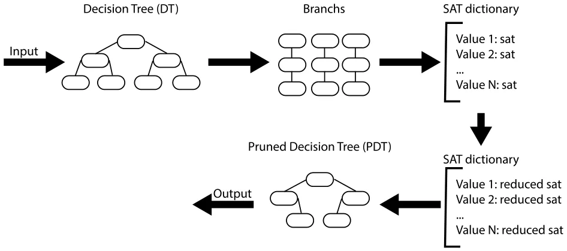
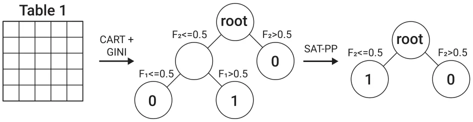
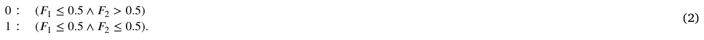
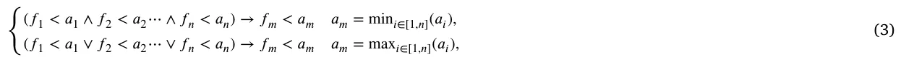
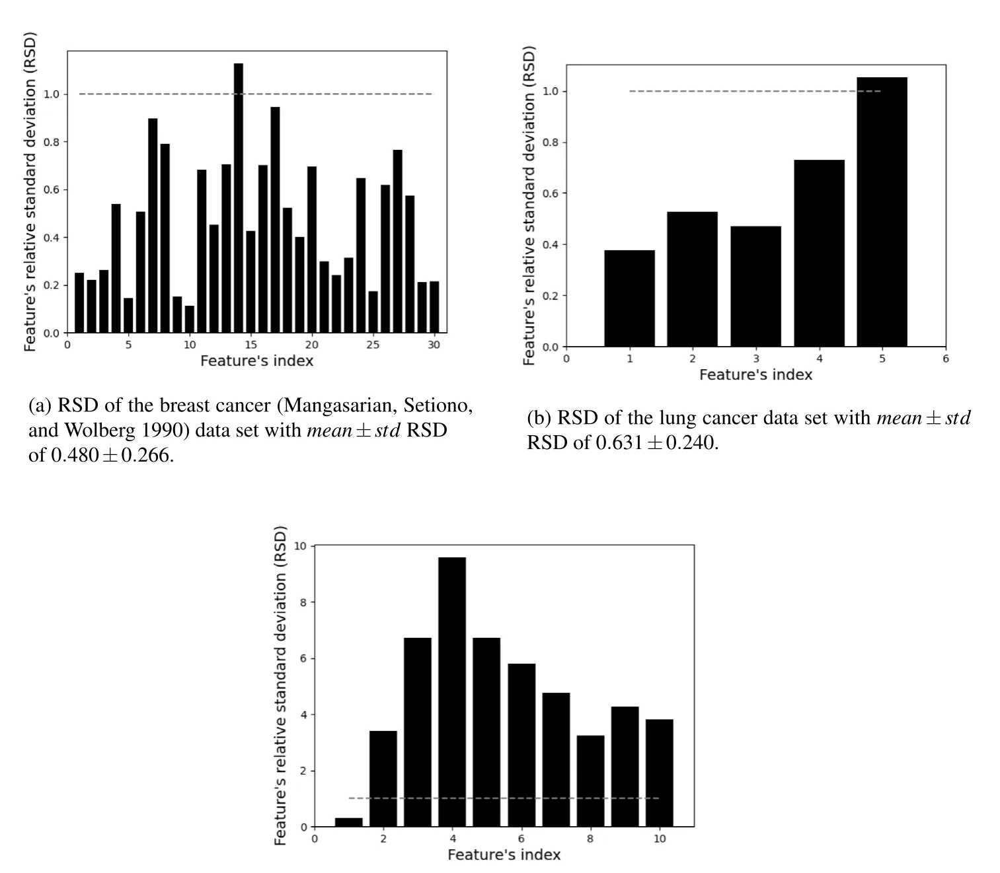
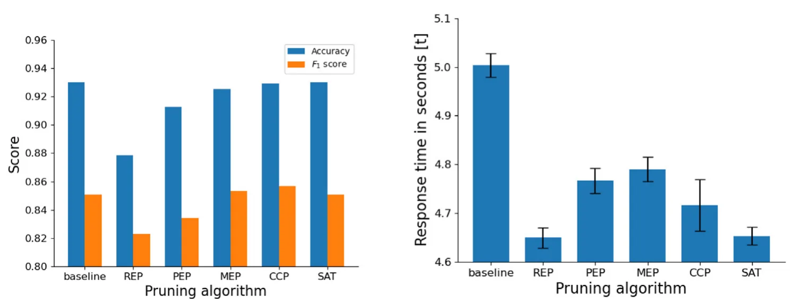

## 1. Introduction and related work

Classification is an important problem in decision-making. It has been studied extensively by the machine learning (ML) community as a possible solution to the knowledge acquisition or knowledge extraction problem [1]. An ML model that is effective and wildly used is the decision tree (DT) model [2,3]. The DT model is relatively simple to understand and can be used both as a classification model and as a regression model, which makes it popular. An DT is a mathematical tree graph where the root node has all the data, non-leaf nodes operate as decision nodes and the leaf nodes store the model’s output for a given input that reaches them. The DT is constructed using a set of examples (e.g., train set) as follows: To begin with, a tree is constructed in a top-down recursive divide and conquer method. At the start, all the training examples are taken into consideration at the root of the tree, and then examples are partitioned recursively (for two or more nodes) based on a selected attribute until no further partition is possible [4].

Due to the way DTs are constructed, they may become very large as the algorithm aims to provide accurate classification to each example in the training set [4] which usually leads to overfitting the training data and poorly generalizing for new and unseen samples. On the other hand, a too-small tree might not capture important structural information about the sample space, resulting 0169-023X/© 2023 Elsevier B.V. All rights reserved.

in poor performance overall. Therefore, one of the questions that arise in the context of the DT model construction is the optimal size of the final tree. This question is challenging since it is difficult to tell when an DT construction algorithm should stop. After all, it is improbable to know if the addition of a single extra node will dramatically decrease error (known as the *horizon effect*) [5].

To tackle this difficulty, a common strategy is to construct a tree such that each node contains a small number of instances and then remove nodes that do not provide additional information using post pruning (PP) [6]. It is possible to roughly divide the PP algorithms into four main algorithmic groups: reduced error pruning (REP), pessimistic (error) pruning (PEP), minimum error pruning (MEP), and cost complexity pruning (CCP).

REP tree is an DT model which is built based on the balance between information gain and reduction of the variance [7] using the back over fitting approach [7]. A few popular algorithms in this group are the PART [8], Ridor [9], and the JRip [10] algorithms. These algorithms improve the performance of an DT model by aggressively reducing its size which may result in poor accuracy. Nor et al. (2012) stated that a manual fitting of the model for each data set is required to avoid minutely small DTs.

PEP is an algorithm that aims to avoid the necessity of a separate test data set [11]. This algorithm is based on the assumption that the misclassification rates produced by a tree on its training data are overly optimistic and therefore produce overly large trees. PEP trees are obtained using the continuity correction for the binomial distribution to obtain a more accurate estimate of the misclassification rate. This PEP algorithm does not require a test data set, and it is relatively expeditious due to the only one pass over the tree it requires. Moreover, it does not produce a selection of trees which may lead to overfitting [4].

MEP is a group of algorithms that produce a single tree that should, in theory, give the minimum error rate when classifying independent sets of data [11]. Algorithms that are based on the MEP algorithmic approach use the expected error rate of each (non-terminal) node in the tree to decide if this sub-tree is pruned or not (and, therefore, this node becomes a leaf node). The result of the MEP algorithm should be a pruned tree that minimizes the expected error rate in classifying independent data. However, this class of algorithms assumes that all the classes are equally likely which is usually not the case in real-world data [12].

CCP is a group of algorithms in which a large DT is computed to fit the training data, by allowing the splitting process to continue until all terminal nodes are either small or pure (i.e., all instances belong to the same class) or contain only instances with identical attribute-value vectors. Afterward, it applies the cost complexity pruning algorithm to compute a set of consecutive nested subtrees of decreasing size from the original large tree by progressively pruning upwards to its root node. The degree of pruning of the initial DT can be controlled by adjusting a complexity parameter which provides an additional level of control on the trade-off between accuracy and time consumption. Nevertheless, this approach is useful on an ensemble of DT models (using bagging for example) and mostly does not exploit the performance gain in a single DT level [13].

There are other groups of PP algorithms such as Error-Complexity Pruning [14] and Critical Value Pruning [11]. However, they have the same strengths and limitations as the above four groups and therefore can be treated as a combination and modification of these. Our algorithm is another example of an PP algorithm that does not belong to one of these groups as our algorithm is based on the boolean satisfaction problem rather than a greedy optimization the others group are based on.

Another approach to obtain an optimal size DT is minimal tree based algorithms [15]. This group of algorithms uses various methods to minimize the DT’s size while maximizing target metrics such as the model’s accuracy [15]. The main conceptual difference between classical DT constructing algorithms like CART [16] and the minimal trees algorithms is that the first is greedy on the single decision node while the latter is constructing the entire tree at once [17]. For example, Verwer et al. (2019) use binary linear program formulation [18]. Dash et al. (2018) use Boolean decision rule learning for binary classification problems [19]. Bertsimas and Dunn (2017) used a mixed-integer optimization method that allows multivariate splits in each node of the tree. The authors show that their algorithm outperforms the CART algorithm on average for several dozen data sets [17]. Nijssen and Fromont (2007) proposed a minimal tree algorithm that exploits a relation between constraints on itemsets and decision trees. The authors have shown that their algorithm does not necessarily work on all data sets but when it does, the algorithm provides the theoretically optimal tree [20]. Follow-up work on this algorithm was performed by Aglin et al. (2020) that introduces a cache of itemsets in combination with branch-and-bound search [21].

In general, minimal tree algorithms are obtaining better DT compared to classical DT constriction methods such as C5.0 [22] and CART followed by an PP method according to an analytical proof provided by Bessiere et al. [23]. Despite that, in applicative clinical settings, ML developers are faced with regularization constraints that might make the replacement of deployed ML models with other models trained using a minimal decision tree to be a time- and resource-consuming process.1 As such, while the minimal tree approach outperforms the PP approach when constructing minimal DTs that optimize an objective metric, it can be used only to construct an DT model from scratch while PP models can be used on already existing DT models [24]. This allows an ML developer to add a constrain to the reduction in performance given an objective metric and use an PP method on the deployed clinical DT model.

Overall, DTs are commonly used for clinical and medical classification and prediction tasks [25–30]. An example of using DT in medical decision making is proposed by Bonner (2001), who examined the application of the DT model to collaborative clinical decision-making in mental health care in the United Kingdom [31]. The research highlighted how the approach was used successfully as a multi-professional collaborative approach to decision-making in the context of British community mental health care. Another DT-based model was developed by Letourneau and Jensen (1998) who used an DT approach in decision making for chronic wound care [32]. Their proposed DT-based model used pictorial case studies and concluded that the proposed model can assist with decision-making by guiding the nurse through assessment and treatment options. Generally examined, DTs are shown to be one of the most common and fundamental statistical models in the evidence-based medicine domain [33]. Specifically, DT is shown to outperform the traditional induction approach in many fields of medicine [34] as well as providing better prediction accuracy in the oncological [35] and gene-expression [36] domains. Taken jointly, when performing data analysis on medical data an important factor to be considered is its time complexity (i.e., the time that the model needs to answer a query). In examining the analysis of medical data the performance of the algorithm, its accuracy, and the execution time are the key factors that have to be considered. Therefore, in the case of medical-related tasks, a pruning method should avoid reducing the model’s performance in order to obtain a smaller size (and therefore faster response for a query) model.

<figure id="fig-1">

<figcaption><strong>Fig. 1.</strong> Schematic view of the SAT-PP Algorithm, divided into logical steps. The DT is given as input to the algorithms which is converted into branches such that all branches with the same leaves are converted into SAT dictionary and later reduced to return a pruned DT by converting each reduced SAT into a branch.</figcaption>
</figure>

PP algorithms are typically used to reduce overfitting. This is done by first constructing the DT without or with a minor number of boundaries which results in an overfitting tree that is later PP to obtain a better DT (in both performance and size). The improvement in the model’s accuracy in this kind of usage of the PP algorithm can be associated with the fact that the overfitting phenomena are reduced. For example, one may expect an improvement in the model’s accuracy shown in Fig. 4(a) due to the performance of PP algorithms but it does not lead to improved accuracy since the underlying DT models (following the *𝑏𝑎𝑠𝑒𝑙𝑖𝑛𝑒* DT) are obtained after significant optimization performed using the grid search method [37] and therefore do not suffer from overfitting. Nevertheless, PP algorithms as a sub-group of the tree minimization methods group by definition, return a tree smaller or equal in size to the one they are given and therefore can be treated as minimal tree construction as well, as done in the proposed algorithm.

In this paper, we propose a novel DT PP algorithm that is based on the Boolean satisfaction problem (SAT), with no reduction in the model’s performance and usage in clinical-related settings. The proposed algorithm contributes a new PP method that well suits clinical data sets for classification tasks with imbalanced data and high diversity in the parameter.

The paper is organized as follows. First, we introduce our SAT-PP algorithm with asymptotic complexity and memory consumption analysis. Second, we evaluate the proposed PP algorithm on three clinical data sets and compare the performance between five groups of PP algorithms. Finally, the limitations and the strengths of the proposed algorithm are discussed.

## 2. Decision tree post pruning using Boolean satisfaction problem

This section proposes an algorithm that addresses the problem of PP a classification DT that is constricted using a greedy (heuristic) algorithm (like C5.0) using a Boolean satisfaction problem (SAT) based method. Our approach exploits a structural property of classification DTs in which outcomes are chosen by fulfilling a list of conditions in the decision nodes and that several leaf nodes produce the same outcome. As such, by dividing the DT into branches and merging them according to the outcome of their respected leaf nodes, one can obtain a Boolean statement about if the DT model would return this outcome or not, given some input. Since a redundancy in these Boolean statements can appear, one can reduce them to smaller, yet identical statements. An example of a potential source of redundancy is two leaf nodes with the same outcome that have five common decision nodes (from the DT’s root) and then divided two levels up as another class is causing a division. Once these Boolean statements are reduced, one can convert them back into branches and compose from them a new, pruned DT. The branches are composing the DTs in an iterative way such that the first branch is the spine of the pruned DT. After the first branch, for each branch (according to the order of nodes) if the same decision node is already present, starting from the DT’s root, it is just ignored. Otherwise, it is added as an additional child node and all the remaining nodes of the branch with it. A schematic view of the SAT-PP algorithm is shown in Fig. 1.

Adopting the classification matrix proposed by Narodytska et al. [38], shown in Table 1, we demonstrate how the SAT-PP algorithm works. First, an DT algorithm is obtained using the Scikit-learn library [39] in Python [40] that used the CART algorithm with the *gini* [41] dividing criteria. The obtained model has five nodes in which the first one is *𝐹*1 ≤ 0*.*5 and leads to the second and the third nodes. The second node is a leaf node that returns 0. The third node is *𝐹*2 ≤ 0*.*5 and leads to the fourth and fifth nodes that are both leaf nodes and returns 1 and 0, respectively. From this DT, SAT-PP extracts three branches (as the number of node leafs) with the node indexes {[1*,* 3]*,* [1*,* 2*,* 4]*,* [1*,* 2*,* 5]}. Since the first and third branch has a node leaf with the same value (0) they map in the SAT dictionary to the same value (0) and the remaining branch maps to the value (1) and looks like:

<figure class="table-figure" id="table-1">
<figcaption><strong>Table 1</strong></figcaption>

<table><tr><th>A classification example (originally proposed by Narodytska et al. [38]). are the samples and features sets, respectively.</th><th>{𝑒𝑖}8 𝑖=1 and</th><th>{𝐹𝑗}4 𝑗=1 ∪𝑇</th></tr><tr><th>𝐸𝑥. 𝐹1 𝐹2 𝐹3</th><th>𝐹4</th><th>𝑇</th></tr><tr><td>𝑒1 1 0 1</td><td>0</td><td>0</td></tr><tr><td>𝑒2 1 0 0</td><td>1</td><td>0</td></tr><tr><td>𝑒3 0 0 1</td><td>0</td><td>1</td></tr><tr><td>𝑒4 1 1 0</td><td>0</td><td>0</td></tr><tr><td>𝑒5 0 0 0</td><td>1</td><td>1</td></tr><tr><td>𝑒6 1 1 1</td><td>1</td><td>0</td></tr><tr><td>𝑒7 0 1 1</td><td>0</td><td>0</td></tr><tr><td>𝑒8 0 0 1</td><td>1</td><td>1</td></tr></table>

</figure>

<figure id="fig-2">

<figcaption><strong>Fig. 2.</strong> Schematic view of the SAT-PP algorithm’s implementation for the example data set shown in Table 1.</figcaption>
</figure>

0 ∶ (*𝐹*1 ≤ 0*.*5) ∨(*𝐹*1 ≤ 0*.*5 ∧ *𝐹*2 *>* 0*.*5) 1 ∶ (*𝐹*1 ≤ 0*.*5 ∧ *𝐹*2 ≤ 0*.*5)*.*

One can simply see that the first term in value (0) is redundant and can be removed without effecting the SAT statement. As such, Eq. (1) gets the form:

Next, using the reduced SAT dictionary, we constrict the pruned DT. First, the value 0 branch is set as the tree, starting with *𝐹*1 ≤ 0*.*5 as the tree’s root followed by a decision node, *𝐹*2 *>* 0*.*5, and lastly a leaf node with the value 0. Afterward, the second SAT statement is converted into a branch. Since the first decision node (*𝐹*1 ≤ 0*.*5) is already found in the tree’s node, it is skipped. The second condition, *𝐹*2 ≤ 0*.*5, however, is not and therefore added as a decision node under the root’s node. Following that, a leaf node with value 1 is added underneath this node. As a result, the SAT-PP pruned DT is 20% smaller with four nodes compared to the five nodes in the original DT. Fig. 2 shows a schematic view of the SAT-PP algorithm’s implementation for the example data set.

Formally, The SAT-PP algorithm (Algorithm 1) is a general PP algorithm based on SAT reduction of each output value, accepting a DT (marked by *𝑑𝑡*), and returning a pruned DT (marked by *𝑝𝑑𝑡*). In line 1, the branches of the DT are obtained using the preordering depth-first search (DFS) algorithm [42]. Each *branch* object is stored as a list and integer such that each decision node is allocated, in order, to the list according to its condition and the additional integer is the branch’s leaf node’s output value, marked by *𝑣*. In line 2, an empty dictionary is initialized. This dictionary is responsible to store the dictionary properly for the SAT dictionary. In lines 3–5, each branch in the list of branches obtained in line 1 is converted to the SAT dictionary format. In practice, we use a function *𝑉* that gets a *branch* object and returns its *𝑣* value and the function *𝑎𝑑𝑑*(*𝑋*) is a method of the SAT dictionary object that adds a *branch* object to the key *𝑣* and if this is the first time of the key *𝑣* introduced to the dictionary, the function *𝑎𝑑𝑑* creates an empty list as the value of *𝑣* and adds the *branch* object. In line 6, an empty dictionary is initialized. This dictionary is responsible to store the SAT dictionary. In lines 7–9, for each output value, the functions *𝑅𝑒𝑑𝑢𝑐𝑒𝑆𝐴𝑇* and *𝑆𝑅* are used. Namely, the function *𝑆𝑅* maps the *branch* object into a SAT statement by merging each *branch* object’s list using the ‘‘and’’ (∧) operator and adding the ‘‘or’’ (∨) operator between *branch* objects. Afterward, the function *𝑅𝑒𝑑𝑢𝑐𝑒𝑆𝐴𝑇* is used on the *𝑆𝑅* function’s output. This function reduces the SAT statement using the Quine–McCluskey algorithm [43] based on the output of the DPLL algorithm [44]. The Quine–McCluskey algorithm can be replaced with any SAT reduction algorithm in practice and chosen for our case due to its relatively fast computation time for realistic SAT statement reductions [45]. In line 10, an empty DT is initialized and later will be populated. In lines 11–13, for each of the tree’s output values, the function *𝐴𝐵* gets the current DT (*𝑝𝑑𝑡*) and the branch one wishes to add. It starts in the DT’s root node, if the first node in the branch is already found, it continues downstream the tree in an iterative manner. If the branch’s node does not found in the tree, this node and all nodes afterward are introduced as a branch to the DT. Lastly, in line 14, the pruned DT (*𝑝𝑑𝑡*) is returned as the algorithm’s output.

**Algorithm 1:** SAT-PP

- **1** *𝑏𝑟𝑎𝑛𝑐ℎ𝑒𝑠* ← *𝐷𝐹 𝑆*(*𝑑𝑡*) **2** *𝑏𝑟𝑎𝑛𝑐ℎ*\_*𝑑𝑖𝑐𝑡𝑖𝑜𝑛𝑎𝑟𝑦* ← empty dictionary **3 for** *𝑏𝑟𝑎𝑛𝑐ℎ* ∈ *𝑏𝑟𝑎𝑛𝑐ℎ𝑒𝑠* **do 4** branch\_dictionary[V(branch)].add(branch)

**5 end 6** *𝑠𝑎𝑡*\_*𝑑𝑖𝑐𝑡𝑖𝑜𝑛𝑎𝑟𝑦* ← empty dictionary **7 for** *𝑣* ∈ *𝑏𝑟𝑎𝑛𝑐ℎ\_𝑑𝑖𝑐𝑡𝑖𝑜𝑛𝑎𝑟𝑦* **do 8** *𝑠𝑎𝑡*\_*𝑑𝑖𝑐𝑡𝑖𝑜𝑛𝑎𝑟𝑦*[*𝑣*] ← *𝑅𝑒𝑑𝑢𝑐𝑒𝑆𝐴𝑇* (*𝑆𝑅*(*𝑏𝑟𝑎𝑛𝑐ℎ*\_*𝑑𝑖𝑐𝑡𝑖𝑜𝑛𝑎𝑟𝑦*[*𝑣*])) **9 end 10** *𝑝𝑑𝑡* ← initialize empty decision tree **11 for** *𝑣* ∈ *𝑠𝑎𝑡\_𝑑𝑖𝑐𝑡𝑖𝑜𝑛𝑎𝑟𝑦* **do 12** AB(pdt, branch\_dictionary[v]) **13 end 14** *return pdt* Analyzing the worst-case scenario of asymptotic time and space complexity can be performed by dividing the algorithm into three steps (lines 1–5, 6–9, and 10–14) and taking the maximum between them. We mark the number of nodes in the inputted DT as *𝑉* and the number of unique output values of this DT as *𝑁*. In lines 1–5, the time and space complexity are *𝑂*(*𝑉* ) and *𝑂*(*𝑉* ), respectively, since the DFS algorithm stores *𝑂*(*𝑉* ) with *𝑂*(*𝑉* ) complexity (in line 1) and in lines 2–5, there are *𝑙𝑜𝑔*2(*𝑉* ) leaves in the worst case (each node is divided in each level) and therefore *𝑙𝑜𝑔*2(*𝑉* ) branches and adding them to the dictionary is *𝑂*(1). The time and space complexity of the *𝑆𝑅* function are *𝑂*(*𝑚𝑎𝑥*(*𝑉, 𝑁𝑙𝑜𝑔*2(*𝑉* )2)) and *𝑂*(*𝑁𝑙𝑜𝑔*2(*𝑉* )2), respectively, since the algorithm runs on *𝑁* values, while in each one of them it runs on *𝑂*(*𝑙𝑜𝑔*2(*𝑉* )) branches such that running on each branch is *𝑙𝑜𝑔*2(*𝑉* ) operations as well. In addition, the data structure is merely converted from graphs into a Boolean function, and data has not been added or removed, so there are *𝑂*(*𝑉* ) nodes. Specifically, if *𝑁𝑙𝑜𝑔*2(*𝑉* )2 *> 𝑉* then the algorithm has to allocate this memory and therefore this becomes the time complexity of this step. Moreover, the time and space complexity of the *𝑅𝑒𝑑𝑢𝑐𝑒𝑆𝐴𝑇* function are *𝑂*(*𝑙𝑜𝑔*2(*𝑉* )2𝑁) and *𝑂*(*𝑙𝑜𝑔*2(*𝑉* )2𝑁), respectively, since there are *𝑙𝑜𝑔*2(*𝑉* ) branches in each that computed a NP-hard algorithm [43] with *𝑁* clauses which is based on backtracking. As such, the overall time and space complexity of lines 5–9 is *𝑂*(*𝑙𝑜𝑔*2(*𝑉* )2𝑁) and *𝑂*(*𝑙𝑜𝑔*2(*𝑉* )2𝑁), respectively. In lines 10–14, the time and space complexity are *𝑂*(*𝑉* ) and *𝑂*(*𝑉* ), respectively, since it is the symmetric operation to lines 2–5. Therefore, the overall time and space complexity of the SAT-PP algorithm is *𝑂*(*𝑙𝑜𝑔*2(*𝑉* )2𝑁) and *𝑂*(*𝑙𝑜𝑔*2(*𝑉* )2𝑁), respectively. As such, one can conclude that the SAT-PP would run better on DTs with a lot of decision nodes with a small number of output values compared to DTs with a smaller number of decision numbers and a large number of possible output values.

From this time and space complexity analysis, one can see the SAT-PP’s algorithm is lower-bound by the performance of the *ReduceSAT*. For a generic DT, the function is *ReduceSAT* solves an NP-complete task as it solves a SAT problem as part of the computation [43,46]. Nevertheless, as the SAT-PP algorithm is designed to be used on DT that obtain via a heuristic DT construction algorithm (such as CART), one can exploit the numerical properties of these algorithms. In particular, the popular Scikit-learn library generates binary DTs such that the decision nodes are of the form *𝑓*𝑖 *< 𝑎*𝑖 where *𝑓*𝑖 is a feature from a set of features *𝑓*𝑖 ∈ *𝐹* and *𝑎*𝑖 ∈ R is a threshold value. As such, one can solve the SAT defined by this kind of DT using the conflict clause analysis approach [44]. Formally, a value in the SAT dictionary would take the form (*𝑓*1 *< 𝑎*1 ∧ *𝑓*2 *< 𝑎*2⋯ ∧ *𝑓*𝑛 *< 𝑎*𝑛). As such, one can apply the rule:

where *𝑓*𝑚 ∈{*𝑓*1*,* … *, 𝑓*𝑛}. Now, using Eq. (3), assume there are *𝑉* clauses and *𝑁* unique features, it is possible to reduce the SAT into *𝑁* clauses in *𝑂*(*𝑉* 2) time complexity and *𝑂*(*𝑉* ) memory consumption. In this case, the overall SAT-PP algorithm is run at *𝑂*(*𝑙𝑜𝑔*2(*𝑉* )*𝑉* 2) time complexity and *𝑂*(*𝑉* ) memory complexity. Therefore, the SAT solver is the general approach to implementing the *𝑅𝑒𝑑𝑢𝑐𝑒𝑆𝐴𝑇* function which is suitable for cases where there is no additional knowledge of the data set or the domain of the problem. While the approach suits any given DT structure, it is NP-hard as the general DT model can have any Boolean functions on the decision nodes (not common in applied ML models). As a result, the SAT solver is required for this minimization. Otherwise, given some additional knowledge on the problem, one can exploit it to obtain a more specific, better-performing *𝑅𝑒𝑑𝑢𝑐𝑒𝑆𝐴𝑇* function as shown in Eq. (3).

## 3. SAT-PP algorithm evaluation on clinical data

We implement the SAT-PP algorithm and evaluate the performance of the SAT-PP DT model on three classification tasks from clinical, comparing the results with a baseline DT model and candidates from the other four groups of PP algorithms (REP, PEP, MEP, CCP) over four matrices: accuracy, *𝐹*1 score [47], time to answer a query (in milliseconds), and training time to obtain each model. We describe the clinical-related data sets (Section 3.1) and the models (Section 3.2) used in the experiment and then evaluate the different PP algorithms (Section 3.3).

<figure id="fig-3">

<figcaption><strong>Fig. 3.</strong> The data sets’ relative standard deviation (RSD). The gray (dashed) line indicates the <em>𝑅𝑆𝐷</em> = 1 threshold.</figcaption>
</figure>

### 3.1. Data preparation

We used three clinical-related (oncology) data sets to evaluate the performance of the PP algorithms. First, the breast cancer data set with 31 columns and 570 rows, aiming to predict if breast cancer will appear or not [48].2 Second, lung cancer with five columns and 60 rows, aiming to predict the presence of lung cancer in a patient.3 Third, cervical cancer data set with 36 columns and 835 rows, aiming to classify patients with risk to develop cervical cancer and patients without such risk [49].4

In the breast cancer data set, all the features are numerical which should be easier to be learned by the models. However, the data set has large relative standard deviations (with a mean of 0.480 and a standard deviation of 0.266) for most of the features as shown in Fig. 3(a), which indicates that the distribution of the data is large and therefore makes the data set challenging to be generalized by an ML algorithm.

The lung cancer data set is small which makes it hard to both train a model and statistically evaluate its results. Similar to the breast cancer data set, the large relative standard deviations (with mean of 0.631 and standard deviation of 0.240), as shown in Fig. 3(b).

The cervical cancer data set is relatively large with 10 numerical and 20 non-numerical values. In addition, the relative standard deviations is extremely high (with mean of 4.870 and standard deviation of 2.390), as shown in Fig. 3(c).

### 3.2. Evaluation on clinical data

We train and compare 12 models, that can be divided by two properties: the ML algorithm they are based on (DT or Random Forest) and the PP algorithm used (none, REP, PEP, CCP, MEP, or SAT), as shown in Table 2. The models are contrasted as follows: first, the baseline DT model (*𝐷𝑇*𝑏𝑎𝑠𝑒𝑙𝑖𝑛𝑒) is obtained by training an DT model with the *CART* algorithm and the *gini* dividing metric [41]. The following hyper-parameters are optimized using the grid search method: tree’s depth (2–10), maximum number of leaves ([5, 10, ..., 50]), and minimum samples for dividing a node ([2, 5, 8, 10, 15, 20, 25, 30]) [37]. The other five DT models were obtained by performing the following PP algorithms on the baseline model (*𝐷𝑇*𝑏𝑎𝑠𝑒𝑙𝑖𝑛𝑒):

<figure class="table-figure" id="table-2">
<figcaption><strong>Table 2</strong> The models used in the experiment, divided by their based ML and PP algorithms.</figcaption>

<table><tr><th></th><th>None</th><th>REP</th><th>PEP</th><th>CCP</th><th>MEP</th><th>SAT</th></tr><tr><td>DT</td><td>𝐷𝑇𝑏𝑎𝑠𝑒𝑙𝑖𝑛𝑒</td><td>𝐷𝑇𝑟𝑒𝑝</td><td>𝐷𝑇𝑝𝑒𝑝</td><td>𝐷𝑇𝑐𝑐𝑝</td><td>𝐷𝑇𝑚𝑒𝑝</td><td>𝐷𝑇𝑠𝑎𝑡</td></tr><tr><td>RF</td><td>𝑅𝐹𝑏𝑎𝑠𝑒𝑙𝑖𝑛𝑒</td><td>𝑅𝐹𝑟𝑒𝑝</td><td>𝑅𝐹𝑟𝑒𝑝</td><td>𝑅𝐹𝑐𝑐𝑝</td><td>𝑅𝐹𝑚𝑒𝑝</td><td>𝑅𝐹𝑠𝑎𝑡</td></tr></table>

</figure>

1. *𝐷𝑇*𝑟𝑒𝑝 is obtained using the PART algorithm [8], which represents the REP group of algorithms.
2. *𝐷𝑇*𝑝𝑒𝑝 is obtained using the algorithm presented in [11], which represents the PEP group of algorithms.
3. *𝐷𝑇*𝑚𝑒𝑝 is obtained using the algorithm presented in [50], which represents the MEP group of algorithms.
4. *𝐷𝑇*𝑐𝑐𝑝 is obtained using the algorithm presented in [13], which represents the CCP group of algorithms.
5. *𝐷𝑇*𝑠𝑎𝑡 is obtained using the proposed SAT-PP algorithm.

Random Forest (RF) is a combination of tree predictors such that each tree depends on the values of a random vector sampled independently and with the same distribution for all trees in the forest [51]. RF-based models are known for their robustness to noise in data as well as an accurate prediction in a wide spectrum of learning tasks [52]. In our case, the RF model corresponding to each DT model is obtained using the same seed (to neglect the stochastic effect of the RF’s random process) with 100 trees in the forest. The number of trees is decided empirically to balance computation time and the generalization capabilities of the model. The PP algorithms are computed independently for each tree in the forest. We compare the DT model with the RF model as RF is considered the best practice in many ML challenges, mainly due to their superior predictive performance [53,54]. However, simple models like DT may be preferred over RF in cases in which the generated predictions must be efficient or explainable [55].

All the models are evaluated on four matrices: accuracy, *𝐹*1 score, time to answer a query (in milliseconds), and training time to obtain each model. The accuracy and *𝐹*1 metrics are used to evaluate the model’s performance and generalization capabilities while the time to answer a query metric is used to evaluate the model’s response time due to the reduction in the model size as a result of the pruning process. The time to obtain the model metric is analyzed to evaluate the potential of using each of the proposed data in a realistic scenario. Namely, a model that takes significantly more time to obtain while providing just minor improvement in performance relative to a fast obtained model, may be inferior to the second in some cases. Of note, there are other performance metrics such as the number of false-positive cases [56] that are commonly used to evaluate ML models in clinical settings [57]. That said, as the accuracy and *𝐹*1 metrics are widely used and considered to be relatively ‘‘strict’’ metrics we limit our analysis to them.

Moreover, we decided to evaluate the time to answer a query rather than model size after pruning in order to evaluate more applied metrics. That is to say, while the model size is easier to interpret, it is rather the symptom and not the illness itself as in the deployed model. A response time for a patient’s prediction is the parameter influencing the performance of the service while the size of the model is a by-product of the response time. Besides, using the model’s size hides two factors of the model. First, the inner distribution of the data over the model’s nodes is significant in imbalanced data. For example, assume there is an unbalanced DT with 12 nodes, where 90% of the time a query to the algorithm passes a branch with four decision nodes and the other 10% of the time a query passes a branch with two decision nodes. Second, the difference in the complexity of different decision nodes (in a general case DT model) can significantly change the response time while still counting as one node in the model’s size. Therefore, using the time to answer a query on average carried out on a large test set shows indirectly these factors while a simple comparison between model sizes does not.

We divided each data set into five cohorts, each time taking one of them to be the *training* cohort and the remaining four to be the *testing* cohorts (e.g., five-fold cross-validation [58]) and used them on all 12 models.

### 3.3. Results

Table 3 shows the performance (accuracy, *𝐹*1, and time to answer a query) and time to obtain a model, divided by the model types (DT or RF), PP method (baseline, REP, PEP, MEP, CCP, SAT), and examined data set. Each value in the accuracy and *𝐹*1 columns is presented as the mean of the five-fold cross-validation. The query response time metric is the average ± standard division time, in seconds, that it takes a model to answer a query for 10 000 samples. The average time to obtain the model metric is the time, in seconds, to train the model for 10 samples. All the experiments were performed on the same computer, sequentially. Specifically, we used a machine with the Ubuntu (Version 20.04) operation system with 32 GB memory and Intel’s Core i7-11850HE Processor. The table is marked by six colors indicating the model type (either DT or RF) and the examined data set (breast, lung, or cervical).

As expected, the accuracy and the *𝐹*1 score of both the *𝐷𝑇*𝑆𝐴𝑇 and *𝑅𝐹*𝑆𝐴𝑇 are equal to those of the *𝐷𝑇*𝑏𝑎𝑠𝑒𝑙𝑖𝑛𝑒 and *𝑅𝐹*𝑏𝑎𝑠𝑒𝑙𝑖𝑛𝑒, respectively, as shown in Fig. 4(a). In addition, a t-test has been conducted between the query response time between the *𝐷𝑇*𝑆𝐴𝑇 and the *𝐷𝑇*𝑏𝑎𝑠𝑒𝑙𝑖𝑛𝑒 models and resulted in *𝑝<* 0*.*0001 for all three data sets. Similarly, a t-test between the query response time between *𝑅𝐹*𝑆𝐴𝑇 and the *𝑅𝐹*𝑏𝑎𝑠𝑒𝑙𝑖𝑛𝑒 models resulted in *𝑝<* 0*.*0001 for the breast cancer data set and *𝑝<* 0*.*01 for the lung cancer data set. On the other hand, for the cervical cancer data set the *𝑝*-value obtained from the t-test was *𝑝>* 0*.*05 which can be explained since most of the trees in the forest did not change at all which overall does not lead to a large enough change in the model’s size to reduce computation time.

<figure class="table-figure" id="table-3">
<figcaption><strong>Table 3</strong> Performance (accuracy and <em>𝐹</em>1 score) and time of response evaluation for DT- and RF-based models with four PP algorithms and baseline compared to our SAT-PP algorithm, across the breast, lung, and cervical cancer data sets. The bold values indicates the best performance metrics outcomes for each data set and model compared between the PP methods.</figcaption>

<table><tr><th>Model</th><th>Data set</th><th>Accuracy</th><th>𝐹1 score</th><th>Query response time [s] as mean (std) 𝑛= 10 000</th><th>Time to obtain the model [s] 𝑛= 10</th></tr><tr><td>𝐷𝑇𝑏𝑎𝑠𝑒𝑙𝑖𝑛𝑒</td><td>breast</td><td>0.9561</td><td>0.9630</td><td>0.00510 (0.00209)</td><td>11.1339</td></tr><tr><td></td><td>lung</td><td>0.9167</td><td>0.9231</td><td>0.00437 (0.00322)</td><td>7.3201</td></tr><tr><td></td><td>cervical</td><td>0.9167</td><td>0.6667</td><td>0.00554 (0.00182)</td><td>8.2840</td></tr><tr><td>𝑅𝐹𝑏𝑎𝑠𝑒𝑙𝑖𝑛𝑒</td><td>breast</td><td>0.9649</td><td>0.9701</td><td>0.03647 (0.00697)</td><td>195.6133</td></tr><tr><td></td><td>lung</td><td>0.8333</td><td>0.8333</td><td>0.03576 (0.01355)</td><td>184.0982</td></tr><tr><td></td><td>cervical</td><td>0.9211</td><td>0.7000</td><td>0.06905 (0.11059)</td><td>164.3202</td></tr><tr><td>𝐷𝑇𝑟𝑒𝑝</td><td>breast</td><td>0.9298</td><td>0.9385</td><td>0.00473 (0.00175)</td><td>12.0167</td></tr><tr><td></td><td>lung</td><td>0.8341</td><td>0.8977</td><td>0.00398 (0.00291)</td><td>7.3885</td></tr><tr><td></td><td>cervical</td><td>0.8717</td><td>0.6334</td><td>0.00524 (0.00171)</td><td>8.8082</td></tr><tr><td>𝑅𝐹𝑟𝑒𝑝</td><td>breast</td><td>0.9474</td><td>0.9559</td><td>0.03471 (0.00794)</td><td>284.0182</td></tr><tr><td></td><td>lung</td><td>0.8561</td><td>0.9010</td><td>0.03320 (0.01422)</td><td>189.1529</td></tr><tr><td></td><td>cervical</td><td>0.9188</td><td>0.6876</td><td>0.06742 (0.10189)</td><td>197.5932</td></tr><tr><td>𝐷𝑇𝑝𝑒𝑝</td><td>breast</td><td>0.9580</td><td>0.9622</td><td>0.00498 (0.00228)</td><td>11.6506</td></tr><tr><td></td><td>lung</td><td>0.8853</td><td>0.9081</td><td>0.00405 (0.00366)</td><td>7.3711</td></tr><tr><td></td><td>cervical</td><td>0.8951</td><td>0.6333</td><td>0.00527 (0.00178)</td><td>8.7282</td></tr><tr><td>𝑅𝐹𝑝𝑒𝑝</td><td>breast</td><td>0.9637</td><td>0.9727</td><td>0.03255 (0.01003)</td><td>224.8938</td></tr><tr><td></td><td>lung</td><td>0.8672</td><td>0.8931</td><td>0.03412 (0.01262)</td><td>190.5733</td></tr><tr><td></td><td>cervical</td><td>0.9178</td><td>0.6777</td><td>0.06314 (0.09851)</td><td>205.0043</td></tr><tr><td>𝐷𝑇𝑚𝑒𝑝</td><td>breast</td><td>0.9512</td><td>0.9698</td><td>0.00457 (0.00245)</td><td>12.0633</td></tr><tr><td></td><td>lung</td><td>0.9167</td><td>0.9231</td><td>0.00439 (0.00325)</td><td>7.3976</td></tr><tr><td></td><td>cervical</td><td>0.9081</td><td>0.6666</td><td>0.00541 (0.00178)</td><td>8.3707</td></tr><tr><td>𝑅𝐹𝑚𝑒𝑝</td><td>breast</td><td>0.9603</td><td>0.9667</td><td>0.03509 (0.00691)</td><td>261.0064</td></tr><tr><td></td><td>lung</td><td>0.7954</td><td>0.8102</td><td>0.00409 (0.00298)</td><td>193.8856</td></tr><tr><td></td><td>cervical</td><td>0.9211</td><td>0.7000</td><td>0.06905 (0.11059)</td><td>177.5158</td></tr><tr><td>𝐷𝑇𝑐𝑐𝑝</td><td>breast</td><td>0.9521</td><td>0.9587</td><td>0.00482 (0.00193)</td><td>11.4351</td></tr><tr><td></td><td>lung</td><td>0.9167</td><td>0.9231</td><td>0.00432 (0.00331)</td><td>7.4352</td></tr><tr><td></td><td>cervical</td><td>0.9189</td><td>0.6891</td><td>0.00501 (0.01075)</td><td>8.1107</td></tr><tr><td>𝑅𝐹𝑐𝑐𝑝</td><td>breast</td><td>0.9620</td><td>0.9613</td><td>0.03121 (0.00663)</td><td>202.9015</td></tr><tr><td></td><td>lung</td><td>0.8333</td><td>0.8000</td><td>0.03415 (0.00634)</td><td>191.3556</td></tr><tr><td></td><td>cervical</td><td>0.8841</td><td>0.6561</td><td>0.06905 (0.11059)</td><td>177.5158</td></tr><tr><td>𝐷𝑇𝑠𝑎𝑡</td><td>breast</td><td>0.9561</td><td>0.9630</td><td>0.00473 (0.00177)</td><td>12.9071</td></tr><tr><td></td><td>lung</td><td>0.9167</td><td>0.9231</td><td>0.00407 (0.00242)</td><td>7.9778</td></tr><tr><td></td><td>cervical</td><td>0.9167</td><td>0.6667</td><td>0.00516 (0.00134)</td><td>8.8928</td></tr><tr><td>𝑅𝐹𝑠𝑎𝑡</td><td>breast</td><td>0.9649</td><td>0.9701</td><td>0.03129 (0.00630)</td><td>311.7120</td></tr><tr><td></td><td>lung</td><td>0.8333</td><td>0.8333</td><td>0.03536 (0.01321)</td><td>207.7080</td></tr><tr><td></td><td>cervical</td><td>0.9211</td><td>0.7000</td><td>0.06781 (0.10463)</td><td>224.5205</td></tr></table>

</figure>

In addition, the REP algorithm for the DT case (*𝐷𝑇*𝑟𝑒𝑝) performed worse on average compared to the other algorithms with an accuracy of 0.8785 and *𝐹*1 score of 0.8232 compared to 0*.*9128*,* 0*.*9253*,* 0*.*9292*,* 0*.*9298 and 0*.*8345*,* 0*.*8532*,* 0*.*857*,* 0*.*8509 of the PEP, MEP, CCP, and SAT algorithms, respectively, as shown in Fig. 4(a). On the other hand, for the RF case, the *𝐹*1 score was the highest (0.8482) as the other algorithms obtain 0*.*8478*,* 0*.*8256*,* 0*.*8058, and 0.8345, respectively.

Furthermore, for the lung cancer data set which is relatively small, the REP and PEP algorithms (*𝐷𝑇*𝑟𝑒𝑝*, 𝐷𝑇*𝑝𝑒𝑝) obtain worse results than the baseline model (*𝐷𝑇*𝑏𝑎𝑠𝑒𝑙𝑖𝑛𝑒) for the DT case, in both the score and *𝐹*1 metrics. While, the MEP, CCP, and SAT algorithms (*𝐷𝑇*𝑚𝑒𝑝*, 𝐷𝑇*𝑐𝑐𝑝*, 𝐷𝑇*𝑠𝑎𝑡) do not change the DT and therefore produce the same results. On the other hand, the REP and PEP algorithms obtained a better accuracy (0*.*8561*,* 0*.*8672) and *𝐹*1 (0*.*901*,* 0*.*8931) compared to the baseline accuracy (0.8333) and *𝐹*1 (0.8333), respectively, for the RF case; while the MEP, and CCP algorithms produce a worse accuracy (0*.*7954*,* 0*.*8333) and *𝐹*1 (0*.*8102*,* 0*.*8) results.

Based on the results shown in Table 3, we compare the performance (accuracy, *𝐹*1) and time of response metrics between the baseline and the five PP algorithms. A comparison between the performance and timing comparison between the baseline and five PP algorithms is shown in Figs. 4(a) and 4(b).

## 4. Discussion and conclusion

We proposed a novel SAT-PP algorithm that significantly reduces the response time, as shown in Fig. 4(b) while maintaining the same performance, as shown in Fig. 4(a) for the DT model. The reduction of 6.8% in computation time on average as shown in Fig. 4(b) is not trivial as the tested data sets are small which makes the pruning task challenging. As such, on larger (and therefore easier) data sets, the PP is expected to obtain even better results. A comparison between the SAT and REP algorithms is of interest as both obtain a similar reduction in computation time, as presented in Fig. 4(b), while the SAT PP outperforms the REP PP on average in 0.05 and 0.03 for the accuracy and *𝐹*1 performance metrics, as one can see from Fig. 4(a).

<figure id="fig-4">

<figcaption><strong>Fig. 4.</strong> Comparison between the five PP algorithms and the baseline for the DT models. The results are the average value for the three data sets.</figcaption>
</figure>

The SAT-PP algorithm is a method for reducing the size of a decision tree based on translating the paths in a tree to logical constraints and reducing these one target value at a time. By separating the SAT constraints per target value, the algorithm is able to optimize independently the condition that satisfies each class. This approach has two main advantages in the context of clinical data over current methods for optimally learning decision trees which are also based on satisfiability. First, as usually, clinical data is imbalanced [25,28,30,48,49], optimizing each class rather than the entire tree allows us to focus on the optimal condition for the smaller (usually the more important one) class while in SAT-optimized, which is based on the entire tree, this class is under-considered. Specifically, the proposed algorithm is well-performing where there are relatively small data sets with high diversity, as shown in (Figs. 4 and 4(a)). Second, as SAT problems are exponentially hard to compute to the number of conditions in the problem, dividing the SAT problem into several, smaller SAT problems as in the proposed algorithm makes the computation time shorter. In addition, a desirable by-product of the PP process is an embedded feature selection [59]. In practice, if a feature is reduced from the DT by pruning decision nodes that use this feature, one does not need to obtain this feature when querying the model which can reduce the cost of using the model.

The SAT-PP algorithm is more suitable for clinical-related tasks as in general, lower accuracy is unacceptable in the field as the model predicts life-related decisions and the trade-off between lower accuracy and faster response time is irrelevant. Here, the SAT- PP does not lower the accuracy of the model while trying to reduce the time it takes for the model to respond to a query as well as to obtain a more generic and robust model. In the worst case, when one uses the SAT-PP method, there is no reduction in the response time as no nodes of the tree are pruned. Nonetheless, in such a case, the model’s performance remained unharmed which makes the usage of this method appealing in automatic ML (autoML) pipelines(). Of note, theoretical guarantees of the conservation of the accuracy can strengthen the obtained empirical results and support the previous suggestion. In addition, for deployed ML models, in a clinical context, the re-training of current models using other tree construction algorithms such as minimal tree algorithms requires a time and resource-consuming process from a regulated point of point while performing a PP for a trained model that does not change the accuracy of the model not requiring to go over the regulated process and therefore is better fitting for a broad range of currently available clinical ML-based services [60].

PP algorithms are efficient for clinical data classification tasks in the manner that these algorithms reduce the computation time that it takes for an DT model to respond to a query while obtaining similar accuracy and *𝐹*1, as shown in Figs. 4(a) and 4(b).

In addition, we show (see Table 3) that PP algorithms performed on an RF model can improve the accuracy and *𝐹*1 compared to an DT model because RF can better generalize the rules from the data [53]. Therefore, in the case of RF, it is possible to take advantage of the proposed SAT-PP algorithm in one of two ways. The first way is by performing the PP on each tree in the forest. This ensures that the performance is not reduced while improving (usually) the efficiency of the model. On the other hand, the model remains difficult to interpret since it is a set of DT. The second way is to reduce the RF into a single DT [61] and perform the PP on the DT model. In this way, both the model’s efficiency and explainability improve on the one hand while due to the reduction of the RF into the DT, the model’s performance is reduced on the other hand.

Nevertheless, the time to obtain the final SAT-PP DT model is relatively longer in comparison to the other PP algorithms, as shown in Table 3, since the algorithm solves an SAT reduction problem for each set of branches that produces the same prediction which entails more complexity for DT with large depth or many classes. Even though, in the case of clinical data where the number of classes is usually small [48,49,62], the time to obtain the model will usually be manageable. Thus, as the current work focused on these cases, future work might explore the empirical computation burden and performance of the proposed SAT-PP method. In a similar manner, since in this work we compare the SAT-PP method to other PP methods, it would be important to compare the SAT-PP to other minimal tree algorithms for a wider context than deployed clinical models in which the regularization constraints are not present.

The proposed SAT-PP algorithm is suitable for multiple uses in general and in medical settings in particular. The advantage of the SAT-PP algorithm is the reduction of the model’s size without loss of performance which results in ML models that are more explainable and faster to answer a query with the same performance, avoiding the traditional trade-off between accuracy and explainability [63].

## CRediT authorship contribution statement

**Teddy Lazebnik:** Conceptualization, Methodology, Software, Formal analysis, Investigation, Resources, Data curation, Writing – original draft, Writing – review & editing, Visualization. **Svetlana Bunimovich-Mendrazitsky:** Validation, Supervision, Manuscript review.

## Declaration of competing interest

The authors declare that they have no known competing financial interests or personal relationships that could have appeared to influence the work reported in this paper.

## Data availability

All the data that has been used is available online. In the manuscript we provide links and cite the works that originally presented the data sets.

## Acknowledgments

The authors wish to thank Galina Fudim for her help in analyzing the experiment’s results and Sicco Verwer for his valuable insights.

## Funding

No funds, grants, or other support was received.

## Notes

2 https://www.kaggle.com/uciml/breast-cancer-wisconsin-data.

3 https://www.kaggle.com/yusufdede/lung-cancer-dataset.

4 https://datahub.io/machine-learning/cervical-cancer.

## References

1. W.V. Jiawei, Data mining concepts and techniques, Assoc. Comput. Mach. 31 (2) (2002) 279–328. [link](http://refhub.elsevier.com/S0169-023X%2823%2900033-2/sb1)
2. P.H. Swain, H. Hauska, The decision tree classifier: Design and potential, IEEE Trans. Geosci. Electron. 15 (3) (1977) 142–147. [link](http://refhub.elsevier.com/S0169-023X%2823%2900033-2/sb2)
3. G. Stiglic, S. Kocbek, I. Pernek, P. Kokol, Comprehensive decision tree models in bioinformatics, PLoS One 7 (3) (2012) e33812. [link](http://refhub.elsevier.com/S0169-023X%2823%2900033-2/sb3)
4. J. Quinlan, Simplifying decision trees, Int. J. Man-Mach. Stud. 27 (3) (1987) 221–234. [link](http://refhub.elsevier.com/S0169-023X%2823%2900033-2/sb4)
5. H.J. Berliner, Some necessary conditions for a master chess program, in: Proceedings of the 3rd International Joint Conference on Artificial Intelligence. Standford, CA, USA, August 20-23, 1973, William Kaufmann, 1973, pp. 77–85. [link](http://refhub.elsevier.com/S0169-023X%2823%2900033-2/sb5)
6. T. Hastie, R. Tibshirani, J. Friedman, The Elements of Statistical Learning, Springer, 2001, pp. 269–272. [link](http://refhub.elsevier.com/S0169-023X%2823%2900033-2/sb6)
7. W. Nor, H. Mohamed, M. Salleh, A.H. Omar, A comparative study of reduced error pruning method in decision tree algorithms, in: IEEE International Conference on Control System, Computing and Engineering, 2012. [link](http://refhub.elsevier.com/S0169-023X%2823%2900033-2/sb7)
8. E. Frank, I.H. Witten, Generating accurate rule sets without global optimization, in: International Conference on Machine Learning, 1998, pp. 144–151. [link](http://refhub.elsevier.com/S0169-023X%2823%2900033-2/sb8)
9. B.R. Gaines, P. Compton, Induction of ripple-down rules applied to modeling large databases, J. Intell. Inf. Syst. 5 (1995) 211–228. [link](http://refhub.elsevier.com/S0169-023X%2823%2900033-2/sb9)
10. F. Leon, M.H. Zaharia, D. Galea, Performance analysis of categorization algorithms, in: International Symposium on Automatic Control and Computer Science, 2004. [link](http://refhub.elsevier.com/S0169-023X%2823%2900033-2/sb10)
11. J. Mingers, An empirical comparison of selection measures for decision-tree induction, Mach. Learn. 3 (1989) 319–342. [link](http://refhub.elsevier.com/S0169-023X%2823%2900033-2/sb11)
12. D.A. Cieslak, N.V. Chawla, Learning decision trees for unbalanced data, in: W. Daelemans, B. Goethals, K. Morik (Eds.), Machine Learning and Knowledge Discovery in Databases, Springer Berlin Heidelberg, 2008, pp. 241–256. [link](http://refhub.elsevier.com/S0169-023X%2823%2900033-2/sb12)
13. A.L. Prodromidis, S.J. Stolfo, Cost complexity-based pruning of ensemble classifiers, Knowl. Inf. Syst. 3 (2001) 449–469. [link](http://refhub.elsevier.com/S0169-023X%2823%2900033-2/sb13)
14. L. Breiman, J. Freidman, R. Olshen, C. Stone, Classification and Regression Trees, Wadsworth International, California, 1984. [link](http://refhub.elsevier.com/S0169-023X%2823%2900033-2/sb14)
15. E. Carrizosa, C. Molero-Río, D. Romero-Morales, Mathematical optimization in classification and regression trees, TOP 29 (2021) 5–33. [link](http://refhub.elsevier.com/S0169-023X%2823%2900033-2/sb15)
16. S.L. Crawford, Extensions to the CART algorithm, Int. J. Man-Mach. Stud. 31 (2) (1989) 197–217. [link](http://refhub.elsevier.com/S0169-023X%2823%2900033-2/sb16)
17. D. Bertsimas, J. Dunn, Optimal classification trees, Mach. Learn. 106 (7) (2017) 1039–1082. [link](http://refhub.elsevier.com/S0169-023X%2823%2900033-2/sb17)
18. S. Verwer, Y. Zhang, Learning optimal classification trees using a binary linear program formulation, in: Proceedings of the AAAI Conference on Artificial Intelligence, Vol. 33, 2019. [link](http://refhub.elsevier.com/S0169-023X%2823%2900033-2/sb18)
19. S. Dash, O. Gunluk, D. Wei, Boolean decision rules via column generation, in: Advances in Neural Information Processing Systems, 2018, pp. 4655–4665. [link](http://refhub.elsevier.com/S0169-023X%2823%2900033-2/sb19)
20. S. Nijssen, E. Fromont, Mining optimal decision trees from itemset lattices, in: SIGKDD International Conference on Knowledge Discovery and Data Mining, 2007, pp. 530–539. [link](http://refhub.elsevier.com/S0169-023X%2823%2900033-2/sb20)
21. G. Aglin, S. Nijssen, P. Schaus, Learning optimal decision trees using caching branch-and-bound search, in: AAAI Technical Track: Machine Learning, Vol. 34, 2020, pp. 3146–3153. [link](http://refhub.elsevier.com/S0169-023X%2823%2900033-2/sb21)
22. J.R. Quinlan, C4.5: Programs for Machine Learning, Morgan Kaufmann, 1993. [link](http://refhub.elsevier.com/S0169-023X%2823%2900033-2/sb22)
23. C. Bessiere, E. Hebrard, B. O’Sullivan, Minimising decision tree size as combinatorial optimisation, in: I.P. Gent (Ed.), Principles and Practice of Constraint Programming - CP 2009, Springer Berlin Heidelberg, 2009, pp. 173–187. [link](http://refhub.elsevier.com/S0169-023X%2823%2900033-2/sb23)
24. D. Lyell, E. Coiera, J. Chen, P. Shah, F. Magrabi, How machine learning is embedded to support clinician decision making: an analysis of FDA-approved medical devices, BMJ Health Care Inform. 28 (1) (2021) e100301. [link](http://refhub.elsevier.com/S0169-023X%2823%2900033-2/sb24)
25. J.-M. Bae, Clinical decision analysis using decision tree, Epidemiol. Health 36 (2014) e2014025. [link](http://refhub.elsevier.com/S0169-023X%2823%2900033-2/sb25)
26. C. Pinzón-Sánchez, V. Cabrera, P. Ruegg, Decision tree analysis of treatment strategies for mild and moderate cases of clinical mastitis occurring in early lactation, J. Dairy Sci. 94 (4) (2011) 1873–1892. [link](http://refhub.elsevier.com/S0169-023X%2823%2900033-2/sb26)
27. K.E. Goodman, J. Lessler, S.E. Cosgrove, A.D. Harris, E. Lautenbach, J.H. Han, A.M. Milstone, C.J. Massey, P.D. Tamma, A clinical decision tree to predict whether a bacteremic patient is infected with an extended-spectrum beta-lactamase–producing organism, Clin. Infect. Dis. 63 (7) (2016) 896–903. [link](http://refhub.elsevier.com/S0169-023X%2823%2900033-2/sb27)
28. J. Tamibmaniam, N. Hussin, W.K. Cheah, K.S. Ng, P. Muninathan, Proposal of a clinical decision tree algorithm using factors associated with severe dengue infection, PLoS One 11 (8) (2016) 1–10. [link](http://refhub.elsevier.com/S0169-023X%2823%2900033-2/sb28)
29. H. Mortazavi, Y. Safi, M. Baharvand, S. Jafari, F. Anbari, S. Rahmani, Oral white lesions: An updated clinical diagnostic decision tree, Dent. J. 7 (1) (2019) 15. [link](http://refhub.elsevier.com/S0169-023X%2823%2900033-2/sb29)
30. F.J.H. Brims, T.M. Meniawy, I. Duffus, D. de Fonseka, A. Segal, J. Creaney, N. Maskell, R.A. Lake, N. de Klerk, A.K. Nowak, A novel clinical prediction model for prognosis in malignant pleural mesothelioma using decision tree analysis, J. Thorac. Oncol. 11 (4) (2016) 573–582. [link](http://refhub.elsevier.com/S0169-023X%2823%2900033-2/sb30)
31. G. Bonner, Decision making for health care professionals: use of decision trees within the community mental health setting, J. Adv. Nurs. 35 (2001) 349–356. [link](http://refhub.elsevier.com/S0169-023X%2823%2900033-2/sb31)
32. S. Letourneau, L. Jensen, Impact of a decision tree on chronic wound care, Wound Ostomy Cont. Nurs. 25 (1998) 240–247. [link](http://refhub.elsevier.com/S0169-023X%2823%2900033-2/sb32)
33. J.M. Bae, The clinical decision analysis using decision tree, Epidemiol. Health 30 (36) (2014) e2014025. [link](http://refhub.elsevier.com/S0169-023X%2823%2900033-2/sb33)
34. V. Podgorelec, P. Kokol, B. Stiglic, et al., Decision trees: an overview and their use in medicine, J. Med. Syst. 26 (2002) 445–463. [link](http://refhub.elsevier.com/S0169-023X%2823%2900033-2/sb34)
35. A.R. Razavi, H. Gill, H. Åhlfeldt, et al., Predicting metastasis in breast cancer: comparing a decision tree with domain experts, Med. Syst. 31 (2007) 263–273. [link](http://refhub.elsevier.com/S0169-023X%2823%2900033-2/sb35)
36. C.R. Williams-DeVane, D.M. Reif, E.C. Hubal, et al., Decision tree-based method for integrating gene expression, demographic, and clinical data to determine disease endotypes, BMC Syst. Biol. 7 (2013) 119. [link](http://refhub.elsevier.com/S0169-023X%2823%2900033-2/sb36)
37. R. Liu, E. Liu, J. Yang, M. Li, F. Wang, Optimizing the hyper-parameters for SVM by combining evolution strategies with a grid search, Intell. Control Autom. 344 (2006). [link](http://refhub.elsevier.com/S0169-023X%2823%2900033-2/sb37)
38. N. Narodytska, A. Ignatiev, F. Pereira, J. Marques-Silva, Learning optimal decision trees with SAT, in: Proceedings of the Twenty-Seventh International Joint Conference on Artificial Intelligence, 2018, pp. 1362–1368. [link](http://refhub.elsevier.com/S0169-023X%2823%2900033-2/sb38)
39. F. Pedregosa, G. Varoquaux, A. Gramfort, V. Michel, B. Thirion, O. Grisel, M. Blondel, P. Prettenhofer, R. Weiss, V. Dubourg, J. Vanderplas, A. Passos, D. Cournapeau, M. Brucher, M. Perrot, E. Duchesnay, Scikit-learn: Machine learning in Python, J. Mach. Learn. Res. 12 (2011) 2825–2830. [link](http://refhub.elsevier.com/S0169-023X%2823%2900033-2/sb39)
40. K.R. Srinath, Python – the fastest growing programming language, Int. Res. J. Eng. Technol. 4 (12) (2017). [link](http://refhub.elsevier.com/S0169-023X%2823%2900033-2/sb40)
41. J.L. Grabmeier, L.A. Lambe, Decision trees for binary classification variables grow equally with the Gini impurity measure and Pearson’s chi-square test, Int. J. Bus. Intell. Data Min. 2 (2) (2007). [link](http://refhub.elsevier.com/S0169-023X%2823%2900033-2/sb41)
42. D.C. Kozen, Depth-first and breadth-first search, in: The Design and Analysis of Algorithms, Springer, 1992, pp. 19–24. [link](http://refhub.elsevier.com/S0169-023X%2823%2900033-2/sb42)
43. W. Van Quine, The problem of simplifying truth functions, Amer. Math. Monthly 59 (8) (1952) 521–531. [link](http://refhub.elsevier.com/S0169-023X%2823%2900033-2/sb43)
44. M. Alekhnovich, E.A. Hirsch, D. Itsykson, Exponential lower bounds for the running time of DPLL algorithms on satisfiable formulas, in: SAT 2005, Springer Netherlands, 2006, pp. 51–72. [link](http://refhub.elsevier.com/S0169-023X%2823%2900033-2/sb44)
45. W. Van Quine, A way to simplify truth functions, Amer. Math. Monthly 62 (9) (1955) 627–631. [link](http://refhub.elsevier.com/S0169-023X%2823%2900033-2/sb45)
46. S.A. Cook, The Complexity of Theorem-Proving Procedures, Association for Computing Machinery, 1971, pp. 151–158. [link](http://refhub.elsevier.com/S0169-023X%2823%2900033-2/sb46)
47. T. Sorensen, A method of establishing groups of equal amplitude in plant sociology based on similarity of species and its application to analyses of the vegetation on [danish] commons, K. Dan. Vidensk. Selsk. 5 (1948) 1–34. [link](http://refhub.elsevier.com/S0169-023X%2823%2900033-2/sb47)
48. O.L. Mangasarian, R. Setiono, W. Wolberg, Pattern recognition via linear programming: Theory and application to medical diagnosis, Large-Scale Numer. Optim. (1990) 22–30. [link](http://refhub.elsevier.com/S0169-023X%2823%2900033-2/sb48)
49. A. Choudhury, Y. Al Wesabi, D. Won, Classification of cervical cancer dataset, in: Proceedings of the 2018 IISE Annual Conference, 2018. [link](http://refhub.elsevier.com/S0169-023X%2823%2900033-2/sb49)
50. I. Bratko, I. Konenko, Learning diagnostic rules from incomplete and noisy data, Semin. AI Methods Statist. (1986). [link](http://refhub.elsevier.com/S0169-023X%2823%2900033-2/sb50)
51. L. Breiman, Random forests, Mach. Learn. 45 (2001) 5–32. [link](http://refhub.elsevier.com/S0169-023X%2823%2900033-2/sb51)
52. T.K. Ho, The random subspace method for constructing decision forests, in: IEEE Trans. Pattern Anal. Mach. Intell., 20, 1998, pp. 832–844. [link](http://refhub.elsevier.com/S0169-023X%2823%2900033-2/sb52)
53. L. Rokach, Decision forest: twenty years of research, Inf. Fusion 27 (2016) 111–125. [link](http://refhub.elsevier.com/S0169-023X%2823%2900033-2/sb53)
54. M. Belgiu, L. Draguţ, Random forest in remote sensing: A review of applications and future directions, ISPRS J. Photogramm. Remote Sens. 114 (2016) 24–31. [link](http://refhub.elsevier.com/S0169-023X%2823%2900033-2/sb54)
55. A.A. Freitas, Comprehensible classification models: a position paper, ACM SIGKDD Explor. Newsl. 15 (1) (2014) 1–10. [link](http://refhub.elsevier.com/S0169-023X%2823%2900033-2/sb55)
56. M. Elkhadrawi, B.A. Stevens, B.J. Wheeler, M. Akcakaya, S. Wheeler, Machine learning classification of false-positive human immunodeficiency virus screening results, J. Pathol. Inform. 12 (46) (2021). [link](http://refhub.elsevier.com/S0169-023X%2823%2900033-2/sb56)
57. R.A. Taylor, C.L. Moore, K.-H. Cheung, C. Brandt, Predicting urinary tract infections in the emergency department with machine learning, PLoS One 13 (3) (2018) e0194085. [link](http://refhub.elsevier.com/S0169-023X%2823%2900033-2/sb57)
58. R. Kohavi, A study of cross validation and bootstrap for accuracy estimation and model select, in: International Joint Conference on Artificial Intelligence, 1995. [link](http://refhub.elsevier.com/S0169-023X%2823%2900033-2/sb58)
59. V. Kumar, S. Minz, Feature selection: A literature review, Smart Comput. Rev. 4 (3) (2014) 211–229. [link](http://refhub.elsevier.com/S0169-023X%2823%2900033-2/sb59)
60. T. Lazebnik, Z. Bahouth, S. Bunimovich-Mendrazitsky, S. Halachmi, Predicting acute kidney injury following open partial nephrectomy treatment using SAT-pruned explainable machine learning model, BMC Med. Inform. Decis. Mak. 22 (133) (2022). [link](http://refhub.elsevier.com/S0169-023X%2823%2900033-2/sb60)
61. O. Sagi, L. Rokach, Explainable decision forest: Transforming a decision forest into an interpretable tree, Inf. Fusion 61 (2020) 124–138. [link](http://refhub.elsevier.com/S0169-023X%2823%2900033-2/sb61)
62. N. Boyko, T. Sviridova, N. Shakhovska, Use of machine learning in the forecast of clinical consequences of cancer diseases, in: 7th Mediterranean Conference on Embedded Computing (MECO), 2018, pp. 1–6. [link](http://refhub.elsevier.com/S0169-023X%2823%2900033-2/sb62)
63. C. Rudin, Stop explaining black box machine learning models for high stakes decisions and use interpretable models instead, Nat. Mach. Intell. 1 (5) (2019). Teddy Lazebnik: My main research line focuses on personalized treatment protocols for individuals and communities. To be exact, personalizing treatments and policies is a two-edged sword where the one obtaining the policy or treatment enjoys a more fitting one while paying for the additional effort required to provide such treatment or policy. Currently, I am a postdoctoral research associative at University College London, Cancer Institute. Svetlana Bunimovich-Mendrazitsky: I am a curious mathematician with the ambition to understand the biological mechanisms of human diseases such as cancer and autoimmune diseases. I aim to conduct thorough research on clinical research and sustainability in the biological context, based on mathematical modeling and simulation. Since completing my doctoral dissertation in 2007 at Tel-Aviv University, I have been working on a number of projects in the field of Mathematical Models of Cancer growth and Treatment and working as a lecturer and researcher in Ariel University, Israel. [link](http://refhub.elsevier.com/S0169-023X%2823%2900033-2/sb63)
