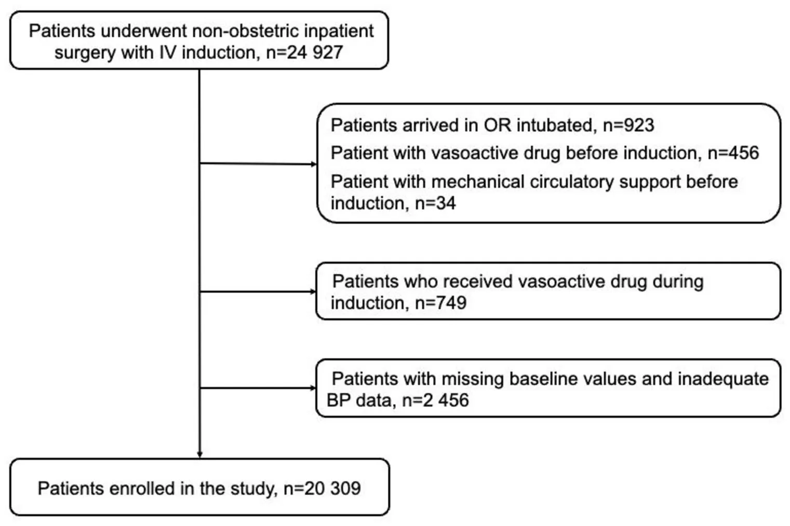
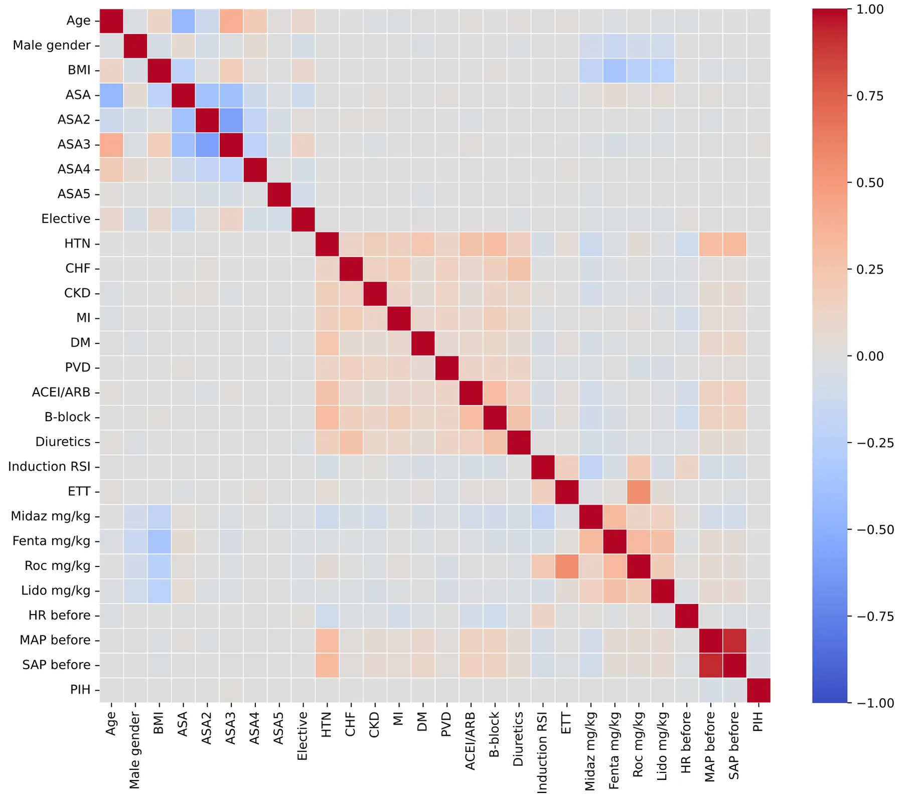
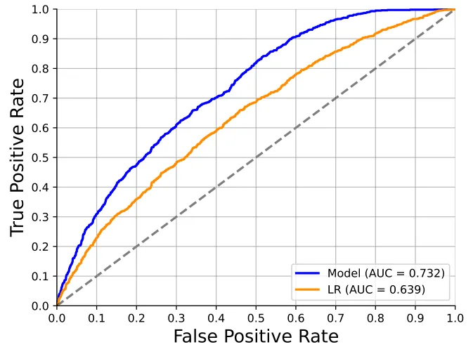
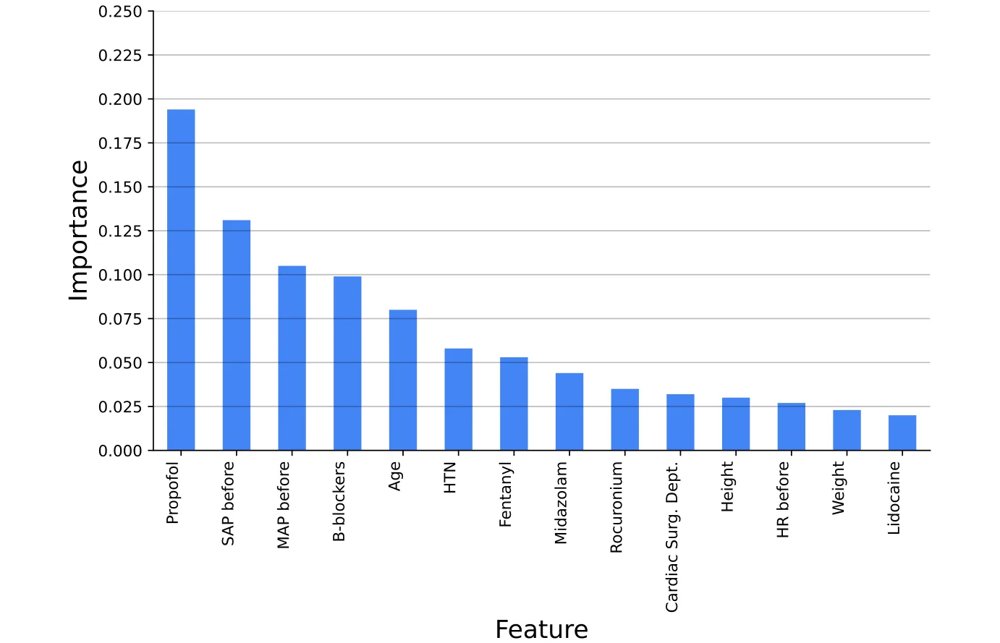
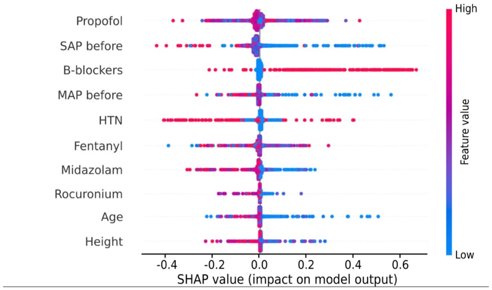

## 1 Introduction

Arterial hypotension is a frequently encountered and often unintended event in patients undergoing surgery under general anesthesia [1]. Recent studies have shown that, even

- \* Maksim Katsin
- katinml@gmail.com
- 1 Department of Anesthesiology, Sheba Medical Center, 21 Emek Dotan 11, Ramat Gan, Israel
- 2 Faculty of Medicine, Tel-Aviv University, Tel‑Aviv, Israel
- 3 Shalvata Mental Health Care Center, Hod Hasharon, Israel
- 4 Department of Management, Bar-Ilan University, Ramat‑Gan, Israel
- 5 Department of Mathematics, Ariel University, Ariel, Israel
- 6 Department of Cancer Biology, Cancer Institute, University College London, London, UK

for short durations, hypotensive events are associated with an increased risk of postoperative complications. According to Walsh et al. [2], as little as 1 min of exposure to mean arterial blood pressure (MAP) that is lower than 55 mmHg is associated with kidney injury after noncardiac surgery. Postoperative acute kidney injury in turn is associated with an eightfold increase in postoperative mortality [3]. More recent research has also revealed associations between hypotension and other unfavorable consequences, including myocardial injury and stroke [4]. Hypotension during the early phase of anesthesia, so-called postinduction hypotension (PIH), is influenced by a complex interplay of factors, including patient-specific parameters, chronic medication use, preexisting medical conditions, and the specific anesthetic induction regimen [5]. The multifaceted nature of these interactions makes predicting PIH challenging, and traditional modeling techniques may prove insufficient in capturing the complexity of this phenomenon. Recognizing these challenges, previous studies have highlighted the potential of various machine learning (ML) techniques in predicting postinduction hypotension, demonstrating their capability to improve risk stratification and support anesthesia management [6]. ML algorithms excel at handling large and complex datasets, uncovering intricate patterns that may escape traditional statistical approaches [7]. The increasing availability of modern electronic health records (EHR) and integrated anesthesia information management systems (AIMS) further enhances the feasibility of developing robust predictive models for clinical application. Leveraging these advanced tools provides an opportunity to enhance patient care by facilitating early identification of high-risk patients and enabling tailored anesthetic management strategies [8]. The primary aim of this study is to develop and validate a machine learning-based prediction model for PIH, utilizing comprehensive perioperative data, and to identify the clinical factors contributing to individual risk.

## 2 Methods

### 2.1 Ethics approval and reporting guidelines

This study was approved by the Ethics Committee of the Sheba Medical Center, Israel (SMC-D 0649–23, November 02, 2023). The informed consent requirement was waived by the Ethical Committee. The study was guided by the Transparent Reporting of a multivariable prediction model for Individual Prognosis Or Diagnosis (TRIPOD + AI) framework [9].

### 2.2 Patient population

We performed a single-center retrospective cohort study of patients who received general anesthesia between September 1, 2018, and September 1, 2023. Data were retrieved retrospectively from the EHR (Chameleon, Elad Software Ltd., Tel Aviv, Israel) from all adult patients who underwent inpatient non-obstetric surgery under general anesthesia with intravenous induction. The exclusion criteria were as follows: patients who arrived intubated, patients with mechanical circulatory support devices, and those receiving vasoac-tive drug drips before induction of anesthesia. We did not include patients with missing baseline values and inadequate arterial blood pressure (BP) data (defined as measurements missing for at least 5 consecutive minutes). This study used a dataset encompassing a wide array of variables pertinent to patient demographics, clinical characteristics, intraoperative details, and preoperative comorbidities (Online resource 1). To prevent data leakage, all predictors were collected before the start of the ‘post-induction period’ (Online resource 2).

### 2.3 Sample size calculation

Based on the literature, the incidence of PIH is estimated to be approximately 40% [10], meaning the sample is relatively balanced and we can take 20% on top of the first cohort size estimation to allow undersampling for balancing. Considering the complexity of the model and the number of features, we applied the rule of thumb requiring at least 10 outcome events per variable (EPV) to guide the calculation and justification of the sample size [11]. As we collected 50 features, we calculated the minimum required sample size to be 600 patients.

### 2.4 Definition of postinduction hypotension

We defined the ‘post-induction period’ as the time immediately following the completion of anesthesia induction, lasting for 10 min. Vital signs monitoring was confined to this time frame. Invasive pressures were recorded every minute while non-invasive BP were recorded every 1–5 min. The primary outcome studied was the occurrence of PIH, which is identified by any MAP reading below 55 mmHg captured through either noninvasive or continuous BP monitoring. In our analysis, we excluded measurements classified as artifacts: systolic arterial pressures ≥ 250 mmHg or ≤ 50 mmHg and mean arterial pressures ≥ 200 or ≤ 20 mmHg. The accuracy of the data was verified using a case sampling approach, wherein 50 cases were reviewed manually to ensure the validity of the dataset.

### 2.5 Data analysis

We conducted a three-step analysis using the gathered data. Initially, we computed and examined the statistical properties of the obtained dataset. Subsequently, we carefully partitioned the data into training and validation cohorts for model training and evaluation. Thirdly, we assessed the significance of each parameter in the prediction to investigate the clinical reasoning identified and applied by the model. All analyses were carried out using the Python programming language (version 3.9).

### 2.6 Cohort analysis

Patient characteristics were compared and described using appropriate statistics. Student’s t-test or Mann–Whitney U-test was used to compare continuous variables, and the Chi-squared test was used for categorical variables. Data were expressed as median (and interquartile range [IQR]) and proportion, as appropriate. Comparisons between the groups were performed using a one-way analysis of variance (ANOVA). Moreover, to assess linear and monotonic relationships between features and between features and target (PIH), we generated a Pearson correlation matrix based on the cohort.

### 2.7 Prediction tools training

The data used for the prediction tool contained 50 features, of these 15 are continuous, 34 are binary, and one is categorical. For the categorical feature, we used a label encoding which provides a single number each unique number in arbitrary order. For the continuous and binary features, we did not perform any pre-processing.

To create the model, the study population was divided into a training cohort with 80% of the patients (16,247), from which the proposed model was derived, and a validation cohort with 20% of the patients (4062), from which the model was applied and tested. For the training cohort, we employed the widely used cross-validation approach, which iteratively splits the study population into training and validation sets to provide a statistically robust evaluation of the performance of a prediction tool [12]. Specifically, we adopted the k-fold cross-validation method, dividing the data into k cohorts of equal size that are distinct pairwise. Each cohort served as the validation cohort, while the remaining cohorts constituted the training sets, resulting in k validations. The average performance of the model across these validation results provided an overall estimation of its performance. We adopted the popular k = 5 option [13].

Importantly, ensuring that the validation cohort maintains a comparable distribution to that of the training cohort, as stipulated in clinical-related machine learning analysis [14], requires careful partitioning of the population into training and validation cohorts with statistically similar age and gender properties. In the context of the k-fold cross-validation method, each cohort’s age and sex distribution should be similar to those of the other cohorts. To achieve this objective, we formalized this requirement as an optimization task, aiming to divide dataset (cohort) D into k identically sized and pairwise distinct subsets while minimizing the average distance between the distributions characterized by the age and gender properties of each cohort and any other cohort. Intuitively, this task resembles a specific instance of the nurse scheduling problem [15]. Based on Goodman et al. [16], we approach a nearly optimal solution using the Directed Bee Colony Optimization algorithm.

For each partition into training and validation cohorts, we explored an ensemble of ML algorithms and feature selection methods to maximize the accuracy of the model. Initially, we employed the k-fold cross-validation method on the training cohort to ensure the robustness of the obtained prediction tool on the data, addressing potential overfitting and enhancing data stability [12]. The segmented training cohort underwent optimization using the Tree-based Pipeline Optimization Tool (TPOT) [17], an automated ML (AutoML) tool that refines ML pipelines using genetic programming [18]. Subsequently, we sought further enhancements to the model by improving the hyperparameters using the grid-search method, which tries a large number of hyperparameter combinations to find the one that optimizes the model’s performance [19]. To provide a context to the performance of the obtained model, we also trained a logistic regression model on the data following the same process [20].

### 2.8 Features’ importance analysis

We assessed the importance of parameters using the information gain method [21]. For each parameter utilized by the model, we iteratively removed one feature at a time, retrained the model, and recorded the average accuracy from the k-fold cross-validation analysis, resulting in an accuracy score for each excluded parameter. Thereafter, we introduced a new parameter to the model, which was generated by sampling from a normal distribution with a mean of 0 and a standard deviation of 1. For all scenarios, we calculated the decrease (or increase) in accuracy compared with the model’s accuracy with all parameters, excluding the “noise” parameter. Parameters with absolute differences smaller than those obtained from the “noise” parameter case were set to zero. Finally, we normalized all values to ensure that their sum equaled 1, thereby obtaining the importance of the parameters for each instance of the model.

Furthermore, we utilized SHapley Additive exPlanations (SHAP) analysis to gain insights into the influence of various features on the obtained model [22]. The SHAP values explain an ML model’s output by attributing the contribution of each individual feature to a specific prediction. Simply put, SHAP values offer a fair distribution of “credit” for prediction among the features. In the context of feature importance analysis, SHAP values quantify the extent to which each feature influences a prediction, with a positive value indicating a positive contribution and a negative value indicating a negative impact. Specifically, we employed a grid search [23], sampling various combinations of the obtained ML model’s hyperparameters to optimize the average accuracy across the k-fold cross-validation evaluations on the training cohort. Additionally, for tree-based models, we implemented post-pruning methods to enhance the generalization and performance of these prediction tools.

## 3 Results

### 3.1 Descriptive statistics

A total of 20,309 patients were included in the final analysis (Fig. 1). The study included 10,850 men (53.4%) and 9,459 women (46.6%). The median patient age was 48.4 years (IQR 34.3–68.0). All patients received intravenous induction of general anesthesia. Of the total cohort, 16,341 (80.5%) underwent tracheal intubation; of these, 1909 (9.4%) underwent rapid sequence induction (RSI). Invasive BP monitoring, involving the insertion of a pre-induction arterial line, was performed in 1036 cases (5.1%). Additionally, in 4854 cases (23.9%), invasive BP monitoring was initiated only after the completion of anesthesia induction, leading to situations where the outcome label was defined, either wholly or partially, by invasive monitoring. The median pre-induction SAP was 140 mmHg (IQR, 123–160), and MAP was 102 mmHg (IQR, 90–114). The two groups were distinguished as follows: 4,948 (24.4%) patients met the PIH criteria and 15,361 (75.6%) patients did not meet the criteria for PIH. Detailed characteristics of the study groups are presented in Table 1.

Univariate analysis indicated that the incidence of hypertension, chronic heart failure, chronic kidney disease, coronary artery disease, previous myocardial infarction, diabetes mellitus, and peripheral vascular disease, as well as concomitant therapy with angiotensin-converting enzyme inhibitors/angiotensin receptor blockers (ACEi/ ARB), calcium channel blockers (CCB), beta-blockers, diuretics, thyroid replacement therapy, and selective serotonin reuptake inhibitors, was significantly higher in patients who experienced hypotension after anesthesia induction than in those who did not. In addition, patients who underwent RSI experienced PIH significantly more often.

Moreover, a Pearson correlation matrix is presented in Fig. 2, depicting the correlations among the features of the cohort, including the target feature (PIH). The majority of features exhibit low correlation values, approaching zero in absolute terms. This implies that the pairwise relationships between features are both linear and monotonic. Specifically, this finding underscores the complexity of the task, suggesting the necessity for non-linear models. A linear model would likely fail to identify meaningful relationships between the features [24]. Subsequently, we opted for a machine-learning approach capable of handling intricate and non-linear datasets, a requirement particularly emphasized in the clinical domain [25].

### 3.2 Model performance

The automatic ML process, governed by the TPOT library, produced an ensemble model of multiple tree-based ML models. We provide as a supplementary the Python code produced for this model. Upon manual examination, we find that a Random Forest model [26] has statistically significantly the same performance using a *휒*2 test with p < 0.001. Thus, the developed model takes the form of a Random Forest model with a depth of 13 and fifty trees in the forest.

<figure id="fig-1">

<figcaption><strong>Fig. 1</strong> Patient Enrollment Flowchart The flowchart illustrates patient enrollment and exclusion criteria. Of 24,927 patients, exclusions were made for those arriving intubated (n = 923), receiving preinduction vasoac-tive drugs (n = 456), or Missing baseline values and inadequate BP data (n = 2456). The final cohort for analysis included 20,309 patients</figcaption>
</figure>

<figure class="table-figure" id="table-1">
<figcaption><strong>Table 1</strong> Patients’ characteristics</figcaption>

<table><tr><th>Variables</th><th>All cohort</th><th>No PIH</th><th>PIH</th><th>p-value</th></tr><tr><td>Age (years), median [IQR]</td><td>48.4 [34.3–68.0]</td><td>48.4 [34.4–68.0]</td><td>48.2 [33.8–68.0]</td><td>0.244</td></tr><tr><td>Male, n (%)</td><td>10,850 (53.4%)</td><td>8230 (53.6%)</td><td>2620 (53.0%)</td><td>0.442</td></tr><tr><td>BMI (kg/m2), median [IQR]</td><td>25.9 [22.9–29.8]</td><td>25.9 [22.8–29.7]</td><td>26.0 [22.9–30.0]</td><td>0.440</td></tr><tr><td>Smoking, n (%)</td><td>4456 (23.0%)</td><td>3473 (23.8%)</td><td>983 (20.8%)</td><td>&lt; 0.001</td></tr><tr><td>Hypertension, n (%)</td><td>3813 (18.8%)</td><td>2531 (16.5%)</td><td>1282 (25.9%)</td><td>&lt; 0.001</td></tr><tr><td>Valvular disease, n (%)</td><td>235 (1.2%)</td><td>172 (1.1%)</td><td>63 (1.3%)</td><td>0.380</td></tr><tr><td>Chronic heart failure, n (%)</td><td>252 (1.2%)</td><td>155 (1.0%)</td><td>97 (2.0%)</td><td>&lt; 0.001</td></tr><tr><td>Chronic kidney disease, n (%)</td><td>324 (1.6%)</td><td>215 (1.4%)</td><td>109 (2.2%)</td><td>&lt; 0.001</td></tr><tr><td>Atrial fibrillation, n (%)</td><td>610 (3.0%)</td><td>469 (3.1%)</td><td>141 (2.8%)</td><td>0.466</td></tr><tr><td>Coronary artery disease, n (%)</td><td>805 (4.0%)</td><td>513 (3.3%)</td><td>292 (5.9%)</td><td>&lt; 0.001</td></tr><tr><td>Myocardial infarction in the past, n (%)</td><td>399 (2.0%)</td><td>266 (1.7%)</td><td>133 (2.7%)</td><td>&lt; 0.001</td></tr><tr><td>Diabetes mellitus, n (%)</td><td>795 (3.9%)</td><td>526 (3.4%)</td><td>269 (5.4%)</td><td>&lt; 0.001</td></tr><tr><td>Peripheral vascular disease, n (%)</td><td>267 (1.3%)</td><td>152 (1.0%)</td><td>115 (2.3%)</td><td>&lt; 0.001</td></tr><tr><td>Angiotensin-converting enzyme inhibitors/Angiotensin II receptor blockers, n (%)</td><td>937 (4.6%)</td><td>548 (3.6%)</td><td>389 (7.9%)</td><td>&lt; 0.001</td></tr><tr><td>Calcium channel blockers, n (%)</td><td>307 (1.5%)</td><td>202 (1.3%)</td><td>105 (2.1%)</td><td>&lt; 0.001</td></tr><tr><td>β-blockers, n (%)</td><td>1511 (7.4%)</td><td>901 (5.9%)</td><td>610 (12.3%)</td><td>&lt; 0.001</td></tr><tr><td>Diuretics, n (%)</td><td>416 (2.0%)</td><td>252 (1.6%)</td><td>164 (3.3%)</td><td>&lt; 0.001</td></tr><tr><td>Thyroid replacement therapy, n (%)</td><td>419 (2.1%)</td><td>273 (1.8%)</td><td>146 (3.0%)</td><td>&lt; 0.001</td></tr><tr><td>Selective serotonin reuptake inhibitors, n (%)</td><td>370 (1.8%)</td><td>222 (1.4%)</td><td>148 (3.0%)</td><td>&lt; 0.001</td></tr><tr><td>Steroids, n (%)</td><td>647 (3.2%)</td><td>468 (3.0%)</td><td>179 (3.6%)</td><td>0.047</td></tr><tr><td>ASA-PS, n (%)</td><td></td><td></td><td></td><td>0.792</td></tr><tr><td>1</td><td>3955 (19.5%)</td><td>3007 (19.6%)</td><td>948 (19.2%)</td><td></td></tr><tr><td>2</td><td>7204 (35.5%)</td><td>5426 (35.3%)</td><td>1778 (35.9%)</td><td></td></tr><tr><td>3</td><td>7797 (38.4%)</td><td>5917 (38.5%)</td><td>1880 (38.0%)</td><td></td></tr><tr><td>4</td><td>1297 (6.4%)</td><td>977 (6.4%)</td><td>320 (6.5%)</td><td></td></tr><tr><td>5</td><td>54 (0.3%)</td><td>33 (0.2%)</td><td>21 (0.4%)</td><td></td></tr><tr><td>Elective surgery, n (%)</td><td>16,958 (83.5%)</td><td>12,809 (83.4%)</td><td>4149 (83.9%)</td><td>0.443</td></tr><tr><td>Rapid sequence induction, n (%)</td><td>1909 (9.4%)</td><td>1364 (8.9%)</td><td>545 (11.0%)</td><td>&lt; 0.001</td></tr><tr><td>Endotracheal tube, n (%)</td><td>16,341 (80.5%)</td><td>12,364 (80.5%)</td><td>3977 (80.4%)</td><td>0.861</td></tr><tr><td>Preinduction invasive blood pressure measurement</td><td>1036 (5.1%)</td><td>498 (2.5%)</td><td>538 (2.6%)</td><td>0.208</td></tr><tr><td>Postinduction invasive blood pressure measurement</td><td>4854 (23.9%)</td><td>2342 (11.5%)</td><td>2512 (12.4%)</td><td>&lt; 0.001</td></tr><tr><td>Heart rate before induction (beats/min), median [IQR]</td><td>78 [68–90]</td><td>78 [68–90]</td><td>77 [67–90]</td><td>0.299</td></tr><tr><td>Systolic blood pressure before induction (mmHg), median [IQR]</td><td>140 [123–160]</td><td>140 [124–160]</td><td>140 [120–161]</td><td>&lt; 0.001</td></tr><tr><td>Mean blood pressure before induction (mmHg), median [IQR]</td><td>102 [90–114]</td><td>102 [91–114]</td><td>101 [88–114]</td><td>&lt; 0.001</td></tr><tr><td>Midazolam, n (%)</td><td>13,190 (64.9%)</td><td>10,331 (67.3%)</td><td>2859 (57.8%)</td><td>&lt; 0.001</td></tr><tr><td>Midazolam (mg/kg), median [IQR]</td><td>0.03 [0.02–0.03]</td><td>0.03 [0.02–0.03]</td><td>0.02 [0.02–0.03]</td><td>&lt; 0.001</td></tr><tr><td>Fentanyl, n (%)</td><td>18,729 (92.2%)</td><td>14,168 (92.2%)</td><td>4561 (92.2%)</td><td>0.900</td></tr><tr><td>Fentanyl (mcg/kg), median [IQR]</td><td>1.84 [1.33–2.47]</td><td>1.88 [1.36–2.50]</td><td>1.74 [1.25–2.35]</td><td>&lt; 0.001</td></tr><tr><td>Propofol, n (%)</td><td>19,143 (94.3%)</td><td>14,490 (94.3%)</td><td>4653 (94.0%)</td><td>0.443</td></tr><tr><td>Propofol (mg/kg), median [IQR]</td><td>1.88 [1.38–2.47]</td><td>1.94 [1.45–2.50]</td><td>1.67 [1.22–2.22]</td><td>&lt; 0.001</td></tr><tr><td>Etomidate, n (%)</td><td>228 (1.1%)</td><td>161 (1.0%)</td><td>67 (1.4%)</td><td>0.076</td></tr><tr><td>Etomidate (mg/kg), median [IQR]</td><td>0.17 [0.13–0.24]</td><td>0.18 [0.13–0.22]</td><td>0.17 [0.13–0.26]</td><td>0.099</td></tr><tr><td>Ketamine, n (%)</td><td>104 (0.5%)</td><td>78 (0.5%)</td><td>26 (0.5%)</td><td>0.880</td></tr><tr><td>Ketamine (mg/kg), median [IQR]</td><td>0.74 [0.33–1.54]</td><td>0.71 [0.32–1.47]</td><td>0.94 [0.32–2.15]</td><td>0.288</td></tr><tr><td>Rocuronium, n (%)</td><td>14,561 (71.7%)</td><td>11,107 (72.3%)</td><td>3454 (69.8%)</td><td>0.001</td></tr><tr><td>Rocuronium (mg/kg), median [IQR]</td><td>0.64 [0.50–0.82]</td><td>0.65 [0.50–0.82]</td><td>0.63 [0.48–0.81]</td><td>0.001</td></tr><tr><td>Succinylcholine, n (%)</td><td>274 (1.3%)</td><td>216 (1.4%)</td><td>58 (1.2%)</td><td>0.215</td></tr><tr><td>Succinylcholine (mg/kg), median [IQR]</td><td>1.36 [1.09–1.72]</td><td>1.36 [1.11–1.71]</td><td>1.36 [0.9–1.72]</td><td>0.330</td></tr><tr><td>Lidocaine, n (%)</td><td>14,159 (69.7%)</td><td>10,664 (69.4%)</td><td>3495 (70.6%)</td><td>0.107</td></tr></table>

</figure>

<figure class="table-figure" id="table-1b">
<figcaption><strong>Table 1</strong> (continued)</figcaption>

<table><tr><th>Variables</th><th>All cohort</th><th>No PIH</th><th>PIH</th><th>p-value</th></tr><tr><td>Lidocaine (mg/kg), median [IQR]</td><td>1.00 [0.77–1.27]</td><td>1.00 [0.79–1.28]</td><td>0.95 [0.72–1.23]</td><td>&lt; 0.001</td></tr></table>

<em>BMI</em> Body mass index, <em>ASA-PS</em> American Society of Anesthesiologists Physical Status Classification System, <em>IQR</em> Interquartile range

</figure>

<figure id="fig-2">

<figcaption><strong>Fig. 2</strong> Correlation matrix between the dataset’s features, including the target variable (PIH) <em>BMI</em> Body mass index, <em>ASA</em> American Society of Anesthesiologists Physical Status 1–5, <em>elective_surg</em> elective surgery, <em>HTN</em> Hypertension, <em>CHF</em> Congestive heart failure, <em>CKD</em> Chronic kidney disease, <em>MI</em> Previous myocardial infarction, <em>DM</em> Diabetes mellitus, <em>PVD</em> Peripheral vascular disease, <em>ACEI/ARB</em> Angiotensin-converting enzyme inhibitors/angiotensin receptor blockers,</figcaption>
</figure>

*RSI* Rapid sequence induction, *ETT* Endotracheal tube, *midaz\_mg/kg* midazolam dose mg/kg, *fenta\_mg/kg* Fentanyl dose mg/kg, *prop\_mg/kg* Propofol dose mg/kg, *roc\_mg/kg* Rocuronium dose mg/kg, *lido\_ mg/kg* lidocaine dose mg/kg, *HR\_before* Heart rate before induction start, *MAP\_before* Mean arterial pressure before induction start, *SAP\_ before* Systolic arterial pressure before induction start, *PIH* Postinduction hypotension In order to evaluate the developed model, we first computed the receiver operating characteristic (ROC) and the area under the ROC curve (AUC), as presented in Fig. 3, receiving an AUC score of 0.732. Similarly, the baseline model (i.e., the Logistic Regression model) obtained an AUC score of 0.639. Following this result, we computed the accuracy, recall, precision, and F1-score metrics for both the proposed model and a Logistic Regression model, operating as a baseline, on the testing cohort as summarized in Table 2.

<figure id="fig-3">

<figcaption><strong>Fig. 3</strong> The receiver operating characteristic (ROC) curve of the model. <em>AUC</em> Area under the ROC curve</figcaption>
</figure>

<figure class="table-figure" id="table-2">
<figcaption><strong>Table 2</strong> The model’s performance scores</figcaption>

<table><tr><th>Model</th><th>Accuracy</th><th>F1-score</th><th>Recall</th><th>Precision</th></tr><tr><td>Our</td><td>0.771</td><td>0.480</td><td>0.760</td><td>0.351</td></tr><tr><td>Logistic regression</td><td>0.614</td><td>0.464</td><td>0.588</td><td>0.383</td></tr></table>

The results are shown as the mean (standard deviation) of the fivefold cross-validation analysis

</figure>

### 3.3 Feature importance

Figure 4 shows the 14 features (out of 50) that contributed over 2%, accumulating 93.1% of the total contribution. The variables are sorted from left to right, with their order determined by their respective weights in the effect (PIH incidence). In particular, the five most contributing factors were propofol dose, preinduction systolic and mean arterial blood pressures, concomitant use of beta-blockers, and hypertension.

Furthermore, SHAP [22] values were computed to obtain a better clinical understanding of the contribution of the variables to the model. Figure 5 shows the SHAP values for the top 10 combination variables. The color ranges from blue to red, indicating low to high values, and the y-axis indicates an increase or decrease in the probability of the incidence of PIH. Following Fig. 5, it becomes apparent that lower values of preinduction systolic and mean arterial blood pressures, chronic medications (beta-blockers), and lower doses of rocuronium and midazolam showed associations with an elevated risk of PIH.

## 4 Discussion

Hemodynamic fluctuations after anesthesia induction are common, occurring in approximately one-third of all anesthesia procedures [27]. In our study, we demonstrated that the incidence of PIH was 24.4%, which is comparable to previously reported studies [28, 29]. However, in some studies, the incidence of postinduction hypotension was significantly higher, reaching 40% [10] or even higher [30]. We defined PIH based on Wesselink et al.’s findings, which indicated that any exposure to MAP levels below 55 mmHg poses a risk of end-organ-specific injuries, including acute kidney injury, myocardial injury, and stroke [4]. We elected to examine the absolute pressure drop, as Salmasi et al. indicated that there is no disparity in the risk of myocardial infarction and acute kidney injury between relative and absolute pressure drops [31].

This study demonstrated that an ML model could effectively predict PIH with significant accuracy. The majority of the relationships discovered between PIH and various pre- and intraoperative factors align with previous research, which supports our findings. By leveraging a dataset of over 20,000 patients, key predictors such as propofol dose, preinduction systolic and mean arterial pressures, and the use of beta-blockers were identified. The final model achieved an AUC of 0.732, a precision of 0.351, and a recall (sensitivity) of 0.760 (see Table 2). From a clinical standpoint, sensitivity and precision offer more relevant insights than AUC when evaluating bedside utility. A recall of 0.760 indicates that the model correctly identifies 76% of patients who will experience PIH, while the precision of 0.351 means that among patients predicted to develop PIH, hypotension actually occurred in approximately one-third. Notably, the ROC curve revealed an unusual morphology: for a false positive rate of approximately 0.8, the true positive rate approached 1. This implies that in approximately 20% of patients who do not develop PIH, the model is able to confidently and correctly rule out hypotension while maintaining nearly perfect sensitivity. However, we do not have a mechanistic explanation or identifiable feature set that differentiates these patients from others. Any such explanation would be speculative, and further interpretability efforts are warranted. Although the model’s precision is modest, its ability to identify a large proportion of PIH cases makes it valuable for prioritising patients for preemptive haemodynamic optimisation.

<figure id="fig-4">

<figcaption><strong>Fig. 4</strong> A feature importance analysis. <em>SAP before</em> Systolic arterial pressure before induction, <em>MAP before</em> Mean arterial pressure before induction, <em>HTN</em> Hypertension, <em>Cardiac Surg</em>. <em>Dept.</em> Cardiac surgery department, <em>HR before</em> Heart rate before induction</figcaption>
</figure>

<figure id="fig-5">

<figcaption><strong>Fig. 5</strong> A SHAP function value of each feature utilized by the model. <em>SHAP</em> SHapley Additive exPlanations, <em>SAP before</em> Systolic arterial pressure before induction, <em>MAP before</em> Mean arterial pressure before induction, <em>HTN</em> Hypertension</figcaption>
</figure>

By leveraging a large and diverse dataset, we surpassed many previous studies in scale and scope. For instance, Lin et al. [32] analyzed only 1,017 cases using artificial neural networks, and Li et al. [33]. focused on 3030 cardiac surgery patients with a narrower set of features. Compared to studies such as Kendale et al. [34], which achieved an AUC of 0.76 with gradient boosting on 13,323 patients, our model demonstrated competitive performance with an AUC of 0.732. In addition, while Kang et al. [35] and Kho et al. [36] achieved higher AUC values of 0.842 and 0.96, respectively, these studies were limited by smaller sample sizes and narrower scopes. A key strength of our approach lies in the incorporation of explainability tools, such as SHAP values and feature importance analysis, which distinguish our study by providing transparent insights into the key predictors of PIH, facilitating clinical applicability. This emphasis on interpretability contrasts with other studies that primarily focus on model performance without exploring the clinical relevance of predictors, enhancing the potential for real-world integration of our findings.

We found that lower baseline MAP and SBP measured before anesthesia induction were significantly associated with PIH. This is consistent with the findings of Czajka et al., who linked SBP and MAP with PIH [26]. However, the relevance of preoperative blood pressure levels is often questioned in the literature. Salmasi et al. showed that there is no clinically important interaction between MAP drop and preoperative pressure [31]. Further research is required to study this phenomenon in detail.

Propofol, a widely used agent for anesthesia induction, has been found to produce a dose-dependent reduction in both systolic and diastolic blood pressures. In our study, 94% of patients received propofol as an induction anesthetic, mainly as a bolus. The average propofol dose among all patients was 1.98 mg/kg. Notably, patients who experienced hypotension following an induction were administered less propofol than those who did not (1.79 mg/kg vs 2.04 mg/kg). Similar results were obtained in a study by Kendale et al., who observed a statistically significant reduction in the dose of propofol required for the induction of anesthesia in a group of patients with PIH compared to patients without hypotension [37]. Although propofol emerged as the strongest predictive feature in our model, its inclusion warrants careful interpretation. Interrogation of the logistic regression prediction model revealed that propofol dose had a negative association with the outcome, which is also indicated for our ML model. From a clinical and physiological standpoint, increasing the propofol dose does not reduce the risk of PIH; rather, these data serves as an indirect marker reflecting the anesthesiologist’s clinical judgment regarding the patient’s vulnerability to hemodynamic instability. In a multicenter study conducted by Shonberger et al., data from over 320,000 patients aged ≥ 65 years revealed a direct connection between the administered dose of propofol and severe hypotension (MAP < 55 mm Hg) before surgical incision [38].

Our research indicates that a prior history of hypertension, as well as concurrent antihypertensive treatment with beta-blockers, are significantly associated with an almost two-fold increase in the risk of developing hypotension after anesthesia induction. In accordance with the American College of Cardiology/American Heart Association guidelines [38] and the 2022 ESC Guidelines for Cardiovascular Assessment of Noncardiac Surgery [39], all patients who regularly use beta-blockers should continue to receive them preoperatively. In a study conducted by Wallace et al., which analyzed nearly 40,000 surgeries, the researchers found a significantly higher risk of mortality associated with the discontinuation of beta-blockers (OR, 3.93; 95% CI 2.57–6.01) compared to those who did not use them [40]. However, the administration of beta-blockers to individuals with hypertension who are on medication was found to result in low blood pressure during anesthesia induction [27, 30]. A recent review recommended that decisions regarding discontinuation or continuation of beta-blockers before surgery should be based on the revised cardiac risk index score and should be made in collaboration with the attending physician [41]. Anesthesiologists should be aware of the risk of PIH when beta-blockers are continued preoperatively.

Our study has several limitations. First, the variability in definitions of PIH complicates comparisons and interpretations across studies [10]. Another important limitation is the reliance on retrospective data, which inherently carries the risk of unmeasured confounding variables. In addition, although our model is based on data routinely collected in clinical practice, applying it in real-world settings may be challenging, as the specifics of induction characteristics are often recorded retrospectively. Furthermore, due to the unique distribution of the patient’s age, the results may underestimate the impact of the patients’ ages on PIH.

Specifically, the dataset lacks sufficient representation of the 45–64-year age group because a higher proportion of these patients have private insurance and preferentially opt for private hospitals due to shorter waiting periods. This phenomenon, documented in Israeli health insurance reports [42, 43], is supported by our analysis of operative data from our institution and private hospitals in the same geographical location. These hospitals exhibit inverse age distribution trends, likely influencing our results. We present this age distribution anomaly in detail within the supplementary materials (Online resource 3).

Lastly, the data were obtained from a single institution, which may introduce institutional biases and limit the generalizability of our findings.

The successful application of ML to assist in predicting PIH has several significant implications. Clinically, this model can aid anesthesiologists in identifying high-risk patients and tailoring anesthetic management strategies to mitigate the risk of PIH. Scientifically, this study adds to the growing body of evidence supporting the integration of ML into clinical practice, particularly in areas where traditional models struggle with complex, multifactorial phenomena. We provide our ML model as supplementary material (Online resource 3–6), allowing others to utilize and build on top of it. Future research should focus on validating this ML model in prospective, multicenter studies to ensure its robustness and generalizability across different clinical settings.

In conclusion, while classical statistical methods have been the foundation of medical research, their reliance on linear assumptions can limit their ability to capture the complex, multifactorial nature of clinical phenomena such as postinduction hypotension. Machine learning offers an alternative approach capable of modelling non-linear relationships and subtle interactions among diverse variables. However, these benefits come with important caveats. Many ML models function as ‘black boxes’—producing accurate predictions but lacking transparency and clinical interpretability. This can hinder their acceptance and utility in practice. Our model demonstrates that machine learning can support the identification of patients at elevated risk of postinduction hypotension, using routinely available preoperative and intraoperative data. While it does not achieve perfect precision, its relatively high sensitivity suggests a role in helping clinicians prioritise vigilance and early intervention. Future studies should aim to prospectively validate these models, improve their explainability, and assess whether their use leads to better patient outcomes at the bedside.

**Supplementary Information** The online version contains supplementary material available at https://doi.org/10.1007/s10877-025-01295-x.

**Acknowledgements** The authors thank Elad Drori and Marwa Sabih for their review and suggestions for improving this article

**Author contributions** M.K.: Conceptualization, Methodology, Formal analysis, Investigation, Project administration, Data curation, Writing—Original Draft. M.G.: Conceptualization, Methodology, Formal analysis, Investigation, Data curation, Writing—Original Draft. H.B.: Writing—Review & Editing. D.O.: Writing—Review & Editing. Y.P.: Writing—Review & Editing. A.S.: Writing—Review & Editing. A.Y.: Formal analysis, Writing—Review & Editing. T.L.: Methodology, Software, Formal analysis, Investigation, Writing— Original Draft, Writing—Review & Editing, Visualization.

**Funding** No funding was received for this study.

**Data Availability** No datasets were generated or analysed during the current study.

### Declarations

**Conflicts of interest** The authors declare no competing interests.

which permits any non-commercial use, sharing, distribution and reproduction in any medium or format, as long as you give appropriate credit to the original author(s) and the source, provide a link to the Creative Commons licence, and indicate if you modified the licensed material. You do not have permission under this licence to share adapted material derived from this article or parts of it. The images or other third party material in this article are included in the article’s Creative Commons licence, unless indicated otherwise in a credit line to the material. If material is not included in the article’s Creative Commons licence and your intended use is not permitted by statutory regulation or exceeds the permitted use, you will need to obtain permission directly from the copyright holder. To view a copy of this licence, visit http://crea-tivecommons.org/licenses/by-nc-nd/4.0/.

## References

1. Bijker JB, Van Klei WA, Kappen TH, Van Wolfswinkel L, Moons KGM, Kalkman CJ. Incidence of intraoperative hypotension as a function of the chosen definition. Anesthesiology. 2007;107(2):213– 20. [doi:10.1097/01.anes.0000270724.40897.8e](https://doi.org/10.1097/01.anes.0000270724.40897.8e)
2. Walsh M, Devereaux PJ, Garg AX, et al. Relationship between intraoperative mean arterial pressure and clinical outcomes after noncardiac surgery. Anesthesiology. 2013;119(3):507–15. [doi:10.1097/aln.0b013e3182a10e26](https://doi.org/10.1097/aln.0b013e3182a10e26)
3. Kheterpal S, Tremper KK, Heung M, et al. Development and validation of an acute kidney injury risk index for patients undergoing general surgery. Anesthesiology. 2009;110(3):505–15. [doi:10.1097/aln.0b013e3181979440](https://doi.org/10.1097/aln.0b013e3181979440)
4. Wesselink EM, Kappen TH, Torn HM, Slooter AJC, Van Klei WA. Intraoperative hypotension and the risk of postoperative adverse outcomes: a systematic review. Br J Anaesth. 2018;121(4):706–21. [doi:10.1016/j.bja.2018.04.036](https://doi.org/10.1016/j.bja.2018.04.036)
5. Chen B, Pang QY, An R, Liu HL. A systematic review of risk factors for postinduction hypotension in surgical patients undergoing general anesthesia. PubMed. 2021;25(22):7044–50. [doi:10.26355/eurrev_202111_27255](https://doi.org/10.26355/eurrev_202111_27255)
6. Hashemi S, Yousefzadeh Z, Abin AA, Ejmalian A, Nabavi S, et al. Machine learning-guided anesthesiology: a review of recent advances and clinical applications. J Cell Mol Anesth. 2024;9(1):e145369. [doi:10.5812/jcma-145369](https://doi.org/10.5812/jcma-145369)
7. Char DS, Burgart A. Machine-learning implementation in clinical Anesthesia: opportunities and challenges. Anesthesia and Analgesia/ Anesthesia & Analgesia. 2020;130(6):1709–12. [doi:10.1213/ane.0000000000004656](https://doi.org/10.1213/ane.0000000000004656)
8. Maheshwari K, Cywinski JB, Papay F, Khanna AK, Mathur P. Artificial intelligence for perioperative medicine: perioperative intelligence. Anesthesia and Analgesia/Anesthesia & Analgesia. 2023;136(4):637–45. [doi:10.1213/ane.0000000000005952](https://doi.org/10.1213/ane.0000000000005952)
9. Collins GS, Reitsma JB, Altman DG, Moons KGM. Transparent reporting of a multivariable prediction model for individual prognosis or diagnosis (TRIPOD): the TRIPOD statement. Ann Intern Med. 2015;162(1):55–63. [doi:10.7326/m14-0697](https://doi.org/10.7326/m14-0697)
10. Jor O, Maca J, Koutna J, et al. Hypotension after induction of general anesthesia: occurrence, risk factors, and therapy. a prospective multicentre observational study. J Anesthesia. 2018;32(5):673–80. [doi:10.1007/s00540-018-2532-6](https://doi.org/10.1007/s00540-018-2532-6)
11. Andaur Navarro CL, Damen JAA, van Smeden M, et al. Systematic review identifies the design and methodological conduct of studies on machine learning-based prediction models. J Clin Epidemiol. 2023;154:8–22. [doi:10.1016/j.jclinepi.2022.11.015](https://doi.org/10.1016/j.jclinepi.2022.11.015)
12. Jung Y. Multiple predicting K-fold cross-validation for model selection. J Nonparametric Statis. 2017;30(1):197–215. [doi:10.1080/10485252.2017.1404598](https://doi.org/10.1080/10485252.2017.1404598)
13. Isaac Kofi Nti, Owusu Nyarko-Boateng, Justice Aning, (2021). Performance of Machine Learning Algorithms with Different K Values in K-fold Cross-Validation. Int J Inf Technol Comput Sci (IJITCS). 13(6): 61–71. Di: [doi:10.5815/ijitcs.2021.06.05](https://doi.org/10.5815/ijitcs.2021.06.05)
14. Doshi-Velez F, Perlis RH. Evaluating machine learning articles. JAMA. 2019;322(18):1777. [doi:10.1001/jama.2019.17304](https://doi.org/10.1001/jama.2019.17304)
15. Dowsland KA, Thompson JM. Solving a nurse scheduling problem with knapsacks, networks and tabu search. J Operatl Res Soc. 2000;51(7):825–33. [doi:10.1057/palgrave.jors.2600970](https://doi.org/10.1057/palgrave.jors.2600970)
16. Goodman MD, Dowsland KA, Thompson JM. A grasp-knapsack hybrid for a nurse-scheduling problem. J Heuristic. 2007;15(4):351– 79. [doi:10.1007/s10732-007-9066-7](https://doi.org/10.1007/s10732-007-9066-7)
17. Olson RS, Moore JH. TPOT: a Tree-Based Pipeline Optimization Tool for automating machine learning. In: The Springer Series on Challenges in Machine Learning. ; 2019:151–160. [doi:10.1007/978-3-030-05318-5_8](https://doi.org/10.1007/978-3-030-05318-5_8)
18. Routledge BR. Genetic algorithm learning to choose and use information. Macroecon Dyn. 2001;5(02):303–25. [doi:10.1017/s1365100501019083](https://doi.org/10.1017/s1365100501019083)
19. Lazebnik T, Bunimovich-Mendrazitsky S. Decision tree post-pruning without loss of accuracy using the SAT-PP algorithm with an empirical evaluation on clinical data. Data Knowl Eng. 2023;145:102173. [doi:10.1016/j.datak.2023.102173](https://doi.org/10.1016/j.datak.2023.102173)
20. Vistisen ST, Pollard TJ, Harris S, Lauritsen SM. Artificial intelligence in the clinical setting: towards actual implementation of reliable outcome predictions. Europ J Anaesthesiol. 2022;39(9):729–32. [doi:10.1097/EJA.0000000000001696](https://doi.org/10.1097/EJA.0000000000001696)
21. Wu G, Xu J. Optimized Approach of Feature Selection Based on Information Gain. Presented at the: October 1, 2015; Hangzhou, China. [doi:10.1109/csma.2015.38](https://doi.org/10.1109/csma.2015.38)
22. Lu S, Chen R, Wei W, Belovsky M, Lu X. Understanding heart failure patients EHR clinical features via SHAP interpretation of tree-based machine learning Model predictions. AMIA Annu Symp Proc. 2022;2021:813–22. [doi:10.1109/csma.2015.38](https://doi.org/10.1109/csma.2015.38)
23. Liu R, Liu E, Yang J, Li M, Wang F. Optimizing the Hyper-parameters for SVM by Combining Evolution Strategies with a Grid Search. In: Springer eBooks; 2006:712–721. [doi:10.1007/978-3-540-37256-1_87](https://doi.org/10.1007/978-3-540-37256-1_87)
24. Shami L, Lazebnik T. Implementing machine learning methods in estimating the size of the non-observed economy. Computational Economics. Published online February 17, 2023. [doi:10.1007/s10614-023-10369-4](https://doi.org/10.1007/s10614-023-10369-4)
25. Rokach L. Decision forest: twenty years of research. Inf Fus. 2016;27:111–25. [doi:10.1016/j.inffus.2015.06.005](https://doi.org/10.1016/j.inffus.2015.06.005)
26. Kaur P, Kumar R, Kumar M. A healthcare monitoring system using random forest and internet of things (IoT). Multimed Tools Appl. 2019;78:19905–16. [doi:10.1007/s11042-019-7327-8](https://doi.org/10.1007/s11042-019-7327-8)
27. Czajka S, Putowski Z, Krzych ŁJ. Post-induction hypotension and intraoperative hypotension as potential separate risk factors for the adverse outcome: a cohort study. J Anesth. 2023;37(3):442–50. [doi:10.1007/s00540-023-03191-7](https://doi.org/10.1007/s00540-023-03191-7)
28. Südfeld S, Brechnitz S, Wagner JY, et al. Post-induction hypotension and early intraoperative hypotension associated with general anaesthesia. Br J Anaesth. 2017;119(1):57–64. [doi:10.1093/bja/aex127](https://doi.org/10.1093/bja/aex127)
29. Tarao K, Daimon M, Son K, et al. Risk factors including preoperative echocardiographic parameters for post-induction hypotension in general anesthesia. J Cardiol. 2021;78(3):230–6. [doi:10.1016/j.jjcc.2021.03.010](https://doi.org/10.1016/j.jjcc.2021.03.010)
30. Hojo T, Kimura Y, Shibuya M, Fujisawa T. Predictors of hypotension during anesthesia induction in patients with hypertension on medication: a retrospective observational study. BMC Anesthesiol. 2022. [doi:10.1186/s12871-022-01899-9](https://doi.org/10.1186/s12871-022-01899-9)
31. Salmasi V, Maheshwari K, Yang D, et al. Relationship between intraoperative hypotension, defined by either reduction from baseline or absolute thresholds, and acute kidney and myocardial injury after noncardiac surgery. Anesthesiology. 2017;126(1):47–65. [doi:10.1097/aln.0000000000001432](https://doi.org/10.1097/aln.0000000000001432)
32. Lin CS, Chang CC, Chiu JS, et al. Application of an artificial neural network to predict postinduction hypotension during general anesthesia. Med Decis Mak. 2011;31(2):308–14. [doi:10.1177/0272989X10379648](https://doi.org/10.1177/0272989X10379648)
33. Li XF, Huang YZ, Tang JY, Li RC, Wang XQ. Development of a random forest model for hypotension prediction after anesthesia induction for cardiac surgery. World J Clin Cases. 2021;9(29):8729– 39. [doi:10.12998/wjcc.v9.i29.8729](https://doi.org/10.12998/wjcc.v9.i29.8729)
34. Kendale S, Kulkarni P, Rosenberg AD, Wang J. Supervised machine-learning predictive analytics for prediction of postinduction hypotension. Anesthesiology. 2018;129(4):675–88. [doi:10.1097/aln.0000000000002374](https://doi.org/10.1097/aln.0000000000002374)
35. Kang AR, Lee J, Jung W, Lee M, Park SY, Woo J, Kim SH. Development of a prediction model for hypotension after induction of anesthesia using machine learning. PLoS ONE. 2020;15(4):e0231172. [doi:10.1371/journal.pone.0231172](https://doi.org/10.1371/journal.pone.0231172)
36. Kang AR, Lee J, Jung W, et al. Development of a prediction model for hypotension after induction of anesthesia using machine learning. PLoS ONE. 2020;15(4):e0231172. [doi:10.1371/journal.pone.0231172](https://doi.org/10.1371/journal.pone.0231172)
37. Schonberger RB, Dai F, Michel G, et al. Association of propofol induction dose and severe pre-incision hypotension among surgical patients over age 65. J Clin Anesth. 2022;80:110846. [doi:10.1016/j.jclinane.2022.110846](https://doi.org/10.1016/j.jclinane.2022.110846)
38. Fleisher LA, Fleischmann KE, Auerbach AD, et al. ACC/AHA guideline on perioperative cardiovascular evaluation and management of patients undergoing noncardiac surgery: executive summary. Circulation. 2014;130(24):2215–45. [doi:10.1161/cir.0000000000000105](https://doi.org/10.1161/cir.0000000000000105)
39. Gencer B, Gale CP, Aktaa S, et al. European Society of Cardiology quality indicators for the cardiovascular pre-operative assessment and management of patients considered for non-cardiac surgery. Developed in collaboration with the European Society of Anaes-thesiology and Intensive Care. European Heart Journal Quality of Care & Clinical Outcomes. Published online September 7, 2022. [doi:10.1093/ehjqcco/qcac057](https://doi.org/10.1093/ehjqcco/qcac057)
40. Wallace AW, Au S, Cason BA. Association of the pattern of use of perioperative Β-Blockade and postoperative mortality. Anesthesiology. 2010;113(4):794–805. [doi:10.1097/aln.0b013e3181f1c061](https://doi.org/10.1097/aln.0b013e3181f1c061)
41. Jørgensen ME, Andersson C, Venkatesan S, Sanders RD. Beta-blockers in noncardiac surgery: did observational studies put us back on safe ground? Br J Anaesth. 2018;121(1):16–25. [doi:10.1016/j.bja.2018.02.004](https://doi.org/10.1016/j.bja.2018.02.004)
42. Israel Central Bureau of Statistics. Health Insurance by Age, Population Group and Type of Insurance. Published January 2024. Accessed April 3, 2025. https://www.cbs.gov.il/he/mediarelease/DocLib/2024/340/19\_24\_340b.pdf [doi:10.1016/j.bja.2018.02.004](https://doi.org/10.1016/j.bja.2018.02.004) · [link](https://www.cbs.gov.il/he/mediarelease/DocLib/2024/340/19_24_340b.pdf)
43. Israel Ministry of Health. Interim Report on Health Insurance Plans. Published July 2021. Accessed April 3, 2025. https://www.gov.il/BlobFolder/reports/healthinsurancereport/he/marketresearch [link](https://www.cbs.gov.il/he/mediarelease/DocLib/2024/340/19_24_340b.pdf) · [link](https://www.gov.il/BlobFolder/reports/healthinsurancereport/he/marketresearch)
