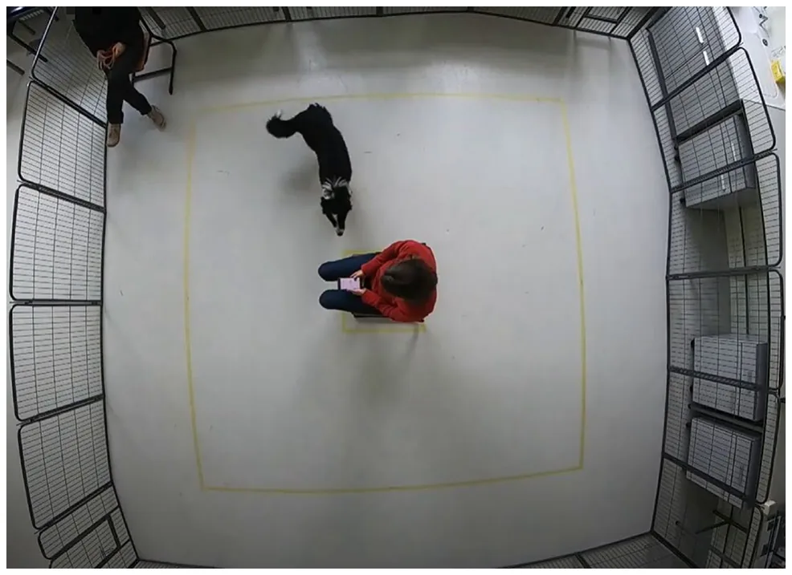
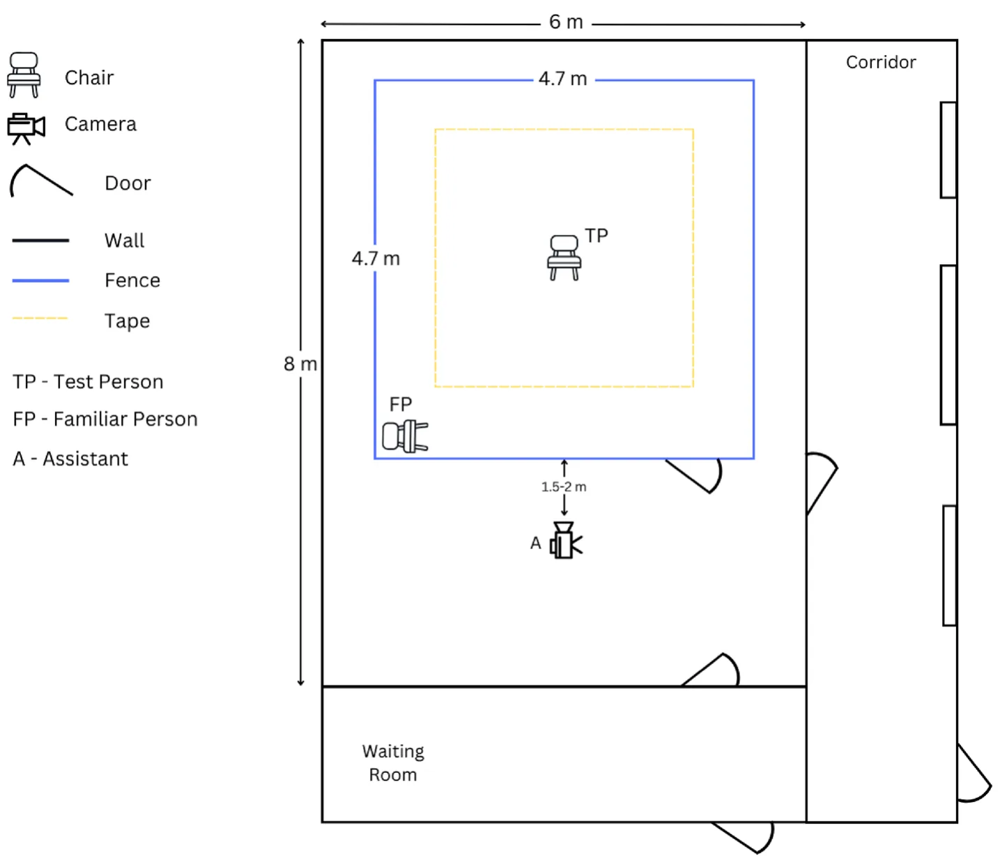
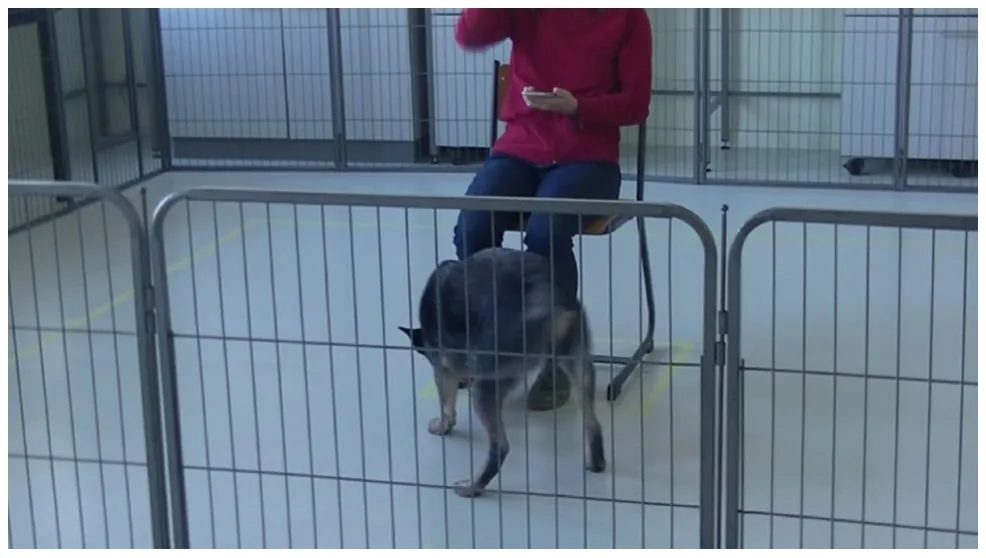
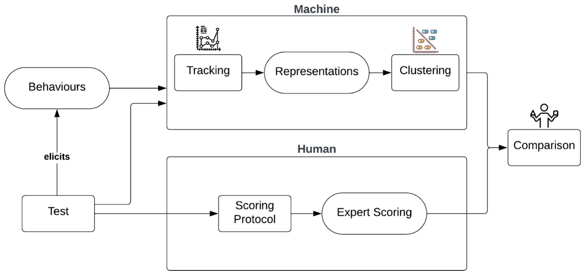
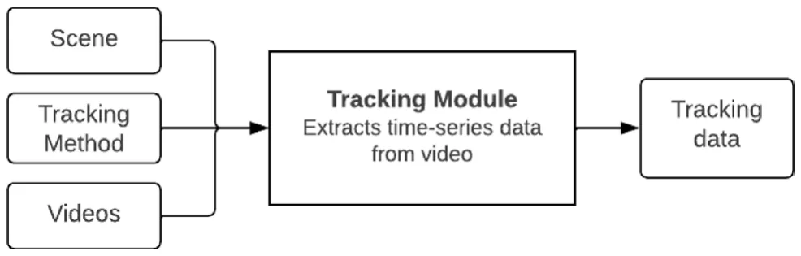
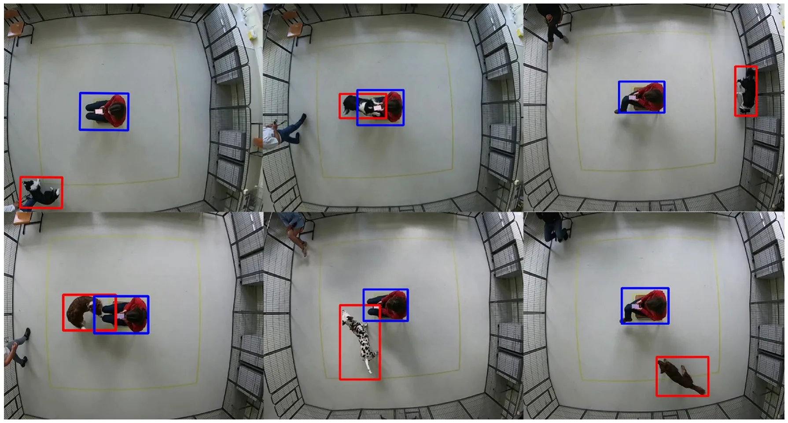
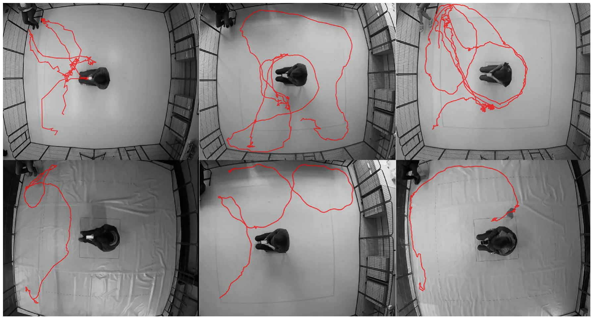
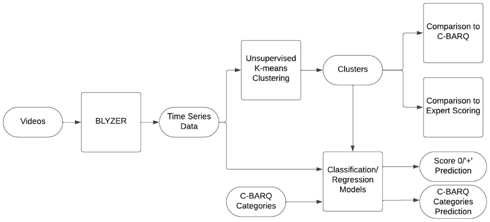
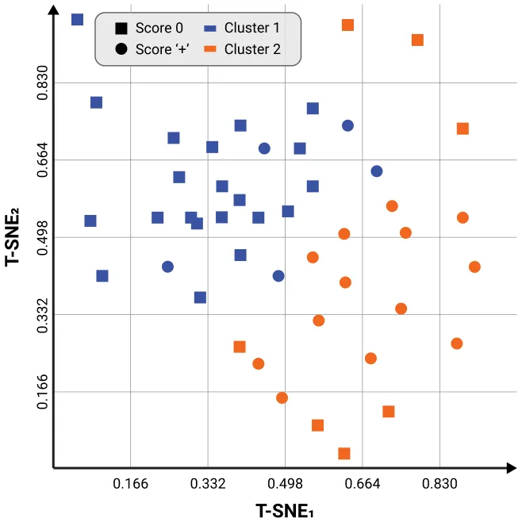

Behavioral traits in animals are consistent patterns of behaviors exhibited across similar situations1–4. They are driven by personality5, which is a complex combination of genetic, cognitive, and environmental factors6. The assessment of personality traits in dogs is gaining increasing attention due to its many practical applications in applied behavior7–10. Some examples of such applications include determining the suitability of dogs for working roles11–13, identifying problematic behaviors14, and adoption-related issues for shelter dogs4,15,16.

Measuring behavioral traits of dogs has been an enigmatic challenge in scientific literature for decades. Two of the most common methods are behavioral testing and questionnaires. The former refers to experimental behavioral tests (e.g., observations of the dog’s behavior in a controlled novel situation, such as the Strange Situation Test17). Such tests can be rated, scored and assessed using standard ethological methods of behavioral observation18,19. Brady et al.20 provide a systematic review of the reliability and validity of behavioral tests that assess behavioral characteristics important in working dogs. Jones and Gosling21 provide another comprehensive review of past research on canine temperament and personality traits. In a complementary manner, Bray et al.12 reviewed 33 empirical studies assessing the behavior of working dogs. Tests for detection dogs have also been addressed22–24. The latter method refers to questionnaires completed by the owner or handler. Examples include the Monash Canine Personality Questionnaire25, the Dog Personality Questionnaire26 and many more. One of the most well-known questionnaires, used in many contexts, is the Canine Behavioral Assessment and Research Questionnaire (C-BARQ). Originally developed in English27,28, it has been validated in a number of languages. Although questionnaires are more time and resource efficient, and can better represent long-term trends in behavior compared to behavioral testing, they have serious limitations: they are susceptible to subjectivity and misinterpretation, and can be biased by the bond with the animal being assessed.

In the context of owner-observed assessment of stress, Mariti et al.29 have argued that many owners would benefit from more educational efforts to improve their ability to interpret the behavior of their dogs. Kerswell et al.30 also showed that owners often overlook some subtle cues dogs exhibit in the initial phases of emotional arousal. Even seemingly clear physical observations, such as obesity in dogs, have been shown to lead to frequent disagreements between owners and veterinarians31. Moreover, in the case of working or shelter dogs, individuals with sufficient knowledge of the dog are not always available to complete questionnaires20.

Rayment et al.32 criticize the lack of proper assessment of the validity and reliability of many test tools. These include psychometric instruments that rely on an unambiguous shared understanding of terminology, which is difficult to achieve in a population with different levels of knowledge about animal behavior. Psychological factors of the human observers influence their evaluation of dogs too33, which further complicates the use of psychometric data from a wide variety of participants as a homogenous dataset of observations. The goal of this exploratory study was to investigate a novel idea of a *digital enhancement* for behavioral testing, which in time may be integrated into relevant interspecies information systems34 to understand animal behavior. In other words, we study how ‘the machine’, or machine learning algorithms, may help human experts in behavioral testing. Using as a case study a simple behavioral testing protocol of coping with the presence of a stranger, currently implemented to improve breeding of working dogs in Belgium, we asked the following questions:

- Can the machine identify different ‘behavioral profiles’ in an objective, ‘human-free’ way, and how do these profiles relate to the scoring of human experts in this test?
- Can the machine predict scoring of human experts in this test?
- Can the machine predict C-BARQ categories of the participating dogs?

## Methods

### Ethical statement

All experiments were performed in accordance with relevant guidelines and regulations. The experimental procedures and protocols were reviewed by the Ethical Committees of KU Leuven and University of Haifa, in both ethical approval was waived. Informed consent was obtained from all subjects and their legal guardians.

### Testing arena

The test was conducted indoors, in a room free from other distractions such as other animals or people, with exception of the test person (TP), the assistant, and the familiar person i.e., the owner or trainer (FP). The testing room, of size 8 m × 6 m contained a testing arena surrounded by a fence made of metal wires of height of 0.8 m, and size of 4.7 × 4.7 m, with a gate entrance towards the area where the assistant was located. In the middle of the test arena, a square of 60 × 60 cm was drawn with tape for positioning the chair of the test person at a fixed location. The test person (TP) faced the gate entrance. In the left corner (frontal view), there was a chair for the familiar person (FP), positioned parallel to the front fence. A second square of size 3 × 3 m, centered around the TP chair, was marked with tape on the floor. These lines indicated the track to be followed when the owner or test person walked in the test arena. An adjacent, separate room was available where the dog and the owner were received and could wait out of sight of the testing arena. The TP could enter the testing arena without being seen by the dog and owner, so that TP was novel for the dog until the start of the actual test.

Figure 1 presents a view from above on the testing arena; Fig. 2 shows the experimental setting in further details.

Two video cameras were used to record the activity and the behavior of the dog during the test, a top view and a side view camera. As top view, a GoPro Hero 7 video camera was mounted in the middle of the test arena at a height of approximately 3 m, so that the entire test arena was covered—see Fig. 1. A side-view camera (JVC Quad proof, full HD) was held and operated by the assistant, recording more nuanced behaviors used for expert scoring; Fig. 3 shows the view from the side camera; Fig. 2 shows the locations of the TP, FP and assistant.

<figure id="fig-1">

<figcaption><strong>Figure 1.</strong> A frame collected of the testing arena used to record dogs’ behavior during the ’Stranger test’. The arena was fenced and recorded from above using a camera. The test person (stranger) is sitting in the middle, and the familiar person (owner) is sitting in the corner.</figcaption>
</figure>

<figure id="fig-2">

<figcaption><strong>Figure 2.</strong> A schematic drawing of the testing room and arena with sizes and locations of test person, familiar person, assistant, entrances and exists.</figcaption>
</figure>

### Test procedure

The protocol used below was a part of a more elaborate testing protocol developed by one of the authors (JM), starting with an exploration phase, to reduce the novelty of the environment for the dog, and followed by 16 test phases. The purpose of the latter was to assess the reactions of dogs to the presence of an unfamiliar person (during inactivity or during neutral and benign actions), both in the presence and absence of a familiar person (i.e., the owner or a regular handler/trainer). This study includes only the first test phase of the full protocol, from now on referred to as the “testing phase”. This phase consisted of inactivity and neutral actions, only in the presence of a familiar person.

Prior to the testing phase, the familiar person was instructed about the test and asked not to interact with the dog. When starting the testing phase, the assistant called in the familiar person and the dog in the test arena, where the test person was seated on the chair in the middle, feet in parallel and firmly planted. The test person held a smartphone as a timer. The familiar person closed the gate of the test arena, unleashed the dog, walked directly to the chair and sat down. After the familiar person sat down, the test person performed three actions: a short, clear cough (at 10 s), a hand running through the hair for 3 s (at 20 s), and crossing the right leg over the left (at 30 s). These are neutral actions that can be expected from any human being and that all dogs will encounter when they are around people. An example trial can be found here (https://drive.google.com/file/d/1VpaxKePw2 ICY2SMGPwK\_T4Td2zGyAOzc/view?usp=sharing). Except when running her hand through her hair or when a dog jumps up, the test person held the smartphone in both hands, resting on her lap. The test person did not look at the dog or perform any actions towards it. If a dog jumped up excitedly, the test person protected her face/head with her hands/arms as needed. During this phase, the whole testing arena was filmed by the camera in top view and the behavior of the dog was filmed in side view by the assistant. Subsequently, both videos were used further in this study for dog scoring by the experts and the computational approach.

<figure id="fig-3">

<figcaption><strong>Figure 3.</strong> A frame of the testing arena captured from the side camera held by the assistant. The assistant recorded the dog closely for the entire testing phase.</figcaption>
</figure>

The unfamiliar person, i.e., the test person, was always the same adult female (JM). The assistant was also always an adult female, but not always the same person. As most of the testing took place at the time of COVID pandemic, the testing person, familiar person and assistant were wearing masks during the test, except for five dogs when masks were no longer obligatory.

#### Study subjects

A total of n = 53 dogs were tested in the study. Their owners were recruited through social media in Belgium. The inclusion criteria for the dogs were:

- Age: between 11 and 24 months old.
- Height: between 30 and 65 centimeters.
- Up-to-date vaccinations and no history of health problems.
- Accompanied by a familiar person.
- Belonging to the modern dog breeds.

#### Demographic data on the participants is provided in Appendix 1

#### Dog scoring

Dogs were scored using the scoring method previously developed by JM for the Belgian assistance dog breeding organization Purpose Dogs vzw (https://purpose-dogs.be/) to improve breeding outcomes. The method is based on an adaptation of the concept of coping with potential threats via freeze/flight versus fight35. The original scoring method used an eleven-point scale ranging from − 5 to + 5. However, for the purposes of our study, the scale was simplified to a five-point scale ranging from − 2 to + 2. The positive/negative scores aimed to differentiate between two main tendencies of dogs when reacting to a stressor (in this context, an unfamiliar person; reactions to the assistant and the FP were ignored): dogs that tended to ‘react towards the stressor’ (e.g., get very close to the test person, jump up, chew, show offensive aggression) received numerically positive scores, and dogs that tended to ‘react away from the stressor’ (e.g., keep at a distance, avoid, show defensive aggression) received numerically negative scores. A larger absolute value for a score indicated a stronger response by the dog (either reacting towards (‘+’) or away from (‘−’) the stressor). Thus negative scores (− 2 for fleeing away from the TP, or extremely frozen, and − 1 for keeping a distance and avoiding the TP) referred to reacting away from the stressor, while positive scores (+ 2 for biting and jumping on TP, + 1 for approaching and continuously interacting with TP) referred to reacting towards the stressor. The score 0 (neutral) indicated mostly neutral and stable coping with the stressor, slowly approaching and sniffing the TP, and then moving on exploring further. The analysis for the purpose of this study was further simplified by grouping the negative (− 2 and − 1) and positive (+ 2 and + 1) scores, respectively, resulting in three groups: “+” , “0”, and “−”.

The testing phase was evaluated by three dog behavior experts (JM, CPHM, EW); the dog received one overall score for the entire phase. To measure reliability of scoring, multi-rater (Fleiss) kappa was used. In case of disagreement among expert scores, the final score was aggregated using majority voting. For example, if two experts scored “+” and one scored “0”, the dog would receive a score “+”. Since only three dogs had negative scores, the negative category was excluded from our analysis due to its small number of samples. Our final dataset included 50 samples, of which 32 samples with a zero/neutral score (26 full agreement by all coders, 6 by majority) and 18 samples with a positive score (12 full agreement by all coders, 6 by majority).

#### C‑BARQ questionnaire

The Canine Behavioral Assessment and Research Questionnaire (C-BARQ) is a questionnaire for owners/handlers to rate the behavior of their dog in various contexts and related to different behavior aspects, such as stranger and owner directed aggression, social and non-social fear, separation related behavior. An instrument originally developed in English27,28, it has been translated to and validated in multiple languages, including Dutch36. In the context of our study, we used the following eight CBARQ categories identified in Hsu et al.27: Stranger directed aggression (SDA), Owner directed aggression (ODA), Stranger directed fear (SDF), Nonsocial fear (NSF), Separation related behavior (SRB), Attachment seeking behavior (ASB), Excitability (EXC), and Pain sensitivity (PS).

The dog owners were asked to complete a Dutch version of the C-BARQ questionnaire.

### Computational approach

The purpose of any behavioral test is, eventually, to observe behaviors in response to various stimuli in a controlled and standardized environment. Based on a specific testing protocol, a scoring method is usually developed and evaluated for use by human experts. The practical aim of such scoring is to classify the elicited behaviors into categories (e.g. corresponding to specific behavioral traits or profiles) that can eventually be used for decision support. With the machine entering the scene, we have an alternative, mathematical and *completely human-free* way of “scoring” behaviors, or dividing them into categories. Since this test focuses on human-directed behavior, we assume that the participants’ trajectories contain meaningful behavioral information about their reaction to the stranger. Therefore, we automatically extract and cluster the dogs’ trajectories, investigating the relationship of the emerging clusters to experts’ scoring, and compare how well they align. This process is demonstrated in Fig. 4, which provides an overview of this conceptual framework for digital enhancement of dog behavioral assessment.

Further details on the tracking method, the clustering method, the machine learning models for prediction of the above and statistical analysis to compare clustering with C-BARQ are given below

#### Tracking method

The BLYZER system is a self-developed platform that aims to provide a flexible automated behavior analysis which has been applied in several studies for analyzing dog behavior37–40. A similar approach was implemented on a smaller portion of the dataset used in this study in41, however in contrast to our approach here, features chosen manually were used for clustering.

BLYZER’s input is video footage of a dog freely moving in a room and possibly interacting with objects, humans or other animals, while its output is time series (representing the dog’s trajectory) in a json file with the detected locations of the objects in each frame. Figure 5 shows the pipeline. Both the tracking method (the models used for detection) and the scene (amount of moving and fixed objects) can be adapted to the specific study. In our setting, e.g., the scene consists of one moving object (dog) and one static object (TP). The tracking method was chosen to be a neural network based on the Faster R-CNN architecture42 pre-trained on the COCO 2017 dataset43, which we retrained on additional 106,768 images of two objects: a person and a dog. The images were collected from (1) Open image dataset V644 (2) Pascalvoc dataset45 (3) COCO dataset43 (4) Images from previous studies39,40. Figure 6 shows example frames from our dataset with dog and test person object detection. And Fig. 7 presents examples of dogs’ trajectories extracted with BLYZER.

*Quality of detection.* To ensure sufficient tracking, only videos with a percentage of frames where dog and person are correctly detected of least 80% of the frames, leading to the exclusion of three videos (all three scored with a zero/neutral score). For the remaining 47 videos, we applied post-processing operations available in BLYZER to remove noise and enhance detection quality using smoothing and extrapolation techniques for the dog and test person detection, reaching almost perfect (above 95%) detection.

<figure id="fig-4">

<figcaption><strong>Figure 4.</strong> A conceptual framework for digitally enhanced dog behavioral assessment.</figcaption>
</figure>

<figure id="fig-5">

<figcaption><strong>Figure 5.</strong> BLYZER tracking module architecture.</figcaption>
</figure>

<figure id="fig-6">

<figcaption><strong>Figure 6.</strong> Example of frames extracted from the test recording, showing the participating dog and test person being detected by Blyzer.</figcaption>
</figure>

<figure id="fig-7">

<figcaption><strong>Figure 7.</strong> Examples of participating dogs’ trajectories extracted with BLYZER and printed on an extracted frame from the recorded test; top: scoring ‘+’, bottom: scoring 0.</figcaption>
</figure>

### Clustering method

The videos from the trials are initially analyzed by the BLYZER tool which produces for each frame the center of mass of the dog and person in the frame (if detected). To assure a smooth motion capture while standardizing between trials, we set 24 frames per second (FPS) rate across all videos. For frames that the BLYZER tool was not able to detect either the dog or the person (or both), it linearly extrapolates their positions to fulfill the gap. In addition, since not all videos were of identical duration, we used the duration of the shortest video as standard duration. As such, each trial ( s ∈ R2m ) is defined by a time series with a fixed duration between samples constructed by two vectors, one for the dog’s position (d ∈ Rm) and the other for the person’s position (p ∈ Rm) . As a result, we obtain a dataset, D ∈ Rn×m . This is the times series data depicted in Figure 8, which presents the whole data analysis pipeline.

For clustering trajectories, we used the time-series K-mean clustering algorithm46 with the elbow-point method47 to find the optimal number of clusters ( k ). Nonetheless, as the raw center of mass is not quite an informative space, we decided to first transform the data into a “movement” space. To this end, we trained a small-size one-dimensional convolutional neural network (CNN) based AutoEncoder model48 with the following architecture for the encoder: Convolution with a window size of 3, dropout with p = 0.1 , max-pooling with a window size of 2 . Clearly, the decoder’s architecture is opposite to the encoder’s one. We used a mean absolute error as the metric for the optimization process and the ADAM optimizer49. The model’s hyperparameters are found using a grid-search50. Using the encoder part of the model that was used after training the AutoEncoder, we computed the “movement” space of each sample for the clustering. Once the clustering is obtained, the clusters were evaluated against expert scoring metrics. T-SNE method with a normalization between 0 and 1 was used to visualize the clusters.

<figure id="fig-8">

<figcaption><strong>Figure 8.</strong> Data analysis pipeline.</figcaption>
</figure>

### Statistical analysis

Mann Whitney U test was performed to compare the means of the C-BARQ scores between the obtained clusters for each of the C-BARQ categories (1, Stranger directed aggression (SDA); 2, Owner directed aggression (ODA); 3, Stranger directed fear (SDF); 4, Nonsocial fear (NSF); 5, Separation related behavior (SRB); 6, Attachment seeking behavior (ASB); 7, Excitability (EXC); and 8; Pain sensitivity (PS)).

### Classification and regression machine learning models

The clustering was further used to obtain classification and regression models for predicting scoring (0/‘+’) and C-BARQ categories, respectively. We use the Tree-Based Pipeline Optimization Tool (TPOT), the genetic algorithm-based automatic machine learning library51. TPOT produces a full machine learning (ML) pipeline, including feature selection engineering, model selection, model ensemble, and hyperparameter tuning; and shown to produce impressive results in a wide range of applications52–54. Hence, for every configuration of source and target variables investigated, we used TPOT, allowing it to test up to 10, 000 ML pipelines. We choose 10, 000 to balance the ability of TPOT to converge into an optimal (or at least close to optimal) ML pipeline and the computational burden associated with this task.

The obtained classification model performance for expert scoring was evaluated using commonly used metrics of accuracy, precision, recall, and F1 score. The obtained regression model performance for C-BARQ categories was evaluated using Mean Absolute Error55 (MAE), Mean Squared Error55 (MSE), and R-squared56 ( R2).

## Results

### Inter‑rater reliability of expert scoring

Multi-rater (Fleiss) kappa on the scores (n = 53) collapsed into three classes (negative‘−’, neutral 0, and positive ‘+’) reached a percentage of agreement of 85%; Fleiss free-marginal k = 0.77 indicating good strength of inter-rater reliability.

### Clusters vs. expert scoring

Using the elbow method, two clusters emerged of sizes 26 and 20 respectively. One sample was excluded due to being an outlier. As shown in Table 1, there is a quite good separation between zero/neutral scores and positive/excessive scores: the first cluster had the majority of participants (n = 21) scoring 0, while only 5 scored ‘+’. The second, the majority (n = 13) scored ‘+’ while 7 scored 0.

To visually demonstrate the relationship between the domain experts’ scoring and the computationally obtained clusters, Fig. 9 provides a visualization of the clusters and domain expert agreement for n = 46 dogs. The axis of the figures are obtained using the T-SNE method and normalization between 0 and 1. The shape represents the expert scoring (circles for score 0, squares for score ‘+’) while the color represents the resulting cluster (blue for cluster 1, orange for cluster 2). The blue circles and orange squares represent the dogs that were clustered ‘incorrectly’.

<figure class="table-figure" id="table-1">
<figcaption><strong>Table 1.</strong> Cluster description in correlation with expert scoring.</figcaption>

<table><tr><th>Expert scoring vs. clusters</th><th>Cluster 1</th><th>Cluster 2</th><th>Total</th></tr><tr><td>Score 0</td><td>21</td><td>7</td><td>28</td></tr><tr><td>Score ‘+’</td><td>5</td><td>13</td><td>18</td></tr><tr><td>Total</td><td>26</td><td>20</td><td>46</td></tr></table>

</figure>

<figure id="fig-9">

<figcaption><strong>Figure 9.</strong> A visualization of the clusters vs. domain expert agreement for n = 46 dogs. The axis are obtained using the T-SNE method and normalization between 0 and 1.</figcaption>
</figure>

### Clusters vs. C‑BARQ

There was a significant difference between the two clusters with respect to Stranger-Directed Fear (SDF) with a median of 0.00 for cluster 1 and 0.42 for cluster 2 (Mann Whitney U = 120.5, z = − 2.56, p = 0.01). No other categories in the C-BARQ showed a meaningful variation between the clusters.

### Automating expert score classification

Table 2 presents the performance of the expert score classification model, reaching accuracy of above 78%.

### C‑BARQ categories regression model

Our findings revealed varying levels of error across the eight C-BARQ categories, the metrics are summarized in Table 3. Owner directed aggression (ODA) and Excitability (EXC) exhibited the lowest errors in terms of MAE and MSE respectively. The R2 values provided insights into the proportion of variance explained by each category. Notably, EXC demonstrated the highest R2 value, indicating a strong fit between the EXC category and the time-series data. SDA and PS exhibited moderate R2 values, signifying a reasonable level of explanatory power. These outcomes illuminate on the predictive performance of the model and highlight the varying impacts of the C-BARQ categories on the outcome.

<figure class="table-figure" id="table-2">
<figcaption><strong>Table 2.</strong> Evaluation metrics of the expert scoring classification model.</figcaption>

<table><tr><th></th><th>Precision</th><th>Recall</th><th>F1</th><th>Accuracy</th></tr><tr><td>Score classifier</td><td>0.771</td><td>0.782</td><td>0.775</td><td>0.787</td></tr></table>

</figure>

<figure class="table-figure" id="table-3">
<figcaption><strong>Table 3.</strong> Regression model metrics per C-BARQ category. Maximal values are in [bold].</figcaption>

<table><tr><th></th><th>MAE</th><th>MSE</th><th>R2</th></tr><tr><td>Owner directed aggression (ODA)</td><td>0.108</td><td>0.046</td><td>0.176</td></tr><tr><td>Excitability (EXC)</td><td>0.122</td><td>0.032</td><td>0.886</td></tr><tr><td>Separation related behavior (SRB)</td><td>0.257</td><td>0.144</td><td>0.073</td></tr><tr><td>Stranger directed aggression (SDA)</td><td>0.275</td><td>0.129</td><td>0.470</td></tr><tr><td>Pain sensitivity (PS)</td><td>0.435</td><td>0.319</td><td>0.429</td></tr><tr><td>Non social fear (NSF)</td><td>0.438</td><td>0.334</td><td>0.043</td></tr><tr><td>Attachment seeking behavior (ASB)</td><td>0.441</td><td>0.287</td><td>0.142</td></tr><tr><td>Stranger directed fear (SDF)</td><td>0.510</td><td>0.430</td><td>0.032</td></tr></table>

</figure>

## Discussion

This study is another contribution to the growing field of computer-aided solutions for “soft” questions using data-driven based methods57–61. To the best of our knowledge, this study is the first to provide a machine-learning model for objectively scoring a strictly controlled dog behavioral test.

In this study we used a Stranger Test routinely performed in a working dog organization, as a case study, to ask the following questions:

- Can the machine identify different ‘behavioral profiles’ in an objective, ‘human-free’ way, and how do these profiles relate to the scoring of human experts in this test?
- Can the machine predict scoring of human experts in this test?
- Can the machine predict C-BARQ categories of the participating dogs?

Our results indicate positive answers to all of the above questions. Answering the first question, using unsupervised clustering, two clusters emerged, with a good separation between the group with score 0 and the group with score ‘+’. Answering the second question, we presented a classification model for predicting human scoring reaching 78% accuracy. Answering the third question, we presented a regression model which is able to predict C-BARQ category scores with varying performance, the best being Owner-Directed Aggression (with a mean average error of 0.108) and Excitability (with a mean square error of 0.032).

It is important to stress that the computational approach to the assessment of dog behavioral testing proposed here is ‘human-free’. The agenda for a ‘human-free’ computational analysis of animal behavior was introduced in Forkosh62. The author argued that despite the fact that automated tracking of animal movement is well-developed, the interpretation of animal behaviors remains human-dependent and thus inherently anthropomorphic and susceptible to bias. Indeed, in previous works applying computational approaches in the context of dog behavior37,40,63,64, features used for machine learning are explicitly selected by human experts.

By using such “human-free” clustering, two clusters emerged, roughly dividing the participants into a cluster of ‘neutrally reacting’ dogs with the majority scoring 0, and a cluster with a majority of ‘excessively reacting’ dogs scoring ‘+’. Interestingly, these clusters showed a significant difference in the Stranger-Directed Fear C-BARQ category. However, a regression model for predicting this category did not have a very good performance, with the best performance being the Owner-Directed Aggression category and Excitability. The latter could be related to the excessive behaviors typical of the ‘+’ scoring that matched the response of dogs as measured by the C-BARQ “displaying strong reactions to potentially exciting or arousing events”65. Further research is needed to establish clearer relationships.

The testing protocol used in our study refers to one specific aspect (towards/neutral/away from stressor) of stranger-directed behaviors. This protocol is used in a working dogs organization for breeding outcome improvement and has been previously studied in the context of automation of tracking63, also exploring some preliminary ideas of clustering (unlike the ‘human-free’ approach presented here). An in-depth exploration and scientific validation of this test is beyond the scope of the current study, we chose to use just one phase of this protocol due to its simplicity for automating tracking.

A note on the use of C-BARQ questionnaires in this study is in order. Although C-BARQ is a validated and commonly used questionnaire, not only is it subjective due to it being completed by owners or other familiar persons, but also it does not refer to the particular testing situation created in this study, but more generally to the dog. Despite this, the relationship between clusters and the C-BARQ categories of Owner-Directed Aggression and Excitability may indicate that the particular testing protocol used is indeed useful in separating excitable and/or aggressive dogs. How sensitive the results are to variations in the protocol is also a question we plan to explore by repeating the same analysis for other phases of this protocol which involve movement of the TP around the arena.

This study is exploratory, and one of its main limitations is its relatively small number of participants, in which we had an insufficient number of participants with negative scores (reacting ‘away from TP’), thus excluding them from the study. Having a larger representative sample of such dogs is expected to affect the results and should be explored in the future.

In future research, we plan to address other phases of this protocol, which were excluded from the current study. We will also use the side view camera footage that was obtained for manually coding and correlated nuanced behaviors (such as gazing at a stranger, lip licking, etc.) to enhance the analysis performed in this study. Finally, we will look into replacing and/or enhancing video analysis with wearable sensor data, which may be a more feasible approach to be used in the field for behavioral assessment.

Our approach in this study was validating the emerging clusters using expert scoring as a golden standard. However, this approach could be reversed in future studies, using mathematical, objective clustering as a ‘ground truth’ for testing various scoring schemes for behavioral testing protocols. For now, we treat the machine as enhancing human capabilities, however a day may come when this situation will be reversed, with the machine being the more objective and reliable way of analyzing behavioral testing data. It is our hope that this preliminary study will stimulate discussions on the value and great promise of AI in the context of dog behavioral testing.

To summarize, in this study we proposed a machine learning algorithm for the prediction of expert scoring of a behavioral ‘stranger test’ for dogs. The algorithm reached above 78% accuracy, demonstrating the potential value digital enhancement may have in behavioral testing of dogs. We plan to extend this approach to a larger dataset, to consider other protocols, and study the test-retest reliability of the approach.

## Data availability

The datasets used during the current study are available from the corresponding author upon request.

Received: 26 July 2023; Accepted: 27 November 2023

## References

1. Weiss, A. Personality traits: A view from the animal kingdom. J. Person. 86, 12–22 (2018).
2. McMahon, E. K., Youatt, E. & Cavigelli, S. A. A physiological profile approach to animal temperament: How to understand the functional significance of individual differences in behaviour. Proc. R. Soc. B 289, 20212379 (2022).
3. Ilska, J. et al. Genetic characterization of dog personality traits. Genetics 206, 1101–1111 (2017).
4. Dowling-Guyer, S., Marder, A. & D’arpino, S. Behavioral traits detected in shelter dogs by a behavior evaluation. Appl. Anim. Behav. Sci. 130, 107–114 (2011).
5. Svartberg, K. Individual differences in behaviour—dog personality. Behav. Biol. Dogs 2007, 182–206 (2007).
6. Krueger, R. F. & Johnson, W. Behavioral Genetics and Personality: A New Look at the Integration of Nature and Nurture (The Guilford Press, 2008).
7. Arata, S., Momozawa, Y., Takeuchi, Y. & Mori, Y. Important behavioral traits for predicting guide dog qualification. J. Vet. Med Sci. 2010, 0912080094 (2010).
8. Sinn, D. L., Gosling, S. D. & Hilliard, S. Personality and performance in military working dogs: Reliability and predictive validity of behavioral tests. Appl. Anim. Behav. Sci. 127, 51–65 (2010).
9. Scarlett, J. et al. Aggressive behavior in adopted dogs that passed a temperament test. Appl. Anim. Behav. Sci. 106, 85–95 (2007).
10. Maejima, M. et al. Traits and genotypes may predict the successful training of drug detection dogs. Appl. Anim. Behav. Sci. 107, 287–298 (2007).
11. Wilsson, E. & Sundgren, P.-E. The use of a behaviour test for the selection of dogs for service and breeding, i: Method of testing and evaluating test results in the adult dog, demands on different kinds of service dogs, sex and breed differences. Appl. Anim. Behav. Sci. 53, 279–295 (1997).
12. Bray, E. E. et al. Enhancing the selection and performance of working dogs. Front. Vet. Sci. 2021, 430 (2021).
13. Lazarowski, L. et al. Validation of a behavior test for predicting puppies’ suitability as detection dogs. Animals 11, 993 (2021).
14. Netto, W. J. & Planta, D. J. Behavioural testing for aggression in the domestic dog. Appl. Anim. Behav. Sci. 52, 243–263 (1997).
15. Clay, L. et al. In defense of canine behavioral assessments in shelters: Outlining their positive applications. J. Vet. Behav. 38, 74–81 (2020).
16. Clay, L., Paterson, M. B., Bennett, P., Perry, G. & Phillips, C. C. Do behaviour assessments in a shelter predict the behaviour of dogs post-adoption?. Animals 10, 1225 (2020).
17. Palestrini, C., Previde, E. P., Spiezio, C. & Verga, M. Heart rate and behavioural responses of dogs in the ainsworth’s strange situation: A pilot study. Appl. Anim. Behav. Sci. 94, 75–88 (2005).
18. Valsecchi, P., Barnard, S., Stefanini, C. & Normando, S. Temperament test for re-homed dogs validated through direct behavioral observation in shelter and home environment. J. Vet. Behav. 6, 161–177 (2011).
19. McGarrity, M. E., Sinn, D. L., Thomas, S. G., Marti, C. N. & Gosling, S. D. Comparing the predictive validity of behavioral codings and behavioral ratings in a working-dog breeding program. Appl. Anim. Behav. Sci. 179, 82–94 (2016).
20. Brady, K., Cracknell, N., Zulch, H. & Mills, D. S. A systematic review of the reliability and validity of behavioural tests used to assess behavioural characteristics important in working dogs. Front. Vet. Sci. 5, 103 (2018).
21. Jones, A. C. & Gosling, S. D. Temperament and personality in dogs (Canis familiaris): A review and evaluation of past research. Appl. Anim. Behav. Sci. 95, 1–53 (2005).
22. La Toya, J. J., Baxter, G. S. & Murray, P. J. Identifying suitable detection dogs. Appl. Anim. Behav. Sci. 195, 1–7 (2017).
23. Troisi, C. A., Mills, D. S., Wilkinson, A. & Zulch, H. E. Behavioral and cognitive factors that affect the success of scent detection dogs. Compar. Cogn. Behav. Rev. 14, 51–76 (2019).
24. Lazarowski, L. et al. Selecting dogs for explosives detection: Behavioral characteristics. Front. Vet. Sci. 2020, 597 (2020).
25. Ley, J., Bennett, P. & Coleman, G. Personality dimensions that emerge in companion canines. Appl. Anim. Behav. Sci. 110, 305–317 (2008).
26. Mirkó, E., Kubinyi, E., Gácsi, M. & Miklósi, Á. Preliminary analysis of an adjective-based dog personality questionnaire developed to measure some aspects of personality in the domestic dog (canis familiaris). Appl. Anim. Behav. Sci. 138, 88–98 (2012).
27. Hsu, Y. & Sun, L. Factors associated with aggressive responses in pet dogs. Appl. Anim. Behav. Sci. 123, 108–123 (2010).
28. Serpell, J. A. & Hsu, Y. Development and validation of a novel method for evaluating behavior and temperament in guide dogs. Appl. Anim. Behav. Sci. 72, 347–364 (2001).
29. Mariti, C. et al. Perception of dogs’ stress by their owners. J. Vet. Behav. 7, 213–219 (2012).
30. Kerswell, K. J., Bennett, P. J., Butler, K. L. & Hemsworth, P. H. Self-reported comprehension ratings of dog behavior by puppy owners. Anthrozoös 22, 183–193 (2009).
31. White, G. et al. Canine obesity: Is there a difference between veterinarian and owner perception?. J. Small Anim. Pract. 52, 622–626 (2011).
32. Rayment, D. J., De Groef, B., Peters, R. A. & Marston, L. C. Applied personality assessment in domestic dogs: Limitations and caveats. Appl. Anim. Behav. Sci. 163, 1–18 (2015).
33. Kujala, M. V., Somppi, S., Jokela, M., Vainio, O. & Parkkonen, L. Human empathy, personality and experience affect the emotion ratings of dog and human facial expressions. PloS one 12, e0170730 (2017).
34. van der Linden, D. Interspecies information systems. Require. Eng. 26, 535–556 (2021).
35. Riemer, S., Müller, C. A., Viranyi, Z., Huber, L. & Range, F. Choice of conflict resolution strategy is linked to sociability in dog puppies. Appl. Anim. Behav. Sci. 149(1–4), 36–44 (2013).
36. Van den Berg, L., Schilder, M., De Vries, H., Leegwater, P. & Van Oost, B. Phenotyping of aggressive behavior in golden retriever dogs with a questionnaire. Behav. Genet. 36, 882–902 (2006).
37. Karl, S. et al. Exploring the dog-human relationship by combining fmri, eye-tracking and behavioural measures. Sci. Rep. 10, 1–15 (2020).
38. Zamansky, A. et al. Analysis of dogs’ sleep patterns using convolutional neural networks. In International Conference on Artificial Neural Networks 472–483 (Springer, 2019).
39. Bleuer-Elsner, S. et al. Computational analysis of movement patterns of dogs with adhd-like behavior. Animals 9, 1140 (2019).
40. Fux, A. et al. Objective video-based assessment of adhd-like canine behavior using machine learning. Animals 11, 2806 (2021).
41. Menaker, T., Monteny, J., de Beeck, L. O. & Zamansky, A. Clustering for automated exploratory pattern discovery in animal behavioral data. Front. Vet. Sci. 9, 884437 (2022).
42. Ren, S., He, K., Girshick, R. B. & Sun, J. Faster r-cnn: Towards real-time object detection with region proposal networks. IEEE Tran. Pattern Anal. Mach. Intell. 39, 1137–1149 (2015).
43. Lin, T.-Y. et al. Microsoft COCO: Common Objects in Context (2014).
44. Kuznetsova, A. et al. The open images dataset v4. Int. J. Comput. Vis. 128, 1956–1981 (2018).
45. Everingham, M., Gool, L. V., Williams, C. K. I., Winn, J. M. & Zisserman, A. The pascal visual object classes (voc) challenge. Int. J. Comput. Vis. 88, 303–338 (2010).
46. Tavenard, R. et al. Tslearn, a machine learning toolkit for time series data. J. Mach. Learn. Res. 21, 1–6 (2020).
47. Bholowalia, P. & Kumar, A. Ebk-means: A clustering technique based on elbow method and k-means in wsn. Int. J. Comput. Appl. 105, 17–24 (2014).
48. Yin, C., Zhang, S., Wang, J. & Xiong, N. N. Anomaly detection based on convolutional recurrent autoencoder for iot time series. IEEE Trans. Syst. Man Cybern.: Syst. 52, 112–122 (2022).
49. Zhang, Z. Improved adam optimizer for deep neural networks. In 2018 IEEE/ACM 26th International Symposium on Quality of Service (IWQoS) 1–2 (2018).
50. Lerman, P. M. Fitting segmented regression models by grid search. J. R. Stat. Soc. Ser. C: Appl. Stat. 29, 77–84 (2018).
51. Olson, R. S. & Moore, J. H. Tpot: A tree-based pipeline optimization tool for automating machine learning. In Workshop on Automatic Machine Learning 66–74 (PMLR, 2016).
52. Lazebnik, T., Somech, A. & Weinberg, A. I. Substrat: A subset-based optimization strategy for faster automl. Proc. VLDB Endow. 16, 772–780 (2022).
53. Lazebnik, T., Fleischer, T. & Yaniv-Rosenfeld, A. Benchmarking biologically-inspired automatic machine learning for economic tasks. Sustainability 15, 11232 (2023).
54. Keren, L. S., Liberzon, A. & Lazebnik, T. A computational framework for physics-informed symbolic regression with straightforward integration of domain knowledge. Sci. Rep. 13, 1249 (2023).
55. Fürnkranz, J. et al. In Encyclopedia of Machine Learning (2010).
56. Ling, R. F. & Kenny, D. A. Correlation and causation. J. Am. Stat. Assoc. 77, 489 (1981).
57. Savchenko, E. & Lazebnik, T. Computer aided functional style identification and correction in modern Russian texts. J. Data Inf. Manage. 4, 25–32 (2022).
58. Ramaswamy, S. & DeClerck, N. Customer perception analysis using deep learning and nlp. Procedia Comput. Sci. 140, 170–178 (2018).
59. Zanzotto, F. M. Viewpoint: Human-in-the-loop artificial intelligence. J. Artif. Intell. Res. 64, 141 (2019).
60. Li, G. Human-in-the-loop data integration. Proc. VLDB Endowment 10, 2006–2017 (2017).
61. Lazebnik, T. Data-driven hospitals staff and resources allocation using agent-based simulation and deep reinforcement learning. Eng. Appl. Artif. Intell. 126, 106783 (2023).
62. Forkosh, O. Animal behavior and animal personality from a non-human perspective: Getting help from the machine. Patterns 2, 100194 (2021).
63. Menaker, T. et al. Towards a methodology for data-driven automatic analysis of animal behavioral patterns. In Proceedings of the Seventh International Conference on Animal-Computer Interaction 1–6 (2020).
64. Völter, C. J., Starić, D. & Huber, L. Using machine learning to track dogs’ exploratory behaviour in the presence and absence of their caregiver. Anim. Behav. 197, 97–111 (2023). [link](https://vetapps.vet.upenn.edu/cbarq/about.cfm)
65. C-BARQ website. https://vetapps.vet.upenn.edu/cbarq/about.cfm (2022). Acknowledgements J. Monteny, E. Wydooghe and C.Moons were supported by VIVES University of Applied Sciences. We would like to thank Yaron Jossef for his constant help and support in data management. We also thank Bashir Farhat for his constant support, and always making sure we eat enough protein for doing research. A special thank you to Becky the Poodle for her constant scientific inspiration for the whole Tech4Animals Lab. Author contributions J.M., C.M., E.W. and A.Z. conceived the experiment(s), T.L, D.L. and N.F. conducted the computational research. All authors analyzed the results and reviewed the manuscript. Competing interests The authors declare no competing interests. Additional information Supplementary Information The online version contains supplementary material available at and requests for materials should be addressed to T.L. or A.Z. Reprints and permissions information is available at www.nature.com/reprints.© The Author(s) 2023 [doi:10.1038/s41598-023-48423-8.Correspondence](https://doi.org/10.1038/s41598-023-48423-8.Correspondence) · [link](https://vetapps.vet.upenn.edu/cbarq/about.cfm)
