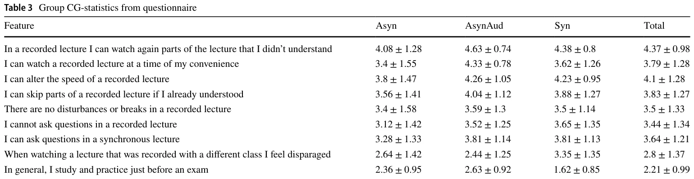
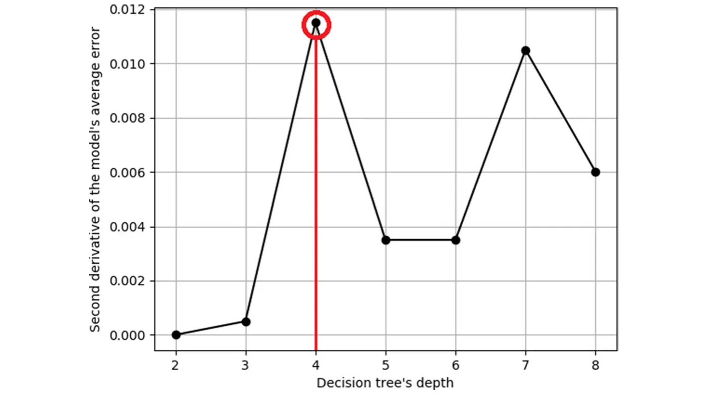
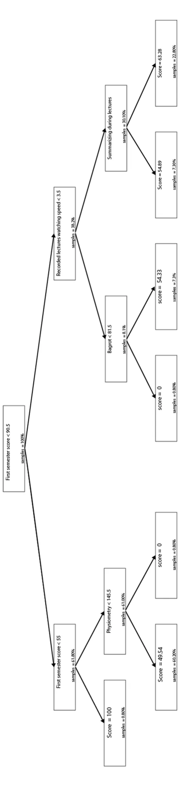
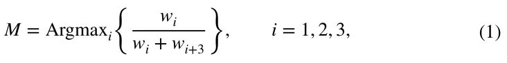

## Introduction and related work

Ever since the period of ancient Greece multiple pedagogic paradigms (PPs) have been implemented and evolved over the centuries (Longenecker 1982; Smith 2006). By the sixteenth and seventeenth centuries, the meaning of pedagogy in Europe became restricted to the science, or perhaps, to the art of teaching (Smith 2012). PPs are changing because of social and technological changes (Howes 2016). Traditionally, pedagogy focused on the teacher. The concept of teaching a student was likened to an“empty vessel”into which the teacher was to pour knowledge (Rodriguez 2012). Over the last couple of decades, it has been claimed that teacher-based pedagogy is inhibiting students from becoming successful and mature learners and that a student-centered approach to learning should be preferred (Wright 2011). However, academic mathematics courses, which are the focus of the current paper, are generally maintained by this paradigm. An alternative way of looking at pedagogy is by describing the tools that the teacher may use. For example, Howes contrasts low-tech pedagogy, in which the teacher writes on a blackboard and the students write in their notebooks, with high tech pedagogy, involving perhaps the use of tablets with Wi-Fi connection that may be centrally controlled by the teacher (Howes 2016).

Online (web-based) courses emerged at the end of the twentieth century, promising better learning and training pedagogic paradigms (PPs) by taking advantage of the new technologies available for online learning (Horton 2000; Lederman 2020; Khan 2006, 2005; Sotillo 2000) and many institutions began to offer web-based courses (Daugherty et al. 1998). According to Horton (2000), “online learning is considered one of the most important changes in the history of training”. Nevertheless, the traditional PPs are not effective in online settings (Duffy and Kirkley 2004; Bernard et al. 2004; Chen and Shaw 2006; Gürsul and Keser 2009). A new pedagogy began to emerge, even if only a small percentage of faculty were involved in these initiatives (Shea et al. 2005). Even by the year 2020, most of the instructors (56%) had no experience in online education (Lederman 2020). In addition, online courses have been used as a market-expansion device by universities as well.

Duffy and Kirkley (2004) clarify that imitating traditional teaching strategies in an online environment is unlikely to be beneficial. However, when the severe acute respiratory syndrome coronavirus 2 (COVID-19) pandemic appeared in 2020, this is exactly what happened. Universities all over the world were forced to close. In several countries, universities began to operate online to prevent the spread of the virus among students and faculty on campus (Muftahu 2020).

Students and instructors alike were“thrown in at the deep end” and had to learn new skills with no time to prepare. The initial instinct of many instructors who were not experienced in online education was to respond“largely by clinging to the familiar which is delivering lectures or holding class discussions with students via webcams”(Lederman 2020). In contrast, in countries with restricted availability of broadband, lecturers were only able to share content with their students using social networks, with next to no real-time interaction with their classes (Fajlay et al. 2020).

It is possible to roughly divide the online learning methods into two main modes. The first one is“synchronous”learning which is defined as“interaction of participants with an instructor via the web in real-time”(Khan 2006), and“asynchronous” learning which is defined as“instruction that is not constrained by geography or time”(Khan 2005). Thus, synchronous learning includes one or more types of media, for example, text, audio, or video-based“live”interactions between a group of students and an instructor. The students connect up to the synchronous lesson, at a predetermined time (Khan 2005, 2006), and the platforms over which the lessons are broadcast allow for two-way communication between the instructor and the students.

Asynchronous learning includes individual or group homework assignments, discussions in a forum or by email, or pre-recorded lessons that can be accessed by students at their convenience (Gürsul and Keser 2009; Beyth-Marom et al. 2005). *In particular, allowing students more freedom to manage their time and first handle different factors that might negatively impact their performance during traditional schooling hours.* Alternatively, instructors may record themselves with a live audience (possibly during a synchronous lecture) for the asynchronous with an audience format (Sotillo 2000). A significant amount of the research done in the past involves comparing online learning, whether synchronous or asynchronous, with face-to-face teaching in a classroom (Bernard et al. 2004; Chen and Shaw 2006; Gürsul and Keser 2009). With the introduction of the internet into almost every aspect of everyday life over the last twenty years, several researchers have investigated the advantages and disadvantages of online learning and its implementations (Chen et al. 2005; Strang 2011; Yamagata-Lynch 2014; Shahabadi and Uplane 2015). The definitions of synchronous and asynchronous learning by different researchers are not always comparable. For example, an experiment in which students solve a problem collaboratively, where synchronous learning involved both scheduled online lessons and either student-student or student-teacher interaction by phone or by instant messaging. Asynchronous learning involved learning material available on the web or in electronic formatted books (Gürsul and Keser 2009).

In contrast, Beyth-Marom et al. (2005) describe an experiment including both live synchronous and pre-recorded asynchronous tutorials. They found that two-thirds of the students preferred asynchronous sessions, which allowed them more time to summarize, and those who preferred synchronous sessions emphasized the importance of interaction with fellow students This is upheld by our results; however, the authors did not look at the differences between asynchronous lessons with or without an audience, nor did they examine the relationship between the mode of learning and a learning outcome, such as the course grade.

Chen and Shaw found no significant difference in proficiency when using particular software, between groups of students who had been taught synchronously or asynchronously (Chen and Shaw 2006). Learning to use software is a skill that is taught by demonstration. This may not be comparable with teaching mathematics, for example. Their conclusion also does not take into account that different students might perform better under a different learning paradigm; the group was treated as a whole.

Shahabadi and Uplane (2015) compared learning styles for students who had used various aspects of synchronous and asynchronous learning at online universities in Iran. Differences in academic performance of the students who used different PP’s were accredited to their learning styles, not to the mode of learning. This experiment reinforces the idea that different PP’s are relevant for different types of learners, but it is not clear from the article which aspects of synchronous and asynchronous learning were used by the students, nor the nature of the subject matter studied, making it difficult to understand the context of their results.

This research and others used multiple assessments methods to empirically measure the influence of different properties of the PP on the learning process of students (Adeshola and Abubakar 2020). In particular, Elci (2021) found that faculty broadened their knowledge and experience in distance learning, citing the need to improve their academic and professional development. Some faculty stated very intensive gain of digital literacy skills and competencies and online course materials; while others stated further improvement was needed in these subjects. As such, the author shows that the classical assessment methods are not necessarily fit for online learning which requires a different set of skills. Similarly, Abubakar and Adeshola (2019) claim that due to the emergence of the internet in general and online learning, in particular, extends the concept of traditional exams. The authors outline the two opposite groups showing that digital exams are either a proper tool for knowledge evaluation or a tool providing misleading results. While one can propose multiple strengths and limitations to digital exams, in this research we used the classical format of digital exams due to the technical limitations of experimenting as part of an academic course in a university.

## Online pedagogic paradigms

We experimented to examine the differences between the learning outcomes of students exposed to different PPs of online learning. We focused our experiment on a population of undergraduate Life Science students. These students were accepted into the university with rather homogeneous admission requirements but undertake slightly different study paths. Most of their courses are identical. The students were enrolled as full-time students. There were 92 (54.76%) male and 76 (45.24%) female students. The mean and standard deviation of the students’ages are 26.2 ± 3.7 . The students studied in two separate groups, group CG (*n* = 78) and group RG (*n* = 90) . During the first semester, the students had studied the first course in mathematical analysis and both groups had been taught by the traditional way of offline lectures. Both groups had been taught by the same lecturer and were exposed to the same materials throughout the course.

We concentrated on the following three types of online PPs, which are suitable for mathematics-based academic courses: (a) a *synchronous lecture* which is taught online to a live audience and is available at a scheduled time. (b) an *asynchronous lecture with audience* which is a synchronous lecture that has been recorded and is available at any time. (c) an *asynchronous lecture*, recorded without a live audience and available at any time. These modes are defined in more detail below.

The three PP are inherently pairwise different. The recorded lectures do not allow for students’ questions and participation during the lecture, while recorded-frontal lectures do. Similarly, recorded-frontal lectures allow the student to digest the content at any time while frontal lectures do not. Finally, recorded lectures do not provide performance feedback to students while frontal lectures at least maintain some lecturer-student interaction which could potentially influence the course of the lecture. We define the following three online PPs:

**Definition 1: Synchronous online learning** (Syn). The lesson is online but does not depend on the student or lecturer being in a particular location. The students join a live pre-scheduled video conference in which they can watch and listen to the lecturer, similar to how they would be taught in a traditional classroom. The lecturer and the students participate in the video conference at the same time but from different locations. Communication between the lecturer and the students is two-way so that the students may ask questions and participate in discussions initiated by the lecturer during the lessons. The students may communicate with the lecturer using a microphone or by texting through the chat option of the conference.

**Definition 2: Asynchronous learning** (Asyn). The lesson is online, available on-demand, and does not depend on the student learning at a particular time or being in a particular location. The lecturer records the lesson in advance, without an audience, and posts a link to the recording for the students to access whenever they choose. On the one hand, no real-time interaction between the lecturer and the class is possible. On the other hand, students can learn at a time that they choose, they can speed up or slow down the speed of the lesson, stop for a break when they choose, hear parts of the lesson again, or skip parts.

**Definition 3: Asynchronous learning with an audience** (AsynAud). The lesson is online and does not depend on the student learning at a particular time or being in a particular location. The synchronous lessons described above are recorded and the link to the recording is made available to the students. No real-time interaction between the lecturer and the class is possible but the students can benefit from hearing the lecturer’s answers to questions raised by students who were present in the synchronous lecture.

We believe that asynchronous learning with an audience combines the advantages of both the asynchronous and synchronous PP. Different students study better under different PPs (Felder and Silverman 1988). In the following experiment, we examined the differences between the learning outcomes of students exposed to different PPs of online learning.

## Methods

We focused our experiment on a population of undergraduate Life Science students. These students were accepted into the university with rather homogeneous admission requirements but undertake slightly different study paths. The majority of their courses are identical. The students were enrolled as full-time students. There were 92 (54.76%) male and 76 (45.24%) female students. The mean and standard deviation of the students’ ages are 26.2 ± 3.7 . The students studied in two separate groups, group CG ( *n* = 78 ) and group RG ( *n* = 90 ). During the first semester, the students had studied the first course in mathematical analysis and both groups had been taught by traditional classroom lectures. Both groups had been taught by the same lecturer, solved the same problems, and were exposed to the same lectures throughout the course.

In the second semester, a course of advanced analysis was taught via online learning. The students were taught in the same format as they experienced up to this point. The intervention for the research was conducted over two lessons, each lasting an hour and a half, during which the students were taught partial derivatives and exact differential equations. This is an independent subsection within the topic of differential equations, which does not rely on the previous subjects taught in the course. Again, both groups were taught by the same lecturer, solved the same examples, and saw the proofs of the same theorems.

We examine the different outcomes between students who experienced the three different PPs. The practical application of the three PPs was as follows:

For the synchronous learning (Syn), the lessons were scheduled to take place according to the regular timetable that had been planned for the semester before the outbreak of the pandemic. The lecturer sent a link to the video conference before each lesson commenced, reminding the students to join at the right time. The lecturer taught using a web camera from a laptop computer to film himself/herself writing with markers on a whiteboard on the wall. The sight of the lecturer moving with the whiteboard behind him/her aimed to give the feeling of a regular lecture in a classroom environment, in which the students can see the lecturer move, his/her hand movements, and facial expressions. The lecturer answered all of the questions raised by students, whether by the microphone or by the online chat.

For the asynchronous learning (Asyn) the lecturer recorded the same lesson that was given synchronously. The same problems were proved as in the synchronous lesson, the same examples were solved, and if an explanation was repeated by the lecturer in the synchronous session, it was repeated also in this lesson. The lecturer used the same method of teaching by writing on a whiteboard with markers and filming with the laptop web camera. A link to the recording was then posted on the course site in Moodle1. The students could then access the recording through the link.

For the asynchronous learning with an audience (AsynAud) a link to the recording of the synchronous lecture was posted on the course site in Moodle. The reason that this is called asynchronous learning with an audience is since there is no synchrony between the time of recording the lesson and the when that the lesson is viewed by the students. However, the students benefit from hearing the student-teacher interaction that occurred while the synchronous lesson took place. This paradigm combines the advantages of both the synchronous and asynchronous PPs. On the one hand, there is the convenience of being able to access the lesson at a time that is suitable for each student, the possibilities of rerunning parts of the video, speeding it up or slowing it down, as in asynchronous learning, and on the other hand, the fact that an audience is present in the lecture preserves some of the benefits of the synchronous lesson. The students in the audience ask questions that are possibly also troubling the student who is viewing the recording, and there is immediate feedback from the lecturer.

During the experiment, links to both asynchronous lessons, with and without an audience, were posted at the same time. We note that the synchronous lecture (Syn) took place before the recordings were released. About an hour after the end of the synchronous lecture the links to the two asynchronous lectures were posted. The asynchronous lecture without an audience (Asyn) had been recorded the previous day. Thus the two asynchronous PPs (Asyn, AsynAud) were able to access the lectures at similar times.

Two groups of students were involved in the experiment, allowing them to examine different aspects of their learning. The students in the first group were allowed to choose the PP they would experience. They were informed a week in advance about the three alternatives. The students had prior experience in all types of learning in previous lessons, so they knew what to expect and chose according to their personal preferences. We label this group *Choosegroup* (CG).

The students in the second group were randomly assigned the PP that they would experience. The formation of the experiment was the same as for group CG. The synchronous lecture was taught online at a scheduled time, and the lecturer posted links to the pre-recorded lesson (Asyn) at the same time as the link to the recording of the synchronous lesson (AsynAud). We label this group *Random Group* (RG).

The students in both groups, RG and CG experienced one of the three PPs. In the synchronous lecture format (Syn), the students joined a web conference on Zoom (a cloud-based video conferencing service) at the appropriate time, according to their university timetable. The lecturer taught the subjects partial differentiation and exact differential equations, theoretically, and with some technical examples. The lecturer gave time for questions, managed an active discussion with the students, and allowed the students to express themselves while solving the problems. The lecturer asked the students questions to stimulate mental stimulation and waited for the students to answer to promote a discussion that would enable them to ensure their understanding. (The latter remark was made by students who experienced synchronous learning.) In the asynchronous lecture format (Asyn), each of the students logged into the Moodle system and accessed the recording at a time and manner of their choice. The lecturer had recorded the same lectures on partial differentiation and exact differential equations, with the same theoretical explanations and technical examples as in the synchronous lectures. For the asynchronous lectures with an audience (AsynAud), the students’ conduct was the same as for the asynchronous lectures without an audience. The video that they accessed on the Moodle platform was the recording of the synchronous lecture including the participation of the students who were present in the Zoom session when the lesson was taught. For all three PPs, there was no difference between the behavior required by the students in both groups (RG and CG).

The mathematics course in which the experiment was conducted took place once a week for two academic hours. The students were tested a week after the synchronous lecture. The test paper was posted in Moodle and the students took the test at home. They were given a day to complete the test. During this time, the course material and the recorded lectures were not accessible. To test their understanding, the questions on the test were not the same as those solved in the lecture. There were five questions in the test. Some of the questions required original thinking and application of the theories that had been taught in the lecture. The test was graded strictly, with points given for each stage of the solution. The maximum grade possible was 56 points. The grading process was done by two lecturers independently. Then, the final score was calculated to be the average of the scores given by the two lecturers.

<figure class="table-figure" id="table-1">
<figcaption><strong>Table 1</strong> Group CG</figcaption>

<table><tr><th></th><th>Prior information</th><th></th><th>Post test</th></tr><tr><th></th><th>Quantitative Israeli psycho- metric score</th><th>Grade from previous course</th><th>Grade after experiment</th></tr><tr><td>Asyn ( n = 25)</td><td>111.60 ± 10.13</td><td>79.96 ± 17.33</td><td>38.78 ± 19.93</td></tr><tr><td>AsynAud ( n = 27)</td><td>120.00 ± 14.29</td><td>78.48 ± 13.92</td><td>42.75 ± 14.71</td></tr><tr><td>Syn ( n = 26)</td><td>122.73 ± 14.90</td><td>90.50 ± 10.09</td><td>49.86 ± 10.26</td></tr><tr><td>TOTAL ( n = 78)</td><td>118.22 ± 13.97</td><td>82.96 ± 14.87</td><td>43.85 ± 15.87</td></tr></table>

</figure>

The conditions of the test administrated at the end of the first-semester course were different from the conditions of this test. After the first semester, the students were tested in regular exam conditions on campus. They had two weeks to prepare for the exam after the conclusion of the semester, and they had access to past exam papers with similar questions to prepare themselves for their exam. The test after the experiment had different conditions: the students did not have two weeks to prepare for the test, nor had they seen similar questions before. The test was administered during the semester, while the students were still occupied with other courses and busy with coursework. This explains the differences between the grades achieved in the two tests. Before the test, the students signed a declaration promising integrity and agreeing that the results may be used for research.

After the test, the students were asked to fill in a questionnaire regarding their experience (see supplementary material). The questionnaire was anonymous, was filled in after the test and before the students’ results were published. In addition, the questionnaire was filled in by the students online without supervision to ensure that the results are bias-free.

## Results

The descriptive statistics for the two groups who participated in the experiment, group *CG*, who chose their mode of learning, and group *RG*, who were randomly assigned a mode of learning.

Tables 1 and 2 show the descriptive statistics for group *CG* and group *RG*, respectively. We present the means and standard deviations *Mean ± SD* for the prior information and the post-test (the test taken by the students after the intervention) as shown in Table 1. The prior information includes the quantitative score from the Israeli psychometric test and the grade achieved by the student in the mathematics course from the previous semester. The post-test refers to the student’s score on the test taken following the intervention.

<figure class="table-figure" id="table-2">
<figcaption><strong>Table 2</strong> Group RG</figcaption>

<table><tr><th></th><th>Prior information</th><th></th><th>Post test</th></tr><tr><th></th><th>Quantitative Israeli psycho- metric score</th><th>Grade from previous course</th><th>Grade after experiment</th></tr><tr><td>Asyn ( n = 31)</td><td>116.90 ± 12.74</td><td>84.06 ± 11.75</td><td>39.27 ± 15.72</td></tr><tr><td>AsynAud ( n = 31)</td><td>119.90 ± 11.77</td><td>83.48 ± 10.63</td><td>47.56 ± 10.66</td></tr><tr><td>Syn ( n = 28)</td><td>120.64 ± 14.45</td><td>89.75 ± 12.30</td><td>39.66 ± 14.52</td></tr><tr><td>TOTAL ( n = 90)</td><td>119.10 ± 12.94</td><td>85.63 ± 11.76</td><td>42.25 ± 14.16</td></tr></table>

</figure>

The results for group CG show significant differences between the groups of students for each mode of learning in all the prior information. Analysis of variance for the first semester grades, after regular frontal learning on campus, gave *F*2,75 = 5.691, *p <* 0.001 and for the Israeli psychometric grades *F*2,75 = 4.814, *p <* 0.05 . The difference between the groups is significant also in the post test *F*2,75 = 3.403, *p <* 0.05 . It is possible to find internal differences between the groups by multiple comparisons. The students who chose synchronous learning (Syn) were those who had significantly higher grades in the previous course than those who chose asynchronous learning (*p <* 0.01) or asynchronous learning with an audience (AsynAud) — (*p <* 0.01) . There was no significant difference between the students who chose asynchronous learning or asynchronous learning with an audience concerning the previous course grade.

Similarly, students who chose synchronous learning have significantly higher Israeli psychometric grades than those who chose asynchronous learning with an audience (*p <* 0.01) but not than those who chose asynchronous learning without an audience (*p >* 0.05) . We further found that the Israeli psychometric grades of those who chose asynchronous learning with an audience are significantly lower than those who chose asynchronous learning without an audience (*p <* 0.05).

Summarizing the prior information for group CG:

- 1. The average grades of students who chose asynchronous learning with an audience were consistently lower than in the other groups and the significance is apparent in comparison with the students who chose synchronous learning.
- 2. The grades of students who chose synchronous learning were consistently higher than the other groups and the significance is apparent in comparison to the asynchronous with audience group.
- 3. We are unable to declare that the grades of the students who chose asynchronous learning were consistently lower than the other groups in both aspects of the prior information (namely the previous semester grade and the Israeli psychometric score). However, without the Israeli psychometric score, students who chose asynchronous learning had lower achievements than those who chose synchronously or asynchronous learning with an audience.

The test after intervention shows that, in general, the differences that existed beforehand, continued to exist. The average grade of the students who chose synchronous learning (which was higher than the students who chose the other options to start with), continued to be higher than those who chose asynchronous learning (*p <* 0.05) . There is no significant evidence that there is a difference between the achievements between those who chose synchronous learning and those who chose asynchronous learning with an audience (*p >* 0.05) , or between those who chose asynchronous learning and those who chose asynchronous learning with an audience (*p >* 0.05).

Table 2 shows the descriptive statistics for group RG, who were randomly assigned a learning mode. For this group, too, the prior information consisted of the Israeli psychometric quantitative score and the grade from the first-semester mathematics course.

Analysis of variance for the prior information shows that there is no significant difference between the first semester grades of the groups of students assigned to different PP (*F*2,87 = 2.598, *p >* 0.05) or between their Israeli psychometric scores (*F*2,87 = 0.701, *p >* 0.05) . The results show, however, that there is significant difference between the grades of the three groups after intervention (*F*2,87 = 3.523, *p <* 0.05).

After calculating multiple comparisons for the grades from the post-test, it was found that the students who studied by the asynchronous lecture with an audience (AsynAud) had significantly higher grades than those who were assigned to the synchronous lecture (Syn) (*p <* 0.05) and those who were assigned to the asynchronous lecture without an audience (Asyn) (*p <* 0.05) . No significant difference was found between the synchronous and asynchronous groups (*p >* 0.05).

In addition to the test, the students received a questionnaire examining the noticeable features of the three modes of online learning. We concentrated on group CG, since in this group we can see the students’ preferences through their choice of mode of learning, in contrast with group RG, who were randomly assigned a mode of learning without taking into account their preferences.

We strove to decompose the PP into their advantages and disadvantages as much as possible. For example, concerning asynchronous learning, the aim was to examine the importance of its advantages and disadvantages from the student’s point of view.

The students were presented with features of the online distance learning and were asked to indicate the subjective importance of each feature on a scale of one to five, where 1 indicated no importance, 2 indicated little importance, 3 neutral, 4 some importance and 5 great importance.

Some of the features represented advantages of synchronous or asynchronous learning, others represented disadvantages. In addition, there was one question regarding studying habits.

The features presented to the students were as follows:

- 1. In a recorded lecture, I can watch again parts of the lecture that I didn’t understand.
- 2. I can watch a recorded lecture at a time of my convenience.
- 3. I can alter the speed of a recorded lecture.
- 4. I can skip parts of a recorded lecture if I already understood them.
- 5. There are no disturbances or breaks in a recorded lecture—the lecture is continuous.
- 6. I cannot ask questions in a recorded lecture.
- 7. I can ask questions in a synchronous lecture.
- 8. When I watch a recorded lesson that was taught synchronously to a different class, I feel disparaged.
- 9. In general, I study and practice only before an exam.

The general results are as follows: 88% of the students mentioned the importance to them of being able to rerun parts of the video that they had not understood. This emphasizes the importance of making the recording available, even if the lesson was conducted synchronously. A further basis for this recommendation is in that 73% of the students found it important that they could watch the lesson at a time that best suited them, 73% were in favor of being able to skip parts of the lesson that they already understood, and to 58% there needed to be no disturbances in a recorded lesson.

We know that one of the advantages of the asynchronous lesson is that the students may ask questions in real-time (Pappas 2015). 57% of the students found this an important feature and 54% indicated the lack of this feature in recorded lessons.

We were interested also to discover to what extent the students felt disparaged by the fact that the lecturer had devoted a synchronous lesson to a different class, while they were asked to learn from a recording. The students could choose between the following replies to this feature: (1) completely disagree, (2) disagree to an extent, (3) neutral, (4) agree to an extent, (5) absolutely agree. We found that the students tend to be ambivalent on this question, with a mean reply of 2.8 and a standard deviation of 1.35.

To test whether there are differences between the students regarding the features, a one-way analysis of variance was applied.

Table 3 shows the results for group CG. The left-hand column contains the features and for each one the mean and standard deviation for the students’ answers according to each mode of learning experienced, i.e. synchronous, or asynchronous with or without an audience.

One way analysis of variance revealed the following results:

- 1. *In a recorded lecture I can watch again parts of the lecture that I didn’t understand.* There are no significant differences between the opinions of students who experienced the different learning formats (*F*2,75 = 2.095, *p >* 0.05) ; However, all students agreed that this is an important feature of a recorded lecture, no matter which format they experienced themselves. This is apparent from the fact that for students from all the subgroups (according to learning format) the mean rank for this feature was greater than 4.
- 2. *I can watch a recorded lecture at a time of my convenience.* This feature was significantly more important for the students in the subgroup who chose asyn-

<figure class="table-figure" id="table-x3">

</figure>

chronous learning with an audience (*F*2.75 = 4.127, *p <* 0.05) . The ranking given by students who chose asynchronous learning was significantly less than the ranking given by students who chose asynchronous learning with an audience (*p <* 0.001) and similarly the ranking by students who chose synchronous learning was significantly less than those who chose asynchronous learning with an audience (*p <* 0.04).

- 3. *I can alter the speed of a recorded lecture.*There were no significant differences between the subgroups (*F*2, 75 = 1.221, *p >* 0.05) , but there is an agreement between most of the students (from all subgroups) that this is an important feature, as the mean rankings for each subgroup, and the total mean overall show.
- 4. *I can skip parts of a recorded lecture if I already understood them.* There are no significant differences between the subgroups for this feature ( *F*2,75 = 0.941, *p >* 0.05).
- 5. *There are no disturbances or breaks in a recorded lecture—the lecture is continuous.* For this feature again there were no significant differences between the subgroups (*F*2,75 = 0.132, *p >* 0.05).
- 6. *I cannot ask questions in a recorded lecture.* Also for this feature no significant differences were observed (*F*2.75 = 1.085, *p >* 0.05).
- 7. *I can ask questions in a synchronous lecture.* Here too, there were no significant differences (*F*2,75 = 1.648, *p >* 0.05).
- 8. *When I watch a recorded lesson that was taught synchronously to a different class, I feel disparaged.* For this feature we discovered a significant difference (*F*2,75 = 3.296, *p <* 0.05 . The subgroup of students who chose synchronous learning ranked this feature significantly higher than those who chose asynchronous learning with an audience (*p <* 0.05) . This observation leads us to believe that the feeling that the lecturer cared less for them was one of the reasons for students to choose synchronous learning.
- 9. *In general, I study and practice only before an exam.* This feature displayed significant differences between the subgroups (*F*2,75 = 8.745, *p <* 0.001) . The students who chose synchronous learning disagreed with this statement to a greater extent than those who chose asynchronous learning with an audience (*p <* 0.001) , and those who chose asynchronous learning (*p <* 0.05) . We see that the students who chose synchronous learning put in consistent effort in maintaining their learning during the semester and do not put off their studying until close to the exam and prefer to participate in the synchronous lecture rather than wait for the recording.

## A personalized optimal online learning pedagogic paradigm

The differences between the PPs suggest that there is a relationship between the PP and the grade achieved by the student. Based on the three types of online PPs examined, one may want to allow future students to pick the optimal online PP to increase the probability that they gain a higher grade in the exam. The exam is not necessarily the final goal for optimization but it is assumed to well represent the student’s underlying understanding and mastering of the subject taught in the course. One can use classical model-based mathematical models taking into consideration domain knowledge to predict the outcomes of some initial condition (Lazebnik et al. 2021a; Wigginton and Kirschner 2001; Magdelaine et al. 2015). However, due to the high diversity in the students’ initial condition, we used learning-based models to perform the proposed task, as these showed promising results in similar settings (Suzuki et al. 2020; Lazebnik and Bunimovich-Mendrazitsky 2021; Rosenfeld and Richardson 2019; Lazebnik et al. 2021b; Lv et al. 2021; Magnini et al. 2021; Lazebnik and Alexi 2021).

In the context of learning models, we used the supervised machine learning approach. In particular, supervised machine learning algorithms use a set of instances (samples) of data constructed from predictors and target variables to learn a general relationship between the predictors and the target (Hastie et al. 2003). The given instances are known as the *training set*. This method may be used in two contexts known as *regression* or *classification* (Singh et al. 2016). Regression refers to the context in which the desired model will predict a quantitative outcome based on the values of the predictors (Hastie et al. 2003). Once the relationship between the predictors and the outcome is established, it is generalized into a predictive model which is then tested on a different group of instances with known outcomes that the learning algorithm was not exposed to (Caruana and Niculescu-Mizil 2006). If the model satisfactorily predicts correct outcomes for this test set, it may then be used to make predictions for future instances. Classification algorithms are used to divide the data into smaller groups, often by measuring the similarity between the data instances. The outcome for classification is a qualitative value (Hastie et al. 2003) (e.g. the desired class that an instance should belong to). The classification algorithms determine which predictor features are responsible for optimally splitting the data instances into classes. As in regression models, once the algorithm has “learned”the rules from the training set, the classification model is tested on the test set. The correct classification for the instances in the test set is known in advance due to the given outcomes, and if the model can reliably classify the examples from the test set it may then be used to classify future examples for which the correct class is unknown (Witten et al. 2016).

We used the data from our experiment to develop two machine learning models. The first model is a regression model that predicts the grade of a student for this course based on learning habits and historical grades in standardized tests. The second model is a classification model that assigns an optimal PP to each student. In this context, optimally is defined to be the paradigm that will maximize the student’s grade in the exam. Both models have been developed using the Python programming language with the *sklearn* package (version 0.23.2).

### Exam grade predictor

We developed a regression machine learning model which predicts the grade of a student in the exam. The model used the data from the students’ questionnaire with learning habits and historical grades in standardized tests as predictors for their exam results and ran a supervised machine learning algorithm to find this relationship.

<figure id="fig-1">

<figcaption><strong>Fig. 1</strong> Second derivative of the model’s accuracy as a function of the decision tree’s depth</figcaption>
</figure>

The model predicts the student’s grade in the exam by analyzing his answers to the questionnaire.

We used the *Random Forest* (RF) (Ho 1998) algorithm as the core of the model. The data were randomly divided into two groups. The first group, called the *train set*, contained data from 70% of the students from the original data. The second group, called the *test set*, contained data from 30% of the students whose responses to the questionnaire were collected.

The RF algorithm is useful in both classification and regression tasks similar to the one in hand (Papadogiannis et al. 2020; Zabriskie et al. 2019). The RF algorithm builds many different decision trees (DT), each one based on a separate random sample of the training set. A DT is a classification machine learning algorithm that divides a data set using an if-else approach (Witten et al. 2016). At each level of the tree, the data are divided according to a linear feature that best divides the data into *k* subgroups. This process repeats for *L* levels, wherein the final level, each sample from the data set is associated with some classification. An RF regression algorithm predicts by getting a classification from each tree in the forest independently and then averaging the scores (Altman and Krzywinski 2017).

An RF regression module has been used with mean squared error (MSE) as the splitting metric. Each DT was bounded to 4 levels of depth. The tree depth of 4 was shown to be the elbow point, where the independent parameter is the tree’s depth and the dependent parameter is the model’s accuracy metric (Syakur et al. 2018), as shown in Fig. 1. We assigned 200 DTs for the RF model to obtain a set of DTs big enough to retrieve a variety of different trees to generalize the model’s ability well while keeping the calculation complexity relatively low. The model was trained on the train set where the input parameters are the learning paradigm (*LP*) , the student’s score in the first-semester (*FSS*) , and a self-declared probability that a student will only start studying a short time before the exam (*SBE*) . The output parameter is the student’s score in the exam. Figure 2 shows a DT trained on the whole data, representing one instance of the 200 DT used in the entire RF model.

The accuracy of the model was evaluated using the test set. The exam score of each student in the test set has been predicted using the model and compared with the recorded score. The error was calculated using the mean absolute error method (MAE) on the whole test set.

We repeated the process of randomly splitting the data into train set and test set, training the model, and evaluating its performance 1000 times. Each time, the model’s performance was recorded and the final model’s performance was calculated to be the average of this set (Kohavi 1995).

The model’s accuracy was obtained to be 93.4%. This means, given a new student’s learning paradigm, the student’s score in the first semester, and a self-declared probability that a student will start studying just before the exam; the model on average can predict his/her score on the exam with an error of 6.4 points.

### Optimal online learning paradigm classifier

We developed a machine learning model which assigns to students the PP which will maximize their grade in the exam. The model used the data from the students’ questionnaire and the results from the exam (see Appendix 1). The model assigns the PP to the students by analyzing their answers to the questionnaire.

We used the *Categorical Naive Bayes* (CNB) (Zhang 2004) algorithm. Similar to the first model, the data were divided randomly into two groups, the *train set* which contained 70% of the samples of the original data, and the *test set* which contained 30% of the samples of the original data.

The average score of the course exam *F*avg was calculated, leading to the following definition. A student is defined as a “successful”if the student’s score in the course exam satisfies *F*i *> F*avg . We divided each set (train set and test set) into six subsets. Each set was first divided according to the three different online learning paradigms that the students experienced as part of the experiment. Then, each set was further divided into two subsets, one containing all of the successful students, and the other containing the remaining students, resulting in six subsets in total.

Let *S* represent the set of successful students, *S* the set of unsuccessful students, and let Syn, Asyn, AsynAud represent the sets of students who experienced synchronous learning, asynchronous learning, or asynchronous learning with an audience, respectively, in the experiment. Then we label the subsets with the following indices:

*S* ∩ *Syn*, *S* ∩ *Asyn*, *S* ∩ *AsynAud*, *S* ∩ *Syn*, *S* ∩ *Asyn*, *S* ∩ *AsynAud*

Each student in both the train set and data set was allocated an index according to which of the six subsets they belong to.

We trained the CNB model with six categories representing the subset indices allocated to each student. The Sorensen-Dice coefficient was calculated using the test set to evaluate the performance of the model incorrectly assigning the most suitable subset, without knowing the student’s online learning paradigm and score on the exam, which resulted in *F*1 = 65.34%.

<figure id="fig-2">

<figcaption><strong>Fig. 2</strong> A regression decision tree for a student’s exam score trained on all the dataset</figcaption>
</figure>

For each student, the model assigns a weight to each subset based on the student’s answers to the questionnaire. We label these weights *w*i , *i* = 1, … , 6.

Based on the assumption that the model’s performance is good enough, we define the following optimization problem as shown in Eq. (1). Namely, which online learning paradigm will be predicted by the model to have the highest chance that the student will be successful. In other words, using the weights of the six subsets for a given student, we choose the PP *M* that maximizes the probability that the student will belong to one of the subsets of successful students:

where *M* = 1, 2, 3 is a recommendation for the synchronous learning, asynchronous learning, and asynchronous learning with an audience, respectively.

## Summary and implications

The COVID-19 epidemic has forced educational institutions (schools, universities) around the world to switch to a distance-learning format. Lecturers, teachers, and instructors have had to reinvent themselves and experiment with teaching in different paradigms and methods (Lederman 2020). In this study, we focused on three online PPs that were in practical use during this period. Firstly, we had to define exactly what we mean by synchronous, asynchronous, and asynchronous learning with an audience. The necessity to sharpen these definitions arose for several reasons:

- 1. In different articles we found different definitions of the concepts which could cause confusion and misunderstanding about what was done in our study. For example, in some sources, the definition of asynchronous learning does not necessarily involve instruction by a lecturer, rather distant communication through a course management system (Clark et al. 2015).
- 2. Our definitions of the learning paradigms were based on new formats that emerged due to the hardship that both students and instructors were faced with, for example, lack of experience in distance learning, the lack of direct and interpersonal communication with the students that exist in regular classroom instruction, the "invisibility" factor—not being able to see whether the students understand.
- 3. The asynchronous learning with an audience paradigm was not formally defined in any of the articles we reviewed.

The study had two main objectives. First, to develop a data-driven model allowing both students and course providers to allocate each student to the online PP’s that optimize the student’s learning processes (measured by a final score in an exam). Second, to deduce what is the format of online learning that yields better learning outcomes considering three aspects:

- 1. Individual progress—which format would best advance the achievements of students starting with weaker backgrounds?
- 2. The contribution of characteristics of the various formats—which features are important in a live online lesson, and which is a recorded lesson?
- 3. A broad statement—which format was, in general, the most successful?

The conclusion that is most prominent from the didactic point of view is that the asynchronous learning with an audience PP yields better results compared with both the synchronous and the asynchronous format, as shown in Table 2, for the group who were randomly assigned the learning format. We note that in the group who chose their learning format, students with better historical grades tended to sign up for the synchronous PP. In contrast, students with medium or low historical grades relative to the rest tended to register for the asynchronous PP 1.

In addition, from Table 3 it is apparent that the students do not develop a negative reaction from receiving a recording of a synchronous lecture with another class. In general, the students were neutral in reaction to this feature. This could lead to optimization of the teaching time of the lecturer on the one hand, and reducing costs of the academic institute on the other hand, possibly by utilizing the following implementation: We suggest that for a course that is offered to several different classes in parallel, one synchronous lecture each week could be delivered to a chosen class, while the other classes receive the recorded lecture (asynchronous learning with an audience), rotating through the classes to periodically change which class is taught synchronously. This approach frees up time for the lecturer to give revision lessons, a broader range of office hours, and general additions depending on the course, instead of the hours that the lecturer was supposed to be repeatedly teaching the same lesson to the different classes. An additional advantage of this approach is the possibility of maintaining a degree of live interaction between the lecturer and all the classes of students, due to the rotation between classes, so that the students do not feel abandoned by the lecturer. The cost of office hours, for example, is less than of teaching hours, which may be of economical interest to the academic institution.

Furthermore, in general, the students have a positive opinion about the advantages of learning by watching the video of the recorded lesson, as shown in Table 1, which also supports the implementation suggested above. Specifically, these features from the questionnaire were the main features used by the machine learning model as shown in the previous section. Therefore, whether a lecturer delivers a lesson in either a synchronous or asynchronous paradigm, it is recommended to post a link to the recording, allowing students to watch the lesson multiple times, at their convenience.

The students who studied in the asynchronous with an audience format (both in the group where they were randomly allocated and in the group where they chose the PP) were asked to rate how similar the questions asked in the synchronous lecture are to their own questions. On average, the students responded neutrally, in comparison with the remaining two other PPs. We might have thought that the opportunity to hear other students asking questions would be the feature that differentiates between asynchronous learning and asynchronous learning with an audience, but the results do not support this. Therefore, it is important to further investigate what is the main factor that makes this PP more attractive than the other PPs.

Based on the data of the students’ questionnaires and their grades in the exam of the course, we developed a machine learning model which allocates to each student the PP which optimizes his ability to score a high grade in the exam. This model allows both students and academic institutes to make data-driven decisions to reduce the difficulties associated with the transition to a new PP by personally allocating the best fitting PP. The model and the full code are available in the supplementary material.

Hence, one can designate two main outcomes of the proposed analysis. First, a theoretical outcome showing that the ability of students to pick the PP they want to use during the learning process is a driving force in their performance. This is well shown as different PP better fitted to different students highlighting the fact there is no silver built. Second, a practical outcome in the form of a data-driven machine-learning-based model allowing both students and academic institutes to find an optimal fit between the student and the PP that allow the most efficient learning process.

The proposed machine learning model is based on the data of one course and therefore highly dependent on the characteristics of the course and the background knowledge required to succeed in the course. As a result, the model is not straightforwardly adaptable to other courses and one will have to repeat the experiment for each course to obtain a similar model.

The main limitation of the proposed analysis is that the data has been collected from a single state (Israel) with students of a similar background. As such, the results might be biased due to cultural or educational settings. In the same manner, the sampling was conducted every week for one semester which measures the immediate learning capabilities of the students.

Additional investigation tackling the pedagogical motives and psychological considerations of student inclinations is necessary. It should also be examined whether different populations of students, for example, students studying social sciences, humanities, and others, behave similarly to the group that participated in the model. In addition, there is room for examination of the differences in achievements and preferences in other aspects of learning, such as high-level thinking, memory, learning experience, social interaction between offline and online learning; specifically divided by the three PPs.

**Author contributions** Conceptualization, formal analysis and investigation, and manuscript editing were performed by SN; Formal analysis and investigation, software, original draft preparation, and manuscript editing were performed by TL; Formal analysis and investigation and original draft preparation were performed by EL.

**Funding** The authors did not receive support from any organization for the submitted work.

**Data and material availability** The datasets generated during and/or analyzed during the current study are available in the GitHub repository, https://github.com/teddy4445/RemoteLearningDS

**Code availability** All the code generated during this research is freely available at: https://github.com/teddy4445/RemoteLearningDS.

### Declarations

**Conflict of interest** The authors have no relevant financial or non-financial interests to disclose.

## Notes

1 Moodle is an open-source platform that enables educational institutions to manage courses online (Cole 2005).

## References

- Abubakar AM, I Adeshola (2019) Digital exam and assessments: a riposte to industry 4.0. In: Handbook of research on faculty development for digital teaching and learning. IGI Global pp 245–263
- Adeshola I, Abubakar AM (2020) Assessment of higher order thinking skills: digital assessment techniques. Assessment, testing, and measurement strategies in global higher education pp 153–168
- Altman N, Krzywinski M (2017) Ensemble methods: bagging and random forests. Nat Methods 14:933–934
- Bernard R, Abrami PC, Yiping L (2004) How does distance education compare with classroom instruction? A meta-analysis of the empirical literature. Rev Educ Res 74(3):379–439
- Beyth-Marom R, Saporta K, Caspi A (2005) Synchronous vs. asynchronous tutorials: factors affecting students’ preferences and choices. J Res Technol Educ 37(3):245–262
- Caruana R, Niculescu-Mizil A (2006) An empirical comparison of supervised learning algorithms. ACM pp 161–168
- Chen CC, Shaw RS (2006) Online synchronous vs. asynchronous software training through the behavioral modeling approach: a longitudinal field experiment. Int J Distance Educ Technol (IJDET) 4:88–102
- Chen N, Ko H, Lin T (2005) A model for synchronous learning using the internet. Innov Educ Teach Int 42(2):181–194
- Clark C, Strudler N, Grove K (2015) Comparing asynchronous and synchronous video vs. text based discussions in an online teacher education course. J Asynchronous Learn Netw 19(3):48
- Cole J (2005) Using moodle: teaching with the popular open source course management system. O’reilly Community Press, Sebastopol
- Daugherty M, Funke BL (1998) University faculty and student perceptions of web-based instruction. J Distance Educ 13(1):23
- Duffy TM, Kirkley JR (2004) Learner-centered theory and practice in distance education: Cases from higher education. Routledge, New York
- Elci A (2021) Academics’ professional development needs and gains during covid-19 distance education emergency transition in turkey: Academics’ professional development needs and gains. Int J Curric Instr 13(1):343–358
- Fajlay R, Marzia KS, Shoeab M (2020) Using social networking sites as medium of instruction at tertiary education during covid-19 situation in bangladesh. Int J Educ Res Rev 5(3):258–264
- Felder R, Silverman L (1988) Learning and teaching styles in engineering education. Eng Educ 78(7):674–681
- Gürsul F, Keser H (2009) The effects of online and face to face problem based learning environments in mathematics education on student’s academic achievement. Procedia 1:2817–24
- Hastie T, Tibshirani R, Friedman J (2003) The elements of statistical learning: data mining, inference, and prediction. Springer, New York
- Ho TK (1998) The random subspace method for constructing decision forests. In: IEEE Transactions on Pattern Analysis and Machine Intelligence, pp 832–844
- Horton WK (2000) Designing web-based training: how to teach anyone anything anywhere anytime. Wiley, New York
- Howes S (2016) A comparison between a high-tech learning environment and a low-tech learning environment. Speakeasy p 4
- Khan BH (2005) Managing e-learning strategies: Design, delivery, implementation and evaluation. Information Science Publishing
- Khan BH (2006) Flexible learning in an information society. IGI Global, Philadelphia
- Kohavi R (1995) A study of cross validation and bootstrap for accuracy estimation and model select. In: International Joint Conference on Artificial Intelligence
- Lazebnik T, Alexi A (2021) Comparison of pandemic intervention policies in several building types using heterogeneous population model. Commun Nonlinear Sci Numer Simul 107(106):176
- Lazebnik T, Bunimovich-Mendrazitsky S (2021) The signature features of covid-19 pandemic in a hybrid mathematical model-implications for optimal work-school lockdown policy. Adv Theory Simul 4(5):2984
- Lazebnik T, Bunimovich-Mendrazitsky S, Shami L (2021a) Pandemic management by a spatio-temporal mathematical model. Int J Nonlinear Sci Numer Simul
- Lazebnik T, Shami L, Bunimovich-Mendrazitsky S (2021b) Spatio-temporal influence of non-pharmaceutical interventions policies on pandemic dynamics and the economy: the case of covid-19. Econ Res- Ekonomska Istrazivanja pp 1–29
- Lederman D (2020) How teaching changed in the (forced) shift to remote learning. Inside Higher ED. https://www.insidehighered.com/digital-learning/article/2020/04/22/how-professors-changed-their-teaching-springs-shift-remote [link](https://www.insidehighered.com/digital-learning/article/2020/04/22/how-professors-changed-their-teaching-springs-shift-remote)
- Longenecker RN (1982) The pedagogical nature of the law in galatians 3:19–4:7. J Evang Theol Soc 25(1):53 [link](https://www.insidehighered.com/digital-learning/article/2020/04/22/how-professors-changed-their-teaching-springs-shift-remote)
- Lv CX, An SY, Qiao BJ et al (2021) Time series analysis of hemorrhagic fever with renal syndrome in mainland china by using an xgboost forecasting model. BMC Infect Dis 839:21
- Magdelaine N, Chaillous L, Guilhem I et al (2015) A long-term model of the glucose-insulin dynamics of type 1 diabetes. IEEE Trans Biomed Eng 62(6):1546–1552
- Magnini B, Lavelli A, Magnolini S (2021) Comparing machine learning and deep learning approaches on nlp tasks for the Italian language. In: Proceedings of the 12th Language Resources and Evaluation Conference p 2110–2119
- Muftahu M (2020) Higher education and covid-19 pandemic: Matters arising and the challenges of sustaining academic programs in developing African Universities. Int J Educ Res Rev 4:5
- Papadogiannis I, Poulopoulosi V, Wallace M (2020) A critical review of data mining for education: What has been done, what has been learnt and what remains to be seen. Int J Educ Res Rev 4:5
- Pappas C (2015) Synchronous learning advantages and disadvantages in corporate training. eLearning Industry https://elearningindustry.com/synchronous-learning-advantages-and-disadvantages-in-corporate-training [link](https://elearningindustry.com/synchronous-learning-advantages-and-disadvantages-in-corporate-training)
- Rodriguez V (2012) The teaching brain and the end of the empty vessel. Mind Brain Educ 6(4):177–185 [link](https://elearningindustry.com/synchronous-learning-advantages-and-disadvantages-in-corporate-training)
- Rosenfeld A, Richardson A (2019) Explainability in human-agent systems. Auton Agents Multi-Agent Syst 33(6):673–705
- Shahabadi MM, Uplane M (2015) Synchronous and asynchronous e-learning styles and academic performance of e-learners. Procedia Soc Behav Sci 176:129–38
- Shea P, Pickett A, Li CS (2005) Increasing access to higher education: a study of the diffusion of online teaching among 913 college faculty. Int Rev Res Open Distrib Learn 2:6
- Singh A, Thakur N, Sharma A (2016) A review of supervised machine learning algorithms. In: 3rd International conference on computing for sustainable global development (INDIACom) pp 1310–1315
- Smith MJ (2006) The role of the pedagogue in galatians. SOR Faculty Publications and Presentations. https://digitalcommons.liberty.edu/sor\_fac\_pubs/115 [link](https://digitalcommons.liberty.edu/sor_fac_pubs/115)
- Smith MK (2012) What is pedagogy? The encyclopedia of pedagogy and informal education. https://infed.org/mobi/what-is-pedagogy/ [link](https://digitalcommons.liberty.edu/sor_fac_pubs/115) · [link](https://infed.org/mobi/what-is-pedagogy/)
- Sotillo SM (2000) Discourse functions and syntactic complexity in synchronous and asynchronous communication. Language Learn Technol 4(1):82–119 [link](https://infed.org/mobi/what-is-pedagogy/)
- Strang KD (2011) Constructivism in synchronous and asynchronous virtual learning environments for a research methods course. Int J Virtual Personal Learn Environ 2(3):50–63
- Suzuki Y, Suzuki A, Nakamura S, et al (2020) Machine learning model estimating number of covid-19 infection cases over coming 24 days in every province of South Korea (xgboost and multioutputregressor). medRxiv
- Syakur M, Khotimah B, Rohman E et al (2018) Integration k-means clustering method and elbow method for identification of the best customer profile cluster. IOP Conf Ser 336:12–17
- Wigginton JE, Kirschner D (2001) A model to predict cell-mediated immune regulatory mechanisms during human infection with mycobacterium tuberculosis. J Immunol 166(3):1951–1967
- Witten I, Frank E, Hall M et al (2016) Data mining: practical machine learning tools and techniques. Elsevier Science & Technology, San FranciscoSan FranciscoSan San Francisco
- Wright GB (2011) Student-centered learning in higher education. Int J Teach Learn Higher Educ 23(3):92–97
- Yamagata-Lynch LC (2014) Blending online asynchronous and synchronous learning. Int Rev Res Open Distance Learn 15(2):189–212
- Zabriskie C, Yang J, DeVore S et al (2019) Using machine learning to predict physics course outcomes. Phys Rev Phys Educ Res 15(2):201–218
- Zhang H (2004) The optimality of Naive Bayes. In: Proceedings of the seventeenth international florida artificial intelligence research society conference, Miami Beach, Florida
