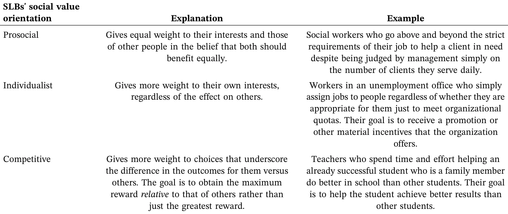
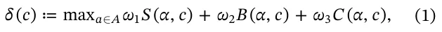
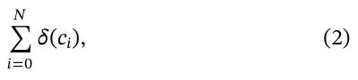
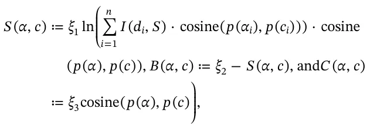
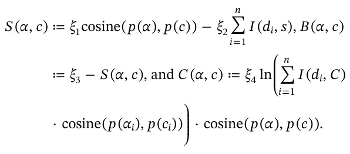
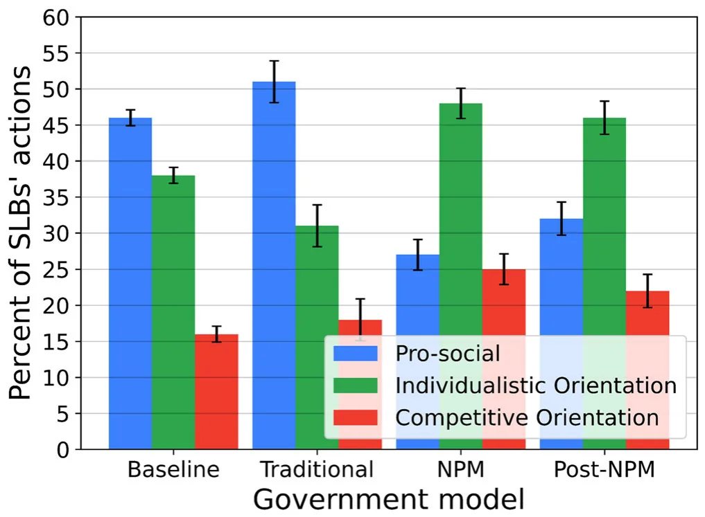
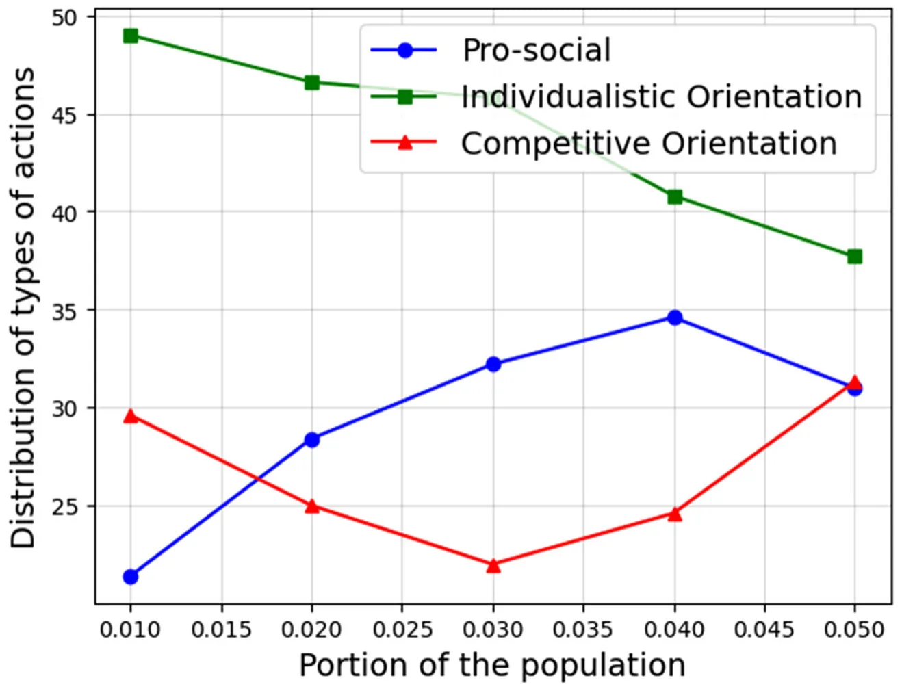
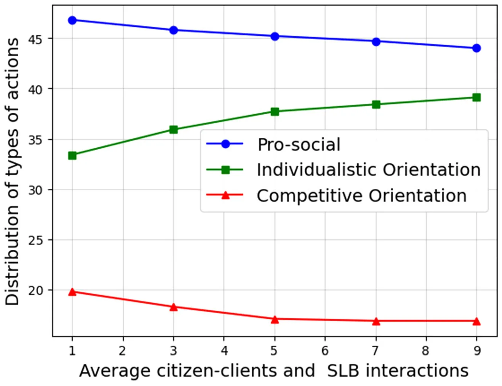
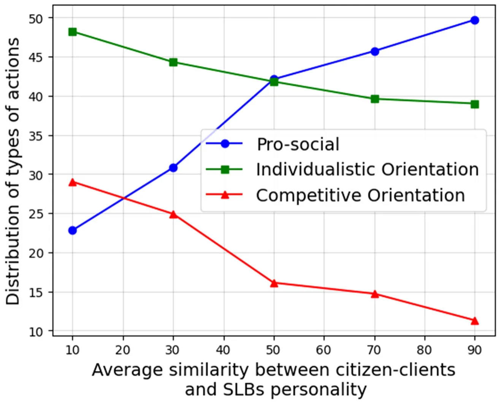

Street‐level bureaucrats (SLBs) are central to the actual delivery of public policy. They are the human interface between the state and its citizens. It is their discretion in implementing policy that directly affects outcomes in areas such as education, social welfare, and taxation (Hupe and Hill 2007; Lipsky 2010). While laws and rules offer formal guidance in how to implement policy, SLBs often face ambiguous situations, a lack of resources, and conflicting goals that require them to make situational judgments (Cohen 2021; Thomann 2015). Their decisions are not merely technical. They involve questions of social equity, trust, and moral agency (Cárdenas and Ramírez de la Cruz 2017; Gofen 2013).

One factor that might influence how SLBs respond to such challenges is their social value orientation. According to this idea, people vary in the extent to which they are willing to help others (De Waele et al. 2021; Engel 2011; Mizuno and Shimizu 2024), and SLBs are no exception (Cohen and Hertz 2020). Indeed, some SLBs are willing to go to great lengths to help their clients if they believe that they merit that type of effort (Maynard‐Moody and Musheno 2003, 156–157). Sometimes, these SLBs will go so far as to risk their own lives for them (Cohen 2021). On the other hand, SLBs are also under a great deal of pressure and have heavy workloads (Thomann et al. 2018). As a result, they must make quick decisions, some of which are unfair (Cárdenas and Ramírez de la Cruz 2017). In some cases, they engage in informal behaviors that are more varied than what decision makers often acknowledge by using the finest instrument at their disposal—their discretion (Brodkin 2011). Consequently, variation in SLBs' behavior has significant implications for how citizens experience the state (Portillo and Rudes 2014).

This situation raises a fundamental question. Does SLBs' willingness to sacrifice their own self‐interests to meet the needs of their clients vary depending on their institutional or administrative context? To explore this question, we developed an agent‐based simulation of real‐world interactions (Bonabeau 2002; Lazebnik 2025) between SLBs and their citizen–clients. The simulation involved three types of SLBs: those with prosocial, individualist, and competitive orientations. We placed them in three types of public administration environments: a traditional one, a New Public Management (NPM) one, and a post‐NPM environment. Our goal was to investigate whether and how the institutional and administrative context impacts SLBs' prosocial tendencies when working with their clients. We also examined whether the ratio between SLBs and their clients changed their behavior in each environment.

The remainder of this article proceeds as follows. First, we present the theoretical background concerning SLBs' discretion and social value orientation, and describe how different institutional and administrative contexts affect them. We then introduce our research design and outline the logic of our agent‐based simulation. Next, we define the formal structure of the model and describe the simulation program, its implementation, and experimental setup. We then present our results in two stages, first with regard to validating the model and second with regard to exploring additional contextual variables. Finally, we conclude by discussing the implications of our findings for public administration theory and practice, as well as directions for future research.

Although there is substantial research on SLBs' individual motivations, coping strategies, and discretionary behavior (Raaphorst et al. 2018; White et al. 2015), recent scholarship in the area of policy implementation has called for a reconsideration of the role of institutions in such decisions (Casula 2024; Casula and Steinebach 2025; Sager and Gofen 2022). A growing body of recent empirical research highlights the central role that institutional and organizational arrangements play in shaping SLBs' behavior. Implementation scholars underscore how institutional reforms, accountability regimes, and design strategies fundamentally influence the success or failure of policy implementation. For example, Khawaja and Khalid (2022) demonstrated how new accountability mechanisms affect frontline performance. Schröder and Watson (2025) showed how structural differences in German states shape participation in the implementation of water policies. Green and Koebele (2025) combined quantitative and qualitative methods to link state‐level implementation structures with coordination dynamics. Busscher et al. (2022) demonstrated how institutional design shapes collaborative implementation networks. Michel et al. (2022) revealed how conflicting institutional logics interact in participatory budgeting. Gofen and Gassner (2022) traced how performance management systems evolved in response to institutional shifts. Comparative studies by Ottone and Barbieri (2025), Dallara and Lacchei (2025), and Nesti et al. (2025) indicated how arrangements vary across countries and cities in fields such as research policy, asylum systems, and income support. Finally, Darcis et al. (2022) and Wittwer et al. (2022) illustrated how weak or absent institutional steering contributes to the failure to implement policies successfully. Together, these studies highlight that policy implementation is fundamentally shaped by the design of the institutions in which they originate. Institutions do not merely constrain SLBs. They also define the behavioral logics and possibilities available to them (Sager and Gofen 2022).

As Peters (2014) argued, implementation structures are institutions in their own right, shaping how public servants interpret and carry out their roles. Policy implementation is a process that takes place within a given institutional and administrative setting. Examples of these settings include traditional public administration, NPM, and post‐NPM. Each has its own logic, controls, systems of accountability, and service orientation. Their interplay can promote or impeded SLBs' prosocial behavior (March and Olsen 1983; Peters 2019). Understanding this interplay is essential for capturing the full complexity of public policy implementation.

Over the past three decades, public administration has undergone substantial reforms, shifting from traditional bureaucracy to NPM and, more recently, to post‐NPM paradigms (Christensen and Lægreid 2007a; Pollitt and Bouckaert 2011). These shifts have introduced market logics, performance‐based incentives, and fragmented accountability into SLBs' working environments (Brodkin 2007, 2011; Hupe 2019). But how have these changes affected SLBs' actual behavior?

While prior studies have documented differences in SLBs' practices, methodologically isolating the effect of the institutional context from that of individual traits remains a major challenge. Unlike laboratory settings, researchers cannot randomly assign SLBs to different types of administrative settings. This limitation has constrained our ability to assess how SLBs with distinct social value orientations behave in different institutional and administrative contexts.

Why do some SLBs promote the welfare of their clients and others are more concerned about their own self‐interests? We rely on the notion of social value orientation, meaning the willingness to help others, for an explanation. In doing so, we follow others who have studied human cooperation (Rand et al. 2012), psychiatry (Montague et al. 2012), and in‐group formation (Tajfel et al. 1971).

We maintain that, like all people (De De Waele et al. 2021; Mizuno and Shimizu 2024), SLBs vary in the extent to which they are willing to help others (Cohen and Hertz 2020). Such variation is often considered a reflection of differences in the value one individual assigns to the welfare of another (Fehr and Schmidt 1999). Therefore, people vary in the weights they ascribe to the value of their own outcomes versus those of others when they interact with them (Kuhlman et al. 1986; McClintock 1972). Table 1 lists three main types of social value orientations among SLBs (Balliet et al. 2009; Bogaert et al. 2008; Chirumbolo et al. 2016; Murphy and Ackermann 2014).

The first group is cooperative or prosocial SLBs. They seek to promote the interests of others as well as their own, and want equality in outcomes. Indeed, they might do the best they can for their citizen–clients, even if it means hurting their own self‐interests. For example, a schoolteacher who takes the time to help a struggling student from a low socioeconomic background, whose parents are less involved in his/her academic status, falls into this category. The teacher does so even though the teacher's principal assesses his/her work (and in turn, possible promotion) based on the general average of grades in the class or promotes teachers based on feedback from parents from higher socioeconomic backgrounds. The teacher might still give the student extra time and attention even if doing so means possibly forfeiting a promotion. The literature notes that workers with a prosocial orientation are also more concerned about other departmental goals, in addition to their own goals and outcomes. Therefore, they promote interdepartmental negotiation and cooperation (Nauta et al. 2002).

The second group is individualist SLBs. Their primary goal is their own self‐interests. They care very little about the outcomes of others. In fact, they might sabotage their clients if they believe that doing so would benefit them. For example, consider a police officer who is under pressure to issue a set number of tickets every shift. He or she might give a ticket to a driver who failed to stop at a stop sign because it was out of sight. The officer disregards the fact that the sign could not be seen because his/her goal is to meet his/her organization's demands. Hence, while researchers have established that organizational commitment (Landry and Vandenberghe 2009) and organizational citizenship behavior (Podsakoff et al. 2000; Podsakoff et al. 2009) help an organization achieve its goals (Xerri and Brunetto 2013), not all civil servants exhibit these behaviors.

The third group is competitive SLBs. Very often, individualists and competitors are considered together in a pro‐self group (Cohen and Hertz 2020). They focus on the difference between their outcomes and those of others (mainly, citizens and colleagues). However, competitors favor the option that maximizes their relative reward, rather than the one that maximizes their absolute reward. Thus, they are not content with simply promoting their own self‐interests. Their goal is to obtain even more rewards than others do. One example is a social worker who not only chooses to work on cases that have more potential for success—leaving more complex and challenging cases to his/her colleagues—but also uses available organizational resources for these clients without informing his/her colleagues that these resources are available. Thus, to achieve the goal of better results than other social workers, assessed by meeting organizational performance measurement objectives, s/he harms both coworkers and citizens. Such behaviors are usually regarded as reflecting a major gap between governmental and organizational expectations and SLBs' values. One extreme example of such a gap that affects the whole organization is bullying at work (Pilch and Turska 2015).

What will be the distribution of various SLBs among these three groups? While we would like to believe that competitive SLBs would be less common and that most SLBs are motivated by the desire to provide service to the public, we must theoretically consider and accept the fact that such public workers exist. Some studies have indicated that about half (46%) of the population is prosocial in its orientation, meaning they want to promote the general welfare. About 38% are individualists, and 16% are competitors (Au and Jessica 2004). These last two groups are sometimes combined and referred to as a pro‐self group.

<figure class="table-figure" id="table-1">
<figcaption><strong>TABLE 1 |</strong> Types and examples of SLBs' social value orientations.</figcaption>

</figure>

### 2.2 | SLBs in the Traditional Bureaucratic Environment

Over the years, the institutional and administrative contexts in which SLBs function have changed. As Table 2 indicates, they have moved from the traditional format of public administration to a context influenced by notions from NPM, which, in many developed countries, eventually gave way to a post‐NPM environment.

Traditionally, public administration has been shaped by two influential but distinct traditions: the Weberian model and the American Progressivist approach. Both advocate a normative separation between politics and administration, but they do so with different rationales and under distinct historical and intellectual conditions. The Weberian tradition (Weber 1946) emphasizes the role of legal authority, a hierarchical structure, and bureaucratic neutrality in safeguarding democracy. From this perspective, bureaucracies are designed to insulate politics from administrative overreach, ensuring that political decisions are implemented through objective, rule‐based procedures. In contrast, the US Progressivist tradition, as articulated by thinkers such as Wilson (1887), White (1926), and Gulick and Urwick (1937), emerged as a reformist response to corruption and political patronage. Influenced by the notions of scientific management (Taylor 1911) and early organizational theory (Fayol 1916), Progressivists aimed to insulate public administration from political interference, advocating for a professional and efficient public service based on expertise and merit. Administrators were seen as “engineers” of public policy, rational actors tasked with solving social problems through systematic analysis and evidence‐based decision‐making. As recent scholarship emphasizes (Sager and Rosser 2022), while both traditions share a commitment to the separation between politics and public administration, their underlying logics, goals, and conceptual foundations differ substantially. The Weberian model seeks neutrality to protect democratic legitimacy, whereas the Progressivist model seeks professionalism to improve administrative integrity and performance (Rosser 2013; Sager and Rosser 2009).

<figure class="table-figure" id="table-2">
<figcaption><strong>TABLE 2 |</strong> Basic assumptions, goals, and characteristics of the three approaches to public administration.</figcaption>

<table><tr><th></th><th>Traditional public administration (1880s–1970s)</th><th>NPM (1970s–1990s)</th><th>Post‐NPM (1990s–present)</th></tr><tr><td>Basic</td><td>– Rowing</td><td>– Steering</td><td>– Coordinated Steering</td></tr><tr><td>assumptions</td><td>– Normative order of command and control (Mainly top‐down processes).</td><td>– Normative order of negotiation and persuasion (accepting bottom‐up processes).</td><td>– Normative order of politically controlled negotiation and persuasion (coordinating bottom‐ up processes).</td></tr><tr><td>Main goals</td><td>– Improving bureaucratic procedures and</td><td>– Improving efficiency and effectiveness</td><td>– Improving efficiency and effectiveness</td></tr><tr><td></td><td>effectiveness</td><td>– Improving economic</td><td>– Improving economic performance</td></tr><tr><td></td><td>– Achieving order – Improving the quality and delivery of public services</td><td>performance – Improving the quality and delivery of public services – Strengthening</td><td>– Improving the quality and delivery of public services – Reducing social inequality and poverty</td></tr><tr><td></td><td>– Strengthening political control – Strengthening responsibility – Equality</td><td>accountability – Entrepreneurism</td><td>– Strengthening political control</td></tr><tr><td>Main</td><td>– Bureaucratic</td><td>– Professional management</td><td>– More coordination</td></tr><tr><td>characteristics</td><td>management</td><td>– Contracting out</td><td>– More centralization</td></tr><tr><td></td><td>– Centralization – Regulation – Laws</td><td>– Privatizing the delivery of services – Agencies and state‐owned</td><td>– More horizontal coordination – More agencies and state‐owned enterprises</td></tr><tr><td></td><td>– Horizontal coordination</td><td>enterprises</td><td>– Integration</td></tr><tr><td></td><td>– Procedural focus</td><td>– Consumer orientation</td><td>– Counteract disintegration/</td></tr><tr><td></td><td>– Conformity to</td><td>– Competition</td><td>fragmentation</td></tr><tr><td></td><td>procedures – Hierarchical</td><td>– Adopting private‐sector management methods</td><td>– More pragmatic and/or holistic strategies</td></tr><tr><td></td><td>organizational structure</td><td>– Outcome‐based orientation</td><td>– Interorganizational orientation</td></tr><tr><td></td><td>with specific rules</td><td>– De‐regulation</td><td>– In‐house, market‐based services</td></tr><tr><td></td><td>– Rationality</td><td>– Enhancing coordination</td><td>– Delivery networks</td></tr><tr><td></td><td>– Top‐down control</td><td>between the government and other actors – Managers' flexibility – Innovation</td><td>– Boundary spanning skills – Joined‐up targets – Impartiality and ethical norms – Procedural focus</td></tr><tr><td></td><td></td><td>– Vertical coordination and single‐purpose organizations</td><td>– Focus on culturally oriented governance efforts</td></tr><tr><td>SLBs' view of citizens</td><td>– Citizens</td><td>– Customers/participant citizen‐clients</td><td>– Customers/participant citizen‐ clients</td></tr></table>

</figure>

In traditional public administration, frontline civil servants were supposed to work to benefit the public. Their focus was supposed to be on processes rather than outcomes. There was a hierarchy based on command and control with bureaucrats implementing top‐down orders that had been deemed optimal for people's benefit. The messages that police officers, caseworkers, teachers, and other frontline government workers received in this era were that rational, scientific bureaucratic management is the best approach to doing their jobs. Their managers appreciated centralization and expected them to follow procedures, regulations, and laws. While SLBs enjoyed some discretion, the main goals they were expected to achieve were improving bureaucratic procedures and effectiveness, enhancing the quality and delivery of public services, and implementing policies in a manner that ensured equality for all citizens.

Needless to say, not all SLBs followed this approach. Whyte (1943) classic research about street corner societies informs us that even in this context SLBs varied in how they did their jobs. Thus, local police officers, for example, did not always invest their time and energy in law enforcement. Often, in practical terms, they actually permitted its violation. Their motivations were incentives, often contradictory incentives, from their senior directors, politicians who moved in and out of office, bureaucrats in higher positions, and occasionally even criminals (Kosar 2011).

Downs (1967) focused extensively on how different psychological needs and motivations influence the behavior of various types of officials. He expected that most bureaucrats, especially in the upper echelons of public bureaucracies, would be advocates for their bureau and its functions. Although Downs did not build on a general psychological theory of individual differences, he identified five types of bureaucrats: climbers, conservers, zealots, advocates, and statesmen. While the first two have significantly different characteristics, they are both motivated almost entirely by goals that benefit themselves.

Similarly, scholars such as Niskanen (1971) claimed that self-serving bureaucrats want to increase their prestige and the budgets of their offices as much as possible. These factors increase their power and, indirectly, the material benefits that they receive. Therefore, bureaucrats have a strong motivation to implement policies in ways that will increase their office's budget, even at the expense of social welfare. Wildavsky (1964) and Tullock (1965) made similar contentions. As Lipsky (2010) noted, in general, people cannot choose their service providers. Therefore, SLBs “usually have nothing to lose by failing to satisfy clients” (56). Lipsky also indicated that SLBs use their discretion to cope with the uncertainties and pressures of their work, developing systematic but informal routines of practice to deal with limited resources and daunting tasks.

Nevertheless, some studies demonstrate that not all bureaucrats are motivated by the desire to enlarge their domains (Arapis and Bowling 2020). Bowling et al. (2004), for example, established that administrators have different preferences about expansion. A large number seek little or no growth. In addition, Moynihan (2013) discovered that individuals with a high level of public service motivation were less likely to advocate for significantly larger budget increases. These findings strengthen the assumption that there are various types of SLBs who may act differently under various structural conditions.

### 2.3 | SLBs in the NPM Environment

By the 1970s, the traditional model of administration had proven unsatisfactory (Barzelay 2001), leading to calls for a new approach in the 1980s and 1990s called NPM. In the wake of difficult economic times, many asked why governments could not be more like businesses. Thus began the introduction of many tools from the private sector such as performance measures and output‐based incentives into public administration. What initially began in English‐speaking countries under the conservative regimes of Margaret Thatcher in the United Kingdom (1979–1990), Ronald Reagan in the United States (1980–1988), and Brian Mulroney in Canada (1984–1993) (Osborne 2007; Savoie 1994), soon spread to other Western countries (Hill and Hupe 2014, 93) and dominated administrative systems all over the world.

Under NPM, politicians set the goals. Bureaucrats were supposed to be autonomous managers held to account through performance measures and output‐based incentives (Pollitt and Bouckaert 2011). Managers had to make their services attractive to the public, which had more choices about where to obtain their services. Therefore, there was a stronger emphasis on marketization and privatization, horizontal specialization in public apparatuses, contracting out, and private‐sector management methods. While the politicians and bureaucratic headquarters allowed high‐level managers some discretion in bottom‐up processes to increase their accountability and entrepreneurial initiatives, they were encouraged to focus on improved efficiency, performance management, and outcomes. SLBs' managers urged them to adopt private‐sector management methods, with the ultimate goal being outcomes that could be measured (Pollitt and Bouckaert 2011). This approach was more ideologically oriented toward a neo‐liberal economic policy (de Vries 2010; Osborne and Gaebler 1992; Self 2000).

This approach transformed the SLBs' work environment. Citizens became clients. Performance‐based management replaced rule‐based command and control, turning instead to approaches based on incentives and inducements (Brodkin 2007). Even before the introduction of NPM, SLBs had numerous supervisors who oversaw their work and enforced the agency's demands (Prottas 1979). In addition, their managers used performance indicators to measure outputs and eligibility criteria to ration access to services (Lipsky 2010). However, NPM emphasized this element. Thus, SLBs were now functioning in competitive quasi‐markets. They were expected to produce outcomes that could be measured and evaluated. Those who did well were rewarded financially. Those who did not were penalized (Riccucci et al. 2004). Thus, SLBs emphasized providing the services that they expected would result in measurable outcomes and did far less to provide those that would not (Van Berkel and Knies 2016).

Indeed, in this environment, SLBs used their discretion to produce “informal practices that are substantively different from—and more diverse than—what policymakers or managers tend to recognize” (Brodkin 2011, 253). As a result, they were motivated to change their focus from their clients' needs to meeting their organizations' performance targets. Their organizations encouraged them to “make the numbers” and to prioritize “speed over need” (Brodkin 2011).

As Linos et al. (2022) explained, given these changes, in recent decades government agencies have faced two related personnel crises. First, more than a third of frontline workers report feeling emotionally exhausted, increasingly cynical, and skeptical about their personal accomplishment, all characteristics of employee burnout. Second, in some of these fields, almost half of frontline workers will resign in the first few years of service, causing significant and persistent staff shortages in critical areas of public service.

Furthermore, the number of SLBs is not increasing, but their tasks are becoming increasingly demanding. SLBs have responded in various ways to these new demands, which are often accompanied by a lack of resources to realize them. First, they developed “coping mechanisms” (Tummers et al. 2015) such as “creaming” or “cherry‐picking,” limiting demand, rationing their output, automating their work, and focusing on jobs that could be accomplished quickly rather than those that might require more time, effort, and resources (Considine 2015; Soss et al. 2011). Second, when forced to choose between their own considerations and the interests of the public, SLBs might resort to intimidating their clients if doing so would help them realize their personal goals. For example, Cohen and Gershgoren (2016) revealed how in the context of Israeli tax officials, uncertainty and the asymmetry of information, along with incentives that encourage SLBs to intimidate the public, exacerbate the gap between rich and poor.

### 2.4 | SLBs in the Post‐NPM Environment

In the late 1990s, post‐NPM reforms were instituted to fix the problems that arose from the NPM's failures. Examples include NPM's narrow focus on market principles, managerial control, and governmental efficiency (Lynn 2006), which in turn led to the hollowing of the state (Terry 2005) and increased vertical and horizontal specialization (Christensen and Lægreid 2007a). The post‐NPM reforms sought to strengthen the central political and administrative level through structural reintegration and by increasing capacity at the top. The decentralization of authority that the NPM had advocated proved disadvantageous (Christensen and Lægreid 2001). However, horizontal coordination between units and sectors was also deemed important, with the control of this coordination coming from top‐level individuals (Christensen 2012). Thus, it represented an approach of “politically controlled negotiation and persuasion,” with high‐level decision makers allowing—yet still regulating and coordinating—bottom‐up processes.

The move from NPM to post‐NPM was not as dramatic as the move from traditional bureaucracy to NPM. SLBs still regarded citizens as clients. However, there were various changes in how bureaucracies functioned (Christensen and Lægreid 2007a, 2007b), as well as the emergence of new values within public administration (Bryson et al. 2014). Indeed, the post‐NPM approach still emphasized the goals of improving efficiency, economic performance, and the quality and delivery of public services. Moreover, given that NPM simply failed to deliver on its promise of efficiency (Christensen and Lægreid 2007a), these goals remained as important as before. In addition, the transaction costs related to the NPM reforms seemed to strongly outweigh the benefits of the program (Christensen 2012, 5). Nevertheless, high‐level decision makers were committed to reducing social inequality and poverty. Thus, even if just on the declarative level, SLBs were more aware of problems of inequality, as well as the deficiencies of NPM in terms of social inequality and equity.

One additional change was the goal of strengthening political control. As Christensen and Lægreid (2007b) explained, the main goal of the post‐NPM reforms was to counteract the disintegration or fragmentation brought about under NPM and restore horizontal integration and coordination in public administrations. In addition, politicians were reluctant to accept the undermining of political control that resulted from the NPM reforms (Christensen 2012). Thus, the post‐NPM institutional context was a more incremental change in the work environment of SLBs. While similar to the NPM institutional context, it emphasized more integration, coordination, centrality, and horizontal coordination (Fimreite and Lægreid 2009). Indeed, the need for more coordination became a major issue (Christensen 2012, 2). Finally, the post‐ NPM principles involved a mixture of in‐house, market‐based services and delivery networks, boundary‐spanning skills, joined‐up targets, a client‐based, holistic management style, impartiality and ethical norms, a procedural focus, and stronger centralized control (Christensen 2012, 1–2; Lodge and Gill 2011). Thus, after decades of NPM, the focus on procedures began to figure more prominently in decision makers' calculations and became an important factor in SLBs' practices.

It is clear that social equity issues are particularly relevant when it comes to SLBs. These bureaucrats have a great deal of autonomy in determining which of their clients receives services, thereby influencing their chances in life (Lipsky 2010). Maynard‐Moody and Musheno (2003) argued that despite the dominant view of SLBs as “state agents,” their work indicates that the term “citizen agents” is a better description. They contended that SLBs' interactions with their clients have the greatest impact on their attitudes and views, which, in turn, affect how SLBs exercise their discretion when putting policy into effect. As Maynard‐Moody and Portillo (2010, S16) noted, “Street‐level workers' judgments, decisions, and actions invoke questions of social equity.” Indeed, many scholars have pointed to the importance of SLBs in creating or violating social equity when implementing policy (Cárdenas and Ramírez de la Cruz 2017; Lavee 2021).

## 3 | Methods

Based on this review, we posited that two major factors might affect how SLBs do their work: the environment in which they function and their personal characteristics. To date, it has been very difficult to find a method for assessing the weight of these factors in their work (Sager and Gofen 2022). Therefore, to overcome this obstacle, we developed an agent‐based simulation of the interactions between SLBs and their citizen–clients in different institutional and administrative contexts.

An agent‐based simulation typically comprises two main components: an environment and a population of agents, which can be either homogeneous or heterogeneous (Alexi et al. 2023; Lazebnik et al. 2021; Lazebnik et al. 2022; Polhill et al. 2021). Such simulations involve three types of interactions between agents and their environment: spontaneous, agent–agent, and agent–environment interactions. Spontaneous interactions occur between an agent and itself, and depend solely on the agent's current state and time. Agent–agent interactions involve two or more agents, altering the state of at least one of the participating agents. Agent–environment interactions involve agents and their environment, resulting in changes to the state of the agent, the environment, or both. Notably, agent‐based simulations can be computationally reduced to the population protocol model (Aspnes and Ruppert 2009) and are thus Turing-complete (North 2014), meaning that they can represent any dynamics solvable by a computer.

### 3.1 | Definition of the Model

#### 3.1.1 | Motivation for and Assumptions About the Model's Design

In our model, there are two groups of individuals (agents) that take part in the interaction—the SLBs and the citizen–clients. For simplicity, we assumed that these groups interact only with each other and that individuals from each group do not interact with others from the same group. The SLBs provide service to the citizen–clients and can decide how to do so. There are internal and external factors that affect this decision. To focus on the institutional and administrative contexts of the SLBs, we simplified the external factors to reflect only the objective assigned to the SLBs. With regard to the internal factors, we assumed that each SLB has a unique personality. We distinguished among those with primarily a prosocial, individualistic, and competitive orientation. The SLBs' personality, like the institutional and administrative contexts, influences the same objective the SLBs want to achieve.

Given this background, the citizen–clients in our simulation randomly approach SLBs to get service from them. We assume that they do so one at a time in a sequential manner to reflect real‐life situations. The SLBs decide whether to help the citizen–client, based on their desire to achieve their objectives. As research has established (Raaphorst and Groeneveld 2019; Seidman 2018), SLBs are more likely to help those with whom they share a similar socioeconomic status. To capture this behavior in the simulation, we provided each individual (agent) with a vector of properties. The more closely it resembled that of the SLB, the more likely the SLB would help the citizen–client. Importantly, the SLBs remember their previous decision (actions) and can take them and their outcomes into account when making the next decision (action).

#### 3.1.2 | Mathematical Formalization of the Model

We divided the participants into two groups: SLBs and citizen–clients. SLBs have interactions with citizen–clients in which they need to make decisions about the kind of service they provide them. Several factors affect how the SLBs make these decisions: the government policy that rewards or punishes some behavior, and the similarity between the SLB and citizen–clients. Statistically, citizen–clients who are more similar to SLBs receive better service. Naturally, the SLBs try to optimize their actions according to the system while staying true to their social value orientation.

Formally, we defined a model *M* ≔ (*P*SLB, *P*CC where *P*SLB and ) *P*CC are the nonempty and finite sets (populations) of SLBs and citizen–clients, respectively. Each SLB agent *α* ∈ *P*SLB is defined *i* as a tuple *α* ≔ *A w d p* ), where *A* is the set of all possible i ( , ¯ , ¯ , ¯ actions the agent can take given a state *d*¯ that includes the previous actions and the current citizen–clients in the interaction, *w*¯ is the preference vector, *d*¯ is the vector of the historical actions the agent has performed, and *p* is the SLB's social value orientation R ¯3 where each value is the relative vector (specifically, *p* ∈ association of the SLB with each social group).

In addition, each citizen–client agent *c* ∈ *P*CC is defined as a *j* tuple *c*j ≔ ( *p ϕ* , ), where *p* is the social value orientation vector ¯ ¯ and *ϕ* is the current agent's utility. In practice, the set *A* is abstract and implemented as abstract actions such that each action is defined by its social value orientation value. Thus, we do not explicitly define the actions the SLBs undertake, only the actual outcomes they produce in terms of the utility for the citizen–client.

Formally, let A be the set of all possible actions an SLB can take. Each action (a∈A) is represented as a vector that describes the value of its social value orientation and its implied contribution to the citizen–client's utility (*ϕ*). I. Hence, the set of actions (A) produces utility *ϕ* ∈ [0, 1] for the citizen–client, which is influenced by the similarity between the SLB's personality vector (*p α* ( ), for SLB *α*) and that of the citizen–client (*p c*( ) for citizen–client *c*), as well as by the institutional and administrative context. Importantly, we assume that the social value orientation vectors of both the SLBs and citizen–clients are constant over time.

Each SLB is defined according to his/her preference vector as a linear combination of three types of public servants: prosocial, individualist, and competitive. Thus, we calculate the personalized utility function of the SLB agents for a single action as follows:

where *ω ω*1, *ω*2, *ω*3] such that *ω* + *ω* + *ω* = 1, *S α c* ( , ), ¯ = [ 1 2 3 *B α c* ( , ), and *C α c* ( , ) are the prosocial, individualist, and competitive utility functions, respectively. Note that each action changes the SLB agent's state *d*¯ , when it is added to the agent's *d*¯ vector. In addition, each action changes the citizen–client agent's utility (*ϕ*). In this case, an action *a* is a 3‐dimensional vector, where each dimension corresponds to the degree of prosocial, individualistic, or competitive orientation that action a embodies or aims to achieve (i.e., *a* = (*a*prosocial, *a*individualistic, *a*competitive ). These com- ) ponents determine how that specific action affects the overall utility calculation for the SLB, and how it contributes to the citizen–client's utility (*ϕ*).

Based on Equation (1), we calculate the overall utility of a SLB agent as:

where *N* is the number of decisions (actions) the SLB agent makes during the simulation and *z c*( ) i i is the utility obtained from the *i*th decision made with respect to the *i*th citizen–client agent (*c*i).

We assume the model has a discrete global clock and that all of the agents follow the same clock. At each point in time, each agent in the citizen–client population (*β* ∈ *P* ) inter- *k* CC acts with an agent in the SLB population (*α*i ∈ *P*SLB , chosen at ) random. If several citizen–client agents interact with a single SLB agent, the order of the interaction is picked at random. During each interaction between a citizen–client and an SLB agent, the SLB agent engages in an action (i.e., makes a decision). An interaction between a specific SLB and client– citizen agents occurs at random with a uniform distribution manner. We assume that the SLBs are rational and fully aware of the outcomes of their actions. Mathematically, the SLB chooses the optimal action by evaluating the outcomes of all possible actions *a* ∈ *A* at a single point in time and selecting the best one. The model stops after a fixed number of clock ticks (i.e., days).

To represent the three types of institutional and administrative contexts, we calculated *S α c* ( , ), *B α c* ( , ), and *C α c* ( , ) for each one. For the traditional institutional and administrative context, we set the following function as a baseline:

where *n* is the number of actions the SLB agent has performed so far, *I d S* ( , i ) is a predicate function that checks if the *i*th action is prosocial or not, *p x*( ) is the social value orientation vector of agent *x*, cosine( , ) returns the cosine function's output *y z* between the vector *y* and *z*, and *ξ* ∈ (0, ∞) are weights. *k* Notably, the term cosine( ( ), *p x p* ( y)) for two agents *x* and *y* indicates the influence of the similarity in personality on the SLBs' decision making through the utility each decision produces.

Given that the NPM approach prioritizes efficiency more than the traditional institutional and administrative context, we calculated the functions as follows:

The post‐NPM approach is based on motives similar to the NPM approach but prioritizes social service more. Therefore, we changed the values of *ξ* post−NPM > *ξ* NPM1, *ξ* post−NPM < *ξ* NPM 1 2 2, and *ξ* post−NPM < *ξ* NPM 4 4.

Importantly, as the utility of SLB and citizen–client is dependent of the exact context of both parties, both cases where the utilities are aligned, given some SLB's action or opposite. However, in both cases, the SLB can decide which of the utilities it optimize more, in our Pareto‐front type of optimization task, which is captured by the personality vector of the SLB and the institutional‐administrative context weights considered in the SLB's utility function.

#### 3.1.3 | The Simulation Program

To solve the proposed model mathematically, we ran it as a computer simulation using the Python programming language (version 3.9.2). The simulation occurred in rounds, corresponding to the global clock ticks of the model, marked by *t* ∈ [0, *T* ] such that *T* < ∞. In the first round (*t* = 0), we initialized both populations, allocating the personality vector to each of the agents, while the action‐related parameters of the agents were set to empty sets. We also initialized the organizational contexts by allocating the corresponding objective function to S(α, c), B(α, c), and C(α, c). Afterward, for each round (*t* > 0), the following processes occurred and were performed by the agents. First, each SLB was allocated x random agents from the citizen–client group at random such that the distribution of x was uniform and ranged between 1 and 10. Then, the SLBs with several citizen–client agents allocated to them randomly picked an order for the interactions with them. Finally, these interactions happened. In each one, the SLB solved Equation (2). The full code for the simulation is provided as supporting information.

#### 3.1.4 | Experimental Setup

We aimed to simulate a medium‐to‐large sized city. Therefore, we assumed 10,000 SLB agents and 1,000,000 citizen–client agents participating in the simulation. These parameters align in terms of order of magnitude with cities such as Krakow, Poland; Jerusalem, Israel; Stockholm, Sweden; and San Jose, California in the United States.1 In addition, according to Au and Jessica (2004), about 46% of people are classified as prosocial, 38% as individualists, and only 16% as competitors. We used these figures as the baseline distribution of the population in our research. We assumed that the SLB population was distributed among these three categories in these percentages. For each SLB agent, we randomly sampled a 3‐dimensional normal distribution with a mean and standard deviation of μ and 0.1μ for μ ∈ [0.46, 0.38, 0.16], respectively. Then, we normalized the resulting vector and set it to *ω*¯ for the corresponding SLB agent. We considered the simulation as occurring over 90 days. We chose 90 days because it was the smallest duration resulting in a standard deviation less than 0.1 in the output variable when we repeated the simulation in a step size of 10 days. We also assumed that each SLB agent had a daily number of interactions sampled at random from a normal distribution with a mean and standard deviation of 5 and 2, respectively. Moreover, the values of *ξ*i for *i* ∈ *N* were chosen at random, sampled from a uniform distribution ranging between 1 and 10 (in a continuous manner) such that for each type of governing, the constraints held. For the model's analysis, we defined a baseline case where we assumed that *S α c* ( , ) = *B α c* ( , ) = *C α c* ( , ),allowing the SLB agents to engage in actions based only on their predefined social value orientation.

## 4 | Results

Our approach involved two stages: the validation of the simulation and the generation of new insights. Figure 1 illustrates the outcomes of simulating each of the administrative contexts (stage 1). The outcomes appear as the mean ± the standard deviation of 10,000 repetitions. The results in the figure confirm that our simulation accurately reflects known patterns.

In the next phase, we examined whether additional structural factors within the given context might influence the behavior of SLBs. We began by analyzing the influence of the ratio between the number of SLBs and citizen–client agents on the distribution of the SLBs' types of actions. We changed the number of SLB agents to 10,000, 20,000, 30,000, 40,000, and 50,000 to represent a 0.01–0.05 portion of the SLBs' population size relative to the citizen–clients' population size. For each case, we ran the simulation 10,000 times and computed the average distribution. The results appear in Figure 2. As the figure indicates, the proportion of individualistic orientated SLBs was monotonic and declined as their proportion of the population increased. In addition, the proportion of prosocial and competitive‐oriented SLBs was different. The number of prosocial SLBs increased between 0.01 and 0.04, but dropped slightly at 0.05. On the other hand, the proportion of competitive SLBs dropped between 0.01 and 0.03 and then increased to a minimum of 22% at 0.03.

<figure id="fig-1">

<figcaption><strong>FIGURE 1 |</strong> The distribution of the prosocial, individualist, and competitive orientations as a result of the institutional and administrative context (The results are shown as the mean± the standard deviation of 10,000 repetitions).</figcaption>
</figure>

As we know that some SLBs experience more pressure at work than others, we also explored the system's sensitivity when different numbers of citizen–clients interacted with SLBs. The results in Figure 3 show the distribution of prosocial, individualistic, and competitive orientations as a function of the average number of citizen–client and SLB interactions at each step in time. Here, the number of individualistic SLBs increased, while prosocial and competitive SLBs decreased.

Moreover, to explore the influence of the similarity in personality between the citizen–clients and SLBs, we computed the sensitivity of the system for different levels of this factor with respect to the distribution of the types of actions the SLBs performed. Figure 4 shows the results of this analysis. Here, individualistic SLBs decreased and competitive SLBs decreased sharply, but the number of prosocial SLBs increased significantly. Thus, SLBs tend to be more prosocial when they are interacting with people who are similar to them and are more competitive and individualistic with others. What is more interesting is that our simulation suggests that this link is not linear. Thus, more research is needed on this subject.

## 5 | Discussion

To date, it has been very challenging to empirically examine how SLBs who have different orientations toward social values might act in different institutional and administrative contexts.

<figure id="fig-2">

<figcaption><strong>FIGURE 2 |</strong> The distribution of the prosocial, individualist, and competitive orientations as a function of the ratio between the SLB and citizen– client population sizes (The results are shown as the mean value of 10 repetitions).</figcaption>
</figure>

<figure id="fig-3">

<figcaption><strong>FIGURE 3 |</strong> The distribution of the prosocial, individualist, and competitive orientations as a function of the average number of citizen–client and SLB interactions at each step in time (The results are shown as the mean value of 10 repetitions).</figcaption>
</figure>

Our proposed agent‐based simulation seeks to overcome this obstacle. Our simulation shows that the institutional context has a significant impact on the distribution of prosocial, individualist, and competitive orientations among SLBs. One theoretical implication of our study is the confirmation of previous arguments that point to the change in SLBs' practices given the major changes in their environment over the last three decades. Examples of these changes include the privatized delivery of services and the adoption of private‐sector management methods and performance measurements (Brodkin 2007, 2011; Hupe 2019). Thus, we revealed that the SLBs' personal characteristics are less important than the institutional and administrative contexts in which they function. In NPM environments, SLBs are much less prosocial than in traditional public administration settings. In a post‐NPM setting, they are a bit more prosocial than in the NPM environment.

SLBs vary in their prosocial tendencies, and their preferences are not shaped in a vacuum (Jilke and Tummers 2018). Thus, their environment is crucial for understanding their practices (Casula 2024). As others have indicated, if the institutional or administrative context of case A is different than that of case B, we see differences in SLBs' prosocial practices. As a result, we can see that SLBs in case A deal with their clients differently than in case B. Importantly, our model demonstrates that SLBs' personal social value orientations interact with their institutional context. Even prosocially oriented SLBs behave differently under varying administrative logics. This finding supports the view that people's discretion is structured, not free‐floating. It also highlights the importance of institutional design in shaping behavior at the street level (Casula and Steinebach 2025; Sager and Gofen 2022).

<figure id="fig-4">

<figcaption><strong>FIGURE 4 |</strong> The distribution of the prosocial, individualist, and competitive orientations as a function of the average similarity between the personalities of the citizen–clients and SLBs (The results are shown as the mean value of 10 repetitions).</figcaption>
</figure>

### 5.1 | Contributions to Theory and Practice

This study contributes to the growing body of literature that examines how institutional environments influence SLBs' behavior. By simulating different administrative paradigms, we provide a structured way to examine how traditional, NPM, and post‐NPM logics shape prosocial tendencies among SLBs. Future studies can use our simulation to advance research in this area.

This brings us to a more practical contribution. Regardless of the institutional context they are working in, adding more SLBs increases their prosocial orientations regardless of their social value orientations. Decision makers can use this insight to argue for an increase in personnel. While governments will not switch easily from one institutional context to another, one potential solution to changing how SLBs' interact with citizen– clients is changing the ratio between them. Even when they are working under the NPM's principles, SLBs will be more prosocial in their interactions with their clients when their burden is eased by adding more public workers. Future research may use our model to explore whether or not other elements in addition to the ratio between SLBs and citizens change SLBs' prosocial orientation.

Our additional sensitivity tests reveal intriguing insights. When varying the number of citizen–clients interacting with SLBs in relation to the distribution of actions performed, the number of individualistic SLBs increased, while prosocial and competitive SLBs decreased. Furthermore, while our simulation aligns with previous literature on representative bureaucracy (Meier 2019; Nicholson‐Crotty et al. 2016; Sowa and Selden 2003; Wilkins and Keiser 2006), demonstrating that SLBs tend to act more prosocially when interacting with those similar to them, this relationship is not linear. This result suggests that other factors that remain unidentified are involved here. The fact that SLBs become (nonlinearly) more competitive and individualistic when interacting with dissimilar individuals raises additional questions. Therefore, further research is needed on this topic.

### 5.2 | Limitations

Despite the contributions of our model, we do not argue that it can capture the entire complex dynamics of SLB decision-making. Although the proposed model and simulation inherently account for these interactions, we did not fully explore the impact of the similarity between SLBs and their citizen–clients, providing another avenue for future research. While we emphasized specific aspects of SLBs' behavior and their potential drivers, there are various other factors not included in the model that could also influence these behaviors. For example, the model does not consider the impact of SLBs' public service motivations and their correlation with their social value orientations. As noted previously, SLBs with a strong public service motivation are less likely to push for larger budget increases (Moynihan 2013). On the other hand, De Waele et al. (2021) reported a significant association between public service motivation and bribery. In addition, they established that those with a stronger social value orientation are more likely to be willing to engage in bribery. Thus, the interplay between public service motivation, social value orientation, and institutional context warrants further exploration.

In addition, the model assumes random encounters between SLBs and citizen–clients that are short‐term in nature. Therefore, it does not allow for the emergence of long‐term interpersonal relationships. In addition, this format likely limits the possible SLBs with whom the simulation can be used to a subgroup of SLBs such as police officers, clinicians, and office workers who interact only once or twice with the same citizen–clients. Other SLBs, such as teachers and social workers, usually work with a relatively small and consistent group of citizen–clients with whom they have long‐term relationships. Future work should consider ways to introduce the effect of the relationship between the SLBs and their citizen–clients into the model.

Moreover, the proposed model does not take into account cultural, psychological, and economic parameters that might significantly alter our results (Scott et al. 2019). For example, previous research shows that the clarity of their goals, feeling that they work in a place where it is safe to make mistakes, and perceptions about their autonomy and trust play a critical role in how public sector employees do their jobs (Gargantini et al. 2022). As such, the proposed model is not a substitute for empirical experiments but complementary to them, allowing us to extrapolate known dynamics (Knudsen et al. 2019). Thus, the quality of the proposed results is directly influenced by how well we understand the mechanism at the root of SLBs' decision‐making. We therefore call for more interdisciplinary research using computer simulations that provide additional theoretical and practical insights into public policy and administration.

## 6 | Conclusions

This study sought to overcome the empirical challenges of examining how SLBs with diverse social value orientations perform their duties across different institutional and administrative contexts. Our findings, based on the model utilizing the agent‐based simulation approach, reveal several key insights: the institutional and administrative context plays a significant, indeed more crucial, role than individual SLB personality characteristics in shaping their prosocial, individualistic, and competitive orientations. In particular, while SLBs have inherent tendencies, their discretion is structured and influenced by their working environment. Beyond the specific administrative contexts, our sensitivity analyses show that increasing the ratio of SLBs to citizen–clients generally leads to an increase in prosocial orientations among SLBs, irrespective of their initial social value orientations. This suggests that easing the workload burden on SLBs, by simply increasing their numbers, can foster more prosocial interactions with citizens. We also observed that when SLBs interact with a higher number of citizen–clients, there's a shift toward more individualistic behaviors, with a decrease in both prosocial and competitive tendencies. From a practical standpoint, this study underscores the critical importance of institutional design in shaping the behavior of individuals within large‐scale systems, suggesting that by thoughtfully designing administrative contexts and considering resource allocation, policymakers can profoundly influence the collective behavior and outcomes of public service delivery.

#### Ethics Statement

The authors have nothing to report.

#### Consent

The authors have nothing to report.

#### Conflicts of Interest

The authors declare no conflicts of interest.

#### Data Availability Statement

Data are available on request from the authors.

#### Endnotes

1Population data taken from the Statistica website for 2023.

## References

- Alexi, A., T. Lazebnik, and L. Shami. 2023. “Microfounded Tax Revenue Forecast Model With Heterogeneous Population and Genetic Algorithm Approach.” Computational Economics 63: 1705–1734.
- Arapis, T., and C. Bowling. 2020. “From Maximizing to Minimizing: A National Study of State Bureaucrats and Their Budget Preferences.” Journal of Public Administration Research and Theory 30: 144–160.
- Aspnes, S., and E. Ruppert. 2009. An Introduction to Population Protocols.
- Middleware for Network Eccentric and Mobile Applications. Springer.
- Au, W. T., and Y. Y. K. Jessica. 2004. “Measurement and Effects of Social Value Orientation in Social Dilemmas: A Review.” In Contemporary Psychological Research on Social Dilemmas, edited by R. Suleiman, D. V. Budescu, I. Fischer, and D. M. Messick, 71–98.
- Cambridge University Press.
- Balliet, D., C. Parks, and J. Jeff. 2009. “Social Value Orientation and Cooperation in Social Dilemmas: A Meta‐Analysis.” Group Processes & Intergroup Relations 12, no. 4: 533–547.
- Barzelay, M. 2001. The New Public Management: Improving Research and Policy Dialogue. University of California Press.
- Van Berkel, R., and E. Knies. 2016. “Performance Management, Caseloads and the Frontline Provision of Social Services.” Social Policy & Administration 50: 59–78.
- Bogaert, S., C. Boone, and C. Declerck. 2008. “Social Value Orientation and Cooperation in Social Dilemmas: A Review and Conceptual Model.” British Journal of Social Psychology 47: 453–480.
- Bonabeau, E. 2002. “Agent‐Based Modeling: Methods and Techniques for Simulating Human Systems.” Proceedings of the National Academy of Sciences 99, no. 3: 7280–7287.
- Bowling, C. J., C. L. Cho, and D. S. Wright. 2004. “Establishing a Continuum From Minimizing to Maximizing Bureaucrats: State Agency Head Preferences for Governmental Expansion—A Typology of Administrator Growth Postures, 1964–98.” Public Administration Review 64, no. 4: 489–499.
- Brodkin, E. Z. 2006. “Bureaucracy Redux: Management Reformism and the Welfare State.” Journal of Public Administration Research and Theory 17, no. 1: 1–17.
- Brodkin, E. Z. 2011. “Policy Work: Street‐Level Organizations Under new Managerialism.” Journal of Public Administration Research and Theory 21: i253–i277.
- Bryson, J. M., B. C. Crosby, and L. Bloomberg. 2014. “Public Value Governance: Moving Beyond Traditional Public Administration and the new Public Management.” Public Administration Review 74, no. 4: 445–456.
- Busscher, T., S. Verweij, and M. van den Brink. 2022. “Private Management of Public Networks? Unpacking the Relationship Between Network Management Strategies in Infrastructure Implementation.” Governance 35, no. 2: 477–495.
- Cárdenas, S., and E. E. Ramírez de la Cruz. 2017. “Controlling Administrative Discretion Promotes Social Equity? Evidence From a Natural Experiment.” Public Administration Review 77, no. 1: 80–89.
- Casula, M. 2024. “How Different Multilevel and Multi‐Actor Arrangements Impact Policy Implementation: Evidence From EU Regional Policy.” Territory, Politics, Governance 12, no. 7: 1048–1072.
- Casula, M., and Y. Steinebach. 2025. “Implementation Arrangements as Institutions: Assessments and Prospects.” Review of Policy Research 42, no. 2: 154–163.
- Chirumbolo, A., L. Leone, and M. Desimoni. 2016. “The Interpersonal Roots of Politics: Social Value Orientation, Socio‐Political Attitudes and Prejudice.” Personality and Individual Differences 91: 144–153.
- Christensen, T. 2012. “Post‐NPM and Changing Public Governance.” Meiji Journal of Political Science and Economics 1, no. 1: 1–11.
- Christensen, T., and P. Lægreid. 2001. “New Public Management: The Effects of Contractualism and Devolution on Political Control.” Public Management Review 3, no. 1: 73–94.
- Christensen, T., and P. Lægreid. 2007a. “The Whole‐of‐Government Approach to Public Sector Reform.” Public Administration Review 67, no. 6: 1059–1066.
- Christensen, T., and P. Lægreid. 2007b. Transcending New Public Management. Ashgate.
- Cohen, N., and S. Gershgoren. 2016. “The Incentives of Street‐Level Bureaucrats and Inequality in Tax Assessments.” Administration & Society 48, no. 3: 267–289.
- Cohen, N., and U. Hertz. 2020. “Street‐Level Bureaucrats' Social Value Orientation on and Off Duty.” Public Administration Review 80, no. 3: 442–453.
- Cohen, N. 2021. Policy Entrepreneurship at the Street Level: Understanding the Effect of the Individual. Cambridge University Press.
- Considine, M., J. M. Lewis, S. O'Sullivan, and E. Sol. 2015. Getting Welfare to Work: Street‐Level Governance in Australia, the UK, and the Netherlands. Oxford University Press.
- Dallara, C., and A. Lacchei. 2025. “Countries you go, Asylum Adjudication you Find.” Asylum Appeals Implementation Arrangements, Actors' Discretion, and Organizational Practices.” Review of Policy Research 42, no. 2: 164–187.
- Darcis, C., F. Schoenaers, and S. Thunus. 2022. “The Belgian Mental Health Reform: When a Combination of Soft Instruments Hampers Structural Change.” Governance 35, no. 2: 437–456.
- Downs, A. 1967. Inside Bureaucracy. Prospect Heights, Ill: Waveland Press.
- Engel, C. 2011. “Dictator Games: A Meta Study.” Experimental Economics 14, no. 4: 583–610.
- Fayol, H. 1916/1949. General and Industrial Management. Pitman.
- Fehr, E., and K. M. Schmidt. 1999. “A Theory of Fairness, Competition, and Cooperation.” Quarterly Journal of Economics 114, no. 3: 817–868.
- Fimreite, A. L., and P. Lægreid. 2009. “Reorganizing the Welfare State Administration: Partnership, Networks and Accountability.” Public Management Review 11, no. 3: 281–297.
- Gargantini, T., M. Daly, J. Sherlock, and T. Lazebnik. 2022. “Providing Safe Space for Honest Mistakes in the Public Sector Is the Most Important Predictor for Work Engagement After Strategic Clarity.” Sustainability 14, no. 12: 7051.
- Gofen, A. 2013. “Mind the Gap: Dimensions and Influence of Street‐ Level Divergence.” Journal of Public Administration Research and Theory 24: 473–493.
- Gofen, A., and D. Gassner. 2022. “Delegating Power? Performance Management From a Process Perspective.” Governance 35, no. 2: 365–384.
- Green, J. E., and E. A. Koebele. 2025. “Coordinating School Improvement: Understanding the Impact of State Implementation Approach on Coordination in Multilevel Governance Systems.” Review of Policy Research 42, no. 2: 188–211.
- Gulick, L. and Urwick, L., ed. 1937. Papers on the Science of Administration. Institute of Public Administration.
- Hill, M., and P. Hupe. 2014. Implementing Public Policy: An Introduction to the Study of Operational Governance. Sage.
- Hupe, P. 2019. “Conceptualizing Street‐Level Bureaucracy in Context.” In Research Handbook on Street‐Level Bureaucracy: The Ground Floor of Government in Context, edited by P. Hupe, 31–48. Edward Elgar.
- Hupe, P., and M. Hill. 2007. “Street‐Level Bureaucracy and Public Accountability.” Public Administration 85: 279–299.
- Jilke, S., and L. Tummers. 2018. “Which Clients Are Deserving of Help? A Theoretical Model and Experimental Test.” Journal of Public Administration Research and Theory 28, no. 2: 226–238.
- Johnson, P. E. 1999. “Simulation Modeling in Political Science.” American Behavioral Scientist 42, no. 10: 1509–1530.
- Khawaja, S., and S. U. Khalid. 2022. “Retooling Governance for Improving Public Service Delivery: Case Study of Right to Public Services Commission, Khyber Pakhtunkhwa, Pakistan.” Governance 35, no. 2: 421–436.
- Knudsen, T., D. A. Levinthal, and P. Puranam. 2019. “Editorial: A Model Is a Model.” Strategy Science 4, no. 1: 1–3.
- Kosar, K. R. 2011. “Street‐Level Bureaucracy: The Dilemmas Endure.” Public Administration Review 71: 299–302.
- Kuhlman, D., C. R. Michael, Camac, and A. C. Denise. 1986. “Individual Differences in Social Orientation.” In Experimental Social Dilemmas, edited by H. A. M. Wilke and D. M. Messick. Lang.
- Landry, G., and C. Vandenberghe. 2009. “Role of Commitment to the Supervisor, Leader‐Member Exchange, and Supervisor‐Based Self‐ Esteem in Employee‐Supervisor Conflicts.” Journal of Social Psychology 149, no. 1: 5–28.
- Lavee, E. 2021. “Who Is in Charge? The Provision of Informal Personal Resources at the Street Level.” Journal of Public Administration Research and Theory 31, no. 1: 4–20.
- Lazebnik, T. 2025. “Evaluating Supply Chain Resilience During Pandemic Using Agent‐Based Simulation.” Physica A: Statistical Mechanics and its Applications 674: 130780.
- Lazebnik, T., L. Shami, and S. Bunimovich‐Mendrazitsk. 2021. “Spatio‐ Temporal Influence of Non‐Pharmaceutical Interventions Policies on Pandemic Dynamics and the Economy: The Case of COVID‐19.” Research Economics 35, no. 1: 1833–1861. [doi:10.1080/1331677X.2021.1925573](https://doi.org/10.1080/1331677X.2021.1925573)
- Lazebnik, T. B.‐M., Svetlana, and S. Labib. 2022. “Pandemic Management by a Spatio–Temporal Mathematical Model.” International Journal of Nonlinear Sciences and Numerical Simulation 24, no. 6: 2307–2324. [doi:10.1515/ijnsns-2021-0063](https://doi.org/10.1515/ijnsns-2021-0063)
- Linos, E., K. Ruffini, and S. Wilcoxen. 2022. “Reducing Burnout and Resignations Among Frontline Workers: A Field Experiment.” Journal of Public Administration Research and Theory 32, no. 3: 473–488.
- Lipsky, M. 2010. Street‐Level Bureaucracy: Dilemmas of the Individual in Public Service. Russell Sage Foundation.
- Lodge, M., and D. Gill. 2011. “Toward a New Era of Administrative Reform? The Myth of Post‐NPM in New Zealand.” Governance 24, no. 1: 141–166.
- Lynn, Jr., L. E.. 2006. Public Management: Old and New. Routledge.
- March, J. G., and J. P. Olsen. 1983. “The New Institutionalism: Organizational Factors in Political Life.” American Political Science Review 78, no. 3: 734–749. Maynard‐Moody, S., and M. Musheno. 2003. Cops, Teachers, Counselors: Stories From the Front Lines of Public Service. University of Michigan Press. Maynard‐Moody, S., and S. Portillo. 2010. “Street‐Level Bureaucracy Theory.” In the Oxford Handbook of American Bureaucracy, edited by R. F. Durant, 252–277. Oxford University Press.
- McClintock, C. G. 1972. “Social Motivation—A Set of Propositions.” Behavioral Science 17: 438–454.
- Meier, K. J. 2019. “Theoretical Frontiers in Representative Bureaucracy: New Directions for Research.” Perspectives on Public Management and Governance 2, no. 1: 39–56.
- Michel, C. L., O. D. Meza, and G. M. Cejudo. 2022. “Interacting Institutional Logics in Policy Implementation.” Governance 35, no. 2: 403–420.
- Mizuno, K., and H. Shimizu. 2024. “Measuring Social Value Orientation by Model‐Based Scoring.” Behaviormetrika 51, no. 1: 211–236.
- Montague, P. R., R. J. Dolan, K. J. Friston, and P. Dayan. 2012. “Computational Psychiatry.” Trends in Cognitive Sciences 16, no. 1: 72–80.
- Moynihan, D. P. 2013. “Does Public Service Motivation Lead to Budget Maximization? Evidence From an Experiment.” International Public Management Journal 16, no. 2: 179–196.
- Murphy, R. O., and K. A. Ackermann. 2014. “Social Value Orientation: Theoretical and Measurement Issues in the Study of Social Preferences.” Personality and Social Psychology Review 18, no. 1: 13–41.
- Nauta, A., C. K. W. De Dreu, and T. van der Vaart. 2002. “Social Value Orientation, Organizational Goal Concerns and Interdepartmental Problem‐Solving Behavior.” Journal of Organizational Behavior 23, no. 2: 199–213.
- Nesti, G., M. Cittadini, and M. Bassoli. 2025. “The Politics of Piloting.
- The Case of Minimum Income Schemes in European Cities.” Review of Policy Research 42, no. 2: 291–309. Nicholson‐Crotty, S., J. A. Grissom, J. Nicholson‐Crotty, and C. Redding. 2016. “Disentangling the Causal Mechanisms of Representative Bureaucracy: Evidence From Assignment of Students to Gifted Programs.” Journal of Public Administration Research and Theory 26: 745–757.
- Niskanen, W. A. 1971. Bureaucracy and Representative Government. Aldine‐Atherton.
- North, M. J. 2014. “A Theoretical Formalism for Analyzing Agent‐Based Models.” Complex Adaptive Systems Modeling 2, no. 3.
- Osborne, D., and T. Gaebler. 1992. Reinventing Government: How the Entrepreneurial Spirit Is Transforming the Public Sector. Addison‐ Wesley.
- Osborne, S. P. 2006. “The new Public Governance?” Public Management Review 8, no. 3: 377–387.
- Ottone, V., and M. Barbieri. 2025. “Implementation Arrangements for Research and Innovation Policies in the Italian, Spanish, French, and German National Recovery Plan: A Comparative Analysis of Emerging Challenges for Multi‐Level Governance.” Review of Policy Research 42, no. 2: 234–251.
- Peters, B. G. 2014. “Implementation Structures as Institutions.” Public Policy and Administration 29, no. 2: 131–144.
- Peters, B. G. 2019. Institutional Theory in Political Science: The new Institutionalism (4th ed). Edward Elgar Publishing.
- Pilch, I., and E. Turska. 2015. “Relationships Between Machiavellianism, Organizational Culture, and Workplace Bullying: Emotional Abuse From the Target's and the Perpetrator's Perspective.” Journal of Business Ethics 128, no. 1: 83–93.
- Podsakoff, N. P., S. W. Whiting, P. M. Podsakoff, and B. D. Blume. 2009. “Individual‐ and Organizational‐Level Consequences of Organizational Citizenship Behaviors: A Meta‐Analysis.” Journal of Applied Psychology 94, no. 1: 122–141.
- Podsakoff, P. M., S. B. MacKenzie, J. B. Paine, and D. G. Bachrach. 2000. “Organizational Citizenship Behaviors: A Critical Review of the Theoretical and Empirical Literature and Suggestions for Future Research.” Journal of Management 26, no. 3: 513–563.
- Polhill, J. G., M. Hare, T. Bauermann, et al. 2021. “Using Agent‐Based Models for Prediction in Complex and Wicked Systems.” Journal of Artificial Societies and Social Simulation 24, no. 3: 2.
- Pollitt, C., and G. Bouckaert. 2011. Public Management Reform: A Comparative Analysis (3rd ed.). Oxford University Press.
- Portillo, S., and D. S. Rudes. 2014. “Construction of Justice at the Street Level.” Annual Review of Law and Social Science 10, no. 1: 321–334.
- Prottas, J. M. 1979. People Processing: The Street‐Level Bureaucrat in Public Service Bureaucracies. Lexington Books.
- Raaphorst, N., S. Groeneveld, and S. Van de Walle. 2018. “Do Tax Officials Use Double Standards in Evaluating Citizen‐Clients? A Policy‐ Capturing Study Among Dutch Frontline Tax Officials.” Public Administration 96, no. 1: 134–153.
- Raaphorst, N., and S. Groeneveld. 2019. “Discrimination and Representation in Street‐Level Bureaucracies.” In Research Handbook on Street‐Level Bureaucracy, 116–127. Edward Elgar Publishing.
- Rand, D. G., J. D. Greene, and M. A. Nowak. 2012. “Spontaneous Giving and Calculated Greed.” Nature 489, no. 7416: 427–430.
- Riccucci, N. M., M. K. Meyers, I. Lurie, and J. S. Han. 2004. “The Implementation of Welfare Reform Policy: The Role of Public Managers in Front‐Line Practices.” Public Administration Review 64, no. 4: 438–448.
- Rosser, C. 2013. “Examining Frank J. Goodnow's Hegelian Heritage: A Contribution to Understanding Progressive Administrative Theory.” Administration & Society 45, no. 9: 1063–1094.
- Sager, F., and A. Gofen. 2022. “The Polity of Implementation: Organizational and Institutional Arrangements in Policy Implementation.” Governance 35, no. 2: 347–364.
- Sager, F., and C. Rosser. 2009. “Weber, Wilson, and Hegel: Theories of Modern Bureaucracy.” Public Administration Review 69, no. 6: 1136–1147.
- Sager, F., and C. Rosser. 2022. “The Politics of the Politics‐ Administration Dichotomy.” In Handbook on the Politics of Public Administration, 24–37. Edward Elgar Publishing.
- Savoie, D. J. 1994. Thatcher, Reagan, and Mulroney: In Search of a new Bureaucracy. University of Pittsburgh Press.
- Schröder, N. J. S., and N. Watson. 2025. “Assessing Participatory Process‐System Linkages in Polycentric Water Governance: Insights From WFD Implementation in Germany.” Review of Policy Research 42, no. 2: 310–345.
- Scott, T. A., C. W. Thomas, and J. M. Magallanes. 2019. “Convening for Consensus: Simulating Stakeholder Agreement in Collaborative Governance Processes Under Different Network Conditions.” Journal of Public Administration Research and Theory 29, no. 1: 32–49.
- Seidman, G. 2018. “Why Do We Like People Who Are Similar to us.” Psychology Today 18.
- Self, P. 2000. Rolling Back the State: Economic Dogma and Political Choice. St. Martin's Press.
- Soss, J., R. C. Fording, and S. F. Schram. 2011. Disciplining the Poor: Neoliberal Paternalism and the Persistent Power of Race. University of Chicago Press.
- Sowa, J. E., and S. C. Selden. 2003. “Administrative Discretion and Active Representation: An Expansion of the Theory of Representative Bureaucracy.” Public Administration Review 63, no. 6: 700–710.
- Tajfel, H., M. G. Billig, R. P. Bundy, and C. Flament. 1971. “Social Categorization and Intergroup Behaviour.” European Journal of Social Psychology 1, no. 2: 149–178.
- Taylor, F. W. 1911. The Principle of Scientific Management. Harper.
- Terry, L. D. 2005. “The Thinning of Administrative Institutions in the Hollow State.” Administration & Society 37, no. 4: 426–444.
- Thomann, E. 2015. “Is Output Performance All About the Resources? A Fuzzy‐Set Qualitative Comparative Analysis of Street‐Level Bureaucrats in Switzerland.” Public Administration 93, no. 1: 177–194.
- Thomann, E., P. Hupe, and F. Sager. 2018. “Serving Many Masters: Public Accountability in Private Policy Implementation.” Governance 31, no. 2: 299–319.
- Tullock, G. 1965. The Politics of Bureaucracy. Public Affairs Press.
- Tummers, L. L. G., V. Bekkers, E. Vink, and M. Musheno. 2015. “Coping During Public Service Delivery: A Conceptualization and Systematic Review of the Literature.” Journal of Public Administration Research and Theory 25, no. 4: 1099–1126. de Vries, J. 2010. “Is New Public Management Really Dead?” OECD Journal on Budgeting 10, no. 1: 1–5.
- De Waele, L., K. S. Weißmüller, and A. van Witteloostuijn. 2021. “Bribery and the Role of Public Service Motivation and Social Value Orientation: A Multi‐Site Experimental Study in Belgium, Germany and the Netherlands.” Frontiers in Psychology 12: 730179.
- Weber, M. 1946. Social and Economic Thought ‐ From max Weber: Essays in Sociology, edited by H. H. Gerth and and C. Wright Mills.
- Oxford University Press.
- White, A. R., N. L. Nathan, and J. K. Faller. 2015. “What Do I Need to Vote? Bureaucratic Discretion and Discrimination by Local Election Officials.” American Political Science Review 109, no. 1: 129–142.
- White, L. D. 1926. Introduction to the Study of Public Administration.
- Prentice Hall.
- Whyte, W. F. 1943. Street Corner Society: The Social Structure of an Italian Slum. University of Chicago Press.
- Wildavsky, A. B. 1964. The Politics of the Budgetary Process. Little Brown.
- Wilkins, V. M. 2004. “Linking Passive and Active Representation by Gender: The Case of Child Support Agencies.” Journal of Public Administration Research and Theory 16, no. 1: 87–102.
- Wilson, W. 1887. “The Study of Administration.” Political Science Quarterly 2, no. 2: 197–222.
- Wittwer, S., F. Sager, and E. Huegli. 2022. “Does Voluntary Cooperation in Member State Implementation Require Top‐Down Steering? The Case of Regional Policy in Switzerland.” Governance 35, no. 2: 457–475.
- Xerri, M. J., and Y. Brunetto. 2013. “Fostering Innovative Behaviour: The Importance of Employee Commitment and Organisational Citizenship Behaviour.” International Journal of Human Resource Management 24, no. 16: 3163–3177.
