## 1. Introduction

Throughout history, humanity has faced many health challenges such as pandemics that have claimed the lives of millions. For some, researchers have succeeded in developing vaccines that have helped halt the spread of the pathogens standing in the root of these pandemics. However, for multi-strain pandemics the challenge does not end there [1–3]. In a post-vaccination reality, the authorities’ efforts are focused on preventing the spread of various strains, especially those resistant to vaccines already issued to the population [4,5]. The COVID- 19 pandemic is an example of the many dilemmas that decision-makers and medical professionals face in their efforts to control the spread of a pandemic [6]. The emergence of vaccine-resistant strains could severely hamper the economy’s recovery efforts and attempts to return to normal [7]. Therefore, early detection of new pathogen strains is a major task that requires proper preparation, both logistically and financially.

Admittedly, in a utopian world, it would be desirable to test each individual using a genomics sequence test in order to detect the emergence of a new strain. However, this approach is inefficient, both logistically and economically [8,9]. Preventing the spread of a new strain (e.g., variant) is of significant importance for the population’s health but also has far-reaching economic consequences [10,11]. The loss of workdays and the decline in GDP resulting from employees’ illness or the hospitalization of those infected with the pathogen have been studied extensively [12,13].

Genomic sequencing tests have been, and still are, widely used to reduce the spread of pathogens and their strains. They are one of the leading methods that decision-makers consider when it comes to deciding on preventive measures in times of epidemics [14,15]. However, long-term use of these measures can lead to budgetary pressures. For example, as of May 6, 2022, the number of tests performed in the US alone stands at 878 million for the COVID-19 pandemic.3 As a result, the preventive efforts that governments have already taken have depleted their budgets, forcing countries to announce the suspension of free tests for detecting COVID-19.4 Such budgetary constraints become even more pressing with the discovery of mutated strains of a pathogen, especially if these strains are more virulent than the original pathogen, from which the vaccines protect the population. Such a situation could swamp the healthcare system and impair the efforts to restore the economy.

In this paper, we propose a novel, dynamic, spatio-temporal, multi-strain, epidemiological–genomic–economic–mathematical model that captures a pandemic involving the spread of multiple strains of a pathogen throughout its mutation process and its effects on the economy. Specifically, the proposed model integrates an extended temporal Susceptible–Infected–Recovered (SIR) model with a spatial infection graph of the epidemiological dynamics, the genomic dynamics of the pathogen’s mutation, and the economic costs of healthcare and pandemic intervention policy (PIP) implementations. Moreover, we propose a PIP based on genomics testing that the government can implement. In our proposed model, a subset of the population is tested in order to detect the emergence of a new strain and provide a pharmaceutical solution to it. In order to achieve this goal we explored multiple configurations of the proposed PIP in several settings and devised a near-to-optimal PIP policy using a deep neural network based learning model.

The paper is organized as follows. Section 2 provides an overview of multi-strain epidemiological–mathematical models and PIPs based on genomics testing. Section 3 outlines the proposed model and defines the PIP based on genomics testing. Next, Section 4 presents a numerical simulation of the proposed model including sensitivity analysis and comparisons of several strategies for the PIP. Finally, in Sections 5 and 6 we analyze the results and propose practical outcomes and future work, respectively.

## 2. Related work

Since the outbreak of the COVID-19 crisis, there have been many studies revolving around operational issues related to pandemics [16– 18], highlighting the role of testing in controlling the spread of the pandemic. Indeed, Yang et al. [18] addressed the question of how testing facilities should set scheduling and pricing policies to incentivize the ‘‘right’’ people to get tested in order to detect the most significant number of cases of infection. The authors showed that making testing free could identify the largest number of cases, provided that the scheduling policy is optimized. According to their results, when the demand for testing is moderately low, testing facilities should focus on incentivizing asymptomatic individuals to get tested by giving them a priority. When the demand for testing is high, the reverse is true and priority should be given instead to those with symptoms. However, the study did not use an epidemiological model to describe the dynamics of the development of the pandemic.

Scholars have also studied numerous mathematical models to understand the spread of infectious diseases and their transmission patterns [19,20]. The classic compartmental SIR model and its many extensions are probably the most popular among epidemiological models [21–26]. Numerous studies have demonstrated the use of SIR models to determine the optimal intervention policy [27–30]. Recently, more of these studies have focused on the spread of multiple strains and addressed the challenges this situation poses compared to a single-strain pandemic. However, the focus of these studies was epidemiological and did not include any economic aspects in their analysis.

Khyar and Allali [31] investigated the global stability and equilibrium states of a two-strain SEIR (E - Exposed) model with natural birth and death rates. The authors showed that the solution of the model is positive and bounded. These two factors confirm the validity of their model and provide the initial theoretical background for two-strain SEIR based models. Moreover, the authors also extended their results to a multi-strain SEIR model. Gordo et al. [32] introduced an extended stochastic SIRS model for assessing the levels and patterns of genetic diversity in pathogen populations. Their model introduced a two-strain pandemic in which an individual can be infected and reinfected by each strain (but not in parallel) and a mutation rate that occurs after each infection. Our genomics model follows a similar mutation process but we added the emergence of new strains throughout the mutation process.

Lazebnik and Bunimovich-Mendrazitsky [33] proposed a multi-strain SIRD (D - deceased) model, without reinfection by the same strain, which also considered the order of infection. The authors showed numerically that the dynamics of the spread of multiple strains could be upper-bounded by a single-strain SIRD model of the most aggressive strain. In addition, they demonstrated that the maximum number of infected individuals at the same point in time, the mortality rate, and the basic reproduction number increase in a logarithmic manner with respect to the number of strains. Our model extends this epidemiological model by introducing economic aspects to the analysis and the states ‘‘exposed’’ and ‘‘hospitalized’’ for each infection of a strain.

Lazebnik and Blumrosen [34] extended the model proposed by Lazebnik and Bunimovich-Mendrazitsky [33] by allowing a reinfection by the same strain in addition to infection by different strains. Moreover, the authors outlined the dynamics of a cross-immunity with two phases of recovery, taking into consideration the pharmacokinetic dynamics that occur in the infected individual’s body. While the previous model implicitly used cross-immunity [33,35,36], as reflected in the infection and recovery rates, unlike previous attempts, in this model the cross-immunity is represented as being dynamic over time and asymmetric to the course of the infection. Nonetheless, we did not include these dynamics because doing so requires being familiar with the strains’ influence, reflected in the host’s immune system over several infections. This information was not available to us.

In parallel to establishing models that accurately predict the pandemic’s spread, researchers have used these models to investigate a wide range of PIPs with different configurations in order to find the optimal course of action for controlling the spread of the pandemic. Many studies suggest that testing the population and taking targeted actions outperforms other, usually more aggressive, PIPs. Indeed, Piguillem and Shi [37] analyzed the optimal joint time paths of quarantine and testing policies. The authors extended the epidemiological SEIR model, incorporating the information friction concerning virus carriers and testing technology. They argued that testing is a very close substitute for lockdowns, substantially reducing the need for the latter to the point that they become unnecessary. Thus, by identifying the carriers of the disease, governments could contain the spread of the pandemic without the cost of lost output.

Based on an extension of the SIR model, Chen et al. [21] demonstrated the impact of expanding the testing capacity on the control of the disease. The authors incorporated a limited testing capacity in their model and distinguished between symptomatic and asymptomatic infected people. They reported that the total number of infected cases decreased in a concave manner in the testing situation. They suggested that the use of a limited amount of testing becomes more effective when paired with reducing panic or shortening the testing turnaround time.

Dewatripont et al. [38] proposed that testing, either prioritized or random, is essential for restarting the economy. They argued that mass testing is technologically feasible and that scaling up is simply a matter of logistics [39]. Similarly, Berger et al. [40] fixed the quarantine technology and estimated an SEIR (E-exposed) model with testing. They showed how testing is instrumental in softening the economic effects of a quarantine and further flattening the curve. They stressed that testing is a substitute for quarantines but assumed the quarantine policy as a given. In the SIR model, Chari et al. [41] introduced a signal about whether an agent is infected and studied targeted testing. They also concluded that testing, particularly targeted testing, is a more cost-effective policy than mere isolation. In a similar spirit, but with a richer age structure and endogenous meeting decisions, Brotherhood et al. [42] argued that testing is preferable to stay-at-home policies.

Eichenbaum et al. [43] incorporated testing into a version of Eichenbaum et al. [44] model and studied the way testing affects individual behavior by changing the agent’s information sets. They then compared alternative testing and quarantine policies. In their SIR model, people do not know their health status even when they are infected. Thus, testing has several implications. The authors focused on changes in the agent’s behavior upon the arrival of new information and how this behavior interacts with alternative testing and quarantine policies.

Atkeson et al. [45] engaged in a macroeconomic cost–benefit analysis of a federally-funded nationwide COVID-19 screening testing program in the wake of a vaccine distributed during 2021. The authors found that even in an optimistic vaccine rollout scenario, a well-designed and funded screening testing program, coupled with the self-isolation of those who test positive, pays for itself in terms of increased GDP and is projected to save at least 20 000 lives. They argued that the timing of the introduction of the testing program has a strong impact on the program’s net benefits.

However, to the best of our knowledge, all epidemiological-economic studies to date have dealt with tests for the detection of infections but without explicit reference to the detection of pathogen strains. This point is particularly important in light of the vaccination campaign and its contribution to returning the economy to a growth trajectory. The success of vaccines depends on the early detection of the variants’ onset, particularly those that are resistant to the vaccine. This issue is the motivation for our study. Our goal is to determine the set of tests necessary to detect new variants that threaten the continued recovery that the economy is experiencing following the success of the vaccine rollout.

## 3. Model definition

The proposed model has four interconnected components: epidemiological, genomics, PIP by the government, and economic. The epidemiological component defines the various bioclinical states of the individuals in the population due to the pathogen as well as the social connectivity of the population. The genomics dynamics define how new strains of the pathogen appear throughout a mutation process. The government component is treated as a limited-knowledge central planner that aims to control the pandemic while also minimizing the economic cost of such actions using pre-mutation detection and prevention PIPs. The economic dynamics refer to the financial costs of the pandemic for the healthcare system and human life as well as the government’s expenses related to the PIP.

Each one of these components and the interactions between them are defined in detail below. In addition, a description of the implementation of the proposed model as an agent-based simulation for the use of different PIPs is provided.

### 3.1. Epidemiological dynamics

The multi-strain epidemiological model considers a constant population P with a fixed number of individuals ‖P‖ ∶= *𝑁*. We ignore the natural growth in the population and deaths unrelated to the pandemic due to the short horizon of interest for this model [46]. We assume a pandemic has *𝑀* ∶= {1*,* … *, 𝑚*} strains. The number of mutations is dynamic and changes over time based on the stochastic occurrence of mutations in the DNA/RNA copying mechanism that takes place in infected individuals’ bodies.

Each individual belongs to one of five groups: (1) Infectious with strain *𝑖* ∈ *𝑀* and a history of recoveries *𝐽* ∈ *𝑃* (*𝑀*) (the power set of the strain and its strain set) represented by *𝑅*𝐽*𝐼*𝑖, which maps to the infection (*𝐼*) state in the *SEIHRD* model; (2) Exposed with strain *𝑖* ∈ *𝑀* and a history of recoveries *𝐽* ∈ *𝑃* (*𝑀*) represented by *𝑅*𝐽*𝐸*𝑖, which maps to the exposed (*𝐸*) state in the *SEIHRD* model; (3) Hospitalized with strain *𝑖* ∈ *𝑀* and a history of recoveries *𝐽* ∈ *𝑃* (*𝑀*) represented by *𝑅*𝐽*𝐻*𝑖, which maps to the hospitalized (*𝐻*) state in the *SEIHRD* model; (4) Recovered with a history *𝐽* ∈ *𝑃* (*𝑀*) represented by *𝑅*𝐽, which maps to the recovered (*𝑅*) state in the *SEIHRD* model where *𝐽* ≠ ∅ and to the susceptible (*𝑆*) state for *𝐽* = ∅; and (5) Dead (*𝐷*), such that

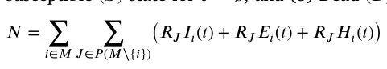

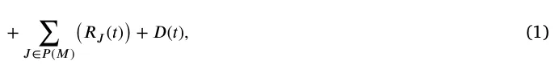

where *𝑖* ∈ *𝑀* is the index of a strain and *𝐽* ∈ *𝑃* (*𝑀*) is the set of strains an individual already recovered from. A schematic view of the transition between the stages of the disease for an individual for two strains (i.e., ‖*𝑀*‖ = 2) is shown in Fig. 1. Note that the susceptible state, *𝑆*, is represented in this model as *𝑅*∅.

<figure id="fig-1">
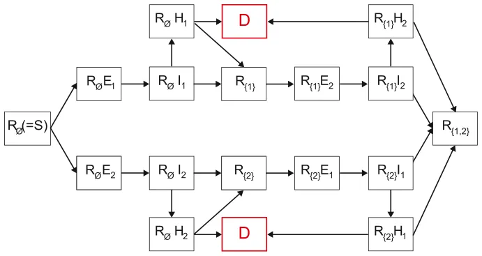
<figcaption><strong>Fig. 1.</strong> Schematic view of transition between disease stages, shown for ‖<em>𝑀</em>‖ = 2.</figcaption>
</figure>

Individuals in the Recovered (*𝑅*𝐽) group have immunity to strains *𝑘* ∈ *𝐽* and are susceptible to infection strains *𝑀*∖*𝐽*. When an individual in this group is exposed to strain *𝑖* ∈ *𝑀*∖*𝐽*, the individual is transferred to the Exposed with strain *𝑖* with a history of recoveries group *𝐽* (*𝑅*𝐽*𝐸*𝑖) at a rate *𝛽*𝐽,𝑖. The individual stays in this group on average *𝜓*𝐽,𝑖 days, after which the individual is transferred to the Infected group of the same strain *𝑖* with the same recovery history *𝐽* marked by (*𝑅*𝐽*𝐼*𝑖). The individuals stay in this group on average *𝛾*𝐽,𝑖 days, after which the individuals are transferred to the Recovered group (*𝑅*𝐽∪{𝑖}) or Hospitalized group (*𝑅*𝐽*𝐻*𝑖) with rates *𝜉*𝐽,𝑖, and 1−*𝜉*𝐽,𝑖, respectively. Individuals who are in the Hospitalized with strain *𝑖* and a recovery history *𝐽* group are either transferred to the Dead group (*𝐷*) after *𝜇*𝐽,𝑖 days at rate *𝜁*𝐽,𝑖 or to the Recovered group (*𝑅*𝐽) at rate 1−*𝜁*𝐽,𝑖. The recovered individuals are again healthy, no longer contagious, and immune from future infection from the same strain *𝑖*. The epidemiological dynamics are described in Eqs. (2)–(6).

In Eq. (2), 𝑑𝑅𝐽(𝑡) is the dynamic number of individuals who have *𝑑𝑡* recovered from a group of strains *𝐽* ∈ *𝑃* (*𝑀*) over time. It is affected by the following four terms. First, for each strain *𝑖* ∈ *𝐽*, an individual who has recovered from group *𝐽*∖{*𝑖*} of strains and is infected with strain *𝑖*, recovers at rate *𝛾*𝐽∖{𝑖},𝑖 with a probability of 1 − *𝜉*𝐽∖{𝑖},𝑖. Second, for each strain *𝑖* ∈ *𝐽*, an individual who has recovered from group *𝐽*∖{*𝑖*} of strains and is hospitalized with strain *𝑖*, recovers at rate 1−*𝜇*𝐽∖{𝑖},𝑖 with a probability 1−*𝜁*𝐽∖{𝑖},𝑖. Third, individuals infected by strain *𝑖* with rate *𝛽*𝐽,𝑖. These individuals can be infected by any individual with a strain *𝑖* who has recovered from any group *𝐾* of strains so that *𝑖* ∉ *𝐾*. Forth, individuals infected and hospitalized by strain *𝑖* with rate *𝛽*ℎ 𝐽,𝑖. These individuals can be infected by any individual with a strain *𝑖* who has recovered from any group *𝐾* of strains so that *𝑖* ∉ *𝐾*.

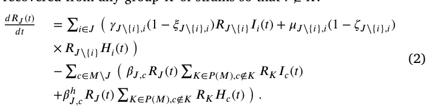

In Eq. (3), 𝑑𝑅𝐽𝐸𝑖(𝑡) is the dynamic number of individuals who have *𝑑𝑡* recovered from a group of strains *𝐽* and are exposed to a strain *𝑖* over time. It is affected by the following three terms. First, individuals infected by strain *𝑖* with rate *𝛽*𝐽,𝑖. These individuals can be infected by any individual with a strain *𝑖* who has recovered from any group *𝐾* of strains so that *𝑖* ∉ *𝐾*. Second, individuals infected and hospitalized by strain *𝑖* with rate *𝛽*ℎ 𝐽,𝑖. These individuals can be infected by any individual with strain *𝑖* who has recovered from any group *𝐾* of strains so that *𝑖* ∉ *𝐾*. Third, individuals exposed to strain *𝑖* who become infected at rate *𝜙*𝐽,𝑖.

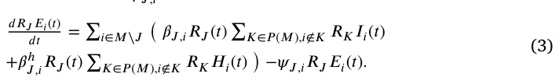

In Eq. (4), 𝑑𝑅𝐽𝐼𝑖(𝑡) is the dynamic number of individuals who have *𝑑𝑡* recovered from a group of strains *𝐽* and are infected with strain *𝑖* over time. It is affected by the following two terms. First, individuals exposed to strain *𝑖* with a history of *𝐽* who become infected with strain *𝑖*, at rate *𝜙*𝐽,𝑖. Second, individuals infected with strain *𝑖* who are either hospitalized or recovered at rate *𝛾*𝐽,𝑖.

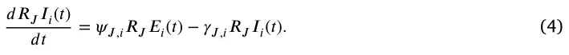

In Eq. (5), 𝑑𝑅𝐽𝐻𝑖(𝑡) is the dynamic number of individuals who have *𝑑𝑡* recovered from a group of strains *𝐽* and are infected and hospitalized with strain *𝑖* over time. It is affected by the following two terms. First, infected individuals with strain *𝑖* who have recovered from a group of strains *𝐽* and are hospitalized with rate *𝛾*𝐽,𝑖 and probability *𝜉*𝐽,𝑖. Second, individuals hospitalized with strain *𝑖* who are recovered from a group of strains *𝐽* who either die or recover at rate *𝜇*𝐽,𝑖.

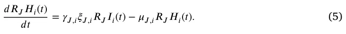

In Eq. (6), 𝑑𝐷(𝑡) is the dynamic number of dead individuals over *𝑑𝑡* time. For each strain *𝑖*, and for each group *𝐽*∖{*𝑖*}, infected individuals who do not recover die at rate *𝜇*𝐽∖{𝑖},𝑖 with probability (*𝜁*𝐽∖{𝑖},𝑖).

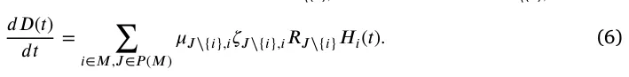

The dynamics of Eqs. (2)–(6) are summarized in Eq. (7).

𝑑𝑅𝐽(𝑡) = ∑ ( *𝛾*𝐽∖{𝑖},𝑖(1 − *𝜉*𝐽∖{𝑖},𝑖)*𝑅*𝐽∖{𝑖}*𝐼*𝑖(*𝑡*) + *𝜇*𝐽∖{𝑖},𝑖(1 − *𝜁*𝐽∖{𝑖},𝑖) *𝑑𝑡 𝑖*∈*𝐽* × *𝑅*𝐽∖{𝑖}*𝐻*𝑖(*𝑡*) )

−∑ ( *𝛽*𝐽,𝑐*𝑅*𝐽(*𝑡*) ∑ 𝑐∈𝑀∖𝐽 𝐾∈𝑃(𝑀),𝑐∉𝐾 *𝑅*𝐾*𝐼*𝑐(*𝑡*) +*𝛽*ℎ 𝐽,𝑐*𝑅*𝐽(*𝑡*) ∑𝐾∈𝑃(𝑀),𝑐∉𝐾 *𝑅*𝐾*𝐻*𝑐(*𝑡*) )*,* 𝑑𝑅𝐽𝐸𝑖(𝑡) = ∑ ( *𝛽*𝐽,𝑖*𝑅*𝐽(*𝑡*) ∑ 𝑖∈𝑀∖𝐽 𝐾∈𝑃(𝑀),𝑖∉𝐾 *𝑅*𝐾*𝐼*𝑖(*𝑡*) (7) *𝑑𝑡* +*𝛽*ℎ 𝐽,𝑖*𝑅*𝐽(*𝑡*) ∑𝐾∈𝑃 (𝑀),𝑖∉𝐾 *𝑅*𝐾*𝐻*𝑖(*𝑡*) ) −*𝜓*𝐽,𝑖*𝑅*𝐽*𝐸*𝑖(*𝑡*)*, 𝑑𝑅𝐽𝐼𝑖*(*𝑡*) = *𝜓*𝐽,𝑖*𝑅*𝐽*𝐸*𝑖(*𝑡*) − *𝛾*𝐽,𝑖*𝑅*𝐽*𝐼*𝑖(*𝑡*)*, 𝑑𝑡 𝑑𝑅𝐽𝐻𝑖*(*𝑡*) = *𝛾*𝐽,𝑖*𝜉*𝐽,𝑖*𝑅*𝐽*𝐼*𝑖(*𝑡*) − *𝜇*𝐽,𝑖*𝑅*𝐽*𝐻*𝑖(*𝑡*)*, 𝑑𝑡* 𝑑𝐷(𝑡) = ∑ 𝑖∈𝑀,𝐽∈𝑃 (𝑀) *𝜇*𝐽∖{𝑖},𝑖*𝜁*𝐽∖{𝑖},𝑖*𝑅*𝐽∖{𝑖}*𝐻*𝑖(*𝑡*)*. 𝑑𝑡*

Moreover, we assume that for each individual *𝑥* ∈ P in the population there is a unique distribution function *𝛿*𝑥(*𝑦*) that obtains another individual in the population *𝑦* ∈ P and returns the probability that the individuals *𝑥* and *𝑦* would interact. The function *𝛿*𝑥(*𝑦*) satisfies ∀*𝑥* ∈ P ∶ ∑ 𝑦∈P *𝛿*𝑥(*𝑦*) = 1. Based on the spatial infection-graph model [47], one can formally define each individual as a node in a fully-connected, indirect graph where the edges represent the possible interactions and their weights corresponding to the value of *𝛿*𝑥(*𝑦*) where *𝑥* and *𝑦* are the nodes of the edge.

In realistic social networks, each individual has a relatively small group of people such as family, friends, and colleagues with whom s/he interacts. Interactions with other individuals such as service providers or strangers on the street are more random and repeated interactions are rare. In order to capture these dynamics in the infection graph, we assume *𝛿*𝑥(*𝑦*) follows a Poisson distribution with mean values *𝜌*.

### 3.2. Genomics dynamics

At the beginning of the pandemic, there is a single pathogen (‖*𝑀*‖ = 1). During the incubation phase in the infection process (i.e., the exposed state) the pathogen multiplies in the host’s body. However, the immune system has yet to start to reduce the number of pathogen particles [48]. During this process, a virus pathogen introduces mutations to each particle. From a macro point of view, the total number of mutations a pathogen experiences in a single host can be calculated as the overall difference from the original pathogen at the time of the infection [49,50].

In our model, the original pathogen is defined by a one-dimensional RNA sequence with a pre-defined length *𝑙≫* 1 such that ∀*𝑘* ∈[0*,* … *, 𝑙*] ∶ *𝑘* ∈{*𝐴, 𝑈, 𝐶, 𝐺*}. During the exposed state, the pathogen goes through a mutation process that results in a new RNA of length *𝑙* such that [*𝑙*⋅*𝜔*] of the values in the RNA sequence are changed at random, where *𝜔* ∈[0*,* 1] is the average mutation size in a single host. This process repeats for each infected individual. We say a new strain of the pathogen *𝑚* appears in the population if *𝑚* differs from all previous strains *𝑀* with regard to at least one factor *𝛼* ∈[0*,* 1]. In other words, ∀*𝑚*𝑖 ∈ *𝑀* ∶ ‖*𝑚* − *𝑚*𝑖‖1 ≥ *𝛼*, where ‖*𝑥*‖1 is the Manhattan norm (e.g., *𝐿*1 norm) of vector *𝑥*.

For example, let us assume that *𝑀* = {*𝑚*1 ∶= [*𝐴, 𝐴, 𝑈, 𝐺*]*, 𝑚*2 ∶= [*𝐴, 𝐴, 𝐶, 𝐶*]}, and that *𝛼* = 0*.*5. Now, the first strain (*𝑚*1) mutated in several hosts and becoming *𝑚*3 ∶= [*𝐴, 𝐶, 𝑈, 𝐶*]. Now, we compute ‖*𝑚*3 − *𝑚*1‖1 = ‖*𝑚*3 − *𝑚*2‖1 = 0*.*5 ≥ *𝛼* = 0*.*5. Thus, we add *𝑚*3 as a new strain to *𝑀*, resulting in *𝑀* = {*𝑚*𝑖}3 𝑖=1.

### 3.3. The government’s PIP and the detection of the new strain

The government’s aim is to control the spread of the pandemic while minimizing the damage to the economy. The government can sample the state of the pathogen from some of the population using RNA sequencing, which is called a *new-strain-detection* (NSD) PIP. Thus, the government can sample a sub-group *𝑃⊂* P in the population to reveal new strains. If a strain is detected, its infection rate is reduced by a factor *𝜓*. The reduction is associated with the government’s development and distribution of a pharmaceutical intervention such as a vaccine. Moreover, we assume that there is a delay between the government’s detection and treatment of a new strain, which we denote as *𝜏>* 0. Despite the fact that the solution’s development, distribution, and economic cost are of great interest, they are outside the scope of this work.

In order to make a decision about the NSD PIP policy at any point in time, the government is aware of the current epidemiological state of the population without having any details about the strains. Thus, the government determines the epidemiological distribution of the population (with details on the individual level) assuming ‖*𝑀*‖ = 1. Based on this data, the government needs to decide on two parameters of the NSD PIP: the subset of the population *𝑃* that it wishes to test and the individuals that would be tested as part of this set.

### 3.4. Economic dynamics

In this study, we address three types of economic costs resulting directly from the outbreak of an epidemic. First, infected individuals (workers) produce less, reflected in their average output during the time of the infection. Second, hospitalized individuals incur financial costs and require resources from the healthcare system. As the number of hospitalized individuals grows, there is a significant strain on the healthcare system. Due to the expensive measures needed to control the outbreak, these strains hyper-linearly increase the average cost to treat a single patient even though s/he receives the same quality of service [51]. Finally, the economic model takes into account the monetized loss of the years of productive value of each individual who dies as a result of being infected [52,53]. The government can engage in PIPs to control the pandemic’s spread and therefore reduce these costs. Nevertheless, these actions come with a price. In the model, the NSD PIP has an average cost for each sample that declines as its manufacturing becomes more efficient [54–56]. Thus, the average cost of a sample is reduced sub-linearly to the number of samples ordered at each point in time.

Formally, *𝑐*𝑖, *𝑐*ℎ(*𝑅*𝐽*𝐻*𝐽,𝑖), and *𝑐*𝑑 are the average economic costs of each infected, hospitalized, or dead individual, respectively. In addition, the average cost of an NSD test is *𝑐*𝑝. If not stated otherwise, we assume that as the number of hospitalized patients increases, the average hospitalization cost will increase at an increasing rate.5 Thus, the average cost of hospitalization satisfies the following dynamics:

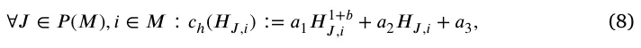

where 0 ≤ {*𝑎*𝑘}3 𝑘=1 and *𝑏* ∈(0*,* 1]. Furthermore, following the concept of economies of size [57–59], which describes what happens to cost per unit of output when production increases in a cost minimizing way, we set the average cost of an NSD sample to satisfy the following dynamics:

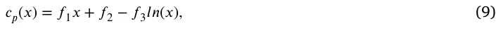

where {*𝑓*𝑘}3 𝑘=1 ∈ R such that 0 ≤ *𝑐*𝑝(*𝑥*) for all *𝑥* and {*𝑓*𝑘}3 𝑘=1. Hence, for a given epidemiological state and the government’s PIP policy (*𝛶*) at a point in time *𝑡*, the economic cost is as follows:

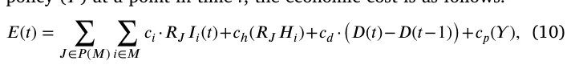

where *𝛶* ∈[0*,* … *, 𝑁*] is the number of individuals sampled as part of the PIP policy. As such, the total economic cost of the pandemic between *𝑡*0 and *𝑡*1 is:

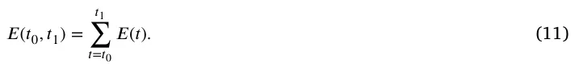

### 3.5. Computer implementation

We tested our model using an agent-based simulation approach [60, 61]. Each individual in the population is defined by a timed finite state machine such that its clock counts the time that has passed from the last state change to its states corresponding to the epidemiological states [62]. Moreover, for each individual, we store the RNA of the strain with which s/he has been infected and has mutated at any point in time. The entire population follows a discrete global clock. At the beginning of the simulation, the fully connected infection graph is initialized with *𝑁* nodes with a pre-defined epidemiological state distribution obtained by the user. In a random manner, the weights for each individual are sampled from a Poisson distribution with a mean value *𝜌* and that is normalized to fulfill the requirements of function *𝛿*𝑥(*𝑦*). If an edge’s weight of an individual *𝑥* is already set because its value is computed from a previous iteration of another individual *𝑦* ≠ *𝑥*, its value does not change. Next, for each clock tick, the following four processes take place. First, the epidemiological dynamics (Eq. (7)) take place, updating the epidemiological states of the individuals in the population. Formally, the simulation goes over all the individuals in the population and randomly, according to their edges’ weights, picks another individual which whom they interact with. Due to the interaction, the epidemiological state of these individuals might change if one of them is infected by some strain and the other is susceptible to the same strain. Afterward, the inner clock of the individual is updated which may also change its epidemiological state if it is exposed, infected, or hospitalized by some strain [62]. Second, we check to see whether a new strain appears due to the mutation process (see Section 3.2). Namely, the RNA component of the individuals that recovered in the last step is computed and compared to all current strains. Third, the government applies the NSD PIP. Finally, we compute and record the economic cost of this step in time following Eq. (10). A schematic view of the computation steps for each clock tick is presented in Fig. 2.

A summary of the model’s parameters, with their values as used by the simulator, is provided in Table 1. At the beginning of the simulation, ‖*𝑀*‖ = 1. However, due to the mutation process taking place during the simulation, the number of strains can monotonically increase. The appearance of each new strain results in the need to generate an increasing number of parameters. We assume that these values are picked at random (from Table 1) but are identical across all simulations. This is possible by utilizing a pseudo-random process with the identical seed over all of the simulations.

### 3.6. Optimal policy

The government is interested in implementing the NSD PIP optimally in order to reduce operation costs and the spread of the pandemic. Given that the model has multiple dimensions and evolves in a stochastic manner over time, the government’s policy has to be adaptive as well. We can determine this policy using a machine learning (ML) approach in general and reinforcement learning (RL) in particular [63–65]. Therefore, we used the deep neural network (NN) architecture proposed by Obeidat et al. [66]. We replaced the input layer, making it the size of the population, and used one-hot encoding of the epidemiological states that the government is aware of for each individual in the population. In addition, we also altered the output layer, making it a binary vector of the size of the population, which indicates if an individual was picked to be sampled by the NSD PIP.

We trained the NN model using a genetic algorithm approach [67]. Thus, the genetic algorithm creates a population of agents (in our case, NNs) such that in each generation, each agent is evaluated, producing a score (also known as *fitness* score). The top *𝑇* agents become the parents of the next generation. To produce the next generation, a parent is selected uniformly at random to be replaced and is mutated by applying additive Gaussian noise to the parameter vector. Technically, we used the implementation details proposed by Such et al. [67] with 28 000 simulations such that each simulation is of 360 days duration, resulting in 10 080 000 decisions. We used Eq. (11) as the fitness function for the genetic algorithm.

## 4. Results

Using the proposed model and its implementation as a computer simulation, we investigated several scenarios of interest. First, we demonstrate the dynamics in the form of the economic costs (*𝐸*(*𝑡*)) *𝐼*(*𝑡*)−*𝐼*(*𝑡*−1) and the basic reproduction number (*𝑅*0(*𝑡*) ∶= 𝑅(𝑡)−𝑅(𝑡−1)) over time, based on three levels of government intervention: no intervention, 5% of the population is sampled at each point in time at random, and the entire population is sampled.6 Our results indicate the changes in the dynamics over time as a result of these interventions. Second, we document the influence of social factors and genomics on the dynamics of the economic indicators and the spread of the pandemic. Finally, utilizing the optimal NDS PIP model, we compare the model’s performance in several scenarios. We computed the economic costs *𝐸*(*𝑡*) and the basic reproduction number *𝑅*0(*𝑡*) over time for 360 days, given an initial condition of five infected individuals in the population and the parameter values from Table 1. As Fig. 3 illustrates, we considered three government intervention policies: no intervention, 5% of the population is sampled at random at a point in time, and the entire population is sampled.

In order to investigate the sensitivity of the model to various parameters, we defined the 5% sample case from Fig. 3 as the baseline. Formally, we computed the mean value of the economic costs and the basic reproduction numbers over time and normalized this signal

6 The value 5% is chosen to roughly reproduce the monthly sampling portion of the Israeli population during the first year (2020) of the COVID-19 pandemic.

<figure id="fig-2">
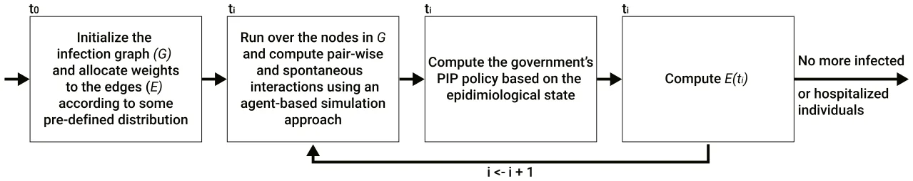
<figcaption><strong>Fig. 2.</strong> A schematic view of the computation steps for each clock tick.</figcaption>
</figure>

<figure id="fig-3">
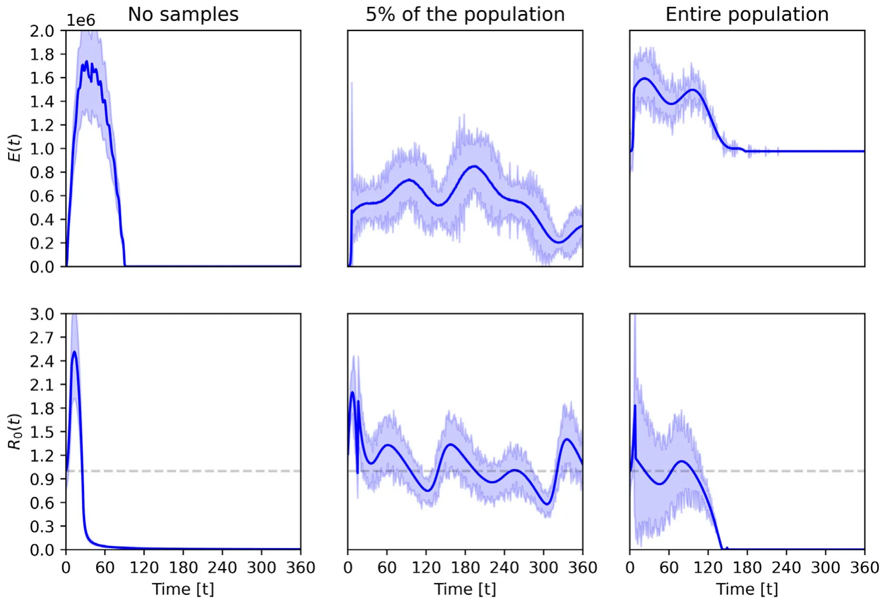
<figcaption><strong>Fig. 3.</strong> The economic cost (E(t)) and mean reproduction number (<em>𝑅</em>0(<em>𝑡</em>)) over time, divided into three NDS PIP policies: no samples, random sample of 5% of the population, and entire population sample. The results are shown as a mean ± standard deviation of <em>𝑛</em> = 100 simulations. The horizontal dashed line indicates <em>𝑅</em>0(<em>𝑡</em>) = 1.</figcaption>
</figure>

<figure class="table-figure" id="table-1">
<figcaption><strong>Table 1</strong> The parameters used in the simulation and their values.</figcaption>

<table><tr><th>Symbol</th><th>Description</th><th>Value</th></tr><tr><td>𝑁 𝛽𝐽,𝑖</td><td>Population size [1] Average infection rate of individual infected with strain 𝑖and recovery history from strains 𝐽 [1]</td><td>10 000 (0, 1]</td></tr><tr><td>𝛽ℎ 𝐽,𝑖</td><td>Average infection rate of hospitalized individual infected with strain 𝑖and recovery history from strains 𝐽[1]</td><td>0.1𝛽𝐽,𝑖</td></tr><tr><td>𝜓𝐽,𝑖</td><td>Average duration in days an individual exposed to strain 𝑖and recovery history from strains 𝐽 become infected [𝑡−1]</td><td>[2, 7]</td></tr><tr><td>𝛾𝐽,𝑖</td><td>Average duration in days an individual infected with strain 𝑖and recovery history from strains 𝐽recover [𝑡−1]</td><td>[7, 28]</td></tr><tr><td>𝜉𝐽,𝑖</td><td>Average rate of individual infected with strain 𝑖and recovery history from strains 𝐽to become hospitalized [1]</td><td>(0, 0.05]</td></tr><tr><td>𝜁𝐽,𝑖</td><td>Average rate of hospitalized individual infected with strain 𝑖and recovery history from strains 𝐽to die [1]</td><td>(0, 0.1]</td></tr><tr><td>𝜇𝐽,𝑖</td><td>Average duration in days an hospitalized individual infected with strain 𝑖and recovery history from strains 𝐽to either recover or die [𝑡−1]</td><td>[3, 45]</td></tr><tr><td>l 𝜔</td><td>Pathogen’s RNA sequence length Average pathogen’s mutation rate in infected individuals</td><td>1 000 000 0.001</td></tr><tr><td>𝛼 𝑐𝑖</td><td>Threshold in which strain’s mutation considered a new strain Average cost of infected individual [dollar per day]</td><td>0.05 5</td></tr><tr><td>𝑐ℎ 𝑐𝑑 𝑐𝑝 𝜏</td><td>Average cost, as a function, of hospitalized individual Average cost of dead individual Average cost, as a function, of PIP sample Delay between new strain detection and control</td><td>𝑎1 = 1.3, 𝑎2 = 10, 𝑎3 = 0, 𝑏= 0.1 100 𝑓1 = 0.5, 𝑓2 = 0, 𝑓3 = 0.1 7</td></tr><tr><td>𝜓</td><td>Reduction in infection rate due to the NDS PIP detection and control</td><td>0.9</td></tr><tr><td>𝜌</td><td>The Poisson distribution mean parameter of interactions in the population</td><td>7</td></tr></table>

</figure>

<figure id="fig-4">
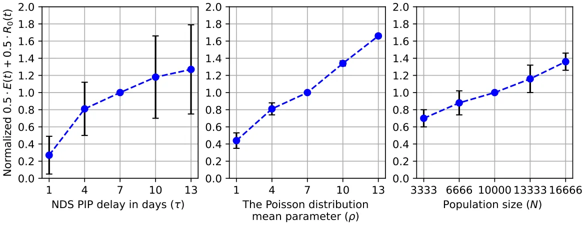
<figcaption><strong>Fig. 4.</strong> Sensitivity analysis of the NDS PIP delay factor, the social connection Poisson distribution’s mean value, and the population size. The results are shown as a mean ± standard deviation values of <em>𝑛</em> = 100 simulations.</figcaption>
</figure>

<figure id="fig-5">
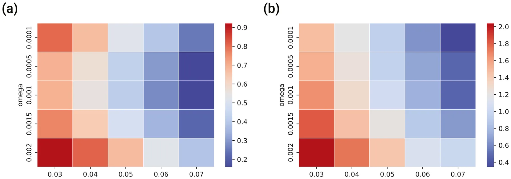
<figcaption><strong>Fig. 5.</strong> The economic cost and mean reproduction number (<em>𝑅</em>0) shown in plots (a) and (b), respectively. It is assumed that random 5% of the population is sampled at each step in time. The results are shown as a mean value of <em>𝑛</em> = 100 simulations.</figcaption>
</figure>

to be 1 by dividing by its integral (i.e., a continuous *𝐿*1 metric). We calculated every other case in the same way and compared it to the baseline (with a value of 1). The results of this analysis appear in Fig. 4. Moreover, we used a symbolic regression-based method in which the family function is obtained using a genetic algorithm as proposed by Augusto and Barbosa [68]. Specifically, we used the gplearn7 library for the Python programming language [69]. The parameters for each gene (i.e., family function candidate) are obtained using the Levenberg–Marquardt algorithm [70] using the Scipy8 library. We used the coefficient of determination (*𝑅*2) of each gene in the data as the genetic algorithm’s fitness function. Thus, by considering *𝑦* ∶= 0*.*5*𝐸*(*𝑡*)+ 0*.*5*𝑅*0(*𝑡*), we obtained results indicating that *𝑦* = 0*.*390*𝑙𝑛*(*𝜏*) + 0*.*267, 0*.*099*𝜌* + 0*.*357, and *𝑦* = 0*.*000048*𝑁* + 0*.*540 with *𝑅*2 = 0*.*999*,* 0*.*993, and 0.994, respectively.

Similarly, we computed the influence of changes in the mutation rate (*𝜔*) and the threshold for a new strain (*𝛼*) on the economic costs and the basic reproduction numbers separately, as shown in Fig. 5.

Finally, by utilizing the optimal policy model (see Section 3.6), we computed the baseline (5% of the population picked at random), the optimal strategy (5% picked by the model to be near-to-optimal), the optimal size (a random sample of the population with a size picked by the model to be near-to-optimal), and the optimal strategy and size, in which the model picked both the subset of the population and its size. The results of this analysis are provided in Fig. 6. In addition, a one-side paired T-test showed that the optimal strategy and size model are better than the optimal strategy to a statistically significant degree (*𝑝<* 0*.*05). Similarly, the optimal strategy is better than the optimal size model to a statistically significant degree (*𝑝<* 0*.*05). Finally, the optimal size model is better than the baseline model to a statistically significant degree (*𝑝<* 0*.*01). Notably, *𝐸*(*𝑡*) indicates the cost of the pandemic and the PIP and *𝑅*0 indicates the pandemic spread, policymakers aim to minimize both matrices.

## 5. Discussion

We proposed an extended SIR model that captures multi-strain epidemiological dynamics with the emergence of new strains over time throughout a mutation process and the economic costs associated with the pandemic. Furthermore, we also considered the testing of individuals over time to detect a new epidemiological wave due to the emergence of a new strain and the interactions between the two.

In Fig. 3 one can see (on the left) that if no PIP is implemented, the pandemic causes a large wave of infection and dies out. It is also reasonable to expect that the emergence of new strains would extend the wave. However, counter intuitively, a high infection rate causes short infection chains. Thus, more individuals are infected with the same strain with a specific state of a mutation. However, the number of infection steps is small enough that the new strain that emerges is not significantly different from the previous one. Note that the proposed model assumes that strains develop among members of the community.

<figure id="fig-6">
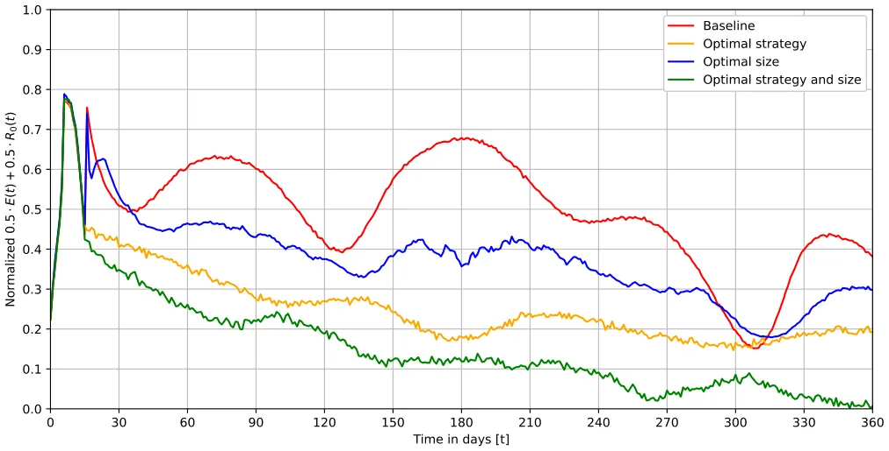
<figcaption><strong>Fig. 6.</strong> The mean of <em>𝐸</em>(<em>𝑡</em>) and <em>𝑅</em>0(<em>𝑡</em>) divided between four NDS PIP scenarios. The baseline strategy is a random sample of 5% of the population, The results are shown as a mean value of <em>𝑛</em> = 100 simulations.</figcaption>
</figure>

We do not consider the possibility of importing strains from abroad. This assumption is important when we analyze the left-hand charts in Fig. 3. New strains introduced into the community can lead to another wave of morbidity such as the wave depicted in the left-hand chart. Moreover, as the chart in the middle indicates, a relatively small sample size (e.g., 5%) is sufficient for controlling the pandemic but still suffers from waves of infection. Finally, the right-hand side highlights that, while sampling the entire population results in the pandemic dying out relatively quickly, the associated cost is very high, especially compared to the other two alternatives. Thus, it is safe to claim that the NSD PIP is effective. However, implementing it in a random manner does not necessarily result in a better epidemiological or economic outcome, compared to not using it at all. We tested this claim and present the results in Fig. 6. They indicate that the NDS PIP can be improved in a statically significant way compared to the proposed baseline in which the subset of the population tested is picked at random and is of an arbitrarily chosen size. Thus, while the NDS PIP is of value, the task of using it properly is not trivial.

From Fig. 4, we learn that the delay in responding to a new strain after it has been detected causes a logarithmic growth in the epidemiological and economic damage. One explanation for this outcome is that the change in the spread of the infection becomes less significant over time, which results in a reduction in the derivatives over time. This outcome results in the logarithmic function. In comparison, the socially connected factor (*𝜌*) and the population size have a linear connection to the epidemiological and economic damage of the pandemic. Thus, socio-demographic features of the population such as social contact patterns among individuals and more connected societies are at greater risk. This outcome was reported in multiple studies, including but not limited to Horby et al. [71], Fumanelli et al. [72], Inoue [73] and Jiang et al. [74]. In the same manner, Fig. 5 shows that a higher mutation rate and lower threshold for the emergence of new strains result, on average, in more epidemiological and economic damage. These results accord with Minayev and Ferguson [35], Khyar and Allali [31] and Fudolig and Howard [75].

Overall, our model suggests that the NSD PIP is an efficient policy that policymakers can adopt in controlling a multi-strain pandemic, assuming a reliable testing mechanism and a proper sampling strategy of the population. Moreover, the model reveals a thin line between the most cost-effective and most epidemiological-effective policies while showing that there is no stiff trade-off between the two.

Our analysis was predicated on a relatively small population (10,000 individuals) mainly due to the lack of computational resources to compute the optimal policy model and a large number of simulations [76]. Thus, extrapolating our results to larger population sizes can be tricky because we would need to capture information about many other dynamics that take place in larger populations. Examples include mobility [47,77–79] and individual level epidemiological and economic decision making [80,81]. Moreover, for multiple pandemics, the portion of asymptomatic infected individuals is significant and can provide a partial picture of the epidemiological state of the population. Thus, it would be of great interest to introduce these dynamics and explore their effect on the optimal policy. In addition, and unlike most cases in reality, we assume that the government finances the cost of the tests without increasing its deficit. Therefore, costs related to interest payments on debt are not part of our economic model. Thus, in future work, one can introduce factors such as budgets, taxes, and interest to Eq. (10) in order to make the model more realistic. In addition, identification of when a new strain is appearing can be of great interest, allowing to design of new and improved current PIPs to exploit this information. Another possible extension of the proposed model is by integrating more sophisticated sampling strategies compared to the random sample of the population we used. In particular, sociological and biological-driven methods such as the ones proposed by Nichols et al. [82], Augenblick et al. [83] and Mercer and Salit [84] are promising starting points in this direction.

## 6. Conclusion

Early detection of new strains of a pathogen entering the country or already spreading is of paramount importance, especially if the variant leads to a higher infection rate and is resistant to vaccines. This situation could become critical, given that precautionary measures taken in the past to curb the spread of the pathogen might prove inadequate due to the natural reproducibility of the variant and its high rate of spread among the population [85]. Therefore, vigilance is necessary to prevent a renewed epidemiological and economic crisis. Nevertheless, administering a broad array of tests is not logistically simple nor cost-effective. Perhaps more importantly, it requires financial resources that could burden the state’s budget. Deploying economic resources to deal with the problem could increase national debts to levels that would cause fiscal and budgetary hardships that would last for generations [86,87]. A direct outcome of the proposed model is that policymakers can adopt over time to post-vaccination multi-strain pandemic by using artificial intelligence systems to strategically sample individuals in the population and deploy new pharmaceutical solution efficiently.

In this work, we studied the optimal course of action for dealing with the epidemiological and economic results of a multi-strain pandemic when the development and distribution of pharmaceutical intervention measurements are well established. We first show that using an NSD PIP without proper planning does more economic harm than not using it at all. Thus, observing the epidemiological state of the population allows the use of artificial intelligence solutions such as deep neural network-based models to determine the policies that reduce both the economic damage and the spread of the pandemic to a statistically significant degree, achieving control over the pandemic spread while minimizing the associated financial burden. Moreover, our analysis reveals that social connectivity and the delay between the detection of the new strain and the implementation of the pharmaceutical intervention are positively correlated linearly and logarithmically, respectively, to the damage that the pandemic inflicts. Thus, policymakers should take these parameters into consideration when deciding on a course of action.

## Declaration of competing interest

The authors declare that they have no known competing financial interests or personal relationships that could have appeared to influence the work reported in this paper.

## Funding

The authors did not receive support from any organization for the submitted work.

## Code availability

The code and materials are available upon request from the authors.

## Data availability

Data will be made available on request.

## Notes

5 For more details, please refer to: https://s3.amazonaws.com/media2.fairhealth.org/brief/asset/COVID-19%20-%20The%20Projected% 20Economic%20Impact%20of%20the%20COVID-19%20Pandemic%20on% 20the%20US%20Healthcare%20System.pdf.

7 https://github.com/trevorstephens/gplearn.

8 https://docs.scipy.org/.

## References

1. Bish A, Yardley L, Nicoll A, Michie S. Factors associated with uptake of vaccination against pandemic influenza: A systematic review. Vaccine 2011;29(38):6472–84. [link](http://refhub.elsevier.com/S0960-0779%2822%2901002-5/sb1)
2. Chumakov K, Ehrenfeld E, Wimmer E, Agol VI. Vaccination against polio should not be stopped. Nature Rev Microbiol Vol 2007;5:952–8. [link](http://refhub.elsevier.com/S0960-0779%2822%2901002-5/sb2)
3. Wang Q, Yang L, Jin H, Lin L. Vaccination against polio should not be stopped. Prev Med 2021;150:106694. [link](http://refhub.elsevier.com/S0960-0779%2822%2901002-5/sb3)
4. Gross PA. Preparing for the next influenza pandemic: A reemerging infection. Ann Internal Med 1996. [link](http://refhub.elsevier.com/S0960-0779%2822%2901002-5/sb4)
5. Mahase E. COVID-19: What have we learnt about the new variant in the UK? BMJ 2020. [link](http://refhub.elsevier.com/S0960-0779%2822%2901002-5/sb5)
6. Hossain K, Hassanzadeganroudsari M, Apostolopoulos V. The emergence of new strains of SARS-CoV-2. What does it mean for COVID-19 vaccines? Expert Rev Vaccines 2021;20(6):635–8. [link](http://refhub.elsevier.com/S0960-0779%2822%2901002-5/sb6)
7. Suthar S, Das S, Nagpure A, Madhurantakam C, Tiwari SB, Gahlot P, Tyagi VK. Epidemiology and diagnosis, environmental resources quality and socio-economic perspectives for COVID-19 pandemic. J Environ Manag 2021;280:111700. [link](http://refhub.elsevier.com/S0960-0779%2822%2901002-5/sb7)
8. Teerawattananon Y, Dabak V. COVID-19 vaccination logistics: five steps to take now. Nature 2020;587:194–6. [link](http://refhub.elsevier.com/S0960-0779%2822%2901002-5/sb8)
9. Lydon P, Gandhi G, Vandelaer J, Okwo-Bele J-M. Health system cost of delivering routine vaccination in low- and lower-middle income countries: what is needed over the next decade? Bull World Health Organ 2014;92(5):382–4. [link](http://refhub.elsevier.com/S0960-0779%2822%2901002-5/sb9)
10. van Bergeijk PAG. The political economy of the next pandemic. Rev Econ Anal 2022;14:27–49. [link](http://refhub.elsevier.com/S0960-0779%2822%2901002-5/sb10)
11. Smith RD, Keogh-Brown MR, Tait J. The economy-wide impact of pandemic influenza on the UK: a computable general equilibrium modelling experiment. BMJ 2009. [link](http://refhub.elsevier.com/S0960-0779%2822%2901002-5/sb11)
12. Yeyati EL, Filippini F. Social and economic impact of COVID-19. Bangladesh Institute of Development Studies; 2021. [link](http://refhub.elsevier.com/S0960-0779%2822%2901002-5/sb12)
13. Yoo S, Managi S. Global mortality benefits of COVID-19 action. Technol Forecast Soc Change 2020;160:120231. [link](http://refhub.elsevier.com/S0960-0779%2822%2901002-5/sb13)
14. Mercer TR, Salit M. Testing at scale during the COVID-19 pandemic. Nature Rev Genet Vol 2021;22:415–26. [link](http://refhub.elsevier.com/S0960-0779%2822%2901002-5/sb14)
15. Zella D, Giovanetti M, Cella E, Borsetti A, Ciotti M, Ceccarelli G, D’Ettorre G, Pez-zuto A, Tambone V, Campanozzi L, Magheri M, Unali F, Bianchi M, Benedetti F, Pascarella S, Angeletti S, Ciccozzi M. The importance of genomic analysis in cracking the coronavirus pandemic. Nature Rev Genet Vol 2021;22:415–26. [link](http://refhub.elsevier.com/S0960-0779%2822%2901002-5/sb15)
16. Alban A, Chick SE, Dongelmans DA, Vlaar AP, Sent D. ICU capacity management during the COVID-19 pandemic using a process simulation. Intensive Care Med 2020;46(8):1624–6. [link](http://refhub.elsevier.com/S0960-0779%2822%2901002-5/sb16)
17. Bai M, Cui Y, Kong G, Zhang AZ. No panic in pandemic: the impact of individual choice on public health policy and vaccine priority. University of connecticut school of business research paper (21–02), 2021. [link](http://refhub.elsevier.com/S0960-0779%2822%2901002-5/sb17)
18. Yang L, Cui S, Wang Z. Design of Covid-19 testing queues. Prod Oper Manage 2022;1–18. [link](http://refhub.elsevier.com/S0960-0779%2822%2901002-5/sb18)
19. Keeling MJ, Rohani P. Modeling infectious diseases in humans and animals. In: Modeling infectious diseases in humans and animals. Princeton University Press; 2011. [link](http://refhub.elsevier.com/S0960-0779%2822%2901002-5/sb19)
20. Kumar A, Srivastava PK. Vaccination and treatment as control interventions in an infectious disease model with their cost optimization. Commun Nonlinear Sci Numer Simul 2017;44:334–43. [link](http://refhub.elsevier.com/S0960-0779%2822%2901002-5/sb20)
21. Chen N, Hu M, Zhang C. Capacitated SIR model with an application to COVID-19. 2020, Available at SSRN 3692751. [link](http://refhub.elsevier.com/S0960-0779%2822%2901002-5/sb21)
22. Chen X, Li J, Xiao C, Yang P. Numerical solution and parameter estimation for uncertain SIR model with application to COVID-19. Fuzzy Optim Decis Mak 2021;20(2):189–208. [link](http://refhub.elsevier.com/S0960-0779%2822%2901002-5/sb22)
23. Nisar KS, Ahmad S, Ullah A, Shah K, Alrabaiah H, Arfan M. Mathematical analysis of SIRD model of COVID-19 with Caputo fractional derivative based on real data. Results Phys 2021;21:103772. [link](http://refhub.elsevier.com/S0960-0779%2822%2901002-5/sb23)
24. Piccirillo V. Nonlinear control of infection spread based on a deterministic SEIR model. Chaos Solitions Fractals 2021;149:111051. [link](http://refhub.elsevier.com/S0960-0779%2822%2901002-5/sb24)
25. Chen X. Infectious disease modeling and epidemic response measures analysis considering asymptomatic infection. IEEE Access 2020;8:149652–60. [link](http://refhub.elsevier.com/S0960-0779%2822%2901002-5/sb25)
26. Kozyreff G. Hospitalization dynamics during the first COVID-19 pandemic wave: SIR modelling compared to Belgium, France, Italy, Switzerland and new york city data. Infect Disease Model 2021;6:398–404. [link](http://refhub.elsevier.com/S0960-0779%2822%2901002-5/sb26)
27. Al-Raeei M. The forecasting of COVID-19 with mortality using SIRD epidemic model for the United States, Russia, China, and the Syrian Arab Republic. AUO Advances 2020;10(6). [link](http://refhub.elsevier.com/S0960-0779%2822%2901002-5/sb27)
28. Fernández-Villaverde J, Jones CI. Estimating and cimulating a SIRD model of COVID-19 for many countries, states, and cities. Working paper 27128, National Bureau of Economic Research; 2020. [link](http://refhub.elsevier.com/S0960-0779%2822%2901002-5/sb28)
29. Acemoglu D, Chernozhukov V, Werning I, Whinston MD. Optimal targeted lockdowns in a multi-group SIR model. Working paper 27102, National Bureau of Economic Research; 2020. [link](http://refhub.elsevier.com/S0960-0779%2822%2901002-5/sb29)
30. Rahimi I, Chen F, Gandomi AH. A review on COVID-19 forecasting models. Neural Comput Appl 2021. [link](http://refhub.elsevier.com/S0960-0779%2822%2901002-5/sb30)
31. Khyar O, Allali K. Global dynamics of a multi-strain SEIR epidemic model with general incidence rates: application to COVID-19 pandemic. Nonlinear Dynam 2020;102:489–509. [link](http://refhub.elsevier.com/S0960-0779%2822%2901002-5/sb31)
32. Gordo I, Gomes MGM, Reis DG, Campos PRA. Genetic diversity in the SIR model of pathogen evolution. PLoS One 2009;4(3):e4876. [link](http://refhub.elsevier.com/S0960-0779%2822%2901002-5/sb32)
33. Lazebnik T, Bunimovich-Mendrazitsky S. Generic approach for mathematical model of multi-strain pandemics. PLoS One 2022;17(4):e0260683. [link](http://refhub.elsevier.com/S0960-0779%2822%2901002-5/sb33)
34. Lazebnik T, Blumrosen G. Advanced multi-mutation with intervention policies pandemic model. IEEE Access 2022;10:22769–81. [link](http://refhub.elsevier.com/S0960-0779%2822%2901002-5/sb34)
35. Minayev P, Ferguson N. Improving the realism of deterministic multi-strain models: implications for modelling influenza a. J R Soc Interface 2008. [link](http://refhub.elsevier.com/S0960-0779%2822%2901002-5/sb35)
36. Dang Y-X, Li X-Z, Martcheva M. Competitive exclusion in a multi-strain immuno-epidemiological influenza model with environmental transmission. J Biol Dyn 2016;10(1). [link](http://refhub.elsevier.com/S0960-0779%2822%2901002-5/sb36)
37. Piguillem F, Shi L. Optimal COVID-19 quarantine and testing policies. Covid Econ 2020;27:123–69. [link](http://refhub.elsevier.com/S0960-0779%2822%2901002-5/sb37)
38. Dewatripont M, Goldman M, Muraille E, Platteau J-P. Rapid identification of workers immune to COVID-19 and virus-free: A priority to restart the economy. Technical report, discussion paper, Universit Libre de Bruxelles; 2020. [link](http://refhub.elsevier.com/S0960-0779%2822%2901002-5/sb38)
39. Atkeson A, Droste MC, Mina M, Stock JH. Economic benefits of COVID-19 screening tests. Technical report, National Bureau of Economic Research; 2020. [link](http://refhub.elsevier.com/S0960-0779%2822%2901002-5/sb39)
40. Berger D, Herkenhoff K, Huang C, Mongey S. Testing and reopening in an SEIR model. Rev Econ Dyn 2022;43:1–21. [link](http://refhub.elsevier.com/S0960-0779%2822%2901002-5/sb40)
41. Chari VV, Kirpalani R, Phelan C. The hammer and the scalpel: On the economics of indiscriminate versus targeted isolation policies during pandemics. Rev Econ Dyn 2021;42:1–14. [link](http://refhub.elsevier.com/S0960-0779%2822%2901002-5/sb41)
42. Brotherhood L, Kircher P, Santos C, Tertilt M. An economic model of the COVID-19 epidemic: The importance of testing and age-specific policies. 2020. [link](http://refhub.elsevier.com/S0960-0779%2822%2901002-5/sb42)
43. Eichenbaum MS, Rebelo S, Trabandt M. The macroeconomics of testing and quarantining. J Econom Dynam Control 2022;138:104337. [link](http://refhub.elsevier.com/S0960-0779%2822%2901002-5/sb43)
44. Eichenbaum MS, Rebelo S, Trabandt M. The macroeconomics of epidemics. Rev Financ Stud 2021;34(11):5149–87. [link](http://refhub.elsevier.com/S0960-0779%2822%2901002-5/sb44)
45. Atkeson A, Droste MC, Mina MJ, Stock J. Economic benefits of COVID-19 screening tests with a vaccine rollout. 2021, medRxiv. [link](http://refhub.elsevier.com/S0960-0779%2822%2901002-5/sb45)
46. Adamu HA, Muhammad M, Jingi AM, Usman MA. Mathematical modelling using improved SIR model with more realistic assumptions. Int J Eng Appl Sci 2019;6(1):2394–3661. [link](http://refhub.elsevier.com/S0960-0779%2822%2901002-5/sb46)
47. Ellison G. Implications of heterogeneous SIR models for analyses of COVID-19. Working paper 27373, National Bureau of Economic Research; 2020. [link](http://refhub.elsevier.com/S0960-0779%2822%2901002-5/sb47)
48. Shao W, Li X, Goraya MU, Wang S, Chen JL. Evolution of influenza a virus by mutation and re-assortment. Int J Mol Sci 2017;18(8):1650. [link](http://refhub.elsevier.com/S0960-0779%2822%2901002-5/sb48)
49. Day T, Andre J-B, Park A. The evolutionary emergence of pandemic influenza. Proc R Soc B: Biol Sci 2006;273(1604):2945–53. [link](http://refhub.elsevier.com/S0960-0779%2822%2901002-5/sb49)
50. Bryndin E. Mutational lines of strains and mutational adaptive selectivity of coronaviruses. J Clin Biomed Invest 2022;2(1):24–6. [link](http://refhub.elsevier.com/S0960-0779%2822%2901002-5/sb50)
51. Luyten J, Beutels P. Costing infectious disease outbreaks for economic evaluation. Pharmacoeconomics 2009;27(5):379–89. [link](http://refhub.elsevier.com/S0960-0779%2822%2901002-5/sb51)
52. Cutler DM, Summers LH. The COVID-19 pandemic and the $16 trillion virus. JAMA 2020;324(15):1495–6. [link](http://refhub.elsevier.com/S0960-0779%2822%2901002-5/sb52)
53. Broome J. Trying to value a life. J Publ Econ 1978;9:91–100. [link](http://refhub.elsevier.com/S0960-0779%2822%2901002-5/sb53)
54. Mercer TR, Salit M. Testing at scale during the COVID-19 pandemic. Nature Rev Genet 2021;22(7):415–26. [link](http://refhub.elsevier.com/S0960-0779%2822%2901002-5/sb54)
55. Benda A, Zerajic L, Ankita A, Cleary E, Park Y, Pandey S. COVID-19 testing and diagnostics: A review of commercialized technologies for cost, convenience and quality of tests. Sensors 2021;21(19):6581. [link](http://refhub.elsevier.com/S0960-0779%2822%2901002-5/sb55)
56. Smyrlaki I, Ekman M, Lentini A, Rufino de Sousa N, Papanicolaou N, Von-dracek M, Aarum J, Safari H, Muradrasoli S, Rothfuchs AG, et al. Massive and rapid COVID-19 testing is feasible by extraction-free SARS-CoV-2 RT-PCR. Nature Commun 2020;11(1):1–12. [link](http://refhub.elsevier.com/S0960-0779%2822%2901002-5/sb56)
57. Hallam A. Economies of size: theory, measurement, and related issues. In: Size, structure, and the changing face of American agriculture. CRC Press; 2019, p. 150–203. [link](http://refhub.elsevier.com/S0960-0779%2822%2901002-5/sb57)
58. Rasmussen S. Economies of scale and size. In: Production economics. Springer; 2011, p. 111–20. [link](http://refhub.elsevier.com/S0960-0779%2822%2901002-5/sb58)
59. Duffy M. Economies of size in production agriculture. J Hunger Environ Nutr 2009;4(3–4):375–92. [link](http://refhub.elsevier.com/S0960-0779%2822%2901002-5/sb59)
60. Tesfatsion L. Agent-based computational economics: Growing economies from the bottom up. Artif Life 2002;8(1). [link](http://refhub.elsevier.com/S0960-0779%2822%2901002-5/sb60)
61. Priest JD, Kishore A, Machi L, Kuhlman CJ, Machi D, Ravi SS. CSonNet: An agent-based modeling software system for discrete time simulation. In: 2021 winter simulation conference (WSC). 2021, p. 1–12. [link](http://refhub.elsevier.com/S0960-0779%2822%2901002-5/sb61)
62. Lazebnik T, Bunimovich-Mendrazitsky S, Shami L. Pandemic management by a spatio–temporal mathematical model. Int J Nonlinear Sci Numer Simul 2021. [link](http://refhub.elsevier.com/S0960-0779%2822%2901002-5/sb62)
63. Li H, Gao H, Lv T, Lu Y. Deep Q-learning based dynamic resource allocation for self-powered ultra-dense networks. In: 2018 IEEE international conference on communications workshops (ICC workshops). 2018, p. 1–6. [link](http://refhub.elsevier.com/S0960-0779%2822%2901002-5/sb63)
64. Chen B, Li W, Pei H. Deep recurrent Q-learning for research on complex economic system. In: 2020 IEEE 5th information technology and mechatronics engineering conference (ITOEC). 2020, p. 583–8. [link](http://refhub.elsevier.com/S0960-0779%2822%2901002-5/sb64)
65. Tesauro G, Kephart JO. Pricing in agent economies using multi-agent Q-learning. Auton Agents Multi-Agent Syst 2002;5:289–304. [link](http://refhub.elsevier.com/S0960-0779%2822%2901002-5/sb65)
66. Obeidat S, Shapiro D, Lemay M, MacPherson MK, Bolic M. Adaptive portfolio asset allocation optimization with deep learning. Int J Adv Intell Syst 2018;11(1):25–35. [link](http://refhub.elsevier.com/S0960-0779%2822%2901002-5/sb66)
67. Such FP, Madhavan V, Conti E, Lehman J, Stanley KO, Clune J. Deep neuroevo-lution: Genetic algorithms are a competitive alternative for training deep neural networks for reinforcement learning. 2018, arXiv. [link](http://refhub.elsevier.com/S0960-0779%2822%2901002-5/sb67)
68. Augusto DA, Barbosa H. Symbolic regression via genetic programming. In: Proceedings. Vol. 1. Sixth Brazilian symposium on neural networks. 2000, p. 173–8. [link](http://refhub.elsevier.com/S0960-0779%2822%2901002-5/sb68)
69. Srinath KR. Python – the fastest growing programming language. Int Res J Eng Technol 2017;4(12). [link](http://refhub.elsevier.com/S0960-0779%2822%2901002-5/sb69)
70. Transtrum MK, Sethna JP. Improvements to the levenberg-marquardt algorithm for nonlinear least-squares minimization. 2012, arXiv. [link](http://refhub.elsevier.com/S0960-0779%2822%2901002-5/sb70)
71. Horby P, Thai PQ, Hens N, Yen NTT, Mai LQ, Thoang DD, Linh NM, Huong NT, Alexander N, Edmunds WJ, et al. Social contact patterns in Vietnam and implications for the control of infectious diseases. PLoS One 2011;6(2):e16965. [link](http://refhub.elsevier.com/S0960-0779%2822%2901002-5/sb71)
72. Fumanelli L, Ajelli M, Manfredi P, Vespignani A, Merler S. Inferring the structure of social contacts from demographic data in the analysis of infectious diseases spread. PLoS Comput Biol 2012;8(9):e1002673. [link](http://refhub.elsevier.com/S0960-0779%2822%2901002-5/sb72)
73. Inoue H. Japanese strategy to COVID-19: How does it work? Glob Health Med 2020;2(2):131–2. [link](http://refhub.elsevier.com/S0960-0779%2822%2901002-5/sb73)
74. Jiang X, Hwang J, Shah DV, Ghosh S, Brauer M. News attention and social-distancing behavior amid COVID-19: How media trust and social norms moderate a mediated relationship. Health Commun 2022;37(6):768–77. [link](http://refhub.elsevier.com/S0960-0779%2822%2901002-5/sb74)
75. Fudolig M, Howard R. The local stability of a modified multi-strain SIR model for emerging viral strains. PLoS One 2020;15(12):e0243408. [link](http://refhub.elsevier.com/S0960-0779%2822%2901002-5/sb75)
76. Macal CM. To agent-based simulation from system dynamics. In: Proceedings of the 2010 winter simulation conference. 2010, p. 371–82. [link](http://refhub.elsevier.com/S0960-0779%2822%2901002-5/sb76)
77. Goel R, Sharma R. Mobility based SIR model for pandemics – with case study of COVID-19. In: IEEE/ACM international conference on advances in social networks analysis and mining (ASONAM). 2020. [link](http://refhub.elsevier.com/S0960-0779%2822%2901002-5/sb77)
78. Lazebnik T, Alexi A. Comparison of pandemic intervention policies in several building types using heterogeneous population model. Commun Nonlinear Sci Numer Simul 2022;107(4):106176. [link](http://refhub.elsevier.com/S0960-0779%2822%2901002-5/sb78)
79. Bognanni M, Doug H, Kolliner D, Mitman K. Economics and epidemics: evidence from an estimated spatial econ-SIR model. Finance and economics discussion series 2020-091, Washington: Board of Governors of the Federal Reserve System; 2020. [link](http://refhub.elsevier.com/S0960-0779%2822%2901002-5/sb79)
80. Farboodi M, Jarosch G, Shimer R. Internal and external effects of social distancing in a pandemic. J Econom Theory 2021;196:105293. [link](http://refhub.elsevier.com/S0960-0779%2822%2901002-5/sb80)
81. Krueger D, Uhlig H, Xie T. Macroeconomic dynamics and real location in an epidemic. CEPR COVID Econ 2020;1(5):21–55. [link](http://refhub.elsevier.com/S0960-0779%2822%2901002-5/sb81)
82. Nichols JD, Bogich TL, Howerton E, Bjornstad ON, Borchering RK, Ferrari M, Ha-ran M, Jewell C, Pepin KM, Probert WJM, Pulliam JRC, Runge MC, Tildesley M, Viboud C, Shea K. Strategic testing approaches for targeted disease monitoring can be used to inform pandemic decision-making. PLoS Biol. 2021;19(6):1–9. [link](http://refhub.elsevier.com/S0960-0779%2822%2901002-5/sb82)
83. Augenblick N, Kolstad JT, Obermeyer Z, Wang A. Group testing in a pandemic: the role of frequent testing, correlated risk, and machine learning. National Bureau of Economic Research; 2020, p. 27457. [link](http://refhub.elsevier.com/S0960-0779%2822%2901002-5/sb83)
84. Mercer T, Salit M. Testing at scale during the COVID-19 pandemic. Nature Rev Genet 2021;4:415–26. [link](http://refhub.elsevier.com/S0960-0779%2822%2901002-5/sb84)
85. Caulkins JP, Grass D, Feichtinger G, Hartl RF, Kort PM, Prskawetz A, Seidl A, Wrzaczek S. COVID-19 and optimal lockdown strategies: The effect of new and more virulent strains. In: Pandemics: Insurance and social protection. Cham: Springer; 2022, p. 163–90. [link](http://refhub.elsevier.com/S0960-0779%2822%2901002-5/sb85)
86. Gohl DM, Garbe J, Grady P, Daniel J, Watson RHB, Auch B, Nelson A, Yohe S, Beckman KB. A rapid, cost-effective tailed amplicon method for sequencing SARS-CoV-2. Nature Rev Genet Vol 2020;21:863. [link](http://refhub.elsevier.com/S0960-0779%2822%2901002-5/sb86)
87. Frampton D, Rampling T, Cross A, Bailey H, Heaney J, Byott M, Scott R, Sconza R, Price J, Margaritis M, Bergstrom M, Spyer MJ, Miralhes PB, Grant P, Kirk S, Valerio C, Mangera Z, Prabhahar T, Moreno-Cuesta J, Arulkumaran N, Singer M, Shin GY, Sanchez E, Paraskevopoulou SM, Pillay D, McKendry RA, Mirfenderesky M, Houlihan CF, Nastouli E. Genomic characteristics and clinical effect of the emergent SARS-CoV-2 b.1.1.7 lineage in London, UK: a whole-genome sequencing and hospital-based cohort study. Lancet Infect Dis 2021;21(9):1246–56. [link](http://refhub.elsevier.com/S0960-0779%2822%2901002-5/sb87)
