## I. Introduction

Coffee is one of the most widely traded agricultural commodities in the world, second only to oil. The global coffee trade is estimated to support the livelihoods of around 100 × 106 people around the world.1 In 2014 alone, an estimated 26 × 106 farmers from 52 countries cultivated more than 8.5 × 106 tons of coffee, accruing a value of almost $39 billion in those countries.2 The retail value of coffee is significantly higher, in the United States during 2019 alone, sales reached $87 billion.3 Smallholder farmers, typically with landholdings of 5 hectares or less, dominate production across most of the main cultivation regions.4,5 Specifically, in Colombia, the second-largest coffee producer in the world and the focus of this study, smallholder farms are the main coffee growing method.6

In recent years, coffee production has endured great disturbances due to climate change,7 economic shifts,8 and mostly importantly—the Coffee Leaf Rust (CLR) pandemic.9 CLR is a destructive fungal disease that affects coffee plants, caused by the fungus *Hemileia vastatrix* and is one of the most significant threats to the global coffee industry, as it can significantly reduce crop yields and the quality of coffee beans.10 It is one of the most widespread diseases of Coffea arabica in the world and the only significant coffee disease with a global distribution.11,12 In Colombia alone, coffee production decreased by 31% between the years 2008 and 2011 due to the CLR outbreak compared to 2007. Similarly, in Central America as a whole, a 16% decrease in coffee production was recorded for the 2012–2013 harvest, compared with 2011–2012 due to the rust pandemic.

Currently, there is no *silver bullet* solution for tackling the CLR pandemic despite several pandemic intervention policies (PIPs) which have shown promising results both in theory and in practice.13–15 For example, some farmers have been using chemicals to fight the pathogen16 while others use various shading methods to stop the spread of the pathogen.17 Unfortunately, despite the availability of these and similar PIPs, small coffee farms are still struggling to financially cope with the CLR pandemic.

The main objective of this work is to determine whether an effective CLR management policy could bring about sustainable profit for small-size coffee farms. To that end, we develop a high-resolution model that captures the economical and epidemiological dynamics associated with the CLR pandemic. We instantiate our model for the case of Colombia and analyze the intelligent implementation of various popular PIPs through extensive simulations.

The remainder of this paper is organized as follows: Sec. II provides a brief review of the epidemiological, economic, and PIP-related literature pertaining to CLR. Then, Sec. III formally introduces the proposed model, divided into the epidemiological, ecological, and economic dynamics and the interactions between them. Afterward, Sec. IV introduces the simulation implementation of the proposed model using an agent-based simulation approach and a deep reinforcement learning-based agent to obtain near-optimal epidemiological–economic CLR management policies. Next, Sec. V presents our analysis using realistic configurations and historical data. Afterward, Sec. VI discusses the results, draws conclusions, and suggests possible future work directions.

## Ii. Related Work

Coffee is one of the world’s most widely consumed beverages, with a global market that generates billions of dollars annually. Coffee production is a critical component of many economies, particularly in less-developed countries (LDCs), where it is a primary source of income for millions of small-scale farmers.18–20 This industry is critically influenced by the CLR pandemic, causing farms to financially collapse without external help.21 In recent years, several models have been developed to better understand the spread of the CLR pandemic and to inform the design and implementation of effective management strategies, also known as PIPs.22–24 By using these models, researchers and policymakers can make informed decisions about the actions for controlling the CLR pandemic at local, national, or international levels. Next, we briefly review the three main lines of work pertaining to our challenge: Botanical–epidemiological models of CLR spread, PIPs for mitigating the CLR pandemic, and the economy of coffee production and CLR management.

### A. Botanical–epidemiological models

Botanical–epidemiological models (BEMs) are special mathematical models that are used for the study of epidemiological dynamics in plant populations.25–28 These models are used to investigate factors that potentially contribute to the transmission and spread of diseases, as well as to predict the potential impacts of these diseases on crop yields and quality, food security, and many more.29–32 BEMs share common features and properties with animal and human-focused epidemiological models such as epidemiological states and infection mechanisms.33–35 As such, it is common to find BEMs that are based on the popular Susceptible-Infected- Recovered (SIR) model proposed by Kermack and McKendrick36 for a human population. However, when tested on historical data, these SIR-based models demonstrate limited capabilities due to their over-simplicity and lack of consideration for the unique properties of the plant population and plant-based pathogens.37

Over time, researchers have been developing more complex and sophisticated BEMs that incorporate novel factors such as plant spatial distribution, host resistance, and pathogen virulence. For instance, Marques *et al.*38 used Gaussian interaction and discretized SIR models to analyze disease spread in spatial populations with constant populations in 2-dimentional patches. Daily neighborhood interactions and contagion rates impact disease spread, with results indicating multiple waves with increasing size and a contagion rate determined by distance from the origin. Similarly, Lazebnik39 used a spatiotemporal extended SIR epidemiological model with a nonlinear output economic model to model the profit from a farm of plants during a botanical pandemic. Martcheva40 analyzed the stability, existence of a periodic solution, and coexistence of multiple strains in a multi-strain Susceptible-Infected-Susceptible (SIS) epidemic model. Generally speaking, extended SIR-based models, with unique properties to the pathogen, plant, and environment, are taken into consideration for multiple scenarios, providing decent prediction capabilities.41–56

The adoption of a model from one pathogen or plant to another is challenging due to the unique properties each combination of plant and pathogen has. Focusing on CLR dynamics, at a high level, the disease’s local spread follows two stages that are similar to other diseases directly transmitted.57 During the first stage, wind-carried urediniospores land on coffee farms and penetrate the stomata on the underside of the coffee leaves. Then, the urediniospores grow haustoria to extract nutrients from the leaf tissue, exiting again through the stomata and producing more spores. Pending, in the second stage, the urediniospores are dispersed to nearby coffee plants either through direct contact, water splash, or turbulent wind. It is also possible for the spores to be lifted into the atmosphere and contribute to the disease’s spread in a larger area.

The previous mathematical modeling work on CLR was limited compared to other types of plants and pathogens presumably due to the complexity associated with the CLR dynamics. Previous works include58 where a machine learning-based model was proposed to classify CLR breakout from historical records. In Ref. 59, the authors conducted *in silico* experiments with the shading PIP, which is commonly implemented in banana trees, to predict the disease spread using a stochastic, nonlinear regression model (specifically, boosted regression trees model) to address questions regarding complex biological systems involving many variables and characterized by multiple interactions between processes. Back-propagation neural networks, nonlinear regression trees, and support vector regression models were used in Ref. 60 in a similar fashion. However, common to these and similar works is the lack of attention to any economic aspects associated with the CLR and its mitigation.

Aligned with prior work, in this study, we adopt an extended SIR-based BEM approach for the CLR pathogen. However, to the best of our knowledge, our proposed model is the most comprehensive to date by taking into consideration unique environmental factors such as rain, temperature, and humidity over time, in addition to the economic aspects which, as mentioned before, have yet to be considered in this context.

### B. PIPs for CLR

CLR-focused PIPs often seek to tackle the infection paths that the CLR pandemic’s pathogen exploits.61 In particular, three main PIPs are shown to be effective across a large number of farms and over time: (1) spraying with chemical substances, (2) shading, and (3) branch cutting. These PIPs, separately and combined, are the focus of this study.

Chemicals are spread across coffee trees and react with the pathogen, eliminating it in the process. According to the Agriculture Ministry of Brazil, there are over 100 chemicals available to control CLR with different levels of aggressiveness and ecological side effects (we refer the interested reader to http://www.agricultura.gov.br/servicos-e-sistemas/sistemas/agrofit). Indeed,

Capucho *et al.*62 describe a four-year experiment of spraying chemical substances on a single farm in Brazil. The authors show that the effectiveness of this PIP is strongly dependent on the weather, in general, and the amount of rain, in particular. However, on average, chemicals were able to stop a CLR outbreak in an efficient manner. Similar results were obtained in Mexico where Valencia *et al.*16 showed that farmers who used chemicals to deal with a CLR outbreak were, on average, able to stop it.

Shading is a completely different approach where one seeks to intercept rainfall which is one of the main infection paths used by the rust’s pathogen. Namely, if rainfall is reduced around the coffee trees, the raindrops do not contact the trees directly and therefore do not contribute to the spore release of the pathogen. There are two main ways to implement the shading PIP:16,63–66 synthetic and natural. For the synthetic solution, the shading is conducted by building shelters, usually using a dense net over the coffee trees.17 The natural solution involves seeding higher trees such as banana trees that naturally shade the coffee trees.59 While the former solution is more expensive and slows the growth of young trees due to the lack of sun,67 the latter has other shortcomings as well. If rainfall is heavy, the shade trees form gutters, where water builds up into larger drops. These drops operate as a more efficient infection vector for the CLR.64,68,69

Lastly, implementing the branch cutting PIP can reduce the infection rate of CLR.68 Nonetheless, the influence of coffee tree branch pruning is unclear as certain cropping practices affect the host or microclimate in different ways, which can either favor or hamper different aspects of the infection cycle. For instance, Solis Leyva *et al.*70 analyzed the impact of shade tree management and pruning on CLR in two coffee varieties in the Peruvian Amazon. The authors found that coffee plants exposed to polyculture on the side and with their stems cut at 40 cm from the ground had lower incidences and severity of CLR. Another study by Kawabata *et al.*71 recommended using pruning methods along with fungicides to decrease CLR infection in non-resistant coffee varieties, showing that pruning alone obtains poor results.

It is important to note that a farmer may implement any of the above PIPs, separately or combined, for any desired time frame and to different extents. Namely, for a given production period, a farmer need not necessarily “commit” to a single PIP setup.

### C. The economy of coffee production

Like all business owners, coffee farm owners seek to maximize their profits. Since smallholder farms dominate the coffee production market, each farm owner is assumed to have a negligible effect on the world price. As such, farmers are assumed to consider the unit price to be given. Accordingly, the main determinant of the competitiveness of individual farms in the world market is the cost of production at the farm level.

Following Saenger,72 the coffee production costs can be largely disentangled into four primary categories: paid labor (i.e., formal workers), unpaid labor (i.e., informal workers such as family members), inputs (i.e., herbicides, pesticides, and fertilizer), and fixed costs (i.e., installation costs, finance costs, depreciation, and such). CLR controlling measures are implemented by most, or all, coffee farmers, hence they are considered part of the farm’s fixed costs. Conversely, CLR-elimination costs are added to the event of a CLR outbreak.

Let us consider the recent cost structure and break-even points analysis in different coffee origins as examined by Fairtrade USA and Cornell University (https://www.roastmagazine.com/resources/

Articles/2017/2017\_Issue3\_MayJune/Roast\_MayJune17\_FinSustCo ffeeProd.pdf). The authors have estimated the costs of smallholder coffee farms in Honduras, Peru, Colombia, and Mexico. Using average costs and productivity, they construct a “representative” producer for each cooperative. They then utilized these “representative” farmers to calculate four break-even points: one that considers only variable costs; one that adds fixed costs; one that includes depreciation; and one that accounts for the amortization of farm establishment costs, land costs, labor costs, and physical capital. They concluded that farm owners in all studied origins face great uncertainty as to their long-term viability. To the best of our knowledge, the most comprehensive study on the matter at hand is Ref. 72. The authors use an original large-scale dataset comprising cross-sectional data from three Arabica-producing countries in Latin America: Colombia, Costa Rica, and Honduras. The study examines farm level data that allows an investigation of the distribution of costs and profitability across farms in these three important coffee origins. The analysis demonstrated the high heterogeneity and variability across individual farm owners.

From an economical perspective, CLR is considered to be the most destructive disease affecting coffee in the world, affecting both yield quality and quantity.73 Thus, for farmers, it is economically disastrous and can result in up to 50 yield loss.74 With climate change, the CLR has become even more damaging, even in areas that were previously known to be less prone to the disease.75 According to the Tropical Agricultural Research and Higher Education Center, the impact of the CLR attack on the Central America region in 2012–2013 caused a 15% reduction in crop production on average (https://www.researchgate.net/profile/Elias-De-Melo-Virginio-Filho/publication/340494371\_Prevention\_and\_control\_of\_coffee\_leaf\_rust\_Handbook\_of\_best\_practices\_for\_extension\_agents\_and\_facilitators\_Prevention\_and\_control\_of\_coffee\_leaf\_rust\_Handbook\_of\_best\_practices\_for\_extension\_agents\_a/links/5e8d22bca6fdcca789fde44c/Prevention-and-control-of-coffee-leaf-rust-Handbook-of-best-practices-for-extension-agents-and-facilita tors-Prevention-and-control-of-coffee-leaf-rust-Handbook-of-best-practices-for-extension-agents-a.pdf). Honduras and El Salvador were the countries that experienced the highest percentage of crop loss −31% and 23%, respectively. It is also important to note that CLR outbreaks, similar to other production disturbances such as the 2008 global financial crisis and the COVID-19’s socioeconomic disruptions, have been linked to a significant reduction in investment in coffee farms76 and increased unemployment.45

## Iii. Model

The proposed model consists of three interconnected components: a BEM component that describes the CLR pandemic spread at both tree and farm levels while considering the ecological dynamics that describe the temporal environmental changes; an economic component that defines the farmers’ expenses and revenues; and a PIP component that specifies which, if any, PIPs the farmer implements. Each of these components, as well as the interactions between them, is detailed below.

### A. BEM component

In order to capture the spread of the CLR pandemic, we utilize a multi-scale BEM that models the pandemic’s spread at both the individual tree and farm levels as well as the temporal environmental dynamics. At the tree level, we use an ordinary differential equation (ODE) approach, indicating the epidemiological state and disease dynamics between each of the tree’s branches. This granularity level was shown to well explain the CLR pandemic spread in individual coffee trees in the past (see Ref. 24). As such, a more fine-grained resolution, such as considering each leaf separately, would likely not contribute much to capturing the actual dynamics while introducing a seemingly unnecessary, yet non-negligible, computational burden. At the farm level, we define the CLR spread between trees of the same farm using a spatiotemporal approach, taking into consideration the distances between the trees. Distances between trees are well known to play a central role in disease spread.28 Last, an ecological part, representing the temporal environmental dynamics that are unrelated to the CLR dynamics, is applied as well. The three parts of the BEM are discussed next.

## 1. Tree level spread

The coffee tree is a perennial plant that has persistent leaves. The annual productivity period lasts around nine months and strongly depends on the coffee species’ cultivars and climate conditions. Here, we describe the evolution of the number of coffee branches according to their epidemiological state corresponding to the CLR life cycle: healthy, latent (i.e., pathogen-exposed but not contagious), infectious, and leafless. The infection of a branch corresponds to the infection of all its leaves. Formally, the pandemic spread on the tree level takes the following system of ODEs’ form:

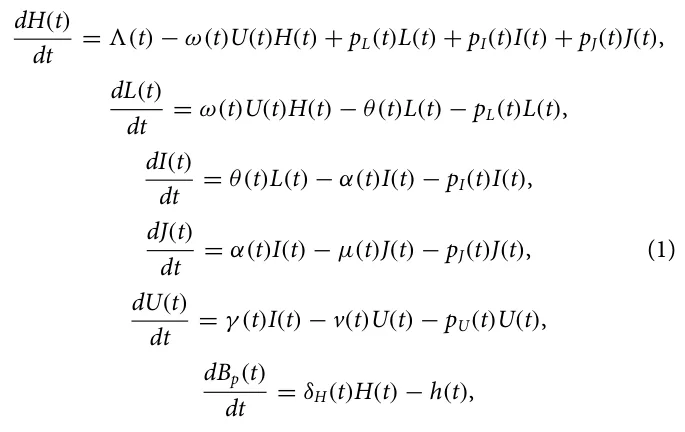

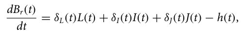

where *H*(*t*), *L*(*t*), *I*(*t*), *J*(*t*), *U*(*t*), *B*p(*t*), and *B*r(*t*) represent the number of healthy, latent, infectious and leafless branches, urediniospores, premium berries, and regular berries, respectively, at time *t*. The total quantity of branches of the tree is denoted by *N*(*t*) := *H*(*t*) + *L*(*t*) + *I*(*t*) + *J*(*t*). A schematic illustration of the tree level pandemic spread model is shown in Fig. 1. A full description of Eq. (1) is provided below.

The coffee tree is a persistent-leaved perennial plant whose annual productivity is influenced by factors such as species, cultivars, and climate conditions. The proposed model is based on the coffee leaf rust life cycle, including states of healthy, latent, infectious, and leafless branches. The evolution of the pandemic is represented by a system of ODEs, taking into account the number of branches in each epidemiological state and their interactions over time. The model represents the amount of healthy (*H*), latent (*L*), infectious (*I*), and leafless branches (*J*), as well as urediniospores (*U*), premium berries (*B*p), and regular berries (*B*r) at a given time (*t*), along with the total number of branches in the tree. The epidemiological dynamics are described in Eqs. (2)–(8).

In Eq. (2), dH(t) is the dynamic number of healthy branches. It is *dt* affected by the following five terms. First, the recruitment of healthy branches at rate 3(*t*). Second, the number of healthy branches that become latent per spore deposited, known as germination efficacy, at rate ω. Third, the impact of the PIP on latent branches, *p*L, makes them healthy again. Fourth, the impact of the pip on infectious branches, *p*I, makes them healthy again. Lastly, the impact of the pip on leafless branches, *p*J, makes them healthy again,

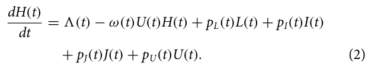

In Eq. (3), dL(t) dt is the dynamic number of the latent branches of a coffee tree. It is affected by the following three terms. First, healthy branches covered in spores change into latent branches at a rate ω(*t*). Second, latent branches become infectious at rate θ. Lastly, the impact of the PIP on latent branches, *p*L, makes them healthy again,

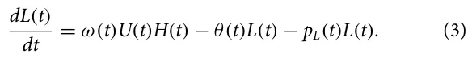

In Eq. (4), dI(t) dt is the dynamic number of infected branches of a coffee tree. It is affected by the following three terms. First, the latent branches become infectious at rate θ(*t*) where 1 θ(t) corresponds to the latency period. Secondly, infected branches become leafless at a rate of α(*t*), where 1 α(t) is the sporulation period. Lastly, the impact of the PIP on infected branches, *p*I, makes them healthy again,

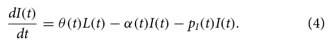

In Eq. (5), dJ(t) dt is the dynamic number of leafless branches of a coffee tree. It is affected by the following three terms. First, infected branches become leafless at a rate of α(*t*), where 1 α(t) is the sporulation period. The second factor is natural mortality, which has a baseline rate µ(*t*) for all leafless branches. Lastly, the impact of the PIP on leafless branches, *p*I, makes them healthy again,

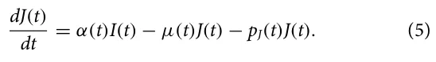

*dU*(*t*) In Eq. (6), is the dynamic number of urediniospores *dt* branches of a coffee tree. It is affected by the following three terms. First, an urediniospore branch is produced when an infection branch is present at a rate of γ . Second, urediniospore branches are deposited at a rate of *v*(*t*). Additionally, the PIP’s impact on urediniospore branches *p*U makes them healthy again,

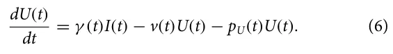

The quantity of harvested berries, *h* is also important as it is considered in the equations and it affects the total amount of berries that can be harvested, although it does not have a direct *dBp*(*t*) impact on the dynamics of premium berries. In (7), is the *dt* amount of premium berries. It is impacted by the following terms. A healthy branch creates premium berries at rate δH. Second, berries are harvested at a rate of h,

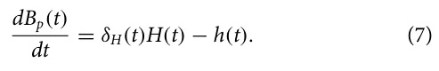

In Eq. (8), Br(t) represents the change in the number of regu- *dt* lar berries over time. This quantity is influenced by four factors: the rate at which berries are produced when branches are dormant δL, the rate at which berries are produced when branches are infected δI, the number of berries that were produced while there were leafless branches δJ, and *h* the number of berries that have already been harvested,

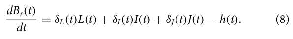

The tree level epidemiological model’s parameters and their descriptions are summarized in Table I. In addition, in the same table, the average parameter value and the corresponding source are provided.

<figure id="fig-1">
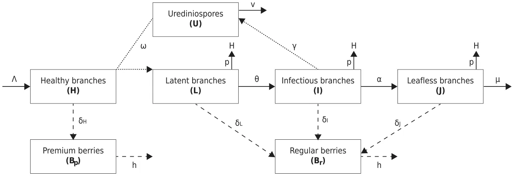
<figcaption><strong>FIG. 1.</strong> A schematic illustration of the tree level CLR spread dynamics. Solid lines indicate changes in the epidemiological state of the coffee tree’s branches. Dashed lines indicate berries production. Dotted lines indicate the production and interaction of urediniospores with the coffee tree’s branches.</figcaption>
</figure>

## 2. Farm level spread

For the farm level spread dynamics, we extended the spatiotemporal SEIS model81–83 with the following three modifications: (1) we assume that susceptible coffee trees can be added to the farm over time (as observed in Ref. 84); (2) coffee trees of all epidemiological states can die due to non-CLR-related reasons (see Ref. 85 for a discussion); and (3) exposed trees can become susceptible without becoming infection first (as noted by Longini *et al.*86). Formally, the pandemic spread at the farm level takes the form of the following system of ODEs,

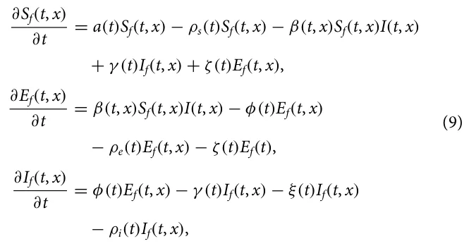

where *S*f(*t*, *x*), *E*f(*t*, *x*), and *I*f(*t*, *x*) represent the densities of susceptible, exposed, and infected coffee trees, respectively, at time *t* and location *x*. A schematic illustration of the farm level spread dynamics is provided in Fig. 2. The farm level model construction is done as follows.

<figure class="table-figure" id="table-1">
<figcaption><strong>TABLE I.</strong> Description for the parameters used in the tree level rust-pandemic spread [see Eq. (1)]. NA stands for historically or empirically non-available data that is picked for each instance separately.</figcaption>

<table><tr><th>Parameter</th><th>Biological meaning</th><th>Average value</th><th>Source</th></tr><tr><td>3</td><td>Recruitment rate (day−1)</td><td>7</td><td>24</td></tr><tr><td>ω</td><td>Inoculum effectiveness (1)</td><td>5</td><td>77</td></tr><tr><td>pL</td><td>PIP influence rate on latent branches (day−1)</td><td>NA</td><td>NA</td></tr><tr><td>pI</td><td>PIP influence rate on infected branches (day−1)</td><td>NA</td><td>NA</td></tr><tr><td>pJ</td><td>PIP influence rate on leafless branches (day−1)</td><td>NA</td><td>NA</td></tr><tr><td>θ</td><td>Infection rate (day−1)</td><td>25.5</td><td>78</td></tr><tr><td>α</td><td>Infected branches become leafless rate (day−1)</td><td>150</td><td>78</td></tr><tr><td>µ</td><td>Natural mortality rate (day−1)</td><td>0.0084</td><td>24</td></tr><tr><td>γ</td><td>Urediniospore production from infections branches rate (day−1)</td><td>10</td><td>79</td></tr><tr><td>v</td><td>Deposition rate (day−1)</td><td>0.09</td><td>79</td></tr><tr><td>pU</td><td>Urediniospore deposition rate (m2day−1)</td><td>5000</td><td>80</td></tr><tr><td>δH</td><td>Berries’ production rate by healthy branches (day−1)</td><td>0.35</td><td>24</td></tr><tr><td>δL</td><td>Berries’ production rate by latent branches (day−1)</td><td>0.25</td><td>24</td></tr><tr><td>δI</td><td>Berries’ production rate by infected branches (day−1)</td><td>0.15</td><td>24</td></tr><tr><td>δJ</td><td>Berries’ production rate by leafless branches (day−1)</td><td>0.025</td><td>24</td></tr><tr><td>h</td><td>Harvesting rate (1)</td><td>NA</td><td>NA</td></tr></table>

</figure>

*dSf*(*t*,*x*) In Eq. (10), is the dynamic density of susceptible CTs *dt* over time. It is affected by the following five terms. First, new susceptible CTs are born at rate *a*(*t*) with respect to the current amount of susceptible CTs. Second, susceptible CTs die out to non-pandemic related causes at a rate ρs(*t*). Third, susceptible CTs are infected by infectious CTs at a rate β(*t*) and become exposed. Fourth, infectious CTs are recovered with a rate γ (*t*) and become susceptible CTs. Fifth, exposed CTs can become susceptible again if their non-healthy branches are removed before becoming infectious at a rate ζ(*t*),

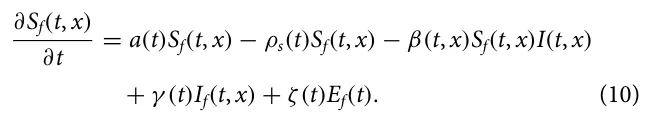

**FIG. 2.** A schematic view of the farm level CLR pandemic dynamics.

of infectious and leafless branches the infectious coffee tree has and the opposite distances between the two coffee trees. Thus, β(*t*, *x*) is defined as follows:

<figure class="table-figure" id="table-2">
<figcaption><strong>TABLE II.</strong> Description for the parameters used in the farm level rust-pandemic spread [see Eq. (9)].</figcaption>

<table><tr><th>Parameter</th><th>Biological meaning</th><th>β(t)iU</th></tr><tr><td>a ρs</td><td>Susceptible tree’s rate of birth Natural mortality rate of susceptible</td><td>β(t, x) = P s∈Sf(t,x) P i∈If(t,x) d(s,i) , (13) Sf(t, x) ∗If(t, x)</td></tr><tr><td>β</td><td>The rate at which susceptible trees are exposed to the pathogen</td><td>where d(s, i) is a metric function that gets two coffee trees on a farm and returns the distance between them (i.e., Euclidean distance), ix</td></tr><tr><td>γ ζ</td><td>The rate at which infected trees recover The rate at which exposed trees recover due to some PIP</td><td>is the x branch population of the i’s coffee tree, and β(t) is the aver- age infection rate of the pathogen at time t, changing over time due to changes in the environmental conditions. The average recovery</td></tr><tr><td>φ</td><td>The rate at which exposed trees become infectious</td><td>rate from the infection state and duration of the infectious coffee tree, γ (t), is proportional to the average amount of infectious coffee</td></tr><tr><td>ρe</td><td>Natural mortality rate of trees due to the pathogen</td><td>trees that their latent, infectious, and leafless branches are removed or recovered. Formally, γ (t) takes the form</td></tr><tr><td>ξ</td><td>The average death rate of infected trees due to the rust pandemic.</td><td>i∈If(t,x) x∈{L,I,J} ix(t) −ix(t −1)</td></tr><tr><td>ρi</td><td>Natural mortality rate of infected trees due to the pathogen</td><td>γ (t) = P P . (14) If(t, x)</td></tr></table>

</figure>

*dEf*(*t*,*x*) In Eq. (11), is the dynamic density of exposed CTs *dt* over time. It is affected by the following four terms. First, susceptible CTs are infected by infectious CTs at a rate β(*t*) and become exposed. Second, exposed CTs become infectious at a rate φ(*t*). Third, exposed CTs die out to non-pandemic related causes at a rate ρe(*t*). Fourth, exposed CTs can become susceptible again if their non-healthy branches are removed before becoming infectious at a rate ζ(*t*),

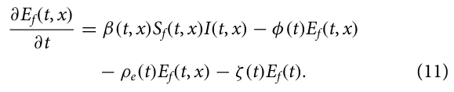

*dIf*(*t*,*x*) In Eq. (12), is the dynamic density of infectious CTs *dt* over time. It is affected by the following fourth terms. First, exposed CTs become infectious at a rate φ(*t*). Second, infectious CTs either recover or die at a rate γ (*t*). Third, infected CTs die out of non-pandemic related causes at a rate ξ. Fourth, infectious CTs die out to non-pandemic related causes at a rate ρi(*t*),

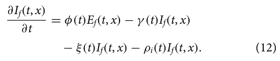

The farm level epidemiological model’s parameters and their descriptions are summarized in Table II.

Note that the coefficients of Eq. (9) strongly depend on several factors including the epidemiological states of the coffee trees on the farm, the temporal changes in the environment, and the PIPs implemented. First, the susceptible growth parameter, *a*(*t*), depends on the farmer’s decision to seed more trees as we assume minimal to no natural reproduction taking place in an organized farm.87–89 The average infection rate of the infectious coffee tree population (*I*f) to the susceptible coffee tree population (*S*f), β, is proportional to the relative infection state of the infectious tree as defined by the portion The recovery process from the exposed state is similar and, therefore, the recovery rate from the exposed state, ζ(*t*), takes the form

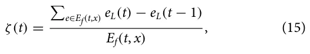

where *e*L is the number of latent branches of tree *e*. The coffee trees that do not recover during the exposed state become infected as part of their branches transform from latent to infection state. Thus, the average exposed to infection rate, φ(*t*) is defined as follows:

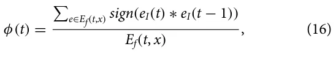

where *e*I is the number of infected branches of tree *e*. In a complementary manner, non-recovered infected coffee trees die out due to the CLR pandemic at an average rate, ξ(*t*), which depends on the amount of non-susceptible branches that coffee tree has and a threshold of the pathogen-carrying capability of the coffee tree before it dies:

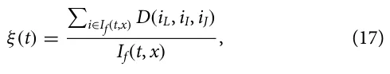

where *D* is a function that accepts the coffee tree’s number of latent, infected, and leafless branches and returns 1 if the tree dies due to the disease and 0 otherwise. Finally, *p*s, *p*e, and *p*i are the natural die-out rates of the susceptible, exposed, and infected coffee trees, respectively. These parameters are defined by natural causes not directly related to the CLR pandemic.

## 3. Ecological dynamics

The CLR spread, as well as the coffee trees’ berries production, depends on multiple environmental and climate processes.90–92 In particular, temperature, humidity, and rain are considered to be the primary ecological properties to have a direct influence on the CLR pandemic spread.6,93,94 Formally, these three processes are represented using three time-series vectors *C*T(*t*), *C*H(*t*), and *C*R(*t*), respectively.

Due to the complexity of associating these three ecological processes with the tree level CLR pandemic spread, we utilize a machine learning approach to learn the association between the two. Formally, we define a function *C* : R3 → R12 such that *C*(*C*T, *C*H, *C*R) → [λ, ω, θ, α, µ, γ , *v*, δH, δL, δI, δJ, *h*] that maps the ecological processes to the tree level parameters. Specifically, in order to obtain *C*, we used historical data from Refs. 95–97 and the *TPOT* automatic machine learning framework98 with the stratified k-fold cross-validation method.99

### C. PIPs

### B. Economical component

As discussed before, the costs of coffee fars, denoted by *TC*, can be largely classified into four main categories (see Table III): paid labor (*PL*), unpaid labor (*UL*), inputs (chemical and organic) (*IN*), and fixed costs (*FC*) such that *TC* := *FC* + *PL* + *UL* + *IN*. Notably, the first three components are depended on the number of trees on the farm. These are the basic costs, which do not take into consideration the additional cost associated with controlling a CLR outbreak. To this end, assuming that the CLR-elimination costs are only encountered if an outbreak occurs (i.e., *I*f > 0), the additional cost of controlling the pandemic, *SC* is added the total cost, *TC*, resulting in *TC* := *FC* + *PL* + *UL* + *IN* + *SC*. Specifically, *SC* is defined by the PIPs utilized by the farmer, as defined in Sec. III C.

We consider three potential PIPs: (1) spraying chemical substances,13 (2) shading,15 and (3) branch cutting.14 Technically, each of these PIPs has a scale of usage defined by a specific param-eterization space influencing both the epidemiological state of the farm and the economic state due to the cost associated with implementing each PIP. Next, we define these in detail.

The spraying chemical substances (SCS) PIP is defined by the amount of substances *c* ∈ R applied per acre and the number of acres *a* ∈ R the PIP is implemented in. The amount of substances reduces the amount of pathogen in each tree linearly at the time of implementation. Thus, Eq. (1) takes the form

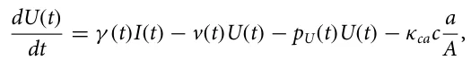

where κca ∈ R+ is the efficiency of the active material and *A* ∈ R+ is the total size of the farm. From an economic point of view, the SCS PIP has an associative cost that satisfies

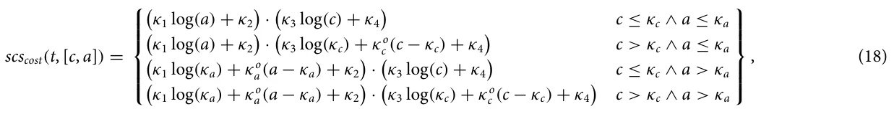

where κi ∈ R such that *i* ∈ [1, . . . , 6] ∧{*c*, *a*} are free parameters of the cost are defined by the external supply and demand over time.

The shading PIP is designed to cover the coffee tree from raindrops that carry the pathogen between the branches. As such, the shading PIP influences the function *C* through the *C*R function by reducing the average amount of *C*R with respect to the coverage in acres of the farm, *a* ∈ R+. Formally, for shading PIP with coverage *a* takes the form

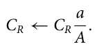

The cost associated with the shading PIP is the installation costs,

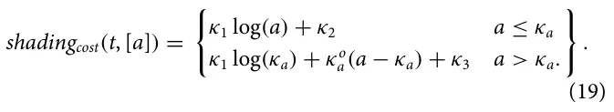

Finally, the branch cutting (BC) PIP is simply cutting ζ ∈ N branches. Initially, leafless branches are cut at random, as these are easy to detect. Afterward, if ζ is larger than the number of the leafless branches in the CT, the number of non-leafless branches is pruned at random.

Namely,

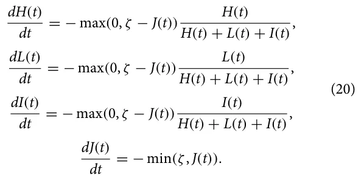

The cost associated with the BC PIP is the manpower required to cut branches across the farm’s grounds. As such, for *a* ∈ R acres and ζ cutting effort per tree, the costs take the form

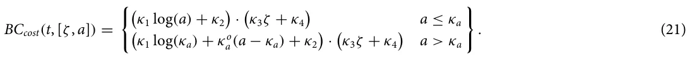

<figure class="table-figure" id="table-3">
<figcaption><strong>TABLE III.</strong> Average production costs per hectare in 2015/16 (in US$). The values are taken from Ref. 72.</figcaption>

<table><tr><th>Cost category per hectare</th><th>Value</th></tr><tr><td>Paid labor</td><td>1907.92</td></tr><tr><td>Labor pruning and weeding</td><td>245.13</td></tr><tr><td>Labor fertilizing</td><td>75.39</td></tr><tr><td>Labor spraying</td><td>48.99</td></tr><tr><td>Labor harvest</td><td>1538.41</td></tr><tr><td>Unpaid labor</td><td>586.11</td></tr><tr><td>Labor pruning and weeding</td><td>79.57</td></tr><tr><td>Labor fertilizing</td><td>27.24</td></tr><tr><td>Labor spraying</td><td>12.11</td></tr><tr><td>Labor harvest</td><td>467.19</td></tr><tr><td>Inputs</td><td>519.18</td></tr><tr><td>Herbicides</td><td>2.16</td></tr><tr><td>Pesticides</td><td>22.46</td></tr><tr><td>Fertilizer</td><td>494.57</td></tr><tr><td>Fixed costs</td><td>304.59</td></tr><tr><td>Installation costs</td><td>40.80</td></tr><tr><td>Depreciation of machinery</td><td>112.93</td></tr><tr><td>Opportunity cost of land</td><td>97.50</td></tr><tr><td>Finance cost</td><td>53.36</td></tr><tr><td>Full economic costs</td><td>3317.80</td></tr></table>

</figure>

## Iv. Simulation Implementation

To numerically solve the proposed model and evaluate the influence of the examined PIPs, we utilize the popular agent-based simulation (ABS) approach.100,101 ABS is a computational approach that is commonly used to simulate the behavior of autonomous agents within a system. In the context of botanical–epidemiological modeling, these agents represent plants within a population and their interactions with each other and with the environment. One advantage of ABS over alternative numerical approaches is that the decision-making processes and the non-symmetrical properties of individuals are easy to integrate and evaluate, making the simulation closer to realistic settings.102–104 In this section, we present the ABS implementation of the proposed epidemiological–ecological–economic model followed by the optimization of CLR control.

### A. Agent-based simulation

Each coffee tree in the population of a single coffee farm is represented by a finite state machine105 such that the coffee tree’s state is defined to be the quantities of Eq. (1) and the two-dimensional vector (*x*, *y*) denoting its location in the physical space.39 Formally, each coffee tree is represented by a tuple τ := (*H*, *L*, *I*, *J*, *U*, *B*p, *B*r, *x*, *y*).

Inspired by Shami and Lazebnik,106 we implemented the simulation as follows: The entire population follows a discrete global clock, operating in rounds *t* ∈ [1, *T*] such that *T* < ∞. At the beginning of the simulation, (*t* = 1), the population is set to an externally defined initial condition. The ecological processes, which are set as vectors of size *T*, are externally defined at the beginning of the simulation as well. At each round *t*, the following three processes take place: First, the tree level epidemiological dynamics [Eq. (1)] take place for each individual tree, followed by the farm level epidemiological dynamics [Eq. (9)], thus updating the states of the coffee trees in the population. The infection dynamics are implemented in a pair-wise manner as proposed by Lazebnik and Alexi.107 Then, any PIP(s) chosen for implementation are applied as discussed in the following. Finally, the accumulative profit is updated.

### B. CLR control

Recall that a coffee farm may change the implemented PIP at any point in time. As such, to allow for adjustable PIPs to be implemented, we consider the farmer’s decision-making process as Markov Decision Process (MDP)108 over *T* rounds. Specifically, at each time step *t*, a given state is observed which consists of the following information: the simulation’s state at round *t*, the number of available money for PIPs implementation at round *t*, an estimated vector of the ecological factors (*C*T, *C*H, *C*R), donated by (*C*′ T, *C*′ H, *C*′ R) of size ψ > 0 for the duration [*t*, *t* + ψ] such that ∀*i*, *j* ∈ [*t*, *t* + ψ] ∧ *a* ∈ [*T*, *H*, *R*] : *i* ≤ *j* ↔||*C*′ a(*i*) − *C*a(*i*)|| ≤||*C*′ a(*j*) − *C*a(*j*)||. The farmer then needs to choose an action, with the action space consists of all combinations of the three examined PIPs (see Sec. III C), as defined by their combined parameter space. The farmer seeks to maximize the following multi-objective reward function:

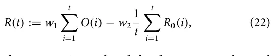

where *O*(*t*) is the economic profit of the farm at round *t* and *R*0 := *I*(*t*) − *I*(*t* − 1) + *R*(*t*) − *R*(*t* − 1) /*I*(*t* − 1) is the reproduction number of the CLR pandemic at round *t*.109–113 In addition, *w*1, *w*2 ∈ R+ are the weights that balance the importance of each element. Lastly, the transition function follows the ecological–epidemiological dynamics outlined above.

We approximate the optimal PIP policy using a deep reinforcement learning (DRL) agent. To train the agent, we used the ABS-RL simulated reinforcement learning (SiRL) approach proposed by114 with a wide range of initial conditions, ecological dynamics, and parameters. The agent gets as input the epidemiological state of the farm, the amount of available funds for CLR control, and the time (in days) until the end of the year. It then returns the parameters of each PIP as an action. Complete details on the DRL agent’s training process are provided in the supplementary code.

It is important to note that the epidemiological state of the farm can be obtained using one of two options: First, in the *Fully observable pandemic* option, the states are obtaining accurate information on the epidemiological state of the farm. Second, in an α*-Partial observable pandemic* option, each state is randomly sampling from its coffee tree population at a portion α and estimating the overall epidemiological state accordingly. The first and second options naturally converge for α = 1. Since farmers are not able to sample or monitor all of their trees at each point in time or even the majority thereof, 0 < α << 1 seems to be a realistic setting, making the first and second options significantly different.

## V. Analysis

In this section, use the proposed model and simulation outlined above to analyze the case of small coffee farms in Colombia. Recall that Colombia is the second largest producer of coffee worldwide and consists mostly of small coffee farms. We first outline the epidemiological, ecological, and economic parameter values used in our analysis, which are based on historical records and data from prior literature. Next, we conduct three levels of analysis: baseline dynamics, parameter sensitivity, and optimal control. That is, we first establish the epidemiological and economic consequences of untreated coffee farms. Second, we determine the connection between several central parameters used by the model and the coffee farm’s outputs. Finally, we estimate the ability of a farmer to sustain profit by implementing an intelligent CLR control policy.

### A. Setup

In Colombia, coffee has around an 8-month growing season depending on the ecological parameters during this time. It usually takes around four months to fully harvest a coffee farm, and coffee trees are harvested once per year (https://easyhomecoffee.

com/does-coffee-grow-all-year-round/). As such, we define a step in time to be δ*t* = 1 day and *T* = 365 days = 1 year. In particular, we assume that at *t*h = 275 the harvesting is beginning and the harvesting is equally distributed across *T*h = 90 days (i.e., three months), as usually the first month considered phase transfer and less actual harvesting is taken place relative to the remaining of this phase. While other countries and regions are expected to have similar coffee growth cycles, these are very sensitive to environmental differences that should be accounted for in the analysis. We plan to consider additional countries and regions for analysis in future work.

In order to capture the CLR pandemic spread rate, we use the basic reproduction number metric.110 In a complementary manner, to measure the economic dynamics over time, we use the normalized economic output metric, defined by *O*(*t*)/*O*(0).

## 1. Epidemiological settings

In order to use the epidemiological component of the model, the mean parameter values are taken from prior literature, as summarized in Table I. According to the Colombian Coffee Growers Federation, Colombian coffee production has 5243 coffee trees per hectare and productivity of 21.4 bags of 60 kg of coffee beans per hectare, assuming none of the coffee trees is infected by the CLR pandemic. We used these numbers to extrapolate the coffee berries’ average growth rate (https://federaciondecafeteros.org/wp/coffee-statistics/?lang=en).

## 2. Ecological settings

The weather over time, *C*(*t*), can be either perfectly known to the farm owner or predicted using some forecasting model. As such, we define the *Fully observable weather* and the *Model-based weather* cases, respectively. In particular, we use a weather forecasting model, which follows a standard SARIMA model115 that is trained on the real daily weather (i.e., temperature, humidity, and rains) data of Colombia for the years 2011–2021 (the data are obtained from https://www.meteoblue.com/en/weather/archive/climatePrediction s/colombia\_colombia\_3686120).

## 3. Economic settings

The scale economy occurs in the segment where the costs behave according to the concavity property. One aspect of scale economies is the “0.6 rule.”116 This rule refers to the relationship between the increase in production cost *TC* and the increase in production volume *v* ∈ *V* given by (*TC*v/*TC*v+1) = (*Q*v/*Q*v+1)α, where α denotes the scale coefficient. A value of α less than unity implies increasing returns to scale. The value of α = 0.6 is often used as a rule of thumb to obtain the cost of a volume level *Q*v+1 given the cost *TC*v associated with the level of capacity *Q*v. The “0.6 rule” states that when the volume level is raised, the cost associated with the new level is less than the cost of the previous level, implying that there are cost savings from increasing capacity. This rule of thumb is a common way to estimate the cost of expanding capacity, based on the idea that when capacity is increased, the cost of the additional capacity decreases due to economies of scale. This is because, when the capacity level is increased, the fixed costs associated with higher capacity are spread out over more units of production.

At the end of 2019, the value of the coffee crop was 7.2 trillion pesos (i.e., $2.2 billion in the average exchange rate of the same year) (https://federaciondecafeteros.org/wp/listado-not icias/colombian-coffee-production-closed-2019-at-14-8-million-bags/?lang=en). Hence, if we consider the increase in costs of moving from one to two hectares, assuming that the cost shown in Table III is for the first hectare, and the amount of coffee bags will increase from 21.4 to 42.8, when the scale coefficient α is 0.6, we will get [according to the rule (*TC*v/*TC*v+1) = (*Q*v/*Q*v+1)α] that the total cost will increase by $11711 to reach $5028.8. However, these costs are only correct for a season without a CLR outbreak. In that case, it is required to add to the cost to include CLR elimination costs. According to Aristizabal and Johnson,117 this cost ranges between USD 90 and 472/acre, with the cost of labor ranging from USD 15 to 20/h using a backpack sprayer to USD 40/h using a tractor sprayer. The cost of monitoring CLR across the entire season is USD 150–175 based on 6–7 CLR surveys at a cost of USD 25/h. For the full coffee season, the total cost to manage CLR ranged between USD 450 and 1167 per acre (0.4 hectare). However, these costs are for Hawaii (USA). If we use the ratio between the GDP per capita between Colombia and the United States as a measure of the price differences, we will get a ratio of 8.7% (https://data.worldbank.org/indicator/NY.GDP.PCAP.CD?location s=CO). Hence, the costs in Colombia are presumed to vary between USD 39 and 102 per acre, which is USD 98–255 per hectare. For simplicity, we assume that the maximum amount is for one hectare and that the cost will decrease linearly with a factor USD 2.5 as we increase the number of hectares up to the given minimum of USD 98 per hectare.

According to Fedecafe (https://federaciondecafeteros.org/), there are nearly 543,000 coffee-growing families in Colombia. Of these, 96% are small (with less than 5 hectares of land), 3% are considered medium (between 5 and 10 hectares), and 1% are large (more than 10 hectares). (In recent years, large foreign investors have begun producing coffee in Colombia, purchasing thousands of hectares of land for production, so these figures may change in the foreseeable future.)

According to the U.S. Department of Agriculture (USDA) (https://apps.fas.usda.gov/newgainapi/api/Report/DownloadReport ByFileName?fileName=Coffee%20Annual\_Bogota\_Colombia\_CO2 022-0010.pdf), in 2021 planting density stands at 5268 trees per hectare, with productivity of 19.3 green bean equivalent (GBE) bags per hectare, while Colombia’s current total productivity potential is estimated at 14.7 × 106 bags with an average of around 14 × 106 bags during the last few years. Coffee bean exports represent over 90% of total Colombian exports followed by soluble coffee and roasted coffee. More disaggregated categories, such as the specific labor task and type of input, are also provided. When all economic costs are considered, average costs per hectare in 2015/16 were US$3,318. Of this total, 57% (US$1,908) correspond to hired labor, 18% (US$586) to unpaid labor, 16% (US$519) to inputs, and 9% (US$305) to fixed costs. Table III summarizes the full economic costs.

In Columbia, the National Coffee Growers Committee (FNC) (https://thosecoffeepeople.com/how-much-are-green-coffee-beans/) is in charge of selling the majority of commercial coffee crops, and it sets the price of coffee “per carga.” This term is used to refer to 125 kg of parchment, pre-dry mill, presuming the coffee is in perfect condition. While the per carga green coffee price fluctuates in line with the market, at the time of writing, the domestic reference price currently stands at 2.160 Colombian pesos (approximately $440.43 USD). However, these prices are just for standard coffee if a co-op buys directly from producers in towns, not providing any bonuses for the quality of the coffee. For high-scoring specialty coffees, their prices are based on quotes obtained from producers where a margin of between 10% and 30% on top of the per carga price is added. Producers calculate these prices by factoring in operational costs, and the costs of research and development (more advanced coffee processes require many experiments to perfect). However, for low-grade coffee beans, the price for 125 kg is $60.000 Colombian pesos (approximately $12.23 USD).

### B. Baseline dynamics

To start, we simulate the epidemiological and economic dynamics of the coffee farm over one season with the CLR pandemic. Using *n*f = 100 different farms, which differ in their size, tree density, and the initial amount of funds, we computed *n*i = 100 simulations each such that each one differs due to the stochastic nature of the simulation. The initial condition for the epidemiological model is set to agree with.24 Figure 3 for each farm using the method proposed by Lazebnik.118 In total, *n* = *n*f · *n*i = 10 000 simulations are computed to capture as representative a set as possible. Figure 3 summarizes the results where the x-axis is the time from the beginning of the simulation, starting at the end of the harvesting of the previous season. The left y-axis of the red line indicates the reproduction number (*R*0(*t*)) and the right y-axis of the blue line indicates the normalized economic output (*O*(*t*)/*O*(0)). Recall that in this analysis, it is assumed that the farm owner does not implement any PIP to tackle the CLR pandemic.

One can observe that the economic output is linearly decreasing during the coffee tree growth phase as the expenses are assumed to be equally distributed. During the harvesting phase, where the coffee is sold, the economic output is increasing sub-linearly (i.e., at a rate that is less than a linear one to the source variable). Without a pandemic, the increase at this phase is linear due to the assumption the harvesting occurs at a fixed rate. However, the dead or CLR-infected trees infected during this phase reduce over time across the linear harvesting, resulting in sub-linear dynamics. One can notice that at the lowest point, the economic output reaches −0.96, which means that only 4% of the initial funds are available at that time. Moreover, at *t* = *T*, the economic output is around −8.5% compared to *O*(*o*) which means that the farmer loses substantial money at the end of the season and cannot support the business without external help or loans. In a complementary manner, the basic reproduction number reveals an oscillating behavior due to the combined influence of the ecological signals which have such dynamics. In addition, during the dry time of the year (from roughly April to October), the basic reproduction is on average lower than that of the rainy time of the year (from roughly October to April).

<figure id="fig-3">
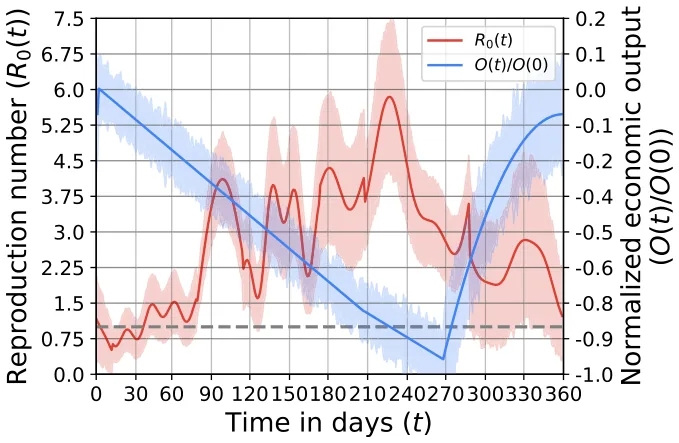
<figcaption><strong>FIG. 3.</strong> Baseline dynamics of the epidemiological and economic processes in a single season (one year) without any CLR control measures. The results are shown as the mean ± standard deviation result of <em>n</em> = 10 000 repetitions divided into 100 unique farms and 100 interactions for each farm.</figcaption>
</figure>

### C. Optimal CLR control

To study the ability of a DRL agent to perform optimally pandemic control given limited funding, we trained the agent on *n*train = 10 000 random simulations, each time with a different action space configuration as detailed next. Then, we compared the results of all agents on the same *n*eval = 100 farms, reporting the results as mean ± standard deviation of the normalized season profit (NSP) such that *NSP* := O(t)−O(0) . We repeat this entire process for three *O*(0) different configurations. First, with a fully observable pandemic and fully observable weather. Second, with a fully observable pandemic and model-based weather. Finally, with a α-partial observable pandemic and Model-based weather, where α = 0.05. For comparison, we explore seven configurations. A “baseline” configuration where no PIPs are utilized, a “Random” configuration where PIPs are utilized at random (i.e., not using the DRL agent), a “only SCS,” “only shading,” and “only BC” configurations where the DRL agent is able to use only the SCS, shading, and BC, respectively. The “SCS + shading” configuration stands for the case where the DRL agent is able to utilize both the SCS and shading PIPs. Finally, the “General” configuration stands for the case where the DRL agent is able to utilize all three PIPs. Figure 4 shows the results of this analysis, divided into three cases. Importantly, one can notice that for the last case (c), which is presumably the most realistic one, the average NSP is negative for all action space configurations.

<figure id="fig-4">
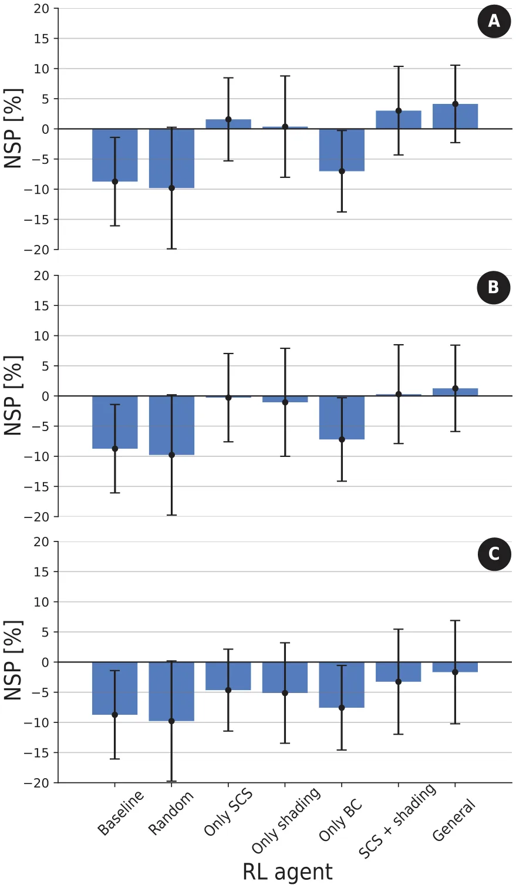
<figcaption><strong>FIG. 4.</strong> A comparison of the obtained NSP for several different PIP configurations implemented by the DRL agent. The results are shown as the mean ± standard deviation result of <em>n</em> = 100 repetitions. (a) Fully observable pandemic and fully observable weather. (b) Fully observable pandemic and Model-based weather. (c) α-Partial observable pandemic and model-based weather, where α = 0.05.</figcaption>
</figure>

<figure id="fig-5">
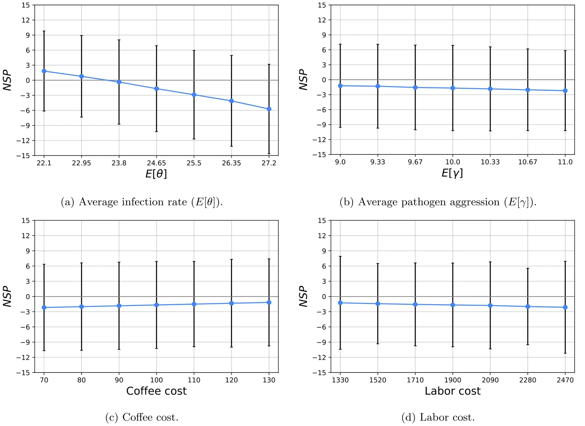
<figcaption><strong>FIG. 5.</strong> Sensitivity analysis of the NSP with respect to the main epidemiological and economic properties of the system. The results are shown as mean ± standard deviation of <em>n</em> = 100 repetitions for the case of α-partial (α = 0.05) observable pandemic and model-based weather DRL agent. (a) Average infection rate (<em>E</em>[θ]). (b) Average pathogen aggression (<em>E</em>[γ ]). (c) Coffee cost. (d) Labor cost.</figcaption>
</figure>

### D. Sensitivity analysis

In order to evaluate the influence of the epidemiological and economic dynamics on the farmer’s NSP, we computed the model’s sensitivity under the realistic assumption of α-Partial observable pandemic and model-based weather agent, where α = 0.05. To this extent, we tested the average infection rate, average pathogen aggression, coffee cost, and labor cost as presented in Sec. V D, where the x-axis is the parameters’ values and the y-axis is the NSP. The results are shown as mean ± standard deviation of *n* = 100 different coffee farms. We determine the ranges of the parameters’ values as follows. For the epidemiological parameters, we used 10% inspired by Lazebnik.39 The economic parameters values are based on the prices of a carga (125 kg bag of green coffee) between August 2021 and August 2022 the last month for which data were found on the website of the National Coffee Growers Committee [Coffee Statistics - Federación Nacional de Cafeteros (federaciondecafeteros.org)], the monthly price change ranges from a 10% decrease to a 12% increase. Furthermore, and in recognition of the importance of labor cost to profit, we will examine changes in the cost of employing workers within a range of 10% yearly change. The base cost of $1907.92 is taken from Table III.

## Vi. Discussion and Conclusions

In this study, we have developed a high-resolution mathematical model and a respective simulation to analyze whether an effective CLR management policy could bring about sustainable profit for small-size coffee farmers. Our analysis, which is based on real-world data, prior literature, and advanced modeling and optimization techniques, suggests that the answer is, unfortunately, mostly negative.

Starting with a baseline analysis, our analysis established a connection between the pandemic’s spread over time and its influence on the economic output. On average, Fig. 3 shows that if farmers do not implement any CLR management at all, they lose around 8.5% of their funds on average. In this scenario, 87% of the farmer will not even break even at the end of the year. These results seem to align with historical data.24,80

When an advanced artificially intelligent agent is adopted for optimizing the economic outcomes by implementing a CLR management policy in a realistic setting, most farmers remain in losses, as shown in Fig. 5, panel (c). In the hypothetical settings where one can fully observe the epidemiological state and/or perfectly predict the temporal environmental dynamics, the agent can bring about some, albeit minor, profit when using all three PIPs, as shown in panels (a) and (b). Based on a sensitivity analysis, our main results seem to be robust with reasonable parameter changes.

Taken together, our alarming results should be considered by farmers and other stakeholders as a call for action. Specifically, according to World Coffee Research, 1.7 × 106 coffee workers lost their jobs due to CLR pandemic thus far. Our analysis seems to indicate that this is not a passing phase but, in fact, there is an inherently complex issue in the current economical–epidemiological dynamics underlying the existing coffee market. Without direct action, small-size coffee farms will likely collapse.

Nonetheless, the proposed model is not without limitations. Unlike most cases in reality, we assume that farmers finance the cost of the PIPs from their available money and do not obtain loans or financial aid from the government. Therefore, in future work, one can introduce additional factors such as budgets, taxes, and interest to make the model even more realistic and include a more rigorous economic model that includes several types of players with different objectives and action spaces.106 In addition, recent developments in more rust-resistant coffee trees can significantly change the spread of the CLR pandemic. Taking into consideration the different coffee tree types and their relevant properties will allow one to investigate this novel course of action. Another possible extension of the proposed model is to integrate more sophisticated sampling strategies compared to the random sample of the population we used.119 In addition, this study focuses on a CLR of a single season (or year). However, PIPs applied in one year can have a significant effect on years to follow. Hence, exploring the effect of extending the simulation for multi-year and multi-farm settings may shed more light on the CLR pandemic dynamics. Finally, the pathogen at the root of the CLR pandemic naturally mutates, such as other pathogens which results in a multi-strain botanical pandemic. Extending the proposed epidemiological sub-model proposed in this work to describe multi-strain or even multi-mutation dynamics such as Lazebnik and Blumrosen,120 would result in a more realistic representation of the modern rust pandemic. Furthermore, as this study focuses on the economic aspects of CLR management, it neglects the socio-cultural aspects such as farmer education, local practices, and community cooperation which play a significant role in the farm owners to deal with CLRs. Future work should also consider to include these factors. Finally, as the obtained results are not linearly scalable, bigger farms do not necessarily mean that the results will be similar or even in the same direction of change. Hence, an investigation into other market settings necessitates the re-configuration and analysis of the proposed model.

## Author Declarations

## Conflict of Interest

The authors have no conflicts to disclose.

## Author Contributions

**Teddy Lazebnik:** Conceptualization (equal); Data curation (equal); Formal analysis (equal); Investigation (equal); Methodology (equal); Project administration (equal); Software (equal); Visualization (equal); Writing – original draft (equal). **Ariel Rosenfeld:** Validation (equal); Writing – review & editing (equal). **Labib**

**Shami:** Conceptualization (equal); Data curation (equal); Methodology (supporting); Writing – original draft (supporting).

## Data Availability

All the data used as part of this research are publicly available and the relevant sources are cited.

## References

- 1M. Pendergrast, Uncommon Grounds: The History of Coffee and How It Transformed Our World (Basic Books, 2010). 2M. Hirons, Z. Mehrabib, T. A. Gonfac, A. Morelad, T. W. Golec, C. McDer-motta, E. Boyde, E. Robinsonf, D. Shelemec, Y. Malhia, J. Masong, and K. Norrisc, “Pursuing climate resilient coffee in Ethiopia—A critical review,” Geoforum 91, 108–116 (2018). 3Specialty Coffee Association, see https://static1.squarespace.com/static/584f6b bef5e23149e5522201/t/5ebd4d5f1e9467498632e0b8/1589464434242/AW\_SCA\_ PCR\_Report2020+-+December+2019+-+Update+May+2020.pdf for “Price Crisis Response Initiative: Summary of Work” (2019). 4S. Geiger-Oneto and E. J. Arnould, “Alternative trade organization and subjective quality of life: The case of Latin American coffee producers,” J. Macromark. 31(3), 276–290 (2011). 5R. Negash, “Impact of fair-trade coffee certification on smallholder producers: Review papers,” Glob. J. Manag. Bus. Res. 16(5), 33–39 (2016), see https://journalofbusiness.org/index.php/GJMBR/article/view/2020/4-Impact-of-Fair-Trade-Coffee\_JATS\_NLM\_xml.6J. Avelino, M. Cristancho, S. Georgiou, P. Imbach, L. Aguilar, G. Bornemann, P. Laderach, F. Anzueto, A. J. Hruska, and C. Morales, “The coffee rust crises in Colombia and Central America (2008-2013): Impacts, plausible causes and proposed solutions,” Food Secur. 7, 303–321 (2017). 7C. Bilen, D. El Chami, V. Mereu, A. Trabucco, S. Marras, and D. Spano, “A systematic review on the impacts of climate change on coffee agrosystems,” Plants 12(1), 102 (2023). 8K. Sarirahayu and A. Aprianingsih, “Strategy to improving smallholder coffee farmers productivity,” Asian J. Technol. Manag. 11(1), 1–9 (2018), see https://core.ac.uk/download/pdf/304293500.pdf.9R. Villarreyna, M. Barrios, S. Vilchez, R. Cerda, R. Vignola, and J. Avelino, “Economic constraints as drivers of coffee rust epidemics in nicaragua,” Crop Prot. 127, 104980 (2020). 10J. Kolmer, M. Ordonez, and J. Groth, “The rust fungi,” in eLS (John Wiley & Sons, Ltd., 2009). 11D. Batista, L. Guerra-Guimaraes, P. Talhinhas, A. Loureiro, D. A. Silva, L. Gonzalez, A. P. Pereira, A. Vieira, H. Azinheira, C. Struck, O. S. Paulo, and V. Varzea, “Analysis of population genetic diversity and differentiation in Hemileia vastatrix by molecular markers,” in 23rd International Conference on Coffee Science (Asic, 2010), pp. 3–8, see https://www.asic-cafe.org/conference/23rd-international-conference-coffee-science/analysis-population-genetic-diversity-and. 12E. Millard, “Value creation for smallholders and SMEs in commodity supply chains,” Enterp. Dev. Microfinance 28, 63–81 (2017). 13A. F. de Souza, L. Zambolim, V. C. de Jesus Junior, and P. R. Cecon, “Chemical approaches to manage coffee leaf rust in drip irrigated trees,” Australas. Plant Pathol. 40, 293–300 (2011). 14S. J. Martins, A. C. Soares, F. H. V. Medeiros, D. B. C. Santos, and E. A. [doi:10.1016/j.geoforum.2018.02.032](https://doi.org/10.1016/j.geoforum.2018.02.032) · [link](https://static1.squarespace.com/static/584f6bbef5e23149e5522201/t/5ebd4d5f1e9467498632e0b8/1589464434242/AW_SCA_PCR_Report2020+-+December+2019+-+Update+May+2020.pdf) · [link](https://journalofbusiness.org/index.php/GJMBR/article/view/2020/4-Impact-of-Fair-Trade-Coffee_JATS_NLM_xml)
- Pozza, “Contribution of host and environmental factors to the hyperparasitism of coffee rust under field conditions,” Australas. Plant Pathol. 44, 605–610 (2015). 15L. Soto-Pinto, I. Perfecto, and J. Caballero-Nieto, “Shade over coffee: Its effects on berry borer, leaf rust and spontaneous herbs in Chiapas, Mexico,” Agrofor. Syst. 55, 37–45 (2002). 16V. Valencia, L. Garcia-Barrios, E. J. Sterling, P. West, A. Meza-Jimenez, and S. Naeem, “Smallholder response to environmental change: Impacts of coffee leaf rust in a forest frontier in Mexico,” Land Use Policy 79, 463–474 (2018). 17J. A. M. Bedimo, I. Njiayouom, D. Bieysse, M. N. Nkeng, C. Cilas, and J. L. Not-téghem, “Effect of shade on arabica coffee berry disease development: Toward an agroforestry system to reduce disease impact,” Phytopathology 98(12), 1320–1325 (2008). 18K. Austin, “Coffee exports as ecological, social, and physical unequal exchange: A cross-national investigation of the java trade,” Int. J. Comp. Sociol. 53(3), 155–180 (2012). 19D. Nestel, “Coffee in Mexico: International market, agricultural landscape and ecology,” Ecol. Econ. 15(2), 165–178 (1995). 20C. L. R. Vegro and L. F. de Almeida, “Chapter 1—Global coffee market: Socioeconomic and cultural dynamics,” in Coffee Consumption and Industry Strategies in Brazil, edited by Luciana Florencio de Almeida and Eduardo Eugenio Spers (Woodhead Publishing, 2020), pp. 3–19. 21K. Watson and M. L. Achinelli, “Context and contingency: The coffee crisis for conventional small-scale coffee farmers in Brazil,” Geogr. J. 174(3), 223–234 (2008). 22J. Arroyo-Esquivel, F. Sanchez, and L. A. Barboza, “Infection model for analyzing biological control of coffee rust using bacterial anti-fungal compounds,” Math. Biosci. 307, 13–24 (2019). 23N. E. T. Castillo, Y. A. Acosta, L. Parra-Arroyo, M. A. Martinez-Prado, V. M. Rivas-Galindo, H. M. N. Iqbal, A. D. Bonaccorso, E. M. Melchor-Martinez, and R. Parra-Saldivar, “Towards an eco-friendly coffee rust control: Compilation of natural alternatives from a nutritional and antifungal perspective,” Plants 11, 2745 (2022). 24C. Djuikem, F. Grognard, R. T. Wafo, S. Touzeau, and S. Bowong, “Modelling coffee leaf rust dynamics to control its spread,” Math. Model. Nat. Phenom. 16, 26 (2021). 25Y. Herskowitz, S. Bunimovich-Mendrazitsky, and T. Lazebnik, “Mathematical model of coffee tree’s rust control using snails as biological agents,” BioSystems 229, 104916 (2023). 26J. Kranz, Epidemics of Plant Diseases: Mathematical Analysis and Modeling (Springer Science & Business Media, 2012), Vol. 13. 27J. Miller, T. M. Burch-Smith, and V. V. Ganusov, “Mathematical modeling suggests cooperation of plant-infecting viruses,” Viruses 14(4), 741 (2022). 28N. Tromas, M. P. Zwart, G. Lafforgue, and S. F. Elena, “Within-host spatiotemporal dynamics of plant virus infection at the cellular level,” PLoS Genet. 10(2), e1004186 (2014). 29E. S. Allman, E. S. Allman, and J. A. Rhodes, Mathematical Models in Biology (Cambridge University Press, 2004). 30M. Donatelli, R. D. Magarey, S. Bregaglio, L. Willocquet, J. Whish, and S. Savary, “Modelling the impacts of pests and diseases on agricultural systems,” Agric. Syst. 155, 213–224 (2017). 31P. K. Shaw, S. Kumar, S. Momani, and S. Hadid, “Dynamical analysis of fractional plant disease model with curative and preventive treatments,” Chaos, Solitons Fractals 164, 112705 (2022). 32R. A. Taylor, E. A. Mordecai, C. A. Gilligan, J. R. Rohr, and L. R. Johnson, “Mathematical models are a powerful method to understand and control the spread of Huanglongbing,” PeerJ 4, e2642 (2016). 33N. J. Cunniffe, R. O. J. H. Stutt, R. E. DeSimone, T. R. Gottwald, and C. A. Gilligan, “Optimising and communicating options for the control of invasive plant disease when there is epidemiological uncertainty,” PLoS Comput. Biol. 11(4), e1004211 (2015). 34C. A. Gilligan, S. Gubbins, and S. A. Simons, “Analysis and fitting of an sir model with host response to infection load for a plant disease,” Philos. Trans. R. Soc. London. Ser. B: Biol. Sci. 352(1351), 353–364 (1997). 35M. Meyer, J. A. Cox, M. D. T. Hitchings, L. Burgin, M. C. Hort, D. P. Hod-son, and C. A. Gilligan, “Quantifying airborne dispersal routes of pathogens over continents to safeguard global wheat supply,” Nat. Plants 3(10), 780–786 (2017). 36W. O. Kermack and A. G. McKendrick, “A contribution to the mathematical theory of epidemics,” Proc. R. Soc. 115, 700–721 (1927). 37N. Anggriani, M. Yusuf, and A. K. Supriatna, “The effect of insecticide on the vector of rice Tungro disease: Insight from a mathematical model,” Int. Inf. Inst. (Tokyo). Inf. 20(9A), 6197–6206 (2017), see https://www.researchgate.net/publication/322770380\_The\_effect\_of\_insecticide\_on\_the\_vector\_of\_rice\_Tungro\_disease\_Insight\_from\_a\_mathematical\_model.38J. C. Marques, A. Cezaro, and M. J. Lazo, “A SIR model with spatially distributed multiple populations interactions for disease dissemination,” Trends Comput. Appl. Math. 23, 143–154 (2022). 39T. Lazebnik, “Cost-optimal seeding strategy during a botanical pandemic in domesticated fields,” Chaos 34, 033128 (2024). 40M. Martcheva, “A non-autonomous multi-strain SIS epidemic model,” J. Biol. Dyn. 3(2–3), 235–251 (2009). 41T. Abraha, F. Al Basir, L. L. Obsu, and D. F. M. Torres, “Pest control using farming awareness: Impact of time delays and optimal use of biopesticides,” Chaos, Solitons Fractals 146, 110869 (2021). 42E. A. Ampt, J. van Ruijven, M. P. Zwart, J. M. Raaijmakers, A. J. Termor-shuizen, and L. Mommer, “Plant neighbours can make or break the disease transmission chain of a fungal root pathogen,” New Phytol. 233(3), 1303–1316 (2022). 43D. P. Bebber, T. Holmes, and S. J. Gurr, “The global spread of crop pests and pathogens,” Glob. Ecol. Biogeogr. 23(12), 1398–1407 (2014). 44J. A. Bruhn and W. E. Fry, “Analysis of potato late blight epidemiology by simulation modeling,” Phytopathology 71(6), 612–616 (1981). 45M. A. Cristancho, Y. Rozo, C. Escobar, C. A. Rivillas, and A. L. Gaitan, “Outbreak of coffee leaf rust (Hemileia vastatrix) in Colombia,” New Dis. Rep. 25(19), 2044–0588 (2012). 46E. M. Del Ponte, C. V. Godoy, M. G. Canteri, E. M. Reis, and X. B. Yang, “Models and applications for risk assessment and prediction of Asian soybean rust epidemics,” Fitopatol. Bras. 31, 533–544 (2006). 47F. Fabre, J. B. Burie, A. Ducrot, S. Lion, Q. Richard, and R. Djidjou-Demasse, “An epi-evolutionary model for predicting the adaptation of spore-producing pathogens to quantitative resistance in heterogeneous environments,” Evol. Appl. 15(1), 95–110 (2022). 48C. Ferris and A. Best, “The effect of temporal fluctuations on the evolution of host tolerance to parasitism,” Theor. Popul. Biol. 130, 182–190 (2019). 49T. Lazebnik, S. Bunimovich-Mendrazitsky, S. Ashkenazi, E. Levner, and A. Benis, “Early detection and control of the next epidemic wave using health communications: Development of an artificial intelligence-based tool and its validation on COVID-19 data from the US,” Int. J. Environ. Res. Public Health 19, 16023 (2022). 50T. Lazebnik, S. Bunimovich-Mendrazitsky, and L. Shaikhet, “Novel method to analytically obtain the asymptotic stable equilibria states of extended SIR-type epidemiological models,” Symmetry 13, 1120 (2021). 51N. Motisi, J. Papaix, and S. Poggi, “The dark side of shade: How microclimates drive the epidemiological mechanisms of coffee berry disease,” Phytopathology 112(6), 1235–1243 (2022). 52R. M. Nair, V. N. Boddepalli, M. -R. Yan, V. Kumar, B. Gill, R. S. Pan, C. Wang, G. L. Hartman, R. Silva e Souza, and P. Somta, “Global status of vegetable soybean,” Plants 12(3), 609 (2023). 53B. Quetglas, D. Olmo, A. Nieto, D. Borràs, F. Adrover, A. Pedrosa, A. Mon-tesinos, J. de Dios Garcia, M. Lòpez, A. Juan, and E. Moralejo, “Evaluation of control strategies for xylella fastidiosa in the balearic islands,” Microorganisms 10(12), 2393 (2022). 54D. R. A. Sanya, S. F. Syed-Ab-Rahman, A. Jia, D. Onésime, K. Kim, B. C. Aho-huendo, and J. R. Rohr, “A review of approaches to control bacterial leaf blight in rice,” World J. Microbiol. Biotechnol. 38(7), 113 (2022). 55A. Tschanz and S. Shanmugasundaram, “Soybean rust,” in World Soybean Research Conference III: Proceedings (CRC Press, 2022), pp. 562–567. 56L. Yu, C. Yang, Z. Ji, Y. Zeng, Y. Liang, and Y. Hou, “First report of new bacterial leaf blight of rice caused by pantoea ananatis in Southeast China,” Plant Dis. 106(1), 310 (2022). 57J. Avelino, M. Cristancho, S. Georgiou, P. Imbach, L. Aguilar, B. Gustavo, P. Laderach, F. Anzueto, A. J. Hruska, and C. Morales, “The coffee rust crises in Colombia and Central America (2008–2013): Impacts, plausible causes and proposed solutions,” Food Secur. 7, 303–321 (2015). 58D. C. Corrales, A. Figueroa, A. Ledezma, and J. C. Corrales, “An empirical multi-classifier for coffee rust detection in Colombian crops,” in Computational Science and Its Applications–ICCSA 2015: 15th International Conference, Banff, AB, Canada, June 22-25, 2015, Proceedings, Part I 15 (Springer, 2015), pp. 60–74. 59N. Motisi, F. Ribeyre, and S. Poggi, “Coffee tree architecture and its interactions with microclimates drive the dynamics of coffee berry disease in coffee trees,” Sci. Rep. 9(1), 2544 (2019). 60D. C. Corrales, A. F. Casas, A. Ledezma, and J. C. Corrales, “Two-level classifier ensembles for coffee rust estimation in Colombian crops,” Int. J. Agric. Environ. Inf. Syst. 7(3), 41–59 (2016). 61R. N. Thompson and E. Brooks-Pollock, “Detection, forecasting and control of infectious disease epidemics: Modelling outbreaks in humans, animals and plants,” Philos. Trans. R. Soc. B: Biol. Sci. 374(1775), 20190038 (2019). 62A. S. Capucho, L. Zambolim, U. N. Lopes, and N. S. Milagres, “Chemical control of coffee leaf rust in coffea canephora cv. conilon,” Austral. Plant Pathol 42, 667–673 (2013). 63K. Belachew, G. A. Senbeta, W. Garedew, R. W. Barreto, and E. M. Del Ponte, “Altitude is the main driver of coffee leaf rust epidemics: A large-scale survey in Ethiopia,” Trop. Plant Pathol. 45, 511–521 (2020). 64F. M. DaMatta, “Ecophysiological constraints on the production of shaded and unshaded coffee: A review,” Field Crops Res. 86(2), 99–114 (2004). 65T. Liebig, F. Ribeyre, P. Läderach, H. M. Poehling, P. Van Asten, and J. Avelino, “Interactive effects of altitude, microclimate and shading system on coffee leaf rust,” J. Plant Interact. 14(1), 407–415 (2019). 66D. F. López-Bravo, E. D. M. Virginio-Filho, and J. Avelino, “Shade is conducive to coffee rust as compared to full sun exposure under standardized fruit load conditions,” Crop Prot. 38, 21–29 (2012). 67A. B. Eskes, “The effect of light intensity on incomplete resistance of coffee to Hemileia vastatrix,” Neth. J. Plant Pathol. 88, 191–202 (1982). 68J. Avelino, L. Willocquet, and S. Savary, “Effects of crop management patterns on coffee rust epidemics,” Plant Pathol. 53(5), 541–547 (2004). 69E. Rahn, T. Liebig, J. Ghazoul, P. van Asten, P. Läderach, P. Vaast, A. Sarmiento, C. Garcia, and L. Jassogne, “Opportunities for sustainable intensification of coffee agro-ecosystems along an altitudinal gradient on Mt. Elgon, Uganda,” Agric., Ecosyst. Environ. 263, 31–40 (2018). 70R. Solis Leyva, R. Gonzales, and L. Arevalo, “Shade management and pruning in two coffee varieties vs. plant growth and leaf rust in the Peruvian Amazon” (2023). 71A. M. Kawabata, S. Wages, and S. T. Nakamoto, Pruning methods for the management of coffee leaf rust and coffee berry borer in Hawaii (2022). 72C. Saenger, Profitability of Coffee Farming in Selected Latin American Countries- Interim Report (International Coffee Organization, 2019). 73M. A. Rutherford and N. Phiri, Pests and Diseases of Coffee in Eastern Africa: A Technical and Advisory Manual (CAB International, Wallingford, 2006). 74G. H. Sera, C. H. S. de Carvalho, J. C. de Rezende Abrahão, E. A. Pozza, J. B. Matiello, S. R. de Almeida, and L. Bartelega, “Coffee leaf rust in Brazil: Historical events, current situation, and control measures,” Agronomy 12(2), 496 (2022). 75N. E. T. Castillo, E. M. Melchor-Martinez, J. S. O. Sierra, R. A. Ramirez- Mendoza, R. Parra-Saldivar, and H. M. N. Iqbal, “Impact of climate change and early development of coffee rust–an overview of control strategies to preserve organic cultivars in Mexico,” Sci. Total Environ. 738, 140225 (2020). 76K. Rhiney, Z. Guido, C. Knudson, J. Avelino, C. M. Bacon, G. Leclerc, M. C. [doi:10.1007/s13313-015-0375-2](https://doi.org/10.1007/s13313-015-0375-2) · [link](https://www.researchgate.net/publication/322770380_The_effect_of_insecticide_on_the_vector_of_rice_Tungro_disease_Insight_from_a_mathematical_model)
- Aime, and D. P. Bebber, “Epidemics and the future of coffee production,” Proc. Natl. Acad. Sci. 118(27), e2023212118 (2021). 77R. W. Rayner, “Germination and penetration studies on coffee rust (Hemileia vastatrix B. & Br.),” Ann. Appl. Biol. 49(3), 497–505 (1961). 78J. M. Waller, “Coffee rust-epidemiology and control,” Crop Prot. 1(4), 385–404 (1982). 79K. R. Bock, “Dispersal of uredospores of Hemileia vastatrix under field conditions,” Trans. Br. Mycol. Soc. 45(1), 63–74 (1962). 80J. Burie, A. Calonnec, and M. Langlais, “Modeling of the invasion of a fungal disease over a vineyard,” in Mathematical Modeling of Biological Systems, Volume II: Epidemiology, Evolution and Ecology, Immunology, Neural Systems and the Brain, and Innovative Mathematical Methods (Springer, 2008), pp. 11–21, see https://link.springer.com/book/10.1007/978-0-8176-4556-4.81A. Mummert and O. M. Otunuga, “Parameter identification for a stochastic SEIRS epidemic model: Case study influenza,” J. Math. Biol. 79, 705–729 (2019). 82Y. Nakata and T. Kuniya, “Global dynamics of a class of SEIRS epidemic models in a periodic environment,” J. Math. Anal. Appl. 363(1), 230–237 (2010). 83W. Wang, “Global behavior of an SEIRS epidemic model with time delays,” Appl. Math. Lett. 15(4), 423–428 (2002). 84C.-H. Li, C.-C. Tsai, and S.-Y. Yang, “Analysis of epidemic spreading of an SIRS model in complex heterogeneous networks,” Commun. Nonlinear Sci. Numer. Simul. 19(4), 1042–1054 (2014). 85J. E. Amaro, J. Dudouet, and J. N. Orce, “Global analysis of the COVID-19 pandemic using simple epidemiological models,” Appl. Math. Model. 90, 995–1008 (2021). 86I. M. Longini, M. E. Halloran, A. Nizam, and Y. Yang, “Containing pandemic influenza with antiviral agents,” Am. J. Epidemiol. 159(7), 623–633 (2004). 87A. E. Havens, Diffusion of New Seed Varieties and its Consequences: A Colombian Case (Brill, 1975), pp. 93–111. 88J. P. Rodriguez, A. I. Montoya-Munoz, C. Rodriguez-Pabon, J. Hoyos, and J. C. Corrales, “IoT-Agro: A smart farming system to Colombian coffee farms,” Comput. Electron. Agric. 190, 106442 (2021). 89E. Wale, “How do farmers allocate land for coffee trees? Implications for on-farm conservation and seed technology adoption in Ethiopia,” J. Sustainable Agric. 34(3), 270–291 (2010). 90A. Adane and W. Bewket, “Effects of quality coffee production on smallholders’ adaptation to climate change in Yirgacheffe, Southern Ethiopia,” Int. J. Clim. [doi:10.1073/pnas.2023212118](https://doi.org/10.1073/pnas.2023212118) · [link](https://link.springer.com/book/10.1007/978-0-8176-4556-4)
- Change Strategy Manag. 13(4), 511–528 (2021). 91E. D. Bongase, “Impacts of climate change on global coffee production industry: Review,” Afr. J. Agric. Res. 12(19), 1607–1611 (2017). 92Y. Pham, K. Reardon-Smith, S. Mushtaq, and G. Cockfield, “The impact of climate change and variability on coffee production: A systematic review,” Clim. [doi:10.1108/IJCCSM-01-2021-0002](https://doi.org/10.1108/IJCCSM-01-2021-0002)
- Change 156, 609–630 (2019). 93F. D. Hinnah, P. C. Sentelhas, C. A. A. Meira, and R. N. Paiva, “Weather-based coffee leaf rust apparent infection rate modeling,” Int. J. Biometeorol. 62, 1847–1860 (2018). 94E. Lasso, D. C. Corrales, J. Avelino, E. de Melo Virginio Filho, and J. C. Corrales, “Discovering weather periods and crop properties favorable for coffee rust incidence from feature selection approaches,” Comput. Electron. Agric. 176, 105640 (2020). 95T. L. A. Dinh, F. Aires, and E. Rahn, “Statistical analysis of the weather impact on robusta coffee yield in Vietnam,” Front. Environ. Sci. 10, 820916 (2022). 96M. Jayakumar, M. Rajavel, U. Surendran, G. Gopinath, and K. Ramamoorthy, “Impact of climate variability on coffee yield in India—With a micro-level case study using long-term coffee yield data of humid tropical Kerala,” Clim. Change 145, 335–349 (2017). 97ICO Team, see https://www.ico.org/new\_historical.asp?section=Statistics for “Historical Data on the Global Coffee Trade.” . 98R. S. Olson and J. H. Moore, “TPOT: A tree-based pipeline optimization tool for automating machine learning,” in Workshop on Automatic Machine Learning (PMLR, 2016), pp. 66–74. 99X. Zeng and T. R. Martinez, “Distribution-balanced stratified cross-validation for accuracy estimation,” J. Exp. Theor. Artif. Intell. 12(1), 1–12 (2000). 100J. D. Priest, A. Kishore, L. Machi, C. J. Kuhlman, D. Machi, and S. S. Ravi, “CSonNet: An agent-based modeling software system for discrete time simulation,” in 2021 Winter Simulation Conference (WSC) (IEEE, 2021), pp. 1–12, see https://ieeexplore.ieee.org/document/9715287#: :text=CSonNet%20is%20a%20 parallel%20code,pre%2Ddefined%20state%20transition%20rules. 101L. Tesfatsion, “Agent-based computational economics: Growing economies from the bottom up,” Artif. Life 8(1), 55–82 (2002). 102C. Genre-Grandpierre and A. Banos, “New types of metrics for urban road networks explored with S3: An agent-based simulation platform,” in Advances in Practical Multi-Agent Systems, edited by Q. Bai and N. Fukuta (Springer, 2011), pp. 267–285, see https://link.springer.com/chapter/10.1007/978-3-642-16098 -1\_17. 103H. Rahmandad and J. Sterman, “Heterogeneity and network structure in the dynamics of diffusion: Comparing agent-based and differential equation models,” Manag. Sci. 54(5), 998–1014 (2008). 104Z. Ying-chao, Y. Feng, Y. Qin-zhang, and C. Xin, “Research on multi-agent based C4ISR effectiveness simulation and evaluation,” in 2010 Second International Conference on Computer Modeling and Simulation (IEEE, 2010), Vol. 1, pp. 561–568, https://ieeexplore.ieee.org/document/5421327.105E. Vidal, F. Thollard, F. Casacuberta, and R. Carrasco, “Probabilistic finite-state machines—Part I,” IEEE Trans. Pattern Anal. Mach. Intell. 27(7), 1013–1025 (2005). 106L. Shami and T. Lazebnik, “Economic aspects of the detection of new strains in a multi-strain epidemiological-mathematical model,” Chaos, Solitons Fractals 165, 112823 (2022). 107T. Lazebnik and A. Alexi, “Comparison of pandemic intervention policies in several building types using heterogeneous population model,” Commun. Nonlinear Sci. Numer. Simul. 107, 106176 (2022). 108D. J. White, “A survey of applications of Markov decision processes,” J. Oper. Res. Soc. 44(11), 1073–1096 (1993). 109A. Alexi, A. Rosenfeld, and T. Lazebnik, “A security games inspired approach for distributed control of pandemic spread,” Adv. Theory Simul. 6, 2200631 (2022). 110D. Breda, F. Florian, J. Ripoll, and R. Vermiglio, “Efficient numerical computation of the basic reproduction number for structured populations,” J. Comput. Appl. Math. 384, 113165 (2021). 111K. Chatterjee, K. Chatterjee, A. Kumar, and S. Shankar, “Healthcare impact of COVID-19 epidemic in India: A stochastic mathematical model,” Med. J. Armed Forces India 76(2), 147–155 (2020). 112L. Di Domenico, G. Pullano, C. E. Sabbatini, P. Y. Bo Elle, and V. Colizza, “Impact of lockdown on COVID-19 epidemic in Ile-de-France and possible exit strategies,” BMC Med. 18, 240 (2020). 113S. Zhao, L. Stone, D. Gao, S. S. Musa, M. K. C. Chong, D. He, and M. H. [doi:10.1007/s10584-019-02538-y](https://doi.org/10.1007/s10584-019-02538-y) · [link](https://www.ico.org/new_historical.asp?section=Statistics) · [link](https://ieeexplore.ieee.org/document/9715287#:~:text=CSonNet20a20code,pre20state20rules)
- Wang, “Imitation dynamics in the mitigation of the novel coronavirus disease (COVID-19) outbreak in Wuhan, China from 2019 to 2020,” Ann. Trans. Med. 8, 448 (2020). 114S. Bushaj, X. Yin, A. Beqiri, D. Andrews, and I. E. Buyuktahtakin, “A simulation-deep reinforcement learning (SiRL) approach for epidemic control optimization,” Ann. Oper. Res. 328, 245–277 (2023). 115L. Martinez-Acosta, J. P. Medrano-Barboza, A. Lopez-Ramos, J. F. Remolina Lopez, and A. A. Lopez-Lambrano, “Sarima approach to generating synthetic monthly rainfall in the Sinu river watershed in Colombia,” Atmosphere 11(6), 602 (2020). 116M. A. Tribe and R. L. W. Alpine, “Scale economies and the ‘0.6 rule’,” Eng. [doi:10.21037/atm.2020.03.168](https://doi.org/10.21037/atm.2020.03.168)
- Costs Prod. Econ. 10(4), 271–278 (1986). 117L. F. Aristizabal and M. A. Johnson, “Monitoring coffee leaf rust (Hemileia vastatrix) on commercial coffee farms in Hawaii: Early insights from the first year of disease incursion,” Agronomy 12(5), 1134 (2022). 118T. Lazebnik, L. Shami, and S. Bunimovich-Mendrazitsky, “Spatio-temporal influence of non-pharmaceutical interventions policies on pandemic dynamics and the economy: The case of COVID-19,” Econ. Res.-Ekon. Istraz. 35(1), 1833–1861 (2022), see https://www.tandfonline.com/doi/abs/10.1080/1331677X.2021.1925573.119J. D. Nichols, T. L. Bogich, E. Howerton, O. N. Bjornstad, R. K. Borcher-ing, M. Ferrari, M. Haran, C. Jewell, K. M. Pepin, W. J. M. Probert, J. R. C. [doi:10.1016/S0167-188X(86)80025-8](https://doi.org/10.1016/S0167-188X%2886%2980025-8) · [link](https://www.tandfonline.com/doi/abs/10.1080/1331677X.2021.1925573)
- Pulliam, M. C. Runge, M. Tildesley, C. Viboud, and K. Shea, “Strategic testing approaches for targeted disease monitoring can be used to inform pandemic decision-making,” PLoS Biol. 19(6), 1–9 (2021). 120T. Lazebnik and G. Blumrosen, “Advanced multi-mutation with intervention policies pandemic model,” IEEE Access 10, 22769–22781 (2022). [doi:10.1371/journal.pbio.3001307](https://doi.org/10.1371/journal.pbio.3001307)
