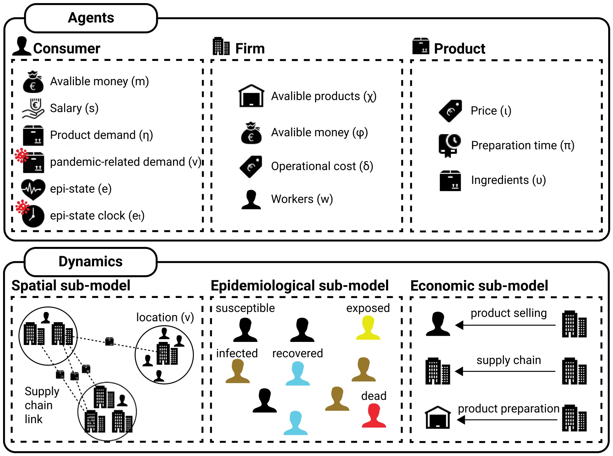
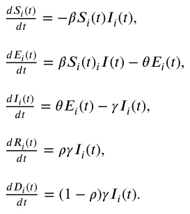
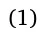
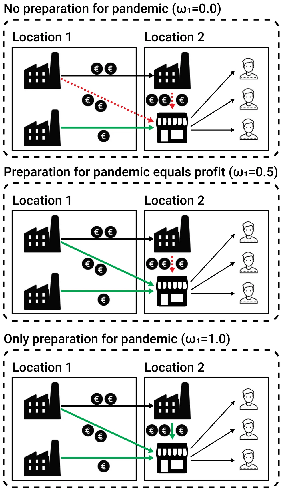
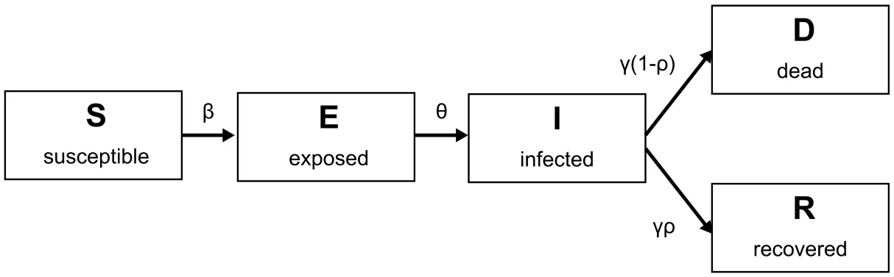
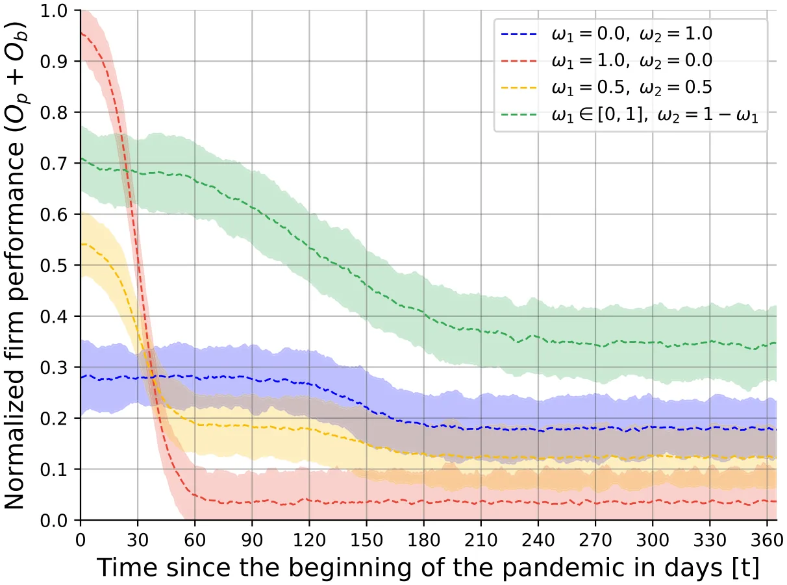
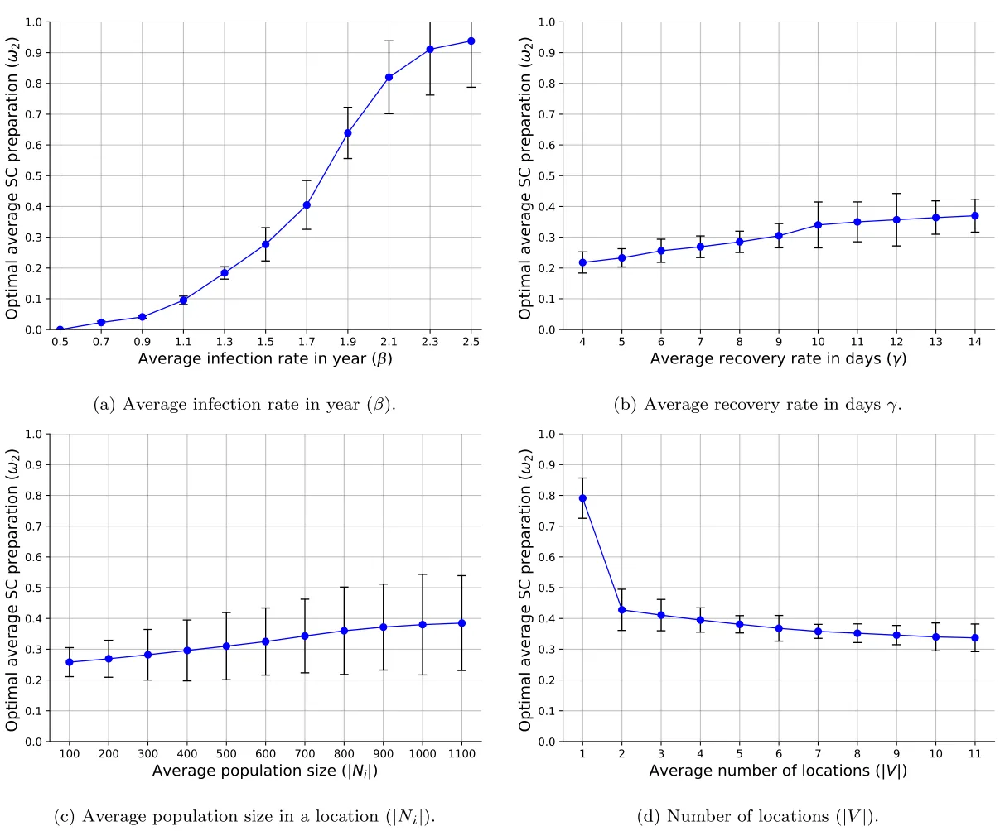
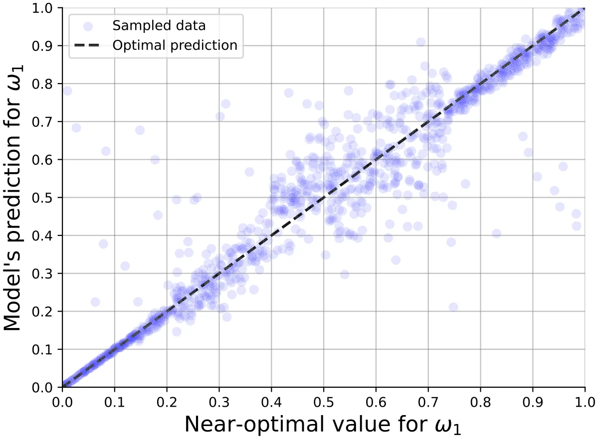
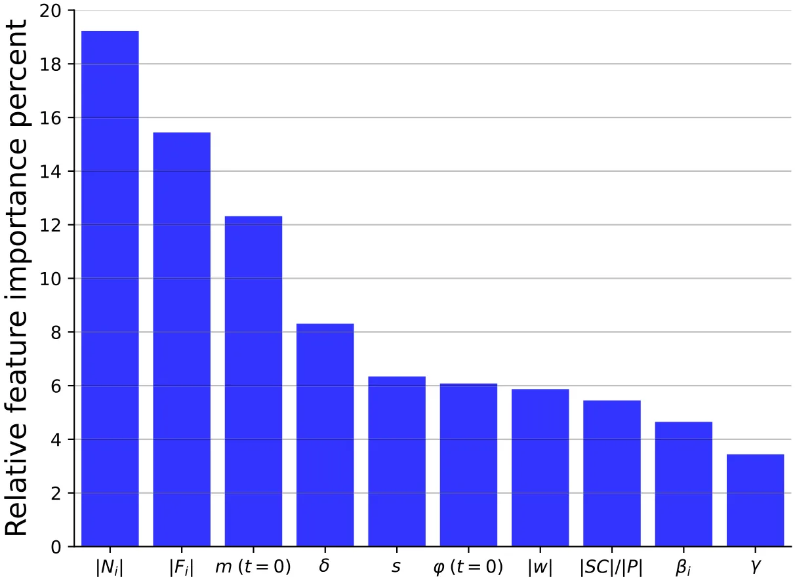
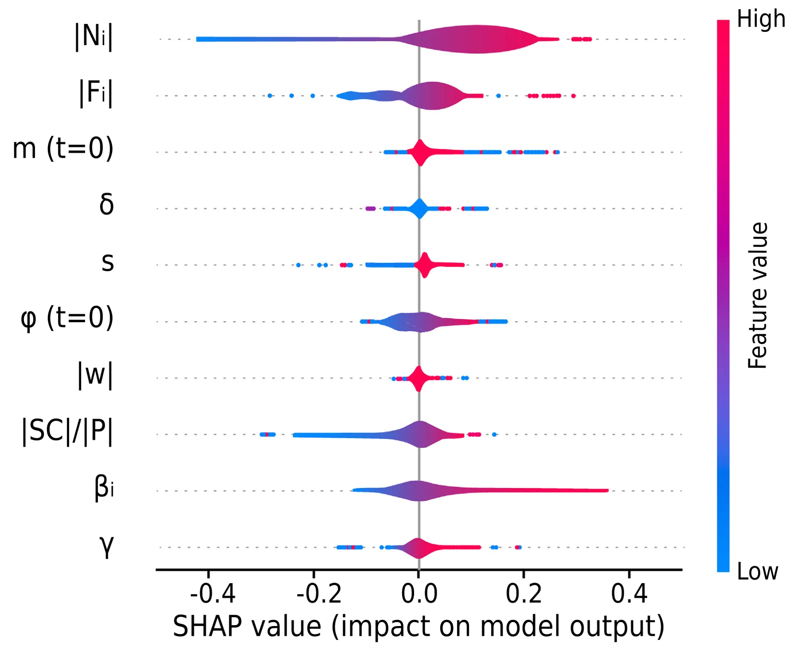

## 1. Introduction

Pandemics, such as the recent global COVID-19 crisis [1,2] or more historical ones such as the Spanish Influenza during World War I [3,4], have starkly illuminated the vulnerabilities in our economic systems [5,6]. In the short term, pandemics disrupt production, significantly shift consumer demand, and strain healthcare resources, leading to immediate economic downturns [7]. The long-term effects are equally concerning, with industries facing restructuring [8,9], labor market shifts [10,11], and altered consumer behavior patterns [12], all of which pose substantial challenges to economic recovery and growth. For instance, focusing on the recent COVID-19 pandemic’s effect on the global supply chain, show the possible magnitude of a global pandemic, which includes 94% of Fortune 1000 businesses experiencing supply chain disruptions [13] and indirect costs represent 10.53% of the global GDP [14].

In particular, supply chains, as the lifelines of global commerce, are especially sensitive to the shocks induced by pandemics [15, 16]. The intricate web of interconnected suppliers, manufacturers, distributors, and retailers can quickly unravel under the strain of widespread disruptions, leading to shortages, price volatility, and logistical bottlenecks [17,18]. The fragility of these supply chains has been laid bare during recent crises, prompting a critical reevaluation of resilience strategies [19].

While the inevitability of pandemics is widely acknowledged [20,21], businesses face a dilemma in balancing the need to prepare for future disruptions against the imperative to generate profits in the present [22]. This ‘‘greedy’’ mindset, driven by short-term financial goals, often conflicts with the long-term resilience planning required to withstand future shocks [23]. This dilemma is similar to other dual-objective optimization tasks with conflicted agendas, such as food exploration by ants [24], to more complex 0378-4371/© 2025 The Author(s). Published by Elsevier B.V. This is an open access article under the CC BY-NC license ( http://creativecommons.org/licenses/by-nc/4.0/ ).

ones, such as investment portfolio optimization tasks [25]. Generally speaking, this tension between immediate profitability and future preparedness underscores the complexity of decision-making in a volatile and uncertain environment [26,27].

Addressing this tension presents an intriguing computational challenge [28–30]. How can businesses optimize their supply chain strategies to simultaneously maximize current profits and enhance resilience against future pandemics? Previous studies tried to address this question by analyzing strategies applied by businesses during previous pandemics and analyzing which businesses better handled the crisis [31,32]. These studies indeed provide a fruitful ground for policy-makers and business owners to design their strategy, but actually susceptible to Lucas’s critique as well [33]. Namely, one would require a set of businesses to try two or more strategies to see which one works best for multiple pandemic configurations, to be able to empirically establish a claim. Unfortunately, such an experiment is impossible in practice. Furthermore, existing models often fail to adequately capture the complex interplay between epidemiological dynamics, economic factors, and firm-level decision-making [34–36]. Specifically, many existing models are limited by their reliance on static assumptions, their inability to capture the heterogeneous nature of supply chain actors, and their lack of focus on proactive, pre-pandemic resilience strategies [37,38].

To this end, mathematical models and computer simulations emerge as powerful tools to overcome this challenge [39–41]. While limited in their expressiveness and accuracy in predicting the real world, they commonly provide accurate enough predictions to establish a reasonable replica (commonly referred to as ‘‘digital twin’’) of the studied case [42]. Specifically, agent-based simulation (ABS) is a computational method to describe the dynamics that occur due to the interaction of diverse agents [43]. In this case, the agents represent different supply chain entities and the dynamic interactions between them [44,45]. ABS allows us to explicitly model the heterogeneity of firms, consumers, and products within the supply chain, capturing the emergent behavior that arises from their interactions. Our model also moves beyond purely reactive approaches by focusing on pre-pandemic preparedness, allowing us to explore the optimal allocation of resources to maximize both short-term profitability and long-term resilience. By simulating various scenarios and resilience preparedness strategies, one can gain valuable insights into effective approaches for navigating the delicate balance between short-term gains and long-term sustainability in the face of pandemics [46,47].

Indeed, previous studies investigate supply chain resilience during a crisis, in general, and for cases of a pandemic, in particular [48–50]. For instance, [51] adopted the ABS method to analyze the influence of shifts in supply and demand due to the COVID-19 pandemic on the supply chain’s ability to deliver. The authors studied two main recovery strategies relevant to building emergency supply and extra manufacturing capacity to mitigate supply chain disruptions using their model. [52] suggested analyzing and designing supply chain reliance from an immune system perspective, as immune systems are safeguarding against disruptions and facilitating recovery, properties also associated with a resilient supply chain. The author proposed a mathematical formalization for supply chain resilience preparedness based on the biologically inspired framework of immune systems. In a more general sense, [53] reviewed supply chain resilience work with a focus on connecting the supply chain to other networks such as command-and-control and transportation. The author identified three main modeling strategies — linear, branching, and graph-based and concluded that graph-based models provide the most realistic and accurate modeling strategy of these.

In this study, we present a novel ABS-based model to explore how much a business should focus its resources on supply chain resilience preparedness during a pandemic. The novelty of this work lies in the integration of a well-established pandemic-spread model based on an extended SIR (Susceptible–Infectious–Recovered) epidemiological model with theoretically and empirically proven economic supply-chain model which emerges from supply-and-demand dynamics and their shifts due to the pandemic in a multi and misaligned objective in a multi-agent configuration. To be exact, the proposed model extends previous similar models by investigating pre-pandemic resource allocation towards supply chain resilience preparedness, which, as far as we know, has been mostly neglected. In this work, we suggest a novel short-long term trade-off metric for supply chain resilience preparedness measurement under the pandemic uncertainty, which is the base of the modeling decision and the *in silico* investigation. Namely, we first show how pandemics influence firms for different supply chain resilience preparedness strategies. Then, we explore the sensitivity of these strategies to economic and epidemiological changes, and finally, we use machine learning to estimate the supply chain resilience preparedness strategy a firm should adopt.

The rest of this paper is organized as follows. Section 2 provides a quick overview of how supply chains are designed and utilized. In addition, an overview of the ABS method is presented alongside its usage for both epidemiological and supply chain models. Section 3 presents the formalization of the proposed ABS simulation to explore supply chain resilience and experimental setup. Section 4 outlines the obtained results from the experiments. Finally, Section 5 discusses the results in an economic context with its possible application and suggests possible future work.

## 2. Related work

In this section, we provide an overview of how supply chains are designed, established, and managed. These properties are later taken into consideration in the modeling phase. In addition, an overview of the ABS method is presented in general and in the context of both epidemiological and supply chain models. These models are later used as the modeling fundamentals for our model.

### 2.1. Supply chains

Supply chains play a pivotal role in modern economies, encompassing the design, establishment, and management of interconnected networks that facilitate the flow of goods and services [54,55]. Indeed, in the modern economy, individual companies no longer compete solely based on their unique brand identities. Instead, they operate as interconnected parts of supply chains. Success now hinges on a firm’s ability to manage and coordinate the complex network of relationships within these supply chains [56]. A supply chain functions as an integrated system, coordinating processes from sourcing raw materials to delivering finished products, adding value, promoting and distributing them, and facilitating information exchange among various entities like suppliers, manufacturers, distributors, logistics providers, and retailers. The primary goal is to boost operational efficiency, profitability, and competitive advantage for both the firm and its supply chain partners [56]. Supply chain management is succinctly defined as the integration of crucial business processes, spanning from end-users to original suppliers, which adds value for customers and stakeholders [56].

Multiple approaches have been suggested for modeling supply chains. According to [57], these can be categorized into four groups: deterministic models with known parameters, stochastic models with at least one unknown parameter following a probabilistic distribution, economic game-theoretic models, and simulation-based models assessing supply chain strategy performance. Most of these models are steady-state, focusing on average performance or steady conditions [58]. However, static models fall short in capturing the dynamic nature of supply chain systems affected by demand variations, lead-time delays, sales forecasting, to name a few [58]. Multiple works show that a combination of supply and demand model with network analysis is appropriate to capture the complexity of supply chain management [59]. This mathematical framework is often solved using ABS [60].

### 2.2. Agent based simulation

Agent based simulation (ABS) is a computational method of capturing (spatio-)temporal dynamics occurring for multiple agents [61,62]. An ABS more often than not contains two main components — an environment and a population of agents which can be homogeneous or heterogeneous [63,64]. ABS is based on three types of interactions between the agents and their environment — spontaneous, agent–agent, and agent–environment. Spontaneous interactions are interactions between an agent and itself that only depend on the agent’s current state and time. Agent–agent interactions are interactions between two or more agents that alter the state of at least one of the agents taking part in the interaction. Agent–environment interactions are interactions between agents and their environment that change either (or both) the agent’s state or the environment’s state. Interestingly. ABS can be computationally reduced to the population protocol model [65] and therefore it is Turing-complete [66,67] meaning the ABS can express any dynamics solvable by a computer.

A growing body of work utilizes the ABS computational method for a wide range of tasks [68]. In particular, we examine below the usage of ABS in epidemiological and supply chain models.

#### 2.2.1. Epidemiological models

ABS is commonly used in the context of epidemiological models to model and solve heterogeneous population dynamics, as other methods such as differential equations or functional models are limited in their ability to efficiently describe such dynamics [69,70]. For example, [71] proposed an ABS of pedestrian dynamics to evaluate the behavior of pedestrians in public places in the context of contact transmission of airborne infectious diseases. The authors used a continuous space with a random direct walk of agents and infectious dynamics as a function of the distance between the agents. [72] described an ABS-based model of pandemic spread in facilities, which is based on the popular SIR epidemiological model [73] that assumes three epidemiological states — susceptible, infected, and recovered. In their model, agents had heterogeneous movement dynamics, which were accomplished by three rules that took into consideration the agent’s epidemiological state, as well as its local environment and the agents in this environment. [74] proposed an ABS based model with an SEI (susceptible–exposed–infected) epidemiological model operating in a single room with three-dimensional geometry. The authors combined airflow dynamics using the Computational Fluid Dynamics (CFD) model with the epidemiological dynamics for airborne pathogens where agents are spatially static but have heterogeneous breathing patterns. [75] adopted the popular SEIRD (Susceptible–Exposed–Infected–Recovered–Dead) differential model [76–79] for the analysis and forecast of the COVID-19 spread in Italian regions, using the data from the Italian Protezione Civile. showing the model was able to accurately fit the pandemic spread during 2020.

#### 2.2.2. Supply chain models

Similar to the ABS usage in epidemiological models, ABS is used for supply chain models to capture ‘‘economic players’’ with different objectives, capabilities, or roles in an economy, in general, and in a supply chain, in particular [80,81]. For instance, [82] proposed an ABS-based model of four three-level supply chains that apply different types of combined contracts by taking into account the effects of vertical and horizontal competition between supply chains. The authors show that the simulated results agree with previous socio-economic knowledge from the literature. [83] introduced an integrated framework for ABS inventory– production–transportation modeling and distributed simulation of supply chains. The authors show that their framework produces predictions that agree with previously known dynamics, such as the utilization of machines in manufacturing and the quantity change of products. [84] investigated retail stockouts using an ABS-based model. The authors consider the change in market share as a measure of resilience for both the manufacturer and the retailer to examine the impact of the stockout and, using the model, explore the effect of different scenarios on these metrics.

Existing ABS-based supply chain models can be broadly categorized based on their focus and level of abstraction. First, contract-focused models, such as [85,86], primarily investigate the impact of different types of contracts and agreements between supply chain partners on overall performance and resilience. They often involve relatively simplified representations of production and inventory management processes. While these models provide valuable insights into the role of contracts in supply chain coordination, they typically do not explicitly model the impact of external disruptions, such as pandemics, or the proactive strategies that firms can adopt to mitigate these disruptions. Second, Inventory–Production–Transportation Models [87,88], focus on the detailed simulation of inventory management, production scheduling, and transportation logistics within the supply chain. They often involve more complex representations of manufacturing processes and transportation networks. While these models can capture the dynamic behavior of supply chains under normal operating conditions, they often lack the ability to model the complex behavioral responses of agents to unexpected events or the strategic decision-making processes of firms facing uncertainty. Lastly, Resilience-Focused Models [89,90] explicitly investigate the resilience of supply chains to disruptions, such as natural disasters or economic shocks. They often incorporate metrics such as time to recovery, disruption costs, and market share changes. However, many of these models focus on reactive strategies for responding to disruptions, rather than proactive strategies for preventing or mitigating them. Furthermore, they often lack a detailed representation of the underlying economic and epidemiological dynamics that drive the disruptions.

Our work builds upon these existing approaches by integrating elements from each of these categories. We incorporate a detailed representation of supply and demand dynamics and the strategic decision-making processes of firms facing uncertainty, in the face of a pandemic. Unlike many existing models, we focus on the proactive allocation of resources to enhance supply chain resilience before a disruption occurs. This allows us to explore the trade-offs between short-term profitability and long-term preparedness and to identify the optimal strategies for firms to navigate the uncertain environment of a pandemic.

## 3. Methods and materials

In this section, we initially introduce the proposed epidemiological–economic model for supply chain resilience management based on the ABS method. Afterward, we describe a supply chain resilience preparedness formalization with strategies firms can adopt. Next, we outline a machine learning strategy to obtain an approximation to the right balance of supply chain resilience preparedness and profit using a machine learning algorithm. Finally, an experimental setup for the model is outlined.

### 3.1. Model definition

The proposed epidemiological–economic model for supply chain resilience management is based on the ABS approach and constructed from three interconnected sub-models: epidemiological, economic, and supply chain (spatial). These sub-models are structured on top of three types of agents — consumers (which also function as workers), firms, and products.

We define the model as a tuple M ∶= (*𝐶, 𝐹, 𝑃, 𝐺*), where *𝐶* is a set of consumers, *𝐹* is a set of firms, *𝑃* is a set of products, *𝐺* is a graph of locations that the consumers, firms, and products are physically located in and interacting with each other and between themselves. The components of the tuple are described below in detail. Fig. 1 provides a schematic view of the model’s components and the interactions between them.

Following the ABS method, we first formally define the three types of agents. In our model, all agents are represented by a timed finite state machine [91]. The consumer agent, *𝑐* ∈ *𝐶* is defined by the tuple *𝑐* ∶= (*𝑚, 𝑠, 𝜂, 𝜈, 𝑒, 𝑒*𝑡) where *𝑚* ∈[0*,* ∞) is the currently available money of the consumer, *𝑠* ∈[0*,* ∞) is the amount of salary the consumer gets in each step in time, *𝜂* ∈ N|𝑃| is the demand for products, *𝜈* ∈ R|𝑃| is the change for products’ demand due to the pandemic state, *𝑒* ∈{*𝑆, 𝐸, 𝐼, 𝑅, 𝐷*} is the consumer’s epidemiological state, and *𝑒*𝑡 ∈ N is the number of steps in time passed since the last time the consumer’s epidemiological state changed. A firm *𝑓* ∈ *𝐹* is defined by the tuple *𝑓* ∶= (*𝜒, 𝜑, 𝛿, 𝑤*) where *𝜒* ∈ N|𝑃| is the number of currently available products to supply, *𝜑* ∈[0*,* ∞) is the currently available money of the firm, *𝛿* ∈ R+ is the operational cost of the firm, *𝑤⊂𝐶* is the set of consumers that are also workers of the firm. A product *𝑝* ∈ *𝑃* is defined by the tuple *𝑝* ∶= (*𝜄, 𝜋, 𝜐*) where *𝜄* ∈[0*,* ∞) is the price of the product, *𝜋* ∈[0*,* ∞) is the preparation time of the product from its ingredients, and *𝜐* ∈ N|𝑃| is the vector of ingredients required to prepare a product. Notably, while product’s price fluctuation occurs naturally and during pandemics may become more chaotic [92], for simplicity we assume it is static.

Intuitionally, the demand sensitivity vector, *𝜈* ∈ R|𝑃|, is intended to capture how a consumer’s demand for different products changes in response to the perceived severity of the pandemic [93,94]. Each element *𝜈*𝑖 of the vector corresponds to a specific product and indicates the magnitude and direction (positive or negative) of the change in demand as the infection rate increases. For example, a positive *𝜈*𝑖 for product ‘‘hand sanitizer’’ would indicate that demand for hand sanitizer increases as the infection rate rises, reflecting increased concern and preventative behavior [95]. Conversely, a negative *𝜈*𝑖 for product ‘‘bike’’ might reflect a decrease in demand [96].

The interaction between these agents are the core of the model and is captured by the three sub-models. Since there are many moving parts in the model, let us consider a simple example to capture the underlying behavior of the model. Let us consider two locations such that the first one has two firms and no consumer population, while the other has two firms and some consumer population. In this scenario, three out of the four firms will be factories as they produce products that do not have any ingredients and sell them to the fourth firm, which operates as a store. As each firm (i.e. factory) has different processes, the price of its product is different. For this example, let us assume each of the firms operating as factories are able to supply all the demand the firm operating as a store has in times of no pandemic. Here, we focus on the firm that operates as a store. If this firm aims to make as much profit as possible and ignores the supply chain resilience, it should buy the product from the firm that offers it at the cheapest price. On the other extreme case, where this firm is only worried by the pandemic, establishing all possible supply chains will ensure the ability to satisfy demand. A balanced objective would result in a more diverse supply chain strategy while also considering profits. Fig. 2 presents a schematic representation of this example.

<figure id="fig-1">

<figcaption><strong>Fig. 1.</strong> A schematic view of the proposed epidemiological–economic model with supply chains.</figcaption>
</figure>

#### 3.1.1. Epidemiological model

For each location, the epidemiological sub-model is adopted to be the SEIRD model, which considers a constant consumer population with a fixed number of consumers (*𝐶*𝑖) of size *𝑁*𝑖 for the *𝑖*𝑡ℎ location. Each consumer in the population belongs to one of the five epidemiological groups: susceptible (*𝑆*𝑖), exposed (*𝐸*𝑖), infected (*𝐼*𝑖), recovered (*𝑅*𝑖), and dead (*𝐷*𝑖), such that *𝑁*𝑖 = *𝑆*𝑖 + *𝐸*𝑖 + *𝐼*𝑖 + *𝑅*𝑖 + *𝐷*𝑖.

Consumers in the susceptible group have no immunity and are susceptible to infection. When an individual in the susceptible group (*𝑆*𝑖) is exposed to the pathogen through an interaction with an infected consumer, the susceptible consumer is transferred to the exposed epidemiological group (*𝐸*𝑖) at a rate corresponding to the average interaction between infected consumers and susceptible consumers, denoted by *𝛽*. Each consumer stays in the exposed group on average *𝜃* days, after which the consumer is transferred to the infected epidemiological group (*𝐼*𝑖). Infected consumers stay in this group on average *𝛾* days, after which they are transferred to the recovered epidemiological group (*𝑅*𝑖) or the dead (*𝐷*𝑖) epidemiological group with probability *𝜌* and 1 − *𝜌*, respectively. The recovered consumers are again healthy, no longer contagious, and immune to future infection. The epidemiological dynamics are formally described using a system of ordinary differential equations, as follows:

Importantly, *𝜃, 𝛾*, and *𝜌* are biological-clinical properties and therefore are constant between locations while *𝛽* is highly affected by the population density, culture, and other properties making it unique for each location [97]. Fig. 3 presents a schematic view of the epidemiological model.

<figure id="fig-2">

<figcaption><strong>Fig. 2.</strong> A simple example of three supply chain strategies obtained for different objectives of a firm from the perspective of a store (firm) for a case of only two locations and four firms where the consumer population is present only in the same location as the store. The solid-green arrows indicate that the store firm has established these supply chains, while dashed-red arrows indicate that the store firm has not established these supply chains.</figcaption>
</figure>

<figure id="fig-3">

<figcaption><strong>Fig. 3.</strong> A schematic view of the epidemiological model, which is divided into five states — susceptible, exposed, infected, recovered, and dead.</figcaption>
</figure>

#### 3.1.2. Local supply and demand model

For each location, the local supply and demand sub-model is based on the classical supply and demand model. Nonetheless, for simplicity, we assume the products’ prices do not alter due to change over time. At each step in time, each consumer has a demand for products (*𝜂*) which can be bought from firms in the neighborhood. We assume the consumer is well-informed and prefers to buy each product from the firm that provides it at the lowest price. While this assumption is not necessarily met in many realistic scenarios [98], it is commonly used [99–101] and we adopted it for simplicity. In addition, *𝜂* changes due to the pandemic state as a function of its sensitivity to each product as indicated by a vector *𝜈*. Formally, a consumer’s overall demand at some point in time, *𝑡* is *𝜂* + *𝜈* 𝑁𝑖−𝐷𝑖. Hence, at each step in time, a consumer first obtains salary, *𝑠*, which adds to its current available money (*𝑠*) and *𝐼𝑖* uses it to buy products according to its current demand *𝜂* + *𝜈* 𝑁𝑖−𝐷𝑖. If some product is not available, the consumer just do not buy *𝐼𝑖* it. Moreover, if the consumer’s available money is not enough to buy all the products according to their own demand, a random subset of products is chosen such that the consumer has enough available money to buy, is chosen. This subset is obtained using the RANSAC (RANdom SAmple Consensus) algorithm [102] with uniform distribution over the products. In addition, firms buy and sell products to other firms and sell products to consumers. Each firm is operating using consumers from the location that operate as workers. These workers are picked at random from the local population in a uniformly distributed manner, with an amount linearly corresponding to the local production. Therefore, its operational capacity is a function 𝑤 where *𝑤*𝑖 and *𝑤*𝑑 are the subset of workers that are infected or dead, respectively. The operational capacity is multiplied by the *𝑤*−*𝑤𝑖*−*𝑤𝑑* duration it takes the firm to prepare a product from its ingredients. It takes the firm *𝜋* steps in time to produce from its ingredients (*𝜐*) are available to it. At each step in time, a firm performs five actions. First, the firm pays its operational cost, *𝛿*. Second, the firm buys products from other firms, if any. Third, the firm established new supply chains, if any. Fourth, the firm prepares products from the products it acquired, if any. Finally, the firm sells its ready products to consumers.

#### 3.1.3. Supply chain and spatial model

Let us assume each location represents a single community and local economy and that products are moved between locations via supply chains, while consumers are spatially static in their communities over time. Formally, let *𝐺* ∶= (*𝑉, 𝐿*) be a directional, multi-edge, and non-empty graph where *𝑉* is the set of locations and *𝐿⊂𝑉* × *𝑉* is the set of supply chains. Each supply chain, *𝑙* ∈ *𝐿*, is defined by two firms (*𝑓*1*, 𝑓*2) located in the same or different locations and is defined by a tuple *𝑙* ∶= (*𝑝, 𝑑, 𝑎*) where *𝑝* ∈ *𝑃* is the product firm *𝑓*1 sell to firm *𝑓*2, *𝑑* ∈ R+ is the cost to initially establish the supply chain, and *𝑎* ∈ N is the number of steps in time that takes since firm *𝑓*2 buys the products and *𝑓*1 provides it once these are ready for delivery.

In the default, pre-pandemic scenario, firms establish supply chains with the primary goal of satisfying consumer demand at the lowest possible cost [103]. Specifically, a firm seeks to identify firms (as suppliers) for each product they need, prioritizing those who can provide sufficient quantities to meet anticipated demand while minimizing total procurement costs. To address this optimization, we employ a brute-force method [104]: for each product and each firm, all possible combinations of firms (as suppliers) are evaluated, and the combination that minimizes the overall cost while satisfying the predicted demand is selected. The predicted demand is a function of the average demand during the past turns of the simulation. This approach, while computationally expensive, ensures that the initial supply chain configuration is optimized for cost-effectiveness under normal operating conditions.

#### 3.1.4. Integrating into a single framework

In order to numerically solve the proposed model, we implement it using the ABS approach [105,106]. The simulation is developed using the Python [107] programming language (version 3.9.2). The simulation occurred in rounds marked by *𝑡* ∈[0*, 𝑇*] such that *𝑇<* ∞. In the first round (*𝑡* = 0), the environment in the form of the *𝐺* sub-model is set where locations with their initial consumer population and set of firms are generated such that the firms do not have supply chain links between them (|*𝐿*| = 0). The set of products is obtained from a pre-defined distribution. In order to allow a reasonable simulation, we assume that before the pandemic, products were produced and delivered to at least satisfy the demand for each location. As such, a random subset of the firms is assumed to generate products without any ingredients (i.e., *𝜐* = [0*,* … *,* 0]). In addition, supply chains are established at random between firms until the overall demand of the consumers is met. Finally, prices are allocated to the products without any ingredients and the selling prices of each firm are established to be the cost of all the products to generate its own with some random profit margin that allows it to end up each step in time with a profit of *𝑥* ∈[1%*,* 50%] from its volume.

Formally, in order to determine which firms initially generate products without ingredients (i.e., ‘‘raw materials’’), we assign each firm a probability *𝑝*𝑟𝑎𝑤 ∈[0*,* 1]. In our experiments, *𝑝*𝑟𝑎𝑤 is set to 0.03 to roughly align with the average in the OECD (Organisation for Economic Co-operation and Development) countries. For each firm, we draw a random number *𝑟* from a uniform distribution *𝑈*(0*,* 1). If *𝑟< 𝑝*𝑟𝑎𝑤, that firm is designated as a producer of raw materials (i.e., *𝜐* = [0*,* … *,* 0]). In addition, supply chains are established iteratively. At each iteration, a firm (acting as a retailer) randomly selects another firm (acting as a potential supplier) with a uniform probability. If establishing a supply chain between these two firms helps to satisfy unmet consumer demand, the supply chain is established. This process continues until the overall consumer demand in all locations is met. Moreover, for firms producing raw materials, the price of their product (*𝜄*) is randomly assigned from a uniform distribution *𝑈*(*𝑙*𝑚𝑖𝑛*, 𝑙*𝑚𝑎𝑥), where *𝑙*𝑚𝑖𝑛 and *𝑙*𝑚𝑎𝑥 are pre-defined minimum and maximum price values. Subsequently, the selling price of each firm is calculated as the cost of its inputs (including the prices of raw materials and intermediate goods) plus a random profit margin. This profit margin is drawn from a uniform distribution *𝑈*(0*.*01*,* 0*.*50), representing a range of 1% to 50% of the firm’s production volume.

Afterward, for each round (*𝑡>* 0), the following processes occur and are performed by the agents. For the epidemiological dynamics, for each location (*𝑣* ∈ *𝑉* ) the susceptible consumers become infected due to interaction with infectious consumers. Exposed consumers become infectious once *𝑒*𝑡 = *𝜃*. Infectious consumers transform to either the recovered or dead epidemiological state once *𝑒*𝑡 = *𝛾*. Consumers that are in the dead epidemiological state (i.e., *𝑒* = *𝐷*) are removed from the population. In addition, for the economic dynamics, the consumers buy the products they want after obtaining a salary. Moreover, firms pay their operational cost, buy products from other firms, establish new supply chains, prepare products from the products they acquire, and sell products to consumers.

### 3.2. Supply chain resilience preparedness

Each firm aims to make as much profit as it can (*𝑂*𝑝). In our case, it means, each firm aims to fulfill the demand in all the locations it is located at over time. However, it also wishes not to go bankrupt during a pandemic as long as possible (*𝑂*𝑏). Intuitively, by establishing cost-optimal supply chains, a firm optimizes for the first objective while establishing supply chains with all relevant firms in the economy, such that their cost is smaller than the selling price of the finished product optimizes for the latter objective. One can notice a trade-off between the two objectives. As such, a supply chain resilience strategy aims to solve the following optimization problem:

## max 𝑆𝐶 𝜔1𝑂𝑝 + 𝜔2𝑂𝑏

where *𝑆𝐶* is the set of supply chains established by the firm to acquire products and *𝜔*1*, 𝜔*2 ∈[0*,* 1] are the weights of the two objectives, respectively. Formally, *𝑂*𝑝 = 1 ∑𝑇 𝑡=0 *𝑚* and min𝑡 I(*𝑡, 𝑚<* 0) where I(*𝑥, 𝑦*) is a predict function returning *𝑥* when condition *𝑦* is satisfied. 𝑇

In order to solve the optimization task, we adopted the Monte Carlo approach [108]. Namely, we sample in a random manner the combination of possible connections for each given firm. This process occurs for *𝜁≫* 1 times, and the configuration that establishes the highest value for Eq. (2) is chosen.

We focus on four supply chain strategies where no preparation for a pandemic occurs (*𝜔*2 = 0), where firms do not wish to make profit (*𝜔*1 = 0), both objectives are identically important (*𝜔*1 = *𝜔*2 = 0*.*5), and random case where both making profit and preparation are important to each firm in different manner (*𝜔*1 *>* 0*, 𝜔*2 *>* 0).

### 3.3. Approximating supply chain strategy using machine learning

Since the right values of *𝜔*1 and *𝜔*2 are strongly dependent on the economic status of the firm, its dependency on other firms in the economy, the consumers’ behavior, and the magnitude of the pandemic, it is only reasonable that different firms will adopt different *𝜔*1*, 𝜔*2 values as part of their supply chain reliance strategy. Nonetheless, solving such a question analytically is unrealistic as one would be required to solve for the entire economy at once and would be highly sensitive to any change. Notably, in this context, firms assume a pandemic will occur at some point in time, which is unpredictable. Therefore, the optimization problem is a regression one rather than a time series.

Thus, in order to find the (near) optimal *𝜔*1*, 𝜔*2 values for each firm, we adopted a data-driven approach. Namely, using experimental data, one can use a machine learning (ML) based model to fairly approximate the *𝜔*1*, 𝜔*2 values of a firm without actually solving for the exact scenario due to the generalization capabilities of ML models [109–111]. Formally, this is a one-dimensional regression problem since *𝜔*1+*𝜔*2 = 1 which infers that by finding *𝜔*1, one can directly compute *𝜔*2. In order to use an ML model, one is first required to collect representative data. To this end, we run the simulation multiple times with different parameter values. For each such run, we use the Monte Carlo (MC) method [108] for the values of *𝜔*1*, 𝜔*2 for each firm. As a target variable for the ML to predict, we use *𝑂*𝑝 + *𝑂*𝑏, ignoring the values of *𝜔*1*, 𝜔*2 in the objective to obtain a consistent evaluation of the firm’s performance over different runs. While the MC method is relatively computationally expensive, given enough computation time it converges to (near) optimal solution [112]. As the proposed computation is performed offline as a preparation, choosing MC does not require any assumptions on the optimization problem at hand and can be easily configured to balance between computational power and accuracy by adopting the number of repetitions.

Using the obtained dataset, we use the Tree-based Pipeline Optimization Tool (TPOT) [113], an automated machine learning tool that uses genetic algorithms [114] to optimize ML models. TPOT tries multiple ML models on the dataset to find the one that performs best. In order to make sure the results are robust, we adopted the k-fold cross-validation method with *𝑘* = 5 [115], following common practice and optimizing between the number of tests and their size. Since the obtained model is black-box [116], we used two methods to explore how the model allocates *𝜔*1 values to firms. First, we use the information gain feature importance method [117] to learn how much each feature of the economy influences the model’s prediction. Second, SHapley Additive exPlanations (SHAP) analysis was used to gain insight into the influence of various features [118]. The SHAP values can be used to explain the output of an ML model by attributing the contribution of each individual feature to a particular prediction [119].

### 3.4. Experimental setup

Due to the difficulty of obtaining realistic data on firms’ supply chain and financial decisions, one can explore a large number of synthetic economies to obtain statistically representative dynamics. Thus, we explore the influence of a pandemic in different levels of magnitude on an arbitrary economy. For simplicity, for each sample configuration of an economy, we run the ABS simulation for *𝑛* = 100 times to obtain a statistically representative sample. For the epidemiological-related parameter values, we used values associated with the COVID-19 pandemic [120]. Table 1 shows the parameter values used in the experiments. Importantly, we assume all days are working days (i.e., not considering weekends and holidays).

<figure class="table-figure" id="table-1">
<figcaption><strong>Table 1</strong> The model’s parameter value ranges used in the experiment.</figcaption>

<table><tr><th>Parameter</th><th>Symbol</th><th>Value range</th></tr><tr><td>simulation duration</td><td>𝑇</td><td>365</td></tr><tr><td>Duration of a step in time</td><td>𝛥𝑡</td><td>1 day</td></tr><tr><td>ABS simulation repetition count</td><td>𝑛</td><td>100</td></tr><tr><td>Monte Carlo repetition count</td><td>𝜁</td><td>1000</td></tr><tr><td>Number of consumers in a location</td><td>|𝑁𝑖|</td><td>500–5000</td></tr><tr><td>Number of firms in a location</td><td>|𝐹𝑖|</td><td>5–50</td></tr><tr><td>Number of locations</td><td>|𝑉|</td><td>1–20</td></tr><tr><td>Initial amount of money</td><td>𝑚(𝑡= 0)</td><td>1 ⋅102 −5 ⋅106 $</td></tr><tr><td>Salary</td><td>𝑠</td><td>5.5 ⋅101 −5.5 ⋅103 $</td></tr><tr><td>Number of unique products in the economy</td><td>|𝑃|</td><td>10–250</td></tr><tr><td>Firms initial available money</td><td>𝜑; (𝑡= 0)</td><td>1 ⋅104 −5 ⋅107 $</td></tr><tr><td>Firms operational cost</td><td>𝛿</td><td>0.0025𝜑−0.025𝜑 $</td></tr><tr><td>Workers in a firm</td><td>𝑤</td><td>1 −1000</td></tr><tr><td>Price of a product</td><td>𝜄</td><td>1 ⋅100 −1 ⋅104 $</td></tr><tr><td>Location’s average infection rate</td><td>𝛽</td><td>5 ⋅10−5 −1 ⋅10−2</td></tr><tr><td>During from exposed to infectious</td><td>𝜃</td><td>5–9 days</td></tr><tr><td>During from infection to recovered/dead</td><td>𝛾</td><td>10–18 days</td></tr><tr><td>Recovery rate</td><td>𝜌</td><td>0.975 −0.995 $</td></tr><tr><td>Ingredients per product</td><td></td><td>1–20</td></tr><tr><td>Number of products a firm sell to consumers</td><td></td><td>1–10</td></tr><tr><td>TPOT population size</td><td></td><td>50</td></tr><tr><td>TPOT number of generations</td><td></td><td>20</td></tr><tr><td>Number of simulations for the machine learning model</td><td></td><td>500</td></tr><tr><td>Number of 𝜔1, 𝜔2 configurations for each machine learning sample</td><td></td><td>20</td></tr></table>

</figure>

## 4. Results

In this section, we present the results of the experiments. First, we show the pandemic effect on firms over time for four supply chain resilience preparedness strategies. Second, we show a sensitivity to important pandemic-related parameters. Finally, we show the obtained ML model to estimate *𝜔*1 for firms.

### 4.1. Pandemic effect of supply chain over time

We start by investigating the four configurations of supply chain resilience preparedness over time during a pandemic. Fig. 4 presents this analysis where the *𝑥*-axis is the time in days that passed since the beginning of the pandemic and the *𝑦*-axis is the normalized firm performance as outlined in Eq. (2) where *𝜔*1 and *𝜔*2 are agnostic to make allow the comparison between the four different strategies. One can notice that firms that only consider the preparation for the pandemic (*𝜔*1 = 0) are very inefficient overall, as these start around 0.3, while less affected by the pandemic as after a year the average performance is around 0.2. Unalike, when firms do not prepare their supply chains for a pandemic at all (*𝜔*1 = 1), the firm’s performance is near optimal, but after only two months of the pandemic the average performance drops to around 0.04, which is almost full economic collapse. The strategy that all firms balance the two strategies results in an average performance between the two previous cases, where the initial performance is around 0.55 and after 40 days drops to around 0.2, followed by a further slower decline towards 0.1 after around 200 days. For the heterogeneous case where each firm aims to find its balance of *𝜔*1 and *𝜔*2, the initial performance is the second highest with a score around 0.7. During the time of the pandemic, the performance decreases relatively slowly and balances after around 240 days around 0.35 — the highest performance of the four strategies.

### 4.2. Pandemic-related sensitivity analysis for supply chain resilience preparedness

Let us focus on the most realistic case of the four strategies out of the four — where each firm has its own values for *𝜔*1 and *𝜔*2. Since finding the optimal value for *𝜔*1 is extremely computationally challenging, compute a sensitivity analysis such that each case shows *𝑛* = 100 unique runs, taking the average best *𝜔*1 value. Fig. 5 shows the results of the sensitivity analysis such that the *𝑥*-axis indicates the parameter under investigation and the *𝑦*-axis indicates the optimal average *𝜔*2 value. The results are shown as the mean ± standard deviation of the *𝑛* = 100 runs for each parameter value. Specifically, Fig. 5(a) shows the change of the optimal average *𝜔*2 as a function of the average infection rate (*𝛽*). One can notice a sigmoid function with the standard deviation growing alongside the value of *𝜔*2. Fig. 5(b) focus on the change due to the average recovery rate (*𝛾*), where a higher *𝛾* value results in higher *𝜔*2 values in a somewhat linear fashion. Similarly, Fig. 5(c) shows that *𝜔*2 is linearly increasing with the increase in the average population size, but this outcome is increasingly less accurate as the population grows, which is indicated by the increase in the error bars’ size. Fig. 5(d) reveals a sharp decrease in the value of *𝜔*1 between one and two locations while afterward the value of *𝜔*1 decreases logarithmically with respect to the value of the average number of locations.

<figure id="fig-4">

<figcaption><strong>Fig. 4.</strong> Analysis of four supply chain resilience preparedness strategies as the course of a one-year-long pandemic. The results are shown as the mean ± standard deviation of <em>𝑛</em> = 1000 simulations.</figcaption>
</figure>

### 4.3. Supply chain resilience preparedness machine learning model

Overall, we trained the ML model on 2.2 million samples of companies *𝜔*1 value, *𝑂*𝑝 + *𝑂*𝑏, and the economy’s initial state before the beginning of the pandemic. An additional 0.55 million samples are used to evaluate the obtained model’s performance. The error analysis of the model shows that the obtained model has a mean absolute error of 0.047 and a coefficient of determination of *𝑅*2 = 0*.*816. Fig. 6 presents the ML model’s prediction for 1000 randomly picked samples. The *𝑥*-axis indicates the near-optimal value for *𝜔*1 as obtained using the MC process using the ABS simulation while the *𝑦*-axis is the ML model’s prediction for *𝜔*1 for the same firm, given the same initial conditions used by the ABS simulation. One can notice that for *𝜔*1 *<* 0*.*2 and *𝜔*1 *>* 0*.*7 the ML model makes very accurate predictions while for 0*.*2 *< 𝜔*1 *<* 0*.*7 the model has a larger error, on average. In addition, some firms have a relatively large error, but these are a relatively small portion of the entire dataset.

Fig. 7 shows the feature importance distributions of the top 10 most important features which are responsible for 87.13% of the properties the ML uses to make a prediction. The most important feature, with 19.23% is the number of consumers in a location the firm operates in, followed by the number of firms in the location (15.44%). Afterward, the initial available money of the consumers and the initial available money of the company are the third and sixth most important features, with 12.32% and 6.08%, respectively. The operational cost and consumer’s average salary are the fourth and fifth most important features with 8.31% and 6.34%, respectively. The pandemic-related parameters, the average infection rate (*𝛽*𝑖), and recovery rate (*𝛾*) are the ninth and tenth most important features with 4.65% and 3.44%, respectively. The operational features — the number of workers and the number of supply chains divided by the number of products in the economy are the seventh and eights most important features with 5.87% and 5.45%, respectively.

Fig. 8 shows the Shap analysis of the obtained ML model. On the *𝑥*-axis, dots on the right side indicate a contribution towards the model predictions of *𝜔*1 = 0 while left side dots indicate a contribution towards the model predictions of *𝜔*1 = 1. One can notice a mostly consistent behavior for |*𝑁*𝑖| and |*𝐹*𝑖| while the other feature demonstrate a more chaotic pattern.

<figure id="fig-5">

<figcaption><strong>Fig. 5.</strong> A sensitivity analysis of the model’s main epidemiologically-related parameters. The weight of profit rather than supply chain resilience preparedness parameter (<em>𝜔</em>1) is obtained as an average ± standard deviation of <em>𝑛</em> = 100 simulations, with the rest of the parameters are uniformly sampled according to Table 1.</figcaption>
</figure>

## 5. Discussion and conclusion

In this study, we proposed a novel agent-based simulation (ABS) based model for the influence of pandemic spread on supply chain resilience preparedness strategies. The spatio-temporal model combined an extended SIR epidemiological model (SEIRD) integrated with a supply–demand economic model for multiple physical locations. This model is used to evaluate the efficiency of different supply chain resilience preparedness on a wide range of scenarios using *in silico* experiments, focusing on balancing between profit maximization and preparation for a pandemic in terms of supply chain resilience preparedness strategy.

Using this model, we started by exploring the ‘‘edge’’ cases of supply chain resilience preparedness as well as the average and heterogeneous cases to evaluate the possible range of strategies, as shown in Fig. 4. Predictably, neglecting supply chain resilience preparedness leaves the economy highly vulnerable to pandemic-induced collapse. On the other hand, prioritizing resilience preparedness above all else, while minimizing pandemic impact, results in a system characterized by economic inefficiency and diminished appeal. While a balanced resilience preparedness strategy provides benefits in the absence of a pandemic, its initial advantage over a ‘‘do nothing’’ approach erodes quickly. Although initially achieving almost half the performance of the optimized state, its advantage shrinks to only slightly more than double after six months. Compared to uniform strategies, a heterogeneous approach where firms implement varied resilience preparedness plans leads to improved economic performance while also being more realistic. The benefits of this heterogeneous outcome aligns with previous research on complex tasks [121,122] and suggests that it should be further investigated.

In the most realistic scenario where each firm independently determines its supply chain resilience preparedness strategy, the model yields arguably predictable results as presented in Fig. 5. As the infection rate increases, firms must, unsurprisingly, enhance their preparedness to mitigate the pandemic’s effects [123,124]. Similarly, a higher recovery rate, which leads to a greater number of infected individuals circulating simultaneously and thus accelerates the pandemic spread, also necessitates increased preparation [125]. Furthermore, larger population sizes amplify the economic disruption caused by a pandemic, demanding a more robust supply chain resilience preparedness strategy due to the increased uncertainty and potential for more infection pathways [126]. Interestingly, Fig. 5(d) reveals a significant decrease in required supply chain resilience preparedness when transitioning from a single location to two locations. This reduction in the (*𝜔*2) value may stem from the fact that the pandemic does not impact all areas simultaneously, allowing firms to adopt a less drastic resilience preparedness strategy on average. However, this effect diminishes considerably when moving from two to multiple locations.

<figure id="fig-6">

<figcaption><strong>Fig. 6.</strong> The machine learning model’s performance for 1000 randomly picked predictions for near-optimal value of <em>𝜔</em>1 as obtained by the Monte Carlo method with the agent-based simulation compared to the obtained machine learning model’s prediction. The dashed line indicates the locations of perfect predictions.</figcaption>
</figure>

We aimed to provide an approximation tool for firms to manage their supply chain resilience preparedness strategy with respect to their state and the economy’s state using an ML model. As illustrated in Fig. 6, the obtained ML model is extremely accurate for firms that are not significantly affected by a pandemic (of a small-medium size), and its performance is reduced as the firm is more sensitive to the pandemic. That said, for very sensitive firms, the ML model is again performing relatively well. This outcome can be explained by the fact that for the more extreme cases, it is clearer to ignore pandemic risks or be extremely prepared for them, while the intermediate cases are more chaotic in nature, resulting in a wide range of possible outcomes [127]. Interestingly, the ML model predicts, as shown in Fig. 7, that the economy size, as reflected by the number of consumers and firms, is the most important parameter to the individual firm strategy — agreeing with previous studies about supply chain resilience preparedness [128,129]. The firm’s size and economic state, as indicated by the number of workers and the operational cost, are very important but less than the overall economy’s dynamics as also found by [130]. However, this average importance value hides a more chaotic picture, which is revealed by Fig. 8. While the economic size has mostly a positive effect on the number of how much a firm should prepare for a pandemic, the rest of the features show inconsistent behavior when considered individually. This outcome can be expected due to the complex connections between the features in the dynamics that dictate a firm’s future and therefore optimal strategy before a pandemic starts. Nonetheless, it highlights the importance of other studies to explore multiple features for supply chain resilience preparedness at once rather than one at a time.

Based on the results of this study, we offer the following practical policy suggestions for firm owners. To effectively build resilience against future pandemics and disruptions, firm owners should embrace a strategy that combines internal strengths with an awareness of the external economic environment. Recognizing that resilience is not just an internal affair, firms need to proactively monitor macroeconomic trends and consumer behavior, while also establishing a diverse supplier fallback network to ensure operational continuity. Since disruptions are inherently unpredictable, strategies should be flexible and adaptive, allowing for quick adjustments, even if it means temporary inefficiencies; this includes developing dynamic mechanisms for resource allocation like the *𝜔*1∕*𝜔*2 ratio to respond swiftly to changing conditions. Finally, firms should regularly quantify their resilience investments against the potential costs of disruptions by setting clear metrics for recovery time, and governments can support this by providing accessible forecasting tools to help businesses better predict and prepare for future shocks.

<figure id="fig-7">

<figcaption><strong>Fig. 7.</strong> Feature importance analysis of the obtained machine learning model. The results show the average value of a 5-fold cross-validation analysis. These features are responsible for 87.13% of the model’s decision making process.</figcaption>
</figure>

The proposed model is not without limitations. The proposed model assumes a pandemic originated with a single pathogen that does not mutate over time. While this assumption is commonly used [131–134], it is known to be false for even medium-sized pandemics, and future works should use multi-strain with a reinfection mechanism epidemiological sub-model to obtain more realistic epidemiological dynamics. Second, we assume a constant population over time, which is a fair approximation for short-term planning and pandemics of a few weeks to months. However, for a pandemic spanning over several years, population growth (or decline) cannot be neglected. Future work should take these dynamics into account to improve the realism of the proposed model. Third, we assume that the prices of products from the firms are static over time to focus on the pandemic spread influence on the supply chain rather than other factors, an assumption commonly used in economic modeling [135–137]. Nonetheless, natural price fluctuations as well as high-order pandemic-related price fluctuations may play a central role in supply chain management and should be included in future work to make it more realistic. Fourth, population size and the number of firms, as well as their spatial distribution, are assumed to be static over time. Adding consumer migration dynamics, as well as the introduction of firm establishment and closure, are also promising venues for future work. Fifth, the pandemic-related demand assumes all consumers are aware of the pandemic state in their community at any given point in time. A relaxation of this assumption by adding delay and only an estimation for the pandemic spread would make the model more realistic and reflect the actual available information that consumers have during a pandemic. Sixth, consumers in different epidemiological statuses, such as infected individuals, may have different consumption needs and demands [138], which can be considered in future work. Finally, the recovery process of firms from a pandemic is an important part of the supply chain resilience preparedness strategy and should be introduced to the proposed model, in future work, to obtain more comprehensive results. In addition, as the proposed model is integrated with an extended-SIR epidemiological model, its scope is limited to one type of disaster. Future work can adopt the proposed model for other cases by replacing the extended-SIR model with models of other disruption types.

Taken jointly, the proposed model and its agent-based simulator provide policymakers and business owners with a computational tool to evaluate their supply chain preparedness for the event of a large-scale pandemic, such as COVID-19. Our results show that for even relatively large pandemics, well-prepared businesses are theoretically able to overcome the challenge and thrive during and after the pandemic ends.

<figure id="fig-8">

<figcaption><strong>Fig. 8.</strong> A Shap analysis of the ML model. Dots on the right side indicate a contribution towards the model predictions of <em>𝜔</em>1 = 0 while left side dots indicate a contribution towards the model predictions of <em>𝜔</em>1 = 1.</figcaption>
</figure>

**CRediT authorship contribution statement** **Teddy Lazebnik:** Writing – review & editing, Writing – original draft, Visualization, Validation, Software, Resources, Methodology, Investigation, Formal analysis, Conceptualization.

## Funding

This research did not receive any specific grant from funding agencies in the public, commercial, or not-for-profit sectors.

## Declaration of competing interest

The authors declare that they have no known competing financial interests or personal relationships that could have appeared to influence the work reported in this paper.

## Acknowledgment

The author wishes to thank Labib Shami for motivating this research and providing valuable economic advice.

## Data availability

No data was used for the research described in the article.

## References

1. A. Imtyaz, A. Haleem, M. Javaid, Analysing governmental response to the COVID-19 pandemic, J. Oral Biol. Craniofac. Res. (2021). [link](http://refhub.elsevier.com/S0378-4371%2825%2900432-7/sb1)
2. L. Liu, H.J. Miller, J. Scheff, The impacts of COVID-19 pandemic on public transit demand in the united states, PLoS One 15 (11) (2020) 1–22. [link](http://refhub.elsevier.com/S0378-4371%2825%2900432-7/sb1) · [link](http://refhub.elsevier.com/S0378-4371%2825%2900432-7/sb2)
3. A. Erkoreka, Origins of the spanish influenza pandemic (1918–1920) and its relation to the first world war, J. Mol. Genet. Med. 30 (3) (2009) 190–194. [link](http://refhub.elsevier.com/S0378-4371%2825%2900432-7/sb2) · [link](http://refhub.elsevier.com/S0378-4371%2825%2900432-7/sb3)
4. S. Ansart, C. Pelat, P.-Y. Boelle, F. Carrat, A. Flahault, A.-J. Valleron, Mortality burden of the 1918–1919 influenza pandemic in europe, Influenza 3 (2009) 99–106. [link](http://refhub.elsevier.com/S0378-4371%2825%2900432-7/sb3) · [link](http://refhub.elsevier.com/S0378-4371%2825%2900432-7/sb4)
5. W.J. McKibbin, R. Fernando, The global macroeconomic impacts of COVID-19: Seven scenarios, 2020, Working Paper 19/2020, Centre for Applied Macroeconomic Analysis. [link](http://refhub.elsevier.com/S0378-4371%2825%2900432-7/sb4) · [link](http://refhub.elsevier.com/S0378-4371%2825%2900432-7/sb5)
6. A.A. Toda, Susceptible-infected-recovered (SIR) dynamics of Covid-19 and economic impact, Covid Econ. 1 (2020) 43–63. [link](http://refhub.elsevier.com/S0378-4371%2825%2900432-7/sb5) · [link](http://refhub.elsevier.com/S0378-4371%2825%2900432-7/sb6)
7. D. Altig, S. Baker, J.M. Barrero, N. Bloom, P. Bunn, S. Chen, S.J. Davis, J. Leather, B. Meyer, E. Mihaylov, P. Mizen, N. Parker, T. Renault, P. Smietanka, G. Thwaites, Economic uncertainty before and during the COVID-19 pandemic, J. Publ. Econ. 191 (2020) 104274. [link](http://refhub.elsevier.com/S0378-4371%2825%2900432-7/sb6) · [link](http://refhub.elsevier.com/S0378-4371%2825%2900432-7/sb7)
8. C. Adam, M. Henstridge, S. Lee, After the lockdown: macroeconomic adjustment to the COVID-19 pandemic in sub-Saharan Africa, Oxf. Rev. Econ. Policy 36 (Suppl. 1) (2020) S338–S358. [link](http://refhub.elsevier.com/S0378-4371%2825%2900432-7/sb7) · [link](http://refhub.elsevier.com/S0378-4371%2825%2900432-7/sb8)
9. W. McKibbin, D. Vines, Global macroeconomic cooperation in response to the COVID-19 pandemic: a roadmap for the G20 and the IMF, Oxf. Rev. Econ. Policy 36 (Suppl. 1) (2020) S297–S337. [link](http://refhub.elsevier.com/S0378-4371%2825%2900432-7/sb8) · [link](http://refhub.elsevier.com/S0378-4371%2825%2900432-7/sb9)
10. T. Lazebnik, L. Shami, S. Bunimovich-Mendrazitsky, Spatio-temporal influence of non-pharmaceutical interventions policies on pandemic dynamics and the economy: The case of COVID-19, Res. Econ. (2021). [link](http://refhub.elsevier.com/S0378-4371%2825%2900432-7/sb9) · [link](http://refhub.elsevier.com/S0378-4371%2825%2900432-7/sb10)
11. R.M. Del Rio-Chanona, P. Mealy, A. Pichler, F. Lafond, J.D. Farmer, Supply and demand shocks in the COVID-19 pandemic: An industry and occupation perspective, Oxf. Rev. Econ. Policy 36 (Suppl. 1) (2020) S94–S137. [link](http://refhub.elsevier.com/S0378-4371%2825%2900432-7/sb10) · [link](http://refhub.elsevier.com/S0378-4371%2825%2900432-7/sb11)
12. K. Valaskova, P. Durana, P. Adamko, Changes in consumers’ purchase patterns as a consequence of the COVID-19 pandemic, Mathematics 9 (15) (2021). [link](http://refhub.elsevier.com/S0378-4371%2825%2900432-7/sb11) · [link](http://refhub.elsevier.com/S0378-4371%2825%2900432-7/sb12)
13. A. Sharma, A. Adhikary, S.B. Borah, Covid-19’s impact on supply chain decisions: Strategic insights from NASDAQ 100 firms using Twitter data, J. Bus. Res. 117 (2020) 443–449. [link](http://refhub.elsevier.com/S0378-4371%2825%2900432-7/sb12) · [link](http://refhub.elsevier.com/S0378-4371%2825%2900432-7/sb13)
14. A. Faramarzi, S. Norouzi, H. Dehdarirad, M.R. Dehghani, S.M. Hosseini, M. Moayedi, The global economic burden of COVID-19 disease: a comprehensive systematic review and meta-analysis, Syst. Rev. 13 (1) (2024) 68. [link](http://refhub.elsevier.com/S0378-4371%2825%2900432-7/sb13) · [link](http://refhub.elsevier.com/S0378-4371%2825%2900432-7/sb14)
15. J.R. Francis, COVID-19: Implications for supply chain management, Front. Heal. Serv. Manag. 37 (1) (2020) 33–38. [link](http://refhub.elsevier.com/S0378-4371%2825%2900432-7/sb14) · [link](http://refhub.elsevier.com/S0378-4371%2825%2900432-7/sb15)
16. R.M. del Rio-Chanona, P. Mealy, A. Pichler, F. Lafond, D. Farmer, Supply and demand shocks in the COVID-19 pandemic: An industry and occupation perspective, 2020, arXiv preprint arXiv:2004.06759. [link](http://refhub.elsevier.com/S0378-4371%2825%2900432-7/sb15) · [link](http://arxiv.org/abs/2004.06759)
17. S.K. Paul, P. Chowdhury, A. Moktadir, K.H. Lau, Supply chain recovery challenges in the wake of COVID-19 pandemic, J. Bus. Res. 136 (2021) 316–329. [link](http://arxiv.org/abs/2004.06759) · [link](http://refhub.elsevier.com/S0378-4371%2825%2900432-7/sb17)
18. P. Chowdhury, S.K. Paul, S. Kaisar, A. Moktadir, COVID-19 pandemic related supply chain studies: A systematic review, Transp. Res. Part E: Logist. Transp. Rev. 148 (2021) 102271. [link](http://refhub.elsevier.com/S0378-4371%2825%2900432-7/sb17) · [link](http://refhub.elsevier.com/S0378-4371%2825%2900432-7/sb18)
19. R. Alikhani, A. Ranjbar, A. Jamali, S.A. Torabi, C.W. Zobel, Towards increasing synergistic effects of resilience strategies in supply chain network design, Omega 116 (2023) 102819. [link](http://refhub.elsevier.com/S0378-4371%2825%2900432-7/sb18) · [link](http://refhub.elsevier.com/S0378-4371%2825%2900432-7/sb19)
20. A.A. Conti, Historical and methodological highlights of quarantine measures: from ancient plague epidemics to current coronavirus disease (COVID-19) pandemic, Acta Bio.-Medica : Atenei Parm. 91 (2) (2020) 226–229. [link](http://refhub.elsevier.com/S0378-4371%2825%2900432-7/sb19) · [link](http://refhub.elsevier.com/S0378-4371%2825%2900432-7/sb20)
21. P. Curtin, K.D. Patterson, Pandemic Influenza, 1700-1900: A Study in Historical Epidemiology, The University of Chicago Press, 1986. [link](http://refhub.elsevier.com/S0378-4371%2825%2900432-7/sb20) · [link](http://refhub.elsevier.com/S0378-4371%2825%2900432-7/sb21)
22. A. Barman, R. Das, P.K. De, Impact of COVID-19 in food supply chain: Disruptions and recovery strategy, Curr. Res. Behav. Sci. 2 (2021) 100017. [link](http://refhub.elsevier.com/S0378-4371%2825%2900432-7/sb21) · [link](http://refhub.elsevier.com/S0378-4371%2825%2900432-7/sb22)
23. L. Shami, T. Lazebnik, Financing and managing epidemiological-economic crises: Are we ready for another outbreak? J. Policy Model. 45 (1) (2023) 74–89. [link](http://refhub.elsevier.com/S0378-4371%2825%2900432-7/sb22) · [link](http://refhub.elsevier.com/S0378-4371%2825%2900432-7/sb23)
24. A. Viseras, R.O. Losada, L. Merino, Planning with ants: Efficient path planning with rapidly exploring random trees and ant colony optimization, Int. J. Adv. Robot. Syst. (2016) 1–16. [link](http://refhub.elsevier.com/S0378-4371%2825%2900432-7/sb23) · [link](http://refhub.elsevier.com/S0378-4371%2825%2900432-7/sb24)
25. A. Gunjan, S. Bhattacharyya, A brief review of portfolio optimization techniques, Artif. Intell. Rev. (2022) 56. [link](http://refhub.elsevier.com/S0378-4371%2825%2900432-7/sb24) · [link](http://refhub.elsevier.com/S0378-4371%2825%2900432-7/sb25)
26. N.V. Sahinidis, Optimization under uncertainty: state-of-the-art and opportunities, Comput. Chem. Eng. 28 (6) (2004) 971–983. [link](http://refhub.elsevier.com/S0378-4371%2825%2900432-7/sb25) · [link](http://refhub.elsevier.com/S0378-4371%2825%2900432-7/sb26)
27. E. Acar, G. Bayrak, Y. Jung, I. Lee, P. Ramu, S.S. Ravichandran, Modeling, analysis, and optimization under uncertainties: a review, Struct. Multidiscip. Optim. 64 (2021) 2909–2945. [link](http://refhub.elsevier.com/S0378-4371%2825%2900432-7/sb26) · [link](http://refhub.elsevier.com/S0378-4371%2825%2900432-7/sb27)
28. A. Raj, A.A. Mukherjee, A.B.L. de Sousa Jabbour, S.K. Srivastava, Supply chain management during and post-COVID-19 pandemic: Mitigation strategies and practical lessons learned, J. Bus. Res. 142 (2022) 1125–1139. [link](http://refhub.elsevier.com/S0378-4371%2825%2900432-7/sb27) · [link](http://refhub.elsevier.com/S0378-4371%2825%2900432-7/sb28)
29. K.S. Shahed, A. Azeem, S.M. Ali, A. Moktadir, A supply chain disruption risk mitigation model to manage COVID-19 pandemic risk, Environ. Sci. Pollut. Res. (2021). [link](http://refhub.elsevier.com/S0378-4371%2825%2900432-7/sb28) · [link](http://refhub.elsevier.com/S0378-4371%2825%2900432-7/sb29)
30. S. Ishida, Perspectives on supply chain management in a pandemic and the post-COVID-19 era, IEEE Eng. Manag. Rev. 48 (3) (2020) 146–152. [link](http://refhub.elsevier.com/S0378-4371%2825%2900432-7/sb29) · [link](http://refhub.elsevier.com/S0378-4371%2825%2900432-7/sb30)
31. B. Scala, C.F. Lindsay, Supply chain resilience during pandemic disruption: evidence from healthcare, Supply Chain Manag. 64 (2021) 2909–2945. [link](http://refhub.elsevier.com/S0378-4371%2825%2900432-7/sb30) · [link](http://refhub.elsevier.com/S0378-4371%2825%2900432-7/sb31)
32. D. Ozdemir, M. Sharma, A. Dhir, T. Daim, Supply chain resilience during the COVID-19 pandemic, Technol. Soc. 68 (2022) 101847. [link](http://refhub.elsevier.com/S0378-4371%2825%2900432-7/sb31) · [link](http://refhub.elsevier.com/S0378-4371%2825%2900432-7/sb32)
33. R.E. Lucas, Econometric policy evaluation: A critique, Carnegie- Rochester Conf. Ser. Publ. Policy 1 (1976) 19–46,, URL https://www.sciencedirect.com/science/article/pii/S0167223176800036. [doi:10.1016/S0167-2231(76)80003-6](https://doi.org/10.1016/S0167-2231%2876%2980003-6) · [link](http://refhub.elsevier.com/S0378-4371%2825%2900432-7/sb32) · [link](https://www.sciencedirect.com/science/article/pii/S0167223176800036)
34. C. Mertzanis, Epidemiological susceptibility risk, adaptive management and firm performance, Br. J. Manag. 32 (4) (2021) 1242–1264. [doi:10.1016/S0167-2231(76)80003-6](https://doi.org/10.1016/S0167-2231%2876%2980003-6) · [link](https://www.sciencedirect.com/science/article/pii/S0167223176800036) · [link](http://refhub.elsevier.com/S0378-4371%2825%2900432-7/sb34)
35. H. Akselrod, M. Mercon, P. Kirkeby Risoe, J. Schlegelmilch, J. McGovern, S. Bogucki, Creating a process for incorporating epidemiological modelling into outbreak management decisions, J. Bus. Contin. Emerg. Plan. 6 (1) (2012) 68–83. [link](http://refhub.elsevier.com/S0378-4371%2825%2900432-7/sb34) · [link](http://refhub.elsevier.com/S0378-4371%2825%2900432-7/sb35)
36. G.L. Glandon, The contribution of epidemiological information in economic decision making, in: Epidemiology and the Delivery of Health Care Services: Methods and Applications, Springer, 2001, pp. 309–328. [link](http://refhub.elsevier.com/S0378-4371%2825%2900432-7/sb35) · [link](http://refhub.elsevier.com/S0378-4371%2825%2900432-7/sb36)
37. Z. Shatskaya, Formation of business structures in the context of pandemic transformations, Three Seas Econ. J. 3 (1) (2022) 217–222. [link](http://refhub.elsevier.com/S0378-4371%2825%2900432-7/sb36) · [link](http://refhub.elsevier.com/S0378-4371%2825%2900432-7/sb37)
38. S. Winasis, A.A.B. Dinariyana, Startup companies in post pandemic era: Prospect and preparation for exponential growth, J. Èkon. 12 (02) (2023) 1639–1643. [link](http://refhub.elsevier.com/S0378-4371%2825%2900432-7/sb37) · [link](http://refhub.elsevier.com/S0378-4371%2825%2900432-7/sb38)
39. A. Alexi, T. Lazebnik, L. Shami, Microfounded tax revenue forecast model with heterogeneous population and genetic algorithm approach, Comput. Econ. (2023). [link](http://refhub.elsevier.com/S0378-4371%2825%2900432-7/sb38) · [link](http://refhub.elsevier.com/S0378-4371%2825%2900432-7/sb39)
40. J. Felix, M. Alexandre, G.T. Lima, Applying machine learning algorithms to predict the size of the informal economy, Comput. Econ. (2024). [link](http://refhub.elsevier.com/S0378-4371%2825%2900432-7/sb39) · [link](http://refhub.elsevier.com/S0378-4371%2825%2900432-7/sb40)
41. A. Mustaffa, S. Lajuma, W. Wider, Employee engagement during COVID-19 in Malaysia, Front. Sociol. (2022). [link](http://refhub.elsevier.com/S0378-4371%2825%2900432-7/sb40) · [link](http://refhub.elsevier.com/S0378-4371%2825%2900432-7/sb41)
42. A.Z. Abideen, V.P.K. Sundram, J. Pyeman, A.K. Othman, S. Sorooshian, Digital twin integrated reinforced learning in supply chain and logistics, Logistics 5 (4) (2021). [link](http://refhub.elsevier.com/S0378-4371%2825%2900432-7/sb41) · [link](http://refhub.elsevier.com/S0378-4371%2825%2900432-7/sb42)
43. H. Qiu, Y. Chen, H. Zhang, W. Yi, Y. Li, Evolutionary digital twin model with an agent-based discrete-event simulation method, Appl. Intell. 53 (2022) 6178–6194. [link](http://refhub.elsevier.com/S0378-4371%2825%2900432-7/sb42) · [link](http://refhub.elsevier.com/S0378-4371%2825%2900432-7/sb43)
44. M. Raberto, S. Cincotti, S.M. Focardi, M. Marchesi, Agent-based simulation of a financial market, Phys. A 299 (2001) 319–327. [link](http://refhub.elsevier.com/S0378-4371%2825%2900432-7/sb43) · [link](http://refhub.elsevier.com/S0378-4371%2825%2900432-7/sb44)
45. J.D. Priest, A. Kishore, L. Machi, C.J. Kuhlman, D. Machi, S.S. Ravi, CSonNet: An agent-based modeling software system for discrete time simulation, in: 2021 Winter Simulation Conference, WSC, 2021, pp. 1–12. [link](http://refhub.elsevier.com/S0378-4371%2825%2900432-7/sb44) · [link](http://refhub.elsevier.com/S0378-4371%2825%2900432-7/sb45)
46. G. Ciatto, M.I. Schumacher, A. Omicini, D. Calvaresi, Agent-based explanations in AI: Towards an abstract framework, in: International Workshop on Explainable, Transparent Autonomous Agents and Multi-Agent Systems, Springer, 2020, pp. 3–20. [link](http://refhub.elsevier.com/S0378-4371%2825%2900432-7/sb46)
47. L. Tesfatsion, Agent-based computational economics: Growing economies from the bottom up, Artif. Life 8 (1) (2002). [link](http://refhub.elsevier.com/S0378-4371%2825%2900432-7/sb46) · [link](http://refhub.elsevier.com/S0378-4371%2825%2900432-7/sb47)
48. D. Ivanov, A. Dolgui, A digital supply chain twin for managing the disruption risks and resilience in the era of industry 4.0, Prod. Plan. Control 32 (9) (2021) 775–788. [link](http://refhub.elsevier.com/S0378-4371%2825%2900432-7/sb47) · [link](http://refhub.elsevier.com/S0378-4371%2825%2900432-7/sb48)
49. G. Zheng, L. Kong, A. Brintrup, Federated machine learning for privacy preserving, collective supply chain risk prediction, Int. J. Prod. Res. 61 (23) (2023) 8115–8132. [link](http://refhub.elsevier.com/S0378-4371%2825%2900432-7/sb48) · [link](http://refhub.elsevier.com/S0378-4371%2825%2900432-7/sb49)
50. I. Jackson, D. Ivanov, A beautiful shock? Exploring the impact of pandemic shocks on the accuracy of AI forecasting in the beauty care industry, Transp. Res. Part E: Logist. Transp. Rev. 180 (2023) 103360. [link](http://refhub.elsevier.com/S0378-4371%2825%2900432-7/sb49) · [link](http://refhub.elsevier.com/S0378-4371%2825%2900432-7/sb50)
51. T. Rahman, F. Taghikhah, S.K. Paul, N. Shukla, R. Agarwal, An agent-based model for supply chain recovery in the wake of the COVID-19 pandemic, Comput. Ind. Eng. 158 (2021) 107401. [link](http://refhub.elsevier.com/S0378-4371%2825%2900432-7/sb50) · [link](http://refhub.elsevier.com/S0378-4371%2825%2900432-7/sb51)
52. D. Ivanov, Supply chain resilience: Conceptual and formal models drawing from immune system analogy, Omega 127 (2024) 103081. [link](http://refhub.elsevier.com/S0378-4371%2825%2900432-7/sb51) · [link](http://refhub.elsevier.com/S0378-4371%2825%2900432-7/sb52)
53. M.S. Golan, L.H. Jernegan, I. Linkov, Trends and applications of resilience analytics in supply chain modeling: systematic literature review in the context of the COVID-19 pandemic, Environ. Syst. Decis. 40 (2020) 222–243. [link](http://refhub.elsevier.com/S0378-4371%2825%2900432-7/sb52) · [link](http://refhub.elsevier.com/S0378-4371%2825%2900432-7/sb53)
54. M. Casson, N. Wadeson, The economic theory of international supply chains: A systems view, Int. J. Econ. Bus. 20 (2) (2013) 163–186. [link](http://refhub.elsevier.com/S0378-4371%2825%2900432-7/sb53) · [link](http://refhub.elsevier.com/S0378-4371%2825%2900432-7/sb54)
55. D. Zhang, A network economic model for supply chain versus supply chain competition, Omega 34 (3) (2006) 283–295. [link](http://refhub.elsevier.com/S0378-4371%2825%2900432-7/sb54) · [link](http://refhub.elsevier.com/S0378-4371%2825%2900432-7/sb55)
56. H. Min, G. Zhou, Supply chain modeling: past, present and future, Comput. Ind. Eng. 43 (1) (2002) 231–249. [link](http://refhub.elsevier.com/S0378-4371%2825%2900432-7/sb55) · [link](http://refhub.elsevier.com/S0378-4371%2825%2900432-7/sb56)
57. B.M. Beamon, Supply chain design and analysis:: Models and methods, Int. J. Prod. Econ. 55 (3) (1998) 281–294. [link](http://refhub.elsevier.com/S0378-4371%2825%2900432-7/sb56) · [link](http://refhub.elsevier.com/S0378-4371%2825%2900432-7/sb57)
58. H. Sarimveis, P. Patrinos, C.D. Tarantilis, C.T. Kiranoudis, Dynamic modeling and control of supply chain systems: A review, Comput. Oper. Res. 35 (11) (2008) 3530–3561. [link](http://refhub.elsevier.com/S0378-4371%2825%2900432-7/sb57) · [link](http://refhub.elsevier.com/S0378-4371%2825%2900432-7/sb58)
59. J. Dong, D. Zhang, A. Nagurney, A supply chain network equilibrium model with random demands, European J. Oper. Res. 156 (1) (2004) 194–212. [link](http://refhub.elsevier.com/S0378-4371%2825%2900432-7/sb58) · [link](http://refhub.elsevier.com/S0378-4371%2825%2900432-7/sb59)
60. S. Xu, X. Chen, J. Xie, S. Rahman, J. Wang, H. Hui, T. Chen, Agent-based modeling and simulation for the electricity market with residential demand response, CSEE J. Power Energy Syst. 7 (2) (2021) 368–380. [link](http://refhub.elsevier.com/S0378-4371%2825%2900432-7/sb59) · [link](http://refhub.elsevier.com/S0378-4371%2825%2900432-7/sb60)
61. J.G. Polhill, M. Hare, T. Bauermann, D. Anzola, E. Palmer, D. Salt, P. Antosz, Using agent-based models for prediction in complex and wicked systems, J. Artif. Soc. Soc. Simul. 24 (3) (2021) 2. [link](http://refhub.elsevier.com/S0378-4371%2825%2900432-7/sb60) · [link](http://refhub.elsevier.com/S0378-4371%2825%2900432-7/sb61)
62. J.M. Epstein, Agent-based computational models and generative social science, Complexity 4 (1999) 41–60. [link](http://refhub.elsevier.com/S0378-4371%2825%2900432-7/sb61) · [link](http://refhub.elsevier.com/S0378-4371%2825%2900432-7/sb62)
63. M. Zhou, J. Li, R. Basu, J. Ferreira, Creating spatially-detailed heterogeneous synthetic populations for agent-based microsimulation, Comput. Environ. Urban Syst. 91 (2022) 101717. [link](http://refhub.elsevier.com/S0378-4371%2825%2900432-7/sb62) · [link](http://refhub.elsevier.com/S0378-4371%2825%2900432-7/sb63)
64. M. Raberto, S. Cincotti, S.M. Focardi, M. Marchesi, Agent-based simulation of a financial market, Phys. A 299 (1) (2001) 319–327. [link](http://refhub.elsevier.com/S0378-4371%2825%2900432-7/sb63) · [link](http://refhub.elsevier.com/S0378-4371%2825%2900432-7/sb64)
65. J. Aspnes, E. Ruppert, An Introduction to Population Protocols, Middleware for Network Eccentric and Mobile Applications, Springer, Berlin, Heidelberg, 2009. [link](http://refhub.elsevier.com/S0378-4371%2825%2900432-7/sb64) · [link](http://refhub.elsevier.com/S0378-4371%2825%2900432-7/sb65)
66. M. North, A theoretical formalism for analyzing agent-based models, Complex Adapt. Syst. Model. 2 (3) (2014). [link](http://refhub.elsevier.com/S0378-4371%2825%2900432-7/sb65) · [link](http://refhub.elsevier.com/S0378-4371%2825%2900432-7/sb66)
67. R. Laubenbacher, A.S. Jarrah, H. Mortveit, S.S. Ravi, A theoretical formalism for analyzing agent-based models, Complex Adapt. Syst. Model. (2007). [link](http://refhub.elsevier.com/S0378-4371%2825%2900432-7/sb66) · [link](http://refhub.elsevier.com/S0378-4371%2825%2900432-7/sb67)
68. A. Negahban, L. Yilmax, Agent-based simulation applications in marketing research: an integrated review, J. Simul. 8 (2013) 129–142. [link](http://refhub.elsevier.com/S0378-4371%2825%2900432-7/sb67) · [link](http://refhub.elsevier.com/S0378-4371%2825%2900432-7/sb68)
69. J. Li, T. Xiang, L. He, Modeling epidemic spread in transportation networks: A review, J. Traffic Transp. Eng. 8 (2) (2021) 139–152. [link](http://refhub.elsevier.com/S0378-4371%2825%2900432-7/sb68) · [link](http://refhub.elsevier.com/S0378-4371%2825%2900432-7/sb69)
70. T. Lazebnik, Computational applications of extended SIR models: A review focused on airborne pandemics, Ecol. Model. 483 (2023) 110422. [link](http://refhub.elsevier.com/S0378-4371%2825%2900432-7/sb69) · [link](http://refhub.elsevier.com/S0378-4371%2825%2900432-7/sb70)
71. T. Harweg, D. Bachman, F. Weichert, Agent-based simulation of pedestrian dynamics for exposure time estimation in epidemic risk assessment, J. Publ. Heal. 31 (2023) 221–228. [link](http://refhub.elsevier.com/S0378-4371%2825%2900432-7/sb70) · [link](http://refhub.elsevier.com/S0378-4371%2825%2900432-7/sb71)
72. E. Cuevas, An agent-based model to evaluate the COVID-19 transmission risks in facilities, Comput. Biol. Med. 121 (2020) 103827. [link](http://refhub.elsevier.com/S0378-4371%2825%2900432-7/sb71) · [link](http://refhub.elsevier.com/S0378-4371%2825%2900432-7/sb72)
73. W.O. Kermack, A.G. McKendrick, A contribution to the mathematical theory of epidemics, Proc. R. Soc. 115 (1927) 700–721. [link](http://refhub.elsevier.com/S0378-4371%2825%2900432-7/sb72) · [link](http://refhub.elsevier.com/S0378-4371%2825%2900432-7/sb73)
74. T. Lazebnik, A. Alexi, High resolution spatio-temporal model for room-level airborne pandemic spread, Mathematics 11 (2) (2023) 426. [link](http://refhub.elsevier.com/S0378-4371%2825%2900432-7/sb73) · [link](http://refhub.elsevier.com/S0378-4371%2825%2900432-7/sb74)
75. E. Loli Piccolomini, F. Zama, Monitoring Italian COVID-19 spread by a forced SEIRD model, PloS One 15 (8) (2020) e0237417. [link](http://refhub.elsevier.com/S0378-4371%2825%2900432-7/sb74) · [link](http://refhub.elsevier.com/S0378-4371%2825%2900432-7/sb75)
76. K. Menda, L. Laird, M.J. Kochenderfer, R.S. Caceres, Explaining COVID-19 outbreaks with reactive SEIRD models, Sci. Rep. 11 (1) (2021) 17905. [link](http://refhub.elsevier.com/S0378-4371%2825%2900432-7/sb75) · [link](http://refhub.elsevier.com/S0378-4371%2825%2900432-7/sb76)
77. F. Liu, J. Wang, J. Liu, Y. Li, D. Liu, J. Tong, Z. Li, et al., Predicting and analyzing the COVID-19 epidemic in China: Based on SEIRD, LSTM and GWR models, PloS One 15 (8) (2020) e0238280. [link](http://refhub.elsevier.com/S0378-4371%2825%2900432-7/sb76) · [link](http://refhub.elsevier.com/S0378-4371%2825%2900432-7/sb77)
78. N. Yoshida, Exact solution of the susceptible–exposed–Infectious–recovered–deceased (SEIRD) epidemic model, Electron. J. Qual. Theory Differ. Equ. 2024 (8) (2024) 1–37. [link](http://refhub.elsevier.com/S0378-4371%2825%2900432-7/sb77) · [link](http://refhub.elsevier.com/S0378-4371%2825%2900432-7/sb78)
79. T. Lazebnik, S. Bunimovich-Mendrazitsky, L. Shaikhet, Novel method to analytically obtain the asymptotic stable equilibria states of extended SIR-type epidemiological models, Symmetry 13 (7) (2021) 1120. [link](http://refhub.elsevier.com/S0378-4371%2825%2900432-7/sb78) · [link](http://refhub.elsevier.com/S0378-4371%2825%2900432-7/sb79)
80. P. Ghadimi, C. Heavey, A review of applications of agent-based modelling and simulation in supplier selection problem, in: 2013 8th EUROSIM Congress on Modelling and Simulation, 2013, pp. 101–107. [link](http://refhub.elsevier.com/S0378-4371%2825%2900432-7/sb79) · [link](http://refhub.elsevier.com/S0378-4371%2825%2900432-7/sb80)
81. U. Clausen, M. Brueggenolte, M. Kirberg, C. Besenfelder, M. Poeting, M. Gueller, Agent-based simulation in logistics and supply chain research: Literature review and analysis, in: U. Clausen, S. Langkau, F. Kreuz (Eds.), Advances in Production, Logistics and Traffic, Springer International Publishing, 2019, pp. 45–59. [link](http://refhub.elsevier.com/S0378-4371%2825%2900432-7/sb80) · [link](http://refhub.elsevier.com/S0378-4371%2825%2900432-7/sb81)
82. Q. Meng, Z. Li, H. Liu, J. Chen, Agent-based simulation of competitive performance for supply chains based on combined contracts, Int. J. Prod. Econ. 193 (2017) 663–676. [link](http://refhub.elsevier.com/S0378-4371%2825%2900432-7/sb81) · [link](http://refhub.elsevier.com/S0378-4371%2825%2900432-7/sb82)
83. Q. Long, W. Zhang, An integrated framework for agent based inventory–production–transportation modeling and distributed simulation of supply chains, Inform. Sci. 277 (2014) 567–581. [link](http://refhub.elsevier.com/S0378-4371%2825%2900432-7/sb82) · [link](http://refhub.elsevier.com/S0378-4371%2825%2900432-7/sb83)
84. T. Wu, S. Huang, J. Blackhurst, X. Zhang, S. Wang, Supply chain risk management: An agent-based simulation to study the impact of retail stockouts, IEEE Trans. Eng. Manage. 60 (4) (2013) 676–686. [link](http://refhub.elsevier.com/S0378-4371%2825%2900432-7/sb83) · [link](http://refhub.elsevier.com/S0378-4371%2825%2900432-7/sb84)
85. H.K. Nguyen, R. Chiong, M. Chica Serrano, R.H. Middleton, D.T.K. Pham, Contract farming in the Mekong Delta’s rice supply chain: insights from an agent-based modeling study, J. Artif. Soc. Soc. Simul. 23 (2019). [link](http://refhub.elsevier.com/S0378-4371%2825%2900432-7/sb84) · [link](http://refhub.elsevier.com/S0378-4371%2825%2900432-7/sb85)
86. V. Albino, L. Fraccascia, I. Giannoccaro, Exploring the role of contracts to support the emergence of self-organized industrial symbiosis networks: an agent-based simulation study, J. Clean. Prod. 112 (2016) 4353–4366. [link](http://refhub.elsevier.com/S0378-4371%2825%2900432-7/sb85) · [link](http://refhub.elsevier.com/S0378-4371%2825%2900432-7/sb86)
87. M. Dorigatti, A. Guarnaschelli, O. Chiotti, H.E. Salomone, A service-oriented framework for agent-based simulations of collaborative supply chains, Comput. Ind. 83 (2016) 92–107. [link](http://refhub.elsevier.com/S0378-4371%2825%2900432-7/sb86) · [link](http://refhub.elsevier.com/S0378-4371%2825%2900432-7/sb87)
88. S. Chen, W. Wang, E. Zio, A simulation-based multi-objective optimization framework for the production planning in energy supply chains, Energies 14 (9) (2021) 2684. [link](http://refhub.elsevier.com/S0378-4371%2825%2900432-7/sb87) · [link](http://refhub.elsevier.com/S0378-4371%2825%2900432-7/sb88)
89. G. Larrea-Gallegos, E. Benetto, A. Marvuglia, T.N. Gutiérrez, Sustainability, resilience and complexity in supply networks: A literature review and a proposal for an integrated agent-based approach, Sustain. Prod. Consum. 30 (2022) 946–961. [link](http://refhub.elsevier.com/S0378-4371%2825%2900432-7/sb88) · [link](http://refhub.elsevier.com/S0378-4371%2825%2900432-7/sb89)
90. L. Sun, D. d’Ayala, R. Fayjaloun, P. Gehl, Agent-based model on resilience-oriented rapid responses of road networks under seismic hazard, Reliab. Eng. Syst. Saf. 216 (2021) 108030. [link](http://refhub.elsevier.com/S0378-4371%2825%2900432-7/sb89) · [link](http://refhub.elsevier.com/S0378-4371%2825%2900432-7/sb90)
91. Y. Al-Saawy, A. Al-Ajlan, K. Aldrawiesh, A. Bajahzer, The development of multi-agent system using finite state machine, in: 2009 International Conference on New Trends in Information and Service Science, 2009, pp. 203–206. [link](http://refhub.elsevier.com/S0378-4371%2825%2900432-7/sb90) · [link](http://refhub.elsevier.com/S0378-4371%2825%2900432-7/sb91)
92. D. Bakas, A. Triantafyllou, Commodity price volatility and the economic uncertainty of pandemics, Econom. Lett. 193 (2020) 109283. Physica A: Statistical Mechanics and its Applications 674 (2025) 130780 [link](http://refhub.elsevier.com/S0378-4371%2825%2900432-7/sb91) · [link](http://refhub.elsevier.com/S0378-4371%2825%2900432-7/sb92)
93. B. Ellison, B. McFadden, B.J. Rickard, N.L.B. Wilson, Examining food purchase behavior and food values during the COVID-19 pandemic, Appl. Econ. Perspect. Policy 43 (1) (2021) 58–72. [link](http://refhub.elsevier.com/S0378-4371%2825%2900432-7/sb93)
94. D. Truong, M.D. Truong, How do customers change their purchasing behaviors during the COVID-19 pandemic? J. Retail. Consum. Serv. 67 (2022) 102963. [link](http://refhub.elsevier.com/S0378-4371%2825%2900432-7/sb93) · [link](http://refhub.elsevier.com/S0378-4371%2825%2900432-7/sb94)
95. X. Pan, M. Dresner, G. Li, B. Mantin, Stocking up on hand sanitizer: Pandemic lessons for retailers and consumers, J. Retail. Consum. Serv. 79 (2024) 103763. [link](http://refhub.elsevier.com/S0378-4371%2825%2900432-7/sb94) · [link](http://refhub.elsevier.com/S0378-4371%2825%2900432-7/sb95)
96. L. Rotaris, M. Intini, A. Gardelli, Impacts of the COVID-19 pandemic on bike-sharing: A literature review, Sustainability 14 (21) (2022) 13741. [link](http://refhub.elsevier.com/S0378-4371%2825%2900432-7/sb95) · [link](http://refhub.elsevier.com/S0378-4371%2825%2900432-7/sb96)
97. Y.-X. Dang, X.-Z. Li, M. Martcheva, Competitive exclusion in a multi-strain immuno-epidemiological influenza model with environmental transmission, J. Biol. Dyn. 10 (1) (2016). [link](http://refhub.elsevier.com/S0378-4371%2825%2900432-7/sb96) · [link](http://refhub.elsevier.com/S0378-4371%2825%2900432-7/sb97)
98. A. Stankevich, Explaining the consumer decision-making process: Critical literature review, J. Int. Bus. Res. Mark. 2 (6) (2017). [link](http://refhub.elsevier.com/S0378-4371%2825%2900432-7/sb97) · [link](http://refhub.elsevier.com/S0378-4371%2825%2900432-7/sb98)
99. A. Mas-Colell, On the Theory of Perfect Competition, in: Econometric Society Monographs, vol. 29, 1998, pp. 16–32. [link](http://refhub.elsevier.com/S0378-4371%2825%2900432-7/sb98) · [link](http://refhub.elsevier.com/S0378-4371%2825%2900432-7/sb99)
100. M. Satterthwaite, A. Shneyerov, Dynamic matching, two-sided incomplete information, and participation costs: Existence and convergence to perfect competition, Econometrica 75 (1) (2007) 155–200. [link](http://refhub.elsevier.com/S0378-4371%2825%2900432-7/sb99) · [link](http://refhub.elsevier.com/S0378-4371%2825%2900432-7/sb100)
101. I.M. Kirzner, Equilibrium versus market process, in: Modern Austrian Economics, vol. 2, Routledge, 2024, pp. 133–146. [link](http://refhub.elsevier.com/S0378-4371%2825%2900432-7/sb100) · [link](http://refhub.elsevier.com/S0378-4371%2825%2900432-7/sb101)
102. O. Chum, J. Matas, J. Kittler, Locally optimized RANSAC, in: Joint Pattern Recognition Symposium, Springer, 2003, pp. 236–243. [link](http://refhub.elsevier.com/S0378-4371%2825%2900432-7/sb101) · [link](http://refhub.elsevier.com/S0378-4371%2825%2900432-7/sb102)
103. K. Zokaei, P. Hines, Achieving consumer focus in supply chains, Int. J. Phys. Distrib. Logist. Manage. 37 (3) (2007) 223–247. [link](http://refhub.elsevier.com/S0378-4371%2825%2900432-7/sb102) · [link](http://refhub.elsevier.com/S0378-4371%2825%2900432-7/sb103)
104. A.B. Morton, I.M.Y. Mareels, An efficient brute-force solution to the network reconfiguration problem, IEEE Trans. Power Deliv. 15 (3) (2000) 996–1000. [link](http://refhub.elsevier.com/S0378-4371%2825%2900432-7/sb103) · [link](http://refhub.elsevier.com/S0378-4371%2825%2900432-7/sb104)
105. C.M. Macal, To agent-based simulation from system dynamics, in: Proceedings of the 2010 Winter Simulation Conference, 2010, pp. 371–382. [link](http://refhub.elsevier.com/S0378-4371%2825%2900432-7/sb104) · [link](http://refhub.elsevier.com/S0378-4371%2825%2900432-7/sb105)
106. T. Lazebnik, L. Shami, L. Bunimovich-Mendrazitsky, Intervention policy influence on the effect of epidemiological crisis on industry-level production through input–output networks, Socio-Econ. Plan. Sci. 87 (2023) 101553. [link](http://refhub.elsevier.com/S0378-4371%2825%2900432-7/sb105) · [link](http://refhub.elsevier.com/S0378-4371%2825%2900432-7/sb106)
107. K.R. Srinath, Python – the fastest growing programming language, Int. Res. J. Eng. Technol. 4 (12) (2017). [link](http://refhub.elsevier.com/S0378-4371%2825%2900432-7/sb106) · [link](http://refhub.elsevier.com/S0378-4371%2825%2900432-7/sb107)
108. E. Zio, Monte Carlo simulation: The method, in: The Monte Carlo Simulation Method for System Reliability and Risk Analysis, Springer London, London, 2013, pp. 19–58. [link](http://refhub.elsevier.com/S0378-4371%2825%2900432-7/sb107) · [link](http://refhub.elsevier.com/S0378-4371%2825%2900432-7/sb108)
109. D. Krueger, E. Caballero, J.-H. Jacobsen, A. Zhang, J. Binas, D. Zhang, R.L. Priol, A. Courville, Out-of-distribution generalization via risk extrapolation (REx), in: Proceedings of the 38th International Conference on Machine Learning, vol. 139, PMLR, 2021, pp. 5815–5826. [link](http://refhub.elsevier.com/S0378-4371%2825%2900432-7/sb108) · [link](http://refhub.elsevier.com/S0378-4371%2825%2900432-7/sb109)
110. J. Liu, Z. Shen, Y. He, X. Zhang, H. Xu, P. Cui, Towards out-of-distribution generalization: A survey, 2023, arXiv. [link](http://refhub.elsevier.com/S0378-4371%2825%2900432-7/sb109) · [link](http://refhub.elsevier.com/S0378-4371%2825%2900432-7/sb110)
111. K. Killamsetty, D. Sivasubramanian, G. Ramakrishnan, R. Iyer, Glister: Generalization based data subset selection for efficient and robust learning, in: Proceedings of the AAAI Conference on Artificial Intelligence, vol. 35, 2021, pp. 8110–8118. [link](http://refhub.elsevier.com/S0378-4371%2825%2900432-7/sb110) · [link](http://refhub.elsevier.com/S0378-4371%2825%2900432-7/sb111)
112. Y. Peres, O. Schramm, S. Sheffield, D.B. Wilson, Random-Turn Hex and other selection games, 2006, arXiv. [link](http://refhub.elsevier.com/S0378-4371%2825%2900432-7/sb111) · [link](http://refhub.elsevier.com/S0378-4371%2825%2900432-7/sb112)
113. R.S. Olson, J.H. Moore, TPOT: A tree-based pipeline optimization tool for automating machine learning, in: JMLR: Workshop and Conference Proceedings, vol. 64, 2016, pp. 66–74. [link](http://refhub.elsevier.com/S0378-4371%2825%2900432-7/sb112) · [link](http://refhub.elsevier.com/S0378-4371%2825%2900432-7/sb113)
114. J.H. Holland, Genetic algorithms, Sci. Am. 267 (1) (1992) 66–73. [link](http://refhub.elsevier.com/S0378-4371%2825%2900432-7/sb113) · [link](http://refhub.elsevier.com/S0378-4371%2825%2900432-7/sb114)
115. D.R. Roberts, V. Bahn, S. Ciuti, M.S. Boyce, J. Elith, G. Guillera-Arroita, S. Hauenstein, J.J. Lahoz-Monfort, B. Schröder, W. Thuiller, D.I. Warton, B.A. Wintle, F. Hartig, C.F. Dormann, Cross-validation strategies for data with temporal, spatial, hierarchical, or phylogenetic structure, Ecography 40 (8) (2017) 913–929. [link](http://refhub.elsevier.com/S0378-4371%2825%2900432-7/sb114) · [link](http://refhub.elsevier.com/S0378-4371%2825%2900432-7/sb115)
116. C. Janiesch, P. Zschech, K. Heinrich, Machine learning and deep learning, Electron Mark. 31 (2021) 685–695. [link](http://refhub.elsevier.com/S0378-4371%2825%2900432-7/sb115) · [link](http://refhub.elsevier.com/S0378-4371%2825%2900432-7/sb116)
117. B. Azhagusundari, A.S. Thanamani, Feature selection based on information gain, Int. J. Innov. Technol. Explor. Eng. 2 (2) (2013) 18–21. [link](http://refhub.elsevier.com/S0378-4371%2825%2900432-7/sb116) · [link](http://refhub.elsevier.com/S0378-4371%2825%2900432-7/sb117)
118. S. Lu, R. Chen, W. Wei, M. Belovsky, X. Lu, Understanding heart failure patients EHR clinical features via SHAP interpretation of tree-based machine learning model predictions, AMIA Annu. Symp. Proc. Arch. (2021) 813–822. [link](http://refhub.elsevier.com/S0378-4371%2825%2900432-7/sb117) · [link](http://refhub.elsevier.com/S0378-4371%2825%2900432-7/sb118)
119. K.E. Mokhtari, B.P. Higdon, A. Başar, Interpreting financial time series with SHAP values, in: Proceedings of the 29th Annual International Conference on Computer Science and Software Engineering, IBM Corp., 2019, pp. 166–172. [link](http://refhub.elsevier.com/S0378-4371%2825%2900432-7/sb118) · [link](http://refhub.elsevier.com/S0378-4371%2825%2900432-7/sb119)
120. T. Lazebnik, S. Bunimovich-Mendrazitsky, L. Shami, Pandemic management by a spatio–temporal mathematical model, Int. J. Nonlinear Sci. Numer. Simul. 24 (6) (2023) 2307–2324. [link](http://refhub.elsevier.com/S0378-4371%2825%2900432-7/sb119) · [link](http://refhub.elsevier.com/S0378-4371%2825%2900432-7/sb120)
121. R. Moran, Optimal decision making in heterogeneous and biased environments, Psychon. Bull. Rev. 22 (2015) 38–53. [link](http://refhub.elsevier.com/S0378-4371%2825%2900432-7/sb120) · [link](http://refhub.elsevier.com/S0378-4371%2825%2900432-7/sb121)
122. G. Li, G. Kou, Y. Peng, A group decision making model for integrating heterogeneous information, IEEE Trans. Syst. Man Cybern.: Syst. 48 (6) (2018) 982–992. [link](http://refhub.elsevier.com/S0378-4371%2825%2900432-7/sb121) · [link](http://refhub.elsevier.com/S0378-4371%2825%2900432-7/sb122)
123. N.M. Ferguson, D.A.T. Cummings, C. Fraser, J.C. Cajka, P.C. Cooley, D.S. Burke, Strategies for mitigating an influenza pandemic, Nature (2006) 448–452. [link](http://refhub.elsevier.com/S0378-4371%2825%2900432-7/sb122) · [link](http://refhub.elsevier.com/S0378-4371%2825%2900432-7/sb123)
124. J.L. Domingo, M. Marques, J. Rovira, Influence of airborne transmission of SARS-CoV-2 on COVID-19 pandemic. A review, Environ. Res. 188 (2020) 109861. [link](http://refhub.elsevier.com/S0378-4371%2825%2900432-7/sb123) · [link](http://refhub.elsevier.com/S0378-4371%2825%2900432-7/sb124)
125. H. Inaba, On a new perspective of the basic reproduction number in heterogeneous environments, J. Math. Biol. 65 (2011) 309–348. [link](http://refhub.elsevier.com/S0378-4371%2825%2900432-7/sb124) · [link](http://refhub.elsevier.com/S0378-4371%2825%2900432-7/sb125)
126. R. Li, P. Richmond, B.M. Roehner, Effect of population density on epidemics, Phys. A 510 (2018) 713–724. [link](http://refhub.elsevier.com/S0378-4371%2825%2900432-7/sb125) · [link](http://refhub.elsevier.com/S0378-4371%2825%2900432-7/sb126)
127. C.F. Durach, J.H. Kembro, A. Wieland, How to advance theory through literature reviews in logistics and supply chain management, Int. J. Phys. Distrib. Logist. Manage. 51 (10) (2021) 1090–1107. [link](http://refhub.elsevier.com/S0378-4371%2825%2900432-7/sb126) · [link](http://refhub.elsevier.com/S0378-4371%2825%2900432-7/sb127)
128. J. Ma, S. Hou, B. Bao, Short-term and long-term impacts of a quick response strategy on a dual channel apparel supply chain, Int. J. Bifurc. Chaos 29 (14) (2019) 1950190. [link](http://refhub.elsevier.com/S0378-4371%2825%2900432-7/sb127) · [link](http://refhub.elsevier.com/S0378-4371%2825%2900432-7/sb128)
129. L.C. Johnsen, A. Sadrieh, G. Voigt, Short-term vs. Long-term contracting: Empirical assessment of the ratchet effect in supply chain interaction, Prod. Oper. Manage. 30 (7) (2021) 2252–2272. [link](http://refhub.elsevier.com/S0378-4371%2825%2900432-7/sb128) · [link](http://refhub.elsevier.com/S0378-4371%2825%2900432-7/sb129)
130. X. Yang, J. Wang, The relationship between sustainable supply chain management and enterprise economic performance: does firm size matter? J. Bus. Ind. Mark. 38 (3) (2023) 553–567. [link](http://refhub.elsevier.com/S0378-4371%2825%2900432-7/sb129) · [link](http://refhub.elsevier.com/S0378-4371%2825%2900432-7/sb130)
131. L. Shami, T. Lazebnik, Economic aspects of the detection of new strains in a multi-strain epidemiological-mathematical model, Chaos Solitons Fractals 165 (2) (2023) 112823. [link](http://refhub.elsevier.com/S0378-4371%2825%2900432-7/sb130) · [link](http://refhub.elsevier.com/S0378-4371%2825%2900432-7/sb131)
132. P. Minayev, N. Ferguson, Improving the realism of deterministic multi-strain models: implications for modelling influenza A, J. R. Soc. Interface (2008). [link](http://refhub.elsevier.com/S0378-4371%2825%2900432-7/sb131) · [link](http://refhub.elsevier.com/S0378-4371%2825%2900432-7/sb132)
133. A. Alexi, A. Rosenfled, T. Lazebnik, Multi-species prey–predator dynamics during a multi-strain pandemic, Chaos 33 (2023) 073106. [link](http://refhub.elsevier.com/S0378-4371%2825%2900432-7/sb132) · [link](http://refhub.elsevier.com/S0378-4371%2825%2900432-7/sb133)
134. O. Khyar, K. Allali, Global dynamics of a multi-strain SEIR epidemic model with general incidence rates: application to COVID-19 pandemic, Nonlinear Dynam. 102 (2020) 489–509. [link](http://refhub.elsevier.com/S0378-4371%2825%2900432-7/sb133) · [link](http://refhub.elsevier.com/S0378-4371%2825%2900432-7/sb134)
135. D. Gale, The Theory of Linear Economic Models, University of Chicago Press, 1989. [link](http://refhub.elsevier.com/S0378-4371%2825%2900432-7/sb134) · [link](http://refhub.elsevier.com/S0378-4371%2825%2900432-7/sb135)
136. T. Filatova, Empirical agent-based land market: Integrating adaptive economic behavior in urban land-use models, Comput. Environ. Urban Syst. 54 (2015) 397–413. [link](http://refhub.elsevier.com/S0378-4371%2825%2900432-7/sb135) · [link](http://refhub.elsevier.com/S0378-4371%2825%2900432-7/sb136)
137. P.C. Del Granado, R.H. Van Nieuwkoop, E.G. Kardakos, C. Schaffner, Modelling the energy transition: A nexus of energy system and economic models, Energy Strat. Rev. 20 (2018) 229–235. [link](http://refhub.elsevier.com/S0378-4371%2825%2900432-7/sb136) · [link](http://refhub.elsevier.com/S0378-4371%2825%2900432-7/sb137)
138. S. Parashar, Y. Mungra, G. Sood, Health consciousness as an enabler for exploratory buying behavior among consumers, SCMS J. Indian Manag. 16 (2) (2019) 87–102. Physica A: Statistical Mechanics and its Applications 674 (2025) 130780 [link](http://refhub.elsevier.com/S0378-4371%2825%2900432-7/sb137) · [link](http://refhub.elsevier.com/S0378-4371%2825%2900432-7/sb138)
