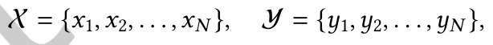
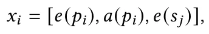
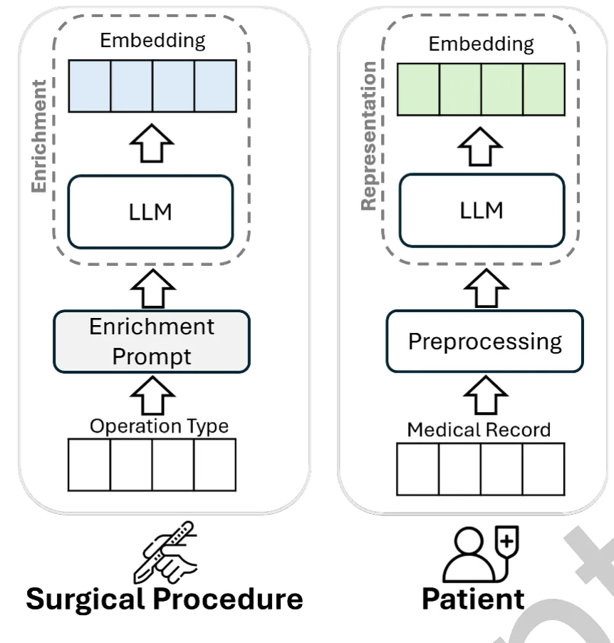
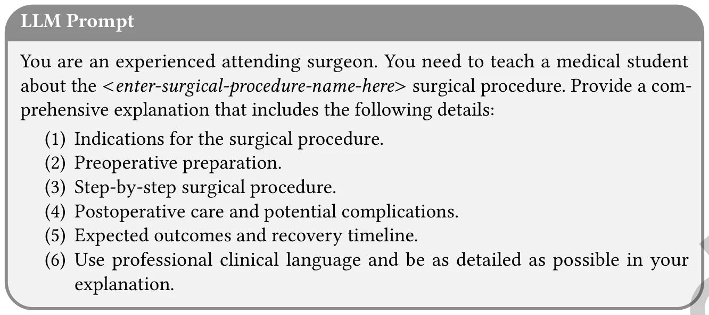
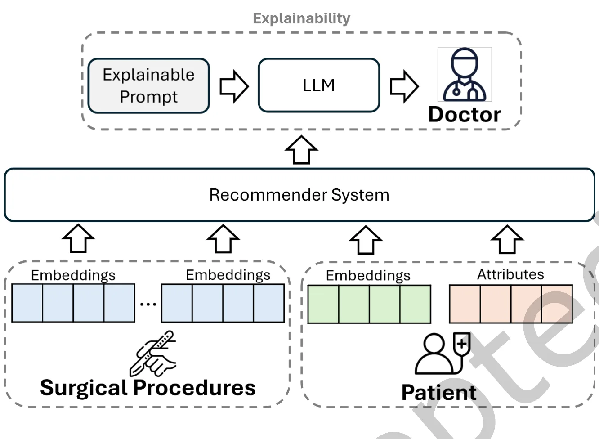
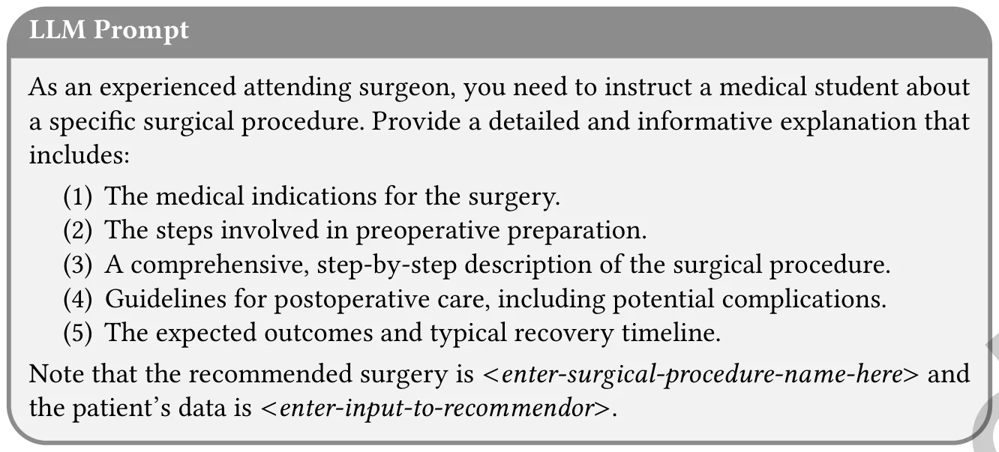
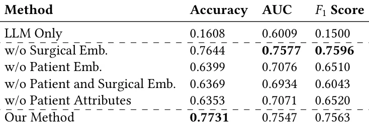
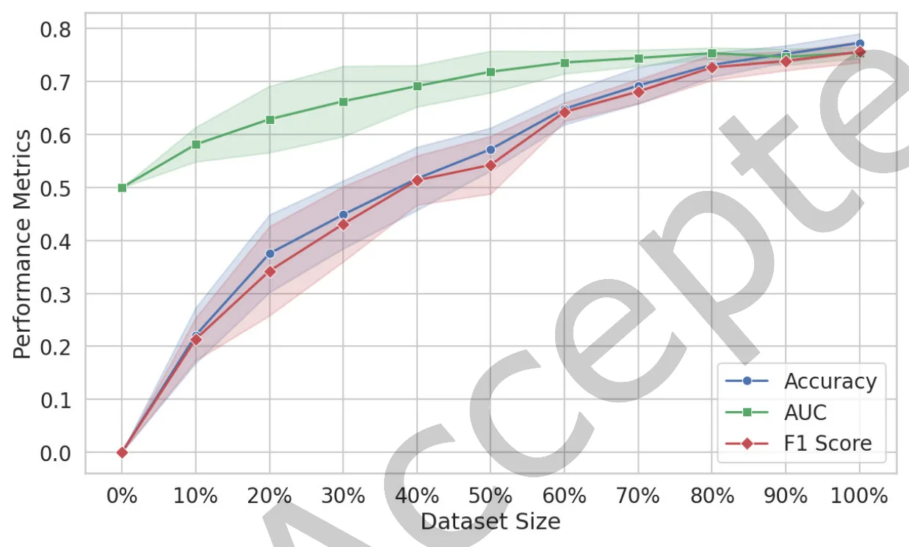
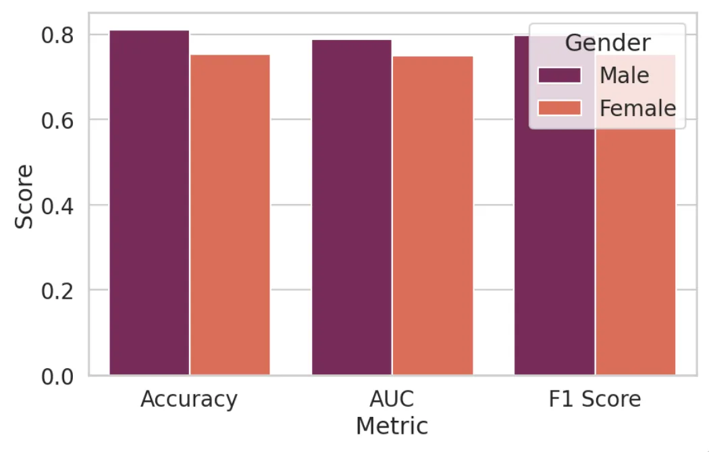
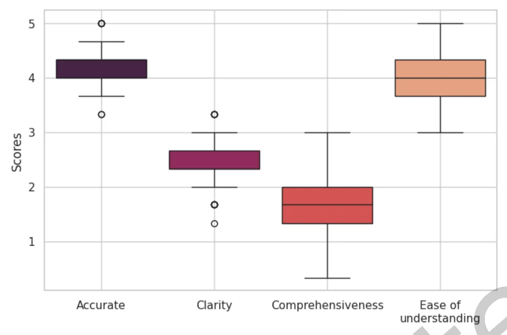

## 1 Introduction

Recommender systems are software tools and techniques designed to provide users with item suggestions [69]. They are predominantly used in various applications, including e-commerce [1, 18], social networks [101, 103], points of interest [96], and news [5]. Recently, health recommender systems, i.e., systems applied in the healthcare domain [12, 79, 88], have gained popularity. These systems are primarily designed to suggest appropriate medications, predict patient health conditions, and enhance healthcare services. However, health recommender systems face significant limitations [16, 74], such as less accurate recommendations and lower reliability, making it ∗Corresponding author.

2Both authors contributed equally to this research.

Authors’ Contact Information: Adir Solomon, Information Systems, University of Haifa, Haifa, Israel; e-mail: asolomon@is.haifa.ac.il; Maxim Glebov, Sheba Medical Center, Tel HaShomer, Tel Aviv District, Israel; e-mail: hlebau@gmail.com; Teddy Lazebnik, Department of Information Systems, University of Haifa, Haifa, Haifa District, Israel and Department of Computing, Jonkoping University, Jonkoping, Jonkoping County, Sweden; e-mail: teddy.lazebnik@ju.se.

Permission to make digital or hard copies of all or part of this work for personal or classroom use is granted without fee provided that copies are not made or distributed for profit or commercial advantage and that copies bear this notice and the full citation on the irst page. Copyrights for components of this work owned by others than the author(s) must be honored. Abstracting with credit is permitted. To copy otherwise, or republish, to post on servers or to redistribute to lists, requires prior specific permission and/or a fee. Request permissions from permissions@acm.org.

ACM Trans. Recomm. Syst.

## 2 • A. Solomon et al

challenging to convince medical experts of their suggestions. To address these drawbacks, we propose integrating large language models (LLMs) into health recommender systems.

LLMs gained significant traction in both industry and academia [8, 25, 43, 86] due to their high performance in various tasks, such as summarization, translation, and question answering. LLMs are also being utilized in ields like education [37], chemistry, inance [38], and environmental science [108]. LLMs have proven useful in creating dialogue systems for healthcare, answering questions, and generating medical reports from images [27, 36]. For example, Singhal et al. [80] achieved accurate results in medical question-answering by combining different prompting strategies with LLMs. Yang et al. [102] developed a large clinical language model, showing notable results in clinical NLP tasks like clinical concept extraction and medical relation extraction. Despite their capabilities, relying solely on LLMs can lead to less accurate results and concerns about transparency and interpretability [86]. Therefore, our proposed method combines LLMs with recommender systems.

Our method consists of two phases. In the irst phase, we employ an LLM for two primary tasks: information enrichment and information representation. For information enrichment, we use the LLM to add details about surgical procedures when only limited information is available. For information representation, the LLM represents each patient’s electronic medical record with a latent representation. In the second phase, the outputs from the irst phase are used, along with identifiers and patients’ demographic information, as input for a recommender system. The output of the recommender system, i.e., the most recommended surgical procedure category, is then explained to the clinician using an LLM. The prompts for information enrichment and result explanation were developed and ine-tuned based on the literature [52, 73, 86] and in close collaboration with experienced clinicians. This approach establishes our method as a health recommender system tailored for healthcare professionals, offering personalized surgical procedure recommendations based on patient-speciic data.

We evaluated our method through a joint research project with one of the largest hospitals in Israel responsible for more than 600 thousand individuals. The dataset comprised 68,633 patients with their demographic attributes and medical records, and 1,731 unique surgical procedures mapped to 17 categories. The medical records were in Hebrew (with English terms occasionally used), a morphologically rich language posing unique challenges due to its ambiguous text and various possible inflections [30, 35, 55, 81]. To deal with these challenges, we explored several recent Hebrew LLMs, such as DictaLM [78]. In addition, in order to assess the explainability of our method, we conducted a case study with several clinicians based on a set of recommendations made by our method. As part of our experiments, we analyzed the results based on varying amounts of data, identifying the necessary data volume to achieve successful surgical procedure recommendations. Additionally, we publicly release the code for our method to facilitate reproducibility and further research.1 The contributions of this study are as follows:

- We propose a novel method that integrates LLMs with recommender systems to provide surgical procedure recommendations based on a real-world dataset. Our method demonstrated high performance and has the potential to assist healthcare professionals in selecting appropriate surgical procedures.
- We utilize LLMs for three distinct tasks: information enrichment, information representation, and explaining results. Our indings indicate that leveraging LLMs improved the performance of the recommender system. A case study with clinicians showed that LLMs could better explain the recommender system results.
- We present a generic approach in which our method can be used with any recommender system and LLM. As part of the generalizability of our method, we use the embeddings of patients’ medical records and the enriched information on surgical procedures as plug-and-play features.
- We engineer prompts with several experienced clinicians for enriching information for surgical procedures and for explaining results obtained by recommender system models. These prompts can be utilized in other LLMs for similar tasks.
- We examine various recent LLMs to address challenges associated with rich morphological languages. By evaluating these LLMs, we identified the most suitable ones for enhancing surgical procedures and ensuring accurate recommendations, specifically focusing on the Hebrew language, in general, and "medical" Hebrew, in particular.

The structure of the paper is as follows: Section 2 provides an overview of related work. Section 3 defines the problem we address, while Section 4 describes the proposed method in detail. Section 5 presents the dataset, outlines the recommender systems and language models used, explains the experimental setup, and reports the results. Section 6 discusses the indings, and inally, Section 7 summarizes the study and its contributions.

## 2 Related Work

### 2.1 Health Recommender Systems

In healthcare, health recommender systems are primarily used by two types of end-users: patients and healthcare professionals [16, 88, 98]. Most health recommender systems focus on improving patients’ wellness rather than directly providing recommendations for diagnoses or treatments [63]. For example, recent studies in this area have developed systems to recommend health-enhancing routes [6] or promote healthy habits and lifestyle changes [7, 45]. Malmir et al. [49] proposed a fuzzy expert system that uses rule-based reasoning, incorporating both patients’ symptoms and doctors’ expertise, to support decision-making for conditions such as kidney stones and infections. Similarly, Stark et al. [83] introduced a system that recommends migraine medications to medical professionals, leveraging the Neo4J graph database to provide personalized suggestions.

De Croon et al. [12] emphasized the potential of recommender systems in healthcare for enhancing patient services. Their study demonstrated applications for diabetes patients, including estimating carbohydrate intake and predicting both past and future physical activity, such as outdoor activities like walking. Similarly, Narducci et al. [56] introduced a similarity-based algorithm within their health recommender system. Their approach calculates patient similarities and generates a ranked list of doctors and hospitals, generating personalized recommendations based on shared community health data.

This growing body of work highlights the potential of health recommender systems to improve personalized care and optimize healthcare services. In this study, we propose a health recommender system that integrates LLMs with a deep learning model to provide personalized surgical procedure recommendations for healthcare professionals [98]

### 2.2 Large Language Models

Recently, LLMs have become very popular for providing recommendations in the domain of recommender systems, outperforming traditional methods on several tasks such as top-k recommendation, rating prediction, and conversational recommendation [28, 100, 106]. Several works [39, 46] integrate traditional techniques like collaborative iltering and content-based recommender systems with LLMs, demonstrating high accuracy in recommendations. Additionally, LLMs have been instrumental in enhancing various recommendation tasks, such as sequential recommendations [26, 44], long-tail recommendations [99], and addressing the cold-start recommendation problem [71].

In the healthcare domain, LLMs have been employed to advance several areas including clinical applications, research, and education [86]. In clinical applications, LLMs have the potential to improve diagnostic accuracy and support decision-making [36]. Namely, Pressman et al. [64] emphasized that in surgical settings LLMs have the ability to assist surgeons in several common tasks such as surgical planning, and guidance. Furthermore, LLMs have been used for online medical consultations [67] and medical query-answering tasks [95]. For instance, Mesko et al. [52] present general guidelines for engineering prompts for LLMs, emphasizing the need to ask an LLM to assume roles (e.g., "as a medical doctor"). Savage et al. [72] propose diagnostic reasoning prompts to enhance interpretability in diagnoses. Similarly, Sayin et al. [73] explore the use of LLMs to correct medical decisions, focusing on prompt engineering to explain the rationale behind diagnoses.

In a recent study, [34] introduced Health-LLM, a system for making disease predictions by incorporating health reports, medical expertise, and expert insights. In another recent study, [21] explored the use of ensemble machine learning (ML) models (XGBoost and Bio-Clinical-BERT) with the LLM of GPT-4 for predicting admissions from the emergency room, highlighting the use of an LLM to explain the results. Recent work [59] introduced SurgeryLLM, a retrieval-augmented generation framework designed to support surgical decision-making by incorporating external domain-speciic knowledge such as clinical guidelines into LLM responses. Their study demonstrated that SurgeryLLM outperformed a non-augmented LLM across multiple routine tasks such as checking patient records for missing clinical investigation data and developing recommendations for next management steps based on national surgical guidelines. Their results highlight the potential of integrating curated medical knowledge to enhance LLM performance.

Our proposed method differs from existing works in several key ways. Initially, we combine LLMs with recommender systems to serve as a health recommender system for providing surgical procedure recommendations. Moreover, our method employs LLMs for both information enrichment and representation, enhancing the details available for surgical procedures and creating latent representations of patient medical records. Additionally, we use LLMs to explain the results to medical professionals, thus improving the interpretability of the recommendations. Our method is designed to be adaptable, and capable of integrating with any recommender system and LLM, making it versatile for various healthcare applications. Furthermore, we demonstrate the applicability of our method with medical reports written in a rich morphological language, highlighting the generalizability of the method to work with many languages. Lastly, the prompts for our LLMs were developed and ine-tuned in close collaboration with experienced clinicians, ensuring that the system’s outputs are relevant and useful in clinical settings.

## 3 Problem Formulation

Given a set of patients P = {𝑝1, 𝑝2, . . . , 𝑝𝑁}, and a set of surgical procedure categories S, the goal is to recommend the most appropriate surgical procedure category 𝑠∗ ∈S for each patient 𝑝𝑖 ∈P, while providing an explainable justification for the recommendation.

Let the problem be defined as a multi-class classification task, where:

such that 𝑥𝑖 represents the input features for patient 𝑝𝑖, and 𝑦𝑖 ∈S denotes the true label, representing the surgical procedure category selected by a committee of doctors.

The input 𝑥𝑖 is composed of multiple feature sets:

where:

- 𝑒(𝑝𝑖): Embedding vector representing the patient 𝑝𝑖, obtained from an LLM.
- 𝑎(𝑝𝑖): Demographic attributes of the patient, such as age and gender.
- 𝑒(𝑠𝑗): Embedding vector representing the surgical procedure category 𝑠𝑗, obtained from enriched textual descriptions via an LLM.

We employ a health recommender system for predicting the most suitable surgical procedure category, denoted as 𝑠ˆ𝑦𝑖. Then, we employ an LLM for generating an explanation with textual information, exp(𝑝𝑖,𝑠ˆ𝑦𝑖).

<figure id="fig-1">

<figcaption>Fig. 1. Overview of Phase 1 used for enriching information on the surgical procedure and representing patients’ medical records.</figcaption>
</figure>

## 4 Methodology

### 4.1 Phase 1 ś Information Representation and Information Enrichment

We present an overview of Phase 1 in Figure 1. The right side of the igure represents the patient’s medical record, while the left side illustrates the process used to generate the surgical procedure’s latent representation. **Information Representation.** We collect all medical records for each patient. A medical record contains free text documented by clinicians and structured information on specific measurements taken during patient-clinician meetings. We preprocess the patient’s medical records by converting each record into a textual representation. All textual records for a patient are concatenated into a single text ile. This text ile is then input into an LLM to generate ixed-size embeddings, represented by the green vector in Figure 1.

**Information Enrichment.** The surgical procedures in this study have very limited informationÐonly the category of the surgical procedure. We hypothesize that LLMs can enrich the information regarding each type of surgical procedure, similar to recent studies [36, 86]. Given a surgical procedure category, we designed a prompt to enrich information about the surgical procedure. This prompt was developed in full collaboration with seven experienced clinicians (each with more than ten years of experience) and based on important guidelines from recent works [52, 72, 73]. Inspired by recent techniques for automatically optimizing prompts [106], we ine-tuned the initial prompt using ChatGPT with the following instruction: "As an LLM, given the following query: < 𝑞𝑢𝑒𝑟𝑦 >, rephrase it in a way that an LLM would provide the most accurate and informative answer for such a query." The inal prompt, presented in Figure 2, was approved by all clinicians involved. The enriched information generated by the LLM is then reintroduced to the LLM to obtain a ixed-size embedding.

We use several language models for representing and enriching information about patients and surgical procedures. We evaluate well-known LLMs such as GPT-2 [66] and LLaMA [87]. To handle Hebrew text, we also explore LLMs specifically trained for the Hebrew language:

<figure id="fig-2">

<figcaption>Fig. 2. Enrichment prompt used for enriching information regarding the surgical procedures.</figcaption>
</figure>

- **Word2vec [53].** We use a pretrained version of Word2vec based on Wikipedia.2 In this study, an average vector representation is used for each patient.
- **AlephBERT [75].** AlephBERT is a pre-trained language model designed for Modern Hebrew, addressing the challenges of Hebrew’s rich morphology. It uses a transformer-based architecture similar to BERT, optimized for Hebrew’s specific linguistic features. Trained on a large corpus of Hebrew texts, AlephBERT captures nuanced language patterns and handles morphological and syntactic analysis effectively, making it highly suitable for various NLP tasks.
- **AlephBERTGimmel (ABG) [22].** AlephBERTGimmel is a pre-trained language model for Modern Hebrew with an expanded vocabulary that reduces token splits and enhances the model’s ability to understand and generate text. It employs a transformer architecture and leverages a larger training dataset to capture a broader range of linguistic nuances. AlephBERTGimmel achieves high accuracy across various Hebrew language tasks, demonstrating substantial improvements in NLP tasks compared to its predecessor, AlephBERT.
- **DictaLM-2.0.**3 DictaLM-2.0, based on the Mistral-7B-v0.1 architecture [32], is developed to enhance Hebrew language processing. This model includes several key changes: an extended tokenizer with 1,000 additional tokens specifically tailored for Hebrew, which significantly improves tokenization efficiency by reducing the average number of tokens per word. Furthermore, DictaLM-2.0 undergoes continued pretraining on over 190 billion tokens of naturally occurring text, with a balanced composition of 50% Hebrew and 50% English. These modifications enhance the model’s capability to handle complex linguistic tasks in Hebrew and make it a powerful tool for various NLP applications in Hebrew language technologies.

The output of Phase 1 is an embedding representing the patient and an embedding representing the surgical procedure.

### 4.2 Phase 2 ś Recommending and Explaining Surgical Procedure Suggestions

In Phase 2, we utilize a recommender system model based on the embeddings generated from Phase 1. The surgical procedure is represented by a concatenation of the embeddings of all possible surgical procedures obtained from Phase 1. The patient is represented by a unique identifier, demographic attributes (age and gender), and the latest complete blood count measurements, along with the patient’s embeddings obtained from Phase 1. The analogy here is that the recommender system can recommend the patient (user) and surgical procedure (item) with high accuracy. We present an overview of Phase 2 in Figure 3.

<figure id="fig-3">

<figcaption>Fig. 3. Overview of Phase 2 used for recommending a surgical procedure and explaining the recommendation.</figcaption>
</figure>

Our method integrates both structured and unstructured patient data, leveraging embeddings generated in Phase 1 alongside additional clinical attributes. We examine several recommender system models, each designed to model complex interactions between patient information and surgical procedures. Speciically, we employ the following models:

- **DeepFM [24].** Deep Factorization Machine (DeepFM) combines the strengths of traditional factorization machines (FMs) and deep neural networks (DNNs). The FM component efficiently models low-order feature interactions, such as pairwise correlations between features, making it highly effective for sparse data. In addition, the DNN component captures high-order feature interactions, enabling the model to learn complex, non-linear relationships. By integrating these two components into a unified framework, DeepFM is able to provide robust performance across various recommendation tasks. In our context, we employ DeepFM in order to capture interactions between patient embeddings, surgical embeddings, and demographic attributes, which may result in precise surgical procedure recommendations.
- **DIFM [47].** The Dual Input-aware Factorization Machine (DIFM) extends the traditional FM by incorporating an input-aware mechanism. This mechanism dynamically assigns different weights to feature interactions based on their relevance, enabling the model to prioritize the most informative features. DIFM employs two main components: a global feature interaction layer for capturing holistic patterns and a local feature interaction layer for learning iner-grained relationships. This dual-layer structure enhances the model’s ability to adapt to varying inputs, making it particularly effective for personalized recommendations in healthcare scenarios.
- **FiBiNET [29].** The Feature Importance and Bilinear Interaction Network (FiBiNET) is a deep recommender system designed to enhance feature interaction modeling by dynamically assigning importance to different input features. At its core, FiBiNET leverages a feature importance module that uses an attention mechanism to learn the relative significance of each feature. This mechanism allows the model to focus on the most relevant features while reducing the influence of less critical ones, ensuring that the recommendations are informed by the most impactful data. FiBiNET also introduces bilinear interaction layers, which transform feature vectors into higher-dimensional spaces, allowing the model to represent interactions with greater complexity and nuance. Its ability to automatically prioritize features and model complex interactions makes it suitable for our task.
- **PLE [85].** Progressive Layered Extraction (PLE) is a multi-task learning framework designed to address the challenges of balancing shared and task-speciic information in recommendation systems. It introduces a layered architecture that decomposes feature representations into shared and task-speciic networks, allowing the model to extract generalized patterns while preserving the unique characteristics of individual tasks. The shared network captures common knowledge applicable across all tasks, while the task-speciic networks progressively refine these representations to focus on distinct objectives. PLE particularly effective for scenarios involving related tasks, such as predicting preferences across multiple item categories or optimizing diverse user engagement metrics. By effectively separating shared and task-speciic learning, PLE enhances predictive accuracy.

These recommender system models process both explicit patient data (e.g., age, gender, clinical measurements) and latent representations (e.g., patient embeddings, surgical embeddings) to improve the relevance and accuracy of the recommendations. Furthermore, we are also motivated by the success shown in recent works that leverage these models in the context of the healthcare domain [104, 105]. By considering both low-order and high-order feature interactions, our recommender system is able to predict the most suitable surgical procedure from the set of all possible surgical procedure types and use the prediction of surgical procedure success as input to an LLM with an explainable prompt.

**Explainable Prompt Development.** This prompt was designed by seven experienced clinicians4 (3 oncologists, 2 anesthesiologists, and 2 general practitioners) with 7, 24, 16, 11, 9, 18, and 28 years of practice following their MD studies. The clinicians were voluntarily recruited through institutional networks with no compensation provided. The initial query aimed to elicit a general explanation of surgical procedures but was deemed too broad and lacking in structure. The irst draft of the prompt simply asked:

"Explain the &lt;enter-surgical-procedure-name-here> surgical procedure, including its purpose, steps, and recovery process."

Following initial online discussions with the clinicians, we introduced a more structured format to ensure clarity and completeness:

"Describe the &lt;enter-surgical-procedure-name-here> surgical procedure in a structured manner, covering its indications, key steps, and recovery phase. Use professional medical terminology."

Despite the improved organization, further online discussions revealed the need to incorporate preoperative preparation and postoperative considerations to better reflect the clinical decision-making process. The revised prompt was reined accordingly:

"As a surgeon, provide a structured and detailed explanation of the &lt;enter-surgical-procedure-name-here> procedure. Include the indications, necessary preoperative preparation, key surgical steps, postoperative care, and potential complications. Use precise medical terminology."

ACM Trans. Recomm. Syst.

<figure id="fig-4">

<figcaption>Fig. 4. Explainable prompt used for explaining the suggestion made by the recommender system.</figcaption>
</figure>

After an online discussion and a dedicated workshop, clinicians suggested adapting the prompt to an instructional setting, ensuring that the LLM assumes the role of an attending surgeon guiding a medical student. This refinement follows key principles in prompt engineering, such as persona definition, task specificity, and role assignment, as outlined in the literature [52, 54, 60]. This resulted in the following reined version:

"You are an experienced attending surgeon responsible for teaching a medical student about the

&lt;enter-surgical-procedure-name-here> procedure. Provide a detailed explanation that includes: - Clinical indications. - Preoperative preparation. - Step-by-step surgical procedure. - Postoperative care and potential complications. - Expected recovery timeline. Use professional medical terminology and ensure clarity for an advanced learner."

After testing this version on sample cases using GPT-2 and manually reviewing the responses, the inal version of the prompt was unanimously approved by all participating clinicians. The inal form, designed to maximize clarity, comprehensiveness, and clinical accuracy, is presented in Figure 4.

## 5 Evaluation

### 5.1 Dataset

The dataset utilized in this research was provided by the largest hospitals in Israel, encompassing records from 68,633 consecutive surgical patients and 1,731 unique surgical procedures collected between 2018 and 2024. A successful surgical procedure is defined as one that has been approved by all clinical experts involved in the operation, following the hospital’s internal protocol. In this institution, a surgical procedure is performed only if there is consensus among all attending physicians, a process designed to minimize the likelihood of incorrect surgical decisions [94]. While consensus-based decision-making may still have inherent limitations [14], it serves as a strong indicator that the chosen procedure aligns with clinical best practices.

The dataset comprises 41.3% male patients and 58.7% female patients. The mean age of the patients was 57.9 years, with a standard deviation of 18.7 years; the median age was 51 years, the minimum age was 18, and the maximum age was 107.

**Surgical Procedure Categorization.** The dataset originally contained 1,731 unique surgical procedures, which we grouped into 17 broader surgical categories with the following distribution: Cardio-vascular (9.1%), Oncology (8.8%), Arthroscopy (8.1%), Orthopedic (7.4%), Otolaryngologic (7.3%), Pediatric (7.0%), Hand (6.3%), Ophthalmologic (6.1%), Plastic and reconstructive (5.9%), Gynecological (5.9%), Gastrointestinal (5.8%), Ophthalmic (5.2%), Urology (5.1%), Emergency (3.4%), Orthodontic (3.1%), Neurosurgery (2.8%), Maxillofacial (2.7%). We note that our dataset distinguishes Hand as a specialized sub-category within Orthopedics. Hand-related surgeries often involve unique characteristics and are generally considered more complex than other orthopedic procedures [92]. The ’Orthopedic’ category encompasses surgeries addressing various parts of the musculoskeletal system, including the hip, knee, spine, and foot/ankle, excluding procedures explicitly categorized under ’Hand.’ This distinction ensures that the classification accurately reflects the complexity and specificity of surgical interventions within these ields.

Furthermore, we aggregated individual procedures into broader surgical categories to enhance the generalizability of our recommender system. By structuring the prediction task at a higher categorical level, we mitigate the challenges posed by highly imbalanced distributions of specific surgical procedures. This approach aligns with hospital-wide resource allocation strategies and patient management protocols, ensuring that the recommender system remains both clinically meaningful and operationally practical.

### 5.2 Baselines

To evaluate the effectiveness of the recommender system models, we also employ several ML models. XGBoost [10], known for its efficiency and performance in handling large-scale datasets, is widely used in the healthcare domain. Additionally, we examine two popular automated ML (AutoML) tools: TPOT [58], which uses genetic programming to optimize ML pipelines, and AutoKeras [33], which automates deep learning model selection and hyperparameter tuning. We also evaluate a standard multilayer perceptron (MLP).5

To evaluate the impact of LLMs within our method, we introduce a baseline that does not incorporate any LLM. Instead, this baseline represents the text from patients’ medical records using TF-IDF. As in our proposed method, it also includes the patient’s unique identifier, demographic attributes (age and gender), and the most recent complete blood count measurements. Throughout the paper, we refer to this baseline as TF-IDF.

### 5.3 Experimental Setings

**Validation.** We use 80% of the data as a training set and the last 20% as a test set, based on the chronological order of the records. This choice simulates a realistic deployment scenario in which models are trained on historical data and applied to future cases. As such, it serves as a form of external validation, offering a more accurate reflection of model performance in real-world clinical settings. This setup also allows us to account for potential concept drift, such as changes in clinical protocols or treatment patterns over time [11]. We adapted our method as a multi-class prediction task to predict 17 classes, simulating similar decisions made by clinicians in the hospital. **Hyperparameters.** The text embeddings have been generated from the LLMs by using each model’s default configuration. In addition, we implement all recommender system models with the DeepCTR PyTorch framework [77]. The hyperparameters listed below reflect the default settings provided by the respective libraries, without dataset-speciic tuning. This choice was made to evaluate the general applicability and robustness of each model under standard conditions. The main hyperparameters used for the recommender systems are as follows:

- DeepFM ś The DeepFM model is configured with a combination of FMs and DNNs to capture both low-order and high-order feature interactions. The DNN is structured with two hidden layers containing 256 and 128 units, using the 𝑅𝑒𝐿𝑈 activation function. Regularization includes 𝐿2 penalties of 1𝑒 − 05 for both the linear and embedding components.
- DIFM ś The DIFM model incorporates a combination of linear and deep feature interactions with an attention mechanism to enhance feature representation. The attention mechanism is configured with 4 attention heads and a residual connection enabled. The DNN component has two hidden layers with 256

and 128 units, employing the 𝑅𝑒𝐿𝑈 activation function. Regularization includes 𝐿2 penalties of 1𝑒 − 05 for both the linear and embedding components.

- FiBiNET ś The FiBiNET model is configured with a DNN alongside bilinear feature interaction. The bilinear interaction is set to the interaction type to capture pairwise feature interactions, and a reduction ratio of 3 is applied for feature dimension reduction. The DNN consists of two hidden layers, each with 128 units with the 𝑅𝑒𝐿𝑈 activation function. Regularization includes 𝐿2 penalties of 1𝑒 − 05 for both the linear and embedding components.
- PLE ś The PLE is configured with one shared expert and one specific expert per task across two progressive levels. The expert networks are configured with two layers containing 256 and 128 units, while gate networks and task-speciic towers each have one layer with 64 units. All networks use the 𝑅𝑒𝐿𝑈 activation function. Regularization includes L2 penalties of 1𝑒 − 05 for linear and embedding components.

We use ten epochs and a batch size of 256 for all recommender system models.

**Hardware.** We note that none of the LLMs has been ine-tuned, and all models have been applied using the standard hospital resources provided to us: Intel(R) Core(TM) i7-10510U CPU with 64 GB of RAM. **Explaining the Recommendations.** The LLM used for explaining the recommendation was GPT-2 with a temperature value set to 0.5, which is the default setting. While we acknowledge that lower temperature values may improve consistency across generations, they can also reduce creativity and potentially diminish the explanatory richness or creativity of the outputs. Furthermore, recent studies [61, 68] showed that the temperature value has (if any) a weak effect on the LLMs’ performance. To evaluate the explanations, we used Medcase6, a clinical tagging company that provides tagging by healthcare professionals worldwide. We used 100 random samples that aligned with the distribution of cases from different surgical procedure categories. The taggers, three medical experts holding a Doctor of Medicine degree and having completed their residency in surgery, received the healthcare records translated into English by Google Translate after manually removing identifying information. They were also provided with the prediction made by our recommender system and the LLM’s English explanation.

To assess the quality and interpretability of these explanations, we designed four Likert-scale questions based on principles from human-centered explainability. Speciically, our criteria were informed by the QUEST framework proposed by Tam et al. [84], which outlines key dimensions for evaluating LLMs in healthcare. Our selected dimensions align with several of its components: Accuracy and Comprehensiveness correspond to the "Quality of Information" dimension; Clarity aligns with "Expression Style"; and Ease of Understanding captures aspects of "Understanding and Reasoning." These questions were carefully chosen to ensure that evaluators could meaningfully judge the relevance, correctness, and comprehensibility of the model’s output in a clinical context.

We also used a 5-point Likert scale for each question, as this method is widely employed in human evaluations of large language models [65, 84, 89]. Likert scales enable nuanced assessments, allowing evaluators to distinguish between fully accurate and partially accurate outputs, and to express varying degrees of satisfaction or trust. This approach provides both quantitative insights for statistical analysis and a richer qualitative understanding of the user experience.

The taggers were asked to answer four questions designed with the consultation of a clinician, using a Likert scale (1-5):

- Accuracy of prediction ś How accurate do you ind the prediction of surgery type provided by the LLM?
- Clarity of explanation ś How clear and well-explained are the surgical procedures provided by the LLM?
- Comprehensiveness ś How comprehensive are the answers provided by the LLM regarding the details of the surgical procedures?
- Ease of understanding ś How easy is it to understand the information provided by the LLM about surgical procedures?

Higher scores on the Likert scale indicated a stronger presence of the evaluated quality attribute. The evaluation was conducted independently by the three clinical experts.

### 5.4 Results

5.4.1 Overall Performance. We present the micro-average AUC, macro-average 𝐹1 score, the area under the precision-recall curve (AUPRC), and accuracy in Tables 1, 2, 3, 4 respectively. The overall results indicate that while general ML models such as TPOT and XGBoost achieve commendable results, they tend to have lower AUC and 𝐹1 scores compared to recommender system models like DeepFM and PLE. These indings highlight the superiority of recommender system models for recommending surgical procedures due to their ability to capture and leverage complex feature interactions effectively.

The differences in performance between the recommender system models are relatively small, with all these models achieving high AUC and 𝐹1 scores. Based on a KruskalśWallis test, we found that the case of AlephBERT- Gimmel together with DeepFM and DictaLM-2.0 together with DeepFM obtain statistically similar performance while outperforming all other configurations (𝑝 < 0.05). This observation indicates that while each model has its unique approach to capturing feature interactions and making recommendations, their overall effectiveness in this task is quite comparable.

We also observe that TF-IDF consistently underperforms across all evaluated models, highlighting its limitations in representing patients’ medical records. Unlike LLM-based embeddings, which capture semantic information, TF-IDF relies solely on term frequency-based representations, making it ineffective at modeling the underlying structure of medical text. This challenge is further exacerbated by the fact that the medical records in our dataset are written in Hebrew, a morphologically rich language with complex inflections and word variations. As a result, TF-IDF struggles to capture the necessary linguistic depth for meaningful representation. These indings further underscore the advantage of leveraging LLMs in conjunction with recommender systems to enhance the accuracy of surgical procedure recommendations in healthcare settings.

We analyzed the results from the perspective of language models, focusing on the performance of Hebrew-based LLMs such as DictaLM-2.0 compared to multilingual LLMs like GPT-2 and LLaMA. Surprisingly, we observed that multilingual LLMs achieved similar results to Hebrew-based LLMs with most ML and recommender system models. This suggests that even with data involving rich morphological languages like Hebrew, there is limited added value in employing Hebrew-based LLMs for the surgical procedure recommendation task. This observation may result from the relatively limited professional medical jargon used in the analyzed patient records. However, it is noteworthy that pre-trained models like AlephBERTGimmel also achieve high AUC and 𝐹1 scores with all recommender system models. This result indicates the effectiveness of robust pre-training, even for specialized languages.

For the rest of this study, we implement our method by employing DIFM as a recommender system and AlephBERTGimmel (ABG) as a language model due to their high values in the overall performance with all measurements, i.e., DIFM and ABG consistently deliver competitive results across all evaluation metrics.

5.4.2 Surgical Procedure Categories. To evaluate our method by employing the DIFM model with ABG across different categories of surgeries, we analyze the AUCPRC and AUC performance per each category and present the results in Table 5. We observe that our method’s performance varies across different categories, with cardiovascular and oncology procedures achieving the highest AUC and AUPRC scores. This could be attributed to the relatively high volume of data available for these categories, which facilitates better feature representation and learning. Conversely, categories such as neurosurgery and maxillofacial exhibit lower AUC and AUPRC scores, likely due to their smaller sample sizes and greater procedural complexity.

<figure class="table-figure" id="table-1">
<figcaption>Table 1. AUC for different classification models and language models.</figcaption>

<table><tr><th>Model</th><th>AlephBERT</th><th>DictaLM-2.0</th><th>GPT-2</th><th>LLaMA</th><th>Word2vec</th><th>ABG</th><th>TF-IDF</th></tr><tr><td>AutoKeras</td><td>0.6646</td><td>0.7179</td><td>0.7122</td><td>0.7095</td><td>0.6483</td><td>0.7159</td><td>0.5321</td></tr><tr><td>TPOT</td><td>0.6665</td><td>0.7024</td><td>0.6796</td><td>0.6661</td><td>0.6522</td><td>0.6872</td><td>0.5487</td></tr><tr><td>XGBoost</td><td>0.6544</td><td>0.6895</td><td>0.6689</td><td>0.6474</td><td>0.6275</td><td>0.6927</td><td>0.5312</td></tr><tr><td>MLP</td><td>0.6438</td><td>0.7164</td><td>0.6973</td><td>0.6938</td><td>0.6256</td><td>0.7142</td><td>0.5256</td></tr><tr><td>DIFM</td><td>0.7038</td><td>0.7623</td><td>0.7586</td><td>0.7489</td><td>0.6852</td><td>0.7547</td><td>0.5823</td></tr><tr><td>DeepFM</td><td>0.7129</td><td>0.7624</td><td>0.7573</td><td>0.7544</td><td>0.6991</td><td>0.7628</td><td>0.5975</td></tr><tr><td>FiBiNET</td><td>0.6931</td><td>0.7543</td><td>0.7383</td><td>0.7436</td><td>0.6833</td><td>0.7591</td><td>0.5995</td></tr><tr><td>PLE</td><td>0.7061</td><td>0.7574</td><td>0.7613</td><td>0.7519</td><td>0.7022</td><td>0.7548</td><td>0.6051</td></tr></table>

</figure>

<figure class="table-figure" id="table-2">
<figcaption>Table 2. 𝐹1 score for different classification models and language models.</figcaption>

<table><tr><th>Model</th><th>AlephBERT</th><th>DictaLM-2.0</th><th>GPT-2</th><th>LLaMA</th><th>Word2vec</th><th>ABG</th><th>TF-IDF</th></tr><tr><td>AutoKeras</td><td>0.6616</td><td>0.6912</td><td>0.7003</td><td>0.6750</td><td>0.5410</td><td>0.6982</td><td>0.1385</td></tr><tr><td>TPOT</td><td>0.5716</td><td>0.6501</td><td>0.6191</td><td>0.6030</td><td>0.5802</td><td>0.6342</td><td>0.1454</td></tr><tr><td>XGBoost</td><td>0.6173</td><td>0.6244</td><td>0.6022</td><td>0.5469</td><td>0.5726</td><td>0.6258</td><td>0.1349</td></tr><tr><td>MLP</td><td>0.6306</td><td>0.6791</td><td>0.6734</td><td>0.6812</td><td>0.5166</td><td>0.6964</td><td>0.1322</td></tr><tr><td>DIFM</td><td>0.6552</td><td>0.7554</td><td>0.7701</td><td>0.7606</td><td>0.6349</td><td>0.7563</td><td>0.1582</td></tr><tr><td>DeepFM</td><td>0.6564</td><td>0.7581</td><td>0.7441</td><td>0.7697</td><td>0.6291</td><td>0.7555</td><td>0.1518</td></tr><tr><td>FiBiNET</td><td>0.6502</td><td>0.7663</td><td>0.7436</td><td>0.7619</td><td>0.6213</td><td>0.7674</td><td>0.1464</td></tr><tr><td>PLE</td><td>0.6521</td><td>0.7433</td><td>0.7599</td><td>0.7500</td><td>0.6120</td><td>0.7615</td><td>0.1491</td></tr></table>

</figure>

<figure class="table-figure" id="table-3">
<figcaption>Table 3. AUPRC for different classification models and language models.</figcaption>

<table><tr><th>Model</th><th>AlephBERT</th><th>DictaLM-2.0</th><th>GPT-2</th><th>LLaMA</th><th>Word2vec</th><th>ABG</th><th>TF-IDF</th></tr><tr><td>AutoKeras</td><td>0.6324</td><td>0.6852</td><td>0.6893</td><td>0.6701</td><td>0.5126</td><td>0.6934</td><td>0.1616</td></tr><tr><td>TPOT</td><td>0.5623</td><td>0.6429</td><td>0.6110</td><td>0.5908</td><td>0.5647</td><td>0.6493</td><td>0.1781</td></tr><tr><td>XGBoost</td><td>0.6012</td><td>0.6183</td><td>0.5958</td><td>0.5332</td><td>0.5521</td><td>0.6175</td><td>0.1865</td></tr><tr><td>MLP</td><td>0.6156</td><td>0.6721</td><td>0.6639</td><td>0.6694</td><td>0.5093</td><td>0.6897</td><td>0.1349</td></tr><tr><td>DIFM</td><td>0.6458</td><td>0.7532</td><td>0.7594</td><td>0.7482</td><td>0.6279</td><td>0.7593</td><td>0.1959</td></tr><tr><td>DeepFM</td><td>0.6529</td><td>0.7544</td><td>0.7521</td><td>0.7527</td><td>0.6325</td><td>0.7596</td><td>0.2021</td></tr><tr><td>FiBiNET</td><td>0.6413</td><td>0.7486</td><td>0.7381</td><td>0.7462</td><td>0.6203</td><td>0.7541</td><td>0.1977</td></tr><tr><td>PLE</td><td>0.6547</td><td>0.7522</td><td>0.7623</td><td>0.7581</td><td>0.6298</td><td>0.7504</td><td>0.2039</td></tr></table>

</figure>

5.4.3 Ablation Study. In this section, we examine the contribution of each component in our method, leveraging the DIFM model with ABG, by performing an ablation study. The results of excluding each component are presented in Table 6. To evaluate the performance of our method relying solely on an LLM, we employ GPT-2 for recommending the surgical procedure using the following prompt: "Given the following data &lt;data> and list of surgical procedures &lt;surgical procedures>, what is the best surgical procedure to perform for this patient?" This approach is referred to as "LLM Only" in Table 6.

<figure class="table-figure" id="table-4">
<figcaption>Table 4. Accuracy for different classification models and language models.</figcaption>

<table><tr><th>Model</th><th>AlephBERT</th><th>DictaLM-2.0</th><th>GPT-2</th><th>LLaMA</th><th>Word2vec</th><th>ABG</th><th>TF-IDF</th></tr><tr><td>AutoKeras</td><td>0.6721</td><td>0.7020</td><td>0.7001</td><td>0.6828</td><td>0.5449</td><td>0.7109</td><td>0.2193</td></tr><tr><td>TPOT</td><td>0.5836</td><td>0.6548</td><td>0.6201</td><td>0.5973</td><td>0.5741</td><td>0.6649</td><td>0.1958</td></tr><tr><td>XGBoost</td><td>0.6321</td><td>0.6366</td><td>0.6077</td><td>0.5561</td><td>0.5786</td><td>0.6376</td><td>0.1822</td></tr><tr><td>MLP</td><td>0.6509</td><td>0.6949</td><td>0.6811</td><td>0.6752</td><td>0.5333</td><td>0.7091</td><td>0.2095</td></tr><tr><td>DIFM</td><td>0.6721</td><td>0.7703</td><td>0.7720</td><td>0.7629</td><td>0.6362</td><td>0.7731</td><td>0.2502</td></tr><tr><td>DeepFM</td><td>0.6816</td><td>0.7731</td><td>0.7663</td><td>0.7646</td><td>0.6383</td><td>0.7732</td><td>0.2624</td></tr><tr><td>FiBiNET</td><td>0.6588</td><td>0.7660</td><td>0.7527</td><td>0.7611</td><td>0.6273</td><td>0.7667</td><td>0.2401</td></tr><tr><td>PLE</td><td>0.6839</td><td>0.7697</td><td>0.7744</td><td>0.7720</td><td>0.6336</td><td>0.7643</td><td>0.2536</td></tr></table>

</figure>

<figure class="table-figure" id="table-5">
<figcaption>Table 5. AUPRC and AUC per each category of surgical procedures using the DIFM model with ABG.</figcaption>

<table><tr><th>Class</th><th>Portion (%)</th><th>AUPRC</th><th>AUC</th></tr><tr><td>Cardio-vascular</td><td>9.1</td><td>0.7821</td><td>0.7793</td></tr><tr><td>Oncology</td><td>8.8</td><td>0.7684</td><td>0.7701</td></tr><tr><td>Arthroscopy</td><td>8.1</td><td>0.7613</td><td>0.7589</td></tr><tr><td>Orthopedic</td><td>7.4</td><td>0.7532</td><td>0.7517</td></tr><tr><td>Otolaryngologic</td><td>7.3</td><td>0.7501</td><td>0.7482</td></tr><tr><td>Pediatric</td><td>7.0</td><td>0.7465</td><td>0.7441</td></tr><tr><td>Hand</td><td>6.3</td><td>0.7409</td><td>0.7398</td></tr><tr><td>Ophthalmologic</td><td>6.1</td><td>0.7372</td><td>0.7359</td></tr><tr><td>Plastic and reconstructive</td><td>5.9</td><td>0.7348</td><td>0.7335</td></tr><tr><td>Gynecological</td><td>5.9</td><td>0.7341</td><td>0.7327</td></tr><tr><td>Gastrointestinal</td><td>5.8</td><td>0.7307</td><td>0.7291</td></tr><tr><td>Ophthalmic</td><td>5.2</td><td>0.7254</td><td>0.7239</td></tr><tr><td>Urology</td><td>5.1</td><td>0.7229</td><td>0.7218</td></tr><tr><td>Emergency</td><td>3.4</td><td>0.7113</td><td>0.7101</td></tr><tr><td>Orthodontic</td><td>3.1</td><td>0.7054</td><td>0.7038</td></tr><tr><td>Neurosurgery</td><td>2.8</td><td>0.6981</td><td>0.6965</td></tr><tr><td>Maxillofacial</td><td>2.7</td><td>0.6939</td><td>0.6924</td></tr></table>

</figure>

The use of only an LLM as a recommender system results in the poorest performance, with the lowest AUC and 𝐹1 score, indicating that our method is essential for achieving high performance in recommending surgical procedures. When patient and surgical procedure embeddings are excluded, performance drops significantly, highlighting the crucial role of the LLM in representing and enriching the information captured by these embeddings. Removing only the surgical procedure embeddings results in a less pronounced decrease compared to removing patient embeddings, emphasizing the critical role of patient embeddings in our method. This suggests that there is potential for improving surgical procedure embeddings. The absence of patient attributes also leads to lower scores, demonstrating the necessity of including demographic attributes for accurate surgical procedure predictions. We see that the full integration of all components in our method leads to the highest accuracy, underscoring the importance of each step in our approach. Thus, this ablation study confirms that each component of our method significantly contributes to its overall effectiveness, and the combination of these elements is essential for achieving the best possible results in recommending surgical procedures.

<figure class="table-figure" id="table-6">
<figcaption>Table 6. Performance when removing different components from our method using the DIFM model with ABG.</figcaption>

</figure>

<figure id="fig-5">

<figcaption>Fig. 5. AUC, 𝐹1 Score, and accuracy for the percentage of data used to train the recommender system model (DIFM model with ABG).</figcaption>
</figure>

5.4.4 Amount of Data. In this section, we explore the effect of the number of records used for training the recommender system model (DIFM and ABG) by exploring the performance of several percentages of data records. We present the results in Figure 5.

The analysis of the impact of dataset size on model performance reveals several key insights. As the dataset size increases, there is a consistent and notable improvement in all performance metrics, including accuracy, AUC, and 𝐹1 score.

Focusing on the smallest dataset size, the performance metrics are relatively low, indicating that the model’s ability to distinguish between classes and its overall predictive power is limited when trained on a smaller subset of the data. When the dataset size reaches around half of the total data available, the model shows substantial improvement, achieving higher performance metrics. This indicates a more robust model capable of making better predictions and effectively capturing the nuances in the data. Notably, the highest performance is observed when the full dataset is utilized. At maximum dataset size, the performance metrics peak, indicating a highly stable and accurate model.

<figure class="table-figure" id="table-7">
<figcaption>Table 7. Performance metrics by number of unique surgical procedures for each patient in the train set using the DIFM model with ABG.</figcaption>

<table><tr><th># of Unique Procedures</th><th>Accuracy</th><th>AUC</th><th>F1 Score</th><th>Portion</th></tr><tr><td>1</td><td>0.7388</td><td>0.7477</td><td>0.7380</td><td>56.3%</td></tr><tr><td>2</td><td>0.7748</td><td>0.7719</td><td>0.7638</td><td>23.8%</td></tr><tr><td>3</td><td>0.7748</td><td>0.7719</td><td>0.7638</td><td>9.5%</td></tr><tr><td>4</td><td>0.7816</td><td>0.7833</td><td>0.7709</td><td>5.1%</td></tr><tr><td>5</td><td>0.8058</td><td>0.7816</td><td>0.7778</td><td>2.8%</td></tr><tr><td>6</td><td>0.7888</td><td>0.7718</td><td>0.7850</td><td>1.7%</td></tr></table>

</figure>

**Number of unique surgical procedures.** Table 7 analyzes the performance of our model based on the number of unique surgical procedures for each patient in the training set. The table presents the accuracy, AUC, and F1 scores based on different numbers of unique surgical procedures. The results show that the majority of patients have a single surgical procedure in the training set, resulting in the lowest performance metrics. However, as the number of procedures per patient increases, the success of our method improves. This improvement can be attributed to the model’s ability to learn from patients’ histories, thus, providing more accurate recommendations.

The indings of this analysis clearly demonstrate that increasing the dataset size leads to significant enhancements in model performance. The steady improvement across all metrics, as more data is used, emphasizes the need for large, comprehensive datasets in developing accurate and reliable predictive models.

5.4.5 Demographic Atributes. In this section we present the results for different patients’ demographic attributes focusing on their gender and age groups.

**Gender.** In Figure 6 we present the performance of our method across different gender groups. The results reveal that our method exhibits slightly higher accuracy for males compared to females. One possible explanation for this observation is that males tend to have a less diverse range of symptoms and diseases, which reduces the complexity of clinical predictions for this group [17, 57]. Despite this difference, the overall performance metrics are quite similar for both males and females, indicating that our method is robust and accurate across genders, providing reliable predictions regardless of the patient’s gender.

**Age Group.** In Table 8 we present the accuracy, AUC, and F1 score performance of our method (employing the DIFM model with ABG) across different age groups. The results show that our method achieved the highest accuracy and AUC with the age group of 56-65, which composed the largest portion of patients. This indicates that the method’s accuracy increases with more data availability, allowing it to detect patterns and recommend surgical procedures with high success. However, the lowest results were observed in the age group of 66+, which may be attributed to the increased complexity and variety of surgical procedures for older patients [48, 62].

Interestingly, the slightly higher F1 score observed for the 46ś55 age group may reflect a unique balance: on one hand, individuals in this group tend to have a substantial amount of accumulated data, which helps the model make more accurate predictions; on the other hand, this age group typically experiences fewer medical complications compared to older populations, making classification more straightforward. In contrast, performance for younger individuals (e.g., ages 18ś25) may be lower due to limited medical history and less available data per patient. While one might expect performance to improve consistently with age due to increased data volume, this trend is counteracted in older groups (particularly 66+) by the presence of multiple comorbidities and greater variability in surgical procedures, which increase the complexity of the prediction task.

<figure id="fig-6">

<figcaption>Fig. 6. Performance based on the gender of the patients.</figcaption>
</figure>

<figure class="table-figure" id="table-8">
<figcaption>Table 8. Performance metrics by age group using the DIFM model with ABG.</figcaption>

<table><tr><th>Age Group</th><th>Accuracy</th><th>AUC</th><th>F1 Score</th><th>Size</th><th>Portion</th></tr><tr><td>18-25</td><td>0.7412</td><td>0.7364</td><td>0.7325</td><td>4,941</td><td>7.2%</td></tr><tr><td>26-35</td><td>0.7687</td><td>0.7578</td><td>0.7597</td><td>8,304</td><td>12.1%</td></tr><tr><td>36-45</td><td>0.7778</td><td>0.7635</td><td>0.7806</td><td>9,951</td><td>14.5%</td></tr><tr><td>46-55</td><td>0.7808</td><td>0.7661</td><td>0.7808</td><td>13,520</td><td>19.7%</td></tr><tr><td>56-65</td><td>0.7853</td><td>0.7639</td><td>0.7639</td><td>16,883</td><td>24.6%</td></tr><tr><td>66+</td><td>0.7244</td><td>0.7090</td><td>0.7193</td><td>15,099</td><td>22%</td></tr></table>

</figure>

These opposing forcesÐmore data with age versus increasing clinical complexity-create a parabolic trend in model performance across age groups. In our case, the optimal point of this curve lies in the 46ś55 age group, where the model achieves the most favorable balance between data richness and prediction difficulty.

5.4.6 Explainability. In this section, we explore the quality of the explanations provided by employing our method by conducting a case study with 100 cases and four questions aiming to measure several aspects of the explanations provided. The cases were selected to preserve the proportional representation of different surgical procedure categories as observed in the full dataset (described in Section 5.1). Speciically, we ensured that the distribution of surgical procedure categories in the evaluation set mirrored their prevalence in the entire dataset. For example, since cardio-vascular procedures constitute 9.1% of the overall data, nine cases in our sample were drawn from this category. This sampling strategy allowed us to construct a diverse and representative set of cases, ensuring that the evaluation accurately reflects the real-world distribution of surgeries performed in the hospital.

In Figure 7, we present the results with box plots based on the mean answers of the three medical experts for all questions. We observe that the scores for accuracy are consistently high, indicating that the medical experts found the LLM’s explanations for the surgical procedure suggestion to be highly accurate, which underscores the reliability of the LLM in making precise recommendations.

The clarity scores, while somewhat lower than accuracy, suggest that there is room for improvement in how the LLM articulates the explanations. The presence of a few outliers indicates variability in how different experts perceived the clarity of the explanations. The scores for comprehensiveness are the lowest among the four categories, suggesting that while the explanations provided by the LLM are accurate and clear to some extent, they may lack depth in covering all necessary details of the surgical procedures. Improving the comprehensiveness of the explanations could involve providing more detailed information or context around the recommendations.

<figure id="fig-7">

<figcaption>Fig. 7. Box plots depicting the evaluations by medical experts on the quality of the explanations generated by our method.</figcaption>
</figure>

The high scores for ease of understanding indicate that the information provided by the LLM is generally easy to digest for medical experts. In particular, the LLM uses professional terms appropriately which makes the reading for domain experts smoother and more efficient [91]. In addition, the logical low of the text in which the LLM usually summarizes the clinical status of the patient followed by outlining the conditions met for the relevant clinical operation also contributes to the ease of understanding.

The indings of this case study highlight the strengths of the LLM in providing accurate and easily understandable recommendations while also pointing out areas where the explanations could be made clearer and more comprehensive. This balanced view allows us to target specific improvements in the LLM’s explanatory capabilities to better support medical professionals in their decision-making processes.

## 6 Discussion

We begin by discussing dataset-speciic limitations and generalizability concerns in Section 6.1, highlighting how the structure and origin of the training data affect model performance. Section 6.2 focuses on ethical considerations, including gender and age disparities, underrepresentation, and the risks of model deployment across diverse populations. We then address model performance in real-world contexts in Section 6.3, comparing our results with benchmarks in prior work. In Section 6.4, we emphasize the role of prompt engineering and explainability in shaping LLM-driven recommendations and explore the strengths and limitations of using LLMs for clinical decision support.

### 6.1 Data Representativeness and Institutional Standardization

The dataset used in this work, sourced from a single hospital, may introduce bias and limit the generalizability of the indings. However, we would also like to emphasize several mitigating factors suggesting that the differences across sites may not be as significant as one might expect.

First, all surgeries in our dataset were coded according to Current Procedural Terminology (CPT) codesÐa standardized, widely adopted system for reporting medical services and procedures. CPT codes are designated by the U.S. Department of Health and Human Services as the national coding set for healthcare professionals. This uniform coding ensures that the categorization and documentation of surgical procedures at our site align with those in many other healthcare institutions. Because CPT codes govern both billing and clinical documentation across the U.S., the surgical data should be broadly comparable to datasets from other hospitals. Second, our dataset covers a wide range of surgical and diverse patient demographics. Although derived from a single institution, this breadth captures standard-of-care procedures practiced nationwide. We therefore expect the model to generalize beyond a narrowly defined patient population. Finally, many surgical ields, clinical guidelines and perioperative care pathways are increasingly standardized. While differences in łlocal practice stylež do exist between hospitals, core protocol steps often adhere to international guidelines. This reduces site-to-site variation in how the procedures are performed and recorded. Thus, while our study relies on one hospital’s patient records, the alignment with CPT codes and commonly accepted clinical guidelines should make our indings relevant to other healthcare systems that code and perform these same procedures.

Another important consideration regarding the dataset concerns the nature of the training data, which predominantly consists of "best-case" examplesÐcases in which there was full agreement among multiple surgeons on the chosen procedure. While this provides a clear and consistent ground truth for training and evaluation, it may not fully reflect the ambiguity and variability present in real-world clinical practice. In more complex or borderline cases, surgeon opinions may diverge, and the model’s performance under such uncertainty remains an open question. Moreover, although surgeon consensus is a strong proxy for clinical best practice, it is not an infallible ground truth. There may be instances where the model identifies a procedure that is clinically validÐor even superiorÐyet diverges from the consensus. However, due to practical and ethical constraints, we cannot systematically validate these alternative recommendations in our current study. It is important to emphasize that, within our dataset and hospital protocol, surgical procedures are only carried out following a full agreement by the attending surgical team, a process specifically designed to minimize incorrect decisions (see Section 5.1).

We also underscore our use of surgical categorization, while acknowledging that such classification is not always straightforward. Many patients undergo multidisciplinary interventions, rendering rigid categorization systems less effective. For instance, a patient with cardiac cancer that has metastasized to adjacent organs may require: (1) cardiovascular surgery to excise the primary tumor, (2) oncologic surgery to address metastatic sites, or (3) gastrointestinal surgery if the liver or esophagus is affected. These complex scenarios, particularly prevalent among elderly patients, who comprise nearly one-third of our dataset, underscore the need for lexible classification schemes. By adopting broader surgical categories, we ensure clinically meaningful predictions while maintaining the option for further granularity when appropriate. This strategy is consistent with prior research on comorbidities and surgical outcomes [50, 82].

### 6.2 Ethical Considerations, Demographic Bias, and Model Fairness

Our results revealed slight performance differences by gender, suggesting potential bias in the model stemming from uneven representation or differential patterns in the underlying clinical data. In particular, we observed slightly higher accuracy for male patients compared to female patients. While the gender gap was not substantial in our dataset, research shows that even modest gender imbalances in training data can lead to systematic performance degradation in underrepresented groups [41]. In clinical practice, this may translate to less accurate or less confident recommendations for certain groups. Mitigation strategies may involve (1) oversampling underrepresented groups during training, (2) applying regularization or fairness constraints aimed at balancing performance across demographics, and (3) continuously monitoring real-world model outputs for any evolving disparities as patient populations shift.

Another area of concern relates to age-related performance variation. In our case, the underrepresentation of certain age groups, our evaluation showed that our method was less accurate for older patients, indicating a possible underrepresentation of individuals over 65 in the training dataset or greater heterogeneity in their health conditions and surgical needs [76]. Because older adults can have more comorbidities, polypharmacy, and complexity in clinical presentation, the model’s generalization may deteriorate without a robust representation of these subpopulations. This underscores the importance of actively curating balanced datasets that reflect diverse patient profiles. Ensuring that clinical notes, demographics, and surgical outcomes from older adults are adequately collected and included is essential for building equitable and reliable systems. Where feasible, prospective studies focusing on geriatric patients would allow targeted model retraining and calibration [9].

In terms of ethical reflection, we emphasize that our method is designed to assist surgeons by providing data-driven insights, not to replace human expertise. However, there is always a risk that over-reliance on AI could lead to clinician deskilling, where medical professionals become less engaged in critical decision-making and place excessive faith in the model’s predictions. To mitigate this, AI should remain a supportive tool rather than a prescriptive authority, with inal decisions always resting in the hands of healthcare professionals. Beyond concerns about demographic disparities, a deeper ethical consideration lies in ensuring that AI models are developed with empathic capabilities and emotional awareness. As Varlamov et al. [93] suggest, frameworks such as MIVARÐbased on logical rules and constraints offer a way to simulate empathy and emotional reasoning in AI systems, advocating for models that not only deliver accurate predictions but also uphold the humanistic values fundamental to clinical care, particularly when deployed across diverse patient populations and healthcare contexts.

Another key ethical concern involves data drift, which may arise when deploying the model in different hospitals or countries that follow distinct clinical protocols, patient demographics, or standards of care [70]. Models trained on data from a single institution may fail to capture the full spectrum of surgical practices, disease variations, and sociocultural factors present in other healthcare environments [23, 40]. This mismatch can lead to reduced performance and unintended biases if the model is not properly revalidated or adapted to new contexts. That said, we emphasize that the data used in this study, sourced from Sheba Medical Center, closely adheres to established best practices in the U.S. healthcare system. Therefore, we expect only minor variations in clinical procedures across institutions within the U.S. and Europe.

### 6.3 Performance Benchmarks and Real-World Applicability

In terms of performance in real-world settings, in the surgical domain, previous machine learning models [13, 15, 90] designed to support binary decision-making, e.g., whether to operate or not, have reported AUC values typically in the range of 0.80 to 0.85, particularly in focused scenarios with well-deined outcomes. However, in studies involving surgery outcome predictionÐcloser in nature to our taskÐreported AUC values often range between 0.70 to 0.80, depending on the complexity of the setting and data availability [4, 42]. For multi-class or more nuanced surgical decision-making systems, which our method addresses, AUC values slightly above 0.70 are considered reasonable and are commonly observed [19, 20, 51]. Notably, highly specific tasks with structured imaging or well-curated data have achieved AUC approaching 0.90ś0.95 [31]. Our method’s performance, therefore, falls within a clinically relevant range and is in line with prior work, particularly given the complexity of surgery recommendation tasks.

We also highlight that due to the fact that the dataset used in this study is highly sensitive, our work was restricted to evaluating LLMs that could operate locally in secure environments provided by the hospital. This limitation prevented us from examining the capabilities of powerful online API-based LLMs, such as ChatGPT-4 or similar services. While this ensured data privacy and compliance with ethical guidelines, it also limited the scope of our evaluation to locally deployable LLMs, which may not represent the full spectrum of LLM capabilities.

### 6.4 Prompt Engineering and Explainability in Clinical Recommendations

Prompt engineering emerged as a critical aspect when working with LLMs, significantly influencing the quality and relevance of both the enriched information and the explanations generated by the LLMs [2, 97]. The prompts were meticulously designed by a team of seven experienced clinicians, each with over a decade of expertise in surgical procedures. This collaborative effort ensured that the prompts were clinically accurate, comprehensive, and aligned with real-world medical practices. Additionally, the prompts underwent iterative ine-tuning using GPT, leveraging its capabilities to optimize phrasing and structure for clarity and informativeness. The combined input of domain experts and language models resulted in prompts that effectively guided the LLMs in generating detailed and actionable outputs. This approach underscores the importance of domain-speciic prompt engineering in maximizing the utility of LLMs, particularly in high-stakes ields like healthcare, where the accuracy and clarity of information are paramount.

A key contribution of this work lies in the use of LLMs to explain surgical recommendations to clinicians. Explainability is highly important when employing recommender systems [3, 107], especially in the healthcare domain. The case study indings reveal that LLM-generated explanations were rated highly for accuracy and ease of understanding. However, slightly lower scores for clarity and comprehensiveness suggest room for improvement. This may be due to the variability in the complexity of surgical procedures or the limited granularity of the LLM’s explanations for nuanced clinical scenarios. Enhancing the detail and structure of these explanations would better align the outputs with clinicians’ needs, making the recommendations not only accurate but also more actionable. This experiment highlights the promising role of LLMs in providing explainable decision support, even in sensitive domains like healthcare.

A notable limitation of our study is that the quality of explanations generated by the model was not evaluated side-by-side with those from baseline models. This decision was guided by two primary considerations. First, as our quantitative evaluation clearly demonstrates, all baseline models underperformed compared to recommender system models across key metrics such as AUC, F1 score, and accuracy. Given the clinical context of our work, where predictive reliability is critical, we chose to focus our explainability analysis on one of the strongest models that delivered accurate and dependable recommendationsÐDIFM paired with ABG embeddings. Second, the evaluation of explanation quality was a complex and resource-intensive task. It required the participation of three medical experts with advanced clinical training, including completion of surgical residencies. Each expert had to review translated patient records, model predictions, and corresponding language model explanations. This process demanded significant domain expertise and careful judgment. Due to the time and expertise required, we prioritized depth over breadth, focusing our evaluation on the explanation outputs of the most promising model rather than distributing limited expert attention across models with inferior performance. Nevertheless, we recognize that the absence of a systematic, model-by-model comparison of explanation quality limits the generalizability of the case study’s insights. Comparing explanations across models could offer valuable information about the trade-ofs between model accuracy and interpretability, and how different modeling choices affect the clarity, relevance, and completeness of generated rationales. Future work should aim to develop scalable evaluation protocols for explainability that balance the need for clinical validity with methodological rigor. For example, semi-automated metrics, hybrid expertścrowd evaluations, or proxy tasks may help facilitate broader benchmarking of explanation quality in medical AI systems.

## 7 Conclusions

In this study, we highlight the significance of integrating LLMs with recommender systems to enhance surgical procedure recommendations. By employing LLMs for information enrichment, representation, and explanation, our method achieved high performance across all evaluated metrics, outperforming traditional machine learning models. Using real clinical data from a major hospital, our method demonstrated significant improvements, validating its potential for supporting healthcare professionals in selecting appropriate surgical procedures.

Our indings reveal that Hebrew-speciic LLMs perform comparably to multilingual models, suggesting the versatility of multilingual LLMs, even for morphologically rich languages. This observation underscores the generalizability of our approach across different languages and healthcare systems. Additionally, the ablation study highlighted the pivotal role of patient and surgical procedure embeddings in delivering high-quality recommendations. The explainability case study further demonstrated the practical utility of our method, showing that the recommendations are both accurate and easy to understand. These results underscore the importance of integrating LLMs not only for improving predictive accuracy but also for enhancing the interpretability and transparency of AI-driven healthcare systems.

This study lays the groundwork for scalable, explainable, and effective clinical recommender systems, with broad applicability across diverse healthcare environments and patient populations. Future research should focus on addressing identified limitations, such as incorporating multimodal data and expanding datasets to ensure broader applicability and robustness.

## A Appendix ś Examples of Generated Explanations

To further contextualize the evaluation of explanation quality, we provide two illustrative examples from our dataset. The irst example received high ratings from the clinical experts, with average scores of 4.3 for accuracy, 3.3 for clarity, 2.3 for comprehensiveness, and 4.6 for ease of understanding (see Section 5.3). This explanation was perceived as clinically relevant, well-organized, and informative:

Okay, doctor, let’s get straight to the key points for this TKR case:

- 1. Medical Indications:
- Severe Knee Osteoarthritis: Signiicant pain, limited mobility, and radiographic evidence of end-stage OA in both knees (left prioritized).
- Failure of Conservative Treatment: Implied by the severity of symptoms despite likely prior nonoperative measures.
- Improved Quality of Life: Addressing pain and restoring function is crucial for this active patient.
- Oncology Clearance: Required and obtained.
- 2. Preoperative Preparation (Key Steps):
- Medical Evaluation: Comprehensive history, physical (musculoskeletal, cardiac), oncology and anesthesia consultations. Address slightly reduced LVEF and potential myocardial issues.
- Investigations: Standard bloodwork, ECG, recent chest imaging, recent knee X-rays. Cardiology likely ordered.
- Medication Management: Speciic oncology instructions for holding/resuming Entrectinib. Manage cardiac medications (Triteace, Amlodipine). Assess need for DVT/VTE prophylaxis.
- Patient Education: Discuss procedure, risks, benefits, recovery, and obtain informed consent.
- Optimization: Consider pre-hab PT, nutritional support (high protein recommended), address potential anemia.
- 3. Surgical Procedure (Concise Steps):
- Anesthesia (general or regional).
- Positioning, prepping, tourniquet.
- Anterior knee incision.
- Joint capsule opening (medial parapatellar).
- Exposure and precise resection of damaged femur and tibia bone using guides. Patellar resurfacing considered.
- Trial component insertion to assess it, motion, stability.
- Deinitive component implantation, typically cemented.
- Closure of layers, potential drain.
- Sterile dressing.
- Key Intraoperative Considerations: Infection risk (underlying cancer), potential for fragile bones, careful cardiovascular monitoring, gentle tissue handling.
- 4. Postoperative Care (Key Guidelines & Potential Complications):
- Immediate: Pain control (multimodal), wound care (monitor for infection), early mobilization (PT starts day 1), DVT/VTE prophylaxis (pharmacological & mechanical), pulmonary hygiene, monitor vitals. Resume Entrectinib per oncology.
- Rehabilitation (Outpatient PT): Focus on range of motion, strengthening, gait training, functional activities.
- Medication Management: Continue pain meds, DVT prophylaxis, resume pre-op meds (including Entrectinib, cardiac meds).
- Follow-up: Regular appointments with orthopedic surgeon, serial X-rays.

28 • A. Solomon et al.

- Potential Complications (Focus on High-Risk): Infection (higher risk due to cancer), DVT/PE, periprosthetic fracture (if falls), implant loosening (long-term), stiffness, cardiovascular events (due to history).
- 5. Expected Outcomes and Recovery:
- Expected Outcomes: Signiicant pain relief, improved mobility and function, enhanced quality of life. Aim to allow return to activities (lecturing).
- Typical Recovery: Hospital: 3-7 days. Early Rehab (6 weeks): Pain/swelling control, initial ROM and strength. Intermediate (6-12 weeks): Continued strengthening, improved gait. Late (3-12 months): Max functional recovery. Full benefit up to 1 year. Prognosis Note: Knee function improvement is likely, but overall long-term prognosis also depends on her lung cancer management. Close collaboration is key.

In contrast, the following example was rated lower, with average scores of 3 for accuracy, 2.6 for clarity, 1.6 for comprehensiveness, and 4.3 for ease of understanding. While factually grounded, it was perceived as less coherent and less accessible in structure and tone:

Okay, for this 79-year-old male with a right-sided CSDH:

- 1. Medical Indications: Symptomatic right CSDH causing worsening dizziness, new left-sided weakness, and midline shift seen on CT.
- 2. Preoperative Preparation:
- Detailed neuro exam, review current CT showing right CSDH with mass effect.
- Standard blood tests (CBC, electrolytes, coagulation), blood type and screen (crossmatch ordered). ECG due to age and hypertension.
- Discuss surgery benefits, risks (bleeding, infection, recurrence, new deficits), and obtain informed consent.
- NPO for at least 8 hours. Administer prophylactic antibiotics. Clip hair at surgical site. Position supine, head turned slightly left, secured. General anesthesia planned. Review home medications (Atorvastatin, Bisoprolol, Dutasteride, Methotrexate, Prednisone, Serenada), likely continue Bisoprolol, discuss others with anesthesia.
- 3. Surgical Procedure (Burr Hole Evacuation of Right CSDH):
- Sterile skin prep and draping on the right side of the head.
- Make one or two small incisions over the maximal hematoma collection.
- Elevate periosteum, create burr hole(s) through the skull.
- Open the dura mater. Identify and open the hematoma’s outer membrane.
- Gently evacuate the dark, viscous hematoma luid via gravity, irrigation with saline, and/or gentle suction. Irrigate to remove remaining clots.
- A soft subdural drain is likely placed in the cavity.
- Close periosteum and skin with sutures or staples. Apply sterile dressing.
- 4. Postoperative Care:
- Frequent neurological checks (consciousness, pupils, strength). Monitor vital signs. Manage pain.
- Monitor drain output (amount, color); remove typically in 24-72 hours. Keep incision clean and dry, watch for infection.
- Encourage early mobilization with physical therapy. Consider DVT prophylaxis.
- Postoperative CT within 24 hours to check hematoma evacuation and rule out complications.
- Potential issues: Hematoma recurrence (more likely in elderly), postoperative bleeding, surgical site infection, seizures, new or worsening neurological deficits.

5\. Expected Outcomes and Timeline: Aim to relieve pressure, improve left-sided weakness and dizziness. Initial recovery (days) involves close monitoring. Improvement continues over weeks with rehabilitation. Full recovery can take months, may have residual deficits. Follow-up appointments and imaging will be needed.

Received 9 December 2024; revised 21 May 2025; accepted 4 September 2025

<figure id="fig-x8">

</figure>

## Notes

2https://github.com/Ronshm/hebrew-word2vec

3https://huggingface.co/dicta-il/dictalm2.0

4All clinicians hold a medical łexpertž title according to the Israeli ranking system.

5https://scikit-learn.org/stable/modules/generated/sklearn.neural\_network.MLPClassiier.html

## References

1. Pegah Malekpour Alamdari, Nima Jafari Navimipour, Mehdi Hosseinzadeh, Ali Asghar Safaei, and Aso Darwesh. 2020. A systematic study on the recommender systems in the E-commerce. Ieee Access 8 (2020), 115694ś115716.
2. I. Arawjo, C. Swoopes, P. Vaithilingam, M. Wattenberg, and E. L. Glassman. 2024. ChainForge: A Visual Toolkit for Prompt Engineering and LLM Hypothesis Testing. In Proceedings of the CHI Conference on Human Factors in Computing Systems. Association for Computing Machinery.
3. Alejandro Ariza-Casabona, Ludovico Boratto, and Maria Salamó. 2024. A Comparative Analysis of Text-Based Explainable Recommender Systems. In Proceedings of the 18th ACM Conference on Recommender Systems. 105ś115.
4. Quinlan D Buchlak, Nazanin Esmaili, Jean-Christophe Leveque, Farrokh Farrokhi, Christine Bennett, Massimo Piccardi, and Rajiv K Sethi. 2020. Machine learning applications to clinical decision support in neurosurgery: an artiicial intelligence augmented systematic review. Neurosurgical review 43 (2020), 1235ś1253.
5. Robin Burke and Maryam Ramezani. 2010. Matching recommendation technologies and domains. In Recommender systems handbook. Springer, 367ś386.
6. Fran Casino, Constantinos Patsakis, Edgar Batista, Frederic Borras, and Antoni Martinez-Balleste. 2017. Healthy routes in the smart city: A context-aware mobile recommender. Ieee Software 34, 6 (2017), 42ś47.
7. Gineth Cerón-Rios, Diego M López, and Bernd Blobel. 2017. Architecture and user-context models of cocare: a context-aware mobile recommender system for health promotion. In pHealth 2017. IOS Press, 140ś147.
8. Yupeng Chang, Xu Wang, Jindong Wang, Yuan Wu, Linyi Yang, Kaijie Zhu, Hao Chen, Xiaoyuan Yi, Cunxiang Wang, Yidong Wang, et al. 2024. A survey on evaluation of large language models. ACM Transactions on Intelligent Systems and Technology 15, 3 (2024), 1ś45.
9. Irene Y Chen, Peter Szolovits, and Marzyeh Ghassemi. 2019. Can AI help reduce disparities in general medical and mental health care? AMA journal of ethics 21, 2 (2019), 167ś179.
10. Tianqi Chen and Carlos Guestrin. 2016. Xgboost: A scalable tree boosting system. In Proceedings of the 22nd acm sigkdd international conference on knowledge discovery and data mining. 785ś794.
11. Gary S Collins, Paula Dhiman, Jie Ma, Michael M Schlussel, Lucinda Archer, Ben Van Calster, Frank E Harrell, Glen P Martin, Karel GM Moons, Maarten Van Smeden, et al. 2024. Evaluation of clinical prediction models (part 1): from development to external validation. Bmj 384 (2024).
12. Robin De Croon, Leen Van Houdt, Nyi Nyi Htun, Gregor Štiglic, Vero Vanden Abeele, Katrien Verbert, et al. 2021. Health recommender systems: systematic review. Journal of Medical Internet Research 23, 6 (2021), e18035.
13. Julien Dreyfus, Etienne Audureau, Yohann Bohbot, Augustin Coisne, Yoan Lavie-Badie, Maxime Bouchery, Michele Flagiello, Baptiste Bazire, Florian Eggenspieler, Florence Viau, et al. 2022. TRI-SCORE: a new risk score for in-hospital mortality prediction after isolated tricuspid valve surgery. European Heart Journal 43, 7 (2022), 654ś662.
14. Itiel E Dror, Jef Kukucka, Saul M Kassin, and Patricia A Zapf. 2018. When expert decision making goes wrong: Consensus, bias, the role of experts, and accuracy. (2018).
15. Omar Elfanagely, Yoshiko Toyoda, Sammy Othman, Joseph A Mellia, Marten Basta, Tony Liu, Konrad Kording, Lyle Ungar, and John P Fischer. 2021. Machine learning and surgical outcomes prediction: a systematic review. Journal of Surgical Research 264 (2021), 346ś361.
16. Maryam Etemadi, Sepideh Bazzaz Abkenar, Ahmad Ahmadzadeh, Mostafa Haghi Kashani, Parvaneh Asghari, Mohammad Akbari, and Ebrahim Mahdipour. 2023. A systematic review of healthcare recommender systems: Open issues, challenges, and techniques. Expert Systems with Applications 213 (2023), 118823.
17. DeLisa Fairweather, Sylvia Frisancho-Kiss, and Noel R Rose. 2008. Sex diferences in autoimmune disease from a pathological perspective. The American journal of pathology 173, 3 (2008), 600ś609.
18. Zeshan Fayyaz, Mahsa Ebrahimian, Dina Nawara, Ahmed Ibrahim, and Rasha Kashef. 2020. Recommendation systems: Algorithms, challenges, metrics, and business opportunities. applied sciences 10, 21 (2020), 7748.
19. Rodney A Gabriel, Beamy S Sharma, Christina N Doan, Xiaoqian Jiang, Ulrich H Schmidt, and Florin Vaida. 2019. A predictive model for determining patients not requiring prolonged hospital length of stay after elective primary total hip arthroplasty. Anesthesia & Analgesia 129, 1 (2019), 43ś50.
20. Efstathios D Gennatas, Ashley Wu, Steve E Braunstein, Olivier Morin, William C Chen, Stephen T Magill, Chetna Gopinath, Javier E Villaneueva-Meyer, Arie Perry, Michael W McDermott, et al. 2018. Preoperative and postoperative prediction of long-term meningioma outcomes. PloS one 13, 9 (2018), e0204161.
21. Benjamin S Glicksberg, Prem Timsina, Dhaval Patel, Ashwin Sawant, Akhil Vaid, Ganesh Raut, Alexander W Charney, Donald Apakama, Brendan G Carr, Robert Freeman, et al. 2024. Evaluating the accuracy of a state-of-the-art large language model for prediction of admissions from the emergency room. Journal of the American Medical Informatics Association (2024), ocae103.
22. Eylon Gueta, Avi Shmidman, Shaltiel Shmidman, Cheyn Shmuel Shmidman, Joshua Guedalia, Moshe Koppel, Dan Bareket, Amit Seker, and Reut Tsarfaty. 2022. Large pre-trained models with extra-large vocabularies: A contrastive analysis of hebrew bert models and a new one to outperform them all. arXiv preprint arXiv:2211.15199 (2022).
23. Khanisyah E Gumilar, Birama R Indraprasta, Yu-Cheng Hsu, Zih-Ying Yu, Hong Chen, Budi Irawan, Zulkarnain Tambunan, Bagus M Wibowo, Hari Nugroho, Brahmana A Tjokroprawiro, et al. 2024. Disparities in medical recommendations from AI-based chatbots across diferent countries/regions. Scientiic reports 14, 1 (2024), 17052.
24. Huifeng Guo, Ruiming Tang, Yunming Ye, Zhenguo Li, and Xiuqiang He. 2017. DeepFM: a factorization-machine based neural network for CTR prediction. arXiv preprint arXiv:1703.04247 (2017).
25. Muhammad Usman Hadi, Rizwan Qureshi, Abbas Shah, Muhammad Irfan, Anas Zafar, Muhammad Bilal Shaikh, Naveed Akhtar, Jia Wu, Seyedali Mirjalili, et al. 2023. A survey on large language models: Applications, challenges, limitations, and practical usage. Authorea Preprints (2023).
26. Jesse Harte, Wouter Zorgdrager, Panos Louridas, Asterios Katsifodimos, Dietmar Jannach, and Marios Fragkoulis. 2023. Leveraging large language models for sequential recommendation. In Proceedings of the 17th ACM Conference on Recommender Systems. 1096ś1102.
27. Kai He, Rui Mao, Qika Lin, Yucheng Ruan, Xiang Lan, Mengling Feng, and Erik Cambria. 2023. A survey of large language models for healthcare: from data, technology, and applications to accountability and ethics. arXiv preprint arXiv:2310.05694 (2023).
28. Yupeng Hou, Junjie Zhang, Zihan Lin, Hongyu Lu, Ruobing Xie, Julian McAuley, and Wayne Xin Zhao. 2024. Large language models are zero-shot rankers for recommender systems. In European Conference on Information Retrieval. Springer, 364ś381.
29. Tongwen Huang, Zhiqi Zhang, and Junlin Zhang. 2019. FiBiNET: combining feature importance and bilinear feature interaction for click-through rate prediction. In Proceedings of the 13th ACM conference on recommender systems. 169ś177.
30. Alon Itai and Shuly Wintner. 2008. Language resources for Hebrew. Language Resources and Evaluation 42 (2008), 75ś98.
31. Younbeom Jeong, Jung Hoon Kim, Hee-Dong Chae, Sae-Jin Park, Jae Seok Bae, Ijin Joo, and Joon Koo Han. 2020. Deep learning-based decision support system for the diagnosis of neoplastic gallbladder polyps on ultrasonography: preliminary results. Scientiic reports 10, 1 (2020), 7700.
32. Albert Q Jiang, Alexandre Sablayrolles, Arthur Mensch, Chris Bamford, Devendra Singh Chaplot, Diego de las Casas, Florian Bressand, Gianna Lengyel, Guillaume Lample, Lucile Saulnier, et al. 2023. Mistral 7B. arXiv preprint arXiv:2310.06825 (2023).
33. Haifeng Jin, François Chollet, Qingquan Song, and Xia Hu. 2023. Autokeras: An automl library for deep learning. Journal of Machine Learning Research 24, 6 (2023), 1ś6.
34. Mingyu Jin, Qinkai Yu, Dong Shu, Chong Zhang, Lizhou Fan, Wenyue Hua, Suiyuan Zhu, Yanda Meng, Zhenting Wang, Mengnan Du, et al. 2024. Health-llm: Personalized retrieval-augmented disease prediction system. arXiv preprint arXiv:2402.00746 (2024).
35. Dror Kamir, Naama Soreq, and Yoni Neeman. 2002. A comprehensive NLP system for modern standard Arabic and modern Hebrew. In Proceedings of the ACL-02 workshop on Computational approaches to semitic languages.
36. Mert Karabacak and Konstantinos Margetis. 2023. Embracing large language models for medical applications: opportunities and challenges. Cureus 15, 5 (2023).
37. Enkelejda Kasneci, Kathrin Seßler, Stefan Küchemann, Maria Bannert, Daryna Dementieva, Frank Fischer, Urs Gasser, Georg Groh, Stephan Günnemann, Eyke Hüllermeier, et al. 2023. ChatGPT for good? On opportunities and challenges of large language models for ACM Trans. Recomm. Syst. education. Learning and individual diferences 103 (2023), 102274.
38. Muhammad Salar Khan and Hamza Umer. 2024. ChatGPT in inance: Applications, challenges, and solutions. Heliyon 10, 2 (2024).
39. Sein Kim, Hongseok Kang, Seungyoon Choi, Donghyun Kim, Minchul Yang, and Chanyoung Park. 2024. Large Language Models meet Collaborative Filtering: An Eicient All-round LLM-based Recommender System. arXiv preprint arXiv:2404.11343 (2024).
40. Ali Kore, Elyar Abbasi Bavil, Vallijah Subasri, Moustafa Abdalla, Benjamin Fine, Elham Dolatabadi, and Mohamed Abdalla. 2024. Empirical data drift detection experiments on real-world medical imaging data. Nature Communications 15, 1 (2024), 1887.
41. Agostina J Larrazabal, Nicolás Nieto, Victoria Peterson, Diego H Milone, and Enzo Ferrante. 2020. Gender imbalance in medical imaging datasets produces biased classiiers for computer-aided diagnosis. Proceedings of the National Academy of Sciences 117, 23 (2020), 12592ś12594.
42. Teddy Lazebnik, Zaher Bahouth, Svetlana Bunimovich-Mendrazitsky, and Sarel Halachmi. 2022. Predicting acute kidney injury following open partial nephrectomy treatment using SAT-pruned explainable machine learning model. BMC Medical Informatics and Decision Making 22, 1 (2022), 133.
43. Teddy Lazebnik and Ariel Rosenfeld. 2024. Questions & Data: Detecting LLM-Assisted Writing in Scientiic Communication: Are We There Yet? Journal of Data and Information Science (2024).
44. Peibo Li, Maarten de Rijke, Hao Xue, Shuang Ao, Yang Song, and Flora D Salim. 2024. Large Language Models for Next Point-of-Interest Recommendation. arXiv preprint arXiv:2404.17591 (2024).
45. Yuzhong Lin, Joran Jessurun, Bauke De Vries, and Harry Timmermans. 2011. Motivate: Towards context-aware recommendation mobile system for healthy living. In 2011 5th International Conference on Pervasive Computing Technologies for Healthcare (PervasiveHealth) and Workshops. IEEE, 250ś253.
46. Qijiong Liu, Nuo Chen, Tetsuya Sakai, and Xiao-Ming Wu. 2024. Once: Boosting content-based recommendation with both open-and closed-source large language models. In Proceedings of the 17th ACM International Conference on Web Search and Data Mining. 452ś461.
47. Wantong Lu, Yantao Yu, Yongzhe Chang, Zhen Wang, Chenhui Li, and Bo Yuan. 2021. A dual input-aware factorization machine for CTR prediction. In Proceedings of the twenty-ninth international conference on international joint conferences on artiicial intelligence. 3139ś3145.
48. Carlos M Luna, Ileana Palma, Michael S Niederman, Evangelina Membriani, Vanina Giovini, Timothy L Wiemken, Paula Peyrani, and Julio Ramirez. 2016. The impact of age and comorbidities on the mortality of patients of diferent age groups admitted with community-acquired pneumonia. Annals of the American Thoracic Society 13, 9 (2016), 1519ś1526.
49. Behnam Malmir, Mohammadhossein Amini, and Shing I Chang. 2017. A medical decision support system for disease diagnosis under uncertainty. Expert Systems with Applications 88 (2017), 95ś108.
50. Hemalkumar B Mehta, Francesca Dimou, Deepak Adhikari, Nina P Tamirisa, Eric Sielof, Taylor P Williams, Yong-Fang Kuo, and Taylor S Riall. 2016. Comparison of comorbidity scores in predicting surgical outcomes. Medical care 54, 2 (2016), 180ś187.
51. Robert K Merrill, Rocco M Ferrandino, Ryan Hofman, Gene W Shafer, and Anthony Ndu. 2019. Machine learning accurately predicts short-term outcomes following open reduction and internal ixation of ankle fractures. The Journal of Foot and Ankle Surgery 58, 3 (2019), 410ś416.
52. Bertalan Meskó. 2023. Prompt engineering as an important emerging skill for medical professionals: tutorial. Journal of medical Internet research 25 (2023), e50638.
53. Tomas Mikolov, Kai Chen, Greg Corrado, and Jefrey Dean. 2013. Eicient estimation of word representations in vector space. arXiv preprint arXiv:1301.3781 (2013).
54. Chinnem Rama Mohan, Rapelli Naga Sathvik, Chitta Kushal, S Kiran, and A Ashok Kumar. 2024. Exploring the Future of Prompt Engineering in Healthcare: Mission and Vision, Methods, Opportunities, Challenges, Issues and Their Remedies, Contributions, Advantages, Disadvantages, Applications, and Algorithms. Journal of The Institution of Engineers (India): Series B (2024), 1ś24.
55. Amir More, Amit Seker, Victoria Basmova, and Reut Tsarfaty. 2019. Joint transition-based models for morpho-syntactic parsing: Parsing strategies for MRLs and a case study from modern Hebrew. Transactions of the Association for Computational Linguistics 7 (2019), 33ś48.
56. Fedelucio Narducci, Pasquale Lops, and Giovanni Semeraro. 2017. Power to the patients: The HealthNetsocial network. Information Systems 71 (2017), 111ś122.
57. Carole Ober, Dagan A Loisel, and Yoav Gilad. 2008. Sex-speciic genetic architecture of human disease. Nature Reviews Genetics 9, 12 (2008), 911ś922.
58. Randal S Olson, Nathan Bartley, Ryan J Urbanowicz, and Jason H Moore. 2016. Evaluation of a tree-based pipeline optimization tool for automating data science. In Proceedings of the genetic and evolutionary computation conference 2016. 485ś492.
59. Chin Siang Ong, Nicholas T Obey, Yanan Zheng, Arman Cohan, and Eric B Schneider. 2024. SurgeryLLM: a retrieval-augmented generation large language model framework for surgical decision support and worklow enhancement. npj Digital Medicine 7, 1 (2024), 364.
60. Rajvardhan Patil, Thomas F Heston, and Vijay Bhuse. 2024. Prompt engineering in healthcare. Electronics 13, 15 (2024), 2961. ACM Trans. Recomm. Syst.
61. Max Peeperkorn, Tom Kouwenhoven, Dan Brown, and Anna Jordanous. 2024. Is temperature the creativity parameter of large language models? arXiv preprint arXiv:2405.00492 (2024).
62. Jay F Piccirillo, Anna Vlahiotis, Laurel B Barrett, Kellie L Flood, Edward L Spitznagel, and Ewout W Steyerberg. 2008. The changing prevalence of comorbidity across the age spectrum. Critical reviews in oncology/hematology 67, 2 (2008), 124ś132.
63. Jhonny Pincay, Luis Terán, and Edy Portmann. 2019. Health recommender systems: a state-of-the-art review. In 2019 Sixth International Conference on eDemocracy & eGovernment (ICEDEG). IEEE, 47ś55.
64. Sophia M Pressman, Sahar Borna, Cesar A Gomez-Cabello, Syed Ali Haider, Clifton R Haider, and Antonio Jorge Forte. 2024. Clinical and surgical applications of large language models: a systematic review. Journal of Clinical Medicine 13, 11 (2024), 3041.
65. Roy W Qu, Uneeb Qureshi, Garrett Petersen, and Steve C Lee. 2023. Diagnostic and management applications of ChatGPT in structured otolaryngology clinical scenarios. OTO open 7, 3 (2023), e67.
66. Alec Radford, Jef Wu, Rewon Child, David Luan, Dario Amodei, and Ilya Sutskever. 2019. Language Models are Unsupervised Multitask Learners. (2019).
67. Zhiyao Ren, Yibing Zhan, Baosheng Yu, Liang Ding, and Dacheng Tao. 2024. Healthcare Copilot: Eliciting the Power of General LLMs for Medical Consultation. arXiv preprint arXiv:2402.13408 (2024).
68. Matthew Renze. 2024. The efect of sampling temperature on problem solving in large language models. In Findings of the association for computational linguistics: EMNLP 2024. 7346ś7356.
69. Francesco Ricci, Lior Rokach, and Bracha Shapira. 2010. Introduction to recommender systems handbook. In Recommender systems handbook. Springer, 1ś35.
70. Berkman Sahiner, Weijie Chen, Ravi K Samala, and Nicholas Petrick. 2023. Data drift in medical machine learning: implications and potential remedies. The British Journal of Radiology 96, 1150 (2023), 20220878.
71. Scott Sanner, Krisztian Balog, Filip Radlinski, Ben Wedin, and Lucas Dixon. 2023. Large language models are competitive near cold-start recommenders for language-and item-based preferences. In Proceedings of the 17th ACM conference on recommender systems. 890ś896.
72. Thomas Savage, Ashwin Nayak, Robert Gallo, Ekanath Rangan, and Jonathan H Chen. 2024. Diagnostic reasoning prompts reveal the potential for large language model interpretability in medicine. NPJ Digital Medicine 7, 1 (2024), 20.
73. Burcu Sayin, Pasquale Minervini, Jacopo Staiano, and Andrea Passerini. 2024. Can LLMs Correct Physicians, Yet? Investigating Efective Interaction Methods in the Medical Domain. arXiv preprint arXiv:2403.20288 (2024).
74. Hanna Schäfer, Santiago Hors-Fraile, Raghav Pavan Karumur, André Calero Valdez, Alan Said, Helma Torkamaan, Tom Ulmer, and Christoph Trattner. 2017. Towards health (aware) recommender systems. In Proceedings of the 2017 international conference on digital health. 157ś161.
75. Amit Seker, Elron Bandel, Dan Bareket, Idan Brusilovsky, Refael Greenfeld, and Reut Tsarfaty. 2022. AlephBERT: Language model pre-training and evaluation from sub-word to sentence level. In Proceedings of the 60th Annual Meeting of the Association for Computational Linguistics (Volume 1: Long Papers). 46ś56.
76. Laleh Seyyed-Kalantari, Haoran Zhang, Matthew BA McDermott, Irene Y Chen, and Marzyeh Ghassemi. 2021. Underdiagnosis bias of artiicial intelligence algorithms applied to chest radiographs in under-served patient populations. Nature medicine 27, 12 (2021), 2176ś2182.
77. Weichen Shen. 2017. DeepCTR: Easy-to-use,Modular and Extendible package of deep-learning based CTR models. https://github.com/shenweichen/deepctr. [link](https://github.com/shenweichen/deepctr)
78. Shaltiel Shmidman, Avi Shmidman, Amir David Nissan Cohen, and Moshe Koppel. 2023. Introducing DictaLM ś A Large Generative Language Model for Modern Hebrew. arXiv:2309.14568 [cs.CL] [link](https://arxiv.org/abs/2309.14568)
79. Guy Shtar, Adir Solomon, Eyal Mazuz, Lior Rokach, and Bracha Shapira. 2023. A simpliied similarity-based approach for drug-drug interaction prediction. Plos one 18, 11 (2023), e0293629.
80. Karan Singhal, Shekoofeh Azizi, Tao Tu, S Sara Mahdavi, Jason Wei, Hyung Won Chung, Nathan Scales, Ajay Tanwani, Heather Cole-Lewis, Stephen Pfohl, et al. 2023. Large language models encode clinical knowledge. Nature 620, 7972 (2023), 172ś180.
81. Adir Solomon, Amit Magen, Simo Hanouna, Mor Kertis, Bracha Shapira, and Lior Rokach. 2020. Crime linkage based on textual hebrew police reports utilizing behavioral patterns. In Proceedings of the 29th ACM international conference on information & knowledge management. 2749ś2756.
82. Etienne St-Louis, Sameena Iqbal, Liane S Feldman, Monisha Sudarshan, Dan L Deckelbaum, Tarek S Razek, and Kosar Khwaja. 2015. Using the age-adjusted Charlson comorbidity index to predict outcomes in emergency general surgery. Journal of Trauma and Acute Care Surgery 78, 2 (2015), 318ś323.
83. Benjamin Stark, Constanze Knahl, Mert Aydin, Mohammad Samarah, and Karim O Elish. 2017. Betterchoice: A migraine drug recommendation system based on neo4j. In 2017 2Nd IEEE international conference on computational intelligence and applications (ICCIA). IEEE, 382ś386.
84. Thomas Yu Chow Tam, Sonish Sivarajkumar, Sumit Kapoor, Alisa V Stolyar, Katelyn Polanska, Karleigh R McCarthy, Hunter Osterhoudt, Xizhi Wu, Shyam Visweswaran, Sunyang Fu, et al. 2024. A framework for human evaluation of large language models in healthcare derived from literature review. NPJ digital medicine 7, 1 (2024), 258. ACM Trans. Recomm. Syst.
85. Hongyan Tang, Junning Liu, Ming Zhao, and Xudong Gong. 2020. Progressive layered extraction (ple): A novel multi-task learning (mtl) model for personalized recommendations. In Proceedings of the 14th ACM Conference on Recommender Systems. 269ś278.
86. Arun James Thirunavukarasu, Darren Shu Jeng Ting, Kabilan Elangovan, Laura Gutierrez, Ting Fang Tan, and Daniel Shu Wei Ting. 2023. Large language models in medicine. Nature medicine 29, 8 (2023), 1930ś1940.
87. Hugo Touvron, Thibaut Lavril, Gautier Izacard, Xavier Martinet, Marie-Anne Lachaux, Timothée Lacroix, Baptiste Rozière, Naman Goyal, Eric Hambro, Faisal Azhar, et al. 2023. Llama: Open and eicient foundation language models. arXiv preprint arXiv:2302.13971 (2023).
88. Thi Ngoc Trang Tran, Alexander Felfernig, Christoph Trattner, and Andreas Holzinger. 2021. Recommender systems in the healthcare domain: state-of-the-art and research issues. Journal of Intelligent Information Systems 57, 1 (2021), 171ś201.
89. Daniel Truhn, Christian D Weber, Benedikt J Braun, Keno Bressem, Jakob N Kather, Christiane Kuhl, and Sven Nebelung. 2023. A pilot study on the eicacy of GPT-4 in providing orthopedic treatment recommendations from MRI reports. Scientiic Reports 13, 1 (2023), 20159.
90. Po-Yu Tseng, Yi-Ting Chen, Chuen-Heng Wang, Kuan-Ming Chiu, Yu-Sen Peng, Shih-Ping Hsu, Kang-Lung Chen, Chih-Yu Yang, and Oscar Kuang-Sheng Lee. 2020. Prediction of the development of acute kidney injury following cardiac surgery by machine learning. Critical care 24 (2020), 1ś13.
91. J. Ulijn and F. Salager-Meyer. 1998. The professional reader and the text: insights from L2 research. Journal of Research in Reading 21, 2 (1998), 79ś95.
92. Angélica Vargas, Karla Chiapas-Gasca, Cristina Hernández-Díaz, Juan J Canoso, Miguel Ángel Saavedra, José Eduardo Navarro-Zarza, Pablo Villasenor-Ovies, and Robert A Kalish. 2012. Clinical anatomy of the hand. Reumatología Clínica 8 (2012), 25ś32.
93. Oleg O Varlamov, Dmitry A Chuvikov, Larisa E Adamova, Maxim A Petrov, Irina K Zabolotskaya, and Tatyana N Zhilina. 2019. Logical, philosophical and ethical aspects of AI in medicine. International Journal of Machine Learning and Computing 9, 6 (2019), 868.
94. Michael Vitale, Anas Minkara, Hiroko Matsumoto, Todd Albert, Richard Anderson, Peter Angevine, Aaron Buckland, Samuel Cho, Matthew Cunningham, Thomas Errico, et al. 2018. Building consensus: development of best practice guidelines on wrong level surgery in spinal deformity. Spine deformity 6, 2 (2018), 121ś129.
95. Yubo Wang, Xueguang Ma, and Wenhu Chen. 2023. Augmenting black-box llms with medical textbooks for clinical question answering. arXiv preprint arXiv:2309.02233 (2023).
96. Heitor Werneck, Nicollas Silva, Matheus Viana, Adriano CM Pereira, Fernando Mourao, and Leonardo Rocha. 2021. Points of interest recommendations: methods, evaluation, and future directions. Information Systems 101 (2021), 101789.
97. J. White, Q. Fu, S. Hays, M. Sandborn, C. Olea, H. Gilbert, A. Elnashar, J. Spencer-Smith, and D. C. Schmidt. 2023. A Prompt Pattern Catalog to Enhance Prompt Engineering with ChatGPT. arXiv (2023).
98. Martin Wiesner and Daniel Pfeifer. 2014. Health recommender systems: concepts, requirements, technical basics and challenges. International journal of environmental research and public health 11, 3 (2014), 2580ś2607.
99. Junda Wu, Cheng-Chun Chang, Tong Yu, Zhankui He, Jianing Wang, Yupeng Hou, and Julian McAuley. 2024. CoRAL: Collaborative Retrieval-Augmented Large Language Models Improve Long-tail Recommendation. arXiv preprint arXiv:2403.06447 (2024).
100. Likang Wu, Zhi Zheng, Zhaopeng Qiu, Hao Wang, Hongchao Gu, Tingjia Shen, Chuan Qin, Chen Zhu, Hengshu Zhu, Qi Liu, et al. 2023. A survey on large language models for recommendation. arXiv preprint arXiv:2305.19860 (2023).
101. Shiwen Wu, Fei Sun, Wentao Zhang, Xu Xie, and Bin Cui. 2022. Graph neural networks in recommender systems: a survey. Comput. Surveys 55, 5 (2022), 1ś37.
102. Xi Yang, Aokun Chen, Nima PourNejatian, Hoo Chang Shin, Kaleb E Smith, Christopher Parisien, Colin Compas, Cheryl Martin, Anthony B Costa, Mona G Flores, et al. 2022. A large language model for electronic health records. NPJ digital medicine 5, 1 (2022), 194.
103. Xiwang Yang, Yang Guo, Yong Liu, and Harald Steck. 2014. A survey of collaborative iltering based social recommender systems. Computer Communications 41 (2014), 1ś10. [doi:10.1016/j.comcom.2013.06.009](https://doi.org/10.1016/j.comcom.2013.06.009)
104. Zengchen Yu, Syed Umar Amin, Musaed Alhussein, and Zhihan Lv. 2021. Research on disease prediction based on improved DeepFM and IoMT. IEEE Access 9 (2021), 39043ś39054.
105. Yingjie Zhang, Jianxia Chen, Zhou Zou, Meihan Yao, Shuxi Zhang, and Liang Xiao. 2024. CSIA-GCN: A Doctor Recommendation Model Based on Interactive Graph Convolutional Networks. In 2024 International Joint Conference on Neural Networks (IJCNN). IEEE, 1ś8.
106. Zihuai Zhao, Wenqi Fan, Jiatong Li, Yunqing Liu, Xiaowei Mei, Yiqi Wang, Zhen Wen, Fei Wang, Xiangyu Zhao, Jiliang Tang, et al. 2024. Recommender systems in the era of large language models (llms). IEEE Transactions on Knowledge and Data Engineering (2024).
107. Yao Zhou, Haonan Wang, Jingrui He, and Haixun Wang. 2024. Based Explainable Recommendations: A Transparency Perspective. ACM Transactions on Recommender Systems (2024).
108. Jun-Jie Zhu, Jinyue Jiang, Meiqi Yang, and Zhiyong Jason Ren. 2023. ChatGPT and environmental research. Environmental Science & Technology 57, 46 (2023), 17667ś17670.
