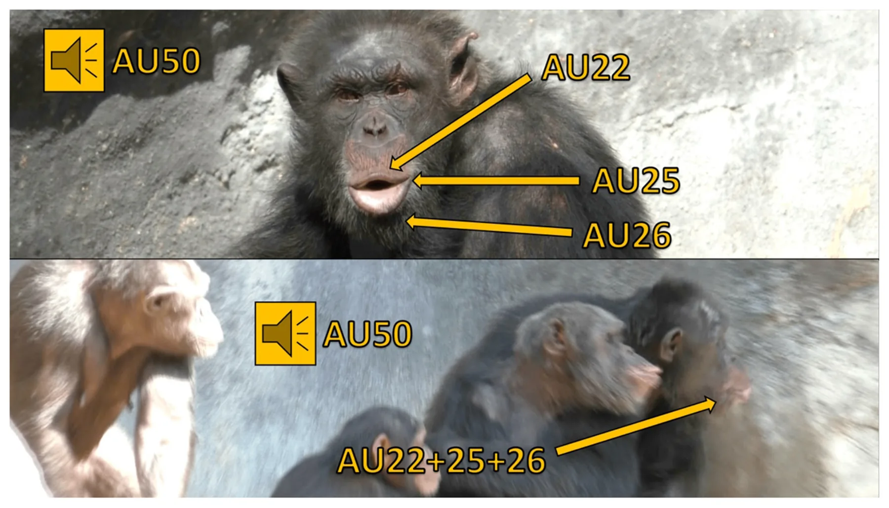
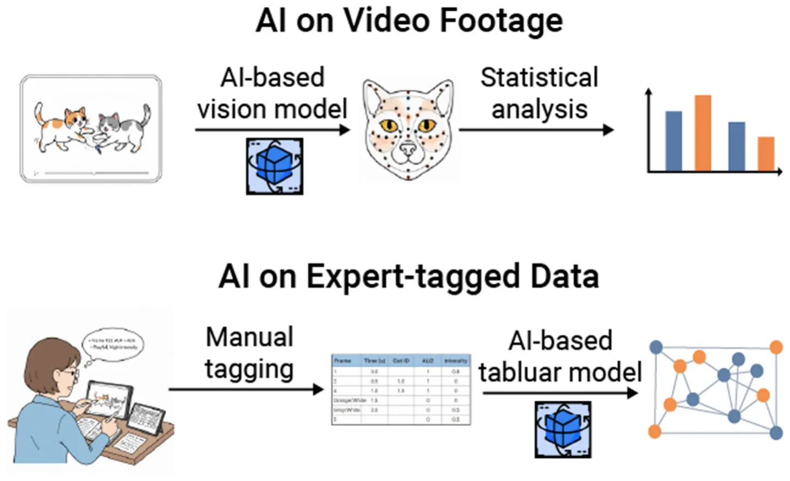

facial signals, facial action coding systems, artificial intelligence, animal communication, facial expression

## Animal facial signals

For decades, researchers have studied animal facial signals, focusing on their physical forms, social functions, and emotional links (1–3). These facial signals are generally defined as combinations of one or more facial muscle movements that animals produce during bouts of communication (4–6). Notably, these combinations of movements often seem unrelated to basic biological functions, such as chewing (7–9), and can be directed toward other animals (10). Some researchers suggest that facial signals in animals are closely linked to specific categories of emotional arousal, providing valuable non-invasive insights into their mental lives (1, 11, 12). However, these facial signals, along with the corresponding muscle movements, are subject to interpretation by others (13, 14). Consequently, some researchers propose that these signals can reliably predict future behaviors, allowing individuals to adapt their own actions based on the perceived meaning of these signals (3, 13–16). The study of facial signals in non-human animals is particularly important for humans, as we live alongside a variety of species, both in wild and captive settings. By understanding the social functions and emotional links associated with specific combinations of facial muscle movements, we can adjust our behavior, which in turn improves our interactions with non-human animals. For example, understanding the facial muscle movements linked to a higher likelihood of aggression during intraspecific interactions among domesticated cats enables us to intervene before conflicts occur (17). In the context of cat-human interactions, this knowledge allows us to adjust our own behavior to minimize the risk of injury (18).

## Manual coding approaches

The study of animal facial signals has been greatly influenced by technological innovations available to researchers (19). For example, early naturalists heavily relied on illustrations and written descriptions (12, 20, 21) until the advent of photography and videography. Over the past decade, researchers have made significant progress in identifying and differentiating various types of facial signals (3, 22). Some of the earliest methods involved creating ethograms, which categorize facial signals based on key similarities in facial muscle movements, while also considering the social context of the interaction (12, 23). In his influential work, *The Expression of the Emotions in Man and Animals*, Charles Darwin differentiates between six facial signals type associated with distinct categories of emotion (12, 24). Through behavioral observations, photographs, illustrations, and conversations with fellow naturalists, Darwin established these categories to highlight similarities in physical forms and emotional responses among human and non-human animals. Darwin documented not only the movements of facial muscles but also various social factors influencing their production, including the presence or absence of other animals and the perceived bond between them, such as the relationship between humans and domesticated animals (12).

### Facial action coding systems (FACS)

Almost a decade after Darwin’s work on animal facial signals, researchers and practitioners began to develop more systematic and standardized methods for studying these signals. One of the early pioneers was Carl-Herman Hjortsjö, who focused on facial mimicry and the silent communication conveyed through individual facial muscle movements in humans (5). He suggested that these movements are similar to letters in human language, where combinations form “words” that can be easily understood due to their connections with different emotional states (5). To investigate this “silent language,” Hjortsjö created a coding system that assigned numerical codes to specific facial movements in humans, allowing for the identification of unique facial muscle movement combinations (or signals). For example, while both “suspicious” and “observing” facial signals share lowered brows, they differ from one another based on chin position (5).

Following Hjortsjö’s work, Paul Ekman developed the human Facial Action Coding System (FACS) in 1978. He argued that the “language” of emotional facial signals was “universal” across human societies, and that the meaning of each signal could be identified based on individual muscle movements (11). During his research, Ekman noted that certain cultures had “display rules” or socially constructed facial signals, making it difficult to identify the “true” underlying emotion being experienced (25). To understand the true meaning (i.e., emotional link) of these facial signals, Ekman developed the FACS (6, 26). FACS employs both posed photographs and video to train individuals in recognizing subtle and overt facial muscle movements (called Action Units, or AUs) that are combined to create a signal (6, 26). Facial signals can be captured and coded through photographs, video clips, or in real time. Together, Hjortsjö and Ekman’s coding systems represent the most comprehensive and systematic approaches to studying human facial signals, minimizing observation bias by considering all facial movements equally (27). It is important to recognize that both Hjortsö’s and Ekman’s coding schemes focus on the physical aspects of human facial signals (22). Researchers using these protocols are tasked with creating additional metrics and measures that link these physical forms to their socio-emotional functions.

Recently, efforts to systematize and standardize the study of non-human animal facial signals have led to the development of FACS for various animal species, collectively known as animalFACS [https://animalfacs.com/; (22)]. These systems have been developed for a diverse range of species, including non-human primates (27–35) and domesticated animals (36–38). As a result, our understanding of animal facial signals has significantly improved. Recent studies indicate that some mammals can produce dozens of distinct facial muscle movements for communication, surpassing what was previously documented (9, 17, 39, 40). Researchers utilizing animalFACS have found that specific combinations of facial muscle movements correlate with distinct social outcomes, highlighting the direct relationship between the physical form of facial signals and their social functions (41, 42). Furthermore, studies indicate that animals’ facial signaling behaviors are influenced by multiple factors such as the strength of social bonds (39), levels of social tolerance (43), and group size (40), with noticeable variations both within and between species (40). AnimalFACS facilitates cross-species comparisons by providing a consistent method for identifying and documenting facial muscle movements, thereby ensuring more accurate assessments across different species (22).

Finally, FACS are now used to assess animal welfare by identifying key facial muscle movements linked to pain and other negative emotions (44). For instance, in domesticated animals, facial muscle movements described in FACS such as AU143 (blink), AU145 (eye closure), and lip corner puller (AU12) has been observed in facial behaviors associated with pain among domesticated cats (45) and dogs (46). It is important to note that in studies of pain among non-human animals without an established FACS, such as rodents, researchers often employ similar systematic and standardized methods for identifying facial muscle movements, taking inspiration from FACS-based approaches (47). In these cases, researchers identify, describe, and examine Facial Action Units (FAUs), specific facial movements that occur during pain episodes (46, 48), highlighting the significance and practicality of FACS-based approaches.

### Limitations of FACS coding

Although animalFACS are systematic and standardized methods that have enhanced our understanding of animal facial This figure features a chimpanzee named Ben producing pant hoots, identifiable by the presence of AUs 22+25+26+50 (i.e., the lips are funneled, lips parted, and jaw dropped, all accompanied by a vocalization). Pant hoot calls are generated during periods of high excitement, such as responses to observing playful interactions, distress, or the availability of food (51). In this scenario, Ben produces a pant hoot facial signal and vocalizes in response to another chimpanzee’s scream, causing the surrounding chimpanzees to heighten their vigilance and attend to the situation. In the top image, Ben’s face is clearly visible as he sits still, devoid of any other chimpanzees or objects that could obscure his facial muscle movements. Conversely, the bottom image presents challenges for FACS coding: Ben’s face (on the right) is partially obscured by other chimpanzees, and he is in motion, moving quickly from left to right. Additionally, the profile view in the video clip complicates the discernment of his facial muscle movements compared to a head-on perspective.

<figure id="fig-1">

<figcaption>FIGURE 1</figcaption>
</figure>

signals, they are associated with multiple drawbacks. Many of these limitations stem from the manual coding required, as researchers must analyze photographs, videos, or real-time behaviors to identify the presence or absence of many different facial muscle movements. First, to use animalFACS, researchers must first undergo training and pass a certification test that evaluates their reliability in coding facial movements when compared to FACS experts (22, 49). This process is crucial for ensuring consistency in published studies and applications, but it can be quite time- and resource- intensive (49). Second, coding using FACS-based approaches is extremely time-consuming; just a few seconds of video footage can take several hours to analyze (50). Even coding photographs is a lengthy process, as researchers must assess dozens of distinct facial muscle movements. Third, given the number of facial muscle movements documented in animalFACS, type 2 coding errors may occur when attempting to code all possible Action Units (AUs). Finally, coding accuracy and efficiency are largely influenced by many external factors, such as the visibility of subjects and the number of subjects within a given setting (Figure 1).

## The artificial intelligence revolution

By building upon the FACS system, which offers an objective framework for characterizing facial behavior, researchers were able to formalize animal communication in a manner consistent with modern data analysis (52). This data-driven approach, centered on anatomically-based AUs, inherently defines numerical framework such as time series, classification, and regression tasks (48, 53, 54). Despite its promise, the limitations of the FACS systems rendering large-scale, long-duration studies time and resource intensive at best and sometimes even impractical (22, 55, 56). In this context, the advent of artificial intelligence (AI), in general, and computer vision methods, in particular, presented a promising alternative to overcome these limitations (44, 57, 58). By leveraging AI-powered systems, researchers and practitioners aimed to produce objective and rapid scores for facial signals (48, 59, 60). This transition was not a rejection of prior methodologies, but a progression enabled by technology. For example, catFACS have been utilized to develop facial landmark schemes that can automatically detect the presence or absence of specific AUs through video footage (61), allowing for the identification of emotional states such as pain (62). The annotated data painstakingly collected through manual coding became the essential “ground truth” for training data driven algorithms based on novel methods such as machine learning (63, 64). This symbiotic relationship underscores that for any new species to be studied, a foundational, human-led effort to create a species-specific ethogram or coding system must precede the development of an automated solution. The human observer’s role has therefore shifted from a primary data collector to a foundational dataset creator and validation expert, a crucial step in the causal chain of modern animal behavior research.

### AI as a tool for pain and welfare assessment

The most impactful early applications of AI in mammalian facial signal coding focused on automating grimace scales, providing a critical tool for assessing pain and welfare, particularly in laboratory and agricultural settings (44). This area of research began with rodents, which are widely used in biomedical studies (65). A pioneering 2018 study detailed the development of an automated Mouse Grimace Scale (aMGS) using a deep convolutional neural network (CNN) architecture (66), specifically a retrained InceptionV3 model (67). This model was trained on a dataset of over 5,700 images and achieved an accuracy of 94% in assessing the presence of pain. The automated scores demonstrated a high correlation with human scores with a Pearson’s score of 0.75. By this, demonstrating the machine’s ability to accurately replicate and even surpass human-level performance. This principle of grimace scale automation was later extended to other species, including rats, where a study developed an automated Rat Grimace Scale (RGS) that achieved 97% precision and recall for AU detection (65). Similarly, and right after, studies about the usage of AI-based models to automate the Horse Grimace Scale (HGS) were proposed (68–70). These studies employed recurrent neural networks (RNNs) (71) to capture the temporal dynamics of facial signals, a critical factor for accurate pain recognition (70). The results were highly promising, with AI models classifying experimental pain more effectively than human raters.

These studies highlighted the necessity of data augmentation techniques to compensate for the scarcity of annotated horse facial data (20, 21). The success of AI in automating grimace scales fundamentally changes the paradigm of pain assessment. The objectivity, consistency, and ability to analyze vast datasets mean that AI-derived scores can become the new gold standard, potentially more reliable than those from human coders. This transition allows for a shift from reactive, infrequent checks to continuous, proactive monitoring, ultimately leading to improved animal care (72). Across studies reviewed here, automated systems were evaluated against human-coded ground truth derived from certified FACS coders. Typical protocols involved several steps, including: (1) coder training/certification; (2) double-coding subsets and reporting human-to-human reliability (e.g., Cohen’s κ/ICC); and (3) using a consensus human label as ground truth for model testing. For Action Unit (AU) detection and facial signal classification, researchers typically reported standard classification metrics such as precision, recall, F1, and accuracy, although these measures are not consistent between studies. Where available, calibration/error metrics (e.g., ROC-AUC, Brier score) and confusion matrices were also reported in some studies. To interpret disagreements between humans and models, multiple studies used third-party adjudication or expert review of discrepant items to determine whether errors arose from annotation ambiguity, image quality/pose/occlusion, or genuine model misclassification.

### Social and emotional states

As the field has matured, AI methodologies have been applied to classify a wider range of emotions and behaviors, enabling new avenues of research in social dynamics and human-animal interaction (73–75). Studies on domestic dogs, for instance, have moved beyond a simple pain/no-pain binary to classify more nuanced emotional states (76–78) developed a method using computer vision and transfer learning with a MobileNet (79) architecture to analyze canine emotional behavior. The model was trained on 1,067 images across four categories: aggressiveness, anxiety, fear, and neutral. While achieving a test accuracy of 69.17%, the research demonstrated the feasibility of using AI to develop tools for dog trainers and handlers, improving the selection and training processes for working dogs. The application of AI to domestic cats addresses a significant gap, as this species is known for its subtle and often enigmatic emotional cues (80, 81) presented a real-time system using convolutional neural networks (CNNs) to classify cat facial signals into four categories: Pleased, Angry, Alarmed, and Calm. The model showed high recognition accuracy and holds substantial potential for applications in veterinary care and enhancing pet-owner communication. Complementing this, (82) leveraged a more specialized architecture, DenseNet (83), which uses dense connectivity patterns to capture intricate features in pet facial signals. This methodological evolution from general CNNs to specialized models like DenseNet and RNNs reflects the growing sophistication of the field and the increasing specificity of research questions.

Beyond welfare, AI is being used in fundamental scientific inquiry to understand the neurobiological basis of facial communication. Studies on primates, such as the work by Chang and Tsao (85), have used computational models to demonstrate how neural ensembles in macaque face patches employ a combinatorial code to represent faces (84, 85). This represents a fascinating reverse application of AI principles, where the study of the brain’s own coding mechanisms can inform the development of more efficient AI algorithms (84).

### Limitations of artificial intelligence

While the application of AI to coding animal facial signals has demonstrated immense potential, significant challenges remain. The most persistent obstacle is the scarcity of large, high-quality, and annotated datasets for many species (86, 87). The process of manual ground-truthing, though foundational, remains a bottleneck that limits the development of robust models. Furthermore, models trained on specific breeds or environmental conditions may struggle to generalize to new subjects or different settings (88). The high variability in the facial anatomy across animal species makes a universal, one-size-fits-all model difficult to achieve. Another fundamental challenge lies in the distinction between classifying facial *signals* and interpreting the underlying emotional *state*. While AI is excellent at recognizing and quantifying facial movements, it still cannot fully interpret the internal emotion or intent. The link between a specific facial movement and an internal state (e.g., pain, fear, pleasure) must still be established through careful, human-led behavioral and physiological studies. This human-centric validation remains a critical component of the research process. Several constraints outlined for manual FACS coding also hinder automated performance because they disrupt the facial features models need to detect. Beyond these shared issues, automated approaches introduce additional challenges, including but not limited to: (1) domain shift and dataset bias where models trained on specific facilities, breeds, or camera setups may not generalize without adaptation; (2) annotation noise in the human-provided ground truth used for training; (3) probability calibration/thresholding; and (4) temporal dependence where frame-based models can miss dynamic cues unless explicitly modeled. These considerations motivate reporting human-to-human reliability alongside model-vs.-human agreement, subject-disjoint evaluation, and cross-site tests.

<figure id="fig-2">

<figcaption>FIGURE 2 This figure illustrates two primary ways in which both manual and AI-powered approaches can be integrated. The first method involves implementing AI-based vision models on video footage collected by animal behaviorists. These models are used to identify and quantify various variables, such as the distance between animals and the presence/absence of facial muscle movements. The second method involves applying AI-based tabular models to pre-existing datasets that have been manually coded, allowing researchers to explore novel questions. For instance, this may include identifying patterns in communication variables or determining whether instances of rapid facial mimicry are occurring.</figcaption>
</figure>

## Discussion

Both manual coding and AI-powered approaches offer distinct benefits and drawbacks. To fully leverage the advantages of each method while minimizing their limitations, it is essential to foster collaborative efforts (Figure 2). By combining different kinds of research expertise, more comprehensive studies can also be conducted, bridging gaps in knowledge (89–91). For instance, by utilizing video footage and FACS-coded data, (92) discovered that domesticated cats, like many other mammals, can perform rapid facial mimicry during affiliative interactions. Through the analysis of existing chimpanzee datasets, the authors found that multimodal communication (i.e., where both facial signals and manual gestures are used) along with clear signaling (i.e., which involves employing distinct types of signals during interactions), plays a crucial role in predicting the success of social negotiations among chimpanzees (93). It has been also found that the communicative patterns of chimpanzees vary based on their social rank (94). Understanding how cats communicate can enhance training techniques, inform social interventions, and improve the bond between cats and their owners (95). Similarly, studying chimpanzee communication offers valuable insights into the evolution of human communication and informs conservation efforts, helping to guide decisions about interventions and transfers across accredited institutions. To this end, scholars and practitioners can take advantage of commercial-grade, end-to-end “FaceReader-like” systems for non-human animals. These systems more often than not produce highly accurate results for well-photographed domestic species (e.g., cats, dogs, horses), provided species-specific training data and validated AU/grimace annotations. Early components already exist, such as automated grimace scales and facial-state classifiers for multiple species, on-farm welfare pipelines, and landmark-based cat facial analysis. This demonstrates technical viability and practical utility for this technology and further emphasize that remaining barriers are less about algorithms and more about data coverage (age, breed, morphology), deployment conditions (lighting, camera placement), and standardized validation against certified human coders across sites.

The development of standardized, publicly available datasets for a wider range of species would also accelerate research and improve model generalizability. To this end, benchmarking studies on common tasks in the field and across these emerging datasets can provide researchers and practitioners a quick start from the AI modeling perspective (96–99). Future work may also focus on developing models that can generalize across related species or different taxa, reducing the need to build a new model from scratch for every animal (100–102). As AI becomes more deeply integrated into animal research and care, it is also crucial to consider the ethical implications of using this technology (103, 104), including data privacy and the potential for over-interpretation of animal signals, ensuring that these powerful tools are used responsibly to enhance, not diminish, animal wellbeing. Through large-scale collaborative efforts, such considerations can be addressed more effectively while also advancing our understanding of animal facial signaling.

## Author contributions

TL: Conceptualization, Data curation, Formal analysis, Investigation, Visualization, Writing – original draft, Writing – review & editing. BF: Conceptualization, Data curation, Formal analysis, Investigation, Methodology, Project administration, Visualization, Writing – original draft, Writing – review & editing.

## Funding

The author(s) declare that no financial support was received for the research and/or publication of this article.

## References

1. Ekman P. Darwin’s contributions to our understanding of emotional expressions. Philos Trans R Soc Lond B Biol Sci. (2009) 364:3449–51. [doi:10.1098/rstb.2009.0189](https://doi.org/10.1098/rstb.2009.0189)
2. Ekman P. Darwin and Facial Expression: A Century of Research in Review. Nasik: Ishk (2006).
3. Waller BM, Micheletta J. Facial expression in nonhuman animals. Emot Rev. (2013) 3:54–9. [doi:10.1177/1754073912451503](https://doi.org/10.1177/1754073912451503)
4. Waller BM, Kavanagh E, Micheletta J, Clark PR, Whitehouse J. The face is central to primate multicomponent signals. Int J Primatol. (2024) 45:526– 42. [doi:10.1007/s10764-021-00260-0](https://doi.org/10.1007/s10764-021-00260-0)
5. Hjortsjo C-H. Man’s Face and Mimic Language. Lund: Studen litteratur (1969).
6. Ekman P, Friesen WV. Facial Action Coding System: A Technique for the Measurement of Facial Movement (1978).
7. Dickey S, Garrett J, Scott L, Miller RW, Florkiewicz BN. Evaluating indicators of intentionality, flexibility, and goal-association in domestic cat (Felis silvestris catus) facial signals. Behav Processes. (2025) 231:105244. [doi:10.1016/j.beproc.2025.105244](https://doi.org/10.1016/j.beproc.2025.105244)
8. Dale R, Range F, Stott L, Kotrschal K, Marshall-Pescini S. The influence of social relationship on food tolerance in wolves and dogs. Behav Ecol Sociobiol. (2017) 71:107. [doi:10.1007/s00265-017-2339-8](https://doi.org/10.1007/s00265-017-2339-8)
9. Mahmoud A, Scott L, Florkiewicz BN. Examining Mammalian facial behavior using Facial Action Coding Systems (FACS) and combinatorics. PLoS ONE. (2025) 20:e0314896. [doi:10.1371/journal.pone.0314896](https://doi.org/10.1371/journal.pone.0314896)
10. Pellon S, Hallegot M, Lapique J, Tomberg C. A redefinition of facial communication in non-human animals. J Behav. (2020) 3:1017. doi: https://www.jscimedcentral.com/jounal-article-info/Journal-of-Behavior/A-Redefinition-of-Facial-Communication-in-Non-Human-Animals-828210.47739/2576-0076/1017 Conflict of interest The authors declare that the research was conducted in the absence of any commercial or financial relationships that could be construed as a potential conflict of interest. Generative AI statement The author(s) declare that Gen AI was used in the creation of this manuscript. Generative AI was utilized to find relevant research articles for the “Artificial Intelligence Revolution” section of our review. Grammarly was also used on the final draft of our manuscript to check for grammar and spelling. Any alternative text (alt text) provided alongside figures in this article has been generated by Frontiers with the support of artificial intelligence and reasonable efforts have been made to ensure accuracy, including review by the authors wherever possible. If you identify any issues, please contact us. All claims expressed in this article are solely those of the authors and do not necessarily represent those of their affiliated organizations, or those of the publisher, the editors and the reviewers. Any product that may be evaluated in this article, or claim that may be made by its manufacturer, is not guaranteed or endorsed by the publisher. [link](https://www.jscimedcentral.com/jounal-article-info/Journal-of-Behavior/A-Redefinition-of-Facial-Communication-in-Non-Human-Animals-8282)
11. Ekman P. Universal Facial Expressions of Emotion (1970). 151–8 p.
12. Darwin, C. The Expression of the Emotions in Man and Animals (The expression of the emotions in man and animals.). London, England: John Murray (1872). pp. vi, 374-vi, 374.
13. Fridlund AJ. Human Facial Expression: An Evolutionary View. San Diego, CA: Academic Press (1994). p. xiv, 369-xiv, 369.
14. Fridlund AJ. The behavioral ecology view of smiling and other facial expressions. In Abel MH, editor. An Empirical Reflection on the Smile , Vol. 4. Lewiston, NY: Edwin Mellen Press (2002). p. 45–82.
15. Waller BM, Whitehouse J, Micheletta J. Rethinking primate facial expression: a predictive framework. Neurosci Biobehav Rev. (2017) 82:13–21. [doi:10.1016/j.neubiorev.09005](https://doi.org/10.1016/j.neubiorev.09005)
16. Crivelli C, Fridlund AJ. Facial displays are tools for social influence. Trends Cogn Sci. (2018) 22:388–99. [doi:10.1016/j.tics.02.006](https://doi.org/10.1016/j.tics.02.006)
17. Scott L, Florkiewicz BN. Feline faces: unraveling the social function of domestic cat facial signals. Behav Processes. (2023) 213:104959. [doi:10.1016/j.beproc.2023](https://doi.org/10.1016/j.beproc.2023)
18. Bennett V, Gourkow N, Mills DS. Facial correlates of emotional behaviour in the domestic cat (Felis catus). Behav Processes. (2017) 141:342–50. [doi:10.1016/j.beproc.03.011](https://doi.org/10.1016/j.beproc.03.011)
19. Gregori A, Amici F, Brilmayer I, Cwiek A, Fritzsche L, Fuchs S, et al. A roadmap for technological innovation in multimodal communication research. In Duffy VG, editor. International Conference on Human-Computer Interaction. Cham: Springer (2023). p. 402–38.
20. Bell C. Essays on the Anatomy of Expression in Painting. Longman, Hurst, Rees, and Orme (1806).
21. de Boulogne GBD. The Mechanism of Human Facial Expression (Studies in Emotion and Social Interaction). Cambridge: Cambridge University Press (1990).
22. Waller BM, Julle-Daniere E, Micheletta J. Measuring the evolution of facial ‘expression’ using multi-species FACS. Neurosci Biobehav Rev. (2020) 113:1–11., 031. [doi:10.1016/j.neubiorev.02](https://doi.org/10.1016/j.neubiorev.02)
23. Redfield JW. Comparative Physiognomy or Resemblances Between Men and Animals. Redfield (1852).
24. Perrett D. Representations of facial expressions since Darwin. Evol Hum Sci. (2022) 4:e22. [doi:10.1017/ehs.2022.10](https://doi.org/10.1017/ehs.2022.10)
25. Ekman P. Facial expression and emotion. Am Psychol. (1993) 48:384– 92. [doi:10.1037//0003-066X.48.4.384](https://doi.org/10.1037//0003-066X.48.4.384)
26. Ekman P, Rosenberg EL. What the Face Reveals: Basic and Applied Studies of Spontaneous Expression Using the Facial Action Coding System (FACS). New York: Oxford University Press (2005).
27. Parr LA, Waller BM, Burrows AM, Gothard KM, Vick SJ. Brief communication: MaqFACS: a muscle-based facial movement coding system for the rhesus macaque. Am J Phys Anthropol. (2010) 143:625–30. [doi:10.1002/ajpa.21401](https://doi.org/10.1002/ajpa.21401)
28. Correia-Caeiro C, Costa R, Hayashi M, Burrows A, Pater J, Miyabe-Nishiwaki T, et al. GorillaFACS: the facial action coding system for the gorilla spp. PLoS ONE. (2025) 20:e0308790. [doi:10.1371/journal.pone.0308790](https://doi.org/10.1371/journal.pone.0308790)
29. Correia-Caeiro C, Burrows A, Wilson DA, Abdelrahman A, Miyabe-Nishiwaki T. CalliFACS: the common marmoset Facial Action Coding System. PLoS ONE. (2022) 17:e0266442. [doi:10.1371/journal.pone.0266442](https://doi.org/10.1371/journal.pone.0266442)
30. Vick S-J, Waller BM, Parr LA, Smith Pasqualini MC, Bard KA. A cross-species comparison of facial morphology and movement in humans and chimpanzees using the facial action coding system (FACS). J Nonverbal Behav. (2007) 31:1– 20. [doi:10.1007/s10919-006-0017-z](https://doi.org/10.1007/s10919-006-0017-z)
31. Correia-Caeiro C, Kuchenbuch PH, Oña LS, Wegdell F, Leroux M, Schuele A, et al. Adapting the facial action coding system for chimpanzees (Pan troglodytes) to bonobos (Pan paniscus): the ChimpFACS extension for bonobos. PeerJ. (2025) 13:e19484. [doi:10.7717/peerj.19484](https://doi.org/10.7717/peerj.19484)
32. Waller BM, Lembeck M, Kuchenbuch P, Burrows AM, Liebal K. GibbonFACS: a muscle-based facial movement coding system for hylobatids. Int J Primatol. (2012) 33:809–21. [doi:10.1007/s10764-012-9611-6](https://doi.org/10.1007/s10764-012-9611-6)
33. Correia-Caeiro C, Holmes K, Miyabe-Nishiwaki T. Extending the MaqFACS to measure facial movement in Japanese macaques (Macaca fuscata) reveals a wide repertoire potential. PLoS ONE. (2021) 16:e0245117. [doi:10.1371/journal.pone.0245117](https://doi.org/10.1371/journal.pone.0245117)
34. Julle-Danière É, Micheletta J, Whitehouse J, Joly M, Gass C, Burrows AM, et al. MaqFACS (Macaque Facial Action Coding System) can be used to document facial movements in Barbary macaques (Macaca sylvanus). PeerJ. (2015) 3:e1248. [doi:10.7717/peerj.1248](https://doi.org/10.7717/peerj.1248)
35. Caeiro CC, Waller BM, Zimmermann E, Burrows AM, Davila-Ross M. OrangFACS: a muscle-based facial movement coding system for orangutans (Pongo spp.). Int J Primatol. (2013) 34:115–129. [doi:10.1007/s10764-012-9652-x](https://doi.org/10.1007/s10764-012-9652-x)
36. Caeiro C, Waller B, Burrows A. The Cat Facial Action Coding System Manual (CatFACS) (2013).
37. Waller B, Correia Caeiro C, Peirce K, Burrows A, Kaminski J. DogFACS: The Dog Facial Action Coding System. Lincoln: University of Lincoln (2024).
38. Wathan J, Burrows AM, Waller BM, McComb K. EquiFACS: the equine facial action coding system. PLoS ONE. (2015) 10:e0131738. [doi:10.1371/journal.pone.0131738](https://doi.org/10.1371/journal.pone.0131738)
39. Florkiewicz B, Skollar G, Reichard UH. Facial expressions and pair bonds in hylobatids. American J Phys Anthropol. (2018) 167:108–123. [doi:10.1002/ajpa.23608](https://doi.org/10.1002/ajpa.23608)
40. Florkiewicz BNO, Oña LS, Campbell LMW. Primate socio-ecology shapes the evolution of distinctive facial repertoires. J Comparative Psychol. (2023) 138:32– 44. [doi:10.1037/com0000350](https://doi.org/10.1037/com0000350)
41. Waller BM, Caeiro CC, Davila-Ross M. Orangutans modify facial displays depending on recipient attention. PeerJ. (2015) 3:e827. [doi:10.7717/peerj.827](https://doi.org/10.7717/peerj.827)
42. Scheider L, Waller BM, Oña L, Burrows AM, Liebal K. Social use of facial expressions in hylobatids. PLoS ONE. (2016) 11:e0151733. [doi:10.1371/journal.pone.0151733](https://doi.org/10.1371/journal.pone.0151733)
43. Rincon AV, Waller BM, Duboscq J, Mielke A, Pérez C, Clark PR, et al. Higher social tolerance is associated with more complex facial behavior in macaques. Elife. (2023) 12:RP87008. [doi:10.7554/eLife.87008](https://doi.org/10.7554/eLife.87008)
44. Chiavaccini L, Gupta A, Chiavaccini G. From facial expressions to algorithms: a narrative review of animal pain recognition technologie. Front Vet Sci. (2024) 11:1436795. [doi:10.3389/fvets.2024.1436795](https://doi.org/10.3389/fvets.2024.1436795)
45. Evangelista MC, Watanabe R, Leung VSY, Monteiro BP, O’Toole E, Pang DSJ, et al. Facial expressions of pain in cats: the development and validation of a Feline Grimace Scale. Sci Rep. (2019) 9:19128. [doi:10.1038/s41598-019-55693-8](https://doi.org/10.1038/s41598-019-55693-8)
46. Casas-Alvarado A, Martínez-Burnes J, Mora-Medina P, Hernández-Avalos I, Miranda-Cortes A, Domínguez-Oliva A, et al. Facial action units as biomarkers of postoperative pain in ovariohysterectomized bitches treated with cannabidiol and meloxicam. Res Vet Sci. (2025) 193:105734. [doi:10.1016/j.rvsc.2025.105734](https://doi.org/10.1016/j.rvsc.2025.105734)
47. Domínguez-Oliva A, Mota-Rojas D, Hernández-Avalos I, Mora-Medina P, Olmos-Hernández A, Verduzco-Mendoza A, et al. The neurobiology of pain and facial movements in rodents: clinical applications and current research. Front Vet Sci. (2022) 9:1016720. [doi:10.3389/fvets.2022.1016720](https://doi.org/10.3389/fvets.2022.1016720)
48. Mota-Rojas D, Whittaker AL, Coria-Avila GA, Martínez-Burnes J, Mora- Medina P, Domínguez-Oliva A, et al. How facial expressions reveal acute pain in domestic animals with facial pain scales as a diagnostic tool. Front Vet Sci. (2025) 12:1546719. [doi:10.3389/fvets.2025.1546719](https://doi.org/10.3389/fvets.2025.1546719)
49. Cohn JF, Ambadar Z, Ekman P. Observer-based measurement of facial expression with the Facial Action Coding System. In Coan JA, Allen JJB, editors. The Handbook of Emotion Elicitation and Assessment, vol. 1. Oxford: Oxford University Press (2007). p. 203–21.
50. Cross MP, Hunter JF, Smith JR, Twidwell RE, Pressman SD. Comparing, differentiating, and applying affective facial coding techniques for the assessment of positive emotion. J Posit Psychol. (2023) 18:420– 38. [doi:10.1080/17439760.2022.2036796](https://doi.org/10.1080/17439760.2022.2036796)
51. Domínguez-Oliva A, Chávez C, Martínez-Burnes J, Olmos-Hernández A, Hernández-Avalos I, Mota-Rojas D, et al. (2024). Neurobiology and anatomy of facial expressions in great apes: application of the AnimalFACS and its possible association with the animal’s affective state. Animals. (2024) 14:3414. [doi:10.3390/ani14233414](https://doi.org/10.3390/ani14233414)
52. Hamm J, Kohler CG, Gur RC, Verma R. (2011). Automated facial action coding system for dynamic analysis of facial expressions in neuropsychiatric disorders. J Neurosci Methods. (2011) 200:237–56. [doi:10.1016/j.jneumeth.06.023](https://doi.org/10.1016/j.jneumeth.06.023)
53. Parr LA, Waller BM. Understanding chimpanzee facial expression: insights into the evolution of communication. Soc Cogn Affect Neurosci. (2006) 1:221– 8. [doi:10.1093/scan/nsl031](https://doi.org/10.1093/scan/nsl031)
54. Florkiewicz BN. Navigating the nuances of studying animal facial behaviors with Facial Action Coding Systems. Front Ethol. (2025) 4:6756. [doi:10.3389/fetho.2025.1686756](https://doi.org/10.3389/fetho.2025.1686756)
55. Descovich KA, Wathan J, Leach MC, Buchanan-Smith HM, Flecknell P, Farningham D, et al. Facial expression: an under-utilized tool for the assessment of welfare in mammals. ALTEX. (2017) 34:409–29. [doi:10.14573/altex.1607161](https://doi.org/10.14573/altex.1607161)
56. Tuttle AH, Molinaro MJ, Jethwa JF, Sotocinal SG, Prieto JC, Styner MA, et al. A deep neural network to assess spontaneous pain from mouse facial expressions. Mol Pain. (2018) 14:1744806918763658. [doi:10.1177/1744806918763658](https://doi.org/10.1177/1744806918763658)
57. Blumrosen G, Hawellek D, Pesaran B. Towards automated recognition of facial expressions in animal models. In Proceedings of the IEEE International Conference on Computer Vision Workshops. Venice: IEEE (2017). p. 2810–9.
58. Miyagi Y, Hata T, Bouno S, Koyanagi A, Miyake T. Recognition of facial expression of fetuses by artificial intelligence (AI). J Perinat Med. (2021) 49:596– 603. [doi:10.1515/jpm-2020-0537](https://doi.org/10.1515/jpm-2020-0537)
59. Cetintav B, Guven YS, Gulek E, Akbas AA. Generative AI meets animal welfare: evaluating GPT-4 for pet emotion detection. Animals. (2025) 15:492. [doi:10.3390/ani15040492](https://doi.org/10.3390/ani15040492)
60. Gupta S, Sinha A. Gestural communication of wild bonnet macaques in the Bandipur National Park, Southern India. Behav Processes. (2019) 168:103956. [doi:10.1016/j.beproc.2019.103956](https://doi.org/10.1016/j.beproc.2019.103956)
61. Steagall PV, Monteiro BP, Marangoni S, Moussa M, Sautié M. Fully automated deep learning models with smartphone applicability for prediction of pain using the Feline Grimace Scale. Sci Rep. (2023) 13:21584. [doi:10.1038/s41598-023-49031-2](https://doi.org/10.1038/s41598-023-49031-2)
62. Martvel G, Lazebnik T, Feighelstein M, Henze L, Meller S, Shimshoni I, et al. Automated video-based pain recognition in cats using facial landmarks. Sci Rep. (2024) 14:28006. [doi:10.1038/s41598-024-78406-2](https://doi.org/10.1038/s41598-024-78406-2)
63. Neethirajan S. Affective state recognition in livestock—Artificial intelligence approaches. Animals. (2022) 12:759. [doi:10.3390/ani12060759](https://doi.org/10.3390/ani12060759)
64. Andersen PH. Towards machine recognition of facial expressions of pain in horses. Animals. (2021) 11:1643. [doi:10.3390/ani11061643](https://doi.org/10.3390/ani11061643)
65. Chiang C-Y, Chen Y-P, Tzeng H-R, Chang M-H, Chiou L-C, Pei Y-C, et al. Deep learning-based grimace scoring is comparable to human scoring in a mouse migraine model. J Pers Med. (2022) 12:851. [doi:10.3390/jpm12060851](https://doi.org/10.3390/jpm12060851)
66. Alzubaidi L, Zhang J, Humaidi AJ, Al-Dujaili A, Al-Shamma O, https://journalofbigdata.springeropen.com/articles/10.1186/s40537-021-00444-8#auth-J\_-Santamar\_a-Aff6Santamaría J, et al. Review of deep learning: concepts, CNN architectures, challenges, applications, future directions. J Big Data. (2021) 8:53. [doi:10.1186/s40537-021-00444-8](https://doi.org/10.1186/s40537-021-00444-8)
67. Xiaoling X, Cui X, Bing N. Inception-v3 for flower classification. In 2017 2nd International Conference on Image, Vision and Computing (ICIVC). Chengdu: IEEE (2017). p. 783–7.
68. Hummel HI, Pessanha F, Salah AA, van Loon TJPAM, Veltkamp RC. (2020). Automatic pain detection on horse and donkey faces. In 2020 15th IEEE International Conference on Automatic Face and Gesture Recognition (FG 2020). Buenos Aires: IEEE (2020). p. 793–800.: 10.1109/FG47880.2020.00114
69. Marcantonio Coneglian M, Duarte Borge T, Weber SH, Godoi Bertagnon H, Michelotto PV. Use of the horse grimace scale to identify and quantify pain due to dental disorders in horses. Appl Anim Behav Sci. (2020) 225:104970. [doi:10.1016/j.applanim.2020.104970](https://doi.org/10.1016/j.applanim.2020.104970)
70. Feighelstein M, Ricci-Bonot C, Hasan H, Weinberg H, Rettig T, Segal M, et al. Automated recognition of emotional states of horses from facial expressions. PLoS ONE. (2024) 19:e0302893. [doi:10.1371/journal.pone.0302893](https://doi.org/10.1371/journal.pone.0302893)
71. Mienye ID, Swart TG, Obaido G. Recurrent neural networks: a comprehensive review of architectures, variants, and applications. Information. (2024) 15:517. [doi:10.3390/info15090517](https://doi.org/10.3390/info15090517)
72. Hansen MF, Baxter EM, Rutherford KMD, Futro A, Smith ML, Smith LN, et al. Towards facial expression recognition for on-farm welfare assessment in pigs. Agriculture. (2021) 11:847. [doi:10.3390/agriculture11090847](https://doi.org/10.3390/agriculture11090847)
73. Mota-Rojas D, Whittaker AL, Lanzoni L, Bienboire-Frosini C, Domínguez- Oliva A, Chay-Canul A, et al. Clinical interpretation of body language and behavioral modifications to recognize pain in domestic mammals. Front Vet Sci. (2025) 12:1679966. [doi:10.3389/fvets.2025.1679966](https://doi.org/10.3389/fvets.2025.1679966)
74. Gupta S. AI applications in animal behavior analysis and welfare. In Agriculture 4.0. Boca Raton, Fl: CRC Press (2024). p. 224–44.
75. Williams E. Human-animal interactions and machine-animal interactions in animals under human care: a summary of stakeholder and researcher perceptions and future directions. Anim Welfare. (2024) 33:e27. [doi:10.1017/awf.2024.23](https://doi.org/10.1017/awf.2024.23)
76. Martvel G, Pedretti G, Lazebnik T, Zamansky A, Ouchi Y, Monteiro T, et al. Does the tail show when the nose knows? Artificial intelligence outperforms human experts at predicting detection dogs finding their target through tail kinematics. R Soc Open Sci. (2025) 12:250399. [doi:10.1098/rsos.250399](https://doi.org/10.1098/rsos.250399)
77. Travain T, Lazebnik T, Zamansky A, Cafazzo S, Valsecchi P, Natoli E, et al. Environmental enrichments and data-driven welfare indicators for sheltered dogs using telemetric physiological measures and signal processing. Sci Rep. (2024) 14:3346. [doi:10.1038/s41598-024-53932-1](https://doi.org/10.1038/s41598-024-53932-1)
78. Chavez-Guerrero VO, Perez-Espinosa H, Puga-Nathal ME, Reyes-Meza V. Classification of domestic dogs emotional behavior using computer vision. Comput Sist. (2022) 26:203–19. [doi:10.13053/cys-26-1-4165](https://doi.org/10.13053/cys-26-1-4165)
79. Michele A, Colin V, Santika DD. MobileNet convolutional neural networks and support vector machines for palmprint recognition. Procedia Comput Sci. (2019) 157:110–7., 147. [doi:10.1016/j.procs.08](https://doi.org/10.1016/j.procs.08)
80. Sarvakar K, Senkamalavalli R, Raghavendra S, Kumar JS, Manjunath R, Jaiswal S, et al. Facial emotion recognition using convolutional neural networks. Materials Today Proc. (2023) 80:3560–4. [doi:10.1016/j.matpr.07.297](https://doi.org/10.1016/j.matpr.07.297)
81. Ali A, Onana Oyana CLN, Salum OS. Domestic Cats Facial Expression Recognition Based on Convolutional Neural Networks. Othman Saleh: Domestic Cats Facial Expression Recognition Based on Convolutional Neural Networks (2024).
82. Wu Z. The recognition and analysis of pet facial expression using DenseNet-based model. In Proceedings of the 1st International Conference on Data Analysis and Machine Learning. Setúbal: SCITEPRESS-Science and Technology Publications (2023). p. 427–32.
83. Iandola F, Moskewicz M, Karayev S, Girshick R, Darrell T, Keutzer K, et al. Densenet: implementing efficient convnet descriptor pyramids. arXiv [Preprint]. arXiv:1869.2014 (2014).
84. Stevens CF. Conserved features of the primate face code. Proc Natl Acad Sci. (2018) 115:584–8. [doi:10.1073/pnas.1716341115](https://doi.org/10.1073/pnas.1716341115)
85. Chang L, Tsao DY. The code for facial identity in the primate brain. Cell. (2017) 169:1013–28.e14. [doi:10.1016/j.cell.05.011](https://doi.org/10.1016/j.cell.05.011)
86. Alves VM. Curated data in — Trustworthy in silico models out: the impact of data quality on the reliability of artificial intelligence models as alternatives to animal testing. Alternatives to Lab Anim. (2021) 49:73–82. [doi:10.1177/02611929211029635](https://doi.org/10.1177/02611929211029635)
87. Ezanno P. Research perspectives on animal health in the era of artificial intelligence. Vet Res. (2021) 52:40. [doi:10.1186/s13567-021-00902-4](https://doi.org/10.1186/s13567-021-00902-4)
88. Ito T, Campbell M, Horesh L, Klinger T, Ram P. Quantifying artificial intelligence through algorithmic generalization. Nat Machine Intell. (2025) 7:1195– 1205. [doi:10.1038/s42256-025-01092-w](https://doi.org/10.1038/s42256-025-01092-w)
89. Lazebnik T, Beck S, Shami L. Academic co-authorship is a risky game. Scientometrics. (2023) 128:6495–507. [doi:10.1007/s11192-023-04843-x](https://doi.org/10.1007/s11192-023-04843-x)
90. Lee S, Bozeman B. The impact of research collaboration on scientific productivity. Soc Stud Sci. (2005) 35:673–702. [doi:10.1177/0306312705052359](https://doi.org/10.1177/0306312705052359)
91. Zhang C, Bu Y, Ding Y, Xu J. Understanding scientific collaboration: homophily, transitivity, and preferential attachment. J Assoc Inf Sci Technol. (2018) 69:72–86. doi: [doi:10.1002/asi.23916](https://doi.org/10.1002/asi.23916)
92. Martvel G, Lazebnik T, Feighelstein M, Meller S, Shimshoni I, Finka L, et al. Automated landmark-based cat facial analysis and its applications. Front Vet Sci. (2024) 11:1442634. [doi:10.3389/fvets.2024.1442634](https://doi.org/10.3389/fvets.2024.1442634)
93. Norton B, Zamansky A, Florkiewicz B, Lazebnik T. The art of chimpanzee (Pan troglodytes) diplomacy: unraveling the secrets of successful negotiations using machine learning. J Comp Psychol. [doi:10.1037/com0000411](https://doi.org/10.1037/com0000411)
94. Florkiewicz BN, Lazebnik T. Predicting social rankings in captive chimpanzees (Pan troglodytes) through communicative interactions-based data-driven model. Integr Zool. (2025). [doi:10.1111/1749-4877.12967](https://doi.org/10.1111/1749-4877.12967)
95. Ines M, Ricci-Bonot C, Mills DS. (2021). My Cat and Me—A study of cat owner perceptions of their bond and relationship. Animals. 11:1601. [doi:10.3390/ani11061601](https://doi.org/10.3390/ani11061601)
96. Iwashita AS, Papa JP. An overview on concept drift learning. IEEE Access. (2019) 7:1532–47. [doi:10.1109/ACCESS.2018.2886026](https://doi.org/10.1109/ACCESS.2018.2886026)
97. Shmuel A, Glickman O, Lazebnik T. A comprehensive benchmark of machine and deep learning models on structured data for regression and classification. Neurocomputing. (2025) 655:131337. [doi:10.1016/j.neucom.2025.131337](https://doi.org/10.1016/j.neucom.2025.131337)
98. Lazebnik T, Fleischer T, Yaniv-Rosenfeld A. Benchmarking biologically-inspired automatic machine learning for economic tasks. Sustainability. (2023) 15:11232. [doi:10.3390/su151411232](https://doi.org/10.3390/su151411232)
99. Liu Y. Evalcrafter: Benchmarking and evaluating large video generation models. In Proceedings of the IEEE/CVF Conference on Computer Vision and Pattern Recognition. Seattle, WA : IEEE (2024). p. 22139–49.
100. Lazebnik T, Simon-keren L. Knowledge-integrated autoencoder model. Expert Syst Appl. (2024) 252:124108. 10.1016/j.eswa.2024.124108 [doi:10.1016/j.eswa.2024.124108doi:](https://doi.org/10.1016/j.eswa.2024.124108doi:)
101. Yang, X. GeneCompass: deciphering universal gene regulatory mechanisms with a knowledge-informed cross-species foundation model. Cell Res. (2024) 34:830– 45.
102. Lin FV, Simmons JM, Turnbull A, Zuo Y, Conwell Y, Wang KH, et al. Cross-species framework for emotional well-being and brain aging: lessons from behavioral neuroscience. JAMA Psychiatry. (2025) 82:734–41., 0581. [doi:10.1001/jamapsychiatry.2025](https://doi.org/10.1001/jamapsychiatry.2025)
103. Küçükuncular A. Ethical implications of AI-mediated interspecies communication. AI Ethics. (2025). [doi:10.1007/s43681-025-00835-0](https://doi.org/10.1007/s43681-025-00835-0)
104. Singer P, Tse YF. AI. ethics: the case for including animals. AI Ethics. (2023) 3:539–51. [doi:10.1007/s43681-022-00187-z](https://doi.org/10.1007/s43681-022-00187-z)
