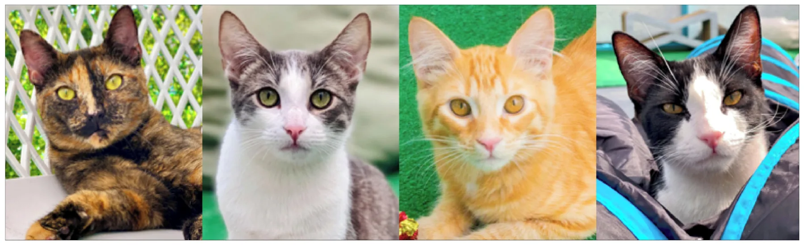
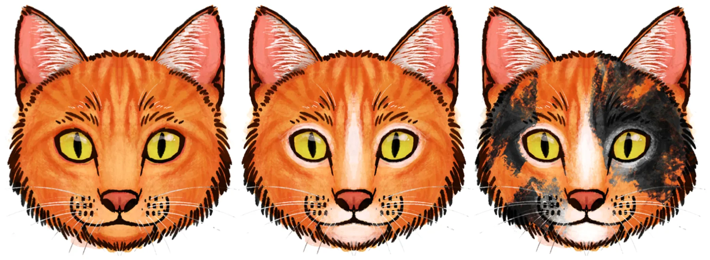

## 1. Introduction

Facial color patterns among mammals exhibit significant variability, though the selective pressures shaping these traits differ across species (Caro et al., 2017; Caro, 2009). On one hand, differences can sometimes be influenced by ecological factors, such as rainfall, UV exposure, and diet (Rakotonirina et al., 2017). On the other hand, these traits may be selected for their role in helping individuals recognize conspecifics and in determining age, sex, and individual identity (Kawaguchi et al., 2020; Ode et al., 2026; Petersen and Higham, 2020; Pokorny and de Waal, May 2009; Santana et al., 2012; Santana et al., 2013; Tomeo et al., 2017; Winters et al., 2020). While facial color patterns contribute to identity and perception, facial signals can provide insight into behavior (Sexton et al., 2023; Waller et al., 2017). Facial signals play a crucial role in predicting the outcomes of social interactions (Waller et al., 2016). Species that inhabit large and complex social groups often possess extensive facial signaling repertoires, enabling them to effectively navigate various types of social interactions (Florkiewicz et al., 2023). Recent studies with primates suggest that there is an inverse relationship between the complexity of facial color patterns and the complexity of their facial signaling repertoires: species with simpler facial patterns tend to produce a greater number of facial muscle movements (Santana et al., 2014), and a greater number of facial muscle movements leads to more potential combinations (i.e., facial signals (Mahmoud et al.,

- \*\* Corresponding author at: Department of Information Systems, University of Haifa, Haifa, Israel.

0168-1591/© 2026 Elsevier B.V. All rights are reserved, including those for text and data mining, AI training, and similar technologies.

2025)). This trade-off may exist because complex facial color patterns hinder the perception of facial muscle movements and their associated signals (Sexton et al., 2023).

Interestingly, in domesticated dogs (*Canis lupus familaris*), the inverse relationship between the complexity of facial color patterns and signaling repertoires manifest at the individual level, despite being members of the same species (Sexton et al., 2023). However, the specific selective pressures underlying these trade-offs remain unclear. Over a dozen genes are known to influence the color patterns of domesticated dogs (Brancalion et al., 2022), and due to pleiotropic effects, selection for specific behavioral traits (such as reduced fear and aggression, as well as greater sociability) can lead to changes in coloration and patterning (Platzer et al., 2023; Wilkins et al., 2014). The genetic connections between facial coloration and social behaviors may explain the inverse relationship observed between the complexity of facial color patterns and facial signaling in dogs. However, humans often overestimate the complexity of dogs' facial behaviors, interpreting movements even in neutral faces (Sexton et al., 2024). Additionally, dogs produce a wider range of facial muscle movements when humans are visually attending to them (Kaminski et al., 2017). Given the importance of facial signaling behaviors in interactions between humans and dogs, it also stands to reason that dogs would exhibit similar facial signaling capabilities, regardless of their facial color patterns (Sexton et al., 2023). Further investigation is warranted to explore the relationship between facial color patterns and the complexity of facial signaling in other domesticated species, given these two ideas. Additional research is also necessary to examine how the complexity of facial color patterns influences the intricacy of facial signaling during intraspecific social interactions in domesticated animals, as current studies have predominantly concentrated on interspecific interactions (Sexton et al., 2023; Sexton et al., 2024). Studying intraspecific facial signaling and color patterns in domesticated species could also inform management practices to reduce miscommunication and aggression, which is a major concern that often leads to abandonment and euthanasia (Kleszcz et al., 2022).

In our current study, we examine the possible relationship between the complexity of facial color patterns and facial signaling behaviors in domesticated cats (*Felis silvestris catus*). Similar to domesticated dogs, domesticated cats (hereafter referred to simply as cats) have experienced selective pressures, primarily through self-selection, that have led to reduced fear and aggression, as well as enhanced sociability (Driscoll et al., 2009; Driscoll et al., Jun 2009). As a result, when compared wild counterparts, cats exhibit variability in their social organization. Indoor cats can live alone or in groups of up to 50 individuals (Gouveia et al., 2011; Kessler and Turner, 1999; Loberg and Lundmark, 2016), while outdoor cats can be found in various locations, ranging from a few individuals to hundreds (Liberg et al., 2000; Vitale, Jan 5 2022). Increased opportunities for social interactions among cats have likely contributed to their large and diverse repertoire of facial signals (Mahmoud et al., 2025; Scott and Florkiewicz, 2023). Our recent studies indicate that cats produce different kinds of facial muscle movements (and associated signals) depending on whether they are engaging in affiliative or non-affiliative interactions with one other (Martvel et al., 2024a; Scott and Florkiewicz, 2023). Additionally, depending on the sex of the conspecifics they are interacting with, cats will alter the distance at which they produce their facial signals (Florkiewicz et al., 2026). These studies highlight the significance of facial signaling during intraspecific social interactions among cats. Cats, similar to domesticated dogs, exhibit significant variation in their physical appearances, providing a unique opportunity to explore the relationship between facial color patterns and their roles in intraspecific facial signaling. Based on research with domesticated dogs and other mammals, we predict an inverse relationship between the complexity of facial color patterns and the complexity of facial signaling during intraspecific cat social interactions.

Examining the link between facial color patterns and the facial signaling repertoires of cats presents two primary challenges: (1)

accurately coding the movements of facial muscles; and (2) operationalizing and identifying facial coloration patterns. First, humans may overestimate the complexity of facial behaviors in domestic animals, particularly when color patterns are complex (Sexton et al., 2024). To address this potential bias, and consistent with studies on facial color patterns and facial signaling (Benitez-Quiroz et al., Apr 3 2018; Sexton et al., 2023), our current study employs Facial Action Coding Systems (specifically, catFACS) to systematically code facial muscle movements and their combinations during instances of intraspecific communication (Caeiro et al., 2013; Caeiro et al., 2017). FACS are standardized methodologies that guide researchers in identifying and differentiating both subtle and overt facial movements (Cohn et al., 2007; Ekman and Rosenberg, 2005; Florkiewicz, 2025; Waller et al., 2020). Those who utilize FACS must complete a certification process, which includes coding a series of videos and comparing their coding responses to those of experienced experts from the FACS team, who possess extensive knowledge of the respective FACS system (Cohn et al., 2007; Florkiewicz, 2025). This thorough training guarantees a consistent and reliable approach to identifying and coding movements of facial muscles (Cohn et al., 2007; Ekman and Rosenberg, 2005; Waller et al., 2020). The second major challenge is operationalizing the complexity of facial color patterns. Previous studies, including those with dogs and primate species, have created composite complexity scores based on the number of colors and markings on the face, as well as their locations (Rakotonirina et al., 2017; Santana et al., 2013; Santana et al., 2014; Sexton et al., 2023; Sexton et al., 2024). A major limitation of this approach is the significant variability in color gradients, as well as in the shape and size of certain features. These obstacles create challenges for accurately assigning facial features to pre-constructed categories and assigning complexity scores. To overcome these challenges, we utilized automated methods to evaluate whether facial color complexity scores can be consistently assigned to images of cat faces. If facial color pattern complexity scores in the training data cannot be reliably categorized by automated models, this may possibly indicate that the employed categorization methods are too subjective.

## 2. Methods

### 2.1. Data collection

Our study protocol was approved by CatCafe Lounge, the site where we conducted our behavioral observations. The design and implementation of our study adhered to the guidelines established by the Association for the Study of Animal Behavior for the treatment of animals in behavioral research, as well as the NC3R's ARRIVE guidelines. Since our study involved non-invasive behavioral observations of naturally occurring cat-cat interactions, and we did not directly interact with or alter the care schedules of the cats, formal review by the Institutional Animal Care and Use Committee (IACUC) was waived by all associated institutions.

#### 2.1.1. Field site

Data for our study were obtained from the CatCafe Lounge, a nonprofit cat rescue and adoption agency located in Los Angeles, CA, USA. The lounge offers both indoor and outdoor areas where visitors can engage with around two dozen adult domestic shorthair cats on a given day, all of which are spayed/neutered and available for adoption. The large, open spaces, coupled with the numerous enrichment items and resting spots available in the indoor and outdoor visitor areas, help ensure the comfort of cats while encouraging spontaneous, natural social interactions. It is important to note that the cats also have access to a smaller back room equipped with multiple food bowls, water bowls, snacks, and litter boxes. This setup allows the cats to access food and water while also providing a space to avoid unwanted attention from unfamiliar humans. Only shelter volunteers and staff can access this space when necessary. For this reason, data were collected primarily in the indoor and outdoor visitor areas to reduce potential stress for the cats. Kittens (i.e. cats *<*1 year) were not included in our study, as they were housed in a separate part of the facility to ensure their health and well-being before group integration. Furthermore, kittens’ facial color patterns may continue to change as they develop.

#### 2.1.2. Photo and video collection

Data were collected in the form of photographs and video footage. Before capturing video footage, high-quality photographs of each adult cat available for study were collected from shelter volunteers and research assistant L.S. We made an effort to collect images that clearly show each cat’s face facing forward in well-lit areas of the cat cafe, allowing us to analyze their facial color patterns computationally. Example photos are shown in Fig. 1 below. To gather data on facial signaling behaviors and repertoires, we recorded video footage using a Panasonic Full HD Video Camcorder HC-V770 (at 60 fps) using the opportunistic sampling method (Florkiewicz and Campbell, 2021a), focusing exclusively on communicative interactions between the cats. Video clips began just before interactions and concluded shortly after. We recorded all video footage before and after visiting hours to minimize the risk of recording interactions between cats and humans or the interference of unfamiliar humans with the cats’ behavior. Video footage was collected from August 2021 to June 2022 across 150 visiting hours, resulting in 53 adult domestic short-haired cats being incorporated into our study. It is important to note that the timelines for introducing cats into the cat cafe and for their adoption varied. Some cats were present throughout the entire data collection period, while others stayed for only a few weeks. Whenever new adult cats were added to the group, we made sure to take photographs of them. Some cats had more opportunities for video recordings than others, depending on their length of stay. Our goal was to gather as much data on facial signaling behaviors and facial color patterns as possible, considering that opportunities for social interactions varied. We decided to account for differences in recording time in our statistical analyses.

### 2.2. Data coding

Video footage was imported and coded in ELAN 6.50AVFX (Lausberg and Sloetjes, 2009) with a custom coding template, whereas photographs of cat faces were imported and analyzed with Google Gemini.

#### 2.2.1. Facial signals

Facial signals were defined as one (or more) facial muscle movements exhibited by cats during social interactions with other cats (Florkiewicz et al., 2023; Smith and Harper, 1995). To ensure that we accurately captured facial signals directed specifically at conspecifics, we only coded those signals in instances where the cat producing the facial movements clearly fixated its pupils on the other cat and oriented its body toward that cat. Pupil fixation and body orientation were manually verified by coders; if these two criteria were not met, the facial signal was not coded. Our definition of a facial signal does not include movements associated with biological maintenance such as breathing or mastication (Florkiewicz et al., 2023). We did not code head movements, since it was difficult to discern whether they were being used for communication. Each facial signal was classified using the protocols defined in the Cat Facial Action Coding System (catFACS; (Caeiro et al., 2013)). In this system, specific movements of facial muscles, known as Action Units (AUs), are assigned a unique numerical code (e.g., AU25, AU26, AU27, etc.). Additionally, each facial signal is represented by a unique combination of these numerical codes (e.g., AU25 +27). To use catFACS, researchers are required to take a coding test and achieve an average Wexler’s ratio of ≥ 0.70 with a member of the catFACS development team [84]. The first author (B.N.F) was certified to use catFACS in September 2021 with a score of 0.756 in September 2021. To ensure the objective coding of facial muscles, researchers typically select approximately 10% of their video footage to assess inter-observer reliability with another FACS-certified researcher. B.N.F. randomly selected 10% of all video clips featuring intraspecific cat facial signaling events for this assessment. A research assistant, L.S., who was certified to use catFACS in March 2022 (with a score of 0.717), also coded these video clips. The evaluation of their responses was conducted comparing B.N.F. and L.S. using the same criteria required to pass the catFACS test (i.e., average Wexler's ratio of ≥0.70 across all coded facial signals). Our average Wexler’s ratio was 0.707, indicating good agreement. It is important to note that both coders agreed on the number of facial muscle movements present in the randomly selected video clips and associated facial signals 86% of the time. When they did disagree on the number of facial muscle movements, the disagreement was consistently a deviation of + 1. Disagreement on the types of AUs coded mainly stemmed from eyelid movements (such as AU5, upper lid raiser) and ear movements (such as EAD104, ear rotator). After assessing the agreement for approximately 10% of the video clips, B.N.F. proceeded to code the remaining 90%. All facial signals and associated muscle movements were coded at their ‘production peak’ (Florkiewicz et al., 2018).

In addition to identifying facial signals and their associated muscle movements, we also recorded each signaler’s identity, their sex, and the social context that best described the overall behaviors displayed during the communicative interaction. We coded these variables, as multiple signalers can contribute to our final dataset on facial signaling behavior, and differences in the sample size for each individual must be considered in our statistical analyses (Waller et al., 2013). Furthermore, in our previous studies, we found that variations in facial signaling behaviors among domesticated cats during intraspecific social interactions were influenced by factors such as sex (Florkiewicz et al., 2026) and social context (i.e., affiliative vs. non-affiliative; (Scott and Florkiewicz, 2023); Martvel et al., 2024a). Therefore, these factors must also be accounted for in our statistical analyses. When assigning social contexts to each facial signal, we considered the behaviors of both the signaler and recipient during the social interaction. Affiliative social interactions can involve allogrooming, allorubbing, bodily contact during rest, mating, nose sniffing, social rolling, play, and/or vertical tail positioning (Crowell-Davis et al., 2004; Vitale, 2022; Vitale, Jan 5 2022), whereas non-affiliative social interactions typically involve biting, fleeing, growling, hissing, piloerection, scratching, spitting, staring, and/or swatting (Penar and Klocek, 2018; Stelow et al., 2016). Inter-observer reliability was also assessed for the social contexts assigned to each facial signal. In studies on facial signaling, social context is often assessed by the percentage of agreements, with percentages above 70% indicating good agreement (Florkiewicz and Campbell, 2021b; Martvel et al., 2024a; Scott and Florkiewicz, 2023). Out of the approximately ~10% of video footage and associated facial signaling behaviors randomly selected for catFACS agreement, B.N.F. and L.S. agreed on 75% of the assigned social contexts.

<figure id="fig-1">

<figcaption><strong>Fig. 1.</strong> Example photographs of cat faces and their associated color patterns taken by our research assistant and shelter volunteers. Cats featured from left to right: Pansy, Buddy, Oliver, and Felipe.</figcaption>
</figure>

#### 2.2.2. Facial signaling complexity

Using data on catFACS-coded facial signals, we developed three metrics for facial signaling complexity, consistent with the previous literature (Florkiewicz and Lazebnik, 2025; Florkiewicz et al., 2018; Florkiewicz et al., 2023; Scott and Florkiewicz, 2023). First, we identified the number of unique facial muscle movement types, referred to as Action Units (AUs), in the facial signaling repertoires of each of our 53 cats. We refer to this measurement as *AU Type Complexity*. A higher number of unique facial muscle movement types (or AUs) indicates greater complexity in facial signaling repertoires, while a lower number indicates less complexity in facial signaling repertoires. Second, we identified the number of unique types of facial muscle movement combinations, known as Action Unit combinations (AU combos), in the facial signaling repertoires of each of our 53 cats. We refer to this measurement as *AU Combo Complexity*. A higher number of unique AU combinations indicates greater complexity in facial signaling repertoires, while a lower number indicates less complexity in facial signaling repertoires. Finally, we identify the number of unique facial muscle movements that are present in the facial signaling behaviors of each cat, which we refer to as *AU Length Complexity*. A higher number of AUs indicates greater complexity in facial signaling behaviors, while a lower number indicates less complexity in facial signaling behaviors. The first two measures (AU Type Complexity and AU Combo Complexity) examine complexity at the level of the repertoire, while the third measure (AU Length Complexity) assesses complexity at the level of the signal.

We predict an inverse relationship between the complexity of facial color patterns and the complexity of intraspecific facial signaling among cats. Therefore, we anticipate finding an inverse relationship between facial color pattern complexity AU Type Complexity, AU Combo Complexity, and AU Length Complexity.

#### 2.2.3. Facial color pattern complexity

Previous studies on the facial color patterns of mammals often evaluate complexity based on three criteria: (1) the number of distinct colors present on the face; (2) the presence of specific color patterns; and (3) the variety of facial color markings that vary in location and size (Rakotonirina et al., 2017; Santana et al., 2013; Santana et al., 2014; Sexton et al., 2023; Sexton et al., 2024). Following these practices, we developed our own ‘ethogram’ (Table 1) to help us assess facial color pattern complexity in domesticated cats by utilizing previously published breed guides and classification schemes (Cat Identification Guide, 2026; G´orska et al., 2026; Mears, 2024; Wilhelmy et al., 2016). Our ethogram focuses solely on hair colors and patterns, and does not include information about the size of specific features (such as the ears) or skull morphology. It's also important to note that our study focuses specifically on adult domestic short-hair cats. Consequently, some patterns and facial features documented in other cat breeds were not relevant in our current study. For instance, the only fur pattern we observed was the tabby pattern, although numerous other patterns have been documented in domesticated cats (Cat Identification Guide, 2026; G´orska et al., 2026; Mears, 2024; Wilhelmy et al., 2016). In line with previous breed guides and classification systems, we do not classify ‘tortoiseshell’ and ‘calico’ cats as ‘patterns’, as the arrangement of colors in these cats can vary greatly (Cat Identification Guide, 2026; Wilhelmy et al., 2016). Instead, we categorize them as two-colored and three-colored cats, respectively. For instance, tortoiseshell cats may have a combination of black and orange, as shown in Fig. 1 (image on the far left), or they may be gray and buff. Calico cats, on the other hand, are typically white with two additional colors, such as black and orange or brown and orange.

<figure class="table-figure" id="table-1">
<figcaption><strong>Table 1</strong> A list of colors, patterns, and facial markings that we considered in our study of the complexity of cat facial coloration relevant to our sample of 53 adult domestic short-hair cats.</figcaption>

<table><tr><th>FEATURE TYPE</th><th>NOTES</th></tr><tr class="row-group"><td>Colors</td><td></td></tr><tr><td>Black</td><td>One of the most common fur colors in cats is black. Many cats are solid black, or have black in their facial patterns, particularly brown tabby cats. In sunlight, this color may appear dark brown.</td></tr><tr><td>Gray White</td><td>This color ranges from a diluted black to very light gray. Solid white faces are not common, but white is frequently found in many cat facial patterns and markings.</td></tr><tr><td>Buff</td><td>Also referred to as "tan" or "cream," this is a diluted version of orange.</td></tr><tr><td>Brown</td><td>It is extremely rare to see a solid brown cat. Brown is more commonly observed in tabby cats that have additional colors present (e.g., black, white, and/or buff).</td></tr><tr><td>Orange</td><td>This color tends to be associated with the tabby pattern and is also seen in tortoiseshell (2-color) and calico (3-color) cats.</td></tr><tr class="row-group"><td>PATTERNS</td><td></td></tr><tr><td>Tabby</td><td>The most common pattern seen in domesticated cats. Characterized by darker striping across the body and the "tabby mask", which includes striping on the side of the face and a characteristic "M" on the forehead. Tabby cats come in gray, brown, buff, and orange, and can feature additional colors.</td></tr><tr class="row-group"><td>FACE MARKINGS</td><td></td></tr><tr><td>Locket</td><td>Distinct triangular white patch on the chest that extends to the border of the face (and onto part of all of the chin).</td></tr><tr><td>Blaze</td><td>Distinct colored stripe starting at the forehead and ending at the nose. Typically comes in white or buff colors.</td></tr><tr><td>Eye Patch</td><td>Colored spot across one eye. Typically occurs on a mostly-white face.</td></tr><tr><td>Tuxedo</td><td>Tuxedo cats typically come in black and white, but this pattern can appear on other kinds of colored faces. Involves a triangle- shaped color patch starting just above the eyes (on the forehead) and ending at the bottom of the chin.</td></tr><tr><td>Eye Mask</td><td>Distinct outlining of the eyes, typically of a light color (such as white or buff).</td></tr><tr><td>Miscellaneous</td><td>A distinct colored spot/stripe on the face that does not meet any of the criteria outlined above.</td></tr></table>

</figure>

Similar to previous studies, we calculate *Facial Color Pattern Complexity Scores* by summing the unique colors, patterns, and markings present on each cat's face (Rakotonirina et al., 2017; Santana et al., 2013; Santana et al., 2014; Sexton et al., 2023; Sexton et al., 2024). An example of how facial color pattern complexity scores are calculated can be found below in Fig. 2. With 13 different combined colors, patterns, and facial markings (Table 1), this is the highest hypothetical facial color pattern complexity score that can be achieved, while the lowest score is 1.

#### 2.2.4. Automatic face scoring

To automate the assignment of facial color pattern complexity scores, we utilized the Gemini API, a multimodal generative artificial intelligence model developed by Google DeepMind. This technology was chosen because it is one of the most advanced AI systems available during our study, capable of processing both images and text inputs within a single workflow (Oke et al., 2026; Rosenfeld and Lazebnik, 2024). This allows the model to analyze each cat face image while also considering our ethogram (see Table 1) and scoring instructions (Fulminar, 2026; Sun et al., 2026). In addition, the API supports structured and consistent response formats, which were useful for obtaining comparable outputs across images, including identification of visible colors, patterns, facial markings, and the resulting facial color pattern complexity score. These characteristics made Gemini well-suited to a standardized image-by-image scoring procedure based on explicit visual criteria (Omurkulov et al., 2024; Qi et al., 2023). Before the main image evaluation stage, where images of all 53 cats included in our study are presented, we calibrated the model using the following methods: (1) our ethogram for facial color pattern complexity; (2) ten examples of each feature type listed in our ethogram, using images of cats obtained from the internet to avoid data leakage (N = 130 images); and (3) ten labeled example images of cat faces that represent each facial color pattern complexity score ranging from 1 to 8, also obtained from the internet (N = 80 images). For step 2 of this process, we utilized images that clearly showcase each specific feature, as well as images where the feature is removed. This approach enabled us to fine-tune the model to accurately identify and differentiate the various features. The images used for model training in steps 2 and 3 (N = 210 in total) were manually selected and evaluated by two experts in cat behavior and physiology to ensure accuracy. The facial color pattern complexity scores from both experts were averaged and rounded to determine the final score for step 3.

<figure id="fig-2">

<figcaption><strong>Fig. 2.</strong> An illustrated example of how Facial Color Pattern Complexity Scores are calculated. In the first image on the left, there is an orange tabby cat that would receive a facial color pattern complexity score of 2 (1 color, 1 pattern). The middle image features another orange tabby cat that also has a white eye mask, a blaze, and a locket extending to the chin. Because of the additional color (white) and the three extra features, this cat receives a facial color pattern complexity score of 6 (2 colors, 1 pattern, 3 features). Finally, the cat on the right has all of these attributes, plus additional black miscellaneous spots, raising its facial color pattern complexity score to 10 (3 colors, 1 pattern, 6 features). These illustrations were created by Brittany Florkiewicz for the purpose of this study.</figcaption>
</figure>

After training our model, we presented it with the photographs of each of our 53 study cats, one at a time, along with a standardized prompt (Prompt 1). These 53 validation images were independent from the calibration/training images described above. None of the study-cat photographs were included in the 210-image calibration set, which consisted entirely of internet-sourced images used to illustrate ethogram features and example complexity scores. For each image, the model was instructed to identify the visible colors, patterns, and facial markings on the cat's face. It was then tasked with calculating a corresponding facial color complexity score using a predefined formula. In addition to providing the final score, the model was asked to explain how it arrived at that score to ensure accuracy. We used Gemini Flash V2 for all image evaluations. To assess whether the model produced stable scores across repeated calls, each study-cat photograph was scored n = 5 times using the same standardized prompt and ethogram. Repeated runs produced 48/53 accurate predictions, on average, with 2/53 prediction standard deviation. Final facial color pattern complexity scores were calculated by averaging the scores from repeated calls and rounding up. To validate the automated scoring procedure, we compared Gemini’s performance in assigning complexity scores for facial color patterns to our 53 cats and their associated photos with the scores from our manual coders, which were also averaged and rounded up.

**PROMPT 1**

The prompt used to evaluate a single image post fine-tuning

*ETHOGRAM OF FEATURES TYPES FOR FACIAL COLOR PATTERN COMPLEXITY SCORE: COLORS Black: One of the most common fur colors in cats is black. Many cats are solid black, or have black in their facial patterns, particularly brown tabby cats. In sunlight, this color may appear dark brown. Gray: This color ranges from a diluted black to very light gray. White: Solid white faces are not common, but white is frequently found in many cat facial patterns and markings. Buff: Also referred to as "tan" or "cream," this is a diluted version of orange. Brown: It is extremely rare to see a solid brown cat. Brown is more commonly observed in tabby cats that have additional colors present (e.g., black, white, and/or buff). Orange: This color tends to be associated with the tabby pattern and is also seen in tortoiseshell (2-color) and calico (3-color) cats. PATTERNS Tabby: The most common pattern seen in domesticated cats. Characterized by darker striping across the body and the "tabby mask", which includes striping on the side of the face and a characteristic "M" on the forehead. Tabby cats come in gray, brown, buff, and orange, and can feature additional colors. FACE MARKINGS: Locket: Distinct triangular white patch on the chest that extends to the border of the face (and onto part of all of the chin). Blaze: Distinct colored stripe starting at the forehead and ending at the nose. Typically comes in white or buff colors. Eye Patch: Colored spot across one eye. Typically occurs on a mostly-white face. Tuxedo: Cats typically come in black and white, but this pattern can appear on other kinds of colored faces. Involves a triangle-shaped color patch starting just above the eyes (on the forehead) and ending at the bottom of the chin. Eye Mask: Distinct outlining of the eyes, typically of a light color (such as white or buff). Miscellaneous Spots/Stripes: A distinct colored spot/stripe on the face that does not meet any of the criteria outlined above. HOW TO CALCULATE FACIAL COLOR PATTERN COMPLEXITY SCORES: # Colors* + *# Patterns* + *# Face Markings* = *Facial Color Pattern Complexity Score (FCPCS) Example 1: a black & orange tortoiseshell cat would receive a FCPCS of 2. Example 2: A solid black cat would receive a PS of 1. Example 3: A brown tabby (with black stripes) and a white locket would receive a FCPCS of 5 (Black, Brown, White* + *Tabby* + *Locket) Example 4: A orange tabby would receive a FCPCS of 2. Example 5: A calico cat with a blaze would receive a PS of FCPCS (3 colors* + *blaze). Based on the above instructions, give me the score for this cat. Explain how you get this score.*

### 2.3. Data analysis

Data on facial signals, including information about each cat's identity and sex, as well as the type of social context related to each interaction, were exported from ELAN into an Excel sheet. Additional information on facial color complexity scores was included in the Excel sheet prior to conducting our statistical analyses.

#### 2.3.1. Generalized linear mixed models (GLMMs)

Data were imported and analyzed in R 4.1.1. Due to the multiple facial signaling observations contributed by each cat in our dataset (Waller et al., 2013), we analyzed our data using Generalized Linear Models (GLMs). We ran three different GLMs that correspond to our three different measures of facial signaling complexity: AU Type Complexity, AU Combo Complexity, and AU Length Complexity. Facial pattern color complexity was always set as our fixed variable. For our AU Type Complexity and AU Combo Complexity models, we assessed the relationships between facial color pattern complexity and cat-level measures using the “ordinal” package (Christensen, 2021). For our AU Type Complexity model, we set the number of distinct AUs produced by each cat throughout our study as our dependent variable. For our AU Combo Complexity model, we set the number of distinct AU combinations produced by each cat throughout our study as our dependent variable. In contrast, for our AU Length Complexity model, we assessed the relationship between facial color pattern complexity and signal-level measures using the “GLMMadaptive” package (Rizopoulos, 2022). The total number of facial muscle movements involved in each signal’s associated AU combination was set as our dependent variable. Because each cat contributed multiple facial signaling observations to our dataset, we included the identity of the signaling cat as a random effect. Copies of our raw data used to run each model, as well as our R code, can be found in the **electronic supplement**.

## 3. Results

### 3.1. Facial signals

We observed a total of 688 facial signals produced by 53 different cats. Of these facial signals, 413 were produced by males and 275 by females. Additionally, 354 occurred in an affiliative context, while 334 occurred in a non-affiliative context. Through the implementation of catFACS coding, we were able to observe 26 distinct facial muscle movements (i.e., Action Units or AUs) and 276 distinct facial muscle movement combinations (i.e. AU combinations). Facial signals were, on average, comprised of 3.903 AUs (SD=2.166). Information regarding the number of distinct AU and AU combinations, as well as the number of facial signals produced overall, for each cat can be found below in Table 2.

### 3.2. Facial color pattern complexity

After training our Gemini model using our ethogram and images that illustrate various feature types and levels of facial color pattern complexity, an accuracy rate of 92% was achieved when compared to the complexity scores generated by our two experts. The remaining 8% of scores were ±1 related to the ground truth. This outcome demonstrates that our proposed model is well aligned with the average expert score for facial color pattern complexity. The median complexity score was 4, with values ranging from 1 to 6 across both male and female cats. However, the results of our ordinal GLMMs indicate no statistically significant differences (p *>* 0.05) in AU Type Complexity (β=− 0.019, SE=0.126, z = − 0.150, p = 0.881, OR=0.98, CI=0.77–1.26), AU Combo Complexity (β=0.043, SE=0.124, z = 0.346, p = 0.730, OR=1.04, CI=0.82–1.33), and AU Length Complexity (β=0.039, SE=0.147, z = 0.267, p = 0.789, OR=1.04, CI=0.78–1.39) based on facial color pattern complexity scores. Model outputs and visualizations can be found in the **electronic supplement**.

<figure class="table-figure" id="table-2">
<figcaption><strong>Table 2</strong> Information about our 53 study cats, including their sex, facial color pattern complexity score (FCPCS), the number of distinct facial muscle movement types (AU Types), the combinations of muscle movements (AU Combo Types) they produced throughout the study, and the total number of facial signals they contributed to the final dataset (Facial Signal Count).</figcaption>

<table><tr><th>Cat ID</th><th>Sex</th><th>FCPCS</th><th>AU</th><th>AU Combo</th><th>Facial Signal</th></tr><tr><th></th><th></th><th></th><th>Types</th><th>Types</th><th>Count</th></tr><tr><td>BETTSY</td><td>Female</td><td>1</td><td>8</td><td>2</td><td>2</td></tr><tr><td>BLACKBERRY</td><td>Male</td><td>1</td><td>18</td><td>16</td><td>20</td></tr><tr><td>BLACKCHERRY</td><td>Male</td><td>1</td><td>17</td><td>17</td><td>20</td></tr><tr><td>BONNIE</td><td>Female</td><td>1</td><td>12</td><td>3</td><td>5</td></tr><tr><td>BOSLEY</td><td>Male</td><td>4</td><td>14</td><td>5</td><td>5</td></tr><tr><td>BREEZY</td><td>Male</td><td>5</td><td>8</td><td>3</td><td>3</td></tr><tr><td>BRIAR</td><td>Male</td><td>3</td><td>4</td><td>2</td><td>3</td></tr><tr><td>BUBBA</td><td>Male</td><td>3</td><td>14</td><td>15</td><td>19</td></tr><tr><td>BUDDY</td><td>Male</td><td>5</td><td>6</td><td>4</td><td>4</td></tr><tr><td>CHINA</td><td>Female</td><td>6</td><td>19</td><td>22</td><td>29</td></tr><tr><td>DARLEEN</td><td>Female</td><td>3</td><td>16</td><td>7</td><td>8</td></tr><tr><td>DOC</td><td>Male</td><td>4</td><td>10</td><td>5</td><td>7</td></tr><tr><td>EMBER</td><td>Female</td><td>3</td><td>17</td><td>27</td><td>32</td></tr><tr><td>ENZO</td><td>Male</td><td>3</td><td>16</td><td>19</td><td>27</td></tr><tr><td>FELIPE</td><td>Male</td><td>3</td><td>10</td><td>5</td><td>5</td></tr><tr><td>FINLEY</td><td>Male</td><td>4</td><td>9</td><td>8</td><td>9</td></tr><tr><td>FIONA</td><td>Female</td><td>3</td><td>18</td><td>13</td><td>17</td></tr><tr><td>FRANK</td><td>Male</td><td>4</td><td>4</td><td>2</td><td>2</td></tr><tr><td>FRECKLE</td><td>Female</td><td>4</td><td>14</td><td>9</td><td>11</td></tr><tr><td>FRED</td><td>Male</td><td>4</td><td>19</td><td>28</td><td>41</td></tr><tr><td>GEORGE</td><td>Male</td><td>4</td><td>15</td><td>16</td><td>27</td></tr><tr><td>HONEYBUNS</td><td>Female</td><td>3</td><td>5</td><td>2</td><td>2</td></tr><tr><td>JESS</td><td>Male</td><td>3</td><td>5</td><td>3</td><td>6</td></tr><tr><td>LOUISE</td><td>Female</td><td>4</td><td>15</td><td>10</td><td>16</td></tr><tr><td>LUCIAN</td><td>Male</td><td>4</td><td>3</td><td>1</td><td>1</td></tr><tr><td>MCCHEESE</td><td>Male</td><td>3</td><td>19</td><td>31</td><td>34</td></tr><tr><td>MOLLY</td><td>Female</td><td>4</td><td>18</td><td>15</td><td>18</td></tr><tr><td>MOOKIE</td><td>Male</td><td>6</td><td>20</td><td>23</td><td>27</td></tr><tr><td>MOUSE</td><td>Female</td><td>4</td><td>14</td><td>5</td><td>6</td></tr><tr><td>NANA</td><td>Female</td><td>4</td><td>16</td><td>12</td><td>15</td></tr><tr><td>NATHAN</td><td>Male</td><td>1</td><td>17</td><td>18</td><td>19</td></tr><tr><td>OCEAN</td><td>Female</td><td>4</td><td>11</td><td>8</td><td>12</td></tr><tr><td>OREO</td><td>Female</td><td>4</td><td>13</td><td>6</td><td>6</td></tr><tr><td>PANSY</td><td>Male</td><td>3</td><td>9</td><td>7</td><td>9</td></tr><tr><td>PENELOPE</td><td>Female</td><td>4</td><td>9</td><td>9</td><td>15</td></tr><tr><td>PETRA</td><td>Female</td><td>4</td><td>7</td><td>4</td><td>4</td></tr><tr><td>PLUM</td><td>Female</td><td>4</td><td>8</td><td>2</td><td>2</td></tr><tr><td>RICOTTA</td><td>Female</td><td>5</td><td>13</td><td>5</td><td>5</td></tr><tr><td>RUSSELL</td><td>Male</td><td>1</td><td>10</td><td>9</td><td>12</td></tr><tr><td>SEBASTIAN</td><td>Male</td><td>1</td><td>8</td><td>3</td><td>3</td></tr><tr><td>SPARROW</td><td>Male</td><td>4</td><td>23</td><td>32</td><td>38</td></tr><tr><td>SPECKLE</td><td>Female</td><td>5</td><td>10</td><td>5</td><td>5</td></tr><tr><td>STARDUST</td><td>Female</td><td>4</td><td>12</td><td>2</td><td>2</td></tr><tr><td>SWEETPEA</td><td>Female</td><td>3</td><td>11</td><td>4</td><td>5</td></tr><tr><td>TALULA</td><td>Female</td><td>6</td><td>11</td><td>3</td><td>3</td></tr><tr><td>TEDDY</td><td>Male</td><td>5</td><td>19</td><td>19</td><td>22</td></tr><tr><td>TERRANCE</td><td>Male</td><td>4</td><td>18</td><td>30</td><td>40</td></tr><tr><td>THELMA</td><td>Female</td><td>4</td><td>13</td><td>10</td><td>11</td></tr><tr><td>TOFUTTI</td><td>Female</td><td>5</td><td>10</td><td>7</td><td>8</td></tr><tr><td>TONY</td><td>Male</td><td>5</td><td>13</td><td>10</td><td>13</td></tr><tr><td>TULIP</td><td>Female</td><td>4</td><td>6</td><td>2</td><td>2</td></tr><tr><td>WOLFGANG</td><td>Male</td><td>1</td><td>11</td><td>3</td><td>3</td></tr><tr><td>YOYO</td><td>Female</td><td>5</td><td>17</td><td>20</td><td>28</td></tr></table>

</figure>

## 4. Discussion

The goal of our current study was to assess the relationship between facial color pattern complexity and facial signaling complexity in domesticated cats (*Felis silvestris catus*) intraspecific social interactions, as previous studies have predominantly focused on non-human primates (Mahmoud et al., 2025; Rakotonirina et al., 2017; Santana et al., 2014) and other domesticated species (Sexton et al., 2023). We predicted, in line with other studies, that an inverse relationship exists between the complexity of facial color patterns and the complexity of facial signaling.

We operationalized facial signaling complexity by using previously established measures at both the repertoire and signaling levels (Florkiewicz and Lazebnik, 2025; Florkiewicz et al., 2018; Florkiewicz et al., 2023; Scott and Florkiewicz, 2023). Using published breed guides and classification schemes (Cat Identification Guide, 2026; G´orska et al., 2026; Mears, 2024; Wilhelmy et al., 2016), we created an ethogram to calculate scores for facial color pattern complexity, as the facial features of cats differ from those of non-human primates and dogs. However, we relied on similar scoring dimensions (colors, patterns, and features) as studies published with non-human primates and dogs (Mahmoud et al., 2025; Rakotonirina et al., 2017; Santana et al., 2014; Sexton et al., 2023). A key aspect of our study was the use of automated methods to generate facial color pattern complexity scores, reducing potential subjectivity as well as allowing for more standardized and reproducible classification.

We did not detect a statistically significant relationship between any of our three measures related to intraspecific facial signaling complexity and facial color pattern complexity, which contradicts our main research prediction. Our automated model achieved reliable accuracy during training, and we used high-quality photographs to assign facial color-complexity scores to the 53 cats in our study. We constructed our feature ethogram by referencing multiple sources, and many categories were consistently mentioned across these sources. Together, these steps increase confidence that the observed results are not driven by measurement error. Although previous studies have shown a positive relationship between facial color pattern complexity and facial signaling complexity in non-human primates and domesticated animals like dogs, it is possible that, in domesticated animals, previously reported relationships may be influenced by coding or perceptual factors. In previous work examining the complexity of facial color patterns and facial signaling in domesticated dogs, the authors note that the relationship between these two factors “*…probably do not have a real biological effect on dogs’ capacities for facial movements*” (Sexton et al., 2023). They suggest that observed relationships may be influenced by differences in perceptual salience of facial muscle movements across phenotypes (Sexton et al., 2023). In our current study, we attempted to address limitations by implementing the following strategies: (1) utilizing a systematic and standardized approach for coding facial muscle movements (i.e., catFACS) by two certified experts; (2) testing for inter-observer reliability during the initial stages of data coding; and (3) collecting and coding high-definition video footage. As a result, our approach may have improved the detection of facial muscle movements and combinations across cats with complex facial color patterns. It would be valuable to evaluate whether our automated methods for identifying facial color patterns yield consistent results when compared to datasets from previously published studies on non-human primates and domesticated animals, and whether relationships still exist between the complexity of facial color patterns and the complexity of facial signaling.

As noted in earlier research with domesticated dogs, facial color patterns and features may be less important during intraspecific communication among domesticated species such as cats (Sexton et al., 2023). Considering the significance of facial signaling in facilitating both affiliative and non-affiliative interactions with conspecifics, it may be expected that a similar level of facial signaling complexity would be observed among all cats (Dickey et al., 2025; Martvel et al., 2024a; Scott and Florkiewicz, 2023). However, it is possible that variations in the complexity of facial color patterns influence how well cats perceive and respond to each other's facial signals (although this has yet to be empirically tested). Changes in facial signaling behaviors through natural selection may have not yet occurred, given the relatively recent emergence of diverse facial color patterns in domestic cats. Current estimates suggest that cats were domesticated around 10,000 years ago, which likely corresponds with the development of more varied facial color patterns (Driscoll et al., Jun 2009; Montague et al., 2014; Ottoni et al., 2017). In contrast, over the past 60 million years (Fleagle, 2000;

Fleagle, 2013), multiple radiation events among primates (driven by environmental shifts) have resulted in the emergence of diverse facial color patterns that may have exerted additional selective pressures on facial signaling behaviors. If domestication continues to produce complex facial color patterns among domestic cats, and if they frequently interact with one another, additional selective pressures may eventually lead to an inverse relationship with facial signaling complexity.

It is important to note that studies on facial color pattern and facial signaling complexity in domesticated dogs emphasize interspecific social interactions (Sexton et al., 2023). It is possible that an inverse relationship between the complexity of facial color patterns and the complexity of facial signaling may be observed during interspecific communication between cats and humans. However, we did not include data on interspecific facial signaling interactions in our current study. The process of domestication by humans, which leads to depigmentation and diverse facial color patterns (Wilkins et al., 2014), presents an interesting avenue for future exploration, especially considering that the resulting sociability may predominantly pertain to cat-human interactions. These considerations underscore several limitations and directions for future research. First, our study involved 53 domestic short-haired cats housed at a single facility. There are many other color and pattern variations of cats around the world that were not included in our study. Facial color pattern complexity scores were low in our study, likely due to the fact that most of the cats included had tuxedo and tabby patterning. It is possible that a relationship between facial color pattern complexity and facial signaling complexity may emerge with broader sampling across breeds and facial color patterns. Incorporating data from a wider range of cat breeds would enable an examination of how various facial features, including skull shape and ear size, impact the complexity of facial signaling. Incorporating cats from multiple facilities, including feral populations, would also improve generalizability as recent research indicates that feralization can lead to changes in facial morphology (Hattori et al.,). Second, larger sample sizes would also improve the ability to detect potential relationships between specific facial color pattern types and facial signaling behaviors. Cats exhibit signs of dichromatism, and likely struggle to differentiate between red-green distinctions, suggesting that certain facial features may be more noticeable than others (Clark and Clark, 2016). Unfortunately, our current study, small sample sizes were present even among the included feature types (Table 1). For instance, in our current study, there were only 3 solid black cats, even though this facial color pattern is likely more widespread in the general cat population. This information pertains to our third study limitation, which is that the color categories we used were based on human color distinctions. As a result, facial color pattern complexity scores may not accurately capture the visual contrast as perceived by cats. Finally, we did not have the opportunity to account for the effects of prior encounters, experiences, or relationships between the cats in our study. These prior interactions can significantly influence cat facial signaling behavior, highlighting the importance of considering such relationships in future research.

Further research on the relationships between facial color pattern complexity and facial signaling complexity is not only feasible but may also be enhanced through automated approaches, as we have demonstrated in our current study. Our AI models were effective at identifying and categorizing cat faces based on their facial color patterns, suggesting that systematic, consistent classification is achievable. Recent studies indicate that automated methods can also effectively identify individual facial muscle movements in domesticated cats, facilitated by the development of landmark detection systems (Martvel et al., 2023; Martvel et al., 2024a; Martvel et al., 2024a; Martvel et al., 2024b). Consequently, future investigations into these relationships maybe conducted using predominantly automated methodologies. When coupled with structured prompts and ethograms, as well as high-quality video footage, these approaches have the potential to reduce subjective biases associated with extensive facial variability and support more comprehensive studies across multiple domesticated species.

## CRediT authorship contribution statement

**Brittany N. Florkiewicz:** Conceptualization, Data curation, Formal analysis, Investigation, Methodology, Resources, Validation, Visualization, Writing – original draft, Writing – review & editing. **Teddy Lazebnik:** Conceptualization, Formal analysis, Investigation, Methodology, Resources, Software, Supervision, Validation, Writing – original draft, Writing – review & editing. **Don Cherry:** Conceptualization, Investigation, Methodology, Validation, Writing – original draft, Writing – review & editing. **Carolyn J. Henry:** Conceptualization, Investigation, Project administration, Supervision, Validation, Writing – original draft, Writing – review & editing.

## Declaration of Generative AI and AI-assisted technologies in the manuscript preparation process

During the preparation of this work, the authors used Grammarly in order to check for spelling/grammatical errors and enhance the clarity of the manuscript. After using this tool/service, the authors reviewed and edited the content as needed and take full responsibility for the content of the published article.

## Funding

Our study was conducted without any external funding.

## Declaration of Competing Interest

The authors declare that they have no known competing financial interests or personal relationships that could have appeared to influence the work reported in this paper.

## Acknowledgements

We would like to thank the staff members and volunteers of the CatCaf´e Lounge, who granted us access to their cats and contributed high-quality photographs for our analyses. We would like to thank Lauren Scott for her invaluable assistance with data collection and coding for inter-observer reliability.

## Appendix A. Supporting information

Supplementary data associated with this article can be found in the online version at doi:10.1016/j.applanim.2026.107152.

## Data availability

All raw data and code underlying our study can be found in the electronic supplement.

## References

- Benitez-Quiroz, C.F., Srinivasan, R., Martinez, A.M., Apr 3 2018. Facial color is an efficient mechanism to visually transmit emotion. Proc. Natl. Acad. Sci. USA 115 (14), 3581–3586. [doi:10.1073/pnas.1716084115](https://doi.org/10.1073/pnas.1716084115)
- Brancalion, L., Haase, B., Wade, C.M., 2022. Canine coat pigmentation genetics: a review. /02/01 2022 Anim. Genet. 53 (1), 3–34. [doi:10.1111/age.13154](https://doi.org/10.1111/age.13154)
- Caeiro, C., Waller, B., Burrows, A., 2013. Cat. Facial Action. Coding Syst. Man. (CatFACS). [doi:10.1111/age.13154](https://doi.org/10.1111/age.13154) · [link](http://refhub.elsevier.com/S0168-1591%2826%2900244-3/sbref3)
- Caeiro, C.C., Burrows, A.M., Waller, B.M., 2017. Development and application of CatFACS: are human cat adopters influenced by cat facial expressions. Appl. Anim. Behav. Sci. 189, 66–78. [doi:10.1016/j.applanim.2017.01.005](https://doi.org/10.1016/j.applanim.2017.01.005) · [link](http://refhub.elsevier.com/S0168-1591%2826%2900244-3/sbref3)
- Caro, T., 2009. "Contrasting coloration in terrestrial mammals. Philos. Trans. R. Soc. B Biol. Sci. 364 (1516), 537–548. [doi:10.1098/rstb.2008.0221](https://doi.org/10.1098/rstb.2008.0221)
- Caro, T., Walker, H., Santana, S.E., Stankowich, T., 2017. "The evolution of anterior coloration in carnivorans. /11/21 2017 Behav. Ecol. Sociobiol. 71 (12), 177. [doi:10.1007/s00265-017-2402-5](https://doi.org/10.1007/s00265-017-2402-5)
- Cat Identification Guide." Alley Cat Allies. https://www.alleycat.org/resources/cat-identification-guide/ (accessed April 19, 2026). [doi:10.1007/s00265-017-2402-5](https://doi.org/10.1007/s00265-017-2402-5) · [link](https://www.alleycat.org/resources/cat-identification-guide/)
- R.H.B. Christensen. "Package 'ordinal'." https://github.com/runehaubo/ordinal (accessed September 14, 2021). [link](https://github.com/runehaubo/ordinal)
- Clark, D.L., Clark, R.A., 2016. "Neutral point testing of color vision in the domestic cat (in eng). Exp. Eye Res. 153, 23–26. [doi:10.1016/j.exer.2016.10.002](https://doi.org/10.1016/j.exer.2016.10.002)
- Cohn, J.F., Ambadar, Z., Ekman, P., 2007. "Observer-based measurement of facial expression with the facial action coding system. Handb. Emot. elicitation Assess. 1 (3), 203–221. [doi:10.1016/j.exer.2016.10.002](https://doi.org/10.1016/j.exer.2016.10.002) · [link](http://refhub.elsevier.com/S0168-1591%2826%2900244-3/sbref8)
- Crowell-Davis, S.L., Curtis, T.M., Knowles, R.J., 2004. "Social organization in the cat: A modern understanding. J. Feline Med. Surg. 6 (1), 19–28. [doi:10.1016/j.jfms.2003.09.013](https://doi.org/10.1016/j.jfms.2003.09.013) · [link](http://refhub.elsevier.com/S0168-1591%2826%2900244-3/sbref8)
- Dickey, S., Garrett, J., Scott, L., Miller, R.W., Florkiewicz, B.N., 2025. "Evaluating indicators of intentionality, flexibility, and goal-association in domestic cat (Felis silvestris catus) facial signals. Behav. Process. 231, 105244. [doi:10.1016/j.beproc.2025.105244](https://doi.org/10.1016/j.beproc.2025.105244)
- Driscoll, C.A., Macdonald, D.W., Brien, S.J.O., 2009. "From wild animals to domestic pets, an evolutionary view of domestication. Proc. Natl. Acad. Sci. 106 (ement\_1), 9971–9978. [doi:10.1016/j.beproc.2025.105244](https://doi.org/10.1016/j.beproc.2025.105244) · [link](http://refhub.elsevier.com/S0168-1591%2826%2900244-3/sbref11)
- Driscoll, C.A., Clutton-Brock, J., Kitchener, A.C., O'Brien, S.J., Jun 2009. "The Taming of the cat. Genetic and archaeological findings hint that wildcats became housecats earlier–and in a different place–than previously thought," (in eng). Sci. Am. 300 (6), 68–75. [link](http://refhub.elsevier.com/S0168-1591%2826%2900244-3/sbref11) · [link](http://refhub.elsevier.com/S0168-1591%2826%2900244-3/sbref12)
- Ekman, P., Rosenberg, E.L., 2005. What the Face Reveals: Basic and Applied Studies of Spontaneous Expression Using the Facial Action Coding System (FACS. Oxford University Press, New York: New York. [link](http://refhub.elsevier.com/S0168-1591%2826%2900244-3/sbref12) · [link](http://refhub.elsevier.com/S0168-1591%2826%2900244-3/sbref13)
- Fleagle, J.G., 2000. "The century of the past: one hundred years in the study of primate evolution. Evolut. Anthropol. Issues N. Rev. Issues N. Rev. 9 (2), 87–100. [link](http://refhub.elsevier.com/S0168-1591%2826%2900244-3/sbref13) · [link](http://refhub.elsevier.com/S0168-1591%2826%2900244-3/sbref14)
- Fleagle, J.G., 2013. Chapter 11 - Primate Origins. Primate Adaptation and Evolution (Third Edition). J. G. Fleagle Ed. San Diego: Academic Press, pp. 211–227. [link](http://refhub.elsevier.com/S0168-1591%2826%2900244-3/sbref14) · [link](http://refhub.elsevier.com/S0168-1591%2826%2900244-3/sbref15)
- Florkiewicz, B., Campbell, M., 2021b. Chimpanzee facial gestures and the implications for the evolution of language. PeerJ 9, e12237. [doi:10.7717/peerj.12237](https://doi.org/10.7717/peerj.12237) · [link](http://refhub.elsevier.com/S0168-1591%2826%2900244-3/sbref15)
- Florkiewicz, B., Skollar, G., Reichard, U.H., 2018. "Facial expressions and pair bonds in hylobatids. Am. J. Phys. Anthropol. 167 (1), 108–123. [doi:10.1002/ajpa.23608](https://doi.org/10.1002/ajpa.23608)
- Florkiewicz, B.N., 2025. "Navigating the nuances of studying animal facial behaviors with facial action coding systems. Front. Ethol. 4. [doi:10.3389/fetho.2025.1686756](https://doi.org/10.3389/fetho.2025.1686756)
- Florkiewicz, B.N., Campbell, M.W., 2021a. "A comparison of focal and opportunistic sampling methods when studying chimpanzee facial and gestural communication. Folia Primatol. 92 (3), 164–174. [doi:10.1159/000516315](https://doi.org/10.1159/000516315)
- Florkiewicz, B.N., Lazebnik, T., 2025. "Combinatorics and complexity of chimpanzee (Pan troglodytes) facial signals. Anim. Cogn. 28 (1), 34. [doi:10.1159/000516315](https://doi.org/10.1159/000516315) · [link](http://refhub.elsevier.com/S0168-1591%2826%2900244-3/sbref20)
- Florkiewicz, B.N., Kanevsky, E., Zamansky, A., Lazebnik, T., 2026. "Close encounters of the cat kind: the influence of context and sex on facial signaling proximity in domesticated cats (Felis silvestris catus). J. Vet. Behav. 84, 9–18. [doi:10.1016/j.jveb.2025.12.006](https://doi.org/10.1016/j.jveb.2025.12.006) · [link](http://refhub.elsevier.com/S0168-1591%2826%2900244-3/sbref20)
- Florkiewicz, B.N.O., O˜na, L.S., Campbell, L., W, M., 2023. "Primate socio-ecology shapes the evolution of distinctive facial repertoires. J. Comp. Psychol. [doi:10.1037/com0000350](https://doi.org/10.1037/com0000350)
- Fulminar, L.P., 2026. "When AI draws forces: evaluation of free-body diagrams generated by ChatGPT, Gemini, and Copilot. Phys. Educ. 61 (3), 035007. [doi:10.1037/com0000350](https://doi.org/10.1037/com0000350) · [link](http://refhub.elsevier.com/S0168-1591%2826%2900244-3/sbref23)
- G´orska, A., Zieniuk, B., Wojciechowska, M., 2026. "Colour variants in siberian cats: a comprehensive review of phenotype, genetics, and breed registry standards. Genes 17 (2), 208. [link](http://refhub.elsevier.com/S0168-1591%2826%2900244-3/sbref23) · [link](http://refhub.elsevier.com/S0168-1591%2826%2900244-3/sbref24)
- Gouveia, K., Magalh˜aes, A., de Sousa, L., 2011. "The behaviour of domestic cats in a shelter: Residence time, density and sex ratio. Appl. Anim. Behav. Sci. 130 (1), 53–59. [doi:10.1016/j.applanim.2010.12.009](https://doi.org/10.1016/j.applanim.2010.12.009) · [link](http://refhub.elsevier.com/S0168-1591%2826%2900244-3/sbref24)
- M. Hattori, A. Saito, M. Nagasawa, T. Kikusui, and S. Yamamoto, (n.d). "Changes in Cat Facial Morphology Are Related to Interaction with Humans," Animals, vol. 12, no. 24, p. 3493 [doi:10.3390/ani12243493](https://doi.org/10.3390/ani12243493)
- Kaminski, J., Hynds, J., Morris, P., Waller, B.M., 2017. "Human attention affects facial expressions in domestic dogs. /10/19 2017 Sci. Rep. 7 (1), 12914. [doi:10.1038/s41598-017-12781-x](https://doi.org/10.1038/s41598-017-12781-x)
- Kawaguchi, Y., Nakamura, K., Tomonaga, M., 2020. "Colour matters more than shape for chimpanzees’ recognition of developmental face changes. /10/23 2020 Sci. Rep. 10 (1), 18201. [doi:10.1038/s41598-020-75284-2](https://doi.org/10.1038/s41598-020-75284-2)
- Kessler, M.R., Turner, D.C., 1999. "Socialization and stress in cats (Felis Silves Tris Catvs) housed singly and in groups in animal shelters. Anim. Welf. 8 (1), 15–26. [doi:10.1017/S0962728600021163](https://doi.org/10.1017/S0962728600021163)
- Kleszcz, A., et al., 2022. "Review on selected aggression causes and the role of neurocognitive science in the diagnosis. Animals 12 (3). [doi:10.3390/ani12030281](https://doi.org/10.3390/ani12030281)
- Lausberg, H., Sloetjes, H., 2009. "Coding gestural behavior with the NEUROGES-ELAN system. Behav. Res. Methods 41 (3), 841–849. [doi:10.3758/BRM.41.3.841](https://doi.org/10.3758/BRM.41.3.841)
- Liberg, O., Sandell, M., Pontier, D., Natoli, E., 2000. incollection. Density Spat. Organ. Reprod. Tactics Domest. Cat. Other felids 119–148. [doi:10.3758/BRM.41.3.841](https://doi.org/10.3758/BRM.41.3.841) · [link](http://refhub.elsevier.com/S0168-1591%2826%2900244-3/sbref31)
- Loberg, J.M., Lundmark, F., 2016. "The effect of space on behaviour in large groups of domestic cats kept indoors. Appl. Anim. Behav. Sci. 182, 23–29. [doi:10.1016/j.applanim.2016.05.030](https://doi.org/10.1016/j.applanim.2016.05.030) · [link](http://refhub.elsevier.com/S0168-1591%2826%2900244-3/sbref31)
- Mahmoud, A., Scott, L., Florkiewicz, B.N., 2025. "Examining mammalian facial behavior using facial action coding systems (FACS) and combinatorics. PLOS ONE 20 (1), e0314896. [doi:10.1371/journal.pone.0314896](https://doi.org/10.1371/journal.pone.0314896)
- Martvel, G., et al., 2023. Autom. Pain. Recognit. Cats Using. Facial Landmark. Dyn. Matter. [doi:10.1371/journal.pone.0314896](https://doi.org/10.1371/journal.pone.0314896) · [link](http://refhub.elsevier.com/S0168-1591%2826%2900244-3/sbref34)
- Martvel, G., et al., 2024a. "Automated video-based pain recognition in cats using facial landmarks. Sci. Rep. 14 (1), 28006. [link](http://refhub.elsevier.com/S0168-1591%2826%2900244-3/sbref35)
- Martvel, G., Scott, L., Florkiewicz, B., Zamansky, A., Shimshoni, I., Lazebnik, T., 2024a. "Computational investigation of the social function of domestic cat facial signals. Sci. Rep. 14 (1), 27533. [doi:10.1038/s41598-024-79216-2](https://doi.org/10.1038/s41598-024-79216-2) · [link](http://refhub.elsevier.com/S0168-1591%2826%2900244-3/sbref35)
- Martvel, G., Shimshoni, I., Zamansky, A., 2024b. "Automated detection of cat facial landmarks. Int. J. Comput. Vision. 132 (8), 3103–3118. [doi:10.1038/s41598-024-79216-2](https://doi.org/10.1038/s41598-024-79216-2) · [link](http://refhub.elsevier.com/S0168-1591%2826%2900244-3/sbref37)
- E. Mears, "Cat Color Theory: Can Cat Color Being Accurately Used to Predict Behavior," 2024. [link](http://refhub.elsevier.com/S0168-1591%2826%2900244-3/sbref37)
- Montague, M.J., et al., 2014. "Comparative analysis of the domestic cat genome reveals genetic signatures underlying feline biology and domestication (in eng). Proc. Natl. Acad. Sci. USA 111 (48), 17230–17235. [doi:10.1073/pnas.1410083111](https://doi.org/10.1073/pnas.1410083111)
- Ode, A., Adachi, I., Imura, T., 2026. "Visual preference for previously familiar faces in Chimpanzees (Pan troglodytes). /03/06 2026 Sci. Rep. 16 (1), 8646. [doi:10.1038/s41598-026-40862-3](https://doi.org/10.1038/s41598-026-40862-3)
- Oke, D., Illeez, O.G., Giray, E., Çiftçi, B., 2026. "Performance of ChatGPT-4o, Gemini 2.0 Pro, and DeepSeek-V3 in Patient-Facing Information on Chest Wall Deformities: A Comparative Evaluation of Accuracy, RELIABILITY, and Reproducibility. Diagnostics 16 (4), 589. [doi:10.1038/s41598-026-40862-3](https://doi.org/10.1038/s41598-026-40862-3) · [link](http://refhub.elsevier.com/S0168-1591%2826%2900244-3/sbref40)
- Omurkulov, B., Ylhamov, D., Gokgol, M., 2024. "Comparative recognition analysis of image accuracy: a study of openai and gemini in matching original visuals. Proc. Lond. Int. Conf. (12), 36–50. [link](http://refhub.elsevier.com/S0168-1591%2826%2900244-3/sbref40) · [link](http://refhub.elsevier.com/S0168-1591%2826%2900244-3/sbref41)
- Ottoni, C., et al., 2017. "The palaeogenetics of cat dispersal in the ancient world. Nat. Ecol. & Evol. 1 (7), 0139. [doi:10.1038/s41559-017-0139](https://doi.org/10.1038/s41559-017-0139) · [link](http://refhub.elsevier.com/S0168-1591%2826%2900244-3/sbref41)
- Penar, W., Klocek, C., 2018. "Aggressive behaviors in domestic cats (Felis catus). Ann. Wars. Univ. Life Sci. - SGGW Land. Reclam. 52, 143–150. [doi:10.22630/AAS.2018.57.2.14](https://doi.org/10.22630/AAS.2018.57.2.14)
- Petersen, R.M., Higham, J.P., 2020. "The Role of Sexual Selection in the Evolution of Facial Displays in Male Non-human Primates and Men. /06/01 2020 Adapt. Human. Behav. Physiol. 6 (2), 249–276. [doi:10.1007/s40750-020-00139-z](https://doi.org/10.1007/s40750-020-00139-z)
- Platzer, J.M., Gunter, L.M., Feuerbacher, E.N., 2023. Exploring the Domestication Syndrome Hypothesis in Dogs: Pigmentation Does Not Predict Cortisol Levels. Animals 13 (19), 3095. https://www.mdpi.com/2076-2615/13/19/3095 ([Online]. Available). [doi:10.1007/s40750-020-00139-z](https://doi.org/10.1007/s40750-020-00139-z) · [link](https://www.mdpi.com/2076-2615/13/19/3095)
- Pokorny, J.J., de Waal, F.B., May 2009. "Face recognition in capuchin monkeys (Cebus apella) (in eng). J. Comp. Psychol. 123 (2), 151–160. [doi:10.1037/a0014073](https://doi.org/10.1037/a0014073)
- Z. Qi et al., "Gemini vs GPT-4V: A Preliminary Comparison and Combination of Vision- Language Models Through Qualitative Cases. arXiv 2023," arXiv preprint arXiv: 2312.15011. [doi:10.1037/a0014073](https://doi.org/10.1037/a0014073)
- Rakotonirina, H., Kappeler, P.M., Fichtel, C., 2017. "Evolution of facial color pattern complexity in lemurs (in eng). Sci. Rep. 7 (1), 15181. [doi:10.1038/s41598-017-15393-7](https://doi.org/10.1038/s41598-017-15393-7)
- D. Rizopoulos, "Package ‘glmmadaptive’," ed, 2022. [doi:10.1038/s41598-017-15393-7](https://doi.org/10.1038/s41598-017-15393-7)
- A. Rosenfeld and T. Lazebnik, "Whose llm is it anyway? linguistic comparison and llm attribution for gpt-3.5, gpt-4 and bard," arXiv preprint arXiv:2402.14533, 2024.
- Santana, S.E., Lynch Alfaro, J., Alfaro, M.E., 2012. "Adaptive evolution of facial colour patterns in Neotropical primates. Proc. R. Soc. B Biol. Sci. 279 (1736), 2204–2211. [doi:10.1098/rspb.2011.2326](https://doi.org/10.1098/rspb.2011.2326)
- Santana, S.E., Alfaro, J.L., Noonan, A., Alfaro, M.E., 2013. "Adaptive response to sociality and ecology drives the diversification of facial colour patterns in catarrhines. /11/11 2013 Nat. Commun. 4 (1), 2765. [doi:10.1038/ncomms3765](https://doi.org/10.1038/ncomms3765)
- Santana, S.E., Dobson, S.D., Diogo, R., 2014. "Plain faces are more expressive: comparative study of facial colour, mobility and musculature in primates. Biol. Lett. 10 (5), 20140275. [doi:10.1098/rsbl.2014.0275](https://doi.org/10.1098/rsbl.2014.0275)
- Scott, L., Florkiewicz, B.N., 2023. "Feline faces: Unraveling the social function of domestic cat facial signals. Behav. Process. 213, 104959. [doi:10.1016/j.beproc.2023.104959](https://doi.org/10.1016/j.beproc.2023.104959)
- Sexton, C., Buckley, C., Sen, M., Subiaul, F., Hecht, E., Bradley, B., 2024. "Making or breaking the case for a plain face – Is human perception of canine facial expressivity influenced by physical appearance? Human. -Anim. Interact. [doi:10.1079/hai.2024.0005](https://doi.org/10.1079/hai.2024.0005)
- Sexton, C.L., Buckley, C., Lieberfarb, J., Subiaul, F., Hecht, E.E., Bradley, B.J., 2023. "What is written on a dog's face? evaluating the impact of facial phenotypes on communication between humans and canines. Animals 13 (14). [doi:10.3390/ani13142385](https://doi.org/10.3390/ani13142385)
- Smith, M.J., Harper, D.G.C., 1995. "Animal signals: models and terminology. J. Theor. Biol. 177 (3), 305–311. [doi:10.1006/jtbi.1995.0248](https://doi.org/10.1006/jtbi.1995.0248)
- Stelow, E.A., Bain, M.J., Kass, P.H., 2016. "The Relationship Between Coat Color and Aggressive Behaviors in the Domestic Cat. J. Appl. Anim. Welf. Sci. 19 (1), 1–15. [doi:10.1080/10888705.2015.1081820](https://doi.org/10.1080/10888705.2015.1081820)
- W. Sun, X. Yin, and C. Dong, "Can Nano Banana 2 Replace Traditional Image Restoration Models? An Evaluation of Its Performance on Image Restoration Tasks," arXiv preprint arXiv:2604.03061, 2026. [doi:10.1080/10888705.2015.1081820](https://doi.org/10.1080/10888705.2015.1081820)
- Tomeo, O.B., Ungerleider, L.G., Liu, N., 2017. "Preference for averageness in faces does not generalize to non-human primates. Front. Behav. Neurosci. 11. [doi:10.3389/fnbeh.2017.00129](https://doi.org/10.3389/fnbeh.2017.00129)
- Vitale, K., 2022. "Normal feline social behavior. Clin. Handb. Feline Behav. Med. 10–21. [doi:10.3389/fnbeh.2017.00129](https://doi.org/10.3389/fnbeh.2017.00129) · [link](http://refhub.elsevier.com/S0168-1591%2826%2900244-3/sbref57)
- Vitale, K.R., Jan 5 2022. "The Social Lives of Free-Ranging Cats (in eng). Anim. (Basel) 12 (1). [doi:10.3390/ani12010126](https://doi.org/10.3390/ani12010126) · [link](http://refhub.elsevier.com/S0168-1591%2826%2900244-3/sbref57)
- Waller, B.M., Warmelink, L., Liebal, K., Micheletta, J., Slocombe, K.E., 2013. "Pseudoreplication: a widespread problem in primate communication research. Anim. Behav. 86 (2), 483–488. [doi:10.1016/j.anbehav.2013.05.038](https://doi.org/10.1016/j.anbehav.2013.05.038)
- Waller, B.M., Whitehouse, J., Micheletta, J., 2016. "Macaques can predict social outcomes from facial expressions. Anim. Cogn. 19 (5), 1031–1036. [doi:10.1007/s10071-016-0992-3](https://doi.org/10.1007/s10071-016-0992-3)
- Waller, B.M., Whitehouse, J., Micheletta, J., 2017. "Rethinking primate facial expression: A predictive framework. Neurosci. and Biobehav. Rev. 82, 13–21. [doi:10.1016/j.neubiorev.2016.09.005](https://doi.org/10.1016/j.neubiorev.2016.09.005)
- Waller, B.M., Julle-Daniere, E., Micheletta, J., 2020. "Measuring the evolution of facial ‘expression’ using multi-species FACS. Neurosci. and Biobehav. Rev. 113, 1–11. [doi:10.1016/j.neubiorev.2020.02.031](https://doi.org/10.1016/j.neubiorev.2020.02.031)
- Wilhelmy, J., Serpell, J., Brown, D., Siracusa, C., 2016. "Behavioral associations with breed, coat type, and eye color in single-breed cats. J. Vet. Behav. 13, 80–87. [doi:10.1016/j.neubiorev.2020.02.031](https://doi.org/10.1016/j.neubiorev.2020.02.031) · [link](http://refhub.elsevier.com/S0168-1591%2826%2900244-3/sbref63)
- Wilkins, A.S., Wrangham, R.W., Fitch, W.T., 2014. "The “domestication syndrome” in mammals: a unified explanation based on neural crest cell behavior and genetics. Genetics 197 (3), 795–808. [doi:10.1534/genetics.114.165423](https://doi.org/10.1534/genetics.114.165423) · [link](http://refhub.elsevier.com/S0168-1591%2826%2900244-3/sbref63)
- Winters, S., Allen, W.L., Higham, J.P., 2020. "The structure of species discrimination signals across a primate radiation. /01/13 2020 eLife 9, e47428. [doi:10.7554/eLife.47428](https://doi.org/10.7554/eLife.47428)
