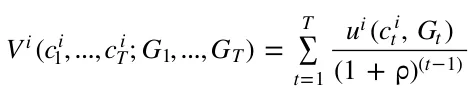
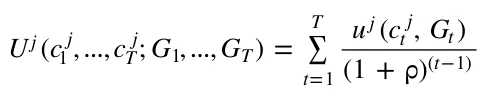
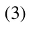
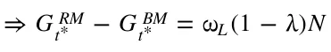
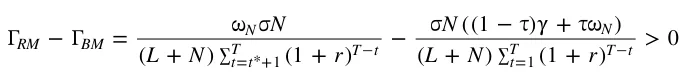
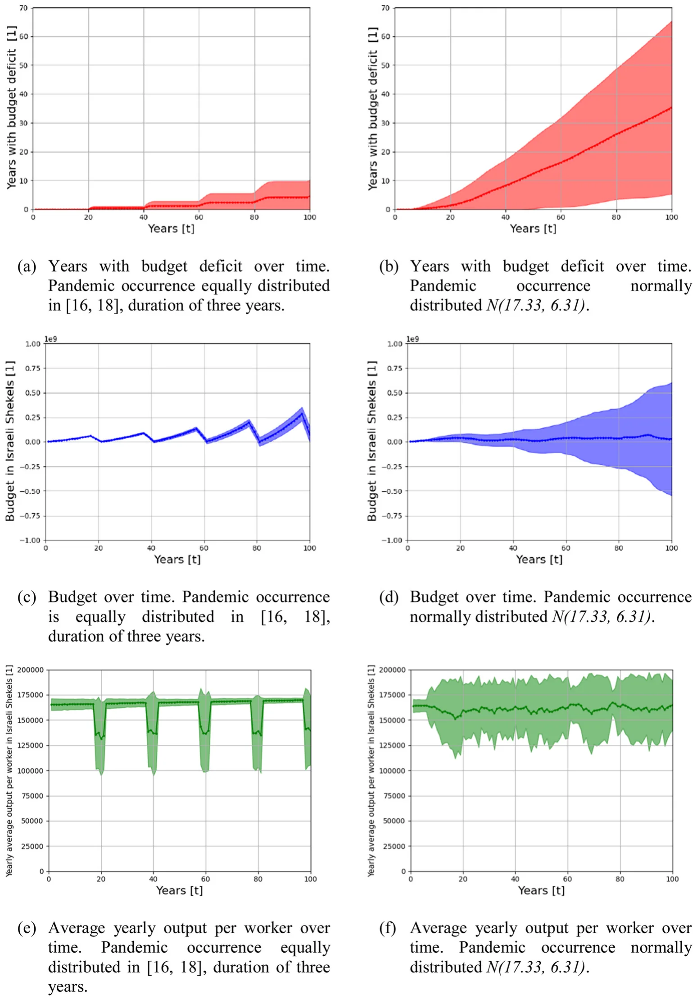
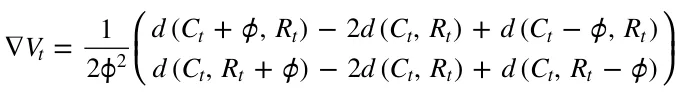
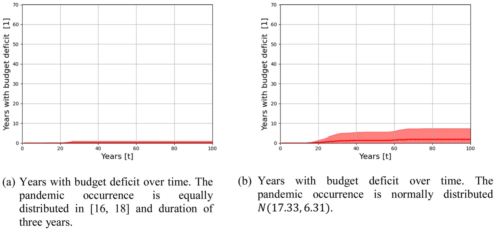

## 1. Introduction

The rapid spread of the Coronavirus has shaken the global economic systems, causing the sharpest decline in global economic activity since the collapse of the South Sea Bubble in 1720 (McKibbin & Vines, 2020). As a result, governments’ ability to address the crisis has been at the center of public discourse, with the understanding that continued and flexible fiscal support is required to deal effectively with the crisis outcomes, until a durable recovery is underway (International Monetary Fund, 2021).

However, as the epidemiological-economic crisis continued, the implementation of multiyear fiscal support actions to health care systems, firms, and households, along with the sharp fall in tax revenues caused by contractions in output, were reflected in an unprecedented rise in the deficit and debt levels of governments around the world, resulting in significant updates in debt projections as compared to pre-pandemic estimations (Salvatore, 2021). The average overall deficits in 2020, as a percentage of GDP, reached 10.5 % for advanced economies, 9.3 % for emerging market economies, and 5.1 % for low-income developing countries. Moreover, the worldwide average public debt in 2020 reached a historically high level of 99 % of GDP and is projected to stabilize at around 94 % in 2022 (IMF, 2022).

Nevertheless, the country’s ability to provide support to its citizens is correlated with its ranking by per capita income level. The rise in deficits in advanced economies and some emerging market economies was caused by roughly equal increase in spending and declines in revenues, whereas in most low-income developing countries and emerging market economies, the rise in government deficit stemmed primarily from the decline in revenues due to the contractions in output. In a context of historically low interest rates, countries with stronger buffers and better access to finance were able to deploy larger fiscal support. Moreover, as of 2021, many governments in advanced economies are implementing sizable spending and revenue measures, with an average of 6 % out of GDP, while support provided in emerging market economies and low-income developing countries has been much smaller, where a large share of these measures is close to expiring (IMF, 2021).

McKibbin and Vines (2020) argued that to allow many of the emerging market economies to undertake the kind of massive fiscal response that advanced countries have been able to carry out, there is a need for international cooperation which involves financial assistance in the amount of $2 trillion. Adam et al. (2020) discussed the required overseas development assistance (ODA) to help countries in sub-Saharan Africa deal with the fiscal and medical issues caused by the Coronavirus pandemic. The authors showed that keeping the degree of domestic fiscal adjustment within reasonable bounds requires an $50 billion of ODA, which doubles the aid these countries receive. Support from the international community to low-income countries that face especially daunting challenges has been also suggested by the IMF. According to the IMF calculations, $3 trillion is needed for 121 emerging market economies and low-income developing countries to meet the Sustainable Development Goals by 2030, i.e., 2.6 % of 2030 world GDP (IMF, 2021).

Pre-existing inequalities have amplified the adverse impact of the COVID-19 pandemic, while the crisis has aggravated those inequalities, even among EU countries. Carnazza and Liberati (2021) found that countries of the Eurozone that before the COVID-19 crisis were in a state of high debt-to-GDP experienced a significant increase in interest rates and a greater perceived risk of default. According to the IMF, “a vicious cycle of inequality could morph into a social and political seismic crack”. To reduce that risk, the IMF calls for tackling these inequalities, which, in many cases, require substantial increases in tax capacity and improvements in the efficiency of public spending. Policy responses should include increasing the progressively of income taxes, inheritance and gift taxes, and property taxation in advanced economies, while emerging market and developing economies should focus on strengthening tax capacity to finance more social spending. Coronavirus recovery contributions and wealth taxes were also suggested (IMF, 2021).

Essential staff shortage and job burnout is a primary challenge to implementing surge capacity plans during a pandemic (Casafont et al., 2021; Jalili et al., 2021; Hick et al., 2020). Workers in essential industries hold occupations ranging from physicians to grocery clerks, and during an outbreak they face varying virus exposure risks depending on their occupation and job tasks. Clearly, individuals involved in healthcare and first responders encounter diseases and infections daily and typically are at increased risk of exposure to high viral load because of their close contact with COVID-19 patients, which puts them at risk of becoming infected as has been the case during many previous epidemics, such as severe acute respiratory syndrome (SARS) and Ebola. Moreover, Firew et al. (2020) show that healthcare workers have experienced significant physical and psychological risk while working during the Coronavirus pandemic. Indeed COVID-19 has sickened many essential workers, with a growing number of health care workers who are infected or quarantined after exposure to the virus. The COVID-19 pandemic has had a far-reaching negative impact on healthcare systems worldwide and has placed healthcare providers under immense physiological and psychological pressures (Ardebili et al., 2021). However, workers in non-essential professions may find themselves unemployed in emergencies, especially when a general curfew and restrictions on movement are imposed on the public. According to the International Labour Organization, the decline in working hours stood in 2020 at 8.8 % relative to the fourth quarter of 2019. These working-hour losses are equivalent to 255 million full-time jobs and nearly four times greater than during the global financial crisis in 2009.1

The uncertainty surrounding the outbreak dynamics and its economic effects has exposed the government institutions’ unpreparedness for integrated epidemiological-economic crises (Pratiwi & Salamah, 2020; Bruinen de Bruin et al., 2020) and the lack of understanding regarding the unique dynamics between the spread of the disease and the economic loss resulting from measures taken to curb it (Lazebnik & Alexi, 2022; Lazebnik et al., 2021a, 2021b). Thus, we need to ensure that in similar situations in the future, governments can respond proactively rather than reactively, to instill a better degree of confidence in the financial and economic systems. This study attempts to outline an economic preparedness path for a future crisis. The proposed outline is similar to the Israeli Army reserve program. In reserve duty, residents who have completed military service are assigned to the Israel Defence Forces’ military reserve force to provide reinforcements during emergencies (war, military operations, or natural disasters) and as a routine course (e.g., for training and other activities). Israeli reservists usually devote five to six years of their life to military service. All types of reserve units are called up at least once a year for a period of twenty-one to thirty-six days for soldiers and forty-two days for officers. From a comparative perspective, the Israeli model well corresponds to the Swiss one while much less to the North American models. Notwithstanding the different characteristics, in most countries, the reserve forces are heavily utilized in emergencies (Perliger, 2011). In Israel, the National Insurance Institute (NII) pays a reserve service benefit to any person who is called up for reserve duty under the Security Service Law, as well as to anyone called up for training under the Emergency Labor Service Law.2 In our model, the reserve service program is funded by a dedicated budget aimed at covering government excess expenditure during a crisis.

Crisis management is not new in economics, especially in the finance field, and it has been emphasized even more since the 2008 financial crisis. The OECD work on financial sector guarantees has intensified since the 2008 global financial crisis as most policy responses for achieving and maintaining financial stability have consisted of providing new or extended guarantees for the liabilities of financial institutions. As part of that work, the Symposium on “Financial crisis management and the use of government guarantees” was held in Paris in October 2011, and focused on bank failure resolution and crisis management, in particular, the use of guarantees. However, While the use of guarantees was a central theme, the Symposium also analysed other aspects of the design of safety nets. The traditional three-tier safety net, consisting of a lender of last resort, bank deposit insurance, and a (micro-prudential) regulator-supervisor was considered incomplete, which led to calls for the creation of additional functions, including: (1) An institutionalized tiered systemic crisis insurance function, inspired by mechanisms developed for funding resolution of natural or man-made catastrophes. (2) A bank failure resolution fund, which would be separate from the general government budget and funded through ex-ante contributions of financial intermediaries according to their systemic importance, to finance resolution measures that require the rapid availability of funds in systemic crises (Singh & LaBrosse, 2011).

The hesitancy of the decision-makers to order a prolonged shutdown of the economy to curb the spread of the Coronavirus, already at the initial stages of the outbreak stems partially from the huge economic losses that accompany this decision. This hesitation again characterized the decision-making process regarding the purchase of vaccines. The attempt to get a reasonable price for the purchase of vaccines resulted in a rollout in implementing the vaccination campaign in many countries, including the European Union which was on a tight budget3 (Crescenzi et al., 2021). The establishment of the emergency budget can help policymakers pay unemployment benefits to workers who have lost their jobs, help businesses in crisis, and purchase the required vaccines and equipment, thereby providing the policymakers with leeway to deal with the emergency with ease, without being disturbed by its financial implications. This way, the crisis will progress towards an end, minimizing its impact on GDP, and preventing the loss of the livelihoods of many workers.

## 2. The reserve model

Consider a closed economy that contains three groups of agents: a government, essential workers (EW) *L* = {1, …, } *L* indexed by *i L*, and non-essential workers (NEW) *N* = {1, …, } indexed by *j N N*. Assume that in this economy, and according to historical records, a crisis (such as a pandemic outbreak) occurs every *T* periods. Thus, the life span of each agent is divided into discrete finite time groups of *T* = {1, …, } length each, indexed *T* by *t T*.

The government operates a reserve program through which it recruits a percentage of the NEW at some period < *t* ˆ *T* and the rest, 1 , at period < *t* ˆ *t*\* < *T* , to train them for work in the essential sector. The government pays these workers the same salary as their non-essential sector wages, while their marginal production in the essential sector is equal to the marginal production of the essential workers. All reserve workers will return to their original job after the training period. During the crisis period, *T* EW and produce the public good.

### 2.1. Essential workers

*T*, all NEW that will be laid off will now join the The EW, *L* = {1, …, }, derive their utility from the discounted flow of the private and *L* public (health care) goods consumption in each time group:

Where (0,1) is a discount factor, *c*t amount of public good at period *t T* and *u* ( ) *i u*i (0, *G* ) = *u c i i* function in both goods, with t t with one unit of time and uses all of it to work.

*T*, *G*t is the is a concave, continuous, nondecreasing utility *i u*i *u*i ( , 0) = 0, lim ( ) *x* = 0, and lim ( ) *x* = *t x x x x* 0 *T*, each worker is endowed For each *t T* the period-by-period budget constraint faced by worker *i L* is given by *p c* i = (1 ) t t L RM. Here, is the income tax rate imposed by the government, *p*t is the price of the private good at period *t T*, and L is the EW wage for each unit of time. RM is a dedicated periodic lump-sum tax aimed at financing government spending during a crisis and for training NEW in the essential sector.

### 2.2. Non-essential workers

The NEW, *j* = 1, …, *N* , derive their utility from the discounted flow of the private and public (health care) goods consumption in each time group:

During the crisis period, *T T*, a percentage of the NEW are laid off their jobs. These workers are entitled to unemployment benefits, < N, per each unit of time. However, according to the reserve program, these workers are enlisted in the essential sector with the same salary as their non-essential sector wages. Thus, for each = *t* 1, …, *T* the period-by-period budget constraint faced by worker *j N* is given by: *p c* j = (1 ) t t N RM.

### 2.3. The Government

The government collects income taxes at a rate of that is exogenous and known each period, for all periods. In addition, the government provides unemployment benefit, < N, for each unemployed citizen per each unit of unused work time. The government employs all essential workers to produce the public good G (health services) where the public sector production function is *f L* ( ) = *L* . Here, is the average output for each essential worker. To determine the periodic fixed tax, RM, so that it is sufficient to finance the training of NEW and to finance the surplus expenses during a crisis, the government must see to it that three conditions are met:

*t* ˆ *t* ˆ *t t* ˆ *t* ˆ *t S* = *S* (1 + *r* ) = (*L* + *N* ) (1 + *r* ) = *N A t*=1 *t RM t*=1 *N* (1) *t*\* \* *t*\* \* *S* = *S* (1 + *r* )t t = (*L* + *N* ) (1 + *r* )t t = (1 ) *N B t*= + *t* ˆ 1 *t RM t*= + *t* ˆ 1 *N* (2) *T T t T T t S*C = *S*t (1 + *r* ) = (*L* + *N* ) RM (1 + *r* ) = N *N t*=*t*\*+1 *t*=*t*\*+1 Here, *S*t = (*L* + *N* ) (1 ) = = *t* ˆ (1 + *r* )t ˆ t t\* (1 + *r* )t\* t T *t*=1 *t*= + *t* ˆ 1 *t*

T (1 + *r* )T t *t*=*t*\* 1 + Hence, by knowing the parameters of the model: the interest rate, *r*, the periods during which NEW training will take place, *t*ˆ and *t*\*, and the percentage of the unemployed non-essential workers; the government can set the portion of the non-essential workers to be trained in each of the periods *t*ˆ and *t*\*.

As for the budget constraints, for each = *t* 1, …, ˆ *t* 1, ˆ *t* + 1, …, \* *t* 1, \* *t* + 1, …, *T* 1 the period-by-period budget constraint faced by the government is given by: L *L* + *S*t = L *L* + N *N* + (*L* + *N* ) RM For = *t t*ˆ, = *t t*\*, and during the crisis period *T T* we get, respectively: L *L* + *S*t + N *N* = L *L* + N *N* + (*L* + *N* ) RM + *S*A *L* + *S* + (1 ) *N* = *L* + *N* + (*L* + *N* ) + *S L t N L N RM B* L *L* + *S*t + N *N* = L *L* + N *N* + (*L* + *N* ) RM + *S*C

### 2.4. Model discussion

*G* BM = *L* = *L* = *L* + *N*. *t L L N t* = 1, …, ˆ *t* 1, ˆ *t* + 1, …, \* *t* 1, \* *t* + 1, …, *T G* RM = *L* = *L* = *L* + *N G* RM t L L N . Thus t during the crisis period *T T* we get: *G* RM = (*L* + *N* ) = (*L* + *N* ) = *L t* ˆ *L L G* RM *G* BM = *N t* ˆ *t* ˆ *L G* RM = (*L* + (1 ) *N* ) = (*L* + (1 *t*\* *L* = L *L* + N *N* + L (1 ) *N* *T* is *T* 1 the amount of public good is RM *G* BM = 0. However, for = *t t*ˆ, = *t t*\*, and *t* L *L* + N *N* + L *N* ) *N* )

*G* RM = (*L* + *N* ) = (*L* + *N* ) = *L* + *N* + *N T L L N L G* RM *G* BM = *N T T L*

Hence, the amount of public good increased during the three periods *t*ˆ, *t*\*, and *T* (and did not change in the other periods). However, as expected, funding the increase in public good production will increase the tax burden on all workers in the economy. In terms of the essential workers and the non-essential workers who remained in their jobs during the crisis period, the only change in their budget constraint at all periods would be due to the increase in the lump sum tax:

Where BM is a dedicated periodic lump-sum tax (in case there is no reserve program) aimed at financing government spending that exceeds its budget during a crisis. This is positive since the right expression on the right side of the equation has a smaller numerator and a larger denominator than the left expression. The decrease in their income will lead to a decrease in the amount consumed from the private good. However, the effect of this decline on their utility will be mitigated by the increase in the amount of public goods, especially during the crisis period.

As for the NEW which are laid off during the crisis period; like other workers, their income will decrease because of the increase in the lump-sum tax. However, their wage during the crisis period in the Reserve Model will be higher than their income during the crisis without a reserve program as they will receive a wage that is higher than the unemployment benefit. Hence, they are the main beneficiaries of the change.

## 3. Simulation

We developed a simulation to investigate the properties of the model's parameters numerically and to perform a sensitivity analysis of policies implemented during a crisis. For simplicity, we made two assumptions, one regarding output and the other regarding government spending in times of crisis. By the first classical postulate of equality between the real wage and the marginal product of labour (Mott, 1988), we assume that the output equals the income of the workers participating in the production, both in the essential and non-essential sectors. Of course, in future studies, it is possible to add the profits of firms and net property income from abroad to obtain the gross national income for the economy. The second assumption is that the designated budget is directed only to finance the training of the NEW and to pay salaries to the NEW employed by the government in the essential sector during the crisis.

Our algorithm is general since, by setting different values to its arguments, one can represent the dynamics of various countries and time frames. We chose to perform the simulation for the case of Israel (2021) and considered several economic and social processes, that if introduced to the analytical formalization would result in a large-scale and complex system in which obtaining any insight becomes an unrealistically time and resource-consuming task. Specifically, on top of the proposed model, we introduce six extensions in the simulation: 1) Population Growth - taking the annual Israeli population size for the last 20 years,4 we performed a linear regression on the values and obtained an average annual population growth rate of 1.8 %. 2) The duration of pandemics - taking the list of pandemic occurrences from Brodeur et al. (2021), we approximated the occurrence probability of a pandemic using a left-screwed normal distribution and the duration of the pandemics as a normal distribution. 3) Death toll due to the outbreak as a percentage of the population - calculated by tacking the average estimated death toll in each pandemic from Brodeur et al. (2021) and dividing by the estimated global population size (Lazebnik et al., 2021a, 2021b). 4) Distribution of income - we obtained the gross income per employee by decile.5 5) Changes in income over time - obtained from a linear regression of the average income over age which shows a yearly average growth rate of 2.56 %.6 6) Income-based taxation policy - we chose to set the designated tax rate following each worker’s income tax rate according to the tax brackets (Israel Tax Authority, 2021). That is, the designated tax rate is a percentage, *C* [0,1], out of the income tax rate. In this way, we get a progressive taxation policy aimed at financing surplus expenses during a crisis. This tax rate will be added to the existing income tax rate.

Furthermore, we define the intervention policy as follows. First, the tax function taking a rate C out of worker’s income tax rate. Second, at a pandemic year, for unemployed NEW, the salary offered by the government to work in the essential sector is propositional, *R* [0,1], to the worker’s salary in the non-essential sector. If not stated otherwise, the parameter values that were used in the simulation are shown in Table 1.

## 4. Results

By performing the simulation according to the Israeli data, one can obtain several outcomes and insights. First, the dynamics of a specific policy for various scenarios. Second, sensitivity analysis of the parameters of the chosen policy, which allows us to better understand the interactions between the policy and the dynamics it enforces. And last, assuming some goal, an optimal policy (out of a set of possible policies) to achieve the desired outcome.

### 4.1. Dynamic’s baseline

We obtain the outcome of the simulation given the parameters from Table 1 over the simulation time. As the model aims to tackle the issue of under-funded government to implement intervention policies during a pandemic (or any other crisis), we measure the number of years the designated budget is in deficit, as this means the model does not fulfil its role. In addition, as the government budget has a direct impact on policy success and is affected by the population size and the pandemic mechanism, we accumulate it over time as well.

The distribution of the number of years with a budget deficit and the budget as mean ± standard deviation (STD) is shown in Fig. 1. Specifically, Figs. 1a and 1c shows the dynamics where the pandemic occurrence is equally distributed in [16,18], while Figs. 1b and 1d shows the dynamics where the pandemic occurrence is normally distributed with mean of 17:33 and STD of 6:31 (as shown in Table 1). One can notice that the uncertainty which is embodied in the STD is growing over time.

<figure class="table-figure" id="table-1">
<figcaption><strong>Table 1</strong> Description and values of the parameters used in the simulation.</figcaption>

<table><tr><th>Parameter</th><th>Symbol</th><th>Value</th></tr><tr><td>Initial number of essential workers [1]</td><td>L</td><td>200</td></tr><tr><td>Initial number of non-essential workers [1]</td><td>N</td><td>800</td></tr><tr><td>Age distribution in years [t]</td><td>A v , A w</td><td>v = [33, 50, 60], w = [0.65, 0.2, 0.15]</td></tr><tr><td>Gross monthly income distribution by deciles in</td><td>P v , P w</td><td>v = [1082, 2996, 4831, 6060, 7272, 8670, 10481,</td></tr><tr><td>Israel in Shekels (2018) [1]</td><td></td><td>13238, 17853, 33382], w = [0.1, …, 0.1]</td></tr><tr><td>Pandemic occurrence distribution in years [t]</td><td>O v , O w</td><td>N ( µ = 17.33, = 6.31)</td></tr><tr><td>Pandemic duration distribution in years [t]</td><td>D v , D w</td><td>N ( µ = 3.28, = 3.12)</td></tr><tr><td>The distribution of pandemic mortality rate from the global population [1]</td><td>S v , S w</td><td>v = [0, 0.005, 0.01, 0.02, 0.03], w = [0.7, 0.18, 0.07, 0.035, 0.015]</td></tr><tr><td>Interest on budget surpluses [1]</td><td>rs</td><td>0.015</td></tr><tr><td>Interest on budget deficit [1]</td><td>rd</td><td>0.03</td></tr><tr><td>Training rate of the non-essential workers during non-pandemic year [1]</td><td></td><td>0.01</td></tr><tr><td>The percentage of the designated income tax rate out of the income tax [1]</td><td>C</td><td>0.03</td></tr><tr><td>The ratio between the salary of a non-essential worker in the essential sector and his salary in the non-essential sector [1]</td><td>R</td><td>0.80</td></tr></table>

</figure>

### 4.2. Government policy sensitivity

The government’s policy is defined by the taxation sub-policy and its salary program sub-policy for NEW employed during a crisis in the essential sector. The taxation sub-policy is defined by the percentage of the designated income tax rate out of the income tax, *C*. The government salary program sub-policy is defined by the ratio between the salary of the NEW in the essential sector and their salary in the non-essential sector, *R*. Therefore, it is possible to define the government’s policy space using a two-dimensional space *C R* ( , ) *R* . Assuming realistic conditions, *C* can not be too high. Therefore, we set *C* [0,0.05]. Furthermore, *R* must be equal to or higher than the maximum percentage by which unemployment benefits are calculated out of the employee’s salary, that is to encourage the unemployed non-essential individuals to work in the essential sector during the crisis. In the case of Israel, we must have *R* [0.8,1], since for those 28 years of age or older, the unemployment benefit in percentage out of their salary range between 44 %−80 %, depending on their gross monthly salary.7

In the simulation,8 we calculated the rate of years with budget deficit and the budget at the end of the program as a function of *C* and *R*. Intuitively, as the designated tax rate is higher and the salary of the NEW employed by the government during a crisis is lower, the rate of years with a budget deficit is decreasing and the budget is increasing.9

<figure id="fig-1">

<figcaption><strong>Fig. 1.</strong> The distribution of years with budget deficit, the budget, and the average yearly output per worker over time, shown as mean ± STD where <em>n</em> = 100. The parameter values taken from Table 1.</figcaption>
</figure>

### 4.3. Optimal policy

One can obtain the optimal policy by performing the following optimization problem. The loss function we wish to optimize is: min( *w* + *w O* + *w* |*S* RM|) 1 2 *f* 3 *C p P*

Where is the ratio of years with budget deficit out of the policy duration, *O*f is the average yearly output per worker, and *w*1, *w*2, *w*3 are weights of the parameters such that *w*1 + *w*2 + *w*3 = 1. *p P* is the policy out of the space of all possible policies. Given the parameter space *C* ( [0,0.05], *R* [0.7,1]), one can use the gradient descent *d w* + *w O* + *w S*| RM| algorithm (Haskell, 1944) with the loss function 1 2 f 3 C where *w*1 = 0.4, *w*2 = 0.2, *w*3 = 0.4 to obtain the best representing values for the policy's parameters such that the years with budget deficit are prioritized to be much more important as they have non-linear influence on the output. The initial condition was taken by random using the Monte- Carlo method, which sampled 100 random parameter values for *C* and *R*, and used the one that fulfils min( ) (Liu et al., 2000). The gradient used in the process is computed as flows. First, *d* given a tuple *C R* ,t t (at step t) the simulator computed the portion of years with budget deficit *v*t1, the budget in the end of the program *v*t2, and the output *v*t3, defining a score *d* = *w v*1 + *w v*2 + *w v*3. Second, with a sample rate 1, the simulator computes the *t* 1 *t* 2 *t* 3 *t* scores of *C*t ± , *R*t ± . Finally, the gradient is defined as follows:

( ) ( ) *Ct*+1 *Ct* + As a result, the iteration rule takes the form = + *V* t . Where *R* is the *R*t+1 *R*t learning rate (set manually to be = 0.001). The stop condition of the process is *V* < *S*,where *t S R*+ is a pre-defined threshold for the numerical error the user willing to have from the optimal policy (set manually to be S = 0.01). This analysis is performed for both - the case where the pandemic occurrence is equally distributed in [16,18] and with a duration of three years *EX* ( 1 and the case obtained from ) Table 1 *EX* ( 2 . The results shown in Table 2 where )

*O* |*S* RM| ¯ f *RM* ¯ *C* = max ( ) , ¯ *O*f = *S* | = ) , and | C RM max (*O*f max (|*S* |) *C* to normalize them to [0,1], making them with equal significance on the optimization process. When performing the optimal policies shown in Table 2, the rate of years with a budget deficit is significantly reduced, as shown in Fig. 2.

<figure class="table-figure" id="table-2">
<figcaption><strong>Table 2</strong> Optimal policy, divided into a regular and an irregular pandemic occurrence.</figcaption>

<table><tr><th></th><th>EX1</th><th>EX2</th></tr><tr><td>C</td><td>0.0309</td><td>0.0340</td></tr><tr><td>R</td><td>0.803</td><td>0.817</td></tr></table>

</figure>

## 5. Discussion

We performed an in-silico experiment, divided into two settings. First, the pandemics occur every 16–18 years in a uniform distribution (mark *EX*1). Second, where the pandemics occur in a normal distribution with mean equals 17.33 years and standard deviation equals 6.31 years (mark *EX*2). For the first case (*EX*1), the suggested outline can keep the number of years with budget deficit relatively low (0–10 years) despite the occurrence of four pandemics during the simulation time on average, as shown in Fig. (1a). In addition, the designated budget is left, on average, with a small surplus after each outbreak. That is, the tax revenue was utilized and fulfilled its purpose, as shown in Fig. (1c). On the other hand, for the second case (*EX*2), due to the uncertainly concerning the occurrence of pandemics, governments are less prepared, and therefore the number of years with a budget deficit is increasing, on average, after each pandemic outbreak, as shown in Fig. (1b). Moreover, the distribution of the balance in the designated budget at the end of the program is wide (between 0.5 109 and 0.5 109 for | | *L* + | | *N* = 1000), however preservative the property of the first case in the manner that, on average, the budget is almost fully utilized, as shown in Fig. (1d).

The uncertainty concerning the occurrence of pandemics is more pronounced in the average yearly worker output. While in the first case, (*EX*1), the average output crashes at each outbreak, in the second case, (*EX*2), the output is, on average, relatively stable. However, this result does not reflect what will eventually happen in case of an outbreak, since in the event of a pandemic the value of the output may be at the bottom of the shaded interval for a long period, while in the first case the output recovery is fast.

Analysing the number of years with a budget deficit and the budget balance at the end of the duration (100 years), as a function of the designated income tax rate out of the income tax, C, and the ratio between the salary of a NEW in the essential sector and their salary in the non-essential sector, R, shows the following. First, as expected, the number of years with a budget deficit for the case *EX*1 increases as C decreases or R increases. Similarly, the budget balance decreases as C decreases or R increases. Second, the number of years with a budget deficit for the case *EX*2 behaves similarly as in the first case *EX*1, however, much more chaotic as the uncertainly plays a major role. This chaotic behaviour also holds for the budget balance.

The results in Fig. 1 were obtained using the parameters values taken from Table 1, in particular the values of C and R. However, these values were not chosen to obtain the optimal policy out of the space of all possible policies that the government can choose from. Given the parameter space *C* ( [0,0.05], *R* [0.7,1]), one can obtain for both cases- *EX*1 and *EX*2- the best representing values for the policy’s parameters, as shown in Table 2. Applying these parameters underscores the power of the model in maintaining a balanced budget over time, even under uncertainty concerning the occurrence of pandemics.

<figure id="fig-x2">

</figure>

100\. The parameter

\= *n* **Fig. 2.** The distribution of the years with budget deficit over time for the optimal policy from Table 1. The results are shown as mean ± STD where values taken from Table 1 while the *C* and *R* parameter values taken from Table 2.

## 6. Conclusions

The magnitude of the global economic crisis caused by the coronavirus outbreak few could predict. The rapid spread of the coronavirus caught most of the world's countries unprepared, and some in a precarious economic situation, causing enormous losses in life and significant economic consequences. The health crisis rapidly transformed into an economic and labor market shock, impacting not only supply (production of goods and services) but also demand (Del Rio-Chanona et al., 2020). Faced with this outlook, countries took steps to mitigate the crisis so that its consequences do not drag on overtime. Some of these measures involve increased spending on healthcare and transfers to affected sectors. Together with the drop in tax revenues, such measures created even wider public deficits, and while currently these deficits are financed by the growth of debt, the time will come for tax policy with a clear distinction between temporary measures and those that are permanent.

During a crisis, the government’s policy is evaluated according to its success in minimizing the crisis’s direct and indirect adverse effects. In this study, we propose an outline for economic readiness in case of a future crisis in general, and a pandemic outbreak in particular. Under the proposed model, by managing a dedicated income-based tax-financed budget aimed at funding government excess expenditure during a crisis, and by adopting a reserve program in the essential sector of the economy, we show in silico that social and economic costs can be reduced. During a crisis, unemployed NEW will be recruited to work in the essential sector, reducing the number of unemployed and improving the quality of the public good, which is vital during crises. Based on data from the Israeli economy, imposing a dedicated income tax at a rate of about three percent out of the existing income tax rate brackets, and providing salary to the NEW employed during a crisis in the essential sector, in the amount of 80 % of their salary in the non-essential sector, prevents the formation of a prolonged crisis while maintaining a non-deficit budget and a relatively high output.

The Nobel Prize-winning biologist Joshua Lederberg wrote “The single biggest threat to man’s continued dominance on the planet is the virus.” (Lederberg, 1988). While urbanization in the developing world is bringing more and more people into denser neighborhoods, which increases the speed at which new infections are spread, globalization has facilitated pathogen spread among countries through the growth of trade and travel (Wu et al., 2017). Indeed, even in this modern era, infectious disease outbreaks are nearly constant. In the last fifty years, the world has experienced at least four outbreaks of pandemics: the Seventh Cholera pandemic, the HIV/AIDS pandemic, the 2009 flu pandemic, and recently the Coronavirus pandemic (Brodeur et al., 2021). Thus, economic preparedness is a necessary step to ensure the economic strength of a country. The next deadly pandemic we probably cannot prevent, but we certainly can - and must - better prepare for it.

The notion of establishing a reserve fund for medical emergencies has been implemented by Congress in 2018 and the model shows that there is a benefit in the current time to adopt it in the economic field (See also World Bank Group, 2019). The idea of establishing a "reserve force", which would support the essential workers in times of crisis, was derived from the world of military concepts, and in particular the Israeli Army reserve program. Going forward, rebuilding buffers is crucial for resilience in the event of further shocks. Medium-term frameworks and better targeting will be key for building fiscal space and better confronting trade-offs such as providing support now and providing insurance against future emergencies.

In *Capitalism and Freedom*, Milton Friedman argues: “Only a crisis - actual or perceived - produces real change. When that crisis occurs, the actions that are taken depend on the ideas that are lying around. That, I believe, is our basic function: to develop alternatives to existing policies, to keep them alive and available until the politically impossible becomes the politically inevitable.” (Friedman, 2016). The short-term and long-lasting social and economic impact of the Coronavirus crisis on societies, healthcare systems, workplaces, and individuals are likely to justify a rethinking of economic priorities across the globe. The discussion in the current study focused on the labor market during an epidemiological-economic crisis, while emphasizing the government budget deficit resulting from fiscal policy measures taken by many governments around the world. Moreover, the analysis included the issue of shortage of essential workers that could impair the effectiveness of the measures and slow down the recovery of the economy. However, government spending during a crisis is not limited to the labor market and includes support to the health care system, the self-employed, and more. Future studies will be able to rely on the proposed model and offer additional outlines for the proper management and financing of crises.

## Notes

1 https://ilostat.ilo.org/topics/covid-19/#

2 For more information, please refer to:https://www.btl.gov.il/English%20Homepage/Benefits/Reserve%20Service

%20Benefit/Pages/default.aspx

3 How neoliberalism and austerity crippled the EU's COVID response - Lawyers, Guns & Money (lawyersgunsmoneyblog.com)

4 https://www.worldometers.info/world-population/israel-population/

5 https://www.cbs.gov.il/en/publications/Pages/2020/income18-e.aspx

6 The data found in several reports of the Israeli Central Bureau of Statistics.

7 https://www.btl.gov.il/English%20Homepage/Benefits/Unemployment%20Insurance/Pages/BenefitAmount.aspx 8 The simulator can be found at: https://github.com/teddy4445/Emergency\_Economics\_Simulator

9 Sensitivity analysis of the policy space can be found at: https://github.com/teddy4445/Emergency\_Economics\_Simulator/blob/main/sensitivity\_graph.pdf

## References

- Adam, C., Henstridge, M., & Lee, S. (2020). After the lockdown: macroeconomic adjustment to the COVID-19 pandemic in sub-Saharan Africa. Oxford Review of Economic Policy, 36(Supplement 1), S338–S358. [link](http://refhub.elsevier.com/S0161-8938%2823%2900009-1/sbref1)
- Ardebili, M. E., Naserbakht, M., Bernstein, C., Alazmani-Noodeh, F., Hakimi, H., & Ranjbar, H. (2021). Healthcare providers experience of working during the COVID-19 pandemic: a qualitative study. American Journal of Infection Control, 49(5), 547–554. [link](http://refhub.elsevier.com/S0161-8938%2823%2900009-1/sbref2)
- Brodeur, A., Gray, D., Islam, A., & Bhuiyan, S. (2021). A literature review of the economics of COVID-19. Journal of Economic Surveys, 35(4), 1007–1044. [link](http://refhub.elsevier.com/S0161-8938%2823%2900009-1/sbref3)
- Bruinen de Bruin, Y., Lequarre, A.-S., McCourt, J., Clevestig, P., Pigazzani, F., Jeddi, M. Z., Colosio, C., & Goulart, M. (2020). Initial impacts of global risk mitigation measures taken during the combatting of the COVID-19 pandemic. Safety ScienceArticle 104773. [link](http://refhub.elsevier.com/S0161-8938%2823%2900009-1/sbref4)
- Carnazza, G., & Liberati, P. (2021). The asymmetric impact of the pandemic crisis on interest rates on public debt in the Eurozone. Journal of Policy Modeling, 43(3), 521–542. [link](http://refhub.elsevier.com/S0161-8938%2823%2900009-1/sbref5)
- Casafont, C., Fabrellas, N., Rivera, P., Oliv´e-Ferrer, M. C., Querol, E., Venturas, M., Prats, J., Cuzco, C., Frias, C. E., Perez-Ortega, S., & Zabalegui, A. (2021). Experiences of nursing students as healthcare aid during the COVID-19 pandemic in Spain: A phemonenological research study. Nurse Education Today, 97, Article 104711. [link](http://refhub.elsevier.com/S0161-8938%2823%2900009-1/sbref6)
- Crescenzi, R., Giua, M., & Sonzogno, G. V. (2021). Mind the Covid-19 crisis: An evidence-based implementation of Next Generation EU. Journal of Policy Modeling, 43(2), 278–297. [link](http://refhub.elsevier.com/S0161-8938%2823%2900009-1/sbref7)
- Del Rio-Chanona, R. M., Mealy, P., Pichler, A., Lafond, F., & Farmer, J. D. (2020). Supply and demand shocks in the COVID-19 pandemic: An industry and occupation perspective. Oxford Review of Economic Policy 36, Supplement 1, S94–S137. [link](http://refhub.elsevier.com/S0161-8938%2823%2900009-1/sbref8)
- Firew, T., Sano, E. D., Lee, J. W., Flores, S., Lang, K., Salman, K., Greene, M. C., & Chang, B. P. (2020). Protecting the front line: a cross-sectional survey analysis of the occupational factors contributing to healthcare workers’ infection and psychological distress during the COVID-19 pandemic in the USA. BMJ Open, 10(10), Article e042752. [link](http://refhub.elsevier.com/S0161-8938%2823%2900009-1/sbref9)
- Friedman, M. (2016). Capitalism and freedom. Columbia University Press. [link](http://refhub.elsevier.com/S0161-8938%2823%2900009-1/sbref10)
- Haskell, B. C. (1944). The method of steepest descent for non-linear minimization problems. Quarterly of Applied Mathematics, 2(3), 258–261. [link](http://refhub.elsevier.com/S0161-8938%2823%2900009-1/sbref11)
- Hick, J. L., Hanfling, D., Wynia, M. K., & Pavia, A. T. (2020). Duty to plan: Health care, crisis standards of care, and Novel Coronavirus SARS-CoV-2. Discussion Paper, National Academy of Medicine. [link](http://refhub.elsevier.com/S0161-8938%2823%2900009-1/sbref12)
- International Monetary Fund (2021). Fiscal monitor: A fair shot. Washington, DC: IMF. [link](http://refhub.elsevier.com/S0161-8938%2823%2900009-1/sbref13)
- International Monetary Fund (2022). Fiscal monitor: Fiscal policy from pandemic to war. Washington, DC: IMF. [link](http://refhub.elsevier.com/S0161-8938%2823%2900009-1/sbref14)
- Israel Tax Authority (2021). Income tax brackets Israel.
- Jalili, M., Niroomand, M., Hadavand, F., Zeinali, K., & Fotouhi, A. (2021). Burnout among healthcare professionals during COVID-19 pandemic: a cross-sectional study. International Archives of Occupational and Environmental Health, 1–8. [link](http://refhub.elsevier.com/S0161-8938%2823%2900009-1/sbref15)
- Lazebnik, T., & Alexi, A. (2022). Comparison of pandemic intervention policies in several building types using heterogeneous population model. Communications in Nonlinear Science and Numerical Simulation, 107, Article 106176. [link](http://refhub.elsevier.com/S0161-8938%2823%2900009-1/sbref16)
- Lazebnik, T., Bunimovich-Mendrazitsky, S., & Shami, L. (2021a). Pandemic management by a spatio–temporal mathematical model. International Journal of Nonlinear Sciences and Numerical Simulation. [link](http://refhub.elsevier.com/S0161-8938%2823%2900009-1/sbref17)
- Lazebnik, T., Shami, L., & Bunimovich-Mendrazitsky, S. (2021b). Spatio-temporal influence of nonpharmaceutical interventions policies on pandemic dynamics and the economy: The case of COVID-19. Economic Research- Ekonomska Istrazivanja, 1–29. [link](http://refhub.elsevier.com/S0161-8938%2823%2900009-1/sbref18)
- Lederberg, J. (1988). Medical science, infectious disease, and the unity of humankind. JAMA, 260(5), 684–685. [link](http://refhub.elsevier.com/S0161-8938%2823%2900009-1/sbref19)
- Liu, J., Liang, F., & Wong, W. (2000). The multiple-try method and local optimization in metropolis sampling. Journal of the American Statistical Association, 95, 121–134. [link](http://refhub.elsevier.com/S0161-8938%2823%2900009-1/sbref20)
- McKibbin, W., & Vines, D. (2020). Global macroeconomic cooperation in response to the COVID-19 pandemic: a roadmap for the G20 and the IMF. Oxford Review of Economic Policy, 36(Supplement 1), S297–S337. [link](http://refhub.elsevier.com/S0161-8938%2823%2900009-1/sbref21)
- Mott, T. (1988). The Real Wage and The Marginal Product of Labor. Technical report, Levy Economics Institute of Bard College, Annandale-on-Hudson, NY. Working Paper, No. 12.
- Perliger, A. (2011). The changing nature of the Israeli reserve forces: Present crises and future challenges. Armed Forces & Society, 37(2), 216–238. [link](http://refhub.elsevier.com/S0161-8938%2823%2900009-1/sbref22)
- Pratiwi, F. I., & Salamah, L. (2020). Italy on COVID-19: Response and strategy. Global & Strategis, 14(2), 225–238. [link](http://refhub.elsevier.com/S0161-8938%2823%2900009-1/sbref23)
- Salvatore, D. (2021). The US and the world economy after Covid-19. Journal of Policy Modeling, 43(4), 728–738. [link](http://refhub.elsevier.com/S0161-8938%2823%2900009-1/sbref24)
- Shami, L. (2019). Dynamic monetary equilibrium with a non-observed economy and Shapley and Shubik’s price mechanism. Journal of Macroeconomics, 62, Article 103018. [link](http://refhub.elsevier.com/S0161-8938%2823%2900009-1/sbref25)
- Singh, D., & LaBrosse, J. R. (2011). Developing a framework for effective financial crisis management. Financial Market Trends, 2011, 2. [link](http://refhub.elsevier.com/S0161-8938%2823%2900009-1/sbref26)
- World Bank Group (2019). Pandemic preparedness financing. status update.
- Wu, T., Perrings, C., Kinzig, A., Collins, J. P., Minteer, B. A., & Daszak, P. (2017). Economic growth, urbanization, globalization, and the risks of emerging infectious diseases in China: A review. Ambio, 46(1), 18–29. [link](http://refhub.elsevier.com/S0161-8938%2823%2900009-1/sbref27)
