Wildfires pose risks to wildlife and human societies throughout the globe1,2, while also contributing to increasing emissions of aerosols and greenhouse gases into the atmosphere3. Recently, the frequency of extreme wildfires has substantially increased due to Climate Change4. A key element of wildfire preparedness is effective wildfire prediction5. Prediction of wildfire occurrence provides firefighters with an opportunity to extinguish wildfires in their early stages and provide life-saving alerts to populations at risk6. A common method of estimating wildfire risk is with Fire Weather Indices (FWIs), which are based on various meteorological factors and fuel loads and provide a fire danger indicator7,8.

A growing body of work has successfully demonstrated the potential of Machine Learning (ML) models to effectively predict wildfire risk, as many studies have developed either regional ML models6,9,10 or global ones11–14, commonly outperforming rule-based or analytical-based models15. Machine learning models offer the flexibility to incorporate region-specific ecological drivers of wildfire activity, such as vegetation type, fuel moisture dynamics, ignition sources, and land-use patterns, which vary widely across landscapes and interact in complex, nonlinear ways. Given that wildfire occurrence emerges from the interplay of multiple factors across scales, machine learning models are particularly well-suited to this task, as they can learn these intricate relationships directly from the data11–14. By aligning model inputs and structure with ecological variability, ML approaches can more effectively capture local fire regimes and improve predictive performance.

However, despite their strong performance, ML models have not replaced FWIs in practice. Their limited adoption is likely due to the accessibility, simplicity, and explainability of traditional FWIs, which have been refined over decades of domain knowledge. Traditional FWIs are trusted by practitioners, while ML models are often viewed as “black-box” solutions, lacking transparency and interpretability16. This hesitancy underscores the need to build on established domain knowledge while improving model adaptability and performance17.

Several different FWIs have been developed and used over the years. Probably the most common index is the Canadian Forest Fire Weather Index (from here on referred to as the Canadian FWI)7,18. This index has been applied and evaluated in different regions around the globe19–21. Throughout the years, other fire weather indices have been developed. Two notable mentions are The National Fire Danger Rating System (NFDRS)22, from here on referred to as the American FWI, and the McArthur’s Forest Fire Danger Index developed in Australia, from here on referred to as the Australian FWI23. These three well-established indices are commonly used in many wildfire prediction applications7,8,24, though we acknowledge that many additional indices have been developed.

In some cases, the original index has been adapted to specific regions25,26. Wildfire risk is highly region-dependent, influenced by local climate patterns, vegetation types, land management practices, and ignition sources (e.g., lightning versus anthropogenic ignitions27). Recent research has highlighted this regional variability by grouping global forest ecoregions into 12 distinct pyromes, which represent regions where wildfire patterns are driven by similar climatic, human, and vegetation controls28. Hence, adapting wildfire prediction models to country-specific conditions would allow us to improve their accuracy and relevance. Regional adaptation allows models to integrate local meteorological patterns, fuel characteristics, and historical fire data, resulting in more reliable and actionable wildfire forecasts. In addition, country-specific models can better align with local fire management strategies and operational needs, facilitating quicker and more effective responses to wildfire threats. To the best of our knowledge, this adaptation has not been performed on a global scale. Namely, the effectiveness of the FWIs could be inferior in different regions than those in which it was initially developed.

In this study, we provide three main contributions. First, we provide a global evaluation of three widely used Fire Weather Index systems, comparing their predictive performance across countries and identifying the most effective FWI in each region. To support this analysis, we present a comprehensive comparative map. Second, we use a Genetic Algorithm (GA)29 to calibrate the Canadian FWI to different countries. This approach preserves the established formula while optimizing it for local conditions, leveraging domain knowledge to improve accuracy. Third, we develop an ML-based model to predict wildfires based on the three FWI systems. To make this index accessible and easy to use, we use Knowledge Distillation30 to convert the model into a simplified and explainable Decision Tree (DT) model31 for each country. Providing an explainable DT for each country can enhance trust in the model, which is essential for its adoption32.

## Results

#### Benchmarking of the traditional FWIs

We begin by comparing the performance of the three FWI systems. In Fig. 1a–c, we present the ROC AUC scores of the three FWIs for each country. Figure 1d presents the highest-performing index in each country. The analysis reveals that the Canadian FWI obtains the highest predictive performance in the largest number of countries (91 of 160, mean ROC AUC of 0.69 across countries), including Canada (in which it was initially developed). The Australian and American indices obtain lower scores of 0.65 and 0.61, respectively. The performance of the different FWIs is substantially different across countries and regions. For instance, we note that the Canadian FWI has a relatively good performance in the Tropics. In some countries, such as Australia, the predictive performance of all three FWIs is low. The full results with the performance of each index in each country are presented in the Supplementary Information.

#### Calibration of the traditional FWIs

Next, we present the results of our proposed FWI based on GA-assisted calibration of the Canadian FWI. In Fig. 2a, we provide the ROC AUC scores of the calibrated FWI in each country. The mean performance of this model across countries is 0.81 for the training cohort and 0.79 for the testing cohort, compared to the 0.69 score of the original Canadian FWI. This substantial increase demonstrates the potential improvement of wildfire risk prediction by calibrating the FWI for each country. In Fig. 2b, we present the best-performing index among the three traditional FWIs and our calibrated Canadian FWI in each country. We provide the parameters for the developed index in each country in the appendix.

#### ML models

We next present the results of the country-specific Decision Tree developed based on an ML model. In Fig. 3a, we outline the ROC AUC scores of this model in each country. Despite the simplicity of this model, it obtains an excellent score of 0.86, compared to 0.91 of the full (and less explainable) ML model. Figure 3b compares the performance of the proposed DT with the three traditional indices. Our results reveal that it is preferable to the traditional FWIs in almost every country (over 90%), globally. We emphasize that the DT, in contrast to the full ML model, is an explainable and transparent model with only five splits. The results for the LightGBM model itself are presented in the Supplementary Information (Supplementary Fig. 1). The DT for each country is provided as a separate file. To test temporal robustness, we repeated the analysis using each year (2014–2020) as a hold-out test set. Performance dropped slightly (from 0.86 to 0.82) but remained well above traditional FWIs, confirming the model’s generalizability over time. We also validated the model across different land cover classes and found that Decision Trees consistently outperformed the traditional indices in each and every class examined (see ROC AUC scores in Supplementary Table 3).

<figure id="fig-1">
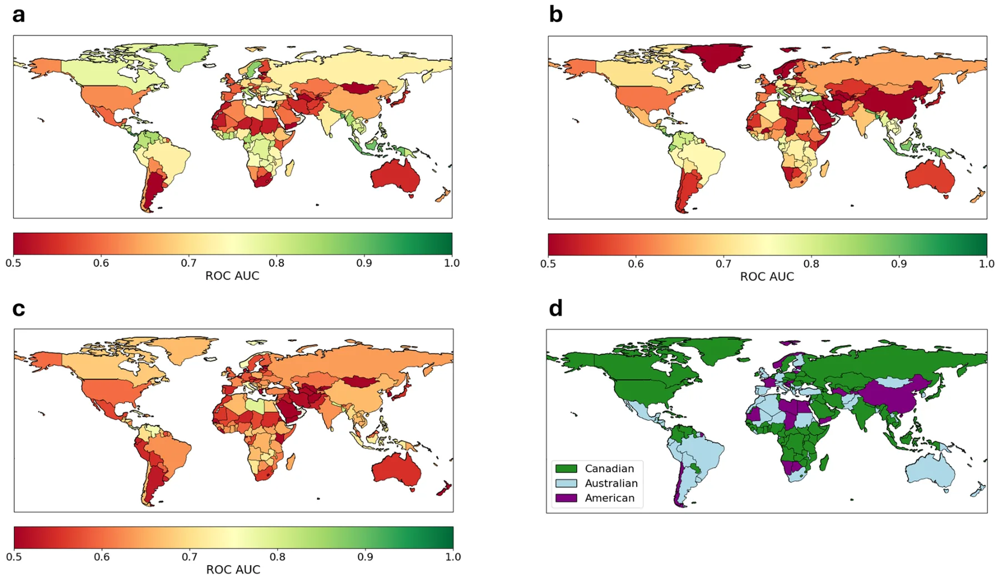
<figcaption><strong>Fig. 1 | Comparison of the FWI systems.</strong> ROC AUC values for <strong>a</strong> Canadian FWI, <strong>b</strong> Australian FWI, <strong>c</strong> American FWI, and <strong>d</strong> best performing FWI among the three FWI systems. The figure was generated using Python’s Cartopy library.</figcaption>
</figure>

<figure id="fig-2">
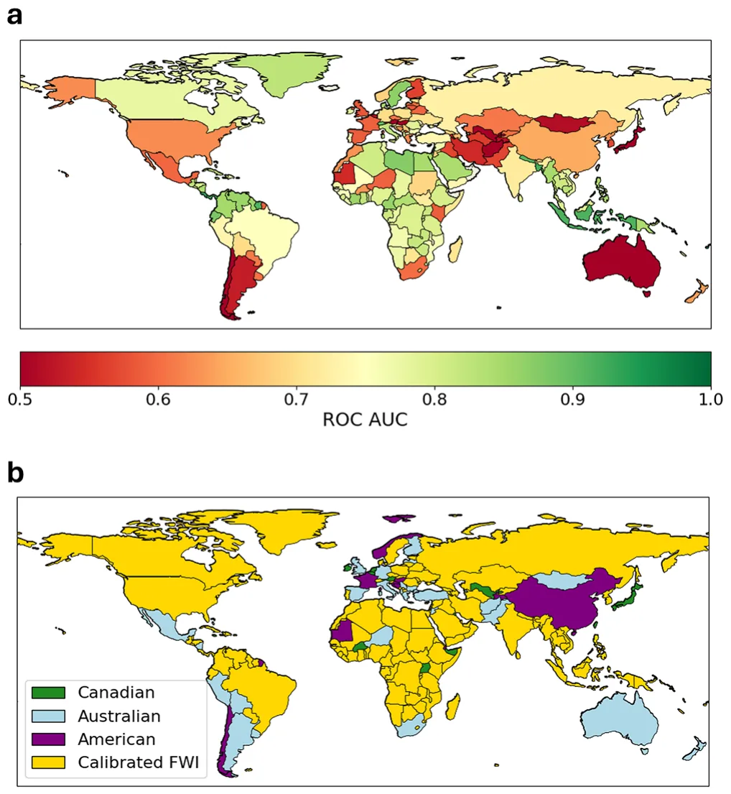
<figcaption><strong>Fig. 2 | Performance of the calibrated FWI. a</strong> ROC AUC by country for Calibrated FWI and <strong>b</strong> best performing FWI among the calibrated FWI and the three original FWI systems. The figure was generated using Python’s Cartopy library.</figcaption>
</figure>

<figure id="fig-3">
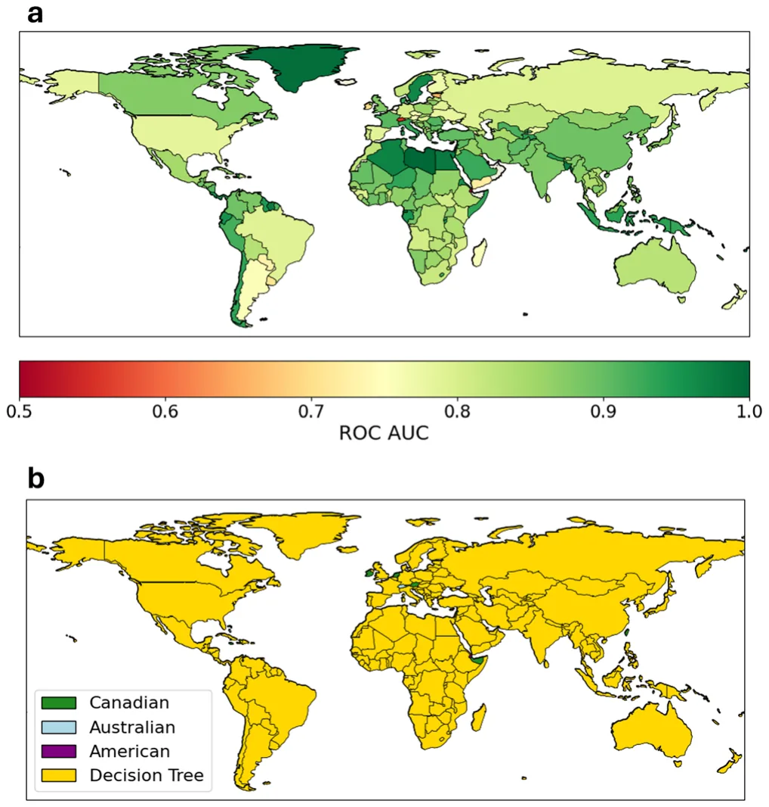
<figcaption><strong>Fig. 3 | Performance of the Decision Tree FWI. a</strong> ROC AUC by country for DT FWI and <strong>b</strong> best performing FWI among the DT FWI and the three original FWI systems. The figure was generated using Python’s Cartopy library.</figcaption>
</figure>

To assess the significance of country-specific models, we repeated this process without dividing the data by country, aiming to create a single DT model for all countries combined. Although this global model slightly outperformed traditional FWIs, it performed remarkably worse than the country-specific DTs. Specifically, the mean ROC AUC dropped from 0.86 to 0.71, underscoring the importance of regional characteristics and the need for dedicated FWIs.

<figure id="fig-4">
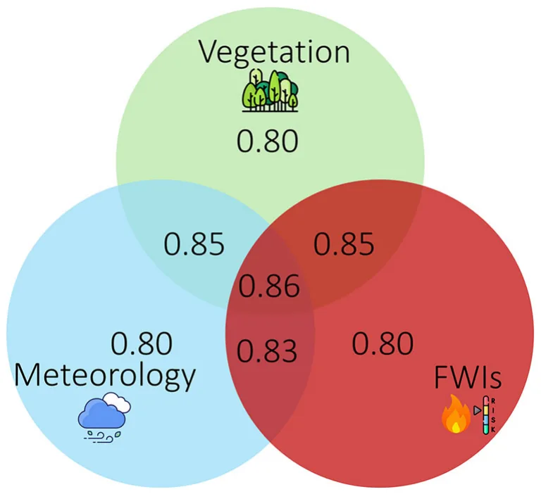
<figcaption><strong>Fig. 4 | Summary of ROC AUC scores from the ablation experiments.</strong> The DT model using the full feature set achieves the highest performance with a score of 0.86. When using only one feature group—vegetation, meteorological variables, or fire weather indices (FWIs)—performance drops to 0.80. Combining any two groups yields intermediate results, with ROC AUC scores ranging from 0.83 to 0.85.</figcaption>
</figure>

To better understand which types of input data contribute most to model performance, we conducted a series of ablation studies. These experiments isolate the impact of vegetation, meteorological variables, and FWIs—both individually and in combination—on predictive accuracy. The results of these experiments, presented in Fig. 4 and Supplementary Table 2, highlight the complementary value of these feature groups and underscore the importance of integrating diverse environmental drivers when modeling wildfire risk.

#### Comparison of the models

Next, we present the improvement (change in ROC AUC) of the two models in each country, compared to the three traditional FWIs. Figure 5 presents a country-level comparison of the calibrated FWI and DT against the three traditional FWIs. The improvement of the calibrated FWI is consistent almost globally when compared to the Australian FWI (Fig. 5b) and the American FWI (Fig. 5c). Its improvement relative to the Canadian FWI varies by region, with the most notable gains observed in Africa, South America, and South Asia (Fig. 5a). In contrast, the performance of the DT is consistently (for over 98% of the countries) better than the traditional FWIs, including the Canadian FWI which obtained the highest performance among the three systems (Fig. 5d–f). Finally, in Table 1 we summarize the ROC AUC scores for all the models in the paper.

## Discussion

Climate and human factors jointly shape global wildfire patterns, though their interactions vary regionally33. Wildfires typically occur when critical thresholds related to ignition, fuel, and drought are crossed, but the extent and severity of fires are also strongly influenced by human activity and landscape structure34,35. Empirical research consistently identifies fuel availability, fuel continuity, and atmospheric humidity as key drivers of wildfire regimes, whereas ignitions are comparatively less limiting36. Moreover, recent work shows that climate change has significantly increased the frequency and intensity of fire weather globally37,38, and even the duration of fire seasons34. This increase is especially significant in extratropical forests and high-latitude regions28, though the resulting burned area remains highly dependent on ecological and anthropogenic factors37. Globally, forest fire carbon emissions have risen by 60% over the past two decades28.

A critical aspect of effective wildfire management is the ability to reliably predict wildfire occurrence and behavior39. Wildfire prediction is particularly challenging due to the complex interplay of weather, fuel availability, and ignition sources, many of which are human-induced and highly variable across regions34. Traditional fire forecasts rely heavily on fire weather indices, often overlooking critical fuel and ignition components, which limits their ability to predict actual fire occurrence40. Recent advances in machine learning and remote sensing now offer the potential for more **e** DT versus Australian FWI, and **f** DT versus American FWI. The figure was generated using Python’s Cartopy library.

<figure id="fig-5">
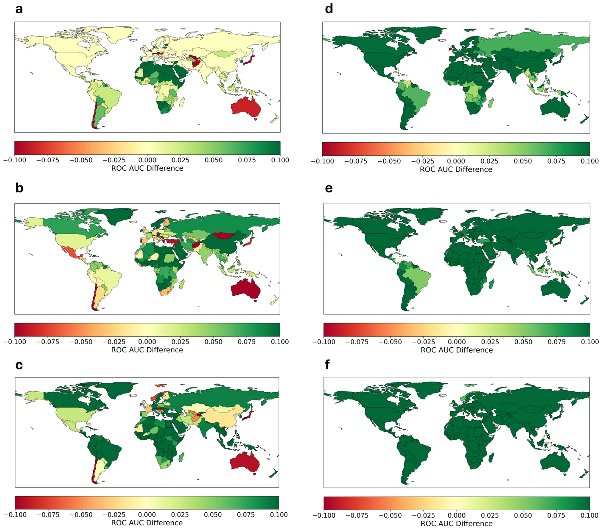
<figcaption><strong>Fig. 5 | Relative improvements in performance by country.</strong> Differences in ROC AUC score by country for <strong>a</strong> calibrated versus Canadian FWI, <strong>b</strong> calibrated versus Australian FWI, <strong>c</strong> calibrated versus American FWI, <strong>d</strong> DT versus Canadian FWI,</figcaption>
</figure>

<figure class="table-figure" id="table-1">
<figcaption><strong>Table 1 | Mean ROC AUC scores for all models in the paper</strong></figcaption>

<table><tr><th>Model</th><th>Mean ROC AUC</th></tr><tr><td>Canadian FWI</td><td>0.69</td></tr><tr><td>Australian FWI</td><td>0.65</td></tr><tr><td>American FWI</td><td>0.61</td></tr><tr><td>Calibrated FWI</td><td>0.79</td></tr><tr><td>Global Decision Tree</td><td>0.71</td></tr><tr><td>LightGBM</td><td>0.91</td></tr><tr><td>Decision Tree</td><td>0.86</td></tr></table>

</figure>

reliable, global-scale fire prediction systems that can learn from both physical and human-driven patterns, bridging key gaps in current early warning capabilities39,41.

In this study, we proposed a method to develop country-specific FWIs using either Genetic Algorithms or ML-based Decision Tree models. Initially, we compared the performance of three widely used FWIs—the Canadian FWI18, the American Burning Index22, and the Australian McArthur Index23, across different countries. Our analysis revealed that different indices perform better in different regions, with the Canadian FWI achieving the highest performance in most countries. This result, which aligns with its widespread use7, suggests that it could serve as a strong baseline for further refinement. To further improve its performance, we employed GA-based optimization to calibrate the Canadian FWI’s parameters for each country, enhancing its predictive power and increasing its ROC AUC from 0.69 to 0.79.

Additionally, we used an ML approach to develop a single DT model for each country. DTs are among the most explainable ML models42,43, making them well-suited for practical applications. We leveraged Knowledge Distillation44 to convert the LightGBM model into a DT with a maximum depth of 5, achieving a balance between accuracy and explainability45.

This approach ensures that wildfire risk prediction remains transparent and accessible while retaining much of the predictive power of the original ML model, providing a practical tool for fire management practitioners.

#### Data

The results highlight the potential for region-specific adaptation in wildfire risk assessment. While traditional FWIs have been applied globally with limited customization, our findings show that country-level calibration can significantly improve their effectiveness. The GA-calibrated Canadian FWI achieved higher predictive performance in most regions compared to the uncalibrated versions of all three indices, demonstrating that parameter tuning can yield substantial improvements without reducing explainability. Moreover, the ML model consistently outperformed the three traditional indices, reinforcing the potential of data-driven approaches in wildfire forecasting. However, the continued reliance on traditional FWIs, even when ML models offer superior performance, underscores the importance of explainability in operational decision-making. By applying Knowledge Distillation, we converted the ML model into a simplified DT with only five splits, making it more accessible while retaining much of the predictive power.

Our results emphasize the importance of developing country-specific models for wildfire prediction46. Recent research has shown that global forest ecoregions can be grouped into 12 distinct pyromes, highlighting how regional differences in climate, human activity, and vegetation drive wildfire patterns28. To further illustrate this, we developed a single global DT using data from all countries combined. Although this global model outperformed traditional FWIs, its mean ROC AUC dropped from 0.86 to 0.71 compared to country-specific models, underscoring the impact of regional variability on prediction accuracy. This decline reinforces the value of adapting models to local environmental, climatic, and geographic conditions, as global approaches often fail to capture region-specific fire dynamics. Together, these findings highlight that incorporating local characteristics through country-specific models is essential for improving wildfire prediction accuracy and reliability.

Despite these advances, several challenges remain. Although our models achieved a significant improvement over all three traditional FWIs, they still underperformed when compared to the full ML model. This highlights a fundamental trade-off between accuracy and explainability—while our approach enhancespredictivepower, it doessowithout reducingexplainability, which could foster trust in the model32. Additionally, while the GA-calibrated model improved predictive performance in most countries, including on the test cohort, in some cases, it did not outperform the baseline FWI. In contrast, the DT model consistently achieved improvement across nearly all countries, suggesting that leveraging various inputs is a more robust approach in certain regions. Additionally, our choice to divide regions by country aligns with practical needs for wildfire management but represents a simplification of underlying climate and ecological patterns. In some cases, such as Alaska within the USA, a country-based division may be less suitable. In other cases, heterogeneous vegetation types may limit the effectiveness of country-specific fire indices, particularly in large countries such as the United States, Brazil, China, and Australia. To address this, we also provide an alternative analysis based on land cover classification and find that Decision Trees outperform traditional indices in every land cover class examined. The full ROC AUC scores are presented in Supplementary Table 3. Finally, some small countries lacked sufficient datatotrain a reliable data-driven model. Although we applied a threshold of 50 observations, countries with slightly more data may still yield noisy results in practice. Future research should explore alternative regional divisions, such as continent-based groupings or biomes, to assess whether they offer further improvements in predictive accuracy and applicability.

Taken jointly, the findings of this study have important implications for wildfire preparedness and management. By adapting FWIs to local conditions, policymakers and emergency responders can improve early warning systems, optimize resource allocation, and enhance fire mitigation strategies. Given the increasing intensity and frequency of fire weather due to climate change, there is a pressing need for more adaptive, data-driven risk assessment tools. The approach presented here provides a foundation for future efforts to refine and deploy country-specific wildfire prediction models, balancing the trade-offs between accuracy, interpretability, and usability.

## Methods

We follow the data acquisition process of Shmuel and Heifetz40. We obtain wildfire data from Artés et al.47. The dataset consists of Shapefiles representing daily-burned polygons at the individual fire level with global coverage. These polygons are provided at a 250-m resolution. To estimate wildfire occurrence, we aggregate the data into a 0.25° global grid with daily binary values, where a value of 1 indicates the ignition of a new fire in a specific region and time, while a value of 0 denotes no new fire activity. The dataset captures all global wildfires from 2014 to 2020, comprising over seven million distinct wildfires. Since burned observations are significantly outnumbered by unburned observations, we apply random undersampling to balance the dataset, ensuring the number of unburned observations matches the number of burned observations48. As a robustness test, we employ an ensemble balancing approach, repeating the undersampling procedure across 10 independent runs, each with a different random seed. This allows us to capture variability introduced by the sampling process and assess the stability of model performance. The consistency of results across runs, summarized in Supplementary Fig. 2, demonstrates that our conclusions are robust to the specific choice of non-fire samples.

We obtain surface temperature, humidity, precipitation, and 10-m wind velocity from the ERA5 global Reanalysis49. We also calculate the mean precipitation in the month before each observation as well as the number of days since the last precipitation, as these have been shown to affect wildfire risk50. All data on Fire Weather Indices was obtained from the Copernicus emergency management service51. We include three vegetation variables: NDVI, obtained from MODIS52, as well as low and high vegetation cover obtained from the ERA5 dataset49. We follow previous studies that have demonstrated the effect of population density on wildfire probability53 and add a population density variable54.

#### Methods

We partitioned the dataset by country using the Cartopy library55 and split each country’s data into training (80%) and testing (20%) cohorts. The testing data was reserved for final model evaluation to prevent overfitting and ensure an unbiased assessment. As a robustness check, we also conducted a leave-one-year-out validation for the years 2014–2020: in each iteration, data from one year was excluded from training and used solely for testing, while the model was trained on data from all other years. This approach allowed us to assess the temporal generalizability of the models and ensure that performance was not reliant on specific year-to-year patterns.

Countries with fewer than 50 observations were removed from the dataset, as this number is too low for a reliable estimation. The majority of countries (160) met this criterion and were included in the analysis. The number of observations for each country is reported in Supplementary Table 1. We note that the 50-observation threshold is somewhat arbitrary, and some countries still have relatively few observations; as a result, the corresponding results may be noisier and less reliable for these countries.

To evaluate the predictive performance of the different FWIs, we trained a logistic regression model using each FWI as the predictor and assessed its ability to distinguish between wildfire and non-wildfire observations based on the receiver operating characteristic—area under the curve (ROC AUC) score56. ROC AUC quantifies how effectively a model separates fire events from non-fire events, with 1.0 indicating perfect classification and 0.5 representing random guessing. The GA and ML models, described in the following paragraphs, were evaluated using the same testing framework to ensure comparability across methods. Figure 6 provides an overview of the methodology used in this study.

The Canadian FWI system consists of several components18. The build-up index (BUI) is calculated based on the duff moisture code (DMC) and the drought code (DC):

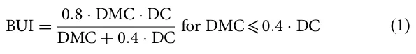

<figure id="fig-6">
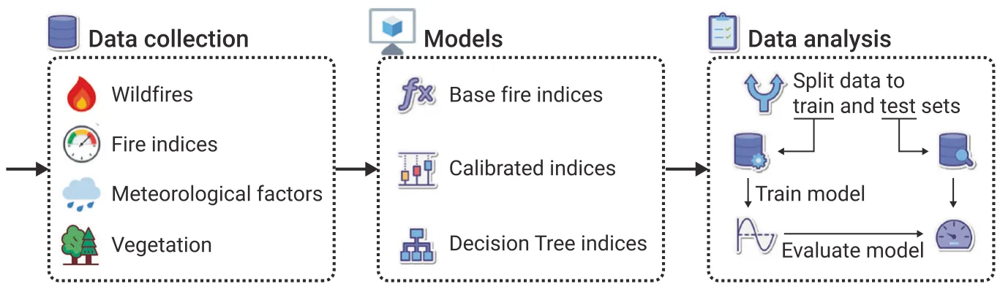
<figcaption><strong>Fig. 6 |</strong> A schematic view of the methodology used in this study.</figcaption>
</figure>

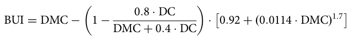

### Calibrated FWI:

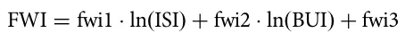

for DMC > 0.4 · DC

The initial spread index (ISI) is calculatedusing wind speed and the fine fuel moisture code (FFMC):

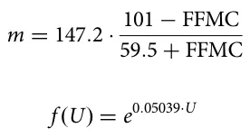

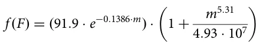

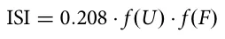

The final fire weather index (FWI) is:

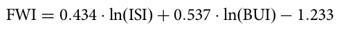

where FFMC fine fuel moisture code (dimensionless), DMC duff moisture code (dimensionless), DC drought code (dimensionless), U wind speed at 10 m height (km/h), BUI build-up index (dimensionless), ISI initial spread index (dimensionless), FWI fire weather index (dimensionless).

To improve predictive performance, we introduce calibrated parameters into the FWI formulation. These parameters are labeled explicitly below. Calibrated build-up index:

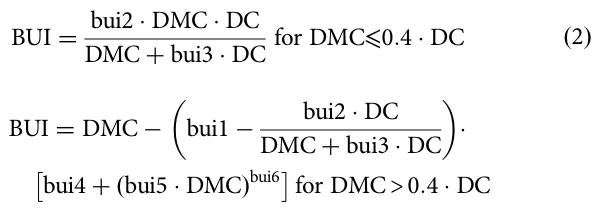

Calibrated ISI:

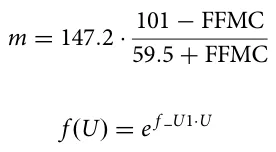

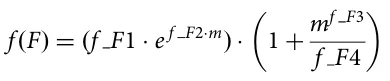

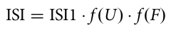

Where bui1, bui2, bui3, bui4, bui5, bui6, f\_U1, f\_F1, f\_F2, f\_F3, f\_F4, ISI1, fwi1, fwi2, and fwi3 are the model’s parameters. These parameters are all dimensionless.

To optimize the parameters of a predefined formula for maximizing classification performance, we employed a GA. The dataset consisted of four input variables (U, FFMC, DMC, DC) and a binary class label (y). The predefined formula utilized 15 parameters and produced an intermediate output z = f(U, FFMC, DMC, DC). A logistic regression layer was applied to the formula’s output to estimate the probability of the positive class, P(y = 1| z). The goal was to optimize the 15 parameters of the formula to maximize the area under the receiver operating characteristic curve (AUC).

Formally, each candidate solution in the GA represented a set of 15 parameters. The initial population was generated using a warm-start approach, where the initial parameter values were taken directly from the original formula. To ensure diversity in the population, random perturbations of 2.5% were added to these initial values, staying within a small range around the original values. The fitness function was designed to evaluate the AUC of the logistic regression model based on the dataset and the formula’s output for each candidate set of parameters. A constraint was introduced to enforce parameter proximity to their original values. Specifically, if the absolute relative deviation of any parameter exceeded X% from its original value, the candidate solution was assigned a fitness of zero. This constraint reduced the search space in each run. The GA was run multiple times with varying constraints (1%, 10%, 50%, and no constraints), and the globally optimal solution was selected based on training data performance.

To select candidate solutions for reproduction, we employed the Roulette-wheel selection method57. In this approach, candidates were selected probabilistically, with the likelihood of selection proportional to their fitness values. To generate offspring, we applied the simulated binary crossover (SBC) operator58 to pairs of selected candidates. SBC simulated a single-point crossover but controlled offspring generation using a probability distribution centered around the parent solutions, governed by a crossover index parameter. To introduce diversity and prevent premature convergence, a polynomial mutation operator59 was employed. This operator perturbed parameter values based on a polynomial probability distribution, allowing for small but impactful modifications to candidate solutions. The GA terminated after a predefined number of generations was chosen to balance computation time and the ability to cover an optimum.

The optimized parameters obtained from the GA were used to compute the final formula output and logistic regression predictions. The resulting AUC was compared with the baseline AUC (calculated using the original parameter values) to assess the effectiveness of the optimization process. If the optimized parameters did not improve performance in a given country, we retained the original FWI parameters for the test set.

We developed an ML model using the widely established LightGBM library60, a gradient-boosting framework that efficiently handles large datasets and reduces computational cost through histogram-based learning. LightGBM is considered one of the state-of-the-art models in tabular data predictions and has been shown to outperform well-established models such as XGBoost61. Our LightGBM model was trained using 50 estimators and a maximum tree depth of 8. We tested alternative hyperparameter values, but observed no significant performance gains in terms of ROC AUC and classification accuracy. To enhance interpretability, we applied Knowledge Distillation62; namely, we trained a Decision Tree on the probability estimations of the LightGBM model, limiting its maximum depth to 5 to balance the model’s performance and explainability63. This approach ensures that the final model remains explainable while preserving much of the predictive power of the original ML model. We also evaluated a baseline DT model trained directly on the data, without the intermediate LightGBM step. However, this model exhibited lower predictive accuracy, demonstrating the benefits of using LightGBM’s learned representations. As a result, we focus on the distilled DT model in this study.

We also performed an ablation study to assess the impact of different input variables on the performance of country-specific DT models. Specifically, we trained three variations of the DT model: (1) using only meteorological variables, (2) incorporating both meteorological and vegetation data while excluding traditional Fire Weather Index (FWI) indices and subindices, and (3) using only FWI indices and subindices. The results of these experiments are presented in Supplementary Information (Supplementary Table 2), and the full dataset, including all corresponding DT models, is provided as separate files.

We repeated the analysis using several alternative machine learning models and compared their performance to LightGBM. Specifically, we evaluated XGBoost64, Random Forest65, and Logistic Regression66, all with default hyperparameters. As the performance of XGBoost and Random Forest was comparable to LightGBM, and Logistic Regression performed worse, their results are not presented.

Finally, we repeated the analysis by partitioning the observations based on land cover types rather than countries, using a land cover dataset55. While country-based division is useful in the operational context of fire management, it may obscure ecological differences within national boundaries. The land cover–based analysis demonstrates that our method remains applicable across varying contexts, provided that each group contains a sufficient number of observations.

## Data availability

Data is provided within the manuscript or supplementary information files.

## Code availability

All the code developed in this study is available on our GitHub.

Received: 30 April 2025; Accepted: 10 July 2025;

## References

1. Mcwethy, D. et al. Rethinking resilience to wildfire. Nat. Sustain. 2, 797–804 (2019).
2. Moritz, M. et al. Learning to coexist with wildfire. Nature 515, 58–66 (2014).
3. Byrne, B. et al. Nature 633, 835–839 (2024).
4. Di Virgilio, G. et al. Climate change increases the potential for extreme wildfires. Geophys. Res. Lett. 46, 8517–8526 (2019).
5. Suarez, D., Gomez, C., Medaglia, A. L., Akhavan-Tabatabaei, R. & Grajales, S. Integrated decision support for disaster risk management: aiding preparedness and response decisions in wildfire management. Inf. Syst. Res. 35, 609–628 (2024).
6. Jain, P. et al. A review of machine learning applications in wildfire science and management. Environ. Rev. 28, 478–505 (2020).
7. Baijnath-Rodino, J. A., Foufoula-Georgiou, E., & Banerjee, T. Reviewing the “hottest” fire indices worldwide. In: Earth and Space Science Open Archive. (2020). [doi:10.1002/essoar.10503854.1](https://doi.org/10.1002/essoar.10503854.1)
8. Zacharakis, I. & Tsihrintzis, V. Environmental forest fire danger rating systems and indices around the globe: a review. Land (2023). [doi:10.3390/land12010194](https://doi.org/10.3390/land12010194)
9. Pang, Y. et al. Forest fire occurrence prediction in China based on machine learning methods. Remote Sens. 14, 5546 (2022).
10. Wang, S. S.-C., Qian, Y., Leung, L. R. & Zhang, Y. Identifying key drivers of wildfires in the contiguous US using machine learning and game theory interpretation. Earth’s. Future 9, e2020EF001910 (2021).
11. Ji, Y., Wang, D., Li, Q., Liu, T. & Bai, Y. Global wildfire danger predictions based on deep learning taking into account static and dynamic variables. Forests 15, 216 (2024).
12. Prapas, I. et al. Deep learning for global wildfire forecasting. Preprint at arXiv (2022). [doi:10.48550/arXiv.2211.00534](https://doi.org/10.48550/arXiv.2211.00534)
13. Shmuel, A. & Heifetz, E. Global wildfire susceptibility mapping based on machine learning models. Forests 13, 1050 (2022).
14. Zhang, G., Wang, M. & Liu, K. Deep neural networks for global wildfire susceptibility modelling. Ecol. Indic. 127, 107735 (2021).
15. Rubí, J. N. S.& Gondim, P. R. L. A performance comparison of machine learning models for wildfire occurrence risk prediction in the Brazilian Federal District region. Environ. Syst. Decis. 44, 351–368 (2024).
16. Jiang, S. et al. How interpretable machine learning can benefit process understanding in the geosciences. Earth’s Future (2024). [doi:10.1029/2024ef004540](https://doi.org/10.1029/2024ef004540)
17. Rana, R. et al. The adoption of machine learning techniques for software defect prediction: an initial industrial validation. In: Communications in Computer and Information Science, pp 270–285. (Springer International Publishing, 2014).
18. Van Wagner, C. E. Structure of the Canadian forest fire weather index. https://meteo-wagenborgen.nl/wp/wp-content/uploads/2019/08/van-Wagner-1974.pdf (1974). [link](https://meteo-wagenborgen.nl/wp/wp-content/uploads/2019/08/van-Wagner-1974.pdf)
19. Carvalho, A., Flannigan, M., Logan, K., Miranda, A. & Borrego, C. Fire activity in Portugal and its relationship to weather and the Canadian Fire Weather Index System. Int. J. Wildland Fire 17, 328–338 (2008).
20. Dimitrakopoulos, A. P., Bemmerzouk, A. M. & Mitsopoulos, I. D. Evaluation of the Canadian fire weather index system in an eastern Mediterranean environment: evaluation of cffdrs in eastern mediterranean environment. Meteorol. Appl. 18, 83–93 (2011).
21. Tian, X., McRae, D. J., Jin, J., Shu, L., & Zhao, F. Wildfires and the Canadian Forest Fire Weather Index system for the Daxing’anling region of China. Int. J. Wildland Fire https://www.publish.csiro.au/wf/WF09120 (2011). [link](https://www.publish.csiro.au/wf/WF09120)
22. Schoenberg, F. P. et al. A critical assessment of the Burning Index in Los Angeles County, California. Int. J. Wildland Fire 16, 473 (2007).
23. Dowdy, A., Mills, G., Finkele, K., & Groot, W. D. Australian fire weather as represented by the McArthur Forest Fire Danger Index and the Canadian Forest Fire Weather Index. https://cawcr.gov.au/technical-reports/CTR\_010.pdf (2009). [link](https://cawcr.gov.au/technical-reports/CTR_010.pdf)
24. Jiménez-Ruano, A., Rodrigues Mimbrero, M., Jolly, W. M. & de la Riva Fernández, J. The role of short-term weather conditions in temporal dynamics of fire regime features in mainland Spain. J. Environ. Manag. 241, 575–586 (2019).
25. Chelli, S. et al. Adaptation of the Canadian Fire Weather Index to Mediterranean forests. Nat. Hazards 75, 1795–1810 (2015).
26. Jong, M. D. et al. Calibration and evaluation of the Canadian Forest Fire Weather Index (FWI) System for improved wildland fire danger rating in the United Kingdom. Nat. Hazards Earth Syst. Sci. 16, 1217–1237 (2015).
27. Shmuel, A., Lazebnik, T., Glickman, O., Heifetz, E. & Price, C. Global lightning-ignited wildfires prediction and climate change projections based on explainable machine learning models. Sci. Rep. 15, 7898 (2025).
28. Jones, M. W. et al. Global rise in forest fire emissions linked to climate change in the extratropics. Science 386, eadl5889 (2024).
29. Lambora, A., Gupta, K. & Chopra, K. Genetic algorithm—a literature review. 2019 International Conference on Machine Learning, Big Data, Cloud and Parallel Computing (COMITCon), pp 380–384 (2019).
30. Frosst, N. & Hinton, G. Distilling a neural network into a soft decision tree. Preprint at arXiv http://arxiv.org/abs/1711.09784 (2017). [link](http://arxiv.org/abs/1711.09784)
31. Song, Y.-Y.&Lu, Y. Decision tree methods: applications for classification and prediction. Shanghai Arch. Psychiatry 27, 130–135 (2015).
32. Dramsch, J. S. et al. Explainability can foster trust in artificial intelligence in geoscience. Nat. Geosci. 18, 112–114 (2025).
33. Aldersley, A., Murray, S. J. & Cornell, S. E. Global and regional analysis of climate and human drivers of wildfire. Sci. Total Environ. 409, 3472–3481 (2011).
34. Pausas, J. G. & Keeley, J. E. Wildfires and global change. Front. Ecol. Environ. 19, 387–395 (2021).
35. Ondei, S., Price, O. F. & Bowman, D. M. Garden design can reduce wildfire risk and drive more sustainable co-existence with wildfire. npj Nat. Hazards 1, 18 (2024).
36. Haas, O., Keeping, T., Gomez-Dans, J., Prentice, I. C. & Harrison, S. P. The global drivers of wildfire. Front. Environ. Sci. 12, 1438262 (2024).
37. Jones, M. W. et al. Global and regional trends and drivers of fire under climate change. Rev. Geophys. 60, e2020RG000726 (2022).
38. Amiri, A., Soltani, K., Gumiere, S. J. & Bonakdari, H. Forest fires under the lens: needleleaf index-a novel tool for satellite image analysis. npj Nat. Hazards 2, 9 (2025).
39. Di Giuseppe, F., McNorton, J., Lombardi, A. & Wetterhall, F. Global data-driven prediction of fire activity. Nat. Commun. 16, 2918 (2025).
40. Shmuel, A., & Heifetz, E. Developing novel machine-learning-based fire weather indices. Mach. Learn. (2023). [doi:10.1088/2632-2153/acc008](https://doi.org/10.1088/2632-2153/acc008)
41. Torres-Vázquez, M. Á. et al. Enhancing seasonal fire predictions with hybrid dynamical and random forest models. npj Nat. Hazards 2, 20 (2025).
42. Sagi, O. & Rokach, L. Explainable decision forest: transforming a decision forest into an interpretable tree. Int. J. Inf. Fusion 61, 124–138 (2020).
43. Sagi, O. & Rokach, L. Approximating XGBoost with an interpretable decision tree. Inf. Sci. 572, 522–542 (2021).
44. Fakoor, R., Mueller, J. W., Erickson, N., Chaudhari, P., & Smola, A. J. Fast, Accurate, and Simple Models for Tabular Data via Augmented Distillation. In: (eds H. Larochelle, M. Ranzato, R. Hadsell, M. F. Balcan, & H. Lin). Advances in Neural Information Processing Systems, Vol. 33, pp. 8671–8681. (Curran Associates, Inc., 2020).
45. Abdollahi, A. & Pradhan, B. Explainable artificial intelligence (XAI) for interpreting the contributing factors feed into the wildfire susceptibility prediction model. Sci. Total Environ. 879, 163004 (2023).
46. Chuvieco, E., Martínez, S., Román, M. V., Hantson, S. & Pettinari, M. L. Integration of ecological and socio-economic factors to assess global vulnerability to wildfire: assessment of global wildfire vulnerability. Glob. Ecol. Biogeogr. 23, 245–258 (2014).
47. Artés, T. et al. A global wildfire dataset for the analysis of fire regimes and fire behaviour. Sci. Data 6, 296 (2019).
48. Hasanin, T. & Khoshgoftaar, T. The effects of random undersampling with simulated class imbalance for big data. 2018 IEEE International Conference on Information Reuse and Integration (IRI), pp 70–79 (2018).
49. Hersbach, H. et al. The ERA5 global reanalysis. Q. J. R. Meteorol. Soc. R. Meteorol. Soc. (Gt. Br.) 146, 1999–2049 (2020).
50. Shmuel, A., Ziv, Y. & Heifetz, E. Machine-Learning-based evaluation of the time-lagged effect of meteorological factors on 10-hour dead fuel moisture content. For. Ecol. Manag. 505, 119897 (2022).
51. Copernicus Climate Change Service, Climate Data Store. (n.d.). Fire danger indices historical data from the Copernicus emergency management service (2019).
52. Didan, K., Munoz, A. B., Solano, R. & Huete, A. MODIS vegetation index user’s guide (MOD13 series). Vegetation Index Phenology Lab, University of Arizona, vol 35, pp 2–33 (2015).
53. Forkel, M. et al. Emergent relationships with respect to burned area in global satellite observations and fire-enabled vegetation models. Biogeosciences 16, 57–76 (2019).
54. Warszawski, L. et al. Center for International Earth Science Information Network—CIESIN—Columbia University. Gridded Population of the World, Version 4 (GPWv4): Population density. Palisades. NY: NASA Socioeconomic Data and Applications Center (SEDAC). Atlas of Environmental Risks Facing China under Climate Change, vol 228 (2016). [doi:10.7927/h4np22dq](https://doi.org/10.7927/h4np22dq)
55. Elson, P. et al. SciTools/cartopy: Cartopy 0.18. 0. Zenodo (2023).
56. Huang, J. & Ling, C. Using AUC and accuracy in evaluating learning algorithms. IEEE Trans. Knowl. Data Eng. 17, 299–310 (2005).
57. Lipowski, A. & Lipowska, D. Roulette-wheel selection via stochastic acceptance. Physica A: Statistical Mechanics and itsApplications, 39, 2193-2196 (2012).
58. Deb, K. & Beyer, H. G. Self-adaptive genetic algorithms with simulated binary crossover. Evolut. Comput. 9, 197–221 (2001).
59. Lim, S. M. et al. Crossover and mutation operators of genetic algorithms. Int. J. Mach. Learn. Comput. 7, 9–12 (2017).
60. Ke, G. et al. LightGBM: A highly efficient Gradient Boosting Decision Tree. Neural Inf. Process. Syst. 3146–3154 (2017).
61. Zhang, D., & Gong, Y. The comparison of LightGBM and XGBoost coupling Factor Analysis and prediagnosis of Acute Liver Failure. IEEE Access: Practical Innovations, Open Solutions, 8, 220990–221003 (2020).
62. Liu, X., Wang, X. & Matwin, S. Improving the interpretability of deep neural networks with knowledge distillation. 2018 IEEE International Conference on Data Mining Workshops (ICDMW), pp 905–912 (2018).
63. Lazebnik, T., & Rosenfeld, A. FSPL: A meta-learning approach for a filter and embedded feature selection pipeline. International Journal of AppliedMathematics and Computer Science 33(1). (2023). [doi:10.34768/amcs-2023-0009](https://doi.org/10.34768/amcs-2023-0009)
64. Chen, T. & Guestrin, C. XGBoost: A Scalable Tree Boosting System. In Proceedings of the 22nd ACM SIGKDD International Conference on KnowledgeDiscovery and Data Mining. KDD ’16: The 22nd ACM SIGKDD International Conference on Knowledge Discovery and Data Mining, San FranciscoCalifornia USA. (2016). [doi:10.1145/2939672.2939785](https://doi.org/10.1145/2939672.2939785)
65. Biau, G. & Scornet, E. A random forest guided tour. Test 25, 197–227 (2016).
66. LaValley, M. P. Logistic regression. Circulation 117, 2395–2399 (2008). Author contributions Assaf Shmuel: Conceptualization, Methodology, Software, Formal analysis, Investigation, Data Curation, Writing—Original Draft, Writing - Review & Editing, Visualization. Teddy Lazebnik: Conceptualization, Methodology, Software, Formal analysis, Investigation, Writing—Original Draft, Writing— Review & Editing, Visualization, Supervision. Eyal Heifetz: Conceptualization, Methodology, Formal analysis, Investigation, Writing— Review & Editing, Supervision. Oren Glickman: Conceptualization, Methodology, Formal analysis, Investigation, Writing—Review & Editing, Supervision. Colin Price: Conceptualization, Methodology, Formal analysis, Investigation, Writing—Review & Editing, Supervision. Competing interests The authors declare no competing interests. Additional information Supplementary information The online version contains supplementary material available at and requests for materials should be addressed to Assaf Shmuel. Reprints and permissions information is available at http://www.nature.com/reprints © The Author(s) 2025 [doi:10.1038/s44304-025-00126-y.Correspondence](https://doi.org/10.1038/s44304-025-00126-y.Correspondence) · [link](http://www.nature.com/reprints)
