## I. Introduction

The proliferation of machine learning (ML) across a broad spectrum of scientific disciplines has highlighted the contrast between the need for high accuracy and the necessity for interpretability [1], [2], [3]. As ML models become more integral to making critical predictions, their complexity often obscures the understanding of their internal workings, leading to a ‘‘black box’’ dilemma [4], [5], [6]. As ML models increase in complexity, they often become less interpretable, making it difficult to understand the underlying reasons for their decisions [7]. While certain ML models like Random Forests (RF) are considered relatively interpretable [8], [9], others, such as Neural Networks (NN), are often viewed as complete ‘black boxes’ [10], [11].

The associate editor coordinating the review of this manuscript and approving it for publication was Massimo Cafaro .

This lack of transparency is particularly challenging in fields where validation and trust in predictive models are crucial, such as medicine [12], [13]. In addition, it is a pivotal concern in scientific research, where understanding the underlying mechanisms is as important as achieving high predictive accuracy [14], [15]. Symbolic Regression (SR), a form of regression analysis that searches for mathematical expressions to best fit a dataset, provides a potential solution with its inherently interpretable nature [16], [17]. Unlike traditional ML models like RF or NNs that prioritize accuracy, SR provides explicit and comprehensible mathematical formulas, making the rationale behind predictions more transparent to the user [18]. However, SR often does not achieve the accuracy levels of more sophisticated ensemble methods such as Gradient Boosting Machines (GBMs), including popular implementations like XGBoost [19]. GBMs are generally considered state of the art for tabular classification and regression tasks, often outperforming deep learning models [20].

<figure id="fig-1">
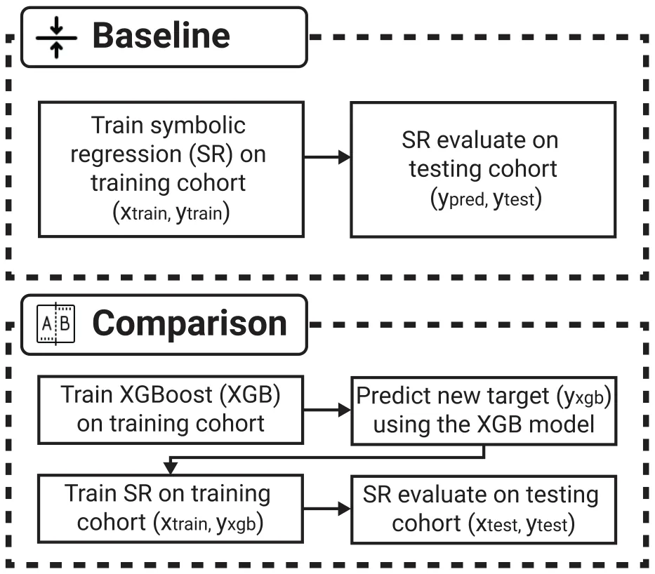
<figcaption><strong>FIGURE 1.</strong> A schematic view of the proposed experimental design.</figcaption>
</figure>

In order to push the Pareto front of the accuracy-explainability trade-off, in this work we introduce a novel ensemble method that employs a two-step process mimicking the student-teacher framework in model distillation: first, leveraging a gradient boosting model for its predictive accuracy, then distilling this knowledge into an SR model to enhance interpretability without compromising on performance. We hypothesize that distilling from a strong predictive model will reduce the functional complexity of the target, effectively guiding the SR algorithm toward more stable and generalizable equations. This approach not only bridges the accuracy-interpretability gap but also allows us to explain the decisions of complex ML models through analytical mathematical equations. While knowledge distillation is widely used in deep learning to compress large neural networks into smaller ones (model compression), our application differs fundamentally in its objective. Here, the goal is not compression but *guidance*. We employ the gradient boosting model not to reduce parameter count, but to smooth the optimization landscape for the symbolic regression solver.

The rest of the paper is organized as follows. First, Section II outlines the usage of ML models for tabular data and discusses SR methods, including their strengths, limitations, and connection to ML. Section III introduces the proposed two-step ensemble method. In addition, the experimental setup used to explore the proposed method is formally presented. Section IV presents the obtained results of the conducted *in silico* experiments. Section V discusses the implications of the proposed method and suggests possible applications for it while also outlining limitations and promising future work.

### Ii. Related Work

The process of matching a numerical or symbolic function to a given set of data points is prevalent across various research domains [21]. Unlike regression tasks that prescribe a model structure and then fit it to the available data, symbolic regression (SR) entails the concurrent search for both a model and its parameters [18]. With the continuous growth of data volume and computational capabilities, numerous endeavors have been made to automate the conversion of data into knowledge using SR [22] and other data-dirven models, such as ML-based models [23].

SR is approached through various methodologies, which can be broadly categorized into four primary approaches: brute-force search, sparse regression, deep learning (DL), and genetic algorithms [24], [25]. The brute-force SR models theoretically possess the capability to tackle any SR task by exhaustively testing all possible equations to find the optimal one [26]. However, the practical application of brute-force methods often proves unfeasible due to significant computational demands and is also prone to overfitting. Deep Learning (DL) based SR models excel at handling noisy data due to neural networks’ inherent resistance to outliers [27] while presenting limited generalization capabilities which restricts their usefulness in numerous scenarios [28]. In this group, the SR is the outcome of the data-driven-based DL model rather than the task that emerged from the data. Sparse regression methods significantly narrow the search space by identifying concise models through sparsity-driven optimization [29], [30]. The genetic algorithms in SR integrate prior knowledge to confine the search space for functions while using a greedy, stochastic, and direct search approach to find both the SR’s structure and parameter values [31], [32].

Recently, a growing body of work integrating the capability of SR as part of an ML (or even DL) pipeline [33], [34], [35]. For instance, [36] investigates the integration of SR as a feature engineering step before employing machine learning models, aiming to enhance predictive performance. Through experiments on synthetic and real-world datasets, the authors demonstrate that incorporating SR-derived features leads to significant improvements, with up to 86% RMSE reduction in synthetic data and 11.5% in real-world scenarios, highlighting SR’s potential in boosting model performance and interoperability. In a similar manner, [37] examine the performance disparity between in-distribution (ID) and out-of-distribution (OOD) predictions across various ML and DL models where integrating SR as a feature engineering method with these models to address the OOD challenge. The authors demonstrated an average improvement of 3.70% and 10.20% on OOD samples for ML and DL models, respectively, without sacrificing ID performance. Reference [38] explore the integration of symbolic regression (SR) within machine learning for modeling and predicting dynamical systems, leveraging SR’s ability to learn analytically tractable models from data. Based on their method, the authors explore applications such as predicting the evolution of a harmonic oscillator, detecting an arriving front in an excitable system, and forecasting solar power production based on energy production observations and weather forecasts.

<figure class="table-figure" id="table-1">
<figcaption><strong>TABLE 1.</strong> A summary of the 10 datasets used in the study.</figcaption>
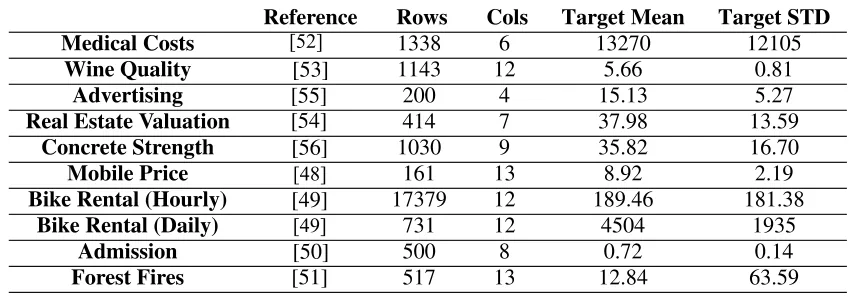

</figure>

<figure id="fig-2">
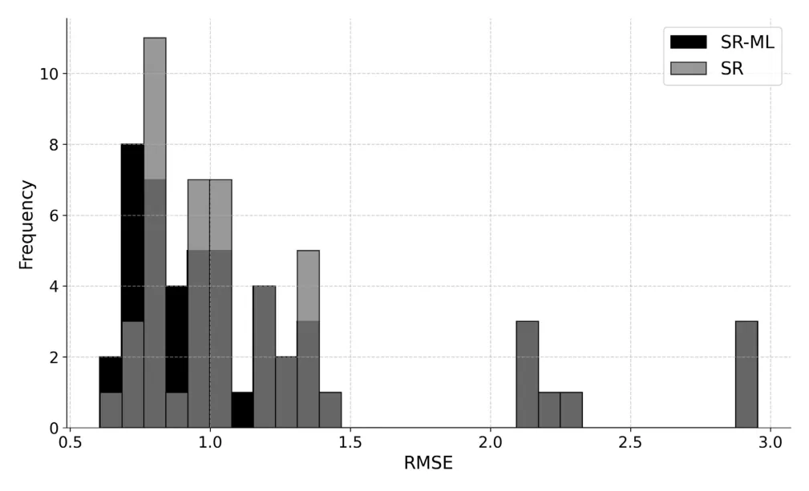
<figcaption><strong>FIGURE 2.</strong> A summary of 50 model runs for the fire danger prediction model. The SR-ML model improved the mean root mean square error (RMSE) from 1.232 to 1.192 and the median RMSE from 1.015 to 0.963.</figcaption>
</figure>

<figure id="fig-3">
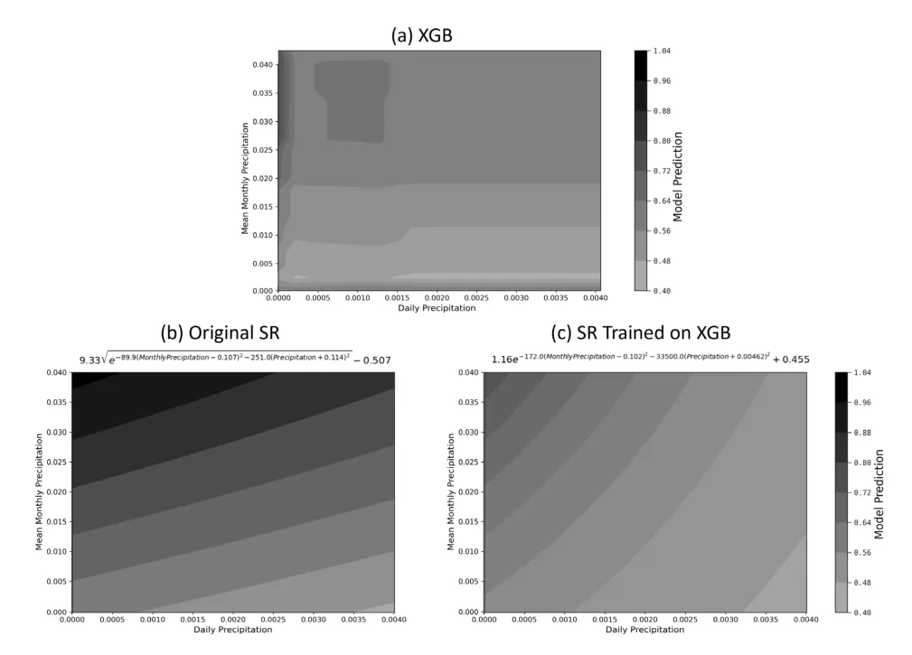
<figcaption><strong>FIGURE 3.</strong> The figures present the prediction of each of the three models, (a) XGB (b) SR (c) SR-ML, as a function of daily and monthly precipitation in one model run. The predictions of the SR-ML model are more similar to the original XGB model on which it was trained, while the predictions of the standard SR model are somewhat different. This illustrates the knowledge distillation aspect of the proposed method.</figcaption>
</figure>

In this paper, we address this challenge using the concept of model distillation. Model distillation is a powerful technique in machine learning, primarily used to enhance the performance and efficiency of models by transferring knowledge from a complex, often cumbersome, ‘teacher’ model to a simpler, more deployable ‘student’ model. This concept was popularized by Hinton et al. in 2015 [39], who demonstrated that a student model could be trained to mimic the softened output probabilities of a teacher model, thereby retaining much of its predictive power while being significantly less resource-intensive. The process involves using the output distributions of the teacher model as soft targets for training the student, which can lead to improved generalization over training directly on hard targets. Distillation has been applied across a wide range of applications, from reducing model sizes for deployment on mobile devices to facilitating privacy-preserving machine learning and enabling more efficient transfer learning scenarios. The versatility of this approach has made it a cornerstone technique for optimizing neural network deployments, particularly in environments where computational resources are limited [39], [40]. While knowledge distillation was originally developed for classification using softened probability distributions, it has also been applied to regression tasks, where students learn directly from continuous teacher predictions. Although less frequently studied, regression-based distillation has been explored in prior work [41], [42], [43], [44]. Noisy or outlying samples can disproportionately affect regression training, especially for symbolic regression. A high capacity teacher model is expected to capture the dominant signal while suppressing noise that is difficult to fit. Training symbolic regression on the teacher predictions might therefore yield a smoother target that improves symbolic regression performance. To the best of our knowledge, however, this concept has not yet been introduced in the context of symbolic regression.

<figure id="fig-4">
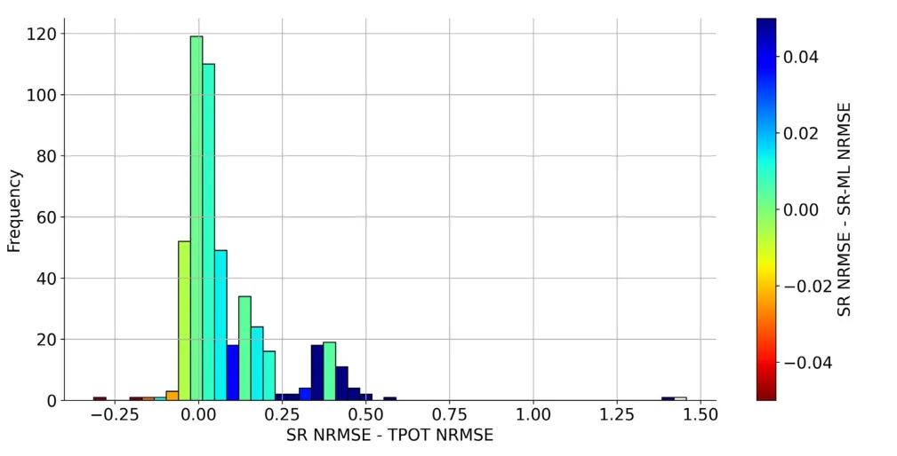
<figcaption><strong>FIGURE 4.</strong> A summary of the improvement of the SR-ML model compared to the SR model, as a function of the advantage of the ML model compared to the SR model. NRMSE values represent normalized RMSE to aggregate multiple datasets of different scales. Positive values on the x-axis indicate a better performance of the ML model compared to the SR model. Blue colors indicate an improvement of the SR-ML model compared to the baseline SR model, while red colors indicate an inferior performance. In some datasets, the SR and ML models exhibit similar performance, whereas in others the ML model significantly outperforms the SR model. Overall, the SR-ML approach yields the largest gains in cases where the ML model substantially outperforms the original SR model.</figcaption>
</figure>

<figure class="table-figure" id="table-2">
<figcaption><strong>TABLE 2.</strong> A summary of the improvement in performance in the SR-ML models compared to the original SR models. The values represent the performance difference in favor of the SR-ML model. All three SR models obtain better when using the ML pre-training process, with a mean improvement of 3.33-6.58% and a median improvement of 0.61-1.04%. The models obtained better scores in 7-8 out of 10 datasets.</figcaption>
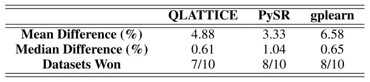

</figure>

<figure class="table-figure" id="table-3">
<figcaption><strong>TABLE 3.</strong> A summary of the improvement in performance for five different XGB optimization times. In all cases, the same symbolic regression model is used, trained either on the original data or on the corresponding ML predictions, ensuring a fair comparison. The values represent the performance difference in favor of the SR-ML model. While all values are positive, longer XGB optimization times are correlated with high performance improvements.</figcaption>
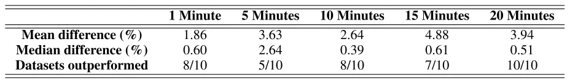

</figure>

<figure class="table-figure" id="table-4">
<figcaption><strong>TABLE 4.</strong> A summary of the improvement in performance for three different ML models used for the SR pre-training process. The ML model was trained for up to 15 minutes. The values represent the performance difference in favor of the SR-ML model. XGB performs best in this task, with RF exhibiting somewhat lower performance and KNN having little effect (close to zero, and even negative median values).</figcaption>
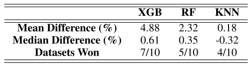

</figure>

### Iii. Methods and Materials

In this work, we propose to use the high performance of ML models to improve the training of SR models. In simple words, we suggest training an ML model and then training the SR model on its predictions instead of the values of the original target feature. This process can improve the performance of the SR model by creating a ‘‘smoothed’’ dependent variable which would be easier for the SR to predict. The final test would be to predict the values of the original target variable. However, this initial stage of pre-training based on the ML model could be a helpful step in this task.

To this end, we first outline an evaluation methodology for the performance of the obtained models. Afterward, we introduce the real-world datasets used as part of the experiments, and finally, we formally introduce the assembling method of symbolic regression and machine learning models.

### A. Evaluation Methodology

We begin by randomly partitioning the data into training and testing sets. Initially, we train a standard SR model on the training set using the original dependent variable, to be used as a benchmark. Following this, we train a machine learning ML model on the same training data and obtain its predictions for the training set. Subsequently, we develop a second SR model, denoted as SR-ML, which utilizes the original independent variables to predict the output of the ML model on the training set. Finally, we assess and compare the Root Mean Square Error (RMSE) of both the SR model and the SR-ML model on the testing set. For a visual representation of this experimental design, refer to Figure 1.

To ensure a thorough evaluation, we conducted the assessment process 50 times using different splits between the training and testing cohorts for each dataset. This approach resulted in a total of 1000 evaluations, not including the robustness tests. 80% of the data was designated for training, while the remaining 20% was used for testing.

To assess our proposed method, we carried out various robustness tests. The first section examines our model for the QLATTICE SR model while using the XGB as the ML model. We repeated this experiment with two alternative SR models, gplearn [45]and PySR [46], resulting in a total of three SR models. We also examined the performances when replacing XGB with alternative ML models, namely Random Forest (RF), and K-Nearest Neighbours (KNN). While this is not a crucial step in demonstrating the effectiveness of our method (there is no reason not to use XGB), we did so to improve our understanding of the process. Similarly, we evaluated the performance of the method using an XGB model optimized for 15 minutes as the default setting, and additionally analyzed the effect of varying the XGB optimization time to 1, 5, 10, and 20 minutes. To assess statistical significance, we compare SR and SR-ML using paired tests across runs, since both models are evaluated on the same train-test split and random seed. Specifically, we perform paired t-tests on the per-run differences in test RMSE between SR and SR-ML to evaluate whether one method consistently outperforms the other.

### B. Datasets

We use a total of eleven real-world datasets with 50 repetitions of each run to ensure robustness. The first data is used as an elaborate example of the method. We demonstrate this using the wildfire danger index based on meteorological factors and vegetation. We use data similar to [47], namely including temperature, RH, wind velocity, and Normalized Difference Vegetation Index (NDVI) to predict the burned area on the first day of the fire in a total of 10,000 randomly chosen wildfires from the dataset.

<figure class="table-figure" id="table-5">
<figcaption><strong>TABLE 5.</strong> Full results for the QLATTICE model. For each row, the best performing model is marked by bold font.</figcaption>
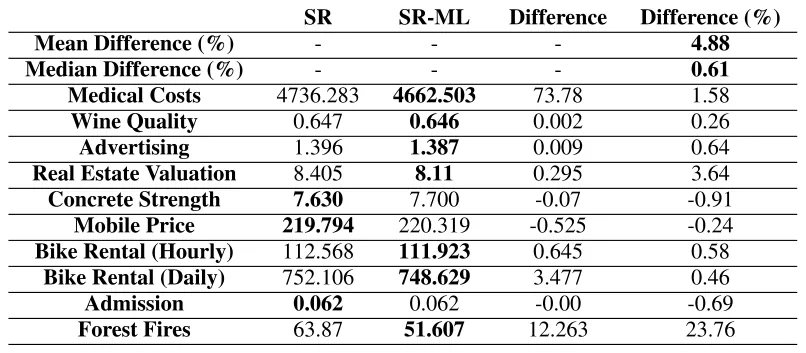

</figure>

<figure class="table-figure" id="table-6">
<figcaption><strong>TABLE 6.</strong> Full results for the PySR model. For each row, the best performing model is marked by bold font.</figcaption>
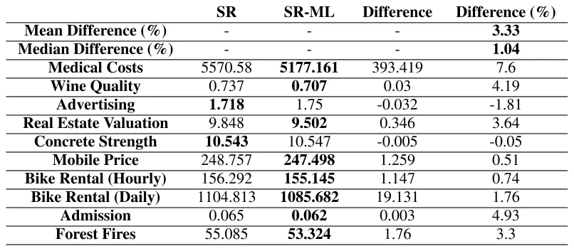

</figure>

<figure class="table-figure" id="table-7">
<figcaption><strong>TABLE 7.</strong> Full results for the gplearn model. For each row, the best performing model is marked by bold font.</figcaption>
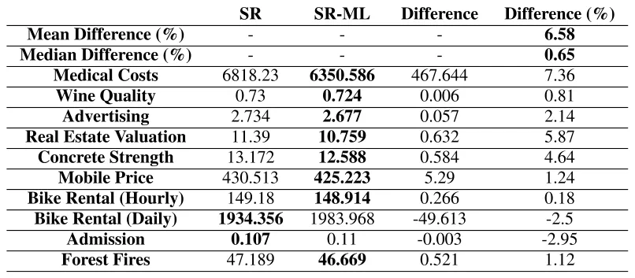

</figure>

Next, we use 10 additional popular UCI and Kaggle datasets to ensure the robustness of the results across various datasets. We utilized a variety of datasets including the Mobile Price Prediction [48], Bike Rental Datasets (both hourly and daily resolutions) [49], Graduate Admissions [50], Forest Fires Dataset [51], Medical Cost Personal Datasets [52], Wine Quality Dataset [53], Real Estate Valuation [54], Advertising Dataset [55], and Concrete Compressive Strength [56]. The datasets are summarized in Table 1. As we later show, in some of these datasets the performance of the SR and ML models is similar, while in others the ML model significantly outperforms the SR model. This enables a comparison of the proposed method across different scenarios.

### C. Symbolic Regression and Machine Learning Models

In our study, we primarily utilize QLATTICE (Feyn) as an SR model, a powerful tool known for its efficiency in discovering interpretable mathematical formulas from data [57]. QLATTICE employs a quantum-inspired algorithm that optimizes model complexity and predictive accuracy, making it ideal for generating transparent and easy-to-understand models [57].

<figure id="fig-5">
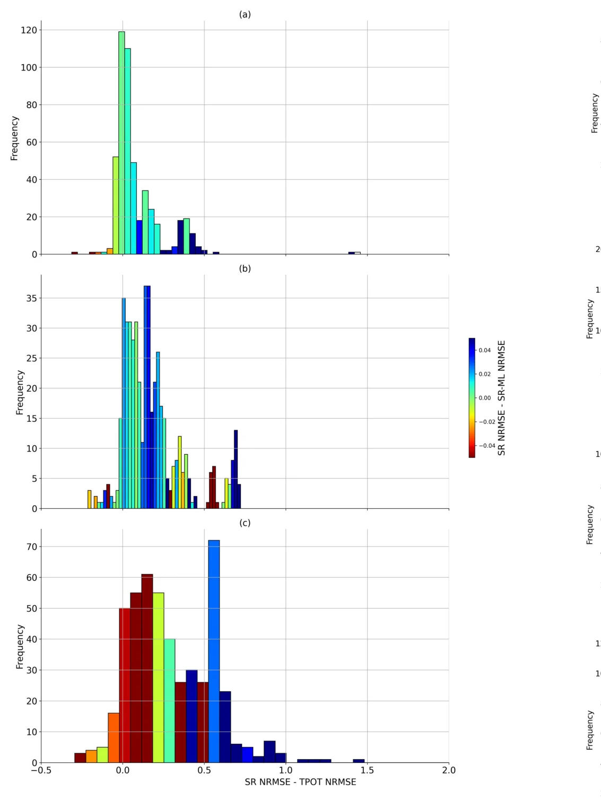
<figcaption><strong>FIGURE 5.</strong> Similar to Figure 4, but for three different SR models: (a) QLATTICE (b) PySR (c) gplearn. Overall, the SR-ML approach yields the largest gains in regimes where the ML model substantially outperforms the standalone SR model.</figcaption>
</figure>

To ensure the robustness of our findings and the general applicability of our proposed method, we also incorporate tests using two additional SR models: PySR [46] and gplearn [45]. PySR leverages genetic programming to evolve regression models over generations, optimizing both simplicity and fit, thereby providing a balance between interpretability and predictive power [46]. On the other hand, gplearn implements genetic programming principles similar to those used in scikit-learn, making it particularly suitable for integrating into machine learning pipelines traditionally relying on this framework [45].

For **QLATTICE (Feyn)**, we used the auto\_run procedure, and selected the top ranked model returned by the algorithm for downstream evaluation. For **gplearn**, we trained a Symbolic Regressor using the function set {+*,* −*,* ×*, /*}, with 50 generations and a parsimony coefficient of 0.01. For **PySR**, we trained a PySR regressor with 30 iterations and 30 populations, using best model selection and the binary operator set {+*,* −*,* ×*, /*}.

<figure id="fig-6">
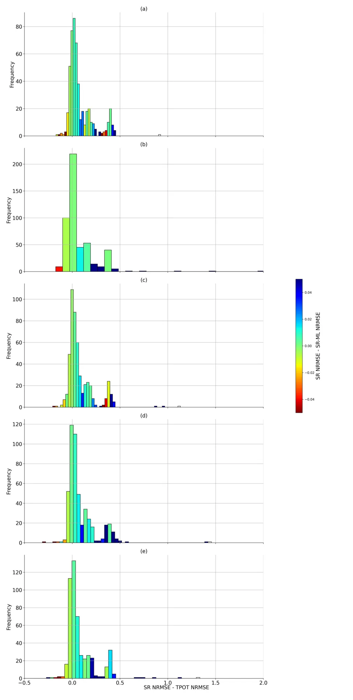
<figcaption><strong>FIGURE 6.</strong> Similar to Figure 4, but for five different XGB optimization times: (a) 1 minute (b) 5 minutes (c) 10 minutes (d) 15 minutes (e) 20 minutes.</figcaption>
</figure>

For the pre-training ML model, we build on TPOT: Tree-based Pipeline Optimization Tool [58]. TPOT is an automated machine learning platform that employs genetic algorithms [59] to enhance machine learning pipelines. This includes refining processes like data preprocessing, feature selection, and choosing the appropriate models. Unless stated otherwise, we run the XGBoost (XGB) [60] model via TPOT’s library. XGB is a refined gradient boosting framework known for its high efficiency and scalability. It’s extensively used across various classification and regression tasks and is renowned for its superior performance.

<figure id="fig-7">
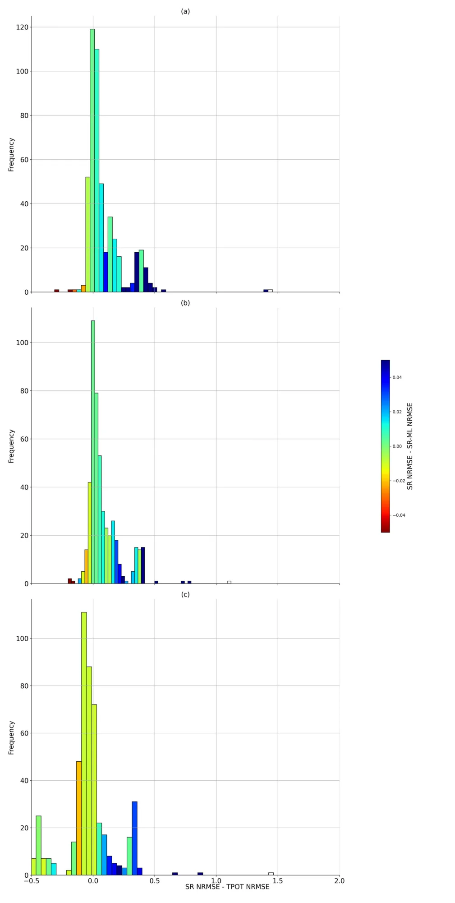
<figcaption><strong>FIGURE 7.</strong> Similar to Figure 4, but for three different ML models: (a) XGB (b) RF (c) KNN.</figcaption>
</figure>

### Iv. Results

In this section we outline the results of the proposed method. We first demonstrate its performance on a wildfire danger dataset. We then assess its generalization by evaluating it on 10 widely used Kaggle datasets. Finally, we analyze robustness with respect to the underlying SR model and the ML model. Additional robustness tests are provided in the appendix.

### A. Wildfire Danger Prediction

Figure 2 displays a histogram comparing the prediction accuracies of the SR model with and without ML pre-training for the wildfire danger prediction model. The x-axis describe the relative mean absolute error (RMSE) of the model and the y-axis describe the number of instances the model achieved a given RMSE. The results summarize 50 model runs for the SR-ML and SR, each. The pre-trained SR-ML model outperforms the standard SR model, demonstrating a reduction in RMSE scores from a mean of 1.232 to 1.192 (a 3.4% improvement) and from a median of 1.015 to 0.963 (a 5.4% improvement). Statistical significance was evaluated using paired t-tests on the per-run differences in test RMSE between SR and SR-ML, yielding *p <* 0*.*01.

Figure 3 illustrates the impact of daily and monthly precipitation on wildfire risk. The subfigures present the prediction of each of the three models, (a) XGB (b) SR (c) SR-ML, as a function of daily and monthly precipitation in one model run. Precipitation on the day of a fire generally reduces the risk, while precipitation in the preceding month can increase risk due to enhanced vegetation growth [64]. All three models (XGB, SR-ML, SR) capture these dynamics; however, the SR-ML predictions align more closely with those of the XGB model on which it was trained, as opposed to the original SR model. The original SR model assigns less weight to daily precipitation values (indicated by nearly horizontal lines) and predicts higher risk values in the upper-left corner of the figure. This comparison highlights how ML pre-training modifies the SR model to more closely mirror the structure of the underlying ML model, demonstrating the potential of this process not only to improve SR performance but also to provide an explainability framework for ML and DL models.

### B. Exploring Generalization

To further evaluate the robustness of our method, we also test its performance using two alternative machine learning models. The Random Forest (RF) [61] model, a type of ensemble learning, employs multiple decision trees [62] during training. It predicts the class mode for classification tasks and averages the predictions for regression tasks. Additionally, the K-Nearest Neighbors (KNN) [63] model, an instance-based, non-parametric approach, is used for both classification and regression. It classifies a data point based on the majority vote from its k-nearest neighbors in the feature space.

In this section we present the results for the 10 real-world datasets. Figure 4 presents the improvement in the SR model due to the ML pre-training as a function of the ML’s performance relative to that of the SR model. In most cases, the ML model outperformed the SR model, so the histogram is mostly concentrated on the positive side of the horizontal axis which indicates the delta between the SR and TPOT’s normalize RMSE values. In these cases where the performance of the ML model was similar to that of the SR model (values close to zero on the horizontal axis), the effect of the ML pre-training was relatively low (green colors). Nonetheless, when the ML model outperformed the SR model (high values on the horizontal axis), the SR-ML model significantly outperformed the baseline SR model (blue values). While this trend is not perfectly uniform across all datasets, reflecting possible differences in dataset characteristics and model expressiveness, the overall pattern indicates that larger ML-SR performance gaps generally enable greater benefits from the proposed distillation approach.

<figure id="fig-8">
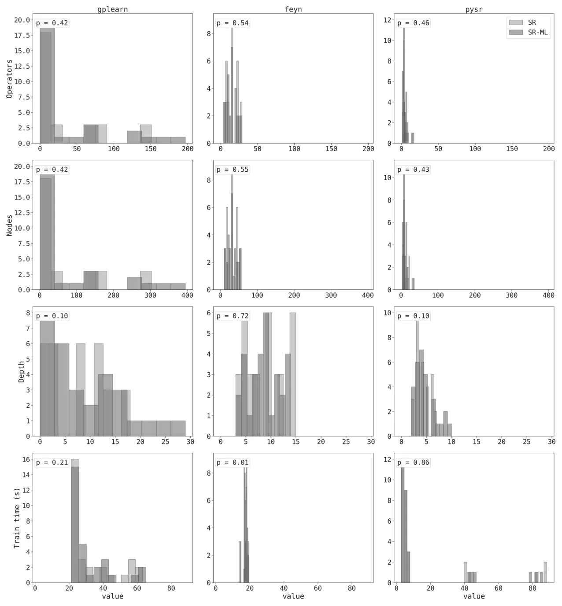
<figcaption><strong>FIGURE 8.</strong> Comparison of model complexity and computation time. We compared XGB models with 100, 200, and 400 estimators to ensure robustness. We find no statistically significant difference in model complexity between the original SR models and those trained on ML outputs. Symbolic model complexity is quantified using three measures: expression depth, defined as the maximum tree depth of the symbolic expression; number of operators, counting all functional nodes such as arithmetic operations; and number of parameters, corresponding to the total number of numerical constants appearing in the expression. Training time differs in some cases, but the magnitude of the difference is small, on the order of a few seconds at most).</figcaption>
</figure>

On average, the ML pre-training improved the performance of the SR model by almost 5%; the SR-ML model obtained the better performance in seven out of ten datasets. The results are significant at *p <* 0*.*01. The full results, divided by dataset, are presented in (Table 5). In the few cases where the ML model obtained an inferior performance compared to the SR model, the effect of the ML pre-training was negative; however, these cases are quite rare so they did not significantly affect the total score.

### C. Robustness Analysis

We next present various robustness tests to validate the proposed methods to improve performance in various contexts. We present the results for the three different SR models (QLATTICE, gplearn, and PySR) in Table 2. The results show that the positive impact of the method is maintained for all three SR models. In the PySR and gplearn models the SR-ML model obtained better results in eight of the ten datasets. Specifically for the gplearn model, in the cases where the ML model had a similar performance to the SR model, the ML pre-training had a negative effect on the SR model performance. This also resulted in lower statistical significance *p* = 0*.*19. However, in most cases, the ML model was better, so the total score is still positive in favor of the SR-ML model. For the remaining models, the results are significant at *p <* 0*.*01. We include a figure analogous to Figure 4 for this experiment in Figure 5.

Next, we examine the effect of replacing the ML model used for pre-training instead. We begin by showing the effect of changing the optimization times used for the XGB model (1,5,10,15, and 20 minutes). The results of this experiment are summarized in Table 3. The XGB optimization time had a relatively low effect, and it performed well for all training times both by itself and as a pre-training model for the SR- ML. See Figure 6 for results analogous to Figure 4.

Table 4 presents the results using two alternative ML models, RF and KNN in addition to the XGB results. The results for the RF model are relatively similar to those of the XGB, though slightly inferior. In the KNN model, however, the case was different. The KNN model itself did not outperform the SR model. Therefore, as expected, the SR-ML model obtained similar results to those of the SR model. We conclude that for this process to achieve good results, the ML model must be better than the SR model. We include a figure analogous to Figure 4 for this experiment in the (Figure 7).

## V. Discussion

In this study, we introduced a novel two-step ensemble method that combines the high predictive accuracy of ML models with the interpretability of SR. Inspired by the student-teacher model in knowledge distillation [39], [41], [42], we initially train an ML model and then use its predictions as training data for an SR model, aiming to enhance the accuracy of SR while preserving its inherent interpretability. We tested this approach extensively across various datasets, including a specific application for predicting wildfire danger. Our results demonstrated significant improvements in prediction accuracy, with the SR-ML model achieving a significant reduction in RMSE by 3.3-6.6%, on average, compared to the benchmark SR model.

We illustrated the effectiveness of our two-step ensemble method with a specific example of predicting wildfire danger as current models provide relatively accurate results but are not explainable to any extend [65], [66]. By using daily and monthly precipitation data, we compared the performance of traditional SR, an ML model (XGBoost), and our proposed SR-ML model. The results, as presented in Figure 3, show that the predictions from the SR-ML model align more closely with the ML model it was trained on, in this case, the XGBoost model. This alignment suggests that the SR-ML model is capable of capturing and mirroring the complex dynamics of the ML model, leading to more accurate predictions than those generated by the standard SR approach. This outcome aligns with the previous ensemble of data-driven models with different levels of expressiveness [67]. The original SR model, in contrast, showed a different pattern of predictions and also obtained an inferior RMSE score.

The findings from our experiments indicate a clear advantage of the proposed two-step ensemble method over traditional SR techniques, particularly in terms of predictive accuracy. By pre-training an SR model on the predictions made by a high-performance ML model such as XGBoost, the SR model achieves better accuracy [17] but also maintains its inherent interpretability. This approach effectively leverages the strengths of both model types, harnessing the predictive power of complex ML algorithms and the transparent, formula-based output of SR. The proposed method is complementary to existing SR approaches, producing a fully symbolic predictor at inference time while remaining compatible with alternative symbolic regression frameworks and feature based strategies. Part of this improvement could arise from a denoising effect induced by training symbolic regression on teacher predictions rather than on the original targets [41]. By replacing potentially noisy or irregular labels with a smoother surrogate learned by the ML model, the symbolic structure search may become more stable, enabling the recovery of simpler expressions with improved generalization [41]. Regarding the trade-off between target smoothing and structural bias transfer, we argue that the benefit here is primarily due to smoothing. Given the fundamental difference in hypothesis spaces of the teacher model and Symbolic Regression, we believe the SR model does not inherit the teacher’s structural bias; rather, it benefits from the teacher’s ability to aggregate signal and filter out stochastic noise.

The consistent improvements observed across multiple datasets, as shown in Figure 4, suggest that this method can be generalized to various types of data and problem domains. This versatility is further supported by the robustness tests, presented in Section IV-C, which show that the method performs well with different SR and ML models, thereby validating the method’s flexibility and broad applicability. The central requirement for the success of this method is that the ML model must outperform the SR model in predictive accuracy. If the ML model performs comparably to, or worse than, the SR model, utilizing its predictions to train the SR-ML model could degrade performance. This was evident in our experiments with the KNN model, where the ML model did not surpass the SR model, resulting in no significant improvement from the SR-ML model.

One of the most significant implications of this work is its potential to enhance the interpretability of ML models without compromising on accuracy. This is particularly valuable in domains where decision-making processes need to be transparent, such as in healthcare [68], [69]. By providing a more interpretable layer via SR, stakeholders who are not necessarily experts in ML can understand and trust the model’s outputs more readily. Furthermore, this method can serve as a bridge between data-driven decision-making and domain expertise, allowing a better human-machine integration such as human-in-the-loop strategies [70]. By translating complex ML model outputs into interpretable mathematical formulas, it enables domain experts to validate the results within their theoretical frameworks, potentially leading to new insights and improvements in theoretical models.

Despite its strengths, the proposed method has certain limitations that need addressing in future research. A key limitation is its dependence on the performance of the underlying machine learning model. As observed for the KNN model in Table 4, when the ML model does not substantially outperform symbolic regression, the benefits of pre-training SR on ML outputs are limited. This highlights the importance of selecting an appropriate teacher model for the initial training phase. In most cases, however, this is not a major limitation, as GBM models tend to outperform SR models.

Another limitation of the current study is the reliance on IID train-test splits, which does not assess out-of-distribution generalization [37]. While interpretable models are often valued for their potential robustness under distributional shifts. A systematic evaluation of these settings is beyond the scope of the present work and is left for future research.

Another consideration is that our empirical evaluation relies on a limited set of representative symbolic regression implementations. While these cover some of the most commonly used approaches, alternative implementations may exhibit different performance characteristics, which we leave for future investigation. In addition, the stability of the learned symbolic expressions across runs and the isolation of individual contributing factors, such as target smoothing or model capacity, are not explicitly analyzed and are left for future work. While the proposed method improves interpretability relative to complex ML models, the formulas generated by SR can still be complex and may require simplification to be fully understandable. Future work could explore methods to simplify these expressions without significant loss of accuracy using methods such as SAT reduction [71].

Taken jointly, this study introduces a novel ensemble method that combines the accuracy of gradient boosting models with the interpretability of symbolic regression, offering a promising solution to the accuracy-explainability trade-off in machine learning. The method is simple to implement and requires only the selection of an underlying machine learning model and a symbolic regression model. By demonstrating consistent improvements across various datasets and model configurations, this method not only advances the field of machine learning but also opens new avenues for making complex predictive models more accessible and trustworthy.

### Declarations

### Conflicts of Interest/Competing Interests

None.

### Code and Data Availability

The code and data that have been used in this study are available upon request.

### Author Contribution

Assaf Shmuel: Conceptualization, Methodology, Software, Investigation, Formal Analysis, Visualization, Writing— Original Draft. Teddy Lazebnik: Investigation, Validation, Supervision, Writing—Original Draft, Writing—Review and Editing. Oren Glickman: Investigation, Validation, Supervision, Writing—Review and Editing.

### Appendix

### Additional Experimental Results

Table 5, Table 6, and Table 7 present the comprehensive results for each dataset in our analysis of the three SR models. Figures 5, 6, and 7 present additional robustness analyses of the main results. Figure 5 shows that the observed trend holds across different symbolic regression frameworks, Figure 6 demonstrates stability with respect to the XGB optimization time, and Figure 7 compares different teacher models, highlighting the dependence of SR-ML gains on teacher quality. Figure 8 compares the model complexity and computation time, with no significant differences in most cases.

## References

1. A. Rosenfeld and A. Richardson, ‘‘Explainability in human–agent systems,’’ Auto. Agents Multi-Agent Syst., vol. 33, no. 6, pp. 673–705, Nov. 2019.
2. A. Rosenfeld, ‘‘Better metrics for evaluating explainable artificial intelligence,’’ in Proc. Int. Joint Conf. Auto. Agents Multiagent Syst., May 2021, pp. 45–50.
3. P. Linardatos, V. Papastefanopoulos, and S. Kotsiantis, ‘‘Explainable AI: A review of machine learning interpretability methods,’’ Entropy, vol. 23, no. 1, p. 18, Dec. 2020.
4. A. Goldstein, A. Kapelner, J. Bleich, and E. Pitkin, ‘‘Peeking inside the black box: Visualizing statistical learning with plots of individual conditional expectation,’’ J. Comput. Graph. Statist., vol. 24, no. 1, pp. 44–65, Jan. 2015.
5. R. C. Fong and A. Vedaldi, ‘‘Interpretable explanations of black boxes by meaningful perturbation,’’ in Proc. IEEE Int. Conf. Comput. Vis. (ICCV), Oct. 2017, pp. 3449–3457.
6. M. T. Ribeiro, S. Singh, and C. Guestrin, ‘‘‘Why should i trust you?’: Explaining the predictions of any classifier,’’ in Proc. 22nd ACM SIGKDD Int. Conf. Knowl. Discovery Data Mining, Aug. 2016, pp. 1135–1144, [doi:10.1145/2939672.2939778](https://doi.org/10.1145/2939672.2939778)
7. A. Bell, I. Solano-Kamaiko, O. Nov, and J. Stoyanovich, ‘‘It’s just not that simple: An empirical study of the accuracy-explainability trade-off in machine learning for public policy,’’ in Proc. ACM Conf. Fairness, Accountability, Transparency, 2022, pp. 248–266.
8. L. S. Whitmore, A. George, and C. M. Hudson, ‘‘Explicating feature contribution using random forest proximity distances,’’ 2018, arXiv:1807.06572.
9. N. Altman and M. Krzywinski, ‘‘Ensemble methods: Bagging and random forests,’’ Nature Methods, vol. 14, no. 10, pp. 933–934, Oct. 2017.
10. T. Lei, R. Barzilay, and T. Jaakkola, ‘‘Rationalizing neural predictions,’’ in Proc. Conf. Empirical Methods Natural Lang. Process., 2016, pp. 107–117.
11. B. Kim, R. Khanna, and O. Koyejo, ‘‘Examples are not enough, learn to criticize! Criticism for interpretability,’’ in Proc. Adv. Neural Inf. Process. Syst., vol. 29, 2016, pp. 2280–2288.
12. C. Rudin, ‘‘Stop explaining black box machine learning models for high stakes decisions and use interpretable models instead,’’ Nature Mach. Intell., vol. 1, no. 5, pp. 206–215, May 2019.
13. T. Lazebnik, Z. Bahouth, S. Bunimovich-Mendrazitsky, and S. Halachmi, ‘‘Predicting acute kidney injury following open partial nephrectomy treatment using SAT-pruned explainable machine learning model,’’ BMC Med. Informat. Decis. Making, vol. 22, no. 1, p. 133, Dec. 2022.
14. G. F. Smits and M. Kotanchek, ‘‘Pareto-front exploitation in symbolic regression,’’ in Genetic Programming, 2005, pp. 283–299.
15. S.-M. Udrescu and M. Tegmark, ‘‘AI feynman: A physics-inspired method for symbolic regression,’’ Sci. Adv., vol. 6, no. 16, p. 2631, Apr. 2020.
16. Z. Zhou, Y. Jiang, and S. Chen, ‘‘Extracting symbolic rules from trained neural network ensembles,’’ Ai Commun., vol. 16, no. 1, pp. 3–15, 2003.
17. L. S. Keren, A. Liberzon, and T. Lazebnik, ‘‘A computational framework for physics-informed symbolic regression with straightforward integration of domain knowledge,’’ Sci. Rep., vol. 13, no. 1, p. 1249, Jan. 2023.
18. L. Billard and E. Diday, ‘‘Symbolic regression analysis,’’ in Classification, Clustering, and Data Analysis. Cham, Switzerland: Springer, 2002, pp. 281–288.
19. M. Affenzeller, B. Burlacu, V. Dorfer, S. Dorl, G. Halmerbauer, T. Königswieser, M. Kommenda, J. Vetter, and S. Winkler, ‘‘White box vs. black box modeling: On the performance of deep learning, random forests, and symbolic regression in solving regression problems,’’ in Computer Aided Systems Theory—EUROCAST 2019, R. Moreno-Díaz, F. Pichler, and A. Quesada-Arencibia, Eds., Cham, Switzerland: Springer, 2020.
20. A. Shmuel, O. Glickman, and T. Lazebnik, ‘‘A comprehensive benchmark of machine and deep learning models on structured data for regression and classification,’’ Neurocomputing, vol. 655, Nov. 2025, Art. no. 131337.
21. E. Alibekov, J. Kubalík, and R. Babuška, ‘‘Symbolic method for deriving policy in reinforcement learning,’’ in Proc. IEEE 55th Conf. Decis. Control (CDC), Dec. 2016, pp. 2789–2795.
22. D. Clery and D. Voss, ‘‘All for one and one for all,’’ Sci., vol. 308, no. 5723, p. 809, 2005.
23. M. Raissi and G. E. Karniadakis, ‘‘Hidden physics models: Machine learning of nonlinear partial differential equations,’’ J. Comput. Phys., vol. 357, pp. 125–141, Mar. 2018.
24. W. La Cava, P. Orzechowski, B. Burlacu, F. Olivetti de França, M. Virgolin, Y. Jin, M. Kommenda, and J. H. Moore, ‘‘Contemporary symbolic regression methods and their relative performance,’’ 2021, arXiv:2107.14351.
25. Y. Wang, N. Wagner, and J. M. Rondinelli, ‘‘Symbolic regression in materials science,’’ MRS Commun., vol. 9, no. 3, pp. 793–805, Sep. 2019.
26. M. J. H. Heule and O. Kullmann, ‘‘The science of brute force,’’ Commun. ACM, vol. 60, no. 8, pp. 70–79, 2017.
27. P. Orzechowski, W. La Cava, and J. H. Moore, ‘‘Where are we now?: A large benchmark study of recent symbolic regression methods,’’ in Proc. Genetic Evol. Comput. Conf., Jul. 2018, pp. 1183–1190.
28. B. K. Petersen, M. Landajuela, T. Nathan Mundhenk, C. P. Santiago, S. K. Kim, and J. T. Kim, ‘‘Deep symbolic regression: Recovering mathematical expressions from data via risk-seeking policy gradients,’’ 2019, arXiv:1912.04871.
29. M. Quade, M. Abel, J. Nathan Kutz, and S. L. Brunton, ‘‘Sparse identification of nonlinear dynamics for rapid model recovery,’’ Chaos, vol. 28, no. 6, Jun. 2018, Art. no. 063116.
30. E. Kaiser, J. N. Kutz, and S. L. Brunton, ‘‘Sparse identification of nonlinear dynamics for model predictive control in the low-data limit,’’ Proc. Roy. Soc. A, Math., Phys. Eng. Sci., vol. 474, no. 2219, Nov. 2018, Art. no. 20180335.
31. G. Kronberger, F. O. de Franca, B. Burlacu, C. Haider, and M. Kommenda, ‘‘Shape-constrained symbolic regression—Improving extrapolation with prior knowledge,’’ Evol. Comput., vol. 30, no. 1, pp. 75–98, Mar. 2022.
32. R. Salustowicz and J. Schmidhuber, ‘‘Probabilistic incremental program evolution,’’ Evol. Comput., vol. 5, no. 2, pp. 123–141, Jun. 1997.
33. P.-A. Kamienny, S. d’Ascoli, G. Lample, and F. Charton, ‘‘End-to-end symbolic regression with transformers,’’ in Proc. Adv. Neural Inf. Process. Syst., 2022, pp. 10269–10281.
34. I. Icke and J. C. Bongard, ‘‘Improving genetic programming based symbolic regression using deterministic machine learning,’’ in Proc. IEEE Congr. Evol. Comput., Jun. 2013, pp. 1763–1770.
35. B. E. Köktürk-Güzel and S. Beyhan, ‘‘Symbolic regression based extreme learning machine models for system identification,’’ Neural Process. Lett., vol. 53, no. 2, pp. 1565–1578, Apr. 2021.
36. A. Shmuel, O. Glickman, and T. Lazebnik, ‘‘Symbolic regression as a feature engineering method for machine and deep learning regression tasks,’’ 2024, arXiv:2311.06028.
37. A. Shmuel, O. Glickman, and T. Lazebnik, ‘‘Machine and deep learning performance in out-of-distribution regressions,’’ Mach. Learn., Sci. Technol., vol. 5, no. 4, Dec. 2024, Art. no. 045078.
38. M. Quade, M. Abel, K. Shafi, R. K. Niven, and B. R. Noack, ‘‘Prediction of dynamical systems by symbolic regression,’’ Phys. Rev. E, Stat. Phys. Plasmas Fluids Relat. Interdiscip. Top., vol. 94, no. 1, Jul. 2016, Art. no. 012214.
39. G. Hinton, O. Vinyals, and J. Dean, ‘‘Distilling the knowledge in a neural network,’’ 2015, arXiv:1503.02531.
40. A. Polino, R. Pascanu, and D. Alistarh, ‘‘Model compression via distillation and quantization,’’ 2018, arXiv:1802.05668.
41. M. Takamoto, Y. Morishita, and H. Imaoka, ‘‘An efficient method of training small models for regression problems with knowledge distillation,’’ in Proc. IEEE Conf. Multimedia Inf. Process. Retr. (MIPR), Aug. 2020, pp. 67–72.
42. M. Kang and S. Kang, ‘‘Data-free knowledge distillation in neural networks for regression,’’ Expert Syst. Appl., vol. 175, Aug. 2021, Art. no. 114813.
43. M. Kang and S. Kang, ‘‘Knowledge distillation with insufficient training data for regression,’’ Eng. Appl. Artif. Intell., vol. 132, Jun. 2024, Art. no. 108001.
44. Q. Xu, Z. Chen, M. Ragab, C. Wang, M. Wu, and X. Li, ‘‘Contrastive adversarial knowledge distillation for deep model compression in time-series regression tasks,’’ Neurocomputing, vol. 485, pp. 242–251, May 2022.
45. T. Stephens, ‘‘Genetic programming in Python with a scikit-learn inspired API: Gplearn,’’ 2016. [Online]. Available: https://gplearn.read thedocs.io/en/stable/intro.html
46. M. Cranmer, ‘‘Interpretable machine learning for science with PySR and SymbolicRegression.Jl,’’ 2023, arXiv:2305.01582.
47. A. Shmuel and E. Heifetz, ‘‘Developing novel machine-learning-based fire weather indices,’’ Mach. Learning: Sci. Technol., vol. 4, no. 1, Mar. 2023, Art. no. 015029.
48. M. Napd. (2020). Mobile Price Prediction. [Online]. Available: https://ww w.kaggle.com/datasets/mohannapd/mobile-price-prediction/data
49. H. Fanaee-T and J. Gama, ‘‘Event labeling combining ensemble detectors and background knowledge,’’ Prog. Artif. Intell., vol. 2, nos. 2–3, pp. 1–15, Jun. 2014, [doi:10.1007/s13748-013-0040-3](https://doi.org/10.1007/s13748-013-0040-3)
50. M. S. Acharya. (Apr. 2018). Graduate Admissions. [Online]. Available: https://www.kaggle.com/mohansacharya/datasets
51. P. Cortez and A. d. J. R. Morais, ‘‘A data mining approach to predict forest fires using meteorological data,’’ in Proc. New Trends Artif. Intell., Dec. 2007, pp. 512–523.
52. M. Choi. (Feb. 2018). Medical Cost Personal Datasets. [Online]. Available: https://www.kaggle.com/mirichoi0218/insurance
53. P. Cortez, A. Cerdeira, F. Almeida, T. Matos, and J. Reis, ‘‘Modeling wine preferences by data mining from physicochemical properties,’’ Decis. Support Syst., vol. 47, no. 4, pp. 547–553, Nov. 2009.
54. I.-C. Yeh, ‘‘Real estate valuation,’’ UCI Machine Learning Repository, Tech. Rep., 2018, [doi:10.24432/C5J30W](https://doi.org/10.24432/C5J30W)
55. (2018). Advertising Dataset. [Online]. Available: https://www.kaggle.c om/datasets/ashydv/advertising-dataset/data
56. I.-C. Yeh, ‘‘Concrete compressive strength,’’ UCI Mach. Learn. Repository, Tech. Rep., 2007, [doi:10.24432/C5PK67](https://doi.org/10.24432/C5PK67)
57. K. R. Brolos, M. V. Machado, C. Cave, J. Kasak, V. Stentoft-Hansen, V. G. Batanero, T. Jelen, and C. Wilstrup, ‘‘An approach to symbolic regression using feyn,’’ 2021, arXiv:2104.05417.
58. R. S. Olson and J. H. Moore, ‘‘TPOT: A tree-based pipeline optimization tool for automating machine learning,’’ in JMLR, Workshop Conf. Proc., 2019, pp. 151–160.
59. J. H. Holland, ‘‘Genetic algorithms,’’ Sci. Amer., vol. 267, no. 1, pp. 66–73, 1992.
60. T. Chen and C. Guestrin, ‘‘XGBoost: A scalable tree boosting system,’’ in Proc. 22nd ACM SIGKDD Int. Conf. Knowl. Discovery Data Mining, Aug. 2016, pp. 785–794.
61. L. Rokach, ‘‘Decision forest: Twenty years of research,’’ Inf. Fusion, vol. 27, pp. 111–125, Jan. 2016.
62. P. H. Swain and H. Hauska, ‘‘The decision tree classifier: Design and potential,’’ IEEE Trans. Geosci. Electron., vol. GE-15, no. 3, pp. 142–147, Jul. 1977.
63. B. Zang, R. Huang, L. Wang, J. Chen, F. Tian, and X. Wei, ‘‘An improved KNN algorithm based on minority class distribution for imbalanced dataset,’’ in Proc. Int. Comput. Symp. (ICS), Dec. 2016, pp. 696–700.
64. A. Shmuel, Y. Ziv, and E. Heifetz, ‘‘Machine-Learning-based evaluation of the time-lagged effect of meteorological factors on 10-hour dead fuel moisture content,’’ Forest Ecol. Manage., vol. 505, Feb. 2022, Art. no. 119897.
65. A. Malik, M. R. Rao, N. Puppala, P. Koouri, V. A. K. Thota, Q. Liu, S. Chiao, and J. Gao, ‘‘Data-driven wildfire risk prediction in northern California,’’ Atmosphere, vol. 12, no. 1, p. 109, Jan. 2021.
66. Y. O. Sayad, H. Mousannif, and H. Al Moatassime, ‘‘Predictive modeling of wildfires: A new dataset and machine learning approach,’’ Fire Saf. J., vol. 104, pp. 130–146, Mar. 2019.
67. T. Lazebnik, S. Bunimovich-Mendrazitsky, and A. Rosenfeld, ‘‘An algorithm to optimize explainability using feature ensembles,’’ Appl. Intell., vol. 54, no. 2, pp. 2248–2260, Jan. 2024.
68. Y. A. Veturi, W. Woof, T. Lazebnik, I. Moghul, P. Woodward-Court, S. K. Wagner, T. A. C. de Guimarães, M. D. Varela, B. Liefers, P. J. Patel, S. Beck, A. R. Webster, O. Mahroo, P. A. Keane, M. Michaelides, K. Balaskas, and N. Pontikos, ‘‘SynthEye: Investigating the impact of synthetic data on artificial intelligence-assisted gene diagnosis of inherited retinal disease,’’ Ophthalmology Sci., vol. 3, no. 2, Jun. 2023, Art. no. 100258.
69. M. A. Ahmad, A. Teredesai, and C. Eckert, ‘‘Interpretable machine learning in healthcare,’’ in Proc. IEEE Int. Conf. Healthcare Informat. (ICHI), Jun. 2018, p. 447.
70. X. Wu, L. Xiao, Y. Sun, J. Zhang, T. Ma, and L. He, ‘‘A survey of human-in-the-loop for machine learning,’’ Future Gener. Comput. Syst., vol. 135, pp. 364–381, Oct. 2022.
71. P. Janicic, ‘‘URSA: A System for Uniform Reduction to SAT,’’ 2012, arXiv:1012.1255. ASSAF SHMUEL received the B.Sc. degree in physics from The Hebrew University of Jerusalem, and the Ph.D. degrees in geophysics and in political science from Tel Aviv University. He is currently pursuing the Ph.D. degree in computer science with Bar-Ilan University. His research is in the field of artificial intelligence, with a particular focus on its applications in the earth sciences. TEDDY LAZEBNIK is currently an Associate Professor with the Department of Information Systems, University of Haifa, and the Department of Computing, Jönköping University. His research focuses on applied computational mathematics with applications in biology, medicine, economics, and sociology. OREN GLICKMAN received the degrees from Hebrew University, Carnegie Mellon University, and Bar-Ilan University. He is currently an Assistant Professor with the Computer Science Department, Bar-Ilan University. He brings over 20 years of combined academic and industry experience. His research spans natural language processing, applied data science, and AI for real-world challenges in climate, agriculture, and sustainability.
