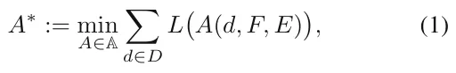
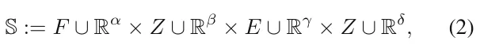
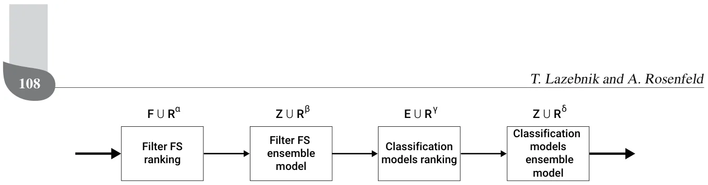
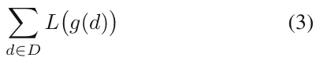
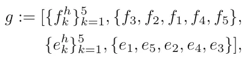
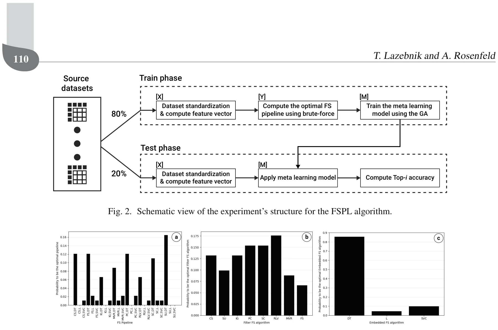
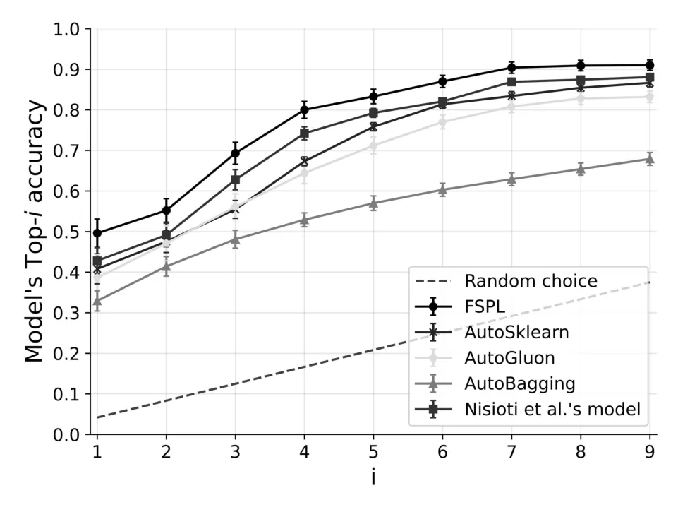

## 1. Introduction

A central problem in the development of machine learning (ML) solutions is to identify which data features are most useful for obtaining the optimal results (Molina *et al*., 2002). To address this challenge, multiple algorithms have been developed for feature selection (FS). These algorithms can be divided into three main groups: filter, embedded, and wrapper (Rosenfeld *et al*., 2015; Chandrashekar and Sahin, 2014). The filter FS algorithms act as a pre-processing step to rank the features based on their connection to the target class variables wherein the features with the highest connection are selected to obtain a smaller dataset (Chandrashekar and Sahin, 2014). Embedded FS algorithms select the features that yield the best performance for a specific learning algorithm as an integrated step within that learning algorithm. This approach captures feature dependencies since it considers not only relations between one input feature and its output but also locally searches for features with better discrimination (Kumar and Minz, 2014). Wrapper FS algorithms are also based on a criterion of the performance of an ML model (for example, the model’s accuracy) but the search process to find the best feature subset is external to that algorithm (e.g., wrapped around it). Wrapper FS algorithms obtain promising results within a wide range of applications such as image classification (Ma *et al*., 2017), biomedical entity extraction (Akshaikhdeeb and Ahmad, 2017), and SMS spam identification (Mussa and Jameel, 2019). However, they are considered expensive or even not feasible to use on large data sets due to the need to train and evaluate ML models multiple times during the training phase (Molina *et al*., 2002; Kusy and Zajdel, 2021).

Based on the no free lunch (NFL) theorem, seeking one FS algorithm that always works well and outperforms all other methods is considered infeasible (Shilbayeh and Vadera, 2014). Consequently, alternatives have been suggested, such as to dynamically generate ensemble FS algorithms for novel datasets, given a set of available FS algorithms (Bol´on-Canedo and Alonso-Betanzos, 2019; Teisseyre, 2022; Seijo-Pardo *et al*., 2017). As is the case with ensemble learning in general, advocates for creating ensembles of FS algorithms claim that they yield better performing and more stable models. This is because using several algorithms instead of just one increases the chance of finding the best performing algorithm and also increases robustness through reducing the differences between the outputs of different algorithms (Bol´on-Canedo and Alonso-Betanzos, 2019; Saeys *et al*., 2008). While this approach often produces good results, ensembles produce unique FS results for each dataset making then difficult to generalize, explain, and evaluate the robustness and stability of the FS phase in the ML pipeline (He *et al*., 2021; Waring *et al*., 2020). Another approach, taken by this research, is to limit ourselves to a list of available FS algorithms and assume that one method does not fit all datasets. Similar to the algorithm selection problem which was generally posed (Rice, 1976), we specifically aim to identify which FS algorithm works best for a given dataset and thus find the best FS/dataset combination.

This paper aims to answer the following question: *Can we automatically learn which filter and embedded FS pipeline works best for a given dataset?* by developing a new search approach that finds a meta-learning model based on features’ of different datasets and their interconnection to multiple FS pipelines. The novelty of FSPL, a feature selection pipeline meta-learning algorithm, lies in two points. First, this work is the first to construct a unique meta-feature vector for datasets designed specifically for the FS pipeline. Second, the work uses a new search approach to find the best-performing meta-learning model for the FS pipeline task automatically.

The paper is organized as follows. Section 2 provides a literature review of FS and meta-learning methods. In Section 3, we present the FSPL algorithm and detail its meta-feature vector constriction approach. Section 4 describes the results of an empirical evaluation of the proposed approach and comparison to other meta-learning methods. Section 5 concludes the paper and offers future work.

## 2. Background and related work

Dataset sizes have become increasing more complex. This growth has allowed for the development of successful ML models in multiple tasks such as computer vision (Tokarev *et al*., 2021; Maile *et al*., 2021; Ometto *et al*., 2019), natural language processing (Wu *et al*., 2020; Kang *et al*., 2020; Savchenko and Lazebnik, 2022) signal processing (Wasimuddin *et al*., 2020) and others domains (Shatte *et al*., 2019; Lazebnik *et al*., 2022; Keren Simon *et al*., 2023). The complexity of these collected datasets can be characterized by both their numbers of records and features and a high level of noise (Tang *et al*., 2014).

To address this dataset complexity, methods for dimensionality reduction have been proposed to clarify the relationships between these datasets and their learned models (Zebari *et al*., 2020). However, due to a large number of methods and the large diversity between them and when they are best suited to be used, several meta-learning methods have been proposed to solve this challenge by treating it as a learning problem. A detailed review of both dimensionality reduction and meta-learning methods is provided below.

**2.1. Feature selection methods.** Dimensionality reduction is one of the most popular methods to remove noise (i.e., irrelevant) and redundant features. These methods can be divided into two main groups: feature creation and feature selection (FS) (Zebari *et al*., 2020). Feature creation approaches project features into a new feature space with lower dimensionality. The new feature space is usually a mapping of the original features to optimize some utility function. For example, principle component analysis (PCA) is a popular dimensionality reduction technique that finds the largest orthogonal base set of the given feature space (Vasan and Surendiran, 2016; Ivosev *et al*., 2008). Another example is the canonical correlation analysis (CCA) which creates the feature space that minimizes the cross-covariance between the original features (Zhu *et al*., 2012).

The FS approach aims to select a subset of the original feature set that optimizes a given utility function. FS algorithms find this subset through three main approaches: filters, embedded, and wrappers (Chandrashekar and Sahin, 2014). Filter FS algorithms act as pre-processing step to rank the features wherein the highly ranked features are selected and applied to obtain a small dimensional data (Chandrashekar and Sahin, 2014). It is based on measures of the general characteristics of the data such as distance, dependency, consistency, and correlation between a given feature or group of features with the data (e.g., class) being learned. Embedded FS algorithms are performed with a specific learning algorithm and perform feature selection during the training process (Kumar and Minz, 2014). The wrapper FS algorithms are based on a criterion of the performance of an ML model such that the model is wrapped by some search algorithm that aims to find the best subset of features that results in the highest performance of the model.

Multiple filter FS algorithms exist. For instance, remove low variance (RLV) (Chandrashekar and Sahin, 2014) ranks the features according to their variance and removes features with variance lower than some predefined threshold. Chi-square (CS) (Plackett, 1983) is based on the chi-square test measuring the connection FSPL: A meta-learning approach for a filter and embedded feature selection pipeline between the independent feature and dependent (target) feature, aiming to select the features which are more dependent on the target feature. Symmetrical uncertainty (SU) (Kanna and Ramaraj, 2010) measures the relevance between the feature and the class label in the target feature through calculating the average normalized interaction gain of an independent feature *f*, every other feature, and the class label target feature. Based on the combination of symmetrical uncertainty and normalized interaction gain, less important features are removed iteratively (Lin *et al*., 2019). Fisher’s score (FS) (Chengzhang and Jiucheng, 2019) selects each feature independently according to their scores based on the Fisher criterion. Intuitively, the key idea of the Fisher score is to find a subset of features such that the distances between data points in different classes are as large as possible, while the distances between data points in the same class are as small as possible (Gu *et al*., 2011). Information gain (IG) (Azhagusundari and Thanamani, 2013) is an entropy-based selection method which involves the calculation from the output data grouped by an independent feature. The method ranks the contribution of each independent feature, removing low contributing features based on a predefined threshold.

In a complementary manner, embedded FS algorithms can be associated with two main classes of ML models: tree-based and coefficients-based. Tree-based FS is performed by computing the average contribution of each feature towards the classification of the target class. For example, the scikit-learn Python library *sklearn* uses a mean decrease impurity (i.e., the Gini index (Grabmeier and Lambe, 2007)) for the tree-based decision tree (Swain and Hauska, 1977) and random forest (Rokach, 2016) ML models in order to compute the features’ importance. In comparison, the outcome of the learning process in coefficients-based models, such as the lasso (Muthukrishnan and Rohini, 2016) and support vector machine (SVM) (Neumann *et al*., 2005) algorithms, is a vector of coefficients for some family of functions (commonly linear or polynomial). As such, if the coefficient associated with a feature is zero, it did not contribute to the model during the learning phase and can be eliminated. In the same manner, one can rank the contributions of the features by comparing the influence of the coefficients of these features. Of note, neural networks (NNs) also operate as embedded models and as such can be treated as an embedded FS algorithm. However, we leave NN-based models out of the scope of this work.

**2.2. Meta-learning methods.** Meta-learning, or learning about learning, focuses on how learning algorithms can tune themselves for a specific learning algorithm/dataset combination (Smith-Miles, 2009; Vanschoren, 2018). Meta-learning for algorithm selection for various domains has a rich body of work (Brazdil *et al*., 2009; Lemka *et al*., 2015; Luo, 2016; Rice, 1976). Algorithm selection was previously defined as the task of finding the best algorithm from a set of *n* algorithms *A*1 *. . . A*n given a specific problem (Rice, 1976). Meta-learning has been applied to many tasks including sorting, forecasting, constraint satisfaction, and optimization (Smith-Miles, 2009). Within the ML community, meta-learning has also been used to search and obtain hyper-parameters within specific algorithms such as within binary classification problems (Nisioti *et al*., 2018) and finding the optimal width of the Gaussian kernel used in support vector regression model (Soares *et al*., 2004).

This paper’s novelty is in its use of meta-learning for developing an FS pipeline to learn which features are best suited given an ML and FS algorithm pair. One potential solution would be to learn the entire ML pipeline by trying all the possible combinations and using the combination that yielded the best results (Serban *et al*., 2013). However, the number of possible configurations grows dramatically as the number of possible ML models, hyperparameter configurations, and pre-processing methods increases, making it even more important to leverage prior experience. Therefore, a reduction in the search space is required to provide a feasible solution to the full ML pipeline meta-learning task. These reduction techniques can be divided into two main groups: space reduction and directed search.

Space reduction methods assume that some structure or prior knowledge about the search space can be leveraged to makes the search simpler. For example, one can control the search space by imposing a fixed structure on the ML pipeline. Based on the smaller space, prior knowledge in the form of the most promising pipelines can be used as an initial condition for an optimization algorithm such as the Bayesian optimization (Feurer *et al*., 2014). These methods are highly sensitive to the assumptions used in the space reduction phase and therefore require domain knowledge of the problem. As we lack any such knowledge, they are less useful for the FS pipeline we propose.

Directed search methods use a utility function based on some heuristics to narrow and focus the search effort towards a near-optimal result. For example, Strang *et al*. (2018) showed that non-linear classifiers outperform linear classifiers when large amounts of data are available. The authors highlighted that one can use meta-features of the training dataset to determine a subset of appropriate classifiers. Gil *et al*. (2018) proposed a planning-based ML pipeline construction approach. The authors used a hierarchical meta-dataset planner that searches for solutions while automatically annotating a catalog of primitive data processing and modeling steps. The planning approach provides promising results but requires large amounts of data and computation to perform properly (Kietz *et al*., 2012).

Nguyen *et al*. (2014) proposed a beam search focused on components recommended by a meta-learner. The meta-learner was trained on examples of successful prior ML pipelines, defining a heuristic utility function for the search algorithm. This approach is limited to searching for the classic algorithm selection problem as the beam search in the operator-based framework is useful for selecting algorithms but does not directly support hyperparameter search. The authors indicate that a poor distribution of the successful prior ML pipelines for the meta-learner will result in poorer results. However, obtaining a good distribution of the successful prior ML pipelines is a time-and resource- consuming task by itself. Drori *et al*. (2018) use a self-play reinforcement learning approach that is based on edit operations performed over ML pipeline primitives. The authors used a Monte Carlo tree search (Anthony *et al*., 2017) with a deep neural network architecture to learn an agent’s best strategy in the construction of an ML pipeline game. While all of these approaches are able to yield promising results, they are based on heuristics that are not readily available for the FS pipeline problem we consider.

**3. FSPL: Feature selection pipeline meta-learning model**

We aim to find a meta-learning ML algorithm (*A*∗) that receives as input a set of datasets (*D*), a set of Filter FS algorithms (*F*), and a set of embedded FS algorithms (*E*). It outputs a model (e.g., function) (*M*) such that given a new dataset and the same sets of filter and embedded FS algorithms, the model (*M*) returns the best FS pipeline, according to some loss function (*L*), constructed from one filter (*f*) and one embedded (*e*) FS algorithm. Formally, the algorithm *A*∗ satisfies

where A is the set of all possible meta-learning models and *A ∈* A is a meta-learning model. We solve this optimization problem using a meta-learning approach. First, we construct a meta-dataset which operates as the data for the learning model. Second, we automatically find a learning model that optimizes Eqn. (1) using a search algorithm.

**3.1. Meta-dataset constriction.** In order to obtain *A*∗, we propose a meta-learning approach that requires a meta-dataset to learn from. We construct this dataset as follows. First, each dataset is converted into a meta-feature vector as described in Table 1, marked as ¯*X*. This feature space is constructed from a basic set of dataset attributes such as the number of records and features (Engels and Theusinger, 1998), statistical properties of the dataset such as the fourth standardized moment (Reif *et al*., 2012), and statistical features measuring the connections between the independent features and the target feature such as the average Pearson correlation between the independent features and the target feature (Shen *et al*., 2020). These features have been used to obtain good results in previous meta-learning tasks (Engels and Theusinger, 1998; Reif *et al*., 2012; Shen *et al*., 2020).

An FS pipeline is formally defined to be an assembly of filter FS and embedded FS functions (i.e., algorithm). Specifically in this study, each FS pipeline is constructed from a single filter and embedded FS algorithm. Hence, the set *{L*(*e*(*f*(*d*))) *| ∀f ∈ F, e ∈ E}* is computed for each dataset *d ∈ D* using a given loss function *L* such as the FS pipeline’s accuracy for classification tasks or mean absolute error for regression tasks. The outcome of this computation is a vector of size *|E × F|* representing the performance of all possible FS pipelines, marked by ¯*Y* . Based on the two sets ( ¯*X,* ¯*Y* ), we define a meta-dataset such that ¯*X* are the source features and ¯*Y* are the target features of the dataset *M*D. Thus, the meta-dataset is a matrix of size *|D| ×* (*|F × E|* + *|X|*).

Based on the meta-dataset one can solve a Top-*k* problem in which the algorithm is assumed to predict a correct outcome from a set of possible outcomes if its score is at least the score of the *k*-highest outcome’s score (Sharma *et al*., 2012). In practice, one typically aims to find the best model to answer a single classification or regression task (i.e., Top-*k* for *k* = 1). Thus, we focused on the Top-1, configuration computing from ¯*Y* a single feature indicating the index of the best FS pipeline for each dataset ¯*I*1. Therefore, the meta-dataset is now with size *|D| ×* (*|X|* + 1) as we reduced the ¯*Y* feature set to a single feature indicating the index of the highest value in ¯*Y* for each record.

**3.2. Meta-learning algorithm search.** Allocating an FS pipeline to a dataset from a large and discrete space of FS pipelines is a multi-categorical classification problem. We formalize this task as a search problem in which one needs to find the optimal ML pipeline as defined in Eqn. (1). In particular, we define a meta-search space of ML models of the form

where F *∪* Rα is the set of available filter FS algorithms with their hyperparameters, *Z ∪* Rβ is the set of ensemble algorithms spanning from the set *E* with their hyperparameters, *E ∪* Rγ is the set of available classification algorithms with their hyperparameters, and *Z ∪* Rδ is the set of ensemble algorithms spanning from FSPL: A meta-learning approach for a filter and embedded feature selection pipeline the set *E* with their hyperparameters. A schematic view of the ML pipeline for the meta-learning model is shown in Fig. 1. Of note, the sets *β* and *δ* can be different based on prior knowledge, by choosing a different subset of the available ensemble algorithms.

<figure class="table-figure" id="table-1">
<figcaption>Table 1. Constructed meta-feature vector representing a dataset.</figcaption>

<table><tr><th>Name</th><th>Description</th><th>Source</th></tr><tr><td>row count</td><td>the number of records (rows) in the dataset</td><td>Engels and Theusinger, 1998</td></tr><tr><td>column count</td><td>the number of features (columns) in the dataset</td><td>Engels and Theusinger, 1998</td></tr><tr><td>row over classes</td><td>the number of records divided by the number of the classes in the classification task</td><td>Engels and Theusinger, 1998</td></tr><tr><td>column over classes</td><td>the number of features divided by the number of the classes in the classification task</td><td>Engels and Theusinger, 1998</td></tr><tr><td>numerical features</td><td>the number of numerical features in the dataset</td><td>Engels and Theusinger, 1998</td></tr><tr><td>categorical features cancor</td><td>the number of categorical features in the dataset canonical correlation for the best single combination of features</td><td>Engels and Theusinger, 1998 Reif et al., 2012</td></tr><tr><td>kurtosis</td><td>the fourth standardized moment</td><td>Reif et al., 2012</td></tr><tr><td>average entropy</td><td>the average entropy of the features in the dataset</td><td>Shen et al., 2020</td></tr><tr><td>standard deviation entropy</td><td>the standard deviation entropy of the features in the dataset</td><td>Shen et al., 2020</td></tr><tr><td>row over column</td><td>the number of records divided by the number of features in the dataset</td><td>Rosenfeld and Freiman, 2021</td></tr><tr><td>average asymmetry of features</td><td>the average value of the Pearson asymmetry coefficient</td><td>Shen et al., 2020</td></tr><tr><td>average Pearson to target feature</td><td>the average Pearson correlation score of all the features in the dataset and the target feature in the classification task</td><td>Shen et al., 2020</td></tr><tr><td>standard deviation Pearson to target feature</td><td>the standard deviation of the Pearson correlation scores between all the features in the dataset and the target feature in the classification task</td><td>Shen et al., 2020</td></tr><tr><td>average correlation between features</td><td>the average Pearson correlation score between all the features and themselves</td><td>Shen et al., 2020</td></tr><tr><td>average coefficient of variation</td><td>the average value of the standard deviation divided by the mean of each feature, for all the features in the dataset</td><td>Shen et al., 2020</td></tr><tr><td>standard deviation coefficient of variation</td><td>the standard deviation value of the standard deviation divided by the mean of each feature, for all the features in the dataset</td><td>Shen et al., 2020</td></tr><tr><td>average coefficient of anomaly</td><td>the average value of the mean divided by the standard deviation of each feature, for all the features in the dataset</td><td>Shen et al., 2020</td></tr><tr><td>standard deviation coefficient of anomaly</td><td>the standard deviation value of the mean divided by the standard deviation of each feature, for all the features in the dataset</td><td>Shen et al., 2020</td></tr></table>

</figure>

One way to solve this optimization problem is by using a stochastic directed search approach, as previously proposed by Olson and Moore (2016). These methods do not require any additional knowledge on the search space or assumption about the loss function (Holland, 1992). One such algorithm is the genetic algorithm (GA) approach which has yielded promising results in a wide range of optimization problems (Ghaheri *et al*., 2005; Bo and Rein, 2005). These approaches use GA for a stochastic iterative optimization process as follows. First, a random population of possible solutions (also called *genes*) is initialized. In each iteration, the algorithm performs four steps: evaluation, next-generation creation, mutation, and cross-over. The evaluation step allocates a fitness score to each gene in the population. The next generation creation step is responsible to generate the new population of genes based on the fitness scores of the previous population, primarily giving a higher probability to better performing (e.g., with higher fitness score) to pass to the next generation. The mutation step introduces random noise to genes in the population. Finally, the cross-over step replaces two genes in the population with two other genes which are a combination of the original two.

<figure id="fig-1">

<figcaption>Fig. 1. Schematic view of the feature selection pipeline for the meta-learning model.</figcaption>
</figure>

FSPL implements each step of this GA approach. Specifically, a gene (*g*) is defined by a tuple *g* := (*f, z*f*, e, z*e), where *f ∈ F ∪* Rα includes the hyperparameters’ values of each filter FS in *F*, *z*f *∈ Z ∪* Rβ is the ensemble algorithm with its hyperparameters’ values for the filter FS rankings, *e ∈ E ∪* Rγ includes the hyperparameters’ values of each embedded FS in *E*, and *z*e *∈ Z ∪* Rδ is the ensemble algorithm with its hyperparameters’ values for the classification algorithm. First, a population of genes is generated such that each hyperparameter’s value and algorithm are picked in random. The fitness function is

for a given loss function *L*, where *g* is a meta-learning model represented by a gene and *d ∈ D* is a dataset from a set of *D* datasets. The next-generation creation is based on the tournament selection process (Bo *et al*., 2006) which works as follows. First, a portion *ϵ ∈* (0*,* 1) of the population is picked for the next generation. Second, the remaining genes in the new generation are selected based on a distribution originating in the normalized fitness score (i.e., *L*1 normalization). The mutation is implemented by adding a random value *x ∈* R for the hyperparameter values and replacing the algorithms constructing the gene with other algorithms from the same set in random. The cross-over step is implemented such that two genes *g*1 and *g*2 are picked randomly from the genes population. Afterward, a single value between 1 and 4 is picked, representing the index *I* of the computation step in the meta-learning model’s FS pipeline. Two new genes ¯*g*1 and ¯*g*2 are copies of the genes *g*1 and *g*2 but element *I* is switched between the gene *g*1 and *g*2 in ¯*g*1 and ¯*g*2, respectively. The algorithm stops when the average fitness score of the population is not improving for *ξ ∈* N iterations.

For example, given five filter FSs and five embedded FSs, *{f*k*}*5 k=1 and *{e*k*}*5 k=1, respectively, and a single ensemble approach *AN* which is the majority vote between three algorithms, a possible random gene can be

where *f* h k and *e*h k are the sets of hyperparameter values of the *k*-th filter and embedded FS algorithm, respectively.

## 4. Empirical evaluations

We empirically evaluated FSPL and compared its performance with state-of-the-art meta-learning frameworks. We focused on supervised classification because it is the most widely studied problem in meta-learning (Feurer *et al*., 2015). Nonetheless, in theory, our approach applies to every optimization problem that is based on optimizing a measurable target variable and has a source dimension with enough samples. For example, hidden Markov chain based models are not suitable for this method as they are based on a reflected feature rather than the measurable feature itself. In order to take into consideration a large set of both filter and embedded FS algorithms while making sure they mathematically differ from each other (rather than just variations of the same algorithm), we chose eight filter FS and three embedded FS algorithms. The implementation of all the FS algorithms is taken from the scikit-learn library (Pedregosa *et al*., 2011) (version 0.23.2) and includes: chi square (CS) (Plackett, 1983), symmetrical uncertainty (SU) (Kanna and Ramaraj, 2010), information gain (IG) (Azhagusundari and Thanamani, 2013), Pearson correlation (PC) (Liu *et al*., 2020), Spearman correlation (SC) (Saeys *et al*., 2008), remove low variance (RLV) (Chandrashekar and Sahin, 2014), missing value ratio (MSR) (Chandrashekar and Sahin, 2014), and Fisher’s score (FS) (Chengzhang and Jiucheng, 2019) for the filter FS algorithms and decision trees (DTs) (Swain and Hauska, 1977), lasso (LO) (Muthukrishnan and Rohini, 2016), and the support vector classifier (SVC) (Neumann *et al*., 2005) for the embedded FS algorithms. This FS pipeline algorithm selection problem is of high practical relevance since it describes the manual search task an end-user needs to perform when given a new dataset and has applications such as performance and explainability (Rosenfeld *et al*., 2015; Rosenfeld, 2021; Rosenfeld and Richardson, 2019).

FSPL: A meta-learning approach for a filter and embedded feature selection pipeline For our experiments, we used *n* = 90 classification datasets from Kaggle1 uploaded between 2014 and 2021. For each dataset, we computed its 20-dimensional meta-feature vector ( ¯*X*) and a 24-dimensional FS pipeline performance vector ( ¯*Y* ) comprised from the filter and embedded FS pipeline (see Section 3.1). Formally, each value in the FS pipeline performance vector (*Y* ) is the accuracy of the model obtained by each combination of the filter (eight options) and the embedded (three options) FS. The FS pipeline’s performance is measured as follows. Initially, records with missing values were removed, categorical features replaced with their one-hot encoding (i.e., replacing each categorical feature *f* with a set of binary features *ν*1*, . . . ν*z where *z* is the number of unique values in *f*) representation. Afterwards, the dataset is divided into training and testing cohorts at random, where the training cohort includes 80% of the dataset’s records and the testing cohort includes the remaining 20%. The FS pipeline is fitted on the training cohort and the accuracy is computed on the testing cohort as the performance metric. A schematic view of the experiment’s structure is shown in Fig. 2. The computation time required for the experiments with complexity analysis of the GA algorithm is provided in Appendix.

**4.1. No free lunch.** The main assumption of the proposed approach is that the “no free lunch” theorem holds for the FS pipeline task. To test this assumption, we computed the portion of times each FS pipeline would be the optimal one based on the obtained meta-dataset (*M*D), as shown in Fig. 3. Moreover, we computed the probability that each Filter and Embedded FS algorithm would be included in the optimal FS pipeline individually as presented in Figs. 3(b) and (c), respectively. In these figures, the distribution of the optimal FS pipeline and breakdown of the filter and embedded FS algorithms for *n* = 90 classification tasks, such that CS, SU, IG, PC, SC, RLV, MVR, FS, DT, L, and SVC stands for chi square, symmetrical uncertainty, information gain, Pearson correlation, Spearman correlation, remove low variance, missing value ratio, Fisher’s score, decision tree, lasso, and support vector machine, respectively.

One can see from Fig. 3 that there is no optimal filter or embedded FS algorithm for all of the FS pipelines. This empirically shows that the “no free lunch” theorem holds for the FS pipeline task. Nonetheless, for the given set of datasets, the decision tree (DT) embedded FS algorithm outperforms the lasso (L) and linear support vector classifier (SVC) algorithms for 75 out of the 90 datasets (83.33%). This phenomenon is expected as the tested set of datasets are primarily tabular classification problems and tree-based models such as the DT model are known to perform well in this type of data, particular when relatively low number of features and a large number of samples exist (Abdullah *et al*., 2017; Freitas, 2014).

**4.2. Comparison to other meta-learning approaches.** The meta-learning search algorithm is trained and evaluated using the k-fold cross-validation method (Fushiki, 2011) with *k* = 5. As such, 80% (72 datasets) of the records of the meta-dataset (*M*D) are used as a training cohort, and the remaining 20% (18 datasets) are used as a testing cohort to evaluate the proposed algorithm (see Section 3.2). This division was repeated five times according to the k-fold cross-validation method such that the training/testing pairwise cohort is distinct each time. We computed the mean *±* standard deviation accuracy, which was used as the fitness function *L* (see Eqn. (3)), for the Top-*i*, *i ∈* [1*, . . . ,* 9], as shown in Fig. 4 for the proposed algorithm and four state-of-the-art learning methods: AutoSklearn (Feurer *et al*., 2019), AutoGluon (Erickson *et al*., 2020), AutoBagging (Pinto *et al*., 2017), and the model proposed by Nisioti *et al.* (2018). In particular, AutoSklearn and AutoGluon are autoML models rather than meta-learning models and as such solve an online search or optimization task rather than the offline learning tasks meta-learning models perform.

Thus AutoSklearn and AutoGluon are guaranteed to get the optimal FS pipeline eventually by checking all possible combinations. Nonetheless, this process could take a long (and even infeasible) time. Thus, to compare between the performance meta-learning and autoML models, we allow both to run at the same time. First, the meta-learning models were trained and queried on the test cohort. The total duration of training *τ*training and the average duration of querying each record in the test cohort *E*[*τ*query] is fixed as *τ* = *τ*training + *E*[*τ*query]. Afterward, each autoML model received *τ* time to compute the optimal FS model for each record in the testing cohort. In addition, AutoBagging is a binary classification meta-learning algorithm; thus, we computed a sequence of binary classifications originated from the one-hot code encoding of the optimal FS pipeline.

A breakdown of the algorithms’ performance in predicting the filter or embedded FS algorithm in the optimal FS pipeline as mean *±* standard deviation for the Top-1 accuracy is shown in Table 2. FSPL’s success in outperforming other meta-learning models is based on two properties. First, the meta-vector representing the data sets is generated from a wide range of known meta-features (Vanschoren, 2018), which were previously used for finding optimal performance for other learning problems (Bilalli *et al*., 2017). Thus, it is not surprising that this vector outperforms other meta-learning methods which did not leverage this information. Second, the meta-learning model uses a search method based on GA, which was previously shown to yield theoretical close-to-optimal performance in other search problems. Thus, we were not surprised that meta-learning based on this search approach was highly successful in meta-search for FS pipelines.

<figure id="fig-3">

<figcaption>Fig. 3. Distribution of the optimal FS pipeline and breakdown of the filter and embedded FS algorithm for <em>n</em> = 90 classification tasks, such that CS, SU, IG, PC, SC, RLV, MVR, FS, DT, L, and SVC stand for chi square, symmetrical uncertainty, information gain, Pearson correlation, Spearman correlation, remove low variance, missing value ratio, Fisher’s score, decision tree, lasso, and support vector machine, respectively.</figcaption>
</figure>

## 5. Conclusions and future work

FS is a significant element in the development of an effective ML model. Given the importance of FS, many algorithms have been developed. Since no single algorithm is dominant across all datasets, a phenomenon known as the no-free-lunch theorem and confirmed by our experiments (see Fig. 3), ML developers are required to spend time and effort to properly determine the most appropriate filter and embedded FS algorithms for each dataset separately.

In this paper, we describe how FSPL can find an optimal FS pipeline. Given the large search space, brute force-based data generation methods are typically inefficient as they need to train a very large number of models, resulting in a process that is slow and may not converge to an optimal solution given limited time. To overcome this challenge, one can use one of two possible directions. One option is to to learn offline which ensemble FS pipeline to use by using a problems’ representative meta-data and then apply this model to online select the optimal pipeline for new datasets. A second option is to introduce heuristics to reduce the number of FS pipelines one needs to evaluate to find the best FS pipeline for the meta-dataset. Multiple search heuristic could potentially be used to find the optimal pipeline, including directed search algorithms such as genetic algorithms (Olson and Moore, 2016; Holland, 1992) or simulated annealing (Aarts and van Laarhoven, 1987).

FSPL’s novelty lies in how it combines these two main options to find the best FS pipeline. It generates a meta-dataset offline which contains a meta-feature vector representing a dataset and all the possible FS pipelines’ performance on these datasets. As even offline learning with such a large search space is infeasible, it uses a meta-learning, GA-based search approach to learn the optimal pipeline. Then when faced with a new dataset, it quickly applies online the prediction model previously learned based on the meta-features of the new dataset.

We implemented FSPL based on the scikit-learn2 library. We then validated this approach by comparing the performance of different FS pipelines on a large number (*n* = 90) of datasets. We found that FSPL outperforms all the other meta-learning methods for the Top-1 accuracy and outperforms other methods by 5*.*98% or more. As can be seen from Fig. 4, the method proposed by Nisioti *et al*. (2018) is at least as good as the best method (not FSPL: A meta-learning approach for a filter and embedded feature selection pipeline including FSPL) for the TOP-i (*i ∈* [1*, . . . ,* 9]) accuracy. Thus, we computed a one-tail paired T-test between the FSPL and Nisioti *et al.*’s results, obtaining that FSPL is statistically significantly better with a *p*-value *p <* 0*.*05.

<figure class="table-figure" id="table-2">
<figcaption>Table 2. Comparison between FSPL and other learning models for the Top-1 accuracy FS pipeline, divided into finding the filter and embedded FS. The results are the mean <em>±</em> standard deviation for the <em>k</em>-fold (<em>k</em> = 5) cross-validation test.</figcaption>

<table><tr><th>Model</th><th>Filter FS</th><th>Embedded FS</th></tr><tr><td>FSPL</td><td>0.53 ± 0.05</td><td>0.82 ± 0.05</td></tr><tr><td>AutoSklearn (Feurer et al., 2019; 2020)</td><td>0.51 ± 0.04</td><td>0.77 ± 0.02</td></tr><tr><td>AutoGluon (Erickson et al., 2020)</td><td>0.46 ± 0.04</td><td>0.82 ± 0.04</td></tr><tr><td>AutoBagging (Pinto et al., 2017)</td><td>0.44 ± 0.02</td><td>0.76 ± 0.05</td></tr><tr><td>Nisioti et al., 2018</td><td>0.52 ± 0.06</td><td>0.76 ± 0.03</td></tr></table>

</figure>

<figure id="fig-4">

<figcaption>Fig. 4. Best meta-learning model’s Top-<em>i</em> accuracy from a <em>k</em>-fold (<em>k</em> = 5) cross-validation.</figcaption>
</figure>

For future work, we hope to develop how FSPL can be extended in several directions. One of them is to perform hyperparameter optimization by defining the same filter and embedded FS algorithms as several different candidates for the FS pipeline, but only differing with their hyperparameters. For example, we could divide the DT algorithm into two embedded FS algorithms: DT with Gini and DT with entropy as the splitting rule. While this extension will result in a much larger search space during the meta-learning model training phase, this can be run on a large and resource-rich environment and then seamlessly used in the endpoint device without a significant increment in the requirement of computation resources. This work focused on filter and embedded FS algorithms, and for future work we hope to introduce wrapper FS algorithms to FSPL. Moreover, this work focused on average accuracy to test the performance of FSPL. We hope to consider additional performance metrics (e.g., *F*1, recall, precision) in the future. Additionally, we only considered supervised classification datasets. We hope to consider what extensions, if any, are needed to use FSPL on regression tasks when performance metrics such as MSE and SSE will be needed instead. Finally, our approach does not provide an explanation why one FS pipeline outperform others for each given dataset. If such connection would be found, it can reveal a better approach for meta-learning.

## Appendix

## Complexity of the proposed GA

Analyzing the time complexity of genetic algorithms (GAs) is challenging due to the stochastic selection, crossover, and mutation components that they contain (Bo and Rein, 2005). The proposed GA can be reduced to a “bitone” task in which the GA algorithm starts with a random population of genes represented by a string of bits and aims to make the entire population identical to a pre-defined target string of bits. Formally, this reduction replaces each component in the FS pipeline represented by a gene’s chromosome with the index of this FS algorithm in a pre-defined set of FS algorithms (*S*). This index value can be represented using a binary string such that the length of the string (*a*) satisfies *a* := mink(*|S| <* 2k). The target bit string is the optimal FS represented in the same manner as the gene. While the target bit string FSPL: A meta-learning approach for a filter and embedded feature selection pipeline

### 115

is unavailable to us, we assume that the fitness function implicitly defines it.

Based on previous work (Oliveto and Witt, 2015), and since the used population size in our experiments (1000) satisfies the condition *|P| ≤ n*1/4−ϵ, where *|P|* is the gene population size, *n* is the problem’s size, and *ϵ >* 0 is an arbitrarily small number (since *n* = 1*.*12 *·* 1015 used to describe the number of bits required to represent all ML pipelines possible from eight filter and three embedded FS algorithms, allowing ensembles of up to five algorithms), the algorithm is exponential with overwhelming probability.

To obtain the results shown in Section 4, we used a server with four GTX 1080 Ti (Nividia) GPUs and 16-Core (Intel Xeon) LGA 3647 CPU that computed for 81.7 hours in total. The distribution of the computation time between the methods is: 19.9, 16.8, 14.3, 15.5, 15.2 for the FSPL, AutoSklearn, AutoGluon, AutoBagging, and the one by Nisioti *et al.* (2018), respectively.

Received: 17 February 2022 Revised: 1 May 2022 Re-revised: 12 May 2022 Accepted: 27 September 2022

## References

- Aarts, E.H.L. and van Laarhoven, P.J.M. (1987). Simulated annealing: A pedestrian review of the theory and some applications, in P.A. Devijver and J. Kittler (Eds), Pattern Recognition Theory and Applications, Springer, Berlin/Heidelberg, pp. 179–192.
- Abdullah, A.S., Selvakumar, S., Karthikeyan, P. and Venkatesh, M. (2017). Comparing the efficacy of decision tree and its variants using medical data, Indian Journal of Science and Technology 10: 1–8.
- Akshaikhdeeb, B. and Ahmad, K. (2017). Feature selection for chemical compound extraction using wrapper approach with naive Bayes classifier, 6th International Conference on Electrical Engineering and Informatics (ICEEI), Langkawi, Malaysia, pp. 1–6.
- Anthony, T., Tian, Z. and Barber, D. (2017). Thinking fast and slow with deep learning and tree search, Conference on Neural Information Processing Systems, Long Beach, USA.
- Azhagusundari, B. and Thanamani, A.S. (2013). Feature selection based on information gain, International Journal of Innovative Technology and Exploring Engineering 2(2): 18–21.
- Bilalli, B., Abell´o, A. and Aluja-Banet, T. (2017). On the predictive power of metafeatures in OpenML, International Journal of Applied Mathematics and Computer Science 27(4): 697–712, [doi:10.1515/amcs-2017-0048](https://doi.org/10.1515/amcs-2017-0048)
- Bo, L. and Rein, L. (2005). Comparison of the Luus–Jaakola optimization procedure and the genetic algorithm, Engineering Optimization 37(4): 381–396.
- Bo, Z.W., Hua, L.Z. and Yu, Z.G. (2006). Optimization of process route by genetic algorithms, Robotics and Computer-Integrated Manufacturing 22: 180–188.
- Bol´on-Canedo, V. and Alonso-Betanzos, A. (2019). Ensembles for feature selection: A review and future trends, Information Fusion 52: 1–12.
- Brazdil, P., Giraud-Carrier, C., Soares, C. and Vilalta, R. (2009). Metalearning: Applications to Data Minings, Springer, Berlin/Heidelberg .
- Chandrashekar, G. and Sahin, F. (2014). A survey on feature selection methods, Computers & Electrical Engineering 40(1): 16–28.
- Chengzhang, L. and Jiucheng, X. (2019). Feature selection with the Fisher score followed by the maximal clique centrality algorithm can accurately identify the hub genes of hepatocellular carcinoma, Scientific Reports 9: 17283.
- Drori, I., Krishnamurthy, Y., Rampin, R., de Paula Lourenco, R., Ono, J.P., Cho, K., Silva, C. and Freire, J. (2018). AlphaD3M: Machine learning pipeline synthesis, AutoML Workshop at ICML, Stockholm, Sweden.
- Engels, R. and Theusinger, C. (1998). Using a data metric for preprocessing advice for data mining applications, European Conference on Artificial Intelligence, Brighton, UK, pp. 23–28.
- Erickson, N., Mueller, J., Shirkov, A., Zhang, H., Larroy, P., Li, M. and Smola, A. (2020). AutoGluon-tabular: Robust and accurate AutoML for structured data, arXiv: 2003.06505.
- Feurer, M., Eggensperger, K., Falkner, S., Lindauer, M. and Hutter, F. (2020). Auto-Sklearn 2.0: Hands-free AutoML via meta-learning, arXiv: 2007.04074.
- Feurer, M., Klevin, A., Eggensperger, K., Springenberg, J.T., Blum, M. and Hutter, F. (2019). Auto-sklearn: Efficient and robust automated machine learning, in F. Hutter et al. (Eds), Automated Machine Learning, Springer, Cham, pp. 113–134.
- Feurer, M., Springenberg, J.T. and Hutter, F. (2014). Using meta-learning to initialize Bayesian optimization of hyperparameters, International Conference on Meta-learning and Algorithm Selection, Prague, Czech Republic, pp. 3–10.
- Feurer, M., Springenberg, J.T. and Hutter, F. (2015). Initializing Bayesian hyperparameter optimization via meta-learning, Proceedings of the 29th AAAI Conference on Artificial Intelligence, Austin, USA, pp. 1128–1135.
- Freitas, A.A. (2014). Comprehensible classification models: A position paper, ACM SIGKDD Explorations Newsletter 15(1): 1–10.
- Fushiki, T. (2011). Estimation of prediction error by using k-fold cross-validation, Statistical Computation 21: 137–146.
- Ghaheri, A., Shoar, S., Naderan, M. and Hoseini, S.S. (2005). The applications of genetic algorithms in medicine, Oman Medical Journal 30(6): 406–416.
- Gil, Y., Yao, K.-T., Ratnakar, V., Garijo, D., Steeg, G.V., Szekely, P., Brekelmans, R., Kejriwal, M., Lau, F. and Huang, I.-H. (2018). P4ml: A phased performance-based pipeline planner for automated machine learning, AutoML Workshop at ICML, Stockholm, Sweden.
- Grabmeier, J.L. and Lambe, L.A. (2007). Decision trees for binary classification variables grow equally with the Gini impurity measure and Pearson’s chi-square test, International Journal of Business Intelligence and Data Mining 2(2): 213–226.
- Gu, Q., Li, Z. and Han, J. (2011). Generalized Fisher score for feature selection, Proceedings of the 27th Conference on Uncertainty in Artificial Intelligence, Barcelona, Spain, p. 266–273.
- He, X., Zhao, K. and Chu, X. (2021). AutoML: A survey of the state-of-the-art, Knowledge-Based Systems 212: 106622.
- Holland, J.H. (1992). Genetic algorithms, Scientific American 267(1): 66–73.
- Ivosev, G., Burton, L. and Bonner, R. (2008). Dimensionality reduction and visualization in principal component analysis, Analytical Chemistry 80(13): 4933–4944.
- Kang, Y., Cai, Z., Tan, C.-W., Huang, Q. and Liu, H. (2020). Natural language processing (NLP) in management research: A literature review, Journal of Management An-alytics 7(2): 139–172.
- Kanna, S.S. and Ramaraj, N. (2010). Feature selection algorithms: A survey and experimental evaluation, Knowledge-Based Systems 23(6): 580–585.
- Keren Simon, L., Liberzon, A. and Lazebnik, T. (2023). A computational framework for physics-informed symbolic regression with straightforward integration of domain knowledge, Scientific Reports 13(1): 1249.
- Kietz, J.-U., Serban, F., Bernstein, A. and Fischer, S. (2012). Designing KDD workflows via HTN-planning for intelligent discovery assistance, 5th Planning to Learn Workshop at the European Conference on Artificial Intelligence, Montpellier, France.
- Kumar, V. and Minz, S. (2014). Feature selection: A literature review, Smart Computing Review 4(3): 211–229.
- Kusy, M. and Zajdel, R. (2021). A weighted wrapper approach to feature selection, International Journal of Applied Mathematics and Computer Science 31(4): 685–696, [doi:10.34768/amcs-2021-0047](https://doi.org/10.34768/amcs-2021-0047)
- Lazebnik, T., Zaher, B., Bunimovich-Mendrazitsky, S. and Halachmi, S. (2022). Predicting acute kidney injury following open partial nephrectomy treatment using sat-pruned explainable machine learning model, BMC Medical Informatics and Decision Making 22: 133.
- Lemka, C., Budka, M. and Gabrys, B. (2015). Metalearning: A survey of trends and technologies, Artificial Intelligence Review 44(1): 117–130.
- FSPL: A meta-learning approach for a filter and embedded feature selection pipeline
- Lin, X., Li, C., Ren, W., Luo, X. and Qi, Y. (2019). A new feature selection method based on symmetrical uncertainty and interaction gain, Computational Biology and Chemistry 83: 107149.
- Liu, Y., Mu, Y., Chen, K., Li, Y. and Guo, J. (2020). Daily activity feature selection in smart homes based on Pearson correlation coefcient, Neural Processing Letters 51: 1771–1787.
- Luo, G. (2016). A review of automatic selection methods for machine learning algorithms and hyper-parameter values, Network Modeling Analysis in Health Informatics and Bioinformatics 5(1): 18.
- Ma, L., Li, M., Gao, Y., Chen, T., Ma, X. and Qu, L. (2017). A novel wrapper approach for feature selection in object-based image classification using polygon-based cross-validation, IEEE Geoscience and Remote Sensing Letters 14(3): 409 – 413.
- Maile, H., Li, J.O., Gore, D., Leucci, M., Mulholland, P., Hau, S., Szabo, A., Moghul, I., Balaskas, K., Fujinami, K., Hysi, P., Davidson, A., Liskova, P. Hardcastle, A., Tuft, S. and Pontikos, N. (2021). Machine learning algorithms to detect subclinical keratoconus: Systematic review, JMIR Medical Informatics 9(12): e27363.
- Molina, L.C., Belanche, L. and Nebot, A. (2002). Feature selection algorithms: A survey and experimental evaluation, 2002 IEEE International Conference on Data Mining, Maebashi City, Japan, pp. 306–313.
- Mussa, D.J. and Jameel, N. G.M. (2019). Relevant SMS spam feature selection using wrapper approach and XGBoost algorithm, Kurdistan Journal of Applied Research 4(2): 110–120.
- Muthukrishnan, R. and Rohini, R. (2016). Lasso: A feature selection technique in predictive modeling for machine learning, IEEE International Conference on Advances in Computer Applications (ICACA), Coimbatore, India, pp. 18–20.
- Neumann, J., Schnorr, C. and Steidl, G. (2005). Combined SVM-based feature selection and classification, Machine Learning 61: 129–150.
- Nguyen, P., Hilario, M. and Kalousis, A. (2014). Using meta-mining to support data mining workflow planning and optimization, Journal of Artificial Intelligence Research 51: 605–644.
- Nisioti, E., Chatzidimitriou, K.C. and Symeonidis, A.L. (2018). Predicting hyperparameters from meta-features in binary classification problems, AutoML Workshop at International Conference on Machine Learning, Stockholm, Sweden.
- Oliveto, P. S. and Witt, C. (2015). Improved time complexity analysis of the simple genetic algorithm, Theoretical Computer Science 605: 21–41,
- Olson, R.S. and Moore, J.H. (2016). TPOT: A tree-based pipeline optimization tool for automating machine learning, JMLR: Workshop and Conference Proceedings 64: 66–74.
- Ometto, G., Moghul, I., Montesano, G., Hunter, A., Pontikos, N., Jones, P. R., Keane, P.A., Liu, X., Denniston, A.K. and Crabb, D.P. (2019). ReLayer: A free, online tool for extracting retinal thickness from cross-platform oct images, Translational Vision Science and Technology 8(3): 25.
- Pedregosa, F., Varoquaux, G., Gramfort, A., Michel, V., Thirion, B., Grisel, O., Blondel, M., Prettenhofer, P., Weiss, R., Dubourg, V. (2011). Scikit-learn: Machine learning in Python, Journal of Machine Learning Research 12: 2825–2830.
- Pinto, F., Cerqueira, V., Soares, C. and Mendes-Moreira, J. (2017). Autobagging: Learning to rank bagging workflows with metalearning, arXiv: 1706.09367.
- Plackett, R.L. (1983). Karl Pearson and the chi-squared test, International Statistical Review/Revue Internationale de Statistique 51: 59–72.
- Reif, M., Shafait, F. and Dengel, A. (2012). Meta-learning for evolutionary parameter optimization of classifiers, Machine Learning 87: 357–380.
- Rice, J.R. (1976). The algorithm selection problem, Advances in Computers 15: 65–118.
- Rokach, L. (2016). Decision forest: Twenty years of research, Information Fusion 27: 111–125.
- Rosenfeld, A. (2021). Better metrics for evaluating explainable artificial intelligence, AAMAS’21: 20th International Conference on Autonomous Agents and Multiagent Systems, pp. 45–50, (virtual).
- Rosenfeld, A. and Freiman, M. (2021). Explainable feature ensembles through homogeneous and heterogeneous intersections, JCAI-PRICAI 2020 Workshop on Explainable Artificial Intelligence, (online).
- Rosenfeld, A., Graham, D.G., Hamoudi, R., Butawan, R., Eneh, V., Khan, S., Miah, H., Niranjan, M. and Lovat, L.B. (2015). MIAT: A novel attribute selection approach to better predict upper gastrointestinal cancer, International Conference on Data Science and Advanced Analyt-ics, Paris, France.
- Rosenfeld, A. and Richardson, A. (2019). Explainability in human-agent systems, Autonomous Agents and Multi- Agent Systems 33(6): 673–705.
- Saeys, Y., Abeel, T. and de Peer, Y.V. (2008). Robust feature selection using ensemble feature selection techniques, in W. Daelemans et al. (Eds), Machine Learning and Knowledge Discovery in Databases, Springer, Berlin, pp. 313–325.
- Savchenko, E. and Lazebnik, T. (2022). Computer aided functional style identification and correction in modern Russian texts, Journal of Data, Information and Management 4: 25–32.
- Seijo-Pardo, B., Porto-D´ıaz, I., Bol´on-Canedo, V. and Alonso-Betanzos, A. (2017). Ensemble feature selection: Homogeneous and heterogeneous approaches, Knowledge- Based Systems 118: 124–139.
- Serban, F., Vanschoren, J., Kietz, J.U. and Bernstein, A.A. (2013). A survey of intelligent assistants for data analysis, ACM Computing Surveys 45(3): 1–35.
- Sharma, A., Imoto, S. and Miyano, S. (2012). A top-r feature selection algorithm for microarray gene expression data, IEEE/ACM Transactions on Computational Biology and Bioinformatics 9(3): 754–764.
- Shatte, A.B.R., Hutchinson, D.M. and Teague, S.J. (2019). Machine learning in mental health: A scoping review of methods and applications, Psychological Medicine 49(9): 1426–1448.
- Shen, Z., Chen, X. and Garibaldi, J.M. (2020). A novel meta learning framework for feature selection using data synthesis and fuzzy similarity, IEEE World Congress on Computational Intelligence, (online).
- Shilbayeh, S. and Vadera, S. (2014). Feature selection in meta learning framework, Science and Information Conference, London, UK, pp. 269–275.
- Smith-Miles, K.A. (2009). Cross-disciplinary perspectives on meta-learning for algorithm selection, ACM Computational Surveys 41(1): 6.
- Soares, C., Brazdil, P.B. and Kuba, P. (2004). A meta-learning method to select the kernel width in support vector regression, Machine Learning 54: 195–209.
- Strang, B., van der Putten, P., van Rijn, J.N. and Hutter, F. (2018). Don’t rule out simple models prematurely: A large scale benchmark comparing linear and non-linear classifiers in OpenML, in W. Duivesteijn et al. (Eds), Advances in Intelligent Data Analysis XVII, Springer, Berlin, pp. 303–315.
- Swain, P. H. and Hauska, H. (1977). The decision tree classifier: Design and potential, IEEE Transactions on Geoscience Electronics 15(3): 142–147.
- Tang, J., Alelyani, S. and Liu, H. (2014). Feature Selection for Classification: A Review, CRC Press, Boca Raton.
- Teisseyre, P. (2022). Joint feature selection and classification for positive unlabelled multi-label data using weighted penalized empirical risk minimization, International Journal of Applied Mathematics and Computer Science 32(2): 311–322, [doi:10.34768/amcs-2022-0023](https://doi.org/10.34768/amcs-2022-0023)
- Tokarev, K.E., Zotov, V.M., Khavronina, V.N. and Rodionova, O.V. (2021). Convolutional neural network of deep learning in computer vision and image classification problems, IOP Conference Series: Earth and Environmental Science 786(1): 012040.
- Vanschoren, J. (2018). Meta-learning: A survey, arXiv: 1810.03548.
- Vasan, K.K. and Surendiran, B. (2016). Dimensionality reduction using principal component analysis for network intrusion detection, Perspectives in Science 8: 510–512.
- Waring, J., Lindvall, C. and Umeton, R. (2020). Automated machine learning: Review of the state-of-the-art and opportunities for healthcare, Artificial Intelligence in Medicine 104: 101822.
- Wasimuddin, M., Elleithy, K., Abuzneid, A.-S., Faezipour, M. and Abuzaghleh, O. (2020). Stages-based ECG signal analysis from traditional signal processing to machine learning approaches: A survey, IEEE Access 8: 177782–177803.
- Wu, S., Roberts, K., Datta, S., Du, J., Ji, Z., Si, Y., Soni, S., Wang, Q., Wei, Q., Xiang, Y., Zhao, B. and Xu, H. (2020). Deep learning in clinical natural language processing: A methodical review, Journal of the American Medical Informatics Association 27(3): 457–470.
- Zebari, R.R., Abdulazeez, A.M., Zeebaree, D.Q., Zebari, D.A. and Saeed, J.N. (2020). A comprehensive review of dimensionality reduction techniques for feature selection and feature extraction, Journal of Applied Science and Technology Trends 1(2): 56–70.
- Zhu, X., Huang, Z., T., S.H., Cheng, J. and Xu, C. (2012). Dimensionality reduction by mixed kernel canonical correlation analysis, Pattern Recognition 45(8): 3003–3016.
- Teddy Lazebnik is a postdoctoral research associative at the Univer-
- sity College London Cancer Institute. His main research line focuses
- on personalized treatment protocols for individuals and communities;
- specifically, personalizing treatments and policies is a two-edged sword
- where the one obtaining the policy or treatment enjoys a more fitting one
- while paying for the additional effort required to provide such treatment
- or policy.
- Avi Rosenfeld works at the Jerusalem College of Technology (also
- known as JCT and Machon Lev/Machon Tal). He holds a PhD in ap-
- plied artificial intelligence from the Computer Science Department of
- Bar Ilan University. His research focuses on applying AI concepts to
- distributed systems. He has had worked full time as an instructor in the
- MIS Department in the Sy Syms School of Business of Yeshiva Univer-
- sity, and as an adjunct professor in the Computer Science Department of
- New York University’s (NYU) Courant School.
