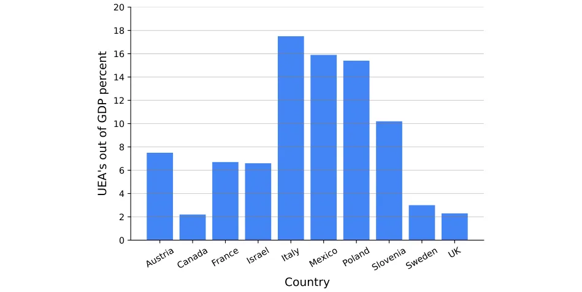
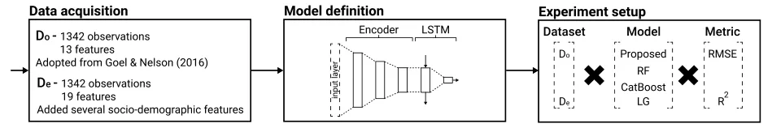
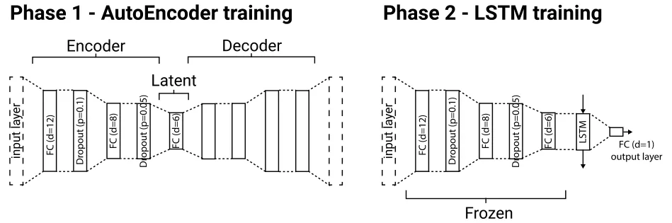
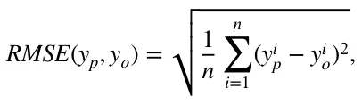
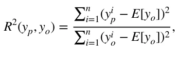
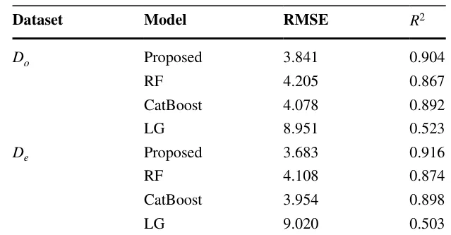
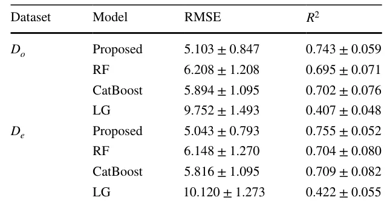
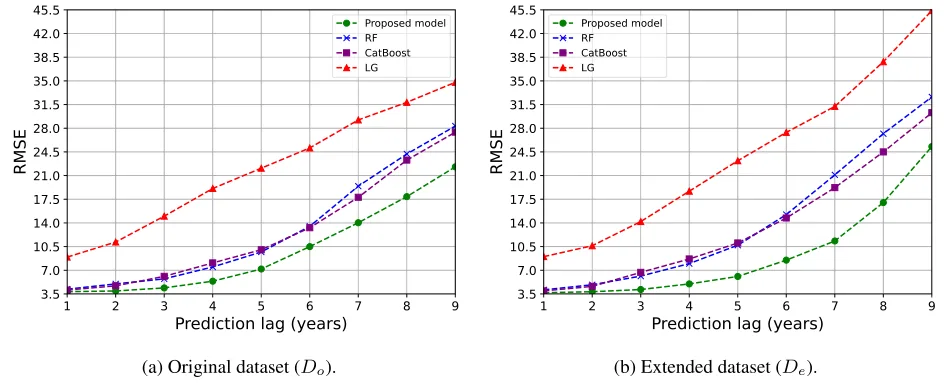

## 1 Introduction

A precise and consistent assessment of unregistered economic activities holds significant importance for policymakers when making decisions based on economic metrics such as economic growth, employment, productivity, and consumption.

The presence of unregistered economic activities can result in the underestimation of crucial economic indicators, such as the Gross Domestic Product (GDP), which can have evident repercussions on macroeconomic policies. Furthermore, the coexistence of an unregistered economy activity (UEA) alongside a formal one might undermine the credibility and trustworthiness of public institutions. This situation can also lead to the misuse of social insurance programs and a decline in tax revenues, as documented in previous studies (Schneider & Buehn, 2016; Gyomai & van de Ven, 2014; Shami, 2019). Fighting tax evasion and the UEA have been important policy goals in countries belonging to the Organisa-tion for Economic Co-operation and Development (OECD) during recent decades (Schneider, 2016). To this end, in 2011, the OECD surveyed its member countries to estimate the size of the UEA in each of them during 2008–2009 (Gyomai et al., 2012). Figure 1 shows the estimated UEA’s size as a portion of their GDP of the same year in several countries for 2008–2009. One can notice that for some countries the values cross the 10% mark, which highlights the importance of estimating this value and afterward designing policies to tackle it. Despite the large body of work about the UEA in general (Schneider & Enste, 2000; Enste & Schneider, 2002) and its measurement, in particular (Schneider et al., 2010; Breusch, 2005b), different authors often focus on different aspects of the UEA. However, most economists agree that the UEA contains all economic activities that are untaxed (Blades & Roberts, 2002). As a result, the activities accompanying the UEA may be legal or illegal, and the assumption is that the economic agents are, at least passively, aware that bringing their activities to the attention of the authorities would have tax (and possibly other legal) ramifications (Shami, 2019).

To this end, professionals have developed a wide range of methods to estimate the UEA’s size and to determine the factors that cause the decrease or increase of this quanta (Ha et al., 2021; Breusch, 2005a). However, more often than not, these methods focus on only one segment of the UEA (Schneider & Buehn, 2016; Elgin & Schneider, 2016). Moreover, due to the “unregistered” nature of the UEA, the estimations over the years, even on the same data, have a very large variability (Schneider & Buehn, 2018; Thai & Turkina, 2013). This phenomenon highlights the complexity of estimating the size of the UEA.

<figure id="fig-1">

<figcaption><strong>Fig. 1</strong> The composition of the UEA’s size as a portion of the country’s GDP in 2008–2009 for several OECD member countries. Data taken from Gyomai et al. (2012)</figcaption>
</figure>

To formalize the task of estimating the UEA size, economics using one or more of three main measurement methods. First, the direct approach involves assessing the magnitude of the Non-Observed Economy (NOE) through either voluntary survey responses or tax audit techniques. In the survey approach, an official organization designs and administers a survey. Meanwhile, the tax audit method relies on the difference between the income reported for taxation purposes and the income determined through targeted examinations (Cantekin & Elgin, 2017; Feld & Larsen, 2012; Feld & Schneider, 2010). Second, the indirect approach is macroeconomic and involves the utilization of diverse economic and non-economic indicators that provide insights into the evolution of the UEA over time. This method is dependent on five indicators that reveal certain traces of the UEA—the discrepancy between national expenditures and income statistics, the discrepancy between official and real labor force statistics, the transactions approach, the currency demand approach (CDA), and the physical input method, which includes factors like electricity consumption (Tanzi, 1980, 1983; Ferwerda et al., 2010; Ardizzi et al., 2014). Lastly, the modeling approach involves the use of statistical models for estimating the UEAA as an unobservable (latent) variable. The most commonly employed measurement method is based on the Multiple Indicator Multiple Cause (MIMIC) procedure, which draws inspiration from the research of Weck (1983) and Frey and Weck (1983). Originally, the MIMIC approach was developed for factor analysis in psychometrics, particularly for estimating intelligence (Elgin & Erturk, 2019; Andrews et al., 2011; Elgin & Schneider, 2016).

Regardless of the definition and method one chooses, the final step of all these methods is the computation of the UEA’s size from real-world data, which is a (time-series) regression task. Commonly, the linear regression (LG) model is used for this task (Dybka et al., 2019, 2020; Shami et al., 2021). However, it is repeatedly shown to over-fit and poorly predict the UEA’s size even on partially correct data as the produced numbers of these models show an increasing drift over time from any reasonable values. Into this gap, studies that utilize machine learning models have been shown to outperform the linear models and provide more stable results over time while capturing from the data well-established economic concepts which further assures their performance (Ivas & Tefoni, 2023). For instance, Shami and Lazebnik (2023) used a Random Forest algorithm with the currency demand-based model on data from Israel (1995–2019, yearly sample) and from the United Kingdom (2000–2019, quertly sample), showing the model outperformed the linear models developed on the same data by Shami et al. (2021); Dybka et al. (2019). In a similar manner, Felix et al. (2023) investigated partial data from 122 countries (2004–2014, yearly sample) comparing eleven models—four linear models and seven machine learning models. The authors show that constantly, the machine learning models outperformed the linear models, and using the Shapley value analysis (Mokhtari et al., 2019), they were able to provide an interpretation of these models. This adoption of machine learning models into UEA estimation occurs in parallel to a more global adoption of machine learning models for a wide range of economic tasks (Lazebnik et al., 2023; Yoon, 2021; Paruchuri, 2021; Gogas et al., 2022; Saha et al., 2023; Savchenko & Bunimovich-Mendrazitsky, 2023).

Despite the advantages machine learning models bring to the estimation of the UEA’s size, it has two fundamental flaws. First, machine learning models require a relatively large amount of data to “learn” well and produce stable and generalized models that are not overfitted and “memorizing” the patterns of the training data presented to them Ying (2019). Unfortunately, in this field, the data is scarce ranging between dozens to several hundred observations for each country (Dybka et al., 2019; Ivas & Tefoni, 2023). Second, many machine learning models are poorly performing with noisy data (Gupta & Gupta, 2019) which is present in this field due to the complexity of precisely measuring some of the features. In order to overcome these challenges, one can take advantage of (shallow) deep learning models (LeCun et al., 2015). These models usually require more data compared to machine learning models but as they are more expressive (i.e., can capture more complex dynamics) they can take the data from multiple countries into consideration, overcoming the first challenge. Moreover, these models are known to be robust in the presence of noisy data (Kim et al., 2021; Wu et al., 2020). Indeed, outside the scope of UEA’s size estimation, deep learning models for economic tasks using larger datasets (Nosratabadi et al., 2020a; Zheng et al., 2023; Shami & Lazebnik, 2022).

In this study, we propose the first, as far as we know, deep learning based model to improve the UEA’s size estimation. We based the proposed model on a two-phase neural network architecture, one which finds a meaningful representation space using the AutoEncoder architecture (Dong et al., 2018) followed by the long-short term memory (LSTM) method to solve a time-series problem (Greff et al., 2017). We show that the proposed model, on average, outperforms the current state-of-the-art models proposed by Shami and Lazebnik (2023) and Felix et al. (2023), as well as the widely used linear regression model using the dataset provided by Medina and Schneider (2018) as well as the same dataset with additional six socio-demographic features. In addition, we show that the proposed model generalizes its results better compared to the other models and therefore more reliable.

The remainder of this manuscript is organized as follows. In Sect. 2, we described the data used for our experiments as well as formally introduced the proposed model. In Sect. 3, we outline the results of our experiments. In Sect. 4, we discuss the obtained results in the context of economic usability. Lastly, Sect. 5 concludes our findings and suggests some areas for further research.

## 2 Method and Materials

In this section, we formally outline the datasets used in this study followed by a mathematical formalization of the proposed deep learning model, and the experimental setup used for the absolute evaluation of the proposed model alongside a comparison to other models. Notably, the UEA’s size estimation is a time-series regression problem. A schematic view of the proposed study’s structure is provided in Fig. 2.

<figure id="fig-2">

<figcaption><strong>Fig. 2</strong> A schematic view of the proposed study’s structure</figcaption>
</figure>

### 2.1 Data

For the “original” dataset, denoted by *D*o , we adopted the dataset initially proposed by Medina and Schneider (2018) and followed the pre-processing procedure proposed by Felix et al. (2023). Simply put, the dataset contains 122 countries with yearly data between 2004 and 2014. The dataset contains 13 features which followed the features proposed by Goel and Nelson (2016) alongside the log value of the GDP per capita. Namely, the features are inflation, unemployment rate, trade liberalization, net inflow, final consumption expenditure of the general government, start-up procedures to register a business, cost of business start-up procedures, average time required to start a business (in days), average time required to register property (in days), average time to prepare and pay taxes (in days), democracy index, tax burden, quality and diversity of exports, and GDP per capita.1 As the dataset contained missing data, imputation was performed for the missing data where we filled missing data with the weighted average of *k* = 5 nearest neighbors according to the remaining features and Euclidean distance (computed after normalization of each feature) (Zhang, 2012).

In addition, in order to allow the model to distinguish between countries, we introduce six new features for each country, resulting in 19 features, in total. Namely, the introduced features are the country’s population size, male-to-female rate, population’s mean age, average income, the average cost of a house, and the Big Mac Index (BMI) (Clements et al., 2012). We obtained this data from the OECD dataset, as well as McDonald’s websites. We chose these features as they are both widely available and easy to obtain and since they provide some identification about the country’s socio-economic state which was previously shown to be associated with the UEA’s size (Wallace & Latcheva, 2006). This enhanced dataset is denoted by *D*e.

### 2.2 Model Definition

The proposed model is based on two well-known deep learning architectures: a fully connected AutoEncoder and LSTM neural networks (NN). The first is responsible for extracting a computationally useful feature space while the latter is designed for time-series tasks, such as the UEA’s size prediction, and is able to capture temporal patterns. Intuitively, since LSTM could handle the problem of long-term dependencies well while requiring relatively less data compared to other time-series architecture of NN, it is a promising modeling decision for these settings (Yu et al., 2019). Formally, the model has seven layers: a fully-connected (FC) layer with 12 dimensions, a dropout layer with a drop-out rate of *p* = 0.1 , an FC layer with 8 dimensions, a dropout layer with a drop-out rate of *p* = 0.05 , an FC layer with 6 dimensions, an LSTM layer with 6 dimensions, and a fully-connected layer with 1 dimension, operating as the output layer. The encoder part of the AutoEncoder is contracted from the first five layers while the last two layers are associated with the LSTM part of the NN. These hyper-parameter values are obtained manually using a trial-and-error approach.

<figure id="fig-3">

<figcaption><strong>Fig. 3</strong> A schematic view of the proposed model and the training procedure of the model</figcaption>
</figure>

AutoEncoders are designed to have two parts—an encoder and decoder with a “latent” space between them. Intuitively, the model searches for a smaller representation space with more computationally meaningful features, commonly called the “latent” space, to represent most (or even all) the data provided in the input layer. This is done by first encoding the data from the input space to the latent space and then decoding it back into the input space and checking if the input and output are identical (Dong et al., 2018). However, the decoder part of the AutoEncoder is not useful as part of prediction processes and therefore removed once the entire AutoEncoder model is trained, leaving only the encoder part of the NN. Once the encoder is obtained, its weights are frozen (i.e., it is not changed during training). Then, we attached the LSTM NN to the latent space to capture temporal patterns and train this part. A schematic view of the proposed model and the training procedure of the model is described in Fig. 3.

For the training of both the AutoEncoder and the LSTM, we used the Adam optimizer (Kingma & Ba, 2017) with a learning rate of 10−4 and 2 ⋅ 10−4 , respectively. In addition, we use a 32-observation batch size for both training processes. For the AutoEncoder and LSTM training process, we used the *L*1 distance between the output and input layers and the RMSE metric as the loss functions, respectively.

### 2.3 Experiment Setup

Given the two datasets, *D*o and *D*e , and the proposed model, we explore three aspects of the model—its performance and generalization capabilities. For each one of these aspects, we compare the proposed model with three previous models. First, a Random Forest (RF) (Ho, 1998; Altman & Krzywinski, 2017) with the trees’ depth obtained using the grid-search hyperparameter tunning method (Liu et al., 2006) (ranging from 1 and up to the ceiling of the root number of features) and a Boolean satisfiability (SAT) based post-pruning (Lazebnik & Bunimovich-Mendrazitsky, 2023), as proposed by Shami and Lazebnik (2023). Second, the CatBoost model (Dorogush et al., 2018) with its learning rate, trees’ depth, and iteration for the fitting procedure are obtained by the grid search method, searching the parameter space {[0.1, 0.01, 0.001], [3, 5, 10], [100, 200, 300]} as proposed by Felix et al. (2023). Third, the LG model as proposed by Shami et al. (2021).

In order to measure each model’s prediction capability, the dataset (for both the *D*o and *D*e cases) used by the model is divided into training and testing cohorts, such that the first contains the first 80% (1073 observations) chronological-sorted observations while the latter contains the remaining 20% (269 observations) of the observations. In practice, the first eight years of each country are allocated to the training cohort while the last two years are allocated to the testing cohort. The training cohort was provided to the models during the training phase while the testing cohort was used to evaluate the models’ performances. Importantly, at each point in time, the model predicted one year into the future, using all available data. As such, for the second year of the testing cohort, the first year is used by the model.

Following previous works (Shami et al., 2021; Felix et al., 2023), we adopted the root mean square error (RMSE) as well as the coefficient of determination ( *R*2 ) metrics for the models’ performance measurement. Formally, we define RMSE as follows:

where *y*p, *y*o ∈ ℝn are the model’s prediction and the observed values data such that *n* is the number of observations taken into consideration. Similarly, we define the coefficient of determination as follows:

where *E*[*y*o] is the mean value of the observation vector.

<figure class="table-figure" id="table-1">
<figcaption><strong>Table 1</strong> The model’s performance in terms of RMSE and coefficient of determinations ( <em>R</em>2 ) for both the original ( <em>D</em>o ) and extended ( <em>D</em>e ) datasets</figcaption>

</figure>

## 3 Results

In this section, we outline the performance and generalization of the proposed model while showing a comparison with previous state-of-the-art machine learning models and the classical model.

### 3.1 Performance

Table 1 outlines the RMSE and *R*2 values of the models with the test data for both the original ( *D*o ) and extended ( *D*e ) datasets. One can see that for both cases, the model performs worse than the machine learning and deep learning models. Both the RF and CatBoost models which represented the machine learning approach show promising results with *R*2 close to 0.9 . Interestingly, the extended features do not contribute much to their performance as the *R*2 of the RF and CatBoost models, nonetheless an increase of 0.8% and 0.7% , respectively, is obtained. For the deep learning model (the proposed model), it is outperforming all other models for both cases. For the extended dataset ( *D*e ), the performance increases in 1.3% compared to the original dataset ( *D*o ). This highlights the ability of the model to take partially related data into account in order to find complex connections. The results of the CatBoost and LG models, obtained for the original dataset ( *D*o ), are similar to those reported by Felix et al. (2023). The small differences in the results can be associated with the different splitting of the dataset into the training and testing cohorts.

### 3.2 Generalization

For the generalization analysis, we explore two types of generalization—cross-prediction between countries and prediction lag. For the cross-prediction between countries analysis, the model is trained on the data of *n* = 121 countries and leaves one country out as the test case. For this country, only the first observation (year) provides the model to predict the UEA’s size for the following year. The prediction is then computed to the following year until all years available in the dataset are predicted. This process repeats 122 as each time, a single country is left outside the training cohort and used as the testing cohort, following the leave-one-out cross-validation method (Wong, 2015). Table 2 presents the results of this analysis, presented as the mean value of all counties, divided into the original ( *D*o ) and extended ( *D*e ) datasets. The proposed model outperforms all other models, outperforming the second-best model, the CatBoost model, with 15.5% and 15.3% for the original and extended datasets, respectively. Moreover, an ANOVA (Analysis Of Variance) supplemented with post-hoc T-tests and Bonfer-roni correction is performed for both datasets (Girden, 1992). For both, the proposed model statistically significantly outperforms the other model with *p <* 0.05 . In addition, the LG model’s performance is statistically significantly worse than the other models with *p <* 0.01.

<figure class="table-figure" id="table-2">
<figcaption><strong>Table 2</strong> The models’ generalization ability between countries. The results are shown as the mean ± standard deviation of <em>n</em> = 122 following a leave-one-out cross-validation strategy</figcaption>

</figure>

<figure id="fig-4">

<figcaption><strong>Fig. 4</strong> The models’ stability analysis as a function of the production lag (in years). The results are shown as the mean value of <em>n</em> = 122 countries</figcaption>
</figure>

For the prediction lag analysis, we define the prediction lag, *훿* ∈[1, 9] to be the number of years ahead a model is required to predict from a given year. For example, if the model is provided with the data til 2008 and *훿* = 3 , the model would predict the UEA’s size for 2011. Figure 4 presents the results of this analysis such that the x-axis is the prediction lag ( *훿* ) and the y-axis is the RMSE of the model. Specifically, Fig. 4a, b show the results for the original and extended data-sets, respectively. In both cases, all models’ RMSE is monotonically increasing with the prediction lag. The proposed model constantly obtains RMSE lower than the other models while the LG obtained the worst RMSE compared to the other model. The RF and CatBoost model interchange while showing similar dynamics.

## 4 Discussion

In this study, we leveraged recent advancements in deep learning models to enhance the precision and reliability of one of the widely utilized and esteemed models for estimating the scale of the UEA. By incorporating an AutoEncoder architecture to capture a computationally meaningful feature space, followed by an LSTM method to capture patterns over time. To train the model, we adopted a well-established dataset for this task proposed by Elgin and Oztunali (2012). These features are in conjunction with the MIMIC approach. As far as we know, this is the first attempt to use deep learning based model for UEA’s size estimation.

Unlike LG and even more complex machine learning models, deep learning models do not require the user to identify “promising” features, as it is able to contract a computationally useful parameter space as part of the model (Karkkainen & Hanninen, 2023). In a complementary manner, while tree-based models are part of previous machine learning-based attempts (Felix et al., 2023; Shami & Lazebnik, 2023) are theoretically able to approximate any continuous function (following the universal approximation theorem) (Kratsios & Papon, 2022), empirical results deep learning achieve this goal better, given enough data (Theofilatos et al., 2019; Korotcov et al., 2017; Nikou et al., 2019). Hence, the utilization of a deep learning model eliminates the necessity for manually searching for relationships between variables, providing a more robust solution compared to previous attempts. To this end, Table 1 reveals that the proposed model outperformance the machine learning and LG models in both terms of RMSE and coefficient of determination ( *R*2 ) metrics on the original datasets. Moreover, the proposed model shows the most improvement in these two metrics given the extended dataset.

Moreover, as shown in Table 2, the proposed model is more robust in analyzing data of other countries, providing researchers a tool to rapidly explore economic, social, and political signals that are relatively easier to measure (i.e., the country’s population size) compared to the UEA’s related measurements between countries (Brunetti, 1997; Bilan et al., 2020). Similarly, Fig. 4 also shows, that for the presented datasets, the proposed model provides better results for predictions further way in the future compared to the other models. In this context, the model shows increasing RMSE concerning the prediction lag but this dynamic is common for time series tasks (Kim & Lee, 2019). Overall, the proposed deep learning model is both generalizing better between countries and allows us to make predictions further to the future with less error. This outcome is of great economic importance when planning socio-economical policies to try and reduce the UEA’s size since such policies commonly require several months to years to initialize and several more to fully alter the socio-economic dynamic in a country (Cohen et al., 2020). As such, a more accurate UEA’s size estimation based on a given situation can provide policymakers with a more data-driven ground to design an appropriate policy (Lazebnik et al., 2023; McKibbin & Vines, 2020).

The proposed model extends the capabilities of previous models as it learns cross-countries as the data of a large number of countries is used to train the model, providing the model the ability to capture more fundamental economic processes across countries that occurred in parallel, compared to previous attempts that treated each country in isolation, ignoring the international influence they have on each other (Fishelson, 1988; Dell’Anno & Schneider, 2003). As such, the proposed model by itself, while already outperforming previous models, can be further improved given more versatile data and not only more observations of the features currently popularized in the domain.

It is important to note, that the proposed model is as good as the quality of the data it is provided with. While this claim holds for all data-driven models, it is of economic complexity in the UEA’s size estimation context. To be exact, the features used to estimate the UEA’s size are usually related to the registered economy while missing important dynamics such as black and gray market trades, financially related criminal-driven economic processes, and others (Gyomai et al., 2012). As such, in order to make the proposed model more usable, governments and economic organizations should aim to gather such data while also providing the already available features at a higher rate to reduce the error in the UEA’s size estimations, providing policymakers a more profound ground to design socio-economic policies (Enste & Schneider, 2002; Orviska et al., 2006).

## 5 Conclusion

The significance of comprehending the development of the UEA has become increasingly apparent, as evidenced by the surge in research focused on quantifying its extent. Nonetheless, the methods of estimation and econometric techniques employed to attain this objective were previously constrained to investigating linear connections among variables believed to both influence and be impacted by the presence of informal economic activities. Recently, data-driven methods that utilize non-linear machine learning models provided a leap forward in the UEA’s size estimation accuracy and stability while introducing new challenges to the field. In this study, we continue this line of work as we leverage a deep learning model to explore both non-linear and high-dimensional relationships between economic indicators and the size of the UEA.

Namely, we integrate a deep model with the MIMIC approach, a method that numerous researchers have identified as the most preferable choice among the various alternatives currently available. We show that the proposed model provides more accurate and robust results compared to the current state-of-the-art machine learning and widely adopted models. Nonetheless, as the economy and technology progress, the CDA might be sub-optimal. For example, as the usage of crypto-currency increases, the influence of classical currency demand would be less representative of the entire UEA (Marmora, 2021). Thus, future studies could explore the usage of deep learning models with other UEA measurement approaches. In addition, as the proposed results are obtained on a relatively short duration (i.e., 10 years), they should be considered with some caution as large-scale events such as global pandemic (Lazebnik et al., 2021; Carlsson-Szlezak et al., 2020), war (Liadze et al., 2023), or policy shifts (Alexi et al., 2023; Annicchiarico & Cesaroni, 2018) can cause a drastic drift in the dynamics (Gama et al., 2014). Thus, once possible, future studies should repeat our analysis on larger datasets to examine if the results do not change significantly or adopt the method to handle such events. Moreover, another possible approach to tackle the UEA’s size estimation problem which is also more explainable is using the symbolic regression method (Simon et al., 2023; Stijven et al., 2016; Udrescu & Tegmark, 2020; Mahouti et al., 2021). Moreover, as the proposed model is based on the relationship between countries with different currencies, it might be useful to include the exchange rate of currencies to a single one, such as the US dollar, to obtain a better representation of the monetary relationships over time.

**Funding** No funding was received to assist with the preparation of this manuscript.

**Code and Data availability** The code and data that have been used in this study are available upon reasonable request from the author.

### Declarations

**Conflict of interest** The authors have no conflict of interest to declare that are relevant to the content of this article.

## Notes

1 We refer the interested reader to Felix et al. (2023) for more details.

## References

- Alexi, A., Lazebnik, T., & Shami, L. (2023). Microfounded tax revenue forecast model with heterogeneous population and genetic algorithm approach. Computational Economics.
- Altman, N., & Krzywinski, M. (2017). Ensemble methods: Bagging and random forests. Nature Methods, 14, 933–934.
- Andrews D., Sánchez, A. C., & Johansson, A. (2011). Towards a better understanding of the informal economy. Technical Report 873, OECD Economics Department Working Papers. OECD Publishing.
- Annicchiarico, B., & Cesaroni, C. (2018). Tax reforms and the underground economy: A simulation-based analysis. International Tax and Public Finance, 25, 458–518.
- Ardizzi, G., Petraglia, C., Piacenza, M., & Turati, G. (2014). Measuring the underground economy with the currency demand approach: A reinterpretation of the methodology, with an application to Italy. Review of Income and Wealth, 60(4), 747–772.
- Bilan, Y., Tiutiunyk, I., Lyeonov, S., & Vasylieva, T. (2020). Shadow economy and economic development: A panel cointegration and causality analysis. International Journal of Economic Policy in Emerging Economies, 13(2), 173–193.
- Blades, D., & Roberts, D. (2002). Measuring the non-observed economy statistics. OECD, Statistics Brief, (5).
- Breusch, T. (2005a). Estimating the underground economy using MIMIC models. Technical report, Working Paper, National University of Australia, Canberra, Australia.
- Breusch, T. (2005b). The Canadian underground economy: An examination of Giles and Tedds. Canadian Tax Journal, 53(2), 367.
- Brunetti, A. (1997). Political variables in cross-country growth analysis. Journal of Economic Surveys, 11(2), 163–190.
- Cantekin, K., & Elgin, C. (2017). Extent and growth effects of informality in Turkey: Evidence from a firm-level survey. The Singapore Economic Review, 62(05), 1017–1037.
- Carlsson-Szlezak, P., Reeves, M., & Swartz, P. (2020). What coronavirus could mean for the global economy. Harvard Business Review, 3, 1–10.
- Clements, K. W., Lan, Y., & Seah, S. P. (2012). The big mac index two decades on: An evaluation of burgernomics. International Journal of Finance & Economics, 17(1), 31–60.
- Cohen, N., Rubinchik, A., & Shami, L. (2020). Towards a cashless economy: Economic and socio-political implications. European Journal of Political Economy, 61, 101820.
- Dell’Anno, R., & Schneider, F. (2003). The shadow economy of Italy and other OECD countries: What do we know? Journal of Public Finance and Public Choice, 21(2–3), 97–120.
- Dong, G., Liao, G., Liu, H., & Kuang, G. (2018). A review of the autoencoder and its variants: A comparative perspective from target recognition in synthetic-aperture radar images. IEEE Geoscience and Remote Sensing Magazine, 6(3), 44–68.
- Dorogush, A. V., Ershov, V., & Gulin, A. (2018). Catboost: Gradient boosting with categorical features support. arXiv.
- Dybka, P., Olesiński, B., Rozkrut, M., & Torój, A. (2020). Measuring the uncertainty of shadow economy estimates using bayesian and frequentist model averaging. Working Paper 2020/046, Szkoła Główna Handlowa W Warszawie.
- Dybka, P., Kowalczuk, M., Olesiński, B., Torój, A., & Rozkrut, M. (2019). Currency demand and MIMIC models: Towards a structured hybrid method of measuring the shadow economy. International Tax and Public Finance, 26(1), 4–40.
- Elgin, C., & Oztunali, O. (2012). Shadow economies around the world: Model based estimates. Working Papers 2012/05, Bogazici University, Department of Economics.
- Elgin, C., & Erturk, F. (2019). Informal economies around the world: Measures, determinants and consequences. Eurasian Economic Review, 9(2), 221–237.
- Elgin, C., & Schneider, F. (2016). Shadow economies in OECD countries: DGE vs. MIMIC approaches. Bogazici Journal: Review of Social, Economic & Administrative Studies, 30(1), 1–32.
- Enste, D., & Schneider, F. (2002). The shadow economy: Theoretical approaches, empirical studies, and political implications (Vol. 3, p. 9278). Cambridge: Cambridge University Press.
- Feld, L. P., & Larsen, C. (2012). The size of the German shadow economy and tax morale according to various methods and definitions. In Undeclared work, deterrence and social norms (pp. 15–20). Springer.
- Feld, L. P., & Schneider, F. (2010). Survey on the shadow economy and undeclared earnings in OECD countries. German Economic Review, 11(2), 109–149.
- Felix, J., Alexandra, M., & Lima, G. T. (2023). Applying machine learning algorithms to predict the size of the informal economy. Computational Economics.
- Ferwerda, J., Deleanu, I., & Unger, B. (2010). Revaluating the Tanzi-model to estimate the underground economy. Discussion Paper Series/Tjalling C. Koopmans Research Institute,10(04).
- Fishelson, G. (1988). The black market for foreign exchange: An international comparison. Economics Letters, 27(1), 67–71.
- Frey, B. S., & Weck, H. (1983). Estimating the shadow economy: A ‘naive’ approach. Oxford Economic Papers, 35(1), 23–44.
- Gama, J., Zliobaite, I., Bifet, A., Pechenizkiy, M., & Bouchachia, A. (2014). A survey on concept drift adaptation. ACM Computing Surveys (CSUR), 46, 1–37.
- Girden, E. R. (1992). ANOVA: Repeated measures. Number 84. Sage.
- Goel, R. K., & Nelson, M. A. (2016). Shining a light on the shadows: Identifying robust determinants of the shadow economy. Economic Modelling, 58, 351–364.
- Gogas, P., Papadimitriou, T., & Sofianos, E. (2022). Forecasting unemployment in the Euro area with machine learning. Journal of Forecasting, 41(3), 551–566.
- Greff, K., Srivastava, R. K., Koutník, J., Steunebrink, B. R., & Schmidhuber, J. (2017). Lstm: A search space odyssey. IEEE Transactions on Neural Networks and Learning Systems, 28(10), 2222–2232.
- Gupta, S., & Gupta, A. (2019). Dealing with noise problem in machine learning data-sets: A systematic review. Procedia Computer Science, 161, 466–474.
- Gyomai, György, Arriola, C, Gamba, M, & Guidetti, E. (2012). Summary of the OECD survey on measuring the non-observed economy. Working Party on National Accounts. OECD, Paris.
- Gyomai, G., & van de Ven, P. (2014). The non-observed economy in the system of national accounts. OECD Statistics Brief, 18, 1–12.
- Ha, L. T., Dung, H. P., & Thanh, T. T. (2021). Economic complexity and shadow economy: A multidimensional analysis. Economic Analysis and Policy, 72, 408–422.
- Ho, T. K. (1998). The random subspace method for constructing decision forests. IEEE Transactions on Pattern Analysis and Machine Intelligence, 20, 832–844.
- Ivas, C.-F., & Tefoni, S. S. E. (2023). Modelling the non-linear dependencies between government expenditures and shadow economy using data-driven approaches. Scientific Annals of Economics and Business, 70(1), 97–114.
- Karkkainen, T., & Hanninen, J. (2023). Additive autoencoder for dimension estimation. Neurocomputing, 551, 126520.
- Kim, H., & Lee, J.-T. (2019). On inferences about lag effects using lag models in air pollution time-series studies. Environmental Research, 171, 134–144.
- Kim, Y., Oh, D., Huh, S., Song, D., Jeong, S., Kwon, J., Kim, M., Kim, D., Ryu, H., Jung, J., Kyung, W., Sohn, B., Lee, S., Hyun, J., Lee, Y., Kim, Y., & Kim, C. (2021). Deep learning-based statistical noise reduction for multidimensional spectral data. Review of Scientific Instruments, 92(7), 073901.
- Kingma, D. P., & Ba, J. (2017). Adam: A method for stochastic optimization. arXiv.
- Korotcov, A., Tkachenko, V., Russo, D. P., & Ekins, S. (2017). Comparison of deep learning with multiple machine learning methods and metrics using diverse drug discovery data sets. Molecular Pharmaceutics, 14(12), 4462–4475.
- Kratsios, A., & Papon, L. (2022). Universal approximation theorems for differentiable geometric deep learning. Journal of Machine Learning Research, 23(1), 196.
- Lazebnik, T., & Bunimovich-Mendrazitsky, S. (2023). Decision tree post-pruning without loss of accuracy using the sat-pp algorithm with an empirical evaluation on clinical data. Data & Knowledge Engineering, 145, 102173.
- Lazebnik, T., Fleischer, T., & Yaniv-Rosenfeld, A. (2023). Benchmarking biologically-inspired automatic machine learning for economic tasks. Sustainability, 15(14), 11232.
- Lazebnik, T., Shami, L., & Bunimovich-Mendrazitsky, S. (2021). Spatio-temporal influence of non-pharmaceutical interventions policies on pandemic dynamics and the economy: The case of covid-19. Economic Research, 35, 1833–1861.
- Lazebnik, T., Shami, L., & Bunimovich-Mendrazitsky, S. (2023). Intervention policy influence on the effect of epidemiological crisis on industry-level production through input–output networks. Socio- Economic Planning Sciences, 87, 101553.
- LeCun, Y., Bengio, Y., & Hinton, G. (2015). Deep learning. Nature, 521, 436–444.
- Liadze, I., Macchiarelli, C., Mortimer-Lee, P., & Sanchez Juanino, P. (2023). Economic costs of the Russia–Ukraine war. The World Economy, 46(4), 874–886.
- Liu, R., Liu, E., Yang, J., Li, M., & Wang, F. (2006). Optimizing the hyper-parameters for svm by combining evolution strategies with a grid search. Intelligent Control and Automation (p. 344).
- Mahouti, P., Gunes, F., Belen, M. A., & Demirel, S. (2021). Symbolic regression for derivation of an accurate analytical formulation using “big data’’: An application example. The Applied Computational Electromagnetics Society Journal, 32(5), 372–380.
- Marmora, P. (2021). Currency substitution in the shadow economy: International panel evidence using local bitcoin trade volume. Economics Letters, 205, 109926.
- McKibbin, W., & Vines, D. (2020). Global macroeconomic cooperation in response to the covid-19 pandemic: A roadmap for the g20 and the imf. Oxford Review of Economic Policy, 36(Suppl 1), S297–S337.
- Medina, L., & Schneider, M. F. (2018). Shadow economies around the world: what did we learn over the last 20 years? International Monetary Fund.
- Mokhtari, K. E., Higdon, B. P., & Başar, A. (2019). Interpreting financial time series with shap values. In Proceedings of the 29th Annual International Conference on Computer Science and Software Engineering (pp. 166–172). IBM Corp.
- Nikou, M., Mansourfar, G., & Bagherzadeh, J. (2019). Stock price prediction using deep learning algorithm and its comparison with machine learning algorithms. Intelligent Systems in Accounting, Finance and Management, 26(4), 164–174.
- Nosratabadi, S., Mosavi, A., Duan, P., Ghamisi, P., Filip, F., Band, S. S., Reuter, U., Gama, J., & Gan-domi, A. H. (2020). Data science in economics: Comprehensive review of advanced machine learning and deep learning methods. Mathematics, 8, 1799.
- Orviska, M., Caplanova, A., Medved, J., & Hudson, J. (2006). A cross-section approach to measuring the shadow economy. Journal of Policy Modeling, 28(7), 713–724.
- Paruchuri, H. (2021). Conceptualization of machine learning in economic forecasting. Asian Business Review, 11(2), 51–58.
- Saha, D., Young, T. M., & Thacker, J. (2023). Predicting firm performance and size using machine learning with a Bayesian perspective. Machine Learning with Applications, 11, 100543.
- Savchenko, E., & Bunimovich-Mendrazitsky, S. (2023). Investigation toward the economic feasibility of personalized medicine for healthcare service providers: The case of bladder cancer. arXiv.
- Schneider, F. (2016). Outside the state: The shadow economy and shadow economy labour force. In The Palgrave handbook of international development (pp. 185–204). Springer.
- Schneider, F., & Buehn, A. (2016). Estimating the size of the shadow economy: Methods, problems and open questions. Technical report, Institute for the Study of Labor (IZA).
- Schneider, F., & Buehn, A. (2018). Shadow economy: Estimation methods, problems, results and open questions. Open Economics, 1(1), 1–29.
- Schneider, F., Buehn, A., & Montenegro, C. E. (2010). New estimates for the shadow economies all over the world. International Economic Journal, 24(4), 443–461.
- Schneider, F., & Enste, D. H. (2000). Shadow economies: Size, causes, and consequences. Journal of Economic Literature, 38(1), 77–114.
- Shami, L., & Lazebnik, T. (2023). Implementing machine learning methods in estimating the size of the non-observed economy. Computational Economics.
- Shami, L., Cohen, G., Akirav, O., Herscovici, A., Yehuda, L., & Barel-Shaked, S. (2021). Informal self-employment within the non-observed economy of Israel. International Journal of Entrepreneurship and Small Business.
- Shami, L. (2019). Dynamic monetary equilibrium with a non-observed economy and Shapley and Shubik’s price mechanism. Journal of Macroeconomics, 62, 103018.
- Shami, L., & Lazebnik, T. (2022). Economic aspects of the detection of new strains in a multi-strain epidemiological-mathematical model. Chaos, Solitons & Fractals, 165, 112823.
- Simon, L. K., Liberzon, A., & Lazebnik, T. (2023). A computational framework for physics-informed symbolic regression with straightforward integration of domain knowledge. Scientific Reports, 13, 1249.
- Stijven, S., Vladislavleva, E., Kordon, A., Willem, L., & Kotanchek, M. E. (2016). Prime-time: Symbolic regression takes its place in the real world. Programming Theory and Practice XIII: Genetic and Evolutionary Computation
- Tanzi, V. (1980). The underground economy in the United States: Estimates and implications. PSL Quarterly Review, 33(135), 427–453.
- Tanzi, V. (1983). The underground economy in the United States: Annual estimates, 1930–1980. IMF Staff Papers, 30(2), 283–305.
- Thai, M. T. T., & Turkina, E. (2013). Entrepreneurship in the informal economy: Models, approaches and prospects for economic development. London: Routledge.
- Theofilatos, A., Chen, C., & Antoniou, C. (2019). Comparing machine learning and deep learning methods for real-time crash prediction. Transportation Research Record, 2673(8), 169–178.
- Udrescu, S.-M., & Tegmark, M. (2020). Ai feynman: A physics-inspired method for symbolic regression. Science Advances, 6(16), eaay2631.
- Wallace, C., & Latcheva, R. (2006). Economic transformation outside the law: Corruption, trust in public institutions and the informal economy in transition countries of central and eastern europe. Europe- Asia Studies, 58(1), 81–102.
- Weck, H. (1983). Schattenwirtschaft: eine Möglichkeit zur Einschränkung der öffentlichen Verwaltung? eine ökonomische Analyse. Frankfurt/Main: Lang.
- Wong, T.-T. (2015). Performance evaluation of classification algorithms by k-fold and leave-one-out cross validation. Pattern Recognition, 48(9), 2839–2846.
- Wu, X., Xue, G., He, Y., & Xue, J. (2020). Removal of multisource noise in airborne electromagnetic data based on deep learning. Geophysics, 85(6), B207–B222.
- Ying, X. (2019). An overview of overfitting and its solutions. Journal of Physics: Conference Series, 1168(2), 022022.
- Yoon, J. (2021). Forecasting of real gdp growth using machine learning models: Gradient boosting and random forest approach. Computational Economics, 57(1), 247–265.
- Yu, Y., Si, X., Hu, C., & Zhang, J. (2019). A review of recurrent neural networks: LSTM cells and network architectures. Neural Computation, 31(7), 1235–1270.
- Zhang, S. (2012). Nearest neighbor selection for iteratively knn imputation. Journal of Systems and Software, 85(11), 2541–2552.
- Zheng, Y., Xu, Z., & Xiao, A. (2023). Deep learning in economics: A systematic and critical review. Artificial Intelligence Review, 56, 9497–9539.
