## 1 Introduction

Consumer theory posits that increasing an individual’s budget amplifies his capacity to procure private goods, thereby (contingent upon the desirability of the products) elevating his utility (Heckman, 1974; Campbell & Mankiw, 1991; Carroll, 2001; Diacon & Maha, 2015; Wang et al., 2016). However, incorporating public goods within this framework introduces another facet of consumer utility-maximizing considerations (Stiglitz, 1977; Bergstrom et al., 1986; Shapiro, 2009). In this context, an individual is urged to “contribute” a fraction of his/her income to finance public good production, necessitating the relinquishment of some private goods purchases. Various models endeavor to optimize consumer utility in such scenarios, recognizing that public goods significantly increase an individual’s utility, thus justifying their production at the expense of private goods consumption (Groves & Ledyard, 1977; Bergstrom et al., 1986). This rationale originates from recognizing that the overall societal benefit greatly exceeds an individual’s role in generating it. The idea that public goods rely on the collective "contributions" of consumers emphasizes the importance of individuals engaging in their creation, thereby enjoying significant advantages from their existence.

According to well-established economic models, a sub-population that consistently enhances financial benefits through political influence poses a threat to overall socio-economic well-being (Coates & Heckelman, 2003; Coates et al., 2011; Dincer, 2012; Cole, 2015). In "The Rise and Decline of Nations," Olson employs a multidisciplinary approach integrating economic and political science methodologies to anatomize the origins, attributes, and ramifications of the influence of narrow, well-organized groups over the political landscape. Olson delineates "distributional coalitions," denoting special interest groups, as entities impeding a society’s agility in embracing novel technologies and adapting resource allocation strategies to changing circumstances, thereby reducing the pace of economic growth. These coalitions, as articulated by Olson, encompass entities endeavoring to increase the apportionment of earnings and assets among their constituents. Essentially, these interest groups siphon resources away from productive endeavors, channeling them into activities focused on redistribution, notably lobbying pursuits. Consequently, collective action-driven allocations are prognosticated to bear inefficiencies, irrespective of whether these groups command market influence or exploit it lucratively (Olson, 1982). In this study, we argue that not only does this specific group diminish the overall welfare, but their efforts to increase transfer payments may also compromise the advantages they receive. This result is due to the unique contribution of the variables selected in the study, in particular to the rate of natural growth among members of the interest group and the significant contribution of the public good to the utility of all individuals in the economy.

A private good exhibits two fundamental attributes - rivalry and excludability. Rivalry characterizes a good when its consumption by certain individuals diminishes the quantity available for others while excludability refers to the condition where consumption is contingent upon payment. In a complementary manner, a public good is a product uniformly consumed by all members of an economy upon the provision, rendering prevention of consumption impractical for any individual, while its consumption doesn’t diminish the availability for others (Samuelson, 1954). Simply put, a pure public good lacks both rivalry (non-diminishing consumption) and excludability (inability to exclude others from consumption) properties. Once available to one individual, it can be consumed by others at no additional cost, and upon provision, the exclusion of any individual from consumption is ostensibly impossible.

The acquisition of private goods is facilitated through an individual’s private budget, whereas the provision of public goods hinges upon (tax) contributions from the individuals who ultimately receive its benefits. In previous theoretical and empirical studies, it has been shown that taxpayers often lack a direct correlation between the extent of their tax contributions and the magnitude of public goods from which they benefit (Kemp, 1991; Dhami et al., 2019).

One prevalent avenue in economic research revolves around determining the financing structure for public goods provision and the optimal quantity required to maximize agents and overall utility within an economy (Williams, 1966; Roberts, 1987; Anand, 2004; Falkinger et al., 2000; Hellwig, 2003; Deacon, 2009). Within this framework, the concept of the “free rider” emerges more often than not. To be specific, in voluntary models where some individuals opt out of contributing to financing public goods, free riders are a central phenomenon (Marwell & Ames, 1979; Falkinger et al., 2000; Carpenter, 2007; Epstein & Mealem, 2009; Ozono et al., 2016; Jindapon & Yang, 2020). In addition, within every economy, there exists a segment entitled to allowances without tax obligations under legal provisions (for example, as a result of an income below the threshold that requires payment of tax), simultaneously benefiting from public goods. This economic phenomenon aligns with the social contract inherent in the societal norms of each country. However, what if this supported segment expands its demographic weight within the population and, through political leverage, increases its allowances? Despite the apparent simplicity of this query, critical nuances remain overlooked.

Indeed, an upsurge in the demographic influence of a non-tax-paying population segment detrimentally impacts state revenues. Moreover, if this group receives transfer payments, its increased demographic share further strains the public budget. Yet, is this trajectory beneficial for individuals within this group? If so, will it be stable for a long period? While a larger allowance enables greater private good acquisition, potentially elevating individual benefits, it raises a pertinent question: what about the repercussions on public goods? Could bolstering purchasing power for private goods diminish utility if it comes at the expense of public goods provision? This study endeavors to elucidate this query.

This study focuses on special interest groups that receive transfer payments and wield considerable political influence to shape legislation in their favor. To capture the dynamics between two distinct populations-one contributing to public goods production and the other benefiting from allowances while not participating in the labor market-a novel ordinary differential equation model was developed. The model indicates that perceived “benefits” accruing to the latter group become enticing enough to attract members from the former group and may jeopardize both the collective welfare and, intriguingly, their utility. The findings reiterate the potential consequences of escalating demands for higher allowances, leading to a tipping point that diminishes the working population and reduces both public goods provision and the utility of interest group members. The sensitivity analyses underscore the intricate relationships between allowances, tax burdens, utility, and the tipping point, emphasizing the paramount significance of the public good in shaping outcomes.

The rest of the paper is structured as follows. Section 2 reviews the literature related to our topic. Section 3 formally presents the proposed model. Section 4 outlines a theoretical analysis of the proposed model including solution existence and uniqueness, population size non-negativity, and equilibria with stability analysis. Section 5 presents the results for the case of Israel. Section 6 discusses our findings, and Sect. 7 concludes the applicative and theoretical findings.

## 2 Related literature

The dynamic relationship between interest groups and political parties has garnered extensive scrutiny (Wonka, 2022; Holcombe, 2021; Chaqués-Bonafont et al., 2021; Gilens & Page, 2014; Allern & Bale, 2012; Allern et al., 2007; Epstein & Nitzan, 2006; Katz & Mair, 1995). Interest groups encompass various types, ranging from anomic and non-associational groups to institutional, religious, and associational groups. Many political parties have emerged from, or maintain strong affiliations with, these interest groups, including labor parties, religious factions, trade unions, conservative entities, and business associations (Chaqués-Bonafont et al., 2021). Consequently, interest groups wield considerable influence in shaping public policies and the policymaking process, even without direct electoral participation or governmental positions (Palekar, 2014).

Interest groups can impede economic growth through multiple avenues. Notably, their engagement in rent-seeking activities aimed at securing preferential policies diverts resources away from productive uses, gradually stifling technological progress and economic advancement (Cole, 2015). Research demonstrates that societies hosting a greater abundance of interest groups tend to exhibit slower growth, reduced capital accumulation, and diminished productivity (Dincer, 2012; Coates et al., 2011). Moreover, empirical evidence underscores that heightened special interest group activity can detrimentally impact long-term growth, particularly beyond a certain threshold (Cole, 2015). These findings underscore the potential adverse effects of special interest groups on economic growth, aligning with the perspective that an ’excessive’ proliferation of such groups may yield negative societal outcomes.

The supposition that increasing allowances for interest group members would heighten their benefits relies on the (misguided) presumption that the level and quality of public goods remain unaffected. It appears that interest group leaders operate under the assumption that the magnitude of public goods remains fixed, unaffected by the extent of budget allocation dedicated to transfer payments for their members. Formally, this assumption equates to maximizing individual benefit within a budget constraint solely accounting for the direct budget allocated to financing private goods, devoid of consideration for the interplay between the scale of public goods (in the individual’s utility function) and the total tax revenue remaining in the state budget (after subtracting transfer payments) allocated to public goods production.

The ultra-Orthodox community in Israel, often referred to as the Haredim, wields substantial political influence, securing a spectrum of benefits and subsidies encompassing allowances for full-time yeshiva study, housing assistance, and healthcare services (Shami & Akirav, 2020). Nonetheless, the broader societal and economic repercussions of these policies remain a contentious subject. While intended to bolster the ultra-Orthodox community, these benefits have drawn criticism for fostering low workforce engagement among ultra-Orthodox men, potentially straining both the economy and social welfare systems. Moreover, these policies have sparked discord within Israeli society, triggering concerns regarding their economic implications and the imperative for greater integration of the ultra-Orthodox community into the labor force (Shami & Akirav, 2020). The ultra-Orthodox community’s influence in Israeli politics and society perpetuates ongoing discussions and debates, underscoring the intricacies and multifaceted dimensions inherent to this issue.

The positive contribution of transfer payments on the well-being of the recipients of the payments and society as a whole has been widely reviewed in many research. Aizer et al. (2016) found that in adulthood, sons whose mothers had received Mothers’ Pensions experienced a 14% increase in annual income. Hoynes et al. (2016) examined the long-term economic impact of exposure to food stamps. The authors show that among individuals whose parents were without a high school diploma, exposure to food stamps from conception to age 5 increased their earnings by $3,610 (measured in 1995 dollars). Bastian and Michelmore (2018) reveal that an increase in Earned Income Tax Credit during childhood was associated with an increase in earnings, a higher probability of completing high school, a higher probability of completing college, and a higher chance of being employed in young adulthood. Garfinkel et al. (2022) shed light on the fact that child allowances generate substantial benefits well above costs. For example, their study indicates that $2000 child allowance generates net social benefits of $382 billion, while the $3000/$4200 proposal generates social benefits of $613 billion.

Price et al. (2018) outline that an additional $2962 (2019 dollars) in cash transfers annually for three to five years decreased children’s future earnings by $356. Moreover, the authors found that as a consequence of the transfer, the probability of children applying for disability benefits in adulthood increased by 0.537 percentage points, disability benefits application rate increased among parents by 6.3 percentage points, and the likelihood of death rose among parents by 1.38 percentage points. They used long-term outcomes of the Seattle-Denver Income Maintenance Experiment to examine the impact on families who were randomized to receive $2962 (2019 dollars) more in transfers annually than the control group for either three or five years, depending on the treatment group. Long-term outcomes were measured by matching experimental data with data from the Social Security Administration and the Washington State Department of Health.

However, Providing an allowance to individuals who do not work within an interest group can have various implications, both beneficial and potentially harmful, depending on the context and specific circumstances. The discussion in this study does not revolve around unemployment benefits but about a guaranteed benefit for a long period. Globally, 96 countries have established an unemployment protection scheme in law, mostly through social insurance mechanisms, designed to financially support unemployed individuals while they search for a job (ILO, 2021). An unemployed individual may face a waiting period before being able to receive benefits, After the waiting period, individuals are eligible to receive benefits up to the potential benefit duration, which varies significantly across and within countries. But in all of them, there is a limit on the duration of eligibility for unemployment payments, and the goal is to encourage the recipient of the allowance to find a job (Schmieder & Von Wachter, 2016). Yeshiva students’ entitlement to payment from the state continues for many years so that the incentive to find a job is reduced to non-existent.

While providing allowances without a time limit may initially appear beneficial by offering financial support to those who do not work, there are situations where increasing these allowances might have unintended negative consequences, even for the recipients themselves. Here are a few scenarios where increasing such allowances could potentially harm the recipients. The Continuously increasing allowances without conditions or time limits might create a cycle of dependency, reducing the incentive for individuals to seek employment or pursue education and skill development. This could lead to a long-term reliance on allowances, hindering personal growth and self-sufficiency. Increasing allowances significantly might create a situation where individuals could potentially earn more from these allowances than they would from entry-level or low-paying jobs. This could discourage workforce participation, impacting the economy and limiting the recipients’ ability to enhance their skills and career prospects. Moreover, continuously increasing allowances without a corresponding increase in resources or funding could strain the financial sustainability of the support system. This might lead to budget deficits, reducing the quality or quantity of services provided, and ultimately harming the recipients in terms of the adequacy of support. In cases where the allowances are provided without conditions over multiple generations within a community or interest group, it might perpetuate a cycle of poverty or dependency, making it more challenging for future generations to break free from reliance on allowances.

A seminal contribution to our area of study is found in Deacon ’s work, which delves into the distinctions between democratic governance and autocratic rule, presenting a comprehensive model elucidating governance and the provisioning of public goods. The author’s analysis juxtaposes the mechanisms of public good provision under contrasting regimes. By offering a unified model encapsulating both democratic and dictatorial decision-making processes, the author underscores the disparities in public good allocation. The essence of the model’s projections indicates that regimes controlled by a select, politically influential faction tend to curtail the supply of public goods in comparison to more participatory democratic systems (De Mesquita et al., 2005). The present study diverges from attributing the reduction in public goods supply solely to the nature of the regime. Instead, it underscores the pivotal role of interest groups’ political clout and their capacity to redirect public resources for their own benefit, thereby influencing the provision of public goods. This perspective seeks to elucidate that the decline in public goods supply is more intricately linked to the influence wielded by interest groups rather than the specific type of governing regime.

## 3 Model definition

Let us consider a population divided into two homogeneous groups of sizes *r* and *p* . We denote the utility of each member of the groups to be *u*r and *u*p , respectively. Each group has a logistic growth (Mulligan, 2006) with a rate (*훼* ∈ ℝ+ ) and a “carrying capacity” of *휁* for the entire population. Importantly, while short-term (of up to several decades) have similar dynamics to the more simple exponential population growth, such modeling decision is inferior for long duration and has less desirable mathematical properties such as allowing the population to increase up to infinity.

In addition, an individual from one group would move to the other group at some rate ( *휇* ∈ ℝ+ ) which represents the degree of "stickiness" within each group, so that despite the homogeneity within the group there is a gradual transition to the other group. An individual will move between groups if his/her utility with the other group is larger in a proportional manner to the difference between the group’s utilities. Each group member’s utility is affected positively by his/her income ( *휓* ∈ ℝ+ ) and the amount of the public goods ( *훽* (*휏*r*r*(*t*) + *휏*p*p*(*t*)) ) where *훽* ∈ ℝ+ is the rate at which the government converts taxes into public utility. However, his/her utility is affected negatively by the taxes paid to fund public goods ( *휏* ∈ ℝ+ ). Notably, the amount of public goods is a product of the net tax contribution of both groups with their relative sizes. Furthermore, each member of the group *p* is entitled to receive allowances ( *훾* ∈ ℝ+ ) from the state. This sum is reduced from the taxes the government obtained and therefore is not used to produce public goods. Accordingly, the conversion ratio between the quantity of each public good supplied and the total net tax collected is set at one. This implies that for every unit of currency contributed as net tax, a corresponding unit of public good is generated. The rate at which these public goods convert into utility for each individual is captured in the *훽* ∈ ℝ+ parameter, which is specifically calibrated for each population group. One can formally define these dynamics over time using a system of ordinary differential equations (Nave, 2020), as follows:

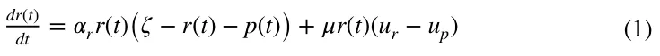

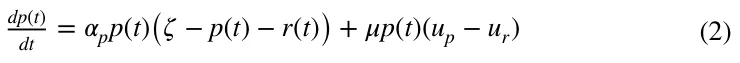

In this version, we assume a linear utility function concerning the public good and private consumption (which is equal to the disposable income of each individual), such that:

*u*r(*t*) = (*휓*r − *휏*r) + *훽*r*휏*r*r*(*t*) + *훽*r (*휏*p − *훾*)*p*(*t*) ∧ *u*p(*t*) = (*휓*p − *휏*p + *훾*) + *훽*p*휏*r*r*(*t*) + *훽*p(*휏*p − *훾*)*p*(*t*)

It is essential to note the assumptions of the model were chosen to maintain general applicability, enabling the model to represent various interest groups beyond the ultra-Orthodox population in Israel, which is the primary focus of this study. For instance, the model assumes that all individuals across population groups contribute tax, even though, in our simulation, members of the interest group do not. Additionally, while the model allows individuals from both population groups the theoretical ability to transition between groups, our simulation makes this economically favorable only for movement from the workers’ group to the ultra-Orthodox group (the interest group). As is standard in economic modeling, some assumptions were simplified to facilitate calculation. An example is the assumption that each tax unit collected corresponds directly to one unit of public goods provision. This fixed conversion ratio is a permissible simplification and can be changed as long as the marginal utility derived by interest group members from each public good unit exceeds that derived by each member of the workers’ group (Alexi et al., 2024).

## 4 Theoretical analysis

In this section, we theoretically analyze the proposed model (Eqs. 1-2). We start by showing that the model has a unique solution and a non-negative population size. Afterward, we identify the model’s equilibria and analyze their stability.

### 4.1 Solution existence and uniqueness

In order to show that the proposed model has a solution and is unique, we utilize the Picard-Lindelöf theorem (Agarwal & Lakshmikantham, 1993). Formally, the Picard-Lindelöf theorem states that if *D ⊂* ℝ × ℝn is a closed rectangle with (*t*0, *y*0) ∈ *D* and *f* ∶ *D* → ℝn is a function that is continuous in *t* and Lipschitz continuous in *y* ; then there exists some *𝜖>* 0 such that the initial value problem:

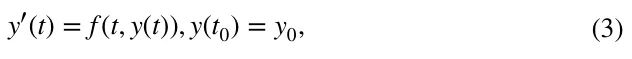

has a unique solution *y*(*t*) on the interval [*t*0 − *휖*, *t*0 + *휖*] . Thus, for our case *y*(*t*) ∶= (*r*(*t*), *p*(*t*)) . In order to use the Picard-Lindelöf theorem, we first need to show that Eqs. (1-2) is continuous in *t* and Lipschitz continuous in *y* . To this end, let us consider a finite duration in time [0, *T*] such that *T <* ∞ . Next, the interaction between the of the unknown solution, *y* , has terms of polynomial forms, the function *f* such that *dy*(*t*)∕*dt* = *f* (*t*, *y*(*t*)) is *C*1 which implies that it also locally satisfies Lipschitz condition and continuous in *t* (Savchenko et al., 2023). Therefore, one can apply the Cauchy-Lipschitz theorem (Schatzman, 2002) which leads to the result of the existence and uniqueness of the solution to Eqs. (1-2), on any finite interval [0, *T*].

### 4.2 Population size non‑negativity

Since the first two equations in Eqs. (1-2) represent population size, we need to make sure these values are non-negative for any non-negative initial condition, and point in time *t* ∈ ℝ+ . To this end, let us assume a non-negative initial condition (*r*(0) ≥ 0, *p*(0) ≥ 0) for the proposed model. Importantly, the sum of the second term in both equations is zero which indicates that individuals move from one sub-population to another. As such, this term can not cause negativity in the population size. In addition, the first term is a logistic equation and therefore takes the following form when solved:

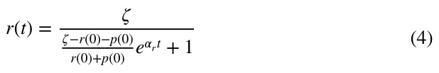

From Eqs. (1-2), one can notice that for any value of *t* , *r*(*t*) is non-negative if and only if *𝜁> r*(0) *>* 0 . In a similar manner, *p*(*t*) ≥ 0 for any value of *t* . As such, the first term is monotonically increasing over *t* , and if the initial condition is non-negative, for any value of *t* the function is non-negative.

### 4.3 Equilibria and stability analysis

In order to better understand the economic properties of the proposed model, we computed the equilibria states of the proposed model and their stability. An equilibrium state is reached when the system does not change without intervention. As such, to compute the equilibria states of the systems, we set the left side of the equations in Eqs. (1-2) to zero and solve for the vector [*r*(*t*), *p*(*t*)] . Following this, one obtains two equilibria states: *r*(*t*) = *p*(*t*) = 0 and *r*(*t*) = *r*∗, *p*(*t*) = *p*∗ , such that

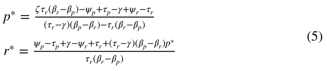

The first one is trivial as no population is present and no dynamics take place. The second case represents the condition in which the population is locally stable since the overall population reached the carrying capacity and the economic state between the two groups is equal so individuals in each of the groups are willing to move between the two.

To obtain the equilibria states’ stability of the two equilibria states, we first compute the Jacobian matrix for the proposed model, following Routh-Hurwitz stability criterion (Parks, 1962):

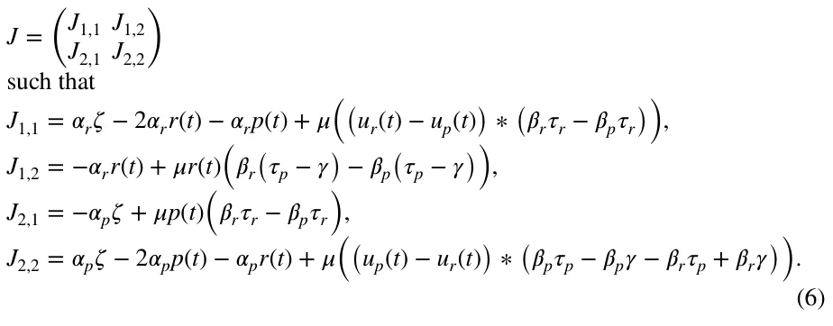

Now, following the Hartman-Grobman theorem (Sternberg, 1993), by setting each equilibrium state to *J* and solving to find the eigenvalues of the obtained matrices, one can obtain the conditions in which the equilibria are stable. Formally, for the first equilibrium, the Jacobian matrix takes the form:

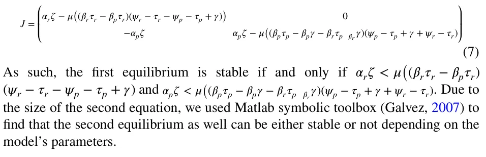

## 5 Results

In this section, we perform *in silico* experiments based on the proposed model, utilized for the case of the ultra-Orthodox Jewish men in Israel. The choice of this group to demonstrate the results of the model was made given the uniqueness of this interest group in the public landscape, both in Israel and in the world (Shami & Akirav, 2020). The powerful influence of the elected members of this group on the decision-makers promised them many benefits, which more than once ignited a powerful public debate, with one benefit standing above them all and guaranteeing the members of the group an allowance if they choose not to work and devote their time to Torah study, something that is perceived by many as not contributing to the national product.

Initially, we find from the literature realistic values for the model’s parameters to obtain realizations of the proposed model. Based on this setup, we explore the system’s dynamics as well as a sensitivity to its parameters.

### 5.1 Experimental setup

To explore the proposed model, we populated the parameters of the model as follows. The annual growth rate of the ultra-Orthodox population in Israel in recent years stood at about 4%, compared to a growth rate of about 1.3% among non- Orthodox Jews. When normalized to a step size of 5.00 ⋅ 10−3 years, one obtains growth rates of 1.76 ⋅ 10−8 and 5.16 ⋅ 10−9 , respectively. The average gross salary for an employed ultra-Orthodox male in 2018 (the most recent figure available in the required segmentation) was NIS 9,165, compared to the average gross salary for an employed non-Orthodox Jewish male of NIS 16,123. Moreover, the size of the Haredi male population between the ages of 18 and 64 in 2019 was 485,863.

The size of the non-Orthodox Jewish population is 3,431,912. The employment rate among ultra-Orthodox men stands at 52%, compared to about 85% among non- Orthodox Jewish men1

The tax amount was calculated according to the income tax rates used in Israel. According to the Israeli Tax Authority (ITA), the tax rate imposed on monthly income between NIS 6791 and NIS 9730 is 14%, between 9,731 and 15,620 NIS is 20%, and between 15,621 and 21,710 NIS, the tax rate is 31%.2 As such, the income tax out the the average salary is 1.17 ⋅ 103.

In December 2019, the Ministry of Finance in Israel published a study showing the benefits lost by an ultra-orthodox man who works to reach NIS 5,400 per month. However, this saving is not all in money and part in kind. Therefore, we will assume that only part of the amount in question can be specified as an allowance (in money) that an unemployed ultra-Orthodox individual receives in our model. For simplicity, we assume a quarter of this amount is set to be allowance, which means *훾* = 1.35 ⋅ 103 . Later, we will perform a sensitivity analysis that will include an increase in the allowance and examine its effect on equilibrium.

As @@for the utility each gains from the public goods, we follow the findings by Prante and Hodge (2013). According to the authors, America’s lowest-income families receive $5.28 worth of government spending (federal, state, and local) for every $1 they pay in total taxes. Middle-income families receive $1.48 in total spending per tax dollar, while America’s highest-income families receive $0.25 cents in spending for every dollar of taxes paid. Thus, we determined the utility that an unemployed ultra-Orthodox individual would generate from the public goods to be 5.28 ⋅ 100 , and for working ultra-Orthodox individuals and non-Orthodox individuals as a weighted average of the results in the study for those with a middle and high income ( 3.33 ⋅ 10−1).

In order to measure how long a sub-population can “carry” the other sub-population, we define the metric *m* such that

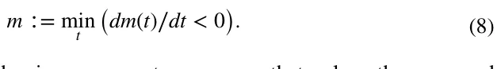

All the results are obtained using a computer program that solves the proposed model (Eq. (1-2)) using the “Forward Euler” method (Kang et al., 2022). The code of the program is freely available in our code repository: https://github.com/teddy 4445/unbalanced\_public\_good\_simulator.

### 5.2 Dynamics

Figure 1 displays the temporal evolution of the non-working ultra-Orthodox Jewish men group ( *p* ) and the working ultra-Orthodox Jewish men and non-Orthodox group ( *r* ). The parameter values employed for this analysis can be found in Table 1.

It is evident from the figure that the size of the ( *r* ) group initially expands, reaching a peak at 29 years, after which it undergoes a decline. This decline is attributed to more individuals transitioning from the ( *r* ) group to the ( *p* ) group, rather than new individuals being born into the ( *r* ) group. Furthermore, the growth rate of the ( *p* ) group demonstrates an increasing trend over time. This is attributed to both an increasing number of individuals being born into the ( *p* ) group and individuals from the ( *r* ) group transitioning to the ( *p* ) group.

Figure 2 presents the utility of both groups, *r* and *p* , over time. This analysis adopted the parameter values presented in Table 1. The utility of the *r* group, *u*r is monotonically decreasing over time, almost reaching zero after 50 years. On the other hand, the utility of the *p* group, *u*p is increasing in the first 36 years which afterward starts to decline. The substantial disparity in utility values among individuals from distinct groups is conspicuous and can be attributed to the chosen structure of the utility function. Specifically, the pronounced impact stems from the significant weight assigned to the public good’s size in determining the utility of non-working individuals within the ultra-Orthodox group (exceeding five times the value of each unit of input directed towards public good production). While the magnitude of this gap is noteworthy, even more critical is the observation that the utility for non-working individuals, reliant on state allowances, reaches a maximum threshold. Beyond this point, the utility diminishes progressively, irrespective of the allowance amount received. This phenomenon arises due to the adverse effects on the public good’s size resulting from a decline in the number of working individuals contributing to the state’s revenue and participating in public goods production.

<figure class="table-figure" id="table-1">
<figcaption><strong>Table 1</strong> The model’s parameter’s description and default values</figcaption>

<table><tr><th>Parameter</th><th>Description</th><th>Default value</th><th>Source</th></tr><tr><td>T</td><td>Simulation duration in years [1]</td><td>50</td><td>Assumed</td></tr><tr><td>Δt</td><td>Step in time in years [1]</td><td>5.00 ⋅10−3</td><td>Assumed</td></tr><tr><td>[r(0), p(0)]</td><td>Initial population size [1]</td><td>[3.91 ⋅106, 2.33 ⋅105]</td><td>THI</td></tr><tr><td>훼r</td><td>r ’s population natural growth rate by step in time [ t]</td><td>5.16 ⋅10−9</td><td>THI</td></tr><tr><td>훼p</td><td>p ’s population natural growth rate by step in time [ t]</td><td>1.76 ⋅10−8</td><td>THI</td></tr><tr><td>휁</td><td>The population’s carrying capacity [1]</td><td>1.00 ⋅107</td><td>Assumed</td></tr><tr><td>휇</td><td>Transition rate between populations by step in time [1]</td><td>3.28 ⋅10−13</td><td>Assumed</td></tr><tr><td>휓r</td><td>r ’s population average income [ NIS]</td><td>1.52 ⋅104</td><td>THI</td></tr><tr><td>휓p</td><td>p ’s population average income [ NIS]</td><td>0.00 ⋅100</td><td>THI</td></tr><tr><td>휏r</td><td>r ’s population average tax [ NIS]</td><td>1.17 ⋅103</td><td>ITA</td></tr><tr><td>휏p</td><td>p ’s population average tax [ NIS]</td><td>0.00 ⋅100</td><td>ITA</td></tr><tr><td>훽r</td><td>r ’s population average utility from public goods [ NIS]</td><td>3.33 ⋅10−1</td><td>Prante and Hodge (2013)</td></tr><tr><td>훽p</td><td>p ’s population average utility from public goods [ NIS]</td><td>5.28 ⋅100</td><td>Prante and Hodge (2013)</td></tr><tr><td>훾</td><td>Average allowance for the p ’s population [ NIS]</td><td>1.35 ⋅103</td><td>MOF</td></tr></table>

</figure>

<figure id="fig-1">
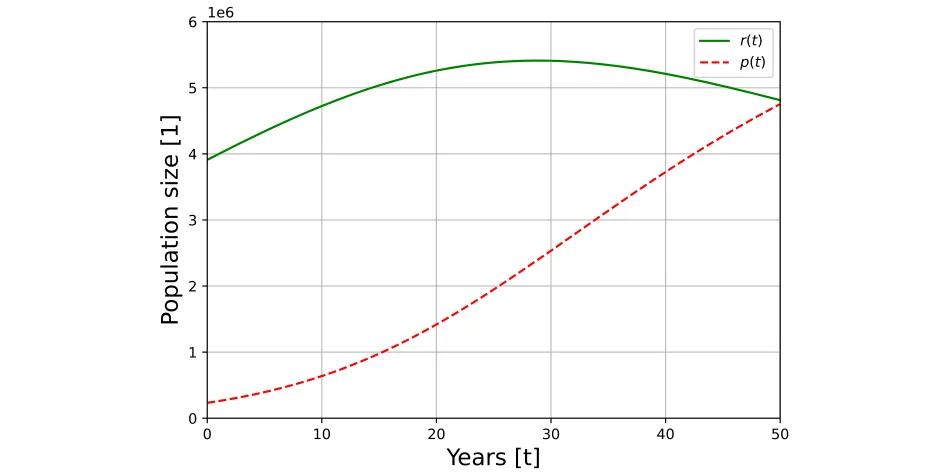
<figcaption><strong>Fig. 1</strong> Dynamics of the system for the proposed case with parameters’ values from Table 1</figcaption>
</figure>

<figure id="fig-2">
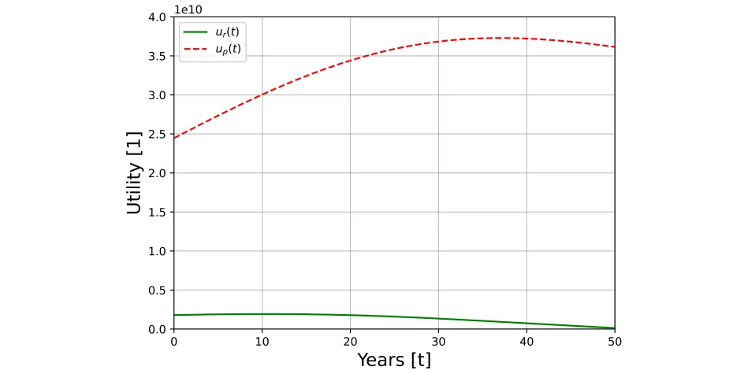
<figcaption><strong>Fig. 2</strong> Dynamics of the utility of each population with parameters’ values from Table 1</figcaption>
</figure>

### 5.3 Sensitivity analysis

Figure 3 depicts the impact of increasing allowances for individuals within the interest group who abstain from labor market participation and dedicate their time to Torah study on their respective utility levels. The analysis assumes a modification solely in the allowance magnitude, holding constant all other parameters of the model at their baseline values, as detailed in Table 1. The specific values of the varied allowances are indicated in the legend box located on the upper left side of the figure.

The utility curves in Fig. 3 capture how modifications in allowance levels impact individual utility over time, reinforcing the sensitivity of the model to changes in financial support for non-working members. The curves reveal a tipping point where increased allowances, while initially beneficial to non-working individuals, begin to reduce overall utility by depleting resources for public goods. This critical threshold, as demonstrated in the Figure, underscores the importance of balanced fiscal policies to prevent destabilization in utility provision.

Figure 4 presents a one-dimensional sensitivity analysis of all the parameters in the proposed model such that each value ranges between 50 and 150% with 10% step size with the average (100%) value is taken from Table 1. The y-axis shows the *m* metric value, ranging between 0 and 50 years, starting with the initial conditions.

Each sub-figure in Fig. 4 isolates a specific parameter to assess its influence on the temporal distance to the turning point. Sub-figure 4a examines how variations in the natural growth rate of the working population extend the sustainability of the societal structure, whereas sub-figure 4b shows that an increase in the growth rate of the interest group expedites the approach to the tipping point, where tax contributions become insufficient to support public goods provision. In sub-figure 4e, changes in the tax rate on working individuals reveal that higher tax burdens, while initially supporting the interest group, eventually accelerate the system’s decline by pushing more individuals toward the non-working group. Sub-figures 4f, h illustrate the effects of altering the utility drawn from public goods by interest group members and the population transition rate between groups, respectively. These factors substantially hasten the arrival at the tipping point, underscoring the significance of public goods utility and inter-group transition rates in determining the model’s overall stability and sustainability.

<figure id="fig-3">
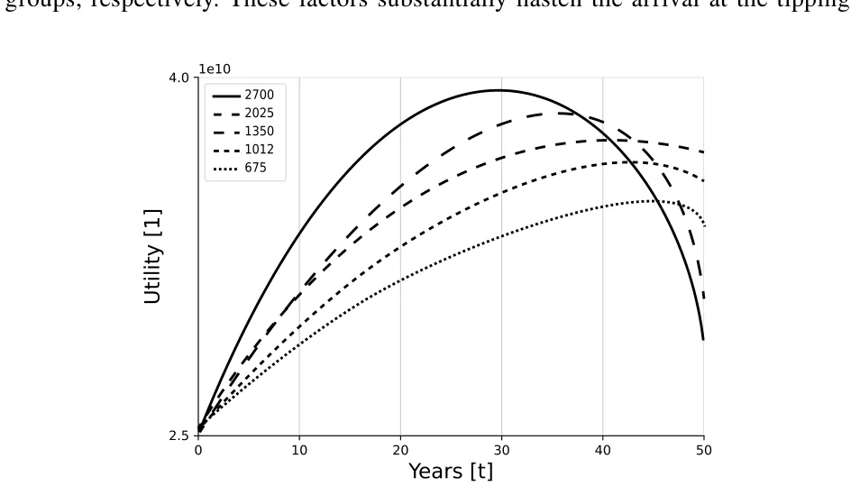
<figcaption><strong>Fig. 3</strong> Dynamics of the utility of an individual from group <em>p</em> (i.e., the ultra-orthodox population) as a function of the amount of the allowance ( <em>훾</em>)</figcaption>
</figure>

<figure id="fig-4">
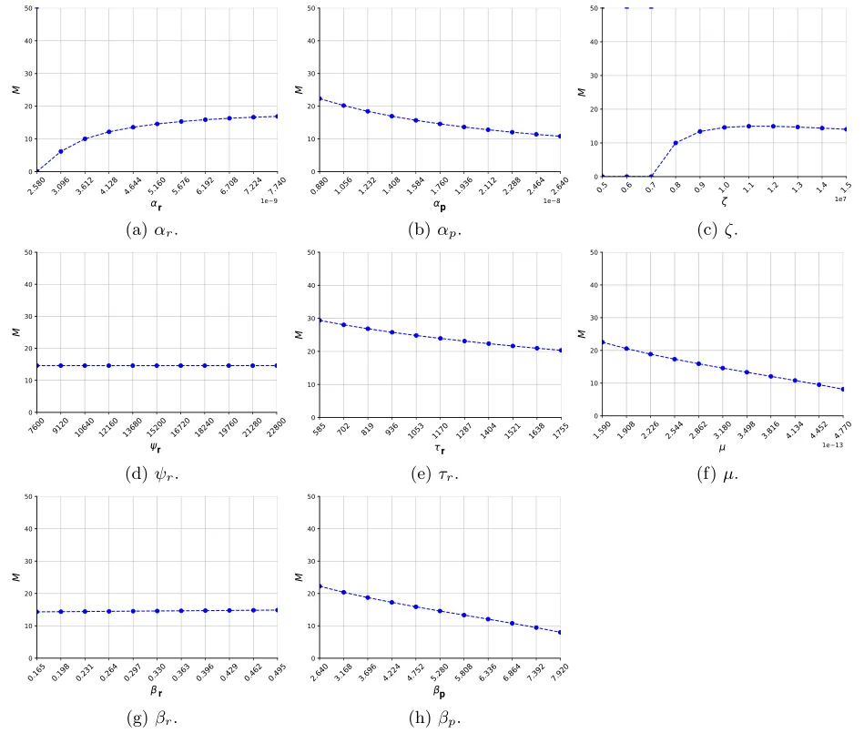
<figcaption><strong>Fig. 4</strong> One-dimensional sensitivity analysis of the proposed model for the model’s parameters with default values from Table 1</figcaption>
</figure>

Figure 5 outlines a two-dimensional sensitivity analysis of all the parameters in the proposed model such that each value ranges between 50% and 150% with 10% step size with the average (i.e., the 100%) value is taken from Table 1. The color indicates the value of the *m* metric.

Each sub-figure in Fig. 5 presents combinations of critical parameters, such as allowance level and the marginal utility from public goods, which are directly referenced in the one-dimensional analyses from Fig. 4. For instance, in sub-figure 5a, adjustments to both the allowance and the marginal utility from public goods reveal that higher marginal utility from public goods for the non-working group intensifies the rate of transition toward the tipping point. This result, as noted in Fig. 4, reflects the heightened influence of public goods utility on individual decisions to remain within the working group. Sub-figure 5b investigates the combined effects of the tax rate and income level of the working group, demonstrating that elevated tax burdens hasten the shift to a state where public good provision becomes unsustainable. Meanwhile, sub-figure 5c explores the interaction between utility derived from public goods within both groups, showing that increased marginal utility from public goods for non-working members drastically accelerates the tipping point. Each combination emphasizes the model’s sensitivity to public good utility and fiscal constraints.

## 6 Discussion

This research explores the dynamics of special interest groups exerting considerable influence relative to the broader population, receiving allowances, and opting out of labor market participation. We propose a novel model that captures the size of these groups as an indicator of thriving associated with economic wellness while taking into consideration the natural growth in the population. We implemented the proposed model for the case of the ultra-Orthodox community in Israel, aligning with the assumptions of the model employed in this study.

A notable aspect lies in integrating public goods into the discourse on how increasing allowances for such interest groups impacts both the general population’s and the group members’ utility. Central to this is the reliance on contributions from working individuals for financing public goods and allowances. Consequently, elevating the allowance for interest group members might diminish tax funds allocated to public good production, potentially detrimenting overall economic utility. This risk materializes if the working population diminishes beyond a critical threshold, compromising the customary societal mechanisms sustaining public good provision and entitlements for the interest group.

The study’s primary revelation highlights the jeopardy faced by the interest group members’ utility as the working population dwindles, leading to a reduction in the provision of public goods. This inference results from integrating the public good’s magnitude within the interest group’s utility function, despite their non-participation in its funding due to their absence from the workforce. This utility function structure enables a multidimensional assessment of the impact of increased entitlements on the interest group members’ utility. Additionally, the analysis indicates that escalating demands from the interest group for higher allowances can hasten a tipping point where the working population decreases, ultimately shrinking the public good’s provision and diminishing the interest group members’ utility.

Figure 1 visually encapsulates a pivotal aspect within our model. It elucidates a scenario where, due to a higher growth rate among the interest group members (e.g., the ultra-Orthodox group, denoted by *p*(*t*) ) in contrast to the working group (e.g., the non-ultra-Orthodox group, denoted by *r*(*t*) ), coupled with a dynamic transition of individuals between these groups aimed at maximizing utility, the proportion of the interest group within the population steadily expands. Conversely, the working group’s size inevitably diminishes. According to the proposed model’s projections, after approximately 29 years, the working group’s size initiates a decline, and around the 50-year mark, parity between the two groups is anticipated, despite the initial disparity where the interest group comprised only about six percent of the working group’s size at the initial condition.

<figure id="fig-5">
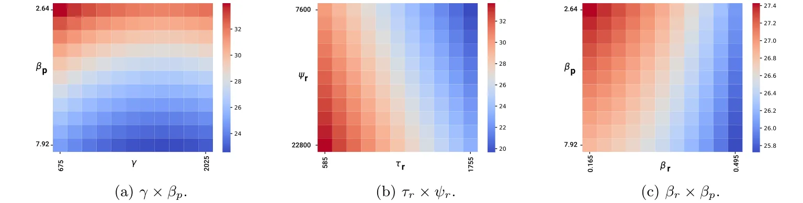
<figcaption><strong>Fig. 5</strong> Two-dimensional sensitivity analysis of the proposed model for the model’s parameters with default values from Table 1. Notes: The direction of increase in the numerical values on the horizontal axis is from left to right, and on the vertical axis it is from top to bottom</figcaption>
</figure>

These findings align with projections from the Central Bureau of Statistics in Israel. According to their high-variant forecasts, within approximately 40 years (by 2065), the ultra-Orthodox population in Israel is expected to reach about 45% of the total Jewish population, closely matching our model’s estimates.3 Furthermore, our model projects a population balance between the ultra-Orthodox and non-ultra- Orthodox communities within roughly 50 years. Unlike the forecasts by the Central Bureau of Statistics, our model incorporates anticipated transitions between these groups, providing a dynamic view of future demographic shifts.

However, the most substantial implication unfolds in Fig. 2. When considering the initial parameters from Table 1, the trajectory of growth in the utility of interest group members ( *u*p(*t*) ) fails to align with the growth rate of the interest group’s size over time. Intriguingly, roughly 36 years into the projection, a decline in the utility of interest group members is evident, despite their expanding numbers and the continued provision of allowances to sustain them outside the labor market. This decline is attributed to the dwindling size of the public good resulting from reduced tax contributions by the diminishing working group, as depicted in Fig. 1. This reduction in tax revenue from the contracting working group, coupled with the interest group’s substantial growth due to a high natural growth rate and the strategic transition of workers pursuing utility maximization, culminates in a scenario where the government’s capacity to sustain the prior level of the public good and simultaneously afford subsistence allowances to the interest group is compromised.

Next, we moved forward to study the sensitivity of the dynamics to various sociological and economic properties. That is, Fig. 3, dedicated to assessing the impact of the allowance allocated to interest group members on their utility, highlights a critical trend. Increasing this allowance hastens the approach toward a turning point where the upward trajectory of utility ceases and gives way to a declining trend that amplifies over time. For instance, a twofold rise in the allowance, from 1350 NIS to 2700 NIS, accelerates the initiation of reduced benefits for interest group members to around 30 years instead of the previously projected 40 years. This outcome stems from the state’s diminished capacity to sustain both an increased allowance and historic levels of public goods provision. This decline results from reduced state income sourced from taxes, consequent to the shrinking working group as individuals transition to the interest group driven by personal benefit maximization. Consequently, efforts by the interest group to increase their allowance, aimed at amplifying their political sway over decision-makers, may paradoxically lead to their detriment and a subsequent decline in their utility.

Figure 4 presents an illuminating comparative analysis. Sub-figures 4a, b inquire the influence of the natural growth rate within each sub-population on the temporal distance to the turning point. Intuitively, an upsurge in the workers’ group’s natural growth rate (sub-figure 4a) extends the sustenance of the societal structure compared to the converse scenario resultant from an escalated natural growth rate within the interest group. For instance, a 50% increase in the interest group’s natural growth rate abbreviates the window for tax receipts from the working group to uphold the societal framework by approximately five years (from 15 years as per Table 1’s value to roughly 10 years).

Analogous trends manifest in sub-figure 4e concerning variations in the tax burden borne by workers. Heightened individual tax payments accelerate the approach toward the tipping point where these payments become inadequate for sustaining robust public goods provision and allowances for the interest group. For instance, a 50% tax increase expedites the turning point’s arrival by nearly 5 years. Despite the augmented tax contributions per worker, this acceleration arises from the reduction in the working group’s size due to individuals transitioning to the interest group in pursuit of utility maximization.

Sub-figures 4f, h further underscore a direct correlation between the utility drawn from the public good by interest group members and the rate of worker-to-interest group transition, with both factors expediting the tipping point. Increasing these parameters by 50% pushes the economy closer to the turning point by over 5 years. This trend isn’t surprising, given their significant roles in reducing the pool of taxpaying workers.

Conversely, the influence of the average income of the working group on reaching the turning point appears marginal (sub-figure 4d). This outcome stems from income alterations wielding a relatively lower impact compared to the substantial role played by the public good’s size in shaping individual working members’ utility. While increased income positively contributes to an individual’s utility, its potency to deter ongoing worker transitions to the interest group, driven by utility maximization, remains limited. This underscores our emphasis on the paramount significance of the public good in shaping individual economic utility.

Simultaneously elevating both allowances and the marginal utility from public goods for the non-working interest group expedites the approach to the tipping point. However, this acceleration primarily hinges on increasing the marginal utility derived from the public good. This becomes evident when allowances increase while holding the marginal utility at its minimum (Sub-figure 5a). The rationale behind this lies in the disproportionately greater impact of the marginal utility of each unit of the public good compared to the marginal effect of the allowance’s size on the non-working individual’s utility. Essentially, a non-working individual reaps substantial utility from the public good, surpassing the utility derived from purchasing private goods through the state-provided allowance.

Moreover, sub-figure 5b sheds light on the influence of the tax burden on the working population concerning their capacity to sustain the societal framework encompassing the non-working segment. Predictably, heightened tax burdens and reduced income shorten the timeframe until the tipping point. Maintaining the tax burden while increasing income lengthens the window until the state’s incapacity to support the non-working group and ensure ongoing benefits to its members. Additionally, an increase in the utility accrued by non-working individuals from the public good contributes to a swifter arrival at the tipping point. These dynamics are effectively illustrated in sub-figures 5a and 5c.

In sub-figure 5c, a pertinent sensitivity analysis delves into individual utility vis-à-vis the public good contingent upon group affiliation. Elevating non-working interest group members’ utility from the public good tends to expedite the arrival at the turning point, potentially accelerating the shift from the working group to the non-working segment. However, a surprising convergence emerges wherein, despite amplified utility from the public good within the working group, consistent timing of the turning point challenges conventional economic expectations. Typically, heightened utility reinforces group affiliation, yet the disparity persists: the utility gains within the working group, while significant, notably lag behind those of non-working members. This discrepancy perpetuates the transition from workers to nonworkers, adversely affecting the public good. Paradoxically, increased individual utility within the working group exacerbates their impact on the public good and incentivizes their shift to the non-working group, where the comparatively diminished public good offers relatively greater benefits. This intricate dynamic underscores the model’s complexity, accentuating the paramount role of the public good in shaping outcomes. Sub-figure 4g reinforces this insight, showcasing that alterations in the utility derived from the public good among working individuals (with no change in the rest of the model’s parameters) have minimal impact on the economy’s pace toward the tipping point.

## 7 Conclusion

This study explored the intricate dynamics of special interest groups, specifically the ramifications of their increased influence on both the broader population and the utility of their members. The investigation centers on interest groups whose members receive allowances while opting out of the labor market, specifically focusing on understanding the consequences of increasing these allowances on individual utility. Employing an innovative differential equation-based model that integrates public goods, the research underscores the significance of contributions from working individuals in funding both public goods provision and allowances.

Applied to the context of the ultra-Orthodox community in Israel, the study sheds light on the vulnerability of interest group members’ utility as the working population diminishes, leading to a subsequent reduction in the provision of public goods. Notably, the findings suggest that escalating demands for higher allowances could propel the system towards a tipping point, wherein the working population decreases, ultimately diminishing the provision of public goods and impacting interest group members’ utility.

The sensitivity analyses further accentuate the intricate relationships between key variables such as allowances, tax burdens, utility, and the tipping point, underscoring the paramount role of the public good in shaping economic outcomes. Results suggest that as allowances rise, individuals from the working group increasingly shift to non-working status, thereby destabilizing the provision of public goods and utility. The study provides valuable insights into the consequences of politically driven resource allocation, highlighting the risks of excessive allowances and the importance of balanced fiscal policy in preserving societal welfare and economic stability.

A distinctive contribution of this research lies in its exploration of the paradoxical impact of increased transfer payments to interest groups that constitute a considerable share of the population. While such payments enhance the consumption of private goods by group members, they simultaneously deplete the resources available for public goods. This duality compromises the overall utility of both taxpayers and interest group members, revealing unforeseen consequences associated with the pursuit of higher allowances driven by political leverage.

To mitigate the adverse effects revealed in this study, policy recommendations include implementing a balanced approach to fiscal allocations for allowances. Governments should consider capping allowance increases to ensure that tax revenue remains sufficient to sustain public goods provision. Additionally, policies could encourage partial labor market participation for non-working ultra-Orthodox men studying in Yeshiva to enhance their economic self-sufficiency. Introducing tax incentives for working individuals might also alleviate the burden on the public sector by expanding the working tax base and thereby enhancing the long-term sustainability of public goods and services.

Acknowledging certain limitations, the study points to the oversimplification of individual decision-making processes and the potential impact of fixed-parameter assumptions that may not account for real-world variations over time. To enhance the robustness of this field, future research avenues could inquire into the nuanced motivations behind individual choices, consider dynamic parameters reflecting real-world shifts, and changes in political influence, and conduct comparative analyses across different interest groups or nations to offer a more comprehensive understanding of the intricate interplay between interest group entitlements, public goods provision, and societal sustainability. Furthermore, incorporating qualitative research on the motivations of individuals within interest groups to transition between working and non-working roles could enhance understanding of behavioral responses to policy changes. In addition, following the recent developments in data-driven methods, in general, and machine learning methods, in particular (Shami & Lazebnik, 2024; Lazebnik et al., 2023; Lazebnik, 2024), integrating such methods to bridge between collected data and extensions of the proposed models can be a promising approach. Finally, the proposed model lacks empirical validation due to the lack of available data. Future studies should remedy this limitation by collecting the relevant utility data and evaluating the model’s historical performance.

**Author contributions** Labib Shami: Conceptualization, Formal analysis, Investigation, Validation, Writing - Original Draft, Writing - Review & Editing. Teddy Lazebnik: Methodology, Software, Formal analysis, Investigation, Visualization, Writing - Original Draft, Writing - Review & Editing.

**Funding** This study has not received any funding or grants.

**Data availability** The data that has been used in this study is publicly available and the relevant resources are cited.

### Declarations

**Conflict of interest** The authors declare that they have no conflict of interest.

## Notes

1 For more data please refer to The Haredi Institute (THI) at https://data.machon.org.il/dashbords/emplo yment/.

2 https://www.gov.il/en/departments/topics/income\_tax\_israel\_tax\_authority/govil-landing-page.

3 For more details please refer to: https://www.cbs.gov.il/he/publications/doclib/2019/forcast65/2065/sum\_tab2015\_65.pdf.

## References

- Agarwal, R. P., & Lakshmikantham, V. (1993). Uniqueness and nonuniqueness criteria for ordinary differential equations. World Scientific.
- Aizer, A., Eli, S., Ferrie, J., & Lleras-Muney, A. (2016). The long-run impact of cash transfers to poor families. American Economic Review, 106(4), 935–971.
- Alexi, A., Lazebnik, T., & Shami, L. (2024). Microfounded tax revenue forecast model with heterogeneous population and genetic algorithm approach. Computational Economics, 63, 1705–1734.
- Allern, E. H., Aylott, N., & Christiansen, F. J. (2007). Social democrats and trade unions in Scandinavia: The decline and persistence of institutional relationships. European Journal of Political Research, 46(5), 607–635.
- Allern, E. H., & Bale, T. (2012). Political parties and interest groups: Disentangling complex relationships. Party Politics, 18(1), 7–25.
- Anand, P. B. (2004). Financing the provision of global public goods. The World Economy, 27(2), 215–237.
- Bastian, J., & Michelmore, K. (2018). The long-term impact of the earned income tax credit on children’s education and employment outcomes. Journal of Labor Economics, 36(4), 1127–1163.
- Bergstrom, T., Blume, L., & Varian, H. (1986). On the private provision of public goods. Journal of Public Economics, 29(1), 25–49.
- Campbell, J. Y., & Mankiw, N. G. (1991). The response of consumption to income: A cross-country investigation. European Economic Review, 35(4), 723–756.
- Carpenter, J. P. (2007). Punishing free-riders: How group size affects mutual monitoring and the provision of public goods. Games and Economic Behavior, 60(1), 31–51.
- Carroll, C. D. (2001). A theory of the consumption function, with and without liquidity constraints. Journal of Economic perspectives, 15(3), 23–45.
- Chaqués-Bonafont, L., Cristancho, C., Muñoz-Márquez, L., & Rincón, L. (2021). The contingent character of interest groups-political parties’ interaction. Journal of Public Policy, 41(3), 440–461.
- Coates, D., & Heckelman, J. C. (2003). Absolute and relative effects of interest groups on the economy. In Collective choice: Essays in honor of Mancur Olson (pp. 129–142). Springer.
- Coates, D., Heckelman, J. C., & Wilson, B. (2011). Special-interest groups and growth. Public Choice, 147, 439–457.
- Cole, I. M. (2015). Interest group activity and economic growth: Some new evidence from the US states. Applied Economics Letters, 22(10), 825–829.
- De Mesquita, B. B., Smith, A., Siverson, R. M., & Morrow, J. D. (2005). The logic of political survival. MIT Press.
- Deacon, R. T. (2009). Public good provision under dictatorship and democracy. Public Choice, 139, 241–262.
- Dhami, S., Wei, M., & Al-Nowaihi, A. (2019). Public goods games and psychological utility: Theory and evidence. Journal of Economic Behavior & Organization, 167, 361–390.
- Diacon, P.-E., & Maha, L.-G. (2015). The relationship between income, consumption and GDP: A time series, cross-country analysis. Procedia Economics and Finance, 23, 1535–1543.
- Dincer, O. (2012). Special interest groups and economic growth in the United States. Eastern Economic Journal, 38, 434–448.
- Epstein, G. S., & Mealem, Y. (2009). Group specific public goods, orchestration of interest groups with free riding. Public Choice, 139, 357–369.
- Epstein, G. S., & Nitzan, S. (2006). Lobbying and compromise. Public Choice, 126(3–4), 317–330.
- Falkinger, J., Fehr, E., Gächter, S., & Winter-Ebmer, R. (2000). A simple mechanism for the efficient provision of public goods: Experimental evidence. American Economic Review, 91(1), 247–264.
- Galvez, A. (2007). Numerical-symbolic Matlab program for the analysis of three-dimensional chaotic systems. In International conference on computational science, Berlin, Heidelberg (pp. 211–218). Springer.
- Garfinkel, I., Sariscsany, L., Ananat, E., Collyer, S. M., Hartley, R. P., Wang, B., & Wimer, C. (2022). The benefits and costs of a US child allowance. Technical report, National Bureau of Economic Research.
- Gilens, M., & Page, B. I. (2014). Testing theories of American politics: Elites, interest groups, & average citizens. Perspectives on Politics, 12(3), 564–581.
- Groves, T., & Ledyard, J. (1977). Optimal allocation of public goods: A solution to the “free rider’’ problem. Econometrica: Journal of the Econometric Society, 45, 783–809.
- Heckman, J. (1974). Life cycle consumption and labor supply: An explanation of the relationship between income and consumption over the life cycle. The American Economic Review, 64, 188–194.
- Hellwig, M. F. (2003). Public-good provision with many participants. The Review of Economic Studies, 70(3), 589–614.
- Holcombe, R. G. (2021). Elite influence on general political preferences. Journal of Government and Economics, 3, 100021.
- Hoynes, H., Schanzenbach, D. W., & Almond, D. (2016). Long-run impacts of childhood access to the safety net. American Economic Review, 106(4), 903–934.
- ILO. (2021). World social protection report 2020–22: Social protection at the crossroads-in pursuit of a better future. International Labour Office.
- Jindapon, P., & Yang, Z. (2020). Free riders and the optimal prize in public-good funding lotteries. Journal of Public Economic Theory, 22(5), 1289–1312.
- Kang, X., Wang, S., Zeng, J., & Zhao, Y. (2022). Forward Euler method for ordinary differential equations. In H.-M. Yin, K. Chen, M. R., T. A. Oliveira, & N. Lin (Eds.), International Conference on Statistics, Applied Mathematics, & Computing Science (CSAMCS 2021) (Vol. 12163, p. 121632U). International Society for Optics and Photonics.
- Katz, R. S., & Mair, P. (1995). Changing models of party organization and party democracy: The emergence of the cartel party. Party Politics, 1(1), 5–28.
- Kemp, S. (1991). Magnitude estimation of the utility of public goods. Journal of Applied Psychology, 76, 533–540.
- Lazebnik, T. (2024). Going a step deeper down the rabbit hole: Deep learning model to measure the size of the unregistered economy activity. Computational Economics, 2024, 1–16.
- Lazebnik, T., Fleischer, T., & Yaniv-Rosenfeld, A. (2023). Benchmarking biologically-inspired automatic machine learning for economic tasks. Sustainability, 15(14), 11232.
- Marwell, G., & Ames, R. E. (1979). Experiments on the provision of public goods. I. Resources, interest, group size, & the free-rider problem. American Journal of Sociology, 84(6), 1335–1360.
- Mulligan, G. F. (2006). Logistic population growth in the world’s largest cities. Geographical Analysis, 38(4), 344–370.
- Nave, O. (2020). Modification of semi-analytical method applied system of ode. Modern Applied Science, 14(6), 75.
- Olson, M. (1982). The rise and decline of nations: The political economy of economic growth, stagflation, & social rigidities. Yale.
- Ozono, H., Jin, N., Watabe, M., & Shimizu, K. (2016). Solving the second-order free rider problem in a public goods game: An experiment using a leader support system. Scientific Reports, 6, 38349.
- Palekar, S. (2014). Interest groups in modern political system: A comparative study. Indian Journal of Public Administration, 60(2), 332–340.
- Parks, P. (1962). A new proof of the Routh-Hurwitz stability criterion using the second method of Liapu-nov. Mathematical Proceedings of the Cambridge Philosophical Society, 58(4), 694–702.
- Prante, G., & Hodge, S. (2013). The distribution of tax and spending policies in the united states. Special Report number 211, Tax Foundation.
- Price, D.J., Song, J., et al. (2018). The long-term effects of cash assistance. Industrial Relations Section working paper 621.
- Roberts, R. D. (1987). Financing public goods. Journal of Political Economy, 95(2), 420–437.
- Samuelson, P. A. (1954). The pure theory of public expenditure. The Review of Economics and Statistics, 36(4), 387–389.
- Savchenko, E., Rosenfeld, A., & Bunimovich-Mendrazitsky, S. (2023). Mathematical modeling of BCG-based bladder cancer treatment using socio-demographics. Scientific Reports, 13, 18754.
- Schatzman, M. (2002). Numerical analysis: A mathematical introduction. Oxford Univ. Press.
- Schmieder, J. F., & Von Wachter, T. (2016). The effects of unemployment insurance benefits: New evidence and interpretation. Annual Review of Economics, 8, 547–581.
- Shami, L., & Akirav, O. (2020). The political economy of religion and labor (pp. 1–24). Springer International Publishing.
- Shami, L., & Lazebnik, T. (2024). Implementing machine learning methods in estimating the size of the non-observed economy. Computational Economics, 63, 1459–1476.
- Shapiro, D. A. (2009). The role of utility interdependence in public good experiments. International Journal of Game Theory, 38, 81–106.
- Sternberg, N. (1993). A Hartman-Grobman theorem for a class of retarded functional differential equations. Journal of Mathematical Analysis and Applications, 176(1), 156–165.
- Stiglitz, J. E. (1977). The theory of local public goods. In The economics of public services: Proceedings of a conference held by the International Economic Association at Turin, Italy( pp. 274–333). Springer.
- Wang, C., Wang, N., & Yang, J. (2016). Optimal consumption and savings with stochastic income and recursive utility. Journal of Economic Theory, 165, 292–331.
- Williams, A. (1966). The optimal provision of public goods in a system of local government. Journal of Political Economy, 74(1), 18–33.
- Wonka, A. (2022). Policy and constituency frames in the advocacy of political parties and interest groups in policy-making. Journal of European Public Policy, 31, 352–373.
- Springer Nature or its licensor (e.g. a society or other partner) holds exclusive rights to this article under
- a publishing agreement with the author(s) or other rightsholder(s); author self-archiving of the accepted
- manuscript version of this article is solely governed by the terms of such publishing agreement and
- applicable law.
