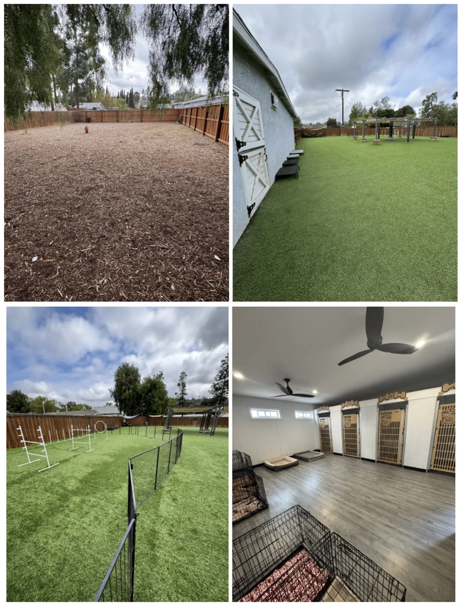
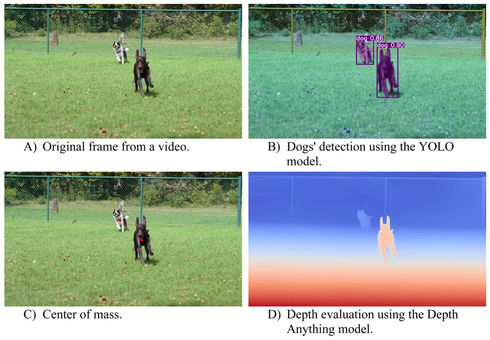

## Introduction

Social play is a widespread phenomenon among mammals (Sharpe, 2019; Hughes, 2021), believed to offer crucial opportunities for the development and practice of socio-cognitive and motor skills (Smith, 1982; Palagi, 2018; Spinka et al., 2001). As a result, multiple mammals have developed communicative behaviors (such as relaxed open-mouth displays and play bows) and mechanisms that facilitate the initiation and termination of play sessions, as well as the modulation of different types of play (Bekoff, 1972; Davila-Ross and Palagi, 2022). For instance, many mammal species engaging in social play demonstrate rapid behavioral mimicry during their interactions, particularly when displaying visual signals such as facial expressions and positional behaviors (Palagi et al., 2015, 2016; Palagi and Scopa, 2017; Davila-Ross and Palagi, 2022; Cordoni et al., 2025). Behavioral mimicry is hypothesized to improve predictive accuracy, helping individuals better understand their play partner's internal motivations and external behaviors (Diana and Kret, 2025; Baimel et al., 2015). This enhanced understanding could then enable individuals to respond effectively to their peers during interactions, which may involve adjusting the properties (such as intensity and duration) of the play session (Mancini et al., 2013; Palagi and Scopa, 2017; Bresciani et al., 2022). To maximize opportunities for refining socio-cognitive and motor skills with social play, it is also essential to strategically select play partners when possible. Juvenile mammals typically prefer to play with others of similar age, sex, size, and in some species, also with individuals of similar social rank and kinship (Ham and Pellis; 2024). We will refer to this phenomenon as “trait matching” from here on out (Smith, 1982).

Engaging in play with similar partners could facilitate smoother social interactions, as conspecifics may be more relatable and predictable. Trait matching can also promote balanced interactions during rough-and-tumble play sessions by reducing the likelihood of unfair \*\* Corresponding author at: Research Center for Human-Animal Interaction, College of Veterinary Medicine, University of Missouri, Columbia, MO, USA.

1558-7878/© 2026 Elsevier Inc. All rights are reserved, including those for text and data mining, AI training, and similar technologies.

advantages during the exchange of self-handicapping behaviors (Lutz et al., 2019; Spinka et al., 2001). Furthermore, playing with similar partners may enhance self-assessment of essential socio-cognitive and motor skills (Thompson, 1998), strengthen social bonds (Shimada and Sueur, 2018; Davila-Ross and Palagi, 2022), and create opportunities for establishing future relationships while navigating social hierarchies (Bagnato et al., 2023), although these effects vary between species. For example, in some primates like *Macaca fuscata*, social play has been shown to strengthen social bonds (Shimada and Sueur, 2018). In contrast, in mammals such as *Suricatta suricatta*, no connection has been established between social play and key social bonding activities like allogrooming (Sharpe, 2005). These differences may be largely attributed to the fact that different kinds of play exist (Burghardt, 2011) and can serve multiple functions (Smith, 1982; Palagi, 2018; Spinka et al., 2001), and these functions largely depend on the socio-ecology of the species. Additionally, the ability to act on partner preferences is largely dependent on the unique socio-ecology of the species and the composition of the social group (Ham and Pellis, 2023). Partner preferences can only be exercised if there are enough potential partners to choose from, which may be a difficult task for species that are semi-solitary or solitary (Brooks and Burghardt, 2023).

Additional studies are needed to determine how behavioral mimicry and trait matching influence play regulation across species in varying social and ecological settings. Behavioral mimicry during play has been the subject of considerable research in recent years (for a review, see Wu et al., 2025; Davila-Ross and Palagi, 2022). Trait matching has not been studied extensively, although it could provide valuable insights into predicting and responding to conspecific behaviors during play. Only a handful of studies have systematically examined partner preferences regarding biological and behavioral traits during play in primate (*Cebus apella* (Lutz et al., 2019), *Chlorocebus pygeryth*us (Funk et al., 2024), *Papio hamadryas* (Lutz et al., 2019), *Propithecus diadema* (Lutz et al., 2019) and non-primate (*Capra ibex sibirica*, Byers, 1980), *Hippotragus niger* (Thompson, 1996), *Rattus norvegicus* (Ham and Pellis, 2023; Ham and Pellis, 2024) species. The biological and behavioral variables examined often vary between studies. Some research predominantly emphasizes biological characteristics, such as age, sex, and genetic relatedness (Thompson, 1996; Byers, 1980; Lutz et al., 2019). Other studies focus more on behavioral traits, including sociability, group membership, and social ranking (Lutz et al., 2019; Funk et al., 2024; Ham and Pellis, 2023, 2024). Not all studies aim to empirically test whether trait matching occurs and, if so, to what extent across specific biological and behavioral variables.

To this end, the current study addresses this gap in the research literature by assessing partner preferences in domesticated dogs (*Canis lupus familiaris*) during intraspecific play interactions when dogs have free choice (i.e., during open play sessions). Dogs are an ideal focus for this study for three main reasons. First, play behavior has been extensively documented during intraspecific social interactions (Ward et al., 2008; Palagi et al., 2015; Cordoni et al., 2016; Mehrkam et al., 2017). Second, dogs continue to play with other dogs well into adulthood, providing multiple opportunities to observe instances of trait matching (Bradshaw et al., 2015; Sommerville et al., 2017). Finally, previous studies have shown evidence of behavioral mimicry in dogs (both facial and body), which helps improve predictive accuracy and modulate the duration and intensity of play sessions (Palagi et al., 2015; Maglieri et al., 2020). Therefore, it is reasonable to assume that trait matching may also occur and could potentially serve similar functions. It is important to note that one prior study has examined partner preferences among domesticated dogs (Ward et al., 2008). However, the research primarily focused on the establishment of partner preferences through the lens of asymmetric play behaviors, such as self-handicapping (Ward et al., 2008). Play opportunities were limited to members of the same litter, which made it difficult to assess the potential preferences of unrelated dogs or preferences based on age (Ward et al., 2008).

Consistent with previous studies, we investigate how trait matching influences the duration of play bouts (Mancini et al., 2013; Palagi and Scopa, 2017; Bresciani et al., 2022). A novel contribution of our current study is the examination of how trait matching also affects spatial proximity between dyads during play interactions. Different types of play can be initiated, including rough-and-tumble play and chase play (Palagi et al., 2016; Marley et al., 2022). Rough-and-tumble play in dogs typically involves close spatial proximity, while chase play occurs at a greater distance (Bekoff, 2015). Notably, individuals often shift rapidly between these two forms of play (Bekoff, 2015). Rough-and-tumble play necessitates significant coordination between dogs for effective engagement (Ward et al., 2008; Cordoni et al., 2016). This type of play involves alternating between assertive behaviors and self-handicapping actions. Trait matching between the dogs may facilitate this coordination, enhancing the overall play experience. In this study, we utilize average distance measurements between dyads as an indicator of engagement in rough-and-tumble play, employing advanced AI-based computer vision methods. In addition, we use these techniques to evaluate the frequency of previously described prosocial play behaviors in dogs, such as face biting (which we refer to as head-to-head contact) and tail sniffing (which we refer to as head-tail contact), as well as to estimate the body size of each dog (Ward et al., 2008; Smuts, 2014; Bekoff, 2015; Holcova et al., 2021). To maintain consistency with previous research, we also examine how other biological traits (age, sex) and behavioral traits (rearing history) affect the duration and average distance between dogs during intraspecific play (Ward et al., 2008;

Smuts, 2014; Cordoni et al., 2016).

Based on this information, we have generated two sets of predictions for our current study, one for biological traits and one for behavioral traits:

- **Prediction 1 (P1):** The duration of play sessions will be longer when both dogs share similar biological (size, age, sex) and behavioral (head-to-head contact, head-to-tail contact, rearing history) traits.
- **Prediction 2 (P2):** The average ***distance*** between dogs will be shorter (indicating more rough-and-tumble play) when both dogs share similar biological (size, age, sex) and behavioral (head-to-head contact, head-to-tail contact, rearing history) traits.

The findings of our study enhance our understanding of the functional significance of play partner preferences. Moreover, they offer practical applications for guardians caring for multiple dogs simultaneously, which is common in training facilities, boarding centers, veterinary practices, and shelters or rescues. Understanding canine play preferences can enhance various aspects of dog care, including improving compatibility in group settings and helping to develop customized training approaches that engage dogs more effectively. This knowledge could also aid in enhancing the welfare of animals by reducing stress and promoting mental stimulation through appropriately tailored play sessions. Finally, our findings may offer guidance with the creation of safe and balanced environments by helping guardians choose compatible play partners for their dogs, minimizing the risk of aggressive behaviors.

## Methods

## Data collection

Our study was conducted in accordance with the NC3R’s ARRIVE guidelines and the Association for the Study of Animal Behaviour’s guidelines for the treatment of animals in behavioral research (2020). Further information regarding our data collection protocols can be found below.

## Field site

Our study took place at the Crafty Canine Club, a large 9,500 square-foot dog training and boarding facility in San Diego, California. We decided to collect our data at this facility for three main reasons. First, the facility was developed in collaboration with several animal care professionals, including the Assistant Curator of the San Diego Safari Park, the Birds of Prey Director at the San Diego Zoo, and an Aquatics Specialist from the Birch Aquarium. These consultations ensured that safety, comfort, and, most importantly, natural social interactions could take place. Second, the facility features four separate play yards (totaling 6,500 square feet), allowing for ample opportunities to observe intraspecific play. Each play yard is equipped with a variety of enrichment items, such as tunnels, ramps, and agility structures (such as weave poles, jumps, and platforms). These items are sterilized and rotated twice daily to provide diverse opportunities for different types of play, including chase play, rough-and-tumble play, and object play. Finally, play sessions are conducted according to a consistent daily schedule, with three 60-minute play sessions (comprised of different dogs) held in structured settings. A trained behavior consultant supervises all play sessions, maintaining a maximum ratio of one trainer for every 15 dogs. This also helps to ensure that many opportunities for play can occur safely. Trainers respond at the first signs of stress or escalation by using redirection or brief removal to ensure safety and prevent aggression. If a dog appears uncomfortable and no longer wants to remain in the yard or participate in a play session, they can be taken to a 2500 square-foot yard for potty breaks and safe sensory exploration, or to their private boarding room. The boarding room features soft-corner crates, couches, and pre-approved enrichment items. Dogs are also housed in their private boarding rooms when they are not playing, exploring, or participating in training sessions. Dogs have continuous access to water throughout the facility, including the play yards, and are fed multiple times each day according to their dietary needs and the preferences of their guardians (Fig. 1).

## Play sessions

Before dogs are allowed to participate in play sessions, they must stay at the facility for at least 48 h. This acclimation period helps the dogs adjust to the environment and also reduces behaviors associated with novelty or displacement. Once the 48-hour residency period is complete, dogs are permitted to take part in play sessions, which are available year-round, depending on the weather. Adverse conditions, such as rain or extreme heat, may lead to shorter outdoor playtimes or the implementation of indoor enrichment activities. Prior to entering the play yard, all dogs spend 5–10 min in a 2,500 square-foot sensory exploration yard to help them acclimate to the outdoor setting and settle in before joining the group. When assigned to playgroups and outdoor play yards, dogs have the freedom to choose whether they want to play and decide with whom they wish to play with. Trained behavior consultants only intervene if they notice signs of distress, discomfort, or arousal; they do not directly engage with the dogs or encourage them to play with one another. A maximum of 15 dogs is assigned to each yard, with the group size varying between 10 and 15 on any given day. A three-hour decompression period followed each play session, during which dogs rested in temperature-controlled boarding rooms that featured dim lighting, sound machines, and soft bedding to promote recovery and relaxation.

<figure id="fig-1">

<figcaption><strong>Fig. 1.</strong> A series of photos showcases the three main areas of the Crafty Canine Club. The top left photo displays the dog sensory and relief area. The top right and bottom left images feature two of the four play yards, highlighting agility structures and shaded areas within those spaces. The bottom right image shows the private boarding rooms where dogs stay when they are not in the relief/sensory area, play area, or one of the designated training areas.</figcaption>
</figure>

Although the Crafty Canine Club operates as a boarding environment, there are specific safeguards in place to ensure voluntary and positive play for all dogs. Each dog is placed on a daily schedule: wake-up is at 8 a.m., playtime starts at 9 a.m., feeding occurs at 11 a.m., there is a rest period in the middle of the day, playtime resumes at 4 p.m., another feeding occurs at 6 p.m., and the final potty break is at 10 p.m. Each yard and individual crate/room has fresh water available at all times. All play areas provide shade, rest zones, and optional exits for dogs that show signs of disinterest, such as retreating, cowering, avoiding interaction, or lingering by the gate. Dogs can return to their indoor rooms whenever they wish, and participation in play is entirely voluntary. Although the composition of playgroups is contingent upon who is being boarded on a given day, there are multiple dogs who frequently stay at the boarding facility, providing some opportunities for social consistency. Furthermore, the maximum number of dogs allowed in a given play area remains consistent, ensuring some social stability in the organizational structure.

## Consent procedures and data privacy

Video recordings were used to collect data during play sessions. Before their initial booking, all dog guardians receive a media and participation waiver that grants permission for these video recordings, which are part of the facility’s standard care and training process. A copy of the participation waiver can be found in the **electronic supplement**. The videos serve two main purposes. First, they are routinely evaluated by trained behaviorists and shared with guardians to provide updates on training progress, behavior, and daily activities. Second, the videos are used for non-invasive studies related to dog behavior and cognition. All dogs included in our study had guardians who signed the liability waiver. Recordings are securely stored on password-protected servers managed by the facility and are reviewed for research purposes under the same consent agreement. Access to the recordings is limited to trained researchers and facility staff only. All video footage is de-identified, ensuring that no guardian information is linked to the dogs. The facility follows strict protocols for privacy, data security, and the responsible handling of all recorded material.

All video footage used in this study was collected using an iPhone 12 Pro Max by the facility owner (the first author of the current study, DC). Handheld recording was selected instead of static filming because dogs can move around the yard, making it challenging to capture their activities with fixed cameras. Additionally, static cameras risk capturing the same interactions from multiple angles, leading to redundant observations during coding. These recordings were made opportunistically during daily welfare and facility checks by DC during play sessions. Filming commenced only when a dyad engaged in intraspecific play, and concluded once play concluded. The first author concentrated on one dyad at a time during their play sessions, only switch to observing a different dyad once the initial play session had concluded and the new dyad had begun their session. These recording approaches were particularly useful in the yards, especially when the dogs were spread out and not all were playing simultaneously. It allowed the first author to move freely around the play area and to record observations only during instances of play between individuals of the same species. The first author also maintained consistent framing and a clear line of sight while minimizing disruption. Digital zoom was not used, and the first author captured all footage to ensure consistency

All videos were collected between February 2, 2023, and March 1, 2025.All recordings were uploaded to a password-protected Google Drive, accessible only to trained behaviorists and research staff. While audio was retained to provide contextual cues, it was not included in the analysis. No identifying information about the owners was recorded, and any visible identifiers were blurred or cropped prior to coding.

## Data coding

## Intraspecific play bouts

When dogs are in the play yard participating in play sessions, they may or may not engage in play with each other. Therefore, our first step was to review video footage from all four play yards and edit it to include only intraspecific play bouts. A ***play bout*** was defined as a continuous sequence of reciprocal play behaviors between two dogs lasting a minimum of ten seconds. Behaviors qualifying as play included play bows, chase, role reversals, and other positive social cues such as relaxed postures, soft eyes, and natural tail carriage (Cordoni et al., 2016; Bradshaw et al., 2015; Byosiere et al., 2018). Video footage was trimmed just before the play bout began and shortly after it concluded, with at least 10 s of pause during which no play behaviors were exhibited by either dog (Cordoni et al., 2016). Partial play bouts, which only featured the beginning, middle, or end of the play bout within the frame, were removed from our final video corpus. Using these protocols, we identified a total of 181 play bouts, a sample size consistent with other previously published studies on dog play behaviors (Cordoni et al., 2016). These videos feature play bouts involving 115 unique dogs, of which 47% (N=55) were female and 82.76% (N=96) were spayed or neutered. These 115 dogs spanned across 51 distinct breeds, including both purebred and mixed breeds.

## Independent biological variables

For each of our 181 play bouts, the identities of the dogs involved were documented by the first author, DC, who is also the owner of the Crafty Canine Club and is very familiar (~8500 working hours) with all the dogs. Using this information, DC was able to further categorize the dogs by their age, sex, and size. The ***age*** of each dog was classified using the following system (using guidelines from the American Kennel Club; 2016): puppy (under 6 months), adolescent (1–3 years), adult (3–6 years), and mature (over 6 years). ***Sex*** was classified as a binary variable: male or female. Finally, the ***size*** was classified using the following system (also using guidelines from the American Kennel Club; 2016): small (*<*20lbs), medium (25–50 lbs), or large (*>*50lbs). When in doubt about the size of a dog, a “unknown” category was created and used. Our visual AI model then assigned each dog to a size class (small, medium, large, or unknown) based on this pre-defined reference list.

Our study focuses on trait matching based on age, sex, and size. To facilitate this analysis, we also created binary variables in our data sheet for each of these biological traits. If both dogs involved in a play bout share the same trait for a specific category (such as both being female), they are assigned a score of 1 for matching. If they differ in that category, they receive a score of 0.

## Independent behavioral variables

Using the information about the identities of the dogs involved in the 181 play bouts, DC was able to gather and code details regarding each dog's rearing history using intake paperwork and owner-provided background details. ***Rearing history*** was categorized as a binary variable, indicating whether the dog was a rescue or a purebred. We acknowledge that this classification may oversimplify the complexities of a dog’s early life experiences. Instead, we use rearing history as a proxy to represent early social and environmental exposures, which are known to influence later social behavior, sociability, and stress responses (Howell et al., 2015; Harvey et al., 2016; Buttner et al., 2023). Although purebred and rescue dogs may share diverse experiences, group-level patterns indicate significant differences in early enrichment, caregiver consistency, and exposure to novelty (Buttner et.., 2023). We note this as a study limitation and recommend that future research include structured socialization histories and environmental complexity ratings.

In addition to rearing history, visual AI protocols were implemented to calculate the frequency of ***head-to-head*** and ***head-to-tail*** contacts for each dog during the play bout, serving as proxies for face biting and tail sniffing, respectively. First, the dogs’ heads and tails were first detected independently using keypoint detection applied to each segmentation mask with the YOLO model. Once these keypoints were established, we tracked their relative positions across frames to identify interaction events. Head–head interactions were defined as symmetric events, in which the centroids of two dogs’ heads approached within a predefined threshold distance (e.g., *<*10 cm in scaled metric units) and remained close for at least two consecutive frames. Head–tail interactions were defined as directional events. Specifically, we identified cases in which one dog’s head centroid moved toward another dog’s tail centroid, characterized by a rapid decrease in inter-keypoint distance combined with motion along the approach vector. In such cases, the dog whose head moved toward the tail was labeled as the initiator of the interaction, and the dog whose tail served as the target was labeled as the receiver. Using these approaches, each dog was assigned a count score based on the number of times our AI model identified head-to-head or head-to-tail contact during each play bout. It is important to note that the duration of play bouts varied significantly, ranging from 5 s to 77 s. This variation likely influences the frequency of head-to-head and head-to-tail contact during play sessions. For instance, shorter play sessions lasting only a few seconds may result in limited opportunities for head-to-head interactions. To account for this variability, we normalized our two variables by dividing the counts by the duration of the play bout in seconds.

Similar to how we assessed our biological traits, we also developed additional binary variables to determine whether both dogs matched in the behavioral aspects during their play sessions. These aspects included rearing history, head-to-head contacts, and head-to-tail contacts. Head-to-head and head-to-tail contacts, which were normalized using duration data, were further categorized into four levels for clarity. This categorization was based on the calculated quartiles of each variable (Quartiles 1–3, or Q1-Q3): below Q1, Q1-Q2, Q2-Q3, and above Q3.

## Dependent variables

In our current study, we investigate how biological and behavioral trait matching (as described above) influences the duration (Mancini et al., 2013; Palagi and Scopa, 2017; Bresciani et al., 2022) and distance (Bekoff, 2015) of play bouts. ***Duration*** was a continuous variable derived from the length of each play bout video clip (in seconds). For ***distance***, we adopted the method proposed by Florkiewicz et al. (2025) in their study on facial signaling and proximity behaviors in domestic cats.

In order to estimate the three-dimensional spatial relationships between dogs in each video frame during play, we developed a multi-stage image processing pipeline based on pre-trained deep learning models. First, we applied the Segment Anything Model (SAM) Large (Kirillov et al., 2023) to generate segmentation masks that isolate individual cats in each frame. Next, the Depth Anything V2 model (Yang et al., 2024) was used to produce dense depth maps, providing per-pixel distance estimates from the camera. For each SAM-generated mask, we computed the center of mass by averaging the pixel coordinates belonging to the detected dog (Bai and Breen, 2008). The depth value at the centroid location was then extracted from the Depth Anything V2 output. This procedure yielded a two-dimensional image coordinate (x, y) from SAM and an estimated depth value (z) from Depth Anything V2, producing a three-dimensional point for each detected dog. The resulting three-dimensional coordinates (i.e., (x, y, z)) were transformed into a metric 3D coordinate system using a scaling procedure. To determine the scaling factor, we employed an anthropometric approximation. As the dogs' sizes were known in terms of height and length, we used these to find a scaling factor for both the XZ and YZ planes. The orientation of each dog was estimated by detecting head keypoints, which allowed us to adjust the projected pixel height according to the dog’s angle relative to the camera. This projected pixel height served as a reference for converting pixel measurements into metric units across the frame. Following scaling procedures using each dog’s estimated height and length, all inter-dog distances were converted into approximate metric units (meters). These values represent estimated physical distances between dogs based on depth reconstruction and should be interpreted as scaled approximations rather than exact real-world measurements. Finally, we computed the Euclidean distances between all pairs of dogs in each frame, providing an estimate of their spatial separation. Fig. 2 illustrates an example of this pipeline for a randomly selected video frame.

Importantly, as distance estimations may include artifacts due to a wide range of conditions, such as wrong dog classification, scaling miscalculation, and others, we applied a post-processing correction. For each video, distance values were smoothed along the temporal dimension using a moving-average z-score with a window size of nine frames. Values with z-scores exceeding ±2 standard deviations from the mean were flagged as outliers and replaced with the local mean distance within the corresponding window. This procedure minimized the influence of spurious estimates on the overall distance calculations. Finally, we assessed the average distance (or “proximity polarization”) of each dog–dog interaction. This metric captured the extent to which dyads spent time either in very close contact or at greater distances, rather than maintaining an intermediate level of proximity. For each play bout, we quantified proximity polarization as the variance in inter-dog distances across the video segment.

## Data analysis

Because we are analyzing multiple variables that may be correlated with each other, such as size and sex, we created a Pearson correlation matrix for the individual attributes of the dogs. Additionally, we generated a Pearson correlation matrix for our trait matching variables, which include both dependent and independent variables. These two correlation matrices can be found in the electronic supplement (Figures S1 and S2). The correlations for the trait matching variables were very weak to weak, ranging from r = − 0.16–0.25. Moderate correlations were observed for only two pairs of individual attributes. Specifically, the corrected head-to-head contact variable had a correlation of r= − 0.52, and the head-to-tail contact variable had a correlation of r= − 0.67, when compared with duration. The remaining individual attributes exhibited very weak correlations (r=-0.11–0.08). To address the risk of multicollinearity related to duration and its relationship with head-to-head and head-to-tail contact, we present Variance Inflation Factors (VIFs) for behavioral models in the results section. This is done specifically in cases where the full model is a significantly better fit (ANOVA, p*<*0.05) than the null counterpart. VIFs for the additional models are available in the electronic supplement.

To examine how biological and behavioral trait matching influence the duration (in seconds) and average distance between dogs during intraspecific play interactions (using proximity polarization measures), we implemented Generalized Linear Models (GLMs) using the “lme4” package (Bates et al., 2015) in R 4.1.1. Two sets of trait-matching GLMs were generated for each dependent variable (duration and distance): one for biological traits (size match, age match, sex match), and one for behavioral traits (rearing history match, head-to-head contact match, and head-to-tail contact match). This resulted in a total of 4 different models. We used a normal distribution for our distance models, while a Gamma distribution was applied to our duration models. Each of our four models were compared to null counterparts (including no independent variables) to assess significance using the base R ANOVA function (Waller et al., 2013). To illustrate the relationship between our dependent variables (duration and distance) and independent variables, we generated violin plots using the “rempsyc” package (Thériault, 2023).

<figure id="fig-2">

<figcaption><strong>Fig. 2.</strong> An example of the four AI-based computer vision steps used to compute the distance between a pair of dogs.</figcaption>
</figure>

It is possible that individual attributes lead to longer durations of play and closer proximity between dogs, rather than these outcomes being the result of trait matching between dyads. For example, larger dogs may engage in play for a longer period of time, meaning that instances of trait matching between larger dogs will likely have significantly longer play sessions. For this reason, two additional sets of GLMs were generated for each dependent variable (duration and distance) for comparison: one for the individual biological traits of each dog (size, age, sex), and one for individual behavioral traits (rearing history, head-to-head contact, and head-to-tail contact). This resulted in a total of 4 different models. Similar to our trait matching models, we used a normal distribution for our distance models, while a Gamma distribution was applied to our duration models. Each of our four individual attribute models were compared to null counterparts (including no independent variables) to assess significance using the base R ANOVA function (Waller et al., 2013).

Only two instances of play were between dogs that lived in the same household, both of which were retained in the dataset, given their negligible influence on overall results. Moreover, play partners were rarely repeated across sessions, so random effects for individual identity were not included in the model structure.

## Results

The characteristics of the dogs sampled during our 181 dyadic play bouts varied significantly; however, a little more than half of our individual observations involved young (63.33%), male (56.94%), and purebred (54.72%) dogs. Just over one third of our observations involved large dogs, accounting for 38.06% of the total. Instances of matching among biological traits (such as size, age, sex) and behavioral traits (including head-to-head contact, head-to-tail contact, and rearing history) across our 181 dyadic play bouts vary significantly. Overall, biological traits showed slightly higher proportions of matches, ranging from 51.67% to 77.35%, compared to behavioral traits, which had matches ranging from 46.11% to 73.33%.

The median ***duration*** of all 181 observed play bouts was 26 s (range=5–77). The results of our ANOVA test indicate that our full Generalized Linear Model (GLM) was not a significantly better fit (p*>*0.05) compared to the null model when evaluating individual biological attributes. However, for behavioral attributes, our full GLM was a significantly better fit (p*<*0.001) than the null model. Increases in head-to-head contact (β=-1.017, SE=0.054, t=-18.844, p*<*0.001) and head-to-tail contact (β=-1.225, SE=0.166, t=-7.397, p*<*0.001) were associated with shorter play durations. There was a moderate correlation between variables (VIF=1.014–1.223). The results of our ANOVA tests indicate that our full GLMs were not significantly better fits than their null counterparts for trait matching: both biological and behavioral matches did not influence play duration (p*<*0.001).

Average ***distance*** scores generated by our visual AI model across 181 play bouts ranged from 0.246 to 2.711 m (median = 1.527), reflecting scaled estimates of the physical distance between dogs. The results of our ANOVA test indicate that our full GLMs were not significantly better fits (p*>*0.05) compared to the null models when evaluating individual biological and behavioral attributes. Moreover, the results of our ANOVA tests show that neither behavioral matching or biological matching significantly predicts the average distance between dogs during play (p*>*0.05).

## Discussion

Our study aimed to assess how trait matching could predict the duration of play bouts and the average distance between playmates during intraspecific play interactions among domesticated dogs (*Canis lupus familaris*). To do this, we examined the influence of both biological traits (such as size, age, and sex) and behavioral traits (including head-to-head contact, head-to-tail contact, and rearing history). We predicted that the duration of play sessions would increase when both dogs exhibit similar biological and behavioral traits (**P1**). Additionally, we anticipated that the average distance between the dogs would be shorter (indicating more rough-and-tumble play) when both dogs share similar biological and behavioral traits (**P2**). To verify the presence of trait matching, we also assessed the general relationship between individual biological and behavioral attributes of dogs, along with their play duration and average distance. Neither P1 nor P2 were supported in our current study. We also found that individual biological and behavioral traits did not have a significant relationship with average distancing during play bouts. None of our biological variables were significant predictors of play bout duration; however, head-to-head and head-to-tail interactions were significant.

A growing body of research indicates that the relationship between biological and behavioral traits is complex, particularly regarding different types of play in domesticated dogs, for which we used distance as a proxy measure. For example, some studies indicate that male dogs often engage in play with female dogs (Řezáč et al., 2011). In contrast, other research suggests that female dogs generally prefer to play with other females, and same-sex play initiations are more common than different-sex initiations (Ward et al., 2008). Some studies, like those by Ward et al. (2008), suggest there are differences in the rates of offensive and self-handicapping behaviors (as observed in rough-and-tumble play) between males and females. However, other research, including that by Scandurra et al. (2018), finds no significant differences. Our null results may illustrate this complexity, indicating that partner preferences and instances of trait matching could depend on other factors not included in our current study. Such traits could include similarities in personality (such as extraversion; Carrier et al., 2013), social rankings (Smuts, 2014), health status (including fixed status; Mehrkam et al., 2017), and energy levels, as well as the quality of prior social interactions (Sommerville et al., 2017). It's important to note that sociability scores were provided for each dog by the caregiving staff at Crafty Canine Club, although these were calculated subjectively. These scores did not incorporate the same variables and rating scales found in previously published empirical studies ( Horowitz, 2021; Cimarelli and Range, 2022), which introduces replicability concerns. Our dataset originally included the fixed status of each dog; however, our sample primarily consisted of spayed/neutered individuals, which complicated our trait matching assessments (82.76% of dogs, or N=96).

Other factors not subject to trait matching could also influence the distance and duration of play bouts. These factors could include the strength of social bonds between pairs (Shimada and Sueur, 2018; Davila-Ross and Palagi, 2022) and the level of social cohesion within the group (Sommerville et al., 2017). The null results of our current study, along with the mixed outcomes from other previously published research, do not necessarily indicate that matching does not occur. Behavioral mimicry, including facial signals and positional behaviors, has been observed in domesticated dogs (Palagi et al., 2015; Maglieri et al., 2020). While we did not include communicative behavior matching in our current study, it can be regarded as a type of behavioral trait matching. Behavioral mimicry is known to enhance predictive accuracy and can influence the duration and intensity of play sessions (Palagi et al., 2015; Maglieri et al., 2020). Classic studies suggest that these play signals serve as a form of punctuation, which helps maintain interaction stability and prevents escalation during playtime (Bekoff, 1995). This stability is crucial, as dogs and their play partners are attentive to subtle social cues, allowing them to adjust their behavior to ensure balanced interactions (Horowitz, 2009). These studies could suggest that matching certain behaviors may play a role in shaping play interactions, although it is limited to specific types of traits.

We observed an interesting relationship between our visual AI coded behavioral variables in the individual dog attribute model: head-to-head and head-to-tail contact increased as the duration of the play bout decreased. One interpretation of these results is that our visual AI model distinguishes between short, high-intensity play bouts and longer, low-intensity play bouts during dog play. High-intensity play, such as rough-and-tumble play, requires large amounts of physical energy; therefore, engaging in these behaviors in shorter sessions may be a useful strategy when balancing energy expenditures (Mallpress et al., 2023). But it is also important to note that our AI-based detection of head-to-head and head-to-tail contacts may occasionally classify incidental proximity as intentional interaction. Although distance thresholds and temporal filtering were used to reduce false positives, rapid movement and body overlap during play can still introduce classification noise). This potential error may dilute associations between behavioral traits and play outcomes. Future validation against human-coded videos will help quantify the model’s precision and improve confidence in AI-derived behavioral measures.

Our study also suffered from additional limitations that should be addressed in follow-up studies. Our observations focused on a single population of dogs housed at one facility in California. We specifically examined play opportunities included in scheduled dog care regimens; however, it is likely that these dogs also had additional play opportunities outside of the facility, such as in dog parks. Although our sample included 115 distinct dogs, they represented only a small subset (N=51) of the possible breeds. Conducting additional studies with various dogs in different locations and involving voluntary intraspecific play behaviors would be beneficial for drawing comparisons with our study results. An additional limitation of our dataset is that it does not enable us to determine whether play style is a stable individual trait or largely dependent on play partners. Since dogs typically do not play with the same partners more than once, we were unable to evaluate the consistency of behaviors across multiple interactions. Therefore, we cannot dismiss the possibility that the behaviors we observed are influenced more by the specific social context rather than by individual tendencies. Future studies incorporating repeated interactions across a wide partner network will be necessary to test whether dogs show consistent, trait-like play styles. At the very least, the results of our study suggest that the relationship between biological and behavioral trait matching and play features is nuanced, requiring additional attention. These results can be used to enhance dog play compatibility in group settings and aid in developing tailored training approaches that engage dogs more effectively.

Our study further highlights the importance of open play sessions in behavioral research (Bauer and Smuts, 2007; Cordoni et al., 2016; Horowitz, 2009), a viewpoint that is sometimes neglected in studies that depend on highly-structured social settings with a limited set of potential play partners (such as littermates; Rooney et al., 2000; Ward et al., 2008). By focusing on open-playgroup environments, we capture the fluid, unplanned interactions that dogs experience in real-world settings, such as daycares, dog parks, and shelters. For example, Howse et al. (2018) demonstrated that even in unpredictable public dog park settings, dogs exhibit consistent affiliative behaviors, including greetings and play solicitation, while adjusting their strategies based on sex, age, and group size. We argue that this ecological validity is essential for understanding how dogs generalize and adapt their social skills across various situations, making our findings particularly relevant in promoting healthy canine socialization. Carrier et al. (2013) discovered that dogs with previous social experience in dynamic environments not only participated more confidently but also exhibited lower cortisol levels. This suggests both physiological and behavioral advantages of open group-based play. Hunt et al. (2022) further enhanced this understanding by demonstrating that brief periods of intraspecific play, even as minimal enrichment, reduced stress-related behaviors in dogs housed in shelters, underscoring the welfare benefits of spontaneous and dynamic play.

In addition to the behavioral findings, our study also demonstrates the value of integrating advanced computer vision tools into the quantitative study of animal social interactions, continuing a growing line of research (Lazebnik and Florkiewicz, 2025). By combining segmentation models, depth reconstruction, and keypoint-based contact detection, we show that AI pipelines can extract fine-grained behavioral metrics at a scale and temporal resolution difficult to achieve through manual coding alone (Natikar et al., 2025; Elhorst et al., 2025). This approach reduces observer bias, enables consistent annotation across large datasets, and provides a foundation for developing automated systems that can support welfare monitoring in shelters, daycares, and training facilities. Importantly, our methods highlight how AI can complement traditional ethological research by offering objective, repeatable measurements of complex social behavior, opening new opportunities for analyzing play dynamics, communication patterns, and partner preferences across species.

## Code and data availability

All code and raw data underlying the study can be found in the electronic supplement.

## Ethical statement

Our study was conducted in accordance with the NC3R’s ARRIVE guidelines and the Association for the Study of Animal Behaviour’s guidelines for the treatment of animals in behavioral research (2020).

## CRediT authorship contribution statement

**Brittany N. Florkiewicz:** Writing – review & editing, Writing – original draft, Visualization, Validation, Supervision, Project administration, Investigation, Formal analysis, Conceptualization. **Carolyn J.**

**Henry:** Writing – review & editing, Writing – original draft, Validation, Supervision, Resources, Project administration, Investigation, Conceptualization. **Teddy Lazebnik:** Writing – review & editing, Writing – original draft, Visualization, Software, Resources, Methodology, Investigation, Formal analysis, Data curation, Conceptualization. **Don**

**Cherry:** Writing – review & editing, Writing – original draft, Validation, Resources, Methodology, Investigation, Funding acquisition, Data curation, Conceptualization.

## Declaration of Generative AI and AI-assisted technologies in the writing process

During the preparation of this work, the authors used Grammarly in order to check for spelling/grammatical errors and enhance the clarity of the manuscript. After using this tool/service, the authors reviewed and edited the content as needed and take full responsibility for the content of the published article.

## Funding

This study was partially funded by the Dorthy Schenicder Mental Health Research Fund.

## Declaration of Competing Interest

The first author of this study also owns and serves as the director of the dog boarding and training facility where the research was conducted. He did not receive any financial benefits, incentives, or compensation from staff, clients, or partners for carrying out this study. Although the facility was used as the data collection site, the first author was not directly involved in data coding or analysis, ensuring that personal connections to the facility did not influence the results. The first author has no vested interest in the outcomes of this research.

## Appendix A. Supporting information

Supplementary data associated with this article can be found in the online version at doi:10.1016/j.jveb.2026.02.002.

## References

- American Kennel Club, 2016. The Kennel Club’s Illustrated Breed Standards: The Official Guide to Registered Breeds. Random House. [link](http://refhub.elsevier.com/S1558-7878%2826%2900011-0/sbref1)
- Bagnato, S., Pedruzzi, L., Goracci, J., Palagi, E., 2023. The interconnection of hierarchy, affiliative behaviours, and social play shapes social dynamics in Maremmana beef cattle. Appl. Anim. Behav. Sci. 260, 105868. [link](http://refhub.elsevier.com/S1558-7878%2826%2900011-0/sbref1) · [link](http://refhub.elsevier.com/S1558-7878%2826%2900011-0/sbref2)
- Bai, L., Breen, D., 2008. Calculating center of mass in an unbounded 2D environment. J. Graph. Tools 13, 53–60. [link](http://refhub.elsevier.com/S1558-7878%2826%2900011-0/sbref3)
- Baimel, A., Severson, R.L., Baron, A.S., Birch, S.A.J., 2015. Enhancing “theory of mind” through behavioral synchrony. Front. Psy. 6. [link](http://refhub.elsevier.com/S1558-7878%2826%2900011-0/sbref3) · [link](http://refhub.elsevier.com/S1558-7878%2826%2900011-0/sbref4)
- Bates, D., Mächler, M., Bolker, B., Walker, S., 2015. Fitting linear mixed-effects models using lme4. J. Stat. Softw. 67, 1–48. [link](http://refhub.elsevier.com/S1558-7878%2826%2900011-0/sbref4) · [link](http://refhub.elsevier.com/S1558-7878%2826%2900011-0/sbref5)
- Bauer, E.B., Smuts, B.B., 2007. Cooperation and competition during dyadic play in domestic dogs, Canis familiaris. Anim. Behav. 73, 489–499. [link](http://refhub.elsevier.com/S1558-7878%2826%2900011-0/sbref5) · [link](http://refhub.elsevier.com/S1558-7878%2826%2900011-0/sbref6)
- Bekoff, M., 1972. The development of social interaction, play, and metacommunication in mammals: an ethological perspective. Q. Rev. Biol. 47 (4), 412–434. [link](http://refhub.elsevier.com/S1558-7878%2826%2900011-0/sbref6) · [link](http://refhub.elsevier.com/S1558-7878%2826%2900011-0/sbref7)
- Bekoff, M., 1995. Play signals as punctuation: The structure of social play in canids. Behav 132, 419–429. [link](http://refhub.elsevier.com/S1558-7878%2826%2900011-0/sbref7) · [link](http://refhub.elsevier.com/S1558-7878%2826%2900011-0/sbref8)
- Bekoff, M., 2015. Social play and play-soliciting by infant canids. Am. Zool. 14, 323–340. [link](http://refhub.elsevier.com/S1558-7878%2826%2900011-0/sbref8) · [link](http://refhub.elsevier.com/S1558-7878%2826%2900011-0/sbref9)
- Bradshaw, J.W., Pullen, A.J., Rooney, N.J., 2015. Why do adult dogs ‘play’? Behav. Proc. 110, 82–87. [link](http://refhub.elsevier.com/S1558-7878%2826%2900011-0/sbref9) · [link](http://refhub.elsevier.com/S1558-7878%2826%2900011-0/sbref10)
- Bresciani, C., Cordoni, G., Palagi, E., 2022. Playing together, laughing together: Rapid facial mimicry and social sensitivity in lowland gorillas. Curr. Zool. 68, 560–569. [link](http://refhub.elsevier.com/S1558-7878%2826%2900011-0/sbref10) · [link](http://refhub.elsevier.com/S1558-7878%2826%2900011-0/sbref11)
- Brooks, H.J.B., Burghardt, G.M., 2023. A review of interspecific social play among nonhuman animals. Neurosci. Biobehav. Rev. 151, 105232. [link](http://refhub.elsevier.com/S1558-7878%2826%2900011-0/sbref11) · [link](http://refhub.elsevier.com/S1558-7878%2826%2900011-0/sbref12)
- Burghardt, G.M. 2011. The Oxford handbook of the development of play. [link](http://refhub.elsevier.com/S1558-7878%2826%2900011-0/sbref12)
- Buttner, A.P., Awalt, S.L., Strasser, R., 2023. Early life adversity in dogs produces altered physiological and behavioral responses during a social stress-buffering paradigm. J. Exp. Anal. Behav. 120, 6–20. [link](http://refhub.elsevier.com/S1558-7878%2826%2900011-0/sbref13)
- Byers, J.A., 1980. Play partner preferences in Siberian ibex, Capra ibex sibirica. Z. F. üR. Tierpsychol. 53, 23–40. [link](http://refhub.elsevier.com/S1558-7878%2826%2900011-0/sbref13) · [link](http://refhub.elsevier.com/S1558-7878%2826%2900011-0/sbref14)
- Byosiere, S.-E., Espinosa, J., Smith, B.P., 2018. The function of play bows in Canis lupus and its variants: a comparison of dingo (Canis lupus dingo), dog (Canis lupus familiaris) and wolf puppies (Canis lupus). Behav 155, 369–388. [link](http://refhub.elsevier.com/S1558-7878%2826%2900011-0/sbref14) · [link](http://refhub.elsevier.com/S1558-7878%2826%2900011-0/sbref15)
- Carrier, L.O., Cyr, A., Anderson, R.E., Walsh, C.J., 2013. Exploring the dog park: relationships between social behaviours, personality, and cortisol in companion dogs. Appl. Anim. Behav. Sci. 146, 96–106. [link](http://refhub.elsevier.com/S1558-7878%2826%2900011-0/sbref15) · [link](http://refhub.elsevier.com/S1558-7878%2826%2900011-0/sbref16)
- Cimarelli, G., Range, F., 2022. Is dogs’ heritable performance in socio-cognitive tasks truly social? Learn. Behav. 50, 6–7. [link](http://refhub.elsevier.com/S1558-7878%2826%2900011-0/sbref16) · [link](http://refhub.elsevier.com/S1558-7878%2826%2900011-0/sbref17)
- Cordoni, G., Hecker, M., Crippa, V., Aldama, B.G., Santos, S.B., Norscia, I., 2025. Rapid mimicry of trunk and head movements during play in African Savanna elephants (Loxodonta africana). Sci. Rep. 15, 16263. [link](http://refhub.elsevier.com/S1558-7878%2826%2900011-0/sbref17) · [link](http://refhub.elsevier.com/S1558-7878%2826%2900011-0/sbref18)
- Cordoni, G., Nicotra, V., Palagi, E., 2016. Unveiling the “secret” of play in dogs (Canis lupus familiaris): Asymmetry and signals. J. Compar. Psychol. 130, 278. [link](http://refhub.elsevier.com/S1558-7878%2826%2900011-0/sbref18) · [link](http://refhub.elsevier.com/S1558-7878%2826%2900011-0/sbref19)
- Davila-Ross, M., Palagi, E., 2022. Laughter, play faces and mimicry in animals: Evolution and social functions. Philos. Trans. R. Soc. B. Biol. Sci. 377, 20210177. [link](http://refhub.elsevier.com/S1558-7878%2826%2900011-0/sbref19) · [link](http://refhub.elsevier.com/S1558-7878%2826%2900011-0/sbref20)
- Diana, F., Kret, M.E., 2025. First predict, then bond: rethinking the function of mimicry from prediction to affiliation in human and non-human animals. Neurosci. Biobehav. Rev. 168, 105950. [link](http://refhub.elsevier.com/S1558-7878%2826%2900011-0/sbref20) · [link](http://refhub.elsevier.com/S1558-7878%2826%2900011-0/sbref21)
- Elhorst, R., Syposz, M., Wojczulanis-Jakubas, K., 2025. BEHAVE-facilitating behaviour coding from videos with AI-detected animals. Ecol. Info 87, 103106. [link](http://refhub.elsevier.com/S1558-7878%2826%2900011-0/sbref21) · [link](http://refhub.elsevier.com/S1558-7878%2826%2900011-0/sbref22)
- Florkiewicz, B.N., Kanevsky, E., Zamansky, A., Lazebnik, T., 2026. Close encounters of the cat kind: The influence of context and sex on facial signaling proximity in domesticated cats (Felis silvestris catus). J. Vet. Behav. 84, 9–18. [link](http://refhub.elsevier.com/S1558-7878%2826%2900011-0/sbref22) · [link](http://refhub.elsevier.com/S1558-7878%2826%2900011-0/sbref23)
- Funk, K.R., Barrett, L., Nord, C.M., Henzi, S.P., 2024. Socioecological factors and partner preferences in the play behaviour of wild vervet monkeys, Chlorocebus pygerythrus. Anim. Behav. 214, 65–72. [link](http://refhub.elsevier.com/S1558-7878%2826%2900011-0/sbref23) · [link](http://refhub.elsevier.com/S1558-7878%2826%2900011-0/sbref24)
- Ham, J.R., Pellis, S., 2023. The goldilocks principle: Balancing familiarity and novelty in the selection of play partners in groups of juvenile male rats. Anim. Behav. Cogn. 10, 304–328. [link](http://refhub.elsevier.com/S1558-7878%2826%2900011-0/sbref24) · [link](http://refhub.elsevier.com/S1558-7878%2826%2900011-0/sbref25)
- Ham, J.R., Pellis, S.M., 2024. Play partner preferences among groups of unfamiliar juvenile male rats. Sci. Rep. 14, 16056. [link](http://refhub.elsevier.com/S1558-7878%2826%2900011-0/sbref25) · [link](http://refhub.elsevier.com/S1558-7878%2826%2900011-0/sbref26)
- Harvey, N.D., Craigon, P.J., Blythe, S.A., England, G.C.W., Asher, L., 2016. Social rearing environment influences dog behavioral development. J. Vet. Behav. 16, 13–21. [link](http://refhub.elsevier.com/S1558-7878%2826%2900011-0/sbref26) · [link](http://refhub.elsevier.com/S1558-7878%2826%2900011-0/sbref27)
- Holcova, K., Koru, E., Havlicek, Z., Rezac, P., 2021. Factors associated with sniffing behaviors between walking dogs in public places. Appl. Anim. Behav. Sci. 244, 105464. [link](http://refhub.elsevier.com/S1558-7878%2826%2900011-0/sbref27) · [link](http://refhub.elsevier.com/S1558-7878%2826%2900011-0/sbref28)
- Horowitz, A., 2009. Attention to attention in domestic dog (Canis familiaris) dyadic play. Anim. Cogn. 12 (1), 107–118. [link](http://refhub.elsevier.com/S1558-7878%2826%2900011-0/sbref28) · [link](http://refhub.elsevier.com/S1558-7878%2826%2900011-0/sbref29)
- Horowitz, A., 2021. Considering the “Dog” in Dog–Human Interaction. Front. Vet. Sci. 8. [link](http://refhub.elsevier.com/S1558-7878%2826%2900011-0/sbref29) · [link](http://refhub.elsevier.com/S1558-7878%2826%2900011-0/sbref30)
- Howell, T.J., King, T., Bennett, P.C., 2015. Puppy parties and beyond: the role of early age socialization practices on adult dog behavior. Vet. Med. Auckl) 6, 143–153. [link](http://refhub.elsevier.com/S1558-7878%2826%2900011-0/sbref30) · [link](http://refhub.elsevier.com/S1558-7878%2826%2900011-0/sbref31)
- Howse, M.S., Anderson, R.E., Walsh, C.J., 2018. Social behaviour of domestic dogs (Canis familiaris) in a public off-leash dog park. Behav. Proc. 157, 691–701. [link](http://refhub.elsevier.com/S1558-7878%2826%2900011-0/sbref31) · [link](http://refhub.elsevier.com/S1558-7878%2826%2900011-0/sbref32)
- Hughes, F.P., 2021. Children, play, and development. SAGE publications. [link](http://refhub.elsevier.com/S1558-7878%2826%2900011-0/sbref32) · [link](http://refhub.elsevier.com/S1558-7878%2826%2900011-0/sbref33)
- Hunt, R.L., Whiteside, H., Prankel, S., 2022. Effects of environment enrichment on dog behaviour: Pilot study. Animals 12, 141. [link](http://refhub.elsevier.com/S1558-7878%2826%2900011-0/sbref33) · [link](http://refhub.elsevier.com/S1558-7878%2826%2900011-0/sbref34)
- Kirillov, A., Mintun, E., Ravi, N., Mao, H., Rolland, C., Gustafson, L., Xiao, T., Whitehead, S., Berg, A.C., Lo, W.-Y., 2023. Segment anything. Proc. IEEE/CVF Int. Conf. Comput. Vis. 4015–4026. [link](http://refhub.elsevier.com/S1558-7878%2826%2900011-0/sbref34) · [link](http://refhub.elsevier.com/S1558-7878%2826%2900011-0/sbref35)
- Lazebnik, T., Florkiewicz, B.N., 2025. Faces of time: A historical overview of rapid innovations in coding animal facial signals. Front. Vet. Sci. 12, e1716633. [link](http://refhub.elsevier.com/S1558-7878%2826%2900011-0/sbref35) · [link](http://refhub.elsevier.com/S1558-7878%2826%2900011-0/sbref36)
- Lutz, M.C., Ratsimbazafy, J., Judge, P.G., 2019. Use of social network models to understand play partner choice strategies in three primate species. Primates 60, 247–260. [link](http://refhub.elsevier.com/S1558-7878%2826%2900011-0/sbref36) · [link](http://refhub.elsevier.com/S1558-7878%2826%2900011-0/sbref37)
- Maglieri, V., Bigozzi, F., Riccobono, M.G., Palagi, E., 2020. Levelling playing field: Synchronization and rapid facial mimicry in dog-horse play. Behav. Proc. 174, 104104. [link](http://refhub.elsevier.com/S1558-7878%2826%2900011-0/sbref37) · [link](http://refhub.elsevier.com/S1558-7878%2826%2900011-0/sbref38)
- Mallpress, D.E., Spinka, M., 2023. The practicality of practice: a model of the function of play behaviour. Ecol. Evol. 13, e10521. [link](http://refhub.elsevier.com/S1558-7878%2826%2900011-0/sbref38) · [link](http://refhub.elsevier.com/S1558-7878%2826%2900011-0/sbref39)
- Mancini, G., Ferrari, P.F., Palagi, E., 2013. In play we trust. Rapid facial mimicry predicts the duration of playful interactions in geladas. PLoS One 8, e66481. [link](http://refhub.elsevier.com/S1558-7878%2826%2900011-0/sbref39) · [link](http://refhub.elsevier.com/S1558-7878%2826%2900011-0/sbref40)
- Marley, C.L., Pollard, T.M., Barton, R.A., Street, S.E., 2022. A systematic review of sex differences in rough and tumble play across non-human mammals. Behav. Ecol. Socio 76, 158. [link](http://refhub.elsevier.com/S1558-7878%2826%2900011-0/sbref41)
- Mehrkam, L.R., Hall, N.J., Haitz, C., Wynne, C.D.L., 2017. The influence of breed and environmental factors on social and solitary play in dogs (Canis lupus familiaris). Learn. Behav. 45, 367–377. [link](http://refhub.elsevier.com/S1558-7878%2826%2900011-0/sbref41) · [link](http://refhub.elsevier.com/S1558-7878%2826%2900011-0/sbref42)
- Natikar, K., Sangeetha, V., Patel, M.A., Ranjitha, H.R., Kuldeep, M.A., 2025. AI-Watch: Smart Surveillance for Farm Animal Detection and Security. In 2025 9th International Conference on Inventive Systems and Control (ICISC). IEEE, pp. 490–495. [link](http://refhub.elsevier.com/S1558-7878%2826%2900011-0/sbref42) · [link](http://refhub.elsevier.com/S1558-7878%2826%2900011-0/sbref43)
- Palagi, E., 2018. Not just for fun! Social play as a springboard for adult social competence in human and non-human primates. Behav. Ecol. Socio 72, 90. [link](http://refhub.elsevier.com/S1558-7878%2826%2900011-0/sbref43) · [link](http://refhub.elsevier.com/S1558-7878%2826%2900011-0/sbref44)
- Palagi, E., Burghardt, G.M., Smuts, B., Cordoni, G., Dall'olio, S., Fouts, H.N., Řeháková- Petrů, M., Siviy, S.M., Pellis, S.M., 2016. Rough-and-tumble play as a window on animal communication. Biol. Rev. 91, 311–327. [link](http://refhub.elsevier.com/S1558-7878%2826%2900011-0/sbref44) · [link](http://refhub.elsevier.com/S1558-7878%2826%2900011-0/sbref45)
- Palagi, E., Nicotra, V., Cordoni, G., 2015. Rapid mimicry and emotional contagion in domestic dogs. R. Soc. Open Sci. 2, 150505. [link](http://refhub.elsevier.com/S1558-7878%2826%2900011-0/sbref45) · [link](http://refhub.elsevier.com/S1558-7878%2826%2900011-0/sbref46)
- Palagi, E., Scopa, C., 2017. Integrating Tinbergen’s inquiries: Mimicry and play in humans and other social mammals. Learn. Behav. 45, 378–389. [link](http://refhub.elsevier.com/S1558-7878%2826%2900011-0/sbref46) · [link](http://refhub.elsevier.com/S1558-7878%2826%2900011-0/sbref47)
- Řezáč, P., Viziová, P., Dobešová, M., Havlíček, Z., Pospíšilová, D., 2011. Factors affecting dog–dog interactions on walks with their owners. Appl. Anim. Behav. Sci. 134, 170–176. [link](http://refhub.elsevier.com/S1558-7878%2826%2900011-0/sbref47) · [link](http://refhub.elsevier.com/S1558-7878%2826%2900011-0/sbref48)
- Rooney, N.J., Bradhsaw, J.W.S., Robinson, I.H., 2000. A comparison of dog-dog and dog-human play behaviour. Appl. Anim. Behav. Sci. 66, 235–248. [link](http://refhub.elsevier.com/S1558-7878%2826%2900011-0/sbref48) · [link](http://refhub.elsevier.com/S1558-7878%2826%2900011-0/sbref49)
- Scandurra, A., Alterisio, A., DI Cosmo, A., D’aniello, B., 2018. Behavioral and perceptual differences between sexes in dogs: An overview. Animals 8, 151. [link](http://refhub.elsevier.com/S1558-7878%2826%2900011-0/sbref49) · [link](http://refhub.elsevier.com/S1558-7878%2826%2900011-0/sbref50)
- Sharpe, L.L., 2005. Play does not enhance social cohesion in a cooperative mammal. Anim. Behav. 70, 551–558. [link](http://refhub.elsevier.com/S1558-7878%2826%2900011-0/sbref50) · [link](http://refhub.elsevier.com/S1558-7878%2826%2900011-0/sbref51)
- Sharpe, L.L., 2019. Fun, fur, and future fitness: The evolution of play in mammals. The Cambridge handbook of play: Developmental and disciplinary perspectives. Cambridge University Press, New York, NY, US. [link](http://refhub.elsevier.com/S1558-7878%2826%2900011-0/sbref51) · [link](http://refhub.elsevier.com/S1558-7878%2826%2900011-0/sbref52)
- Shimada, M., Sueur, C., 2018. Social play among juvenile wild Japanese macaques (Macaca fuscata) strengthens their social bonds. Am. J. Prima 80, e22728. [link](http://refhub.elsevier.com/S1558-7878%2826%2900011-0/sbref53)
- Smith, P.K., 1982. Does play matter? Functional and evolutionary aspects of animal and human play. Behav. Brain Sci. 5, 139–155. [link](http://refhub.elsevier.com/S1558-7878%2826%2900011-0/sbref53) · [link](http://refhub.elsevier.com/S1558-7878%2826%2900011-0/sbref54)
- Smuts, B., 2014. Chapter 4 - Social behaviour among companion dogs with an emphasis on play. In: Kaminski, J., Marshall-Pescini, S. (Eds.), The Social Dog. Academic Press, San Diego. [link](http://refhub.elsevier.com/S1558-7878%2826%2900011-0/sbref54) · [link](http://refhub.elsevier.com/S1558-7878%2826%2900011-0/sbref55)
- Sommerville, R., O’connor, E.A., Asher, L., 2017. Why do dogs play? Function and welfare implications of play in the domestic dog. Appl. Anim. Behav. Sci. 197, 1–8. [link](http://refhub.elsevier.com/S1558-7878%2826%2900011-0/sbref55) · [link](http://refhub.elsevier.com/S1558-7878%2826%2900011-0/sbref56)
- Spinka, M., Newberry, R.C., Bekoff, M., 2001. Mammalian play: training for the unexpected. Quart. Rev. Biol. 76, 141–168. [link](http://refhub.elsevier.com/S1558-7878%2826%2900011-0/sbref56) · [link](http://refhub.elsevier.com/S1558-7878%2826%2900011-0/sbref57)
- Thériault, R., 2023. Rempsyc: Convenience functions for psychology. J. Op. Source Soft 8, 5466. [link](http://refhub.elsevier.com/S1558-7878%2826%2900011-0/sbref57) · [link](http://refhub.elsevier.com/S1558-7878%2826%2900011-0/sbref58)
- Thompson, K.V., 1996. Play-partner preferences and the function of social play in infant sable antelope, Hippotragus niger. Anim. Behav. 52, 1143–1155. [link](http://refhub.elsevier.com/S1558-7878%2826%2900011-0/sbref58) · [link](http://refhub.elsevier.com/S1558-7878%2826%2900011-0/sbref59)
- Thompson, K.V., 1998. Self assessment in juvenile play. Animal play: Evolutionary, comparative, and ecological perspectives. Cambridge University Press, New York, NY, US. [link](http://refhub.elsevier.com/S1558-7878%2826%2900011-0/sbref59) · [link](http://refhub.elsevier.com/S1558-7878%2826%2900011-0/sbref60)
- Waller, B.M., Warmelink, L., Liebal, K., Micheletta, J., Slocombe, K.E., 2013. Pseudoreplication: a widespread problem in primate communication research. Anim. Behav. 86, 483–488. [link](http://refhub.elsevier.com/S1558-7878%2826%2900011-0/sbref60) · [link](http://refhub.elsevier.com/S1558-7878%2826%2900011-0/sbref61)
- Ward, C., Bauer, E.B., Smuts, B.B., 2008. Partner preferences and asymmetries in social play among domestic dog, Canis lupus familiaris, littermates. Anim. Behav. 76, 1187–1199. [link](http://refhub.elsevier.com/S1558-7878%2826%2900011-0/sbref61) · [link](http://refhub.elsevier.com/S1558-7878%2826%2900011-0/sbref62)
- Wu, Q.-W., Xu, W.-J., Tian, Y.-N., Fang, G., Li, B.-G., 2025. Facial display replication behaviors in nonhuman primates. Zool. Res. Divers. Conserv 2, 65–77. [link](http://refhub.elsevier.com/S1558-7878%2826%2900011-0/sbref62) · [link](http://refhub.elsevier.com/S1558-7878%2826%2900011-0/sbref63)
- Yang, L., Kang, B., Huang, Z., Zhao, Z., Xu, X., Feng, J., Zhao, H., 2024. Depth anything v2. Adv. Neural Info Proces. Syst. 37, 21875–21911. [link](http://refhub.elsevier.com/S1558-7878%2826%2900011-0/sbref63) · [link](http://refhub.elsevier.com/S1558-7878%2826%2900011-0/sbref64)
