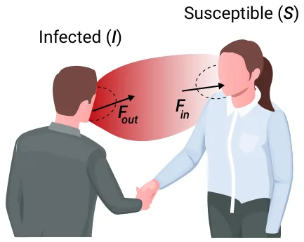
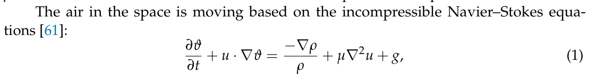
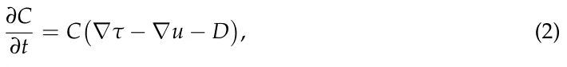
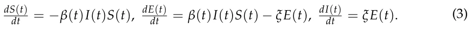
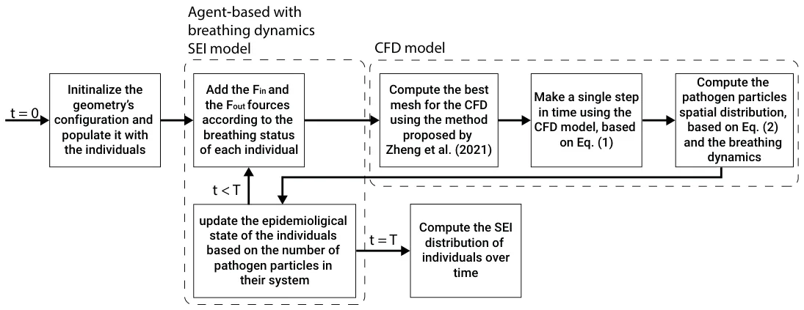
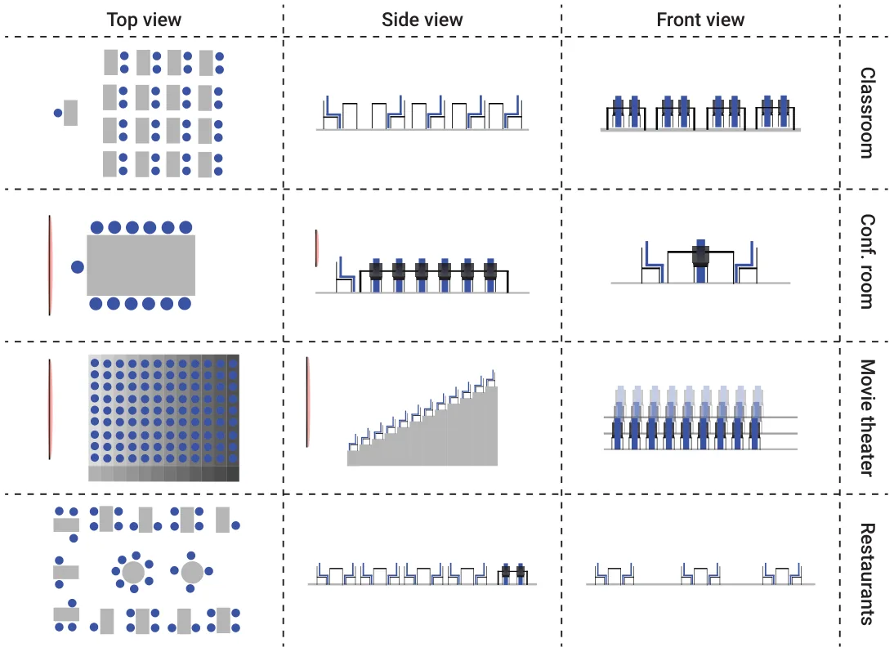
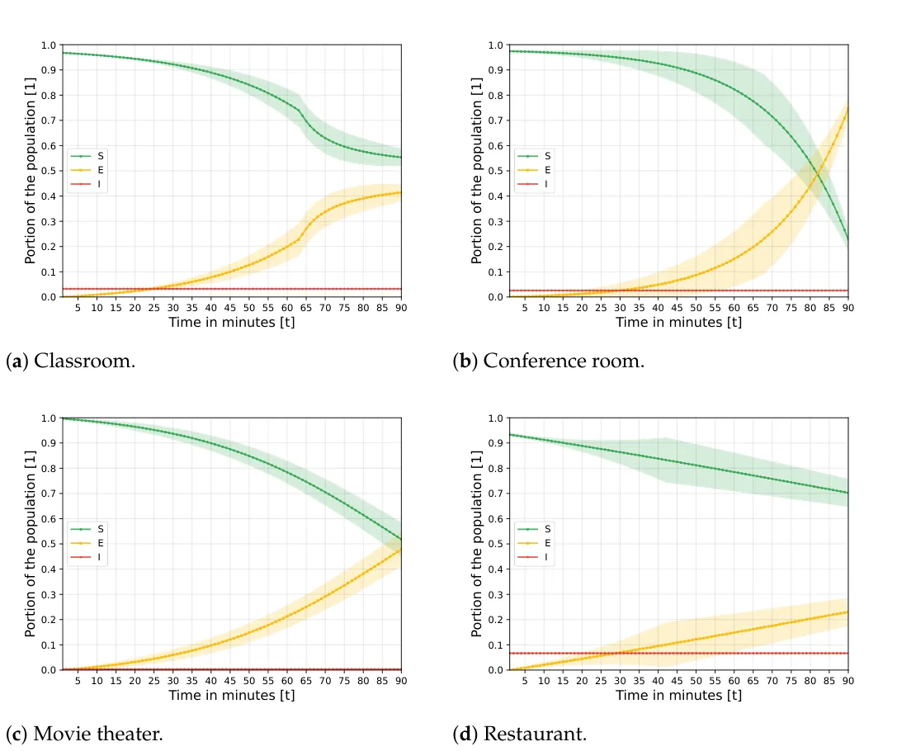
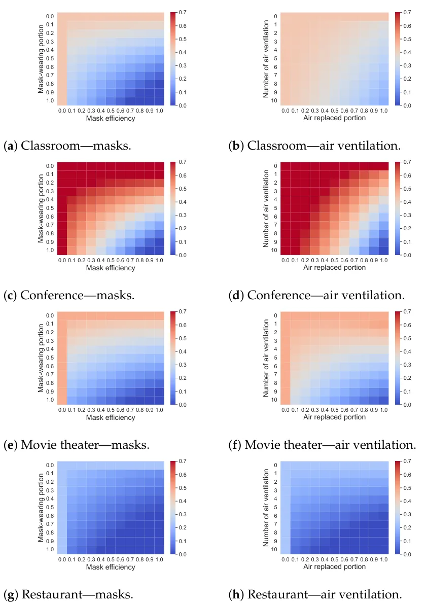
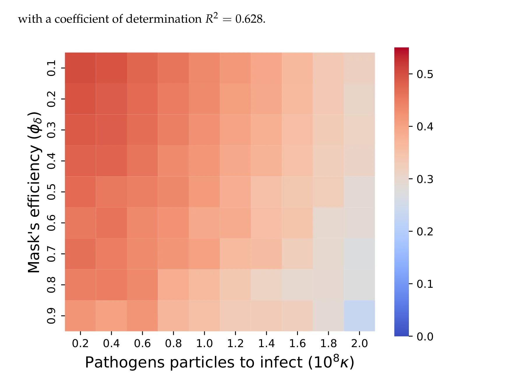

## 1. Background

Multiple studies show that mathematical models and computer simulations are powerful tools for policy makers to investigate pandemic spread and different PIPs with their outcomes in a fast, cheap, and controlled manner [18,19,21]. There are multiple modeling approaches for epidemiological dynamics [22–24]. The leading approach is extending the *SIR* model [20] with sociological [19], economic [25], biological [18], and clinical [26] dynamics to name a few.

Agarwal and Bhadauria [27] introduced a vaccinated (V) stage to the *SIR* model, resulting in an *SIRV* model for the polio pandemic. The authors took into consideration the spontaneous occurrence of strains during the pandemic. Bunimovich-Mendrazitsky and Stone [28] proposed a two-age group extension for the *SIR* model, also for the polio pandemic spread. The authors were able to explain the sharp increase in the number of paralytic polio cases that emerged at the beginning of the 20th century using the separation of children and adult age groups. For the influenza viruses, Dang et al. [29] developed a multi-scale immuno-epidemiological model which takes into consideration direct and environmental transmission of the pathogen. Using their model, the authors showed that two time-since-infection structural variables outperform classical *SIR* models for the case of influenza. Marquioni and de Aguiar [30] fitted a multi-strain stochastic *SIR* model onto the COVID-19 pandemic in China. The authors showed that their extended model provides a more accurate prediction of pandemic spread over a longer period of time.

More often than not, these models obtain relatively poor results for medium and long prediction periods. One explanation for this shortcoming is the assumption that the population is well mixed which is known to be false even for small population sizes and spatial locations [31–36]. Indeed, Cooper et al. (2020) used the *SIR* model on the COVID-19 pandemic while relaxing the assumption that the population is mixing homogeneously, showing a fair fitting on six countries with improved results compared to the classical *SIR* model [37]. Due to statistical fluctuations, long time periods are difficult to predict.

To tackle this challenge, several models introduced spatial dynamics to the spread of a pandemic which can be divided into two main groups: graph-based and metric space. Graph-based models take an abstract approach to modeling the locations in which individuals can be located. Usually, it is assumed that each node in the spatial graph represents a physical location (such as a room, street, city, or even a country) and that the population is well-mixed in each node [21,33]. This approach more often than not ignores the physical properties and dynamics that occur in the location represented by the graph’s nodes. For instance, Lazebnik et al. (2021b) proposed a two-age-group extended *SIR* model with a three-node graph representing a school, a home, and a workplace, such that the individuals move between them according to their age group and time of day [38]. Moore and Newman (2000) studied several models of disease transmission in small-world networks, in which either the probability of infection by a disease or the probability of its transmission is varied, or both [39]. The authors conducted a numerical analysis which results in similar behavior to the reported data by [32]. Klovdahl et al. (1994) defined and explored the stochastic *SIR* model on a graph of interactions to represent the pandemic in a cattle trade network with epidemiological and demographic dynamics occurring over the same time scale [34]. The authors used real data on trade-related cattle movements from a densely populated livestock farming region in western France and epidemiological parameters corresponding to an infectious epizootic disease, obtaining fair prediction accuracy. Additionally, Lazebnik and Alexi (2022) proposed a graph-based extended *SIR* model where each node represents a room in a building [31]. In their study, the authors investigated the impact of different moving patterns of the population in different types of buildings (homes, schools, offices, and malls) on the spread of pandemics and on the optimal configuration of both spatial and temporal factors, such as mask-wearing and vaccination. Nevertheless, the authors assumed that the population is well-mixed in each room. As a result, their model produced noisy results for the case of home-type buildings, where the population density is low.

On other hand, for the case of spatial models, it is assumed that the space is continuous and people move in the space over time, representing a more physically accurate representation of movement. For instance, Milner and Zhao (2008) proposed an *SIR*-based model where susceptible individuals move away from the previous location of the infection, and all individuals move away from overcrowded regions [40]. Fabricius and Maltz (2020) developed a stochastic *SIR* model with global and local infective contacts [41]. Paeng and Lee (2017) presented an *SIR*-based model where individuals are assumed to move stochastically within a small fixed radius rather than a random walk [42]. The authors proposed continuous and discrete *SIR*-based models that show spatial distributions. They show that the propagation speed and size of an epidemic depend on the population density and the infectious radius.

In the context of airborne pandemics, one can focus on the infection that occurs in a room. To do so, one can track the airflow with the pathogen particles it carries between the individuals in the room [43]. Wei and Li (2016) reviewed the release, transport, and exposure of expiratory droplets because of respiratory activities in the context of a pandemic indoors [44]. The authors concluded that droplets or droplet nuclei are transported by airflow, which is sometimes affected by the human body plume. They suggested that the usage of a face mask, as well as room air ventilation, can reduce the infection rate.

Air flow (or air movement) dynamics are vastly explored in multiple contexts such as healthcare [45], mechanics [46], agriculture [47], and epidemiology [43]. In particular, Peng et al. (2020) explored the pandemic spread of the airborne COVID-19 pathogen in indoor settings using a combination of the box and Wells–Riley models [48,49]. The authors derived an expression for the number of secondary infections. However, their model does not include a detailed and accurate representation of the room’s geometry. Moreover, the box model used by the authors does not correctly represent common cases such as rooms where clear directional flow or infection due to overlapping breathing zones. In this work, we aim to tackle these challenges using more detailed airflow dynamics.

There are various modeling approaches to predict the airflow within buildings such as multi-zone models and zonal models. However, Computational Fluid Dynamics (CFD) models are considered to be the most accurate for a single room [50,51].

The CFD models are numerical methods of solving fluid flow using the Navier– Stokes (NS) equations [52]. These models use numerical algorithms to integrate the NS equations over a given mesh by converting the integral equations to algebraic equations (e.g., discretization) and then solving them iteratively [53]. In the context of building airflow or even room-level airflow, the CFD modeling approach subdivides an individual room into many space segments, and each one is treated as an atomic segment in which the NS equations are computed [50]. There are three main types of CFD implementation for indoor airflow dynamics: Reynolds-Averaged Navier–Stokes (RANS), Large Eddy Simulation (LES), and Direct Numerical Simulation (DNS) [54].

The RANS equations take advantage of the Reynolds decomposition technique whereby an instantaneous quantity is decomposed into fluctuating quantities and the average value of some time duration. This technique provides approximations over time of the NS equations, averaging the results on short periods [55]. DNS numerically solves full Navier–Stokes equations using a very fine mesh to capture all the scales that are present in a given flow. LES computes large-scale motions similarly to DNS but with a larger grid, and sub-grid scale dynamics are solved using an averaging method such as the RANS approach. While all three CFD computational approaches are able to provide accurate predictions for airflow, the RANS approach is the most popular one for the indoor environment. This is because the other two CFD approaches are significantly more computationally expensive without a justified improvement in prediction accuracy for most cases [56].

Several CFD-based models and simulators have been developed for indoor context [57–59]. Hiyama and Kato [57] developed a 3D CFD model for close space with airflow in whole building settings. The authors integrated the outcomes of the CFD simulation with building energy simulations to achieve a more accurate time-series analysis of building energy consumption compared to conventional energy simulations [57]. Nahor et al. [58] proposed a 3D CFD model to calculate the velocity, temperature, and moisture distribution in an existing empty and loaded cool store. The authors validated their model with data from several experiments and showed that the model was capable of predicting both the air and product temperature with reasonable accuracy [58]. Smale et al. [59] reviewed the application of CFD and other numerical modeling techniques to the prediction of airflow in refrigerated food applications including cool stores, transport equipment, and retail display cabinets. The authors show that given enough computation power, CFD-based models achieve high accuracy in all these tasks.Cravero and Marsano showed that a CFD model can provide an accurate description of a breathing individual in a room. This description includes breathing dynamics, air ventilation, and air diffusion [60]. Thus, CFD-based models accurately describe the air movement dynamics across a wide range of environments in general and room types in particular. As such, the CFD model implemented using the RANS method is used in this research.

## 2. Model Definition

The proposed model is constructed from three main components: a population of individuals, an environment (room) representing a three-dimensional space in which the population is located, and the airflow dynamics taking place. A schematic view of the model’s dynamics is shown in Figure 1 for the simplistic case of two individuals interacting. As a result of exposure to airborne pathogen particles from the infected individual, the second individual becomes infected by breathing in the particles. Formally, the model is defined by a tuple *M* := (P, *E*) where P is a set (the population) of individuals, and *E* is the environment of the model representing the room and the airflow. The components of the tuple are described below in detail.

<figure id="fig-1">

<figcaption><strong>Figure 1.</strong> A schematic view of the model’s dynamics. <em>F</em>out and <em>F</em>in are the force of air getting out and in (with the pathogen’s particles) during an individual’s breathing process.</figcaption>
</figure>

### 2.1. The Environment E

The spatial component of the model is considered a three-dimensional continuous space *E ⊂* R3 with length, width, and height of *L*, *W*, and *H*, respectively. The space *E* is discretized in all three dimensions with size *δ* represented by a matrix *M*E *∈* RL/δ×W/δ×H/δ. Each cell (*i*, *j*, *k*) of the space matrix *M*E represents a cube with a center of mass at ((*i* + 0.5) *· δ*, (*j* + 0.5) *· δ*, (*k* + 0.5) *· δ*) and with a volume *δ*3.

The space *E* contains a set of objects and individuals. Formally, each location in the space (*i*, *j*, *k*) *∈ E* is either filled by an object (which can be an individual) or by air. If a location is filled by an object, air is not presented and vice versa. We assume that all objects in the space are static and therefore do not move over time. A location with air has four properties: pathogen particles *λ ∈* N, velocity *v ∈* R3, acceleration *a ∈* R3, and pressure *ρ ∈* R3. Furthermore, we assume that the air in the space is incompressible.

where *ϑ* = (*u*, *v*, *w*)T is the velocity vector, *t* is time, *ρ* is the uniform density of the atmosphere, *µ* is the dynamic viscosity, and *g* is the gravity constant vector. The pathogen particles are airborne and move with the air as a result. In addition, as pathogen particles cannot survive outside the host for too long, the number of pathogen particles generated by an infected individual in a single breath decays exponentially over time [62,63]. As such, for each (*i*, *j*, *k*) *∈ E*, the number of pathogen particles satisfies:

where *C*(*x*, *t*) is the number of pathogen particles in location *x* at time *t*, *τ* is the tensor of turbulent diffusivity, and *D* is the decay rate of the pathogen particle.

For the initial conditions, it is assumed that the entire air is without pathogen particles and *∀x* : *u*(*x*, 0) = 0 (i.e., the “static” state). The boundary conditions are defined to be the boundary cells of the space matrix *M*E and all locations that contain an object. Namely, open boundary conditions (stress-free boundary conditions) are specified at the outlet. No-slip boundary conditions are provided in all four boundary directions [62].

### 2.2. The Population P

The model considers a constant population P with a fixed number of individuals *N ≡|*P*|*. Each individual belongs to one of three groups: susceptible (*S*), exposed (*E*), or infected (*I*), such that *N* = *S* + *E* + *I*. Individuals in the susceptible group have no immunity and are susceptible to infection. When an individual in the susceptible group (*S*)

is exposed to the pathogen, the individual is transferred to the exposed group (*E*) at a rate *β*. The individuals stay in the exposed group (*E*) for *ξ* time steps. This duration is mainly defined by the pathogen and its interaction with the immune system. After *ξ* time steps, the individuals are transferred to the infected group (*I*).

The epidemiological state of the population follows the equations:

This *SEI* model is a private case of the *SEIR* model, such that *∀t* : *R*(*t*) = 0. This case better suits short-duration pandemic spread at the beginning of the pandemic, where there is still a small (or even neglected) number of recovered or vaccinated individuals, such as the one of interest in this model.

Formally, let P be a non-empty set of individuals, such that each individual *p ∈* P is defined by a tuple *p*: = (*l*, *b*, *ν*, *c*), where *l* = (*l*x, *l*y, *l*z, *l*α, *l*β) is the location and orientation of the individual’s face, such that (*l*x, *l*y, *l*z) *∈ E* is the three-dimensional location in the environment, and *l*α *∈* [0, 2*π*], *l*β *∈* [0, *π*] are the angles in the *xy* and *xz* plans, respectively; *b* = (*φ*δ, *φ*r, *φ*g) are the breathing-related properties, such that *φ*δ is the minimal number of pathogen particles needed to be inside the individual’s body to cause infection, exposing a susceptible individual to the pathogen; *φ*r is the natural reduction rate of the pathogen particle for susceptible individuals; *φ*g is the amount of pathogen particle the individual generates during breathing out when infected; *ν ∈{s*, *e*, *i}* is the individual’s current epidemiological state; *c* is the number of pathogen particles currently found in the individual’s body.

At each point in time, each individual in the population is either breathing in, out, or neither. During the inhaling phase, a force *F*in originated at (*l*x, *l*y, *l*z) is manifested. The *F*in force influences the air movement as well as the pathogen particles in its close proximity. In particular, the pathogen particles that are located at a distance *γ* from (*l*x, *l*y, *l*z) during the inhaling are removed from the environment and inserted into the individual’s body. In a similar manner, during an exhaling phase, a force *F*out originated at (*l*x, *l*y, *l*z) is manifested. If the individual is infected (i.e., *ν* = *i*), then *φ*g pathogen particles are generated at each breath and added to the environment in an exponentially decaying distribution as a function of the distance from (*l*x, *l*y, *l*z) with weights *ω*x, *ω*y, and *ω*z for the *x*, *y*, and *z* axis. Individuals follow a breathing pattern as follows: inhaling, not breathing, exhaling, and not breathing. This pattern is repeated for each individual during the entire model’s dynamics.

A susceptible individual (*ν* = *s*) becomes exposed (*ν* = *e*) if *c > φ*δ. During the time an individual belongs to either the exposed or infected epidemiological states, the change in the number of pathogen particles in the body (*c*) does not have any effect on its epidemiological state.

The population component (P) is implemented using the agent-based simulation method to allow a heterogeneous population [64–66] where each individual in the population has unique values of inhaling and exhaling duration and volume as well the number of pathogen particles needed to make it infected. For a more detailed implementation description, see [38].

### 2.3. Model Implementation

The proposed model is implemented as a computer simulation using the Python programming language (version 3.7). The environment *E* is represented by a 3D tensor, such that each node represents a space segment with a volume of *δ*3. At the beginning of the simulation (i.e., *t* = 0), the individuals that occupy the environment are set in the environment, such that each individual is allocated a unique inhaling and exhaling duration and volume values from a pre-defined distribution. In a similar manner, a number of pathogen particles needed to infecty an individual are randomly sampled from a given distribution and set to each individual. Afterward, at each step in time, five computational steps take place. First, based on the individuals’ stage in the breathing cycle (inhaling, exhaling, neither), a force (*F*in, *F*out, none) is allocated to the corresponding location of the individuals’ face (see Section 2.2). Moreover, if an infected individual is exhaling, *φ*g pathogen particles are introduced to the room at (*l*x, *l*y, *l*z). Second, an adaptive mesh for the CFD model is computed using the method proposed by [62], such that at least a single node of the mesh is located in each node in the *M*E matrix in order to ensure a lower boundary of the size of the geometry’s resolution. Third, the air movement in a single step in time is calculated by using the RANS method [55] for the CFD model (practically approximating Equation (1) for the mesh’s nodes’ location at a specific point in time). Fourth, using the *∇u* value computed on the geometry’s mesh from the previous step, Equation (2) is computed, and the number of pathogen particles that enter individuals’ bodies are updated. Finally, the epidemiological state of each individual in the population is updated based on the number of pathogen particles in its system and its current epidemiological state. This process repeats itself for *T* time steps. A schematic view of the simulator’s process is presented in Figure 2.

<figure id="fig-2">

<figcaption><strong>Figure 2.</strong> A schematic view of the simulator’s process, including the integration of the agent-based with the breathing dynamic.</figcaption>
</figure>

## 3. Simulations and Results

We evaluated the model on four types of rooms: classrooms, conference rooms, movie theaters, and restaurants. We picked these types of rooms for three reasons: First, most of the individuals in the room are not moving most of the time. We tried to avoid movement as it influences the pandemic spread significantly [31,44,67] and not in the scope of the proposed model. Second, the room types should have a unique and distinguished topology. Third, the rooms should involve at least several individuals in order to allow a pandemic spread signal to be noticeable. Since classrooms, conference rooms, movie theaters, and restaurants fulfill these conditions [68,69], we used them. Furthermore, each one of the room types has a unique topology and distribution of the population inside the room. These differences are shown in a schematic 2D projection of each room type into a top, side, and front view of the 3D structure of the room in Figure 3. Other researchers also investigated pandemic spread inside buses [70], workshop rooms [70], homes [31], and gyms [71]. However, these do not satisfy at least one of our requirements as individuals are moving quite frequently in buses, workshop rooms, and gyms. The population size in homes is usually too small to efficiently evaluate pandemic spread.

The rooms’ topologies were obtained using a 3D LiDAR-based scanning (using the technology available in the iPhone 12) device with the *RoomScan LiDAR* application. of the room and mapped it into its 3D geometry [72]. In particular, the LiDAR program captures a 3D cloud point which is later processed to a mesh [73]. The obtained mesh’s resolution is one cubic centimeter. This mesh is used as the boundary condition of the geometry. For each room, we obtained the places where individuals are located (sit) based on the chairs’ locations and added 0.8 meters on the z-axis for their faces’ location. Each individual occupies a box in space with 170 cm height, 55 cm width, and 40 cm length. In addition, each individual starts the breathing cycle in a random time between *t* = 0 and *t* = *F*T in + *F*T out.

<figure id="fig-3">

<figcaption><strong>Figure 3.</strong> Schematic 3D projection views of the four room types.</figcaption>
</figure>

Moreover, for the epidemiological properties, we simulated the COVID-19 pandemic with data from 1 March 2020 to 1 September 2020 in Israel, obtained from the WHO. This date range was chosen since, except for a single lockdown, no significant PIPs were used, no vaccination was issued, and only one strain dominated the population. Thus, this period in Israel best suits the *SEI* dynamics and, as such, yields as realistic an epidemiological value (e.g., exposure to infection duration) as available.

We assume only one individual (e.g., the index individual) is infected at the beginning of each simulation. As such, the other individuals are susceptible. Formally, the initial condition of the simulator is assumed to be: *S*(0) = *N −*1, *E*(0) = 0, *I*(0) = 1. Namely, our initial conditions consider only a single infected individual which is taken randomly from one realisation to another.

A summary of the used model parameters’ values is provided in Table 1. In addition, a summary of the room types with a qualitative description of the population and the size of the room is provided in Table 2.

<figure class="table-figure" id="table-1">
<figcaption><strong>Table 1.</strong> The model’s parameters with their default values. DPS stands for differing per simulation which means the value is dependent on the specific instance of the simulation computed.</figcaption>

<table><tr><th>Parameter</th><th>Notation</th><th>Value</th><th>Source</th></tr><tr><th>Population size [1]</th><th>N</th><th>DPS</th><th>-</th></tr><tr><td>Exposed to infected transformation rate in minutes [ 1 t ]</td><td>ξ</td><td>1.01 · 10−4</td><td>[31]</td></tr><tr><td>Simulation’s step in time (in seconds) [t]</td><td>∆t</td><td>0.02</td><td>[50]</td></tr><tr><td>Number of simulation steps [1]</td><td>T</td><td>270,000</td><td>-</td></tr><tr><td>Average decay rate of the pathogen particles in air in minutes [ 1 t ]</td><td>D</td><td>5.5 · 10−3</td><td>[62]</td></tr></table>

</figure>

<figure class="table-figure" id="table-1b">
<figcaption><strong>Table 1.</strong> <em>Cont.</em></figcaption>

<table><tr><th>Parameter</th><th>Notation</th><th>Value</th><th>Source</th></tr><tr><td>CFD’s mesh’s single volume element size in cubic centimeters [m3]</td><td>δ</td><td>1</td><td>[74]</td></tr><tr><td>Inhaling duration in seconds [t]</td><td>Fτ in</td><td>1.42 ± 0.25</td><td>[75,76]</td></tr><tr><td>Exhaling duration in seconds [t]</td><td>Fτ out</td><td>2.28 ± 0.47</td><td>[76,77]</td></tr><tr><td>No breathing duration in seconds [t]</td><td>-</td><td>0.39 ± 0.04</td><td>[76,78]</td></tr><tr><td>Inhaling volume in cubic centimeter [m3]</td><td>|Fin|/Fτ in</td><td>304 ± 71</td><td>[76]</td></tr><tr><td>Exhaling volume in cubic centimeter [m3]</td><td>|Fout|/Fτ out</td><td>198 ± 41</td><td>[76]</td></tr><tr><td>Average distance of pathogen particle influenced by inhaling in meters [m]</td><td>γ</td><td>0.34</td><td>[79]</td></tr><tr><td>Average decay rate of pathogen particles in host in minutes [ 1 t ]</td><td>φr</td><td>6.6 · 10−4</td><td>[79]</td></tr><tr><td>Average number of pathogens particles needed to infected a susceptible individual [1]</td><td>φδ</td><td>108</td><td>[80]</td></tr><tr><td>Average number of pathogens particles generated by infected individual at each exhaling [1]</td><td>φg</td><td>1.3 · 107</td><td>[80]</td></tr></table>

</figure>

<figure class="table-figure" id="table-2">
<figcaption><strong>Table 2.</strong> The different room types used in the experiments with a qualitative description of the population size and the room’s dimensions in meters.</figcaption>

<table><tr><th>Name</th><th>Population Size</th><th>Room Size [m]</th><th>Density [1/m3]</th></tr><tr><td>Classroom 1</td><td>N = 33</td><td>L = 10.00, W = 6.00, H = 2.60</td><td>0.211</td></tr><tr><td>Classroom 2</td><td>N = 28</td><td>L = 8.00, W = 5.63, H = 2.88</td><td>0.215</td></tr><tr><td>Classroom 3</td><td>N = 27</td><td>L = 7.80, W = 7.70, H = 2.61</td><td>0.173</td></tr><tr><td>Classroom 4</td><td>N = 31</td><td>L = 9.00, W = 7.00, H = 3.04</td><td>0.164</td></tr><tr><td>Classroom 5</td><td>N = 36</td><td>L = 8.77, W = 14.25, H = 3.20</td><td>0.090</td></tr><tr><td>Restaurant 1</td><td>N = 19</td><td>L = 12.12, W = 8.25, H = 2.75</td><td>0.069</td></tr><tr><td>Restaurant 2</td><td>N = 23</td><td>L = 25.00, W = 14.00, H = 2.83</td><td>0.023</td></tr><tr><td>Restaurant 3</td><td>N = 37</td><td>L = 26.25, W = 20.00, H = 3.63</td><td>0.019</td></tr><tr><td>Restaurant 4</td><td>N = 48</td><td>L = 21.88, W = 16.00, H = 3.00</td><td>0.046</td></tr><tr><td>Restaurant 5</td><td>N = 67</td><td>L = 13.87, W = 10.95, H = 4.40</td><td>0.100</td></tr><tr><td>Movie theater 1</td><td>N = 240</td><td>L = 22.89, W = 18.00, H = 11.25</td><td>0.052</td></tr><tr><td>Movie theater 2</td><td>N = 112</td><td>L = 12.72, W = 10.00, H = 7.00</td><td>0.126</td></tr><tr><td>Movie theater 3</td><td>N = 270</td><td>L = 24.72, W = 19.44, H = 12.15</td><td>0.046</td></tr><tr><td>Movie theater 4</td><td>N = 400</td><td>L = 18.94, W = 14.80, H = 9.30</td><td>0.153</td></tr><tr><td>Movie theater 5</td><td>N = 720</td><td>L = 36.00, W = 28.30, H = 17.68</td><td>0.040</td></tr><tr><td>Conference 1</td><td>N = 9</td><td>L = 6.50, W = 4.00, H = 3.12</td><td>0.110</td></tr><tr><td>Conference 2</td><td>N = 11</td><td>L = 7.98, W = 3.76, H = 2.79</td><td>0.131</td></tr><tr><td>Conference 3</td><td>N = 16</td><td>L = 10.00, W = 4.09, H = 2.90</td><td>0.135</td></tr><tr><td>Conference 4</td><td>N = 17</td><td>L = 11.84, W = 5.20, H = 2.91</td><td>0.095</td></tr><tr><td>Conference 5</td><td>N = 24</td><td>L = 11.21, W = 6.70, H = 2.81</td><td>0.114</td></tr></table>

</figure>

### 3.1. Baseline Model Dynamics

In order to evaluate the airborne pandemic spread dynamics in the different types of rooms, we computed the pandemic spread for 90 min for each room, each time picking a different infected individual in a uniform distribution. We repeated the simulation 100 times. The results of the simulation are shown in Figure 4, where the x-axis is the time passed in minutes from the beginning of the pandemic, and the y-axis indicates the portion of the population in each epidemiological state where *S*, *E*, *I*, and *R* stand for susceptible, exposed, infected, and recovered, respectively.

<figure id="fig-4">

<figcaption><strong>Figure 4.</strong> The <em>SEI</em> over time for each type of room, shown as mean <em>±</em> standard deviation. The results are computed as a result of 100 realisations for each room and 5 rooms for each room type (<em>n</em> = 500).</figcaption>
</figure>

### 3.2. Pandemic Intervention Policies

PIPs are all the actions of individuals that aim to control the pandemic spread. Indeed, policy makers use multiple types of PIPS, such as lockdowns [81] and artificial job separations [25]. For airborne pandemics, mask-wearing PIP is considered efficient and was used for the COVID-19 pandemic [82] and the influenza pandemic [83] to name a few. However, in practice, masks differ in their effectiveness and the portion of the population that wears them [81,82,84]. Hence, we define the mask-wearing PIP using two parameters *η ∈* [0, 1] and *κ ∈* [0, 1] that stand for the portion of the population that wears a mask and the portion of the pathogen particles filtered by the mask, respectively. The reduction of the mask’s effectiveness over time is neglected due to the short-horizon duration of the simulation [84].

In addition, air ventilation is also considered an effective PIP for airborne pandemics [44,48,85]. Unlike other PIPs, air ventilation is highly affected by the room’s topology in directed and undirected ways. For example, the location of a window, alongside its size and the outdoor air temperature can alter the pandemic spread. Thus, we defined a simplified version of air ventilation, assuming a centralized air ventilation system that removes a portion *χ* of the pathogen particles from the air in the room in a uniform way and occurs in a discreet manner every *ζ* time steps. This definition is identical to mixing the air in the room with fresh air at a proportional portion in a uniformly distributed way.

Figure 5a–h present the model sensitivity for both the mask-wearing and air-ventilation PIPs, divided into the four room types. For the mask-wearing PIP, the x-axis shows the rate of the average quality of mask-wearing in reducing infection rate, and the y-axis shows the portion of the population that wears masks. Similarly, for the air-ventilation PIP, the x-axis shows the portion of the pathogen particles that are removed in each ventilation *χ*, and the y-axis shows the rate in minutes that the air-ventilation occurs *ζ*. The heat maps present the average portion of exposed individuals out of the population after 90 min which is computed from 500 realisations (100 realisations for each room, 5 rooms for each room type). For each realisation, the infected individual is chosen randomly as are the individuals that wear masks.

<figure id="fig-5">

<figcaption><strong>Figure 5.</strong> The influence of mask-wearing and air-ventilation PIPs on the number of infected individuals over a period of 90 min (an h and a half). The results are shown as the average value of all the rooms from the same type.</figcaption>
</figure>

(**g**) Restaurant—masks.

### 3.3. Model Sensitivity Analysis

The proposed model is evaluated above for the case of COVID-19, as indicated by Table 1. These values would change for different pathogens and therefore the obtained results as well. In order to evaluate the sensitivity of the proposed model to the parameter values, we tested two properties of the model: the number of pathogen particles needed to infect an individual and the mask efficiency. We chose these two parameters as one is associated with the infection rate (commonly denoted by *β* in extended *SIR* models) and therefore a property of the pathogen, and the latter indicates the efficiency of a PIP to the pandemic spread which also changes during the course of the pandemic due to technological developments. We assumed 12% of the population wears masks, following measurements from the beginning of the COVID-19 pandemic (March 2020) in the US [82]. Figure 6 presents the result of this analysis, where the average portion of exposed individuals out of the population after 90 min for *n* = 200 realisations (10 realisations for each room in Table 2) is used as the evaluation metric. In order to analyze the results shown in Figure 6 analytically, we utilized the *SciMED* symbolic regression tool [86], obtaining:

*E*(*t* = 90) *≈* 5.31 *·* 10−1 *−*2.72 *·* 10−9(*φ*δ *−ln*(*φ*δ)) *−*4.75 *·* 10−2*κ −*7.57 *·* 10−4*κ*2, (4)

<figure id="fig-6">

<figcaption><strong>Figure 6.</strong> A sensitivity analysis of the infection rate as a function of the mask’s efficiency and the number of pathogens needed to infect an individual. The results are shown as the average value of all the rooms in Table 2 with 10 realisations each.</figcaption>
</figure>

## 4. Discussion

We have explored the airborne pandemic spread for a small size population sharing a room. We used a combined CFD and *SEI* model for airflow and epidemiological dynamics, respectively. We evaluated the pandemic spread in four types of rooms: classroom, conference room, movie theater, and restaurant, using high-resolution spatial data obtained by a LiDAR and by simulating the air movement dynamics with a relatively small step in time to accurately capture all temporal dynamics.

We found that the spread dynamics between the four different room types are statistically different with a *p*-value of (0.0014) using Levene’s test [87]. Moreover, we computed a pair-wise Welch’s *t*-test showing that each pair of room types has statistically different dynamics with a worse *p*-value of 0.046 [88]. Thus, the pandemic spread dynamics have a consistent relationship with the distribution of the population in the room and its geometrical configuration, as shown in Figure 4. In particular, the population distribution has more influence on the pandemic spread than the overall density of the population. This is limited to scenarios similar to the ones examined in this study. For instance, the average restaurant’s density is 0.054 [person/m3] with 0.033 standard deviation, while movie theaters’ density is 0.063 *±* 0.046 [person/m3], as shown in Table 2. Despite this, the pandemic spread in both cases is statistically significantly different with a *p*-value of 0.024 (obtained from a two-sided paired *t*-test). Hence, the well-mixed assumption does not hold for density-related approximations even for a short duration as had been believed before [89,90]. Nevertheless, for the case of a relatively large population of a few hundred individuals found in the movie theater, our model predicts a similar pandemic spread rate as found by [48,91]. This can be explained by the influence of breathing zone infection versus indirect infection [92]. One can see from Figure 3 that individuals in the conference room are facing each other and the intersection of the breathing zone is much larger compared to the movie theater where individuals are facing a screen, and there is enough distance between any two individuals. As a result, as presented in Figure 4, the portion of exposed individuals in the conference room is much higher on average compared to the movie theater for the same duration. That said, these results provide an upper boundary to the realistic pandemic spread in restaurants and movie theaters as these have ventilation systems that reduce the infection rate.

When introducing mask-wearing or artificial air ventilation (AAV), we show that mask-wearing consistently outperforms AAV in reducing the pandemic spread over all four room types, as shown in Figure 5. Nonetheless, the mask-wearing PIP requires the participation of the population which is known to be harder to obtain over long periods of time [93–95]. On the other hand, even a low level of air ventilation, such as a replacement of 20% of the air in the room every 30 min, results in 7.25 percent improvement compared to a room without any air ventilation and can be controlled more easily than mask-wearing. These results agree with the outcomes proposed by [96].

A sensitivity analysis of the pathogen’s infection rate, as indicated by the number of pathogens required to infect an individual, and the mask’s efficiency as presented in Figure 6 and Equation (4) reveal a sub-linear connection between the pathogen’s infection rate and the number of infected individuals on average. Similarly, there is mostly a linear correlation between mask efficiency and the number of infected individuals.

Our analysis shows that PIPs to limit shared room airborne pandemic spread are needed in most indoor spaces whenever COVID-19 is spreading in a community. These results are even more relevant with more contagious pathogens such as measles [97,98]. The proposed model may be useful in the design and renovation of building systems. In particular, one can integrate it into graph-based spatio-temporal epidemiological models of buildings, such as those proposed by [31], in order to obtain more accurate pandemic spread dynamics. In this work, we studied only mask-wearing and AAV measures to reduce pandemic spread, but other measures, such as avoiding intense physical activities, shortening the duration of occupancy, social distancing, and additional virus removal through ventilation should be considered when evaluating pandemic spread at a room-level and planning intervention policies. The combination of several PIPs is already used [38,99,100], showing promising outcomes. The simultaneous usage of multiple PIPs in a single room is expected to have similar outcomes.

Of note, the values reported in the analysis are based on the first (source) strain of the COVID-19 pandemic. Later strains of COVID-19 are known to be more aggressive with a higher infection rate (as reflected in the number of pathogen particles infectious individuals generate and how susceptible individuals become infected) which might significantly alter the results. In addition, the computation of the CFD model is considered computationally expensive and therefore not feasible for large-scale models handling cities and countries. For this research, we used a server with four GTX 1080 Ti (Nvidia) GPUs and 16-Core (Intel Xeon) LGA 3647 CPU that computed for 147 h to obtain the simulation outputs due to the high spatial and temporal resolution used in the simulations. Future research could study the trade-off between simulation accuracy and computational efficiency for the different spatial grids and time-step sizes. In addition, these results obtained by the proposed model and simulator are not validated on empirical data. While the CFD and *SEI* models were validated separately multiple times in the past, their combination in general and in the context of breathing individuals in a room is not. That said, complete validation of the proposed model is not feasible as one would need to populate a room with individuals and sample the number of infected individuals over time. However, an experiment that aims to infect individuals with a pathogen is unethical (for a good reason), and thus the experiment required to validate the model is impossible. One can argue that just simulating the airflow alone without the pandemic model can be sufficient. However, the novelty of the proposed model lies in breathing dynamics and their influence on the infection rate. This influence is not captured by such a validation, so it is deemed insufficient. A potential solution to this issue is the usage of a machine that mimics the breathing pattern of individuals. Nevertheless, the use of such a machine raises another validation issue, since one must demonstrate that the proposed machine accurately reproduces human breathing patterns. Moreover, one would need to sample the dynamics multiple times (due to the stochastic behavior of individuals) with machine populations that include several dozens to hundreds in order to reproduce the proposed results (see Table 2). This, by itself, would be extremely expensive and unreachable for most academic labs.

## 5. Conclusions

The model developed in this study integrates a highly detailed 3D geometrical configuration of a room obtained using a LiDAR scanning device with a spatio-temporal pandemic spread model that is constructed from an *SEIR*-based epidemiological model with a CFD-based airflow model. The proposed model allows us to examine the influence of different room types on an airborne pandemic spread. In addition, the influence of mask-wearing and air ventilation at the room-level with relatively small populations and time duration on pathogen spread is analyzed.

The proposed model is implemented for the COVID-19 outbreak. These spatio-temporal interactions allow one to explore the reciprocal effects of both spatial and temporal PIP on the spread of the pandemic during different social activities. An example is the effect of mask-wearing in a movie theater, as shown in Figure 5e. The inclusion of these interactions provides a highly detailed representation of how airborne pathogens move from one host (individual) to another. Thus, these improve the accuracy of the model’s forecasts and allow for multidimensional analysis of the impact of PIPs.

Our results indicate that policy makers need to consider the unique interactions of individuals in enclosed spaces population when considering optimal PIPs which involve different policies for different spaces such as restaurants and classrooms. We found that the population distribution in a space influences AAV primarily through the amount of breathing zone infections. Thus, given mask-wearing and AAV configurations, one can further control pathogen spread by controlling breathing zone infection using social distancing and other methods.

The proposed model assumes that individuals are not moving, the AAV is affecting all air in the room at once, and the temperature is constant. In future work, we can relax these assumptions in order to obtain a more realistic representation of the airborne spread dynamics. Moreover, an investigation of a multi-strain and multi-mutation pandemic at the room-level is also a promising research direction, following recent studies on larger scales [29,101–105].

**Author Contributions:** Conceptualization, T.L. and A.A.; methodology, T.L.; software, T.L.; validation, T.L. and A.A.; formal analysis, T.L. and A.A.; investigation, T.L. and A.A.; resources, A.A.; data curation, A.A.; writing—original draft preparation, T.L.; writing—review and editing, A.A.; visualization, T.L.; supervision, T.L.; project administration, T.L.; funding acquisition, T.L. All authors have read and agreed to the published version of the manuscript.

**Funding:** This research received no external funding.

**Institutional Review Board Statement:** Not applicable.

**Informed Consent Statement:** Not applicable.

**Data Availability Statement:** The room’s raw topological data is not available due to security reasons, according to Israeli law. In addition, the data used are provided in the manuscript with the relevant sources.

**Acknowledgments:** The authors wish to thank Noa Vardi for her statistical consulting and Guy Masad for the thought-provoking discussions.

**Conflicts of Interest:** The authors declare no conflict of interest.

## References

1. Brodeur, A.; Gray, D.; Islam, A.; Bhuiyan, S. A Literature Review of the Economics of COVID-19. IZA Discussion Paper No. 13411, 2020. Available online: https://ssrn.com/abstract=3636640 (accessed on 1 August 2022). [link](https://ssrn.com/abstract=3636640)
2. Conti, A.A. Historical and methodological highlights of quarantine measures: From ancient plague epidemics to current coronavirus disease (COVID-19) pandemic. Acta Bio Medica Atenei Parm. 2020, 91, 226–229.
3. Eurosurveillance Editorial Team. Note from the editors: World Health Organization declares novel coronavirus (2019-nCoV) sixth public health emergency of international concern. Eurosurveillance 2020, 25, 200131e.
4. Lederberg, J. Medical Science, Infectious Disease, and the Unity of Humankind. JAMA 1988, 260, 684–685. [doi:10.1001/jama.1988.03410050104039](https://doi.org/10.1001/jama.1988.03410050104039)
5. Wu, T.; Perrings, C.; Kinzig, A.; Collins, J.P.; Minteer, B.A.; Daszak, P. Economic growth, urbanization, globalization, and the risks of emerging infectious diseases in China: A review. Ambio 2017, 46, 18–29. [doi:10.1007/s13280-016-0809-2](https://doi.org/10.1007/s13280-016-0809-2)
6. Quinn, T.C. Global burden of the HIV pandemic. Lancet 1996, 348, 99–106. [doi:10.1016/S0140-6736(96)01029-X](https://doi.org/10.1016/S0140-6736%2896%2901029-X)
7. Genuis, S.J.; Dabog, F.; Genuis, S.K. Managing the sexually transmitted disease pandemic: A time for reevaluation. Am. J. Obstet. Gynecol. 2004, 191, 1103–1112. [doi:10.1016/j.ajog.2004.03.019](https://doi.org/10.1016/j.ajog.2004.03.019)
8. Djillali, S.; Bentout, S.; Touaoula, T.M.; Tridane, A. Global dynamics of alcoholism epidemic model with distributed delays. Math. Biosci. Eng. 2021, 18, 8245–8256. [doi:10.3934/mbe.2021409](https://doi.org/10.3934/mbe.2021409)
9. Djillali, S.; Bentout, S.; Touaoula, T.M.; Tridane, A.; Kumar, S. Global behavior of Heroin epidemic model with time distributed delay and nonlinear incidence function. Results Phys. 2021, 31, 104953. [doi:10.1016/j.rinp.2021.104953](https://doi.org/10.1016/j.rinp.2021.104953)
10. Ferguson, N.M.; Cummings, D.A.T.; Fraser, C.; Cajka, J.C.; Cooley, P.C.; Burke, D.S. Strategies for mitigating an influenza pandemic. Nature 2006, 442, 448–452. [doi:10.1038/nature04795](https://doi.org/10.1038/nature04795)
11. Domingo, J.L.; Marques, M.; Rovira, J. Influence of airborne transmission of SARS-CoV-2 on COVID-19 pandemic. A review. Environ. Res. 2020, 188, 109861. [doi:10.1016/j.envres.2020.109861](https://doi.org/10.1016/j.envres.2020.109861)
12. Fernandez-Montero, J.V.; Soriano, V.; Barreiro, P.; de Mendoza, C.; Artacho, M. Coronavirus and other airborne agents with pandemic potential. Curr. Opin. Environ. Sci. Health 2020, 17, 41–48. [doi:10.1016/j.coesh.2020.09.001](https://doi.org/10.1016/j.coesh.2020.09.001)
13. Araz, O.M.; Damien, P.; Paltiel, D.A.; Burke, S.; van de Geijn, B.; Galvani, A.; MEyers, L.A. Simulating school closure policies for cost effective pandemic decision making. BMC Public Health 2012, 12, 449. [doi:10.1186/1471-2458-12-449](https://doi.org/10.1186/1471-2458-12-449)
14. Meltzer, M.I.; Cox, N.J.; Fukuda, K. The economic impact of pandemic influenza in the United States: Priorities for intervention. Emerg. Infect. Dis. 1999, 5, 659–671. [doi:10.3201/eid0505.990507](https://doi.org/10.3201/eid0505.990507)
15. Kabir, M.; Afzai, M.S.; Khan, A.; Ahmed, H. COVID-19 pandemic and economic cost; impact on forcibly displaced people. Travel Med. Infect. Dis. 2020, 35, 101661. [doi:10.1016/j.tmaid.2020.101661](https://doi.org/10.1016/j.tmaid.2020.101661)
16. Perrin, P.; McCabe, O.; Everly, G.; Links, J. Preparing for an Influenza Pandemic: Mental Health Considerations. Prehospital Disaster Med. 2009, 24, 223–230. [doi:10.1017/S1049023X00006853](https://doi.org/10.1017/S1049023X00006853)
17. Taylor, M.R.; Agho, K.E.; Stevens, G.J.; Raphael, B. Factors influencing psychological distress during a disease epidemic: Data from Australia’s first outbreak of equine influenza. BMC Public Health 2008, 8, 347. [doi:10.1186/1471-2458-8-347](https://doi.org/10.1186/1471-2458-8-347)
18. Miller, J.C. Mathematical models of SIR disease spread with combined non-sexual and sexual transmission routes. Infect. Dis. Model. 2017, 2, 35–55. [doi:10.1016/j.idm.2016.12.003](https://doi.org/10.1016/j.idm.2016.12.003)
19. Tuite, A.R.; Fisman, D.N.; Greer, A.L. Mathematical modelling of COVID-19 transmission and mitigation strategies in the population of Ontario, Canada. CMAJ 2020, 192, E497–E505. [doi:10.1503/cmaj.200476](https://doi.org/10.1503/cmaj.200476)
20. Kermack, W.O.; McKendrick, A.G. A contribution to the mathematical theory of epidemics. Proc. R. Soc. 1927, 115, 700–721.
21. Lazebnik, T.; Bunimovich-Mendrazitsky, S. The Signature Features of COVID-19 Pandemic in a Hybrid Mathematical Model—Implications for Optimal Work–School Lockdown Policy. Adv. Theory Simul. 2021, 4, e2000298. [doi:10.1002/adts.202000298](https://doi.org/10.1002/adts.202000298)
22. Ivorra, B.; Ferrandez, M.R.; Vela-Perez, M.; Ramos, A.M. Mathematical modeling of the spread of the coronavirus disease 2019 (COVID-19) taking into account the undetected infections. The case of China. Commun. Nonlinear Sci. Numer. Simulat. 2020, 88, 105303. [doi:10.1016/j.cnsns.2020.105303](https://doi.org/10.1016/j.cnsns.2020.105303)
23. Long, J.B.; Ehrenfeld, J.M. The Role of Augmented Intelligence (AI) in Detecting and Preventing the Spread of Novel Coronavirus. J. Med Syst. 2020, 44, 59. [doi:10.1007/s10916-020-1536-6](https://doi.org/10.1007/s10916-020-1536-6)
24. Nesteruk, L. Statistics-based Predictions of Coronavirus Epidemic Spreading in Mainland China. Innov. Biosyst. Bioeng. 2020, 4, 13–18. [doi:10.20535/ibb.2020.4.1.195074](https://doi.org/10.20535/ibb.2020.4.1.195074)
25. Lazebnik, T.; Shami, L.; Bunimovich-Mendrazitsky, S. Spatio-Temporal Influence of Non-Pharmaceutical Interventions Policies on Pandemic Dynamics and the Economy: The Case of COVID-19. Res. Econ. 2021, 35, 1833–1861. [doi:10.1080/1331677X.2021.1925573](https://doi.org/10.1080/1331677X.2021.1925573)
26. Acemoglu, D.; Chernozhukov, V.; Werning, I.; Whinston, M.D. Optimal Targeted Lockdowns in a Multigroup SIR model. Am. Econ. Rev. Insights 2021, 3, 487–502. [doi:10.1257/aeri.20200590](https://doi.org/10.1257/aeri.20200590)
27. Agarwal, M.; Bhadauria, A.S. Modeling Spread of Polio with the Role of Vaccination. Appl. Appl. Math. 2011, 6, 552–571.
28. Bunimovich-Mendrazitsky, S.; Stone, L. Modeling polio as a disease of development. J. Theor. Biol. 2005, 237, 302–315. [doi:10.1016/j.jtbi.2005.04.017](https://doi.org/10.1016/j.jtbi.2005.04.017)
29. Dang, Y.X.; Li, X.Z.; Martcheva, M. Competitive exclusion in a multi-strain immuno-epidemiological influenza model with environmental transmission. J. Biol. Dyn. 2016, 10, 416–456. [doi:10.1080/17513758.2016.1217355](https://doi.org/10.1080/17513758.2016.1217355)
30. Marquioni, V.M.; de Aguiar, M.A.M. Modeling neutral viral mutations in the spread of SARS-CoV-2 epidemics. PLoS ONE 2021, 16, e0255438. [doi:10.1371/journal.pone.0255438](https://doi.org/10.1371/journal.pone.0255438)
31. Lazebnik, T.; Alexi, A. Comparison of pandemic intervention policies in several building types using heterogeneous population model. Commun. Nonlinear Sci. Numer. Simul. 2022, 107, 106176. [doi:10.1016/j.cnsns.2021.106176](https://doi.org/10.1016/j.cnsns.2021.106176)
32. Edmunds, W.J.; O’Callaghan, C.J.; Nokes, D.J. Who mixes with whom? A method to determine the contact patterns of adults that may lead to the spread of airborne infections. Proc. Biol. Sci. 1997, 264, 949–957. [doi:10.1098/rspb.1997.0131](https://doi.org/10.1098/rspb.1997.0131)
33. Keeling, M.J. The implications of network structure for epidemic dynamics. Theor. Popul. Biol. 2005, 67, 1–8. [doi:10.1016/j.tpb.2004.08.002](https://doi.org/10.1016/j.tpb.2004.08.002)
34. Klovdahl, A.S.; Potterat, J.J.; Woodhouse, D.E.; Muth, J.B.; Muth, S.Q.; Darrow, W.W. Social networks and infectious disease: The Colorado Springs study. Soc. Sci. Med. 1994, 38, 79–88. [doi:10.1016/0277-9536(94)90302-6](https://doi.org/10.1016/0277-9536%2894%2990302-6)
35. Keeling, M.J.; Eames, K.T.D. Networks and epidemic models. J. R. Soc. Interface 2005, 2, 295–307. [doi:10.1098/rsif.2005.0051](https://doi.org/10.1098/rsif.2005.0051)
36. Bearman, P.S.; Moody, J.; Stovel, K. Chains of affection: The structure of adolescent romantic and sexual networks. Am. J. Sociol. 2004, 110, 44–91. [doi:10.1086/386272](https://doi.org/10.1086/386272)
37. Cooper, I.; Mondal, A.; Antonopoulos, C.G. A SIR model assumption for the spread of COVID-19 in different communities. Chaos Solitons Fractals 2020, 139, 110057. [doi:10.1016/j.chaos.2020.110057](https://doi.org/10.1016/j.chaos.2020.110057)
38. Lazebnik, T.; Bunimovich-Mendrazitsky, S.; Shami, L. Pandemic management by a spatio–temporal mathematical model. Int. J. Nonlinear Sci. Numer. Simul. 2021, 107, 106176. [doi:10.1016/j.cnsns.2021.106176](https://doi.org/10.1016/j.cnsns.2021.106176)
39. Moore, C.; Newman, M.E.J. Epidemics and percolation in small-world networks. Phys. Rev. E 2000, 61, 5678. [doi:10.1103/PhysRevE.61.5678](https://doi.org/10.1103/PhysRevE.61.5678)
40. Milner, F.A.; Zhao, R. S-I-R Model with Directed Spatial Diffusion. Math. Popul. Stud. 2008, 15, 160–181. [doi:10.1080/08898480802221889](https://doi.org/10.1080/08898480802221889)
41. Fabricius, G.; Maltz, A. Exploring the threshold of epidemic spreading for a stochastic SIR model with local and global contacts. Phys. Stat. Mech. Its Appl. 2020, 540, 123208. [doi:10.1016/j.physa.2019.123208](https://doi.org/10.1016/j.physa.2019.123208)
42. Paeng, S.H.; Lee, J. Continuous and discrete SIR-models with spatial distributions. J. Math. Biol. 2017, 74, 1709–1727. [doi:10.1007/s00285-016-1071-8](https://doi.org/10.1007/s00285-016-1071-8)
43. Samaresh, S.; Vaishali, V.; Abhay, V.R.; Aditya, S.; Abhishek, K.; Shail, V.A. Real-time imaging of airflow patterns and impact of infection control measures in ophthalmic practice: A pandemic perspective. J. Cataract. Refract. Surg. 2021, 47, 842–846.
44. Wei, J.; Li, Y. Airborne spread of infectious agents in the indoor environment. Am. J. Infect. Control 2016, 44, S102–S108. [doi:10.1016/j.ajic.2016.06.003](https://doi.org/10.1016/j.ajic.2016.06.003)
45. Segal, R.A.; Guan, X.; Shearer, M.; Martonen, T.B. Mathematical model of airflow in the lungs of children I; effects of tumor sizes and locations. J. Theor. Med. 2000, 2, 199–213. [doi:10.1080/10273660008833046](https://doi.org/10.1080/10273660008833046)
46. Ammari, H. A mathematical model of thermal performance of a solar air heater with slats. Renew. Energy 2003, 28, 1597–1615. [doi:10.1016/S0960-1481(02)00253-7](https://doi.org/10.1016/S0960-1481%2802%2900253-7)
47. Rossello, C.; Canellas, J.; Simal, S.; Berna, A. Simple Mathematical Model To Predict the Drying Rates of Potatoes. J. Agrie. Food Chem. 1992, 40, 2374–2378. [doi:10.1021/jf00024a010](https://doi.org/10.1021/jf00024a010)
48. Peng, Z.; Rogas, P.A.L.; Kropff, E.; Bahnfleth, W.; Buonanno, G.; Dancer, S.J.; Kurnitski, J.; Li, Y.; Loomans, M.G.L.C.; Marr, L.C.; et al. Practical Indicators for Risk of Airborne Transmission in Shared Indoor Environments and Their Application to COVID-19 Outbreaks. Environ. Sci. Technol. 2020, 56, 1125–1137. [doi:10.1021/acs.est.1c06531](https://doi.org/10.1021/acs.est.1c06531)
49. Riley, E.C.; Murphy, G.; Riley, R.L. Airborne Spread of Measles in a Suburban Elementary School. Am. J. Epidemiol. 1978, 107, 421–432. [doi:10.1093/oxfordjournals.aje.a112560](https://doi.org/10.1093/oxfordjournals.aje.a112560)
50. Yu, Y.; Megri, A.C.; Jiang, S. A review of the development of airflow models used in building load calculation and energy simulation. Build. Simul. 2019, 12, 347–363. [doi:10.1007/s12273-018-0494-0](https://doi.org/10.1007/s12273-018-0494-0)
51. Fariborz, H.; Li, H. Building Airflow Movement - Validation of Three Airflow Models. J. Archit. Plan. Res. 2004, 21, 331–349.
52. Cao, C. Sufficient Conditions for the Regularity to the 3D Navier–Stokes. Discret. Contin. Dyn. Syst. 2016, 26, 1141–1151. [doi:10.3934/dcds.2010.26.1141](https://doi.org/10.3934/dcds.2010.26.1141)
53. Smyth, T.A.G. A review of Computational Fluid Dynamics (CFD) airflow modelling over aeolian landforms. Aeolian Res. 2016, 22, 153–164. [doi:10.1016/j.aeolia.2016.07.003](https://doi.org/10.1016/j.aeolia.2016.07.003)
54. Versteeg, H.; Malalasekra, W. An Introduction to Computational Fluid Dynamics—The Finite Volume Method; Pearson Education: New York, NY, USA, 2007.
55. Su, F.; Kinnas, S.A.; Jukola, H. Application of a BEM/RANS Interactive Method to Contra-Rotating Propellers. In Proceedings of the Fifth International Symposium on Marine Propulsion, Espoo, Finland, 12–15 June 2017.
56. Zhiyin, Y. Large-eddy simulation: Past, present and the future. Chin. J. Aeronaut. 2015, 28, 11–24. [doi:10.1016/j.cja.2014.12.007](https://doi.org/10.1016/j.cja.2014.12.007)
57. Kato, S. Review of airflow and transport analysis in building using CFD and network model. Jpn. Archit. Rev. 2018, 1, 299–309. [doi:10.1002/2475-8876.12051](https://doi.org/10.1002/2475-8876.12051)
58. Nahor, H.B.; Hoang, M.L.; Verboven, P.; Baelmans, M.; Nicolai, B.M. CFD model of the airflow, heat and mass transfer in cool stores. Int. J. Refrig. 2005, 28, 368–380. [doi:10.1016/j.ijrefrig.2004.08.014](https://doi.org/10.1016/j.ijrefrig.2004.08.014)
59. Smale, N.J.; Moureh, J.; Cortella, G. A review of numerical models of airflow in refrigerated food applications. Int. J. Refrig. 2006, 29, 911–930. [doi:10.1016/j.ijrefrig.2006.03.019](https://doi.org/10.1016/j.ijrefrig.2006.03.019)
60. Cravero, C.; Marsano, D. Simulation of COVID-19 indoor emissions from coughing and breathing with air conditioning and mask protection effects. Indoor Built Environ. 2021, 31, 1242–1261. [doi:10.1177/1420326X211039546](https://doi.org/10.1177/1420326X211039546)
61. Fefferman, C.L. Existence and Smoothness Of The Navier–Stokes Equation. Comput. Fluids 2013, 7, 86–92.
62. Zheng, J.; Wu, X.; Fang, F.; Li, J.; Wang, Z.; Xiao, H.; Zhu, J.; Pain, C.; Linden, P.; Xiang, B. Numerical study of COVID-19 spatial–temporal spreading in London. Phys. Fluids 2021, 33, E10. [doi:10.1063/5.0048472](https://doi.org/10.1063/5.0048472)
63. Chin, A.W.H.; Chu, J.T.S.; Perera, M.R.A.; Hui, K.P.Y.; Yen, H.L.; Chan, M.C.W.; Peiris, M.; Poon, L.L.M. Stability of SARS-CoV-2 in different environmental conditions. Lancet Microbe 2020, 1, E10. [doi:10.1016/S2666-5247(20)30003-3](https://doi.org/10.1016/S2666-5247%2820%2930003-3)
64. Ciatto, G.; Schumacher, M.I.; Omicini, A.; Calvaresi, D. Agent-based explanations in AI: Towards an abstract framework. In Proceedings of the International Workshop on Explainable, Transparent Autonomous Agents and Multi-Agent Systems; Springer: Cham, Switzerland, 2020; pp. 3–20.
65. Tesfatsion, L. Agent-Based Computational Economics: Growing Economies From the Bottom Up. Artif. Life 2002, 8, 55–82. [doi:10.1162/106454602753694765](https://doi.org/10.1162/106454602753694765)
66. Raberto, M.; Cincotti, S.; Focardi, S.M.; Marchesi, M. Agent-based simulation of a financial market. Phys. A Stat. Mech. Its Appl. 2001, 299, 319–327. [doi:10.1016/S0378-4371(01)00312-0](https://doi.org/10.1016/S0378-4371%2801%2900312-0)
67. Peng, C.; Yan, D.; Wu, R.; Wang, C.; Zhou, X.; Jiang, Y. Quantitative description and simulation of human behavior in residential buildings. Build. Simul. 2012, 5, 85–94. [doi:10.1007/s12273-011-0049-0](https://doi.org/10.1007/s12273-011-0049-0)
68. Kwon, K.S.; Park, J.I.; Park, Y.J.; Jung, D.M.; Ryu, K.W.; Lee, J.H. Evidence of Long-Distance Droplet Transmission of SARS-CoV-2 by Direct Air Flow in a Restaurant in Korea. J. Korean Med Sci. 2020, 35, e415. [doi:10.3346/jkms.2020.35.e415](https://doi.org/10.3346/jkms.2020.35.e415)
69. Peng, Z.; Jimenez, J.L. Exhaled CO2 as a COVID-19 Infection Risk Proxy for Different Indoor Environments and Activities. Environ. Sci. Technol. Lett. 2021, 8, 392–397. [doi:10.1021/acs.estlett.1c00183](https://doi.org/10.1021/acs.estlett.1c00183)
70. Shen, Y.; Li, C.; Dong, H.; Wang, Z.; Martinez, L.; Sun, Z.; Handel, A.; Chen, Z.; Chen, E.; Ebell, M.H.; et al. Community Outbreak Investigation of SARS-CoV-2 Transmission Among Bus Riders in Eastern China. JAMA Intern. Med. 2020, 180, 1665–1671. [doi:10.1001/jamainternmed.2020.5225](https://doi.org/10.1001/jamainternmed.2020.5225)
71. Jang, S.; Han, S.; Rhee, J. Cluster of Coronavirus Disease Associated with Fitness Dance Classes, South Korea. Emerg. Infect. Dis. 2020, 26, 1917–1920. [doi:10.3201/eid2608.200633](https://doi.org/10.3201/eid2608.200633)
72. Jie, S.; Sampath, A. Urban DEM Generation from Raw Lidar Data. Photogramm. Eng. Remote Sens. 2005, 71, 217–226.
73. Douillard, B.; Underwood, J.; Kuntz, N.; Vlaskine, V.; Quadros, A.; Morton, P.; Frenkel, A. On the segmentation of 3D LIDAR point clouds. In Proceedings of the 2011 IEEE International Conference on Robotics and Automation, Shanghai, China, 9–13 May 2011; pp. 2798–2805.
74. Zheng, J.; Zhu, J.; Wang, Z.; Fang, F.; Pain, C.C.; Xiang, J. Towards a new multiscale air quality transport model using the fully unstructured anisotropic adaptive mesh technology of fluidity. Geosci. Model Dev. 2015, 8, 3421–3440. [doi:10.5194/gmd-8-3421-2015](https://doi.org/10.5194/gmd-8-3421-2015)
75. Hutchinson, J. Breathing pattern in humans: Diversity and individuality. J. Appl. Physiol 1850.
76. Perez, W.; Tobim, M.J. Separation of factors responsible for change in breathing pattern induced by instrumentation. J. Appl. Physiol. 1985, 59, 1515–1520. [doi:10.1152/jappl.1985.59.5.1515](https://doi.org/10.1152/jappl.1985.59.5.1515)
77. Quetelet, M.A. A treatise on man and the development of his faculties. J. Appl. Physiol 1842.
78. Benchetrit, G. Breathing pattern in humans: Diversity and individuality. Respir. Physiol. 2000, 122, 123–129. [doi:10.1016/S0034-5687(00)00154-7](https://doi.org/10.1016/S0034-5687%2800%2900154-7)
79. Hernandez-Vargas, E.A.; Velasco-Hernandez1, J.X. In-host Modelling of COVID-19 Kinetics in Humans. medRxiv 2021.
80. Sender, R.; Bar-On, Y.M.; Gleizer, S.; Bernshtein, B.; Flamholz, A.; Phillips, R.; Milo, R. The total number and mass of SARS-CoV-2 virions. Proc. Natl. Acad. Sci. USA 2021, 118, e2024815118. [doi:10.1073/pnas.2024815118](https://doi.org/10.1073/pnas.2024815118)
81. Oruc, B.E.; Baxter, A.; Keskinocak, P.; Asplund, J.; Serban, N. Homebound by COVID19: The Benets and Consequences of Non-pharmaceutical Intervention Strategies. BMC Public Health 2020, 21, 655. [doi:10.1186/s12889-021-10725-9](https://doi.org/10.1186/s12889-021-10725-9)
82. Li, T.; Liu, Y.; Li, M.; Qian, X.; Dai, S.Y. Mask or no mask for COVID-19: A public health and market study. PLoS ONE 2020, 15, e0237691. [doi:10.1371/journal.pone.0237691](https://doi.org/10.1371/journal.pone.0237691)
83. Brienen, N.C.J.; Timen, A.; Wallinga, J.; Van Steenbergen, J.E.; Teunis, P.F.M. The Effect of Mask Use on the Spread of Influenza During a Pandemic. Risk Anal. 2010, 30, 1210–1218. [doi:10.1111/j.1539-6924.2010.01428.x](https://doi.org/10.1111/j.1539-6924.2010.01428.x)
84. O’Dowd, K.; Nair, K.M.; Forouzanadeh, P.; Mathew, S.; Grant, J.; Moran, R.; Bartlett, J.; Bird, J.; Pillai, S.C. Face Masks and Respirators in the Fight Against the COVID-19 Pandemic: A Review of Current Materials, Advances and Future Perspectives. Materials 2020, 13, 3363. [doi:10.3390/ma13153363](https://doi.org/10.3390/ma13153363)
85. Alexi, A.; Rosenfeld, A.; Lazebnik, T. The Trade-Off between Airborne Pandemic Control and Energy Consumption Using Air Ventilation Solutions. Sensors 2022, 22, 8594. [doi:10.3390/s22228594](https://doi.org/10.3390/s22228594)
86. Simon, L.; Liberzon, A.; Lazebnik, T. SciMED: A Computational Framework For Physics-Informed Symbolic Regression with Scientist-In-The-Loop. arXiv 2022, arXiv:2209.06257.
87. Loh, W.Y. Some modifications of levene’s test of variance homogeneity. J. Stat. Comput. Simul. 1987, 28, 213–226. [doi:10.1080/00949658708811030](https://doi.org/10.1080/00949658708811030)
88. West, R.M. Best practice in statistics: Use the Welch t-test when testing the difference between two groups. Ann. Clin. Biochem. 2021, 58, 267–269. [doi:10.1177/0004563221992088](https://doi.org/10.1177/0004563221992088)
89. Khavarian-Garmsir, A.R.; Sharifi, A.; Moradpour, N. Are high-density districts more vulnerable to the COVID-19 pandemic? Sustain. Cities Soc. 2021, 70, 102911. [doi:10.1016/j.scs.2021.102911](https://doi.org/10.1016/j.scs.2021.102911)
90. Hamidi, S.; Sabouri, S.; Ewing, R. Does Density Aggravate the COVID-19 Pandemic? Early Findings and Lessons for Planners. J. Am. Plan. Assoc. 2020, 84, 495–509. [doi:10.1080/01944363.2020.1777891](https://doi.org/10.1080/01944363.2020.1777891)
91. Fukuoka, T.; Ito, K. Exposure Risk Assessment by Coupled Analysis of CFD and SIR model in Enclosed Space. In Proceedings of the AIVC International Conference, Seoul, Republic of Korea, 26–28 October 2010; pp. 44–60.
92. Chen, Y.; Liang, X.; Hong, T.; Luo, X. Simulation and visualization of energy-related occupant behavior in office buildings. Build. Simul. 2017, 10, 785–798. [doi:10.1007/s12273-017-0355-2](https://doi.org/10.1007/s12273-017-0355-2)
93. Rieger, M.O. To wear or not to wear? Factors influencing wearing face masks in Germany during the COVID-19 pandemic. Soc. Health Behav. 2020, 3, 50–54. [doi:10.4103/SHB.SHB_23_20](https://doi.org/10.4103/SHB.SHB_23_20)
94. Flaskrud, J.H. Masks, Politics, Culture and Health. Issues Ment. Health Nurs. 2020, 41, 846–849. [doi:10.1080/01612840.2020.1779883](https://doi.org/10.1080/01612840.2020.1779883)
95. Martinelli, L.; Kopilas, V.; Vidmar, M.; Heavin, C.; Machado, H.; Todorovic, Z.; Buzas, N.; Pot, M.; Prainsack, B.; Gajovic, S. Face Masks During the COVID-19 Pandemic: A Simple Protection Tool With Many Meanings. Front. Public Health 2021, 8, 846–849. [doi:10.3389/fpubh.2020.606635](https://doi.org/10.3389/fpubh.2020.606635)
96. Dai, H.; Zhao, B. Association of the infection probability of COVID-19 with ventilation rates in confined spaces. Build. Simul. 2020, 13, 1321–1327. [doi:10.1007/s12273-020-0703-5](https://doi.org/10.1007/s12273-020-0703-5)
97. Levine, H.; Stein-Zamir, C. The measles outbreak in Israel in 2018–2019: Lessons for COVID-19 pandemic. Hum. Vaccines Immunother. 2021, 7, 2085–2089.
98. Roberts, L. Why measles deaths are surging—and coronavirus could make it worse. Nature 2020, 580, 446–447. [doi:10.1038/d41586-020-01011-6](https://doi.org/10.1038/d41586-020-01011-6)
99. Ferguson, N.M.; Laydon, D.; Nedjati-Gilani, G.; Imai, N.; Ainslie, K.; Baguelin, M.; Bhatia, S.; Boonyasiri, A.; Cucunuba, Z.; Cuomo-Dannenburg, G.; et al. Impact of non-pharmaceutical interventions (NPIs) to reduce COVID-19 mortality and healthcare demand. Imp. Coll. 2020, 20, 77482.
100. Lemaitre, J.C.; Grantz, K.H.; Kaminsky, J.; Meredith, H.R.; Truelove, S.A.; Lauer, S.A.; Keegan, L.T.; Shah, S.; Wills, J.; Kaminsky, K.; et al. A scenario modeling pipeline for COVID-19 emergency planning. Sci. Rep. 2021, 11, 7534. [doi:10.1038/s41598-021-86811-0](https://doi.org/10.1038/s41598-021-86811-0)
101. Lazebnik, T.; Blumrosen, G. Advanced Multi-Mutation With Intervention Policies Pandemic Model. IEEE Access 2022, 10, 22769– 22781. [doi:10.1109/ACCESS.2022.3149956](https://doi.org/10.1109/ACCESS.2022.3149956)
102. Fudolig, M.; Howard, R. The local stability of a modified multi-strain SIR model for emerging viral strains. PLoS ONE 2020, 15, e0243408. [doi:10.1371/journal.pone.0243408](https://doi.org/10.1371/journal.pone.0243408)
103. Khyar, O.; Allali, K. Global dynamics of a multi-strain SEIR epidemic model with general incidence rates: Application to COVID-19 pandemic. Nonlinear Dyn. 2020, 102, 489–509. [doi:10.1007/s11071-020-05929-4](https://doi.org/10.1007/s11071-020-05929-4)
104. Lazebnik, T.; Bunimovich-Mendrazitsky, S. Generic approach for mathematical model of multi-strain pandemics. PLoS ONE 2022, 17, 1–20. [doi:10.1371/journal.pone.0260683](https://doi.org/10.1371/journal.pone.0260683)
105. Minayev, P.; Ferguson, N. Improving the realism of deterministic multi-strain models: Implications for modelling influenza A. J. R. Soc. Interface 2009, 6, 509–518. [doi:10.1098/rsif.2008.0333](https://doi.org/10.1098/rsif.2008.0333)
