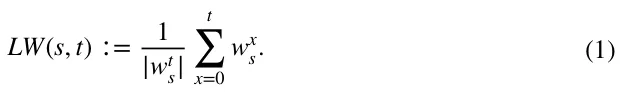
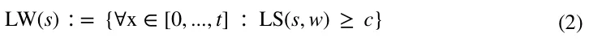
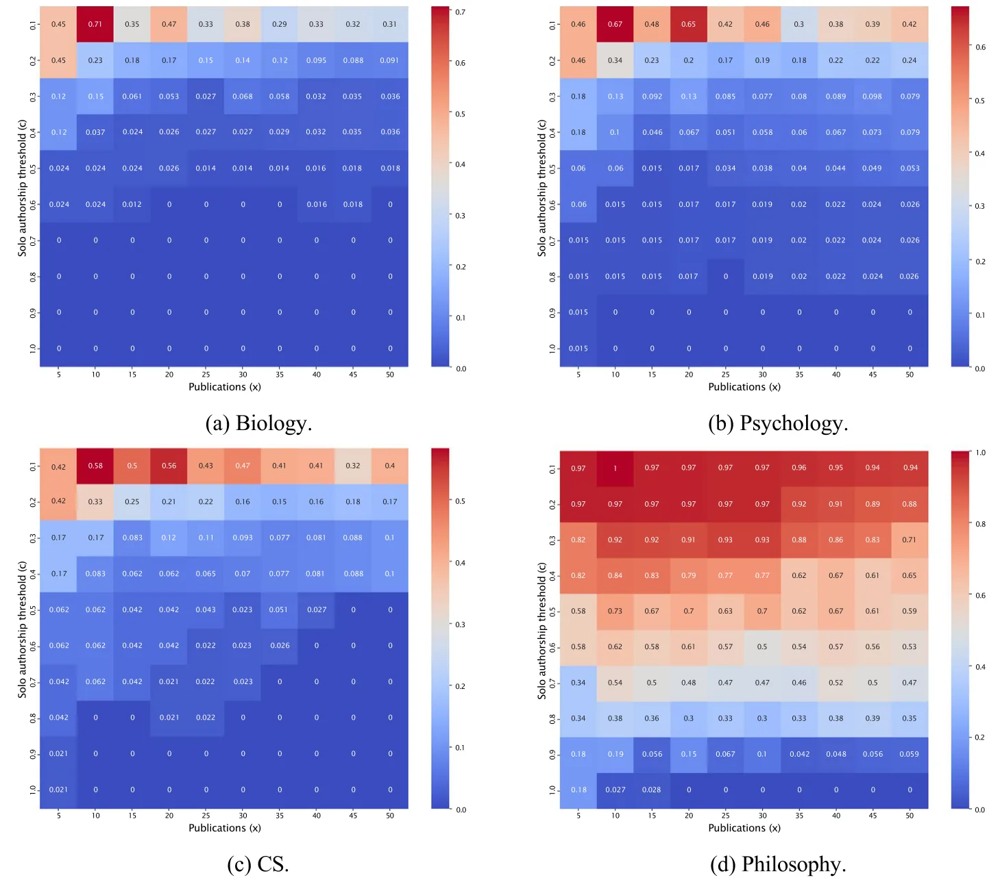
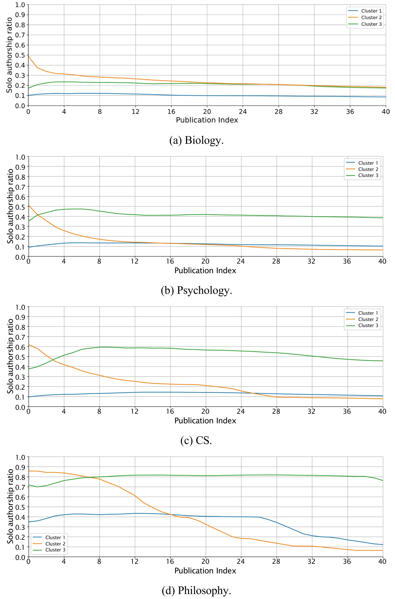
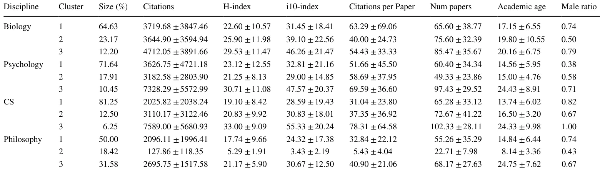

## Introduction

In contemporary science, collaboration and “team science” has become a cornerstone of scientific progress (Bozeman & Youtie, 2018; Lazebnik et al., 2023). This dramatic shift from solo-authored to team-authored publications, which primarily took place during the twentieth century, is well documented (de Solla Price, 1963; Greene, 2007; Leahey, 2016), extensively studied (Hall et al., 2018; Larivière et al., 2015; Wagner et al., 2017), and seems to span across virtually all fields of science (Wuchty et al., 2007). In particular,

Teddy Lazebnik and Ariel Rosenfeld have equally contributed to this work.

the Exact Sciences seem to present the most striking shift (Freeman et al., 2014; Ryu, 2020), followed by the Social Sciences (Henriksen, 2016; Hunter & Leahey, 2008; Stoltz, 2023) and Life and Medical Sciences (Allen et al., 2014; Fochler et al., 2016; Nabout et al., 2015), and trailed by the Arts and Humanities (Larivière et al., 2006). Taken jointly, the accumulating evidence suggests that solo-authored *publications* are becoming increasingly rare (Kuld & O’Hagan, 2018; Moosa & Li, 2019; Tewksbury & Mustaine, 2011) and team-authored publications are becoming widely common (Amjad et al., 2017), (Wuchty et al., 2007).

The distinction between solo and team-authored publications is a principal one as it reflects more than just differences in the number of contributors—it highlights the evolving nature of scientific inquiry (Berensmeyer et al., 2012; Haslam & Laham, 2009). Solo publications remain vital as a testament to the power of individual creativity and intellectual rigor where a single scholar assumes full responsibility for every stage of the research process—from the initial formulation of the research question to the design, analysis, interpretation, and dissemination of results (Kwiek & Roszka, 2021). As a result, it is often claimed that solo research “deserves to be studied in more depth because of its unbiased signaling of scientists’ ability, credibility, and independence” (Moosa & Li, 2019). The team-authored publications, on the other hand, represent the collaborative ethos of contemporary science, where collective efforts are often necessary to address increasingly complex questions (Na & Suh, 2020), (Ductor, 2015), (Zuo & Zhao, 2018). This duality underscores the complementary roles both modes of scholarship play in advancing knowledge.

Interestingly, existing research on solo-authorship typically focuses on *publications* rather than *scholar’s publication dynamics*. Specifically, the basic unit of analysis common in studying solo-authorship is the individual publication rather than the scholar(s) who produced that publication. As a result, existing literature predominantly explores the differences, dynamics, and determinants of solo-authored *publications*. For example, several factors seem to account for this increase in team-authored publications, such as the prevalence of multi-disciplinary research and the increasing pressure to publish (Bergen & Bressler, 2017). On average, team-based research brings about greater chances of reaching better and more competitive out- comes as observed, for example, through higher citation levels (Acedo et al., 2006; Valderas, 2007; Zhang et al., 2018), greater chances of reaching the top-cited publications (Bjórk, 2019; Lee et al., 2015), and have higher chance to be accepted (Wuchty et al., 2007), to name a few. Un- fortunately, when other units of analysis are intended, such as disciplines or gender, publication-level data is first aggregated and then divided by the total number of publications associated with the relevant unit (Acedo et al., 2006; Ghiasi et al., 2019; Jeong et al., 2011). As noted in prior work (Abramo et al., 2014), this approach may introduce various distortions to the analysis due to the uneven distribution of scientific production and impact (Hyland, 2016). Consequently, this typ- ical perspective leaves *scholar-level* solo-authorship dynamics and their relation with academic success under-explored and misrepresented. To the best of our knowledge, only a handful of works have adopted a clear scholar-level perspective on solo-authorship. Notably, (Kwiek & Roszka, 2022) examined the “gender solo-research gap”, and identified a modest difference between male and female Polish scholars in their propensity to publish solo-authored publications. Similarly, (Abramo et al., 2011, 2014, 2019a) have considered Italian scholars from various disciplines, showing that the propensity to publish alone, in some disciplines and under some circumstances, varies across academic rank and gender. Similarly, (Abramo et al., 2019b) focused on “top scientists”, showing that their propensity to publish alone is slightly lower than that of other scholars. In addition, (Vafeas, 2010)

have considered the publications made in 25 accounting and finance journals over a five-year period and, in one of their analytics, showed that scholars affiliated with higher-ranked institutions are also as- sociated with a higher prevalence of solo-authored publications. In contrast, scholar-level *collaboration* practices of individual scholars have received significantly more attention, including detailed analyses of the number of collaborators, their institutional affiliations, geographical proximity, disciplinary diversity, and the overall structure of collaborative networks. In turn, various factors have been identified as associated with one’s collaboration patterns such as age (Wang et al., 2017), discipline (Zeng et al., 2016), gender (Moosa & Li, 2019), impact (Zeng et al., 2022), ability to work in a group (Savchenko & Rosenfled, 2024), and cultural and geographical proximity (Olechnicka et al., 2019), (Bozeman & Corley, 2004), to name a few. Unfortunately, these results need not necessarily extend well to explain solo-authorship.

Prior work has also highlighted several psychological, sociological, institutional and other factors associated with solo-authorship. From a psychological perspective, (Garino et al., 2023) found that scholars may expe- rience motivational factors such as a sense of accomplishment from individual efforts, which reinforces their inclination to publish alone. Similarly, (Kuld & O’Hagan, 2018) showed that pressures associated with collaborative work might discourage some scholars from pursuing teamwork, contributing to solo-authorship. Socio- logically, (Bendels et al., 2018) revealed that many scholars experience increasing pressures to engage in teamwork due to the growth of research requiring diverse expertise. On the other hand, (Hunter & Leahey, 2008) claimed that the academic system tends to value solo-authored publications higher as they are perceived as markers of individual scholarship, thus motivating scholars to prioritize solo-authorship when possible. Institutionally, promotion and tenure policies frequently emphasize the importance of solo authorship, creating an environment where solo publications are viewed as more prestigious (Stoltz, 2023). In this context, (Vasan & West, 2021) claimed that such institutional biases may result in disincentivizing collaboration, particularly among younger faculty and early-career scholars who are keen to meet these evaluative criteria. Taken jointly, these and similar factors highlight the multi-faced nature of the solo-authorship phenomena, yet they do not provide a scientometric analysis of solo-authorship dynamics.

In this work, we seek to bridge some of the gap between the extensive knowledge of collaboration patterns and the limited understanding of solo-authorship dynamics by adopting a scholar-level perspective, which is uncommon in the scientometric study of solo-authorship dynamics. We *describe and explore* the solo-authorship dynamics of a large sample of individual scholars (*N* = 7238) from four disciplines (Biology, Computer Science, Psychology, and Philosophy) using heatmap analysis, time series clustering, and statistical analysis. In particular, we are interested in finding the prevalence of scholars who (rather) consistently practice solo-authorship and identifying the most prominent solo-authorship dynamics presented by scholars in the four disciplines. Finally, we are interested in relating these patterns to possible differences in common influence metrics such as citation counts, i10-index, and the H-index (Bornmann & Daniel, 2007).

Metaphorically, some conceptualize scholars who frequently practice solo-authorship as “lone wolves” (Barr et al., 2005; Dixon et al., 2003) (LWs). The analogy behind this metaphor relates scholars to wolves, solo-authorship to lone hunting, and academic success to ecological thriving. Following the underlying reasoning of this metaphor, our work can be seen as a step beyond the typical observation that “lone hunting” is diminishing, as established in prior publication-based analyses, and explores the “lone wolves” phenomena. The interested reader may refer to a comprehensive overview of the history and theoretical conceptualization of collaboration and solo-authorship in academia, and especially in academic careers (Wang & Barabasi, 2021).

The remainder of this article is organized as follows: “Methods and Materials” section outlines the methods, data, and ana analytical procedures conducted. “Results” section presents the obtained results. Finally, “Discussion” section discusses the results in the wider context and suggests possible future work directions.

## Methods and materials

In this section, we first formally define a solo-authorship measure based on a scholar’s body of work over time. Then, we detail the data used in this study followed by the analytical procedures.

### Quantifying solo‑authorship

Aligned with prior work [e.g., (Abramo et al., 2014)], we define scholar *s*’s propensity to engage in solo-authorship as the ratio of their solo-authored publications to the total number of publications. Since we are interested in the *temporal* dynamics of this ratio at the individual scholar level, we (re)evaluate the ratio following each publication made by the scholar in question, resulting in a time series *w*t starting at with scholar’s solo-authorship ratio at the first publication onwards (*t* = 1, 2,…). A scholar is considered a “Lone

Wolf” (LW) at publication *x* if *w*x ≥ *c* for a given threshold parameter *c* ∈ [0*,* 1]. Formally, let us define the “LW level” of a scholar (*s*) after her *t*’th publication as follows:

For a given threshold parameter, *c*, *s* is considered a LW following these publications:

For example, let us assume scholar *s* has (co-)authored five publications with the first, fourth, and fifth publications being solo-authored. Using the above definition, the resulting time series would be *w*t = < 1*,* 0.5*,* 0.33*,* 0.5*,* 0.6 >. Using a threshold parameter *c* = 0.6 (i.e., scholars with a ratio greater or equal to 0.6 are considered LW) would deem this scholar to be an LW at the first and fifth publications only.

### Data

We utilize the dataset garnered by (Alexi et al., 2024) consisting of approximately 160*,* 000 individual scholars who are associated with four distinct disciplines: Biology, Computer Science, Psychology, and Philosophy. For this study, a random sample of 10,000 Google Scholar (GS) profiles was selected in order to balance between sample size and computational time and burden. GS is a valuable scientometric source due to its broad coverage of academic literature, making it useful for citation analysis and impact assessment (Aguillo, 2012; Martín-Martín et al., 2021). In fact, several prior works have highlighted the dominance and advantages of GS compared to its alternatives (Gusenbauer, 2019; Martín-Martín et al., 2018). Nevertheless, its important to note that GS is also known for its lack of transparency in indexing criteria and susceptibility to citation inflation (Kousha & Thelwall, 2008). In order to focus on established and active scholars, we omitted those without any GS-indexed publications in the last three years and those with less than ten publications overall. As a result, 2762 profiles were omitted, and 7238 scholars are considered from this point onward. Each scholar was associated with his entire body of work, as indexed by GS.

For each profile in the resulting dataset, the following measures were retrieved and/or calculated based on the GS profiles: citations total, h-index, i10-index, average citations per publication, total number of publications, and academic age (i.e., years since first indexed publication). In addition, each profile was further characterized by an estimated gender as provided in the original data (Alexi et al., 2024). Specifically, the authors have adopted a machine-learning-based model proposed by (Hu et al., 2021) that estimates gender based on one’s name. To avoid sub-quality estimations, the authors only adopted the estimations provided at a high confidence (95% or more). In our subsequent gender-based analysis, only scholars with a high-confidence gender estimation were considered.

### Analytical approach

Before analyzing the data, we transform each scholar-level publication data into a time series following the solo-authorship definition provided in the “Methods and Materials” section. The resulting set of time series is then divided into four subsets- one for each of the examined disciplines.

Our analysis consists of two core parts: First, we examine the prevalence of LWs in the four disciplines using a heatmap analysis. Specifically, for each discipline and a varying threshold parameter *c*, we assess the prevalence of LWs considering the solo-authorship ratio at the *x*’th publication of each scholar (i.e., *w*x). Second, we identify the prominent temporal patterns among the time series in each discipline using the time series version of the K-means clustering algorithm (Niennattrakul & Ratanamahatana, 2007) with the dynamic time wrapping metric (Li, 2021). All trajectories were considered simultaneously regardless of their length (i.e., number of publications), as nat¨ıve to the clustering algorithm. To find the optimal number of clusters (i.e., *k*), we used the elbow point method with the standard intra-agreement metric (Bholowalia & Kumar, 2014). Notably, the clusters ob- tained from such methods are statistically significantly different in a pair-wise manner in terms of their temporal dynamics (Wu et al., 2009). Following the common practice in cluster-based analysis (Arabie et al., 1996), we then perform a post-hoc analysis of the identified clusters. For each identified cluster, we computed its prevalence among the scholars in the discipline as well as its members’ average total number of publications, total citations, citations per publication, h-index, i10-index, academic age, and gender distributions. We assess the differences between identified clusters and across disciplines using a Kruskal–Wallis test with post-hoc pairwise Mann–Whitney *U*-test with a Bonferroni correction (Okoye & Hosseini, 2024) and a chi-square test (Preacher, 2001). Statistical significance was set to *p* = 0*.*05.

## Results

Our data consists of 7238 scholars, who are associated with four disciplines—Biology, Computer Science (CS), Philosophy, and Psychology with the following distribution: 2035 (28.2%), 1984 (27.6%), 1154 (16.0%), and 2041 (28.2%), accordingly. Table 1 presents the descriptive statistics of the measures associated with members of each discipline.

### LW prevalence

The prevalence of LWs is depicted in Figure 1. As expected, the prevalence of LWs is monotonically non-increasing in *c* since higher thresholds naturally entail fewer (or an equal number of) scholars surpassing them. That is not the case when the number of publications increases, as evidenced by the non-consistent changes across the four disciplines. Starting with Biology (subfigure 1a), considering the minimal threshold of 0.1, the prevalence of LWs peaks at the tenth publication at 71% yet sharply drops afterward, stabilizing in the 29–38% range from the twenty-fifth publication onward. When the threshold is increased to 0.2, the LW prevalence peaks at the fifth publication at 45% but drops sharply once more at the tenth publication (23%) onward, with the prevalence generally declining with the number of publications to a minimum of 8.8% at the forty-fifth publication. The declining trend is less apparent for a threshold of 0.3, which peaks at the tenth publication at 15% and varies in the 2.7%–6.8% range onward. The LW prevalence does not exceed 5% for thresholds larger than 0.3 except for a single exception (fifth publication using a 0.4 threshold). No LWs are identified for a threshold larger than 0.6 for any number of publications.

Psychology (subfigure 1b), presents roughly similar trends. Considering the minimal threshold of 0.1, the LW prevalence peaks at the tenth publication at 67%. However, it peaks once more at the twentieth publication at 65% and it remains generally unstable onward. When the threshold is increased to 0.2, the LW prevalence peaks at the fifth publication at 46%, and the LW prevalence seems to be rather stable in the 18–23% range from the fifteenth publication onward. A similar pattern is observed for the 0.3 and 0.4 thresholds with the LW prevalence peaking at 18% for the fifth publication for both thresholds and varying in the 7.7–13% and 5.1–10% ranges onward, respectively. The LW prevalence does not exceed 5% for thresholds larger than 0.5 except for a single exception (fifth publication using a 0.6 threshold). No LWs are identified for a threshold larger than 0.8 following the tenth publication onward.

<figure class="table-figure" id="table-1">
<figcaption><strong>Table 1</strong> Descriptive statistics of the data</figcaption>

<table><tr><th>Discipline</th><th>Total citations</th><th>H-index</th><th>i10-index</th><th>Avg. citations per pub.</th><th>Num papers</th><th>Male ratio</th></tr><tr><td>Biology</td><td>3940.50 ± 3851.38</td><td>24.61 ± 11.34</td><td>35.82 ± 20.66</td><td>58.40 ± 58.95</td><td>71.43 ± 38.27</td><td>0.72</td></tr><tr><td>Psychology</td><td>3933.93 ± 4689.78</td><td>23.58 ± 11.99</td><td>33.67 ± 20.70</td><td>54.79 ± 43.74</td><td>62.28 ± 34.63</td><td>0.45</td></tr><tr><td>CS</td><td>2509.06 ± 2908.44</td><td>20.19 ± 9.29</td><td>30.54 ± 20.36</td><td>34.78 ± 31.97</td><td>68.52 ± 35.14</td><td>0.81</td></tr><tr><td>Philosophy</td><td>1922.89 ± 1876.13</td><td>16.53 ± 9.44</td><td>22.47 ± 17.06</td><td>30.33 ± 23.24</td><td>53.34 ± 33.46</td><td>0.66</td></tr></table>

Measures are presented as average ± standard deviation unless stated otherwise

</figure>

<figure id="fig-1">

<figcaption><strong>Fig. 1</strong> LW prevalence in the examined disciples. The X-axis denoted the publication number and the Y-axis denoted the minimal threshold to be considered a LW</figcaption>
</figure>

CS (subfigure 1c, too, follows roughly the same patterns. Considering the minimal threshold of 0.1, LW prevalence peaks at the tenth publication at 58% and peaks once more at the twentieth publication at 56%. When the threshold is increased to 0.2, the LW prevalence peaks at the fifth publication at 42% yet the LW prevalence seems to be rather stable at the 15–25% range from the fifteenth publication onward. A similar pattern is observed for the 0.3 and 0.4 thresholds with the LW prevalence peaking at 17% for the fifth publication for both thresholds and varying in the 7.7–12% and 6.2–10% ranges onward, respectively. The LW prevalence does not exceed 5% for thresholds larger than 0.6 except for a single exception (tenth publication using a 0.7 threshold). No LWs are identified for a threshold larger than 0.8 following the tenth publication onward.

Finally, Philosophy (subfigure 1 d), presents remarkably high LW prevalence at almost all thresholds. Starting with a prevalence of 94%–100% at a 0.1 threshold, the prevalence remains notably high for thresholds 0.2 (88%–97%), 0.3 (71%–93%), 0.4 (62%–84%), 0.5 (58%–73%), 0.6 (50%–62%), and 0.7 (34%–54%). The first substantial decline in prevalence is encountered when the threshold is increased from 0.8 to 0.9 where the LW prevalence range drops from the 30–39% range to the 4.8–19% range. No LWs are found only for the maximal threshold of 1 and following the twentieth publication onward. Generally, the LW prevalence seems to decline following the thirtieth publication onward for all thresholds. For example, for a threshold of 0.4, the LW prevalence range drops from 77%–84% to 61–67% following the thirteenth publication. However, this trend does not seem to be entirely consistent as can be observed for a 0.6 threshold.

### Temporal patterns

Figure 2 presents the results of clustering the scholars’ time series (i.e., solo-authorship ratio trajectories). For clear presentation, the figure focuses on the trajectory from the first to the fortieth publication only (it was computed for the entire trajectory of each scholar). Three clusters were automatically identified for each discipline, and the measures associated with the members of each cluster are presented in Table 1. We start by focusing on the identified temporal patterns (observed in Figure 2) and their prevalence (the “Size” column in the table), followed by an analysis of potential differences between the clusters based on the observed measures (the remaining columns of the table).

Several commonalities seem to emerge between the clusters identified in Biology, Psychology, and/or CS. First, for these three disciplines, Cluster 1 is characterized by a low solo-authorship ratio (generally in the 0.1–0.2 range) that seems roughly stable throughout most of one’s career. This temporal pattern accounts for most scholars in these three disciplines: 64.63% of Biology, 71.64% of Psychology, and 81.25% of CS. Intuitively, we refer to this cluster’s members as “Non-LWs” as their trajectory does not point to any notable inclination to solo-publish. Cluster 3 in these three disciplines seems to present a similar trend, albeit at a higher solo-authorship rate: in Biology roughly 0.2, in Psychology roughly 0.4 and in CS roughly 0.5 whereas for the latter, the pattern seems slightly less stable than the former two disciplines as it initially shows an increase followed by a steady, yet mild, decrease. These clusters are the smallest in their respective disciplines—12.2% in Biology, 10.45% in Psychology, and 6.25% in CS. Intuitively, we will refer to the members of this cluster as “LWs” as they present a clear tendency to considerably and, generally steadily, practice solo-authorship. Finally, Cluster 2 in these three disciplines demonstrates a consistent decline from a notably high solo-authorship rate (0.5–0.6) to a significantly lower one. However, in Biology, this cluster declines towards a ratio of 0.2 whereas in Psychology and CS, the clusters diminish to lower solo-authorship rates (≤ 0.1). These clusters account for 23.17% of Biology scholars, 17.91% of Psychology scholars, and 12.5% of CS scholars. Intuitively, we will refer to the members of these clusters as “Diminishing LWs” given their consistently decaying pattern.

Philosophy, too, presents three temporal patterns that generally align with the three clusters identified for Biology, Psychology, and CS. Specifically, two clusters present a rather stable pattern, one at higher values than the other (Clusters 1 and 3), and another cluster that presents a consistently diminishing pattern (Cluster 2). However, these clusters differ in two major ways from their respective ones analyzed before: First, Cluster 1 and 3 present significantly higher solo-authorship rates (Cluster 1 is roughly 0.4 until the 26 th publication and Cluster 3 is roughly 0.8). Second, fewer scholars are associated with Cluster 1 (50% vs 64.63–81.25%), and significantly more are associated with Cluster 3 (31.58% vs 6.25–12.2%). Nevertheless, it may still be reasonable to refer to the members of Cluster 1 as “non-LWs”, Cluster 2 as “Diminishing LWs”, and Cluster 3 as “LWs” given the overall inflation in solo-publishing in this discipline.

<figure id="fig-2">

<figcaption><strong>Fig. 2</strong> The time-series centroids of the clusters identified in each discipline. The X-axis denotes the number of publications and the Y-axis denotes the solo-authorship ratio</figcaption>
</figure>

Table 2 summarizes the measures associated with the members of each cluster. Very few differences are found to be statistically significant in Biology, Psychology, and CS. In Biology, Cluster 1 is associated with a statistically significantly lower i10-index compared to Cluster 3 (an average of 31.45 compared to 46.26) but not compared to Cluster 2 (39.1). In Psychology, Cluster 3 is associated with a significantly higher number of publications compared to both Cluster 1 and 2 (97.43 vs 60.4 and 49.33, respectively), yet it is also associated with a higher academic age compared to both clusters (24.43 vs 14.56 and 15, respectively) which naturally mitigates this relation. In CS, no significant difference is encountered. In Philosophy, on the other hand, all measures other than gender present statistically sig- nificant differences. Specifically, Cluster 2 is different from Clusters 1 and 3 as it is associated with lower total citations (127.87 vs 2096.11 and 2695.75, respectively), H-index (5.29 vs 17.74 and 21.17, respectively), i10-index (3.43 vs 24.32 and 30.67, respectively), citations per publication (5.43 vs 32.84 and 40.9, respectively), number of publication (22.71 vs 55.26 and 68.17, respectively), and academic age (8.14 vs 14.84 and 24.75, respectively). The only significant difference between Clusters 1 and 3 was encountered for academic age.

In terms of gender, in all four disciplines, the three identified clusters are statistically different. Pair- wise testing within each discipline suggests that all cluster pairs are significantly different from each other, except for the first and third cluster in Biology and in Philosophy, at *p* < 0*.*05. Specifically, in all four disciplines, the second cluster has a lower male rate than the third cluster. In addition, for Biology, CS, and Philosophy, the first cluster has a higher rate of males than the second cluster, whereas in Psychology, the reverse is observed. Finally, in two out of the four disciplines (Psychology and CS), a higher male rate in the cluster is observed compared to the third.

## Discussion

Above all, the results combine into three major outcomes: First, a global definition of LWs seems unrea- sonable and it may lead to various distortions; Second, several under-explored commonalities between scholars of different disciplines emerge, potentially indicating some fundamental underlying factors shaping scholars’ individual solo-authorship dynamics; Finally, no clear association between scholars’ solo-authorship dynamics and their influence measures could be found.

First, as observed in Figure 1, LW prevalence is sensitive to parameter setting and varies widely across disciplines. That is, any parameter configuration would likely bring about remarkably different portions of scholars qualifying as LWs. Considering also the clusters identified in Figure 2, a scholar’s solo-authorship behavior in one discipline may, and arguably should, be considered very differently in another. For example, if a psychology scholar solo-publishes 40% of her work evenly across her career, then this pattern may be considered a characteristic of Psychology LW behavior. However, this pattern seems to be a strong indicator of a non-LW behavior in Philosophy. This outcome supports prior works suggesting that disciplinary norms and collaboration practices are strongly associated with solo-authorship (Li et al., 2020), (Powell et al., 2005). However, as discussed before, our results extend and reaffirm this claim at the *individual scholar level*. Consequently, it seems reasonable to define and analyze LWs only in a relevant context.

Second, as observed in Figure 2, all four disciplines present exactly three similar temporal patterns. These patterns correspond to three characteristic dynamics: LWs who publish rather consistently at low solo-authorship ratios; non-LWs who publish rather consistently at higher solo-authorship ratios; and diminishing-LWs from whom solo-publishing is diminishing over publications. Further support for these commonalities can be observed in the similar heatmap patterns observed for Biology, Psychology, and CS in Figure 1. Furthermore, similar gender disparities are observed across the four disciplines. This arguably surprising resemblance, which has yet to be identified before, extends our previous outcome, suggesting that while LWs should be defined and investigated in context, several common underlying factors may drive solo-authorship dynamics similarly across disciplines. In this context, it is important to note prior work has identified disciplinary differences in solo-publishing at the publication level (Berensmeyer et al., 2012; Burroughs, 2017; Li et al., 2018). Notably, in the Arts and Humanities such as History and Museology, solo-authorship is a well-established, strongly-rooted practice that seems to prevail to this day (Wuchty et al., 2007). In this respect, our outcome questions the assumed inherent differences between disciplines at the scholar-level, suggesting that scholars generally tend to adhere to common patterns that vary only in specific aspects across dis- ciplines. We believe that this outcome merits a deeper investigation into these potential factors in the future.

<figure class="table-figure" id="table-2">
<figcaption><strong>Table 2</strong> The measures associated with the members of each cluster divided by discipline</figcaption>

</figure>

Finally, as observed in Table 2, our results do not support any significant relation between one’s solo-publishing behavior and influence metrics such as total citations, h-index, i10-index, citation per publication, and number of publications. Specifically, for Biology, Psychology, and CS, the clusters do not differ in their members’ influence metrics (except for two, seemingly spurious exceptions), while their members’ average academic age and gender distribution are statistically indistinguishable. In Phi- losophy, only a single cluster is found to consistently differ from the other two in terms of its members’ influence metrics. However, this cluster is also statistically different in its members’ average academic age, which presumably can explain a large part of these differences. Note that the other two clusters do not differ significantly on any influence measure. This outcome does not seem to align with prior work suggesting the contrary at the individual publication level (Bornmann & Daniel, 2007). As before, we attribute some of this misalignment to the analysis of scholar-level dynamics rather than individual publication, which, as we discussed before, provides a complementary and more nuanced perspective on the solo-authorship phenomena. However, it is important to note that the lack of a statistically significant relationship in our data does not explicitly signify that solo-authorship and impact are orthogonal. As discussed earlier in this article, various psychological, sociological, institutional and other factors may partially account the variability in solo-authorship and impact as well, meriting further investigation.

This study’s outcomes suggest a few practical implications for the academic community, particularly in research evaluation, career progression, and scholarly collaboration (Bosco et al., 2024). First, various stakeholders, such as hiring, tenure, and promotion committees, should recognize the diverse scholarly trajectories and disciplinary differences in solo-authorship and contextualize solo-publication records rather than applying rigid, one-size-fits-all criteria. More broadly, as the number of multi-disciplinary scholars is on the rise (Caselli et al., 2007; Massey et al., 2006; Mathur et al., 2019), such committees should take into consideration the differences between disciplines to perform a fair evaluation. Furthermore, the identification of shared solo-authorship dynamics, as depicted in Fig. 2, raises new opportunities for monitoring, career planning and support. Finally, as the saying goes, a leopard cannot change its spots. In our context, we find no evidence of a clear pattern in which scholars who primarily publish in teams increase their solo-publishing tendencies. The reverse, however, seems to be prevalent across all four disciplines. As such, existing policies for encouraging solo-authorship *among scholars who primarily team-author publications* seem to be largely unsuccessful, and therefore, their reevaluation seems merited (Zelenski et al., 2012).

It is important to note that this work has several limitations that offer fruitful opportunities for future work. First, our evaluation focuses on a sample of scholars from four disciplines based on their departmental affiliation. As such, different definitions of disciplines may result in different outcomes. For example, explicitly considering sub-disciplines such as theoretical vs applied CS may provide deeper insights into the within-discipline variations. It is important to note, however, that any disciplinary def- inition may introduce complementary challenges as they may not fully align with scholars’ entire body of work (Porter et al., 2008). Second, alternative formulations of LWs may be considered, thus reflecting other perspectives on this elusive notion. For example, one may be more interested in the more recent publication practices of a scholar rather than the initial one as the latter may be influenced, for example, by the academic advisor(s) (Rosenfeld & Maksimov, 2022; Savchenko & Rosenfled, 2024). Third, our data is limited to scholars who have at least ten publications. This restriction was implemented to focus on scholars with a considerable number of publications that facilitate the investigation of temporal dynamics. However, it may be the case that these early-stage scholars present different publication dynamics that require special attention. Fourth, additional factors may influence solo-publishing, such as country and institution-level scientific policies, mentoring practices, funding requirements, and even an individual’s desire for scientific distinction attributed to his/her name. Disciplinary variations, for example, may be partially attributed to structural factors, funding schemes, and evaluation criteria that vary widely across disciplines (Becher & Trowler, 2001). These factors are not readily available in standard indexing services, such as GS, and offer a promising avenue for future work. These factors may alter the solo-authorship practices of scholars and require further investigation. Fifth, in this study, we used data sourced from GS that, despite being widely adopted in research and practice, presents several shortcomings such as the inclusion of non-peer-reviewed publications and potential inconsistencies in scholar identification. Hence, future work should extend this study by adopting complementary databases such as Scopus and Web of Science. Finally, solo-authorship as considered in this work does not capture teamwork which resulted in a solo-publication. For example, in many publications, the author(s) explicitly acknowledge the support or help of other collaborators who do not receive authorship credit. This intriguing type of solo-authorship is left for future work.

We intend to extend our work in four main directions: First, we intend to provide a finer-grained analysis by integrating scholar-level and publication-level analyses. Specifically, we wish to explicitly consider an individual’s solo vs non-solo publications. A preliminary investigation of the topic sug- gests that scholars who present higher levels of solo-authorship (e.g., Cluster 3 in Psychology and CS) are associated with higher citation levels for both their solo-authored and team-authored publications. However, no clear difference between these two types of publications was observed at the individual scholar level. Further investigation into these intriguing preliminary findings seems merited. Second, we plan to extend our formalism and develop a relative, parameter-free formalism of LWs, that would make discipline-specific instantiations unnecessary. Third, in order to further study the relationships between author’s properties, scientormetrics, and solo-authorship, we plain to conduct further regression analysis using machine learning methods. Last, given the intriguing and arguably surprising outcomes observed in this work, we plan to pursue a more in-depth investigation into possible causal relationships.

**Acknowledgements** The authors wish to thank Arnon Levy for the thought-provoking discussions and Mary the cat for inspiring this line of work.

**Author contributions** Teddy Lazebnik: conceptualization, data curation, software, resources, formal analysis, investigation, visualization, methodology, writing—review & editing, project administration. Ariel Rosenfeld: conceptualization, data curation, resources, validation, investigation, methodology, writing— original draft, writing—review & editing.

**Funding** Open access funding provided by Ariel University. The authors have not disclosed any funding.

**Data availability** The data used in this study is available upon reasonable request from the authors.

## Declarations

**Conflict of interest** The authors declare no conflict of interest.

## References

- Abramo, G., D’Angelo, C. A., & Di Costa, F. (2019a). A gender analysis of top scientists’ collaboration behavior: Evidence from italy. Scientometrics, 120, 405–418.
- Abramo, G., D’angelo, C. A., & Di Costa, F. (2019b). The collaboration behavior of top scientists. Scien- Tometrics, 118, 215–232.
- Abramo, G., D’Angelo, C. A., & Murgia, G. (2014). Variation in research collaboration patterns across academic ranks. Scientometrics, 98, 2275–2294.
- Abramo, G., D’Angelo, C. A., & Solazzi, M. (2011). Are researchers that collaborate more at the international level top performers? An investigation on the Italian university system. Journal of Informetrics, 5(1), 204–213.
- Acedo, F. J., Barroso, C., Casanueva, C., & Galan, J. L. (2006). Co-authorship in management and organizational studies: An empirical and network analysis. Journal of Management Studies, 43(5), 957–983.
- Aguillo, I. F. (2012). Is google scholar useful for bibliometrics? A webometric analysis. Scientometrics, 91(2), 343–351.
- Alexi, A., Lazebnik, T., & Rosenfeld, A. (2024). The scientometrics and reciprocality underlying co-authorship panels in google scholar profiles. Scientometrics, 129, 3303–3313.
- Allen, L., Scott, J., Brand, A., Hlava, M., & Altman, M. (2014). Publishing: Credit where credit is due. Nature, 508(7496), 312–313.
- Amjad, T., Ding, Y., Jian, Xu., Zhang, C., Daud, A., Tang, J., & Song, M. (2017). Standing on the shoulders of giants. Journal of Informetrics, 11(1), 307–323.
- Arabie, P., Hubert, L., & De Soete, G. (1996). Clustering and classification. World Scientific.
- Barr, T. F., Dixon, A. L., & Gassenheimer, J. B. (2005). Exploring the “lone wolf” phenomenon in student teams. Journal of Marketing Education, 27(1), 81–90.
- Becher, T., & Trowler, P. (2001). Academic tribes and territories. McGraw-Hill Education.
- Bendels, M. H. K., Müller, R., Brueggmann, D., & Groneberg, D. A. (2018). Gender disparities in high-quality research revealed by nature index journals. PLoS One, 13, 10189136.
- Berensmeyer, I., Buelens, G., Demoor, M., Berensmeyer, I., Buelens, G., & Demoor, M. (2012). Introduction authorship as cultural performance: New perspectives in authorship studies. Zeitschrift Für Ang-listik und Amerikanistik, 60(1), 1–29.
- P. Bholowalia & A. Kumar. (2014). Ebk-means: A clustering technique based on elbow method and k-means in WSN. International Journal of Computer Applications. 105(9).
- Bjórk, B.-C. (2019). Acceptance rates of scholarly peer-reviewed journals: A literature survey. El Profe-sional De La Información, 5, 46. [doi:10.3145/epi.2019.jul.07](https://doi.org/10.3145/epi.2019.jul.07)
- Bornmann, L., & Daniel, H.-D. (2007). What do we know about the H index? Journal of the American Society for Information Science and Technology, 58(9), 1381–1385. [doi:10.3145/epi.2019.jul.07](https://doi.org/10.3145/epi.2019.jul.07)
- Bosco, A., Verney, S., Bermu´dez, S., & Tonarelli, A. (2024). Surviving in a male academia: Gender gap, publication strategies and career stage in south european political science journals. European Political Science, 23(3), 297–320.
- Bozeman, B., & Corley, E. (2004). Scientists’ collaboration strategies: Implications for scientific and technical human capital. Research Policy, 33(4), 599–616.
- Bozeman, B., & Youtie, J. (2018). The strength in numbers: The new science of team science. Princeton University Press.
- Burroughs, J. M. (2017). No uniform culture: Patterns of collaborative research in the humanities. Portal: Libraries and the Academy, 17(3), 507–527.
- Caselli, G., Egidi, V., & Key, J. (2007). The need for a multi-disciplinary approach. Population, 62(1), 33–37.
- D. J. de Solla Price. (1963). Little science, big science.
- Dixon, A. L., Gassenheimer, J. B., & Barr, T. F. (2003). Identifying the lone wolf: A team perspective. Journal of Personal Selling & Sales Management, 23(3), 205–219.
- Ductor, L. (2015). Does co-authorship lead to higher academic productivity? Oxford Bulletin of Economics and Statistics, 77(3), 385–407.
- Fochler, M., Felt, U., & Muller, R. (2016). Unsustainable growth, hyper-competition, and worth in life science research: Narrowing evaluative repertoires in doctoral and postdoctoral scientists’ work and lives. Minerva, 54, 175–200.
- Freeman, R. B., Ganguli, I., & Murciano-Goroff, R. (2014). Why and wherefore of increased scientific collaboration. The changing frontier: Rethinking science and innovation policy (pp. 17–48). University of Chicago Press.
- Garino, A., Cawley, J. F., Kayingo, G., & Min, E. A. (2023). Pa scholars: What drives and inhibits success? The Journal of Physician Assistant Education, 35, 121–128.
- G. Ghiasi, M. Sainte-Marie, & V. Larivie\`re. (2019). Making it personal: Examining gendered personalization patterns of single-authored papers. In 17th International Conference on Scientometrics and Informetrics, ISSI 2019, pp. 2088–2093.
- Greene, M. (2007). The demise of the lone author. Nature, 450(7173), 1165–1165.
- Gusenbauer, M. (2019). Google scholar to overshadow them all? comparing the sizes of 12 academic search engines and bibliographic databases. Scientometrics, 118(1), 177–214.
- Hall, K. L., Vogel, A. L., Huang, G. C., Serrano, K. J., Rice, E. L., Tsakraklides, S. P., & Fiore, S. M. (2018). The science of team science: A review of the empirical evidence and research gaps on collaboration in science. American Psychologist, 73(4), 532.
- Haslam, N., & Laham, S. (2009). Early-career scientific achievement and patterns of authorship: The mixed blessings of publication leadership and collaboration. Research Evaluation, 18(5), 405–410.
- Henriksen, D. (2016). The rise in co-authorship in the social sciences (1980–2013). Scientometrics, 107(2), 455–476.
- Hu, Y., Hu, C., Tran, T., Kasturi, T., Joseph, E., & Gillingham, M. (2021). What’s in a name?—gender classification of names with character based machine learning models. Data Mining and Knowledge Discovery. [doi:10.1007/s10618-021-00748-6](https://doi.org/10.1007/s10618-021-00748-6)
- Hunter, L., & Leahey, E. (2008). Collaborative research in sociology: Trends and contributing factors. The American Sociologist, 39, 290–306. [doi:10.1007/s10618-021-00748-6](https://doi.org/10.1007/s10618-021-00748-6)
- K. Hyland. (2016). Academic publishing: Issues and challenges in the construction of knowledge.
- Jeong, S., Young Choi, J., & Kim, J. (2011). The determinants of research collaboration modes: Exploring the effects of research and researcher characteristics on co-authorship. Scientometrics, 89(3), 967–983.
- Kousha, K., & Thelwall, M. (2008). Sources of google scholar citations outside the science citation index: A comparison between four science disciplines. Scientometrics, 74(2), 273–294.
- Kuld, L., & O’Hagan, J. (2018). Rise of multi-authored papers in economics: Demise of the ‘lone star’and why? Scientometrics, 114(3), 1207–1225.
- Kwiek, M., & Roszka, W. (2021). Gender disparities in international research collaboration: A study of 25,000 university professors. Journal of Economic Surveys, 35(5), 1344–1380.
- Kwiek, M., & Roszka, W. (2022). Are female scientists less inclined to publish alone? The gender solo research gap. Scientometrics, 127(4), 1697–1735.
- Larivière, V., Gingras, Y., & Archambault, É. (2006). Canadian collaboration networks: A comparative analysis of the natural sciences, social sciences and the humanities. Scientometrics, 68, 519–533.
- Larivière, V., Gingras, Y., Sugimoto, C. R., & Tsou, A. (2015). Team size matters: Collaboration and scientific impact since 1900. Journal of the Association for Information Science and Technology, 66(7), 1323–1332.
- Lazebnik, T., Beck, S., & Shami, L. (2023). Academic co-authorship is a risky game. Scientometrics, 128, 6495–6507.
- Leahey, E. (2016). From sole investigator to team scientist: Trends in the practice and study of research collaboration. Annual Review of Sociology, 42(1), 81–100.
- Lee, Y.-N., Walsh, J. P., & Wang, J. (2015). Creativity in scientific teams: Unpacking novelty and impact. Research Policy, 44(3), 684–697.
- Li, H. (2021). Time works well: Dynamic time warping based on time weighting for time series data mining. Information Sciences, 547, 592–608.
- Li, Y., Li, H., Liu, N., & Liu, X. (2018). Important institutions of interinstitutional scientific collaboration networks in materials science. Scientometrics, 117(1), 85–103.
- Li, Y., Wang, K., Xiao, Y., & Froyd, J. E. (2020). Research and trends in stem education: A systematic review of journal publications. International Journal of STEM Education. [doi:10.1186/s40594-020-00207-6](https://doi.org/10.1186/s40594-020-00207-6)
- Martín-Martín, A., Orduna-Malea, E., Thelwall, M., & López-Cózar, E. D. (2018). Google scholar, web of science, and scopus: A systematic comparison of citations in 252 subject categories. Journal of Informetrics, 12(4), 1160–1177. [doi:10.1186/s40594-020-00207-6](https://doi.org/10.1186/s40594-020-00207-6)
- Martín-Martín, A., Thelwall, M., Orduna-Malea, E., & López-Cózar, E. D. (2021). Google scholar, microsoft academic, scopus, dimensions, web of science, and opencitations’ coci: A multidisci- pli-nary comparison of coverage via citations. Scientometrics, 126(1), 871–906.
- Massey, C., Alpass, F., Flett, R., Lewis, K., Morriss, S., & Sligo, F. (2006). Crossing fields: The case of a multi-disciplinary research team. Qualitative Research, 6(2), 131–147.
- Mathur, A., Lean, S. F., Maun, C., Walker, N., Cano, A., & Wood, M. E. (2019). Research ethics in inter-and multi-disciplinary teams: Differences in disciplinary interpretations. PLoS ONE, 14(11), e0225837.
- Moosa, I., & Li, L. (2019). Trends and cycles in the publication of solo papers in business and economics journals. Journal of Scholarly Publishing, 51(1), 76–98.
- Na, R. W., & Suh, B. (2020). Multi-level co-authorship network analysis on interdisciplinarity: A case study on the complexity science community. International Conference on Complex Systems. [doi:10.1007/978-3-030-67318-5_26](https://doi.org/10.1007/978-3-030-67318-5_26)
- Nabout, J. C., Parreira, M. R., Teresa, F. B., Carneiro, F. M., da Cunha, H. F., de Souza Ondei, L., Cara-mori, S. S., & Soares, T. N. (2015). Publish (in a group) or perish (alone): The trend from single-to multi-authorship in biological papers. Scientometrics, 102(1), 357–364. [doi:10.1007/978-3-030-67318-5_26](https://doi.org/10.1007/978-3-030-67318-5_26)
- V. Niennattrakul & C. A. Ratanamahatana. (2007). On clustering multimedia time series data using k-means and dynamic time warping. In 2007 International Conference on Multimedia and Ubiquitous Engineering (MUE’07), pp. 733–738. IEEE.
- Okoye, K., & Hosseini, S. (2024). Mann–whitney U test and kruskal–wallis H test statistics in R. R programming: Statistical data analysis in research (pp. 225–246). Springer.
- Olechnicka, A., Ploszaj, A., & Celińska-Janowicz, D. (2019). The geography of scientific collaboration. Taylor & Francis.
- Porter, A. L., Roessner, D. J., & Heberger, A. E. (2008). How interdisciplinary is a given body of research? Research Evaluation, 17(4), 273–282.
- Powell, W. W., White, D. R., Koput, K. W., & Owen-Smith, J. (2005). Network dynamics and field evolution: The growth of interorganizational collaboration in the life sciences. American Journal of Sociology, 110(4), 1132–1205.
- K. J. Preacher. (2001). Calculation for the chi-square test. An interactive calculation tool for chi-square tests of goodness of fit and independence. Ohio State University.
- Rosenfeld, A., & Maksimov, O. (2022). Should young computer scientists stop collaborating with their doctoral advisors? Communications of the ACM, 65(10), 66–72.
- B. K. Ryu. (2020). The demise of single-authored publications in computer science: A citation network analysis. arXiv preprint arXiv:2001.00350. [link](http://arxiv.org/abs/2001.00350)
- Savchenko, E., & Rosenfled, A. (2024). Authorship conflicts in academia: An international cross-discipline survey. Scientometrics, 129, 2101–2121. [link](http://arxiv.org/abs/2001.00350)
- Stoltz, D. S. (2023). Rising coauthorship in sociology, 1895 to 2022. Socius, 9, 23780231231171116.
- Tewksbury, R., & Mustaine, E. E. (2011). How many authors does it take to write an article? an assessment of criminology and criminal justice research article author composition. Journal of Criminal Justice Education, 22(1), 12–23.
- Vafeas, N. (2010). Determinants of single authorship. EuroMed Journal of Business, 5(3), 332–344.
- Valderas, J. M. (2007). Why do team-authored papers get cited more? Science, 317(5844), 1496–1498.
- Vasan, K., & West, J. D. (2021). The hidden influence of communities in collaborative funding of clinical science. Royal Society Open Science, 8, 210072.
- Von Bergen, C. W., & Bressler, M. S. (2017). Academe’s unspoken ethical dilemma: Author inflation in higher education. Research in Higher Education Journal, 32, 17.
- Wagner, C. S., Whetsell, T. A., & Leydesdorff, L. (2017). Growth of international collaboration in science: Revisiting six specialties. Scientometrics, 110, 1633–1652.
- Wang, D., & Barabasi, A.-L. (2021). The science of collaboration. The science of science. Cambridge University Press.
- Wang, W., Shuo, Yu., Bekele, T. M., Kong, X., & Xia, F. (2017). Scientific collaboration patterns vary with scholars’ academic ages. Scientometrics, 112, 329–343.
- J. Wu, H. Xiong, & J. Chen. (2009). Adapting the right measures for k-means clustering. In Proceedings of the 15th ACM SIGKDD international conference on knowledge discovery and data mining. pp. 877–886.
- Wuchty, S., Jones, B. F., & Uzzi, B. (2007). The increasing dominance of teams in production of knowledge. Science, 316(5827), 1036–1039.
- Zelenski, J. M., Santoro, M. S., & Whelan, D. C. (2012). Would introverts be better off if they acted more like extraverts? Exploring emotional and cognitive consequences of counterdispositional behavior. Emotion, 12(2), 290.
- Zeng, A., Fan, Y., Di, Z., Wang, Y., & Havlin, S. (2022). Impactful scientists have higher tendency to involve collaborators in new topics. Proceedings of the National Academy of Sciences, 119(33), e2207436119.
- Zeng, X. H. T., Duch, J., Sales-Pardo, M., Moreira, J. A. G., Radicchi, F., Ribeiro, H. V., Woodruff, T. K., & Amaral, L. A. N. (2016). Differences in collaboration patterns across discipline, career stage, and gender. PLoS Biology, 14(11), e1002573.
- Zhang, C., Bu, Y., Ding, Y., & Xu, J. (2018). Understanding scientific collaboration: Homophily, transitivity, and preferential attachment. Journal of the Association for Information Science and Technology, 69(1), 72–86.
- Zuo, Z., & Zhao, K. (2018). The more multidisciplinary the better?—the prevalence and interdisciplinarity of research collaborations in multidisciplinary institutions. Journal of Informetrics, 12(3), 736–756.
