## 1. Introduction

The unprecedented challenge caused by the coronavirus pandemic has swept across the globe, affecting tourism flows across all regions. According to the UNWTO World Tourism Barometer, international tourist arrivals dropped by 83% in the first quarter of 2021 compared to the same period in 2020. On an annual basis, international tourist arrivals increased by a moderate 4% in 2021, but this rate is still 72% below pre-pandemic levels. That follows an unprecedented decline of 73% in 2020, the worst year on record for international tourism. Asia and the Pacific suffered the sharpest declines in 2020, with a drop of 84% and 300 million fewer international tourist arrivals. At the same time, the Middle East and Africa both recorded a 75% decline, the Americas saw a 69% decrease, and Europe recorded a 70% plunge, with the highest drop in absolute terms—over 500 million fewer international tourists (UNWTO, 2021). Compared to 2019, in 2021 international tourist arrivals dropped by 94% in Asia and the Pacific, 79% in the Middle East, 74% in Africa, 63% in the Americas, and 62% in Europe. Moreover, the UNWTO Panel of Experts survey indicates that international tourism will not return to 2019 levels until 2024 or later (UNWTO, 2022). Indeed, international tourist arrivals more than tripled in January–May 2022 compared to 2021. Nonetheless, it still remained 54% below pre-pandemic levels.

During a pandemic, the successful restart of tourism depends on a coordinated response among countries regarding border controls, travel restrictions, and effective communication (UNWTO, 2021). Nevertheless, a one-size-fits-all strategy for all countries does not seem adequate for the containment of COVID-19. In the wake of the outbreak, many countries closed their borders completely to restrict the entry of infected travelers from countries with higher incidence rates, manage the translocation of the pathogen from one destination to another, and preserve the domestic progress made in the control of the pandemic (Hall *et al*., 2020). These measures were applied dynamically depending on changes in the epidemiological status. Thus, global surveillance of the outbreak’s dynamics is a key element for governments to make the best decisions concerning border closures. These restrictions have major implications for the economy, especially for countries that rely on tourism as a source of income (Diseases, 2020). Indeed, although these drastic measures may have reduced the importation of some cases and preserved resources, they came with enormous economic losses (Linka *et al*., 2020; Chinazzi *et al*., 2020; Boyd *et al*., 2020). The widespread border closures, travel restrictions, and the massive drop in demand resulted in an estimated loss of US$1.3 trillion in export revenues during 2020, which is more than 11 times the loss recorded during the 2008 global economic crisis. Furthermore, the direct tourism GDP was estimated at US$1.9 trillion in 2021, US$0.3 trillion above its value in 2020, but well below its pre-pandemic value of US$3.5 trillion (UNWTO, 2022).

The investigation into the impact of crises on the tourism industry began much earlier than the outbreak of the coronavirus pandemic (Aldao *et al*., 2021; Khalid *et al*., 2020). To understand how crisis management practices have been adopted in the hospitality and tourism industry Wut *et al*. (2021) systematically reviewed 512 articles spanning 36 years between 1985 and 2020, including 79 papers on COVID-19. They documented that over the last decade, health-related crises were among the biggest trends in research areas for crisis management studies. The authors suggested 10 directions for future research agendas, including adopting newer analytical methods and approaches to investigate health-related crises. Moreover, the authors indicated that the research methodologies in most of the papers on this theme appeared to be conceptual papers. A few qualitative studies used in-depth interviews and some conducted case studies, while the quantitative studies relied on online surveys or telephone surveys due to pandemic constraints.

Zhu *et al*. (2021) proposed a holistic approach to studying the sustainability of border control policies against COVID-19 during a reopening phase, in an ongoing pandemic and in conjunction with domestic control measures, with a special focus on contact tracing. The authors showed that the strictness necessary for border control policies to be sustainable varies greatly among countries. They identified the necessary conditions for border controls to avoid future lockdowns given domestic control policies and limits on incoming traffic from different risk sources tailored to meet different government objectives. However, to the best of our knowledge, these studies have not discussed the decision of nations as to whether to open their borders. They also have not assessed the economic losses for the tourism industry as a result of the closure of the borders and the loss of revenue from tourists.

To address this gap, we develop a hybrid mathematical model that consists of an epidemiological sub-model with tourism and a pandemic-focused economic sub-model. Mathematical models are known to be a powerful tool for evaluating and shaping government policies to tackle epidemiological outbreaks, in general (Nesteruk, 2020; Tuite *et al*., 2020) and economic crises, in particular (Pindyck, 2020; Acemoglu *et al*., 2020). Furthermore, tourism policies are often set based on one or more socio-economic mathematical models (Chui-Hua *et al*., 2012; Airey, 2015; Getz, 1986). Our model describes how countries can manage international tourism flows during a global pandemic using an applied in silico tool for evaluating international tourism policies and approximating an optimal policy for multiple possible scenarios. Moreover, we seek to develop an optimal border control policy, one that works in both cooperative and non-cooperative (selfish) conditions, and when there is either full or partial observable information accessible to each country regarding infection and morbidity rates in other countries.

The rest of the paper is organized as follows. In Section 2, we provide background about mathematical models for pandemic outbreaks, followed by tourism-focused economic models. In Section 3, we introduce our spatio-temporal epidemiological model with its economic dynamics. In addition, we provide an agent-based approach to simulate the model’s dynamics in silico. The approach simulates the actions and interactions of autonomous agents (in our case, individuals) to make predictions about the emerging behavior of the overall system. In Section 4, we describe a multi-agent reinforcement learning approach to approximating the optimal tourism policy of the countries taking part in international tourism. In Section 5, we present the implementation of the model for Europe (a detailed list is provided in Table A1 in Appendix, followed by an analysis of the results obtained from the simulation. In Section 6, we discuss the main epidemiological and economic results arising from the model, and conclude briefly. Figure 1 presents a schematic view of this structure.

<figure id="fig-1">
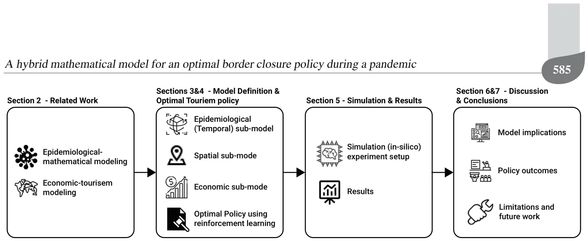
<figcaption>Fig. 1. Manuscript’s structure. First, we outline previous works on epidemiological dynamics and economics during pandemic modeling as well as an overview of the tourism industry during worldwide pandemics. Afterward, we introduce our novel epidemiological-economic mathematical model. Next, we propose a reinforcement learning approach to obtain optimal border closure policies by country-states. Afterward, we present an <em>in silico</em> experiment with real-world data and its results. Finally, an analysis of the results and closing remarks are provided.</figcaption>
</figure>

## 2. Related work

Mathematical models are a useful tool for making data-driven decisions. They have been used in various situations such as non-pharmaceutical intervention policies during an outbreak (Lazebnik and Blumrosen, 2022), school-work duration (Lazebnik and Bunimovich-Mendrazitsky, 2021), lockdowns (Aglar *et al*., 2020), and other intervention policies. These models provide a controlled approach to assessing the effects of these decisions on the dynamics of the pandemic and the economy (Darabi and Scoglio, 2011). These mathematical models can be divided into two main groups. The first group includes models designed to analyze and optimize intervention policies (Zhao *et al*., 2020). The second group includes models designed to predict pandemic and economic-related parameters such as the total death toll and unemployment due to the pandemic, given the historical data (Nesteruk, 2020). While the first group of models depends on the latter to provide meaningful results, the distinction between them relies on the differences in their use.

Models that analyze intervention policies usually focus on populations located in a single, theoretically isolated, location such as a city (Di Domenico *et al*., 2020) or country (Ivorra *et al*., 2020). As such, they ignore the in-country and international dynamics that happen during the pandemic. This phenomenon is increasing because as the world’s population grows (Ronald, 2011), its concentration in cities and metropolitan areas increases, and movement between them becomes more accessible and inexpensive than ever before (Kingsley, 2015; Gunn, 2001; Peer *et al*., 2012).

**2.1. Epidemiological models.** Mathematical models of epidemiological dynamics usually represent the movements of individuals in the population between several epidemiological states (Alalyani and Saber, 2022). In the context of international tourism with a relatively short time frame, individuals develop immunity that keeps them safe from re-infection (Masud *et al*., 2017; Lazebnik and Blumrosen, 2022). Therefore, the epidemiological dynamics can be treated as an instance of a long-term immunity memory disease regardless of the type of disease itself. Thus, the model takes the form of the classic Susceptible-Infected-Recovered (SIR) model (Kermack and McKendrick, 1927), represented as a system of ordinary differential equations (ODEs). Susceptible (S) individuals are infected on average at a rate *β* relative to the size of the infected individuals’ sub-population. Infected individuals (I) recover at a rate *γ* and become recovered (R) individuals who cannot be infected again. Formally, the SIR model is represented by the following system of ODEs:

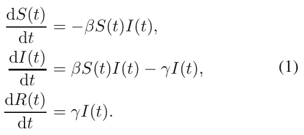

While the SIR model is widely used due to its simplicity, it fails to represent the complexity of the dynamics of the pandemic’s spread (Nesteruk, 2020). Therefore, many extensions of the SIR model have been proposed to better represent the spread dynamics. Usually, these extensions reduce its generalization by introducing biological, sociological, and economic assumptions that improve its accuracy and expressiveness in the cases it represents (Wiratsudakul *et al*., 2018; Adiga *et al*., 2020). One of the more common extensions is the mortality rate due to the pandemic, defined as a state *D*. This state plays a meaningful role in the dynamics of the model. It removes individuals from the interaction. In addition, it also allows the investigation and prediction of the percentage of people who will die due to the pandemic (Zhao *et al*., 2020).

Another extension adds an exposed state (E), which represents the period between the time a susceptible individual is infected and the point at which s/he can infect others (Tuite *et al*., 2020). The exposed state represents the biological settings better as many diseases go through a phase of incubation (Lauer *et al*., 2020; Virlogeux *et al*., 2015).

Individuals experience diseases with varying degrees of severity (Tuite *et al*., 2020). Therefore, by dividing the infected group, *I*, into two degrees of severity—symptomatic, *I*s, and asymptomatic, *I*a—it is possible to obtain a more accurate representation of the social and epidemiological dynamics. Doing so also allows us to fine-tune the infection rates because different degrees of severity have correspondingly different infection rates.

Data from several epidemiological studies show that children and adults transmit diseases at different rates and have different recovery durations (She *et al*., 2020; Jiehao *et al*., 2020). As a result, it is possible to divide the population into two age groups—adults and children. Thus, each of the transformation’s values associated with each epidemiological state and age group are different (Ram and Schaposnik, 2021).

The places where individuals spend their time during the day affect the dynamics of the pandemic by changing the rate of infection. For example, Viguerie *et al*. (2020) showed that spatio-temporal SIR-based models predicted the COVID-19 spread in the Italian region of Lombardy better than other models. However, their version of the spatial dynamics assumes the static distribution of the population over the course of the day. It does not take into consideration the unique dynamics of people moving to different locations, which is possible using a graph-based spatial model.

Thus, extensions are agnostic to the modeling approach used in a computer simulation. One can divide the simulation approaches into two groups: ODE-based and agent-based. A detailed description of each approach is provided below.

**2.1.1. ODE-based modeling.** The ODE-based modeling approach uses numerical algorithms to approximate the analytical solution of the ODE (and PDE) based representation of the extended SIR model. Simply put, the ODE-based modeling describes the dynamics at the population level and their effect on a population of identical (symmetrical) individuals.

ODE-based modeling has two advantages. First, it is relatively easy to solve the model for any size of the population using ODE numerical solvers (Andersson *et al*., 2015). Furthermore, the model is easy to explain, making it feasible to track a wide range of phenomena that the model predicts (Selbst and Barocas, 2018). Second, based on these two properties, there are multiple methods that are used in a variety of situations with real-world data. For example, Roberty and de Araujo (2021) used an extended SIR model and data about the evolution of the COVID-19 pandemic from the Johns Hopkins University Center for Systems Science and Engineering. They utilized the Newton–Raphson optimization algorithm (Lindstrom and Bates, 1988) with the mean absolute error between the historical number of recovered individuals and the one predicted by the model over time.

**2.1.2. Agent-based simulation modeling.** The agent-based modeling approach takes a complementary point of view from that of the ODE-based modeling approach. It defines a set of interactions between individuals in the population to match the global epidemiological dynamics observed in the population. Thus, the agent-based approach describes the dynamics from the individual level and their effect on the population as a whole. The agent-based modeling approach extends the ODE-based modeling approach by describing the local interactions between agents in three ways to determine global behavior: “spontaneous” interactions, interactions between individuals, and the interactions of an individual with the environment. The first group includes time-dependent interactions such as the move from an infected (*I*) state to recovery (*R*) after some pre-defined amount of time. The second group includes interactions between two or more individuals that change the state of at least one of them. One example is when an infected individual infects a susceptible person. Lastly, the interactions between individuals and the environment usually influence the decisions an agent makes such as whether to visit a location based on the number of infected individuals in that location (Lazebnik and Alexi, 2022).

This approach has two main advantages: (i) the relatively easy inclusion of heterogeneous behavior in individuals and the population, and (ii) the introduction of the decision-making process. These two capabilities allow us to simulate complex dynamics that better capture the real dynamics that happen in nature. On the other hand, as the size of the population grows, agent-based simulations become more computationally expensive than the ODE-based modeling approach (Chumachenko *et al*., 2018).

**2.2. Bilateral tourism, disasters, and economic modeling.** An epidemiological crisis presents countries with significant challenges to their economies (Shami and Lazebnik, 2022). The tourism industry is known to be vulnerable to multiple types of hazards that have the potential to deter visitors from traveling to affected

### A hybrid mathematical model for an optimal border closure policy during a pandemic

destinations (Li *et al*., 2021; Rosselló *et al*., 2020; Becken *et al*., 2014). Disasters such as earthquakes, tsunamis, pandemics, and hurricanes inflict extensive and abrupt changes in the affected areas, with profound impacts on individuals and organizations that consequently shock the economic system in which tourism is embedded.

Since the 1960s, following the pioneering work of Tinbergen (1962), economists have been using gravity model frameworks to describe patterns of international trade and capital movements (Anderson, 2011). Analogous to Newton’s universal law of gravitation, these models rely on the assumption that bilateral flows between two countries tend to increase with per-capita income and decline with transportation costs and physical distance between them. Consequently, the level of bilateral tourism flows can be explained by gravity models with a set of determining variables as in a demand equation.

Rosselló *et al*. (2020) developed a gravity model for international tourism flows to quantify the effects of different types of natural and man-made disasters on international tourism movements. The authors integrated two different global data sets, one on disasters and another on bilateral international tourist flows, and used three proxies to measure the impact of disasters—the number of deaths, affected people, and economic costs. According to their findings, in general, the impacts of an event are negative, resulting in fewer tourists.

Gravity models have been also used, albeit to a small extent, to study the effect of infectious diseases on bilateral tourism flows. Most studies in this context examined the impact of disease outbreaks, such as the SARS and avian flu epidemics, on tourism in a specific country or region over a short period (Kuo *et al*., 2008; Wilder-Smith, 2006). Nevertheless, there are some studies on a larger scale. For example, (Cevik, 2022) considered 38,184 pairs of countries from 1995–2017 and the actual number of confirmed infectious disease cases (Ebola, malaria, SARS, and yellow fever) scaled by population to estimate the impact of infectious diseases on international tourism flows. The study used an augmented gravity framework that controlled for macroeconomic factors, geographic and cultural characteristics, and historical ties. According to the authors, international tourism is adversely affected by the scale and dynamism of infectious diseases as measured by the number of confirmed cases in past episodes. Moreover, partitioning the sample into income groups and geographical regions highlights variations in how the risk of infectious diseases affects international tourism flows. While infectious diseases appear to have a smaller and statistically insignificant negative effect on tourism flows to advanced economies, the magnitude and statistical significance of the impact of infectious diseases are much greater in developing countries, where such diseases tend to be more prevalent and healthcare is limited.

Indeed, gravity models have long been one of the most successful empirical models in economics (Anderson, 2011). However, as Baggio (2020) stated, “better simulation tools are to be developed for a more profound understanding of the whole [tourism] domain and for providing more accurate scenarios.” Accomplishing this goal would allow policymakers to make more informed planning decisions. Our study responds to this call by presenting a model that describes how nations can manage international tourism during a global pandemic. It provides a practical *in silico* tool for evaluating bilateral tourism policies and suggesting an optimal policy for multiple possible scenarios.

Recent trends in tourism require the use of artificial intelligence methodologies for forecasting. Examples include feed-forward artificial networks or support vector machines (Liu *et al*., 2021; Hassani *et al*., 2017; Teixeira and Fernandes, 2012) and machine and deep learning methods (Law *et al*., 2019). Sun *et al*. (2021) used historical tourist arrival data, economic variable data, and search intensity index data to forecast tourist arrivals in Beijing. The authors deployed a novel bagging-based multivariate ensemble deep learning approach integrating a stacked autoencoder and kernel-based extreme learning machine. Their approach outperformed existing models in terms of the level of accuracy, directional accuracy, and statistical significance. However, research that confirms or quantifies the relationship between disasters and tourism activity is scant. Liu *et al*. (2021) developed a two-step scenario-based method to forecast the recovery of the demand for tourism for 2021 from a global perspective under uncertainty. The authors utilized 14 alternative forecasting specifications covering various time series and artificial intelligence models, and their hybrid and combined approaches. Polyzos *et al*. (2020) investigated the expected effect of the current COVID-19 outbreak on the arrival of Chinese tourists to the USA and Australia. The authors used monthly data from the 2003 SARS epidemic regarding the number of tourist arrivals to these two countries and employed the Long Short Term Memory (LSTM) network (deep learning methodology) to forecast the effect of the current pandemic. Their findings demonstrate a significant drop in tourist arrivals from China to the USA and Australia. They also predict that it will take nearly one year for arrivals to return to their previous levels. However, their calculations lack a monetary estimate of the economic loss and ignore the effect of the decision to close borders in response to the outbreak. Our study considers these two salient factors.

Since the tourism industry is known to be linked to many sectors in the economy, computable general equilibrium (CGE) models are considered suitable for assessing the impact of external shocks on it, as they consider retroactive effects (Van Truong and Shimizu, 2017; Dwyer, 2015). Gopalakrishnan *et al*. (2020) focused their research on countries that are economically dependent on tourism. With the help of the CGE model, the authors analyzed the short- and medium-term impact of the COVID-19 pandemic on the tourism sector. The results indicate strong links and spillover effects between tourism and other sectors. Pham *et al*. (2021) incorporated a full tourism satellite account into a CGE model to assess the short-term economic impacts of the inbound tourism sector on the economy in Australia. The authors reported direct job losses in tourism of around 152,000. They also indicated that the pandemic affected a range of industries and occupations beyond the tourism sector—between 423,000 and 456,000 across many industries along the tourism value chain. Henseler *et al*. (2022) used the CGE model to simulate the economic impacts on the tourism sector and allied sectors resulting from the COVID-19 pandemic in Tanzania. They found that the decline in the demand for tourism, combined with the associated drop in transportation and communication services, forced other sectors to reduce production and lay off workers, which, in turn, negatively impacted other sectors. However, none of these studies included an explicit reference to the effect of the dynamics of the spread of the pandemic on the model and the economy in their analysis.

## 3. Model definition

The proposed tourism model consists of three sub-models. The first is a temporal epidemiological sub-model that represents the pandemic’s dynamics. The second is a spatial social sub-model that represents the cities and countries where the population is located and their movement between them. The third is an economic sub-model that describes the country-level and global revenue from the tourism industry.

We mathematically define the model by a triple *M* := (*P, G, O*), where *P* is a set of individuals such that each individual is a citizen of some country-state *C*i; *G* = (*V, L ⊂ V × V* ) is a graph of the cities (represented by the graph’s nodes *V* ), where each individual *p* is located at any given point in time; *O* is the economic dynamics.

The model is implemented as an agent-based simulation (Macal, 2010) with two main entities. The first is the individual agent who operates as an individual in the population, a citizen of some country-state *C*i who might visit other country-states as a tourist. The second is the country-state agent that has a set of individuals as its citizens and aims to maximize its total revenues from tourism while minimizing the number of infected citizens.

The model has a synchronized clock defining rounds *t ∈* [1*, . . . , T* ], where *T < ∞*. In each round (marked by *t*i for the *i*-th round) the following three actions take place. First, the population *P* moves on the graph according to the open LOT and according to some country-state policies inside the country-state. Second, for each node (*v*i j *∈ V ∈ G*), the epidemiological dynamics occur in random order. Lastly, for each country-state *C*i, the country-state decides which LOTs it will open and close with other states. The components of the model are described in detail below.

**3.1. Epidemiological (temporal) sub-model.** Our proposed model is an extension of the SIR model (Kermack and McKendrick, 1927). The model considers a constant population, *P*, with a fixed number of individuals *N* := *|P|*. Each individual in the population belongs to one of five epidemiological states: susceptible (*S*), exposed (*E*), symptomatic infected (*I*s), asymptomatic infected (*I*a), recovered (*R*), and dead (*D*) such that

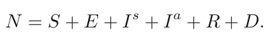

Individuals in the susceptible group have no immunity and can be infected. When an individual in the susceptible group (*S*) is exposed to the pathogen, the individual is transferred to the exposed group (*E*) at a rate corresponding to the average interaction between infected individuals and susceptible individuals. The individuals stay in the exposed group on average *θ* days, after which they are transferred to either the symptomatic infected group (*I*s) or the asymptomatic infected group (*I*a) with a probability *ρ*. Afterward, they remain in the symptomatic infected group on average *γ*s days, after which they are transferred to the recovered group (*R*) or the dead group (*D*) with probability *ω*. Individuals in the asymptomatic infected group recover on average after *γ*a days, after which they are transferred to the recovered group (*R*). The recovered are again healthy, no longer contagious, and immune from future infection. We treat the coefficients as probabilities rather than rates, as they represent the probabilities for state transfer at the individual level (Cortés *et al*., 2020). Figure 2 depicts a schematic view of the movement between the epidemiological model’s states.

The epidemiological dynamics are described in Eqns. (2)–(7).

In Eqn. (2), d*S*(*t*)*/*d*t* is the dynamic amount of susceptible individuals over time. It is affected by the following two terms: each symptomatic infected individual infects a susceptible individual at a rate *β*s and each asymptomatic infected individual infects a susceptible individual at a rate *β*a,

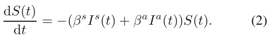

In Eqn. (3), d*E*(*t*)*/*d*t* is the dynamic amount of exposed individuals over time. It is affected by the following three terms: (i) each symptomatic infected individual infects susceptible individual at a rate *β*s; (ii) each asymptomatic infected individual infects susceptible individual at a rate *β*a; (iii) each exposed individual is transformed into an infected individual at a rate *θ*.

<figure id="fig-2">
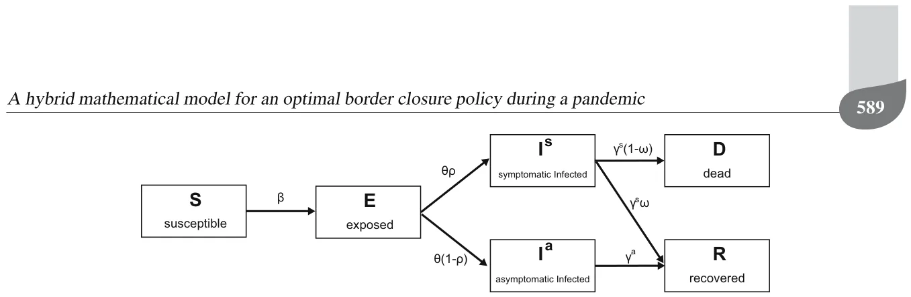
<figcaption>Fig. 2. Schematic view of an individual’s transformation between epidemiological country-states.</figcaption>
</figure>

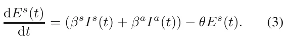

In Eqn. (4), d*I*s(*t*)*/*d*t* is the dynamic amount of symptomatic infected individuals over time. It is affected by the following two terms: symptomatic individuals recover or die from the disease after period *γ*s and each exposed individual is transformed into an infected individual at a rate *θ* with a probability of *ρ*.

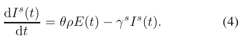

In Eqn. (5), d*I*a(*t*)*/*d*t* is the dynamic amount of asymptomatic infected individuals over time. It is affected by the following two terms: asymptomatic individuals recover after period *γ*a and each exposed individual is transformed into an infected individual at a rate *θ* with a probability of (1 *− ρ*).

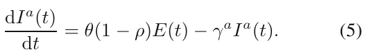

In Eqn. (6), d*R*(*t*)*/*d*t* is the dynamic amount of recovered individuals over time. It is affected by the following two terms: a portion *ι* of the symptomatic infected individuals recover after period *γ*s and asymptomatic individuals recover after period *γ*a.

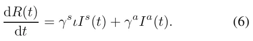

In Eqn. (7), d*D*(*t*)*/*d*t* is the dynamic amount of dead individuals over time. It is affected by a portion of the infected individuals that do not recover after period *γ*s which is multiplied by the rate of adults that do not recover from the disease 1 *− ι*.

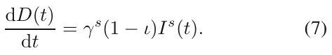

A summary of Eqns. (2)–(7) is shown in Eqn. (8).

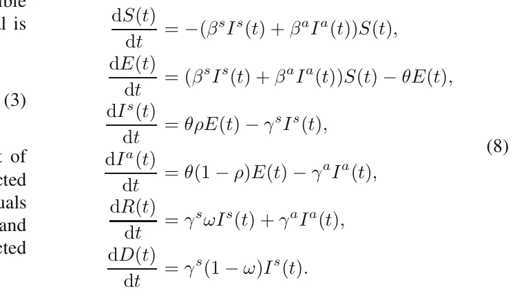

The initial conditions in the beginning of the pandemic are defined as follows:

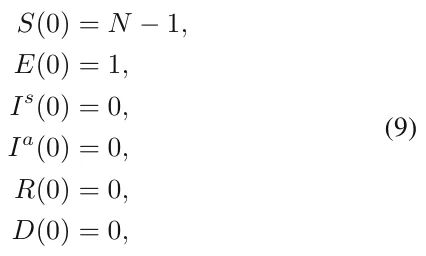

where *N* is the size of the population.

Formally, the population P moves and interacts in rounds *t ∈* [1*, . . . , T* ], where *T < ∞*. Each individual in the population, *p ∈* P, is represented by a timed finite state machine (Alagar and Periyasamy, 2011) such that, in round *i*, *p*i = (*l*i*, s*i) denotes *p*’s location on the graph in round *i* (*l*i *∈ V* ) and his/her epidemiological status *s*i *∈{S, E, I*s*, I*a*, R, D}*.

**3.2. Spatial sub-model.** The spatial sub-model is a graph-based model *G* := (*V, L ⊂ V × V ×* R). The population *P* is allocated in some distribution to the nodes of an undirected, connected graph *G*. Each node *v*i j *∈ V* corresponds to a city *j* in a country-state *i*. The graph *G* is divided into a set of cliques (*C*i) such that (*C*i) = *V* and *∀i/* = *j* : *C*i *∩ C*j = *∅* (i.e., *C*i is a pairwise disjoint). Each clique represents a country-state and all of the nodes *v*i j *∈ C*i are cities in this country-state. Each country-state has lines of tourism (LOT) (via air or ground) with other country-states represented by edges where the source and target nodes are from two different country-states, *l*ij kz = (*v*i k*, v*j z) *∈ L*, such that *v*i k *∈ C*i ∧*v*j z *∈ C*j ∧*i/* = *j*). Each edge *e*ij kz *∈ E* has an average (positive) mobility capacity *W* ij kz.

<figure id="fig-3">
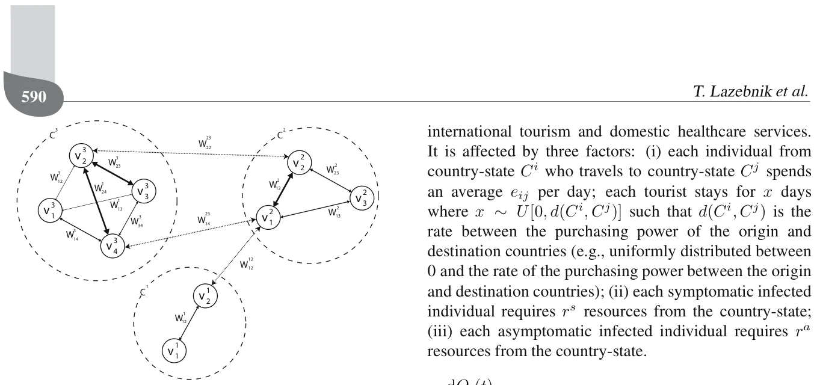
<figcaption>Fig. 3. Example of three country-states, <em>C</em>1<em>, C</em>2 and <em>C</em>3, with two, three and four cities, respectively. Country-states <em>C</em>2<em>, C</em>3 have two international flight schedules with an average mobility of <em>W</em> 23 22 and <em>W</em> 23 14 . Country-states <em>C</em>1<em>, C</em>2 have one international flight with an average mobility of <em>W</em> 23 12 . Inside each country-state <em>C</em>z, the average mobility between two cities <em>x, y</em> is marked by <em>W</em> zz xy or <em>W</em> z xy for short.</figcaption>
</figure>

For each round, *t*i, the population on the graph moves to one of the neighboring nodes, *{v*i j *∈ V |* (*v*i k*, v*j z) *∈ L}*, such that the individual is located in node (*v*j z) on the graph or stays in the same node, according to an inner moving policy that each agent has. In addition, the moving policy is altered by a global policy that overtakes the decision in the case of a conflict between the two policies. The transition between any two nodes is assumed to be immediate and everybody is following the same clock (i.e., turns). Between each population movement on the graph, the temporal sub-model is performed simultaneously on all of the graph’s nodes. A schematic view of the spatial sub-model is shown in Fig. 3 illustrating the country-states, their cities, and the LOTs between them.

Since country-states aim to minimize the infection rate inside their borders, symptomatic infected individuals who try to cross the border will be blocked and sent back in the same round to the node from which they came. In a complementary manner, asymptomatic infected individuals who try to cross the border as well as susceptible, exposed, and recovered individuals will be able to do so.

**3.3. Economic sub-model.** In Eqn. (10), d*O*i(*t*)*/*d*t* is the dynamic amount of revenue country *C*i raised from international tourism and domestic healthcare services. It is affected by three factors: (i) each individual from country-state *C*i who travels to country-state *C*j spends an average *e*ij per day; each tourist stays for *x* days where *x ∼ U*[0*, d*(*C*i*, C*j)] such that *d*(*C*i*, C*j) is the rate between the purchasing power of the origin and destination countries (e.g., uniformly distributed between 0 and the rate of the purchasing power between the origin and destination countries); (ii) each symptomatic infected individual requires *r*s resources from the country-state; (iii) each asymptomatic infected individual requires *r*a resources from the country-state.

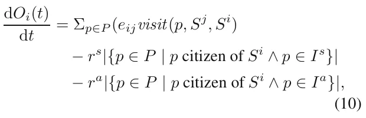

where *visit*(*p, S*i*, S*j) *→{*0*,* 1*}* is a binary function, returning 1 if an individual *p* who is a citizen of country-state *C*i is currently visiting country-state *C*j, and 0 otherwise. Note that the resources related to the asymptomatic and symptomatic infected individuals take into consideration the loss of productivity from these individuals who cannot work and the amount the government must spend on their social and medical needs.

## 4. Optimal tourism policy

Given the proposed model (see Section 3), each country-state aims to maximize its revenue from tourism. We define this goal mathematically and propose a trial-and-error method to determine the optimal policy. Formally, in the proposed model, country-states are active agents that control the course of the pandemic by changing the LOTs’ level of openness. Individuals in the country-states’ population are passive agents who follow a set of pre-defined dynamics according to the conditions in their environment.

**4.1. Learning task definition.** As country-states can choose the LOT they will open or close, or any portion of it *δ ∈* [0*,* 1], at any point in time, they can manage the trade-off between the pandemic’s spread and the economic loss due to the lack of tourism. A LOT between two country-states (*C*i*, C*j) will be the maximum level of openness they both allow. Thus, if the openness of the LOT of country-states *C*i and *C*j are *δ*i and *δ*j, respectively, the overall openness of the LOT between them would be min(*δ*i*, δ*j). Therefore, these dynamics define the action space of each country-state.

**Definition 1.** (*Country-state’s action space* (*SAS*)) Assume that country-state *C*i has possible LOTs with the A hybrid mathematical model for an optimal border closure policy during a pandemic set of country-states *{C*j*}*j∈J. At each point in time, *t*, the country-state defines its degree of openness *δ*i,j. For instance, *δ*i,j = 0 means the LOT is completely closed and *δ*i,j = 1 is completely open. The action of a country-state can be represented as a real vector of size *|J|* that changes per country.

Now, a country-state can make a decision knowing its domestic epidemiological and economic state

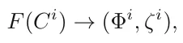

where *F* is a function getting a country-state *C*i and returns a six-dimensional vector Φi representing the distribution of the population over the six epidemiological country-states, and *ζ*i is the revenue from the tourism the country-state obtained from the beginning of the pandemic. In addition, a country-state can determine the epidemiological and economic state of all other country-states in the world.

A country-state’s epidemiological state can be determined using one of three options. First, in the *fully observable pandemic* option, the country-states obtain accurate information on the epidemiological state. Second, in the *α-partial observable pandemic* option, each country-state randomly samples a portion of its population *α* and estimates the overall epidemiological state accordingly. Third, in the *χ-tested observable pandemic* option, each country-state samples the entire population with a probability *χ* to determine its epidemiological state (except for the dead state where *χ* = 1). All three options converge in the case where *α* = *χ* = 1. In practice, country-states are not able to sample all of their population at each point in time or even the majority of the population. Therefore, 0 *< α ≪* 1. In addition, clinical tests for epidemiological status are not perfect, resulting in false-negative and true-possible errors. Hence, 0 *< χ <* 1. As such, all three options differ significantly from each other in a pair-wise manner. Based on these definitions, one is able to define the state of the world as follows.

**Definition 2.** (*World’s state* (*WS*)) Assume there are *{C*i*}*η i=0 states in the world. The world’s state is a vector of size 6*η* where each state *C*i is mapped to the [6*i,* 6*i*+5] sub-vector containing the epidemiological state (Φi) of the corresponding state.

Naturally, each country-state is selfish and wants to maximize its own target function (Eqn. (10)), which we call the *selfish optimizer (SO)*. Nevertheless, country-states are aware of the fact that by cooperating they might all gain more than acting selfishly. Therefore, they seek to optimize the collective target function, which we call the *collective optimizer (CO)*. In the latter, the target function takes the form

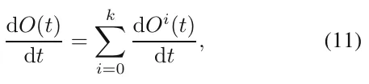

and therefore is identical to all country-states.

A summary of the six options of the agents divided by the country-states’ vector determining the option and the target function is presented in Table 1.

**4.2. Reinforcement learning-based optimal estimator.** Reinforcement learning (RL) is a method that approximates the classic optimal control method (also known as *dynamic programming*) (Bellman, 1957). The system is modeled as a discrete-time finite-state Markov decision process. Each action is associated with a reward. The task of reinforcement learning is to maximize the long-term discounted reward for each action to obtain the optimal policy over time.

Simply put, reinforcement learning is designed for sequential decisions where the output of a given input and all previous inputs and outputs are known beforehand. RL models are based on the interactions between an agent and its environment where the objective is to find a function (also known as *policy*) that maps a state to the agent’s action in order to optimize a given objective (also known as *reward*) function over a period of time. Note that the agent might change its environment and itself, and therefore its *state*, by deciding on some action.

In this study, the one-step *Q*-learning algorithm (Watkin and Dayan, 1989) is used by each state in order to learn an optimal policy. In this setting, a policy is determined by a state-action pair function *Q* that estimates long-term discounted rewards for each state-action pair. Formally, given a current WS *x* and a set of possible actions *{a*i j*}*|J| j=0 for each country-state *C*i, a *Q*-learning agent selects each action *a*i j with a probability given by the Boltzmann distribution (Nagayuki *et al*., 2000):

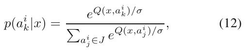

where *σ* operates as a balance parameter that adjusts the randomness of the decisions. Each country-state then executes an action randomly according to the probabilities obtained from Eqn. (12), receives an immediate reward *r*i equivalent to d*O*(*t*i)*/*d*t*, and moves to some state *y*.

During the training process, at each time step the agent updates the function *Q*(*x, a*) by recursively discounting future utilities and weighting them by a predefined positive learning rate *λ*:

*Q*(*x, a*) *← Q*(*x, a*) + *λ*(*r* + *κV* (*y*) *− Q*(*x, a*))*,* (13)

<figure class="table-figure" id="table-1">
<figcaption>Table 1. Types of country-states divided by the accuracy of the country-states’ observations about the pandemic (full or partial to some degree) and the type of optimization the government wants. The selfish optimizer aims to optimize the country-state’s objective alone while the collective optimizer aims to optimize all country-states.</figcaption>

<table><tr><th></th><th>Fully observable</th><th>α-partial observable</th><th>χ-tested</th><th>observable</th></tr><tr><td></td><td>pandemic country-state</td><td>pandemic country-state</td><td>pandemic</td><td>country-state</td></tr><tr><td></td><td>(FOPS)</td><td>(POPSα)</td><td>(TOPSχ)</td><td></td></tr><tr><td>Selfish optimizer (SO)</td><td>FOPS-SO country-state</td><td>POPS-SO country-state</td><td>TOPS-SO</td><td>country-state</td></tr><tr><td>Collective optimizer (CO)</td><td>FOPS-CO country-state</td><td>POPS-CO country-state</td><td>TOPS-CO</td><td>country-state</td></tr></table>

</figure>

where 0 *≤ κ ≤* 1 is a discount parameter (which indicates if we aim to optimize short-term or long-term events), and

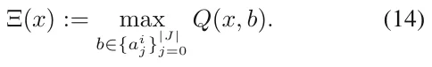

Note that while the agent explores the WS space, its estimate of *Q* improves. Eventually, each Ξ(*x*) approaches the mean value of the following term (Tan, 1993):

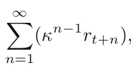

where *r*i is the reward received at time *t*i due to the action chosen at time *t*i−1. This *Q*-learning algorithm converges to an optimal decision policy for a finite Markov decision process (Watkin and Dayan, 1992).

## 5. Simulation

Using the proposed model, we examined the performance of the simulation on four optimal tourism policies (see Table 1). First, we obtained data for European countries, their central cities, and tourism flows among them from (Khalid *et al*., 2020) and Google maps. A detailed description of the country-states, cities, and population allocated to each city is provided in Table A1 in Appendix. Second, we evaluated the spread of the pandemic and the economic loss resulting from the pandemic and tourism for all of the country-states, divided by the tourism policy they executed.

**5.1. Experiment setup.** We chose European countries for the simulation due to their high degree of connectivity by air and ground, close physical distance, and diversity in their sizes. We included 46 country-states with 138 cities in total, hosting 2*.*258*·*103 individuals such that each individual in the simulation represents 105 individuals due to computation time.

The LOT between country-states is set according to two rules. First, if two country-states (*C*i*, C*j) have a common border, a LOT with an unlimited weight is added between the capitals of (*C*i*, C*j). Second, we obtained the flight schedules of the *Lufthansa*1 airline company

1https://www.lufthansa.com/il/en/homepage.

between June 1 and 8, 2019. Each flight schedule is set to be a LOT with a weight corresponding to the average number of flights in a day between the two cities.

The epidemiological sub-model’s parameter represents the airborne transmission of a virus with a long immune system response such as the COVID-19 pandemic. A summary of the parameters appears in Table 2. 0*.*2% of the population is chosen randomly as either asymptomatically exposed or symptomatically exposed at a rate *θ*, while the remaining population is set to susceptible.

Moreover, we defined a round to be a one-hour duration. Despite its relatively short length, it is possible for governments to measure it. Thus, it provides a fair approximation of the pandemic’s dynamics but is realistic enough for governments to use in order to make a decision (Liu *et al*., 2020; Goldenbogen *et al*., 2022). Nevertheless, given that governments must make decisions on a time schedule, we assumed that the country-states act only once a day at midnight.

The training of the country-states’ policy is performed by running the same simulation 100 times (selected manually after showing convergence) before the evaluation simulation, setting the event horizon parameter (*λ*) according to the policy as shown in Table 3. We picked *λ* = 1 day to evaluate the performance of an immediate response (as a classic Markov chain model (Privault, 2018)). In addition, we chose *λ* = 14 days due to the duration of the isolation period commonly used for the COVID-19 pandemic (Dickens *et al*., 2020). As a result, we chose *λ* = 7 days and *λ* = 28 days to indicate half and double the duration, respectively, allowing us to study the performance around the *λ* = 14 days.

We also extended the WS definition to be an ordered union of the hourly world-states of the same day from midnight to the following midnight (24 states) according to Definition 2. This process was repeated for each type of country-state, as described in Table 1.

Of note, while the FOPS is unrealistic in practice, it provides a baseline for comparison for the POPS and TOPS measuring methods.

The economic output at the beginning of the simulation was set to *O*(0) = 0 to investigate the influence of these dynamics, regardless of previous economic processes. In addition, we set the cost of medical care for symptomatic and asymptomatic infected individuals (*r*s*, r*a) to 0*.*8*/γ*s*,* 0*.*1*/γ*a of the average purchasing power of each country-state, respectively. In addition, the parameter *c*ij indicates the amount of money a tourist from country-state *C*i spends in country-state *C*j in each unit of time (e.g., an hour) on average (see Eqn. (10)), defined by the average purchasing power of country-state *C*i divided by the average purchasing power of country-state *C*j. This approximation works for those individuals who come from rich countries and can spend more in poor countries, but is asymmetrical the other way around. Moreover, if a host country suffers from a domestic crisis, it usually attracts more visitors from other countries because of the devaluation of the host country’s currency (Khalid *et al*., 2020). The average purchasing power of individuals in each country-state used in the simulation is provided in Table A1 in Appendix.

<figure class="table-figure" id="table-2">
<figcaption>Table 2. Description of the model’s parameters, symbols, and values. The values are taken from the work of Lazebnik <em>et al</em>. (2021a) such that each value that is divided into a child and an adult is taken as a weighted average in which children are 20% and adults are 80% of the population.</figcaption>

<table><tr><th>Parameter definition</th><th>Symbol</th><th>Value</th></tr><tr><td>Average rate of transition (transmission) of a symptomatic infected individual to a recovered state in hours [t−1]</td><td>γs</td><td>0.0066</td></tr><tr><td>Average rate of transition (transmission) of an asymptomatic infected individual to a recovered state in hours [t−1]</td><td>γa</td><td>0.021</td></tr><tr><td>Average rate at a susceptible individual becomes infected due to direct contact with a symptomatic infected individual in hours [t−1]</td><td>βs</td><td>0.0088</td></tr><tr><td>Average rate at a susceptible individual becomes infected due to direct contact with an asymptomatic infected individual in hours [t−1]</td><td>βa</td><td>0.0088</td></tr><tr><td>Average rate at an exposed individual becomes either a symptomatic or asymptomatic infection individual in hours [t−1]</td><td>θ</td><td>0.0208</td></tr><tr><td>Probability that an individual will be asymptomatic [1]</td><td>ρ</td><td>0.2624</td></tr><tr><td>Probability of an infected individual recovering from the disease [1]</td><td>ω</td><td>0.99</td></tr></table>

</figure>

<figure class="table-figure" id="table-3">
<figcaption>Table 3. Description of the tourism policies evaluated in the simulation.</figcaption>

<table><tr><th>Policy name</th><th>Description</th></tr><tr><td>All open policy (AOP)</td><td>All the LOT are fully (δ = 1) open all the time.</td></tr><tr><td>Total lockdown policy (TLP)</td><td>If a country-state has a R0 &gt; 1, all the LOTs are closed. Otherwise, all the LOTs are open.</td></tr><tr><td>Optimal policy, event horizon of 1-day</td><td>Each country-state is trained with a RL algorithm over 100 repetitions with an event horizon of 1 day ahead.</td></tr><tr><td>Optimal policy, event horizon of 7-days</td><td>Each country-state is trained with a RL algorithm over 100 repetitions with an event horizon of 7-days ahead.</td></tr><tr><td>Optimal policy, event horizon of 14-days</td><td>Each country-state is trained with a RL algorithm over 100 repetitions with an event horizon of 14-days ahead.</td></tr><tr><td>Optimal policy, event horizon of 28-days</td><td>Each country-state is trained with a RL algorithm over 100 repetitions with an event horizon of 28-days ahead.</td></tr></table>

</figure>

We performed all simulations for 4320 steps in time. Thus, the simulations encompass one-half year (180 days), regardless of the epidemiological country-state of the simulation. We adopted this approach to ensure that all simulations would be for the same duration. The economy changes as a function of time, with or without a pandemic. Therefore, we compared the policies in the same time frame.

**5.2. Results.** The results of the simulation appear in Figs. 4–7. The *x*-axis is the rate of non-infected individuals out of the total population and the *y*-axis is the economic output. In the case before us, the output reflects the components of the GDP that are directly related to the subject of the current study: local income from tourists, expenses for the treatment of sick residents and the loss of their workdays, and the decline in the GDP resulting from employees’ illness or the hospitalization of those infected with the pathogen. The interested reader can expand the components sheet for future research. The boxes indicate the mean *±* standard deviations of each policy for *n* = 100 simulations, as described in Table 1. One policy is better than another if it is more to the left and in the upper part of the graph.

<figure id="fig-4">
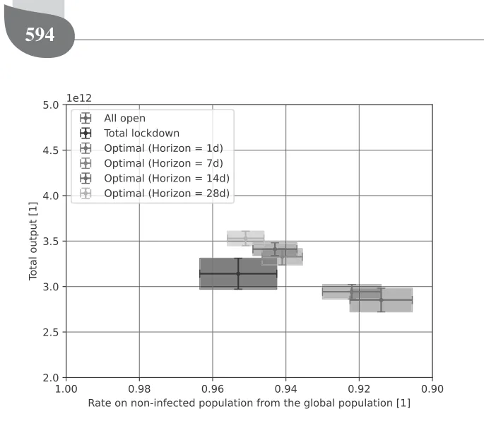
<figcaption>Fig. 4. Selfish optimizer (SO) with a fully observable pandemic country-state (FOPS).</figcaption>
</figure>

<figure id="fig-6">
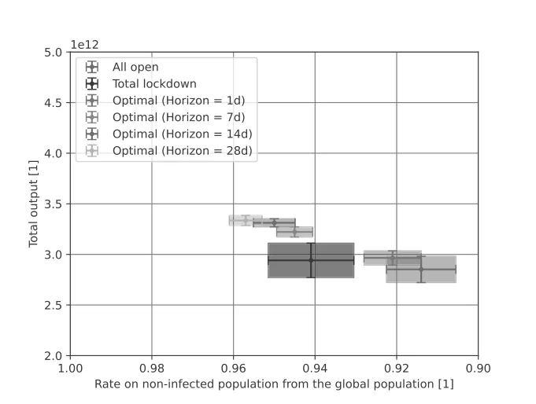
<figcaption>Fig. 6. Selfish optimizer (SO) with a partial observable pandemic country-state (POPS) where <em>α</em> = 0<em>.</em>001.</figcaption>
</figure>

<figure id="fig-7">
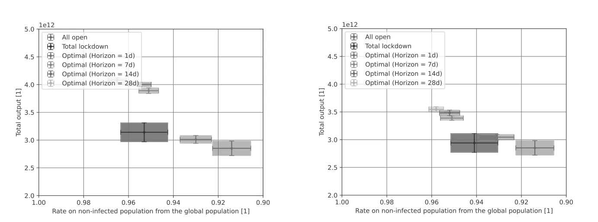
<figcaption>Fig. 7. Collective optimizer (CO) with a partial observable pandemic country-state (POPS) where <em>α</em> = 0<em>.</em>001.</figcaption>
</figure>

<figure id="fig-5">
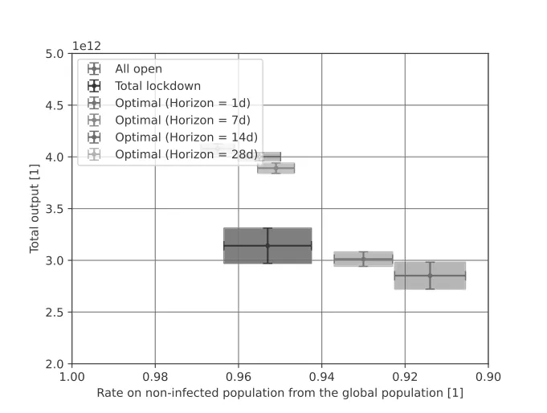
<figcaption>Fig. 5. Collective optimizer (CO) with a fully observable pandemic country-state (FOPS).</figcaption>
</figure>

## 6. Discussion

We propose a model for determining optimal border closures and tourism flows during a global pandemic crisis and test it using an *in silico* experiment with European countries. Intuitively, we show that keeping the borders of all countries open during the outbreak is an inefficient policy, from both the epidemiological and economic perspective. It results in the highest number of infected individuals and the lowest total revenue from tourism activity, as the box in Figs. 4–7 indicates. Therefore, one can conclude that governments must take active measures of some kind.

The optimal policy that takes into consideration the state of only one day is an approximation of a Markov chain model (Privault, 2018) for each state separately in the case of SO, and a single Markov chain model for the case of CO. While this policy is statistically significantly better than the naive *all open* policy (using two-tailed *t*-tests, *p <* 0*.*001), it is still inferior to other policies that take into consideration longer periods or some knowledge of the epidemiological dynamics as shown in Figs. 4–7. The poor performance of this policy can be associated with the longer epidemiological dynamics of the current pandemic. For example, the recovery rate is around 10 days and the exposure to the infection phase is around

### A hybrid mathematical model for an optimal border closure policy during a pandemic

2 days long. As a result, by taking into consideration only the dynamics of one day, the policy is blind to these processes and cannot help governments prepare for upcoming outbreaks.

Indeed, the optimal policy with seven days of the event horizon is significantly better statistically (using two-tailed t-tests, *p <* 0*.*001) than the policy with only a one-day event horizon for each one of the four agent types, as shown in Figs. 4–7. Similarly, the 14-day event horizon optimal policy is statistically significantly better than the 7-day one for the CO-FOPS and SO-POPS agent types (*p <* 0*.*05) but not for the SO-FOPS and CO-POPS. This trend continues when comparing the 28-day event horizon optimal policy with the 14-day one, which exhibits no statistically significant differences in the four types of agents. However, the 28-day policy shows a slightly better consistency. One explanation for this result might be that the epidemiological dynamics generally occur within a 14-day long process. Thus, the 14-day event horizon optimal policy has more opportunity than the 7-day one to “learn” the dynamics better, because the latter is blind to these processes. Moreover, there are minor, consistent, but statistically insignificant dynamics longer than 14 days and shorter than 28 days that make the 28-day event horizon optimal policy a bit better than the 14-day one.

In addition, the *total lockdown* policy performs well and is even statistically similar to the 7-day event horizon optimal policy for the FOPS, TOPS, and POPS country-states. Therefore, without sufficient historical data, we can conclude that choosing this strategy promises an initial good policy. While this policy is much stricter than the *all open* policy, it is not surprising that it improves both the number of non-infected individuals and the tourism industry’s total revenue. Lazebnik *et al*. (2021a) showed that aggressive intervention policies at the beginning of a pandemic result in better outcomes over the same period.

Unsurprisingly, all of the policies (except the *all open* policy, which is independent of the world-state) perform worse in *α*-POPS and *ξ*-TOPS where *α* = 0*.*001 and *ξ* = 0*.*9, respectively, compared to the FOPS case, which operates as a baseline for the ideal condition for decision making. Similarly, SO-type agents perform worse globally than CO-type agents. This result suggests that the optimal policy of a given country-state does not correspond with that of other country-states, which, as a result, establish policies that improve their economic and epidemiological state, even if it means inflicting losses on other country-states that have LOTs with them. Comparing the *α*-POPS and *ξ*-TOPS yields statistically similar results. This outcome is straightforward as both approaches approximate the real epidemiological state of the country-states with some errors. Thus, for every epidemiological state approximation error, there exist *α* and *ξ* that would result in this error. In such scenarios,

### both approaches converge

Our study is not free of limitations. Accurate forecasts for the inputs, such as the expenditure of each tourist in each destination country, broken down by country of origin, were not available. For future research, if reliable predictions are made available, an accurate revenue loss forecast can be calculated. Moreover, a possible extension of the proposed model is by taking into consideration political relationships and culturally driven decisions that are known to have a significant influence on the tourism policies of country-states. Such an extension will make the proposed model more realistic by determining which policies are politically feasible. One can represent such dynamics by modifying the spatial dynamics of individuals and including the willingness of an individual from country-state *C*i to travel to country-state *C*j based on some political or cultural metric.

A strength but also a limitation of the proposed model is its failure to take epidemiological, biological, and clinical assumptions into consideration. On one hand, not including these factors ensures that the model is generic and can be used for a wide range of pandemics regardless of their exact biological and clinical properties. On the other hand, failing to include these factors means that the model’s outcomes will diverge from real-world pandemic dynamics over time because it does not capture fundamental properties of the pathogen(s) causing the pandemic (Wiratsudakul *et al*., 2018; Adiga *et al*., 2020). In particular, the proposed study assumes that each country-state is rational and “ideal.” Namely, we assume that the decisions made by each country-state are based on pure data and aimed to optimize a clear objective without handling political or cultural objectives, which we know that they play a critical role in the decision-making process (Pappas, 2021; Ntounis *et al*., 2021; Bhuiyan *et al*., 2021).

Future studies can adopt our model and extend it to specific pathogens in order to obtain a more narrow but accurate model. In addition, this work does not deal with epidemiological tests at the borders of country-states. This approach has been utilized and provided a promising solution for international traveling during a pandemic (Chevalier *et al*., 2022; Burns *et al*., 2020). One can remedy this shortcoming by introducing such dynamics into a future model.

We should also treat our results with caution because increasing the number of repetitions may cause an inflection of the statistics and therefore artificially small *p*-values (White *et al*., 2014). We used only 100 samples (e.g., simulation repetitions), which is considered a relatively small sample size for most statistical tests in order to avoid the inflection of the statistics and obtain trustworthy results.

## 7. Conclusion

In this study, we sought to determine the optimal policy regarding border closures and tourism flows during a global health crisis. This policy should prevent an outbreak and maximize the revenue generated from tourism. Our results indicate that the strict border closure policy that countries followed in the wake of the COVID-19 pandemic was a fair policy. While this policy is statistically significantly worse than the optimal policy (*p <* 0*.*0001), as shown in Figs. 4–7, it has two advantages. First, it is simple to evaluate because it follows only one rule (e.g., *R*0 *>* 1). Second, it provides an immediate response because it does not require the length of time involved in the 14-day event horizon optimal policy. Moreover, the relatively moderate economic loss is due to the fact that introducing a strict border closure policy at the beginning of the outbreak will lead to early control of the spread of the pandemic and thus allow a faster return to routine, a result that is consistent with the conclusions of previous studies (Lazebnik *et al*., 2021b).

Nevertheless, according to our model, the best policy is the 14-day event horizon optimal policy. While it provided slightly worse results than an RL-based policy that is trained on a longer event horizon, this difference is not necessarily worth the technical difficulty of sampling, organizing, and managing linearly growing data sets.

To put our results into practice, governments can take the following steps. First, in the wake of a health crisis, start with the *total lockdown* policy, while obtaining information on the pandemic’s spread and population’s epidemiological state along with the biological properties of the pathogen causing the pandemic. Second, using the gathered data, determine the optimal policy using an *in silico* experiment. Third, act according to the optimal model for a short period and fine-tune the model’s parameters so that the difference between the predicted state and the resulting one is zero. Finally, continue using the fine-tuned optimal policy while updating it as conditions change.

In times of crisis, cooperation and information and knowledge sharing between countries are an important line of defense in their efforts to return to routine. The tourism industry is sensitive to sudden changes, so in times of crisis, decision-makers must determine the optimal policy that is data-driven to minimize the economic losses inflicted on this industry. The model we propose may help decision-makers achieve this goal effectively.

## Acknowledgment

The authors wish to thank Elizaveta Savchenko for her help in the data gathering, data entry, and fruitful discussions. We are also grateful to Noga Collins-Kreiner for the inspiring and stimulating discussions.

## Appendix

## States and cities used in the simulation

The Europe model’s states and cities are described in Table A1, where the average purchasing power is calculated by taking the gross income of each state divided by the average cost of a McDonald’s burger in the same state and then multiplied by the average cost of a McDonald’s burger in Europe.

<figure class="table-figure" id="table-a1">
<figcaption>Table A1. States and their cities with the size population in each city and the average buying power in euro in 2021.</figcaption>

<table><tr><th>State</th><th>index State</th><th>Cities</th><th>Population size</th><th>Pop. size date</th><th>sampled Avg. purchasing power in euro</th></tr><tr><td>1</td><td>Albania</td><td>Tirana</td><td>906166</td><td>2020</td><td>447</td></tr><tr><td>1</td><td>Albania</td><td>Durrës</td><td>205849</td><td>2021</td><td></td></tr><tr><td>2</td><td>Andorra</td><td>Andorra la Vella</td><td>22615</td><td>2021</td><td>2746</td></tr><tr><td>2</td><td>Andorra</td><td>Escaldes-Engordany</td><td>14282</td><td>2021</td><td></td></tr><tr><td>3</td><td>Armenia</td><td>Yerevan</td><td>1068300</td><td>2021</td><td>359</td></tr><tr><td>3</td><td>Armenia</td><td>Gyumri</td><td>119900</td><td>2021</td><td></td></tr><tr><td>4</td><td>Austria</td><td>Vienna</td><td>1765649</td><td>2021</td><td>4451</td></tr><tr><td>4</td><td>Austria</td><td>Graz</td><td>269997</td><td>2021</td><td></td></tr><tr><td>4</td><td>Austria</td><td>Linz</td><td>193814</td><td>2021</td><td></td></tr><tr><td>4</td><td>Austria</td><td>Salzburg</td><td>146631</td><td>2021</td><td></td></tr><tr><td>5</td><td>Azerbaijan</td><td>Baku</td><td>2293100</td><td>2020</td><td>355</td></tr><tr><td>5</td><td>Azerbaijan</td><td>Ganja</td><td>344108</td><td>2021</td><td></td></tr><tr><td>6</td><td>Belarus</td><td>Minsk</td><td>2645500</td><td>2021</td><td>410</td></tr><tr><td>7</td><td>Belgium</td><td>City of Brussels</td><td>1831742</td><td>2021</td><td>3627</td></tr><tr><td>7</td><td>Belgium</td><td>Antwerp</td><td>472526</td><td>2018</td><td></td></tr><tr><td>8</td><td>Bosnia &amp; Herzegovina</td><td>Sarajevo</td><td>343000</td><td>2020</td><td>792</td></tr><tr><td>8</td><td>Bosnia &amp; Herzegovina</td><td>Banja Luka</td><td>150997</td><td>2021</td><td></td></tr><tr><td>9</td><td>Bulgaria</td><td>Sofia</td><td>1196389</td><td>2021</td><td>767</td></tr><tr><td>9</td><td>Bulgaria</td><td>Plovdiv</td><td>384156</td><td>2020</td><td></td></tr><tr><td>9</td><td>Bulgaria</td><td>Varna</td><td>369632</td><td>2020</td><td></td></tr><tr><td>9</td><td>Bulgaria</td><td>Burgas</td><td>210316</td><td>2021</td><td></td></tr><tr><td>10</td><td>Croatia</td><td>Zagreb</td><td>688163</td><td>2021</td><td>1242</td></tr><tr><td>10</td><td>Croatia</td><td>Split</td><td>167121</td><td>2021</td><td></td></tr><tr><td>10</td><td>Croatia</td><td>Rijeka</td><td>128384</td><td>2021</td><td></td></tr><tr><td>11</td><td>Cyprus</td><td>Nicosia</td><td>335900</td><td>2021</td><td>1992</td></tr><tr><td>11</td><td>Cyprus</td><td>Limassol</td><td>242000</td><td>2021</td><td></td></tr><tr><td>11</td><td>Cyprus</td><td>Larnaca</td><td>146500</td><td>2021</td><td></td></tr><tr><td>11</td><td>Cyprus</td><td>Paphos</td><td>92300</td><td>2021</td><td></td></tr><tr><td>12</td><td>Czech Republic</td><td>Prague</td><td>1272690</td><td>2021</td><td>1385</td></tr><tr><td>12</td><td>Czech Republic</td><td>Brno</td><td>382405</td><td>2021</td><td></td></tr><tr><td>12</td><td>Czech Republic</td><td>Ostrava</td><td>284982</td><td>2021</td><td></td></tr><tr><td>12</td><td>Czech Republic</td><td>Plzeň</td><td>175219</td><td>2021</td><td></td></tr><tr><td>13</td><td>Denmark</td><td>Copenhagen</td><td>794023</td><td>2021</td><td>5607</td></tr><tr><td>13</td><td>Denmark</td><td>Aarhus</td><td>280534</td><td>2020</td><td></td></tr><tr><td>13</td><td>Denmark</td><td>Odense</td><td>180760</td><td>2020</td><td></td></tr><tr><td>13</td><td>Denmark</td><td>Aalborg</td><td>142937</td><td>2021</td><td></td></tr><tr><td>14</td><td>Estonia</td><td>Tallinn</td><td>445494</td><td>2020</td><td>1604</td></tr><tr><td>14</td><td>Estonia</td><td>Tartu</td><td>97171</td><td>2021</td><td></td></tr><tr><td>15</td><td>Finland</td><td>Helsinki</td><td>1299541</td><td>2020</td><td>4728</td></tr><tr><td>15</td><td>Finland</td><td>Espoo</td><td>241589</td><td>2021</td><td></td></tr><tr><td>15</td><td>Finland</td><td>Tampere</td><td>230000</td><td>2019</td><td></td></tr><tr><td>15</td><td>Finland</td><td>Turku</td><td>180000</td><td>2019</td><td></td></tr><tr><td>16</td><td>France</td><td>Paris</td><td>13024518</td><td>2020</td><td>3258</td></tr><tr><td>16</td><td>France</td><td>Marseille</td><td>1760653</td><td>2021</td><td></td></tr><tr><td>16</td><td>France</td><td>Lyon</td><td>2323221</td><td>2021</td><td></td></tr><tr><td>16</td><td>France</td><td>Toulouse</td><td>1360829</td><td>2018</td><td></td></tr><tr><td>16</td><td>France</td><td>Nice</td><td>1006402</td><td>2019</td><td></td></tr><tr><td>16</td><td>France</td><td>Strasbourg</td><td>790087</td><td>2018</td><td></td></tr><tr><td>16</td><td>France</td><td>Bordeaux</td><td>241287</td><td>2021</td><td></td></tr><tr><td>17</td><td>Georgia</td><td>Tbilisi</td><td>1184818</td><td>2020</td><td>331</td></tr><tr><td>17</td><td>Georgia</td><td>Batumi</td><td>169095</td><td>2020</td><td></td></tr><tr><td>17</td><td>Georgia</td><td>Kutaisi</td><td>135201</td><td>2020</td><td></td></tr><tr><td>18</td><td>Germany</td><td>Berlin</td><td>3644826</td><td>2019</td><td>4035</td></tr><tr><td>18</td><td>Germany</td><td>Hamburg</td><td>1841179</td><td>2019</td><td></td></tr><tr><td>18</td><td>Germany</td><td>Munich</td><td>1471508</td><td>2019</td><td></td></tr><tr><td>18</td><td>Germany</td><td>Cologne</td><td>1087863</td><td>2021</td><td></td></tr><tr><td>18</td><td>Germany</td><td>Frankfurt am Main</td><td>753056</td><td>2019</td><td></td></tr><tr><td>18</td><td>Germany</td><td>Düsseldorf</td><td>645923</td><td>2019</td><td></td></tr><tr><td>18</td><td>Germany</td><td>Dortmund</td><td>587010</td><td>2019</td><td></td></tr><tr><td>18</td><td>Germany</td><td>Leipzig</td><td>593145</td><td>2019</td><td></td></tr><tr><td>19</td><td>Greece</td><td>Athens</td><td>3168846</td><td>2021</td><td>1466</td></tr><tr><td>19</td><td>Greece</td><td>Thessaloniki</td><td>806635</td><td>2021</td><td></td></tr><tr><td>19</td><td>Hungary</td><td>Budapest</td><td>2965398</td><td>2020</td><td>1251</td></tr><tr><td>20</td><td>Hungary</td><td>Debrecen</td><td>201432</td><td>2019</td><td></td></tr><tr><td>21</td><td>Iceland</td><td>Reykjavík</td><td>129840</td><td>2019</td><td>4739</td></tr><tr><td>22</td><td>Ireland</td><td>Dublin</td><td>1024027</td><td>2021</td><td>3550</td></tr><tr><td>23</td><td>Italy</td><td>Rome</td><td>4342121</td><td>2020</td><td>2446</td></tr><tr><td>23</td><td>Italy</td><td>Milan</td><td>4336121</td><td>2020</td><td></td></tr><tr><td>23</td><td>Italy</td><td>Naples</td><td>956183</td><td>2019</td><td></td></tr><tr><td>23</td><td>Italy</td><td>Turin</td><td>870456</td><td>2020</td><td></td></tr><tr><td>23</td><td>Italy</td><td>Palermo</td><td>676527</td><td>2021</td><td></td></tr></table>

</figure>

<figure id="fig-x8">
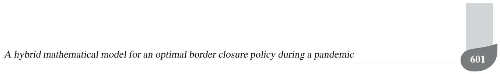
</figure>

<figure class="table-figure" id="table-x5">

<table><tr><th>23</th><th>Italy</th><th>Genoa</th><th>594254</th><th>2021</th><th></th></tr><tr><td>23</td><td>Italy</td><td>Venice</td><td>264919</td><td>2021</td><td></td></tr><tr><td>23</td><td>Italy</td><td>Bologna</td><td>385435</td><td>2021</td><td></td></tr><tr><td>23</td><td>Italy</td><td>Florence</td><td>379102</td><td>2021</td><td></td></tr><tr><td>24</td><td>Latvia</td><td>Riga</td><td>627487</td><td>2020</td><td>1249</td></tr><tr><td>25</td><td>Liechtenstein</td><td>Liechtenstein</td><td>38590</td><td>2019</td><td>5804</td></tr><tr><td>26</td><td>Lithuania</td><td>Vilnius</td><td>650412</td><td>2021</td><td>1524</td></tr><tr><td>26</td><td>Lithuania</td><td>Kaunas</td><td>306700</td><td>2019</td><td></td></tr><tr><td>27</td><td>Luxembourg</td><td>Luxembourg City</td><td>124528</td><td>2021</td><td>5143</td></tr><tr><td>28</td><td>Malta</td><td>Valletta</td><td>400444</td><td>2014</td><td>2078</td></tr><tr><td>29</td><td>Moldova</td><td>Kishinev</td><td>832900</td><td>2019</td><td>422</td></tr><tr><td>30</td><td>Monaco</td><td>Monaco</td><td>38100</td><td>2019</td><td>4218</td></tr><tr><td>31</td><td>Montenegro</td><td>Podgorica</td><td>185937</td><td>2018</td><td>787</td></tr><tr><td>32</td><td>Netherlands</td><td>Amsterdam</td><td>872757</td><td>2019</td><td>2855</td></tr><tr><td>32</td><td>Netherlands</td><td>Rotterdam</td><td>631155</td><td>2021</td><td></td></tr><tr><td>32</td><td>Netherlands</td><td>The Hague</td><td>501725</td><td>2021</td><td></td></tr><tr><td>32</td><td>Netherlands</td><td>Utrecht</td><td>358454</td><td>2020</td><td></td></tr><tr><td>33</td><td>North Macedonia</td><td>Skopje</td><td>509900</td><td>2018</td><td>688</td></tr><tr><td>34</td><td>Norway</td><td>Oslo</td><td>697010</td><td>2020</td><td>4690</td></tr><tr><td>34</td><td>Norway</td><td>Bergen</td><td>283929</td><td>2019</td><td></td></tr><tr><td>35</td><td>Poland</td><td>Warsaw</td><td>3100844</td><td>2020</td><td>1316</td></tr><tr><td>35</td><td>Poland</td><td>Kraków</td><td>1725894</td><td>2019</td><td></td></tr><tr><td>36</td><td>Portugal</td><td>Lisbon</td><td>2854802</td><td>2018</td><td>1266</td></tr><tr><td>36</td><td>Portugal</td><td>Porto</td><td>1725300</td><td>2018</td><td></td></tr><tr><td>37</td><td>Romania</td><td>Bucharest</td><td>2315173</td><td>2020</td><td>1211</td></tr><tr><td>37</td><td>Romania</td><td>Jassy</td><td>500668</td><td>2018</td><td></td></tr><tr><td>38</td><td>Russia</td><td>Moscow</td><td>17400000</td><td>2021</td><td>527</td></tr><tr><td>38</td><td>Russia</td><td>Saint Petersburg</td><td>6284342</td><td>2021</td><td></td></tr><tr><td>38</td><td>Russia</td><td>Novosibirsk</td><td>1620162</td><td>2021</td><td></td></tr><tr><td>38</td><td>Russia</td><td>Yekaterinburg</td><td>2211425</td><td>2021</td><td></td></tr><tr><td>38</td><td>Russia</td><td>Kazan</td><td>1560000</td><td>2021</td><td></td></tr><tr><td>38</td><td>Russia</td><td>Nizhny Novgorod</td><td>2086972</td><td>2021</td><td></td></tr><tr><td>39</td><td>San Marino</td><td>San Marino</td><td>33600</td><td>2021</td><td>2445</td></tr><tr><td>40</td><td>Serbia</td><td>Belgrade</td><td>1659440</td><td>2018</td><td>775</td></tr><tr><td>41</td><td>Slovakia</td><td>Bratislava</td><td>659598</td><td>2020</td><td>1494</td></tr><tr><td>42</td><td>Slovenia</td><td>Ljubljana</td><td>537893</td><td>2020</td><td>2028</td></tr><tr><td>43</td><td>Spain</td><td>Madrid</td><td>6791667</td><td>2019</td><td>2603</td></tr><tr><td>43</td><td>Spain</td><td>Barcelona</td><td>5474482</td><td>2019</td><td></td></tr><tr><td>43</td><td>Spain</td><td>Valencia</td><td>2522383</td><td>2018</td><td></td></tr><tr><td>43</td><td>Spain</td><td>Seville</td><td>1519639</td><td>2018</td><td></td></tr><tr><td>43</td><td>Spain</td><td>Zaragoza</td><td>666880</td><td>2018</td><td></td></tr><tr><td>43</td><td>Spain</td><td>Málaga</td><td>967250</td><td>2018</td><td></td></tr><tr><td>44</td><td>Sweden</td><td>Stockholm</td><td>2391990</td><td>2021</td><td>4204</td></tr><tr><td>44</td><td>Sweden</td><td>Gothenburg</td><td>1025355</td><td>2019</td><td></td></tr><tr><td>44</td><td>Sweden</td><td>Malmö</td><td>740840</td><td>2019</td><td></td></tr><tr><td>45</td><td>Switzerland</td><td>Zürich</td><td>1333269</td><td>2018</td><td>5882</td></tr><tr><td>45</td><td>Switzerland</td><td>Bern</td><td>269356</td><td>2016</td><td></td></tr><tr><td>45</td><td>Switzerland</td><td>Geneva</td><td>496450</td><td>2017</td><td></td></tr><tr><td>46</td><td>Turkey</td><td>Ankara</td><td>5663322</td><td>2020</td><td>410</td></tr><tr><td>46</td><td>Turkey</td><td>Istanbul</td><td>15462452</td><td>2020</td><td></td></tr><tr><td>46</td><td>Turkey</td><td>Izmir</td><td>4367251</td><td>2019</td><td></td></tr><tr><td>46</td><td>Turkey</td><td>Antalya</td><td>2548308</td><td>2020</td><td></td></tr><tr><td>46</td><td>Turkey</td><td>Bursa</td><td>3101833</td><td>2020</td><td></td></tr><tr><td>47</td><td>Ukraine</td><td>Kyiv</td><td>3375000</td><td>2020</td><td>420</td></tr><tr><td>47</td><td>Ukraine</td><td>Odessa</td><td>1217699</td><td>2020</td><td></td></tr><tr><td>47</td><td>Ukraine</td><td>Kharkiv</td><td>2032400</td><td>2020</td><td></td></tr><tr><td>47</td><td>Ukraine</td><td>Dnipro</td><td>999725</td><td>2020</td><td></td></tr><tr><td>47</td><td>Ukraine</td><td>Lviv</td><td>720383</td><td>2020</td><td></td></tr><tr><td>48</td><td>United Kingdom</td><td>London</td><td>14257962</td><td>2020</td><td>3396</td></tr><tr><td>48</td><td>United Kingdom</td><td>Birmingham</td><td>3683000</td><td>2019</td><td></td></tr><tr><td>48</td><td>United Kingdom</td><td>Leeds</td><td>2638127</td><td>2019</td><td></td></tr><tr><td>48</td><td>United Kingdom</td><td>Glasgow</td><td>1861315</td><td>2019</td><td></td></tr><tr><td>48</td><td>United Kingdom</td><td>Belfast</td><td>341877</td><td>2019</td><td></td></tr><tr><td>48</td><td>United Kingdom</td><td>Manchester</td><td>2705000</td><td>2019</td><td></td></tr><tr><td>48</td><td>United Kingdom</td><td>Edinburgh</td><td>901455</td><td>2019</td><td></td></tr><tr><td>48</td><td>United Kingdom</td><td>Liverpool</td><td>2241000</td><td>2019</td><td></td></tr></table>

</figure>

Received: 21 October 2022 Revised: 8 December 2022 Re-revised: 27 April 2023 Accepted: 7 June 2023

## References

- Acemoglu, D., Chernozhukov, V., Werning, I. and Whinston, M.D. (2020). Optimal targeted lockdowns in a multi-group sir model, Working Paper 27102, National Bureau of Economic Research, Cambridge.
- Adiga, A., Dubhashi, D., Lewis, B., Marathe, M., Venkatramanan, S. and Vollikanti, A. (2020). Mathematical models for COVID 19 pandemic: A comparative analysis, Journal of the Indian Institute of Science 100(4): 793–807.
- Aglar, O., Baxter, A., Keskinocak, P., Asplund, J. and Serban, N. (2020). Homebound by COVID 19: The benefits and consequences of non-pharmaceutical intervention strategies, BMC Public Health 21: 655.
- Airey, D. (2015). Developments in understanding tourism policy, Tourism Review 70(4): 246–258.
- Alagar, V.S. and Periyasamy, K. (2011). Specification of Software Systems, Springer, London.
- Alalyani, A. and Saber, S. (2022). Stability analysis and numerical simulations of the fractional COVID-19 pandemic model, International Journal of Nonlinear Sciences and Numerical Simulation 24(3): 1–14.
- Aldao, C., Blasco, D., Espallargas, M.P. and Rubio, S.P. (2021). Modelling the crisis management and impacts of 21st century disruptive events in tourism: The case of the COVID-19 pandemic, Tourism Review 76(4): 929–941.
- Anderson, J.E. (2011). The gravity model, Annual Review of Economics 3(1): 133–160.
- Andersson, C., Fuhrer, C. and Åkesson, J. (2015). Assimulo: A unified framework for ODE solvers, Mathematics and Computers in Simulation 116: 26–43.
- Baggio, R. (2020). The science of complexity in the tourism domain: A perspective article, Tourism Review 75(1): 16–19.
- Becken, S., Mahon, R., Rennie, H.G. and Shakeela, A. (2014). The tourism disaster vulnerability framework: An application to tourism in small island destinations, Natural Hazards 71(1): 955–972.
- Bellman, R.E. (1957). Dynamic Programming, Princeton University Press, Princeton.
- Bhuiyan, M.A., Crovella, T., Paiano, A. and Alves, H. (2021). A review of research on tourism industry, economic crisis and mitigation process of the loss: Analysis on pre, during and post pandemic situation, Sustainability 13(18): 10314.
- Boyd, M., Baker, M.G. and Wilson, N. (2020). Border closure for island nations? Analysis of pandemic and bioweapon-related threats suggests some scenarios warrant drastic action, Australian and New Zealand Journal of Public Health 44(2): 89–91.
- Burns, J., Movsisyan, A., Stratil, J.M., Coenen, M., Emmert-Fees, K.M., Geffert, K., Hoffmann, S., Horstick,
- A hybrid mathematical model for an optimal border closure policy during a pandemic O., Laxy, M., Pfadenhauer, L.M., von Philipsborn, P., Sell, K., Voss, S. and Rehfuess, E. (2020). Travel-related control measures to contain the COVID-19 pandemic: A rapid review, Cochrane Database of Systematic Reviews 10(9), [doi:10.1002/14651858.CD013717](https://doi.org/10.1002/14651858.CD013717)
- Cevik, S. (2022). Going viral: A gravity model of infectious diseases and tourism flows, Open Economies Review 33(1): 141–156.
- Chevalier, J.M., Sy, K.T.L., Girdwood, S.J., Khan, S., Albert, H., Toporowski, A., Hannay, E., Carmona, S. and Nichols, B.E. (2022). Optimal use of COVID-19 AG-RDT screening at border crossings to prevent community transmission: A modeling analysis, PLOS Global Public Health 2(5): e0000086.
- Chinazzi, M., Davis, J.T., Ajelli, M., Gioannini, C., Litvinova, M., Merler, S., Piontti, A.P., Mu, K., Rossi, L. and Sun, K. (2020). The effect of travel restrictions on the spread of the 2019 novel coronavirus (COVID-19) outbreak, Science 368(6489): 395–400.
- Chui-Hua, L., Gwo-Hshiung, T. and Ming-Huei, L. (2012). Improving tourism policy implementation—The use of hybrid MCDM models, Tourism Management 33(2): 413–426.
- Chumachenko, D., Dobriak, V., Mazorchuk, M., Meniailov, I. and Bazilevych, K. (2018). On agent-based approach to influenza and acute respiratory virus infection simulation, 2018 14th International Conference on Advanced Trends in Radioelectronics, Telecommunications and Computer Engineering (TCSET), Lviv-Slavske, Ukraine, pp. 192–195.
- Cortés, J., El-Labany, S.K., Navarro-Quiles, A., Selim, M.M. and Slama, H. (2020). A comprehensive probabilistic analysis of approximate SIR-type epidemiological models via full randomized discrete-time Markov chain formulation with applications, Mathematical Methods in the Applied Sciences 43(14): 8204–8222.
- Darabi, S.F. and Scoglio, C. (2011). Epidemic spread in human networks, 50th IEEE Conference on Decision and Control/European Control Conference, Orlando, USA, pp. 3008–3013.
- Di Domenico, L., Pullano, G., Sabbatini, C.E., Bo Elle, P.Y. and Colizza, V. (2020). Impact of lockdown on COVID-19 epidemic in Ile-de-France and possible exit strategies, BMC Medicine 18: 240.
- Dickens, B.L., Koo, J.R., Lim, J.T., Sun, H., Clapham, H.E., Wilder-Smith, A. and Cook, A.R. (2020). Strategies at points of entry to reduce importation risk of COVID-19 cases and reopen travel, Journal of Travel Medicine 27(8): taaa141.
- Diseases, T.L.I. (2020). Air travel in the time of COVID-19, The Lancet Infectious Diseases 20(9): 993.
- Dwyer, L. (2015). Computable general equilibrium modelling: An important tool for tourism policy analysis, Tourism and Hospitality Management 21(2): 111–126.
- Getz, D. (1986). Models in tourism planning: Towards integration of theory and practice, Tourism Management 7(1): 21–32.
- Goldenbogen, B., Adler, S.O., Bodeit, O., Wodke, J.A.H., Escalera-Fanjul, X., Korman, A., Krantz, M., Bonn, L., Morán-Torres, R., Haffner, J.E.L., Karnetzki, M., Maintz, I., Mallis, L., Prawitz, H., Segelitz, P.S., Seeger, M., Linding, R. and Klipp, E. (2022). Control of COVID-19 outbreaks under stochastic community dynamics, bimodality, or limited vaccination, Advanced Science 9(23): e2200088.
- Gopalakrishnan, B.N., Peters, R. and Vanzetti, D. (2020). COVID-19 and tourism: Assessing the economic consequences, Report UNCTAD/DITC/INF/2020/3, United Nations Conference on Trade and Development, Geneva.
- Gunn, H. (2001). Spatial and temporal transferability of relationships between travel demand, trip cost and travel time, Transportation Research E: Logistics and Transportation Review 37: 163–189.
- Hall, C.M., Scott, D. and Gössling, S. (2020). Pandemics, transformations and tourism: Be careful what you wish for, Tourism Geographies 22(3): 577–598.
- Hassani, H., Silva, E.S., Antonakakis, N., Filis, G. and Gupta, R. (2017). Forecasting accuracy evaluation of tourist arrivals, Annals of Tourism Research 63(3): 112–127.
- Henseler, M., Maisonnave, H. and Maskaeva, A. (2022). Economic impacts of COVID-19 on the tourism sector in Tanzania, Annals of Tourism Research Empirical Insights 3(1): 100042.
- Ivorra, B., Ferrandez, M.R., Vela-Perez, M. and Ramos, A.M. (2020). Mathematical modeling of the spread of the coronavirus disease 2019 (COVID-19) taking into account the undetected infections: The case of China, Communications in Nonlinear Science and Numerical Simulation 88: 105303.
- Jiehao, C., Jin, X., Daojiong, L., Zhi, Y., Lei, X., Zhenghai, Q., Yuehua, Z., Hua, Z., Ran, J., Pengcheng, L., Xiangshi, W., Yanling, G., Aimei, X., He, T., Hailing, C., Chuning, W., Jingjing, L., Jianshe, W. and Mei, Z. (2020). A case series of children with 2019 novel coronavirus infection: Clinical and epidemiological features, Clinical Infectious Diseases 76(6): 1547–1551.
- Kermack, W.O. and McKendrick, A.G. (1927). A contribution to the mathematical theory of epidemics, Proceedings of the Royal Society 115: 700–721.
- Khalid, U., Okafor, L.E. and Shafiullah, M. (2020). The effects of economic and financial crises on international tourist flows: A cross-country analysis, Journal of Travel Research 59(2): 315–334.
- Kingsley, D. (2015). The Urbanization of the Human Population, Routledge, London.
- Kuo, H., Chen, C., Tseng, W., Ju, L. and Huang, B. (2008). Assessing impacts of SARS and avian flu on international tourism demand to ASIA, Tourism Management 29(5): 917–928.
- Lauer, S.A., Grantz, K.H., Bi, Q., Jones, F.K., Zheng, Q., Meredith, H.R., Azman, A.S., Reich, N.G. and Lessier, J. (2020). The incubation period of coronavirus disease 598 2019 (COVID-19) from publicly reported confirmed cases: Estimation and application, Annals of Internal Medicine 172(9): 577–582.
- Law, R., Li, G., Fong, D.K.C. and Han, X. (2019). Tourism demand forecasting: A deep learning approach, Annals of Tourism Research 75: 410–423.
- Lazebnik, T. and Alexi, A. (2022). Comparison of pandemic intervention policies in several building types using heterogeneous population model, Communications in Nonlinear Science and Numerical Simulation 107(4): 106176.
- Lazebnik, T. and Blumrosen, G. (2022). Advanced multi-mutation with intervention policies pandemic model, IEEE Access 10: 22769–22781.
- Lazebnik, T. and Bunimovich-Mendrazitsky, S. (2021). The signature features of COVID-19 pandemic in a hybrid mathematical model—Implications for optimal work-school lockdown policy, Advanced Theory and Simulations 4(5): 2000298.
- Lazebnik, T., Shami, L. and Bunimovich-Mendrazitsky, S. (2021a). Pandemic management by a spatio-temporal mathematical model, International Journal of Nonlinear Sciences and Numerical Simulation 24(6): 2307–2324.
- Lazebnik, T., Shami, L. and Bunimovich-Mendrazitsky, S. (2021b). Spatio-temporal influence of non-pharmaceutical interventions policies on pandemic dynamics and the economy: The case of COVID-19, Economic Research- Ekonomska Istraživanja 35(1): 1833–1861.
- Li, X., Gong, J., Gao, B. and Yuan, P. (2021). Impacts of COVID-19 on tourists’ destination preferences: Evidence from China, Annals of Tourism Research 90: 103258.
- Lindstrom, M.J. and Bates, D.M. (1988). Newton–Raphson and em algorithms for linear mixed-effects models for repeated-measures data, Journal of the American Statistical Association 83(404): 1014–1022.
- Linka, K., Peirlinck, M., Sahli Costabal, F. and Kuhl, E. (2020). Outbreak dynamics of COVID-19 in Europe and the effect of travel restrictions, Computer Methods in Biomechanics and Biomedical Engineering 23(11): 710–717.
- Liu, A., Vici, L., Ramos, V., Giannoni, S. and Blake, A. (2021). Visitor arrivals forecasts amid COVID-19: A perspective from the Europe team, Annals of Tourism Research 88: 103182.
- Liu, L., Miller, H.J. and Scheff, J. (2020). The impacts of COVID-19 pandemic on public transit demand in the united states, PLOS ONE 15(11): 1–22.
- Macal, C. M. (2010). To agent-based simulation from system dynamics, Proceedings of the 2010 Winter Simulation Conference, Baltimore, USA, pp. 371–382.
- Masud, S., Torraca, V. and Meijer, A.H. (2017). Modeling infectious diseases in the context of a developing immune system, in K.C. Sadler (Ed.), Zebrafish at the Interface of Development and Disease Research, Academic Press, Cambridge, pp. 277–329.
- Nagayuki, Y., Ishii, S. and Doya, K. (2000). Multi-agent reinforcement learning: An approach based on the other agent’s internal model, Proceedings of the 4th International Conference on MultiAgent Systems, Boston, USA, pp. 215–221.
- Nesteruk, L. (2020). Statistics-based predictions of coronavirus epidemic spreading in mainland China, Innovative Biosys-tems and Bioengineering 8: 13–18.
- Ntounis, N., Parker, C., Skinner, H., Steadman, C. and Warnby, G. (2021). Tourism and hospitality industry resilience during the COVID-19 pandemic: Evidence from England, Current Issues in Tourism 1: 46–59.
- Pappas, N. (2021). COVID19: Holiday intentions during a pandemic, Tourism Management 84: 104287.
- Peer, S., Koopmans, C. and Verhoef, E.T. (2012). Prediction of travel time variability for cost-benefit analysis, Transportation Research A: Policy and Practice 46(1): 79–90.
- Pham, T.D., Dwyer, L., Su, J. and Ngo, T. (2021). COVID-19 impacts of inbound tourism on Australian economy, Annals of Tourism Research 88: 103179.
- Pindyck, R.S. (2020). COVID-19 and the welfare effects of reducing contagion, Working Paper 27121, National Bureau of Economic Research, Cambridge.
- Polyzos, S., Samitas, A. and Spyridou, A.E. (2020). Tourism demand and the COVID-19 pandemic: An LSTM approach, Tourism Recreation Research 46: 175–187.
- Privault, N. (2018). Understanding Markov Chains, Springer, Singapore.
- Ram, V. and Schaposnik, L.P. (2021). A modified age-structured SIR model for COVID-19 type viruses, Scientific Reports 11: 15194.
- Roberty, N.C. and de Araujo, L.S.F. (2021). SIR model parameters estimation with COVID-19 data, Journal of Advances in Mathematics and Computer Science 36(3): 97–117.
- Ronald, L. (2011). The outlook for population growth, Science 333(6042): 569–573.
- Rosselló, J., Becken, S. and Santana-Gallego, M. (2020). The effects of natural disasters on international tourism: A global analysis, Tourism Management 79: 104080.
- Selbst, A.D. and Barocas, S. (2018). The intuitive appeal of explainable machines, Fordham Law Review 87(3): 1085–1140.
- Shami, L. and Lazebnik, T. (2022). Financing and managing epidemiological-economic crises: Are we ready to another outbreak?, Journal of Policy Modeling 45(1): 74–89.
- She, J., Liu, L. and Liu, W. (2020). COVID-19 epidemic: Disease characteristics in children, Journal of Medical Virology 92(7): 747–754.
- Sun, S., Li, J., Guo, J.-E. and Wang, S. (2021). Tourism demand forecasting: An ensemble deep learning approach, Tourism Economics 28(8): 2021–2049.
- Tan, M. (1993). Multi-agent reinforcement learning: Independent vs. cooperative agents, In Proceedings of the 10th International Conference on Machine Learning, Amherst, USA, pp. 330–337.
- A hybrid mathematical model for an optimal border closure policy during a pandemic
- Teixeira, J.P. and Fernandes, P.O. (2012). Tourism time series forecast-different ANN architectures with time index input, Procedia Technology 5: 445–454.
- Tinbergen, J. (1962). Shaping the World Economy; Suggestions for an international Economic Policy, The Twentieth Century Fund, New York.
- Tuite, A.R., Fisman, D.N. and Greer, A.L. (2020). Mathematical modelling of COVID-19 transmission and mitigation strategies in the population of Ontario, Canada, Canadian Medical Association Journal 192: E497–E505.
- UNWTO (2022). UNWTO World Tourism Barometer and Statistical Annex, January 2022 20(1),, (English version). [doi:10.18111/wtobarometereng.2022.20.1.1](https://doi.org/10.18111/wtobarometereng.2022.20.1.1)
- UNWTO (2021). UNWTO World Tourism Barometer and Statistical Annex, May 2021 19(3),, (English version). [doi:10.18111/wtobarometereng.2021.19.1.3](https://doi.org/10.18111/wtobarometereng.2021.19.1.3)
- Van Truong, N. and Shimizu, T. (2017). The effect of transportation on tourism promotion: Literature review on application of the computable general equilibrium (CGE) model, Transportation Research Procedia 25: 3096–3115.
- Viguerie, A., Lorenzo, G., Auricchio, F., Baroli, D., Hughes, T.J.R., Patton, A., Reali, A., Yankeelov, T.E. and Veneziani, A. (2020). Simulating the spread of COVID-19 via a spatially-resolved susceptible-exposed-infected-recovered-deceased (SEIRD) model with heterogeneous diffusion, Applied Mathematics Letters 111: 106617.
- Virlogeux, V., Li, M., Tsang, T.K., Feng, L., Fang, V.J., Jiang, H., Wu, P., Zheng, J., Lau, E.H.Y., Cao, Y., Qin, Y., Liao, Q., Yu, H. and Cowling, B.J. (2015). Estimating the distribution of the incubation periods of human avian influenza A(H7N9) virus infections, American Journal of Epidemiology 182(8): 723–729.
- Watkin, C.J.C.H. and Dayan, P. (1989). Learning With Delayed Rewards, PhD thesis, King’s College, Cambridge.
- Watkin, C.J.C.H. and Dayan, P. (1992). Technical note: Q-learning, Machine Learning 8: 279–292.
- White, J.W., Rassweiler, A., Samhouri, J.F., Stier, A.C. and White, C. (2014). Ecologists should not use statistical significance tests to interpret simulation model results, Oikos 123(4): 385–388.
- Wilder-Smith, A. (2006). The severe acute respiratory syndrome: Impact on travel and tourism, Travel Medicine and Infectious Disease 4(2): 53–60.
- Wiratsudakul, A., Suparit, P. and Modchang, C. (2018). Dynamics of Zika virus outbreaks: An overview of mathematical modeling approaches, PeerJ 6: e4526.
- Wut, T.M., Xu, J.B. and Wong, S. (2021). Crisis management research (1985–2020) in the hospitality and tourism industry: A review and research agenda, Tourism Management 85: 104307.
- Zhao, S., Stone, L., Gao, D., Musa, S.S., Chong, M.K.C., He, D. and Wang, M.H. (2020). Imitation dynamics in the mitigation of the novel coronavirus disease (COVID-19) outbreak in Wuhan, China, from 2019 to 2020, Annals of Transnational Medicine 8(7): 448.
- Zhu, Z., Weber, E., Strohsal, T. and Serhan, D. (2021). Sustainable border control policy in the COVID-19 pandemic: A math modeling study, Travel Medicine and Infectious Disease 41: 102044. Teddy Lazebnik received his BCS and MS degrees in mathematics from Bar Ilan University in 2016 and 2018, respectively. In addition, he received his PhD degree in mathematics from Ariel University in 2021. During 2021–2023 he was a post-doctoral fellow in University College London. He joined the Department of Mathematics, Ariel University, in 2023 as an assistant professor. His research interests include mathematical and computational modeling for personalized
- medicine. He has co-authored more than 75 papers. Labib Shami is a senior researcher at the Taub Center, a staff member of the Department of Economics at Western Galilee College, and a lecturer in the Department of Economics at the University of Haifa. He holds a doctoral degree in economics from the University of Haifa. His main research interests lie in the area of macroeconomics, monetary policy, and non-observed economies.
- Svetlana Bunimovich-Mendrazitsky is a mathematician with the am-
- bition to understand the biological mechanisms of human diseases such
- as cancer and autoimmune diseases. She is interested in clinical research
- and sustainability in the biological context, based on mathematical mod-
- eling and simulation. Since completing her doctoral dissertation in 2007
- at Tel-Aviv University, she has been working on a number of projects
- in the field of mathematical models of cancer growth and treatment as a
- lecturer and researcher at Ariel University, Israel.
