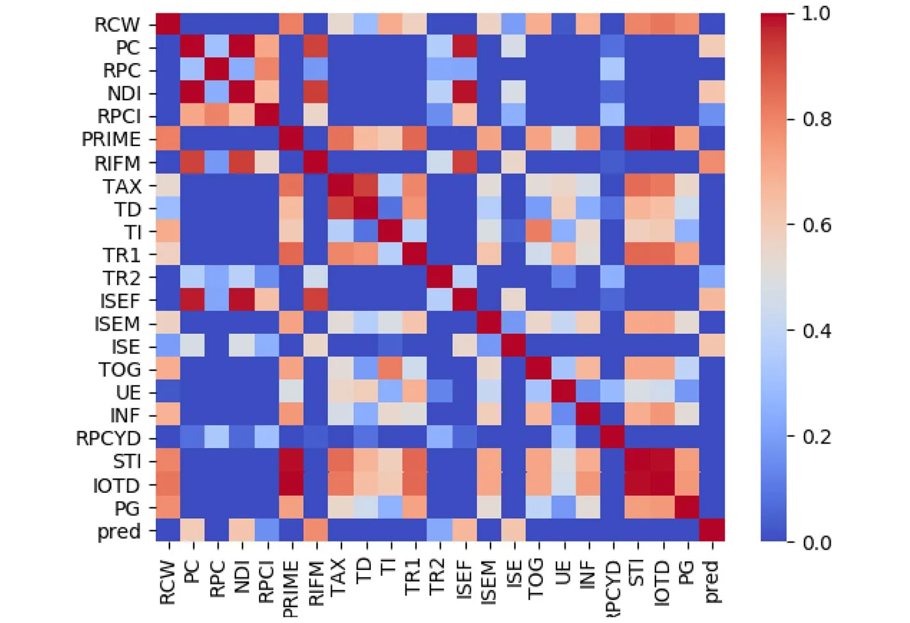
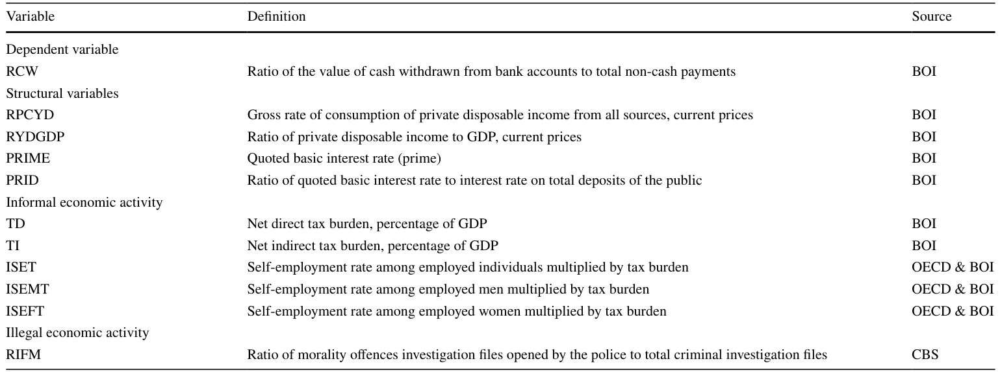
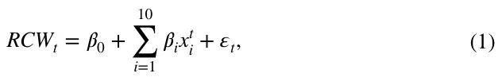
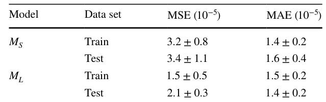
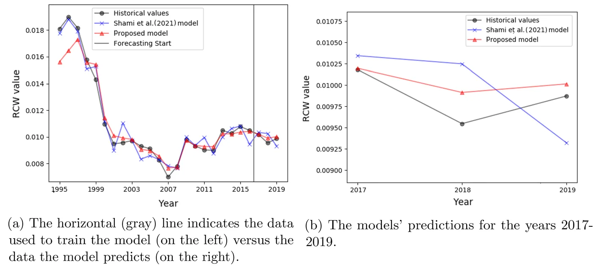
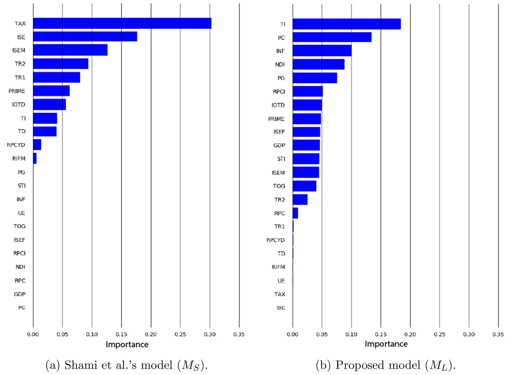
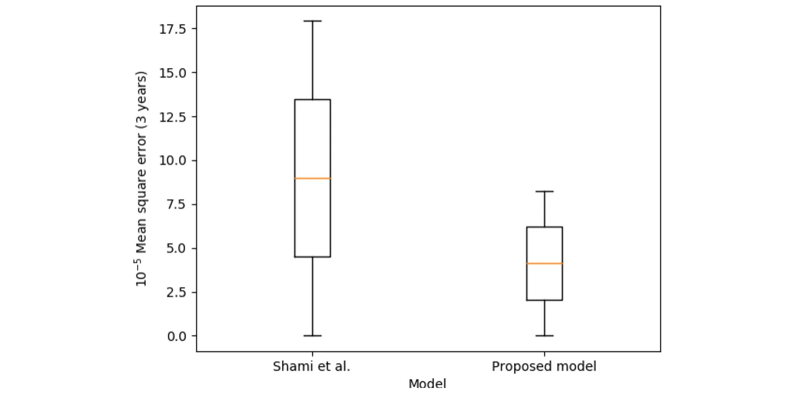
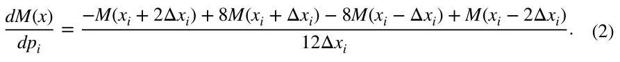
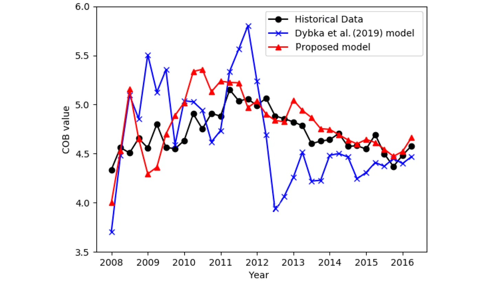
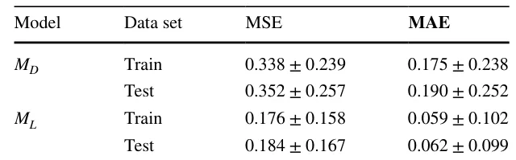

## 1 Introduction

An accurate and consistent estimate of unregistered economic activity is of great value to policy-makers when deciding on policy moves that rely on economic indicators such as economic growth, employment, productivity, and consumption. The existence of unreported and unrecorded economic activity could lead to

Labib Shami and Teddy Lazebnik have contributed equally to this work.

the underestimation of key economic indicators, such as the GDP, with obvious consequences for macroeconomic policies. Moreover, the existence of an unregistered economy alongside the formal economy may undermine the credibility and integrity of public institutions and lead to the abuse of social insurance programs and the erosion of tax revenues (Shami, 2019; Schneider & Buehn, 2016; Gyomai & van de Ven, 2014).

Despite the extensive literature related to the unregistered economy, there is no commonly accepted definition of the term. As a result, there is a lack of precision regarding the measurement target. Indeed, the term has become a general name for many economic activities with different meanings to different people or agencies, with different authors often focusing on different aspects of this issue. Among the adjectives used to describe the phenomenon are non-observed, black, underground, shadow, informal, hidden, parallel, clandestine, and second. In the broadest sense, the unregistered economy refers to economic activity that is sufficiently hidden so that it is untaxed and may be unmeasured. Thus, it is motivated by the desire to reduce the burden of some aspect of government, and may therefore respond to government policy. The activities of the unregistered economy themselves may be legal or illegal, and the assumption is that the economic agents are, at least passively, aware that bringing their activities to the attention of the authorities would have tax (and possibly other legal) ramifications (Shami, 2019). In this study, we adopt the term Non-observed economy (NOE) introduced by the United Nations System of National Accounts in 1993, which has become accepted in policy discussions within the OECD (Blades & Roberts, 2002).

Over the years, researchers have developed various methods to study the NOE and determine the factors that are intentionally or unintentionally related to it. However, these methods are not without drawbacks and often focus on only one segment of the NOE. Moreover, there is no single infallible method for estimating the size and development of the NOE, and results can differ significantly based on the methodologies used and the indicators calculated (Schneider & Buehn, 2018; Thai & Turkina, 2013). In the economic literature, in general, there are three measurement methods used most widely: the direct approach, the indirect approach, and the modeling approach. These methods are briefly discussed below. For more details, please see (Schneider & Buehn, 2016; Elgin & Schneider, 2016; Andrews et al., 2011), and more recently (Elgin & Erturk, 2019).

The direct method estimates the size of the NOE by voluntary replies on surveys or tax auditing methods. In the survey method, a formal entity designs and conducts a survey. The tax auditing method is based on the discrepancy between the income declared for tax purposes and that measured by selective checks (Cantekin & Elgin, 2017; Feld & Larsen, 2012; Feld & Schneider, 2010).

The indirect method is usually macroeconomic and uses various economic and non-economic indicators that contain information about the development of the NOE over time. This approach relies on five indicators that leave some traces of the NOE: (1) the discrepancy between national expenditures and income statistics; (2) the discrepancy between the official and actual statistics of the labor force; (3) the transactions approach; (4) the currency demand approach (CDA); and (5) the physical input (electricity consumption) method (Shami, 2020; Ardizzi et al., 2014; Ferwerda et al., 2010; Kaufmann & Kaufman, 1996).

The economic modeling approach includes statistical models that are used to estimate the NOE as an unobserved (latent) variable. The most commonly used method of measurement is based on the multiple indicator multiple cause (MIMIC) procedure that builds on the works of Weck (1983) and Frey and Weck (1983). Originally, the MIMIC approach was developed for factor analysis in psychometrics to estimate intelligence. Elgin and Oztunali (2012) presented another modeling approach for estimating the size of the NOE using a two-sector dynamic general equilibrium (DGE) model. The author’s micro-based methodology uses national income statistics and a DGE to infer the size of the NOE.

Even though the literature on informal economic activity is growing at an increasing rate, and various methodologies have been developed to estimate its size, with a wide range of econometric techniques employed in empirical studies, we most commonly encounter ordinary least squares (OLS) and panel regressions as well as system estimations (Elgin & Erturk, 2019). Medeiros et al. (2021) show that macroeconomic forecasting can be improved due to the recent rapid developments in machine learning (ML) methods and the availability of new and rich datasets. The results presented in Medeiros et al. (2021) highlight the benefits of ML methods and discuss the ability of models, such as the least absolute shrinkage and selection operator (LASSO) family and Random Forest (RF), to produce more accurate forecasts than the standard benchmarks. Nevertheless, the literature on informal economic activity has largely ignored this line of methods.

Hence, in this study, we propose a ML-based model to improve the accuracy of unregistered economic activity measurement. We based the proposed model on the Random Forest (RF) algorithm that is considered the best practice in many ML challenges, mainly due to its superior predictive performance and after testing several other ML models. By incorporating the currency demand approach (CDA) method in our model, we compare it with the Linear Regression (LR) based CDA model proposed by Dybka et al. (2019), and the semi-linear model proposed by Shami et al. (2021), for both accuracy and stability.

## 2 Related Literature

All of the methods used for measuring the size of the NOE exhibit drawbacks and are not immune to criticism (Elgin & Erturk, 2019). Direct procedures are likely to underestimate the NOE’s activity. In surveys, people are likely to understate the activity that they are trying to hide from the authorities. Therefore, data from these surveys are very prone to measurement errors. An additional disadvantage associated with the direct approach is the costly and time-consuming data collection process, which hinders the repetition of such studies. Moreover, since surveys are conducted at a given point in time, the estimates obtained through the direct approach yield estimates that lack a time dimension.

The indirect approach has also received a fair amount of criticism, in particular, the currency demand approach, primarily due to the assumptions on which the econometric estimation is based. Schneider and Enste (2000) and Enste and Schneider (2002) described three of its major disadvantages: (1) the assumption is that the velocity of money is identical in the formal economy and in the NOE; (2) the determination that the average tax rate (the tax burden) is the only explanation for the existence of the NOE; and (3) the assumption that the contribution of the NOE to the gross domestic product (GDP) is negligible in the base year.

The MIMIC approach, as the leading representative of the economic modeling approach, assumes that the NOE is an unobserved phenomenon (a latent variable) that can be estimated using quantitatively measurable causes of NOE activity, such as the tax burden, as well as indicators of illicit activity, such as the demand for currency. However, as Breusch (2005b) noted: “This psychometric application to measuring intelligence seems far removed from estimating the underground economy [the NOE] in a MIMIC model. For one thing, the underground economy is not a latent or hypothetical quantity like intelligence; it is all too real...the concept and measurement of income in the underground economy [the NOE] are the same as in the observed economy. Once its scope and units are defined, the level of underground income is some number, calculated on a well-defined system of measurement. It cannot be open to the researcher to slide or stretch this calculation to fit whatever scale is found to be convenient. On that ground alone, the MIMIC model seems unsuited to the purpose of measuring the underground economy” (p. 26). Breusch (2005b) presents several more technical objections to the use of the latent variable method to estimate the NOE. Examples include the instability in the estimated coefficients concerning changes in the size of the sample and alternative specifications, the difficulty of obtaining reliable data on variables related to the causes of the NOE other than tax variables, and the reliability of the variables grouped into “causes” and “indicators” in explaining the variability of the NOE.

Moreover, this approach provides only relative, not absolute, estimates of the size of the NOE. Therefore, a second method is necessary to calibrate the model and calculate absolute values of the size of the NOE. However, the estimates of the base values rely on the restrictive assumption that in the base year there is no NOE activity (Schneider et al., 2010). Another shortcoming of this approach is that it does not rely on any micro-foundations. The MIMIC approach is almost entirely statistical and conducted with little guidance from economic reasoning (Breusch, 2005). This approach can lead to uncertainty regarding the measured value. As Breusch (2005) noted: “Even if we agree on that label for the single connection between the groups of variables in the model, we still have to establish that the index is measuring income and not some other dimension of economic transactions, such as turnover. Assuming agreement on that count, it remains to be shown that the index represents underground income measured relative to the official level of national income... rather than the absolute level of hidden income. In the latter case, it is further possible to question whether the income is in nominal money value or deflated by a price index.” (p. 370).

Dybka et al. (2019) revise the two well-known econometric models for measuring the NOE size—CDA and MIMIC” and propose a systematic strategy of their hybrid application. The authors find that the contribution of (a correctly specified) MIMIC model to the measurement of trends in the shadow economy [NOE] is marginal as compared to the contribution of the CDA model, confirming the skepticism of previous literature towards this method. The authors emphasize that the ANOVA decomposition of shadow economy estimated by means of their hybrid strategy confirms the previous findings by Feige (2016): as much as 97.2 to −98.2% of the shadow economy variance in the panel is due to the CDA component (between cross-sections), while only the small remaining fraction is due to MIMIC’s fine-tuning job. This finding may lead to a legitimate question on the actual contribution of MIMIC models to informal economy measurement. Hence, according to the authors, the priority in future research should be given to the investigation of CDA models, especially as regards the appropriateness of functional forms and introducing nonlinearity (Dybka et al., 2019).

Dybka et al. (2020) propose a novel strategy for quantifying the model uncertainty around NOE estimates in a specific version of the CDA model. Based on frequentist and Bayesian model averaging techniques, the authors estimate the probability that a given variable should be included in the model. The authors provide the CDA-based estimates of the shadow economy level (as % of total GDP) as of 2014, for 64 countries, with the accompanying 95% confidence intervals related to the model uncertainty. According to the results with both of the averaging techniques, the lowest level of shadow economy is detected in Switzerland, United Arab Emirates (UAE), Norway, Sweden, Denmark, and New Zealand, and the highest value of the shadow economy can be observed in Algeria, Nigeria, and Brazil. However, despite the innovation in the approach, in both studies, the models are based on linear relationships between the variables.

A semi-linear approach was proposed by Shami et al. (2021) for estimating the NOE. The authors base their model on a modified CDA approach, adapted to the Israeli economy, with 11 variables. In their model, the dependent variable (RCW) is the ratio between two flow variables: total cash withdrawals from the public’s current accounts (CW) to total value of non-cash payments (VOP). The model was fitted on 25 samples, resulting in *R*2 = 0.99 and *P* values of 6.5 ⋅ 10−14 . However, the target variable does not have a strong (absolute Pearson correlation of 0.7 or more) linear correlation to any one of the models’ parameters, as shown in Fig. 1, in the first line (or last column). Moreover, one can notice that the variables are mostly not correlated with one another which indicates that the relationship between the target variable (RCW) and other features is not linear. However, Shami et al. (2021) obtained that a semi-linear model converges to the data. Therefore, it is safe to claim that the model proposed by the authors is over-fitted to the (relatively small) dataset.

To tackle the under-representation of simple linear and semi-linear models on complex economic data (Ha et al., 2021), scholars directed their modeling efforts towards ML in particular, and data-driven models in general (Athey & Imbens, 2019). For instance, Paruchuri (2021) showed that ML models can be widely adopted for multiple economic forecasting tasks, including Actual Gross Domestic Product growth rate using out-of-the-box machine learning models such as nonlinear auto-regression, support vector regression, and Boosted Trees models. The author showed that these models outperform the previously used linear models with less than 80 samples. In a similar manner, Yoon (2021) applied gradient boosting and random forest models to predict real GDP growth in Japan based on quarterly data with less than 100 samples in total. The author discussed the advantage of tree-based modeling for his task as the feature space was mostly linearly independent. Recent studies utilized deep learning models for economic tasks using larger datasets (Nosratabadi et al., 2020). For example, HongXing et al. (2023) modeled the connectedness between currency risk hedging and firm value using an artificial neural network, which revealed previously unseen levels of complexity for this task. However, as far as we know, no attempts to apply ML models to NOE forecasting have been conducted so far.

<figure id="fig-1">

<figcaption><strong>Fig. 1</strong> An absolute Pearson correlation matrix between all the features used by Shami et al. (2021)</figcaption>
</figure>

## 3 Machine Learning Based Model

We propose an ML-based CDA model to estimate the size of the NOE for Israel and the UK. Using data sampled yearly for Israel, the model returns the ratio of the value of cash withdrawn from bank accounts to total non-cash payments (RCW). This approach allows the measurement of the demand for anonymous payments against every payment used in a traceable transaction. The use of cash withdrawals from current accounts to estimate the size of the NOE assumes that in order to conceal income and to evade taxation, all off-the-book transactions in the NOE are cash-in-hand monetary transactions. This assumption prevails throughout all approaches that estimates the size of the NOE (Rogoff, 2015). Of course, not all cash withdrawals are used in the NOE off-the-book transactions since some cash is used in the formal economy. Thus, we assume three main components constructing the demand for cash payments: structural variables, informal economic activity resulting in tax evasion, and illegal (economic) activity. For UK, we used quarterly data, and the model returned the value of cash outside the bank (COB).

Choosing these two target variables stems from the requirement that the currency demand approach cannot be used as long as it employs the same variables for its constructions (Kirchgässner, 2017). Thus, by using these measurable variables, one can compute the size of the NOE for Israel through the methods proposed by (Shami et al., 2021) and for the UK by the methods proposed by (Dybka et al., 2019).

### 3.1 Model Definition

We based our model on the Random Forest (RF) algorithm after evaluating the decision tree (DT), linear regression (LR), RF, K-nearest neighbors (KNN), Support Vector Machine (SVM), and Fully Connected Neural Network with two hidden layers (FcNN) algorithms. This outcome is not a surprise since RF is considered the best practice in many ML challenges, mainly due to its rigorous forecasting performance (Rokach, 2016; Belgiu & Dragut, 2016; Natan et al., 2022; Lazebnik et al., 2022; Gogas et al., 2022). Moreover, Medeiros et al. (2021) evaluated multiple ML algorithms for inflation forecasting and obtained that the RF algorithm outperforms the other ML models, as well.

In order to obtain the model, we fitted each one of the algorithms (DT, RF, LG, KNN, SVM, FcNN) on the dataset. The datasets are provided as supplementary material. During the fitting phase, the hyperparameters of each model have been obtained using the grid search method (Liu et al., 2006), aiming to optimize the average between the model’s mean absolute error (MAE) and the mean square error (MSE). In addition, for the tree-based models (e.g., DT and RF), we perform a cost complexity pruning (Andreas & Salvatore, 2001) to further improve the generality of the model. For each algorithm we used a different grid as it depends on the algorithm’s hyper parameters. Specifically, for the RF model we tested 240 candidates in total, tuning the trees’ maximum depth, number of trees in the forest, maximum number of leaf nodes in a tree, and the minimal number of samples before splitting a node in a tree. After obtaining all the models, we evaluate the MAE and the MSE of each one of the models on the training dataset and pick the one with the lowest average of the two metrics. We mark this model as *M*L . We chose the MAE and MSE matrices due to their popularity for time-series regression tasks as well as their explainability (Esling & Agon, 2012; Masini et al., 2021; Kavitha et al., 2016).

### 3.2 Implementation for the Case of Israel

We used our model to estimate the size of the NOE in Israel between the years 1995 and 2019. The model is obtained by the same features and data as in the model proposed by (Shami et al., 2021), with 25 samples in total. The data were provided by the Bank of Israel (BOI), the Central Bureau of Statistics of Israel (CBS), and the OECD (for detailed data sources please refer to Table 1). The authors chose 1995 as the starting year since in August 2014, the Central Bureau of Statistics in Israel updated the National Accounts system (beginning in 1995) according to the SNA 2008 guide.

<figure class="table-figure" id="table-1">
<figcaption><strong>Table 1</strong> Definition and sources of variables for the Israeli case from (Shami et al., 2021)</figcaption>

</figure>

Shami et al. (2021) fitted a Linear Regression (LR) model on this data, and conducted diagnostic tests for autocorrelation (Durbin-Watson test), heteroscedasticity (studentized Breusch-Pagan test), and normality (Shapiro-Wilk normality test). All analysis showed satisfactory results. In order to achieve optimal results, the authors based their estimation on stepwise regression. The procedure yielded the following model (Let *M*S be the LR model obtained on this data):

where *x*t i is the set of independent variables listed in Table 1 at time *t* , and the model returns the ratio of the value of cash withdrawn from bank accounts to total non-cash payments (RCW). Obtaining the size of the NOE as a percentage of GDP is accomplished by estimating the “excess demand” for currency resulting from the economic activity within the NOE. To estimate this excess demand, one must calculate the difference between the values generated from the model’s equation and those obtained by setting the value of the variables related to the NOE (i.e., RIFM, TD, TI, ISET, ISEMT, and ISEFT) to zero. To arrive at the share of the NOE within the formal economy (GDP), we take the difference obtained and multiply it by the total value of non-cash payments (VOP), and then divide the result by GDP each year.

In order to evaluate the performance of both models, we divided the dataset into training and testing cohorts where the testing cohort contains three chronological samples (12% of the entire data) that happen after the latest sample in the training cohort. We used a *straightly* cross-validation approach where the training cohort enlarges with chronological data. Namely, we used 12 (48% of the entire data), 15 (60%), 18 (72%), and 21 (84%) samples. For each one of them, we calculated the MSE and MAE. The average ± standard deviation of the models’ MAE and MSE results are summarized in Table 2.

Moreover, we calculated the RCW between 1995 and 2019 in Israel using both the *M*S and *M*L models. In this analysis, the data between the years 1995 and 2016 is defined as the training cohort while the data between the years 2017 and 2019 is defined as the testing cohort, as shown in Fig. 2a. A zoom in for the testing section is presented in Fig. 2b. One can notice that the *M*S model suffers from over-fitting while the *M*L model obtains less accurate results on the training set but better learns the underline dynamics existing in the data, as shown in Fig. 2a. This phenomenon is reflected in the testing years as well since the *M*L model is able to predict the decrease and increase of the target variable and keep a similar error from the results while the error of the *M*S model increases over time.

<figure class="table-figure" id="table-2">
<figcaption><strong>Table 2</strong> Performance comparisons between the <em>M</em>S and <em>M</em>L models</figcaption>

</figure>

<figure id="fig-2">

<figcaption><strong>Fig. 2</strong> A comparison between the historical data (black dots), Shami et al.’s model ( <em>M</em>S–blue axes), and the proposed model ( <em>M</em>L - red triangles)</figcaption>
</figure>

#### 3.2.1 Stability Analysis

In order to evaluate the stability of the *M*S and *M*L models, we compare two metrics: (1) The distribution of the feature importance; and (2) the distribution of the model’s errors as a function of the size of the training data set.

The feature importance distributions of the *M*S and *M*L models are shown in Figs. 3a, b, respectively. It is noticeable that the feature importance of the *M*S model is more concentrated (12 features) as shown in Fig. 3a compared to the *M*L model that uses 18 features as shown in Fig. 3b. Since a more uniformly distributed feature importance makes the model more robust to changes in each feature independently, one can conclude that the *M*L is more stable compared to the *M*S model when errors in the inputs are present (Kalousis et al., 2005), as commonly happened in our settings (Schneider & Buehn, 2018).

Notably, only five features are in common between the two features sets used by the *M*L and *M*S models with union of 30 which results in an intersection over union of 16.6%. Thus, one can see the proposed models are utilize mostly different subset of features. Moreover, the features both models used differ in their importance to each of the models.

The distribution of the model’s errors as a function of the size of the training cohort is computed by performing k-fold cross-validation for time-series (Kohavi, 1995). The testing cohort is defined to be three years and the training cohort’s size is between five and 22 years. The results are shown in Fig. 4.

Furthermore, we calculated the average sensitivity of each model. For both models we modify each parameter ( *p* ∈ *P* ) starting in value *x* by [−2Δ*x*, −Δ*x*, Δ*x*, 2Δ*x*] , and calculated the derivative in the direction of this feature using the following formula (Stegun & Abramowitz, 1964):

<figure id="fig-3">

<figcaption><strong>Fig. 3</strong> Feature importance of the models</figcaption>
</figure>

<figure id="fig-4">

<figcaption><strong>Fig. 4</strong> Distribution of mean square error (MSE) of three years prediction of the Shami et al. ( <em>M</em>S ) and Proposed ( <em>M</em>L ) models started with three years of historical data and up to 21 years. The center (orange) line indicates the mean and the boxes indicate one standard deviation</figcaption>
</figure>

Afterward, we approximated the model’s function using first-order Taylor series and calculated the surface integral defined inside [−2Δ*x*i, 2Δ*x*i] for each parameter *p* (defining a *n*-dimensional sphere around [*x*1, … *x*n] ). We obtain that the *M*S model has a value 72.6 times higher compared to the *M*L model which indicates that the *M*L is almost two levels of magnitude more stable for changes in the features compared to the *M*S , making it more reliable assuming there is a noise in the historical data.

**3.2.2 Testing Generalization: The Case of UK** We tested the ability of the proposed machine learning approach to generalize to other, similar, datasets. For that, we used the model proposed by Dybka et al. (2019) on the data for the UK between the years 2008 and 2017 with the following variables: *P*dybka ∶= [*U*, *TSC*, *TT*, *ROL*, *RPPSGDPPC*, *CPC*, *TPC*, *RDR*, *CPI*, *EIG*, *DC*], where *U* stands for the unemployment rate; *TSC* is taxes and social contributions; *TT* is tax time; *ROL* is the rule of law; *RPPSGDPPC* is the real PPS GDP per capita; *CPC* is cards per capita; *TPC* is terminal per card; *RDR* is real deposit rate; *CPI* is consumer price index; *EIG* employment in agriculture; and *DC* is the domestic card. Dybka et al. (2019) fitted a LR model on this data. Let *M*D be the LR model obtained from this data.

We evaluated the performance of both models on the UK’s size of the NOE. We divided the dataset into training and testing cohorts where the testing cohort contains four chronological samples that happen after the latest sample in the training cohort and the training cohort tests with [34, 38, … , 64] samples, each time we calculated the MSE and MAE. The results are shown in Fig. 5 such that the mean and standard deviation of the results are summarized in Table 3.

#### 3.2.3 Infeasible Comparative Capability with the MIMIC Based Models

The MIMIC procedure-based models are commonly used to estimate the NOE’s size as a percentage of the GDP (Elgin & Schneider, 2016; Schneider & Enste, 2000). Thus, by proposing a new mathematical and computational approach to estimate the NOE’s size, one is excepted to compare the performance of the proposed model with the MIMIC models. While different implementations of these models are available, they all have the same overall structure: the model gets information from several social and economic indicators (marked by *X* ), which may slightly differ according to the used economic hypothesis or available data, and outputting the estimated size of the NOE (marked by *Y*′ ). However, there is an incorporated challenge in performing such analysis: the real NOE’s size (marked by *Y* ) is a latent variable. As such, one can not measure the performance of the model defined by *d*(*Y*, *Y* ) where *d* is a metric function since *Y* is unavailable. Thus, any prediction *Y*′ is as good as any other in this scenario which means a comparison between any two models is infeasible.

<figure id="fig-5">

<figcaption><strong>Fig. 5</strong> A comparison between the historical data (black dots), Dybka et al.’s model ( <em>M</em>D blue axes), and the proposed model ( <em>M</em>L–red triangles) such that the models trained on the a quarterly data from 2000 up to the predicted year and predict four quarters</figcaption>
</figure>

<figure class="table-figure" id="table-3">
<figcaption><strong>Table 3</strong> Performance comparisons between the <em>M</em>D and <em>M</em>L models</figcaption>

</figure>

One way to partially overcome this challenge is to estimate an intermediate measurable variable *Z* using this approach such that the model is implemented in a way it estimates *Z*′ rather than *Y*′ . For example, one can use the CDA model to estimate the over-use of cash as the intermediate measurable variable *Z* and have a function connecting only *Z* with the NOE’s size variable *Y* . This approach is not without flaws since this comparison would allow to compare two models over the measurable variable *Z* and not the NOE’s size variable *Y* directly. Namely, this approach allows to compare the models’ performance on *Z* by computing *d*(*Z*, *Z* ) and not *d*(*Y*, *Y* ) . The difference in the approach lies in the implementation of the proposed economic models—while MIMIC models define a function *F*(*x*) → *Y* , data-driven approaches such as LR require the target variable to be measurable for the optimization/fitting phase. As a result, this approach yields *LR*(*X*) → *Z* and then *H*(*Z* ) → *Y* , which reduces the problem to the one-dimensional *H* function rather than of the entire dynamics as resulted from the *F* function. Another approach that can be used for comparison in future studies is to consider many different scenarios and provide a comparison with them.

## 4 Discussion

In this study, we took advantage of the recent developments in ML methods to improve the accuracy and stability of one of the valued and commonly used models for estimating the size of the non-observed economy. Using the Random Forest (RF) algorithm for selecting the appropriate features for our model (out of multiple socioeconomic measurements), combined with the CDA approach, we were able to show that more accurate results can be achieved in studying informality.

The use of ML obviates the need to search for relationships between variables manually. As such, these computational methods can help researchers uncover relationships that have the power to improve model structure. Our *M*L model extends the *M*S model by its ability to learn more complex relationships between the explanatory variables and the target variable. The currently common NOE estimation Linear Regression (LR) models are too simplistic and tend to over-fit, especially with small datasets. For instance, the *M*S model, which is also based on the LR algorithm, can represent only linear connections between the variables (Cook, 1977) with only 11 degrees of freedom (corresponding to the number of coefficients in the model). However, the *M*L model, which is based on the RF algorithm, is theoretically able to fit any continuous and bounded function (Breiman, 2001). Hence, it can approximate linear functions as well if needed such connection is present. In addition, each tree in the RF has at least 62 degrees of freedom (corresponding to the number of features and thresholds for each split in the tree, for a binary tree with six levels of depth). Hence, one can clearly see that RF-based models is able to find more complex relationships and trends in the data that are outreach for the LR-based models.

As demonstrated in Tables 2 and 3, our model obtained both lower MAE and MSE compared to the *M*S and *M*D models. Thus, on average and over time, the proposed model outperformed the other two models. Moreover, as can be seen in Fig. 3, our model exploits more information from the available data as it takes into consideration more data types. For example, our model was able to break down the effect of the type of tax on the size of the NOE by including the tax components and giving weight to each component rather than to the total net tax. This is also the case concerning the impact of informal economic activity among the self-employed and its distribution by gender. In the *M*S model, the total tax and the informal economic activity among the self-employed have a decisive influence on the size of the NOE, but the composition of these variables (distribution by type of tax and self-employed gender) has been given insignificant importance if any. In our model, by utilizing the ability of ML to find connections even in the nonlinear plane, each of these variable components has been given weight in estimating the size of the NOE.

To evaluate the stability of our model and the *M*L model, we compared two metrics: (1) the distribution of the feature importance, and (2) the distribution of the model’s errors as a function of the size of the training data set. The role of stability in preventing overfitting is demonstrated in Fig. 4, showing that the proposed model is endowed with greater stability while implying that the *M*L model suffers from overfitting. The cross-validation in Fig. 5 ensures that the proposed model is not outperforming a single chosen model but manage to produce accurate estimates to overcome two models, with two diverse datasets, and for two different countries.

## 5 Conclusion

The importance of understanding the evolution of the non-observed economy has been reflected in recent years through the rapid growth in studies devoted to measuring its size. However, the estimation methods and econometric techniques used to achieve this goal were limited to examining linear relationships between the variables that were thought to influence and be affected by the existence of informal economic activity. In this study, we proceed from the assumption that the relationships between the variables are not necessarily linear and take advantage of the impressive advances in ML to examine linear and nonlinear dependence between economic indicators and the size of the NOE.

The attempt to measure economic activity, that is characterized by a cloak of secrecy in which those involved do everything in their power to hide their economic traces, is fundamentally designed to encounter many methodological difficulties. Therefore, we must use state-of-the-art methods if we wish to avoid criticism (which is usually justified) which will distract the focus from addressing the problem of informal activity, and focus the discussion on the methods used to estimate it.

We have chosen to combine an RF model with the CDA approach, which has been marked by many researchers as the most ideal among the many alternatives that are currently offered. Future studies, however, could examine this and suggest hybrids that may prove more successful and accurate in estimating the size of the NOE. Moreover, as the proposed results are obtained on relatively small datasets, they should be considered with some caution. Future work should repeat our analysis on larger datasets to examine if the results do not change significantly. In the same manner, if enough data is available, one can utilize other methods such as deep learning methods (Savchenko & Lazebnik, 2022; Alzubaidi et al., 2021; Heffetz et al., 2020) and symbolic regression (Simon Keren et al., 2023; Udrescu & Tegmark, 2020; Stijven et al., 2016; Mahouti et al., 2021). Such analysis can shed more light on the performance of multiple computational methods on the NOE data. Another option is to extend the mathematical formalization of the task and study its stability, sensitivity, and other properties using the analytical and numerical methods proposed by Savku (2023); Ozmen et al. (2016); Weber et al. (2011).

**Supplementary Information** The online version contains supplementary material available at https://doi.org/10.1007/s10614-023-10369-4.

**Funding** The authors have not disclosed any funding.

### Declarations

**Conflict of interest** The authors declare that they have no conflict of interests

**Ethical approval** This article does not contain any studies with human participants or animals performed by any of the authors.

## References

- Alzubaidi, L., Zhang, J., Humaidi, A. J., Al-Dujaili, A., Duan, Y., Al-Shamma, O., Santamaría, J., Fadhel, M. A., Al-Amidie, M., & Farhan, L. (2021). Review of deep learning: Concepts, CNN architectures, challenges, applications, future directions. Journal of Big Data, 8(1), 1–74.
- Andreas, L. P., & Salvatore, J. S. (2001). Cost complexity-based pruning of ensemble classifiers. Knowledge and Information Systems, 3, 449–469.
- Andrews, D., Sánchez, A. C., & Johansson, Å. (2011). Towards a better understanding of the informal economy. OECD Publishing.
- Ardizzi, G., Petraglia, C., Piacenza, M., & Turati, G. (2014). Measuring the underground economy with the currency demand approach: A reinterpretation of the methodology, with an application to Italy. Review of Income and Wealth, 60(4), 747–772.
- Athey, S., & Imbens, G. W. (2019). Machine learning methods that economists should know about. Annual Review of Economics, 11(1), 685–725.
- Belgiu, M., & Draguţ, L. (2016). Random forest in remote sensing: A review of applications and future directions. ISPRS Journal of Photogrammetry and Remote Sensing, 114, 24–31.
- Blades, D., & Roberts, D. (2002). Measuring the non-observed economy statistics. OECD, Statistics Brief, 5, 458.
- Breiman, L. (2001). Random forests. Machine Learning, 45, 5–32.
- Breusch, T. (2005). Estimating the underground economy using MIMIC models. National University of Australia.
- Breusch, T. (2005). The Canadian underground economy: An examination of Giles and Tedds. Canadian Tax Journal, 53(2), 367.
- Cantekin, K., & Elgin, C. (2017). Extent and growth effects of informality in Turkey: Evidence from a firm-level survey. The Singapore Economic Review, 62(05), 1017–1037.
- Cook, R. D. (1977). Detection of influential observation in linear regression. Technometrics, 19(1), 458.
- Dybka, P., B. Olesiński, M. Rozkrut, and A. Torój (2020). Measuring the uncertainty of shadow economy estimates using bayesian and frequentist model averaging. Working Paper 2020/046, Szkoła Główna Handlowa W Warszawie.
- Dybka, P., Kowalczuk, M., Olesiński, B., Torój, A., & Rozkrut, M. (2019). Currency demand and MIMIC models: Towards a structured hybrid method of measuring the shadow economy. International Tax and Public Finance, 26(1), 4–40.
- Elgin, C. and O. Oztunali (2012). Shadow economies around the world: Model based estimates. Working Papers 2012/05, Bogazici University, Department of Economics.
- Elgin, C., & Erturk, F. (2019). Informal economies around the world: Measures, determinants and consequences. Eurasian Economic Review, 9(2), 221–237.
- Elgin, C., & Schneider, F. (2016). Shadow economies in OECD countries: DGE versus MIMIC approaches. Bogazici Journal Review of Social Economic Administrative Studies, 30(1), 1–32.
- Enste, D., & Schneider, F. (2002). The shadow economy: Theoretical approaches, empirical studies, and political implications. Cambridge University Press.
- Esling, P., & Agon, C. (2012). Time-series data mining. ACM Computer Survey, 45(1), 142.
- Feige, E. L. (2016). Reflections on the meaning and measurement of unobserved economies: What do we really know about the shadow economy. Journal of Tax Administration, 2, 124.
- Feld, L. P. and C. Larsen (2012). The size of the German shadow economy and tax morale according to various methods and definitions. In Undeclared Work, Deterrence and Social Norms, (pp. 15–20). Springer.
- Feld, L. P., & Schneider, F. (2010). Survey on the shadow economy and undeclared earnings in OECD countries. German Economic Review, 11(2), 109–149.
- Ferwerda, J., I. Deleanu, and B. Unger (2010). Revaluating the Tanzi-model to estimate the underground economy. Discussion Paper Series/Tjalling C. Koopmans Research Institute 10(04).
- Frey, B. S., & Weck, H. (1983). Estimating the shadow economy: A ‘naive’ approach. Oxford Economic Papers, 35(1), 23–44.
- Gogas, P., Papadimitriou, T., & Sofianos, E. (2022). Forecasting unemployment in the Euro area with machine learning. Journal of Forecasting, 41(3), 551–566.
- Gyomai, G., & van de Ven, P. (2014). The non-observed economy in the system of national accounts. OECD Statistics Brief, 18, 1–12.
- Ha, L. T., Dung, H. P., & Thanh, T. T. (2021). Economic complexity and shadow economy: A multidimensional analysis. Economic Analysis and Policy, 72, 408–422.
- Heffetz, Y., R. Vainshtein, G. Katz, and L. Rokach (2020). Deepline: Automl tool for pipelines generation using deep reinforcement learning and hierarchical actions filtering. In Proceedings of the 26th ACM SIGKDD International Conference on Knowledge Discovery & Data Mining, (pp. 2103–2113).
- HongXing, Y., Naveed, H. M., Memon, B. A., Ali, S., Haris, M., Akhtar, M., & Mohsin, M. (2023). Connectedness between currency risk hedging and firm value: A deep neural network-based evaluation. Computational Economics, 24, 753.
- Kalousis, A., J. Prados, and M. Hilario (2005). Stability of feature selection algorithms. In Fifth IEEE international conference on data mining (ICDM’05).
- Kaufmann, D., & Kaufmann, A. (1996). Integrating the unofficial economy into the dynamics of post-socialist economies a framework of analysis and evidence. The World Bank.
- Kavitha, S., S. Varuna, and R. Ramya (2016). A comparative analysis on linear regression and support vector regression. In 2016 Online International Conference on Green Engineering and Technologies (IC-GET), (pp. 1–5).
- Kirchgässner, G. (2017). On estimating the size of the shadow economy. German Economic Review, 18(1), 99–111.
- Kohavi, R. (1995). A study of cross validation and bootstrap for accuracy estimation and model select. In International Joint Conference on Artificial Intelligence.
- Lazebnik, T., Bahouth, Z., Bunimovich-Mendrazitsky, S., & Halachmi, S. (2022). Predicting acute kidney injury following open partial nephrectomy treatment using sat-pruned explainable machine learning model. BMC Medical Informatics and Decision Making, 22, 133.
- Liu, R., Liu, E., Yang, J., Li, M., & Wang, F. (2006). Optimizing the hyper-parameters for SVM by combining evolution strategies with a grid search. Intelligent Control and Automation, 344, 485.
- Mahouti, P., Gunes, F., Belen, M. A., & Demirel, S. (2021). Symbolic regression for derivation of an accurate analytical formulation using “big data’’: An application example. The Applied Computational Electromagnetics Society Journal, 32(5), 372–380.
- Masini, R. P., Medeiros, M. C., & Mendes, E. F. (2021). Machine learning advances for time series forecasting. Journal of Economic Surveys, 52, 354.
- Medeiros, M. C., Vasconcelos, G. F., Veiga, Á., & Zilberman, E. (2021). Forecasting inflation in a data-rich environment: The benefits of machine learning methods. Journal of Business and Economic Statistics, 39(1), 98–119.
- Natan, S., Lazebnik, T., & Lerner, E. (2022). A distinction of three online learning pedagogic paradigms. SN Social Sciences, 2, 46.
- Nosratabadi, S., Mosavi, A., Duan, P., Ghamisi, P., Filip, F., Band, S. S., Reuter, U., Gama, J., & Gandomi, A. (2020). Data science in economics: Comprehensive review of advanced machine learning and deep learning methods. Mathematics, 8, 1799.
- Ozmen, A., Kropat, E., & Weber, G.-W. (2016). Robust optimization in spline regression models for multi-model regulatory networks under polyhedral uncertainty. Optimization, 12, 2135–2155.
- Paruchuri, H. (2021). Conceptualization of machine learning in economic forecasting. Asian Business Review, 11(2), 51–58.
- Rogoff, K. (2015). Costs and benefits to phasing out paper currency. NBER Macroeconomics Annual, 29(1), 445–456.
- Rokach, L. (2016). Decision forest: Twenty years of research. Information Fusion, 27, 111–125.
- Savchenko, E., & Lazebnik, T. (2022). Computer aided functional style identification and correction in modern Russian texts. Journal of Data, Information and Management, 4, 25–32.
- Savku, E. (2023). A stochastic control approach for constrained stochastic differential games with jumps and regimes. arXiv.
- Schneider, F., & Buehn, A. (2016). Estimating the size of the shadow economy: Methods, problems and open questions. Institute for the Study of Labor (IZA).
- Schneider, F., & Buehn, A. (2018). Shadow economy: Estimation methods, problems, results and open questions. Open Economics, 1(1), 1–29.
- Schneider, F., Buehn, A., & Montenegro, C. E. (2010). New estimates for the shadow economies all over the world. International Economic Journal, 24(4), 443–461.
- Schneider, F., & Enste, D. H. (2000). Shadow economies: Size, causes, and consequences. Journal of Economic Literature, 38(1), 77–114.
- Shami, L., G. Cohen, O. Akirav, A. Herscovici, L. Yehuda, and S. Barel-Shaked (2021). Informal self-employment within the non-observed economy of Israel. Furthcoming in: International Journal of Entrepreneurship and Small Business.
- Shami, L. (2019). Dynamic monetary equilibrium with a non-observed economy and Shapley and Shubik’s price mechanism. Journal of Macroeconomics, 62, 103018.
- Shami, L. (2020). The non-observed economy in Israel. Taub Center for Social Policy Studies in Israel.
- Simon Keren, L., Liberzon, A., & Lazebnik, T. (2023). A computational framework for physics-informed symbolic regression with straightforward integration of domain knowledge. Scientific Reports, 13, 1249.
- Stegun, I., & Abramowitz, M. (1964). Handbook of Mathematical Functions. National Institute of Standards and Technology: United States Department of Commerce.
- Stijven, S., Vladislavleva, E., Kordon, A., Willem, L., & Kotanchek, M. E. (2016). Prime-time: Symbolic regression takes its place in the real world. Genetic and Evolutionary Computation: Genetic Programming Theory and Practice XIII.
- Thai, M. T. T., & Turkina, E. (2013). Entrepreneurship in the informal economy: Models, approaches and prospects for economic development. Routledge.
- Udrescu, S.-M., & Tegmark, M. (2020). AI Feynman: A physics-inspired method for symbolic regression. Science Advances, 6(16), eaay2631.
- Weber, G.-W., Defterli, O., Gok, S. Z. A., & Kropat, E. (2011). Modeling, inference and optimization of regulatory networks based on time series data. European Journal of Operational Research, 211(1), 1–14.
- Weck, H. (1983). Schattenwirtschaft: Eine Möglichkeit zur Einschränkung der öffentlichen Verwaltung? eine ökonomische Analyse. Frankfurt/Main: Lang.
- Yoon, J. (2021). Forecasting of real GDP growth using machine learning models: Gradient boosting and random forest approach. Computational Economics, 57, 247–265.
- Springer Nature or its licensor (e.g. a society or other partner) holds exclusive rights to this article under
- a publishing agreement with the author(s) or other rightsholder(s); author self-archiving of the accepted
- manuscript version of this article is solely governed by the terms of such publishing agreement and
- applicable law.
