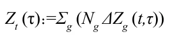
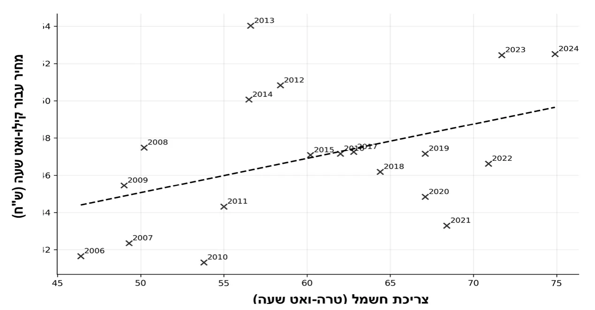
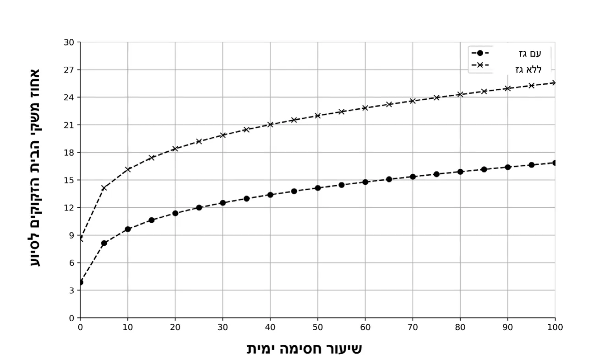

תלותה של אוכלוסיית העולם באספקת אנרגיה שמגיעה דרך הים – למשל גז, נפט ותזקיקים – הולכת ומתגברת. אירועים כמו מלחמות, מתיחות אזורית או חסימה של נתיבי שיט עלולים לפגוע באספקת האנרגיה ולגרום לעלייה במחירים – לדוגמה במחירי החשמל.

מחקר זה בוחן מה עלול לקרות בישראל במקרה של חסימה ימית שתפגע באספקת הגז הטבעי או במקורות אנרגיה אחרים שמגיעים דרך הים. מיקוד העבודה הוא במשק החשמל, משום שמחיר החשמל משפיע במישרין על יוקר המחיה ועל היכולת של משקי בית לשלם עבור צרכים בסיסיים.

לצורך ביצוע המחקר נעשה שימוש בנתוני עבר של צריכת חשמל ומחירי חשמל, ובאמצעות סימולציות נבדקו תרחישים שונים של פגיעה באספקת האנרגיה. הממצאים מראים כי במקרה של חסימה מלאה באספקת הגז הטבעי מחיר אם גם אסדות הגז אינן זמינות, שיעור משקי 28%-החשמל עלול לעלות בכ. הבית שעלולים להיכנס לעוני אנרגטי כמעט משלש את עצמו. כלומר, יותר משפחות יתקשו לשלם על חשמל עבור צרכים בסיסיים בלי לפגוע בהוצאות חיוניות אחרות.

לארשיב יטגרנאה ינועה לע תימי המיסח לש תוכלשהה במצב כזה המדינה תידרש להשקיע סכומים גדולים כדי לסייע למשקי הבית ולהבטיח שלא יידרדרו לעוני אנרגטי. לכן המחקר מדגיש כי ביטחון אנרגטי אינו רק סוגיה ביטחונית, אלא גם סוגיה חברתית וכלכלית. כדי להתמודד עם סיכונים כאלה יש צורך במדיניות אנרגיה יציבה, בתשתיות אמינות ובמערכות רווחה שיוכלו להגן על הציבור בזמן משבר.

המערכת האנרגטית העולמית מאופיינת בעשורים האחרונים בתלות גוברת בנתיבי סחר ימיים ובשרשראות אספקה גלובליות, המהוות עורקי חיים תובלה ימית של נפט Morales-Fusco et al., 2013( לאומית-לכלכלה הבין,). לאומי- מסחר האנרגיה הבין 80%-גז טבעי ותזקיקים עומדת כיום על יותר מ, פוליטיים, צבאיים-ומכאן פגיעותה הגבוהה של המערכת לאירועים גיאו Khanna, 2022; Notteboom et al.,( ואקלימיים המשבשים את חופש השיט חסימה ימית, בין שהיא יזומה על ידי מדינה עוינת, בין 2024; Paché, 2024). שתוצאה של סכסוך אזורי ובין של תקרית ביטחונית מקומית, עלולה לגרום לשיבוש ניכר באספקת האנרגיה, להעלאת מחירים פתאומית ולהשלכות Collins, 2018; Emmerson & Stevens, 2012;( חברתיות מרחיקות לכת .) Munzilin & Mahardhika, 2024; Sizhi, 2025

במקרה הישראלי, חשיבותם של נתיבי השיט היא ייחודית מאז הקמת המדינה "בכלל ולאחרונה בפרט, מאז החלה הפקת הגז ממאגרי "תמר" ו"לוויתן Bufman et al., 2014;( והפכה את ישראל לשחקן אזורי בתחום האנרגיה אך תלותה באספקה ימית של דלקים לתחנות הכוח, וכן Shaffer, 2011), באפשרות הייצוא וההובלה של גז, הופכת אותה לחשופה במיוחד לתרחישים Chorev, 2018; Rettig & Harari, 2024; Teff-Seker et al., 2019( של מצור ימי.) הפגיעה באספקת הגז הטבעי, המשמש מקור עיקרי לייצור החשמל, עשויה להוביל במהירות לעלייה ניכרת במחירי החשמל, להשפעות אינפלציוניות רוחביות ולפגיעה ברווחת משקי הבית – בעיקר בקרב אוכלוסיות מוחלשות.

במצב כזה, העוני האנרגטי, המוגדר כמצב שבו משק בית נדרש להוציא חלק בלתי סביר מהכנסתו לצורך צריכת אנרגיה בסיסית, הפך בשנים האחרונות Bouzarovski, 2017;( למדד מרכזי לבחינת צדק חברתי ומדיניות רווחה בישראל שיעור ניכר Creutzfeldt et al., 2020; Mulder et al., 2023). מהאוכלוסייה נותר חשוף לעליות חדות במחירי האנרגיה לאור השינויים Benchimol et al., 2022; Caspi et al., ;2023 , בשנים האחרונות (גרונאו מצב זה מעלה שאלות מהותיות באשר ליכולתם 2024; Yoganandham, 2023). של הביטוח הלאומי ושל מדיניות הרווחה לספק רשת ביטחון אפקטיבית במצבי שוק משתנים.

במחקר זה אנו מבקשים לבחון כיצד חסימה ימית בהיקפים משתנים תשפיע על משק האנרגיה הישראלי ומה יהיו ההשלכות החברתיות של השפעות אלה, באמצעות שילוב של נתונים היסטוריים וסימולציות מבוססות תרחיש. טכנית, אנו עושים שימוש בנתוני סדרות זמן חודשיות של משק החשמל מחיר ממוצע לצרכן 2( ;)) ביקוש/צריכת חשמל (קוט”ש 1( בישראל, הכוללים;) עלויות ייצור ותמהיל ייצור לפי מקור אנרגיה (למשל גז טבעי, תזקיקים 3(-ו) ואנרגיות מתחדשות), כפי שנמסרו מרשות החשמל/נתוני חברת החשמל. נוסף אנרגטית לרווחת משקי הבית השתמשנו-על כך, כדי לחבר את ההשפעה המאקרו בנתוני חלוקת הכנסות ומספר משקי בית לפי קבוצות הכנסה כפי שהם מופיעים בפרסומי הלשכה המרכזית לסטטיסטיקה. באופן ייחודי, המחקר מתמקד בענף החשמל כמדד לרווחה האנרגטית של משקי בית, ומעריך את העלות הכלכלית הכוללת של משבר אנרגיה הנובע מחסימה ימית, לרבות היקף התמיכה הנדרשת מצד הביטוח הלאומי לצמצום העוני האנרגטי.

counterfactual( סימולציות מבוססות תרחיש במחקר זה הן חישוב כמותי) שבו אנו מגדירים סט תרחישים של חסימה ימית המשנים את זמינותם של מקורות האנרגיה לייצור חשמל (למשל חסימה מלאה של גז טבעי וחסימה חלקית של תזקיקים), ומתרגמים שינויים אלה להשפעה הצפויה על מחיר החשמל ועל הוצאות משקי בית על חשמל. לאחר מכן אנו מחשבים כיצד השינוי במחיר משפיע על שיעור משקי הבית החוצים את סף העוני האנרגטי, ומהו היקף הסיוע התקציבי הנדרש כדי להשיבם אל מתחת לסף.

לארשיב יטגרנאה ינועה לע תימי המיסח לש תוכלשהה תרומתו של מחקר זה היא בעיקרה במיקוד בפער הקיים בין הספרות בנושא הביטחון האנרגטי לספרות בנושא העוני האנרגטי, בדגש על התווך הימי וזמינות המשאבים בעקבות שרשראות האספקה העוברות בו. הספרות

– הקיימת בנושא ביטחון אנרגטי מתארת בעיקר פגיעות ברמה מערכתית תשתיות, יתירות ומאגרים, גיוון מקורות וכו' – אך אינה דנה לרוב בהשפעה ב). הספרות בנושא עוני 2024 ,א2024 על רווחת משקי הבית (רשות החשמל אנרגטי היא דלה, ומתמקדת בעיקר בהשלכות על מחיר האנרגיה כממוצע בשוק. היא אינה דנה בנושאים ממוקדים שגורמים לשיבוש האספקה – למשל חסימה ימית שתשפיע על שרשראות האספקה של האנרגיה הראשונית להפקת חשמל, ואינה בוחנת את מנגנוני העברת העלויות לצרכן ואת תזמון עדכוני תעריפי החשמל. בחיבור הכמותי בין תרחיש של חסימה ימית ברמה משתנה לבין ההשלכות החברתיות של התייקרות תעריפי החשמל בעקבות תרחיש החסימה אנחנו מבקשים לסגור פער תאורטי קיים.

על בסיס ניתוח הרגישות של מקרים תאורטיים אלו מקבלי ההחלטות יכולים להביא בחשבון את הסיכון הממשי הזה לחברה הישראלית ולכלכלתה. בעזרת תכנון מקדים נכון, גם במקרה שתרחישים קיצוניים יקרמו עור וגידים הפגיעה תהיה מצומצמת בהשוואה לחוסר התכנון.

מציג רקע תאורטי וסקירת ספרות 2 המבנה של המאמר הוא כדלקמן: פרק 3 בנושא הביטחון האנרגטי בעולם ובארץ, במצבי שגרה ובתרחישי קיצון. פרק מתאר את המתודולוגיה של המחקר, הכוללת איסוף נתונים, הגדרת משתנה מראה את התוצאות של הניסוי החישובי 4 מטרה וניתוח הסטטיסטי. פרק דן בתוצאות הפרקטיות ובהשלכות המדיניות העולות מהן 5 שעשינו. פרק, מציג את מגבלות המחקר ומציע מחקרי המשך.

### רכיבי אנרגיה ושרשראות אספקה בתווך הימי

מדינות שתלותן בייבוא רכיבי אנרגיה ראשונית מהים, ובפרט גז טבעי לאומיים-נוזלי ותזקיקים, היא גבוהה חשופות מאוד לזעזועי מחירים בין בעקבות התלות בשרשראות אספקה גלובליות והיצע תנודתי בשוק האנרגיה בריטניה היא דוגמה מרכזית למדינה מתועשת שאספקת Richardson, 2025(). הגז שלה נשענת באופן נרחב על ייבוא גז טבעי נוזלי ותלות גבוהה בשוק האנרגיה הגלובלי. לפי נתונים רשמיים קיימים בבריטניה שלושה מסופים מיליארד מטר מעוקב, ומחירם 48 לייבוא גז טבעי נוזלי בקיבולת שנתית של פוליטית בריטנה-לאומיים. בתקופות של מתיחות גיאו-תלוי בהיצע וביקוש בין Department for Business;( חווה תנודות חדות במחירי הגז הטבעי הנוזלי .)Energy & Industrial Strategy, 2023

אף שבריטניה היא בעלת תשתית ייבוא משמעותית יחסית של גז טבעי נוזלי היא איננה מסוגלת להשפיע על מחירי המשאב, ותלויה במידה רבה בהחלטות פוליטי. בהקשר של ניתוח סיכונים-שיקבלו שחקנים אחרים במגרש הגיאו פירוש הדבר הוא שכדי להתמודד עם שינויים חדים במחיר בריטניה איננה מתבססת על קיבולת ייבוא הגז שלה בלבד, אלא גם על יכולות אגירה, גיוון ספקים, יצירת חוזים ויצירת גמישות בביקוש. כל אלה יכולים לסייע לה למתן את חשיפת צרכני החשמל לתנודתיות במחירי האנרגיה הראשונית, Department for Business, Energy( שיבואו לידי ביטוי גם בתעריפי החשמל .)& Industrial Strategy, 2023; Richardson, 2025

יפן ודרום קוריאה הן שתי מדינות שתלותן בייבוא רכיבי אנרגיה ראשונים לאומית-גבוהה, ולכן עצמאותן האנרגטית נמוכה מאוד. נתוני הסוכנות הבין לאנרגיה מראים כי שיעור העצמאות האנרגטית בשתי המדינות הללו עומד – מה International Energy Agency [IEA], 2025a( , בהתאמה 19%- ו 13% על) שגורר פגיעּוּת בהקשר של מחיר ואספקה, ובעקבותיה השפעה גדולה של תנודות Agency for Natural Resources( בשוק האנרגיה על תעריפי החשמל המקומיים .)and Energy, 2022 לארשיב יטגרנאה ינועה לע תימי המיסח לש תוכלשהה ניתן להכליל את אופן השפעתם של תרחישי חסימה מלאה או חלקית של משאבי אנרגיה ראשוניים מהים על עלויות חשמל ועוני אנרגטי באמצעות שלושה שיעור הייבוא של רכיבי האנרגיה הראשוניים דרך הים, ובפרט 1( : פרמטרים) כיוון נתיבי האספקה ותשתיות 2( ; גז טבעי נוזלי כרכיב מרכזי במדינות רבות) מנגנוני ביטחון לאומיים כמו ניהול מאגרי אנרגיה וגמישות 3( ; קליטת האנרגיה) בביקוש, כך ששינויים באספקה לא יובילו לזעזוע בתעריפי החשמל המקומיים. כך, השפעת החסימה הימית מוערכת תחילה בעלייה בעלויות הייצור, ולאחר מכן מתורגמת לשינוי בתעריף המוחל על הצרכנים בהתאם למנגנוני העדכון של התעריפים המקומיים. לבסוף, התוצאות שהתקבלו במחקר תלויות אומנם במישרין במשק האנרגיה המקומי ובשוק האנרגיה העולמי, אולם העקרונות שבבסיסן נכונים גם למדינות אחרות. לכן אפשר ליישם את אותו בסיס מתודולוגי במדינות שונות, תוך כיול הפרמטרים הנוגעים לתשתיות, Department( לחוסן האנרגטי המקומי ולמאפייני התלות בייבוא בכל מדינה .)for Business, Energy & Industrial Strategy, 2023; Richardson, 2025

### ביטחון אנרגטי ותפקידו במדינות מודרניות

ביטחון אנרגטי הוא מושג רחב המייצג את מחויבותה של המדינה לספק 2020 , לתושביה אנרגיה כמוצר צריכה הכרחי וקיומי, בשגרה ובחירום (ולד.) על בסיס התפיסה המערבית ולפיה ביטחון אנרגטי הוא רכיב בסיסי בקיומו של האדם בכבוד, ביטחון אנרגטי נכלל בהגדרה של "שירותים בסיסים" שמדינת רווחה נדרשת לספק לצורך תמיכה בביטחון סוציאלי והתקיימות הפרט בכבוד.

אנרגיה היא הרכיב הבסיסי ביותר לביצוע פעולה או תהליך, על ידי מכונה או אדם. המדינה נדרשת לספק את האנרגיה כדי שכל אדם יוכל לבצע פעולות הדרושות לו למילוי צרכים בסיסיים כמו חימום וקירור מזון, תאורה, מיזוג האנרגיה לצורך ביצוע פעולות אלה יכול להגיע מכמה 2020 , אוויר ועוד (ולד). מקורות. לרוב, התוצר האנרגטי שמסופק ומופץ לתושבי המדינה הוא חשמל, המופק ממקור אנרגיה ראשוני אחר. יש מדינות, ובהן ישראל, המספקות מקורות אנרגיה ראשוניים זמינים, כמו גז טבעי המונגש בצנרות. לצורכי תחבורה ושינוע בים, ביבשה ובאוויר עדיין נדרשים דלקים מאובנים (כמו 2020 , בנזין, סולר ומזוט) להפעלת מנועים של כלי התחבורה (ולד.)

לאומית מגדירה ביטחון אנרגטי כיכולת להבטחת-סוכנות האנרגיה הבין הגדרה IEA, 2022( זמינות ללא הפרעה של מקורות אנרגיה, במחיר סביר). דומה קיימת באיחוד האירופי – הבטחת היכולת לספק אנרגיה באופן בטוח כדי European Commission, n.d( ואמין למדינות אירופה, גם בעת משבר). להבטיח את השמירה על הביטחון האנרגטי תוך שמירה על זמינות, אמינות ומחיר "סביר" יש להבטיח שכל שרשרת האספקה נשמרת ומתפקדת היטב, החל מקיום מקורות האנרגיה הראשוניים, עבור דרך אמצעי ייצור של האנרגיה המסופקת מהמקורות הראשוניים, וכלה במערכות לחלוקה ולהספקה 2020 , מהיצרנים לצרכנים (ולד.)

אוקראינה המחישה את-בשנים האחרונות, לאחר שמלחמת רוסיה המשמעויות הקונקרטיות של פגיעה באחת משרשראות הערך, חלה עלייה ניכרת בשיח על אודות הביטחון האנרגטי של מדינות אירופה והעולם בכלל רוסיה הייתה ספקית מרכזית 2022 ). עד פרוץ המלחמה בשנת Khanna, 2022( 45.3% , מהפחם 46%-של רכיבי אנרגיה ראשונית לאירופה, בהיותה המקור ל European Commission, 2022( מהנפט למדינות היבשת 27%-מהגז הטבעי ו.) נתונים אלה מעידים על תלות גבוהה יחסית של מדינות אירופה ברוסיה כספק אנרגיה ראשוני. עובדה זו שמה בידי רוסיה קלף אסטרטגי משמעותי אשר מאיים על הביטחון האנרגטי שהאיחוד האירופי יכול להבטיח לתושביו.

אחד מההיבטים של ערעור הביטחון האנרגטי בא לידי ביטוי בעליית מחירים ניכרת באירופה בעת המשבר, ובהרחבת העוני האנרגטי של משקי הבית European Parliament,( טבע הפרלמנט האירופי 2016-באירופה. כבר ב שמשמעותו energy poverty( **עוני אנרגטי** ) באופן רשמי את המונח 2016), היא היעדר היכולת של משק בית לספק את רמת האנרגיה הנדרשת בבית מבחינה חברתית וחומרית. הראשונים שדנו בבעיה זו היו הבריטים, והם התמקדו בהיעדר אנרגיה מספקת לצורכי חימום הבית – בעיה אשר בחורף האירופי יכולה להיות מסכנת חיים. הסוגיה נדונה בפרלמנט האירופי כבעיה מיליון אנשים באיחוד – בפרט 160 עד 50-משמעותית הפוגעת לפי ההערכות ב במזרח ובדרום אירופה, אך גם במערבה. הבעיה טמונה בגורמים אחדים ובהם מחירי אנרגיה גבוהים, הכנסות נמוכות, יעילות אנרגטית, מדיניות דיור, גישה מהכנסותיו 10%-למנגנוני תמיכה ועוד. על פי הדוח, משק בית המוציא יותר מ לארשיב יטגרנאה ינועה לע תימי המיסח לש תוכלשהה European( על אנרגיה יתקשה באספקת האנרגיה הנדרשת לניהול צורכי הבית מדד זה הוא המדד המסורתי למדידת עוני אנרגטי, ועדיין Parliament, 2016). נמצא בשימוש נרחב בממלכה הבריטית. עם זאת, יש מדדים מורכבים יותר, בעקבות הסלמת 2022 המתייחסים למשתנים נוספים. נוסף על כך, בשנת, הקונפליקט בין רוסיה לאוקראינה ופרוץ המלחמה, הפעילות הימית בים השחור נפגעה מאוד, והייתה לכך השפעה על כל העולם. נמליה הגדולים של אוקראינה נסגרו, ורוסיה הטילה על אוקראינה מצור ימי שלווה בסכנת פגיעה בטילים או מיקוש. התוצאה הייתה עלייה במחירי הביטוחים לספינות באזור. כחלק מהקונפליקט הוטלו סנקציות על חברות רוסיות, והאיחוד האירופי, אוסטרליה וארצות הברית אסרו על ייבוא של גז, תזקיקים ופחם למדיניותיהם Benton et( במטרה לפגוע ברווחים של רוסיה, אשר מממנים את הלחימה בשל הקונפליקט מחירי הגז, התזקיקים והפחם al., 2022; Khanna, 2022). 345-ואט לשעה ל- יורו מגה 100-עלו מאוד. מחירי הגז הטבעי באירופה עלו מ מחירי Quantum Commodity Intelligence, 2022( ואט לשעה-יורו מגה), Organization of the Petroleum( דולר 108- דולר ל 80-התזקיקים עלו מ ומחיר הפחם באוסטרליה שילש את עצמו ביחס Exporting Countries, 2022), Proctor, 2022( לתחילת אותה השנה והגיע לשיא היסטורי.)

פוליטיים מביאים לעלייה במחירי משאבי האנרגיה-קונפליקטים גיאו הראשוניים, אלה מביאים לעלייה במחירי החשמל, ובסופו של דבר להרחבת מעגלי העוני האנרגטי. כפי שהודגם בפסקה מעלה, בעקבות מלחמת אוקראינה עלו מאוד מחירי הגז, התזקיקים והפחם. הדבר גרר עלייה-רוסיה במחירי החשמל במדינות רבות באירופה, אך לא רק בה, על פי דיווחי סוכנות בסופו של דבר, בשל המנגנון המטיל את IEA, 2025b( לאומית-האנרגיה הבין). העלויות התפעוליות של ייצור החשמל על הצרכנים, עלייה במחירי החשמל עקב עלייה במחיריהם של רכיבי האנרגיה הראשוניים מביאה להתרחבות של Kröger et al., 2023( מעגל העוני האנרגטי.)

הניתוח בספרות בנושא ביטחון אנרגטי מתמקד כיום ברמת המאקרו – זמינות התשתיות ורכיבי האנרגיה הראשוניים, והחשיפה לתנודתיות מחירים ולזמינות בהקשרי היצע וביקוש. המחקרים הזמינים אינם מכמתים את Department for Business, Energy( מדדי העוני האנרגטי ברמת משקי הבית הספרות בנושא עוני אנרגטי& Industrial Strategy, 2023; Richardson, 2025).

מתמקדת לרוב בזעזועים במחירי השוק של גז או חשמל ובהשפעתם על חלוקת פוליטיים והפרעות-האנרגיה, ואינה מדגישה את השפעותיהם של זעזועים גיאו לשרשרת האספקה העולמית בתווך הימי כגורם לשינויים דרסטיים במאזן Kröger et al., 2023; Śmiech et al., 2025( האנרגיה המקומי.)

יתרה מכך, לרוב לא מוצג התקציב שצפוי להידרש לכיסוי הפער הכלכלי שנוצר בשל זעזועים בשוק הנגרמים מסיבות שונות, כלומר אומדן של גודל התקציב שיסייע להביא את משקי הבית שהצטרפו למעגל העוני האנרגטי אל מעל הסף. המיקוד בתיאור מנגנוני סיוע הבאים לידי ביטוי בזכאות להנחות מקשה על ההשוואה בין השפעות התרחישים השונים ובין כלי המדיניות שנדרשים לצמצום הבעיה.

בדוחות של האיחוד האירופי, אנרגיה מתחדשת מוזכרת רבות כאלמנט בהתייעלות אנרגטית שתביא לצמצום העוני האנרגטי בטווח הזמן ארוך. שימוש באנרגיה המופקת מרוח או שמש יכול לצמצם את הצריכה-הבינוני והתלות במקורות אנרגיה ראשוניים כמו גז או תזקיקים, ובכך להקטין את התנודתיות במחירים ואת הפגיעה במשקי בית מוחלשים. עם זאת, לצד היתרונות בהכנסת אנרגיה מתחדשת כמקור אנרגיה ראשוני לייצור חשמל, בטווח הקצר הדבר עשוי דווקא להכביד על משקי הבית המוחלשים ולהרחיב את מעגל העוני האנרגטי, כיוון שעלויות הפיתוח הטכנולוגי והמעבר לאנרגיות European Commission, 2022( מתחדשות מוטל על צרכני החשמל עצמם.)

### ההקשר הישראלי

ישראל איננה עצמאית מבחינת אספקת צורכי האנרגיה הראשונית שלה, ואינה צפויה להפוך כזו, כיוון שהתלות שלה בייבוא ימי של נפט היא גבוהה. 2019( "למרות זאת, בשנים האחרונות, מאז החלה לפעול אסדת "לוויתן,) חיזוק החוסן הוביל להגדלת 2020 , ישראל חיזקה את חוסנה האנרגטי (רטיג). יכולת הפקת הגז המקומית וצמצם את התלות באסדת "תמר", ובכך יצר גיוון במקורות האספקה. כך, פעילותה של אסדת "לוויתן" תרמה לצמצום התלות במשאבי אנרגיה ראשוניים לצורך הפקת חשמל במדינת ישראל (משרד ב2024 ; רשות החשמל 2019 , האנרגיה והתשתיות.)

לארשיב יטגרנאה ינועה לע תימי המיסח לש תוכלשהה מהחשמל שלה על בסיס 70% ישראל ייצרה 2023 על פי דוח רשות החשמל, בשנת מהביקוש המקומי לגז טבעי 80% , גז טבעי כמשאב אנרגיה ראשוני. באופן כללי ב). כיוון שמיקומן של אסדות 2024 , הוא לצורך הפקת חשמל (רשות החשמל הגז הוא בים (נקודת הפקה, צנרת וכו'), והייבוא של הרוב המוחלט של משאבי האנרגיה הראשוניים האחרים נעשה באמצעות שרשראות אספקה ימיות, פוליטי עם-חוסנה האנרגטי של ישראל לוי מאוד בתווך הימי. בעת משבר גיאו מדינות האזור והגבלת הפעילות הימית, חוסן זה נפגע. בעת לחימה אסדות הגז זירתית-המאוימות נסגרות לחלוטין (באופן זמני), ובמקרה קיצון של לחימה רב Rettig & Harari, 2024( הפסקת פעילותן עלולה להוביל למחסור ניכר בגז טבעי.)

מחירם של רכיבי החשמל השונים בארץ נקבע ומתעדכן לפי חוק משק החשמל, מחירי החשמל מעודכנים אחת לשנה על פי נוסחה שקובעת 1996-התשנ"ו. רשות החשמל ועל בסיס עיקרון של "משק סגור". כלומר, כל העלויות הכרוכות בייצור החשמל באות לידי ביטוי במחירו בתחשיב חשבונאי פשוט של העלויות הממוצעות החזויות: רכיבי אנרגיה ראשוניים, עלות הולכה (רשת מתח עליון,) עלות חלוקה (רשת מתח גבוה או נמוכה לצרכנים), ושירותי מערכת נוספים ביקוש, שרידות וכו'). עם זאת, השתת העלויות הנלוות על הצרכן-(איזון היצע אינה תהליך רציף, אלא תהליך המתקיים באופן תקופתי. לכן אין הכרח שהשינוי בעלויות יבוא לידי ביטוי מיידי וליניארי עבור הצרכן, אלא כתלות א2025 , במועד ההכרה בעלויות ועדכון התעריף (רשות החשמל.)

כחלק מכך, עלייה במחירם של רכיבי האנרגיה הראשוניים לייצור החשמל פוליטית שתאיים על נתיבי-(גז, פחם, תזקיקים) – לדוגמה עקב מורכבות גיאו השיט לנמלי ישראל – צפויה להוביל לעלייה בעלויות הייצור, ובסופו של דבר במסמכים המתארים את 2023 , לעלייה במחיר החשמל (קופראק וקוסמן). תעריפי החשמל רכיב זה מכונה "עלות סל דלקים", ובכפוף לתזמון של עדכון התעריף התקופתי הוא יבוא לידי ביטוי בעלויות המוכרות של רכיבי התעריף א2024 ,) (רשות החשמל pass-through ויושת על הצרכן (מנגנון.)

נכון להיום, אין בישראל הגדרה של עוני אנרגטי, ובשל היעדר מדד לבחינת התופעה היקפיה אינם ברורים. בשנים האחרונות החלו צעדים לבחינת העניין, ופורסמו מסמכים בנושא על ידי מרכז המחקר והמידע של הכנסת.

זאת ועוד, אין בישראל גוף אחד האמון על הנושא, וגופים רבים מעורבים בטיפול בתופעה – כל אחד בתחומו: הביטוח הלאומי, משרד האנרגיה, המשרד להגנת הסביבה, משרד הרווחה, משרד השיכון, חברת החשמל ועוד (זרד, 2023 ,; קופרמן וקוסמן 2025.)

כיום הביטוח הלאומי תומך במישרין במשקי בית נזקקים בהיבטי ביטחון אנרגטי באמצעות מענק חימום הניתן פעם בשנה למקבלי קצבת אזרח ותיק בתנאים מסוימים (נכות או השלמת הכנסה), ובעבור משק בית אחד. גובה (המוסד לביטוח לאומי, ח"ת 2025 שקלים, נכון לשנת 649 המענק עומד על.) נוסף על תמיכה זו יש תוכניות שונות להוזלת מחירי החשמל למשפחות נזקקות, סבסוד מכשירי חשמל יעילים יותר אנרגטית והגבלה על ניתוק את העלויות הללו סופגת, בסופו 2023 , אספקת החשמל במקרה של חוב (זרד). של דבר, קופת המדינה.

## מתודולוגיה

בפרק זה מוצגת המתודולוגיה ששימשה לבחינת ההשפעות הכלכליות והחברתיות של חסימה ימית על משק האנרגיה בישראל. יוצגו מקורות המידע, אופן ההגדרה של מדד העוני האנרגטי ושיטות החישוב והניתוח הסטטיסטי ששימשו לאמידת ההשפעה של שינויי היצע ומחיר על הצורך בהתערבות כלכלית מצד הביטוח הלאומי.

### מקורות המידע

הניתוח מבוסס על נתונים היסטוריים של צריכת אנרגיה וחשמל במשקי בית א). נתונים 2025 , בישראל כפי שנמסרו מרשות החשמל בישראל (רשות החשמל אלה כוללים פירוט חודשי של ביקוש לחשמל (ביחידות קוט"ש), מחירים ממוצעים לצרכן ועלויות ייצור לפי סוג מקור האנרגיה (גז טבעי, תזקיקים, אנרגיות מתחדשות). לצד זאת, לחישוב מדדי העוני האנרגטי נעשה שימוש לארשיב יטגרנאה ינועה לע תימי המיסח לש תוכלשהה א) ומדוחות 2025 , במידע משלים מנתונים של רשות החשמל (רשות החשמל הלשכה המרכזית לסטטיסטיקה בנוגע לחלוקת ההכנסות באוכלוסייה נוסף על כך, לצורך בקרה אקלימית 2025 , (הלשכה המרכזית לסטטיסטיקה). במודל הביקוש לחשמל נאספו נתוני טמפרטורה חודשיים וחושבו מדדי שלושה מדדים Cooling Degree Days) CDD-) ו Heating Degree Days) HDD). אלו שולבו כמשתני בקרה בניתוח הרגרסיה (ראו בהמשך.)

### עוני אנרגטי

מההכנסה 10% – בהתבסס על ההגדרה המסורתית לאומדן עוני אנרגטי נקודת עוני אנרגטי European Parliament, 2016( החציונית למשק בית), מההכנסה 10%היא מצב שבו משק בית נדרש להוציא על חשמל יותר מ־ כערך ייחוס 10% החציונית של משק בית. במחקר זה אנו משתמשים בסף של מאחר שזהו המדד המסורתי והנפוץ ביותר בספרות למדידת עוני baseline(), אנרגטי. מאחר שבישראל אין כיום הגדרה רגולטורית אחידה לעוני אנרגטי, אנו משלימים את ההצגה באמצעות ניתוח רגישות סביב סף הייחוס בטווח כדי להמחיש עד כמה הממצאים תלויים בבחירת הסף. מצב 12%–8%( %±2), זה מבטא חוסר יכולת לשמור על צריכת אנרגיה בסיסית הדרושה לחימום, לקירור, לתאורה ולשימוש ביתי תקין. נסמן את הוצאות החשמל בתקופה הוא צריכת החשמל *Q*t-הוא מחיר ממוצע לקוט״ש ו *P*t , כאשר Qt∙Pt=Et -כ *t*. משק בית ייחשב למצוי *Y*g- כ *g* נסמן את ההכנסה הפנויה של קבוצת ההכנסה. כאשר הוא סף העוני האנרגטי. בהתאם לכך, נמדוד *E*t*/Y*g<*τ* בעוני אנרגטי אם, את פער העוני האנרגטי כגובה ההוצאה בפועל של משק בית על חשמל לעומת הסכום שנחשב סביר על פי הכנסה חציונית. כאשר ההוצאה בפועל חוצה את רף ההפרש מעיד על צורך בסיוע ממשלתי או ציבורי – תפקיד שבמחקר זה 10%-ה יוחס לביטוח הלאומי. כדי לכמת את היקף ההתערבות הנדרשת אנו מגדירים את "פער הסיוע" כגובה הסבסוד התקציבי הדרוש כדי להחזיר את משק הבית *ΔZ*g*(t,τ)*∶=*Y*g⋅*τ* - *max*t {0,*E*{ :*g* לכל קבוצת הכנסה *τ* אל מתחת לסף

העלות הכוללת של סבסוד מלא לכל משקי הבית היא

אנו *Q*t ואת *P*t הוא מספר משקי הבית בכל קבוצת הכנסה. את *N*g כאשר *Y*g מפיקים מנתוני רשות החשמל בעזרת נתוני צריכה ומחיר היסטורי, ואת אנו מפיקים מחלוקת ההכנסות ומספר משקי הבית לפי הלשכה המרכזית *N*g-ו לסטטיסטיקה.

מכאן, באופן יישומי, גודל הפער מייצג את העלות הממוצעת הנדרשת לתמיכה בכל משק בית הנמצא במצב של עוני אנרגטי, והוא מחושב בהתבסס על נתוני מציג את 1 צריכת החשמל הממוצעת ועל מחירי החשמל עדכניים. תרשים עקב שינוי בהיצע ולכן ΔZ( הסיוע הנדרש מביטוח לאומי למשק בית בודד) במחיר כדי לאפשר למשק בבית ממוצע להיות מעל קו העוני האנרגטי.

למשק בית יחיד עקב שינוי חד בהיצע ΔZ( הסיוע הנדרש מביטוח לאומי :1 תרשים) – ולכן במחיר – כדי לאפשר למשק בית ממוצע להיות מעל קו העוני האנרגטי

### ניתוח סטטיסטי

הניתוח הסטטיסטי נעשה בארבעה שלבים עיקריים. בשלב הראשון ניתחנו את הקשר בין צריכת החשמל למחירו לצרכן על בסיס נתוני חברת החשמל. מחיר במטרה לאמוד את האלסטיות של הביקוש-ביצענו רגרסיית ביקוש לחשמל, כלומר עד כמה השינוי במחיר משפיע על היקף הצריכה בפועל. חודשית, כך שמקדם המחיר log-log האמידה בוצעה באמצעות רגרסיית זאת *ln(Q*t*)=α+βln(P*t*)+γX*t*+mμ+ν*y*+ϵ*t : טווח-מתפרש כאלסטיות קצרת;

לארשיב יטגרנאה ינועה לע תימי המיסח לש תוכלשהה הוא וקטור משתני בקרה *X*t , היא אלסטיות הביקושת ביחס למחיר *β* כאשר, *ν*y , חודש (משתנים שתלוים בחודש עצמו) לבקרה על עונתיות- הם קבועי *mμ* הוא שגיאת *ϵ*t-שנתיים, ו-שנה (או מגמה) לבקרה על שינויים רב-הם קבועי קירוב. ספציפית, משתני הבקרה כללו טמפרטורה חודשית ממוצעת, מדד המתפרש log-log מהמודל *β* לשעות שיא ועומס. לפיכך חישבנו את מקדם, ישירות כאלסטיות. ניתוח זה אפשר לנו להעריך את הרגישות של משקי הבית לשינויים במחירי החשמל לאורך זמן. בתרחישי שינוי מחיר עדכנו את הצריכה שימש לחישוב הוצאות *Q*s . ערך *Q*s*=Q*0∙*(P*s*/P*0 *)*β-הצפויה לפי האלסטיות כך ש החשמל בתרחיש, ועל בסיסו לחישוב פער הסיוע והעלות הכוללת לביטוח הלאומי בכל תרחיש.

בשלב השני ביצענו סימולציות של תרחישים של חסימה ימית במטרה להעריך את השפעתם על משק האנרגיה ועל מחירי החשמל. בתרחישים היו שני סוגי משתנים: חסימה מלאה של גז טבעי (משתנה בינארי), וחסימה חלקית של תזקיקים (משתנה רציף). חישבנו את ההשפעה של כל תרחיש על מחיר החשמל באמצעות מודל רגרסיה ליניארית שהותאם כך שיכלול תיקון רגישות לפי חלקו

היחסי של כל מקור אנרגיה בכלל היצע החשמל במשק.

– בשלב השלישי ערכנו ניתוח רגישות נוסף שבחן חמישה סיפי עוני אנרגטי נבחר כחלון 12%–8% מההכנסה החציונית והממוצעת. הטווח 12% עד 8%-מ נקודות אחוז), על רקע היעדר הגדרה±2( 10% רגישות סביב סף הייחוס רגולטורית אחידה בישראל. עבור כל מקרה חישבנו את גודל האוכלוסייה שעוברת את הסף ואת היקף התמיכה הציבורית הנדרשת. ניתוח זה אפשר לנו לבדוק עד כמה תוצאות המחקר יציבות במקרה של שינויים בהגדרת גבול העוני האנרגטי.

לבסוף, בשלב הרביעי, ביצענו סימולציה של שיעור החסימה הימית ושיעור האנרגיה המתחדשת במערכת על היקף הסכומים שהביטוח הלאומי יצטרך לשלם כדי להתמודד עם עוני אנרגטי.

## ממצאים

בשלב הראשון נאמדה פונקציית הביקוש לחשמל באמצעות רגרסיית חודשית, שבה המשתנה התלוי הוא לוג הצריכה החשמלית, והמשתנה log-log המסביר המרכזי הוא לוג המחיר הממוצע לצרכן, לצד משתני בקרה לעונתיות, לטמפרטורה ולמגמות זמן. האומדן לאלסטיות הביקוש ביחס למחיר שהתקבל בהינתן שיתר המשתנים קבועים. מקדם זה נמצא מובהק β=0.12 הוא, ויכולת ההסבר של המודל היא p<0.05 סטטיסטית ברמת מובהקות של, מוצגת עקומת הביקוש לחשמל בישראל לפי נתוני חברת 2 . בתרשים *R*2=0.38 החשמל כך שהציר האופקי מייצג את המחיר הממוצע לקוט"ש (בשקלים,) והציר האנכי מייצג את סך הצריכה השנתית (במיליוני קוט"ש). העקומה log-log משקפת את הקשר המותנה בין מחיר לצריכה. מאחר שמדובר במודל התרשים משקף את הקשר המותנה שנאמד בין המחיר לבין הצריכה לאחר בקרה על יתר המשתנים, ולכן יש לפרשו כהמחשה של השיפוע האמפירי של פונקציית הביקוש, ולא כתיאור גרפי גולמי של הנתונים בלבד. הקשר מתחזק כאשר עלייה במחיר החשמל מעלה את הכמות המבוקשת (כאשר שאר הגורמים קבועים.)

הקשר בין צריכת החשמל השנתית הממוצעת למשק בית למחיר הממוצע :2 תרשים שעה באותה שנה, לאורך זמן. הקו המקווקו הוא הרגרסיה-לקילוואט הלינארית על הנתונים לארשיב יטגרנאה ינועה לע תימי המיסח לש תוכלשהה השתמשנו בתוצאה הזאת כדי להגדיר את הקשר בין ההיצע למחיר. בתרשים מוצגת ההשפעה היחסית של חסימה ימית על שיעור משקי הבית שיזדקקו 3 0%-לסיוע עקב עוני אנרגטי. הציר האופקי מתאר את שיעור החסימה, מ (חסימה מוחלטת), והציר האנכי מציג את שיעור 100% (אספקה מלאה) ועד משקי הבית שיזדקקו לסיוע עקב עוני אנרגטי. כל החישובים נעשו על בסיס – . בתרשים נבחנים שני משתנים: גז טבעי 2024 נתוני צריכת החשמל משנת 1- ל 0 שמוצג כמשתנה בינארי, ותזקיקים – שמוצגים כמשתנה רציף בין.

<figure id="fig-x1">

</figure>

הקשר בין שיעור הסגר הימי לבין שיעור משקי הבית שיסבלו מעוני אנרגטי :3 תרשים במצבים שבהם אסדות הגז בים פעילות, ובמצבים שבהם הם אינן פעילות

מציג את תוצאות ניתוח הרגישות שבוצע עבור חמישה סיפי עוני 1 לוח ביחס להכנסה החציונית והממוצעת של משקי הבית 12%- ל 8% אנרגטי בין, בישראל. החישוב מבוסס על השוואה בין עלות הצריכה בפועל לבין ההכנסה כך 12%- ל 8%-הפנויה, מתוך הנחה כי ככל שסף ההוצאה עולה (למשל מ) גדל שיעור משקי הבית הזקוקים לסיוע, ועימו העלות הכוללת של תוכנית הסיוע הממשלתית. הנתונים מוצגים באופן יחסי לערך הבסיס שנקבע לסף מההכנסה החציונית, אשר הוגדר כרמת הייחוס שלפיה נבחנים שאר 10% של התרחישים. מהלוח עולה כי עבור הכנסה ממוצעת, כאשר ההגדרה לסף העוני האנרגטי נעשית נוקשה יותר נדרשת השקעה גבוהה יותר מצד המדינה – עד ביחס לרמת הייחוס. לעומת זאת, כאשר סף העוני מתמתן ההשקעה 108% ואף פחות. מגמה דומה נצפית גם ביחס להכנסה 100%-יורדת בהדרגה לכ החציונית, אם כי ברמות נמוכות מעט יותר, מה שמרמז על פער מתון בין מדדי ההכנסה בבחינת צרכים סוציאליים.

<figure id="fig-x2">

</figure>

ניתוח רגישות של היקף ההשקעה הנדרש מהביטוח הלאומי בתוכנית סוציאלית :1 לוח מהחציון למשק בית 10% להתמודדות עם עוני אנרגטי, ביחס לחציון ובהנחת סיוע בגובה

<figure class="table-figure" id="table-x1">

<table><tr><th>12%</th><th>11%</th><th>10%</th><th>9%</th><th>8%</th><th></th></tr><tr><td>100.60%</td><td>102.40%</td><td>105.30%</td><td>106.90%</td><td>108.00%</td><td>ממוצע</td></tr><tr><td>95.20%</td><td>97.60%</td><td>100%</td><td>102.10%</td><td>103.30%</td><td>חציון</td></tr></table>

</figure>

## דיון וסיכום

במחקר זה בחנו את ההשפעות הכלכליות והחברתיות של חסימה ימית על משק האנרגיה בישראל, והתמקדנו ברכיב החשמל כמשאב צריכה בסיסי לכל משק בית. שילבנו נתונים היסטוריים מרשות החשמל עם סימולציות כמותיות שנועדו להעריך את ההשלכות של שני תרחישים: חסימה מלאה וחסימה חלקית של אספקת מקורות אנרגיה ראשוניים דרך הים – גז טבעי מחיר למדידת אלסטיות-ותזקיקים. על בסיס מידע זה בנינו מודל ביקוש הצריכה, חישבנו את השפעת השינויים במחירי האנרגיה על ההוצאה הביתית, והגדרנו את נקודת "העוני האנרגטי" כרף שבו משק בית נדרש להוציא יותר מהכנסתו החציונית על חשמל 10%-מ.

לארשיב יטגרנאה ינועה לע תימי המיסח לש תוכלשהה משמעי על כך שחסימה ימית גורמת-תוצאות הניתוח שלנו מצביעות באופן חד היקף ממשאבי קופת המדינה-לזעזוע בשוק האנרגיה, וגוררת צורך בסיוע רחב לתמיכה בהתמודדות עם עוני אנרגטי במשקי בית רבים. העלייה fiscal need() במחיר החשמל בתרחיש של חסימה מלאה משקפת פער ניכר בין 28%-של כ קיבולת ההיצע הקיימת לבין הביקוש הבלתי גמיש של משקי הבית, כפי שרואים אפשר לראות שירידה של אחוזים ספורים בהכנסה 1 . בהשוואה ללוח 2 בתרשים או עלייה של אחוזים ספורים במחיר גורמות לשינוי מהותי במספר משקי הבית הזקוקים לסיוע. מדובר במערכת רגישות גבוהה מאוד, שבה תנודות קלות במחיר מיתרגמות לעלויות ציבוריות כבדות. תוצאה זאת מצביעה על קושי בהגדרת סף כלכלי למשקי הבית, שכן שינוי קטן בהגדרה יגרור שינוי גדול בעלויות לקופת המדינה.

התוצאות הללו עולות בקנה אחד עם ממצאי מחקרים שנעשו באירופה Bouzarovski & Petrova, 2015; Kröger et al., 2023; Longden( ובבריטניה שהצביעו על כך שעוני אנרגטי מתרחב et al., 2022; Thomson et al., 2017), במיוחד בתקופות של תנודתיות במחירי האנרגיה, ושמשקי בית בעלי הכנסה בינונית ונמוכה מגיבים לעליות מחיר לאט, או כלל לא. עם זאת, בניגוד למודלים האירופיים, שבהם המדינה מחזיקה עתודות אנרגיה גדולות או מנגנוני בלימה תפעוליים, בישראל התלות בייבוא דרך הים, ועתודות האנרגיה נמוכות יחסית, הופכת את ההשפעה של חסמים בשרשרת האספקה הימית והעלייה במחירי רכיבי האנרגיה הראשוניים למהירה וחדה יותר, הן ברמת המחיר הן ברמת הצורך המיידי בהתערבות.

ההתערבות והסיוע האפשריים למשקי הבית הנזקקים יכולים לבוא לידי ביטוי בשלוש דרכים – וכולן מבוססות על משאבים כלכליים מקופת המדינה:

1995( בחוק הביטוח הלאומי **. מנגנון חירום על בסיס הביטוח הלאומי**1 .) – מצוין כי המוסד יכול על פי הסכם על הממשלה (ולא דרך קבע) להעניק בכפוף להתייעצות ולהסדרה תקציבית – הטבות סוציאליות שאינן ניתנות לפי החוק הנדון או לפי חוק אחר. סעיף זה תומך בהפעלת מנגנון סיוע זמני בעת משבר על בסיס תקציב המדינה. כיוון שהוראה זו היא לטווח טווח ואינו מטפל-קצר, ואינה קבועה, פתרון זה אינו מתאים ליישום ארוך 1995-בבעיה (חוק הביטוח הלאומי [נוסח משולב], התשנ"ה.)

אם המדינה מבקשת להפוך את מנגנון הסיוע**. טווח לסיוע-מנגנון ארוך** לקבוע יש צורך בחקיקה מתאימה שתגדיר קצבה או תוספת ייעודית למשקי בית המצויים בעוני אנרגטי או בעדכון של מנגנון הקצבאות הקיים כך

שיביאו בחשבון שינויים בתעריפי האנרגיה.

כבר כיום קיים מנגנון תמיכה באמצעות **. זיכוי או הנחה בחשבון החשמל**3 . הפחתה בחשבון החשמל למשקי בית הנמצאים בקבוצות זכאיות כפי שנקבע בתקנות (חברת החשמל לישראל, ח"ת). חברת החשמל לישראל מזכה בהנחה אוטומטית את משקי הבית הזכאים על בסיס רשימות המועברות, בין היתר, מהביטוח הלאומי. כך, הסיוע יכול להתממש כזיכוי דיפרנציאלי בחשמל, והביטוח הלאומי עשוי לשמש מנגנון לאימות זכאות ולהעברת נתונים בהתאם למסגרת שתיקבע.

הנחת הסימולציה באשר לעלייה בהיקף הנזקקות עקב ההתרחבות של מעגל העוני האנרגטי נועדה להמחיש סדר גודל תקציבי ותלות בפרמטרים שונים כמו תעריף וצריכה, ואילו מימוש הסיוע בפועל תלוי בהחלטות ממשלה, בתקצוב נתון ובעיגון זמני או קבוע בחוק של אופן מתן הסיוע.

מממצאי מחקר זה מחזקים את הטענה כי חוסנה האנרגטי של מדינת ישראל תלוי במידה רבה בתווך הימי, הן לצורך הפקת משאבי אנרגיה ראשוניים הן לשינוע ולייבוא שלהם לצורך הפקת החשמל המופץ לצרכנים. לתלות זו השלכות ביטחוניות, כלכליות וחברתיות רחבות, אך כיום הן אינן מטופלות באופן הוליסטי על ידי גוף מרכז אחד במדינה. בשל כך עולות יוזמות שונות שמטרתן לצמצם את העוני האנרגטי, אך אין אסטרטגיה מתכללת אשר משלבת את ההיבטים השונים בתופעה ומתווה דרכי פעולה ברורות להשגת יעדים מוגדרים.

דוגמה לכיוון פעולה שדורש סנכרון רחב בין גופים שונים הוא הפקת חשמל קופראק 2025 , ממקורות אנרגיה מתחדשת. נקודה זו נדונה בארץ (זרד; European Commission, 2022; European( ) וכן באיחוד האירופי 2023 , וקוסמן ראוי לציין בהקשר זה ששימוש באנרגיה מתחדשת כרוך Parliament, 2016). בהיעדר עקביות ושליטה במקור ובכמותו של התוצר המופק. לדוגמה, הפקת לארשיב יטגרנאה ינועה לע תימי המיסח לש תוכלשהה אנרגיה סולרית משתנה במהלך היממה ותלויה בשינויים במזג האוויר. זאת ועוד, אגירה של אנרגיה סולרית היא סוגיה מורכבת לאור יעילות נמוכה, ניתן לשער שככל שיפותחו ויתבססו 2020 , אמינות בינונית ועלות גבוהה (ולד). טכנולוגיות התומכות באנרגיה מתחדשת, כמו שיטות אחסון אנרגיה, פתרון זה יתרום לביטחון אנרגטי וישתלם כלכלית למדינה ולצרכן. עם זאת, בטווח הזמן הקצר ההשקעה בפיתוח הטכנולוגיות תוטל על הצרכן, ועשויה להרחיב את מעגל משקי הבית המצויים בעוני אנרגטי.

10% מחקר זה אינו חף ממגבלות. ראשית, במחקר המוצג השתמשנו במדד של מההכנסה החציונית להגדרה של עוני אנרגטי. מדד זה הוא כלי מדידה נוח ומקובל, אך כזה שמרדד אלמנטים רבים המשפיעים על שיערוך מדויק של עוני אנרגטי, ובכך מרדד את מורכבות התופעה, השלכותיה ואופן הטיפול היעיל בה. שנית, ההערכות במחקר זה התייחסו לשימוש בחשמל כרכיב מרכזי בצריכה האנרגטית של מדינה. גישה זאת נוחה לאור המידע העשיר הנגיש מחברת החשמל, אולם היא רק קירוב לדינמיקת החשמל האמיתית במדינה. מן הראוי שמחקרי המשך יעשו ככל הניתן שימוש במידע על צריכה, היצע ומחיר של מקורות אנרגיה אחרים כדי לקבל תמונת עולם מדויקת יותר. לבסוף, החישוב של השפעת החסימה הימית על מחיר החשמל, ומכאן על שיעור משקי הבית המצויים בעוני אנרגטי, נעשה בהנחה כי המחיר ההיסטורי נובע משיווי משקל בין היצע לביקוש. הנחה זאת עומדת אומנם בבסיסה של תורת התמחור, אך בתקופת מלחמה, שבה הדינמיקה משתנה, הנחה זאת עלולה לאבד מנכונותה. מכאן שמחקרי המשך צריכים לאמוד את נכונות

הטענה גם בזמן מלחמה, כדי לקבל הערכת מחיר מדויקת ככל האפשר.

לסיכום, כדי להצליח להתמודד עם תופעת העוני האנרגטי ולחזק את חוסנה האנרגטי של מדינת ישראל נדרש תכנון מקדים לתקופות משבר בכלל, ולאלו שמקורן בזירה הימית או שמשפיעות עליה בפרט, כך שאזרחי המדינה יוכלו להתמודד עם תקופות המשבר הללו בנזק מועט ככל האפשר. תכנון זה יאפשר לגבש מדיניות ואסטרטגיה רחבה עבור הסוגיה המורכבת, והביטוח הלאומי יכול וצריך למלא בה תפקיד מרכזי.

## References

- –1996 מדיניות כלכלית בסכיזופרניה: רמת המחירים והאינפלציה בישראל .)2023( 'גרונאו, ר .. המכון למחקר כלכלי ע"ש מוריס פאלק 23.01H '. מאמר לדיון מס 2017 [link](http://#)
- הכנסות והוצאות משק הבית : נתונים מסקר הוצאות .)2025( . הלשכה המרכזית לסטטיסטיקה https://did.li/yqAmC . – סיכומים כלליים 2022 משק הבית [link](http://#)
- https://did.li/nYWgT .) מענק חימום – אזרח ותיק (קצבת זקנה .) המוסד לביטוח לאומי. (ח"ת [link](http://#)
- מודיעין לאומי אזרחי: גישות ורעיונות ליישום.). ביטחון אנרגטי לישראל 2020( 'ולד, ש . עוני אנרגטי בישראל ובמבט השוואתי. הכנסת – מרכז המחקר והמידע .)2025( 'זרד, א . זכאות לתשלום מופחת והנחה בחשבון החשמל .) חברת החשמל לישראל. (ח"ת [link](http://#)
- . מאגר 210 ,1522 . ספר החוקים, חוברת 1995-חוק הביטוח הלאומי [נוסח משולב], התשנ”ה [link](http://#)
- משרד האנרגיה נתן את אישור ההפעלה .) בדצמבר 19 ,2019( . משרד האנרגיה והתשתיות https://did.li/oYWgT . להזרמת הגז הטבעי ממאגר לוויתן [link](http://#)
- אומדן היקף משקי בית עניי אנרגיה בישראל וסקירה של .)2023( 'קופראק, נ' וקוסמן, ל . תוכניות לעידוד התייעלות אנרגטית. הכנסת – מרכז המחקר והמידע
- ' משק האנרגיה בישראל: הזדמנויות ואתגרים בפתח העשור החדש. בתוך ש .)2020( 'רטיג, ע
- ). המרכז 287–280 ' (עמ 2020–2019 הערכה אסטרטגית ימית רבתי לישראל ,) חורב (עורך
- 2024 – עדכון שנתי לתעריף החשמל 68302 'החלטה מס .) בינואר 29 ,א2024( . רשות החשמל https://www.gov.il/he/pages/68302 . לצרכני חברת חשמל .2024 ומגמות בשנת 2023 דוח מצב משק החשמל: סיכום שנת .)ב2024( רשות החשמל .2024 דוח מצב משק החשמל לשנת .) בספטמבר 21 ,א2025( . רשות החשמל . – עדכון מבנה תעריף החשמל 72806 'החלטה מס .) בדצמבר 25 ,ב2025( . רשות החשמל [link](http://#)
- Agency for Natural Resources and Energy, Ministry of Economy, Trade and Industry (METI). (2022). Japan’s energy 2022. https://did.li/fwjba [link](http://#)
- Benchimol, J., Caspi, I., & Levin, Y. (2022). The COVID-19 inflation weighting in Israel. The Economists’ Voice, 19(1), 5–14. https://did.li/Qt7gT .154–130 ,5 , בישראל https://did.li/tHLOf [doi:10.1515/ev-2021-0023](https://doi.org/10.1515/ev-2021-0023) · [link](http://#)
- https://did.li/QB3ZH . החקיקה הלאומי . לחקר מדיניות ואסטרטגיה ימית https://did.li/scEDN https://www.gov.il/he/pages/dochmeshek https://www.gov.il/he/pages/78206 לארשיב יטגרנאה ינועה לע תימי המיסח לש תוכלשהה [link](http://#)
- Benton, T. G., Froggatt, A., & Wellesley, L. (2022, April). The Ukraine war and threats to food and energy security: Cascading risks from rising prices and supply disruptions. Chatham House. https://did.li/ABnsl
- Bouzarovski, S. (2017). Energy poverty: (Dis) Assembling Europe’s infrastructural divide. Springer International Publishing.
- Bouzarovski, S., & Petrova, S. (2015). The EU energy poverty and vulnerability agenda: An emergent domain of transnational action. In J. Tosun, S. Biesenbender, & K.Schulze (Eds.), Energy policy making in the EU: Building the agenda (pp. 129–144). Springer London.
- Bufman, M., Raz, E., & Hager, N. (2014). The potential of the natural gas in the Israel economy. Bank Leumi Le-Israel, Tel Aviv.https://did.li/RMP6q
- Caspi, I., Friedman, A., & Ribon, S. (2024). Shocks and currents: Monetary policy and Israel’s foreign exchange market. Comparative Economic Studies, 66(3), 454–481.
- Chorev, S. (2018, February). Security and energy in the Eastern Mediterranean: The Israeli perspective. In J. Stöhs & S. Bruns (Eds.), Maritime security in the East ern Mediterranean (pp. 47–62). Nomos Verlagsgesellschaft mbH & Co. KG.
- Collins, G. (2018). A maritime oil blockade against China. Naval War College Review, 71(2), 49–78.
- Creutzfeldt, N., Gill, C., McPherson, R., & Cornelis, M. (2020). The social and local dimensions of governance of energy poverty: Adaptive responses to state remoteness. Journal of Consumer Policy, 43(3), 635–658.
- Department for Business, Energy & Industrial Strategy. (2023, March 30). Supply of liquefied natural gas in the UK, 2022 (Special article, Energy Trends collection). UK Government. https://did.li/Xx7gT [link](http://#)
- Emmerson, C., & Stevens, P. (2012). Maritime choke points and the global energy system: Charting a way forward. Chatham House Briefing Paper.
- European Commission. (n.d.). Energy security. https://did.li/qbc1H [link](http://#)
- European Commission. (2022). REPowerEU: Joint European action for more affordable, secure and sustainable energy (COM(2022) 108 final). EUR-Lex. https://did.li/pbc1H [link](http://#)
- European Parliament, Directorate General for Internal Policies, Policy Department A: Economic and Scientific Policy. (2016). Energy poverty: Workshop proceedings, Brussels, 9 November 2016. European Parliament. https://did.li/ROhJw [link](http://#)
- International Energy Agency (IEA). (2022). World energy outlook 2022. IEA. https://www.iea.org/reports/world-energy-outlook-2022 [link](http://#)
- International Energy Agency (IEA). (2025a). Japan and Korea. World Energy Investment 2025. IEA. https://did.li/SOhJw [link](http://#)
- International Energy Agency (IEA). (2025b). Prices. In Electricity 2025. IEA. https://www.iea.org/reports/electricity-2025/prices [link](http://#)
- Khanna, C. R. (2022). Ukraine war strains shipping and supply chain. Risk Management, 69(5), 4–7.
- Kröger, M., Longmuir, M., Neuhoff, K., & Schütze, F. (2023). The price of natural gas dependency: Price shocks, inequality, and public policy. Energy Policy, 175, 113472. [doi:10.1016/j.enpol.2023.113472](https://doi.org/10.1016/j.enpol.2023.113472) · [link](http://#)
- Longden, T., Quilty, S., Riley, B., White, L. V., Klerck, M., Davis, V. N., & Frank Jupurrurla, N. (2022). Energy insecurity during temperature extremes in remote Australia. Nature Energy, 7(1), 43–54.
- Morales-Fusco, P., Saurí, S., & De Melo, G. (2013). Short sea shipping in supply chains: A strategic assessment. Transport Reviews, 33(4), 476–496.
- Mulder, P., Dalla Longa, F., & Straver, K. (2023). Energy poverty in the Netherlands at the national and local level: A multi-dimensional spatial analysis. Energy Research & Social Science, 96, 102892.
- Munzilin, K., & Mahardhika, M. A. P. (2024). Yemeni Houthi blockade of Israeli merchant ships in the Red Sea and its impact on regional and global stability. Jisiera: The Journal of Islamic Studies and International Relations, 7(2), 15–31.
- Notteboom, T., Haralambides, H., & Cullinane, K. (2024). The Red Sea crisis: Ramifications for vessel operations, shipping networks, and maritime supply chains. Maritime Economics & Logistics, 26(1), 1–20.
- Organization of the Petroleum Exporting Countries. (2022). OPEC basket price.
- Paché, G. (2024). Do tensions in the South China Sea herald the collapse of global supply chains? International Journal of Managing Value and Supply Chains, 15(3), 1–12.
- Proctor, D. (2022, March 8). Coal use rises, prices soar as war impacts energy markets. Power Magazine. https://katzr.net/7ff9a2 [link](http://#)
- Quantum Commodity Intelligence. (2022, March 10). European natural gas price collapse continues, TTF slumps 19%. https://did.li/F2sba [link](http://#)
- Rettig, E., & Harari, M. (2024). The security of the Israeli electricity sector during the Israel–Hamas war. BESA Geo-Energy Insights, 3. https://did.li/0hnsl [link](http://#)
- Richardson, J. (2025, April 8). Britain’s gas dependency: A growing vulnerability. Council on Geostrategy. https://katzr.net/2b81f3 [link](http://#)
- Shaffer, B. (2011). Israel – New natural gas producer in the Mediterranean. Energy Policy, 39(9), 5379–5387.
- Sizhi, G. (2025). Geopolitical factors in energy security (Part I): Expanding risks & their growing impact on energy security. Economy, Culture & History Japan Spotlight Bimonthly, 44(5), 28–31. לארשיב יטגרנאה ינועה לע תימי המיסח לש תוכלשהה
- Śmiech, S., Karpinska, L., & Bouzarovski, S. (2025). Impact of energy transitions on energy poverty in the European Union. Renewable and Sustainable Energy Reviews, 211, 115311. [doi:10.1016/j.rser.2024.115311](https://doi.org/10.1016/j.rser.2024.115311) · [link](http://#)
- Teff-Seker, Y., Rubin, A., & Eiran, E. (2019). Israel’s “turn to the sea” and its effect on Israeli regional policy. Israel Affairs, 25(2), 234–255.
- Thomson, H., Bouzarovski, S., & Snell, C. (2017). Rethinking the measurement of energy poverty in Europe: A critical analysis of indicators and data. Indoor and Built Environment, 26(7), 879–901. [doi:10.1177/1420326X1769926](https://doi.org/10.1177/1420326X1769926) · [link](http://#)
- Yoganandham, G. (2023). Global economic recession and Hamas–Israel conflict affecting GDP growth, oil prices, financial markets, and Palestinian economic development: An assessment. International Journal of All Research Education and Scientific Methods (IJARESM), 11(11), 857–865.
