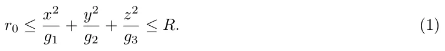
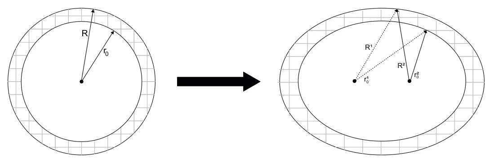

## 1 Introduction and Related Work

Bladder cancer (BC) is a major clinical problem with an estimated 549,000 new cases and 200,000 deaths each year which makes it the 10th most common form of cancer worldwide [3]. Most of the incidents occur in developed and industrialized areas, such as Australia, North America, and Europe [3]. The high rates of recurrence, invasive surveillance strategies, and high treatment costs combine to make BC the single most expensive cancer in both the United States and England [4].

Treatment of non-invasive BC has not advanced significantly over the past five decades following the treatment protocol suggested by Morales et al. (1976) that involves weekly instillations of Bacillus Calmette–Gu´erin (BCG) [5]. The most common protocol is based upon treatment suggested by Morales et al. (1976) and involves weekly instillations of BCG over a 6-week period. It is called *induction treatment* protocol. BCG is a type of immunotherapy used to treat non-invasive BC [6]. The BCG treatment protocol has yet to be specifically optimized for those patients who do not achieve remission from the treatment that follows the current standard protocol.

Mathematical modeling is shown to be a useful tool in clinical settings in general and oncology in particular, allowing to investigate both the disease and possible treatments [7]. Several attempts were made to describe the cell dynamics taking into account biological interactions in the physical space based on partial differential equations (PDE) [8, 9, 1]. Specifically, the authors of [1] combined and extended the models proposed by [10, 8] and shows how to evaluate the patient’s spatial data - distribution of cancer polyps, to obtain a personalized treatment. However, [1] approximate the bladder’s geometry using sphere-ring which may result in large errors due to the poor approximation of the bladder’s geometry [2].

Based on the model by [1], we approximate the bladder’s geometry using ellipsoid-ring configuration to obtain a more clinically accurate treatment protocol. The manuscript is organized as follows. First, we describe the model with the new geometrical configuration and the numerical methods used to solve it. Second, we obtain the treatment protocols based on the proposed model. Third, we compare the results of both models with clinical data. Finally, we discuss the improvements and limitations of the proposed model.

## 2 Mathematical Modeling Extension

### 2.1 Model definition

We assume the bladder’s geometry satisfies Eq. (1) as an approximation to the bladder’s geometrical configuration:

In Eq. (1), the variables *x*, *y*, *z* are the Cartesian coordinate system, *r*0 = *r*1 0 + *r*2 0 and *R* = *R*1 +*R*2 are the radius of the internal and external ellipsoids of the geometrical configuration, respectively. The bladder’s geometry is approximated using a perfect (e.g., the parameters *g*1*, g*2*,* and *g*3 are equal for the inner and outer ellipsoid) ellipsoid-ring while the real human bladder has additional three tunnels [10, 2]. The geometry of the system and the transformation from the original (sphere-ring) approximation are visualized in Fig. 1.

<figure id="fig-1">

<figcaption>Figure 1: Schematic view of the transformation between the model’s geometry from [1] to the proposed one as shown in Eq. (1).</figcaption>
</figure>

### 2.2 Numerical Solution

All the numerical calculations have been performed with *C#* programming language (version 8.0) using an agent-based approach [11]. First, we sampled the space (Eq. (1)) using a polar coordinate system (*φ, θ, r*) such that the volume between each eight neighbor points is approximately the same. Second, each such segment is considered a ”cell” and allocated to a state according to the initial and boundary condition of the system. At each point at time *t*, Eqs. (1-9) in [1] solved using the finite difference method where the state at time *t −*1 is stored in the simulation memory while the spatial (diffusion) dynamics simulated using the particle-particle potentials method [12].

### 2.3 Treatment Protocol Based On Initial Tumor Distribution

Using the new geometrical configuration (see Section 2.1) and numerical analysis method (see Section 2.2) we take advantage of the treatment personalization method proposed by [1].

To carry out the numerical simulations of the tumor-immune model (Eqs. (1-10) in [1] and Eq. (1)), we used the parameter values from Table 3 in [1]. The results are shown in Table 1, where *RP* (Range of successful Protocols) is defined as the difference between the amount of BCG-uninfected cancer cell the most aggressive (largest *b*) and most non-aggressive treatment (lowest *b*) such that the treatment successed. In addition, *AP* (Average successful Protocol) is defined as the average BCG-uninfected cancer population size for all the possible combinations of different treatment protocols that differ in the distribution of the BCG-uninfected cancer cells in the layers of the urothelium such that the treatment will be successful. Namely, *RP* defines the range of successful treatments while *AP* defines the average of this set in the terms of BCG injection *b* as a function of the initial tumor cell distribution in the bladder’s geometry. The treatment duration *t*max is set to 42 days. In addition, parameters *g*1*, g*2*,* and *g*3 (in Eq. (1)) set to 1*.*2*,* 1*.*35*,* and 1, respectively [2]. Furthermore, the optimal treatment protocol in the manner of BCG injection *b* as a function of the layer of the urothelium the BCG-uninfected cancer cells are allocated at the beginning of the treatment, divided by the geometrical configuration used to approximate the bladder’s geometry, is shown in Table 2.

<figure class="table-figure" id="table-1">
<figcaption>Table 1: The sensitivity of the model to the initial distribution of cancer cells in different layers of the bladder at the beginning of treatment (<em>t</em>0). The values were calculated over the first four weeks of the treatment [1].</figcaption>

<table><tr><th>Metric</th><th>Model</th><th>1 layer</th><th>2 layers</th><th>3 layers</th><th>4 layers</th><th>5 layers</th><th>6 layers</th></tr><tr><td>RP [m3t · 107]</td><td>Sphere-ring [1]</td><td>1.90</td><td>1.63</td><td>1.36</td><td>0.88</td><td>0.70</td><td>0.54</td></tr><tr><td>RP [m3t · 107]</td><td>Ellipsoid-ring</td><td>1.846</td><td>1.651</td><td>1.421</td><td>1.009</td><td>0.776</td><td>0.522</td></tr><tr><td>AP [m3t · 109]</td><td>Sphere-ring [1]</td><td>1.157</td><td>1.155</td><td>1.159</td><td>1.158</td><td>1.159</td><td>1.157</td></tr><tr><td>AP [m3t · 109]</td><td>Ellipsoid-ring</td><td>2.09</td><td>2.085</td><td>2.089</td><td>2.083</td><td>2.077</td><td>2.065</td></tr></table>

</figure>

<figure class="table-figure" id="table-2">
<figcaption>Table 2: The amount of BCG needed to be injected in the first week as a function of the layer where the BCG-uninfected cancer cell population is located at, during the beginning of the treatment, in order to obtain the optimal treatment protocol extendting the <em>induction treatment</em> protocol proposed by [13]. The initial condition are <em>T</em>u(0) = 1 <em>·</em> 106 and <em>b</em> = 106.</figcaption>

<table><tr><th>Layer</th><th></th><th>1st layer</th><th>2nd</th><th>3rd</th><th>4th</th><th>5th</th><th>6th</th><th>7th</th><th>8th</th></tr><tr><td>BCG (b · 106)</td><td>- Sphere-ring model [1]</td><td>1.07</td><td>1.16</td><td>1.48</td><td>1.91</td><td>2.49</td><td>3.12</td><td>3.88</td><td>5.04</td></tr><tr><td>BCG (b · 106)</td><td>- Ellipsoid-ring model</td><td>1.91</td><td>1.98</td><td>2.23</td><td>2.65</td><td>3.21</td><td>3.76</td><td>4.38</td><td>5.36</td></tr></table>

</figure>

## 3 Discussion

In this research, we have proposed a better approximation of the human bladder in an ellipsoidal-ring to improve individualized BCG immunotherapy treatment. By comparing the results that based on the sphere-ring, the novel results show that in order to optimally use the *induction treatment* protocol after the first week, one would require almost twice the amount of BCG compared to the amount predicted by [1] in the case the cancer cells are located at the most shallow layer of the urothelium and the difference decreases as the initial layer the cells are located at is deeper, as shown in Table 2. This means, that the models highly differ for stages I and II in cancer where it is still in the shallow layers while converge where the diseases approach to stage III where the treatment is shown to be ineffective anyway [13].

In addition, one can notice that both models agree on the difference between the worst and the best treatment, as shown in Table 1 - the *RP* parameter. In addition, from the *AP* parameter in Table 1, it is shown that the average treatment successful protocol that differs in the distribution of the BCG-uninfected cancer cells in the layers of the urothelium are 80% higher in the case of the ellipsoid-ring compared to the sphere-ring which indicates that while the range of the treatment protocols is more or less equal, the average treatment in the ellipsoid-ring configuration should be much more aggressive to obtain a similar clinical outcome.

These results are evaluated for a mean case (patient) in the population and can be highly altered between patients according, but not limited, to their age, gender, and weight. One can overcome this challenge by introducing these parameters to the proposed model in one of two ways. One way is by setting personalized *r*0 and *R* values in Eq. (1) according to a measurement of a single patent and recomputing the simulations results. A more generic way is to use machine learning methods to learn a regression model between these parameters and the *r*0 and *R* parameters using a dataset of samples from a heterogeneous population of individuals (not necessarily patients). Once such a model is obtained, it can be used to extend the proposed model into a family of models, each one approximating a possible single patents’ parameters.

The lack of recorded and publicly available clinical data regarding the course of bladder cancer BCG treatment, especially in the context of the BCG and cancer cells distribution in the bladder’s geometry, results in the incapability of evaluating the presented outcomes in realistic settings. As more such data will become available, better parameter estimation and evaluation of the models are recommended. In addition, another possible future to further improve the accuracy of the model is to take into consideration the change over time of the geometrical configuration as the bladder fill and empty during the day.

## References

1. T. Lazebnik, S. Bunimovich-Mendrazitsky, and N. Haroni. PDE based geometry model for BCG immunotherapy of bladder cancer. Biosystems, 2021.
2. N. K. Kristiansen, H. Ringgaard, S. Nygaard, and J. C. Djurhuus. Effect of bladder volume, gender and body position on the shape and position of the urinary bladder. Scand J Urol Nephrol, 38:462–468, 2004.
3. F. Bray, J. Ferlay, I. Soerjomataram, R. L. Siegel, L.A. Torre, and A. Jemal. Global cancer statistics 2018: Globocan estimates of incidence and mortality worldwide for 36 cancers in 185 countries. CA Cancer J Cling, 68(2):394–424, 2018.
4. M. Eylert, L. Hounsome, R. Persad, A. Bahl, E. Jefferies, J. Verne, and H. Mostafid. Falling bladder cancer incidence from 1990 to 2009 is not producing universal mortality improvements. Journal of Clinical Urology, 7(2):90–98, 2014.
5. A. Morales, D. Eidinger, and A.W. Bruce. Intracavity Bacillus Calmette-Gu´erin in the treatment of superficial bladder tumors. J. Urol, 116:180–183, 1976.
6. H. W. Herr, V. P. Laudone, R. A. Badalament, H. F. Oettgen, P. C. Sogani, B. D. Freedman, M. R. Melamed, and W. F. Whitmore. Bacillus Calmette-Gu´erin therapy alters the progression of superficial bladder cancer. Journal of Clinical Oncology, pages 1450–1455, 1988.
7. S. Bhattacharya, P. P. Sah, A. Banerjee, and S. Ray. Structural impact due to ppqee deletion in multiple cancer associated protein - integrin v: An in silico exploration. ABiosystems, page 104216, 2020.
8. T. Lazebnik, S. Yanetz, S. Bunimovich-Mendrazitsky, and N. Haroni. Treatment of bladder cancer using bcg immunotherapy: Pde modeling. Partial Differential Equations, 2020.
9. A. Fridman and C.Y. Kao. Mathematical modeling of biological processs. Lecture Notes on Mathematical Modeling in the Life Sciences, 2014.
10. E. Guzev, S. Halachmi, and S. Bunimovich-Mendrazitsky. Additional extension of the mathematical model for BCG immunotherapy of bladder cancer and its validation by auxiliary tools. International Journal of Nonlinear Sciences and Numerical Simulation, 20:675–689, 2019.
11. G. Fullstone, J. Wood, M. Holcombe, and G. Battaglia. Modelling the transport of nanopar-ticles under blood flow using an agent-based approach. Scientific Reports volume, page 10649, 2015.
12. J. Sch¨oneberg, A. Ullrich, and F. No´e. Simulation tools for particle-based reaction-diffusion dynamics in continuous space. BMC Biophys, 7(11), 2014.
13. D.L. Paterson and A. Patel. Bactillus Calmette-Guerin (BCG) immunotherapy for bladder cancer: Reivew of complications and their treatment. BMC Biophys, pages 340–344, 1998.
