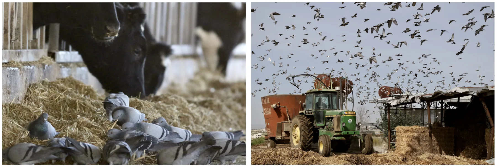
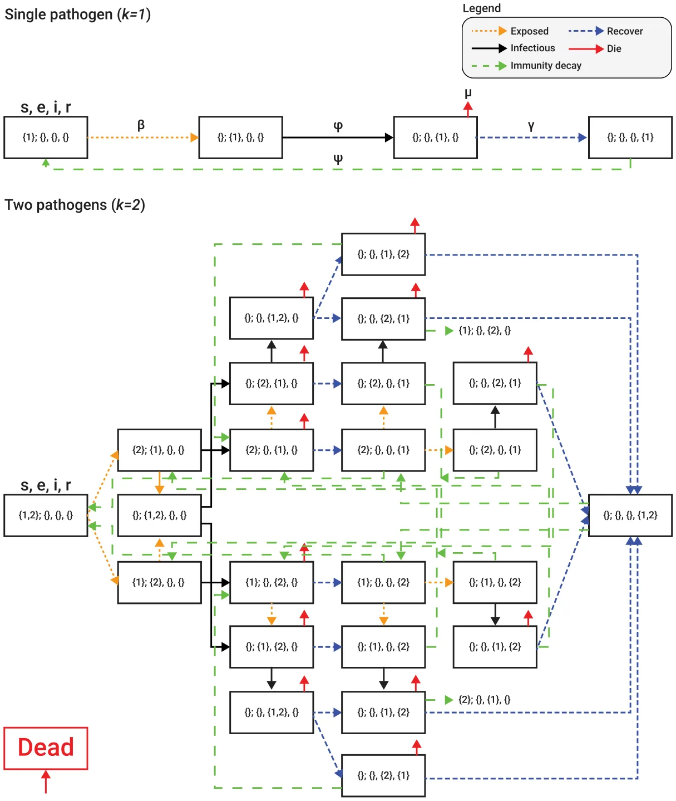
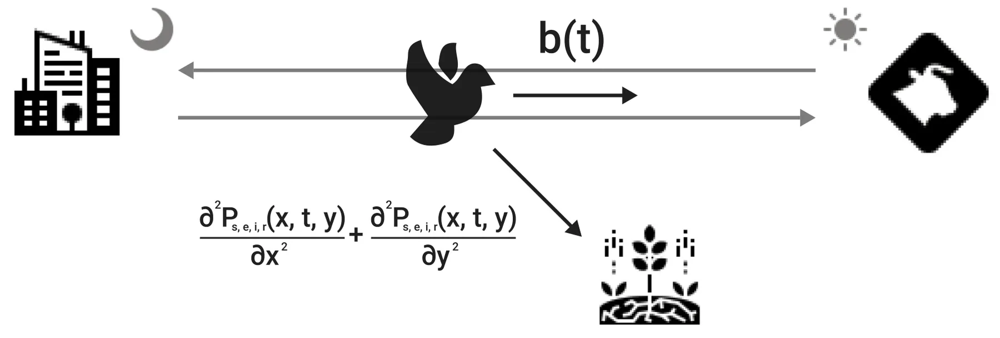
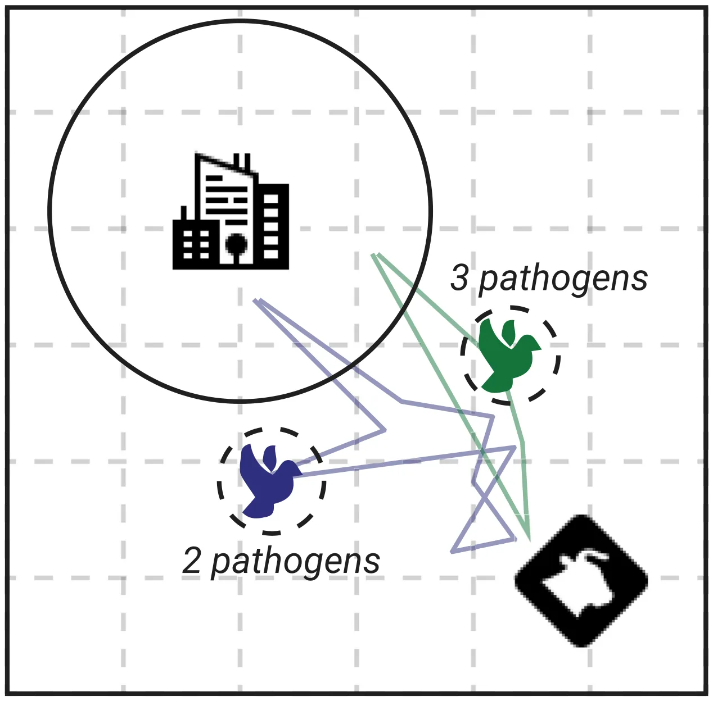
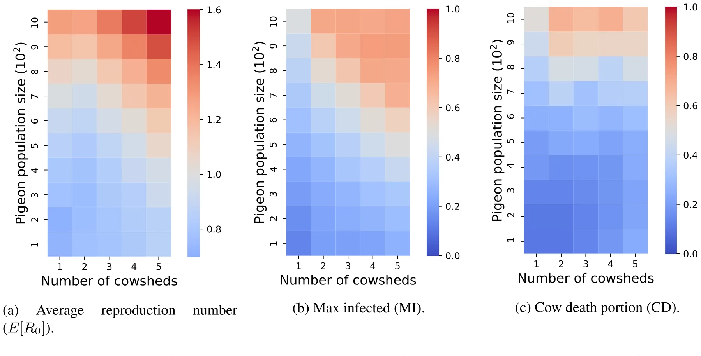
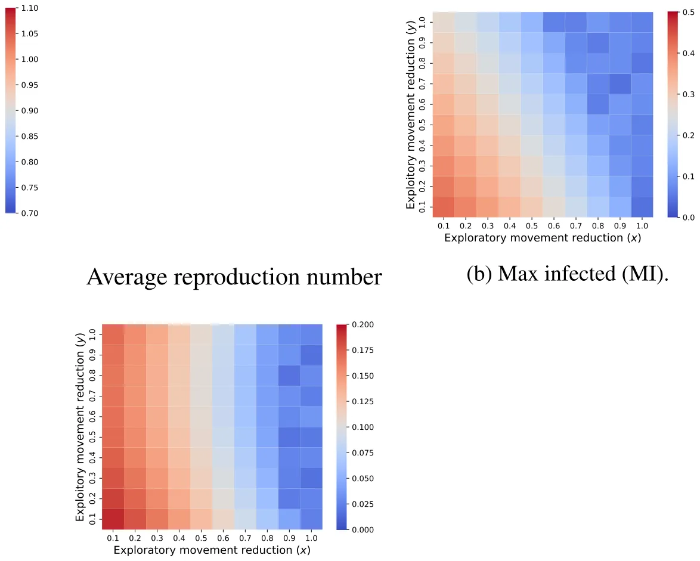
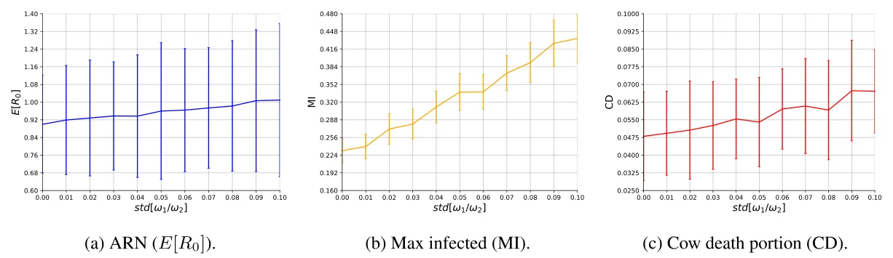
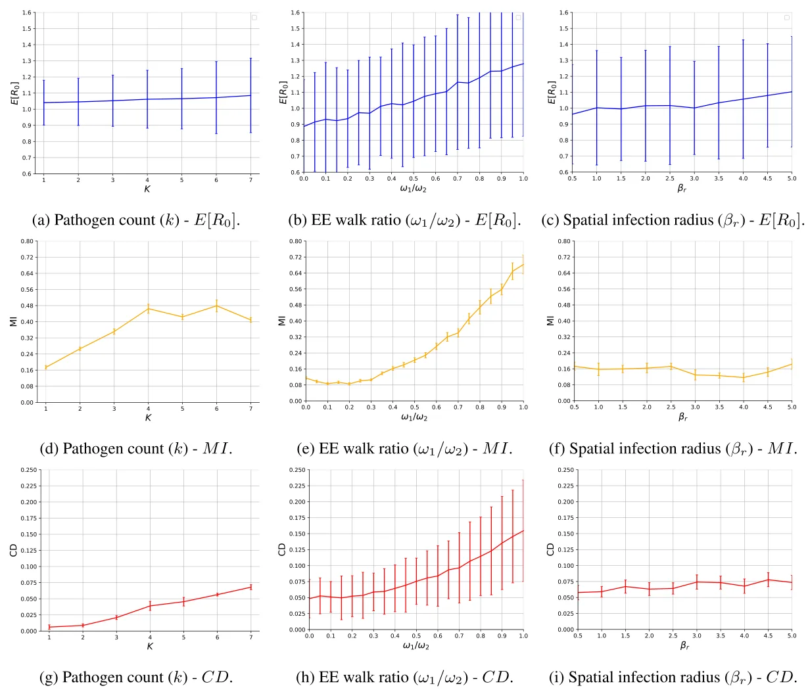
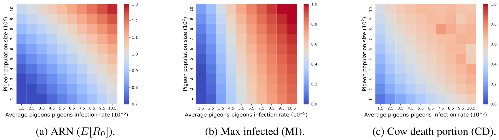

## 1. Introduction

Disease ecology and animal movement ecology are inherently linked as animal movement can both determine the spread of pathogens (that largely depends on transportation by their vectors) and be influenced by their load due to illness and other processes (Dougherty et al., 2017; White et al., 2018; Spiegel et al., 2022). These interfaces have direct and indirect links to the spread of pandemics across species in general, and between animals and humans, in particular (Eubank et al., 2004). As human populations increase, habitats are transformed into urban and agricultural areas, inherently changing the environment and the biodiversity of the area (Rouffaer et al., 2017). Specifically, livestock (*e.g.*, cows) and synanthropic wildlife (*e.g.* some birds and rodents) have a complex relationship with each other and with humans. For example, pigeons (*Columba livia*; also known as ‘rock doves’, but hereafter referred to as pigeons to avoid the implicit assumption of pure-breed (Elser et al., 2019a)) commonly occupy urban and agricultural sites worldwide and are a known vector of various human, poultry, and livestock-relevant pathogens (Prompiram et al., 2022; Haag-Wackernagel and Moch, 2004). Nonetheless, our understanding of the dynamics of epidemic spread across species, in general, and in the context of mixed urban and agricultural sites with individual pigeons moving between them is limited. Specifically, current models are not equipped to capture the scenario of simultaneous multi-pathogen infections at the individual level, which is likely common in many systems. Moreover, wild animals usually follow an exploration-exploitation movement pattern while captive animals are constrained to a small spatial area (*e.g.* a farm). The influence of these unsymmetrical movement dynamics on an epidemic spread is not fully explored.

0304-3800/© 2024 The Authors. Published by Elsevier B.V. This is an open access article under the CC BY-NC license ( http://creativecommons.org/licenses/by-nc/4.0/ ).

The investigation of interacting species and disease ecology in natural settings has gained significant popularity, leading to the continuous unveiling of the biological dynamics that surround us, while also serving as a fundamental basis for various technological advancements in data collection methods applied to study natural systems (Vidal et al., 2019; Machovsky-Capuska et al., 2016; Suraci et al., 2022; Mackey and Kribs, 2021). Particularly, there has been a notable focus on studying epidemiology to comprehend the transmission of infectious diseases. The ultimate aim of these models and studies is to devise effective pandemic intervention strategies and, ideally, eliminate infectious diseases altogether (*e.g.* Ebola and HIV), or more proximately, prevent them on a local scale (Araz et al., 2012; Meltzer et al., 1999; Kabir et al., 2020a; Perrin et al., 2009; Taylor et al., 2008; Lazebnik and Alexi, 2022). In this regard, mathematical models and computer simulations have emerged as potent tools for comprehending the biological and ecological dynamics that underlie the observed patterns associated with the spread of pandemics (Cojocaru et al., 2020; Becker and Hall, 2014; Nagelkerke et al., 2018; Dallas et al., 2022; Alexi et al., 2022; Lazebnik and Alexi, 2023). Multiple attempts have been proposed to model the spread of epidemics in populations (Desai et al., 2019; Ivorra et al., 2020; Long and Ehrenfeld, 2020; Tuite et al., 2020; Miller, 2017; Berge et al., 2017; Bondo et al., 2024). In particular, original Susceptible–Infected–Recovered (SIR) based models have been improved and extended to models that offer more realistic spatial, social, biological, and other dynamics compared to the original SIR. These models are now widely used thanks to their balancing between simplicity in representation and accuracy in prediction (Mullin et al., 2022; Harvey et al., 2007; Adiga et al., 2020a). Initially, extended SIR models with a single species and a single pathogen were proposed and investigated (Ram and Schaposnik, 2021; Lazebnik and Bunimovich- Mendrazitsky, 2021a; Terry, 2010). For instance, Sah et al. (2017) used SIR models to study the effect of social structure and network modularity on the dynamics of an outbreak and demonstrated using data from empirical social networks of 43 species how group living can slow down simulated outbreaks in some conditions. In another example, Harvey and colleagues (Harvey et al., 2007) proposed a highly detailed, stochastic, and spatio-temporal extended SIR model for disease progression using direct animal-to-animal contacts. Accompanying these analytical compartment models with computer simulation often allows users to explore a wide range of possible realistic conditions and pandemic intervention policies.

Later studies widened these models by taking into consideration multi-strain and even multi-pathogen pandemics (Minayev and Ferguson, 2008a; Khyar and Allali, 2020a; Shami and Lazebnik, 2022). For instance, Dang et al. (2016a) proposed a multi-strain model that links immunological and epidemiological dynamics across scales where strains may compete each other within the host scale, and on the population scale, the study explores the outbreak dynamics. Khyar and Allali (2020b) focused on a two-strain SEIR (E - exposed) model with the dynamics of infection rates and showed that this model is able to capture the dynamics of an emerging second strain during a pandemic. They demonstrated this capability using data from the 2020 COVID- 19 pandemic. Because co-occurring pathogens can influence each other through modification of host behavior, physiology, and survival, researchers are interested in extending these models for multiple species and the interactions between them (Saenz and Hethcote, 2006; May, 1971; Alexander, 2000). Khyar and Allali (Alexi et al., 2023a) proposed a multi-strain multi-species extended SIR model where the authors combined the prey-predator model (Danca et al., 1997; Kar, 2005) with an extended version of the multi-strain SIR model proposed by Lazebnik and Bunimovich-Mendrazitsky (2022). The model allows for evaluation of the extinction of species due to natural pandemics, using only macro data (*i.e.*, average over the population, and not animal-level data) about the animal’s prey-predator dynamics and cross-infection for the avian influenza pathogen and its strains. Adding realism to the model requires focusing on a multi-location scenario, in addition to the multi-pathogen consideration.

Pigeons visiting dairy farms (Jerolmack, 2014; Harris et al., 2016) are typical and common examples of such multi-site, multi-pathogen, multi-hosts scenarios, with mixed urban and agricultural sites. One area of interest is their interactions with livestock, in general, and cows in cowsheds in particular (Cabe, 2021; Carlson et al., 2021). Importantly, like many bird species, pigeons are highly social animals and they tend to aggregate in large flocks which previous studies pointed out as a key factor in the spillover and worldwide spread of avian influenza (Vandegrift et al., 2010). Moreover, dairy and poultry farming are particularly notorious for attracting a variety of wildlife from peripheral habitats, due to their resource availability including food, shelter, and possible security from natural predators that avoid human habitats (Johnson et al., 2011). In this context, pigeons are able to cover large areas by flying several kilometers on a daily basis (Angelier et al., 2018), effectively operating as an infection vector across otherwise spatially separated sites. Generally speaking, pigeons travel between an urban locationwhere they nest and roost and resource-rich foraging sites (*i.e.*, cowshed) during the day (Crafton et al., 2023; Rose et al., 2006). Pigeon’s high density and proximity to cows during foraging highlights their potential to infect cows with a wide range of pathogens. Examples include *Salmonela*, *Chlamydia*, West Nile virus, and many others (see Table 1 in Haag-Wackernagel (2019) for an inclusive list of 60 relevant pathogens carried by pigeons). Transmission can occur with both direct contact, aerosols or droppings, and feather shedding that may reach the cows’ food and water. Pathogens may differ in their tolerance ranging between environmentally sensitive agents that depend on direct contact, and more resistant ones that may be transmitted also indirectly. These diverse pathogens, in turn, may cause negative outcomes for livestock and humans, including economic losses, food shortages, and even public health threats (Carlson et al., 2011; Elser et al., 2019b; Haag-Wackernagel, 2019). Fig. 1 shows pigeons in a cowshed located in Israel. Notably, dense aggregations in dairy farms are not unique to Israel nor to pigeons alone, with European starlings (*Sturnus vulgaris*), house sparrows (*Passer domesticus),* Cattle egret *(Bubulcus ibis)* , and others showing similar behaviors throughout the world (Medhanie et al., 2016; Elser et al., 2019c).

Therefore, in this work, we propose a novel spatio-temporal multi-pathogen epidemic model for studying the spread of infectious diseases between pigeons and cows in a cowshed setting. To this end, we extended the multi-pathogen multi-species model proposed by Alexi et al. (2023a) for our specific case and developed a detailed agent-based simulation (ABS) allowing the exploration of scenarios of interest. We used real-world data to obtain several of the model’s parameter values. We hypothesize that both the mean movement rate of pigeons, as well as its variation (with some being more mobile or more exploratory than others) should affect disease dynamics (Lloyd-Smith et al., 2005; Paull et al., 2011; Teicher, 2023). We explore these effects with our model and simulation, showing a considerable effect on both the magnitude and variation of outbreak indices. Furthermore, we find that if pathogen infection reduces the movement of pigeons (*e.g.* through illness, Spiegel et al. (2022)) then our findings predict a positive linear correlation between the variation in movement and the average reproduction number (ARN) of the disease. Overall, our models, and tests using biologically-relevant parameter ranges (some quantified directly at the focal system) demonstrate both fundamental insights into the importance of vector behavior and applied ones into the role of pigeons as a disease vector.

## 2. Model definition

In order to capture the spatio-temporal epidemiological dynamics, we use a system of partial differential equations (PDEs). Essentially, we combine the parallel multi-pathogen with cross-species infection epidemic dynamics based on the SEIRD model (Viguerie et al., 2021)

<figure id="fig-1">

<figcaption><strong>Fig. 1.</strong> Two images of pigeons in a cowshed located in Israel, taken on the site of the empirical data collection of Crafton et al. (2023). The images show the high proximity of pigeons to cows and their food (facilitating transmission), and the high density and mobility of pigeons (underscoring their between-site transmission potential). Photos by Tovale Solomon.</figcaption>
</figure>

together with the exploration–exploitation-based movement dynamics of the pigeons (O’Farrell et al., 2019; Monk et al., 2018; Berger- Tal et al., 2014). In our model, pigeons transition between different stages of the disease cycle (susceptible, infected, etc.) for each of the pathogens, while behaving accordingly (*e.g.* showing illness in some phases and normal exploration in others), and moving among roosts and dairy farms. Because the pigeons’ behavior reflects the iteration-specific parameter, as well as variation between individual pigeons and infection stature, different outbreak dynamics emerge. This allows us to calculate several representative indices of the outbreaks and explore the factors that affect them.

The remaining paper is organized as follows. Section 2.1 describes the proposed model’s mathematical formalization following a spatio-temporal extended SIR-based modeling approach, as well as the implementation of the proposed model as an ABS. Section 2.2 covers the essential aspects of movement dynamics and their implementation in the model, and Section 2.3 elaborates on the ABSs derived based on this PDE model. Finally in Section 3. we describe how to use these ABSs to run virtual experiments investigating the role of pigeon movement, individual variation, and other factors on predicted outbreak dynamics. Finally, the results from these ABS experiments are explained in Section 3, and discussed in Section 4, where we also highlight some of the remaining challenges and future directions.

### 2.1. Epidemiological dynamics

Formally, let us define a model *𝑀* such that contains a finite population of pigeons (*𝑃 𝑔*) and cows (*𝐶 𝑤*) and their change over finite time [*𝑡*0*, 𝑡*𝑓] such that *𝑡*𝑓 *> 𝑡*0, and finite space (see below). In addition, let us assume a set of disease-generating pathogens *𝛥* of natural size *𝑘* ∈ N. At each point in time, each individual animal in the model is either susceptible (*𝑆*), exposed (*𝐸*), infected (*𝐼*), recovered (*𝑅*), or dead (*𝐷*) from each of these pathogens. Thus, the epidemiological state of an animal in the model can be represented by a vector *𝜂* ∈ {*𝑠, 𝑒, 𝑖, 𝑟, 𝑑*}𝑘. For instance, an individual with the state [{1}*,* {2}*,* 0*,* 0*,* 0] is susceptible to the first and exposed to the second pathogen, but not infected, recovered, or dead by either of them. Therefore, each animal belongs to a super-position epidemiological state where it is susceptible, exposed, infected by, and recovered from sets of pathogens, *𝑠, 𝑒, 𝑖, 𝑟 ⊂ 𝛥*, such that *𝑠*∩*𝑒*∩*𝑖*∩*𝑟* = ∅ ∧*𝑠*∪*𝑒*∪*𝑖*∪*𝑟* = *𝛥* (Alexi et al., 2023a). In other words, the states are pair-wise distinct and the combination of states has to include all pathogens in the model. Note that we ignore the *𝑑* state since if a single pathogen caused the death of the individual, the other states *𝑠, 𝑒, 𝑖*, and *𝑟* are meaningless. For example, for a single pathogen, each animal can be in either *𝑠, 𝑒, 𝑖, 𝑟*, or, *𝐷* state at a point in time. All animals born susceptible (*𝑠*) and become exposed (*𝑒*) after being infected by a pathogen. After some time, exposed animals become infectious (*𝑖*). At this point, they either die (*𝑑*) or recover (*𝑟*). If recovered, after another period of time, the immunity for a pathogen decays and the animal is again susceptible (*𝑠*). This process occurs in parallel for multiple pathogens, for each animal.

As such, for each state, there are 12 processes that influence the number of animals in each epidemiological state:

- Animals are born at some rate *𝛼*.
- Animals are infected by a pathogen *𝑗* ∈ *𝛥* by animals from the same species, becoming exposed to it with infection rate *𝛽*(*𝑥, 𝑦*).
- Animals are infected by a pathogen *𝑗* by animals from the other species, becoming exposed to it with infection rate *𝜁*(*𝑥, 𝑦*).
- Animals that are exposed to a pathogen *𝑗* in either of the two mechanisms above, become infectious at a rate *𝜙*.
- Animals infected with pathogen *𝑗* recover at a rate *𝛾*.
- Animals from the group (*𝑠, 𝑒, 𝑖, 𝑟*) are infected by a pathogen *𝑗* ∈ *𝑠* by animals from the same species, becoming exposed to it with an infection rate *𝛽*(*𝑥, 𝑦*).
- Animals from the group *𝑠, 𝑒, 𝑖, 𝑟* are infected by a pathogen *𝑗* ∈ *𝑠* by animals from the other species, becoming exposed to it with infection rate *𝜁*(*𝑥, 𝑦*).
- Animals from the group (*𝑠, 𝑒, 𝑖, 𝑟*) which are exposed to pathogen *𝑗* ∈ *𝑒* become infectious at a rate *𝜙*.
- Animals from the group (*𝑠, 𝑒, 𝑖, 𝑟*) which are infected by pathogen *𝑗* ∈ *𝑖* recover from it at a rate *𝛾*.
- For each *𝑗* ∈ *𝑟* animals from the group (*𝑠, 𝑒, 𝑖, 𝑟*) lose their immunity and become susceptible again to the pathogen *𝑗* at a rate *𝜓*
- Animals from the group (*𝑠, 𝑒, 𝑖, 𝑟*) die due to their diseases at a rate *𝜇*.
- Animals are naturally dying at a rate *𝜐*, independent of the diseases they carry (*e.g.* predation, trauma etc.).
- Importantly, each parameter is also defined by a superposition of the epidemiological subset defined by (*𝑠, 𝑒, 𝑖, 𝑟*). These dynamics take the partial differential equation representation as follows: 𝜕 𝑃𝑠,𝑒,𝑖,𝑟(𝑡,𝑥,𝑦) = ∑ ∀*𝑠, 𝑒, 𝑖, 𝑟* ∶ 𝑎,𝑏,𝑐 ,𝑑|𝑎∩𝑏∩𝑐∩𝑑=∅∧𝑎∪𝑏∪𝑐∪𝑑=𝛥 *𝛼*𝑎,𝑏,𝑐 ,𝑑*𝑃*𝑎,𝑏,𝑐 ,𝑑 *𝜕 𝑡* + ∑𝑗∈𝑒 *𝛽*𝑠,𝑒∕𝑗 ,𝑖∪𝑗 ,𝑟 𝑠∪𝑗 ,𝑒∕𝑗 ,𝑖,𝑟(*𝑥, 𝑦*)*𝑃*𝑠,𝑒,𝑖,𝑟*𝑃*𝑠,𝑒,𝑖,𝑟 + ∑𝑗∈𝑒 *𝜁*𝑠,𝑒∕𝑗 ,𝑖∪𝑗 ,𝑟 𝑠∪𝑗 ,𝑒∕𝑗 ,𝑖,𝑟(*𝑥, 𝑦*)*𝑃*𝑠,𝑒,𝑖,𝑟*𝐶*𝑠,𝑒,𝑖,𝑟 + ∑ 𝑗∈𝑖 *𝜙*𝑠,𝑒∪𝑗 ,𝑖∕𝑗 ,𝑟*𝑃*𝑠,𝑒∪𝑗 ,𝑖∕𝑗 ,𝑟 + ∑𝑗∈𝑟 *𝛾*𝑠,𝑒,𝑖∪𝑗 ,𝑟∕𝑗*𝑃*𝑠,𝑒,𝑖∪𝑗 ,𝑟∕𝑗 + ∑ (1) 𝑗∈𝑠 *𝜓*𝑠∕𝑗 ,𝑒,𝑖,𝑟∪𝑗*𝑃*𝑠∕𝑗 ,𝑒,𝑖,𝑟∪𝑗 −∑𝑗∈𝑠 *𝛽*𝑠,𝑒∕𝑗 ,𝑖∪𝑗 ,𝑟(*𝑥, 𝑦*)*𝑃*𝑠,𝑒,𝑖,𝑟*𝑃*𝑠,𝑒∕𝑗 ,𝑖∪𝑗 ,𝑟 *𝑠,𝑒,𝑖,𝑟* −∑𝑗∈𝑠 *𝜁*𝑠,𝑒∕𝑗 ,𝑖∪𝑗 ,𝑟(*𝑥, 𝑦*)*𝑃*𝑠,𝑒,𝑖,𝑟*𝐶*𝑠,𝑒∕𝑗 ,𝑖∪𝑗 ,𝑟 − ∑𝑗∈𝑒 *𝜙*𝑠,𝑒,𝑖,𝑟*𝑃*𝑠,𝑒,𝑖,𝑟 − ∑ 𝑠,𝑒,𝑖,𝑟 𝑗∈𝑟 *𝜓*𝑠,𝑒,𝑖,𝑟*𝑃*𝑠,𝑒,𝑖,𝑟 −∑𝑗∈𝑖 *𝛾*𝑠,𝑒,𝑖,𝑟*𝑃*𝑠,𝑒,𝑖,𝑟 − ∑ 𝑗∈𝑖 *𝜇*𝑠,𝑒,𝑖,𝑟*𝑃*𝑠,𝑒,𝑖,𝑟 − *𝜐*𝑠,𝑒,𝑖,𝑟*𝑃*𝑠,𝑒,𝑖,𝑟

<figure id="fig-2">

<figcaption><strong>Fig. 2.</strong> A schematic view of transition between disease stages in our compartment SEIR epidemiological model, shown for <em>𝑘</em> = 1 (top) and 2 (bottom). The red upward arrows indicate that from this stage, the animal might die from the disease. In a similar manner, the orange (dotted), black (solid), blue (small-dashed), and green (large-dashed) arrows indicate exposure (E), infection (I), recovery (R), and immunity decay (individuals become susceptible again), respectively. Notably, several states are duplicated for ease of reading. Background mortality is not shown but included in the model.</figcaption>
</figure>

Similarly, the epidemiological dynamics of the cows is identical to the pigeons, but have different parameter values. A schematic view of the epidemiological states of the model for the specific cases of one and two pathogens (*i.e.*, *𝑘* = 1*,* 2) are shown in Fig. 2 where each box indicates the epidemiological state of the individual represented by the pathogens belonging to each of the *𝑠, 𝑒, 𝑖, 𝑟* sets. For example, a healthy individual begins on the left box and moves to the right as it is exposed to a pathogen (following an orange arrow), becoming infectious (following a black arrow), recovers (following a blue arrow), and finally returns to be again susceptible due to immunity decay (following a green arrow). During the infectious state, there is a chance the individual will die due to the pathogen as indicated by the red arrow, as well as background natural mortality throughout its life (not shown).

### 2.2. Movement dynamics

The movement dynamics, unlike the epidemiological dynamics, are unique for each species, reflecting their different life histories and wild/captive contexts. First, as cows are living in a relatively small cowshed and interact intensively with each other, it can be approximated that they are well-mixing within each farm (Kermack and McKendrick, 1927). This decision was motivated by the infection range compared to the animals’ proximity as indicated in Fig. 1(a). Namely, the probability that a cow meets any other cow in the population for any point in time is identical and proportional to the cow population size. As such, we assume the cow population does not have any movement dynamic which is significant for the proposed model. On the other hand, feral pigeons worldwide (and our system included) are known to roost in buildings while traveling to forage in food sites during the day (Teitelbaum et al., 2020). Pigeons explore their surroundings and alternate among different foraging sites, reflecting a trade-off between the exploitation of known resources and the exploration of new ones. Individuals differ in their tendency to explore (Spiegel et al., 2017), with some visiting sites of interest (cowsheds) more frequently than others (Lau et al., 2006). Indeed, previous studies show that one can explain the pigeon flight patterns using the exploration-exploitation model (Kabir et al., 2020b; Zhao et al., 2019; Bridge, 2003). Moreover, as pigeons are exposed and infected with pathogens, their flight abilities might be reduced (Bougiouklis et al., 2005). Hence, the movement dynamics of pigeons can be represented as a weighted average of a random walk (representing the exploration dynamics), and a time-based directed walk (which represents the exploitation dynamics). Moreover, both behaviors are influenced by the combination of the pathogens each pigeon is exposed to and infected with (Crafton et al., 2023; Dougherty et al., 2017; Bajardi et al., 2012; Ortiz-Pelaez et al., 2006). As such, the movement of pigeons dynamics takes the form:

<figure id="fig-3">

<figcaption><strong>Fig. 3.</strong> A schematic view of a pigeon movement in a 2-dimensional space. The pigeons roost in the city at night (left), interact with the cows during the day (right), and sometimes explore other sites for food (bottom). The city-cowshed movement is represented by the exploitation vector (<em>𝑏</em>(<em>𝑡</em>)) at a specific time and over time (marked by the gray arrows). The search for food is represented by the exploration vector ( 𝜕2𝑃𝑠,𝑒,𝑖,𝑟(𝑡,𝑥,𝑦) 𝜕2𝑃𝑠,𝑒,𝑖,𝑟(𝑡,𝑥,𝑦) ). For simplicity, in our model all these alternative explored sites can be condensed into a 𝜕 𝑥2 + 𝜕 𝑡2 single one as they do not directly affect transmission dynamics.</figcaption>
</figure>

*𝜕 𝑃*𝑠,𝑒,𝑖,𝑟(*𝑡, 𝑥, 𝑦*) ( *𝜕*2*𝑃*𝑠,𝑒,𝑖,𝑟(*𝑡, 𝑥, 𝑦*) *𝜕*2*𝑃*𝑠,𝑒,𝑖,𝑟(*𝑡, 𝑥, 𝑦*) )+*𝜔*𝑒,𝑖 ∀*𝑒, 𝑖* ∶ = *𝜔*𝑒,𝑖 + 2 *𝑏*𝑠,𝑒,𝑖,𝑟(*𝑡*)*,* (2) *𝜕 𝑡* 1 *𝜕 𝑥*2 *𝜕 𝑡*2 where *𝜔*𝑒,𝑖 1 *, 𝜔*𝑒,𝑖 2 ∈ R+ are the coefficients of movement such that *𝜔*𝑒,𝑖 1 ∕*𝜔*𝑒,𝑖 2 is the exploration–exploitation rate and *𝜔*𝑒,𝑖 1 +*𝜔*𝑒,𝑖 2 is the total amount of movement for a single step in time. In addition, *𝑏*𝑠,𝑒,𝑖,𝑟(*𝑡*) is the average time-depended directed walk vector of the population of pigeons and satisfies that ∀*𝑠, 𝑒, 𝑖, 𝑟, 𝑡* ∶ |*𝑏*𝑠,𝑒,𝑖,𝑟(*𝑡*)| = 1. Fig. 3 presents a schematic view of the movement dynamics.

### 2.3. Agent-based simulation

Since the proposed model (see Eqs. (1) and (2)) captures population dynamics, it, in practice, takes into consideration only the average behavior of the population (Viguerie et al., 2021; Toda, 2020). Another shortcoming of such SIERD model is that practical applications will be limited by the availability of required parametrization data. Thus, inspired by Lazebnik (2023), we implemented the proposed model using the ABS approach via the Python programming language (version 3.9.2). Generally speaking, ABS is able to provide another layer of realism by allowing each animal in the population to have unique attributes. As such, it better captures the realistic dynamics observed in nature where animals within a population differ, and accounts for other subtle dependencies such as interaction between individual behavior and exposure or infection rates (Spiegel et al., 2017; Dougherty et al., 2018). Moreover, ABS makes the infection computation burden relatively low, as one can use spatial approximation to determine interactions between individuals in the population(s). It allows exploring the importance of specific parameter values of general scenarios for emerging population-level patterns.

Formally, let *𝑀* ∶= (*𝑃 𝑔 , 𝐶 𝑤*) be a tuple (*i.e.*, an ordered set) of two sets of agents that move and interact in discrete finite time steps *𝑡* ∈ [1*,* … *, 𝑇*], where *𝑇 <* ∞. In order to use the ABS approach, one has to define the agents in the dynamics as well as their three types of interactions: agent-agent, agent-environment, and spontaneous (*i.e.*, depends only on the agent’s state and time) (Tesfatsion, 2002). To this end, for our model, each agent *𝑎* is represented by a finite state machine (Alagar and Periyasamy, 2011) as follows: *𝑎* ∶= (*𝜉 , 𝑥, 𝑦, 𝜂 ,* {*𝑤*1}𝑒,𝑖*,* {*𝑤*2}𝑒,𝑖*, 𝛽*𝑟) where *𝜉* ∈ {*𝑝, 𝑐*} is the agent’s species (*i.e.*, pigeon or cow), *𝑥, 𝑦* are the spatial coordinates of the agents in a Cartesian coordinate system, *𝜂* is the agent’s epidemiological state (detailed above), ∀*𝑒, 𝑖*∀*𝑗* ∈ {1*,* 2} ∶ {*𝑤*1}𝑒,𝑖 are the individual agent’s spatial exploration-exploitation coefficients, and *𝛽*𝑟 is a vector representing infection radius of each pathogen, effectively setting the relevant interaction distance among agents.

Intuitively, the simulation starts by generating a space and allocating the agents (both pigeons and cows) inside it with their (species-dependent and individual-specific) walking dynamics and epidemiological state. Next, in an iterative manner, until a stop condition is met or a pre-defined number of steps in time is reached, each agent (animal) in the system moves according to its rule where cows are static and pigeons follow Eq. (2) and then the epidemiological dynamics are solved for each agent’s local environment, following Eq. (1). Formally, at the first time step (*𝑡* = 1), the pigeons and cow populations (*𝑃 , 𝐶*) are generated based on some initial conditions and located on a continuous two-dimensional map with dimensions denoted by *𝑤, ℎ* ∈ R+. Then, at each time step *𝑡*, each individual in the pigeon follows Eq. (2). The decisions of all individuals are referred to as the pigeon population walks. Following standard convention, we assume that multiple individuals may be located at any point on the map at once. Given the nature of our particular system, this general simplification is very suitable as pigeons aggregate at high numbers in high proximity (centimeters) with a movement range of (kilometers). For example, Fig. 1 shows this proximity. Between every two consecutive time steps, individuals infect each other based on their proximity, here simplified to a threshold function (note that we simplify these to a single value rather than a pathogen-specific effective distance of decaying infection probability).

<figure class="table-figure" id="table-1">
<figcaption><strong>Table 1</strong> Summary of the parameters and hyper-parameters of the proposed model with their realistic and theoretical value ranges.</figcaption>

<table><tr><th>Symbol</th><th>Description</th><th>Default value</th></tr><tr><td>𝑇</td><td>Number of simulation rounds (spanning over a year in the 𝛥𝑡used)</td><td>51 840</td></tr><tr><td>𝛥𝑡</td><td>Simulation round’s duration in time</td><td>10 min</td></tr><tr><td>|𝑃(0)|</td><td>The initial size of the population of pigeons</td><td>[500, 5000]</td></tr><tr><td>|𝐶(0)|</td><td>The initial size of the population of cows</td><td>[100, 1000]</td></tr><tr><td>𝑘</td><td>The number of pathogens</td><td>[2–7]</td></tr><tr><td>(𝑤, ℎ)</td><td>The two-dimensional spatial map dimensions</td><td>[1𝑡𝑜10] × [1𝑡𝑜10] km</td></tr><tr><td>𝛼</td><td>Birth rate</td><td>Cows: 0, Pigeons: 1.8 ⋅10−3</td></tr><tr><td>𝛽</td><td>Same species infection rate</td><td>[1.5 ⋅10−5, 9.5 ⋅10−5]</td></tr><tr><td>𝜁</td><td>Cross-species infection rate</td><td>[1.5 ⋅10−5, 9.5 ⋅10−5]</td></tr><tr><td>𝜙</td><td>Exposure to infectious transformation rate</td><td>[6.9 ⋅10−3, 6.9 ⋅10−4]</td></tr><tr><td>𝛾</td><td>Recovery rate</td><td>[1.7 ⋅10−4, 7.8 ⋅10−3]</td></tr><tr><td>𝜓</td><td>Immunity decay rate</td><td>[5 ⋅10−6, 10−4]</td></tr><tr><td>𝜐</td><td>Natural death rate</td><td>Cows: 3.86 ⋅10−7, Pigeons: 1.48 ⋅10−5</td></tr><tr><td>𝜔1, 𝜔2</td><td>Exploration-exploitation walk coefficients</td><td>0.16, 2.3 m/min</td></tr><tr><td>𝛽𝑟</td><td>Spatial infection radius</td><td>5 m</td></tr></table>

</figure>

Namely, if an agent is infected with pathogen *𝑗* has another agent susceptible to pathogen *𝑗* and is located within a range of *𝛽*𝑗 𝑟, it has a probability of *𝛽* ∈ [0*,* 1] to be infected for the specific *𝜂* = (*𝑠, 𝑒, 𝑖, 𝑟*) state of the infectious and susceptible individuals if they are from the same species and with probability *𝜁* ∈ [0*,* 1], otherwise. Note that this transmission probability calculated for co-occurrences within a threshold distance effectively implies that we assume no indirect transmission where pathogens are shared in the environment to be later incorporated by another, susceptible host. Thus, applying the epidemiological dynamics represented in Eq. (1) in a spatially-local manner. In addition, the spontaneous epidemiological process of exposure to infectious, recovery, death, and immunity-decay are computed using a rate associated with the number of time steps rather than being computed using the population-level dynamics as suggested by Eq. (1), following a common practice of ABS implementation (Carley et al., 2006). For instance, an individual exposed to pathogen *𝑖* would become infectious to this pathogen after *𝜓*𝑖 time steps. Lastly, we compute the metrics and store them. The simulation ends either after *𝑇* steps in time or once all individuals in the model have dead.

## 3. Experiments

In this section, we perform *in silico* experiments based on the proposed model. First, we find values with realistic ranges from the literature for the model’s parameters to obtain biologically relevant instances of the proposed model. Afterwards, using these instances we explore the central spatial and temporal dynamics occurring in such a system.

### 3.1. Setup

While high-resolution and extensive epidemiological data required to obtain a real-world instance of the proposed model are currently unavailable (to our best knowledge), partial data in the form of the movement of pigeons dynamics and some biological data about the spread of pathogens are available in the literature. Specifically, prior empirical work has shown that pigeons in general and in our system in particular carry a diversity of pathogens simultaneously, with examples isolated at our focal system including *Clostridum difficile*, Newcastle virus, and *Campylobacter*, all responsible for known disease in cattle and/or poultry. Hence, we used the data collected by Crafton et al. (2023). Namely, Crafton et al. (2023) captured *𝑛* = 328 pigeons from three cowsheds located in Israel. The authors installed a GPS device on several of those and were able to obtain sufficient tracking data from *𝑛* = 33 individuals providing its location in 3 meters accuracy every 10 minutes. The transmitters were active for 214 ± 193 days (range: 14 and 713 days per individual). In total, they collected 8635 tracking days regarding the location of the pigeons over time. In addition, all 300 pigeons were sampled with oral and cloacal swabs for pathogen identification. A subset of 29 samples was also assessed for microbiome-wide DNA presence using next-generation sequencing (Gwinn et al., 2019). Table 1 summarizes the proposed model’s hyper-parameter space values for each configuration based on this study and values from the biological literature (Webster et al., 1992; van Riel et al., 2007; Nelson and Holmes, 2007; Taylor et al., 2008; Tangwangvivat et al., 2019; Abolnik et al., 2022; Wu et al., 2022; Liang et al., 2022). In particular, in agreement with the above GPS sampling rate, we chose to simulate a 10-minute time step, balancing the computational burden and the model’s accuracy. Namely, the movement dynamics as well as the infection can be approximated on a scale of several minutes (Crafton et al., 2023; Lazebnik and Alexi, 2023) and the other dynamics are much slower. Moreover, the population sizes are chosen based on the estimation by cowshed workers at the three focal sites of the focal system (count surveys during winter months; Cahani, personal communication). The exploration-exploitation coefficients are computed based on the average behavior from Crafton et al. (2023).

In order to investigate the epidemic spread dynamics from various scenarios, the setup of the model first needs to be defined. Hence, we uniformly randomly sample the model’s parameter values from Table 1. For the hyperparameters, we uniformly randomly sample |*𝐶*(0)| (The initial size of the population of cows) to be between 100 and 1000, |*𝑃* (0)| (The initial size of the population of pigeons) to be between 500 and 5000, the number of pathogens *𝑘* to be between 2 and 7, and the spatial dimension of the map to be between 1 and 10 km. For simplicity, we positioned the cowshed in the center of the map and placed the urban locations in which pigeons nest at a random point in the map which is at least half a kilometer from the cowshed (well within pigeons’ daily movement range but two orders of magnitude larger than the direct transmission threshold (*𝛽*𝑟, typically in the scale of meters). Then, each pigeon is located in an individual’s roosting location which is normally distributed around the center location of the urban area with a mean and standard deviation of 0*.*25 ± 0*.*1 kilometers (effectively implying most pigeons will be roosting inside the urban area). In addition, we set the simulation duration to be 51,840 time steps of ten minutes to obtain a total of one year. Fig. 4 shows a schematic view of the synthetic scenario generation process. This setup is also repeated with multiple cowsheds such that the cowsheds are far enough apart to prevent cows from infecting each other between cowsheds but close enough for the same pigeons to visit all cowsheds in the region.

In order to evaluate the epidemic spread, it is required to define an epidemiological metric of interest. Here we consider three of the most popular epidemiological metrics: the ARN (*𝐸*[*𝑅*𝑡]), the maximum number of infections (MI), and the number of dead cows (CD) due to the epidemic (Di Domenico et al., 2020; Chatterjee et al., 2020; Lazebnik and Bunimovich-Mendrazitsky, 2021b; Zhao et al., 2020; Breda et al., 2021). *𝑅*𝑡, the effective reproduction number, measures the number of secondarily infected individuals given the epidemic state at a given time *𝑡* (Breda et al., 2021; Wadkin et al., 2024). Intuitively, the ARN (*𝐸*[*𝑅*0]) computes how many, on average, a single infected individual infects other individuals over time (Gostic et al., 2020). The MI metric at a time point in time, *𝑡*, counts the number of individuals infected by some pathogen divided by the population size. The CD computes how many cows are dead, accumulating up to some point in time, *𝑡*. Formally, *𝑅*𝑡 can be approximated using the following formula: *𝑅*𝑡 ∶= (*𝐼*(*𝑡*) − *𝐼*(*𝑡* − 1) + *𝑅*(*𝑡*) − *𝑅*(*𝑡* − 1))∕*𝐼*(*𝑡* − 1), the *𝑀 𝐼* at time *𝑡* is defined as follows *𝑀 𝐼*(*𝑡*) ∶= max𝑖∈[𝑡0,𝑡𝑡] *𝐼*(*𝑖*), and *𝐶 𝐷* at time *𝑡* is defined to be ∑𝑠,𝑒,𝑖,𝑟∈𝛥 *𝜇*𝑠,𝑒,𝑖,𝑟*𝐶*𝑠,𝑒,𝑖,𝑟, such that *𝐼*(*𝑡*) ∶= ‖{∀*𝑝* ∈ *𝑃*|*𝜂*[*𝑖*]𝑡 ≠ ∅}‖ and *𝑅*(*𝑡*) ∶= ‖{∀*𝑝* ∈ *𝑃*|*𝜂*[*𝑟*]𝑡 ≠ ∅}‖ where *𝜂*[*𝑥*]𝑡 indicates the set of pathogens for the *𝑥* ∈ {*𝑠, 𝑒, 𝑖, 𝑟, 𝑑*} epidemiological state at time *𝑡*. For our case, we assume that both *𝑅*𝑡 and *𝑀 𝐼* are computed only for the pigeon population while *𝐶 𝐷* naturally considers the cow population. As the number of parameters and their values can range widely from one instance of the model to another, we computed the model for *𝑛* = 1000 simulation realizations, each time with a random sample of the models’ parameters’ values using a uniform distribution. In addition, to further investigate the influence of the heterogeneous movement between pigeons, we used the values of *𝜔*1 and *𝜔*2 from Table 1 but changed the standard deviation of *𝜔*1∕*𝜔*2 (denoted by *𝑠𝑡𝑑*[*𝜔*1∕*𝜔*2]) using the ratio of *𝜔*1∕*𝜔*2 = 6*.*95 ⋅ 10−3 as the reference value (this ratio represents the ratio between the two empirically observed values from Crafton et al. (2023)). Moreover, in order to obtain a symbolic function to the pandemic spread dynamics from the numerically simulated data, we used the SciMed symbolic regression tool (Simon et al., 2023).

<figure id="fig-4">

<figcaption><strong>Fig. 4.</strong> A schematic view of the synthetic scenario generation process. Individual pigeons roost at locations which are normally distributed around the center of the urban area (most of them within it) and in a two dimensional space (here showing two individuals). Cowshed (here one) are distributed in space such they are distant enough to prevent direct transmission but to allow pigeons to cross between them.</figcaption>
</figure>

### 3.2. Results

Based on this setup, we conducted three main experiments as well as a sensitivity analysis for the model. First, let us consider a scenario in which the number of cowsheds ranges from the basic case of a single cowshed to a more complex one of up to five spatially distinct cowsheds. Fig. 5 presents the epidemic metrics as a function of the pigeon population size and number of cowsheds with 50 cows at each one. The results are shown as a mean of *𝑛* = 1000 simulation realizations. Intuitively, one can notice that as the population of pigeons’s size increases (lower in the y-axis), all three epidemic metrics also increase, on average. Moreover, comparably different dynamics are present in single and multiple cowshed(s). This change can be explained by the fact that multiple cowsheds cannot infect each other without the transition of pigeons, which is less likely for smaller population sizes of pigeons. This is due to the fact that cowsheds would not be able to infect each other without the pigeons moving between them and operating as a pandemic spread vector.

In a similar manner, since pigeons operate as infectious vectors, they are commonly carrying one or even many pathogens in parallel (here only two are included in the simulation) which might reduce their movement due to clinical symptoms. Hence, let us consider a simplistic but biologically-supported scenario (Kabir et al., 2020b; Bridge, 2003) where each pathogen, regardless of its nature, experiences a reduction of *𝑥* ∈ [0*,* 1] and *𝑦* ∈ [0*,* 1] in the exploration-exploitation (*𝑤*1*, 𝑤*2) parameters of an infected pigeon, respectively. Fig. 6 presents the epidemic metrics as a function of the pigeon movement reduction. Namely, a reduction of *𝑥* = 0*.*5 implies that a pigeon with clinical symptoms moved with *𝜔*1 ⋯*𝑥* = *𝜔*1 ⋅ 0*.*5 and *𝑦* = 0*.*5 implies *𝜔*2 ⋯*𝑦* = *𝜔*2 ⋅ 0*.*5. The results are shown as a mean of *𝑛* = 1000 simulation realizations. Unsurprisingly, as *𝑥* and *𝑦* increase, all three epidemiological metrics decrease, since effectively pigeons exhibited lower connectivity. The decrease is quicker than the decrease rate of *𝑥* while negatively linear to the decrease of *𝑦*, as inferred from the figure. In other words, the exploitation tendency has a weaker effect on the dynamic and spread of the simulated disease (*i.e.*, pandemic spread) compared to the exploration one, which indicates that the number of cowshed visits a pigeon performs, on average, does not have much effect as it will transmit the disease to cows regardless of number of visits, as shown in Fig. 6.

<figure id="fig-5">

<figcaption><strong>Fig. 5.</strong> Outbreak epidemic metrics as a function of the pigeon population size and number of cowsheds with 50 cows at each one. The results are shown as a mean of <em>𝑛</em> = 1000 simulation realizations. Notably, all three metrics (average reproduction number, maximal numbers of co-infected cows and proportion of cow death in the population) show an increase with a growing number of pigeons, in interaction with the number of cowsheds.</figcaption>
</figure>

<figure id="fig-6">

<figcaption><strong>Fig. 6.</strong> The effect of pigeon movement reduction on the three epidemic metrics (Average reproduction number, max infected individuals, and Cow death portion). The results are shown as a mean of <em>𝑛</em> = 1000 simulation realizations (representing a random sample from the hyper-parameter space). For all three epidemiological metrics, a growing reduction in exploratory mobility (pigeons’ tendency to alternate between sites) causes a reduction in the pandemic spread, with a stronger impact compared to the reduction in pigeons’ exploitation tendency (re-visits to a site).</figcaption>
</figure>

Investigating the effect of pigeon exploration by modifying the standard deviation of the w1/w2 ratio we see a pronounced effect on the outbreak dynamics. Intuitively, a larger standard deviation in the exploitation–exploration rate indicates more diversity in the movement dynamics in the population and therefore more heterogeneously. Fig. 7 summarizes the results of this analysis, showing the values as the mean ± standard deviation outcome of *𝑛* = 1000 simulation realizations. Notably, as *𝑠𝑡𝑑*[*𝜔*1∕*𝜔*2] increase, all three epidemiological metrics also increase both in mean value and in their standard deviation, as indicated by the error bars. This result indicates that behavioral variation among hosts can affect system-level stability and result in both more pronounced outbreaks (*e.g.* ARN increases from 0.92 to 1 for this particular value of *𝜔*1∕*𝜔*2), and in higher variation among realizations, reflecting higher sensitivity to the specific parameters of each simulation. Notably, the standard deviation is relatively high which is rooted in the diversity of possible dynamics influenced by both the initial conditions and parameters used at each run of the model. However, these standard deviation values are common in other complex biological systems (Skinner, 1994; Hilfinger et al., 2016).

Moreover, we investigated the sensitivity of the epidemic spread dynamics with respect to the main model parameters. To this end, Fig. 8 summarizes the main sensitivity results of the proposed model where the *𝑥*-axis indicates a focal parameter of interest and the *𝑦*-axis indicates the epidemic spread metrics’ values. Notably, each simulation realization uniformly samples the model’s parameters from the ranges presented in Table 1, ensuring each realization is unique.

<figure id="fig-7">

<figcaption><strong>Fig. 7.</strong> A heterogeneous analysis of the population of pigeons movement. The results are shown as the mean ± standard deviation value of <em>𝑛</em> = 1000 simulation realizations. Notably, as <em>𝑠𝑡𝑑</em>[<em>𝜔</em>1∕<em>𝜔</em>2] increase, all three epidemiological metrics also increase and their standard deviation, as indicated by the error bars, is also increased.</figcaption>
</figure>

As can be seen from Figs. 8(a), 8(d), and 8(g), the number of pathogens (*𝑘*) affects outbreak indices, emphasizing that consideration of multiple pathogens in concert can overturn the result of simpler SIR models for single pathogens. First, the ARN (*𝐸*[*𝑅*0]), shows a very weak increase with growing (*𝑘*), and a much more pronounced second order effect, where the standard error of the results increases. This indicates that the system becomes more chaotic and less predictable, with realized ARN more sensitive to the specific parameters of each realization for scenarios with several co-occurring pathogens. The MI metric seems to reach an asymptote around 0.44 at *𝑘* = 5 and then stops increasing and even slightly decreases. This behavior might reflect that the infected sub-population dies faster than it has an opportunity to further spread the pandemic, on average, and the possible interactive effect of co-infections. Lastly, the CD presents relatively stable behavior of monotonic increase with respect to *𝑘*, as indicated by its stable increase and short error bars.

In a similar manner, when the exploration to exploration walk ratio (*𝜔*1∕*𝜔*2) increases, as shown in Figs. 8(b), 8(e), and 8(h), all three epidemic spread metrics also increase. The ARN shows similar behavior as before (for the number of pathogens) while the MI and CD metrics indicate a polynomial (non-linear) increase. at low values the (*𝜔*1∕*𝜔*2) has minor effect on the dynamics, but above 0.4 it becomes a strong predictor resulting in stronger outbreaks (MI, CD). Moreover, both indices, and especially the CD become less stable as the exploration-to-exploration walk ratio increases. Lastly, as the spatial infection radius (*𝛽*𝑟) increases the ARN also slightly increases in a linear manner, keeping relatively the same level of stochastic behavior. In contrast, the MI and CD metrics seem to be non-linearly affected by the spatial infection radius as they slightly increase and decrease for different values of *𝛽*𝑟.

In addition, in order to investigate the influence of pigeons as epidemic carriers, we computed the epidemic spread of the proposed scenario as a function of the initial pigeon population size (|*𝑃* (0)|) and their average within-species infection rate (*𝛽*). The results of this analysis are summarized in Fig. 9 such that each heatmap indicates a different epidemic spread metric. First, Fig. 9(a) reveals that the ARN (*𝐸*[*𝑅*0]) ranged between 0.7 and 1.3 indicating the interactive effect of the two aspects, so that for small pigeon populations even if these infected with clinical symptoms or large pigeon populations with mildly infective pathogens would not cause an outbreak while the combination would. Second, Fig. 9(b) shows the MI metric where there is a second-order polynomial relationship between (|*𝑃* (0)|*, 𝛽*) and the MI metric: *𝑀 𝐼* = 0*.*172 + 0*.*032|*𝑃* (0)| + 0*.*019*𝛽* + 0*.*001*𝛽*2 − 0*.*001|*𝑃* (0)|2 − 0*.*001|*𝑃* (0)|*𝛽*. This fitting is obtained using the SciMed symbolic regression tool (Simon et al., 2023) with a coefficient of determination of *𝑅*2 = 0*.*72. Finally. Fig. 9(c) presents a linear increase towards *𝐶 𝐷* = 0*.*58 followed by a plateau with noisy results. This outcome indicates that a more aggressive pathogen with larger populations causes more spread in the short term but decays faster, leaving less overall mortality rate (Lazebnik et al., 2021).

## 4. Discussion

In this study, we address the spatio-temporal dynamics of multi-pathogen epidemic spread and apply a general epidemiological model to a specific study system where pigeons serve as vectors of pathogens among dairy farms, transmitting avian (pigeons) and mammalian (cows and humans) diseases. The model follows recent extensions of the well-established SIR modeling approach (Kermack and McKendrick, 1927) into a multi-species with parallel multi-pathogen dynamics, within a Susceptible–Exposed–Infected–Recovered–Dead (SEIRD) framework. This innovative modeling approach is rarely fitted to empirical case studies, with field-driven parameters quantified for the model. Here, we implemented the model as an agent-based simulation approach using the data collected by Crafton et al. (2023) as well as relevant epidemiological parameters from the biological literature (*e.g.* pathogen spread dynamics). This parametrization step allowed us to test a realistic setup for the proposed model. The simulations show that considering the unique movement patterns of pigeons and their potential role as vectors can generate different outbreak dynamics than predicted otherwise. Further, we also show that variation among individual pigeons is not only affecting outbreak indices in accordance with previously published results for the importance of super-spreaders for disease dynamics (Lloyd-Smith et al., 2005; Paull et al., 2011; Teicher, 2023); it also affects the stability of the system and the predictability of the results. These two effects, together with evident interactions resulting from co-infections, demonstrate the utility of our model for predicting more realistic outbreak dynamics. This is supported also by previous studies establishing extended SIR-based models’ ability to accurately capture similar epidemiological cases with only partial data (Marie and Masaomi, 2020; Zhuang et al., 2013; Chen, 2015; Agarwal and Bhadauria, 2011).

*4.1. Vector movement and its variation affect outbreak dynamics and predictability*

The proposed model shows that pigeons operate as an effective epidemic spread vector, as illustrated by Fig. 5. When the population of pigeons size is small, even if an epidemic outbreak is in one cowshed, it is not likely to be transmitted to other cowsheds. While this outcome may be considered (almost) trivial, we demonstrate that the growing number of cowsheds does not increase linearly with the spread of the pandemic. This outcome is unlike the one a classical SEIRD model would provide (Rahimi et al., 2021) due to the exploitation behavior in the pigeons’ spatial dynamics (tendency to revisit a familiar site) which keeps some level of separation. This separation, on average, causes a less aggressive epidemic spread compared to a more naive model. This illustrates an interesting outcome — pigeons during non-outbreak periods do not cause large-scale epidemiological outbreaks if the cowshed is far enough from other cowsheds. In a complementary manner, the epidemic caused by pigeons, especially in multi-cowshed scenarios, is self-controlled as the reduction in the movement of pigeons reduced the pathogen spread over time, as shown in Fig. 8. This result should be taken with caution as the outcome achieved for a simplified case of pathogen-movement relationship has not been biologically validated yet. Namely, it is known that pathogens indeed often reduce movement to a varying extent, but in some scenarios may in fact enhance movement through host manipulation (Poulin and Maure, 2015).

<figure id="fig-8">

<figcaption><strong>Fig. 8.</strong> A sensitivity analysis of the average reproduction number (<em>𝐸</em>[<em>𝑅</em>𝑡]), max infection (MI), and cows death (CD) portion. The results are shown as mean ± standard error of <em>𝑛</em> = 1000 simulation realizations. The y-axes are identical for all three panes in each row. In general, exploration level (middle column) shows a more pronounced effect on all three indices compared to the number of pathogens (left column) and spatial infectious radius (right column).</figcaption>
</figure>

<figure id="fig-9">

<figcaption><strong>Fig. 9.</strong> A sensitivity analysis of different epidemic spread metrics as a function of the initial pigeon population size (|<em>𝑃</em> (0)|) and average within species infection rate (<em>𝛽</em>). The results are shown as the mean value of <em>𝑛</em> = 1000 simulation realizations. The results show an interactive and non-monotonic effect of the two predictors (population site and infection rate) on disease outbreak indices.</figcaption>
</figure>

We also found that as the exploration-to-exploitation walk ratio increases, the maximum portion of infected animals increased at a polynomial rate (Fig. 8). This phenomenon happens as the random walk includes a larger portion of the movement of pigeons making them closer to a well-mixture scenario for at least periods when they roost together or visit the cowshed (Alexi et al., 2023b; Majid et al., 2022). In modeling terms, when (*𝜔*1∕*𝜔*2) is relatively small, one can approximate the spatial dynamics using a graph-based model rather than a continuous one as the pigeons would visit a finite set of locations over time while the transformations between them do not have much effect on the infection dynamics (Bozkurt et al., 2020; Goel and Sharma, 2020; Lazebnik, 2023). Moreover, the spatial infection radius seems to have only a minor influence on the overall epidemic spread, as revealed in Figs. 8(c), 8(f), and 8(i). This outcome can be associated with the fact that with high enough density such as the one present in the cowsheds, the infection radius does not have much effect as shown by previous models (Kolokolnikov and Kevrekidis, 2022; Thunström et al., 2020; Wasdani and Prasad, 2020). In other words, this small-scale variation in spatial scale is only minor compared to the local density of cows and movement of the pigeons (vector) (Spiegel et al., 2022).

Perhaps our most striking results are the consequences of individual variation among pigeons in their movement. Such behavioral variation is receiving growing attention in the ecological literature, with accumulating evidence for the generality of the pattern across animals (Stuber et al., 2022), and for its potential impact on various system-level outcomes, including contact networks and disease dynamics (Spiegel et al., 2017; Ezenwa et al., 2016). In our model, as presented by Fig. 7, increasing variation among individuals in their exploration-exploitation tendencies resulted in higher ARN and MI and eventually more cow mortality. This result concurs with existing literature (both models and empirical case studies) highlighting the role of super-spreaders in facilitating disease transmission (Lloyd-Smith et al., 2005; Paull et al., 2011; McDonald et al., 2018). Second, it resulted in increasing variation among realizations, implying lower stability of the results and enhanced unpredictability of the dynamics. With increasing variation, an outlier individual is more likely to connect otherwise isolated sites or contribute to outbreak dynamics in an extraordinary manner. Thus, the strength of mean-field estimates becomes less certain, with higher sensitivity to stochastic conditions and various parameters (note that we randomly selected parameter values for each iteration). Despite this intuitive interpretation, we are unaware of empirical examples demonstrating this effect, highlighting the novelty of this prediction and the overall value of our modeling approach, and justifying the complexity of the modeling in order to reflect the realistic complexity of naturally heterogeneous systems.

### 4.2. Other factors affecting outbreak dynamics and the benefit of multi-pathogen modeling

In addition to *in silico* experiments on pigeon movement, we explore the influence of different biological properties of the system on the epidemic spread. Specifically, Fig. 8 shows the sensitivity of the average reproduction number (ARN), max infected (MI), and cow death portion (CD) metrics as a function of the number of pathogens (*𝐾*), and spatial infection radius (*𝛽*𝑟). Interestingly, as the number of pathogens increases up to five, the number of individuals infected at the same time increases to around half of the population, as shown by Figs. 8(a), 8(d), and 8(g). Nonetheless, after this point, the MI metric remains constant even as the number of pathogens increases. This outcome is linked to the following dynamics: when multiple pathogens co-infect a host, it is sufficient for just one of them to cause a higher mortality rate, which can diminish the overall impact of the others. As a result, having multiple pathogens may actually reduce the overall infection rate, since individuals die more quickly and, on average, have less opportunity to infect others in the population with the other pathogens (Lazebnik and Bunimovich-Mendrazitsky, 2022; Dang et al., 2016b; Minayev and Ferguson, 2008b).

From the proposed analysis, it appears that when the population of pigeons size is controlled, they do not cause epidemic outbreaks in their own population or the cow population in cowsheds. This finding can guide practitioners regarding the (lack of) need to achieve complete eradication population of pigeons at dairy farms. However, if the pigeon population size increases or if a set of multiple, highly contagious pathogens is introduced, an epidemic outbreak is only will result in a matter of time. Importantly, if epidemic intervention policies are not implemented quickly and effectively, just a few infected cows can lead to the rapid spread of infection throughout an entire cow population on a farm in a short time period. This is due to cows living in close proximity with each other on a given farm (Edmunds et al., 1997; Klovdahl et al., 1994). In contrast, in multi-cowshed scenarios, it appears that even without an intervention, the system will mitigate the outbreak between sites and the epidemic will spread over a (relatively) long period of time. This conclusion highlights the complexity of the biological dynamics in such agricultural settings as these have self-stabilizing properties on the one end but are extremely sensitive to outside influence. Therefore, without additional epidemiological data, it is difficult to make definitive conclusions about the specific interventions needed or the ideal population size to target.

When focusing on the influence of the pigeons as an external species in the context of a cowshed, the epidemic spread can be reduced to two main factors; the population of pigeons size and the average within-species (instra-specific) infection rate. Following this simplification, the results show (Fig. 9) the influence of these two parameters on the ARN, MI, and CD. Fig. 9(c) shows that even a relatively small pigeon population with a relatively non-aggressive infection rate can cause cows’ deaths if not treated but this would be minor, on average. Conversely, only a larger population of pigeons and a more aggressive infection rate result in a widespread outbreak as indicated by Fig. 9(a). The results demonstrate that pigeons can cause sporadic infections and deaths in cows, even in small numbers. However, a significant outbreak requires both a larger pigeon population and pathogens with higher infection rates, along with pathogens that do not significantly hinder the pigeons’ movement (Fig. 6). Importantly, even in extreme scenarios, such as having 1000 pigeons infected with highly virulent pathogens, the average reproduction number only reaches 1.3, which is relatively low compared to pathogens, such as Zika and COVID-19, from other epidemics (Wiratsudakul et al., 2018; Dai and Zhao, 2020; Adiga et al., 2020b).

### 4.3. Future direction and concluding remarks

While our model provides a comprehensive approach to studying the spread of epidemics involving pigeons in cowsheds, the proposed model and analysis has several limitations. First, the accuracy of the model heavily relies on the quality and representativeness of the data used for calibration and validation. Admittedly, parameterizing such a complex model is challenging and only feasible for well-studied systems, but nevertheless, the insights provided here demonstrate the general potential, as well as the ability to derive biologically relevant insight even under partial and incomplete parameter space. Namely, we only partially establish the model’s effectiveness. Whereas we have solid spatial data for parametrization, we are still lacking the epidemiological data to fully validate it. For instance, our model only permits direct transmission, while some pathogens have the ability to remain viable off-host for a few hours or longer, facilitating indirect transmission as well. Addressing this additional complexity would require further pathogen and environment specifc parameters that are not readily available for most systems. Gathering reliable data on animal interactions and disease prevalence can be challenging (particularly in field settings), and future work may focus on collecting such data and re-evaluating the performance of the proposed model. Second, our model simplifies several biological attributes of the system. For instance, we assume a continuous birth of pigeons over time, ignoring the breeding biology of simultaneous clutches that can alter the dynamics. Similarly, we assume random encounters within the population, while social structures and the dependency between individual movement and the subset of individuals it interacts with can affect effective beta and ARN (Sah et al., 2017; Stuber et al., 2022; Dougherty et al., 2017). Furthermore, the variability among pathogens in their specific infection mechanisms — whether direct, as modeled here, or indirect for some pathogens spread by pigeons — can further influence the ARN. Additionally, factors such as secondary transmission through the movements of local cows and farm workers, which are not explicitly included in our model, may also contribute to the potential spread of the epidemic. Third, the proposed model does not consider the potential genetic variability of pathogens circulating within the pigeon and cow populations. Previous studies show that over time, taking into account the genomics mutation process of pathogens plays a critical role in understanding epidemic spread (Shi et al., 2010; Lazebnik and Blumrosen, 2022; Wells et al., 2001; Grubaugh et al., 2020). As such, incorporating better parameters, more biological realism, and genetic data into the proposed model could provide a more nuanced understanding of pathogen interactions. Fourth, in our analysis, we averaged multiple instances for each simulation configuration to obtain a ‘representativ’ evaluation of the system. However, this approach overlooks extreme cases that may be important in contexts like disasters or climate change (Upadhyay, 2020; Grover and Harwell, 1985). Finally, continuing from this point, although we analyzed a relatively large number of instances per configuration (n=1000) in some sensitivity analyses — such as Figs. 5(c), 6(b), 6(c), and 9(c) — the results show non-smooth changes. This lack of smoothness can be attributed to significant variability in the dynamics of these instances. Further investigation into the reasons for this irregularity in pandemic spread dynamics could uncover interesting biological processes.

Taken jointly, despite these above-mentioned limitations, our model highlights the premise of combining extended SIR models (here spatio-temporal multi-pathogen SEIRD) and simulations for addressing concurrent challenges related to disease transmission in agricultural and urban settings. Such models, when coupled with empirical data can refine predictions regarding systems and pathogens of interest. Simulation and model analysis can help evaluate and prioritize effective interventions before their costly implementation. For example, it can inform decisions about whether to reduce the pigeon population through culling or limit their movement with fencing. These models and their predictions can directly serve the ‘‘One Health’’ approach (Hassell et al., 2017; Trinh et al., 2018; Salyer et al., 2017), highlighting the urgent need to link wildlife behavior, agricultural practices, and human health. In a world suffering from an over-accelerating rate of zoonotic diseases, such models are essential approaches for capturing the complex dynamics of these interdependent systems.

## CRediT authorship contribution statement

**Teddy Lazebnik:** Writing – review & editing, Writing – original draft, Visualization, Software, Methodology, Investigation, Formal analysis, Conceptualization. **Orr Spiegel:** Writing – review & editing, Validation, Resources, Investigation, Data curation.

## Funding

OS acknowledges financial support by Grant 891-0232-21 from the Israel Dairy Board Research, grant ISF396/20 from the Israeli Science Foundation, by the Data Science Center at Tel Aviv University, and by the Koret-UC Berkeley-Tel Aviv University Initiative in Computational Biology and Bioinformatics.

## Declaration of competing interest

The authors declare that they have no known competing financial interests or personal relationships that could have appeared to influence the work reported in this paper.

## Acknowledgments

We gratefully thank Miranda Crafton for her guidance, Shay Cahani for his biological consulting, and Avishai Lublin for his valuable feedback and discussions.

## Code and data availability

The code and data that have been used in this study are available upon reasonable request from the authors.

## Data availability

Data will be made available on request.

## References

- Abolnik, C., Phiri, T.P., van der Zel, G., Anthony, J., Daniell, N., de Boni, L., 2022. Wild bird surveillance in the gauteng province of South Africa during the high-risk period for highly pathogenic avian influenza virus introduction. Viruses 14 (9). [link](http://refhub.elsevier.com/S0304-3800%2824%2900313-2/sb1)
- Adiga, A., Dubhashi, D., Lewis, B., Marathe, M., Venkatramanan, S., Vollikanti, A., 2020a. Mathematical models for COVID-19 pandemic: A comparative analysis. J. Indian Inst. Sci. 100 (4), 793–807. [link](http://refhub.elsevier.com/S0304-3800%2824%2900313-2/sb2)
- Adiga, A., Dubhashi, D., Lewis, B., Marathe, M., Venkatramanan, S., Vollikanti, A., 2020b. Mathematical models for COVID-19 pandemic: A comparative analysis. J. Indian Inst. Sci. 100 (4), 793–807. [link](http://refhub.elsevier.com/S0304-3800%2824%2900313-2/sb3)
- Agarwal, M., Bhadauria, A.S., 2011. Modeling spread of polio with the role of vaccination. Appl. Appl. Math. 6, 552–571. [link](http://refhub.elsevier.com/S0304-3800%2824%2900313-2/sb4)
- Alagar, V.S., Periyasamy, K., 2011. Extended finite state machine. In: Specification of Software Systems. Springer London, pp. 105–128. [link](http://refhub.elsevier.com/S0304-3800%2824%2900313-2/sb5)
- Alexander, D.J., 2000. A review of avian infuenza in different bird species. Vet. Microbiol. 74, 3–13. [link](http://refhub.elsevier.com/S0304-3800%2824%2900313-2/sb6)
- Alexi, A., Rosenfeld, A., Lazebnik, T., 2022. The trade-off between airborne pandemic control and energy consumption using air ventilation solutions. Sensors 22 (22), 8594. [link](http://refhub.elsevier.com/S0304-3800%2824%2900313-2/sb7)
- Alexi, A., Rosenfeld, A., Lazebnik, T., 2023a. Multi-species prey–predator dynamics during a multi-strain pandemic. Chaos 33 (7), 073106. [link](http://refhub.elsevier.com/S0304-3800%2824%2900313-2/sb8)
- Alexi, A., Rosenfeld, A., Lazebnik, T., 2023b. A security games inspired approach for distributed control of pandemic spread. Adv. Theory Simul. 6 (2), 2200631. [link](http://refhub.elsevier.com/S0304-3800%2824%2900313-2/sb9)
- Angelier, F., Parenteau, C., Trouve, C., Angelier, N., 2018. The behavioural and physiological stress responses are linked to plumage coloration in the rock pigeon (columbia livia). Physiol. Behav. 184, 261–267. [link](http://refhub.elsevier.com/S0304-3800%2824%2900313-2/sb10)
- Araz, O.M., Damien, P., Paltiel, D.A., Burke, S., van de Geijn, B., Galvani, A., MEyers, L.A., 2012. Simulating school closure policies for cost effective pandemic decision making. BMC Public Health 449. [link](http://refhub.elsevier.com/S0304-3800%2824%2900313-2/sb11)
- Bajardi, P., Barrat, A., Savini, L., Colizza, V., 2012. Optimizing surveillance for livestock disease spreading through animal movements. J. R. Soc. Interface 9 (76), 2814–2825. [link](http://refhub.elsevier.com/S0304-3800%2824%2900313-2/sb12)
- Becker, D.J., Hall, R.J., 2014. Too much of a good thing: resource provisioning alters infectious disease dynamics in wildlife. Biol. Lett. 10, 20140309. [link](http://refhub.elsevier.com/S0304-3800%2824%2900313-2/sb13)
- Berge, T., Lubuma, J.M.S., Moremedi, G.M., Morris, N., Kondera-Shava, R., 2017. A simple mathematical model for ebola in africa. J. Biol. Dyn. 11 (1), 42–74. [link](http://refhub.elsevier.com/S0304-3800%2824%2900313-2/sb14)
- Berger-Tal, O., Nathan, J., Meron, E., Saltz, D., 2014. The exploration-exploitation dilemma: A multidisciplinary framework. PLOS ONE 9 (4), 1–8. [link](http://refhub.elsevier.com/S0304-3800%2824%2900313-2/sb15)
- Bondo, K.J., Rosenberry, C.S., Stainbrook, D., Walter, W.D., 2024. Comparing risk of chronic wasting disease occurrence using Bayesian hierarchical spatial models and different surveillance types. Ecol. Model. 493, 110756. [link](http://refhub.elsevier.com/S0304-3800%2824%2900313-2/sb16)
- Bougiouklis, P., Brellou, G., Fragkiadaki, E., Iordanidis, P., Vlemmas, I., Geor-gopoulou, I., 2005. Outbreak of avian mycobacteriosis in a flock of two-year-old domestic pigeons (columba livia f. domestica). Avian Dis. 49 (3), 442–445. [link](http://refhub.elsevier.com/S0304-3800%2824%2900313-2/sb17)
- Bozkurt, F., Yousef, A., Abdeljawad, T., 2020. Analysis of the outbreak of the novel coronavirus COVID-19 dynamic model with control mechanisms. Results Phys. 19, 103586. [link](http://refhub.elsevier.com/S0304-3800%2824%2900313-2/sb18)
- Breda, D., Florian, F., Ripoll, J., Vermiglio, R., 2021. Efficient numerical computation of the basic reproduction number for structured populations. J. Comput. Appl. Math. 384, 113165. [link](http://refhub.elsevier.com/S0304-3800%2824%2900313-2/sb19)
- Bridge, E.S., 2003. Effects of simulated primary moult on pigeon flight. Ornis Fennica 80, 121–129. [link](http://refhub.elsevier.com/S0304-3800%2824%2900313-2/sb20)
- Cabe, P.R., 2021. European starlings (sturnus vulgaris) as vectors and reservoirs of pathogens affecting humans and domestic livestock. Animals 11 (2). [link](http://refhub.elsevier.com/S0304-3800%2824%2900313-2/sb21)
- Carley, K.M., Fridsma, D.B., Casman, E., Yahja, A., Altman, N., Li-Chiou, C., Kamin-sky, B., Nave, D., 2006. BioWar: scalable agent-based model of bioattacks. IEEE Trans. Syst. Man Cybern. Part A 36 (2), 252–265. [link](http://refhub.elsevier.com/S0304-3800%2824%2900313-2/sb22)
- Carlson, J.C., Clark, L., Antolin, M.F., Salman, M.D., 2011. Rock pigeon use of livestock facilities in northern colorado. Human-Wildlife Interact. 5 (1), 112–122. [link](http://refhub.elsevier.com/S0304-3800%2824%2900313-2/sb23)
- Carlson, J.C., Clark, L., Antolin, M.F., Salman, M.D., 2021. Rock pigeon use of livestock facilities in northern colorado: Implications for improving farm bio-security. Human–Wildlife Interact. 5 (1), 13. [link](http://refhub.elsevier.com/S0304-3800%2824%2900313-2/sb24)
- Chatterjee, K., Chatterjee, K., Kumar, A., Shankar, S., 2020. Healthcare impact of COVID-19 epidemic in India: A stochastic mathematical model. Med. J. Armed Forces India 76 (2), 147–155. [link](http://refhub.elsevier.com/S0304-3800%2824%2900313-2/sb25)
- Chen, W., 2015. A mathematical model of ebola virus based on SIR model. In: 2015 International Conference on Industrial Informatics - Computing Technology, Intelligent Technology, Industrial Information Integration. pp. 213–216. [link](http://refhub.elsevier.com/S0304-3800%2824%2900313-2/sb26)
- Cojocaru, M.-G., Migot, T., Jaber, A., 2020. Controlling infection in predator-prey systems with transmission dynamics. Infect. Dis. Model. 5, 1–11. [link](http://refhub.elsevier.com/S0304-3800%2824%2900313-2/sb27)
- Crafton, M., Lublin, A., Spiegel, O., 2023. Association between movement patterns, microbiome diversity, and potential pathogen presence in free-ranging feral pigeons foraging in dairy farms. bioArxiv. [link](http://refhub.elsevier.com/S0304-3800%2824%2900313-2/sb28)
- Dai, H., Zhao, B., 2020. Association of the infection probability of COVID-19 with ventilation rates in confined spaces. Build. Simul. 13, 1321–1327. [link](http://refhub.elsevier.com/S0304-3800%2824%2900313-2/sb29)
- Dallas, T.A., Foster, G., Richards, R.L., Elderd, B.D., 2022. Epidemic time series similarity is related to geographic distance and age structure. Infect. Dis. Model. 7 (4), 690–697. [link](http://refhub.elsevier.com/S0304-3800%2824%2900313-2/sb30)
- Danca, M., Codreanu, S., Bako, B., 1997. Detailed analysis of a nonlinear prey-predator model. J. Biol. Phys. 23, 11–20. [link](http://refhub.elsevier.com/S0304-3800%2824%2900313-2/sb31)
- Dang, Y.-X., Li, X.-Z., Martcheva, M., 2016a. Competitive exclusion in a multi-strain immuno-epidemiological influenza model with environmental transmission. J. Biol. Dyn. 10 (1). [link](http://refhub.elsevier.com/S0304-3800%2824%2900313-2/sb32)
- Dang, Y.-X., Li, X.-Z., Martcheva, M., 2016b. Competitive exclusion in a multi-strain immuno-epidemiological influenza model with environmental transmission. J. Biol. Dyn. 10 (1). [link](http://refhub.elsevier.com/S0304-3800%2824%2900313-2/sb33)
- Desai, A., Kraemer, M., Bhatia, S., Cori, A., Nouvellet, P., Herringer, M., Cohn, E., Carrion, M., Brownstein, J., Madoff, L., Lassmann, B., 2019. Real-time epidemic forecasting: challenges and opportunities. Health Secur. 17 (8), 268–275. [link](http://refhub.elsevier.com/S0304-3800%2824%2900313-2/sb34)
- Di Domenico, L., Pullano, G., Sabbatini, C.E., Bo Elle, P.Y., Colizza, V., 2020. Impact of lockdown on COVID-19 epidemic in ile-de-France and possible exit strategies. BMC Med.. [link](http://refhub.elsevier.com/S0304-3800%2824%2900313-2/sb35)
- Dougherty, M.K., Brenner, A.T., Crockett, S.D., Gupta, S., Wheeler, S.B., Coker- Schwimmer, M., Cubillos, L., Malo, T., Reuland, D.S., 2018. Evaluation of interventions intended to increase colorectal cancer screening rates in the United States: A systematic review and meta-analysis. JAMA Intern. Med. 178 (12), 1645–1658. [link](http://refhub.elsevier.com/S0304-3800%2824%2900313-2/sb36)
- Dougherty, E.R., Seidel, D.P., Carlson, C.J., Spiegel, O., Getz, W.M., 2017. Going through the motions: incorporating movement analyses into disease research. Ecology. [link](http://refhub.elsevier.com/S0304-3800%2824%2900313-2/sb37)
- Edmunds, W.J., O’Callaghan, C.J., Nokes, D.J., 1997. Who mixes with whom? A method to determine the contact patterns of adults that may lead to the spread of airborne infections. Proc. Biol. Sci. 264 (1384), 949–957. [link](http://refhub.elsevier.com/S0304-3800%2824%2900313-2/sb38)
- Elser, J.L., Adams, P.A.L., Steensma, K.M., Caskin, T.P., Kerr, S.R., Shwiff, S.A., 2019a. Economic and livestock health impacts of birds on dairies: Evidence from a survey of washington dairy operators. Plos one 19, e0222398. [link](http://refhub.elsevier.com/S0304-3800%2824%2900313-2/sb39)
- Elser, J.L., Adams Progar, A.L., Steensma, K.M.M., Caskin, T.P., Kerr, S.R., Shwiff, S.A., 2019b. Economic and livestock health impacts of birds on dairies: Evidence from a survey of washington dairy operators. PLoS One 14 (9). [link](http://refhub.elsevier.com/S0304-3800%2824%2900313-2/sb40)
- Elser, J.L., Adams Progar, A.L., Steensma, K.M.M., Caskin, T.P., Kerr, S.R., Shwiff, S.A., 2019c. Economic and livestock health impacts of birds on dairies: Evidence from a survey of washington dairy operators. PLOS ONE 14, 1–12. [link](http://refhub.elsevier.com/S0304-3800%2824%2900313-2/sb41)
- Eubank, S., Guclu, H., Anil Kumar, V.S., Marathe, M.V., Srinivasan, A., Toroczkai, Z., Wang, N., 2004. Modelling disease outbreaks in realistic urban social networks. Nature 429 (6988), 180–184. [link](http://refhub.elsevier.com/S0304-3800%2824%2900313-2/sb42)
- Ezenwa, V.O., Archie, E.A., Craft, M.E., Hawley, D.M., Martin, L.B., Moore, J., White, L., 2016. Host behaviour–parasite feedback: an essential link between animal behaviour and disease ecology. Proc R Soc B Biol. Sci. 283 (1828), 20153078. [link](http://refhub.elsevier.com/S0304-3800%2824%2900313-2/sb43)
- Goel, R., Sharma, R., 2020. Mobility based SIR model for pandemics – with case study of COVID-19. IEEE/ACM Int. Conf. Adv. Soc. Netw. Anal. Min. (ASONAM). [link](http://refhub.elsevier.com/S0304-3800%2824%2900313-2/sb44)
- Gostic, K.M., McGough, L., Baskerville, E.B., Abbott, S., Joshi, K., Tedijanto, C., Kahn, R., Niehus, R., Hay, J.A., De Salazar, P.M., Hellewell, J., Meakin, S., Munday, J.D., Bosse, N.I., Sherratt, K., Thompson, R.N., White, L.F., Huisman, J.S., Scire, J., Bonhoeffer, S., Cobey, S., 2020. Practical considerations for measuring the effective reproductive number, rt. PLoS Comput. Biol. 16 (12), e1008409. [link](http://refhub.elsevier.com/S0304-3800%2824%2900313-2/sb45)
- Grover, H.D., Harwell, M.A., 1985. Biological effects of nuclear war II: Impact on the biosphere. Bioscience 35 (9), 576–583. [link](http://refhub.elsevier.com/S0304-3800%2824%2900313-2/sb46)
- Grubaugh, N.D., Petrone, M.E., Holmes, E.C., 2020. We shouldn’t worry when a virus mutates during disease outbreaks. Nat. Microbiol. 5, 529–530. [link](http://refhub.elsevier.com/S0304-3800%2824%2900313-2/sb47)
- Gwinn, M., MacCannell, D., Armstrong, G.L., 2019. Next-generation sequencing of infectious pathogens. JAMA 321 (9), 893–894. [link](http://refhub.elsevier.com/S0304-3800%2824%2900313-2/sb48)
- Haag-Wackernagel, D., 2019. Health hazards posed by feral pigeons. J. Infect. 48 (4), 307–313. [link](http://refhub.elsevier.com/S0304-3800%2824%2900313-2/sb49)
- Haag-Wackernagel, D., Moch, H., 2004. Health hazards posed by feral pigeons. J. Infect. 48 (4), 307–313. [link](http://refhub.elsevier.com/S0304-3800%2824%2900313-2/sb50)
- Harris, E., de Crom, E.P., Wilson, A., 2016. Pigeons and people: mortal enemies or lifelong companions? A case study on staff perceptions of the pigeons on the university of South Africa, muckleneuk campus. J. Public Aff. 16 (4), 331–340. [link](http://refhub.elsevier.com/S0304-3800%2824%2900313-2/sb51)
- Harvey, N., Reeves, A., Schoenbaum, M.A., Zagmutt-Vergara, F.J., Dube, C., Hill, A.E., Corso, B.A., McNab, W.B., Cartwright, C.I., Salman, M.D., 2007. The North American animal disease spread model: A simulation model to assist decision making in evaluating animal disease incursions. Prevent. Vet. Med. 82 (3), 176–197. [link](http://refhub.elsevier.com/S0304-3800%2824%2900313-2/sb52)
- Hassell, J.M., Begon, M., Ward, M.J., Fevre, E.M., 2017. Urbanization and disease emergence: Dynamics at the wildlife–livestock–human interface. Trends Ecol. Evolut. 32 (1), 55–67. [link](http://refhub.elsevier.com/S0304-3800%2824%2900313-2/sb53)
- Hilfinger, A., Norman, T.M., Vinnicombe, G., Paulsson, J., 2016. Constraints on fluctuations in sparsely characterized biological systems. Phys. Rev. Lett. 116, 058101. [link](http://refhub.elsevier.com/S0304-3800%2824%2900313-2/sb54)
- Ivorra, B., Ferrandez, M.R., Vela-Perez, M., Ramos, A.M., 2020. Mathematical modeling of the spread of the coronavirus disease 2019 (COVID-19) taking into account the undetected infections. The case of China. Commun. Nonlinear Sci. Numer. Simul.. [link](http://refhub.elsevier.com/S0304-3800%2824%2900313-2/sb55)
- Jerolmack, C., 2014. How pigeons became rats: The cultural-spatial logic of problem animals. Soc. Probl. 55 (1), 72–94. [link](http://refhub.elsevier.com/S0304-3800%2824%2900313-2/sb56)
- Johnson, R., Jedlicka, J., Quinn, J., Brandle, J., 2011. Global perspectives on birds in agricultural landscapes. Integr. Agric. Conserv. Ecotourism Ex. Field 55–140. [link](http://refhub.elsevier.com/S0304-3800%2824%2900313-2/sb57)
- Kabir, M., Afzai, M.S., Khan, A., Ahmed, H., 2020a. COVID-19 pandemic and economic cost; impact on forcibly displaced people. Travel Med. Infect. Dis. 35, 101661. [link](http://refhub.elsevier.com/S0304-3800%2824%2900313-2/sb58)
- Kabir, A., Hawkeswood, T.J., Makhan, D., 2020b. Pigeon Flying in the World: A Brief Review. Calodema 809, 1–4. [link](http://refhub.elsevier.com/S0304-3800%2824%2900313-2/sb59)
- Kar, T.K., 2005. Stability analysis of a prey–predator model incorporating a prey refuge. Commun. Nonlinear Sci. Numer. Simul. 10 (6), 681–691. [link](http://refhub.elsevier.com/S0304-3800%2824%2900313-2/sb60)
- Kermack, W.O., McKendrick, A.G., 1927. A contribution to the mathematical theory of epidemics. Proc. R. Soc. 115, 700–721. [link](http://refhub.elsevier.com/S0304-3800%2824%2900313-2/sb61)
- Khyar, O., Allali, K., 2020a. Global dynamics of a multi-strain SEIR epidemic model with general incidence rates: application to COVID-19 pandemic. Nonlinear Dynam. 102, 489–509. [link](http://refhub.elsevier.com/S0304-3800%2824%2900313-2/sb62)
- Khyar, O., Allali, K., 2020b. Global dynamics of a multi-strain SEIR epidemic model with general incidence rates: application to COVID-19 pandemic. Nonlinear Dynam. 102, 489–509. [link](http://refhub.elsevier.com/S0304-3800%2824%2900313-2/sb63)
- Klovdahl, A.S., Potterat, J.J., Woodhouse, D.E., Muth, J.B., Muth, S.Q., Darrow, W.W., 1994. Social networks and infectious disease: The colorado springs study. Soc. Sci. Med. 38 (1), 79–88. [link](http://refhub.elsevier.com/S0304-3800%2824%2900313-2/sb64)
- Kolokolnikov, A.V.T., Kevrekidis, P.G., 2022. Modelling of spatial infection spread through heterogeneous population: from lattice to partial differential equation models. Royal Soc. Open Sci. 9 (10). [link](http://refhub.elsevier.com/S0304-3800%2824%2900313-2/sb65)
- Lau, K.-K., Roberts, S., Biro, D., Freeman, R., Meade, J., Guilford, T., 2006. An edge-detection approach to investigating pigeon navigation. J. Theoret. Biol. 239 (1), 71–78. [link](http://refhub.elsevier.com/S0304-3800%2824%2900313-2/sb66)
- Lazebnik, T., 2023. Computational applications of extended SIR models: A review focused on airborne pandemics. Ecol. Model. 483, 110422. [link](http://refhub.elsevier.com/S0304-3800%2824%2900313-2/sb67)
- Lazebnik, T., Alexi, A., 2022. Comparison of pandemic intervention policies in several building types using heterogeneous population model. Commun. Nonlinear Sci. Numer. Simul. 107, 106176. [link](http://refhub.elsevier.com/S0304-3800%2824%2900313-2/sb68)
- Lazebnik, T., Alexi, A., 2023. High resolution spatio-temporal model for room-level airborne pandemic spread. Mathematics 11 (2), 426. [link](http://refhub.elsevier.com/S0304-3800%2824%2900313-2/sb69)
- Lazebnik, T., Blumrosen, G., 2022. Advanced multi-mutation with intervention policies pandemic model. IEEE Access 10, 22769–22781. [link](http://refhub.elsevier.com/S0304-3800%2824%2900313-2/sb70)
- Lazebnik, T., Bunimovich-Mendrazitsky, S., 2021a. The signature features of COVID-19 pandemic in a hybrid mathematical model—Implications for optimal work–school lockdown policy. Adv. Theory Simul. 4 (5), e2000298. [link](http://refhub.elsevier.com/S0304-3800%2824%2900313-2/sb71)
- Lazebnik, T., Bunimovich-Mendrazitsky, S., 2021b. The signature features of COVID-19 pandemic in a hybrid mathematical model—Implications for optimal work–school lockdown policy. Adv. Theory Simul. 4 (5), e2000298. [link](http://refhub.elsevier.com/S0304-3800%2824%2900313-2/sb72)
- Lazebnik, T., Bunimovich-Mendrazitsky, S., 2022. Generic approach for mathematical model of multi-strain pandemics. Plos One 17 (4), e0260683. [link](http://refhub.elsevier.com/S0304-3800%2824%2900313-2/sb73)
- Lazebnik, T., Shami, L., Bunimovich-Mendrazitsky, S., 2021. Spatio-temporal influence of non-pharmaceutical interventions policies on pandemic dynamics and the economy: The case of COVID-19. Res. Econ.. [link](http://refhub.elsevier.com/S0304-3800%2824%2900313-2/sb74)
- Liang, J., Li, Q., Cai, L., Yuan, Q., Chen, L., Lin, Q., Xiao, C., Xiang, B., Ren, T., 2022. Adaptation of two wild bird-origin H3n8 avian influenza viruses to mammalian hosts. Viruses 14 (5). [link](http://refhub.elsevier.com/S0304-3800%2824%2900313-2/sb75)
- Lloyd-Smith, J.O., Schreiber, S.J., Kopp, P.E., Getz, W.M., 2005. Superspreading and the effect of individual variation on disease emergence. Nature 438, 355–359. [link](http://refhub.elsevier.com/S0304-3800%2824%2900313-2/sb76)
- Long, J.B., Ehrenfeld, J.M., 2020. The role of augmented intelligence (AI) in detecting and preventing the spread of novel coronavirus. J. Med. Syst. 44. [link](http://refhub.elsevier.com/S0304-3800%2824%2900313-2/sb77)
- Machovsky-Capuska, G.E., Coogan, S.C.P., Simpson, S.J., Raubenheimer, D., 2016. Motive for killing: What drives prey choice in wild predators?. Ethol. 122 (9), 703–711. [link](http://refhub.elsevier.com/S0304-3800%2824%2900313-2/sb78)
- Mackey, C., Kribs, C., 2021. Can scavengers save zebras from anthrax? A modeling study. Infect. Dis. Model. 6, 56–74. [link](http://refhub.elsevier.com/S0304-3800%2824%2900313-2/sb79)
- Majid, F., Gray, M., Deshpande, A.M., Ramakrishnan, S., Kumar, M., Ehrlich, S., 2022. Non-pharmaceutical interventions as controls to mitigate the spread of epidemics: An analysis using a spatiotemporal PDE model and COVID–19 data. ISA Trans. 124, 215–224. [link](http://refhub.elsevier.com/S0304-3800%2824%2900313-2/sb80)
- Marie, I.E., Masaomi, K., 2020. Effects of Metapopulation Mobility and Climate Change in SI-SIR Model for Malaria Disease. Association for Computing Machinery, pp. 99–103. [link](http://refhub.elsevier.com/S0304-3800%2824%2900313-2/sb81)
- May, W.M., 1971. Stability in multispecies community models. Math. Biosci. 12 (1–2), 59–79. [link](http://refhub.elsevier.com/S0304-3800%2824%2900313-2/sb82)
- McDonald, J.L., Robertson, A., Silk, M.J., 2018. Wildlife disease ecology from the individual to the population: Insights from a long-term study of a naturally infected European badger population. J. Anim. Ecol. 87 (1), 101–112. [link](http://refhub.elsevier.com/S0304-3800%2824%2900313-2/sb83)
- Medhanie, G.A., Pearl, D.L., McEwen, S.A., Guerin, M.T., Jardine, C.M., Schrock, J., LeJeune, J.T., 2016. On-farm starling populations and other environmental and management factors associated with the presence of cefotaxime and ciprofloxacin resistant e. coli among dairy cattle in ohio. Prev. Vet. Med.. [link](http://refhub.elsevier.com/S0304-3800%2824%2900313-2/sb84)
- Meltzer, M.I., Cox, N.J., Fukuda, K., 1999. The economic impact of pandemic influenza in the United States: priorities for intervention. Emerg. Infect. Diseases 5 (5), 659–671. [link](http://refhub.elsevier.com/S0304-3800%2824%2900313-2/sb85)
- Miller, J.C., 2017. Mathematical models of SIR disease spread with combined non-sexual and sexual transmission routes. Infect. Dis. Model. 2, 35–55. [link](http://refhub.elsevier.com/S0304-3800%2824%2900313-2/sb86)
- Minayev, P., Ferguson, N., 2008a. Improving the realism of deterministic multi-strain models: implications for modelling influenza a. J. R. Soc. Interface. [link](http://refhub.elsevier.com/S0304-3800%2824%2900313-2/sb87)
- Minayev, P., Ferguson, N., 2008b. Improving the realism of deterministic multi-strain models: implications for modelling influenza a. J. R. Soc. Interface. [link](http://refhub.elsevier.com/S0304-3800%2824%2900313-2/sb88)
- Monk, C.T., Barbier, M., Romanczuk, P., Watson, J.R., Alos, J., Nakayama, S., Ruben-stein, D.I., Levin, S.A., Arlinghaus, R., 2018. How ecology shapes exploitation: a framework to predict the behavioural response of human and animal foragers along exploration–exploitation trade-offs. Ecol. Lett. 21 (6), 779–793. [link](http://refhub.elsevier.com/S0304-3800%2824%2900313-2/sb89)
- Mullin, S., Wyk, B.V., Asher, J.L., Compton, S.R., Allore, H.G., Zeiss, C.J., 2022. Modeling pandemic to endemic patterns of SARS-CoV-2 transmission using parameters estimated from animal model data. PNAS Nexus 1 (3), pgac096. [link](http://refhub.elsevier.com/S0304-3800%2824%2900313-2/sb90)
- Nagelkerke, N., Abu-Raddad, L.J., Awad, S.F., Black, V., Williams, B., 2018. A signature for biological heterogeneity in susceptibility to hiv infection?. Infect. Dis. Model. 3, 139–144. [link](http://refhub.elsevier.com/S0304-3800%2824%2900313-2/sb91)
- Nelson, M., Holmes, E., 2007. The evolution of epidemic influenza. Nature Rev. Genet. 8, 196–205. [link](http://refhub.elsevier.com/S0304-3800%2824%2900313-2/sb92)
- O’Farrell, S., Sanchirico, J.N., Spiegel, O., Depalle, M., Haynie, A.C., Murawski, S.A., Perruso, L., Strelcheck, A., 2019. Disturbance modifies payoffs in the explore-exploit trade-off. Nature Commun. 10, 3363. [link](http://refhub.elsevier.com/S0304-3800%2824%2900313-2/sb93)
- Ortiz-Pelaez, A., Pfeiffer, D.U., Soares-Magalhaes, R.J., Guitian, F.J., 2006. Use of social network analysis to characterize the pattern of animal movements in the initial phases of the 2001 foot and mouth disease (FMD) epidemic in the UK. Prevent. Vet. Med. 76 (1–2), 40–55. [link](http://refhub.elsevier.com/S0304-3800%2824%2900313-2/sb94)
- Paull, S.H., Song, S., McClure, K.M., Sackett, L.C., Kilpatrick, A.M., Johnson, P.T.J., 2011. From superspreaders to disease hotspots: linking transmission across hosts and space. Front. Ecol. Environ. 10 (2), 75–82. [link](http://refhub.elsevier.com/S0304-3800%2824%2900313-2/sb95)
- Perrin, P., McCabe, O., Everly, G., Links, J., 2009. Preparing for an influenza pandemic: Mental health considerations. Prehospital Disaster Med. 24 (3). [link](http://refhub.elsevier.com/S0304-3800%2824%2900313-2/sb96)
- Poulin, R., Maure, F., 2015. Host manipulation by parasites: A look back before moving forward. Trends Parasitol. 31 (11), 563–570. [link](http://refhub.elsevier.com/S0304-3800%2824%2900313-2/sb97)
- Prompiram, P., Sariya, L., Poltep, K., Paungpin, W., Suksai, P., Taowan, J., Sedwisai, P., Rattanavibul, K., Buranathai, C., 2022. Overview of avian influenza virus in urban feral pigeons in bangkok, thailand. Comp. Immunol. Microbiol. Infect. Dis. 84, 101784. [link](http://refhub.elsevier.com/S0304-3800%2824%2900313-2/sb98)
- Rahimi, I., Chen, F., Gandomi, A.H., 2021. A review on COVID-19 forecasting models. Neural Comput. Appl.. [link](http://refhub.elsevier.com/S0304-3800%2824%2900313-2/sb99)
- Ram, V., Schaposnik, L.P., 2021. A modified age-structured SIR model for COVID-19 type viruses. Sci. Rep. 11, 15194. [link](http://refhub.elsevier.com/S0304-3800%2824%2900313-2/sb100)
- van Riel, D., Munster, V.J., de Wit, E., Rimmelzwaan, G.F., Fouchier, R.A., Oster-haus, A.D., Kuiken, T., 2007. Human and avian influenza viruses target different cells in the lower respiratory tract of humans and other mammals. Am. J. Pathol.. [link](http://refhub.elsevier.com/S0304-3800%2824%2900313-2/sb101)
- Rose, E., Haag-Wackernagel, D., Nagel, P., 2006. Practical use of GPS-localization of feral pigeons columba livia in the urban environment. Ibis 148 (2), 231–239. [link](http://refhub.elsevier.com/S0304-3800%2824%2900313-2/sb102)
- Rouffaer, L.O., Strubbe, D., Teyssier, A., Salleh Hudin, N., Van den Abeele, A.-M., Cox, I., Haesendonck, R., Delmee, M., Haesebrouck, F., Pasmans, F., Lens, L., Martel, A., 2017. Effects of urbanization on host-pathogen interactions, using yersinia in house sparrows as a model. Plos One 12 (12), e0189509. [link](http://refhub.elsevier.com/S0304-3800%2824%2900313-2/sb103)
- Saenz, R.A., Hethcote, H.W., 2006. Competing species models with an infectious disease. J. Math. Biosci. Eng. 3 (1), 219–235. [link](http://refhub.elsevier.com/S0304-3800%2824%2900313-2/sb104)
- Sah, P., Leu, S.T., Cross, P.C., Hudson, P.J., Bansal, S., 2017. Unraveling the disease consequences and mechanisms of modular structure in animal social networks. Proc. Natl. Acad. Sci. USA 18 (114), 4165–4170. [link](http://refhub.elsevier.com/S0304-3800%2824%2900313-2/sb105)
- Salyer, S.J., Silver, R., Simone, K., Behravesh, C.B., 2017. Prioritizing zoonoses for global health capacity building—Themes from one health zoonotic disease workshops in 7 countries, 2014–2016. Emerg. Infect. Dis. S55–S64. [link](http://refhub.elsevier.com/S0304-3800%2824%2900313-2/sb106)
- Shami, L., Lazebnik, T., 2022. Economic aspects of the detection of new strains in a multi-strain epidemiological–mathematical model. Chaos Solitons Fractals 165, 112823. [link](http://refhub.elsevier.com/S0304-3800%2824%2900313-2/sb107)
- Shi, P., Keskinocak, P., Swann, J.L., Lee, B.Y., 2010. Modelling seasonality and viral mutation to predict the course of an influenza pandemic. Epidemiol. Infect. 138 (10), 1472–1481. [link](http://refhub.elsevier.com/S0304-3800%2824%2900313-2/sb108)
- Simon, L., Liberzon, A., Lazebnik, T., 2023. A computational framework for physics-informed symbolic regression with straightforward integration of domain knowledge. Sci. Rep.. [link](http://refhub.elsevier.com/S0304-3800%2824%2900313-2/sb109)
- Skinner, J.E., 1994. Low-dimensional chaos in biological systems. Bio/Technology 12, 596–600. [link](http://refhub.elsevier.com/S0304-3800%2824%2900313-2/sb110)
- Spiegel, O., Anglister, N., Crafton, M.M., 2022. Movement data provides insight into feedbacks and heterogeneities in host-parasite interactions. In: Animal Behavior and Parasitism. pp. 91–110. [link](http://refhub.elsevier.com/S0304-3800%2824%2900313-2/sb111)
- Spiegel, O., Leu, S.T., Bull, C.M., Sih, A., 2017. What’s your move? Movement as a link between personality and spatial dynamics in animal populations. Ecol. Lett. 20, 3–18. [link](http://refhub.elsevier.com/S0304-3800%2824%2900313-2/sb112)
- Stuber, E.F., Carlson, B.S., Jesmer, B.R., 2022. Spatial personalities: a meta-analysis of consistent individual differences in spatial behavior. Behav. Ecol. 33 (3), 477–486. [link](http://refhub.elsevier.com/S0304-3800%2824%2900313-2/sb113)
- Suraci, J.P., Smith, J.A., Chamaille-Jammes, S., Gaynor, K.M., Jones, M., Luttbeg, B., Ritchie, E.G., Sheriff, M.J., Sih, A., 2022. Beyond spatial overlap: harnessing new technologies to resolve the complexities of predator–prey interactions. Oikos e09004. [link](http://refhub.elsevier.com/S0304-3800%2824%2900313-2/sb114)
- Tangwangvivat, R., Chanvatik, S., Charoenkul, K., Chaiyawong, S., Janethanakit, T., Tuanudom, R., Prakairungnamthip, D., Boonyapisitsopa, S., Bunpapong, N., Amon-sin, A., 2019. Evidence of pandemic H1n1 influenza exposure in dogs and cats, thailand: A serological survey. Zoonoses Public Health 66 (3), 349–353. [link](http://refhub.elsevier.com/S0304-3800%2824%2900313-2/sb115)
- Taylor, M.R., Agho, K.E., Stevens, G.J., Raphael, B., 2008. Factors influencing psychological distress during a disease epidemic: Data from Australia’s first outbreak of equine influenza. BMC Public Health 8, 347. [link](http://refhub.elsevier.com/S0304-3800%2824%2900313-2/sb116)
- Teicher, A., 2023. Super-spreaders: a historical review. Lancet. Infect. Dis.. [link](http://refhub.elsevier.com/S0304-3800%2824%2900313-2/sb117)
- Teitelbaum, C.S., Hepinstall-Cymerman, J., Kidd-Weaver, A., Hernandez, S.M., Al-tizer, S., Hall, R.J., 2020. Urban specialization reduces habitat connectivity by a highly mobile wading bird. Mov. Ecol. 8 (1), 49. [link](http://refhub.elsevier.com/S0304-3800%2824%2900313-2/sb118)
- Terry, A.J., 2010. Pulse vaccination strategies in a metapopulation SIR model. Math. Biosci. Eng. 7 (2), 455–477. [link](http://refhub.elsevier.com/S0304-3800%2824%2900313-2/sb119)
- Tesfatsion, L., 2002. Agent-based computational economics: Growing economies from the bottom up. Artif. Life 8 (1). [link](http://refhub.elsevier.com/S0304-3800%2824%2900313-2/sb120)
- Thunström, L., Newbold, S.C., Finnoff, D., Ashworth, M., Shogren, J.F., 2020. The benefits and costs of using social distancing to flatten the curve for COVID-19. J. Benefit-Cost Anal. 11 (2), 179–195. [link](http://refhub.elsevier.com/S0304-3800%2824%2900313-2/sb121)
- Toda, A.A., 2020. Susceptible-infected-recovered (SIR) dynamics of Covid-19 and economic impact. Covid Econ. 1, 43–63. [link](http://refhub.elsevier.com/S0304-3800%2824%2900313-2/sb122)
- Trinh, P., Zaneveld, J.R., Safranek, S., Rabinowitz, P.M., 2018. One health relationships between human, animal, and environmental microbiomes: A mini-review. Front. Public Health 6. [link](http://refhub.elsevier.com/S0304-3800%2824%2900313-2/sb123)
- Tuite, A.R., Fisman, D.N., Greer, A.L., 2020. Mathematical modelling of COVID-19 transmission and mitigation strategies in the population of ontario, Canada. CMAJ 192, E497–E505. [link](http://refhub.elsevier.com/S0304-3800%2824%2900313-2/sb124)
- Upadhyay, R.K., 2020. Markers for global climate change and its impact on social, biological and ecological systems: A review. Am. J. Clim. Chang. 9 (3), 159–181. [link](http://refhub.elsevier.com/S0304-3800%2824%2900313-2/sb125)
- Vandegrift, K.J., Sokolow, S.H., Daszak, P., Kilpatrick, A.M., 2010. Ecology of avian influenza viruses in a changing world. Ann. New York Acad. Sci. 1195 (1), 113–128. [link](http://refhub.elsevier.com/S0304-3800%2824%2900313-2/sb126)
- Vidal, O., Rostom, F.Z., Francois, C., Giraud, G., 2019. Prey–predator long-term modeling of copper reserves, production, recycling, price, and cost of production. Environ. Sci. Technol. 53, 11323–11336. [link](http://refhub.elsevier.com/S0304-3800%2824%2900313-2/sb127)
- Viguerie, A., Lorenzo, G., Auricchio, F., Baroli, D., Hughes, T.J.R., Patton, A., Reali, A., Yankeelov, T.E., Veneziani, A., 2021. Simulating the spread of COVID-19 via a spatially-resolved susceptible–exposed–infected–recovered–deceased (SEIRD) model with heterogeneous diffusion. Appl. Math. Lett. 111, 106617. [link](http://refhub.elsevier.com/S0304-3800%2824%2900313-2/sb128)
- Wadkin, L.E., Holden, J., Ettelaie, R., Holmes, M.J., Smith, J., Golightly, A., Parker, N.G., Baggaley, A.W., 2024. Estimating the reproduction number, R0, from individual-based models of tree disease spread. Ecol. Model. 489, 110630. [link](http://refhub.elsevier.com/S0304-3800%2824%2900313-2/sb129)
- Wasdani, K.P., Prasad, A., 2020. The impossibility of social distancing among the urban poor: the case of an Indian slum in the times of COVID-19. Local Environ. 25 (5), 414–418. [link](http://refhub.elsevier.com/S0304-3800%2824%2900313-2/sb130)
- Webster, R.G., Bean, W.J., Gorman, O.T., Chambers, T.M., Kawaoka, Y., 1992. Evolution and ecology of influenza a viruses. Microbiol. Rev. 56 (1), 152–179. [link](http://refhub.elsevier.com/S0304-3800%2824%2900313-2/sb131)
- Wells, V.R., Plotch, S.J., DeStefano, J.J., 2001. Determination of the mutation rate of poliovirus RNA-dependent rna polymerase. Virus Res. 74 (1), 119–132. [link](http://refhub.elsevier.com/S0304-3800%2824%2900313-2/sb132)
- White, L.A., Forester, J.D., Craft, M.E., 2018. Disease outbreak thresholds emerge from interactions between movement behavior, landscape structure, and epidemiology. Proc. Natl. Acad. Sci. 115 (28), 7374–7379. [link](http://refhub.elsevier.com/S0304-3800%2824%2900313-2/sb133)
- Wiratsudakul, A., Suparit, P., Modchang, C., 2018. Dynamics of zika virus outbreaks: an overview of mathematical modeling approaches. PeerJ. [link](http://refhub.elsevier.com/S0304-3800%2824%2900313-2/sb134)
- Wu, M., Zhang, Z., Su, X., Lu, H., Li, X., Yuan, C., Liu, Q., Teng, Q., Geri, L., Li, Z., 2022. Biological characteristics of infectious laryngotracheitis viruses isolated in China. Viruses 14 (6). [link](http://refhub.elsevier.com/S0304-3800%2824%2900313-2/sb135)
- Zhao, S., Stone, L., Gao, D., Musa, S.S., Chong, M.K.C., He, D., Wang, M.H., 2020. Imitation dynamics in the mitigation of the novel coronavirus disease (COVID-19) outbreak in wuhan, China from 2019 to 2020. Ann. Transnatl. Med. 8. [link](http://refhub.elsevier.com/S0304-3800%2824%2900313-2/sb136)
- Zhao, K., Wan, H., Shang, Z., Liu, X., Liu, L., 2019. Intracortical microstimulation parameters modulate flight behavior in pigeon. JIN 18 (1), 23–32. [link](http://refhub.elsevier.com/S0304-3800%2824%2900313-2/sb137)
- Zhuang, L., Cressie, N., Pomeroy, L., Janies, D., 2013. Multi-species SIR models from a dynamical Bayesian perspective. Theor. Ecol. 6, 457–473. [link](http://refhub.elsevier.com/S0304-3800%2824%2900313-2/sb138)
