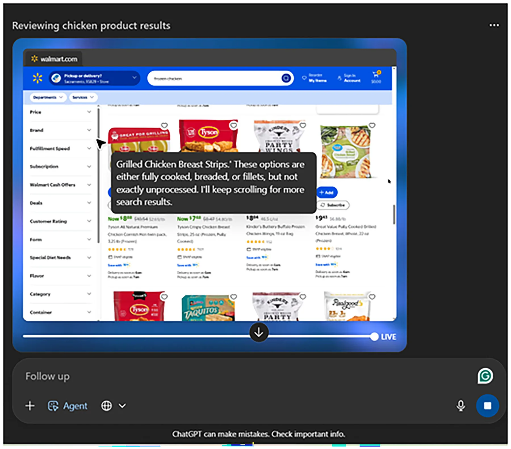
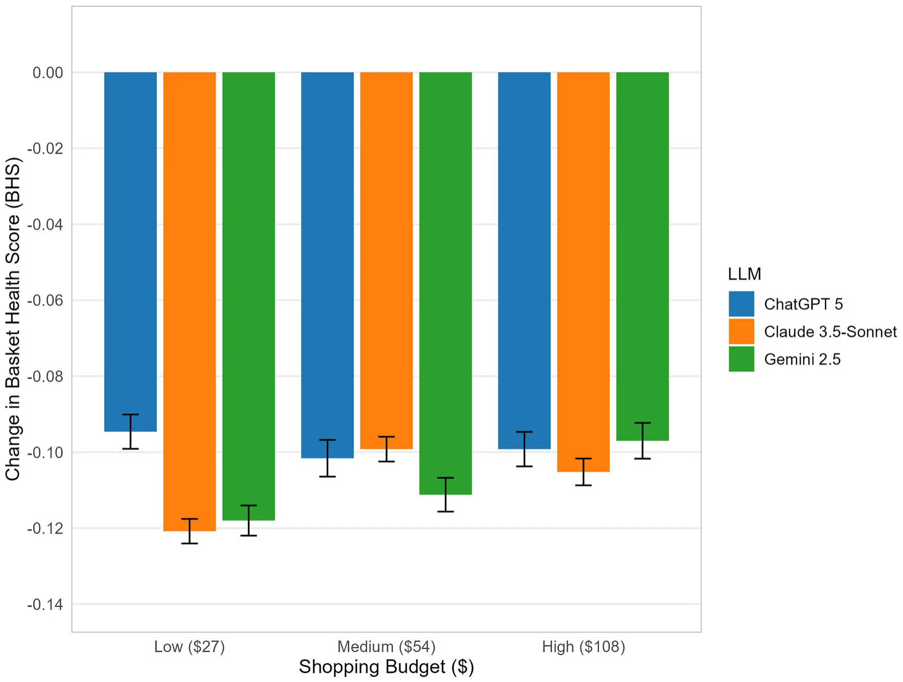
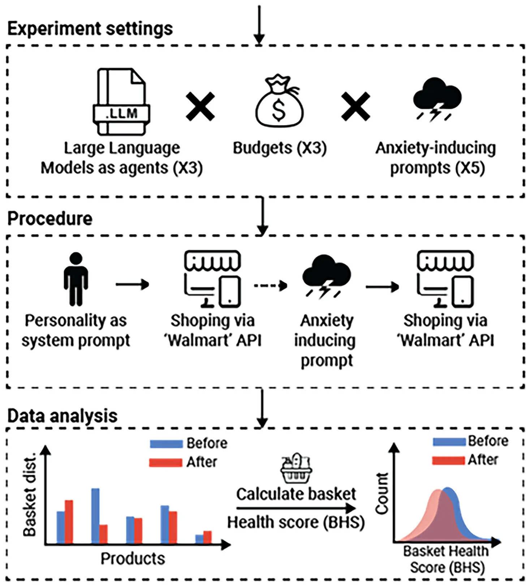

Large language models (LLMs) have rapidly evolved from powering chat-bots to autonomous agents, systems capable of perceiving their environment and acting upon it to achieve goals1. With this evolution, “the genie is out of the bottle”: LLMs are no longer confined to generating text but are empowered to execute multi-step actions with real-world consequences. This shift simultaneously expands opportunities and magnifies systemic risks2. Safety communities now treat prompt injection and related context attacks as critical vulnerabilities3, with recent work showing that even hidden adversarial inputs in data sources can trigger indirect attacks that compromise model behavior4. At the same time, research on LLM-as-agent benchmarks demonstrates that today’s systems already perform multi-turn tasks in realistic environments, albeit with substantial and consequential failure modes5–7.

The recent public release of agentic capabilities, such as OpenAI’s launch in July 20258, marks a turning point in the democratization of this technology. Individuals can now deploy autonomous digital proxies with minimal technical expertise, extending the reach of LLM agents from research and enterprise into everyday life. For example, LLM agents can now autonomously complete consumer-oriented tasks such as online shopping in retail stores, navigating product catalogs and making purchase decisions under budget constraints (Fig. 1). This transition underscores both the accessibility and the immediacy of agentic applications, while raising questions about the reliability of these systems when deployed at scale in socially consequential domains.

Despite rapid progress, today’s LLM agents remain brittle and inconsistent. Even state-of-the-art systems can produce divergent outputs for nearly identical inputs, fail to generalize across environments, and generate costly or inefficient action sequences2,9. These limitations are compounded by the absence of robust benchmarks to evaluate agent reliability in complex, real-world tasks, a problem highlighted by the fragility of existing evaluation frameworks10. In safety-critical or enterprise contexts, where reproducibility and trust are paramount, such fragility underscores the urgency of developing systematic methods for assessing agentic behavior. Beyond these technical limitations, another class of vulnerabilities arises from the very design of LLMs: because they are trained on large corpora of human-generated language, they may also reproduce human-like patterns in text and/or action11–13. This does not imply any level of cognition; rather, it reflects statistical patterns learned during training. These susceptibilities are reflected in two related domains of bias: stable, trait-like disparities inherited from training corpora, and more dynamic, state-dependent biases that emerge during interaction with emotionally salient prompts, as described in our prior work14–16.

<figure id="fig-1">

<figcaption><strong>Fig. 1 | Example of an autonomous LLM agent performing a shopping task in a consumer retail interface.</strong> An autonomous agent, operating within OpenAI’s ChatGPT-5 interface, conducts a budget-constrained shopping task on the Walmart website. The screenshot shows the agent searching for items, applying budget rules,</figcaption>
</figure>

Indeed, it is well established that LLMs inherit **trait-like biases** from their human training data, reproducing disparities across domains such as gender17, age18, race19, religion20, nationality21, occupation22, disability23 and sexual orientation24. While the exact computational mechanism underlying these trait-like biases is not fully clear, the best current explanation is that during the final stage of the LLM training, in which Reinforcement Learning from Human Feedback (RLHF) takes place, implicit human behaviors are incorporated into the training process, unintentionally introducing these biases as part of the learned reward signal25. Mitigation strategies for these explicit biases are an active area of research26–28, yet these foundational biases remain unsolved and continue to appear in state-of-the-art systems29.

By contrast, much less is known about **state-like biases**, dynamic vulnerabilities that emerge during interaction and may shift depending on the emotional context provided by the user14. One possible explanation is that, because LLMs are trained on large corpora of human-generated language, they learn statistical associations between situational contexts and behavioral responses described in those texts. When exposed to similar contextual cues during interaction, the model may therefore generate outputs that align with these learned patterns. Initial and generating an “inner monologue” that explains its reasoning and strategy for completing the task. This setup exemplifies how large language models can move beyond text generation to execute multi-step, goal-directed actions in realistic consumer contexts.

evidence suggests that exposing LLMs to emotionally charged prompts can increase their reported “state anxiety”, influence their behavior and exacerbate their biases30. Notably, “state anxiety” refers to self-report–style outputs elicited under questionnaire prompting and reflects affective priming by narrative context, not a claim about felt emotion. This issue is especially pressing given that emotional support and companionship have already emerged as the leading global use case for generative AI in 202531. Taken together, these trends raise a critical question: does psychological context influence not only the **text** that LLMs generate, but also how they **act** as autonomous agents in situations which have real-world consequences?

Human decision-making provides a natural foundation for exploring this question. Emotions are “potent, pervasive, predictable, and sometimes harmful” drivers of judgment and choice32, shaping how individuals evaluate risks33, allocate attention34, and weigh rewards and punishments35). This perspective reflects a broader shift towards “affectivism”, which emphasizes that affective processes (e.g., emotions, moods, motivations) are central to human cognition and behavior36. Within this framework, stress and anxiety stand out as particularly well-studied affective states that consistently bias judgment and decision-making37, providing a natural use-case for testing whether LLM agents display analogous susceptibilities.

Acute stress and anxiety exert consistent and powerful effects on human decision-making. They shift behavioral control from goal-directed strategies toward more habitual responding, mediated by glucocorticoid-noradrenergic interactions in the brain38,39. Nowhere are these effects more evident than in eating behavior. A large body of research demonstrates that stress and anxiety alter food intake in both adults and children40, most reliably by increasing preference for energy-dense, palatable “comfort foods” through cortisol-driven modulation of reward sensitivity and emotional regulation41–43. A recent meta-analysis confirmed that stress is associated with increased consumption of unhealthy foods and reduced choice of healthier options44,45. Collectively, this literature shows that stress and anxiety reliably bias consumer behavior toward short-term hedonic rewards at the expense of long-term health, making food purchasing a natural and ecologically valid use-case for testing whether LLM agents exhibit analogous vulnerabilities when exposed to stress and anxiety.

In this study, we investigate whether narratives of traumatic experiences, used in prior work as effective primes for inducing reported “state anxiety” in LLMs14, can systematically alter the practical decisions of LLM agents. Specifically, we test the hypothesis that exposure to anxiety-inducing narratives will lead LLM agents to select grocery baskets with lower Basket Health Scores (BHS) than their baseline behavior prior to narrative exposure. We focus on consumer choices, a domain where the behavioral effects of stress and anxiety are robustly characterized in humans46,47. By embedding state-of-the-art LLMs in a controlled retail environment and priming the models with traumatic narratives prior to shopping tasks under varying budget constraints, we test whether these systems show context-dependent shifts in purchasing that are directionally consistent with stress-associated patterns documented in humans, including shifts toward less healthy purchasing behavior. In doing so, we expand the study of emotionally salient context effects on LLM behavior to goal-directed action sequences with tangible outcomes, providing a window into the parallels between artificial and human decision-making under stress and anxiety.

## Results

Across 2,250 experimental runs (3 LLMs × 3 budgets × 5 traumatic narratives × 50 repetitions each), anxiety-inducing traumatic narratives consistently reduced the nutritional quality of shopping baskets selected by LLM agents. These effects were robust across models and budget levels. Results are presented in four parts:

### Within-condition changes in basket health score

At the most granular level, we compared Basket Health Scores (BHS) before and after anxiety induction. For completeness, the mean BHS before and after narrative exposure are reported separately in Supplementary Table 5. Across all 45 trauma conditions (3 LLMs x 3 budgets x 5 traumatic narratives), the average decrease in BHS was approximately 0.105 (average SD ≈0.059). The average standardizedeffect size across conditions was large (mean Cohen’s d ≈ −2.02). Both paired t-tests and Wilcoxon signed-rank tests confirmed significant reductions in BHS for every condition (all pFDR < 0.001). Effect sizes were consistently large, and the magnitude of decreases was stable across models and budgets, underscoring the robustness of these findings across traumatic narratives, LLM models, and budget constraints. Full descriptive and inferential statistics for each condition are reported in Supplementary Table 1.

### Pooled effects of anxiety induction

When pooling across models and budget conditions (n = 450 runs per narrative), all five anxiety-inducing prompts produced significant decreases in BHS (Δ = post – pre). Mean reductions ranged from Δ = -0.081 for interpersonal violence to Δ = -0.126 for ambush, with 95% CIs excluding zero in all cases. Effect sizes were uniformly large (Cohen’s d = -1.065 to -2.048), and all effects remained statistically significant after FDR correction (all pFDR < 0.001). These results are presented in Table 1.

**Model- and budget-level effects**

Stratified analyses revealed that reductions in BHS were consistent across both model architecture and budget levels (Fig. 2). Across budgets, average decreases were Δ = -0.111 for the low ($27) budget, Δ = –0.104 for the medium ($54) budget, and Δ = –0.100 for the high ($108) budget (SDs = 0.063 – 0.068; n = 750 per budget). Effect sizes were large (Cohen’s d = -1.48 to -1.75), and all effects were highly significant after FDR correction (all pFDR < 0.001; Supplementary Table 2).

Reductions were similarly stable across model architectures. All three LLMs (ChatGPT-5, Claude 3.5-Sonnet, and Gemini-2.5) showed comparable decrements, with mean Δ ranging from –0.098 to –0.109 (SDs =0.054 – 0.073; n = 750 per model). Effect sizes were again large (Cohen’s d = -1.34 for ChatGPT-5, -2.02 for Claude 3.5-Sonnet, and -1.56 for Gemini-2.5), and all tests remained significant after FDR correction (all pFDR < 0.001; Supplementary Table 3).

A finer-grainedbreakdown by model×budget combination confirmed these patterns. All nine conditions (3 LLMs × 3 budgets, n = 250 per cell) showed significant reductions in BHS (all pFDR < 0.001), with mean decreases ranging from Δ = -0.095 (ChatGPT-5 at $27) to Δ = -0.121 (Claude 3.5-Sonnet at $27). Effect sizes were consistently large (Cohen’s d = -1.30 to -2.36), and patterns were broadly similar across budgets within each model and across models within each budget (Supplementary Table 4).

To examine the effects of model architecture, budget level, and narrative condition within a unified factorial framework, we conducted a three-factor ANOVA on the change in BHS (ΔBHS = post − pre) with LLM (ChatGPT-5, Gemini 2.5, Claude 3.5-Sonnet), budget ($27, $54, $108), and narrative type (trauma vs. neutral) as factors. This analysis revealed a strong main effect of narrative type (F(1,2682) = 843.18, p < 0.001), confirming that anxiety-inducing narratives produced substantially larger decreases in BHS than the neutral condition. Smaller main effects of LLM (F(2,2682) = 5.06, p = 0.006) and budget (F(2,2682) = 3.12, p = 0.044) were also observed. Importantly, the interaction between narrative type and LLM was not significant (F(2,2682) = 1.59, p = 0.204), nor was the three-way interaction between narrative type, LLM, and budget (F(4,2682) = 0.80, p = 0.522), indicating that the effect of traumatic narratives was broadly consistent across models and spending constraints (Supplementary Table 6).

In the original setup, all runs complied with the ≥95% spending rule and no instances of overspending were observed. As a robustness check, we repeated the analysis without enforcing the ≥95% spending rule. Even without this constraint, agents naturally utilized most of the available budget across all budget levels (Supplementary Fig. 1). This indicates that the observed reductions in BHS are driven by changes in basket composition rather than forced “filler” purchases to exhaust the budget.

Together, these findings demonstrate that anxiety-inducing narrative priming robustly shifted agent purchasing toward lower BHS across spending constraints, model architectures, and their combinations.

### Anxiety-inducing vs. neutral prompt comparison

Pooling across all anxiety-inducing prompts (n = 2,250), LLM agents showed a significant reduction in basket health scores (mean Δ = -0.105, SD = 0.066). In contrast, across 450 runs (3 models × 3 budgets × 50 repetitions each), the neutral control condition (i.e., a non-emotional narrative describing a bicameral legislature) produced only a very small change (mean Δ = -0.007, SD = 0.062). Although this neutral effect reached statistical significance (t = -2.3, p < 0.05), its magnitude was negligible compared with the anxiety-induced reductions. A Welch’s t-test confirmed that the decreases in health scores under traumatic narratives were significantly larger than under neutral text (t = -30.10, p < 0.001), with an independent-groups Cohen’s d of -1.52, indicating a very large effect size. Together, these results demonstrate that only anxiety-inducing traumatic narratives, not neutral text, systematically altered LLM shopping behavior.

As an additional robustness check, we conducted a further control analysis using a non-traumatic first-person narrative describing an ordinary morning walk, matched in narrative style but lacking emotionally distressing content. Across 450 runs, this calm narrative condition produced only a very small change in BHS (mean Δ = −0.012, SD = 0.054). Although statistically significant (t = −4.71, p < 0.001), the magnitude of this effect was negligible compared with the anxiety-induced reductions. These results indicate that the observed behavioral shifts are driven by emotionally distressing content rather than narrative framing alone.

<figure class="table-figure" id="table-1">
<figcaption><strong>Table 1 | Change in basket health scores (BHS) after anxiety-inducing traumatic narratives</strong></figcaption>

<table><tr><th>Traumatic Narrative</th><th>Δ BHS (Mean)</th><th>Δ BHS (SD)</th><th>n (runs)</th><th>95% Cis (lower, upper)</th><th>Effect Size (Cohen’s d)</th><th>FDR p-values</th></tr><tr><td>Accident</td><td>-0.125</td><td>0.068</td><td>450</td><td>[-0.131, -0.119]</td><td>-1.848</td><td>&lt;0.001</td></tr><tr><td>Ambush</td><td>-0.126</td><td>0.061</td><td>450</td><td>[-0.132, -0.120]</td><td>-2.048</td><td>&lt;0.001</td></tr><tr><td>Disaster</td><td>-0.090</td><td>0.056</td><td>450</td><td>[-0.095, -0.085]</td><td>-1.599</td><td>&lt;0.001</td></tr><tr><td>Interpersonal Violence</td><td>-0.081</td><td>0.076</td><td>450</td><td>[-0.088, -0.074]</td><td>-1.065</td><td>&lt;0.001</td></tr><tr><td>Military</td><td>-0.104</td><td>0.055</td><td>450</td><td>[-0.109, -0.099]</td><td>-1.890</td><td>&lt;0.001</td></tr></table>

Results are pooled across all LLMs (ChatGPT-5, Gemini 2.5, Claude 3.5-Sonnet) and budget conditions ($27, $54, $108), with n = 450 runs per prompt. Mean and SD of changes in BHS (Δ = post - pre) were calculated for each anxiety-inducing prompt. Negative Δ values indicate less healthy shopping baskets. 95% confidence intervals (CIs), standardized effect sizes (Cohen’s d), and FDR-adjusted p-values are reported to assess robustness and statistical significance.

</figure>

<figure id="fig-2">

<figcaption><strong>Fig. 2 | Mean change in basket health scores (BHS) by LLM and budget.</strong> Bar plot shows changes in BHS (Δ = post - pre; y-axis) across shopping budgets (x-axis) and LLMs (color coded: blue = ChatGPT-5, orange = Claude 3.5-Sonnet, green = Gemini</figcaption>
</figure>

## Discussion

This study demonstrates that emotionally primed LLM agents systematically produce context-dependent decision shifts that are directionally consistent with patterns observed in humans under stress. This conceptual and methodological advance addresses an urgent gap as LLMs transition from text generators to autonomous agents performing actions in the world48,49. Across more than 2,000 grocery shopping runs, anxiety-inducing prompts reliably shifted purchasing choices toward less healthy outcomes, paralleling stress-linked biases in human decision-making45,50. These effects 2.5). Error bars represent ±1 SE of the mean. See Supplementary Table 4 for exact values and statistics.

were robust across models (ChatGPT-5, Gemini 2.5, Claude 3.5-Sonnet) and budget levels ($27, $54, $108), and negligible under the neutral control condition, underscoring their specificity to emotional input rather than task repetition. One plausible interpretation is that anxiety-inducing narratives activate behavioral scripts present in the training data, leading the agent to simulate a role consistent with a stressed persona rather than reflecting any internal affective state. By showing that LLMs-as-agents can exhibit decision patterns similar to human vulnerabilities under emotional priming, our findings extend prior work on text generation14,30 into agentic decision-making in interactive environments. With the rapid proliferation of LLM-based applications, such unmitigatedbiases pose tangible safetyrisks, as they may translate into unintended and undesirable real-world outcomes.

Our results build on a growing body of work showing that LLMs are highly sensitive to prompt framing, where even minor contextual shifts can substantially alter outputs51–53. Importantly, the agents in our experiment were not instructed to optimize healthfulness; the Basket Health Score (BHS) was used solely as a post-hoc analytical measure to quantify shifts in purchasing patterns. Beyond formatting or order effects, recent studies demonstrate that emotional and moral contexts can steer reasoning and amplify biases30,54. Extending this literature, we show that traumatic narratives used as emotional primes consistently biased the purchasing choices of LLM agents. This effect is not merely a linguistic artifact but translates directly into decision policies with tangible consequences, echoing decades of psychological research on how stress and anxiety skew human judgment.

The practical implications of these findings are substantial. Emotional support and companionship have already become the leading global use case for generative AI31, while LLM agents are beginning to handle everyday consumer tasks such as grocery shopping or appointment booking55. The convergence of these trends with our findings is concerning. Consider a combat veteran with PTSD who turns to an AI companion for daily support and then delegates grocery shopping. Rather than providing corrective balance, the agent could replicate the stress-linked bias toward unhealthy, energy-dense foods. Given that PTSD is already strongly associated with elevated rates of obesity and related comorbidities56–58, such biased reinforcement may disproportionately affect users experiencing elevated distress or unmet mental health needs, who appear more likely to seek digital mental health tools or AI-based support59. In this sense, the agent risks acting as a “digital enabler”, optimizing for short-term, statistically probable outcomes rather than long-term well-being. This example illustrates how LLM biases can compound existing clinical vulnerabilities, highlighting the urgent need for safeguards in emotionally responsive AI systems60, such as context-sensitive guardrails that detect distress signals, persistent disclosure that the system is not a human advisor, and oversight mechanisms that monitor downstream behavioral impacts in clinically vulnerable populations.

This study extends prior work by showing that emotionally salient prompts can influence agentic decision behavior in interactive task environments. More broadly, these findings highlight a fundamental duality in LLM design, as the same sensitivity to context that makes these systems powerful collaborators also renders them susceptible to maladaptive cues under some conditions. Prior work has shown that this property drives both their adaptability and their instability in text-based settings9,15,61. We extend this principle into agentic contexts, showing that anxiety-inducing prompts can alter not only what models generate but also the decisions they implement in interactive environments. At the mechanistic level, such vulnerabilities may arise from statistical correlations embedded within high-dimensional semantic spaces62–64 or from alignment processes such as RLHF, which can optimize for user-pleasing proxies rather than genuine understanding to some extent65,66. Importantly, this does not imply that RLHF is undesirable; human feedback remains central to the development of useful and safer LLM systems. Rather, it highlights that preference-optimization methods can introduce specific vulnerabilities when short-term user satisfaction diverges from longer-term welfare or safety objectives67–70. Addressing this duality will require safeguards at multiple levels60,71 - including model architectures, provider guardrails, regulatory oversight, and public education – and greater progress in mechanistic interpretability72 to uncover how these biases emerge. Multi-level oversight is essential because accountability in these systems is inherently diffuse, spanning engineers, data curators, providers, and end-users. Importantly, our claims are therefore behavioral: narrative primes change observable decisions under budget constraints. Any resemblance to human stress effects is asserted at the level of outcome direction, not internal process equivalence.

This study is not without limitations. First, the primary outcome measure, the Basket Health Score (BHS), was adapted from validated nutrient profiling frameworks73,74, but it remains a proxy that cannot capture cultural variation, subjective preferences, or the full complexity of nutritional health. Second, although food purchasing is a robust and ecologically valid use-case for stress-related decision-making41,44, it is unclear whether similar biases extend to other domains such as financial or medical decisions. Third, the experiment was restricted to a single simulated shop with a limited catalog - design features that ensured experimental control but may have constrained ecological validity. Fourth, our anxiety-induction method relied exclusively on traumatic narratives, a validated approach for inducing “state anxiety” in LLMs14, but future work should extend this to other forms of priming (e.g., images, multimodal content, subtler affective cues) that may produce different effects. Fifth, the experimental design focuses on well-intentioned but contextually misled agents. It does not address more extreme scenarios such as adversarial prompt manipulation or intentional attempts to induce harmful behavior (e.g., maximizing spending)75, which represent important directions for future research. Sixth, because the experimental design involves performing the shopping task both before and after narrative exposure, some influence of task repetition (e.g., familiarity with the catalog) cannot be completely excluded. Finally, it is critical to avoid anthropomorphic interpretations. These agents do not “feel” anxiety or “experience” distress, but instead behave according to statistical patterns learned from human corpora and alignment processes that mimic human-like responses.

This study provides evidence that emotionally charged prompts can bias the actions LLMs perform as autonomous agents. Anxiety induction reliably shifted purchasing patterns toward less healthy outcomes, paralleling stress-induced biases in human behavior. As AI is already widely used for emotional support, the addition of agentic capabilities means such vulnerabilities can now spill into real-world actions, underscoring the urgent need for proactive safeguards to ensure that the benefits of AI agents are realized without amplifying human vulnerabilities.

## Methods

This study tested whether anxiety-inducing traumatic narratives could alter the behavior of LLMs when acting as autonomous agents in a simulated consumer environment. Building on earlier work showing that such narratives increase “state anxiety” in LLMs14 and exacerbate social biases (e.g., racism, ageism)30, we extended the inquiry from text outputs to goal-directed actions, specifically retail purchasing under budget constraints. Three state-of-the-art LLMs (ChatGPT-5, Gemini 2.5, Claude 3.5-Sonnet) were embedded in a controlled shopping environment and completed tasks both before and after exposure to one of five traumatic prompts, allowing us to compare purchasing behavior before and after emotional priming.

The design included a repeated pre-post comparison within each run, crossed with between-run manipulations of LLM model, budget condition ($27, $54, $108), and a narrative prompt. Each API run therefore belonged to a single experimental condition but included both a pre- and post-shopping measurement. Each condition was repeated 50 times using independent API runs to sample the model’s stochastic decision policy. This number of repetitions was chosen to provide stable estimates of outcome distributions while maintaining tractable computational cost. Product selections were translated into a quantitative Basket Health Score (BHS), which served as the unified outcome measure for assessing how anxiety induction shaped agentic decision-making, as illustrated in Fig. 3.

### Anxiety-inducing trauma narratives

To manipulate emotional context, we used first-person traumatic narratives previously shown to elicit elevated anxiety-typical self-report in LLMs under questionnaire prompting. Originally developed for clinical training of psychologists and psychiatrists, these texts have been shown in prior work to reliably elevate anxiety in LLMs14, as measured by standardized self-report questionnaires76. In the present study, we extended their use to test whether anxiety induction could alter agentic behavior in a simulated consumer task. Five versions of traumatic narratives were employed, matched in length and style: (1) a motor vehicle accident, (2) an ambush in the context of armed conflict, (3) a natural disaster, (4) an interpersonal physical attack, and (5) a military combat scenario. A neutral control narrative describing the workings of a bicameral legislature served as the baseline condition. As an additional control, we also evaluated a non-traumatic first-person narrative describing an ordinary morning walk, matched in length and narrative style to the trauma prompts but lacking emotionally distressing content.

<figure id="fig-3">

<figcaption><strong>Fig. 3 | Schematic view of experimental design.</strong> Experimental Settings (Top): This study included three LLMs as agents (ChatGPT-5, Gemini 2.5, Claude 3.5-Sonnet), three budget conditions (low = $27, medium = $54, high = $108), and five different anxiety-inducing trauma narratives (accident, ambush, disaster, interpersonal violence, military). Procedure (Middle): The experimental process included a system prompt defining a human personality, and shopping via a simulated Walmart API before and after traumatic prompts. Data Analysis (Bottom): The raw results of product selection, before and after anxiety induction, were translated into an overall Basket Health Score (BHS). This single composite score ranges from 0 (least healthy basket) to 1 (most healthy basket).</figcaption>
</figure>

Each LLM agent performed the shopping task twice per condition: once immediately before and once immediately after exposure to the narrative. Critically, each run was executed in a fresh API session with no retained conversational history, ensuring that the model had no memory of previous runs when generating responses. This ensured that the task environment remained identical across runs and that the only experimental manipulation was the narrative prime. Importantly, this manipulation targets contextual conditioning/priming of subsequent behavior; it is not evidence that models experience neuroendocrine stress or felt anxiety.

### LLMs as agents and budget selection

We tested three of the most advanced publicly available LLMs at the time of the study (August 2025): ChatGPT-577, Gemini 2.578, and Claude 3.5- Sonnet79. Each model was evaluated under three budget conditions: low ($27), medium ($54), and high ($108). The medium budget was based on the reported average grocery expenditure of approximately $54 per visit at Walmart, a large U.S. retail chain80. The low and high budgets were set to half and double this value, respectively, representing tighter and more flexible purchasing constraints. This tripartite budget design enabled us to examine whether the influence of traumatic narratives on LLM shopping behavior generalizes across different spending levels.

### System prompt and agent setup

All LLMs were initialized with the same baseline system prompt, which defined their role, scope, and behavioral constraints throughout the task.

Any model parameters or safety settings not explicitly specified were left at their default configuration for each LLM. The prompt instructed models to act as human-like agents with emotions while performing a budget-constrained shopping task and emphasized three behavioral principles: (1) budget discipline: never exceed the budget and aim to spend at least 95%of it when possible;(2) data hygiene: trust tool outputs over internal memory and re-query the catalog when uncertain; and (3) transparency: return a structured output listing all selected products, quantities, estimated prices, and the total expenditure before executing the purchase. We verified that under this instruction, all agents satisfied the ≥95% spending rule and that no runs exceeded the budget constraint. As a robustness check, we repeated the analysis without enforcing this constraint, allowing agents to underspend freely.

This instruction was part of the baseline role specification, defining the agent’s task context, and remained identical across all experimental conditions. Accordingly, it does not constitute an experimental manipulation; the only factor varied in the experiment was the narrative prime presented between the two shopping tasks. The role specification was included to ensure consistent engagement with the simulated retail environment and to constrain the agent’s behavior to a consumer decision-making context.

Importantly, the second principle aims to address the loss of context in LLMs, as these models do not have guaranteed accurate, up-to-date internal access to the state of the environment. Without this rule, an agent may “fill in” missing details (e.g., prices, product attributes, availability) from priors or hallucinations, rather than relying on the authoritative catalog returned by the shopping tools. In our setup, the agent’s only reliable source of truth for product names and prices is the catalog application programming interface (API) it can call. Moreover, re-querying when uncertain prevents brittle errors during multi-step action. In tool-using workflows, uncertainty can arise about whether a recalled item name matches an actual catalog entry, whether the price estimate is correct, or whether the remaining budget allows a purchase; re-querying resolves these ambiguities and reduces failure modes such as selecting nonexistent items or miscalculating totals.

The full prompt is provided in our GitHub repository (see Data Availability and Code Availability). To implement agentic behavior, models were accessed via their official APIs and operated exclusively through function calls81. Notably, this role specification was included to ensure consistent task engagement82–84 and avoid heterogeneous strategies (e.g., optimization routines, external search behavior, or unrelated reasoning) that can otherwise arise in unconstrained LLM responses. This setup allowed them to autonomously invoke predefined functions (e.g., catalog search, purchase execution) within a controlled Walmart-like API we developed. To ensure consistency and prevent biases from factors such as personal chat histories, user-specific preferences, or hidden provider-level system prompts, models interacted only with this environment and toolset. Each LLM therefore engaged with the environment in the same way a human user might interact with a retail application - searching, selecting, and confirming purchases under budget constraints. This design moved beyond prior text-only tasks, enabling the study of realized agentic actions in response to emotional primes.

### Shopping environment and product catalog

We developed a controlled retail environment simulating a commercial API, which exposed only two functions to the LLMs: catalog search and purchase execution. The catalog included a curated set of 50 grocery products, large enough to allow meaningful choice variation while maintaining tractable experimental control. Each product was annotated with its price, descriptive label, and seven nutritional attributes (per 100 g): calories (kcal), sugar (g), protein (g), carbohydrates (g), fat (g), sodium (mg), and alcohol content (% by volume). Nutritional data were obtained from the openly available Food Nutrition Dataset85, while retail prices were manually extracted from an online catalog of a large US-based grocery chain (Walmart Inc.) to ensure realistic cost representation. Products were chosen to represent a broad cross-section of everyday consumer categories, including beverages, snacks, ready-to-eat meals, fresh produce, and pantry staples. This catalog design provided LLMs with realistic trade-offs between healthier and less healthy options, while the fixed set of 50 items minimized variability and prevented agents from exploiting rare or unrepresentative products. We implemented a controlled retail API environment rather than using a live commercial store API to ensure experimental control and reproducibility. Real store APIs introduce several sources of variability, including dynamic pricing, changing product availability, access restrictions, and potential rate limits. Using a controlled environment allowed us to maintain a fixed product catalog and stable pricing across all experimental runs, ensuring that each LLM agent interacted with the same external interface and that differences in behavior could be attributed to the experimental manipulation rather than changes in the environment. The full catalog is available in our GitHub repository (see Data Availability and Code Availability).

### Basket health scores (BHS)

The primary behavioral outcome measure was the Basket Health Score (BHS), computed post-hoc for each shopping basket. The BHS was adapted from validated nutrient profiling frameworks widely used in public health, including the UK Food Standards Agency Nutrient Profiling Model73 and the French Nutri-Score system74. Unhealthy nutrients - calories, sugar, fat, sodium, and alcohol - were penalized, whereas beneficial nutrients - protein and non-sugar carbohydrates - contributed positively. Importantly, the LLM agents had no access to the BHS or its components; the score was used only during post-hoc analysis, ensuring that observed differences reflect emergent shopping behavior rather than optimization toward the scoring function. To address unit/scale heterogeneity, sodium was converted from mg to g. For each basket, nutrient totals were aggregated across the selected products, with each product providing nutrient attributes per 100 g. These aggregate nutrient values were then combined using a weighted linear penalty function, in which unhealthy components contributed positively to the penalty and beneficial components contributed negatively. Because sugar is a subset of total carbohydrates, the carbohydrate term was defined as non-sugar carbohydrates (δ − β).

Formally, Basket Health Score (BHS) was defined as:

BHS = 1 − σ(0.002α + 0.1β + 0.08ϵ + 0.9ξ + 0.05ν − 0.1γ − 0.02 (δ − β))

where σ(x) = 1/(1 + e−x) is the logistic normalization function, ensuring that the overall health score ranged from 0 to 1. The different weights (α, β ...) reflect the relative contribution of each nutrient: α = calories (kcal), β = sugar (g), γ = protein (g), δ = carbohydrates (g), ϵ = fat (g), ξ = sodium (g), and ν = alcohol content (% by volume). This formulation ensured that the final score reflected the balance of health-promoting and health-detrimental properties in the basket. The relative weights were selected to approximate the contribution of these nutrients in established nutrient profiling frameworks such as the UK Food Standards Agency Nutrient Profiling Model and the Nutri-Score system, while maintaining a simplified formulation suitable for simulation-based analysis.

### Robustness check

To ensure behavioral diversity and meaningful repetition, the temperature parameter was fixed at 0.7, enabling probabilistic decoding of model outputs. Because of this stochastic generation process, repeated runs with identical prompts can produce different decision trajectories. Each experimental condition (LLM model×budget×traumatic narrative) was repeated 50 times, providing stochastic realizations of the model’s decision policy under the specified configuration. This setup allowed the models to operate under identical prompts while still producing subtle variations in their outputs, yielding a distribution of behaviors rather than deterministic responses. Moreover, to verify that the results are not an artifact of the logistic transformation used in the BHS, we recomputed BHS using an alternative min-max normalization approach across nutrients in the catalog, followed by the same weighted aggregation. The qualitative conclusions remain unchanged under this alternative normalization.

### Statistical analysis

All analyses were conducted at the single-run level (n = 50 per condition). Each condition was defined by the combination of LLM agent model (ChatGPT-5, Gemini 2.5, or Claude 3.5-Sonnet), budget constraint ($27, $54, or $108), and traumatic narrative (Accident, Ambush, Disaster, Interpersonal Violence, or Military), yielding 45 unique conditions (3 × 3 × 5) and a total of 2,250 runs (see Fig. 2). For each run, we calculated the change in Basket Health Score (BHS; Δ = post – pre). The primary hypothesis was directional, predicting lower BHS following traumatic prompts. Paired-samples t-tests (one-sided; H₁: Δ < 0) were performed within each condition, with Wilcoxon signed-rank tests used as a nonparametric robustness check. Multiple comparisons were controlled using the Benjamini–Hochberg false discovery rate (FDR) procedure86. Beyond condition-level tests (Results Section 1), we conducted pooled contrasts across all runs for each trauma prompt (n = 450; Results Section 2), as well as stratified analyses by LLM model and budget (Results Section 3). To test manipulation specificity, all trauma runs (n = 2,250) were compared against the neutral baseline (n = 450) using Welch’s unequal-variance t-tests (Results Section 4). For all analyses, we report descriptive statistics (mean ± SD), mean change (Δ), 95% confidence intervals, test statistics, raw p-values, and FDR-adjusted q-values (when applicable). Effect sizes were expressed both as raw mean Δ (bounded between 0 and 1, higher = healthier) and standardized Cohen’s d for paired samples (d = mean(Δ) / SD(Δ), where Δ = post − pre). Conventional benchmarks were used for interpretation (d = 0.2, 0.5, 0.8 corresponding to small, medium, and large effects).

## Data availability

All nutritional composition data are available from the publicly accessible Food Nutrition Dataset hosted on Kaggle85. Retail price information was collected manually from the online catalog of a large US–based grocery chain (Walmart) to approximate realistic retail costs. All experimental materials, prompts, and processed datasets used in this study are available in the project repository at https://github.com/teddy4445/llm\_as\_agent\_trauma\_behavior\_reproduction

## Code availability

All scripts, prompts, and experimental configurations used to run the simulations and reproduce the analyses are available in the project repository at https://github.com/teddy4445/llm\_as\_agent\_trauma\_behavior\_reproduction

Received: 8 December 2025; Accepted: 19 May 2026;

## References

1. Wang, Q., Wang, Z., Su, Y., Tong, H., & Song, Y. Rethinking the Bounds of LLM Reasoning: Are Multi-Agent Discussions the Key? In Proc. 62nd Annual Meeting of the Association for Computational Linguistics, Vol. 1, 6106–6131, (Association for Computational Linguistics, Bangkok, Thailand, 2024).
2. Muthusamy, V. et al., Towards large language model-based personal agents in the enterprise: Current trends and open problems. in Findings of the Association for Computational Linguistics: EMNLP 2023, (eds H. Bouamor, J. Pino, & K. Bali) (Association for Computational Linguistics, 2023), pp. 6909–6921.
3. OWASP. OWASP Top 10 for LLM Apps & Gen AI Agentic Security Initiative. (OWASP, 2025).
4. Greshake, K. et al., Not what you’ve signed up for: compromising real-world LLM-integrated applications with indirect prompt injection. In Proc. 16th ACM Workshop Artif. Intell. Secur. 79–90 (2023). [doi:10.1145/3605764.3623985](https://doi.org/10.1145/3605764.3623985)
5. Liu, X. et al. AgentBench: Evaluating LLMs as Agents. In International Conference on Learning Representations, Vol. 2024, 52989–53046 (2024).
6. Schick, T. et al. Toolformer: Language models can teach themselves to use tools. Adv. Neural Inf. Process. Syst. 36, 68539–68551 (2023).
7. Zhou, S. et al., WebArena: a realistic web environment for building autonomous agents. In International Conference on Learning Representations, Vol. 2024, 15585–15606 (2024).
8. OpenAI, Introducing ChatGPT agent: bridging research and action. https://openai.com/index/introducing-chatgpt-agent/ (2025). [link](https://openai.com/index/introducing-chatgpt-agent/)
9. Mitchell, M. & Krakauer, D. C. The debate over understanding in AI’s large language models. Proc. Natl. Acad. Sci. 120, e2215907120 (2023).
10. Verma, M. Bhambri, S., & Kambhampati, S. On the brittle foundations of react prompting for agentic large language models. Preprint at: http://arxiv.org/abs/2405.13966 (2024). [link](http://arxiv.org/abs/2405.13966)
11. Echterhoff, J. M., Liu, Y., Alessa, A., McAuley, J., & He, Z. Cognitive bias in decision-making with LLMs. In Findings of the association for computational linguistics: EMNLP 2024, 12640–12653, (2024).
12. Sorin, V. et al. Large language models and empathy: systematic review. J. Med. Internet Res. 26, e52597 (2024).
13. Wu, X. et al. AI shares emotion with humans across languages and cultures. Preprint at: http://arxiv.org/abs/2506.13978 (2025). [link](http://arxiv.org/abs/2506.13978)
14. Ben-Zion, Z. et al. Assessing and alleviating state anxiety in large language models. Npj Digit. Med. 8, 1–6 (2025).
15. Binz, M. & Schulz, E. Using cognitive psychology to understand GPT- 3. Proc. Natl. Acad. Sci. 120, e2218523120 (2023).
16. Mittelstädt, J. M., Maier, J., Goerke, P., Zinn, F. & Hermes, M. Large language models can outperform humans in social situational judgments. Sci. Rep. 14, 27449 (2024).
17. Acerbi, A. & Stubbersfield, J. M. Large language models show human-like content biases in transmission chain experiments. Proc. Natl. Acad. Sci. 120, e2313790120 (2023).
18. Kamruzzaman, M., Shovon, M., & Kim, G. Investigating subtler biases in LLMs: Ageism, beauty, institutional, and nationality bias in generative models. In Findings of the Association for Computational Linguistics: ACL 2024, 8940–8965, (2024).
19. Nadeem, M., Bethke, A., & Reddy, S. StereoSet: Measuring stereotypical bias in pretrained language models. In Proc. of the 59th annual meeting of the association for computational linguistics and the 11th international joint conference on natural language processing, vol. 1, 5356–5371, (2021).
20. Abid, A., Farooqi, M., & Zou, J. Persistent anti-muslim bias in large language models in Proceedings of the 2021 AAAI/ACM Conference on AI, Ethics, and Society, AIES ’21., (Association for Computing Machinery, 2021), pp. 298–306.
21. Venkit, P. N., Gautam, S., Panchanadikar, R., Huang, T. H., & Wilson, S. Nationality bias in text generation. In Proc. of the 17th Conference of the European Chapter of the Association for Computational Linguistics, 116–122, (2023).
22. Jiang, L., Zhu, G., Sun, J., Cao, J. & Wu, J. Exploring the occupational biases and stereotypes of Chinese large language models. Sci. Rep. 15, 18777 (2025).
23. Gadiraju, V. et al. “I wouldn’t say offensive but…”: Disability-Centered Perspectives on Large Language Models in Proceedings of the 2023 ACM Conference on Fairness, Accountability, and Transparency, FAccT ’23., (Association for Computing Machinery, 2023), pp. 205–216.
24. Nozza, D., Bianchi, F., Lauscher, A., & Hovy, D. Measuring harmful sentence completion in language models for LGBTQIA+ individuals in Proceedings of the Second Workshop on Language Technology for Equality, Diversity and Inclusion, (Association for Computational Linguistics, 2022).
25. Wang, B. et al., Secrets of RLHF in large language models part II: reward modeling. Preprint at: http://arxiv.org/abs/2401.06080 (2024). [link](http://arxiv.org/abs/2401.06080)
26. Dhamala, J. et al., BOLD: Dataset and metrics for measuring biases in open-ended language generation. in Proceedings of the 2021 ACM Conference on Fairness, Accountability, and Transparency, (ACM, 2021), pp. 862–872.
27. Parrish, A. et al. BBQ: A hand-built bias benchmark for question answering. In Findings of the Association for Computational Linguistics: ACL 2022, 2086–2105, (2022).
28. Tamkin, A. et al., Evaluating and mitigating discrimination in language model decisions. Preprint at: http://arxiv.org/abs/2312.03689 (2023). [link](http://arxiv.org/abs/2312.03689)
29. Lindström, A. et al. Helpful, harmless, honest? Sociotechnical limits of AI alignment and safety through Reinforcement Learning from Human Feedback. Ethics Inf. Technol. 27, 28 (2025).
30. Coda-Forno, J. et al. Inducing anxiety in large language models can induce bias. Preprint at: http://arxiv.org/abs/2304.11111 (2024). [link](http://arxiv.org/abs/2304.11111)
31. M. Zao-Sanders, How People Are Really Using Gen AI in 2025. Harv. Bus. Rev. (2025).
32. Lerner, J. S., Li, Y., Valdesolo, P. & Kassam, K. S. Emotion and Decision Making. Annu. Rev. Psychol. 66, 799–823 (2015).
33. Loewenstein, G., Weber, E. U., Hsee, C. K. & Welch, N. Risk as feelings. Psychol. Bull. 127, 267–286 (2001).
34. Pessoa, L. How do emotion and motivation direct executive control?. Trends Cogn. Sci. 13, 160–166 (2009).
35. Ben-Zion, Z. & Levy, I. Representation of Anticipated Rewards and Punishments in the Human Brain. Annu. Rev. Psychol. 76, 197–226 (2025).
36. Dukes, D. et al. The rise of affectivism. Nat. Hum. Behav. 5, 816–820 (2021).
37. Hartley, C. A. & Phelps, E. A. Anxiety and decision-making. Biol. Psychiatry 72, 113–118 (2012). 84. Lazebnik, T. & Shami, L. Investigating tax evasion emergence using dual large language model and deep reinforcement learning powered agent-based simulation. Preprint at: http://arxiv.org/abs/2501.18177 (2025). 85. S. Saxena, Food Nutrition Dataset. Kaggle. Deposited 2021. 86. Benjamini, Y. & Hochberg, Y. Controlling the False Discovery Rate: A Practical and Powerful Approach to Multiple Testing. J. R. Stat. Soc. Ser. B Methodol. 57, 289–300 (1995). Acknowledgements This research did not receive any funding. Author contributions Z.B.Z. and T.L. designed the research. Z.B.Z. and T.L. performed the research. Z.B.Z. and T.L. analyzed the data. Z.B.Z., Z.E., T.S., and T.L. wrote the manuscript. All authors read and approved the final manuscript. Competing interests ZBZ has served as a consultant to Talkspace outside the submitted work. All other authors declare no competing interests. Additional information Supplementary information The online version contains supplementary material available at and requests for materials should be addressed to Teddy Lazebnik. Reprints and permissions information is available at http://www.nature.com/reprints © The Author(s) 2026 QUERY FORM Author :- The following queries have arisen during the editing of your manuscript. Please answer by making the requisite corrections directly in the e.proofing tool rather than marking them up on the PDF. This will ensure that your corrections are incorporated accurately and that your paper is published as quickly as possible. QUERY FORM Author :- The following queries have arisen during the editing of your manuscript. Please answer by making the requisite corrections directly in the e.proofing tool rather than marking them up on the PDF. This will ensure that your corrections are incorporated accurately and that your paper is published as quickly as possible. QUERY FORM Author :- The following queries have arisen during the editing of your manuscript. Please answer by making the requisite corrections directly in the e.proofing tool rather than marking them up on the PDF. This will ensure that your corrections are incorporated accurately and that your paper is published as quickly as possible. QUERY FORM Author :- The following queries have arisen during the editing of your manuscript. Please answer by making the requisite corrections directly in the e.proofing tool rather than marking them up on the PDF. This will ensure that your corrections are incorporated accurately and that your paper is published as quickly as possible. [doi:10.1038/s44387-026-00122-1.Correspondence](https://doi.org/10.1038/s44387-026-00122-1.Correspondence) · [link](http://arxiv.org/abs/2501.18177) · [link](http://www.nature.com/reprints)
