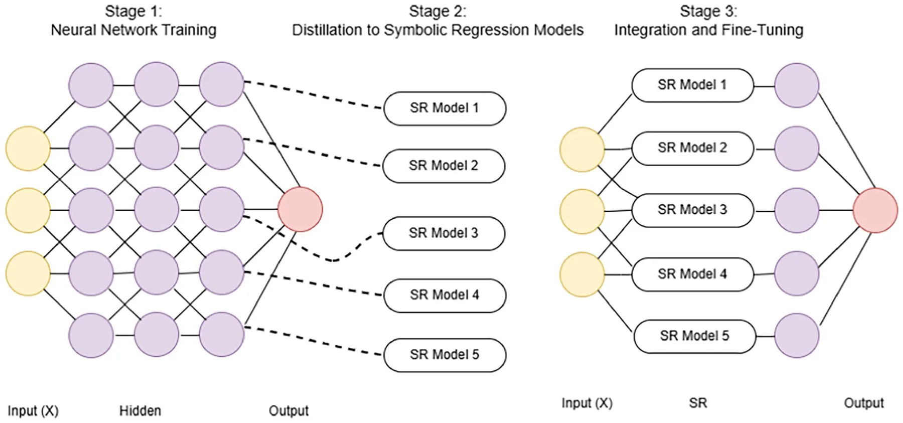
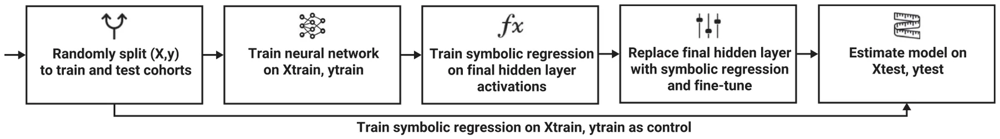
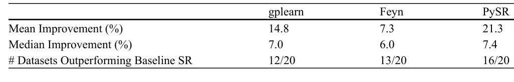
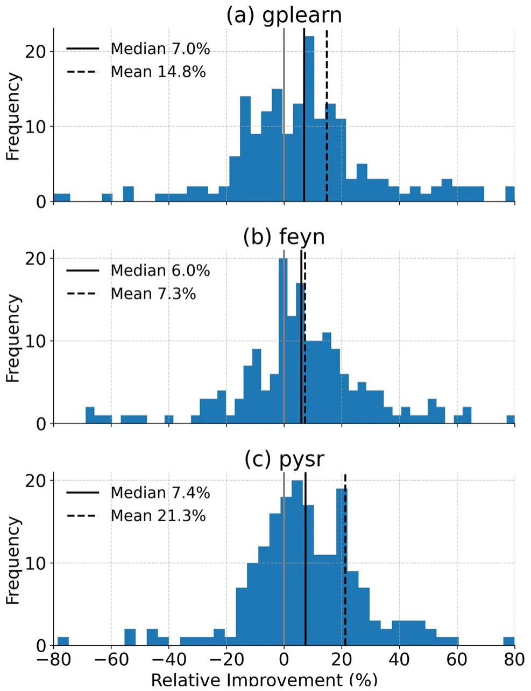
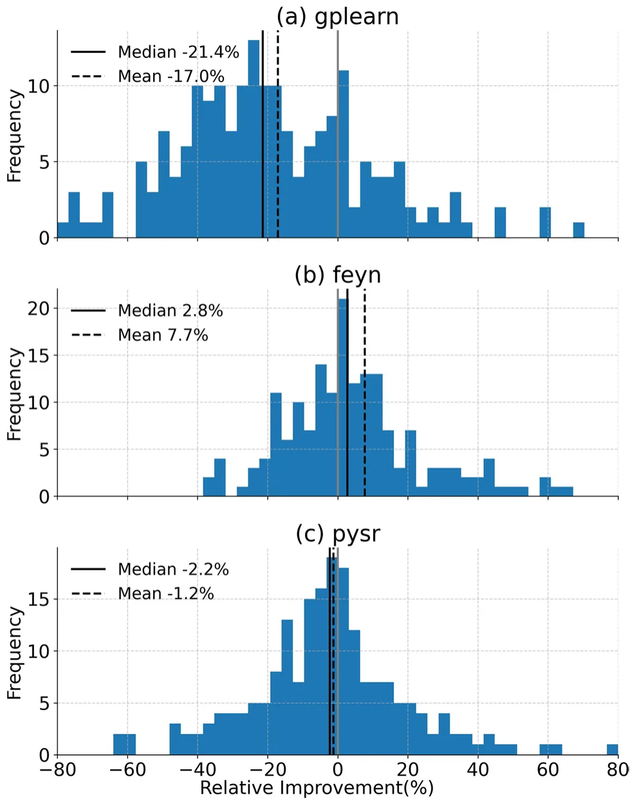
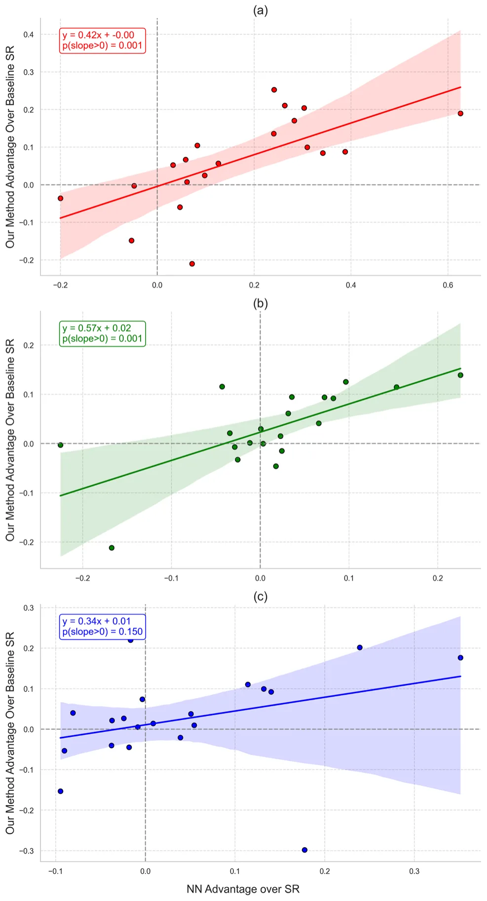
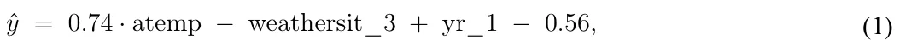
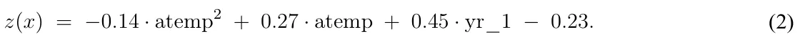
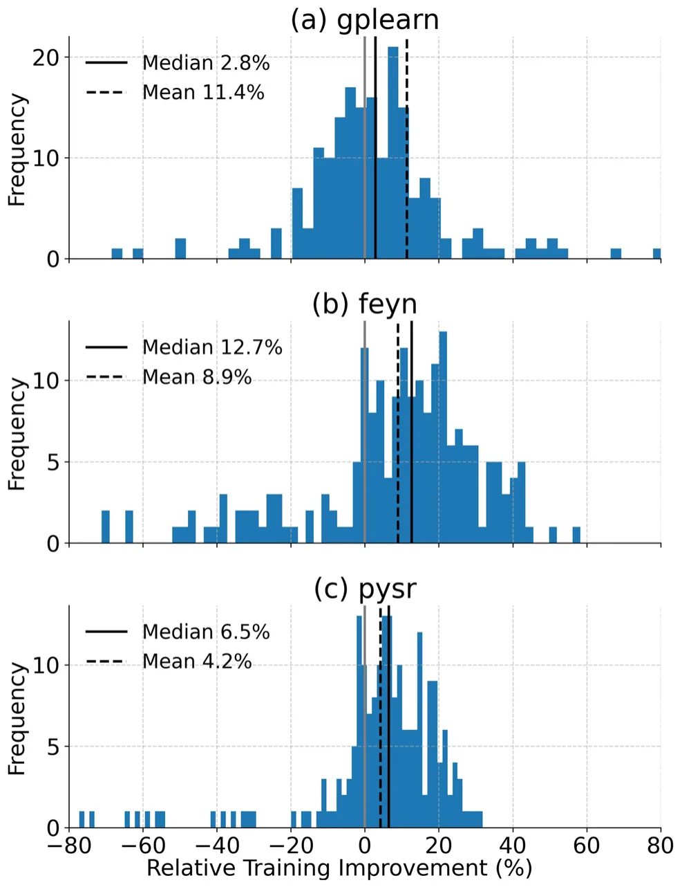
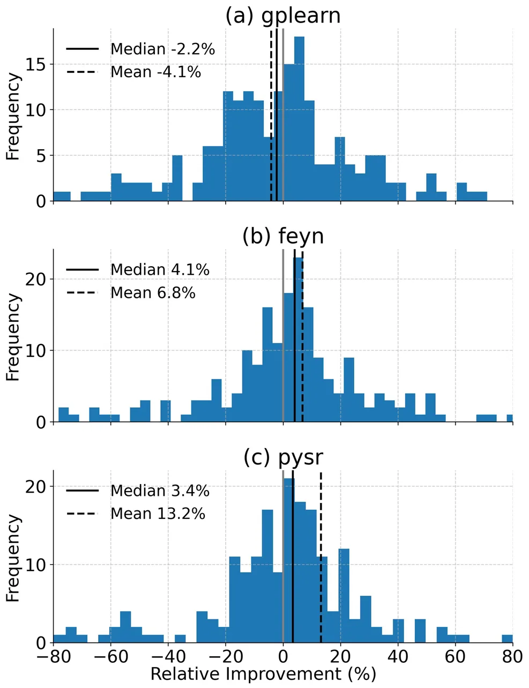

## 1 Introduction

Neural networks (NNs) are widely used for predictive modeling in structured data applications, including healthcare [1], finance [2], manufacturing [3], transportation [4], and agriculture [5]. Their ability to model high-dimensional, non-linear relationships has led to state-of-the-art performance in many tasks [6–8]. However, the lack of interpretability in NN models poses a significant challenge in domains where understanding the reasoning behind predictions is critical for decision-making, regulatory compliance, and trust [9, 10]. Unlike structured models such as decision trees or rule-based systems, NNs do not inherently provide human-interpretable explanations of their learned representations.

Symbolic regression (SR) has gained attention as a promising alternative for interpretable modeling [11, 12]. Unlike NNs, SR generates explicit mathematical expressions that describe relationships within data, improving transparency and interpretability [13]. Additionally, SR models often require fewer parameters and are computationally efficient compared to deep NNs [14, 15]. Despite these advantages, SR models generally underperform in predictive accuracy, particularly in capturing complex feature interactions present in deep learning models [16, 17].

Assaf Shmuel and Nir Koren contributed equally to this work.

This gap between NN’s predictive power and SR’s interpretability highlights an opportunity to combine the strengths of both methods. Previous studies have explored hybrid approaches to improve interpretability by estimating NN-based models using tree-based methods [18], or by leveraging SR for feature engineering in machine learning and deep learning models [19]. For example, [20] used deep learning to generate SR expressions for physical equations, and [21, 22] have demonstrated efficient methods to approximate tree-based models with SR. However, direct attempts to bridge NN and SR in a unified framework remain limited.

In this study, we propose a knowledge distillation (KD) framework that transfers knowledge from feedforward NN models to SR. Our approach approximates the activations of an NN’s final hidden layer using SR models, thereby retaining predictive accuracy while enhancing interpretability. This method is particularly suited for structured data applications where model transparency is a priority, such as healthcare [23].

To this end, we systematically evaluate the approach across 20 structured datasets, achieving a 7–21% improvement in RMSE over baseline SR models. Our approach demonstrates that it is possible to retain high predictive accuracy while offering explicit symbolic representations, providing a powerful tool for applications that require both transparency and performance.

Despite the extensive literature on KD, most existing approaches focus on output-based transfer, where a student model is trained to mimic the predictions of a teacher network, rather than on transferring internal representations to interpretable models. In particular, representation-level distillation of neural network activations into SR models remains unexplored. Given SR’s difficulty in matching NNs on high-dimensional data, this motivates a framework that distills neural representations into explicit symbolic models, extending KD to interpretable machine learning.

The remainder of this paper is structured as follows. Section 2 briefly reviews methods in NN approximation using tree-based machine learning models, NN compression methods, and SR methods. Section 3 presents the proposed methodology, detailing how a set of SR models are used to approximate an NN-based model. Section 4 describes the experimental setup and datasets used for evaluation as well as the results obtained. In Sect. 5 we present the results of the research. Finally, in Sect. 6 and Section 7, we present and discuss the applicative potential of the proposed method and suggest promising future research venues.

## 2 Related work

The proposed study draws upon advancements in KD, NNs for regression on tabular data, and symbolic regression. In this section, we review key developments in each of these areas, highlighting how they inform our approach of combining NNs with SR to achieve both high predictive performance and interpretability.

### 2.1 Knowledge distillation

KD is a prominent technique used to transfer knowledge from complex, high-capacity NNs (teacher models) to simpler, more efficient models (student models), thereby achieving high predictive accuracy with reduced computational resources [10, 24, 25]. Initially developed to distill knowledge from large ensembles to smaller models, KD has since evolved to encompass various methods tailored for different applications, including computer vision, natural language processing, and reinforcement learning [26, 27].

In the most common approach, KD leverages soft labels from the teacher model to guide student training, which has been shown to improve model generalization and performance, especially when training data is limited [28]. More recent methods also explore structural distillation techniques, where student models are encouraged to mimic specific representational structures within the teacher network, such as through contrastive learning [29]. Additionally, self-distillation approaches allow models to refine their representations by learning from their own intermediate outputs, enhancing compactness and efficiency [30]. Despite these advancements, most KD methods focus on improving efficiency or predictive performance and do not explicitly target interpretability or symbolic model extraction.

### 2.2 Neural networks for tabular data

NNs are frequently applied to regression tasks in tabular data due to their ability to capture complex, non-linear relationships [31], with a growing body of recent work focused on understanding the conditions under which DL models can outperform traditional machine learning methods in tabular data [32, 33]. However, despite their predictive power, NNs often operate as “black-box” models, which makes interpreting their outputs challenging. This lack of transparency poses significant issues in fields such as healthcare, finance, and law, where decisions must be explainable to build trust, ensure accountability, and comply with regulatory standards.

### 2.3 Symbolic regression

SR is a technique aimed at discovering mathematical expressions that best describe relationships within data [34, 35]. Unlike traditional regression, which fits parameters to a predefined model structure, SR simultaneously searches for both the optimal model structure and its parameters, providing flexible and interpretable representations [36]. SR’s unique advantage lies in its ability to produce explicit symbolic expressions, allowing for interpretability that is generally absent in NNs, making it particularly valuable in applications requiring transparent models.

Recent advancements in SR have further improved its performance and flexibility. Methods such as sparse regression focus on creating parsimonious models by introducing sparsity constraints, thus reducing overfitting and improving generalizability [11, 37]. Genetic algorithms have also gained popularity for SR, using evolutionary strategies to search the function space efficiently and handle complex, non-linear relationships [38, 39]. Additionally, some recent works integrate SR with deep learning frameworks to manage noisy data and increase robustness, although generalization remains a challenge [22, 40]. These limitations have motivated prior research exploring hybrid approaches that combine SR with other machine learning paradigms.

## 3 Neural network approximation using symbolic regression

Our proposed framework leverages KD to transfer the predictive capabilities of a NN into SR models. Unlike output-based KD or post-hoc surrogate modeling, the proposed method operates at the level of internal neural representations by approximating the activations of the final hidden layer using symbolic regression. This approach combines the accuracy and expressive power of NN with the interpretability of SR, resulting in a model that is both high-performing and transparent. The core idea is to approximate the learned representations within the NN’s final hidden layer using SR models, effectively substituting the NN’s hidden layer with interpretable symbolic expressions.

The framework comprises three primary stages:

- 1.**Neural Network Training and Feature Extraction:** We begin by training an NN on the input data to perform a regression task. Upon training, the activations from the final hidden layer serve as a compact, high-level feature representation of the input data, capturing complex, non-linear relationships learned by the NN. These activations provide the distilled knowledge that the SR models will approximate.
- 2.**Distillation to Symbolic Regression Models:** Next, each neuron’s activation in the NN’s final hidden layer is individually modeled using SR, with the original input features as predictors. This step involves fitting a separate SR model to approximate the activation pattern of each neuron based on the input data. The resulting

symbolic expressions form a composite SR layer, capturing the essential patterns from the NN in an interpretable form.

- 3.**Integration and Fine-Tuning:** The final stage involves replacing the NN’s last hidden layer with the trained SR models. This SR-enhanced model is then fine-tuned by adjusting the output layer weights, ensuring that the predictive performance remains consistent or improves after integrating the symbolic models. The SR layer thus functions as a transparent substitute for the original NN layer, preserving model accuracy while enhancing interpretability.

Figure 1 presents a schematic view of the proposed method. By following this framework, we distill the predictive knowledge of the NN into interpretable mathematical expressions, resulting in a model that balances high performance with interpretability. This approach is particularly useful in contexts where model transparency is essential alongside accurate predictions.

## 4 Experimental setup

To evaluate the proposed framework, we conducted experiments by training both NN and SR models on 20 datasets, with 10 train-test splits for each dataset to ensure robustness. The experimental setup was designed to systematically compare the performance of the NN, the baseline SR models, and the distilled SR models generated through KD.

### 4.1 Dataset descriptions

To evaluate the robustness and generalizability of the proposed distillation framework, we conducted experiments on 20 regression datasets spanning diverse domains and data properties [33]. These datasets were selected to capture a range of real-world scenarios, ensuring the applicability of the model to various use cases and data structures.

<figure id="fig-1">

<figcaption><strong>Fig. 1</strong> Overview of the proposed framework for Neural Network approximation using SR. Stage 1 involves training a neural network on the input data, with activations from the final hidden layer serving as feature representations. In Stage 2, each activation is approximated by a SR model using the original input features, resulting in interpretable symbolic expressions. In Stage 3, the neural network mapping from the input to the final hidden layer is replaced by a composite SR layer, and the output layer is fine tuned, preserving the model’s predictive performance while enhancing interpretability</figcaption>
</figure>

The datasets include examples from fields such as healthcare, physics, material science, and engineering, where interpretability and high predictive performance are essential. They encompass a range of data complexities, from simple, low-dimensional cases to high-dimensional datasets with intricate, non-linear relationships. This variety allows us to assess the performance of SR in distilling the knowledge from NN across both straightforward and challenging prediction tasks. A detailed list of the datasets, including the number of rows and columns, is provided in the appendix (Table 3).

Each dataset was sourced from established public repositories, including OpenML, to facilitate reproducibility. The choice of these datasets reflects typical regression tasks in scientific and industrial applications, making them suitable for evaluating the balance of interpretability and predictive power in the proposed SR-based models. Additionally, these datasets provide diverse data distributions and noise levels, testing the framework’s robustness to varied data characteristics.

### 4.2 Neural network training

The NN model used in this study is a fully connected multilayer perceptron (MLP) with two hidden layers, each consisting of 32 neurons. The MLP was configured for regression tasks, with ReLU activation functions in the hidden layers and a linear activation in the output layer. During training, we minimized the mean squared error (MSE) loss function using the Adam optimizer with a learning rate of 0.2 and a batch size of 128. Training was performed over 300 epochs.

After replacing the network representation up to the final hidden layer with the SR models, we fine tuned the output layer to adapt to the symbolic features. During fine tuning, the symbolic layer was kept fixed and only the parameters of the final linear output layer were optimized using mean squared error on the training set. We used stochastic gradient descent with learning rate 0.01 for 100 epochs.

### 4.3 Symbolic regression training

To approximate the activations of the NN’s final hidden layer, we used three established SR models [41]: Feyn, PySR, and gplearn. Each SR model was configured with hyperparameters suited to balancing model complexity and predictive accuracy:

- **Feyn** [42]: The Feyn SR model employed an automatic model selection process with a complexity limit of 20, ensuring interpretable results while retaining model performance.
- **PySR** [43]: The PySR model used genetic programming to evolve equations over 30 populations, using standard binary operators (+*, −, ∗, /*), 30 iterations and a timeout limit of 600 seconds to manage runtime.
- **gplearn** [44]: The gplearn model, based on scikit-learn’s SymbolicRegressor, was run with default settings for consistency across datasets. The gplearn model also applies genetic programming principles, making it suitable for use in traditional machine learning pipelines [44].

Each SR model was trained using the input data to predict the activations of individual neurons in the NN’s final hidden layer. This process resulted in a set of symbolic expressions that collectively approximated the learned representations in the NN.

### 4.4 Training and testing procedures

For each dataset, we randomly split the data into training (70%) and testing (30%) cohorts. The NN was initially trained on the training data, with the resulting activations from its final hidden layer used as targets for the SR models. The SR models were trained separately for each neuron in the final hidden layer using the training data, generating symbolic expressions that could approximate these activations based on the input features.

<figure id="fig-2">

<figcaption><strong>Fig. 2</strong> A schematic view of the training and testing procedures. <em>X</em> denotes the input feature matrix and <em>y</em> denotes the target variable.</figcaption>
</figure>

<figure class="table-figure" id="table-1">
<figcaption><strong>Table 1</strong> The relative improvement of the proposed method achieved for each of the three SR algorithms</figcaption>

</figure>

After substituting the NN’s final hidden layer with the trained SR models, we fine-tuned the output layer weights while keeping the SR layer static. The resulting hybrid model was then evaluated on the testing data. As a baseline comparison, we also trained each SR model directly on the target variable using the training data and evaluated its performance on the testing set. Fig. 2 presents a schematic view of the training and testing procedures.

### 4.5 Computational resources

All experiments were conducted using Google Colab, which provides access to GPU-accelerated resources suitable for deep learning experiments. The neural network training leveraged Colab’s available GPU instances, while SR models, which are less computationally intensive, were trained on CPU. This setup allowed for efficient experimentation across multiple datasets and SR model configurations, taking advantage of Colab’s flexible environment for both NN and SR training.

## 5 Results

Table 1 summarizes the results across all datasets, showing the percent improvement of our proposed method compared to the performance of the baseline SR model. Our method demonstrates a notable improvement in RMSE for the majority of datasets when compared to the baseline SR models, with mean improvements of 14.8%, 7.3%, and 21.3% for the gplearn, Feyn, and PySR models, respectively. The median improvements are also substantial (7.0%, 6.0%, and 7.4% respectively), showing that the improvement is consistent and not driven by one or two extreme values. These results indicate that the proposed distillation approach effectively leverages the knowledge captured by the NN model, translating it into more accurate SR-based predictions. Furthermore, the distilled SR models outperform their baseline SR counterparts in the majority of datasets, with gplearn, Feyn and PySR showing improvements in 12, 13, and 16 out of 20 datasets, respectively. This consistency demonstrates the clear advantage of the KD approach across different SR models.

Table 2 presents the median RMSE values for all models, including the baseline SR models and our method integrating each of the models with the NN, per dataset. The table clearly presents the advantage of the method, as summarized in Table 1. The performance of the proposed method with respect to the baseline NN is provided in Fig. 4. The proposed method is comparable to the baseline NN model for the Feyn and PySR models, yet still does not perform as well as the NN model with gplearn.

<figure class="table-figure" id="table-2">
<figcaption><strong>Table 2</strong> Median RMSE values for all models and datasets. Datasets with numerical names are taken from OpenML such that the value represents their dataset identificator</figcaption>

<table><tr><th>Dataset</th><th>baseline NN</th><th>gplearn Baseline</th><th>gplearn+NN</th><th>Feyn Baseline</th><th>Feyn+NN</th><th>PySR Baseline</th><th>PySR +NN</th></tr><tr><td>Huang (CS)</td><td>9.50</td><td>13.86</td><td>15.79</td><td>9.66</td><td>9.75</td><td>13.33</td><td>9.14</td></tr><tr><td>Huang (FS)</td><td>1.53</td><td>1.89</td><td>2.01</td><td>1.83</td><td>1.43</td><td>1.53</td><td>1.56</td></tr><tr><td>Su1</td><td>1.40</td><td>1.80</td><td>1.64</td><td>1.38</td><td>1.30</td><td>1.51</td><td>1.45</td></tr><tr><td>Su2</td><td>1.53</td><td>1.60</td><td>1.77</td><td>1.33</td><td>1.53</td><td>1.55</td><td>1.55</td></tr><tr><td>Koya1 (cte)</td><td>4.64 × 10−7</td><td>4.30 × 10−7</td><td>3.62 × 10−7</td><td>4.01 × 10−7</td><td>3.33 × 10−7</td><td>4.03 × 10−7</td><td>3.69 × 10−7</td></tr><tr><td>Koya2 (comp28)</td><td>471.09</td><td>501.42</td><td>522.15</td><td>536.69</td><td>464.52</td><td>493.27</td><td>475.57</td></tr><tr><td>Koya2 (elast28)</td><td>527590</td><td>491497</td><td>453361</td><td>526891</td><td>411551</td><td>712675</td><td>414834</td></tr><tr><td>Koya2 (poisson28nu)</td><td>0.02</td><td>0.02</td><td>0.01</td><td>0.02</td><td>0.01</td><td>0.02</td><td>0.01</td></tr><tr><td>Koya2(split28)</td><td>41.56</td><td>39.41</td><td>38.52</td><td>36.62</td><td>39.03</td><td>41.52</td><td>37.68</td></tr><tr><td>Matbench</td><td>149.69</td><td>242.14</td><td>252.48</td><td>190.18</td><td>165.80</td><td>201.17</td><td>166.46</td></tr><tr><td>Yin (Fmax)</td><td>0.03</td><td>0.10</td><td>0.12</td><td>0.03</td><td>0.04</td><td>0.06</td><td>0.07</td></tr><tr><td>Yin (ifss)</td><td>6.17</td><td>16.55</td><td>11.27</td><td>8.59</td><td>6.54</td><td>8.44</td><td>7.26</td></tr><tr><td>Bachir</td><td>5.26</td><td>10.86</td><td>8.46</td><td>5.45</td><td>4.93</td><td>6.20</td><td>6.05</td></tr><tr><td>45103</td><td>309.89</td><td>445.04</td><td>461.47</td><td>300.58</td><td>274.71</td><td>388.93</td><td>306.78</td></tr><tr><td>507</td><td>2158501</td><td>3843371</td><td>3380903</td><td>3318376</td><td>2896722</td><td>3711099</td><td>3178488</td></tr><tr><td>550</td><td>0.20</td><td>0.21</td><td>0.20</td><td>0.20</td><td>0.20</td><td>0.20</td><td>0.20</td></tr><tr><td>560</td><td>1.09</td><td>0.36</td><td>1.80</td><td>0.34</td><td>0.78</td><td>0.66</td><td>0.78</td></tr><tr><td>562</td><td>3.18</td><td>13.31</td><td>4.39</td><td>3.47</td><td>3.21</td><td>3.81</td><td>3.35</td></tr><tr><td>574</td><td>34808</td><td>52190</td><td>46298</td><td>42137</td><td>41807</td><td>42938</td><td>41383</td></tr><tr><td>8</td><td>2.40</td><td>3.06</td><td>2.82</td><td>1.68</td><td>2.21</td><td>2.37</td><td>2.58</td></tr></table>

</figure>

In order to evaluate the robustness of our approach, we analyze the distributions of relative performance improvements obtained through distillation for each SR method. Figure 3 presents the histograms of per-run relative improvements for gplearn, Feyn, and PySR. While occasional runs exhibit degraded performance, the majority of paired comparisons result in improvements. Statistical significance is assessed using a paired Wilcoxon signed-rank test applied to per-run improvements, with pairing defined by dataset and random seed. This analysis reveals a statistically significant positive shift in performance for all three methods *p <* 0*.*01. The corresponding median relative improvements are 0.016, 0.162, and 0.215 for gplearn, Feyn, and PySR, respectively, with rank-biserial correlations of 0.37, 0.28, and 0.23, indicating consistent gains across datasets.

PySR exhibits the largest mean improvement, suggesting that certain SR models may better capture the high-dimensional representations distilled from the NN model. The consistent performance gains across diverse SR models further validate the robustness of our approach, as it maintains effectiveness regardless of the underlying SR technique used for distillation Fig. 4.

## 6 Discussion

This study presents a novel framework for combining NN and SR through KD, enabling models that balance predictive power with interpretability. In contrast to output-based KD and black-box surrogate models, our approach operates at the level of internal neural representations, replacing the final hidden layer with SR models. The results demonstrate that the proposed method not only achieves improved root mean square error (RMSE) performance compared to baseline SR models but also offers practical advantages in interpretability. This interpretability is illustrated by a representative neuron-level SR example provided in Appendix A.1, which shows how the distilled symbolic expressions recover nonlinear structure learned by the neural network while remaining human-readable.

<figure id="fig-3">

<figcaption><strong>Fig. 3</strong> Histogram of improvement rates of the proposed methods in comparison to the baseline SR models. Subfigures (<strong>a-c</strong>) represent the results for the gplearn, Feyn, and PySR models respectively. The mean and median improvements are marked by the vertical lines</figcaption>
</figure>

Our analysis reveals that the effectiveness of the proposed distillation method is closely related to the performance of the original NN model. As shown in Fig. 5, there is a strong positive correlation between the relative performance of the NN model and the relative improvement observed in the distilled SR model across datasets. Datasets where the baseline NN significantly outperforms the baseline SR model exhibit the largest improvements after distillation. This finding underscores the potential of our approach to leverage the predictive power of NNs, particularly in cases where SR struggles with complex, high-dimensional data, such as tabular datasets with many correlated features, strong nonlinear interactions, or heterogeneous feature scales commonly encountered in finance, healthcare, and industrial process modeling [45]. Unlike prior surrogate approaches that operate at the output level [54], the proposed method distills internal neural representations, explaining its effectiveness in these challenging regimes. Consequently, improving the baseline NN model could further enhance the performance of the distilled SR models, potentially resulting in even more accurate SR representations without compromising interpretability.

The proposed method holds significant potential for applications requiring both high accuracy and interpretability, such as in healthcare, finance, and engineering. In these fields, models are often required not only to provide accurate predictions but also to yield transparent, interpretable results that stakeholders can understand and validate. By distilling the NN’s complex learned representations into symbolic forms, our method enables the creation of interpretable, mathematically explicit models, which may facilitate decision-making and increase user trust.

While the proposed method demonstrates promising results, it also has limitations that warrant consideration. First, this framework is currently limited to regression tasks due to the nature of the SR models used; adapting it for classification tasks remains a challenge for future work. Moreover, the method has been tested on relatively moderate NN architectures. As model complexity increases, such as in deep or transformer-based NNs, it may be increasingly difficult for SR models to approximate the rich, high-dimensional representations learned by the NN.

<figure id="fig-4">

<figcaption><strong>Fig. 4</strong> Histogram of improvement rates of the proposed methods in comparison to the baseline NN. Subfigures (<strong>a-c</strong>) represent the results for the gplearn, Feyn, and PySR models respectively. The mean and median improvements are marked by the vertical lines. The proposed method is comparable to the baseline NN model for the Feyn and PySR models, yet still does not perform as well when using the gplearn model</figcaption>
</figure>

The framework may also exhibit variability in performance improvements across datasets, as shown in certain cases where distillation did not yield significant gains.

There are several promising directions for future research. One avenue is to extend this framework to other task types, such as classification or sequence prediction, by exploring SR methods tailored to categorical data or temporal patterns. In addition, incorporating advanced SR techniques or more efficient distillation strategies may further optimize the balance between interpretability and performance. It would also be valuable to explore applying this approach to deeper and more complex NN architectures, potentially by distilling knowledge from intermediate layers to capture multi-level representations.

This work contributes to the broader field of explainable artificial intelligence by providing a pathway for making high-performing, complex models more interpretable. KD from NN to SR addresses the “black-box” problem commonly associated with NNs, aligning with the goals of Explainable AI to create models that are not only accurate but also understandable and trustworthy. By bridging the gap between predictive power and interpretability, the proposed framework offers a practical solution for real-world applications where transparency is paramount, setting a foundation for further advancements in interpretable machine learning.

## 7 Conclusion

In this study, we proposed a novel approach for combining NN and SR through KD, creating a model that balances high predictive accuracy with interpretability. By distilling the complex representations learned by the NN into symbolic expressions, our framework enables interpretable models that retain the NN’s predictive power, while being computationally efficient at inference. Our experiments demonstrate that the proposed method consistently outperforms baseline SR models, with improvements closely linked to the original NN model’s performance. The applicability of the proposed approach extends to domains where interpretability is essential alongside accuracy, such as healthcare, finance, and engineering. While the method currently focuses on regression tasks, future research could explore adaptations for classification and sequence prediction, as well as applications to more complex NN architectures. Taken jointly, this work provides a practical contribution to explainable machine learning, offering a method that bridges the gap between the transparency of SR and the performance of NN, paving the way for interpretable yet powerful models in data-driven decision-making.

<figure id="fig-5">

<figcaption><strong>Fig. 5</strong> Improvement of our method as a function of the performance ratio between the baseline NN and SR models. Higher values on the horizontal axis indicate a better performance of the NN compared to the SR model (units in normalized RMSE difference). The vertical axis indicates the relative improvement gained by our method compared to the baseline SR model. Subfigures (a-c) represent the results for the gplearn, Feyn, and PySR models respectively</figcaption>
</figure>

## Appendix

Table 3 describes the datasets used in the study. Figures 6 and 7 present additional experimental results illustrating the training-set improvements and the contribution of the fine-tuning stage, respectively.

<figure class="table-figure" id="table-3">
<figcaption><strong>Table 3</strong> The datasets used as part of the experiments with their source and properties</figcaption>

<table><tr><th>Dataset</th><th>Group</th><th>Reference</th><th># Rows</th><th># Cols</th></tr><tr><td>8</td><td>OpenML [46]</td><td>[46]</td><td>345</td><td>6</td></tr><tr><td>507</td><td>OpenML [46]</td><td>[46]</td><td>3107</td><td>7</td></tr><tr><td>549</td><td>OpenML [46]</td><td>[46]</td><td>625</td><td>8</td></tr><tr><td>550</td><td>OpenML [46]</td><td>[46]</td><td>2178</td><td>4</td></tr><tr><td>560</td><td>OpenML [46]</td><td>[46]</td><td>252</td><td>15</td></tr><tr><td>562</td><td>OpenML [46]</td><td>[46]</td><td>8192</td><td>13</td></tr><tr><td>574</td><td>OpenML [46]</td><td>[46]</td><td>22784</td><td>17</td></tr><tr><td>45103</td><td>OpenML [46]</td><td>[46]</td><td>731</td><td>13</td></tr><tr><td>Yin (Fmax)</td><td>Materials Benchmark [47]</td><td>[48]</td><td>925</td><td>12</td></tr><tr><td>Yin (IFSS)</td><td>Materials Benchmark [47]</td><td>[48]</td><td>925</td><td>12</td></tr><tr><td>Su 1</td><td>Materials Benchmark [47]</td><td>[49]</td><td>122</td><td>8</td></tr><tr><td>Su 2</td><td>Materials Benchmark [47]</td><td>[49]</td><td>136</td><td>6</td></tr><tr><td>Matbench</td><td>Materials Benchmark [47]</td><td>[50]</td><td>312</td><td>23</td></tr><tr><td>Koya 1 (Cte)</td><td>Materials Benchmark [47]</td><td>[51]</td><td>110</td><td>11</td></tr><tr><td>Koya 2 (Poisson28nu)</td><td>Materials Benchmark [47]</td><td>[51]</td><td>110</td><td>11</td></tr><tr><td>Koya 2 (Elast28)</td><td>Materials Benchmark [47]</td><td>[51]</td><td>110</td><td>11</td></tr><tr><td>Koya 2 (Split28)</td><td>Materials Benchmark [47]</td><td>[51]</td><td>110</td><td>11</td></tr><tr><td>Koya 2 (Comp28)</td><td>Materials Benchmark [47]</td><td>[51]</td><td>110</td><td>11</td></tr><tr><td>Huang (FS)</td><td>Materials Benchmark [47]</td><td>[52]</td><td>114</td><td>10</td></tr><tr><td>Huang (CS)</td><td>Materials Benchmark [47]</td><td>[52]</td><td>114</td><td>10</td></tr><tr><td>Bachir</td><td>Materials Benchmark [47]</td><td>[53]</td><td>112</td><td>4</td></tr></table>

</figure>

### A.1 Representative symbolic regression example

To qualitatively illustrate the interpretability of the proposed neuron-level symbolic distillation approach, we report representative SR formulas for a small and well-studied regression task: the daily bike rental demand dataset. The dataset contains 731 daily observations and includes calendar and weather-related features: season, year, month, weekday, holiday indicator, working-day indicator, weather situation, temperature, apparent temperature, humidity, and wind speed. Identifier variables, such as dates and row indices, are excluded. All symbolic expressions in this example are learned using gplearn.

As a reference, we first train a single symbolic regressor directly on the input features to predict bike rental demand. The resulting simplified symbolic expression is:

where atemp denotes apparent temperature, weathersit\_3 indicates adverse weather conditions, and yr\_1 denotes the second year of data.

This baseline model captures expected monotonic relationships: higher apparent temperature and later years are associated with increased bike rentals, while adverse weather conditions reduce demand.

Next, we apply SR to approximate the pre-activation of individual neurons in the second hidden layer of the trained neural network. Neurons are ranked by the absolute value of their output layer weights, and we report the most influential neuron.

The symbolic approximation for this neuron is:

Unlike the baseline SR model, this neuron-level expression includes a quadratic term in apparent temperature, indicating a nonlinear effect with diminishing returns at higher temperatures. This indicates that the neural network captures nonlinear temperature–demand relationships that are not expressed in the baseline symbolic model, while remaining interpretable through symbolic distillation.

<figure id="fig-6">

<figcaption><strong>Fig. 6</strong> Histogram of training set improvement rates of the proposed methods in comparison to the baseline NN. Subfigures (<strong>a-c</strong>) represent the results for the gplearn, Feyn, and PySR models respectively. The mean and median improvements are marked by the vertical lines</figcaption>
</figure>

<figure id="fig-7">

<figcaption><strong>Fig. 7</strong> Histogram of improvement rates of the proposed methods in comparison to the baseline NN, without fine tuning. Subfigures (<strong>a-c</strong>) represent the results for the gplearn, Feyn, and PySR models respectively. The mean and median improvements are marked by the vertical lines. The results highlight the contribution of fine tuning to the proposed approach</figcaption>
</figure>

This example demonstrates how neuron-level SR complements baseline symbolic models by revealing nonlinear structure learned by the neural network.

**Funding** Open access funding provided by Bar-Ilan University. This research received no external funding.

**Data availability** The datasets used and analyzed in this study are publicly available.

### Declarations

**Conflict of interest** The authors have no conflict of interest to declare that are relevant to the content of this article.

## References

1. Veturi YA, Woof W, Lazebnik T, Moghul I, Woodward-Court P, Wagner SK, Cabral de Guimaraes TA, Varela MD, Liefers B, Patel PJ, Beck S, Webster AR, Mahroo O, Keane PA, Michaelides M, Balaskas K, Pontikos N (2022) Syntheye: Investigating the impact of synthetic data on ai-assisted gene diagnosis of inherited retinal disease. Ophthalmology Science, page 100258,
2. Lazebnik T (2024) Going a step deeper down the rabbit hole: deep learning model to measure the size of the unregistered economy activity. Comput Econ. [doi:10.1007/s10614-024-10606-4](https://doi.org/10.1007/s10614-024-10606-4)
3. Wang J, Ma Y, Zhang L, Gao RX, Wu D (2018) Deep learning for smart manufacturing: methods and applications. J Manuf Syst 48:144–156 [doi:10.1007/s10614-024-10606-4](https://doi.org/10.1007/s10614-024-10606-4)
4. Nguyen H, Kieu L-M, Wen T, Cai C (2018) Deep learning methods in transportation domain: a review. IET Intell Transp Syst 12(9):998–1004
5. Kamilaris A, Prenafeta-Boldu FX (2018) Deep learning in agriculture: a survey. Comput Electron Agric 147:70–90
6. Kutz JN (2017) Deep learning in fluid dynamics. J Fluid Mech 814:1–4
7. Reichstein M, Camps-Valls G, Stevens B, Jung M, Denzler J, Carvalhais N et al (2019) Deep learning and process understanding for data-driven earth system science. Nature 566(7743):195–204
8. Willard J, Jia X, Xu S, Steinbach M, Kumar V (2020) Integrating physics-based modeling with machine learning: A survey. arXiv preprint arXiv:2003.04919, 1(1):1–34 [link](http://arxiv.org/abs/2003.04919)
9. Alzubaidi L, Zhang J, Humaidi AJ, Al-Dujaili A, Duan Y, Al-Shamma O, Santamaría J, Fadhel MA, Al-Amidie M, Farhan L (2021) Review of deep learning: concepts, CNN architectures, challenges, applications, future directions. J Big Data 8(1):1–74 [link](http://arxiv.org/abs/2003.04919)
10. Lazebnik T, Simon-Keren L (2024) Knowledge-integrated autoencoder model. Expert Syst Appl 252:124108
11. Quade M, Abel M, Nathanutz J, Brunton SL (2018) Sparse identification of nonlinear dynamics for rapid model recovery. Chaos 28:063116
12. Reinbold PAK, Kageorge LM, Schatz MF, Grigoriev RO (2021) Robust learning from noisy, incomplete, high-dimensional experimental data via physically constrained symbolic regression. Nat Commun 12(1):1–8
13. Searson DP, Leahy DE, Willis MJ (2010) Gptips: an open source genetic programming toolbox for multigene symbolic regression. Proc Int Multiconf Eng Comput Sci 1:77–80
14. Burlacu B, Kronberger G, Kommenda M (2020) Operon c++ an efficient genetic programming framework for symbolic regression. In Proc 2020 Genetic and Evolut Computat Conf Comp, pp 1562–1570
15. Virgolin M, Alderliesten T, Witteveen C, Bosman PAN (2021) Improving model-based genetic programming for symbolic regression of small expressions. Evol Comput 29(2):211–237
16. La Cava W, Orzechowski P, Burlacu B, de França FO, Virgolin M, Jin Y, Kommenda M, Moore JH (2021) Contemporary symbolic regression methods and their relative performance. arXiv
17. Chen Q, Xue B (2022) Generalisation in Genetic Programming for Symbolic Regression: Challenges and Future Directions. Women in computational intelligence: key advances and perspectives on emerging topics. Springer International Publishing, pp 281–302
18. Gjxrum VG, Strumke I, Lover J, Miller T, Lekkas AM (2023) Model tree methods for explaining deep reinforcement learning agents in real-time robotic applications. Neurocomputing 515:133–144
19. Shmuel A, Glickman O, Lazebnik T (2023) Symbolic regression as a feature engineering method for machine and deep learning regression tasks. Mach Learn: Sci Technol 5(2)
20. Udrescu SM, Tegmark M (2020) AI feynman: a physics-inspired method for symbolic regression. Sci Adv 6(16):eaay2631
21. Keren LS, Liberzon A, Lazebnik T (2023) A computational framework for physics-informed symbolic regression with straightforward integration of domain knowledge. Sci Rep 13:1249
22. Orzechowski P, La Cava W, Moore JH (2018) Where are we now?: a large benchmark study of recent symbolic regression methods. GECCO18: Proc Genetic and Evolut Computat Conf
23. Shick AA, Webber CM, Kiarashi N, Weinberg JP, Deoras A, Petrick N, Saha A, Diamond MC (2024) Transparency of artificial intelligence/machine learning-enabled medical devices. NPJ Digit Med 7(1):21
24. Hinton G, Vinyals O, Dean J (2015) Distilling the knowledge in a neural network. arXiv
25. Gou J, Yu B, Maybank SJ, Tao D (2021) Knowledge distillation: a survey. Int J Comput Vis 129(6):1789–1819
26. Mei Y (2023) Knowledge distillation and reward shaping of deep reinforcement learning. In Proceedings of the 2023 Int Conf Innov Comput, Mach Learn Data Mining (ICICML)
27. Yang Z, Zeng A, Li Z, Zhang T, Yuan C, Li Y (2023) From knowledge distillation to self-knowledge distillation: A unified approach with normalized loss and customized soft labels. In Proc IEEE/CVF Int Conf Comput Vision, pp 17185–17194. IEEE
28. Li H, Chen X, Ditzler G, Roveda J, Li A (2024) Knowledge distillation under ideal joint classifier assumption. Neural Netw 173:106160
29. Tian Y, Krishnan D, Isola P (2019) Contrastive representation distillation. arXiv
30. Zhang L, Bao C, Ma K (2022) Self-distillation: towards efficient and compact neural networks. IEEE Trans Pattern Anal Mach Intell. [doi:10.1109/TPAMI.2021.3067100](https://doi.org/10.1109/TPAMI.2021.3067100)
31. Arik SO, Pfister T (2020) Tabnet: attentive interpretable tabular learning. arXiv [doi:10.1109/TPAMI.2021.3067100](https://doi.org/10.1109/TPAMI.2021.3067100)
32. Fayaz SA, Kaul S, Zaman M, Butt MA (2022) Is deep learning on tabular data enough? an assessment. Int J Adv Comput Sci Appl 13(4)
33. Shmuel A, Glickman O, Lazebnik T (2025) A comprehensive benchmark of machine and deep learning models on structured data for regression and classification. Neurocomputing. [doi:10.1016/j.neucom.2025.131337](https://doi.org/10.1016/j.neucom.2025.131337)
34. Alibekov E, Kubalík J, Babuška R (2016) Symbolic method for deriving policy in reinforcement learning. In IEEE 55th Conf Decision and Control (CDC), pp 2789–2795. IEEE [doi:10.1016/j.neucom.2025.131337](https://doi.org/10.1016/j.neucom.2025.131337)
35. Veran T, Portier PE, Fouquet F (2023) Interpretable hierarchical symbolic regression for safety-critical systems with an application to highway crash prediction. Eng Appl Artif Intell 117:105534
36. Billard L, Diday E (2002) Symbolic regression analysis. Classification, clustering, and data analysis. Springer, pp 281– 288
37. Kaiser E, Kutz JN, Brunton SL (2018) Sparse identification of nonlinear dynamics for model predictive control in the low-data limit. Proc R Soc Lond A Math Phys Eng Sci 474(2219):20180335
38. Kronberger G, Olivetti de França F, Burlacu B, Haider C, Kommenda M (2022) Shape-constrained symbolic regression-improving extrapolation with prior knowledge. Evol Comput 30(1):75–98
39. Salustowicz R, Schmidhuber J (1997) Probabilistic incremental program evolution. Evol Comput 5(2):123–141
40. Petersen BK, Larma ML, Mundhenk TN, Santiago CP, Kim SK, Kim JT (2019) Deep symbolic regression: Recovering mathematical expressions from data via risk-seeking policy gradients. arXiv preprint arXiv:1912.04871 [link](http://arxiv.org/abs/1912.04871)
41. Zegklitz J, Posik P (2021) Benchmarking state-of-the-art symbolic regression algorithms. Genet Program Evolvable Mach 22:5–33 [link](http://arxiv.org/abs/1912.04871)
42. Broløs KR, Machado MV, Cave C, Kasak J, Stentoft-Hansen V, Batanero VG, Wilstrup C (2021) An approach to symbolic regression using feyn. arXiv
43. Cranmer M (2023) Interpretable machine learning for science with pysr and symbolicregression.jl. arXiv
44. Stephens T (2016) Genetic programming in python with a scikit-learn inspired api: Gplearn,
45. Makke N., Chawla S (2024) Symbolic regression: A pathway to interpretability towards automated scientific discovery. In Proc 30th ACM SIGKDD Conf Knowl Dis Data Mining, pp 6588–6596. ACM, August
46. Vanschoren J, Van Rijn JN, Bischl B, Torgo L (2014) OpenML: networked science in machine learning. ACM SIGKDD Explor Newsl 15(2):49–60
47. Conrad F, Mälzer M, Schwarzenberger M, Wiemer H, Ihlenfeldt S (2022) Benchmarking AutoML for regression tasks on small tabular data in materials design. Sci Rep 12(1):19350
48. Yin BB, Liew KM (2021) Machine learning and materials informatics approaches for evaluating the interfacial properties of fiber-reinforced composites. Compos Struct 273:114328
49. Su M, Zhong Q, Peng H, Li S (2021) Selected machine learning approaches for predicting the interfacial bond strength between FRPs and concrete. Constr Build Mater 270:121456
50. Dunn A, Wang Q, Ganose A, Dopp D, Jain A (2020) Benchmarking materials property prediction methods: the Matbench test set and Automatminer reference algorithm. Comput Mater 6(1):138
51. Koya BP, Aneja S, Gupta R, Valeo C (2022) Comparative analysis of different machine learning algorithms to predict mechanical properties of concrete. Mech Adv Mater Struct 29(25):4032–4043
52. Huang JS, Liew JX, Liew KM (2021) Data-driven machine learning approach for exploring and assessing mechanical properties of carbon nanotube-reinforced cement composites. Compos Struct 267:113917
53. Bachir R, Mohammed AMS, Habib T (2018) Using artificial neural networks approach to estimate compressive strength for rubberized concrete. Period Polytech Civ Eng 62(4):858–865
54. Shmuel A, Lazebnik T, Glickman O (2026) Follow the Forest Trail: Distillation by Gradient Boosting Models to Enhance Symbolic Regression Performance. IEEE Access.‏ Authors and Affiliations Assaf Shmuel1 · Nir Koren1 · Oren Glickman1 · Teddy Lazebnik2,3 Assaf Shmuel assafshmuel91@gmail.com 1 Department of Computer Science, Bar Ilan University, Ramat Gan, Israel 2 Information Systems Department, University of Haifa, Haifa, Israel 3 Computing Department, Jonkoping University, Jonkoping, Sweden [link](http://orcid.org/0000-0002-1794-9381)
