## 1. Introduction

Border closures, lockdowns, and labor shortages during epidemiological crises substantially disrupt international supply chains and networks [1–3]. In such a turbulent environment, the resilience of domestic industries rests on local supply linkages. However, even these may go awry as a result of restrictions on in-person commercial activities and physical distance in manufacturing facilities [4].

Compared to previous epidemic outbreaks, the COVID-19 pandemic is unique in its impact on production and supply chains [1]. The dynamic and diverse characteristics of the COVID-19 outbreak have had an impact on all the nodes (supply chain members) and edges (ties) in a supply chain simultaneously, disrupting its flow and networks [5,6]. Therefore, decision-makers should opt for optimal intervention and restriction policies that take into account the network structure of supply chains among industries [7], while considering prioritizing vaccination for workers, not only in essential sectors but also in industries that are vital intersections in the manufacturing process [8].

Given the severe impact of the COVID-19 pandemic on the economy, researchers have strived to assess the optimal degree of pharmaceutical and non-pharmaceutical intervention policies (IP), such as lockdown, capsules, work from home, and vaccination, to keep infection rates low while maximizing overall economic performance. Since [3] noted that limited research exists on the specific impact of pandemics on manufacturing and industrial supply chains, thousands of pages have been written on the subject. An important trend in this literature considers the effect of Input–Output linkages. Using US executive orders, occupation, and survey data, Barrot et al. [9] measure the fall in labor supply due to measures of social distancing and show how these measures disrupt national production through the network of input– output linkages. The authors analyze the sectoral effects of labor shocks for the United States using a model of production networks and find that nonlinearities in the production network account for around half of the drop in the gross domestic product (GDP) associated with the implementation of social distancing measures.

Bonadio et al. [4] use a multi-sector quantitative framework implemented on 64 countries and 33 sectors of economic activities to quantify the role of global supply chains in the economic impact of the COVID-19 pandemic on GDP growth. The authors parameterize the model using the OECD Inter-Country Input–Output Tables to answer the question of whether participation in global supply chains exacerbated or alleviated the pandemic-induced contraction in labor supply. They find that on average, compared to the current levels of trade, GDP would drop more if supply chains were ‘‘renationalized’’. However, there is a distribution of differences around the average, wherein in some countries, GDP would drop more if supply chains were renationalized, whereas in others GDP would fall less. This cross-country variation is explained by differences in lockdown severity across countries. Countries that imposed less stringent lockdowns than their trading partners had smaller domestic pandemic-induced shocks, thus separating from the global supply chains would make them more resilient to lockdowns, and vice versa. The results of the authors’ study emphasize the importance of choosing the degree of intervention and timing of limitations in times of epidemiological crisis and disorder lags across international intermediate input and final use trade (For example, as a result of the increase in cargo costs [10]).

Baqaee and Farhi [11] focus on the way supply and demand shocks interact during a pandemic outbreak and on the nonlinear response of macro aggregates (such as output and welfare) to them. The authors show that nonlinearities amplify negative supply shocks if these shocks are heterogenous and if sectors are complements throughout the input– output network. This results since large shocks to some sectors make them supply bottlenecks, dragging the rest of the sectors with them. Moreover, Baqaee and Farhi [12] model the outbreak of the pandemic as a combination of supply and demand shocks with multiple sectors, factors, and input–output linkages. The authors emphasize the importance of separating the supply and demand sources for the crisis since supply and demand-constrained industries respond differently to policy interventions. Guerrieri et al. [13] introduce input–output relations to allow complementarity between the two sectors. The authors show that demand may overreact to the supply shock induced by the outbreak and lead to a demand-deficient recession.

However, none of these papers merge infection dynamics models into their economic settings. This has stimulated a rapidly growing body of literature on the economics of the pandemic, integrating basic epidemiological models with dynamic optimization tools [14–16]. In line with this recent trend, several scholars have utilized the classic Susceptible–Infected–Recovered (SIR) model proposed by Kermack and McKendrick [17] to incorporate the infection dynamics of the COVID-19 outbreak into their analysis [14–16,18–24].

Indeed, economists are pushing the study of these compartmental models in a multitude of dimensions, improving our understanding of the economic transmission mechanism through which health shocks affect the economy. Baqaee et al. [25] analyze the consequences of sectoral supply shocks using an age-based Susceptible–Exposed– Infected–Recovered–Quarantine compartments (SEIRQD) model with 5 age bins to study a wide range of NPIs, including ones that vary by age (such as school closings) and reopening policies that prefer certain sectors. Pichler et al. [26] introduce an industry-specific economic model incorporating the production network and inventory dynamics, to investigate how locking down and re-opening the economy as a policy response to the COVID-19 pandemic affects economic performance and contagion. The authors calibrate the model to the UK economy and find that two months after lockdown gross output and consumption are down by 27% when compared to pre-lockdown levels. Moreover, industries are affected by direct demand and supply shocks in highly heterogeneous ways. However, the authors consider a simple SIR model, without fully coupling the epidemiological model with their economic model.

Similar to our approach, George et al. [27] introduce epidemiological dynamics to a multi-sector model with production networks for China and the Association of Southeast Asian Nations. The authors calibrated their model with inter-country input–output data and found that a pandemic’s greater economic impact over the years is associated with China’s evolving role in the global value chains. However, unlike our focus on the effect of the pandemic on the domestic supply side, George et al. focus on changes in domestic demand as a result of the outbreak and shifts in consumer preferences. [28] proposed an epidemiological-economic model that considers international input– output networks (as opposed to the domestic approach taken in our model) and the division of the industry into sectors. The authors base the epidemiological sub-model on the classical SIR model while dividing the population into working and non-working groups. They further divide each group according to their location — at home (either due to unemployment or working remotely) or at work on-site, for each sector independently. In our model, we focused only on the working population, neglecting the influence of non-working groups (such as children). In addition, the authors used a linear production of each state in the network. They showed that the optimal policy, which yields the lowest economic loss and saves the maximum number of lives, can be achieved under a full lockdown of 39 days. Moreover, the authors demonstrated that economic costs are much larger for an open economy as the shocks are amplified through the international production network and input–output linkages.

The severance of international supply chains following the COVID- 19 outbreak has raised to the economic agenda the need to strengthen domestic supply networks, especially in times of crisis. The question of whether a country that relies more on domestic supply ties than on international supply chains experiences economic recession more moderately has been addressed in several studies [1,4]. However, to the best of our knowledge, studies that have included epidemiological models in their supply chain analysis have made use of ones that do not consider the full influence of the dynamics of the outbreak and the variety of IPs (especially vaccinations), which has been shown to have a decisive impact on many economic outcomes [29,30].

The current study’s objective is to examine the intervention policies that will yield the less adverse effect across industries relying on domestic supply chains (closed economy) during a pandemic, using input–output linkages. In order to achieve this objective, we build and then quantitatively implement an economic mathematical model and extend the epidemiological dynamics by introducing a seven-state extension of the SIR model which inherently influences the economic dynamics. In addition, our model assumes individuals move around the space during the day. This spatial extension makes the model more socially realistic and epidemiologically accurate (compared to the static locations, home or work, considered in other studies). Furthermore, our model focuses on the interactions between the industries in a supply–demand network in which individuals are treated as a resource and infected (or dead) workers reduce the production of firms in the sector. Based on the proposed model, we simulated the effect of three intervention policies – capsules, work from home, and vaccination – on the damage a pandemic could inflict on output at the industry level and the entire economy. A comparison between the spatial intervention policies – work capsules and work from home policies – shows that the latter reduces economic loss much more than the former, gaining an improvement of 1.4 percentage points while affecting only 12% of the workers instead of 50%. Under the constraint of choosing one intervention policy, vaccination significantly reduces the loss of output, particularly in industries that require close customer–seller contacts. However, when combining intervention policies is possible, applying two responses simultaneously, such as work from home and vaccinations, leads to superior results.

The rest of the paper is structured as follows. Section 2 describes the epidemiological (temporal), social (spatial), and economic sub-models on which the proposed model is based. Next, Section 3 describes the simulation of the model, while Section 4 presents our discussion and Section 5 concludes briefly.

<figure id="fig-1">
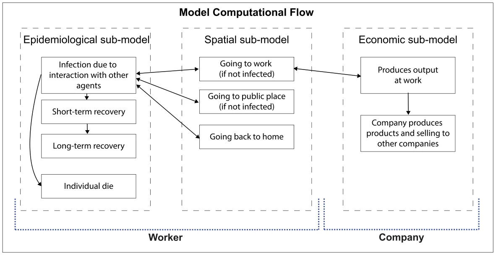
<figcaption><strong>Fig. 1.</strong> Schematic view of the model, divided into the sub-models and the connections between them. In addition, a division into the two agent types participates in the agent-based implementation of the model. Formally, the model is divided into epidemiological (temporal), spatial (driven by sociological practices), and economic sub-models such that the economic sub-model indicates the locations of individuals over time which in turn affects the spread of the pathogen and vice-versa. The epidemiological and spatial logic is implemented in the simulator using a worker entity. The economic dynamics are implemented by a company entity such that each company has a list of workers.</figcaption>
</figure>

## 2. Methodology

The model is based on three components — epidemiological (temporal), social (spatial), and economic sub-models. We define the model by a tuple *𝑀* ∶= (*𝑊, 𝐶, 𝐺*), where *𝑊* is a set of workers, *𝐶* is a set of firms, *𝐺* is a graph of locations that the population of workers, *𝑊* , is allocated to in some distribution and the firms are a subset of the graph, *𝐶⊂𝐺*. The components of the tuple are described below in detail. A schematic view of the model’s computational flow is shown in Fig. 1, illustrating the epidemiological, spatial, and economic dependencies.

### 2.1. Epidemiological (Temporal) sub-model

The epidemiological sub-model is an extension of the classic SIR model and considers a constant population with a fixed number of individuals *𝑁* = |*𝑊* |. In the context of studying the immediate economic influence of the pandemic, the time horizon of interest is relatively short and therefore the population growth can be neglected. Each individual belongs to one of the five groups: susceptible (*𝑆*, exposed (*𝐸*), symptomatic infected (*𝐼*𝑠, asymptomatic infected (*𝐼*𝑎), short-term recovered (*𝑅*𝑠𝑡), long-term recovered (*𝑅*𝑙𝑡), and dead (*𝐷*) such that:

## 𝑁 = 𝑆 + 𝐸 + 𝐼𝑠 + 𝐼𝑎 + 𝑅𝑠𝑡 + 𝑅𝑙𝑡 + 𝐷

Individuals in the susceptible group have no immunity and are susceptible to infection. When an individual in the susceptible group (*𝑆*) is exposed to the pathogen, the individual is transferred to the exposed group (*𝐸*) at a rate corresponding to the average interaction between infected individuals and susceptible individuals *𝛽*. Each individual stays in the exposed group on average *𝜃* days, after which the individual is transferred to either the symptomatic infected group (*𝐼*𝑠) or the asymptomatic infected group (*𝐼*𝑎) with a probability *𝜌* and 1 −*𝜌*, respectively. Symptomatic infected individuals stay in this group on average *𝛾*𝑠 days, after which they are transferred to the short-term recovered group (*𝑅*𝑠𝑡) or the dead group (*𝐷*) with probability *𝜓* and 1 − *𝜓*, respectively. Individuals in the asymptomatic infected group recover after *𝛾*𝑎 days on average, after which they are transferred to the short-term recovered group (*𝑅*𝑠𝑡). The recovered are again healthy, no longer contagious, and immune from future infection. Each individual stays in the short-term recovered (*𝑅*𝑠𝑡) state on average *𝜙* days, after which he or she is transferred to the long-term recovered state (*𝑅*𝑙𝑡). The short-term and long-term recovered states indicate the time that passed from the recovery of an individual where shortly after recovery we assume individuals have reduced economic performance and after enough time regain some of their economic performance [31].

The epidemiological dynamics are described in detail in Eqs. (S1– S7) in the supplementary material. A summary of Eqs. (S1–S7) is shown in Eq. (1).

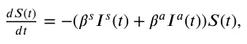

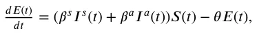

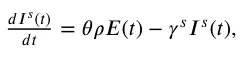

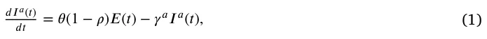

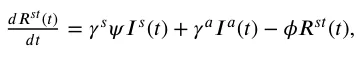

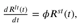

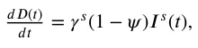

However, we treat the coefficients as probabilities rather than rates as they represent the probabilities for state transfer at the individual level [32]. As a result, Eq. (1) is a non-linear, first-order, fully dependent, stochastic ODE system with seven states. A schematic view of the transformation between the epidemiological model’s states is shown in Fig. 2.

### 2.2. Spatial sub-model

The spatial sub-model is a graph-based model *𝐺* = (*𝑉, 𝜁*). The population of workers, *𝑊* , from the temporal dynamics is allocated in some distribution to the nodes of a directed, connected graph (*𝐺*). Each node, *𝑣* ∈ *𝑉* , corresponds to a physical location that can be either a home, *ℎ*, where one or more workers are living, a firm, *𝑓*, where one or more workers are working, and a public location, *𝑝𝑙*, such as a supermarket, park, or street. Public locations are where workers spend time outside of home and work, including on the road. For example, individuals may share a bus for relatively long rides. For each step in time, each individual is moving to one of the nodes in the graph or staying in the same node, according to an inner moving policy (following the time of day). In addition, each individual has a global policy that overtakes the decision in the case of a conflict between the two policies.

<figure id="fig-2">
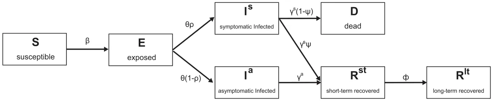
<figcaption><strong>Fig. 2.</strong> A schematic view of an individual’s transformation between epidemiological states. Initially, individuals are uninfected and susceptible to the pathogen. After being infected with rate <em>𝛽</em>, they become exposed where they are already ill but not yet infectious to others. After <em>𝜃</em> steps in time, exposed individuals become either symptomatic or asymptomatic infected with rate <em>𝑝</em>. Symptomatic infected individuals either die or recover, while asymptomatic infected individuals only recover at rates <em>𝛾</em>𝑠 and <em>𝛾</em>𝑎, respectively. After recovery, individuals are considered short-term recovered and become long-term recovered after <em>𝛷</em> steps in time.</figcaption>
</figure>

<figure id="fig-3">
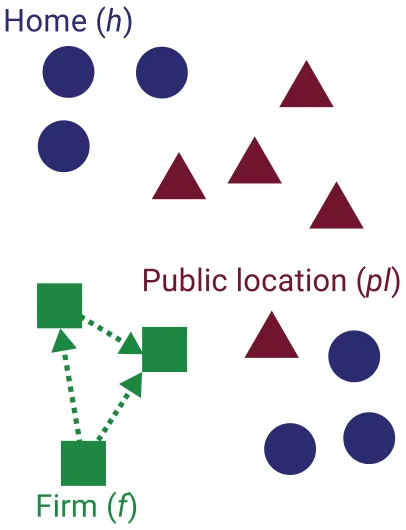
<figcaption><strong>Fig. 3.</strong> An illustration of the spatial sub-model. The blue dots, red triangulates, and green squares represent homes, public locations, and firms, respectively. The arrows indicate the trade of goods between firms. Over time, individuals move between their homes, work (at a firm), and public locations.</figcaption>
</figure>

The transition between any two nodes is assumed to be immediate and that everybody is following the same clock. Between each population movement on the graph, the temporal sub-model is performed simultaneously on all the graph’s nodes. The set of edges *𝜁⊂𝑉* × *𝑉* represents which firm is selling to which firm. The movement of individuals over the locations *𝑉* is defined to be on a fully connected graph — namely, each individual can move to any node at any point in time. An example to a graph *𝐺* is shown in Fig. 3.

### 2.3. Economic sub-model

The economic sub-model is based on supply–demand networks between firms in the (closed) economy. Concerned with counting the total amount of goods and services produced within the economy, we refer to the income method and sum the labor compensation plus profit of firms.

In Eq. (2), 𝑑𝑂(𝑡) is the dynamic amount of output (by value) indi- *𝑑𝑡* viduals and firms produce over time. It is affected by the following two terms: (1) Each worker produces a unique product depending on the firm in which he is employed and (2) Each firm makes profits of which a portion *𝜆* is paid back to the state as a tax:

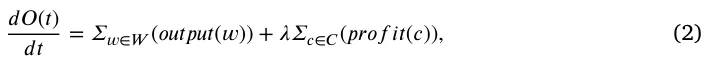

where *𝑜𝑢𝑡𝑝𝑢𝑡* ∶ *𝑤* → R+ is a functional mapping of a worker to his average output per hour (productivity value), taking into account the epidemiological state of the worker as a coefficient to the original average output of the worker as follows:

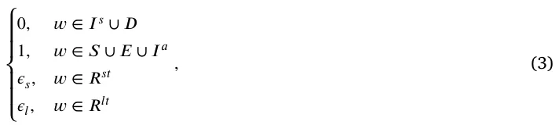

where *𝜖*𝑠*, 𝜖*𝑙 ∈[0*,* 1] are sickness parameters of the model, *𝑐* ∈ *𝐶* is all the firms in the economy, and *𝑝𝑟𝑜𝑓 𝑖𝑡* ∶ *𝑐* → R+ is a functional mapping of a firm to its current average hourly profit.

Each firm, *𝑐* ∈ *𝐶*, aims to maximize its profit at any given point in time and has a line of products {*𝜙*𝑖}𝑘 𝑖=0 such that each product, *𝜙*𝑖, produces an average profit which is calculated as the delta between the average price of the product and the average cost to produce it. We assume the price of products is constant in time and that every consumer buys the product at the same price from the firm. Each firm can buy as many raw materials, (*𝜌*𝑖), from its vendors as they can provide or less, and aims to sell as many products as possible. Each product depends on a different amount of raw materials.

Therefore, it is possible to describe the decision-making process of the number of products a firm should produce at each point of time as an optimization problem with constraints as follows. The target function of a firm is to generate as much profit as possible. As a result, it takes the form:

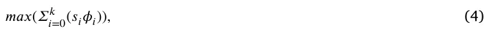

where *𝑠*𝑖 is the amount of product *𝜇*𝑖 the firm offers to sell with profit *𝜙*𝑖. In addition, the production of products is made of a sum of the required raw materials and processing effort. Therefore, in order to produce a product, *𝜇*𝑖, there is a condition of the form:

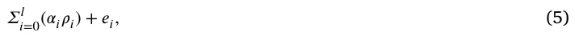

where *𝛼*𝑖 is the amount of raw materials, *𝜌*𝑖, and *𝑒*𝑖 is the amount of processing required. At each point in time, a firm is constrained by the amount of raw materials their vendors are selling, which takes the form

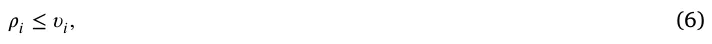

where *𝜐*𝑖 is the total amount of raw materials, *𝜌*𝑖, all the vendors are selling together at some point in time. In addition, the firm has a limited number of workers that can perform the processing of a product, which takes the form:

*𝛴*𝑘 𝑖=0(*𝑠*𝑖*𝑒*𝑖) ≤ *𝜉,* (7)

such that *𝜉* = *𝛴*𝑛 𝑖=0(*𝑜𝑢𝑡𝑝𝑢𝑡*(*𝑤*𝑖)), where *𝑛* is the daily number of hours of all employees of the firm.

<figure id="fig-4">
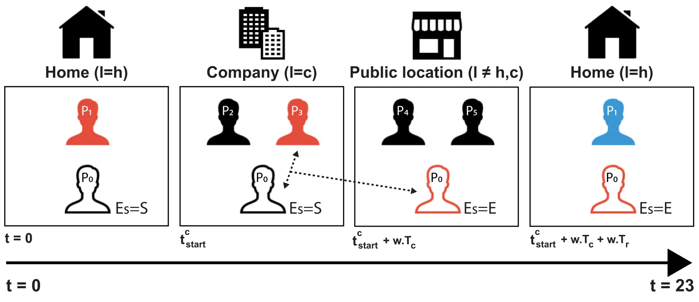
<figcaption><strong>Fig. 4.</strong> A schematic view of an individual’s spatial and epidemiological dynamics. The figure illustrates the course of the day of some worker (<em>𝑃</em>0). This worker is marked by his contour unlike the others. First, he starts at home and may interact with the other individuals at home (for example <em>𝑃</em>1). In this example, <em>𝑃</em>0 is not infected by <em>𝑃</em>1. Afterward, he goes to work at <em>𝑡</em>𝑐 𝑠𝑡𝑎𝑟𝑡 and spends there <em>𝑤.𝑇</em>𝑐 time. In the illustration, worker <em>𝑃</em>0 has been infected from worker <em>𝑃</em>3. In addition, while at work, the worker produces output of <em>𝑜</em>⋅<em>𝑤.𝑇</em>𝑐. Following that, he goes to a public location at <em>𝑡</em>𝑐 𝑠𝑡𝑎𝑟𝑡 + <em>𝑤.𝑇</em>𝑐 and spends there <em>𝑤.𝑇</em>𝑟 time. Finally, he goes back home at <em>𝑡</em>𝑐 𝑠𝑡𝑎𝑟𝑡 + <em>𝑤.𝑇</em>𝑐 + <em>𝑤.𝑇</em>𝑟 and stays there until the end of the day. One can notice that worker <em>𝑃</em>1 transformed from infected into short-term recovered in the meantime. The red shaped color indicates infected individuals (<em>𝐸</em>𝑠 ∈{<em>𝐸, 𝐼</em>𝑠<em>, 𝐼</em>𝑎}), blue indicates short-term recovered individuals (<em>𝐸</em>𝑠 = <em>𝑅</em>𝑠𝑡), and black indicates susceptible individuals (<em>𝐸</em>𝑠 = <em>𝑆</em>).</figcaption>
</figure>

### 2.4. Simulation implementation

In order to numerically solve the proposed model, we implement it using the agent-based approach [33]. Specifically, we define two main entities and the interactions between them. First, the worker entity operates as an individual in the population and contributes to the production of goods in a firm. Second, the firm entity aims to maximize its profit. A detailed description of the entities is given below. The simulation is developed using the Python [34] programming language.

#### 2.4.1. Worker 𝑤

A worker entity is defined by a tuple, *𝑤*∶=(*𝐸*𝑠*, 𝜏, 𝑙, ℎ, 𝑐, 𝑜, 𝑇*ℎ*, 𝑇*𝑐*, 𝑡*𝑐 𝑠𝑡𝑎𝑟𝑡), where *𝐸*𝑠 is the epidemiological state of the worker, *𝜏* is an inner clock that counts the passing of time from the last change in the epidemiological state, *𝑙* is the location (corresponding to the node’s index) of the worker, *ℎ* is the node index where the worker’s home is located, *𝑐* is the node index where the worker’s work place is located, *𝑜* is the worker’s average hourly output, *𝑇*ℎ is the duration in hours an individual spends in a row at home, *𝑇*𝑐 is the duration in hours an individual spends in a row at work during a day, and *𝑡*𝑐 𝑠𝑡𝑎𝑟𝑡 is the time of the day the worker’s shift in the firm *𝑓* is starting. Consequently, *𝑇*𝑟 ∶= 24 − *𝑇*ℎ − *𝑇*𝑐 is the duration of hours an individual spends in a row at random public locations. Therefore, an individual is performing a semi-random walk on the graph *𝐺* according to Eq. (8).

*𝑙𝑜𝑐𝑎𝑡𝑖𝑜𝑛*(*𝑤, 𝑡*)

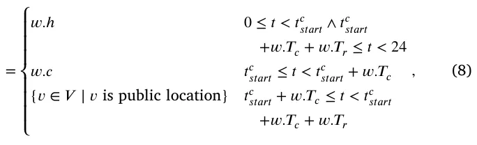

where *𝑙𝑜𝑐𝑎𝑡𝑖𝑜𝑛* ∶(*𝑤,* N) → R is a function deriving the location of a given worker *𝑤* at time *𝑡*.

In addition, the epidemiological state of individual changes is due to the following events. First, if an individual is susceptible and interacts with an infected individual he has a probability of *𝛽* to become exposed. Second, the epidemiological state of an individual changes spontaneously following Eq. (9).

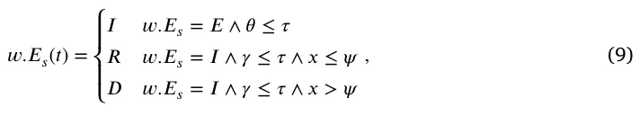

where *𝑥* ∼ *𝑈*[0*,* 1] is a random variable uniformly distributed between 0 and 1.

A schematic view of an individual’s spatial and epidemiological dynamics is shown in Fig. 4.

#### 2.4.2. Firm 𝑓

A firm entity is defined by a tuple *𝑓* = (*𝜔, 𝜈,* P*, 𝑑*𝑡) where *𝜔⊂𝑊* is the set of workers, *𝜈* = {*𝑓*𝑗 ∈ *𝐹* ∣(*𝑓*𝑗*, 𝑓*) ∈ *𝜁* ∈ *𝐺*} is a set of all vendors, P is the set of all products a firm can produce and sell, and *𝑑*𝑡 ∈ N is the rate a firm makes a decision. In order to optimally solve the decision-making problem for each firm, we use the *Simplex* algorithm [35] since it is deterministic, and promised to converge to the optimal solution in the case the space representing the problem is convex, which is assumed to be our case. In addition, this algorithm is widespread and therefore its implementation in Python31 is efficient and fast — which plays a center parameter of choosing the algorithm in large and complex systems.

#### 2.4.3. Scheduler

The model has a synchronized clock. With each clock tick (marked by *𝑡*𝑖 for the *𝑖*𝑡ℎ tic) the following three actions take place:

1. The population of workers, *𝑊* , is moving heterogeneously for each individual on the graph according to Eq. (8).
2. For each individual in the population, in a random order, Eq. (9) and a pair-wise infection interaction with other individuals allocated in the same node, *𝑣* ∈ *𝐺*, are performed.
3. For each firm, *𝑓* ∈ *𝐹*, the firm decides how much product to generate and sell (and therefore to buy). The order of the computation is obtained once at the beginning of the simulation using a topological sort of the supply chains.

## 3. Results

Based on the proposed model, we examined the performance of the simulation on yearly data for the state of Israel. We collected socio-economic data for the year 2016 (due to input–output data availability) and estimated the spread of the COVID-19 pathogen and its effect on the domestic supply networks among 19 major sectors of the Israeli economy, using input–output tables obtained from the Central Bureau Of Statistics of Israel.2 This approach has been reinforced both by academic studies (please see details in the introductory chapter) and by field studies done on the subject by the Central Bank of Israel and the Israeli Ministry of Finance.3

<figure class="table-figure" id="table-1">
<figcaption><strong>Table 1</strong> Model parameter description, symbols, and values taken from Lazebnik et al. [36].</figcaption>

<table><tr><th>Parameter definition</th><th>Symbol</th><th>Value</th></tr><tr><td>The average rate of transition (transmission) of symptomatic infected individual to a recovered individual in hours [𝑡−1]</td><td>𝛾𝑠</td><td>0.0066</td></tr><tr><td>The average rate of transition (transmission) of asymptomatic infected individual to a recovered individual in hours [𝑡−1]</td><td>𝛾𝑎</td><td>0.021</td></tr><tr><td>The average rate a susceptible individual becomes infected due to direct contact with a symptomatic infected individual in hours [𝑡−1]</td><td>𝛽𝑠</td><td>0.0088</td></tr><tr><td>The average rate a susceptible individual becomes infected due to direct contact with an asymptomatic infected individual in hours [𝑡−1]</td><td>𝛽𝑎</td><td>0.0088</td></tr><tr><td>The average rate an exposed individual becomes either a symptomatic or asymptomatic infected individual in hours [𝑡−1]</td><td>𝜃</td><td>0.0208</td></tr><tr><td>The probability that an individual will be asymptomatic [1]</td><td>𝜌</td><td>0.2624</td></tr><tr><td>The probability of an infected individual recovering from the disease [1]</td><td>𝜓</td><td>0.99</td></tr><tr><td>The rate that short-term recovered individual becomes long-term recovered in hours [1]</td><td>𝜙</td><td>0.0005</td></tr><tr><td>The reduction in worker productivity when the worker is short-term recovered [1]</td><td>𝜖𝑠</td><td>0.95</td></tr><tr><td>The reduction in worker productivity when the worker is long-term recovered [1]</td><td>𝜖𝑙</td><td>1</td></tr></table>

</figure>

### 3.1. Experiment setup

The simulation is based on the proposed model (see Section 2). First, we initialized a population of size *𝑁* = 2*,* 000*,* 000. All the individuals are set to be susceptible except 10 random individuals that are set to be exposed. We chose 10 individuals in order to reduce the probability that the pandemic will fade out. For example, if only one individual is exposed it can recover before infecting others. However, for multiple individuals, the probability for such a case is reduced significantly. The epidemiological sub-model’s parameter is taken to represent an airborne with long immune system response disease, such as the COVID-19 pandemic. A summary of the parameters is shown in Table 1.

The population was randomly allocated to 988100 nodes that represent homes in a graph *𝐺*, at the beginning of the simulation. In addition, 100000 nodes in graph *𝐺* are allocated to be public locations. Moreover, 1900 nodes are allocated to be firms, such that each industry has 100 nodes (except industry **𝐓**). Therefore, *𝐺* is a fully connected graph with one million nodes. The sizes were chosen schematically to represent the scale of the population due to the lack of data on the distribution of the population and where each individual lives and works.

Moreover, a firm (as a workplace) is allocated to each individual in a probability equal to the number of workers in this industry divided by the number of workers in the entire economy. Furthermore, the start working time (*𝑡*𝑐 𝑠𝑡𝑎𝑟𝑡) and working duration (*𝑇*𝑐) are allocated according to the industry as shown in Table 2. Additionally, we set *𝑇*ℎ ∶= 22 −*𝑇*𝑐 leaving two hours a day on average for individuals to be in public locations [37]. On top of that, we assume the hourly output of all individuals is equal (regardless of industry).

Furthermore, each firm has vendors and products it sells as a vendor itself. According to the Central Bureau of Statistics of Israel, we assume each industry has an abstract product, *𝑝*𝑖, that it sells. The product *𝑝* is assumed to be continuous rather than discrete and provides a *𝜙* profit, defined as the overall profit divided by the amount of product *𝑝*𝑖 in optimal conditions (i.e., without any pandemic). Similarly, the amount of processing required for each unit of product *𝑝*𝑖 is defined by the total yearly worker’s wage divided by the amount of product *𝑝*𝑖. In addition, the raw materials used for each product *𝑝*𝑖 are computed similarly to the sales of the product itself.

### 3.2. Baseline dynamics

To obtain a benchmark for the epidemiological-economic dynamics, we run the proposed simulation for two cases: without a pandemic outbreak and with a pandemic but without any IPs. The case without a pandemic outbreak defines the baseline performance of the economy (Eq. (2)). The case with a pandemic defines the baseline performance of the economy during a pandemic where the government does not perform any IPs. Hence, the delta between the two cases defines the loss to the economy as a result of a pandemic outbreak. The results of this analysis are shown in Fig. 5(a), where Fig. 5(b) reflects the reduction in percentage for each industry from the baseline output.

### 3.3. Intervention policies

We evaluate the influence on the economic loss of two intervention policies known to be effective in reducing contagion, worker separation [38] and vaccination [39].

#### 3.3.1. Workers separation intervention policies

One can divide worker separation intervention policies (IP) into two main groups: *capsules* and *work from home*. In the case of the *capsules* IP, the workers of each firm are randomly divided into two groups such that each even day the first group is working while the second group does not and stays at home. On odd days, the second group is working while the first group stays at home. Likewise, in the case of the *work from home* IP, each day, a percent of the individuals in each firm worked from home at random while the remaining population goes to work. Unlike the *capsules* IP, each industry has a productivity coefficient at which individuals that are working at home are producing output. Consequently, individuals working from home contribute to the product’s processing.

The influence of each IP on the industry-level loss due to the pandemic is shown in Fig. 6, where the *𝑥*-axis is the industry’s symbol and the *𝑦*-axis is the difference in percentages from the case of the economy without a pandemic.

<figure id="fig-5">
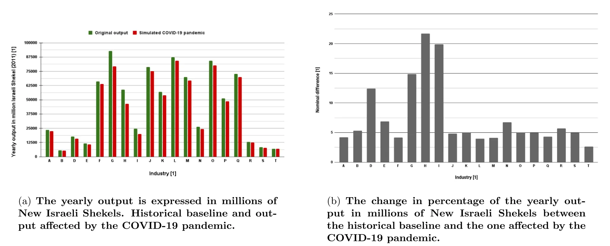
<figcaption><strong>Fig. 5.</strong> The industry’s output reduction due to the pandemic compared to the output without the pandemic. The industries are described in Table 2.</figcaption>
</figure>

<figure id="fig-6">
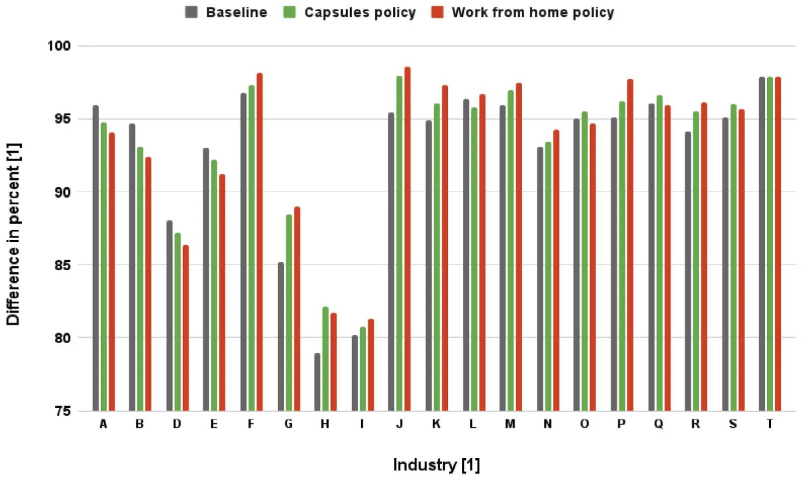
<figcaption><strong>Fig. 6.</strong> The industry’s output reduction due to the pandemic, divided by the worker’s separation policies and the baseline. The industries are described in Table 2.</figcaption>
</figure>

A summary of the total loss to the economy is provided in Table 3. One can notice that the capsules IP reduces the economic loss from 7.31% to 6.12% (improvement of 1.19 percentage points). Moreover, the work from home IP reduces the economic loss from 7.31% to 5.91% (improvement of 1.4 percentage points), while affecting only 12% of the working population compared to 50% with the capsules IP.

#### 3.3.2. Vaccination policy

Vaccination is known as a useful IP to prevent the spread of viruses, thus minimizing the economic loss that accompanies an outbreak. We implement the vaccination IP by transforming suspicious individuals into short-recovered individuals at the beginning of the simulation. Namely, changing the initial condition of Eq. (1).

For the vaccination IP, we obtain three cases. First, where 50% of the population is randomly vaccinated. This case provides an analysis of the average reduction in the damage to the economy assuming suboptimal herd immunity. Second, where one industry at a time is fully vaccinated. This case allows us to analyze the undefended supply and demand with other industries’ contribution of vaccinating each industry by itself. Finally, where one industry at a time is fully vaccinated and 50% of the remaining population is randomly vaccinated. This case allows us to evaluate the contribution of vaccinating each industry by itself, including the results of the dynamic from the supply and demand with other industries.

The results are shown in Fig. 7, where the *𝑥*-axis is the industry and the *𝑦*-axis is the economic improvement from baseline in percent. There is a 2.81 percentage points overall reduction in the output loss compared to the baseline for the case where 50% of the population is randomly vaccinated, as shown in Fig. 7(a). In addition, for easier comparison, Figs. 7(b) and 7(c) are provided with the same scale in the appendix.

#### 3.3.3. Integration of intervention policies

While choosing only one intervention policy tilts the scale clearly towards the use of vaccines, it is interesting to examine the effect of incorporating two intervention policies on the magnitude of output loss. To this end, Fig. 8 presents the percentage of output loss in response to integrating the work from home and vaccination PIPs on the *𝑥*-axis and *𝑦*-axis, respectively. The results are shown as the average of *𝑛* = 100 repetitions, as the implementation of both PIPs is random and greatly affected by the chosen sub-population, as already revealed in the previous results. Namely, different percentages of the population with PIPs have different outcomes, and by averaging multiple cases, we obtain a representative value. To attain an analytical approximation of Fig. 8, we utilize the Scientist-Machine Equation Detector (SciMED),4 resulting in the following equation [40]:

<figure class="table-figure" id="table-2">
<figcaption><strong>Table 2</strong> The distributions of start time and work duration of workers per industry, such that <em>𝑈</em>(<em>𝑎, 𝑏</em>) is the uniform distribution between <em>𝑎</em> and <em>𝑏</em>, and <em>𝑁</em>(<em>𝜇, 𝜎</em>) are is the normal distribution with mean <em>𝜇</em> and standard deviation <em>𝜎</em>. For example, for Industry <strong>A</strong>, workers uniformly start their working day between 4am and 7am and work for 9 to 14 h (uniformly distributed). The values in the table were estimated based on self-reporting hours of three random workers from each industry, interviewed personally. The workers were asked to describe when they and their colleagues start to work and for how long on average. The results are the mean values, rounded for full hours. The distributions are manually allocated to represent a general but simple rule (i.e., uniform or normal distribution) according to the reported data by the workers.</figcaption>

<table><tr><th>Symbol</th><th>Industry</th><th>𝑡𝑐 𝑠𝑡𝑎𝑟𝑡</th><th>𝑇𝑐</th></tr><tr><td>A</td><td>Agriculture, forestry and fishing</td><td>𝑈(4, 7)</td><td>𝑈(9, 14)</td></tr><tr><td>B</td><td>Mining and quarrying</td><td>𝑈(8, 10) ∪𝑈(20, 22)</td><td>𝑈(4, 6) ∪𝑈(10, 12)</td></tr><tr><td>D</td><td>Power supply</td><td>𝑈(8, 11) ∪𝑈(16, 19)</td><td>𝑈(7, 12)</td></tr><tr><td>E</td><td>Water supply</td><td>𝑈(8, 11) ∪𝑈(16, 19)</td><td>𝑈(7, 12)</td></tr><tr><td>F</td><td>Construction</td><td>𝑈(6, 9)</td><td>𝑈(7, 10)</td></tr><tr><td>G</td><td>Wholesale and retail trade services</td><td>𝑈(7, 11)</td><td>𝑈(5, 14)</td></tr><tr><td>H</td><td>Transportation, storage, and mail services</td><td>𝑈(7, 11)</td><td>𝑈(5, 14)</td></tr><tr><td>I</td><td>Accommodation and food services</td><td>𝑈(6, 10) ∪𝑈(12, 18)</td><td>𝑈(6, 14)</td></tr><tr><td>J</td><td>Information and communication services</td><td>𝑈(7, 10) ∪𝑈(16, 20)</td><td>𝑈(7, 12)</td></tr><tr><td>K</td><td>Financial and insurance services</td><td>𝑈(7, 10)</td><td>𝑈(7, 12)</td></tr><tr><td>L</td><td>Real estate activities</td><td>𝑈(7, 10)</td><td>𝑈(7, 12)</td></tr><tr><td>M</td><td>Professional Services</td><td>𝑁(9, 1)</td><td>𝑁(9, 1)</td></tr><tr><td>N</td><td>Management and support services</td><td>𝑁(9, 2)</td><td>𝑁(9, 2.5)</td></tr><tr><td>O</td><td>Public and social administration</td><td>𝑈(7, 9)</td><td>𝑁(5, 10)</td></tr><tr><td>P</td><td>Education</td><td>𝑈(7, 10)</td><td>𝑁(7, 1.5)</td></tr><tr><td>Q</td><td>Health services</td><td>𝑈(6, 10) ∪𝑈(17, 20)</td><td>𝑁(11, 2)</td></tr><tr><td>R</td><td>Art and entertainment</td><td>𝑈(8, 11) ∪𝑈(18, 23)</td><td>𝑁(8, 3)</td></tr><tr><td>S</td><td>Other services</td><td>𝑁(9, 1)</td><td>𝑁(9, 1)</td></tr><tr><td>T</td><td>Households as employers</td><td>𝑁(7, 1)</td><td>𝑁(10, 3)</td></tr></table>

</figure>

<figure class="table-figure" id="table-3">
<figcaption><strong>Table 3</strong></figcaption>

<table><tr><th>The worker separation policy average damage to the</th><th>economy across industries. For the</th><th>work from home policy, 12%</th></tr><tr><td>is taken as the weighted average (weights are set</td><td>to be the portion of the industry</td><td>size from the whole economy)</td></tr><tr><td>of the average work from home percent during two</td><td>months during the COVID-19</td><td>pandemic in Israel (2020).</td></tr><tr><td>Policy Baseline</td><td>Capsules</td><td>Work from home</td></tr><tr><td></td><td>(2 capsules for all industries)</td><td>(12% for all industries)</td></tr><tr><td>Damage to the economy in percents 7.31%</td><td>6.12% (+1.19%)</td><td>5.91% (+1.4%)</td></tr></table>

</figure>

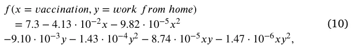

with a coefficient of determination of *𝑅*2 = 0*.*93. This result strengthens the hypothesis that combining the two interventions leads to better results as shown by the negative coefficients of the terms *𝑥𝑦* and *𝑥𝑦*2 compared to limiting the use for only one of them. Furthermore, it can be seen that the direct marginal contribution of vaccination to reducing output loss due to the pandemic exceeds that of working from home intervention policy (approximately 4.5 times), as revealed by the coefficients of the *𝑥* and *𝑦* terms.

#### 3.3.4. Supply chain effect

Due to the interconnectivity between the industries, a reduction in the production of one industry causes less supply. This process starts to damage the ability of other industries to provide their product when the demand is higher than the supply. To evaluate these processes, we calculate the case where there are no IPs and 33% of the production of one industry is currently artificially closed, as shown in Fig. 9(a). The effect of a 66% decrease in production is shown in Fig. 9(b).

Both Figs. 9(a) and 9(b) show only the influence of one industry on the following industries. This is because the influence of the industries is computed by order. As such, any industry *𝑖* that is computed before industry *𝑗* has a second-level effect from the reduction from industry *𝑗*. This dynamic yields a more chaotic behavior of the influence which does not accurately represent the true results in a small number of repetitions. Due to the lack of the required computational resources, we decided to reduce these results.

## 4. Discussion

To examine the impact of intervention policies, in the event of an outbreak of a pandemic, on domestic supply networks and to estimate the consequent damage to output at the industry level, we developed an *in silico* computer simulation based on three mathematical models and the interactions between them. First, a SIR-based epidemiological (temporal) model with four extensions: dead (D) state, exposed (E) state, infected (I) state divided into asymptomatic and symptomatic infected (*𝐼*𝑎*, 𝐼*𝑠), and recovered (R) state divided into short-term and long-term recovered (*𝑅*𝑠𝑡*, 𝑅*𝑙𝑡). Second, a spatial sub-model based on a directed walk on a graph. And last, a non-linear economic sub-model is used to measure economic loss during an outbreak, using input–output tables and domestic supply networks to study the damage caused as a result of intervention measures, as a government policy, to limit the spread of the pathogen.

Since an external validation of the proposed model is infeasible, as one cannot actively set up the same initial condition multiple times and see if the model correctly predicts the course of the dynamics. As such, the validation of the proposed model relies on the ability of each component of the model to correctly capture the sub-dynamics of the system they represent alongside the assumption that the interconnection of these components does not drive statistically significant dynamics (i.e., mostly independent). Thus, one should show that the proposed Spatio-temporal epidemiological sub-model (see Sections 2.1 and 2.2) and the economic sub-model are well representing the epidemiological and economic dynamics in the discussed case. Indeed, a large body of work conducted supports these claims [41–51]. Hence, one can treat the following results as a good approximation while taking caution due to stochastic nature of the dynamics.

<figure id="fig-7">
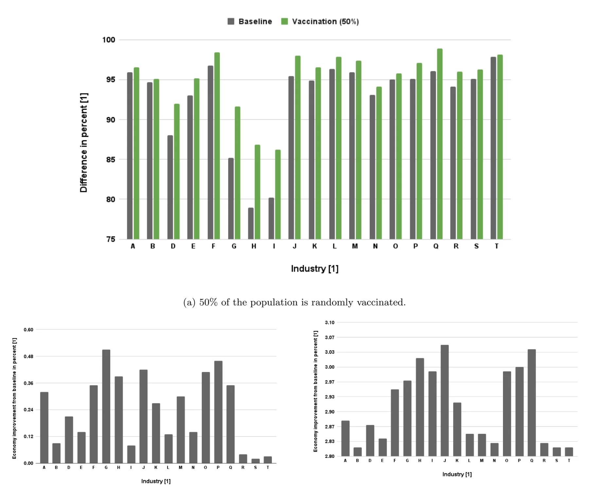
<figcaption><strong>Fig. 7.</strong> The improvement in percentages when applying the vaccination intervention policy, compared to the historical baseline. Three vaccination strategies were analyzed with their yearly output improvement for each industry taken from Table 2.</figcaption>
</figure>

<figure id="fig-8">
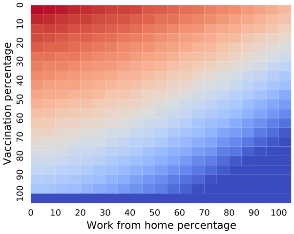
<figcaption><strong>Fig. 8.</strong> Integration of work from home and vaccination intervention policies and their effect on output loss percentage due to the pandemic outbreak, compared to the historical record with the COVID-19 pandemic without any intervention policy, on average.</figcaption>
</figure>

As a *benchmark* for our analysis, we assumed first that the government does not intervene during the outbreak (i.e., no IP). The model shows that in this case, 7.31 percent of the output is reduced compared to the case where there is no pandemic, as shown in Fig. 5(b) and Table 3. Moreover, one can notice that the most significant loss (as a percentage of output) is among the accommodation and food services (**I**) and transportation, storage, and mail services (**H**). A possible explanation for this result can be found through output–input relationships between industries. Like the other industries, these two industries are also affected due to the pandemic outbreak. However, they experience secondary loss effect as a result of their close ties with the rest of the industries, and their dependence (in terms of revenue) on the continuous functioning of the rest of the firms in the economy.

Moreover, we simulated the effect of three IPs – capsules, work from home, and vaccination – on the damage a pandemic could inflict to output at the industry level and the entire economy. The two spatial IPs, *capsules* and *work from home*, have been evaluated as shown in Figs. 6. The model predicts that the *capsules* IP could reduce the output loss by 1.19 percentage points compared to the baseline case. This loss reduction can be associated with the faster ending of the pandemic. Since workers in the capsule are not allowed to socialize with their friends from another capsule, the chances of contagion between colleagues are small, the work sequence is not interrupted, and the damage to productivity decreases. However, the decrease in output loss is not significant. This results from the work outline in capsules where only half of the workers are employed on any given day. Likewise, the model predicts that the *work from home* IP reduces the output loss by 1.4 percentage points compared to the baseline. The additional 0.31 percentage points improvement (compared to the capsules IP result) is related to the ability of some industries to allow work from home without affecting the production capabilities. For example, internet-related firms can allow most of their employees to work from home without a significant reduction in productivity capabilities [52].5 However, as shown in Fig. 7(a), the vaccination IP may significantly reduce the loss of output, particularly among industries that require close customer–seller contacts, such as accommodation and food services (I) and transportation, storage, and mail services (H). Even when vaccinating just one industry, the mean output loss reduction is around 0.19, as shown in Fig. 7(b). This result, as expected, intensifies as the rate of industries in which workers have vaccinated increases, thus increasing the performance of supply and demand networks, as shown in Fig. 7(c). Of course, as with any analysis based on comparative statics, it should be remembered that the results are based on the assumption that all other variables are constant. Moreover, the existence of mediator, moderator, and confounder variables may lead to different conclusions. Follow-up studies can examine this interesting and non-trivial issue.

<figure id="fig-9">
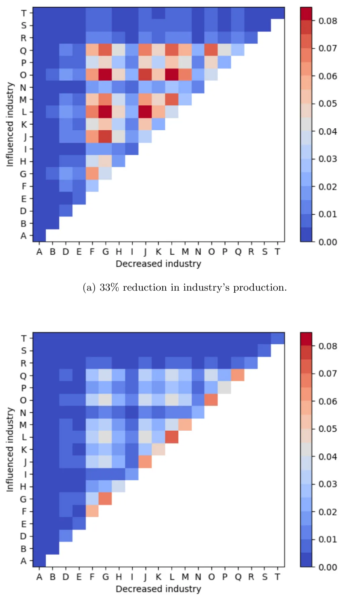
<figcaption><strong>Fig. 9.</strong> The industry’s output reduction due to the pandemic without intervention policy, compared to the historical baseline.</figcaption>
</figure>

Furthermore, in situations where decision-makers are obliged to choose a single intervention path, due for example to economic or social limitations, the vaccination campaign has priority over the other intervention policies reviewed in the study. However, when it is possible to use combinations between the interventions, Fig. 8 indicates a distinct advantage in favor of integrations between PIPs. As can be seen, the work from home PIP is demonstrated to mitigate output loss during an outbreak for any vaccination percentage among the population and vice versa. This conclusion can prove to be of the utmost importance, in particular in situations where access to a sufficient amount of vaccines is limited or financing a large-scale vaccination operation is not feasible due to budgetary limitations [53].

Moreover, we evaluated the influence of output reduction in one industry on the other through two cases — 33% and 66%, as shown in Fig. 9. In the case of a 33% decrease in output, the most significant output loss was observed among the largest industries (as a percentage of total output in the economy (see Fig. 1 in the Appendix)) and among the industries that have the most input–output relationships with the rest of the firms in the economy. This happens since larger industries are more dependent on the other industries and therefore a decrease in one of them produces more damage to the dependent industry. Similarly, as an industry is more connected, a change in one of its vendors has a more non-direct influence on the industry. In the case of 66% reduction, the industries that are mostly influenced are the same industries with the reduction itself, a gradient by size out of the whole economy. This can be explained since a 66% reduction shifts the dependency of the other industries too much in this industry, resulting in fewer acquisitions and, therefore, in even higher losses.

Our model is not without limitations. First, there is a data limitation that accompanies any empirical study. The model requires the use of input–output tables that are often not updated to the present. For example, in our study, the data in the input–output tables is for 2006. In countries where these data are not updated frequently enough, the use of the model should be done with extreme caution, out of concern that the relationships between the industries are no longer relevant. Moreover, our model assumes a closed economy. This assumption was made possible during the COVID-19 crisis due to the closing of borders in most countries around world. Other crises, even if they are great, do not necessarily require the closing of borders, so the application of the model in this situation is not possible. In this situation, the model should take into account the impact of international trade and international supply chains on the industries in the economy (such as in [28]).

Another limitation concerns our assumption regarding vaccine efficacy. Of course, the use of different types of vaccines and different ways of administering the vaccines (such as the time differences between the first and second doses of the vaccination) may affect the results of the model. Moreover, the introduction of a distancing policy is not a guarantee that the public will obey the instruction [54]. The difference in the degree of citizens’ obedience to the government’s instructions between countries may be an important element in determining the degree of economic damage.

## 5. Conclusion

During global epidemiological crises, lockdown and border closures can disrupt the functioning of international supply chains. Since global supply chains are a central pillar of every economy, they have the potential to serve as a relay through which crises are transmitted across countries. This magnifies the importance of implementing intervention and restriction policies that do not aggravate economic loss by over-disrupting the country’s domestic supply chains.

This paper quantifies the role of intervention policies in the economic impact of a pandemic outbreak in an economy where sectors are complements throughout the input–output network and domestic supply chains. In particular, we examine the influence of work-capsules, work from home, vaccination, and industry-closure, on the damage pandemic could inflict to output at the industry level and the entire economy.

In the case of a future global pandemic outbreak, researchers will be able to use the provided analysis on the consequences of three IPs (capsules, work from home, and vaccination) on the reduction of the damage to a close, multi-sectoral economy. The model is implemented for the COVID-19 pandemic as it affected Israel’s economy in 2016 (due to the data availability). Future work should take into consideration the product dependency between firms and industries. For example, in the current form of the model, there is a reduction in industries **A** and **D** (agriculture and power supply) for the *work from home* IP because the model does not take into consideration the changes in food and power consumption as a result of the IP. These processes may alter the results for some industries and for the economy as a whole.

## Declaration of competing interest

The authors declare that they have no known competing financial interests or personal relationships that could have appeared to influence the work reported in this paper.

## Data availability

The data that support the findings of this study are openly available on CBS Site at: https://www.cbs.gov.il/en/publications/Pages/2014/Input-Output-Tables-2006.aspx.

The proposed simulator’s code is available in the project’s Github repository: https://github.com/teddy4445/economical-covid-simulator -graphs.

## Funding

This research did not receive any specific grant from funding agencies in the public, commercial, or not-for-profit sectors. The authors have no relevant financial or non-financial interests to disclose.

## Appendix A. Supplementary data

Supplementary material related to this article can be found online at https://doi.org/10.1016/j.seps.2023.101553.

## Notes

1 A Scipy library implementation of the Simplex algorithm: https://docs.scipy.org/doc/scipy/reference/optimize.linprog-simplex.html.

2 Data is available at https://www.cbs.gov.il/he/publications/doclib/2014/1561/pdf/t02\_03c.pdf.

3 Please refer to: https://www.boi.org.il/en/NewsAndPublications/PressReleases/Pages/25-3-2021b.aspx.

4 SciMED is a free open-source library in Python available through https: //github.com/LironSimon/SciMED.

5 https://www.taubcenter.org.il/wp-content/uploads/2021/01/theabilitytoworkfromhomeamongworkersinisraeleng.pdf

## References

1. Strange R. The 2020 COVID-19 pandemic and global value chains. J Ind Bus Econ 2020;47:455–65. [link](http://refhub.elsevier.com/S0038-0121%2823%2900053-8/sb1)
2. Guan D, Wang D, Hallegatte S, Davis SJ, Huo J, Li S, et al. Global supply-chain effects of COVID-19 control measures. Nat Hum Behav 2020;4(6):577–87. [link](http://refhub.elsevier.com/S0038-0121%2823%2900053-8/sb2)
3. Ivanov D. Predicting the impacts of epidemic outbreaks on global supply chains: A simulation-based analysis on the coronavirus outbreak (COVID-19/SARS-CoV-2) case. Transp Res Part E: Logist Transp Rev 2020;136:101922. [link](http://refhub.elsevier.com/S0038-0121%2823%2900053-8/sb3)
4. Bonadio B, Huo Z, Levchenko AA, Pandalai-Nayar N. Global supply chains in the pandemic. Working paper series 27224, National Bureau of Economic Research; 2020. [link](http://refhub.elsevier.com/S0038-0121%2823%2900053-8/sb4)
5. Gunessee S, Subramanian N. Ambiguity and its coping mechanisms in supply chains lessons from the Covid-19 pandemic and natural disasters. Int J Opera Prod Manag 2020. [link](http://refhub.elsevier.com/S0038-0121%2823%2900053-8/sb5)
6. Paul SK, Chowdhury P. A production recovery plan in manufacturing supply chains for a high-demand item during COVID-19. Int J Phys Distrib Logist Manage 2020. [link](http://refhub.elsevier.com/S0038-0121%2823%2900053-8/sb6)
7. Cariappa AA, Acharya KK, Adhav CA, Sendhil R, Ramasundaram P, Kumar A, et al. COVID-19 induced lockdown effect on wheat supply chain and prices in India–Insights from state interventions led resilience. Socio-Econ Plan Sci 2022;101366. [link](http://refhub.elsevier.com/S0038-0121%2823%2900053-8/sb7)
8. Almulhim T, Barahona I. An extended picture fuzzy multicriteria group decision analysis with different weights: A case study of COVID-19 vaccine allocation. Socio-Econ Plan Sci 2022;101435. [link](http://refhub.elsevier.com/S0038-0121%2823%2900053-8/sb8)
9. Barrot J-N, Grassi B, Sauvagnat J. Sectoral effects of social distancing. In: AEA papers and proceedings. 111, 2021, p. 277–81. [link](http://refhub.elsevier.com/S0038-0121%2823%2900053-8/sb9)
10. Bekkers E, Koopman RB. Simulating the trade effects of the COVID-19 pandemic: Scenario analysis based on quantitative trade modelling. World Econ 2022;45(2):445–67. [link](http://refhub.elsevier.com/S0038-0121%2823%2900053-8/sb10)
11. Baqaee D, Farhi E. Nonlinear production networks with an application to the COVID-19 crisis. Working paper series 27281, National Bureau of Economic Research; 2020. [link](http://refhub.elsevier.com/S0038-0121%2823%2900053-8/sb11)
12. Baqaee D, Farhi E. Supply and demand in disaggregated keynesian economies with an application to the Covid-19 crisis. Working paper series 27152, National Bureau of Economic Research; 2020. [link](http://refhub.elsevier.com/S0038-0121%2823%2900053-8/sb12)
13. Guerrieri V, Lorenzoni G, Straub L, Werning I. Macroeconomic implications of COVID-19: can negative supply shocks cause demand shortages?. Working paper series 26918, National Bureau of Economic Research; 2020. [link](http://refhub.elsevier.com/S0038-0121%2823%2900053-8/sb13)
14. Bethune ZA, Korinek A. Covid-19 infection externalities: Trading off lives vs. livelihoods. Working paper series 27009, National Bureau of Economic Research; 2020. [link](http://refhub.elsevier.com/S0038-0121%2823%2900053-8/sb14)
15. Dasaratha K. Virus dynamics with behavioral responses. 2020, arXiv preprint arXiv:2004.14533. [link](http://arxiv.org/abs/2004.14533)
16. Pindyck RS. COVID-19 and the welfare effects of reducing contagion. Working paper series 27121, National Bureau of Economic Research; 2020. [link](http://refhub.elsevier.com/S0038-0121%2823%2900053-8/sb16)
17. Kermack WO, McKendrick AG. A contribution to the mathematical theory of epidemics. Proc R Soc 1927;115:700–21. [link](http://refhub.elsevier.com/S0038-0121%2823%2900053-8/sb17)
18. Acemoglu D, Chernozhukov V, Werning I, Whinston MD. Optimal targeted lockdowns in a multi-group SIR model. Working paper series 27102, National Bureau of Economic Research; 2020. [link](http://refhub.elsevier.com/S0038-0121%2823%2900053-8/sb18)
19. Bodenstein M, Corsetti G, Guerrieri L. Social distancing and supply disruptions in a pandemic. Quant Econ 2022;13(2):681–721. [link](http://refhub.elsevier.com/S0038-0121%2823%2900053-8/sb19)
20. Krueger D, Uhlig H, Xie T. Macroeconomic dynamics and reallocation in an epidemic: evaluating the ‘‘swedish solution’’. Working paper series 27047, National Bureau of Economic Research; 2020. [link](http://refhub.elsevier.com/S0038-0121%2823%2900053-8/sb20)
21. Quaas G. The reproduction number in the classical epidemiological model. Working Paper 167, Leipzig: Universität Leipzig, Wirtschaftswissenschaftliche Fakultät; 2020. [link](http://refhub.elsevier.com/S0038-0121%2823%2900053-8/sb21)
22. Alfaro L, Faia E, Lamersdorf N, Saidi F. Social interactions in pandemics: Fear, altruism, and reciprocity. Working paper series 27134, National Bureau of Economic Research; 2020. [link](http://refhub.elsevier.com/S0038-0121%2823%2900053-8/sb22)
23. Argente DO, Hsieh C-T, Lee M. The cost of privacy: welfare effects of the disclosure of COVID-19 cases. Working paper series 27220, National Bureau of Economic Research; 2020. [link](http://refhub.elsevier.com/S0038-0121%2823%2900053-8/sb23)
24. Fernández-Villaverde J, Jones CI. Estimating and simulating a SIRD model of COVID-19 for many countries, states, and cities. Working paper series 27128, National Bureau of Economic Research; 2020. [link](http://refhub.elsevier.com/S0038-0121%2823%2900053-8/sb24)
25. Baqaee D, Farhi E, Mina MJ, Stock JH. Reopening scenarios. Working paper series 27244, National Bureau of Economic Research; 2020. [link](http://refhub.elsevier.com/S0038-0121%2823%2900053-8/sb25)
26. Pichler A, Pangallo M, del Rio-Chanona RM, Lafond F, Farmer JD. Production networks and epidemic spreading: How to restart the UK economy? 2020, Available At SSRN: https://Ssrn.Com/Abstract=3606984. [link](https://Ssrn.Com/Abstract=3606984)
27. George A, Li C, Lim JZ, Xie T. From SARS to COVID-19: The evolving role of China-ASEAN production network. Econ Model 2021;101:105510. [link](http://refhub.elsevier.com/S0038-0121%2823%2900053-8/sb27)
28. Cakmaki C, Demiralp S, Ozcan SK, Yesiltas S, Yildirim MA. COVID-19 and emerging markets: an epidemiological model with international production networks and capital flows. IMF Working Paper, 2020. [link](http://refhub.elsevier.com/S0038-0121%2823%2900053-8/sb28)
29. Shami L, Lazebnik T. Economic aspects of the detection of new strains in a multi-strain epidemiological–mathematical model. Chaos Solitons Fractals 2022;165:112823. [link](http://refhub.elsevier.com/S0038-0121%2823%2900053-8/sb29)
30. Lazebnik T, Shami L, Bunimovich-Mendrazitsky S. Spatio-temporal influence of non-pharmaceutical interventions policies on pandemic dynamics and the economy: the case of COVID-19. In: Economic research-ekonomska istraživanja. Taylor & Francis; 2021, p. 1–29. [link](http://refhub.elsevier.com/S0038-0121%2823%2900053-8/sb30)
31. Lazebnik T, Blumrosen G. Advanced multi-mutation with intervention policies pandemic model. IEEE Access 2022;10:22769–81. [link](http://refhub.elsevier.com/S0038-0121%2823%2900053-8/sb31)
32. Cortés J-C, El-Labany SK, Navarro-Quiles A, Selim MM, Slama H. A comprehensive probabilistic analysis of approximate SIR-type epidemiological models via full randomized discrete-time Markov chain formulation with applications. Math Methods Appl Sci 2020;43(14):8204–22. [link](http://refhub.elsevier.com/S0038-0121%2823%2900053-8/sb32)
33. Macal CM. To agent-based simulation from system dynamics. In: Proceedings of the 2010 winter simulation conference. 2010, p. 371–82. [link](http://refhub.elsevier.com/S0038-0121%2823%2900053-8/sb33)
34. Srinath KR. Python – the fastest growing programming language. Int Res J Eng Technol 2017;4(12). [link](http://refhub.elsevier.com/S0038-0121%2823%2900053-8/sb34)
35. Wolfe P. The composite simplex algorithm. SIAM 1965;7(1):42–54. [link](http://refhub.elsevier.com/S0038-0121%2823%2900053-8/sb35)
36. Lazebnik T, Bunimovich-Mendrazitsky S, Shami L. Pandemic management by a spatio-temporal mathematical model. Int J Nonlinear Sci Numer Simul 2021. [link](http://refhub.elsevier.com/S0038-0121%2823%2900053-8/sb36)
37. Diffey BL. An overview analysis of the time people spend outdoors. Br J Dermatol 2010;164:848–54. [link](http://refhub.elsevier.com/S0038-0121%2823%2900053-8/sb37)
38. Di Domenico L, Pullano G, Sabbatini CE, Boëlle P-Y, Colizza V. Impact of lockdown on COVID-19 epidemic in Île-de-France and possible exit strategies. Cold Spring Harbor Laboratory Press; 2020, MedRxiv. [link](http://refhub.elsevier.com/S0038-0121%2823%2900053-8/sb38)
39. Kaplan RM, Milstein A. Influence of a COVID-19 vaccine’s effectiveness and safety profile on vaccination acceptance. Proc Natl Acad Sci USA 2021;118(10):e2021726118. [link](http://refhub.elsevier.com/S0038-0121%2823%2900053-8/sb39)
40. Simon-Keren L, Liberzon A, Lazebnik T. A computational framework for physics-informed symbolic regression with straightforward integration of domain knowledge. Sci Rep 2023;13(1):1249. [link](http://refhub.elsevier.com/S0038-0121%2823%2900053-8/sb40)
41. Atkeson A. On using SIR models to model disease scenarios for COVID-19. Q Rev Federal Res Bank Minneapolis 2020;41(1):1–35. [link](http://refhub.elsevier.com/S0038-0121%2823%2900053-8/sb41)
42. Bunimovich-Mendrazitsky S, Stone L. Modeling polio as a disease of development. J Theoret Biol 2005;237:302–15. [link](http://refhub.elsevier.com/S0038-0121%2823%2900053-8/sb42)
43. Dang Y-X, Li X-Z, Martcheva M. Competitive exclusion in a multi-strain immuno-epidemiological influenza model with environmental transmission. J Biol Dyn 2016;10(1). [link](http://refhub.elsevier.com/S0038-0121%2823%2900053-8/sb43)
44. Fukuoka T, Ito K. Exposure risk assessment by coupled analysis of CFD and SIR model in enclosed space. 2010. [link](http://refhub.elsevier.com/S0038-0121%2823%2900053-8/sb44)
45. Maryam D, Ghorabi ST, Sayehmiri K. SIR model for estimations of the coronavirus epidemic dynamics in Iran. J Biostat Epidemiol 2020;6(2):101–6. [link](http://refhub.elsevier.com/S0038-0121%2823%2900053-8/sb45)
46. Kozyreff G. Hospitalization dynamics during the first COVID-19 pandemic wave: SIR modelling compared to Belgium, France, Italy, Switzerland and New York city data. Infect Dis Model 2021;6:398–404. [link](http://refhub.elsevier.com/S0038-0121%2823%2900053-8/sb46)
47. Ambrosio B, Aziz-Alaoui MA. On a coupled time-dependent SIR models fitting with new york and new-Jersey states COVID-19 data. Biology 2020;9(6):135. [link](http://refhub.elsevier.com/S0038-0121%2823%2900053-8/sb47)
48. Bognanni M, Doug H, Kolliner D, Mitman K. Economics and epidemics: Evidence from an estimated spatial econ-sir model. In: Finance and economics discussion series 2020-091. Washington: Board of Governors of the Federal Reserve System; 2020. [link](http://refhub.elsevier.com/S0038-0121%2823%2900053-8/sb48)
49. Meltzer MI, Cox NJ, Fukuda K. The economic impact of pandemic influenza in the United States: priorities for intervention. Emerg Infect Diseases 1999;5(5):659–71. [link](http://refhub.elsevier.com/S0038-0121%2823%2900053-8/sb49)
50. Kabir M, Afzai MS, Khan A, Ahmed H. COVID-19 pandemic and economic cost; Impact on forcibly displaced people. Travel Med Infect Dis 2020;35:101661. [link](http://refhub.elsevier.com/S0038-0121%2823%2900053-8/sb50)
51. Tesfatsion L. Agent-based computational economics: Growing economies from the bottom Up. Artif Life 2002;8(1). [link](http://refhub.elsevier.com/S0038-0121%2823%2900053-8/sb51)
52. Madhala S, Bental B. The ability to work from home among workers in Israel. Jerusalem: Taub Center for Social Policy Studies in Israel; 2020, Available at: https://www.taubcenter.org.il/wp-content/uploads/2021/01/theabilitytoworkfromhomeamongworkersinisraeleng.pdf. [link](https://www.taubcenter.org.il/wp-content/uploads/2021/01/theabilitytoworkfromhomeamongworkersinisraeleng.pdf)
53. Shami L, Lazebnik T. Financing and managing epidemiological-economic crises: Are we ready for another outbreak? J Policy Model 2023. [link](http://refhub.elsevier.com/S0038-0121%2823%2900053-8/sb53)
54. Alexi A, Rosenfeld A, Lazebnik T. A security games inspired approach for distributed control of pandemic spread. Adv Theory Simul 2023;6(2):2200631. Dr. Lazebnik Teddy is a post-doctoral researcher at University College London (UCL) in the United Kingdom (UK). He obtained his Bachelor and Master of Applied Mathematics from Bar Ilan University and a Ph.D. in Biomathematics from Ariel University. His research interests include personalizing medical treatment protocols, economic-epidemiologic modeling, and mathematical models for artificial intelligence. Dr. Shami Labib is a lecturer in the Department of Economics at Western Galilee College. He is also a senior researcher at the Taub Center for Social Policy Studies in Israel, and a lecturer in the Department of Economics at the University of Haifa. He holds a Ph.D. in Economics from the University of Haifa. His specialization is macroeconomics, monetary policy, non-observed economies, and tax evasion. He has published two guidebooks: ‘‘Fundamentals of Economics’’ and ‘‘Introduction to Statistics’’ for finance students (in Hebrew). Dr. Bunimovich-Mendrazitsky Svetlana completed her doctoral dissertation in 2007 at Tel-Aviv University. Since then, she has worked on a number of projects in the field of mathematical modeling of biological processes. Since 2009 she is a senior lecturer at Ariel University, combining theoretical and applied approaches in her biological and mathematical research. [link](http://refhub.elsevier.com/S0038-0121%2823%2900053-8/sb54)
