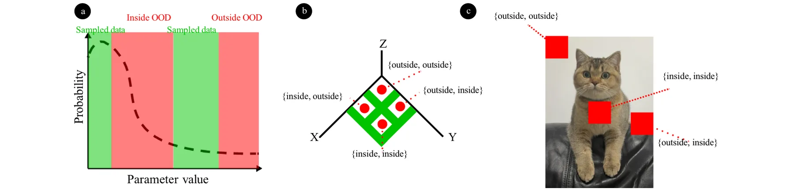
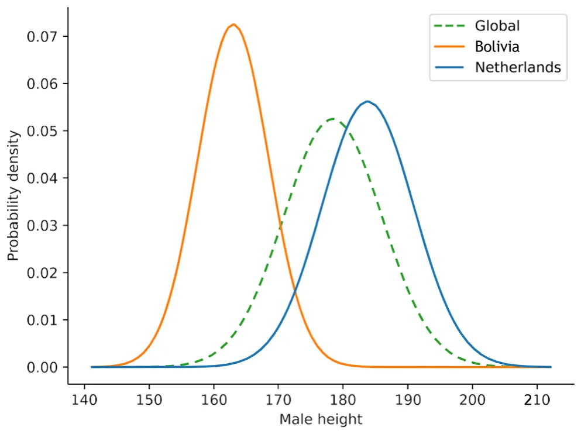
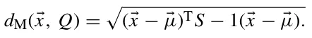
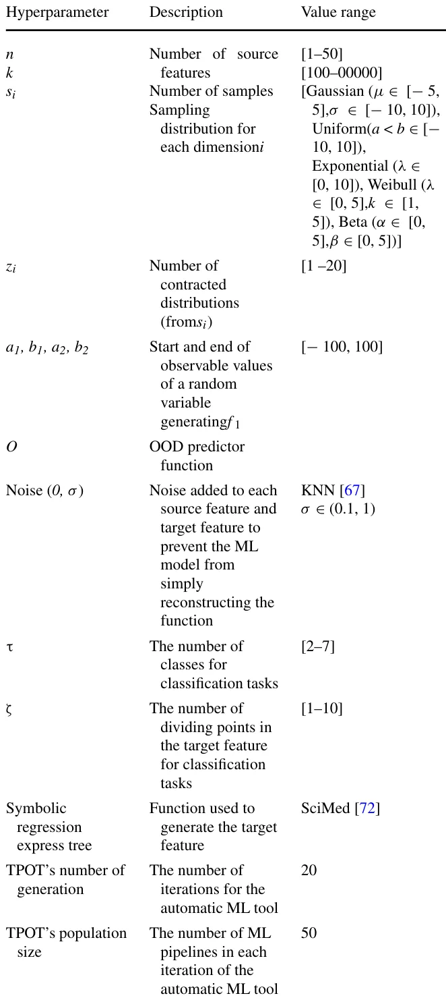
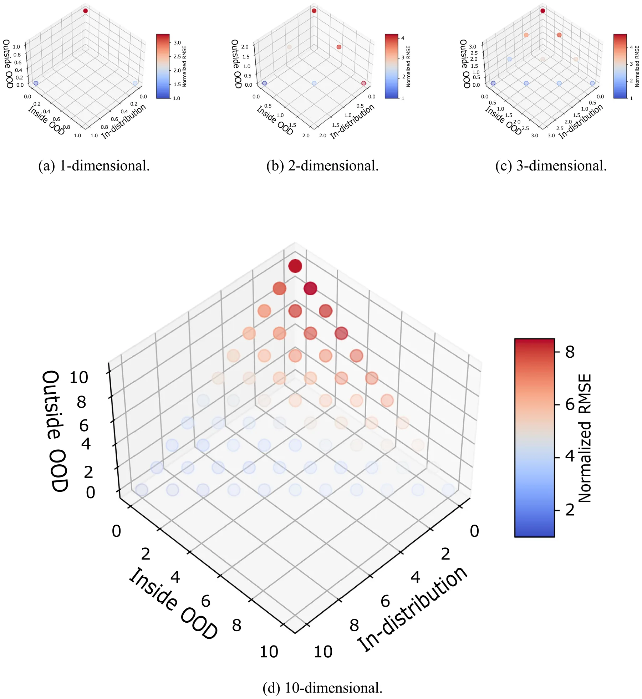
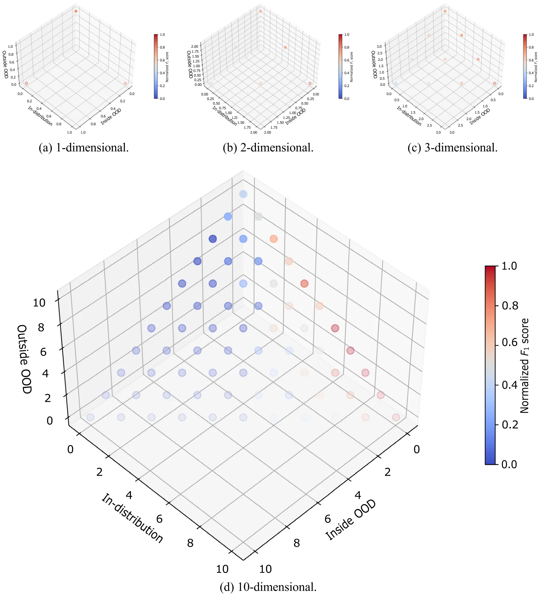
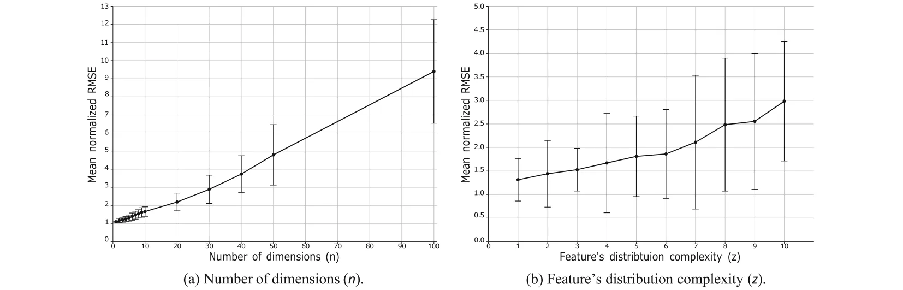
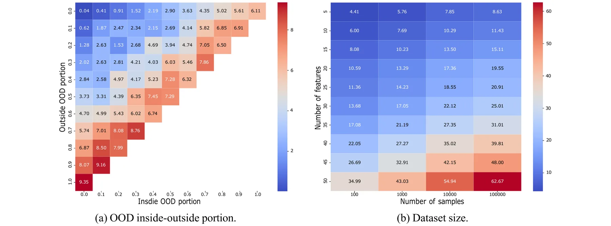

## 1 Introduction

Achieving high performance in regression and classification tasks using machine learning (ML) and deep learning (DL) models presents a fundamental computational challenge that is critical for various scientific and engineering applications [1–5]. The effectiveness of ML models depends on several factors, including the nature of the problem and the data available for training [6–14]. A growing body of research examines the characteristics of datasets in data-driven tasks, considering aspects such as noise [15, 16], concept drift [17, 18], and out-of-distribution (OOD) data [19, 20].

The fundamental premise of data-driven models (which includes ML and DL) is based on the assumption that data will be identically and independently distributed (i.i.d) [21]. Namely, the training and test data are presumed to come from the same distribution. More importantly, the training and inference data are presumed to come from the same distribution. Nevertheless, this assumption often falls short in numerous real-world scenarios [22]. Over time, data-driven models have become pervasive across various domains, and

B Teddy Lazebnik their deployment in real-world settings frequently encounters violations of the i.i.d assumption [23–25]. As such, it is common for these models to experience a decline in performance over time. This decline in performance is typically attributed to shifts in data distributions and a larger sample size of the real-world distribution that reveals the bias in the original training data [26, 27]. Currently, there is an active investigation into this phenomenon, commonly referred to as ”out-of-distribution” (OOD) [28, 29].

Out-of-distribution data and its impact on data-driven models have been extensively investigated due to its frequent occurrence and the significant challenges it presents [30–32]. Addressing the challenges posed by OOD scenarios is crucial for ensuring the robustness and reliability of data-driven models across various applications [33, 34]. Intuitively, OOD refers to data instances that significantly deviate from the training data distribution of data-driven models. This definition should be carefully distinguished from concept drift, which describes changes in data’s underlying distribution over time. Practically speaking, OOD is a fundamental issue in data-driven modeling because it exposes the limitations of models that assume the training data are fully representative of the task’s dynamics [35].

Indeed, multiple studies focused their efforts on tackling the challenges posed by OOD, including but not limited to OOD definition [36, 37]. OOD detection [33, 38, 39], and OOD robustness [40, 41]. For instance, [42] builds on the risk 0123456789().: V,-vol extrapolation mathematical framework, employing robust optimization over a perturbation set of extrapolated domains to demonstrate that reducing differences in risk across training domains can mitigate a model’s sensitivity to a wide range of extreme distributional shifts. [43] proposed a simple mixup-based technique, called LISA, that learns invariant predictors via selective augmentation. This method selectively interpolates samples with either the same labels but different domains, or the same domain but different labels, addressing subpopulation shifts (e.g., imbalanced data) and domain shifts. Moreover, [44] extended the task of improving robustness to OOD by incorporating an OOD detection mechanism as an integral part of the method. Specifically, the authors propose a margin-based learning framework that exploits freely available unlabeled data in the wild, capturing the environmental test-time OOD distributions under both covariate and semantic shifts. Additionally, [45] empirically showed that OOD performance is strongly correlated with in-distribution performance across a wide range of models and distribution shifts. They connected the strength of this correlation to the Gaussian data model, revealing that the further a sample is from the Gaussian-defined centroid, the weaker the correlation becomes.

<figure id="fig-1">

<figcaption><strong>Fig. 1</strong> An example of inside and outside out of distribution (OOD) for <strong>a</strong> one, <strong>b</strong> two, and <strong>c</strong> five dimensions</figcaption>
</figure>

Notably, these attempts mainly focused on OOD as an outlier phenomenon for a given dataset, ignoring the cases where OOD is **surrounded** by the available (i.e., training) data. With this perspective, one can consider a binary separation between two types of OOD—“inside” and “outside” of the training data. Figure 1 provides several examples of these differences such that (a) shows inside and outside OOD for one-dimensional case; (b) shows the four possible inside and outside OOD configurations possible in two-dimensional case; and (c) shows inside and outside OOD for the task of in-painting from computer vision which defined in a five-dimensional case corresponding to the three color dimensions and the two location dimensions [46].

In this study, we investigate the OOD phenomenon from the inside–outside perspectives. We start by defining the inside–outside OOD profile of a*n*-dimensional distribution, followed by numerically profiling it for a large number of synthetic datasets. In addition, we perform a sensitivity analysis to draw rules of thumb for practical guidelines for practitioners tackling complex OOD profiles.

The rest of this manuscript is organized as follows. Section 2 provides an overview of OOD definitions. Section 3 formally introduces the OOD inside and outside OOD definitions. Section 4 outlines the experimental setup used as well as the numerical results obtained. Finally, in Sect. 5, we discuss the applicative outcome of the obtained results and suggest possible future work.

## 2 Related work

Out of distribution is a complex mathematical phenomenon as it emerges from gaps between the information available to an observer and the real-world dynamics occurring in practice. To illustrate this idea, let us consider a simple case of height distribution in the male population, which is known to be distributed normally with a mean value of 178.4 cm and a standard deviation of 7.6 cm [47]. A researcher collects data from Bolivia and the Netherlands with an average male height of 163.0 (SD 5.5) centimeters [48] and 183.8 centimeters (SD 7.1) [49], respectively. In such a case, if the researcher used ML to produce a model that predicts the height of males, it would obtain poor results for males from most countries, as these are not well represented in the data. Due to the fact that Bolivia and the Netherlands have the shortest and highest male populations, respectively, the OOD is between them and therefore inside. Figure 2 visualizes this example.

As such, multiple definitions have been proposed for OOD over the years [50]. From these, three well-adopted OOD definitions are the Mahalanobis distance, random-feature Z-score, and Kullback–Leibler (KL) divergence metric [28]. Mahalanobis distance is an extension of the Z-score metric for*n*-dimensional case [51]. Formally, considering a probability distribution *Q* over *R*N, characterized by its mean vector *μ* (*μ*1, *μ*2, *μ*3, *...*, *μ*N)T and a positive-definite covariance matrix *S*, the Mahalanobis distance *d*M from a point *x* (*x*1, *x*2, *x*3, *...*, *x*N)T to *Q* is defined as:

<figure id="fig-2">

<figcaption><strong>Fig. 2</strong> An example for inside out of distribution (OOD) for the case of males’ height distribution given sampled data from one of the shortest (Bolivia) and highest (Netherlands) represented countries</figcaption>
</figure>

This definition of the multivariate Z-score has been extensively used and is likely the most common for OOD in regression tasks [52–54]. A random-feature Z-score selects at random one feature in each iteration and determines whether the observation is in or OOD based on its Z-score, given some threshold [55]. KL divergence, a concept from information theory, measures how one probability distribution diverges from a second, reference probability distribution. In the context of OOD, KL divergence is used to quantify the difference between the probability distributions of in-distribution and OOD data [56].

Beyond these standard methods, [57] propose a new measure of discrepancy specifically designed for comparing multivariate distributions, which may offer a different perspective on OOD detection by focusing on overall distributional differences. Another approach to addressing the challenge of measuring inequality in multivariate distributions involves extending the univariate Gini coefficient [58]. Such approaches often aim to maintain desirable properties of the Gini coefficient while adapting it to higher-dimensional data, frequently employing techniques like whitening processes to ensure scale stability. Moreover, [59] proposes novel multidimensional inequality indices, unlike traditional indices that often leverage techniques like the Fourier transform [60] to create scaling-invariant measures that are more computationally tractable than traditional methods like Lorenz Zonoids [61]. The authors quantify mutual variability rather than just deviations from the mean, and often produce indices easily interpretable in a multidimensional setting, which can be used as anomaly detection metrics. [62] leveraged the convex hull property of a dataset and the fact that anomalies highly contribute to the increase of the convex hull’s volume to propose an anomaly detection algorithm which computes the convex hull’s volume as an increasing number of data points are removed from the dataset to define a decision line between OOD and in-distribution data points.

Moreover, ML-based anomaly detection algorithms have been proposed [63]. For instance, Isolation forest [64] leverages recursive data partitioning to isolate individual points, effectively flagging anomalies that are sparse and easily separated, particularly in high-dimensional spaces, though it struggles with densely clustered or geometrically complex anomalies due to its reliance on random splits and ordinal variable ranking. Single-class support vector machines [65], conversely, learn a boundary around normal data, classifying points outside this learned boundary as anomalies, operating under the assumption that points outside the learned boundary are anomalous. Gaussian mixture models [66] model data as a mixture of Gaussian distributions, identifying anomalies based on low likelihood, a strategy effective for approximately Gaussian-shaped clusters but less suitable for data with non-Gaussian clusters or complex distributions.

Nonetheless, these methods are not able to capture inside OOD as they take into consideration the entire training dataset and are symmetric in terms of the anomaly compared to the center of mass of the training dataset.

## 3 Out-of-distribution profile

The OOD inside–outside profile aims to capture the performance of a data-driven model on the different possible OOD configurations of a given problem. Formally, let us consider a *n*+1-dimensional regression task where *n* dimensions are the source features *(x*) and the *n*+1-dimensional is the target feature (*y*).

In addition, let us assume for each dimension, *i* ∈ [0, . . . , *n* + 1], a sampling distribution is available and denoted by si. The dataset (*D* [*f* 1, . . . , *f n*+1]) is therefore constructed by sampling si for *i* ∈ [0, . . . , *n* + 1] for k times.

Based on this configuration, let us assume an OOD predictor, O, which accepts ∀*i* ∈ [0, . . . , *n*+1] : *f i* and a new sample *x*i ∈ *R* and returns either this sample is OOD with respect to *f i* or not. On top of that, we would like to check if the OOD is “outside” or “inside” with respect to *f i*. As such, we define *inside* OOD as follows:

**Definition 1** *A sample* x *is said to be “inside” OOD in the* ith*dimension with respect to a dataset (*D*) if and only if* x *is* *OOD with respect to* fi*given a predictor* O *and* ∃v1, v2 ∈ fi: v1 < x < v2*.*

In a complementary manner, one can define *outside* OOD as follows:

**Definition 2** *A sample* x *is said to be “outside” OOD in the* ith*dimension with respect to a dataset (*D*) if and only if* x *is OOD with respect to* fi*given a predictor* O *and* !∃v1, v2 ∈fi: v1 < x < v2*.*

Based on these two definitions, the OOD profile of a dataset for a given new sample *x* is denoted by *p(D, x)*O ∈ {no, inside, outside}n.

These definitions are computationally appealing, as one is not required to solve any complex binary predicate on top of the OOD predicator, O, as finding if the condition ∃*v*1, *v*2 ∈ *f i: v*1 < *x* < *v*2 is met is *O*(*N*) where *N* is the size of the training set without pre-process and even *O*(1) if the largest and smallest values of each feature are precomputed. That said, they are also sensitive to outliers. For example, let us assume a dataset with 1000 samples, 999 out of them range between 0 and 1 while one sample is located in an arbitrary large value *M* >> 1. In such a case, a sample with a value of 10 will be considered *inside* OOD as *v*1 1 and *v*2 *M* satisfies 1 ≤10 ≤*M*. However, this is clearly not the behavior one would desire for the *inside* OOD definition. As such, the *inside* OOD can be defined also as follows:

**Definition 3** *A sample* x *is said to be “outside” OOD in the i*th*dimension with respect to a dataset (D) if and only if there are D*l*, D*r ⊂ *D* ∧ *D*l ∩ *D*r ∅ *such that x is OOD with respect to D*l(*f i*) *and D*r(*f i*) *given a predictor* O *and* ∃*v*1 ∈ *D*l, *v*2 ∈ Dr: *v*1 < *x* < *v*2*.*

This definition is more robust, while also more computationally extensive, as one is required to ensure there is no division of the dataset D into two subsets (Dl, Dr) that satisfy the *inside* OOD. In the rest of the paper, we utilized the first definition due to its simplicity, and since the synthetic data generation procedure used does not generate anomalies, which can cause bias in the results.

## 4 Numerical analysis

In this section, we investigate the behavior of OOD inside–outside profile influence on machine learning (ML) model performance. To this end, we first define an experimental setup where the synthetic data generation procedure allows us to obtain all OOD inside–outside configurations.

### 4.1 Experimental setup

In order to explore OOD inside–outside profiles, one needs a dataset generation procedure that allows one to obtain both inside and outside OOD for each of the dimensions while also providing a meaningful regression task that represents as many realistic datasets as possible. Hence, we divide the dataset generation task into two steps—source features generation and target feature generation.

The source features generation generates each feature independently, so the number of features (i.e., *n*) does not play a part in this step. For each feature, we first generate a distribution, *d*, which is a sum of a set of predefined distributions {*d*1, *d*2, . . . *d*N} such that the number of contracted distributions, *z*, is picked at random to be an arbitrary positive integer and we allow the same contracted distributions to be picked multiple times. Using *d*, four values (*a*1*, b*1*, a*2*, b*2) indicating the start and end of the observable values of a random variable *η* ∼ *d* such that *a*1 < *b*1 < *a*2 < *b*2 are picked. The distribution *d* is sampled at random such that if the obtained value c satisfies *a*1 ≤ *c* ≤ *b* ∧ *a*2 ≤ *c* ≤ *b*2, the value is added to f and ignored otherwise. This process repeats until *k* samples are added to f. Next, for the second step, a random function described by a symbolic regression expression tree is made with all the features in the dataset and produces the target feature. To ensure that an ML model would just reconstruct this function, a random Gaussian noise with a mean equal to zero and a standard deviation larger than zero is added to each source feature and to the target feature.

Importantly, for the OOD predictor (O), we used the K-nearest neighbors (KNN) algorithm [67] with a threshold*χ* > 0. The value of*χ* is set to be the diameter of the largest centroid fitted on the training data using the X-means algorithm [68]. This way, samples with an average distance of more than*χ* do not belong to any cluster present in the training data, which is OOD. However, the KNN algorithm also allows us to obtain an inside OOD since a sample can be outside of the radius from two clusters but still between them, as desired.

Table 1 presents the hyperparameters used by the dataset generation procedure with their descriptions and value range. The value ranges in the tables are taken to represent realistic dataset sizes and value ranges [69–71] while also balancing with computational time.

As the obtained tasks are regression and sensitive to both scaling and the dataset’s dimension, we used the root mean squared error (RMSE) metric normalized to the average RMSE value where the samples are in-distribution [73]. The metric performance for all OOD profile configurations is computed to be *n* 100 random samples from the distribution D. In order to obtain an arguably best ML model for each dataset, we utilize the tree-based pipeline optimization tool (TPOT) automatic machine learning [74] due to its effectiveness in finding near-optimal ML models for a wide range of tabular tasks [75–78].

Moreover, in order to also evaluate classification tasks, for any given regression task, we randomly picked a number of tasks, we adopted the F1 score [79], which is commonly used for anomaly detection tasks.

<figure class="table-figure" id="table-1">
<figcaption><strong>Table 1</strong> Hyperparameters for OOD inside–outside profile experiments</figcaption>

</figure>

### 4.2 Results

The results of the above analysis are divided into two parts—profiling of the inside–outside distribution for the average case for different dimensions and the sensitivity of ML models’ performance as properties of the inside–outside OOD change.

#### 4.2.1 Profiling

Figure 3 presents the inside–outside OOD profiles (*p*(*D*, *x*)O) for different dimensions. The *x*, *y*, and *z* axis are corresponding to the in-distribution, inside OOD, and outside OOD, respectively. The dots are located as the number of features associated with each type as the features are symmetric in our context, the order is not important. The color, ranging from blue to red indicates the average normalized RMSE for *n* 100 repetitions. From Fig. 3a, b, and c, indicating all possible inside–outside OOD configurations for 1, 2, and 3 dimensions, respectively, a pattern that outside OOD results in higher RMSE and the effect is nonlinear to the number of dimensions. Extended to a more realistic configuration, Fig. 3d shows the same analysis for *n* 10 dimensions. The pattern that emerged from the first three dimensions is preserved.

Figure 4 presents the inside–outside OOD profiles (*p(D, x*)O) for different dimensions for synthetic classification tasks. Like Fig. 3, the *x*, *y*, and *z* axis are corresponding to the in-distribution, inside OOD, and outside OOD, respectively, and the dots are located as the number of features associated with each type while the color, ranging from blue to red indicates the average normalized F1 score for *n* 100 repetitions. Figure 4a, b, and c, showcasing inside–outside OOD configurations for 1–3 dimensions, indicates that outside OOD consistently produces lower F1 score values, and this effect grows nonlinearly with dimensionality. This pattern is maintained when extended to *n* 10, as shown in Fig. 3d. In particular, one can notice that a combination of inside OOD and outside OOD results in lower F1, in comparison with only inside or outside OOD.

#### 4.2.2 Sensitivity analysis

classes (*τ* ∈ *N*) and number of dividing points for the range of the target feature (*ζ* ∈*N* >*τ* − 2). For each range, divided by either two division points or a division point and the edge of the target feature’s distribution, we assign a value of a class at random, allowing repetitions only after each class is assigned at least once. In order to evaluate the classification Figure 5a and b presents the mean normalized RMSE as a function of the number of dimensions and the feature’s distribution complexity, respectively. The results are shown as the mean ± standard deviation of *n* 100 repetitions. Both sub-figures present a one-dimensional sensitivity analysis of inside–outside OOD with changes in the complexity of the regression task. Figure 5a shows a semi–linear growth in the mean normalized RMSE with respect to the number of dimensions. At the same time, the distribution of the RMSE over the cases also increases with the dimension of the task, as indicated by the increase in the error bars. Similarly, the mean normalized RMSE monotonically increases with the feature’s distribution complexity, while the error bar sizes do not show a clear pattern. This outcome can be explained as different core distribution additions can result in a much more computationally expressive distribution compared to others (for example, a sum of normal distributions compared to a sum of all unique distributions), which results in a complex pattern.

<figure id="fig-3">

<figcaption><strong>Fig. 3</strong> The inside–outside out-of-distribution (OOD) profiles (<em>p(D, x</em>)O) for different dimensions <strong>for regression tasks</strong>. The color indicates the average normalized RMSE for <em>n</em> 100 repetitions</figcaption>
</figure>

Figure 6a and b presents the mean normalized RMSE as a function of the inside to outside OOD portions and the dataset’s size, respectively. The results are shown as the mean ± standard deviation of *n* 100 repetitions. Both figures present a two-dimensional sensitivity analysis of inside–outside OOD with changes in the complexity of the regression task. Figure 6b shows that an overall increase in OOD results in higher average RMSE, with the outside OOD increasing the RMSE more than the inside OOD, aligning with the pattern presented in Fig. 3. In a complementary manner, Fig. 6b reveals that an increase in the number of features and samples increases the average RMSE such that the increase in the features is semi-linear, as also indicated by Fig. 5a.

<figure id="fig-4">

<figcaption><strong>Fig. 4</strong> The inside–outside out-of-distribution (OOD) profiles (<em>p</em>(<em>D</em>, <em>x</em>)O) for different dimensions <strong>for classification tasks</strong>. The color indicates the average normalized RMSE for <em>n</em> 100 repetitions</figcaption>
</figure>

## 5 Discussion

In this study, we proposed a novel perspective on OOD in the form of both inside and outside OOD, focusing on how different inside–outside OOD configurations affect the performance of ML models. Based on the inside–outside OOD definition, we conducted both profiling and sensitivity analysis on synthetic datasets for regression tasks solved using ML models.

<figure id="fig-5">

<figcaption><strong>Fig. 5</strong> A one-dimensional sensitivity analysis of inside–outside out of distribution (OOD). The results are shown as the mean ± standard deviation of <em>n</em> 100 repetitions</figcaption>
</figure>

<figure id="fig-6">

<figcaption><strong>Fig. 6</strong> A two-dimensional sensitivity analysis of inside–outside out of distribution (OOD). The results are shown as the mean ± standard deviation of <em>n</em> 100 repetitions</figcaption>
</figure>

The results, illustrated in Figs. 3, 4, 5, and 6, highlight the impact of the inside–outside OOD profiles on model performance. Specifically, we show that outside OOD configurations consistently lead to higher normalized RMSE compared to inside OOD configurations across different dimensions (Figs. 3 and 4). This trend is evident in one-dimensional (Figs. 3a and 4a), two-dimensional (Figs. 3b and 4b), three-dimensional (Figs. 3c and 4c), and ten-dimensional (Figs. 3d and 4d) datasets, indicating a robust pattern where outside OOD significantly degrades performance. Furthermore, the sensitivity analysis reveals a semi-linear increase in mean normalized RMSE **(and semi-linear decrease in the** F1 **score** with the number of dimensions and feature distribution complexity, which aligns with previous OOD studies [57]. This outcome indicates that in terms of error profile, inside and outside OOD behave similarly [29, 80]. These findings align with previous studies that emphasize the detrimental effect of distribution shifts on model accuracy [42, 43, 45], underscoring the importance of accounting for both inside and outside OOD scenarios in the development and evaluation of machine learning models.

It is worth noting the conceptual similarities between our proposed ”inside” and ”outside” OOD framework and the established notions of internal and external validation prevalent in fields like medical research [81]. Internal validation, assessing model performance on data closely related to the training set, shares a resemblance with our ”inside” OOD, where anomalies exist within the observed feature ranges. Conversely, external validation, evaluating generalizability to entirely new, independent datasets, echoes our ”outside” OOD, where samples fall beyond the training data’s feature boundaries. However, a key distinction lies in the basis of this categorization. While internal and external validation in medicine are often delineated by the source and context of the data (e.g., different patient cohorts or institutions), our ”inside” and ”outside” OOD are defined by a more direct, data-driven criterion based on whether the OOD samples fall within or beyond the observed range of each feature in the training data. This feature-centric definition allows for a more granular analysis of how different types of distributional shifts, both within and extending beyond the training data’s span, uniquely impact machine learning model performance, highlighting a novel perspective on OOD analysis.

The findings of this study provide two practical guidelines for practitioners. First, when developing and evaluating ML models, it is crucial to consider the potential presence of both inside and outside OOD data, as well as possible inside–outside profiles that can take place based on the available training data to predict possible OOD issues in production settings. Second, data augmentation techniques that simulate both inside and outside OOD conditions can help in training more resilient models [82]. For instance, inside OOD samples might be used to augment training data, thereby improving the robustness of models to unusual but plausible variations. In contrast, outside OOD samples could trigger more significant actions in a deployed system, such as initiating a model retraining process or activating safety protocols. Effectively, the inside–outside OOD framework offers a nuanced way to manage OOD, moving beyond a simple binary classification and enabling more adaptive and robust machine learning systems.

Nonetheless, this study is not without limitations. Mainly, the proposed OOD inside–outside profile assumes that the features are continuous. As such, categorical features are not addressed. In addition, the synthetic dataset generation procedure is limited by the complexity and expressiveness of the datasets, which may not represent a portion of extremely complex real-world datasets. Future work should address these limitations to provide a more extensive understanding of OOD inside–outside profiling, which can be used to improve other properties of data-driven models, such as concept drift [83, 84].

Taken jointly, the inside–outside OOD formalization facilitates a more robust and reliable machine learning development by recognizing and differentiating between these two types, allowing practitioners to better design targeted strategies to mitigate the adverse effects of OOD. The proposed framework opens several promising avenues for future investigation. First, exploring the interplay between inside–outside OOD and other related concepts, such as concept drift and adversarial examples, could provide valuable insights into the multifaceted challenges of distribution shift. Second, the development of practical tools and techniques for detecting and characterizing inside–outside OOD in real-world data would be of significant benefit to domains such as medical imaging, where the ability to reliably identify anomalous patterns is paramount, and autonomous systems, where robustness to unexpected scenarios is critical for safe operation [85].

**Acknowledgements** The author wishes to thank both Oren Glickman and Assaf Shmuel for inspiring this study and Uri Itay for the thought-provoking discussion about it.

**Author’s contributions** T.L. did all the work

**Funding** Open access funding provided by Jönköping University. This study received no funding.

**Data availability** No datasets were generated or analyzed during the current study.

**Code availability** The code used for this study is freely available at: https://github.com/teddy4445/inside\_ood.

### Declarations

**Conflict of interest** The author declares no conflict of interest.

## References

1. Virgolin, M., Wang, Z., Alderliesten, T., Bosman, P.A.N.: Machine learning for the prediction of pseudorealistic pediatric abdominal phantoms for radiation dose reconstruction. J. Med. Imag. 7(4), 046501 (2020)
2. Kutz, J.N.: Deep learning in fluid dynamics. J. Fluid Mech. 814, 1–4 (2017)
3. Reichstein, M., Camps-Valls, G., Stevens, B., Jung, M., Denzler, J., Carvalhais, N., et al.: Deep learning and process understanding for data-driven earth system science. Nature 566(7743), 195–204 (2019)
4. Alzubaidi, L., Zhang, J., Amjad J.H., Al-Dujaili, A., Duan, Y., Al-Shamma, O., Santamarıa, J., Fadhel, M.A., Al-Amidie, M., Farhan, L.: Review of deep learning: Concepts, cnn architectures, challenges, applications, future directions. J. Big Data,8(1), 1–74 (2021).
5. Raissi, M., Karniadakis, G.E.: Hidden physics models: machine learning of nonlinear partial differential equations. J. Comput. Phys. 357, 125–141 (2018)
6. He, X., Zhao, K., Chu, X.: Automl: a survey of the state-of-the-art. Knowl.-Based Syst. 212, 106622 (2021)
7. Zhong, J., Hu, X., Zhang, J., Gu, M.: Comparison of performance between different selection strategies on simple genetic algorithms. In: International conference on computational intelligence for modelling control and automation and international conference on intelligent agents, web technologies and internet commerce (CIMCA-IAWTIC’06), vol 2. IEEE, New York, pp 1115–1121 (2005)
8. Lazebnik, T., Rosenfeld, A.: Fspl: a meta-learning approach for a filter and embedded feature selection pipeline. international. J. Appl. Math. Comput. Sci.33(1) (2023).
9. Huber, M.F.: A survey on the explainability of supervised machine learning. J. Artif. Intell. Res.,70 (2021).
10. Marcinkevics, R., Vogt, J.E.: Interpretability and explainability: A machine learning zoo mini-tour. J. Artif. Intell. Res. (2023).
11. Li, T., Zhong, J., Liu, J., Wu, W., Zhang, C.: Ease. ml: Towards multi-tenant resource sharing for machine learning workloads. Proc. VLDB Endowment.11(5), 607–620 (2018).
12. Lazebnik, T., Fleischer, T., Yaniv-Rosenfeld, A.: Benchmarking biologically-inspired automatic machine learning for economic tasks. Sustainability,15(14) (2023).
13. Heaton, J.: An empirical analysis of feature engineering for predictive modeling. In SoutheastCon 2016, 1–6 (2016)
14. Khurana, U., Turaga, D., Samulowitz, H., Parthasrathy, S.: Cognito: Automated feature engineering for supervised learning. In: 2016 IEEE 16th International Conference on Data Mining Workshops (ICDMW), pp 1304–1307 (2016).
15. Lu, X., Ming, L., Liu, W., Li, H.-X.: Probabilistic regularized extreme learning machine for robust modeling of noise data. IEEE Trans. Cybern. 48(8), 2368–2377 (2018)
16. Dalessandro, B.: Bring the noise: embracing randomness is the key to scaling up machine learning algorithms. Big Data 1(2), 110–112 (2013)
17. Gama, J., Zliobaite, I., Bifet, A., Pechenizkiy, M., Bouchachia, A.: A survey on concept drift adaptation. ACM Computing Surveys (CSUR), p. 46 (2014).
18. Gama, J., Zliobaitundefined, I., Bifet, A., Pechenizkiy, M., Bouchachia, A.: A survey on concept drift adaptation. ACM Comput. Surv.,46(4) (2014).
19. Yao, H., Wang, Y., Li, S., Zhang, L., Liang, W., Zou, J., Finn, C.: Improving out-of-distribution robustness via selective augmentation. In: Proceedings of the 39th International Conference on Machine Learning, volume 162 of Proceedings of Machine Learning Research, pp. 25407–25437. PMLR, New York (2022).
20. Krueger, D., Caballero, E., Jacobsen, J.-H., Zhang, A., Binas, J., Zhang, D., Priol, R.L., Courville, A.: Out-of-distribution generalization via risk extrapolation (rex). In: Proceedings of the 38th International Conference on Machine Learning, vol 139, po 5815–5826. PMLR, New York (2021).
21. Arafeh, M., Hammoud, A., Otrok, H., Mourad, A., Talhi, C., Dziong, Z.: Independent and identically distributed (iid) data assessment in federated learning. In: GLOBECOM 2022–2022 IEEE Global Communications Conference, pp 293–298 (2022).
22. Dundar, B., Krishnapuram, M., Bi, J., Rao, R.B.: Learning classifiers when the training data is not iid. IJCAI, pp 756–761 (2007).
23. Krongauz, D., Lazebnik, T.: Collective evolution learning model for vision-based collective motion with collision avoidance. PLoS One (2023).
24. Afsar, M.M., Crump, T., Far, B.: Reinforcement learning based recommender systems: a survey. ACM Comput. Surv. (2022).
25. Vilalta, R., Giraud-Carrier, C., Brazdil, P.: Meta-learning—concepts and techniques. Springer US, Cham, pp 717–731 (2010).
26. Ghassemi, N., Fazl-Ersi, E.: A comprehensive review of trends, applications and challenges in out-of-distribution detection. arXiv (2022).
27. Veturi, Y.A., Woof, W., Lazebnik, T., Moghul, I., Woodward-Court, P., Wagner, S.K., Cabral de Guimaraes, T.A., Varela, M.D., Liefers, B., Patel, P.J., Beck, S., Webster, A.R., Mahroo, O., Keane, P.A., Michaelides, M., Balaskas, K., Pontikos, N.: Syntheye: Investigating the impact of synthetic data on ai-assisted gene diagnosis of inherited retinal disease. Ophthalmol. Sci. p. 100258 (2022).
28. Kirchheim, K., Filax, M., Ortmeier, F.: Pytorch-ood: A library for out-of-distribution detection based on pytorch. In: Proceedings of the IEEE/CVF Conference on Computer Vision and Pattern Recognition (CVPR) Workshops, pp 4351–4360 (2022).
29. Yang, J., Zhou, K., Li, Y., Liu, Z.: Generalized out-of-distribution detection: a survey. arXiv, 2022.
30. Fort, S., Ren, J., Lakshminarayanan, B.: Exploring the limits of out-of-distribution detection. In: Ranzato, M., Beygelzimer, A., Dauphin, Y., Liang, P.S., Wortman Vaughan, J. editors, Advances in Neural Information Processing Systems, vol. 34, pp 7068–7081 (2021).
31. Hendrycks, D., Basart, S., Mu, N., Kadavath, S., Wang, F., Dorundo, E., Desai, R., Zhu, T., Parajuli, S., Guo, M., Song, D., Steinhardt, J., Gilmer, J.: The many faces of robustness: A critical analysis of out-of-distribution generalization. In: Proceedings of the IEEE/CVF International Conference on Computer Vision (ICCV), pp 8340–8349, (2021).
32. Miller, P., Taori, R., Raghunathan, A., Sagawa, S., Koh, P.W., Shankar, V., Liang, P., Carmon, Y., Schmidt, L.: Accuracy on the line: on the strong correlation between out-of-distribution and in-distribution generalization. In Proceedings of the 38th International Conference on Machine Learning, vol 139, pp 7721–7735 (2021).
33. Y-C. Hsu, Y. Shen, H. Jin, and Z. Kira. Generalized odin: Detecting out-of-distribution image without learning from out-of-distribution data. In Proceedings of the IEEE/CVF Conference on Computer Vision and Pattern Recognition (CVPR) (2020).
34. Bengio, Y., Bastien, F., Bergeron, A., Boulanger–Lewandowski, N., Breuel, T., Chherawala, Y., Cisse, M., Cote, M., Erhan, D., Eustache, J., Glorot, X., Muller, X., Pannetier Lebeuf, S., Pas-canu, R., Rifai, S., Savard, F., Sicard, G.: Deep learners benefit more from out-of-distribution examples. In: Proceedings of the Fourteenth International Conference on Artificial Intelligence and Statistics, vol 15, pp 164–172. PMLR, New York (2011).
35. Jordan, M.I., Mitchell, T.M.: Machine learning: trends, perspectives, and prospects. Science 349(6245), 255–260 (2015)
36. Hendrycks, D., Gimpel, K.: A baseline for detecting misclassified and out-of-distribution examples in neural networks. arXiv (2018).
37. Ye, N., Li, K., Bai, H., Yu, R., Hong, L., Zhou, F., Li, Z., Zhu, J.: Ood-bench: Quantifying and understanding two dimensions of out-of-distribution generalization. In Proceedings of the IEEE/CVF Conference on Computer Vision and Pattern Recognition (CVPR), pp 7947–7958 (2022).
38. Liu, W., Wang, X., Owens, J., Li, Y.: Energy-based out-of-distribution detection. In H. Larochelle, M. Ranzato, R. Hadsell, M.F. Balcan, and H. Lin, editors, Advances in Neural Information Processing Systems, vol 33, pp 21464–21475. Curran Associates, Inc., 2020.
39. S. Fort, J. Ren, and B. Lakshminarayanan. Exploring the limits of out-of-distribution detection. In M. Ranzato, A. Beygelzimer, Y. Dauphin, P.S. Liang, and J. Wortman Vaughan, editors, Advances in Neural Information Processing Systems, volume 34, pages 7068–7081. Curran Associates, Inc., New York (2021).
40. Wenzel, F., Dittadi, A.., Gehler, P., Simon-Gabriel, C.-J., Horn, M., Zietlow, D., Kernert, D., Russell, C., Brox, T., Schiele, B., Scho¨lkopf, B., Locatello, F.: Assaying out-of-distribution generalization in transfer learning. In S. Koyejo, S. Mohamed, A. Agarwal, D. Belgrave, K. Cho, and A. Oh, editors, Advances in Neural Information Processing Systems, vol 35, pp 7181–7198. Curran Associates, Inc., New York (2022).
41. Hendrycks, D., Basart, S., Mu, N., Kadavath, S., Wang, F., Dorundo, E., Desai, R., Zhu, T., Parajuli, S., Guo, M., Song, D., Steinhardt, J., Gilmer, J.: The many faces of robustness: A critical analysis of out-of-distribution generalization. In Proceedings of the IEEE/CVF International Conference on Computer Vision (ICCV), pp 8340–8349 (2021).
42. Krueger, D., Caballero, E., Jacobsen, J.-H., Zhang, A., Binas, J., Zhang, D., Priol, R.L., Courville, A.: Out-of-distribution generalization via risk extrapolation (rex). In M. Meila and T. Zhang, editors, Proceedings of the 38th International Conference on Machine Learning, pp 5815–5826. PMLR, New York (2021).
43. Yao, H., Wang, Y., Li, S., Zhang, L., Liang, W., Zou, J., Finn, C.: Improving out-of-distribution robustness via selective augmentation. In K. Chaudhuri, S. Jegelka, L. Song, C. Szepesvari, G. Niu, and S. Sabato, editors, Proceedings of the 39th International Conference on Machine Learning, vol 162, pp 25407–25437. PMLR, New York (2022).
44. Bai, H., Canal, G., Du, X., Kwon, J., Nowak, R.D., Li, Y.: Feed two birds with one scone: Exploiting wild data for both out-of-distribution generalization and detection. In A. Krause, E. Brunskill, K. Cho, B. Engelhardt, S. Sabato, and J. Scarlett, editors, Proceedings of the 40th International Conference on Machine Learning, vol 202, pp 1454–1471. PMLR, New York (2023)
45. Miller, J.P., Taori, R., Raghunathan, A., Sagawa, S., Koh, P.W., Shankar, V., Liang, P., Carmon, Y., Schmidt, L.: Accuracy on the line: on the strong correlation between out-of-distribution and in-distribution generalization. In M. Meila and T. Zhang, editors, Proceedings of the 38th International Conference on Machine Learning, volume 139 of Proceedings of Machine Learning Research, pp 7721–7735. PMLR, 2021.
46. Yu, J., Lin, Z., Yang, J., Shen, X., Lu, X., Huang, T.S.: Generative image inpainting with contextual attention. In: Proceedings of the IEEE Conference on Computer Vision and Pattern Recognition (CVPR), June 2018.
47. Komlos, J., Kim, J.H.: Estimating trends in historical heights. Hist. Methods A J Quant. Interdiscip. History 23(3), 116–120 (1990)
48. Subramanian, S.V., Zaltin, E.O, Finlay, J.E.: Height of nations: a socioeconomic analysis of cohort differences and patterns among women in 54 low- to middle-income countries. Plos One,6(4), e18962 (2011).
49. Schönbeck, Y., Talma, H., van Dommelen, P., Bakker, B., Bui-tendijk, S.E., HiraSing, R.A., van Buuren, S.: The world’s tallest nation has stopped growing taller: the height of dutch children from 1955 to 2009. Pediatric Res.,73(3), 371–377 (2013).
50. Yang, J., Zhou, K., Li, Y., Liu, Z.: Generalized out-of-distribution detection: a survey. Int. J. Comp. Vis. (2024).
51. Mahalanobis, P C.: On the generalized distance in statistics. Samkhya: Indian J. Stat.Se. A (2008-),80, S1–S7 (2018).
52. Bendale, A., Boult, T.: Towards open world recognition. In: Proceedings of the IEEE conference on computer vision and pattern recognition, pp 1893–1902 (2015).
53. Lee, K., Lee, K., Lee, H., Shin, J.: A simple unified framework for detecting out-of-distribution samples and adversarial attacks. Adv. Neural Inform. Process. Syst. 31 (2018).
54. Mayrhofer, M., Filzmoser, P.: Multivariate outlier explanations using shapley values and mahalanobis distances. Economet. Stat. (2023).
55. Sastry, C.M., Oore, S.: Detecting out-of-distribution examples with Gram matrices. In: Proceedings of the 37th International Conference on Machine Learning, vol 119 of Proceedings of Machine Learning Research, pp 8491–8501. PMLR, New York (2020).
56. Zhang, Y., Pan, J., Liu, W., Chen, Z., Li, K., Wang, J., Liu, Z., Wei, H.: Kullback-leibler divergence-based out-of-distribution detection with flow-based generative models. IEEE Trans. Knowl. Data Eng. pp 1–14 (2023).
57. Auricchio, G., Brigati, G., Giudici, P., Toscani, G.: Multivariate gini-type discrepancies. Math. Models Methods Appl. Sci. 35(05), 1267–1296 (2025)
58. Gennaro, A., Giudici, P., Toscani, G.: Extending the gini index to higher dimensions via whitening processes. Rend. Lincei Mat. Appl. 35, 511–528 (2024)
59. Giudici, P., Raffinetti, E., Toscani, G.: Measuring multidimensional inequality: a new proposal based on the fourier transform. Statistics 59(2), 330–353 (2024)
60. Bracewell, R.N.: The fourier transform. Sci. Am. 260(6), 86–95 (1989)
61. Koshevoy, G., Mosler, K.: The lorenz zonoid of a multivariate distribution. J. Am. Stat. Assoc. 91(434), 873–882 (1996)
62. Itai, U., Bar Ilan, A., Lazebnik, T.: Tighten the lasso: A convex hull volume-based anomaly detection method. arXiv (2025).
63. Nassif, A.B., Talib, M.A., Nasir, Q., Dakalbab, F.M.: Machine learning for anomaly detection: a systematic review. Ieee Access 9, 78658–78700 (2021)
64. Cheng, Z., Zou, C., Dong, J.: Outlier detection using isolation forest and local outlier factor. In: Proceedings of the conference on research in adaptive and convergent systems, pp 161–168 (2019).
65. Oza, P., Patel, V.M.: One-class convolutional neural network. IEEE Signal Process. Lett. 26(2), 277–281 (2018)
66. Li, L., Hansman, R.J., Palacios, R., Welsch, R.: Anomaly detection via a gaussian mixture model for flight operation and safety monitoring. Transp. Res. Part C: Emerg. Technol. 64, 45–57 (2016)
67. Zang, B., Huang, R., Wang, L., Chen,J., Tian, F., Wei, X.: An improved knn algorithm based on minority class distribution for imbalanced dataset. In:2016 International Computer Symposium (ICS), pp 696–700 (2016).
68. Kumar, P., Krishan Wasan, S.: Analysis of x-means and global k-means using tumor classification. In: 2010 The 2nd International Conference on Computer and Automation Engineering (ICCAE), vol 5, pp 832–835 (2010).
69. McElfresh, D., Khandagale, S., Valverde, J., Prasad, V., Ramakrish-nan, G., Goldblum, M., White, C.: When do neural nets outperform boosted trees on tabular data? Adv. Neural Inform. Process. Syst., volume36 (2024).
70. Grinsztajn, L., Oyallon, E., Varoquaux, G.: Why do tree-based models still outperform deep learning on typical tabular data? Adv. Neural Inform. Process. Syst. 35, 507–520 (2022)
71. Shmuel, A., Glickman, O., Lazebnik, T.: A comprehensive benchmark of machine and deep learning across diverse tabular datasets. arXiv (2024).
72. Keren, L.S., Liberzon, A., Lazebnik, T.: A computational framework for physics-informed symbolic regression with straightforward integration of domain knowledge. Sci. Rep. 13, 1249 (2023)
73. Shmuel, A., Glickman, O., Lazebnik, T.: Symbolic regression as a feature engineering method for machine and deep learning regression tasks. Mach. Learn. Sci. Technol.5(2) (2024)
74. Olson, R.S., Moore, J.H.: Tpot: A tree-based pipeline optimization tool for automating machine learning. In: JMLR: Workshop and Conference Proceedings, vol 64, pp 66–74 (2016)
75. Lazebnik, T., Somech, A., Weinberg, A.I.: Substrat: a subset-based optimization strategy for faster automl. Proc. VLDB Endow. 16(4), 772–780 (2022)
76. Putrada, A.G., Laeli, E.K., Pane, S.F., Alamsyah, N., Fauzan, M.N.: Tpot on increasing the performance of credit card application approval classification. In: 2022 2nd International Conference on Intelligent Cybernetics Technology & Applications (ICICyTA), pp 216–221 (2022).
77. Mena, P., Borrelli, R.A., Kerby, L.: Expanded analysis of machine learning models for nuclear transient identification using tpot. Nucl. Eng. Des. 390, 111694 (2022)
78. Zhang, W., Ge, P., Jin, W., Guo. J.: Radar signal recognition based on tpot and lime. In: 2018 37th Chinese Control Conference (CCC), pp 4158–4163 (2018).
79. Fourure, D., Javaid, M.U., Posocco, N., Tihon, S.: Anomaly detection: How to artificially increase your F1-score with a biased evaluation protocol. In: Joint European conference on machine learning and knowledge discovery in databases, pp 3–18. Springer, Cham (2021).
80. Ma, X., Shao, Y., Tian, L., Flasch, D.A., Mulder, H.L., Edmonson, M.N., Liu, Y., Chen, X., Newman, S., Nakitandwe, J., Li, Y., Li, B., Shen, S., Wang, Z., Shurtleff, S., Robison, L.L., Levy, S., Easton, J., Zhang, J.: Analysis of error profiles in deep next-generation sequencing data. Genome Biol.20(50) (2019).
81. Yang, Y., Li, F., Wei, Y., Zhao, Y., Fu, J., Xiao, X., Bu, H.: Experts’ cognition-driven ensemble deep learning for external validation of predicting pathological complete response to neoadjuvant chemotherapy from histological images in breast cancer. MEDIN (2024).
82. Rebuffi, S-A., Gowal, S., Calian, D.A., Stimberg, F., Wiles, O., Mann, T.A.: Data augmentation can improve robustness. In: M. Ranzato, A. Beygelzimer, Y. Dauphin, P.S. Liang, and J. Wortman Vaughan, editors, in Neural Information Processing Systems, volume 34, pps 29935–29948. Curran Associates, Inc., New York (2021).
83. Hu, H., Kantardzic, M., Sethi, T.S.: No free lunch theorem for concept drift detection in streaming data classification: a review. WIREs Data Min. Knowl. Discovery 10(2), e1327 (2020)
84. Li, W., Yang, X., Liu, W., Xia, Y., Bian, J.: Ddg-da: Data distribution generation for predictable concept drift adaptation. In: Proceedings of the AAAI Conference on Artificial Intelligence, vol 36, pp 4092–4100 (2022)
85. Tschuchnig, M.E., Gadermayr, M.: Anomaly detection in medical imaging-a mini review. In: International Data Science Conference, pp 33–38. Springer, Cham (2021).
