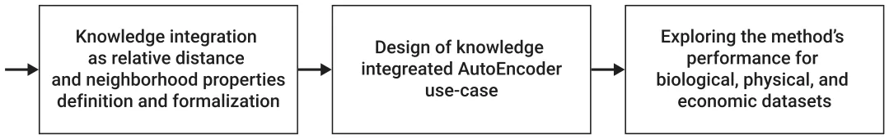
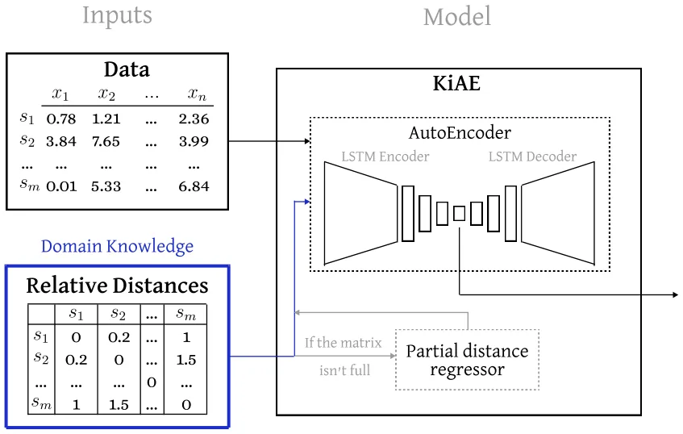
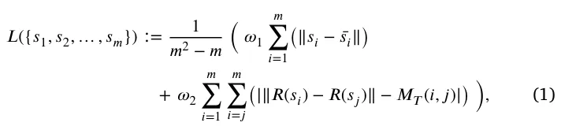
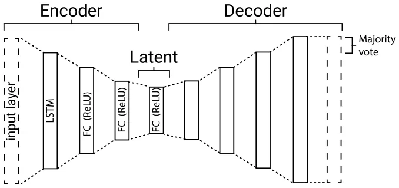
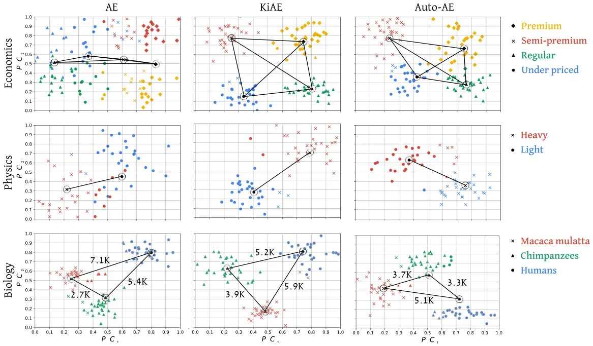

## 1. Introduction

Data encoding is a crucial step in many data-driven analysis models across various fields, including economics, physics, and biology (Buldyrev et al., 1998; Jin et al., 2016; Raissi & Karniadakis, 2018; Su et al., 2020). Intuitively, the encoding process refers to the process of converting raw data into a standardized format that can be easily analyzed and interpreted (Yu et al., 2018). This process typically involves transforming data into a numerical space, usually with a dimension much smaller than the original one (Gelada et al., 2019; Scheinker, 2021; Yeh et al., 2017). The encoded representation is used to create models or perform statistical analysis. As such, data encoding plays a critical role in several applications, including machine learning, image and speech recognition, natural language processing, and genome analysis, among others (Abdel-Hamid et al., 2014; Dligach et al., 2019; Parsons et al., 1995).

Recently, data-driven models are becoming increasingly complex, and as a result, the data used to train them is becoming more complex and extensive. As a result, there is a growing interest in the encoding space of the data and its properties (Hoff et al., 2002; Rongali et al., 2020). In particular, *latent spaces*, in the context of deep learning, refer to the encoded representations of data samples that are learned by neural networks (NN) during training. The term ‘‘latent’’ is used since these representations are not directly observable, but rather inferred from the training data by the NN (Voynov & Babenko, 2020). Latent spaces are an essential component of several deep learning models, including AutoEncoders (AEs), generative adversarial networks, and transformers.

While providing promising results, current encoding methods leave the user (partially) blind to the properties of the encoded space that the model learned. This fact might result in unwanted behavior when known data distribution or domain properties are available. When users concentrate on downstream tasks, they may find the current conditions acceptable if the results show promise. However, the current situation is sub-optimal for tasks like debugging, optimization, and ensuring the explainability of the results.

In recent years, incorporating domain knowledge into machine learning models has gained significant momentum, as it has proven beneficial in many different applications. Incorporating domain knowledge, such as subject matter expertise or prior knowledge about the data or task, can lead to more accurate and interpretable results, as well as more efficient model designs. For example, incorporating knowledge of physical laws or mathematical relationships in symbolic regression 0957-4174/© 2024 The Author(s). Published by Elsevier Ltd. This is an open access article under the CC BY-NC-ND license (http://creativecommons.org/licenses/by-nc-nd/4.0/).

tasks can reduce the computational resources required by minimizing the search space to only functions that fulfill a desired quality. Additionally, the added restraints over the search space aid in the discovery of a logical structure underlying the data (Keren et al., 2023). Another area where domain knowledge is used is automated machine learning (AutoML). Similar to the case of symbolic regression, domain knowledge can be used to guide the design of AutoML algorithms and to constrain the search space for the best model (Feurer et al., 2019). Finally, domain knowledge can also be useful in the design of machine learning and deep learning models themselves (Behnaz et al., 2021; Wu et al., 2020). By incorporating prior knowledge, such as the structure of the input data or the relationships between different variables, models can be designed to be more efficient and accurate. This can be particularly useful when data is limited, noisy, or challenging to collect. Hence, knowledge integration is a promising approach to handle the shortcomings of current latent spaces produced by data-driven models, generally, and for the AE-based model, in particular.

In this paper, we present a novel approach for integrating domain knowledge into the *Latent space* of AEs named Knowledge-integrated AutoEncoder (KiAE). With this approach, we propose using an AutoEncoder-based architecture that preserves domain knowledge in the form of distance and neighborhood properties between labeled groups in the dataset, even if these properties are only partially known to the domain expert. Essentially, we proposed a neural network based manifold learning model where the manifold preservation properties are expressed by a matrix obtained from domain knowledge. This is unlike the classical approach for knowledge-integrated systems, where the more formal knowledge representations are embedded into learning systems, such as logic rules or algebraic equations that form constraints to the optimization process (von Rueden et al., 2023).

We demonstrate that KiAE outperforms nine other AE models in three clustering tasks of economics, physics, and biology datasets. Additionally, we demonstrate the drawback of the method, where, as in all other knowledge-informed models, the model’s performance is highly susceptible to the integration of incorrect knowledge. The proposed model’s novelty lies in the fact that it maintains the architecture and learning process of the AE without altering them to integrate the proposed knowledge scheme.

The rest of this paper is organized as follows: Section 2 reviews the state-of-the-art AE models focusing on knowledge-integrated approaches. Section 3 formally introduces KiAE and outlines the experimental setup used to evaluate it. Section 4 sets forth the experiments’ results. Lastly, Section 5, summarizes our conclusions and discusses opportunities for future work.

## 2. Related work

Data encoding is the process of transforming raw data into a structured format that can be easily processed by a computer system (Ibrahim, 2020; Yu et al., 2018). There are two main approaches to data encoding: rule-based and data-driven. Traditional rule-based encoding methods involve using a fixed set of rules to transform data into a specific format Chylek et al. (2014). For instance, geographical locations are represented using manually defined latitude and longitude values (Winarno et al., 2017). In contrast, data-driven encoding techniques employ statistical models to learn the encoding scheme from the data itself. This approach is particularly useful in scenarios where traditional encoding methods are not feasible or when the data has complex structures and patterns that are difficult to capture with fixed rules (Jiang et al., 2021). However, rule-based encoding has the advantage of being more interpretable compared to data-driven encoding (Li et al., 2022). Data-driven encoding techniques can also optimize data representation for specific tasks by learning encoding schemes that capture the most important data features (AlQuraishi & Sorger, 2021; Himanen et al., 2019).

In recent years, AEs have gained popularity as powerful computational tools to achieve various goals. Specifically, AEs are a type of neural network that learns to encode and decode data in an unsupervised manner (Dong et al., 2018). They consist of an encoder network that compresses the input data into a low-dimensional representation, also known as the *latent space*, and a decoder network that reconstructs the original data from the compressed representation. AEs have found widespread use in various tasks such as image and audio processing, anomaly detection, and data compression. AEs are particularly useful for tasks where labeled data is scarce or expensive to obtain Dong et al. (2018).

Due to their usefulness, AEs have been widely used in diverse fields such as economics, physics, and biology. For example, in the economic domain, Cui et al. (2022) proposed a two-step electricity theft detection strategy that uses a convolutional auto-encoder for electricity theft identification, where abnormal electricity consumption patterns are identified against the uniformity and periodicity of typical power consuming users. Adkisson et al. (2021) proposed an anomaly detection model for smart farming using an AE model that reconstructs normal data with a low reconstruction loss and anomalous data with a high loss. In the physics domain, AEs have also gained much popularity. For instance, He et al. (2021) investigated the usage of physics-constrained data-driven computing for material design using AEs. In addition, Finke et al. (2021) studied the tagging of top jet images in a background of QCD jet images using AE architectures, with similar results obtained by Farina et al. (2020). Similarly, in the biological domain, Marino (2022) reviewed several variational AEs in the context of gene expression, showing they outperform rule-based encoding methods even with a small amount of data. Chicco et al. (2014) devised an algorithm to assist in curating gene annotations by automatically identifying inaccuracies and predicting previously unknown gene functions. This accelerates the pace of gene function discovery and relies on Autoencoders (AEs). The authors tested their AE model on gene annotation data from the Gene Ontology project, showing it outperforms many machine learning models.

The integration of domain knowledge into AEs is gaining popularity as an approach to enrich the dataset or direct the learning process (Deng et al., 2019). For example, Ma and Zhang (2019) proposed a Multi-view Factorization AutoEncoder (MAE) with network constraints that can seamlessly integrate multi-omics data and domain knowledge such as molecular interaction networks. This method simultaneously learns feature and patient embedding, using deep representation learning that constrains feature and patient representations to specific regularization terms in the training objective. Ding et al. (2022) proposed a method to explicitly incorporate domain knowledge in the generation process to achieve the Semantically Adversarial Generation (SAG), focusing on the encoding task of the driving scenes. They first categorize domain knowledge into two types; the property of objects and the relationship among objects. This approach is implemented with a tree-structured variational AutoEncoder (T-VAE) to learn hierarchical scene representation. Yu and Liu (2021) suggests the implementation of a knowledge-based, deep-stacked, denoising, auto-encoders model, which incorporates knowledge through confidence scores and classification rules within the deep network structure. This approach adjusts the learning process at the neural network’s layer level, thereby increasing its sensitivity to the neural network’s architecture. Shi et al. (2023), concentrated on masked AE models due to their typically disappointing generalization capabilities compared to other AE models. They demonstrated that the resulting latent spaces exhibit superior generalization through collaboratively reconstructing informative and integrated latent embeddings. To achieve this enhancement, modifications must be made to the AE’s training process, loss function, and even its architecture. Pratella et al. (2021) survey AE models for rare disease diagnosis. The authors demonstrate that knowledge integration can occur as a pre-processing step, wherein the data undergoes a transformation into another representation space based on domain data and classical dimensional reduction methods like matrix factorization, before being inputted into the AE.

<figure id="fig-1">

<figcaption><strong>Fig. 1.</strong> A schematic view of the study’s flow.</figcaption>
</figure>

<figure id="fig-2">

<figcaption><strong>Fig. 2.</strong> A schematic view of the proposed method, divided into its components and the interactions between them.</figcaption>
</figure>

## 3. Methods and materials

Let us consider a case where one wishes to represent arbitrary data in a smaller, usually more computationally appealing, dimension. In such a case, one can choose to use the AE architecture. The specific details of the AE can vary between different use cases, encompassing differences in both the AE’s architecture and the training process. Either way, without unique constraints on the training process or alterations to the AE’s architecture, the obtained latent space is unmanageable. To this end, let us assume the hypothetical developer of the AE model has a matrix that, even if not completely accurate, captures the neighborhood properties of the dataset used to train the model. By leveraging this information, the learning process can be adjusted to incorporate it by simply adding a single term to the loss function. In the following subsection, we showcase this straightforward concept using a particular design of an AE that can be applied across various scenarios. Subsequently, employing the suggested AE architecture and methodology, we investigate the performance across several prominent datasets. 1 provides a schematic view of the study’s flow.

### 3.1. Model definition

KiAE consists of two main components: a partial distance regressor and an LSTM-based AE comprising seven fully connected, size-adaptive layers. These layers include three in the encoder, three in the decoder, and one serving as a representation layer. Fig. 2 shows a schematic view of KiAE, presenting the inputs with domain-specific knowledge, the two components of KiAE, and the resulting outcome of a representative vector for each sample.

The proposed method uses the two components to operate in a *training* phase and an *inference* phase. During the training phase, the model obtains a tabular dataset of samples and a matrix of known distances between pairs of features (*𝑀*𝑇). The matrix *𝑀*𝑇 is user-defined, where each value *𝑚*𝑖,𝑗 ∈[0*,* ∞) of the matrix represents an assumption of the relative distance between sample *𝑖* and sample *𝑗*, compared to the distance between other pairs of samples. Suppose the user has insufficient theoretical knowledge to fill *𝑀*𝑇 completely. In that case, the matrix is passed into the partial distance regressor component (*𝐷𝑅*), where the missing distance information is filled. Formally, *𝐷𝑅* is trained on the available distances of the pairs with a set of metrics provided by the user. Once *𝐷𝑅* is obtained, the empty entries are filled using an inference of the corresponding samples. Alternatively, the user can leave the empty entries in *𝑀*𝑇, which will be ignored later. Either way, once *𝑀*𝑇 is obtained, the AE model is trained to learn a lower-dimensional representation of the dataset. The loss function used for its training is a joint evaluation of the reconstruction capabilities of the model, and the capability to preserve all the distance properties portrayed in *𝑀*𝑇 in the *Latent space*. Thus, the loss function is defined as follows:

where *𝑠*𝑖 is the *𝑖*𝑡ℎ sample,*̄ 𝑠*𝑖 is the reconstructed *𝑖*𝑡ℎ sample, *𝑅*(*𝑠*𝑖) is the representing vector of *𝑖*𝑡ℎ sample, and *𝜔*1*, 𝜔*2 ∈[0*,* 1] such that *𝜔*1 + *𝜔*2 = 1 are the weights of the domain-knowledge loss compared to the classical reconstruction loss of the AE.

During the inference phase, as in other AE models, the decoder part of the AE is removed, and the trained encoder is used to encode inputted data.

The AE used in KiAE is constructed of an encoder network that uses a bidirectional LSTM to produce an initial embedding, either capturing temporal (ordered) data or not. The decoder network uses a unidirectional LSTM to reconstruct the input sequence using only latent embedding. The fully connected (FC) layers are used to further reduce the representation layer size and learn high-order non-linear connections in the data. The decision to employ three fully connected (FC) layers was driven by the balance between capturing complex dynamics and the practical considerations of training efficiency. While a larger number of FC layers can potentially capture more intricate dynamics, it also necessitates more time, data, and computational resources for efficient training. All FC layers are followed by a ReLU activation function. The model is trained using the Adam optimizer (Kingma & Ba, 2014), batch size of 16 samples, and ten epochs. Technically, we used the Keras1 library with the Python programming language (version 3.9.2). Fig. 3 presents a schematic view of the KiAE architecture used in the experiments.

<figure class="table-figure" id="table-1">
<figcaption><strong>Table 1</strong> Outline of the characteristic feature space and sample count for datasets from three scientific fields, along with the specific data measures utilized in this study. The table also includes the number of known clusters and the encoding space dimension in the data for each dataset.</figcaption>

<table><tr><th>Measure</th><th></th><th>Economics</th><th>Physics</th><th>Biology</th></tr><tr><td>Num. of features</td><td>Commonly</td><td>𝑂(100 −101)</td><td>𝑂(101 −102)</td><td>𝑂(104 −108)</td></tr><tr><td></td><td>Our data</td><td>9</td><td>33</td><td>∼4.5 ⋅106</td></tr><tr><td>Num. of samples</td><td>Commonly</td><td>𝑂(104 −109)</td><td>𝑂(102 −103)</td><td>𝑂(101 −102)</td></tr><tr><td></td><td>Our data</td><td>49 627</td><td>2500</td><td>90</td></tr><tr><td>Num. of clusters</td><td>Our data</td><td>4</td><td>2</td><td>3</td></tr><tr><td>Encoding space dimension</td><td>Our data</td><td>2</td><td>4</td><td>8192</td></tr></table>

</figure>

<figure id="fig-3">

<figcaption><strong>Fig. 3.</strong> A schematic view of the KiAE architecture used in the experiments.</figcaption>
</figure>

Importantly, the architecture of the AE can be readily adjusted to achieve improved results tailored to each particular task and dataset. Specifically, if the inputted sample’s dimension, |*𝑚*𝑖|, is larger than a pre-defined length |*𝑚*𝑖| *> 𝐿* ∈ N than a sliding window of size *𝐿* and a jump *𝜔* ∈ N+ is used. At the reconstruction end, a majority vote is performed to obtain the final prediction for the reconstructed sample. A pseudo-code of KiAE is provided in Appendix.

### 3.2. Experimental setup

To determine the contribution of knowledge integration into an AE using the KiAE model, we carried out three experiments on datasets from three distinctly different scientific fields: economics, physics, and biology. As seen in Table 1, each of these fields is characterized by fundamentally different characteristics of feature space and common sample count.

Specifically, to test out KiAE on data from these scientific fields, we used three example datasets that are available online. The economic dataset2 contains pricing and other properties describing 49,673 products sold in a large supermarket. The products are divided into four categories: premium, semi-premium, regular, and under-priced (Anselmsson et al., 2007; Volpe, 2011). The physics dataset contains different scales and ratios used to describe the mechanism of spherical particles settling in the air while experiencing aerodynamic drag (Keren et al., 2023). The dataset contains samples of 2500 different settling spheres that are categorized by density into light and heavy particles. Finally, for the biological dataset, we used 90 whole genome sequences equally divided between three species: Homosapien (humans), Rhesus macaque (Macaca mulatta), and Pan troglodytes (Chimpanzee), taken from NIH3 and PGP-UK4 (Lazebnik & Simon-Keren, 2023).

To define *𝑀*𝑇 for each dataset, we integrated the following knowledge:

- 1. The distance between a sample to itself is *𝛼*𝑖𝑖 = 0, by definition.
- 2. Samples of the same category are closer to one another than to samples from a different category. Therefore, the distance between two samples of the same category is randomly sampled from a uniform distribution between *𝛼*1 and *𝛼*2. We arbitrarily chose *𝛼*1 = 0 and *𝛼*2 = 1.
- 3. The distance between sample *𝑖* and sample *𝑗*, which are from two different groups, *𝑥* and *𝑦* respectively, are randomly sampled from a uniform distribution between *𝛾*𝑥𝑦 and *𝛾*𝑥𝑦 + 1, such that ∀*𝑥, 𝑦* ∶ *𝛾*𝑥𝑦 *> 𝛼*2. The order of *𝛾*𝑥𝑦 is determined per dataset as it reflects the domain-specific knowledge of relative distances between the categories of the data.
- 4. In the economic and physics datasets the order of *𝛾*𝑖𝑗 between each pair of categories is set to *𝛾*𝑖𝑗 = 1. In the biology dataset, as Chimpanzees (group 1) are closest to Macaca mulattas (group 2), we set *𝛾*12 = 1. As humans (group 3) are more similar to Chimpanzees than to Macaca mulattas, we set *𝛾*13 = 2 and *𝛾*23 = 3.
- 5. For the Noisy KiAE, the matrix *𝑀*𝑇 is filled with values ranging between 0 and 1 at random with a uniform distribution.

Of note, with this approach, we were able to use classification data previously tagged by experts during the creation of these datasets to approximate a domain expert’s knowledge without any actual knowledge of these domains. In a more realistic scenario, more precise domain knowledge will define the distances in *𝑀*𝑇. Moreover, such configuration produces a full *𝑀*𝑇 which does not require the usage of the partial distance regressor component.

Each dataset was used to train and evaluate five models: AE with domain knowledge (KiAE), AE without domain knowledge (AE), KiAE with faulty domain knowledge (Noisy KiAE), AE architecture obtained using the automatic machine learning library AutoKeras (Jin et al., 2023) (Auto-AE), and an AE commonly used in the specific type of problem (COMN-AE). For the COMN-AE, we trained seven common AE architectures from Chollet (2016), and reported the best outcome. The Auto-AE is obtained by using AutoKeras as a *black-box* limited to 100 model training. This is meant to balance between the computational burden and the need to allow a thorough enough search process so that the Auto-AE can converge to a well-performing solution. For the KiAE and Noisy KiAE cases, we set *𝜔*1 = *𝜔*2 = 0*.*5.

After obtaining the model for each experiment, the representation vector is computed for every sample in the dataset. Afterward, we computed the clustering using the Ward hierarchical clustering algorithm (Ward, 1963). Using these clusters, we computed the misclassification metric (Chacon, 2021), calculated as the number of incorrect predictions divided by the total number of predictions. Since there are *𝐾*! options to map a set of clusters to *𝑘* groups (i.e., the possible ways to order *𝑘* groups in a row), we tested all of them and reported the best score from all the options.

<figure class="table-figure" id="table-2">
<figcaption><strong>Table 2</strong> The results of the experiment in terms of clustering preservation in the embedding space, divided into three dataset types and five AE configurations. The results achieved during training are presented as the mean of k-fold cross-validation with <em>𝑘</em> = 5.</figcaption>

<table><tr><th>Dataset</th><th>Test (data%)</th><th>AE</th><th>KiAE</th><th>Noisy KiAE</th><th>Auto-AE</th><th>COMN-AE</th></tr><tr><td></td><td>Fit (100%)</td><td>0.36</td><td>0.00</td><td>0.72</td><td>0.19</td><td>0.26</td></tr><tr><td>Biology</td><td>Train (80%)</td><td>0.31</td><td>0.00</td><td>0.68</td><td>0.15</td><td>0.27</td></tr><tr><td></td><td>Test (20%)</td><td>0.33</td><td>0.11</td><td>0.74</td><td>0.26</td><td>0.33</td></tr><tr><td></td><td>Fit (100%)</td><td>0.24</td><td>0.04</td><td>0.69</td><td>0.16</td><td>0.21</td></tr><tr><td>Physics</td><td>Train (80%)</td><td>0.26</td><td>0.03</td><td>0.68</td><td>0.17</td><td>0.22</td></tr><tr><td></td><td>Test (20%)</td><td>0.32</td><td>0.05</td><td>0.72</td><td>0.23</td><td>0.27</td></tr><tr><td></td><td>Fit (100%)</td><td>0.22</td><td>0.05</td><td>0.88</td><td>0.18</td><td>0.15</td></tr><tr><td>Economy</td><td>Train (80%)</td><td>0.19</td><td>0.05</td><td>0.86</td><td>0.16</td><td>0.14</td></tr><tr><td></td><td>Test (20%)</td><td>0.22</td><td>0.07</td><td>0.91</td><td>0.21</td><td>0.25</td></tr></table>

</figure>

## 4. Results

In this section, we present the results of our experiments with different AE techniques, including the KiAE method proposed in this paper. Table 2 presents the misclassification rate score achieved by each model. The findings intuitively suggest that introducing faulty distance and relation assumptions diminishes the ability to cluster the data effectively. This is evident from the high misclassification rates of ’Noisy KiAE’, observed across all datasets. In all test cases, the KiAE model resulted in the lowest misclassification rate, leading by a rate of 4%–19% over the rest of the models. Apart from the economic dataset, the Auto-AE outperforms the COMN-AE, which outperforms the simple AE used in KiAE. However, in the economic dataset, the ranking is slightly revered during the fit and train test, with the COMN-AE outperforming the Auto-AE by a rate of 2%–3%.

Following these results, we visually explore how well the AE, KiAE, and Auto-AE were able to cluster the data. For that, we present Fig. 4, which compares the performance of each technique (columns) on each dataset (rows). As the number of samples in the physics and economics datasets is too large to plot efficiently, we solved the set coverage task (Balas & Padberg, 1972) with the greedy algorithm (Chvatal, 1979) to find *𝑛* = 90 points with the smallest Euclidian distance to the obtained coverage points on the plot. This way, we ensure all the samples presented optimally represent the density and topology of the entire dataset, while keeping the visualized data small and consistent between the experiments (Hu et al., 2020). Afterward, we computed the PCA (Pearson, 1901) of each dataset, presenting the two eigenvectors *𝑃 𝐶*1 and *𝑃 𝐶*2 with the largest (in absolute value) eigenvalues.

Fig. 4 shows that the theoretical knowledge inserted to KiAE (middle column) is preserved in the *latent space*. First, one can see that in the economic dataset (top row), the centers of each cluster are set at roughly the same distance from one another, as was inserted. Second, in the physical dataset (middle row), the centers of the two clusters are set the furthest apart, meaning that KiAE was able to create a better distinction between the two categories of the data. Third, in the biological dataset (bottom row), both the AE and KiAE were able to preserve the theoretical distance ratios, while the Auto-AE failed (chimpanzees were found closest to humans rather than macaca mulattas).

## 5. Discussion

In this research, we proposed a novel approach for integrating domain knowledge into an AutoEncoder (AE) neural network architecture to control the distance and neighborhood properties of the obtained latent space, in order to increase the accuracy of the models. Our method, called KiAE, incorporates two novel ideas into the AE architecture: (a) a meta-regression task that takes a partially fulfilled domain-knowledge matrix and fulfills it by training a regression model from the available entries; (b) a loss function that preserves neighborhood and distance based on the domain-knowledge.

The results presented in Table 2 show that KiAE outperforms a wide range of more advanced AE architectures by achieving significantly lower misclassification rates over three distinctly different scientific fields. The AE architectures examined and compared to KiAE included the automatic search of optimal AE architectures suitable to each dataset.

Additionally, in Fig. 4, we demonstrate that KiAE is able to capture both the distance and neighborhood properties of the samples in the *latent space*. To demonstrate that the better performance of KiAE is associated with the new loss function rather than the AE architecture itself, we trained the architecture used for KiAE, which consistently showed worse results compared to KiAE.

However, the results also show that the proposed method has some limitations. Initially, as in most knowledge-integrated models, the KiAE’s performance is highly dependent on the correctness and amount of domain knowledge provided to it. A poor quality (or even wrong) partial distance matrix can cause the model to obtain a mathematical result that complies with the inserted distance and neighborhood properties, yet harms the accuracy of the resulting clusters. To demonstrate this realistic scenario of inserting false relation assumptions, we compared in Table 2 the results obtained by KiAE with faulty domain knowledge. We show that this inserts a false bias into the model (Best et al., 2009; Liu et al., 2008; Tiwana, 2004), which results in the worst results of all the models tested. Moreover, finding the right dimension of the representation is a challenging task in this work done via a manual trial-and-error process by the authors. The naive approach to tackle this challenge is to perform a grid search on this parameter, which can become computationally expensive even for a small set of configurations (Liu et al., 2006).

## 6. Conclusion

In this study, we suggested a novel knowledge-integrated method for the AE NN architecture, which does not require modifying the NN’s architecture or the learning (optimization) process as it only requires updating the loss function, by adding a term that captures the similarity to the knowledge matrix introduced as part of the training process. As such, the proposed model can theoretically be applied to any AE. That said, the proposed method is sensitive to the data introduced by the user and is somewhat against the unsupervised nature of such use cases, as a user is required to introduce meta-data (i.e., neighborhood) about the data.

Building on top of KiAE, future work can try to find the optimal representation dimension given a dataset and previous experience using the meta-learning approach (Huisman et al., 2021; Vilalta & Drissi, 2002). In addition, further improvements can be made by investigating how KiAE can be extended to incorporate unlabeled data.

<figure id="fig-4">

<figcaption><strong>Fig. 4.</strong> Comparison of the clusters detected by the AE, KiAE, and Auto-AE models for each dataset, for the testing cohort. The colors indicate the detected category while the marker shapes indicate the true label of the sample (e.g., in the physical dataset, blue circles are of samples correctly clustered as ‘‘light’’, while red circles were falsely clustered as ‘‘heavy’’). The centers of each cluster are marked and connected. In the biology dataset (bottom row), the distances between each cluster center are reported as Euclidean distance in the <em>latent space</em> (i.e., before performing PCA).</figcaption>
</figure>

## Materials availability

The data that has been used is presented in the manuscript with the relevant sources and available with the code on the project’s page on GitHub.

## Declaration of competing interest

The authors declare that they have no known competing financial interests or personal relationships that could have appeared to influence the work reported in this paper.

## Data availability

Data will be made available on request.

## Acknowledgments

The authors wish to thank Walter Lutz, Alexander Liberzon, and Labib Shami for helping with the data gathering for the experiments and Stephan Beck and Ismail Moghul for helping with the research conceptualization.

## Funding

This research did not receive any specific grant from funding agencies in the public, commercial, or not-for-profit sectors.

## Appendix

A pseudo-code representation of the KiAE training algorithm. The algorithm accepts a dataset (*𝑆* ∈ R𝑚×𝑛), a knowledge-matrix (*𝑀*𝑇 ∈ ⋗ × ⋗), a regressor function (f), loss weights (*𝜔*1*, 𝜔*2 ∈ R), number of epochs *𝜌* ∈ N, and the AE model alongside its training properties *𝐴*. It returns a trained AE model, assuming the training process itself is implemented in a method called *fit*.

**Algorithm 1** Training algorithm for KiAE.

1: **Input:** *𝑆, 𝑀*𝑇*, 𝜔*1*, 𝜔*2*, 𝐴* 2: **Output:** trained *𝐴* ( 1 ∑𝑚 (||*𝑠*𝑖−*̄𝑠*𝑖||)+*𝜔*2 ∑𝑚 ∑𝑚 (|||*𝑅*(*𝑠*𝑖)−*𝑅*(*𝑠*𝑗)||− 3: *𝐴.𝑙𝑜𝑠𝑠* ← *𝜔*1 *𝑚*2−*𝑚 𝑖*=1 *𝑖*=1 *𝑖*=*𝑗 𝑀*𝑇(*𝑖, 𝑗*)|))

- 4: **for** *𝑖* = 0; *𝑖< 𝜌*; *𝑖* + + **do** 5: *𝐴.𝑓 𝑖𝑡*(*𝑆, 𝑀*𝑇)
- 6: **end for** 7: return *𝐴*

## Notes

1 https://keras.io/

2 https://www.carrefour.com/en

3 https://www.ncbi.nlm.nih.gov/

4 https://www.personalgenomes.org.uk/

## References

- Abdel-Hamid, O., Mohamed, A. R., Jiang, H., Deng, L., Penn, G., & Yu, D. (2014). Convolutional neural networks for speech recognition. IEEE/ACM Transactions on Audio, Speech, and Language Processing, 22(10), 1533–1545. [doi:10.1109/TASLP.2014.2339736](https://doi.org/10.1109/TASLP.2014.2339736)
- Adkisson, M., Kimmell, J. C., Gupta, M., & Abdelsalam, M. (2021). Autoencoder-based anomaly detection in smart farming ecosystem. In 2021 IEEE international conference on big data (pp. 3390–3399). [doi:10.1109/BigData52589.2021.9671613](https://doi.org/10.1109/BigData52589.2021.9671613)
- AlQuraishi, M., & Sorger, P. (2021). Differentiable biology: using deep learning for biophysics-based and data-driven modeling of molecular mechanisms. Nature Methods, 18, 1169–1180. [doi:10.1038/s41592-021-01283-4](https://doi.org/10.1038/s41592-021-01283-4)
- Anselmsson, J., Johansson, U., & Persson, N. (2007). Understanding price premium for grocery products: a conceptual model of customer-based brand equity. Journal of Product & Brand Management, 16(6), 401–414. [link](http://refhub.elsevier.com/S0957-4174%2824%2900974-6/sb4)
- Balas, E., & Padberg, M. W. (1972). On the set-covering problem. Operations Research, 20(6), 1152–1161. [doi:10.1287/opre.20.6.1152](https://doi.org/10.1287/opre.20.6.1152)
- Behnaz, A., Kevin, H., & Haoxian, C. (2021). Interpretable feedback for automl and a proposal for domain-customized automl for networking. In Proceedings of the twentieth ACM workshop on hot topics in networks (pp. 53–60). Association for Computing Machinery, [doi:10.1145/3484266.3487373](https://doi.org/10.1145/3484266.3487373)
- Best, A., Terpstra, J. L., Moor, G., Riley, B., Norman, C. D., & Glasgow, R. E. (2009). Building knowledge integration systems for evidence-informed decisions. Journal of Health Organization and Management, 23(6), 627–641. [doi:10.1108/14777260911001644](https://doi.org/10.1108/14777260911001644)
- Buldyrev, S. V., Dokholyan, N. V., Goldberger, A. L., Havlin, S., Peng, C. K., Stanley, H. E., & Viswanathan, G. M. (1998). Analysis of DNA sequences using methods of statistical physics. Physica A. Statistical Mechanics and its Applications, 249(1–4), 430–438. [doi:10.1016/S0378-4371(97)00503-7](https://doi.org/10.1016/S0378-4371%2897%2900503-7)
- Chacon, J. E. (2021). A close-up comparison of the misclassification error distance and the adjusted rand index for external clustering evaluation. British Journal of Mathematical and Statistical Psychology, 74, 203–231. [doi:10.1111/bmsp.12212](https://doi.org/10.1111/bmsp.12212)
- Chicco, D., Sadowski, P., & Baldi, P. (2014). Deep autoencoder neural networks for gene ontology annotation predictions. In Proceedings of the 5th ACM conference on bioin-formatics, computational biology, and health informatics (pp. 533–540). Association for Computing Machinery, [doi:10.1145/2649387.2649442](https://doi.org/10.1145/2649387.2649442)
- Chollet, F. (2016). Building autoencoders in keras. URL https://blog.keras.io/building-autoencoders-in-keras.html. (Accessed 8 March 2023). [link](https://blog.keras.io/building-autoencoders-in-keras.html)
- Chvatal, V. (1979). Greedy heuristic for the set-covering proble. Mathematics of Operations Research, 4(3), 233–235. [link](http://refhub.elsevier.com/S0957-4174%2824%2900974-6/sb12)
- Chylek, L. A., Harris, L. A., Tung, C. S., Faeder, J. R., Lopez, C. F., & Hlavacek, W. S. (2014). Rule-based modeling: a computational approach for studying biomolecular site dynamics in cell signaling systems. WIREs Systems Biology and Medicine, 6(1), 13–36. [doi:10.1002/wsbm.1245](https://doi.org/10.1002/wsbm.1245)
- Cui, X., Liu, S., Lin, Z., Ma, J., Wen, F., Ding, Y., Yang, L., Guo, W., & Feng, X. (2022). Two-step electricity theft detection strategy considering economic return based on convolutional autoencoder and improved regression algorithm. IEEE Transactions on Power Systems, 37(3), 2346–2359. [doi:10.1109/TPWRS.2021.3114307](https://doi.org/10.1109/TPWRS.2021.3114307)
- Deng, Y., Sander, A., Faulstich, L., & Denecke, K. (2019). Towards automatic encoding of medical procedures using convolutional neural networks and autoencoders. Artificial Intelligence in Medicine, 93, 29–42. [doi:10.1016/j.artmed.2018.10.001](https://doi.org/10.1016/j.artmed.2018.10.001)
- Ding, W., Lin, H., Li, B., Eun, K. J., & Zhao, D. (2022). Semantically adversarial driving scenario generation with explicit knowledge integration. arXiv arXiv:2106.04066. [link](http://arxiv.org/abs/2106.04066)
- Dligach, D., Afshar, M., & Miller, T. (2019). Toward a clinical text encoder: pretraining for clinical natural language processing with applications to substance misuse. Journal of the American Medical Informatics Association, 26(11), 1272–1278. http: //dx.doi.org/10.1093/jamia/ocz072. [doi:10.1093/jamia/ocz072](https://doi.org/10.1093/jamia/ocz072)
- Dong, G., Liao, G., Liu, H., & Kuang, G. (2018). A review of the autoencoder and its variants: A comparative perspective from target recognition in synthetic-aperture radar images. IEEE Geoscience and Remote Sensing Magazine, 6(3), 44–68. http: //dx.doi.org/10.1109/MGRS.2018.2853555. [doi:10.1109/MGRS.2018.2853555](https://doi.org/10.1109/MGRS.2018.2853555)
- Farina, M., Nakai, Y., & Shih, D. (2020). Searching for new physics with deep autoencoders. Physical Review D, 101, Article 075021. [doi:10.1103/PhysRevD.101.075021](https://doi.org/10.1103/PhysRevD.101.075021)
- Feurer, M., Klevin, A., Eggensperger, K., Springenberg, J. T., Blum, M., & Hutter, F. (2019). Auto-sklearn: Efficient and robust automated machine learning. [doi:10.1007/978-3-030-05318-5_6](https://doi.org/10.1007/978-3-030-05318-5_6)
- Finke, T., Krämer, M., Morandini, A., & Oleksiyuk, I. (2021). Autoencoders for unsupervised anomaly detection in high energy physics. Journal of High Energy Physics, 161. [doi:10.1007/JHEP06(2021)161](https://doi.org/10.1007/JHEP06%282021%29161)
- Gelada, C., Kumar, S., Buckman, J., Nachum, O., & Bellemare, M. G. (2019). DeepMDP: Learning continuous latent space models for representation learning. In Proceedings of the 36th international conference on machine learning, vol. 97 (pp. 2170–2179). [link](http://refhub.elsevier.com/S0957-4174%2824%2900974-6/sb22)
- He, X., He, Q., & Chen, J.-S. (2021). Deep autoencoders for physics-constrained data-driven nonlinear materials modeling. Computer Methods in Applied Mechanics and Engineering, 385, Article 114034. [doi:10.1016/j.cma.2021.114034](https://doi.org/10.1016/j.cma.2021.114034)
- Himanen, L., Geurts, A., Foster, A. S., & Rinke, P. (2019). Data-driven materials science: Status, challenges, and perspectives. Advanced Science, 6(21), Article 1900808. [doi:10.1002/advs.201900808](https://doi.org/10.1002/advs.201900808)
- Hoff, P. D., Raftery, A. E., & Handcock, M. S. (2002). Latent space approaches to social network analysis. Journal of the American Statistical Association, 97(460), 1090–1098. [doi:10.1198/016214502388618906](https://doi.org/10.1198/016214502388618906)
- Hu, R., Sha, T., Van Kaick, O., Deussen, O., & Huang, H. (2020). Data sampling in multi-view and multi-class scatterplots via set cover optimization. IEEE Transactions on Visualization and Computer Graphics, 26(1), 739–748. [doi:10.1109/TVCG.2019.2934799](https://doi.org/10.1109/TVCG.2019.2934799)
- Huisman, M., van Rijn, J. N., & Plaat, A. (2021). A survey of deep meta-learning. Artificial Intelligence Review, 54, 4483–4541. [doi:10.1007/s10462-021-10004-4](https://doi.org/10.1007/s10462-021-10004-4)
- Ibrahim, A. N. (2020). Rider optimization algorithm implemented on the AVR control system using MATLAB with FOPID. IOP Conference Series Materials Science and Engineering, 3, [doi:10.1088/1757-899X/928/3/032017](https://doi.org/10.1088/1757-899X/928/3/032017)
- Jiang, H., Liu, C., Paparrizos, J., Chien, A. A., Ma, J., & Elmore, A. J. (2021). Good to the last bit: Data-driven encoding with codecdb. In Proceedings of the 2021 international conference on management of data (pp. 843–856). [doi:10.1145/3448016.3457283](https://doi.org/10.1145/3448016.3457283)
- Jin, H., Chollet, F., Song, Q., & Hu, X. (2023). AutoKeras: An AutoML library for deep learning. Journal of Machine Learning Research, 24(6), 1–6. [link](http://refhub.elsevier.com/S0957-4174%2824%2900974-6/sb30)
- Jin, X., Nie, R., Zhou, D., Yao, S., Chen, Y., Yu, J., & Wang, Q. (2016). A novel DNA sequence similarity calculation based on simplified pulse-coupled neural network and huffman coding. Physica A. Statistical Mechanics and its Applications, 461, 325–338. [link](http://refhub.elsevier.com/S0957-4174%2824%2900974-6/sb31)
- Keren, L. S., Liberzon, A., & Lazebnik, T. (2023). A computational framework for physics-informed symbolic regression with straightforward integration of domain knowledge. Scientific Reports, 13(1), 1249. [doi:10.1038/s41598-023-28328-2](https://doi.org/10.1038/s41598-023-28328-2)
- Kingma, D. P., & Ba, J. (2014). Adam: A Method for Stochastic Optimization. arXiv arXiv:1412.6980. [link](http://arxiv.org/abs/1412.6980)
- Lazebnik, T., & Simon-Keren, L. (2023). Cancer-inspired genomics mapper model for the generation of synthetic DNA sequences with desired genomics signatures. Computers in Biology and Medicine, 164, [doi:10.1016/j.compbiomed.2023.107221](https://doi.org/10.1016/j.compbiomed.2023.107221)
- Li, X. H., Cao, C. C., Shi, Y., Bai, W., Gao, H., Qiu, L., Wang, C., Gao, Y., Zhang, S., Xue, X., & Chen, L. (2022). A survey of data-driven and knowledge-aware explainable AI. IEEE Transactions on Knowledge and Data Engineering, 34(1), 29–49. [doi:10.1109/TKDE.2020.2983930](https://doi.org/10.1109/TKDE.2020.2983930)
- Liu, O. L., Lee, H. S., Hofstetter, C., & Linn, M. C. (2008). Assessing knowledge integration in science: Construct, measures, and evidence. Educational Assessment, 13(1), 33–55. [doi:10.1080/10627190801968224](https://doi.org/10.1080/10627190801968224)
- Liu, R., Liu, E., Yang, J., Li, M., & Wang, F. (2006). Optimizing the hyper-parameters for SVM by combining evolution strategies with a grid search. In Intelligent control and automation. Lecture notes in control and information sciences: vol. 344, http: //dx.doi.org/10.1007/978-3-540-37256-1\_87. [doi:10.1007/978-3-540-37256-1_87](https://doi.org/10.1007/978-3-540-37256-1_87)
- Ma, T., & Zhang, A. (2019). Integrate multi-omics data with biological interaction networks using multi-view factorization AutoEncoder (MAE). BMC Genomics, 20, 944. [doi:10.1186/s12864-019-6285-x](https://doi.org/10.1186/s12864-019-6285-x)
- Marino, J. (2022). Predictive Coding, Variational Autoencoders, and Biological Connections. Neural Computation, 34(1), 1–44. [doi:10.1162/neco_a_01458](https://doi.org/10.1162/neco_a_01458)
- Parsons, R. J., Forrest, S., & Burks, C. (1995). Genetic algorithms, operators, and DNA fragment assembly. Machine Learning, 21, 11–33. [doi:10.1007/BF00993377](https://doi.org/10.1007/BF00993377)
- Pearson, K. F. R. S. (1901). LIII. On lines and planes of closest fit to systems of points in space. The London, Edinburgh, and Dublin Philosophical Magazine and Journal of Science, 2(11), 559–572. [doi:10.1080/14786440109462720](https://doi.org/10.1080/14786440109462720)
- Pratella, D., Ait-El-Mkadem Saadi, S., Bannwarth, S., Paquis-Fluckinger, V., & Bottini, S. (2021). A survey of autoencoder algorithms to pave the diagnosis of rare diseases. International Journal of Molecular Sciences, 22(19), [doi:10.3390/ijms221910891](https://doi.org/10.3390/ijms221910891)
- Raissi, M., & Karniadakis, G. E. (2018). Hidden physics models: Machine learning of nonlinear partial differential equations. Journal of Computational Physics, 357, 125–141. [doi:10.1016/j.jcp.2017.11.039](https://doi.org/10.1016/j.jcp.2017.11.039)
- Rongali, S., Rose, A. J., McManus, D. D., Bajracharya, A. S., Kapoor, A., Granillo, E., & Yu, H. (2020). Learning latent space representations to predict patient outcomes: Model development and validation. Journal of Medical Internet Research, 22(3), Article e16374. [doi:10.2196/16374](https://doi.org/10.2196/16374)
- Scheinker, A. (2021). Adaptive machine learning for time-varying systems: low dimensional latent space tuning. Journal of Instrumentation, 16(10), P10008. http: //dx.doi.org/10.1088/1748-0221/16/10/P10008. [doi:10.1088/1748-0221/16/10/P10008](https://doi.org/10.1088/1748-0221/16/10/P10008)
- Shi, Y., Dong, Y., Tan, Q., Li, J., & Liu, N. (2023). GiGaMAE: Generalizable graph masked autoencoder via collaborative latent space reconstruction. In Proceedings of the 32nd ACM international conference on information and knowledge management (pp. 2259–2269). [doi:10.1145/3583780.3614894](https://doi.org/10.1145/3583780.3614894)
- Su, X., Liu, Y., & Choi, C. (2020). A blockchain-based P2P transaction method and sensitive data encoding for E-commerce transactions. IEEE Consumer Electronics Magazine, 9(4), 56–66. [doi:10.1109/MCE.2020.2969198](https://doi.org/10.1109/MCE.2020.2969198)
- Tiwana, A. (2004). An empirical study of the effect of knowledge integration on software development performance. Information and Software Technology, 46(13), 899–906. [doi:10.1016/j.infsof.2004.03.006](https://doi.org/10.1016/j.infsof.2004.03.006)
- Vilalta, R., & Drissi, Y. (2002). A perspective view and survey of meta-learning. Artificial Intelligence Review, 18, 75–95. [doi:10.1023/A:1019956318069](https://doi.org/10.1023/A:1019956318069)
- Volpe, R. (2011). Evaluating the performance of U.S. supermarkets: Pricing strategies, competition from hypermarkets, and private labels. Journal of Agricultural and Resource Economics, 36(3), 488–503. [doi:10.22004/ag.econ.119159](https://doi.org/10.22004/ag.econ.119159)
- von Rueden, L., Mayer, S., Beckh, K., Georgiev, B., Giesselbach, S., Heese, R., Kirsch, B., Pfrommer, J., Pick, A., Ramamurthy, R., Walczak, M., Garcke, J., Bauckhage, C., & Schuecker, J. (2023). Informed machine learning – A taxonomy and survey of integrating prior knowledge into learning systems. IEEE Transactions on Knowledge & Data Engineering, 35(01), 614–633. [doi:10.1109/TKDE.2021.3079836](https://doi.org/10.1109/TKDE.2021.3079836)
- Voynov, A., & Babenko, A. (2020). Unsupervised discovery of interpretable directions in the GAN latent space. In Proceedings of the 37th international conference on machine learning, vol. 119 (pp. 9786–9796). [link](http://refhub.elsevier.com/S0957-4174%2824%2900974-6/sb52)
- Ward, J. H. (1963). Hierarchical grouping to optimize an objective function. Journal of the American Statistical Association, 58(301), 236–244. [doi:10.1080/01621459.1963.10500845](https://doi.org/10.1080/01621459.1963.10500845)
- Winarno, E., Hadikurniawati, W., & Rosso, R. N. (2017). Location based service for presence system using haversine method. In 2017 international conference on innovative and creative information technology (pp. 1–4). [link](http://refhub.elsevier.com/S0957-4174%2824%2900974-6/sb54)
- Wu, R., Fujita, Y., & Soga, K. (2020). Integrating domain knowledge with deep learning models: An interpretable AI system for automatic work progress identification of NATM tunnels. Tunnelling and Underground Space Technology, 105, Article 103558. [doi:10.1016/j.tust.2020.103558](https://doi.org/10.1016/j.tust.2020.103558)
- Yeh, C. K., Wu, W. C., Ko, W. J., & Wang, Y. C. F. (2017). Learning deep latent space for multi-label classification. In Proceedings of the AAAI conference on artificial intelligence, vol. 31, no. 1. [link](http://refhub.elsevier.com/S0957-4174%2824%2900974-6/sb56)
- Yu, N., Li, Z., & Yu, Z. (2018). Survey on encoding schemes for genomic data representation and feature learning—from signal processing to machine learning. Big Data Mining and Analytics, 1(3), 191–210. [doi:10.26599/BDMA.2018.9020018](https://doi.org/10.26599/BDMA.2018.9020018)
- Yu, J., & Liu, G. (2021). Extracting and inserting knowledge into stacked denoising auto-encoders. Neural Networks, 137, 31–42. [doi:10.1016/j.neunet.2021.01.010](https://doi.org/10.1016/j.neunet.2021.01.010)
