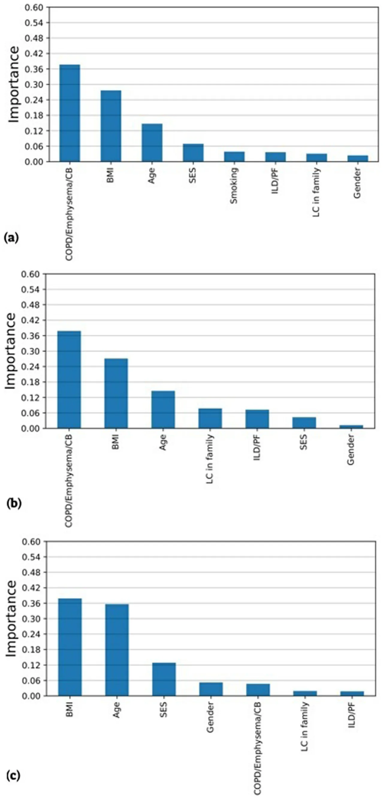
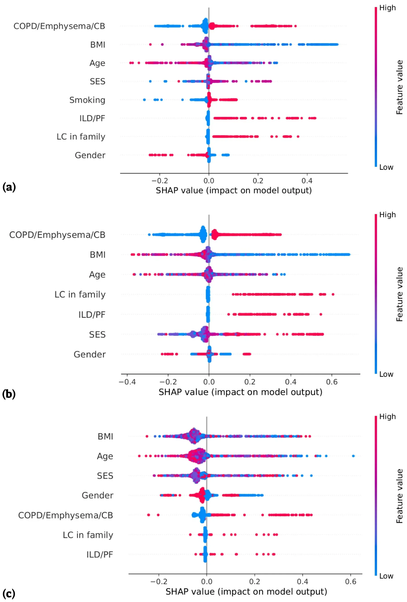

## 1. Introduction

The US Preventive Services Task Force (USPSTF) recommends annual chest LDCT screening for individuals aged 50–79 years with a smoking history of at least 20 pack years, including those who quit within the last 15 years [1]. However, the current guidelines do not specifically address the screening of certain populations with lower risk factors, such as nonsmokers, light smokers, and passive smokers. The *Abbreviations:* AI, artificial intelligence; BMI, body mass index; CB, chronic bronchitis; COPD, chronic obstructive pulmonary disease; CHS, ’Clalit Health Services’; EMR, electronic medical record; HMO, Health Maintenance Organization; ILD, interstitial lung disease; IRB, Institutional Review Board; ML, machine learning; LDCT, low-dose computed tomography; LC, lung cancer; NLST, National Lung Screening Trial; PCC, Pearson correlation coefficient; PF, pulmonary fibrosis; PPV, positive predictive value; SES, socioeconomic status; SHAP, SHapley Additive exPlanations; TPOT, tree-based pipeline optimization tool; USPSTF, US Preventive Services Task Force; WHO, World Health Organization; PACS, picture archiving and communication system.

\* Correspondence to: ’Clalit Health Services’, Pulmonary Clinic, 119 Rothschild St., Petah-Tiqwa 4933355, Israel.

- *E-mail address:* dekels1@zahav.net.il (D. Shlomi).
- 1 Equal contribution.
- 2 As part of the academic requirement for the MD degree, Ariel University (instructed by Dr. Dekel Shlomi).

assessment of risk becomes even more complex when considering additional factors such as chronic lung diseases, family history of LC, occupational exposure, exposure to air pollution, ethnic or geographic variations and socioeconomic status (SES). For example, compared to people with a high SES, people with a lower SES tend to have a greater likelihood of developing and dying from LC [2]. Additionally, higher body mass index (BMI) was found to be associated with lower lung cancer mortality [3].

A personalized prediction based on personal criteria is superior to uniform recommendations for high-risk populations and has the potential to better detect LC at an early stage with personal screening schedules which may result in better compliance. In a retrospective study, nine risk prediction models for LC incidence or mortality were evaluated using data from two randomized controlled trials, the National Lung Screening Trial (NLST) [4] and the Prostate, Lung, Colorectal, and Ovarian Cancer Screening Trial (PLCO) [5], to better select patients for LC screening programs. The study revealed that 3 of the models yielded a sensitivity *>* 79.8 % and a specificity *>* 62.3 % for predicting the incidence of LC within six years. Using the NLST eligibility criteria yielded lower sensitivity (71.4 %) and a similar specificity (62.2) [6].

A potential solution to address the limitations associated with LDCT screening is to utilize artificial intelligence (AI) tools which can utilize tremendous amount of data. For example, a deep learning system based on 3D convolutional neural networks and multitask learning of lung nodules, achieved 63.3 % accuracy (F1 score) in the classification of adenocarcinoma histology than four radiologist (51–56.6 %) [7]. Another example is the use of machine learning (ML) models that utilize blood tests for LC diagnosis. Yoon and colleagues reported an accuracy of 0.988 for LC diagnosis, with a sensitivity of 93.3 % and a specificity of 92 % using 6 biomarkers (human epididymis secretory protein 4 [HE4], carcinoembryonic antigen [CEA], regulated on activation, normal T cell expressed and secreted [RANTES], apolipoprotein A2 [ApoA2], trans-thyretin [TTR], and secretory vascular cell adhesion molecule-1 [sVCAM-1]) with age [8].

The objective of this study is to create a ML-driven decision-making model based on known risk factors (age, gender, BMI, smoking status, SES, chronic obstructive pulmonary disease (COPD)/emphysema/chronic bronchitis (CB), interstitial lung disease (ILD)/pulmonary fibrosis (PF), and a family history of LC from the electronic medical records (EMRs) of patients with and without LC. Our hypothesis is that by using ML, known clinical risk factors could predict the personal risk for LC in both high-risk and low-risk populations.

## 2. Method

### 2.1. Study design

This study is a branch of research dealing with LC prediction through the analysis of CT images and medical record data using AI technology. The overall study is a retrospective study that is based on the medical files of patients in ’Clalit Health Services’ (CHS), the largest publicly funded Health Maintenance Organization (HMO) in Israel. The Inclusion criteria were adults, men and women aged 35 years and older, who underwent chest CT in a medical center, or a clinic connected to the picture archiving and communication system (PACS) of the CHS between 1.1.2005 and 31.12.2022. We excluded patients who were diagnosed with cancer other than LC prior to undergoing CT. The study population included patients who underwent chest CT up to approximately 5.5 years before the LC diagnosis. For each LC patient, the control group included 2 matched participants according to age (by year of birth), gender, and smoking status (any positive smoking history vs. never-smoking history) who were not diagnosed with LC. Patients in the control group who were not alive at the year in which LC was diagnosed among their matched patient were excluded.

### 2.2. Risk factor selection

In this study, we extracted basic risk factors for LC of age, gender, BMI, smoking history, SES, history of COPD/emphysema/CB, history of ILD/PF, and family history of LC. The chosen BMI values, were the closest and prior to the date of the CT. Smoking data were transformed into binary values due to the absence of continuous monitoring of smoking history for each patient. Consequently, individuals with either a current or past smoking history were categorized as having a positive smoking history, and all others were classified as never-smokers. In instances where medical records lacked information on BMI or SES, average values from the overall study population were utilized to prevent their exclusion from the analyzed population. However, patients without data on smoking history were excluded from the study population.

The analysis encompasses the entire study population, with additional segmentation into two cohorts based on smoking status: positive-smoking history and never-smokers.

The study was approved by the institutional review board (IRB) of Meir Medical Center, Kfar-Saba, Israel (approval no. COM1-0087-21).

### 2.3. Statistical analysis

Comparisons between the groups were made using t-tests for continuous variables and chi-squared tests for categorical variables. Correlation tests between all the chosen parameters were performed using Pearson correlation coefficient (PCC). The statistical analysis was conducted using the phyton programing language (version 3.7.5) [9].

### 2.4. Artificial intelligence model

Using the collected data, we performed a three-step analysis for each of the data subsets (all the datasets, only smokers, only nonsmokers). First, we carefully divided the data into training and validation cohorts for proper model training and evaluation. Afterward, we obtained the LC development prediction model using an ML-based approach. Importantly, the model’s architecture, as well as the hyperparameter values, are obtained using the tree-based pipeline optimization tool (TPOT) model which utilizes a genetic algorithm [10]. Finally, based on the obtained model, we evaluated the importance of each of the model’s parameters for learning the clinical reasoning revealed by the model (Supplement 1).

The outcomes of the model are conveyed through four key metrics: accuracy, recall, and precision. These parameters collectively provide a comprehensive assessment of the model’s performance, offering insights into its ability to correctly classify instances (accuracy), identify relevant cases among the actual positives (recall or sensitivity), precisely pinpoint positive predictions (precision or positive predictive value (PPV)) and determine the F1 score, which is another tool for assessing the accuracy of the model and combines precision and recall using their harmonic means.

SHapley Additive exPlanations (SHAP) analysis was employed to understand the impact of various features on the prediction models obtained. SHAP values explain the output of a ML model by assigning the contribution of each individual feature to a specific prediction. Originating from game theory, SHAP analysis offers a method to estimate the contribution of features to the model’s final prediction. These SHAP values measure how much each feature influences the prediction in feature importance analysis. A positive SHAP value for a feature means that it positively contributes to the prediction, while a negative value indicates a negative impact.

## 3. Results

Of the 4094 patients, 18 patients were excluded due to lack of smoking history, and of the remaining 4076 patients, 1428 (35 %) were in the LC group and 2648 (65 %) were in the control group. Information regarding BMI and SES was lacking for 36 (0.9 %) and 165 (4 %) of the patients, respectively, and average values from the overall study population were assigned instead. Table 1 summarizes the differences in selected parameters between these two groups. BMI was slightly but significantly lower in the LC group than in the control group (27 vs. 28 respectively, p *<* 0.001) and smoking history (current or past) was more prevalent (74 % vs. 68 %, respectively, p *<* 0.001). COPD/emphysema/ CB were more prevalent in the LC group than in the control group (78 % vs. 69 %, respectively, p *<* 0.001) and there was a small difference in the prevalence of ILD/PF (7 % vs. 5 %, respectively, p = 0.003). Moreover, a small difference was found in the prevalence of a positive family history of LC between the LC and control groups (1.4 % vs. 0.4 %, respectively, p = 0.001); however, the number of patients included in the comparison was small. Since the year of birth and gender were matched between the LC and the controlled groups, there were no significant differences between them. Additionally, there were no significant differences in SES between the two groups.

Comparisons between patients with a positive smoking history (current or past) and never smokers are described in Table 2. Differences between the LC and control groups were similar among patients in the positive smoking history group and the entire study population. However, among the never-smoking cohort, no significant differences were found between the LC group and the control group.

We also compared LC patients with and without a smoking history (Table 2). There was a significantly greater proportion of male LC patients with a positive smoking history than never smokers (70 % vs. 36 %, respectively, p *<* 0.001), as well as a greater prevalence of COPD/emphysema/CB (83 % vs. 64 %, respectively, p *<* 0.001) and ILD/PF (8 % vs. 4 %, respectively, p = 0.02). However, the age at which LC was diagnosed in the smoker population was significantly lower than that in the never smoker population (68 % vs. 74 %, respectively, p *<* 0.001).

<figure class="table-figure" id="table-1">
<figcaption><strong>Table 1</strong> Characteristics of the study population.</figcaption>

<table><tr><th></th><th></th><th>Total</th><th>Lung</th><th>Without lung</th><th>p-value</th></tr><tr><td></td><td></td><td></td><td>cancer</td><td>cancer</td><td></td></tr><tr><td></td><td></td><td>(n = 4076)</td><td>(n = 1428)</td><td>(n = 2648)</td><td></td></tr><tr><td>Age</td><td></td><td></td><td></td><td></td><td>0.58</td></tr><tr><td></td><td>Mean (SD)</td><td>69.5 (10.5)</td><td>69.6 (10.5)</td><td>69.4 (10.5)</td><td></td></tr><tr><td></td><td>Median</td><td>69.5</td><td>69.6</td><td>69.5</td><td></td></tr><tr><td></td><td>(IQR)</td><td>(63.1,76.8)</td><td>(63.3,76.8)</td><td>(63.1,76.7)</td><td></td></tr><tr><td>Gender</td><td></td><td></td><td></td><td></td><td>0.55</td></tr><tr><td></td><td>Male (%)</td><td>2475 (60.7)</td><td>876 (61.3)</td><td>1599 (60.4)</td><td></td></tr><tr><td>BMI (kg/m2)</td><td></td><td>27.5 (5.4)</td><td>26.8 (5.3)</td><td>27.8 (5.5)</td><td>&lt; 0.001</td></tr><tr><td>Smoking</td><td>(%)</td><td></td><td></td><td></td><td>&lt; 0.001</td></tr><tr><td></td><td>Never</td><td>1212 (29.7)</td><td>371 (26.0)</td><td>841 (31.8)</td><td></td></tr><tr><td></td><td>Past or</td><td>2864</td><td>1057 (74.0)</td><td>1807 (68.2)</td><td></td></tr><tr><td></td><td>current</td><td>(70.3)</td><td></td><td></td><td></td></tr><tr><td>SES</td><td></td><td></td><td></td><td></td><td>0.22</td></tr><tr class="row-group"><td>(%)</td><td></td><td></td><td></td><td></td><td></td></tr><tr><td></td><td>Very Low</td><td>70 (1.7)</td><td>25 (1.8)</td><td>45 (1.7)</td><td></td></tr><tr><td></td><td>Low</td><td>886 (21.7)</td><td>334 (23.4)</td><td>552 (20.8)</td><td></td></tr><tr><td></td><td>Medium</td><td>1496 (36.7)</td><td>527 (36.9)</td><td>969 (36.6)</td><td></td></tr><tr><td></td><td>High</td><td>1148 (28.2)</td><td>392 (27.5)</td><td>756 (28.5)</td><td></td></tr><tr><td></td><td>Very High</td><td>476 (11.7)</td><td>150 (10.5)</td><td>326 (12.3)</td><td></td></tr><tr><td>CB (%)</td><td>COPD/emphysema/</td><td>2953 (72.4)</td><td>1118 (78.3)</td><td>1835 (69.3)</td><td>&lt; 0.001</td></tr><tr><td>ILD/PF (%)</td><td></td><td>223 (5.5)</td><td>99 (6.9)</td><td>124 (4.7)</td><td>0.003</td></tr><tr><td>Family (%)</td><td>history of LC</td><td>31 (0.8)</td><td>20 (1.4)</td><td>11 (0.4)</td><td>0.001</td></tr></table>

BMI, body mass index; CB, chronic bronchitis; COPD, chronic obstructive pulmonary disease; ILD, interstitial lung diseases; IQR, interquartile range; LC, lung cancer; PF, pulmonary fibrosis; SD, standard deviation, SES, socioeconomic status.

</figure>

### 3.1. Artificial intelligence model

We established a binary classification model based on the Tree-based Pipeline Optimization Tool (TPOT), an automatic ML method. Namely, we obtained an ensemble between the Random Forest and XGboost models [11] such that the maximum depth of the trees in the Random Forest is four while the maximum depth of the XGboost model is five. The performance of this model was rigorously assessed using standard metrics, which included accuracy, recall (sensitivity), precision (PPV), and the F1-score.

For the entire study population, our model achieved an accuracy of 71.2 % with a sensitivity of 69 %, a positive predictive value (PPV) of 74 % and an F1-score of 71.4 %. Greater accuracy was achieved for the two subgroups. An accuracy of 74.8 % (sensitivity 72 %, PPV 76 %, F1- score 74.2 %) and 73.0 % (sensitivity 76 %, PPV 72 %, F1-score 73.6 %) were achieved for the smoking and never-smoking cohorts respectively (Table 3).

Fig. 1a illustrates the average contribution (importance) of individual features to AI model for the entire study population. The most prominent contributor was a personal history of COPD/emphysema/CB (37.7 %), followed by BMI (27.7 %) and age (14.7 %).

To understand the contribution of the values of each parameter to the final prediction, we performed a SHAP analysis (Fig. 2). For each parameter, the x-axis indicates the feature contribution to the LC risk, where values above 0 increase the risk and those below 0 reduce the risk. The y-axis for each feature indicates the parameter average contribution, where a horizontally higher signal represents a greater contribution. In addition, the ’beeswarm’ chart adds color coding of each dot based on how the feature value for those individuals compares to the average for the entire population. The redder the color is, the higher the value from the mean of the specific test result, and the bluer the color, the lower the value. For the noncontinuous variables in this study, a red hue was assigned to individuals with a positive personal history of COPD/emphysema/CB, ILD/PF, a positive smoking history or a familial history of LC. Conversely, the absence of any such records is indicated by a blue color. For the SES, the redder the color is the lower status. For gender, red represents women, and blue represents men.

For the entire study population, there was a very distinct discrimination in which the presence of COPD/emphysema/CB, ILD/PF, LC in family members and a positive smoking history increased the risk for LC, and their absence decreased (Fig. 2a). Furthermore, male gender contributed to greater risk, while the female gender contributed to a lower risk. For BMI, which is the second most contributing feature of the model, lower values from the mean contributed more to increased risk for LC, and higher values did not contribute significantly. The SHAP distribution of age and SES revealed inconsistent behavior.

Subgroup analyses revealed parallel patterns between the entire study population model and the positive smoking history subgroup (Fig. 1b), except for SES, which contributed more to the former (6.9 %) than to the latter (4.3 %). On the other hand, positive LC in the family contributed more to the model in patients with a positive smoking history (7.7 %) than in the entire study population (3.1 %). In the SHAP distribution, similar patterns were found for most parameters among patients with a positive smoking history (Fig. 2b) and the entire study population (Fig. 2a). SES becomes more dichotomic among patients with a positive smoking history, in which the lower the SES the greater the LC risk, while gender becomes more chaotic. In contrast, for never smokers, BMI emerged as the primary contributor (37.8 %), followed by age (35.6 %) and SES (12.9 %), as represented in Fig. 1c). The SHAP distribution demonstrated more chaotic patterns except for the presence of COPD/emphysema/CB which maintained much of the dichotomic pattern (Fig. 2c).

## 4. Discussion

In this study, we evaluated the performance of a unique ML algorithm in predicting LC. The accuracy of the entire study population for predicting LC was 71.2 %. Better accuracy was found when analyzing the two subgroups of smokers and never-smokers. A slightly greater accuracy was found for patients with a positive smoking history than for never-smokers (74.8 % vs. 0.73 %, respectively). These small differences and the fact that the importance of smoking was fifth in this model could be explained by the matching of smoking between the LC and control groups. In this study, personal history of COPD/emphysema/CB was identified as the most important feature, responsible for 37.7 % of the proposed models’ decisions. Its effect on the never smoker group was, as expected, low (4.7 %). However, since most patients with these diseases have a smoking background, one can speculate that the data regarding smoking history were not fully accurate due to either incorrect reporting or incomplete records of smoking background. Nonetheless, some patients may have been exposed to secondhand smoke or have occupational risks. COPD has been found as an independent risk factor for lung carcinoma [12,13], as well as emphysema [13,14] and CB [13]. Cohort studies have indicated that patients with COPD are 2–6 times more likely to develop LC than are those without COPD [13,15–18].

<figure class="table-figure" id="table-2">
<figcaption><strong>Table 2</strong> Comparisons of the study population according to smoking history.</figcaption>

<table><tr><th></th><th></th><th colspan="2">Positive smoking history</th><th></th><th></th><th>p-value Total*</th><th>Never-smokers</th><th></th><th></th><th></th><th>p-value Cancer*</th></tr><tr><th></th><th></th><th>Total (n = 2864)</th><th>Lung cancer (n = 1057)</th><th>Control (n = 1807)</th><th>p-value</th><th></th><th>Total (n = 1212)</th><th>Lung cancer (n = 371)</th><th>Control (n = 841)</th><th>p- value</th><th></th></tr><tr><td>Age</td><td></td><td></td><td></td><td></td><td>0.31</td><td>&lt; 0.001</td><td></td><td></td><td></td><td>0.48</td><td>&lt; 0.001</td></tr><tr><td></td><td>Mean (SD)</td><td>68.3 (9.6)</td><td>68.8 (9.7)</td><td>68.0 (9.6)</td><td></td><td></td><td>72.4 (11.9)</td><td>72.1 (12.3)</td><td>72.6 (11.8)</td><td></td><td></td></tr><tr><td></td><td>Median</td><td>68.4</td><td>68.8</td><td>68.2</td><td></td><td></td><td>73.9</td><td>73.2</td><td>74.1</td><td></td><td></td></tr><tr><td></td><td>(IQR)</td><td>(62.6,74.5)</td><td>(62.97,75.13)</td><td>(62.3,74.1)</td><td></td><td></td><td>(64.6,81.2)</td><td>(64.1,81.1)</td><td>(74.8,81.2)</td><td></td><td></td></tr><tr><td>Gender</td><td></td><td></td><td></td><td></td><td>0.751</td><td>&lt; 0.001</td><td></td><td></td><td></td><td>0.14</td><td>&lt; 0.001</td></tr><tr><td></td><td>Male (%)</td><td>2003 (69.9)</td><td>743 (70.3)</td><td>1260 (69.7)</td><td></td><td></td><td>472 (38.9)</td><td>133 (35.8)</td><td>339 (40.3)</td><td></td><td></td></tr><tr><td>BMI (kg/m^2)</td><td></td><td>27.20</td><td>26.42 (5.21)</td><td>27.65</td><td>0.005</td><td>&lt; 0.001</td><td>28.09 (5.64)</td><td>27.79</td><td>28.23</td><td>0.21</td><td>0.05</td></tr><tr><td></td><td></td><td>(5.33)</td><td></td><td>(5.35)</td><td></td><td></td><td></td><td>(5.52)</td><td>(5.70)</td><td></td><td></td></tr><tr><td>SES (%)</td><td></td><td></td><td></td><td></td><td>0.165</td><td>0.13</td><td></td><td></td><td></td><td>0.72</td><td>0.34</td></tr><tr><td></td><td>Very Low</td><td>47 (1.6)</td><td>17 (1.6)</td><td>30 (1.7)</td><td></td><td></td><td>23 (1.9)</td><td>8 (2.2)</td><td>15 (1.8)</td><td></td><td></td></tr><tr><td></td><td>Low)</td><td>624 (21.8)</td><td>251 (23.7)</td><td>373 (20.6)</td><td></td><td></td><td>262 (21.6)</td><td>83 (22.4)</td><td>179 (21.3)</td><td></td><td></td></tr><tr><td></td><td>Medium</td><td>1082 (37.8)</td><td>395 (37.4)</td><td>687 (38.0)</td><td></td><td></td><td>414 (34.2)</td><td>132 (35.6)</td><td>282 (33.5)</td><td></td><td></td></tr><tr><td></td><td>High</td><td>794 (27.7)</td><td>293 (27.7)</td><td>501 (27.7)</td><td></td><td></td><td>354 (29.2)</td><td>99 (26.7)</td><td>255 (30.3)</td><td></td><td></td></tr><tr><td></td><td>Very High</td><td>317 (11.1)</td><td>101 (9.6)</td><td>216 (12.0)</td><td></td><td></td><td>159 (13.1)</td><td>49 (13.2)</td><td>110 (13.1)</td><td></td><td></td></tr><tr><td></td><td>COPD/emphysema/CB</td><td>(%) 2191 (76.5)</td><td>880 (83.3)</td><td>1311 (72.6)</td><td>&lt; 0.001</td><td>&lt; 0.001</td><td>762 (62.9 %)</td><td>238 (64.2 %)</td><td>524 (62.3 %)</td><td>0.54</td><td>&lt; 0.001</td></tr><tr><td>ILD/PF (%)</td><td></td><td>164 (5.7)</td><td>83 (7.9)</td><td>81 (4.5)</td><td>&lt; 0.001</td><td>0.27</td><td>59 (4.9)</td><td>16 (4.3)</td><td>43 (5.1)</td><td>0.55</td><td>0.02</td></tr><tr><td>Family</td><td>history of LC (%)</td><td>27 (0.9)</td><td>18 (1.7)</td><td>9 (0.5)</td><td>0.002</td><td>0.04</td><td>4 (0.3)</td><td>2 (0.5)</td><td>2 (0.2)</td><td>0.4</td><td>0.10</td></tr></table>

BMI, body mass index; CB, chronic bronchitis; COPD, chronic obstructive pulmonary disease; ILD, interstitial lung diseases; IQR, interquartile range; LC, lung cancer; PF, pulmonary fibrosis; SD, standard deviation, SES, socioeconomic status. * Lung cancers of positive smoking history vs. never smokers.

</figure>

<figure class="table-figure" id="table-3">
<figcaption><strong>Table 3</strong> Machine-learning-based models performance.</figcaption>

<table><tr><th>Dataset</th><th>Accuracy</th><th>Recall*</th><th>Precisiona</th><th>F1-score</th></tr><tr><td>All</td><td>0.712</td><td>0.689</td><td>0.74</td><td>0.714</td></tr><tr><td>Smokers</td><td>0.748</td><td>0.723</td><td>0.764</td><td>0.742</td></tr><tr><td>Non-smokers</td><td>0.73</td><td>0.755</td><td>0.717</td><td>0.736</td></tr></table>

* Sensitivity. a Positive predictive value, PPV.

</figure>

BMI was the second most important factor in this study model (27.7 % for the general study population) with an interesting effect. Greater importance was found in the never-smokers group (37.8 %), while its value effect could not be predicted (chaotic distribution, Fig. 2c). On the other hand, within the smoking groups, although the importance was lower (27.1 %), its contribution tended to be more organized with lower values from the mean associated with increased risk and higher values associated with decreased risk for LC (Fig. 2b). Being overweight has been previously identified as a risk factor for most malignancies [19–22]. The incidence of LC, on the other hand, was found to have an inverse relationship with BMI, such that a higher BMI (25–34.9 kg/m2) was associated with reduced mortality. One possible explanation is in obese individuals, the p53 tumor suppressor gene which plays a critical role in decreasing the risk of LC, is highly upre-gulated [23].

Age, which was the third most contributing feature of the proposed model in the general and smokers’ populations (14.7 % and 14.6 %, respectively), became the second most important feature for the never-smokers group (35.6 %). However, its chaotic contributions, as expressed in the SHAP distribution, may represent a dilution effect due to the matching between the LC and control groups.

In this study, males had a greater risk for LC among patients with a positive smoking history, while a more chaotic pattern was found in never smokers. This could be partially explained by the proportion of men, which was significantly greater among patients with a positive smoking history than among those who never smoked (70 % vs. 36 %, respectively). As previously reported, a greater proportion of women with LC than men (9 %) had a negative smoking history (19 %) [24].

SES, in this study, became more important in the never smoker group than in the positive smoking history group (12.9 % vs. 4.3 %, respectively). In previous publications, LC incidence was reported to be greater among people with lower SES, as indicated by education, income, or occupation [25], and according to both personal and area-based indicators [26].

A positive diagnosis of ILD/PF was found in this study to increase the risk of LC, mainly among patients with a positive smoking history, as shown in previous studies [27,28]. The lower association in never smokers in this study could also be due to the small number of patients with ILD/PF in this subgroup.

Interestingly, LC in the family had a greater contribution to the model among patients with a positive smoking history than among those who were never smokers (4.3 % vs. 1.9 %, respectively). According to a systematic review of the relationship between family history and LC, the risk appears to be greater in patients whose relatives were diagnosed at a young age (45–60 years) and in those with multiple affected family members [29]. A complex interaction between genetic and environmental factors could explain the greater risk for LC in smokers with a family history of LC. Cote and colleagues demonstrated a 1.51-fold increase in the risk of LC among individuals with a first degree relative with LC. The combination of ever smoking and a first degree relative with LC was found to increase the risk for LC by 3.19-fold compared to never-smokers without a first-degree family history of lung cancer [30].

<figure id="fig-1">

<figcaption><strong>Fig. 1.</strong> Mean contribution (importance) of each parameter to the AI model. (a) The entire study database. (b) Positive-smoking history (c) Never smokers. BMI, body mass index; CB, chronic bronchitis; COPD, chronic obstructive pulmonary disease; ILD, interstitial lung diseases; LC, lung cancer; PF, pulmonary fibrosis; SES, socioeconomic status.</figcaption>
</figure>

<figure id="fig-2">

<figcaption><strong>Fig. 2.</strong> Shapley Additive Explanations (SHAP) (a) The entire study database. (b) Positive-smoking history (c) Never smokers. BMI, body mass index; CB, chronic bronchitis; COPD, chronic obstructive pulmonary disease; ILD, interstitial lung diseases; LC, lung cancer; PF, pulmonary fibrosis; SES, socioeconomic status.</figcaption>
</figure>

The findings of our study have several limitations. First, as a retrospective study, patients were not recruited and monitored annually or evaluated by a pulmonologist. Second, age, gender and smoking history were matched between the LC and control groups, which reduced their effect. Nonetheless, these risk factors remained strong predictors for LC. Furthermore, although there was massive information from the EMRs, the significant heterogeneity in the data collected in the past and its timing influenced the ML results. For example, the data regarding smoking were not dated in all patients to the LC diagnosis and were not collected at a high frequency for the entire study population. Additionally, in 0.9 % and 4 % of the patients, data regarding BMI and SES respectively, were lacking, and average values from the overall study population were assigned to maintain these patients in the study.

In conclusion, the proposed AI model provides relatively accurate predictions (71.2 %) of LC using criteria of known clinical risk factors from medical files. Better accuracy was demonstrated for patients with a positive smoking history (74.8 %) than for never-smokers (73 %). The presence of COPD, emphysema and CB were the most important contributors for patients with any positive smoking history, followed by lower BMI and age. BMI, age and SES contributed the most to the never-smoking patients. We suggest that beyond smoking and age, patients with chronic lung disease, lower BMI and lower SES should be encouraged for LC screening programs using LDCT. Further AI studies are suggested to further validate these results and explore possible improvements through combinations of other data sources.

## Ethics approval statement

The study was approved by the institutional review board (IRB) of Meir Medical Center, Kfar-Saba, Israel (approval no. 0079–21-COM1).

## Funding

This study is part of a research that was partially founded by a grant from The Guardian General and Director of Inheritance Affairs, Ministry of Justice, Israel.

## CRediT authorship contribution statement

**Matanel Levi:** Writing – original draft, Visualization, Software, Investigation, Formal analysis. **Teddy Lazebnik:** Visualization, Validation, Software, Methodology, Investigation, Formal analysis, Conceptualization. **Shiri Kushnir:** Data curation. **Noga Yosef:** Project administration. **Dekel Shlomi:** Writing – review & editing, Writing – original draft, Supervision, Methodology, Investigation, Conceptualization.

## Declaration of Competing Interest

Dr. Shlomi was paid by the grant of this study for his role as a medical consulter. All other authors have nothing to declare*.*

## Data availability statement

Except for statistical analysis, the data underlying this article cannot be shared publicly due to privacy issues such as personal details of the study participants. The data will be shared upon reasonable request to the corresponding author.

## Acknowledgements

Dr. Shlomi would like to thank The Guardian General and Director of Inheritance Affairs, Ministry of Justice, Israel for the research grant in appreciation of a generous bequest from the estate of Marlene Eisenberg, Los Angeles, USA, in memory of her cherished parents, Sam and Sadie Eisenberg, and beloved brother, Allan Eisenberg.

## Informed Consent Statement

Since the study was conducted retrospectively, the IRB approved this study without obtaining signed informed consent from the study participants.

## Appendix A. Supporting information

Supplementary data associated with this article can be found in the online version at doi:10.1016/j.canep.2024.102631.

## References

1. A.H. Krist, K.W. Davidson, C.M. Mangione, et al., Screening for lung cancer: US preventive services task force recommendation statement, JAMA - J. Am. Med. Assoc. 325 (10) (2021) 962–970, [doi:10.1001/jama.2021.1117](https://doi.org/10.1001/jama.2021.1117)
2. D. Redondo-Sánchez, D. Petrova, M. Rodríguez-Barranco, P. Fernández-Navarro, J. J. Jiménez-Moleón, M.J. Sánchez, Socio-economic inequalities in lung cancer outcomes: an overview of systematic reviews, Cancers 14 (2) (2022), [doi:10.3390/cancers14020398](https://doi.org/10.3390/cancers14020398)
3. C.C. Leung, T.H. Lam, W.W. Yew, W.M. Chan, W.S. Law, C.M. Tam, Lower lung cancer mortality in obesity, Int. J. Epidemiol. 40 (1) (2011) 174–182, [doi:10.1093/ije/dyq134](https://doi.org/10.1093/ije/dyq134)
4. D.R. Aberle, A.M. Adams, C.D. Berg, et al., Reduced lung-cancer mortality with low-dose computed tomographic screening – the national lung screening trial research team, N. Engl. J. Med. 365 (2011) 5. [doi:10.1093/ije/dyq134](https://doi.org/10.1093/ije/dyq134) · [link](http://refhub.elsevier.com/S1877-7821%2824%2900110-3/sbref4)
5. J.K. Gohagan, P.C. Prorok, R.B. Hayes, B.S. Kramer, The prostate, lung, colorectal and ovarian (PLCO) cancer screening trial of the national cancer institute: history, organization, and status, Control Clin. Trials 21 (6 Suppl.) (2000), [doi:10.1016/s0197-2456(00)00097-0](https://doi.org/10.1016/s0197-2456%2800%2900097-0) · [link](http://refhub.elsevier.com/S1877-7821%2824%2900110-3/sbref4)
6. K. ten Haaf, J. Jeon, M.C. Tammemägi, et al., Risk prediction models for selection of lung cancer screening candidates: a retrospective validation study, PLoS Med. 14 (4) (2017), [doi:10.1371/journal.pmed.1002277](https://doi.org/10.1371/journal.pmed.1002277)
7. W. Zhao, J. Yang, Y. Sun, et al., 3D deep learning from CT scans predicts tumor invasiveness of subcentimeter pulmonary adenocarcinomas, Cancer Res. 78 (24) (2018), [doi:10.1158/0008-5472.CAN-18-0696](https://doi.org/10.1158/0008-5472.CAN-18-0696)
8. H.Il Yoon, O.R. Kwon, K.N. Kang, et al., Diagnostic value of combining tumor and inflammatory markers in lung cancer, J. Cancer Prev. 21 (3) (2016), [doi:10.15430/jcp.2016.21.3.187](https://doi.org/10.15430/jcp.2016.21.3.187)
9. Hans Petter Langtangen, A Primer on Scientific Programming with Python, 2016. [doi:10.15430/jcp.2016.21.3.187](https://doi.org/10.15430/jcp.2016.21.3.187)
10. L. Parmentier, O. Nicol, L. Jourdan, M.E. Kessaci, TPOT-SH: a faster optimization algorithm to solve the AutoML problem on large datasets, in: Proceedings - International Conference on Tools with Artificial Intelligence, ICTAI, vol. 2010- November, 2019. 〈 [doi:10.1109/ICTAI.2019.00072〉](https://doi.org/10.1109/ICTAI.2019.00072〉)
11. A. Shmuel, O. Glickman, T. Lazebnik, Symbolic regression as a feature engineering method for machine and deep learning regression tasks, Mach. Learn. Sci. Technol. 5 (2) (2024), [doi:10.1088/2632-2153/ad513a](https://doi.org/10.1088/2632-2153/ad513a)
12. A.L. Durham, I.M. Adcock, The relationship between COPD and lung cancer, Lung Cancer 90 (2) (2015) 121–127, [doi:10.1016/j.lungcan.2015.08.017](https://doi.org/10.1016/j.lungcan.2015.08.017)
13. J. Koshiol, M. Rotunno, D. Consonni, et al., Chronic obstructive pulmonary disease and altered risk of lung cancer in a population-based case-control study, PLoS One 4 (10) (2009), [doi:10.1371/journal.pone.0007380](https://doi.org/10.1371/journal.pone.0007380)
14. R.A. Tubío-Pérez, M. Torres-Durán, M. Pérez-Ríos, A. Fernández-Villar, A. Ruano- Raviña, Lung emphysema and lung cancer: what do we know about it, Ann. Transl. Med. 8 (21) (2020), (1471-1471). [doi:10.21037/atm-20-1180](https://doi.org/10.21037/atm-20-1180)
15. D.M. Skillrud, K.P. Offord, R.D. Miller, Higher risk of lung cancer in chronic obstructive pulmonary disease. A prospective, matched, controlled study, Ann. Intern. Med. 105 (4) (1986) 503–507, [doi:10.7326/0003-4819-105-4-503](https://doi.org/10.7326/0003-4819-105-4-503)
16. E. Calabr\`o, G. Randi, C. La Vecchia, et al., Lung function predicts lung cancer risk in smokers: a tool for targeting screening programmes, Eur. Respir. J. 35 (1) (2010) 146–151, [doi:10.1183/09031936.00049909](https://doi.org/10.1183/09031936.00049909)
17. J. Gonzalez, M. Marín, P. Sánchez-Salcedo, J.J. Zulueta, Lung cancer screening in patients with chronic obstructive pulmonary disease, Ann. Transl. Med. 4 (8) (2016), [doi:10.21037/atm.2016.03.57](https://doi.org/10.21037/atm.2016.03.57)
18. J.P. de Torres, G. Bastarrika, J.P. Wisnivesky, et al., Assessing the relationship between lung cancer risk and emphysema detected on low-dose CT of the chest, Chest 132 (6) (2007) 1932–1938, [doi:10.1378/chest.07-1490](https://doi.org/10.1378/chest.07-1490)
19. E.E. Calle, R. Kaaks, Overweight, obesity and cancer: epidemiological evidence and proposed mechanisms, Nat. Rev. Cancer 4 (8) (2004) 579–591, [doi:10.1038/nrc1408](https://doi.org/10.1038/nrc1408)
20. A.G. Renehan, I. Soerjomataram, M.F. Leitzmann, Interpreting the epidemiological evidence linking obesity and cancer: a framework for population-attributable risk estimations in Europe, Eur. J. Cancer 46 (14) (2010) 2581–2592, [doi:10.1016/j.ejca.2010.07.052](https://doi.org/10.1016/j.ejca.2010.07.052)
21. K. Bhaskaran, I. Douglas, H. Forbes, I. dos-Santos-Silva, D.A. Leon, L. Smeeth, Body-mass index and risk of 22 specific cancers: a population-based cohort study of 5.24 million UK adults, Lancet 384 (9945) (2014) 755–765, [doi:10.1016/S0140-6736(14)60892-8](https://doi.org/10.1016/S0140-6736%2814%2960892-8)
22. A.G. Renehan, M. Tyson, M. Egger, R.F. Heller, M. Zwahlen, Body-mass index and incidence of cancer: a systematic review and meta-analysis of prospective observational studies, Lancet 371 (9612) (2008) 569–578, [doi:10.1016/S0140-6736(08)60269-X](https://doi.org/10.1016/S0140-6736%2808%2960269-X)
23. Y. Vedire, S. Kalvapudi, S. Yendamuri, Obesity and lung cancer—a narrative review, J. Thorac. Dis. 15 (5) (2023) 2806–2823, [doi:10.21037/jtd-22-1835](https://doi.org/10.21037/jtd-22-1835)
24. S. Dubin, D. Griffin, Lung cancer in non-smokers, Mo Med. 117 (2020) 375–379. [link](http://refhub.elsevier.com/S1877-7821%2824%2900110-3/sbref22)
25. A. Sidorchuk, E. Agardh, O. Aremu, J. Hallqvist, P. Allebeck, T. Moradi, Socioeconomic differences in lung cancer incidence: a systematic review and meta-analysis, Cancer Causes Control 20 (2009) 459–471, [doi:10.1007/s10552-009-9300-8](https://doi.org/10.1007/s10552-009-9300-8) · [link](http://refhub.elsevier.com/S1877-7821%2824%2900110-3/sbref22)
26. A. Mihor, S. Tomsic, T. Zagar, K. Lokar, V. Zadnik, Socioeconomic inequalities in cancer incidence in Europe: a comprehensive review of population-based epidemiological studies, Radiol. Oncol. 54 (2020), [doi:10.2478/raon-2020-0008](https://doi.org/10.2478/raon-2020-0008)
27. Q. Gibiot, I. Monnet, P. Levy, et al., Interstitial lung disease associated with lung cancer: a case–control study, J. Clin. Med. 9 (3) (2020), [doi:10.3390/jcm9030700](https://doi.org/10.3390/jcm9030700)
28. J.M. Naccache, Q. Gibiot, I. Monnet, et al., Lung cancer and interstitial lung disease: a literature review, J. Thorac. Dis. 10 (2018) 3829–3844, [doi:10.21037/jtd.2018.05.75](https://doi.org/10.21037/jtd.2018.05.75)
29. A. Matakidou, T. Eisen, R.S. Houlston, Systematic review of the relationship between family history and lung cancer risk, Br. J. Cancer 93 (7) (2005) 825–833, [doi:10.1038/sj.bjc.6602769](https://doi.org/10.1038/sj.bjc.6602769)
30. M.L. Coté, M. Liu, S. Bonassi, et al., Increased risk of lung cancer in individuals with a family history of the disease: a pooled analysis from the International Lung Cancer Consortium, Eur. J. Cancer 48 (13) (2012), [doi:10.1016/j.ejca.2012.01.038](https://doi.org/10.1016/j.ejca.2012.01.038)
