## 1. Introduction and related work

Type 1 diabetes (T1D) is one of the most common chronic diseases of childhood, however, clinical symptoms of the disease may occur later in life [1]. In general, the median age for the disease ranges between six years old and puberty [2]. In the past two decades, T1D became a pandemic [3]. In the United States alone the number of adult T1D patients was estimated to be 1.25 million individuals (0.5% of the population) in 2017 [4]. Similar statistics in Germany and Norway suggest 2.6% and 3.3% incidence increase, respectively [5,6].

In T1D or insulin-dependent diabetes, the pancreas produces little or no insulin, a hormone that facilitates glucose to enter cells in order to produce energy. The autoimmune destruction of pancreatic beta cells is one of the key hallmarks of T1D. Glucose metabolism is mediated by multiple types of cells that interact and are controlled by intrinsic and extrinsic factors. Specific cell types include *β*-cells, T-cells, resting and activated macrophages and dendritic cells [7]. Formally, *β*-cells are cells that make insulin which is a hormone that controls the level of glucose in the blood. For T1D patients, the immune system destroys the *β*-cells due to errors in the identification of the *β*-cell’s proteins. T-cells are part of the immune system, generated by the body’s stem cells that are found in the bone marrow. While there are several types of T-cells, they are all responsible to distinguish invading cells from the body’s cells. Macrophages are a type of white blood cells and also part of the immune system, responsible to engulf and digest pathogens that do not have proteins that are specific to healthy body cells on their surface [8]. A dendritic cell is an antigen-presenting cell that is responsible to process antigen material and allocating it to other cell surfaces for the T-cells to detect [9]. The depleted pool of *β*-cells triggers insulin deficiency and additional pathophysiology including life-threatening hypoglycemia, ketoacidosis, cardiovascular disease, retinopathy, diabetic renal disease, and neuropathy. In a healthy organism, the basic population of *β*-cells is supplemented with additional cells as a response to the increased glucose levels after meals [10,11].

According to the American diabetes association, diagnosis of diabetes includes (a) fasting blood glucose higher than 7 mmol/L, (b) any blood glucose of 11.1 mmol/L or higher with symptoms of hyperglycemia, or (c) an abnormal 2 h oral glucose-tolerance test [12]. T1D is believed to be caused by the immune-mediated destruction of insulin-producing pancreatic *β*-cells [13] as evidenced by the presence of a chronic inflammatory infiltrate that affects pancreatic islets [14]. The main treatment protocol for T1D patients in the last few decades includes exogenous insulin replacement therapy [3]. However, this regimen frequently fails to provide metabolic regulation of multiple T1D-related complications that include cardiovascular disorders, neuropathy, and hypoglycemia [15]. Insulin administration *via* pump [16] is associated with imbalanced therapeutic effects, infections, and pump malfunction.

Recent clinical data demonstrate that T1D patients exhibit a small-to-none number of viable *β*-cells. Notably, regeneration of *β*-cells in infants and young children could still be detected [17,18]. This observation implies that both controlled and well-balanced approaches to modulating the immune system in T1D patients may improve the production of *β*-cells and reduce circulating glucose levels.

Bacillus Calmette–Guérin (BCG) vaccine is one of the oldest immunotherapy in the clinical practice [19]. BCG treatment of the T1D patients was introduced relatively recently [20]. BCG was originally developed to treat tuberculosis (TB) and early (non-muscle invasive) stages of bladder cancer [21–23]. A detailed analysis of the literature describes the utility of BCG to a broad spectrum of autoimmune, allergic, and induced adaptive immune conditions [24–26]. Of particular significance to this work, several instances of BCG vaccine administration in childhood yielded a dramatic improvement of the T1D progression [27].

Namely, a randomized eight-year-long prospective examination of T1D patients with the long-term disease who received two doses of BCG vaccine was reported by Kühtreiber et al. [20]. The authors showed that BCG furnished a robust and lasting control of the blood sugar levels [20]. Furthermore, the authors discovered that BCG induced a systemic shift in glucose metabolism from oxidative phosphorylation to aerobic glycolysis [28,29]. Multiple molecular and cellular variables affect the onset of T1D. We reasoned that a clinically relevant mathematical model that recaptures these parameters, as well as the reported BCG-induced clinical observations, may offer a practical insight into immunotherapy of the disease [30,31]. Thus, the motivation for this modeling attempt is to better understand the possibilities and limitations of BCG-based immunotherapy treatment for T1P which can be further used to conduct more data-driven clinical experiments. Earlier, Maree and Kublik [30] introduced an algorithm that describes the interaction between *β*-cells, T-cells, resting macrophages, active macrophages, and non T-cells and macrophages immune system-related cells as a single type of cells. The authors analyzed the *β*-cells free equilibria which affect T1D. However, the model did not take into consideration the decreased glucose intake, one of the main factors associated with T1D [3]. In our view, this deficiency does not provide insight into the effect of environmental factors, namely dietary glucose. Subsequently, Wu [32] developed an extended strategy that accounts for glucose levels and more detailed cell–cell interactions. The author utilized a multi-compartment model to include the spleen and bloodstream compartments to capture 24 cell types and processes [32]. Whereas the respective single-compartment model reflects data for both healthy and NOD mice, the analysis of the multi-compartment model was not performed due to its size and complexity [32].

Shtylla et al. [33], introduced a model based on a single compartment simulation that captures the dynamics of dendritic cells, *T* cells, and macrophages in the development of T1D. The assumption is that the differences in macrophage clearance rates play a key role in determining whether or not an individual is likely to become diabetic after a significant immune challenge. The model accurately captures the longitudinal course of a T1D treatment in the *in vivo* model that could lead to a practical clinical protocol [33].

The novelty of the proposed model lies in the usage of BCG immunotherapy for T1D. The usage of BCG in T1D is inspired by the clinical trial conducted by [20] and since BCG is known to be an efficient treatment for other autoimmune diseases as such bladder cancer [21] and food allergy [26].

Considering the above, we attempted to further streamline the existing mathematical model of the immunotherapy-based treatment of T1D. We attempted to introduce the reported clinical markers of T1D including molecular and cellular variables as well as their interplay in order to re-evaluate the BCG treatment dynamics described by Faustman et al. [34]. These considerations were applied to the single-compartment model to arrive at both relevant and practical outcomes for a mouse model that in our view may yield specific recommendations for the clinical use of BCG. Our results and presentation are organized as follows. Section 2 provides a biological background of T1D and BCG-related treatment used for the mathematical model. Section 3 deals with numerical analysis of the model using healthy subjects, T1D patients, and corresponding data from the NOD mouse model of T1D. It further defines a baseline behavior followed by the sensitivity analysis of metabolism- and treatment-related parameters including optimal treatment regimen. Section 4 discusses the results including the advantages and limitations of the proposed model, including the personalizing of treatment according to glucose consumption diet, in addition to potential future directions.

<figure id="fig-1">
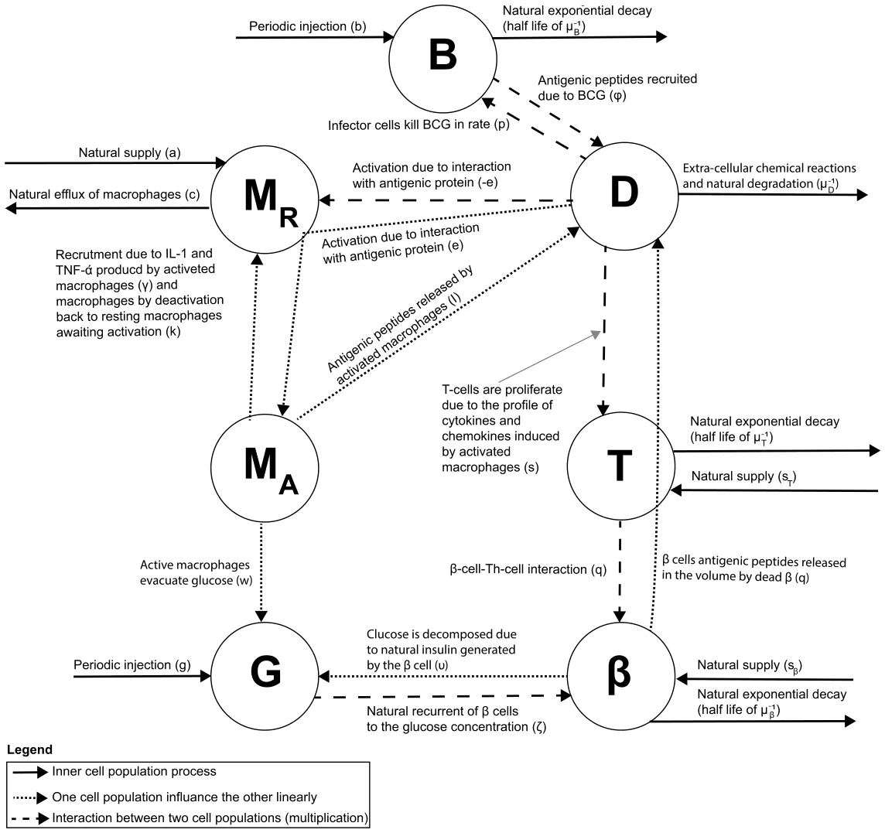
<figcaption><strong>Fig. 1.</strong> A schematic view of the interaction between the cell populations, divided by interaction type, where <em>B, M</em>R<em>, D, M</em>A<em>, T, G</em>, and <em>β</em> stands for BCG-cells, resting macrophages, dendritic cells, active macrophages, autolytic <em>T</em> cells, concentration of glucose, and <em>β</em> cells.</figcaption>
</figure>

## 2. Model definition

The main principle behind the model introduced in this work includes clinically validated, pulsed administration of BCG to increase the amount of *β*-cells in the body to manage and treat T1D [34]. Specifically, we attempted to recapitulate diverse interactions between BCG and the immune system in order to maximize the effect of BCG on the T-cell and *β*-cell counts.

### 2.1. Biological background

Once the resulting pool of *β*-cells metabolizes available glucose, they get inactivated during insulin generation [35] and their interaction with Th-cells [36]. This interaction induces the production of dendritic cells [7,37] that in turn prompt resting macrophages to process intracellular antigenic peptides and to eliminate glucose from the circulation [10]. Notably, active macrophages produce IL-1 and TNF-*α* to recruit resting macrophages. Once this step is completed, active macrophages get deactivated and return to their resting state [37,38]. Importantly, *β*-cell, T-cell, dendritic cell populations are tightly controlled to exhibit exponential decay [38]. It is speculated that as BCG is distributed and eliminated post-injection, it engages the dendritic cells and activated macrophages [39,40] to result in the elevated *β*-cells concentration and overall balancing of glucose metabolism. A summary of this cellular interaction network is shown in Fig. 1.

Considering the evidence accumulated thus far, significant attention was dedicated to the design and development of immunotherapies to address T1D. Of these agents, BCG vaccine attracted particular attention primarily due to an array of immune and induced adaptive immune responses exemplified by its clinical performance in multiple sclerosis [41] and non-muscle invasive bladder cancer [42]. Notably, BCG vaccine was reported to activate immune cells and accelerate glycolysis [40]. Bolus injection of BCG vaccine-induced significant remission in T1D mice vs controls [39].

### 2.2. Mathematical model

The suggested mathematical model is aimed to be both biologically accurate and feasible to yield practical analytical insight into the effect of immunotherapy on T1D. Whereas we acknowledge that the actual interplay between all components of the immune response for the BCG-mediated treatment of T1D is both much more intricate than the suggested model and involves individual immunological background, the attempt is made to capture all key cellular and molecular interactions. Specifically, in order to streamline the model, we combined the immune response to BCG and autoimmune problems related to type 1 diabetes. Similarly, the intraspecific competition reported for the macrophage population, so-called of macrophage crowding was not taken into consideration due to its relatively modest contribution to the T1D pathology long-term. Conversely, we focused on several variables reported in the clinical practice to be decisive in the course of the disease, namely: *B*(*t*) — concentration of BCG in the body; *M*R(*t*) — concentration of resting macrophages; *M*A(*t*) — concentration of activated macrophages; *D*(*t*) — concentration of dendritic cells which are also operating as activated immune-system cells; *G*(*t*) — concentration of glucose; *T* (*t*) — concentration of autolytic *T* cells; and *β*(*t*) — concentration of *β* cells.

Notably, our approach accounts for cell count dynamics resulting from cell–cell interactions as well as pharmacoki-netics and pharmacodynamics processes. These processes are captured using the following system of non-linear, ordinary differential equations (ODEs).

Eq. (1), the dB(t) reflects varying levels of free BCG as a function of time. Based on several clinical observations, the *dt* dynamics is affected by positive and negative processes as follows: (i) a BCG installation of concentration/activity *b >* 0 is injected *N* times, every *τ*B *>* 0 time units (which represented using a Dirac delta function [43]). (ii) BCG is depleted as a result of natural exponential decay with half life of *µ*−1 B . (iii) BCG levels decrease proportionally *p >* 0 to the interactions with effector cells including macrophages and dendritic cells [44].

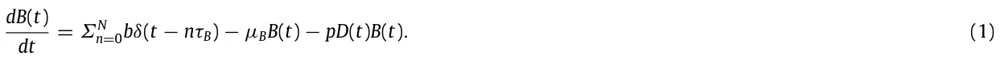

The set of the subsequent equations take into consideration both resting and activating macrophages that are reported to be important players [45].

Eq. (2), the dMR(t) describes the amount of resting macrophages as a function of time. This process is affected by several *dt* positive and negative factors. Positive factors are: (i) the endogenous supply or recruitment rate of resting macrophages *a*, (ii) recruitment rate *γ* of activated macrophages due to IL-1 and TNF-*α* produced by activated macrophages, and (iii) rate of addition of activated macrophages (*k*) by deactivation back to resting macrophages awaiting activation. Negative factors include (i) rate of decrease in the resting macrophage population *c* due to the natural efflux of macrophages [30] and (ii) rate *e* of resting macrophages activation due to their interaction with dendritic cells; this factor is proportional to the antigenic peptide and macrophage’s population size.

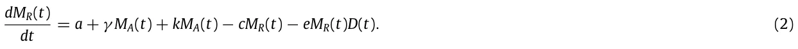

*dMA*(*t*) Eq. (3), reflects the amount of activated macrophages as a function of time. This variable is affected by *dt* the interaction between resting macrophages and dendritic cells at the rate *e* to increase the number of activated macrophages. Processing of the intracellular antigenic peptides by activated macrophages affords the opposite effect on the activated macrophage population to lead to resting macrophages at the rate *k*.

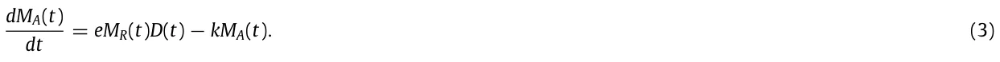

Similarly, the role of dendritic cells in the pathophysiology of T1D is well-documented [45]. dD(t) describes levels of dendritic cells as a function of time. The variable is affected by (i) *β* cell antigenic Eq. (4), *dt* peptides released by *β* cells as a result of cell–cell interactions with the autolytic Th-lymphocytes [46]; (ii) antigenic peptides produced by the BCG infected cells at the rate *φ*; (iii) dendritic cells that are cleared at the rate *µ*D.

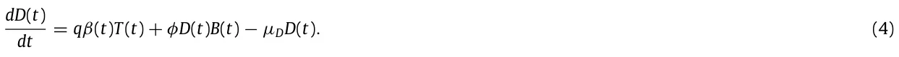

Multiple clinical studies as well as respective modeling confirmed the decisive contribution of the glucose dynamics to the onset of T1D [47].

Eq. (5), dG(t) introduces the amount of glucose as a function of time. The variable is affected by (i) dietary glucose in *dt* the amount of *g >* 0 that is introduced every *τ*G time units (represented using a Dirac delta function [43]); (ii) active macrophages that eliminate glucose at the rate *w*; (iii) glucose consumption due to the natural insulin generated by the *β* cell and released by degrading *β* cells at the rate *υ* [48]. *dG*(*t*) = *Σ*∞ n=0*gδ*(*t* − *nτ*G) − *wM*A(*t*)*G*(*t*) − *υβ*(*t*)*G*(*t*)*.* (5) *dt* Several autolytic T-cells exemplified by the CD8+ *T* cells have been identified as abundant and active inflammatory participants in T1D [49].

Eq. (6), dT (t) defines levels of autolytic *T* cells as a function of time. This variable is affected by (i) the natural supply or *dt* the replacement rate *s*T of autolytic *T* cells; (ii) proliferation rate *s* due to the immune cells-induced release of cytokines and chemokines (iii) the *T* cell population decrease due to lack of stimulation at the rate of *µ*T .

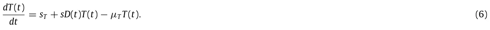

The dynamics of beta-cells is one of the most important contributors to both onset and severity of T1D [50]. Eq. (7), dβ(t) describes rates of change in the levels of *β* cells as a function of time. This variable is influenced by (i) the *dt* natural supply or replacement rate *s*B of *β* of beta cells; (ii) glucose-dependent natural production of *β* cells at the rate *ζ*; iii) *β* cell count decrease due to *β* cell-Th-cell interaction [51]; (iv) *β* cells count decrease due to the natural attrition at the rate *µ*B; (v) *β* cells count decrease in a rate *ξ* due to generation of insulin in order to process the glucose.

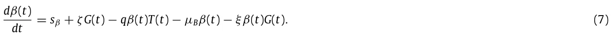

Considering the above, we arrive at the following system of non-linear and first-order ODEs:

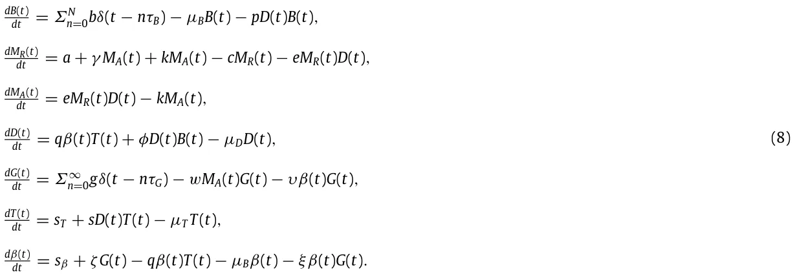

The model’s initial conditions are as follows [20]:

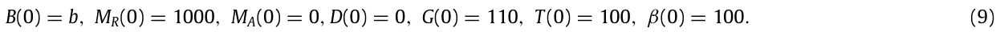

### 2.3. Parameter estimation

In order to validate the proposed model, we collected the respective parameters from both clinical and biological studies on T1D or BCG-based treatments *in vivo* data. Specifically, except for the injected amount of BCG (*b*) and glucose treatment intervals in days (*τ*G), the other values were obtained from the reported biological studies on T1D or BCG-based treatments. The glucose treatment intervals in days (*τ*G) is estimated to be 0.34 days to simulate three meals a day, distributed uniformly over the time of the day. According to Kahleova et al. [52], two meals a day for T2D mice are recommended. However, Hutchison et al. [53] suggest three meals after analyzing the connection between the number of meals and glucose metabolism in mice. We picked three meals to match these suggestions and make them distributed uniformly over the time of the day for simplicity. In addition, the injected amount of BCG (*b*) is estimated to be 103 to match the amount of injection used by Pozzilli et al. [54] for the case of a 20 gram (house) mouse. The presentative parameter values for the model are summarized in Table 1, for the case of a mouse.

Based on the values from Table 1, an equilibria and stability analysis is provided in Appendix.

## 3. Numerical simulations

We solve the model (Eq. (8)) numerically using the *ode15s* function in Matlab (version 2020b) [58,59], with the initial condition from Eq. (9). The model’s parameter values are taken from Table 1 and represent the possible values for a mouse model of T1D. We evaluate the baseline dynamics of the model using four types of these models. The first type is the non-T1D mouse which eats healthy and consumes approx. 30 milligrams of glucose per day. The second type is the non-T1D mouse that consumes approx. 90 milligrams of glucose per day. The third type is the T1D mouse that eats a healthy diet. Finally, the T1D mouse shows unhealthy glucose intake. The results are shown in Figs. 2a–2d, where the *x*-axis is the post-BCG treatment time and the *y*-axis is reflective of the cell population size. As expected, the model shows that the baseline treatment protocol defined by the values in Table 1, does not affect healthy individuals (Figs. 2a–2b). Importantly, the protocol delays T1D markers (e.g., *G >* 110 for a day on average) in T1D affected cohort on a healthy diet (Fig. 2c). The baseline treatment protocol is not effective in T1D mice on high glucose diet.

<figure class="table-figure" id="table-1">
<figcaption><strong>Table 1</strong> Parameter description, their average values, and sources for the model.</figcaption>

<table><tr><th>Parameter</th><th>Description</th><th>Average value</th><th>Source</th></tr><tr><td>b</td><td>The amount of BCG in days [C.F.U t−1].</td><td>103</td><td>Estimated</td></tr><tr><td>N</td><td>The number of BCG treatments [1].</td><td>2</td><td>[20]</td></tr><tr><td>τB</td><td>Number of days between any two injections [t].</td><td>28</td><td>[20]</td></tr><tr><td>p</td><td>Fraction of BCG decay due to interactions with effector cells expressed in days [cell−1 t−1].</td><td>3 · 10−2</td><td>[55]</td></tr><tr><td>a</td><td>The natural supply rate of macrophages expressed in days [mm−3 t−1].</td><td>50</td><td>[30]</td></tr><tr><td>γ</td><td>The recruitment rate of macrophages due to IL-1 and TNF-α produced by activated macrophages expressed in days [t−1].</td><td>0.3</td><td>[30]</td></tr><tr><td>k</td><td>The rate active macrophages are deactivated and becoming resting macrophages expressed in days [t−1].</td><td>0.2</td><td>[30]</td></tr><tr><td>c</td><td>The rate the macrophage population naturally decrease expressed in days [mm−3 t−1].</td><td>0.1</td><td>[30]</td></tr><tr><td>e</td><td>The rate of activation for macrophages due to the interaction with dendritic cells expressed in days [t−1].</td><td>5 · 10−4</td><td>[30]</td></tr><tr><td>q</td><td>The rate of release for antigenic peptides by decaying β cells due to cell–cell interactions between the β cells and the autolytic Th-lymphocytes expressed in days [mm−3 t−1].</td><td>2 · 10−6</td><td>[30]</td></tr><tr><td>φ</td><td>The rate of recruitment for antigenic peptides due to the BCG infection of cells expressed in days [t−1].</td><td>3 · 10−7</td><td>[55]</td></tr><tr><td>µD</td><td>The rate of clearance for dendritic cells via extra-cellular chemical reactions and natural degradation expressed in days [t−1].</td><td>0.5</td><td>[56]</td></tr><tr><td>g</td><td>The average amount of consumed glucose per day in milligrams [g t−1].</td><td>30</td><td>[57]</td></tr><tr><td>τG</td><td>Glucose treatment intervals expressed in days [t].</td><td>0.34</td><td>Estimated</td></tr><tr><td>w</td><td>The rate of glucose clearance by active macrophages expressed in days [t−1].</td><td>0.1</td><td>[32]</td></tr><tr><td>υ</td><td>The rate of glucose consumption due to the endogenous insulin produced by β cells expressed in days [ml t−1].</td><td>0.072</td><td>[32]</td></tr><tr><td>sT</td><td>The supply or replacement for autolytic T cells expressed in days [mm−3 t−1].</td><td>20</td><td>[31]</td></tr><tr><td>sβ</td><td>The supply or replacement rate for β cells expressed in days [mm−3 t−1].</td><td>1000</td><td>[31]</td></tr><tr><td>s</td><td>The rate of proliferation for T cells induced by cytokines and chemokines from activated macrophages expressed in days [t−1].</td><td>5 · 10−4</td><td>[31]</td></tr><tr><td>µT</td><td>The rate of T cell population decrease due to lack of stimulation expressed in days [t−1].</td><td>50</td><td>[30]</td></tr><tr><td>µβ</td><td>The half-life of β cells due to the natural decay expressed in days [t−1].</td><td>0.5</td><td>[32]</td></tr><tr><td>ξ</td><td>The rate of β cells decay due to production of insulin induced by glucose [1].</td><td>1</td><td>[32]</td></tr><tr><td>ζ</td><td>The rate of β cells regeneration induced by glucose [mm−3 t−1].</td><td>10</td><td>[32]</td></tr></table>

</figure>

Our data suggest that there is a relationship between dietary habits, such as daily glucose intake (*g*) and genetic factors, such as metabolism and *β* cell production due to glucose stimulus (*s*β). Sensitivity analysis *g* ∈[0*,* 50]*, s*β ∈[800*,* 1200] shows the effect of both parameters on glucose levels three months after the last BCG treatment (Fig. 3). The values obtained in the sensitivity analysis, as shown in Fig. 3, are fitted using the least mean square (LMS) method [60]. The selected family function for the surface approximation is as follows:

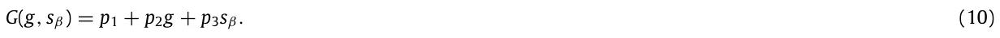

A linear approximation is chosen to balance between the accuracy vs the sampled data on the one hand and the model’s simplicity and interoperability on the other hand [61], which results in:

*G*(*g, s*β) = 42*.*366 + 2*.*247*g* − 0*.*027*s*β to afford a coefficient of determination *R*2 = 0*.*749. Therefore, the influence of *g* is estimated to be 102 times larger than the influence of *s*β.

Because the eating habits and physiology are unique to each subject, the optimal treatment (i.e., a successful treatment and that one of the clinical parameters is optimized) is expected to differ between specimen. In order to find the most relevant subject-specific regimen, one can further analyze the image of the model (e.g., Eq. (8)) by solving the ODE and to produce a function *T* (*b, τ*b*, N*) →{0*,* 1} when the source space contained in R3 and the image space is exactly {0*,* 1} [62,63]. The parameters (*b, τ*b*, N*) are used as the source space since they define the BCG-based treatment protocol. The other parameters are specimen-dependent and cannot be modified as a part of the treatment. The results of the analysis for each subject are summarized in Fig. 3. The green (circle) and red (star) dots represent successful and unsuccessful treatments, respectively, such that the evaluation performed six months from the last BCG treatment (which differ as a function of *N*), in Fig. 4. Formally, a treatment is considered successful if three month (2160 h) after the last BCG injection, the average amount of glucose *G*(*t*) in the course of 2 h is less than 100 such that 24 hours beforehand, glucose has not been injected. In a complementary manner, the unsuccessful treatment is one that does not satisfies this condition. This is to simulate the test suggested by the American diabetes association for T1D [12].

<figure id="fig-2">
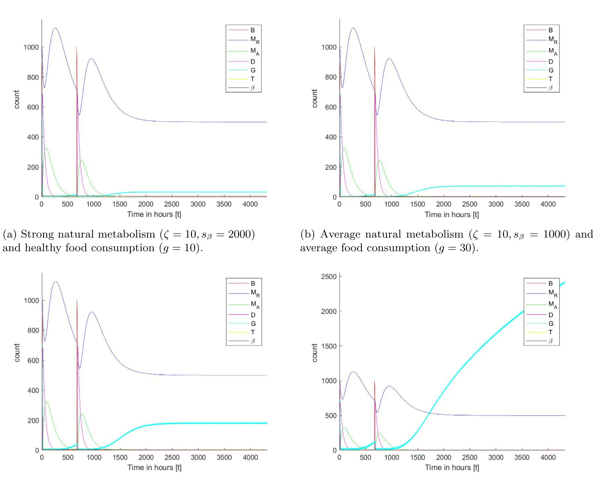
<figcaption><strong>Fig. 2.</strong> Dynamics of T1D-relevant cell markers in 4 distinct cohorts including healthy subjects and T1D mice as a function of time. The parameters are taken from Table 1 and the initial condition from Eq. (9). The drug administration takes place after 552 h (or 23 days) and shown by the BCG pulse (red line).</figcaption>
</figure>

For each specimen, we find the set of border pixels (neighboring pixels that show both colors) indicative of the separation between successful and unsuccessful treatments. The set of border pixels defining a surface can be approximated using the least mean square (LMS) method [60]. The family function for the surface approximation is selected as follows:

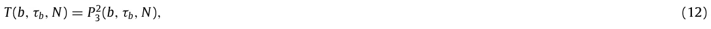

where *P*2 3 (*b, τ*b*, N*) is a second order three-parameter polynomial. This function is selected manually (after testing multiple functions) to balance between the coefficient of determination and simplicity of the model. The results of the approximation are as follows:

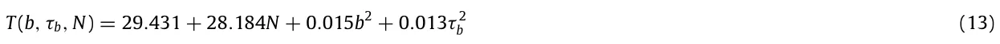

to yield the coefficient of determination *R*2 = 0*.*920 for Fig. 4(a). Similarly, for Fig. 4(b):

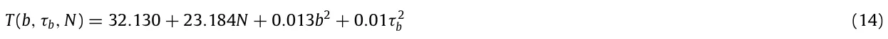

<figure id="fig-3">
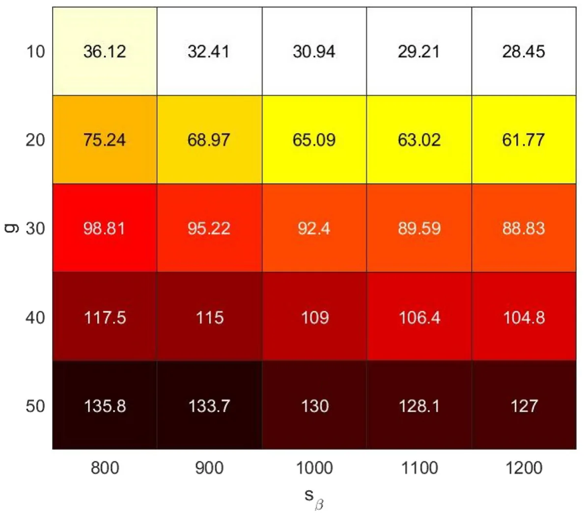
<figcaption><strong>Fig. 3.</strong> Sensitivity analysis of average glucose consumption per meal <em>g</em> (<em>τ</em>g = 8 hours) and recruitment of <em>β</em> cells <em>s</em>β indicative of the baseline metabolism on the daily average glucose levels three month after the last BCG treatment (<em>N</em> = 2<em>, b</em> = 1000).</figcaption>
</figure>

to result in a coefficient of determination *R*2 = 0*.*912. Similarly, for Fig. 4(c):

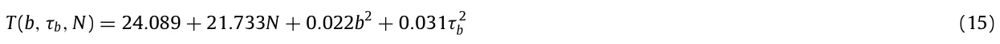

to afford a coefficient of determination *R*2 = 0*.*897. Similarly, for Fig. 4(d):

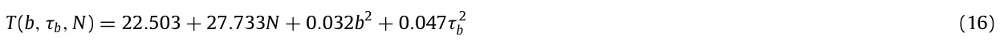

to produce a coefficient of determination *R*2 = 0*.*874.

## 4. Conclusion

In this work, we introduced a novel model of immunotherapy treatment of type 1 diabetes (T1D) using BCG. As multiple cell types and organs are involved in controlling intricate metabolic balance both in healthy and T1D specimens, we introduced a set of specific variables (*B*(*t*) — concentration of BCG in the body; *M*R(*t*) — concentration of resting macrophages; *M*A(*t*) — concentration of activated macrophages; *D*(*t*) — concentration of dendritic cells which are also operating as activated immune-system cells; *G*(*t*) — concentration of glucose; *T* (*t*) — concentration of autolytic *T* cells; and *β*(*t*) — concentration of *β* cells) which immediately relevant to the published clinical data on the disease. Furthermore, a system of ODEs reflecting the molecular, cellular, pharmacokinetic, and pharmacodynamic connectivity between these variables was introduced to capture the clinical presentation of the disease in four subsets of the T1D subjects and controls.

In our view, the model (Fig. 2) accurately predicts the observed fundamental importance of an appropriate diet regimen. Namely, BCG treatment of the T1D subjects that follow healthy eating habits normalizes glucose to the levels observed in non-diabetic controls. This outcome indicates the initial validation of the introduced model. In the context of the BCG therapy, our data propose that glucose consumption exerts more influence (est. 102 difference) on the disease progression than metabolism, especially when evaluated over a short-medium period (Fig. 3).

Figs. 4(c) and 4(d) illustrate the profound effect of glucose on the outcome of the T1D. Namely, T1D subject featured in Fig. 4(d) are expected to perform much worse compared to subject shown on Fig. 4(c) even following the insulin treatment. Intriguingly, data analysis summarized on Fig. 4(d) indicates that the BCG treatment may still benefit healthy controls on a high-glucose diet.

Eqs. (13)–(16) represent the border function between the successful and unsuccessful treatment protocols, differing in the amount of BCG injected, the rate, and the number of the injections. We conclude that it is possible to find the optimal treatment protocol by setting a specific desired value for properties comprising the protocol to recommend a personalized treatment that corresponds to the patient’s glucose intake. In particular, after a health professionals measure the values of *g*, *τ*G, *ζ*, and *s*β they can compute the results of the model for a range of *τ*b*, b*, and *N* as shown in Fig. 4 to obtain what treatment protocols predicted to be successful. Afterward, by computing the optimal value for one of these parameters (*τ*b*, b, N*), the health professionals are able to obtain a successful and optimal treatment based on the patient’s metabolism and diet. However, this is a first-order personalized protocol that can (and should) be improved in later studies.

<figure id="fig-4">
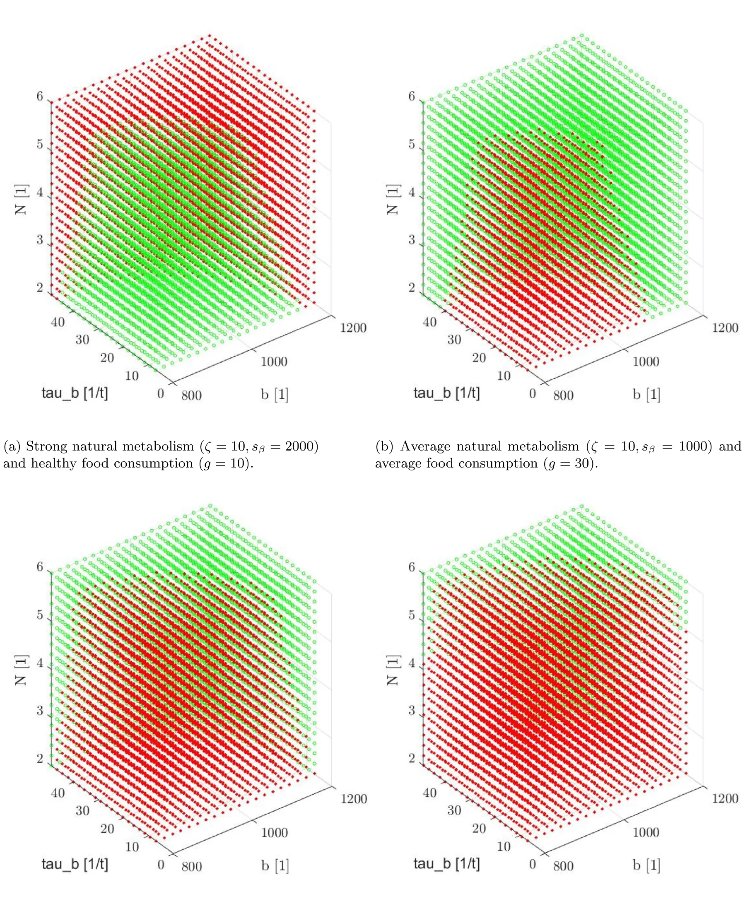
<figcaption><strong>Fig. 4.</strong> Discrete sampling of the model’s image space for the domain (<em>b</em> ∈[800<em>,</em> 1200]<em>, τ</em>b ∈[10<em>,</em> 50]<em>, N</em> ∈[2<em>,</em> 3<em>,</em> 4<em>,</em> 5<em>,</em> 6]). Green (circle) pixels represent successful treatment and red (star) pixels represent unsuccessful treatment. The parameters are taken from Table 1.</figcaption>
</figure>

The results obtained from the numerical analysis indicate that the injection of BCG can provide long-range health benefits, which agrees with the outcomes of the clinical experiment conducted by Kuhtreiber et al. [20]. In a similar manner, Kuhtreiber et al. [64] show the different influence of BCG injection in T1D patients and control on the glucose levels, obtaining similar results to these shown in Fig. 2. Notably, the clinical results are stochastic in nature compared to ours. This is due to the changes in the model’s parameters’ values for each member in the sampled population.

However, these results are obtained on a simplified version of the biological system involving the immune system, personalized glucose diet, and the corresponding biological system in mammals. In particular, there is a delay between the introduction of new glucose to the system and the raise in *β*-cells which have been neglected to avoid a system of ODEs with delay. This and other assumptions may provide slightly different results than one would obtain from *in vivo* clinical experiments. As a result, the proposed model provides a mathematical foundation to investigate the influence of different BCG treatment protocols but is limited in its ability to predict patient-level outcomes. In future work, we plan to relax several assumptions taken in this model to improve its clinical accuracy. In addition, the proposed model can benefit from an integration of other advanced numerical methods and mathematical models such as in [65–72].

In our view, the proposed system of parameters and equations introduces both accurate and practical models for the immunotherapy-based treatment of T1D in animal models. However, our model could serve as a baseline that could be extended to examine more detailed dynamics in a broader context including human clinical studies. Additional interventional modalities, for example mechanistically different immunotherapy including vaccines or engineered cells may enhance both targeted and symptomatic treatment outcomes.

## CRediT authorship contribution statement

**Teddy Lazebnik:** Conceptualization, Software, Investigation, Methodology, Visualization, Writing – original draft.

**Svetlana Bunimovich-Mendrazitsky:** Supervision, Investigation, Writing – review & editing. **Alex Kiselyov:** Validation, Investigation, Writing – review & editing.

## Declaration of competing interest

The authors declare that they have no known competing financial interests or personal relationships that could have appeared to influence the work reported in this paper.

## Data availability

No data was used for the research described in the article.

## Appendix

An equilibrium state presumes that the dynamic system does not change without external stimuli. Stable equilibria states are to return to the same equilibria state after a perturbation [73]. This consideration allows for the elimination of minor factors when modeling complex biological systems. In our proposed model (see Section 2), the equilibria of interest presume the dendritic cell population is equal or close to zero. This is due to either a weak immunologic response caused by the disease burden or a weakened response by the immune system to the injected BCG.

However, the proposed model is explicitly depending on *t* in the BCG and glucose levels as represented in dB(t) and *dt dG*(*t*) dt , respectively. Since an equilibrium cannot be explicitly depended on *t* for each *t* ∈ R [74,75], we approximate the terms *Σ*N n=0*bδ*(*t* − *nτ*B) and *Σ*∞ n=0*gδ*(*t* − *nτ*G) using a uniform injection of BCG and glucose. Formally, the injection terms take the forms *b/τ*B and *g/τ*G, respectively, following the method suggested by Shtylla et al. [33]. Hence, the system gets the form:

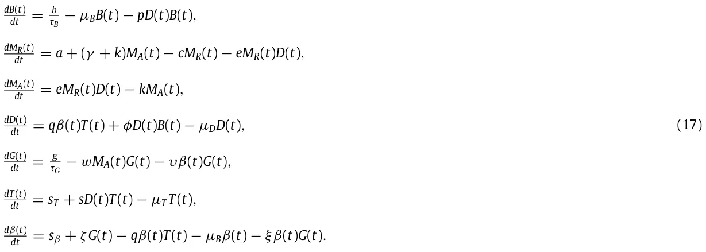

Therefore, by assuming *D*(*t*) = 0, one obtains the following equilibrium:

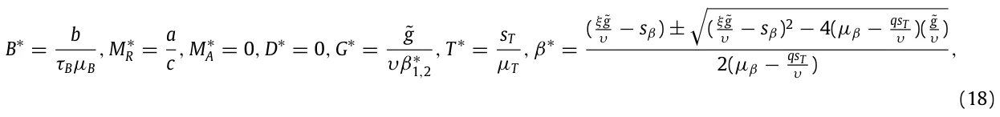

where ˜*g* := *g/τ*G such that *qs*T = *µ*β*µ*T , *υµ*β/ = *qs*T , and ( ξ ˜g υ − *s*β)2 ≥ 4(*µ*β − qsT υ )( ˜g υ ). We compute the Jacobian *J* for the system, obtaining the following matrix:

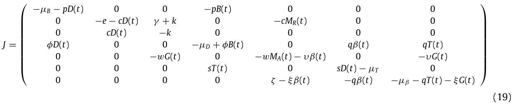

By setting the values from Table 1 (available in the main text) and Eq. (18) in Eq. (21), one gets the following two matrices (one for each possible value of *β*∗:

and

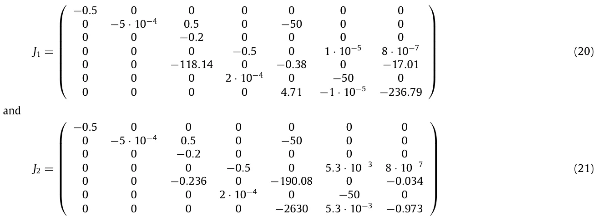

where one is able to see that the equilibria shown in Eq. (18) is indeed locally stable since the eigenvalues of *J*1 are [−0*.*005*,* −236*.*45*,* −0*.*7194*,* −0*.*5*,* −0*.*2*,* −50*,* −0*.*5] and *J*2 are [−0*.*005*,* −50*,* −190*.*551*,* −0*.*5*,* −0*.*5013*,* −0*.*5*,* −0*.*2].

In a physiologically relevant equilibrium, a healthy patient is expected to maintain the glucose levels within ‘normal’ manageable margins *G*(*t*) ∈[*l*b*, u*b]. We define the *healthy* equilibrium to be the steady state in which the glucose levels are in the middle of this range (e.g., *G*∗ = *h* = (*l*b+*u*b)*/*2) and no BCG is administered (*B*∗ = 0). In this case, the equilibrium looks as follows:

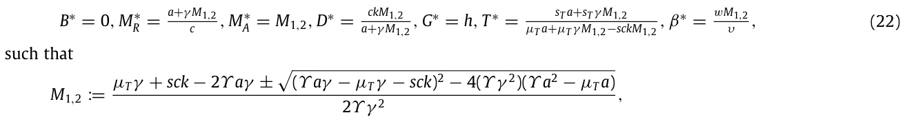

such that where *Υ* := wqsT and (*Υ aγ* − *µ*T*γ* − *sck*)2 ≥ 4(*Υ γ* 2)(*Υ a*2 − *µ*T *a*). This equilibrium is not biologically feasible (i.e., a *ck* biological system cannot reach such state in practice) as *M*∗ A *>* 0 which is an indication of an activated immune response. This outcome means the individual is affected by the disease. Therefore, in order to evaluate the case where *M*∗ A = 0, we get that

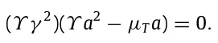

Therefore,

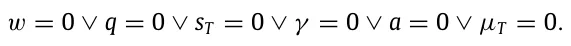

As *w, q, s*t*, γ , a, µ*T *>* 0 by definition, the equilibrium takes the form:

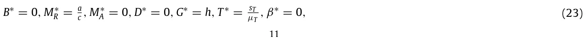

and since *β*∗ = 0 the glucose levels monotonically increase which leads to an unstable equilibrium as well as to an unrealistic clinical scenario. The equilibrium is unstable since the value of *G*∗ is changing over time as shown by setting Eq. (23) in the glucose equation, where dβ(t) = *s*β + *ζh >* 0. *dt*

## References

1. E.A.M. Gale, Type 1 diabetes in the young: the harvest of sorrow goes on, Diabetologia 48 (8) (2005) 1425–1438. [link](http://refhub.elsevier.com/S0378-4371%2823%2900446-6/sb1)
2. V. Harjutsalo, L. Sjoberg, J. Tuomilehto, Time trends in the incidence of type 1 diabetes in Finnish children: a cohort study, Lancet 371 (2008) 1777–1782. [link](http://refhub.elsevier.com/S0378-4371%2823%2900446-6/sb2)
3. M.A. Atkinson, G.S. Eisenbarth, A.W. Michels, Type 1 diabetes, Lancet 383 (9911) (2014) 69–82. [link](http://refhub.elsevier.com/S0378-4371%2823%2900446-6/sb3)
4. G. Xu, B. Liu, Y. Sun, Y. Du, L.G. Snetselaar, F.B. Hu, W. Bao, Prevalence of diagnosed type 1 and type 2 diabetes among US adults in 2016 and 2017: population based study, BMJ 362 (1497) (2018). [link](http://refhub.elsevier.com/S0378-4371%2823%2900446-6/sb4)
5. M. Thunander, C. Petersson, K. Jonzon, J. Fornander, B. Ossiansson, C. Torn, S. Edvardsson, M. Landin-Olsson, Incidence of type 1 and type 2 diabetes in adults and children in Kronoberg, Sweden, Diabetes Res. Clin. Pract. 82 (2008) 247–255. [link](http://refhub.elsevier.com/S0378-4371%2823%2900446-6/sb5)
6. S. Ehehalt, K. Dietz, A.M. Willasch, A. Neu, D.-G. Baden-Wuerttemberg, Prediction model for the incidence and prevalence of type 1 diabetes in childhood and adolescence: evidence for a cohort-dependent increase within the next two decades in Germany, Pediatr. Diabetes 13 (1) (2012) 15–20. [link](http://refhub.elsevier.com/S0378-4371%2823%2900446-6/sb6)
7. K.C. Osum, A.L. Burrack, T. Martinov, N.L. Sahli, J.S. Mitchell, C.G. Tucker, K.E. Pauken, K. Papas, B. Appakalai, J.A. Spanier, B.T. Fife, Interferon-gamma drives programmed death-ligand 1 expression on islet β cells to limit T cell function during autoimmune diabetes, Sci. Rep. 8 (2018) 8295. [link](http://refhub.elsevier.com/S0378-4371%2823%2900446-6/sb7)
8. R.S. Mahla, A. Kumar, H.J. Tutill, S.T. Krishnaji, B. Sathyamoorthy, M. Noursadeghi, J. Breuer, A.K. Pandey, H. Kumar, NIX-mediated mitophagy regulate metabolic reprogramming in phagocytic cells during mycobacterial infection, Tuberculosis 126 (2021) 102046. [link](http://refhub.elsevier.com/S0378-4371%2823%2900446-6/sb8)
9. I. Monga, K. Kaur, S.K. Dhanda, Revisiting hematopoiesis: applications of the bulk and single-cell transcriptomics dissecting transcriptional heterogeneity in hematopoietic stem cells, Briefings in Functional Genomics 21 (3) (2022) 159–176. [link](http://refhub.elsevier.com/S0378-4371%2823%2900446-6/sb9)
10. R.J. Creusot, N. Giannoukakis, M. Trucco, M.J. Clare-Salzler, C.G. Fathman, It’s time to bring dendritic cell therapy to type 1 diabetes, Diabetes 63 (1) (2014) 20–30. [link](http://refhub.elsevier.com/S0378-4371%2823%2900446-6/sb10)
11. C. Evans-Molina, E.K. Sims, L.A. DiMelio, H.M. Ismail, A.K. Steck, J.P. Palmer, J.P. Krischer, S. Geyer, P. Xu, J.M. Sosenko, the Type 1 Diabetes Trial Net Study Group, β Cell dysfunction exists more than 5 years before type 1 diabetes diagnosis, JCI Insight 3 (15) (2018) e120877. [link](http://refhub.elsevier.com/S0378-4371%2823%2900446-6/sb11)
12. A.D. Association, Diagnosis and classification of diabetes mellitus, Diabetes Care 33 (2010) S62–69. [link](http://refhub.elsevier.com/S0378-4371%2823%2900446-6/sb12)
13. J.A. Todd, Etiology of type 1 diabetes, Immunity 32 (4) (2010) 457–467. [link](http://refhub.elsevier.com/S0378-4371%2823%2900446-6/sb13)
14. P. In’t Veld, Insulitis in human type 1 diabetes: the quest for an elusive lesion, Islets 3 (4) (2011) 131–138. [link](http://refhub.elsevier.com/S0378-4371%2823%2900446-6/sb14)
15. L.A. DiMeglio, C. Evans-Molina, R.A. Oram, Type 1 diabetes, Lancet 391 (10138) (2018) 2449–2462. [link](http://refhub.elsevier.com/S0378-4371%2823%2900446-6/sb15)
16. I.B. Hirsch, Clinical review: realistic expectations and practical use of continuous glucose monitoring for the endocrinologist, J. Clin. Endocrinol. Metab. 94 (7) (2009) 2232–2238. [link](http://refhub.elsevier.com/S0378-4371%2823%2900446-6/sb16)
17. B.E. Gregg, P.C. Moore, D. Demozay, B.A. Hall, M. Li, A. Husain, A.J. Wright, M.A. Atkinson, C.J. Rhodes, Formation of a human β-cell population within pancreatic islets is set early in life, JCEM 97 (9) (2012) 3197–3206. [link](http://refhub.elsevier.com/S0378-4371%2823%2900446-6/sb17)
18. H.A. Keenan, J.K. Sun, J. Levine, A. Doria, L.P. Aiello, G. Eisenbarth, S. Bonner-Weir, G.L. King, Residual insulin production and pancreatic β-cell turnover after 50 years of diabetes: Joslin medalist study, Diabetes 59 (11) (2010) 2846–2853. [link](http://refhub.elsevier.com/S0378-4371%2823%2900446-6/sb18)
19. A. Calmette, C. Guerin, A. Boquet, et al., La vaccination preventive contre la tuberculose par le BCG, Paris: Masson Et Cie (1927) in French. [link](http://refhub.elsevier.com/S0378-4371%2823%2900446-6/sb19)
20. W.M. Kühtreiber, L. Tran, T. Kim, M. Dybala, B. Nguyen, S. Plager, D. Huang, S. Janes, A. Defusco, D. Baum, H. Zheng, D.L. Faustman, Long-term reduction in hyperglycemia in advanced type 1 diabetes: the value of induced aerobic glycolysis with BCG vaccinations, NPJ Vaccines 3 (23) (2018). [link](http://refhub.elsevier.com/S0378-4371%2823%2900446-6/sb20)
21. S. Bunimovich-Mendrazitsky, E. Shochat, L. Stone, Stability analysis of delayed immune response BCG infection in bladder cancer treatment model by stochastic perturbations, Bull. Math. Biol. 69 (6) (2007) 1847–1870. [link](http://refhub.elsevier.com/S0378-4371%2823%2900446-6/sb21)
22. L. Shaikhet, S. Bunimovich-Mendrazitsky, Stability analysis of delayed immune response BCG infection in bladder cancer treatment model by stochastic perturbations, Comput. Math. Methods Med. 2018 (9653873) (2018) 1–10. [link](http://refhub.elsevier.com/S0378-4371%2823%2900446-6/sb22)
23. E. Guzev, S. Halachmi, S. Bunimovich-Mendrazitsky, Additional extension of the mathematical model for BCG immunotherapy of bladder cancer and its validation by auxiliary tool, Int. J. Nonlinear Sci. Numer. Simul. 20 (6) (2019) 675–689. [link](http://refhub.elsevier.com/S0378-4371%2823%2900446-6/sb23)
24. D.L. Faustman, TNF, BCG, and the proteasome in autoimmunity: An overview of the pathways & results of a phase I study in type 1 diabetes, in: The Value of BCG and TNF in Autoimmunity, Academic Press, 2014. [link](http://refhub.elsevier.com/S0378-4371%2823%2900446-6/sb24)
25. F. Shann, The nonspecific effects of vaccines and the expanded program on immunization, J. Infect. Dis. 204 (2) (2011) 182–184. [link](http://refhub.elsevier.com/S0378-4371%2823%2900446-6/sb25)
26. N. Kiraly, K.J. Allen, N. Curtis, BCG for the prevention of food allergy-exploring a new use for an old vaccine, Med. J. Aust. 202 (11) (2015) 565–566. [link](http://refhub.elsevier.com/S0378-4371%2823%2900446-6/sb26)
27. M. Karaci, The protective effect of the BCG vaccine on the development of type 1 diabetes in humans, in: The Value of BCG and TNF in Autoimmunity, Academic Press, 2014, pp. 52–62. [link](http://refhub.elsevier.com/S0378-4371%2823%2900446-6/sb27)
28. S. Ryu, S. Kodama, K. Ryu, D.A. Schoenfeld, D.L. Faustman, Reversal of established autoimmune diabetes by restoration of endogenous beta cell function, J. Clin. Invest. 108 (1) (2001) 63–72. [link](http://refhub.elsevier.com/S0378-4371%2823%2900446-6/sb28)
29. S. Kodama, W. Kuhtreiber, S. Fujimura, E.A. Dale, D.L. Faustman, Islet regeneration during the reversal of autoimmune diabetes in NOD mice, Science 302 (5648) (2003) 1223–1227. [link](http://refhub.elsevier.com/S0378-4371%2823%2900446-6/sb29)
30. A.F.M. Maree, R. Kublik, D.T. Finegood, L. Edelstein-Keshet, Modelling the onset of type 1 diabetes: can impaired macrophage phagocytosis make the difference between health and disease? Philos. Trans. R. Soc. 364 (1842) (2006) 1267–1282. [link](http://refhub.elsevier.com/S0378-4371%2823%2900446-6/sb30)
31. G. Magombedze, P. Nduru, C.P. Bhunu, S. Mushayabasa, Mathematical modelling of immune regulation of type 1 diabetes, BioSystems 102 (3) (2010) 88–98. [link](http://refhub.elsevier.com/S0378-4371%2823%2900446-6/sb31)
32. G. Wu, Mathematical Modeling of Type 1 Diabetes (Ph.D. thesis), Claremont Colleges, 2019. [link](http://refhub.elsevier.com/S0378-4371%2823%2900446-6/sb32)
33. B. Shtylla, M. Gee, A. Do, S. Shabahang, L. Eldevik, L. de Pillis, A mathematical model for DC vaccine treatment of type I diabetes, Comput. Physiol. Med. 10 (2019). [link](http://refhub.elsevier.com/S0378-4371%2823%2900446-6/sb33)
34. D.L. Faustman, L. Wang, D. Okubo, L. Ban, G. Man, H. Zheng, D. Schoenfeld, R. Pompei, J. Avruch, D.M. Nathan, Proof-of-concept, randomized, controlled clinical trial of Bacillus-Calmette-Guerin for treatment of long-term type 1 diabetes, PLoS One 7 (8) (2012) e41756. [link](http://refhub.elsevier.com/S0378-4371%2823%2900446-6/sb34)
35. M. Ciampelli, A.M. Fulghesu, F. Cucinelli, V. Pavone, A. Caruso, S. Mancuso, A. Lanzone, Heterogeneity in beta cell activity, hepatic insulin clearance and peripheral insulin sensitivity in women with polycystic ovary syndrome, Hum. Reprod. 12 (9) (1997) 1897–1901. [link](http://refhub.elsevier.com/S0378-4371%2823%2900446-6/sb35)
36. C. Vandamme, T. Kinnunen, B cell helper T cells and type 1 diabetes, Scand. J. Immunol. 92 (4) (2020) e12943. [link](http://refhub.elsevier.com/S0378-4371%2823%2900446-6/sb36)
37. T.H. Lipman, K.L.E. Levitt, S.J. Ratcliffe, K.M. Murphy, A. Aguilar, I. Rezvani, C.J. Howe, S. Fadia, E. Suarez, Increasing incidence of type 1 diabetes in youth: twenty years of the Philadelphia Pediatric Diabetes Registry, Diabetes Care 36 (6) (2013) 1597–1603. [link](http://refhub.elsevier.com/S0378-4371%2823%2900446-6/sb37)
38. J. Tuomilehto, The emerging global epidemic of type 1 diabetes, Curr. Diabetes Rep. 13 (6) (2013) 795–804. [link](http://refhub.elsevier.com/S0378-4371%2823%2900446-6/sb38)
39. N. Shehadeh, F. Calcinaro, B.J. Bradley, I. Bruchim, P. Vardi, K.J. Lafferty, Effect of adjuvant therapy on development of diabetes in mouse and man, Lancet 343 (8899) (1994) 706–707. [link](http://refhub.elsevier.com/S0378-4371%2823%2900446-6/sb39)
40. R.J.W. Arts, A. Carvalho, C. La Rocca, C. Palma, F. Rodrigues, R. Silvestre, E. Kleinnijenhuis, L.G. Goncalves, A. Belinha, C. Cunha, M. Oosting, L.A.B. Joosten, G. Matarese, R. van Crevel, M.G. Netea, Immunometabolic pathways in BCG-induced trained immunity, Cell Rep. 17 (10) (2016) 2562–2571. [link](http://refhub.elsevier.com/S0378-4371%2823%2900446-6/sb40)
41. G. Ristori, M.G. Buzzi, U. Sabatini, S. Bastianello, F. Viselli, C. Buttinelli, S. Ruggieri, C. Colonnese, C. Pozzilli, M. Salvetti, Use of Bacille Calmette-Guerin (BCG) in multiple sclerosis, Neurology 53 (7) (1999) 1588–1589. [link](http://refhub.elsevier.com/S0378-4371%2823%2900446-6/sb41)
42. M. Kowalewicz-Kulbat, C. Locht, BCG and protection against inflammatory and auto-immune diseases, Expert Rev. Vaccines 16 (7) (2017) 1–9. [link](http://refhub.elsevier.com/S0378-4371%2823%2900446-6/sb42)
43. P. Dirac, The Principles of Quantum Mechanics, first ed., Oxford University Press, 1930. [link](http://refhub.elsevier.com/S0378-4371%2823%2900446-6/sb43)
44. J.E. Wigginton, D. Kirschner, A model to predict cell-mediated immune regulatory mechanisms during human infection with mycobacterium tuberculosis, J. Immunol. 166 (3) (2001) 1951–1967. [link](http://refhub.elsevier.com/S0378-4371%2823%2900446-6/sb44)
45. H. Zirpel, B.O. Roep, Islet-resident dendritic cells and macrophages in type 1 diabetes: In search of bigfoot’s print, Front. Endocrinol. (2021). [link](http://refhub.elsevier.com/S0378-4371%2823%2900446-6/sb45)
46. I. Raz, D. Elias, A. Avron, M. Tamir, M. Metzger, I.R. Cohen, β-Cell function in newonset type 1 diabetes and immunomodulation with a heat-shock protein peptide (DiaPep277): a randomised, double-blind, phase II trial, Lancet 358 (9295) (2001) 1749–1753. [link](http://refhub.elsevier.com/S0378-4371%2823%2900446-6/sb46)
47. N. Magdelaine, L. Chaillous, I. Guilhem, J.-Y. Poirier, M. Krempf, C.H. Moog, E.L. Carpentier, A long-term model of the glucose-insulin dynamics of type 1 diabetes, IEEE Trans. Biomed. Eng. 62 (6) (2015) 1546–1552. [link](http://refhub.elsevier.com/S0378-4371%2823%2900446-6/sb47)
48. S. Ryu, S. Kodama, D.A. Schoenfeld, D.L. Faustman, Reversal of established autoimmune diabetes by restoration of endogenous β cell function, J. Clin. Invest. 108 (1) (2001) 63–72. [link](http://refhub.elsevier.com/S0378-4371%2823%2900446-6/sb48)
49. A. Pugliese, Autoreactive t cells in type 1 diabetes, J. Clin. Invest. 127 (8) (2017) 2881–2891. [link](http://refhub.elsevier.com/S0378-4371%2823%2900446-6/sb49)
50. B.O. Roep, S. Thomaidou, R. van Tienhoven, A. Zaldumbide, Type 1 diabetes mellitus as a disease of the beta-cell (do not blame the immune system?), Nat. Rev. Endocrinol. 17 (8) (2021) 150–161. [link](http://refhub.elsevier.com/S0378-4371%2823%2900446-6/sb50)
51. M. Nagata, Y. Yokono, M. Hayakawa, Y. Kawase, N. Hatamori, W. Ogawa, K. Yonezawa, K. Shii, S. Baba, Destruction of pancreatic islet cells by cytotoxic T lymphocytes in nonobese diabetic mice, J. Immunol. 143 (4) (1989) 1155–1162. [link](http://refhub.elsevier.com/S0378-4371%2823%2900446-6/sb51)
52. H. Kahleova, L. Belinova, H. Malinska, T. Oliyarnyk, V. Skop, L. Kazdoa, M. Dezortova, M. Hajek, A. Tura, M. Hill, T. Pelikanova, Eating two larger meals a day (breakfast and lunch) is more effective than six smaller meals in a reduced-energy regimen for patients with type 2 diabetes: a randomised crossover study, Diabetologia 57 (2014) 1552–1560. [link](http://refhub.elsevier.com/S0378-4371%2823%2900446-6/sb52)
53. A.T. Hutchison, G.A. Wittert, L.K. Heilbronn, Matching meals to body clocks — Impact on weight and glucose metabolism, Nutrients 9 (3) (2017) 222. [link](http://refhub.elsevier.com/S0378-4371%2823%2900446-6/sb53)
54. P. Pozzilli, BCG vaccine in insulin-dependent diabetes mellitus, Lancet 349 (9064) (1997) 1520–1521. [link](http://refhub.elsevier.com/S0378-4371%2823%2900446-6/sb54)
55. O. Nave, S. Harli, M. Elbaz, I.H. Iluz, S. Bunimovich-Mendrazitsky, BCG and IL-2 model for bladder cancer treatment with fast and slow dynamics based on SPVF method—stability analysis, Math. Biosci. Eng. 16 (5) (2019) 5346–5379. [link](http://refhub.elsevier.com/S0378-4371%2823%2900446-6/sb55)
56. J. Nerup, P. Platz, O.O. Andersen, M. Christy, J. Lyngsoe, J.E. Poulsen, L.E. Ryder, L.S. Nielsen, M. Thomsen, A. Svejgaard, HL-A antigens and diabetes mellitus, Lancet 2 (7885) (1974) 864–866. [link](http://refhub.elsevier.com/S0378-4371%2823%2900446-6/sb56)
57. K. Langlois, D. Garriguet, Sugar Consumption Among Canadians of All Ages, vol. 22, (3) 2011, pp. 23–27. [link](http://refhub.elsevier.com/S0378-4371%2823%2900446-6/sb57)
58. L.F. Shampine, M.W. Reichelt, The MATLAB ODE suite, SIAM J. Sci. Comput. 18 (1997) 1–22. [link](http://refhub.elsevier.com/S0378-4371%2823%2900446-6/sb58)
59. L.F. Shampine, M.W. Reichelt, J.A. Kierzenka, Solving index-1 DAEs in MATLAB and simulink, SIAM Rev. 41 (1999) 538–552. [link](http://refhub.elsevier.com/S0378-4371%2823%2900446-6/sb59)
60. Å. Björck, Numerical methods for least squares problems, SIAM J. Sci. Stat. Comput. (1996). [link](http://refhub.elsevier.com/S0378-4371%2823%2900446-6/sb60)
61. L.R. Shanock, B.E. Baran, W.A. Gentry, S.C. Pattison, E.D. Heggestad, Polynomial regression with response surface analysis: A powerful approach for examining moderation and overcoming limitations of difference scores, J. Bus. Psychol. 25 (2010) 543–554. [link](http://refhub.elsevier.com/S0378-4371%2823%2900446-6/sb61)
62. T. Lazebnik, N. Aaroni, S. Bunimovich-Mendrazitsky, PDE based geometry model for BCG immunotherapy of bladder cancer, Biosystems 200 (2021) 104319. [link](http://refhub.elsevier.com/S0378-4371%2823%2900446-6/sb62)
63. T. Lazebnik, S. Yanetz, S. Bunimovich-Mendrazitsky, N. Aaroni, Treatment of bladder cancer using BCG immunotherapy: PDE modeling, Funct. Differ. Equ. (2020). [link](http://refhub.elsevier.com/S0378-4371%2823%2900446-6/sb63)
64. K.W. M., H. Takahashi, R.C. Keefe, Y. Song, L. Tran, T.G. Luck, G. Shpilsky, L. Moore, S.M. Sinton, J.C. Graham, D.L. Faustman, BCG vaccinations upregulate myc, a central switch for improved glucose metabolism in diabetes, IScience 23 (5) (2020) 101085. [link](http://refhub.elsevier.com/S0378-4371%2823%2900446-6/sb64)
65. A. Shahzad, M. Imran, M. Tahir, S. Ali Khan, A. Akgul, S. Abdullaev, C. Park, H.Y. Zahran, I.S. Yahia, Brownian motion and thermophoretic diffusion impact on Darcy-Forchheimer flow of bioconvective micropolar nanofluid between double disks with Cattaneo-Christov heat flux, Alex. Eng. J. 62 (2023) 1–15. [link](http://refhub.elsevier.com/S0378-4371%2823%2900446-6/sb65)
66. M. Partohaghighi, A. Akgul, E.K. Akgul, N. Attia, M. De la Sen, M. Bayram, Analysis of the fractional differential equations using two different methods, Symmetry 15 (1) (2023). [link](http://refhub.elsevier.com/S0378-4371%2823%2900446-6/sb66)
67. N. Mehmood, A. Abbas, A. Akgul, T. Abdeljawad, M.A. Alqudah, Existence and stability results for coupled system of fractional differential equations involving ab-caputo derivative, Fractals 31 (02) (2023) 2340023. [link](http://refhub.elsevier.com/S0378-4371%2823%2900446-6/sb67)
68. A. Abbas, N. Mehmood, A. Akgul, T. Abdeljawad, M.A. Alqudah, Existence results for multi-term fractional differential equations with nonlocal boundary conditions involving atangana–baleanu derivative, Fractals 31 (02) (2023) 2340024. [link](http://refhub.elsevier.com/S0378-4371%2823%2900446-6/sb68)
69. N. Ahmed, M. Rani, S.S. Dragomir, A. Akgul, New exact solutions to space–time fractional telegraph equation with conformable derivative, Internat. J. Modern Phys. B (2023) 2350275. [link](http://refhub.elsevier.com/S0378-4371%2823%2900446-6/sb69)
70. T. Lazebnik, S. Bunimovich-Mendrazitsky, L. Shaikhet, Novel method to analytically obtain the asymptotic stable equilibria states of extended SIR-type epidemiological models, Symmetry 13 (7) (2021) 1120. [link](http://refhub.elsevier.com/S0378-4371%2823%2900446-6/sb70)
71. L.S. Keren, A. Liberzon, T. Lazebnik, A computational framework for physics-informed symbolic regression with straightforward integration of domain knowledge, Sci. Rep. 13 (2023) 1249. [link](http://refhub.elsevier.com/S0378-4371%2823%2900446-6/sb71)
72. A. Rosenfeld, D. Benrimoh, C. Armstrong, N. Mirchi, T. Langlois-Therrien, C. Rollins, M. Tanguay-Sela, J. Mehltretter, R. Fratila, S. Israel, E. Snook, K. Perlman, A. Kleinerman, B. Saab, M. Thoburn, C. Gabbay, A. Yaniv-Rosenfeld, 6 - big data analytics and artificial intelligence in mental healthcare, in: A. Khanna, D. Gupta, N. Dey (Eds.), Applications of Big Data in Healthcare, Academic Press, 2021, pp. 137–171. [link](http://refhub.elsevier.com/S0378-4371%2823%2900446-6/sb72)
73. M.W. Hirsch, S. Smale, R.L. Devaney, Differential Equations, Dynamical Systems, and an Introduction To Chaos, Elsevier, 2013. [link](http://refhub.elsevier.com/S0378-4371%2823%2900446-6/sb73)
74. O. Chadli, Q.H. Ansari, S. Al-Homidan, Existence of solutions for nonlinear implicit differential equations: An equilibrium problem approach, Numer. Funct. Anal. Optim. (2016) 1385–1419. [link](http://refhub.elsevier.com/S0378-4371%2823%2900446-6/sb74)
75. S. Song, C. Wu, E.S. Lee, Asymptotic equilibrium and stability of fuzzy differential equations, Comput. Math. Appl. 49 (7–8) (2005) 1267–1277. [link](http://refhub.elsevier.com/S0378-4371%2823%2900446-6/sb75)
