## 1. Background

Coffee is one of the most consumed goods in the world, being the second largest traded commodity after oil (Sujaritpong et al., 2021). Most of the coffee in the world is grown on trees located in tropical and warm locations and is extremely sensitive to changes (Cressey, 2013). Unfortunately, dramatic changes such as global warming, ecological neglect, and extreme local climate changes in African countries have caused a chain of reactions that significantly threatens the coffee crops (Alemu et al., 2016). In particular, the fungus Hemileia vastatrix, also known as *rust*, is the pathogen at the root of the coffee trees pandemic. The rust slowly decomposes the leaves of the coffee trees until the tree dies (Adugna and Jefuka, 2006; Mohammed and Jambo, 2015). While this pandemic is not new, since the rust pandemic was first revealed in 1861, its current spread is alarming (Villarreyna et al., 2020a; Kolmer et al., 2009). For instance, in Costa Rica, between 2008 and 2013, an epidemic of coffee rust occurred, causing coffee production and price to decrease by 16% and 55%, respectively (Castillo et al., 2022).

Several attempts have been made to control the spread of the rust pandemic, including but not limited to crop management (Avelino et al., 2004), shading (Sera et al., 2022), changing the coffee trees’

population spatial density (Arroyo-Esquivel et al., 2019), fertilization (Avelino et al., 2006), pruning (Avelino et al., 2004) and using fungicides (Avelino et al., 2006). While these methods have shown promising results, they are not consistent and researchers are not yet able to narrow down the needed condition for each solution to well perform. As such, researchers turned to one of the rust’s natural enemies — the Bradybaena similari snails. This species of snail eats the rust and makes the coffee trees healthy again. What is more, snails will prefer to eat rust over other options, if available (Hajian- Forooshani et al., 2020). Nonetheless, if no rust remains, the snail population would start to eat other species and harm the ecosystem by eating plants that are essential to humans such as citrus crops, grapes, legumes, cabbage, and greens (Castillo et al., 2022).

This delicate balance requires beforehand planning the snail’s population size introduced to an ecological system in order to control the rust spread on the one hand but not harm the other plants on the other. Computer simulations and mathematical models are powerful tools to investigate such tasks (Madden, 2006; Kampmeijer and Zadoks, 1997; Madden, 2006; Madden and Van den Bosch, 2002; Gilligan and Gubbins, 1997). Arroyo-Esquivel et al. (2019) developed and explored a spatial stochastic model for biological control of coffee rust using bacteria. The authors used spatio-temporal ordinary differential equations (ODEs) based model, and fitted their model on historical data, showing that a combination of local and global spatial control obtains optimal results. Kawaguchi et al. (2022) utilized a Healthy-Latently Infected-Diseased model for the tomato bacterial canker caused by the pathogenic plant bacteria *Claviba michiganensis michiganensis*. They assumed the infection was transferred to healthy plants through contaminated scissors to cut symptomless infected plants and fitted the model on a dedicated experiment. Their model reveals that the model can fairly predict the number of diseased plants over time, showing that SIR-based models are well adapted to botanical pandemics. Rafikov et al. (2008) used a three-species host-parasitoid (prey–predator) model for biological pest control. The authors find the asymptotic stability of the closed-loop nonlinear Kolmogorov system using a Lyapunov function. Djuikem et al. (2021) proposed a spatio-temporal ODE-based model for rust propagation in a coffee plantation during the rainy and dry seasons. The authors used an extended SIR-based model for the pandemic spread, focusing on the trees’ branches level. They concluded that the dry and rainy seasons have significantly different dynamics.

In this work, we combine the SIS epidemiological model (Shi et al., 2008) and the Lotka–Volterra (prey–predator) (Venturino, 1994; Wangersky, 1978) dynamics such that the rust-infected coffee trees operate as the prey and the snails as the predator. As far as we know, we are the first to mathematically model the snail’s biological agents control policy to tackle the coffee trees rust pandemic.

This paper is organized as follows. Section 2 presents the proposed mathematical model for controlling the rust pandemic in coffee trees using the snails’ biological agent. In addition, equilibria states and their stability properties are studied. Afterward, in Section 3, we provide numerical analysis for the proposed model including the sensitivity of the model’s parameters and a procedure to obtain the optimal initial snail population given the tree’s population state. Finally, Section 4 provides a discussion on the model’s outcomes and limitations, followed by a conclusion remarks, and suggestions for future work.

## 2. Model definition and analysis

Three populations participating in the dynamics: susceptible coffee trees (*𝑇*𝑠), rust-infected coffee trees (*𝑇*𝑖), and the snails (*𝑆*) as biological agents designed to control the rust pandemic spread. The susceptible coffee tree population naturally grows as is it assumed there are enough resources to support this population. Realistically, each environment have a carrying capacity limiting the coffee tree population size. Nonetheless, we neglect this property of the dynamics as the carrying capacity is commonly very large and if reached the dynamics is altering anyway. Due to the rust pandemic, some coffee trees are becoming infected. Rust-infected coffee trees are dying out due to the disease and infecting other susceptible coffee trees in the process. While spatial proximity plays a role in the infection rate (Getz et al., 2019; Grenfell et al., 1995), we assume the coffee tree population is well-mixed (i.e., all pairs in the population have the same probability to interact) for simplicity (Kermack and McKendrick, 1927). In addition, as snails are fed by the rust on the infected coffee trees, they both define its population growth as well as the portion of infected coffee trees that become susceptible again. Due to the lack of resources, the snail population is dying naturally out in an exponential manner. This dynamics is obtained under the assumption the snail population does not consume other plants in their surrounding since these are not taken into consideration in the model. Thus, the proposed model is a combination of the SIS epidemiological model (Shi et al., 2008) and the Lotka–Volterra prey–predator model (Venturino, 1994) where the infected coffee trees are the prey and the snails are the predator. Fig. 1 provides a schematic view of the proposed model with the three populations and the interactions between them.

<figure id="fig-1">
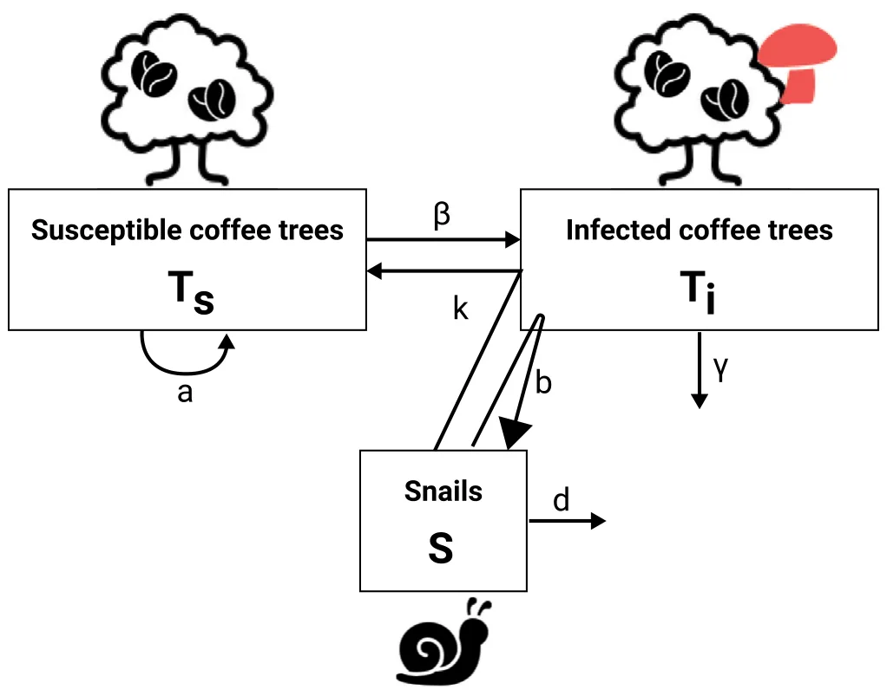
<figcaption><strong>Fig. 1.</strong> A schematic view of the proposed model with the three populations and the interactions between them.</figcaption>
</figure>

### 2.1. Model formalization

In this section, we mathematically formalize the dynamics associ- *𝑑𝑇𝑠*(*𝑡*) ated with each one of the three populations. First, in Eq. (1), *𝑑𝑡* is the susceptible coffee trees’ rate of change over time. It is affected by the following three terms. First, the susceptible coffee trees grow exponentially at a rate *𝑎*. Second, with rate *𝛽* each infected coffee tree infects a susceptible coffee tree. Third, with rate *𝑘* each snail recovers infected coffee trees into susceptible coffee trees.

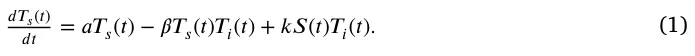

Second, in Eq. (2), 𝑑𝑇𝑖(𝑡) is the infected coffee trees’ rate of change *𝑑𝑡* over time. It is affected by the following three terms. First, with rate *𝛽* each infected coffee tree infects susceptible coffee trees, making them infected as well. Second, with rate *𝑘* each snail recovers infected coffee trees into susceptible coffee trees. Third, at a rate *𝛾* infected coffee trees are dying out.

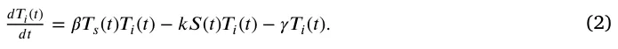

Third, in Eq. (3), 𝑑𝑆(𝑡) is the snails’ rate of change over time. It is *𝑑𝑡* affected by the following two terms. First, the snail population grows at a rate *𝑏* with respect to the number of infected coffee trees. Second, with rate *𝑑* the snail population is decrease exponentially.

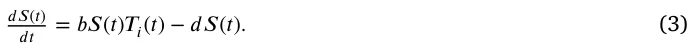

In summary, the entire dynamics is captured using a system of three coupled ordinary differential equations:

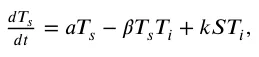

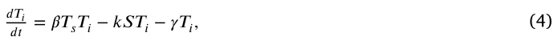

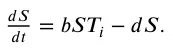

In addition, the initial condition of the system for the beginning of the pandemic with some arbitrary amount of the snail’s pandemic intervention takes the form:

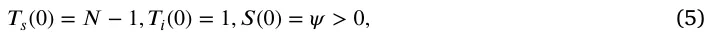

where *𝑁* ∈ **𝐍** is the initial number of coffee trees in the system. The parameters used in the calculation of the model throughout the paper are presented in Table 1. In a complementary manner, the proposed model’s variables with their notation and nomenclature are summarized in Table 2.

<figure class="table-figure" id="table-1">
<figcaption><strong>Table 1</strong> The proposed model’s parameters’ description, values, and sources.</figcaption>

<table><tr><th>Parameter</th><th>Symbol</th><th>Value</th><th>Source</th></tr><tr><td>The natural growth rate of the coffee tree</td><td>𝑎</td><td>𝑎0 = 4.913 ⋅10−8</td><td>De Peffye et al.</td></tr><tr><td>population in hours [𝑡−1]</td><td></td><td></td><td>(1989)</td></tr><tr><td>The average infection rate of coffee trees by rush</td><td>𝛽</td><td>𝛽0 = 5.174 ⋅10−5</td><td>Arroyo-Esquivel</td></tr><tr><td>in an hour (Sujaritpong et al., 2021)</td><td></td><td></td><td>et al. (2019)</td></tr><tr><td>The average recovery rate of infected coffee trees</td><td>𝑘</td><td>𝑘0 = 1.273 ⋅10−4</td><td>Avelino et al.</td></tr><tr><td>by snails in hours [𝑡−1]</td><td></td><td></td><td>(2022)</td></tr><tr><td>The average rate infected coffee trees die due to</td><td>𝛾</td><td>𝛾0 = 8.681 ⋅10−6</td><td>De Peffye et al.</td></tr><tr><td>the pathogen in hours [𝑡−1]</td><td></td><td></td><td>(1989)</td></tr><tr><td>The average rate that the snail population grows</td><td>𝑏</td><td>𝑏0 = 4.340 ⋅10−6</td><td>Avelino et al.</td></tr><tr><td>due to the consumption of rust-infected coffee trees in hours [𝑡−1]</td><td></td><td></td><td>(2022)</td></tr><tr><td>The natural decay rate of the snail population in</td><td>𝑑</td><td>𝑑0 = 1.250 ⋅10−3</td><td>Avelino et al.</td></tr><tr><td>hours [𝑡−1]</td><td></td><td></td><td>(2022)</td></tr><tr><td>The duration of the simulation in hours [𝑡]</td><td>𝜏</td><td>𝜏0 = 7.2 ⋅102</td><td>Assumed</td></tr></table>

</figure>

<figure class="table-figure" id="table-2">
<figcaption><strong>Table 2</strong> The proposed model’s variables with their notation and nomenclature.</figcaption>
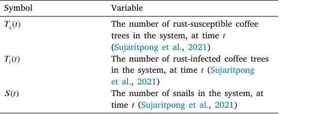

</figure>

<figure class="table-figure" id="table-3">
<figcaption><strong>Table 3</strong> Equilibria states of the proposed system (Eq. (4)).</figcaption>
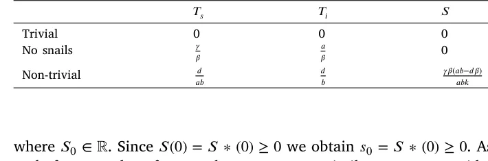

</figure>

### 2.2. The well-posedness of the model

In this section, we show that the proposed model is well-posed. Namely, that it a) has a unique solution and b) the solution is non-negative for any point in time, assuming the initial conditions are non-negative.

#### 2.2.1. Model’s solution existence and uniqueness

In order to show that the proposed model has a solution and it is unique, we utilize the Picard–Lindelöf theorem (Agarwal and Lakshmikantham, 1993). Formally the theorem states, we let *𝐷⊂* R × R𝑛 be a closed rectangle with (*𝑡*0*, 𝑦*0) ∈ *𝐷*. In addition, let *𝑓* ∶ *𝐷* → R𝑛 be a function that is continuous in *𝑡* and Lipschitz continuous in *𝑦*. Then, there exists some *𝜖>* 0 such that the initial value problem:

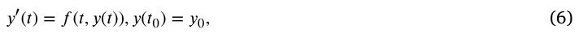

has a unique solution *𝑦*(*𝑡*) on the interval [*𝑡*0 − *𝜖, 𝑡*0 + *𝜖*]. Thus, for our case *𝑦*(*𝑡*) ∶= (*𝑇*𝑠(*𝑡*)*, 𝑇*𝑖(*𝑡*)*, 𝑆*(*𝑡*)). In order to use this theorem, we first need to show that Eq. (4) is continuous in *𝑡* and Lipschitz continuous in *𝑦*. To this end, let us consider a finite duration in time [0*, 𝑇*] such that *𝑇<* ∞. Next, the interaction between the components (i.e., *𝑇*𝑠*, 𝑇*𝑖*, 𝑆*) of the unknown solution, *𝑦*, has terms of a linear form and of the form *𝑦*𝑖*𝑦*𝑗, the function *𝑓* such that *𝑑𝑦*(*𝑡*)∕*𝑑𝑡* = *𝑓* (*𝑡, 𝑦*(*𝑡*)) is *𝐶*1 which implies that it also locally satisfies Lipschitz condition and continuous in *𝑡*, by definition (Bunimovich-Mendrazitsky et al., 2011). Thus, by applying the Cauchy–Lipschitz theorem (Schatzman, 2002) leads to the result of the existence and uniqueness of the solution to Eq. (4), on any finite interval [0*, 𝑇*].

#### 2.2.2. Model’s solution non-negativity

Let us assume an non-negative initial condition *𝑀*(0) = (*𝑇*𝑠 ∗(0) ≥ 0*, 𝑇*𝑖 ∗(0) ≥ 0*, 𝑆* ∗(0) ≥ 0) for the proposed model (Eq. (4)). Now, let us consider the snail’s population equations first. By dividing by *𝑆*(*𝑡*), one obtains:

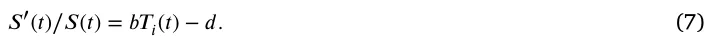

Computing the integral for *𝑡*, we obtain that:

*𝑆*(*𝑡*) = *𝑒*∫ (𝑏𝑇𝑖(𝑡)−𝑑)𝑑𝑡*𝑆*0*,* (8)

such, for any value of *𝑇*𝑖(*𝑡*) and *𝑡*, *𝑆*(*𝑡*) ≥ 0. In a similar manner, consider the *𝑇*𝑖 equation after dividing it by *𝑇*𝑖(*𝑡*):

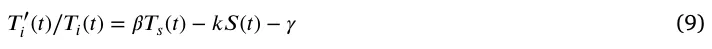

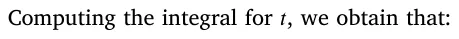

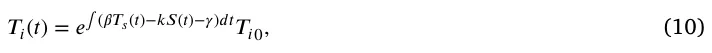

where *𝑇*𝑖0 ∈ R. Since *𝑇*𝑖(0) = *𝑇*𝑖 ∗(0) ≥ 0 we obtain *𝑇*𝑖0 = *𝑇*𝑖 ∗(0) ≥ 0. As such, for any value of *𝑆*(*𝑡*), *𝑇*𝑠(*𝑡*) and *𝑡*, *𝑇*𝑖(*𝑡*) ≥ 0. Finally, as we show that *𝑆*(*𝑡*) and *𝑇*𝑖(*𝑡*) are non-negative for any *𝑡* value and independent to the value of *𝑇*𝑠(*𝑡*) we can replace them with the smallest positive value *𝜖* ∈ R+ they obtain for the initial condition, *𝑀*(0). Hence, the *𝑇*𝑠(*𝑡*) equation takes the form:

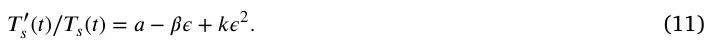

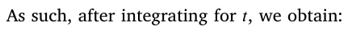

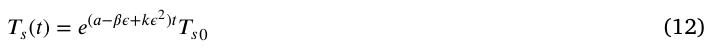

where *𝑇*𝑠0 ∈ R. Since *𝑇*𝑠(0) = *𝑇*𝑠 ∗(0) ≥ 0 we obtain *𝑇*𝑠0 = *𝑇*𝑠 ∗(0) ≥ 0. As such, for any value of *𝑆*(*𝑡*), *𝑇*𝑖(*𝑡*) and *𝑡*, *𝑇*𝑠(*𝑡*) ≥ 0.

### 2.3. Equilibria states

The proposed system (see Eq. (4)) has four equilibria states, as shown in Table 3: trivial, without a snail population, and a non-trivial (i.e., all the population sizes are not equal to zero). These states are of great biological interest as the system aims toward these states and stay near them, if they are stable, for long periods of time until a major event changes the dynamics. Therefore, we are interested in the stability properties of these states.

In order to obtain the equilibria states’ stability of the three equilibria states, we first compute the Jacobian matrix of Eq. (4), following Routh–Hurwitz stability criterion (Parks, 1962):

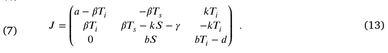

Clearly, the trivial equilibrium, *𝐸*𝑡𝑟𝑖𝑣𝑖𝑎𝑙, is unstable as *𝑎>* 0 is an eigenvalue of the Jacobian, *𝐽*, and therefore not all eigenvalues of *𝐽* have negative real part. Following the Hartman–Grobman theorem (Sternberg, 1993), by setting *𝐸*𝑛𝑜−𝑠𝑛𝑎𝑖𝑙𝑠 to *𝐽* we obtain:

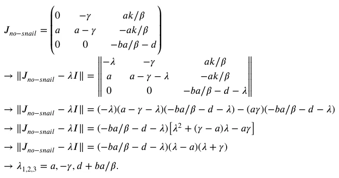

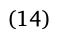

Thus, since *𝑎>* 0 by definition, at least one eigenvalue is positive, and therefore this equilibrium is unstable. Finally, we are setting *𝐸*𝑛𝑜𝑛−𝑡𝑟𝑖𝑣𝑖𝑎𝑙 to *𝐽*, getting:

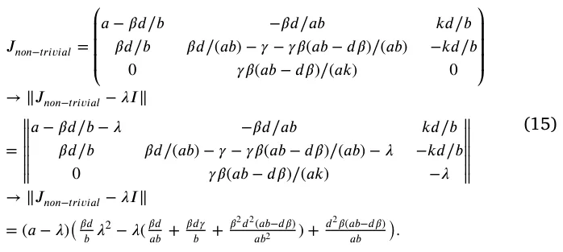

Thus, similar to the ‘‘no-snail’’ equilibrium, *𝑎>* 0 by definition and therefore this equilibrium is unstable.

To conclude, the proposed system does not have stable equilibrium states. In addition, the asymptotic states of the proposed model agree with the equilibria states and the state *𝑇*𝑠 = ∞*, 𝑇*𝑖 = 0*, 𝑆* = 0 (Lazebnik et al., 2021). This outcome indicates that the system is chaotic as no stable equilibrium states are found, which highlights the complexity and fragility of using the snails as biological agents to control the rust pandemic.

## 3. Numerical analysis

In this section, we refer to the mathematical and numerical results of our study. First, we explore the dynamic’s over time for several biologically-relevant initial conditions. Second, we numerically study the sensitivity of the mean reproduction number (*𝐸*[*𝑅*0]) as a function of the model’s parameters. Finally, we explore the optimal initial snail population given the system’s state and propose a procedure to obtain a simple numerical and analytical functional representation of this solution. If not stated otherwise, we use the model’s parameters as shown in Table 1.

We assume that initially, 50% of the plantation is infected, which corresponds to a value like that reported in Vandermeer et al. (2014). We picked the initial size of the susceptible tree population to be 1000 in order to simulate a medium size natural field. We set the number of snails to be 650 as obtained by a grid search (Liu et al., 2006) between 0 and 1000 in a step size of 50, minimizing the average reproduction number. Overall, the initial condition takes the form:

*𝑇*𝑠(0) = 1000*, 𝑇*𝑖(0) = 500*, 𝑆*(0) = 650*.*

We made the code used to obtain these results publicly available.1 Technically, we solved numerically Eq. (4) numerically using the *ode45* function in Matlab (version 2020b) (Shampine and Reichelt, 1997; Shampine et al., 1999) which uses the 4th order runge–kutta method (Evans, 1991).

### 3.1. Baseline

Fig. 2 presents the model dynamics. The *𝑥*-axis shows the time (in hours) from the beginning of the simulation and the *𝑦*-axis shows the distribution of the population to *𝑇*𝑠(*𝑡*), *𝑇*𝑖(*𝑡*), and *𝑆*(*𝑡*). The graph is divided into four cases: (a) no snails are introduced to combat the rust pandemic (*𝑆*(0) = 0), (b) too small snails population is introduced (*𝑆*(0) = 200), (c) a too-large snails population is introduced (*𝑆*(0) = 1500), and (d) the optimal snails’ population is introduced to minimize the average reproduction number (*𝑆*(0) = 650). We simulated *𝜏*0 = 24 ⋅ 30 = 720 hours (e.g., a month), as it considers a feasible duration to see ecological changes in the dynamics (Avelino et al., 2022).

Fig. 2(a) shows that the entire population of coffee trees is infected and slowly dies if no pandemic intervention policy such as the proposed snails is introduced. On another hand, introducing at once a very large population of snails would result in a rust-free state shortly but the snail population that consumes rust is reducing as snails start to eat other plants, as revealed by Fig. 2(b). In the case of a too-small initial snail population, the biological agents are able to slowly increase their numbers while controlling the pandemic spread after several days. However, initially the number of rust-free coffee trees (*𝑇*𝑠) quickly drops which may cause large economic losses, as shown in Fig. 2(c). Finally, using an optimal snail population results in a stable system with an initial quick reduction in the pandemic spread in just a few days as presented by Fig. 2(d).

### 3.2. Sensitivity analysis

In order to evaluate the influence of each parameter model on the mean reproduction number, *𝐸*[*𝑅*0] using the methods of Breda et al. (2021), we performed sensitivity analysis on all six model parameters. The mean reproduction number is chosen as it is widely used to evaluate the pandemic spread and compare across different scenarios (Di Domenico et al., 2020; Zhao et al., 2020; Breda et al., 2021; Chatterjee et al., 2020). Formally, we numerically solved the model (see Section 3) with the parameter values described in Table 1 while changing the value of a single parameter each time and computing its influence on the mean reproduction number. In order to obtain a representative influence of each change, we repeat this computation multiple times, such that each time the initial condition of the model is picked at random. The results of this analysis are shown in Fig. 3 such that the *𝑥*-axis indicates the parameter value and the *𝑦*-axis indicates the mean reproduction number over time normalized to the mean reproduction number of the baseline case, marked by red (see Table 1). The results are shown as an average ± standard deviation of *𝑛* = 100 random instances that differ by their initial conditions. Specifically, the initial conditions are picked at random where *𝑇*𝑠(0), *𝑇*𝑖(0), and *𝑆*(0) are uniformly distributed between 1 and 100.

Fig. 3(a) shows that minor changes in the natural growth of coffee trees do not play a critical role in the pandemic spread as even twice larger or smaller value of *𝑎* results in only 3% change in the normalized mean reproduction number. Fig. 3(b) on the other hand, reveals a monotonic increasing normalized mean reproduction number to the value of the average infection rate (*𝛽*). As a sanity check, *𝛽* = 0 results in the excepted *𝐸*[*𝑅*0] = 0. Ignoring this value, a Pearson correlation (Sedgwick, 2012) analysis between *𝛽* and *𝐸*[*𝑅*0] shows a linear connection between the two with a coefficient of determination *𝑅*2 = 0*.*92. Fig. 3(c) disclose a non-linear relationship between *𝑘* and *𝐸*[*𝑅*0] = 0. Figs. 3(d) and 3(e) lay bare a monotonic decreasing normalized mean reproduction number to the die-out rate due to the pandemic. On the other hand, Fig. 3(f) shows a monotonic increasing normalized mean reproduction number to the natural die-out rate of the snail population.

<figure id="fig-2">
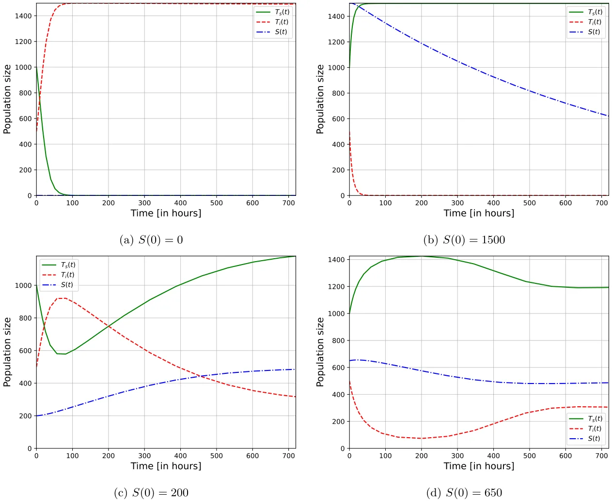
<figcaption><strong>Fig. 2.</strong> The dynamics of the proposed system (Eq. (4)), divided into several initial conditions with different initial snail population sizes and <em>𝑇</em>𝑠(0) = 1000<em>, 𝑇</em>𝑖(0) = 500.</figcaption>
</figure>

In a complementary manner, Fig. 4 presents a two-dimensional sensitivity analysis where two parameter values are altered to measure the normalized mean reproduction number, as obtained by computing the average value of *𝑛* = 100 samples. All three cases, *𝑎* × *𝛾*, *𝛽* × *𝑘*, and *𝑏* × *𝑑* lie out non-linear connections between the model’s parameters and the normalized mean reproduction number.

### 3.3. Optimal snail population

As the proposed model is designed to help farm-owners to tackle the rust pandemic using the snail biological agents, a central question one should find the optimal initial size of the snail population given a farm’s condition as indicated by the number of susceptible and infected coffee trees. Thus, to answer this question, we utilized the Newton– Raphson method (Verbeke and Cools, 1995), obtaining the derivative of the loss function used by the Newton–Raphson method at a point (i.e., a value for the initial snail population size) using the central Euler numerical scheme (Biswas et al., 2013). Formally, we set the loss function to be the average basic reproduction number (*𝐸*[*𝑅*0]) and *𝑆*(0) is set to be the optimization parameter. We repeated this analysis for *𝑛* = 10 000 times, picking the values of *𝑇*𝑠(0) and *𝑇*𝑖(0) at random in a uniformly distributed manner between 1 and 200. Fig. 5 summarize the results of this analysis where more red color indicates a larger initial snail population size while blue color indicates the opposite, ranging between 0 to 380. The x-axis indicates the initial number of susceptible coffee trees (*𝑇*𝑠(0)) and the y-axis indicates the initial number of rust-infected coffee trees (*𝑇*𝑠(0)). In order to find an analytical approximation to the data, we used SciMED (Simon-Keren et al., 2023), a symbolic regression model. SciMED is provided with the task to find the best polynomial representation of the data used to produce Fig. 5 such that the loss function is defined to be the mean square error (Transtrum and Sethna, 2012) between the numerical data and the analytical function approximating this data, resulting in:

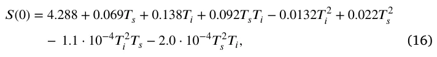

with coefficient of determination *𝑅*2 = 0*.*948.

## 4. Discussion

In this work, we present a novel ecological–epidemiological mathematical model of rust pandemic control using snails as biological agents. We found that the proposed model has three equilibria states such that all of them are unstable. As far as we know, this is the first model that aims to capture the snail as a biological agent for the rust pandemic dynamics and provides a stability analysis of these dynamics.

Based on the proposed model, a numerical analysis of the model for four different initial conditions is provided in Fig. 2. This analysis shows how an optimal number of snail population can converge the system into an equilibrium where the pandemic and snail population are controlled as shown in Fig. 2(d). In comparison, a too-large or small snail population obtains unwanted results as revealed by Figs. 2(b) and 2(c), respectively.

<figure id="fig-3">
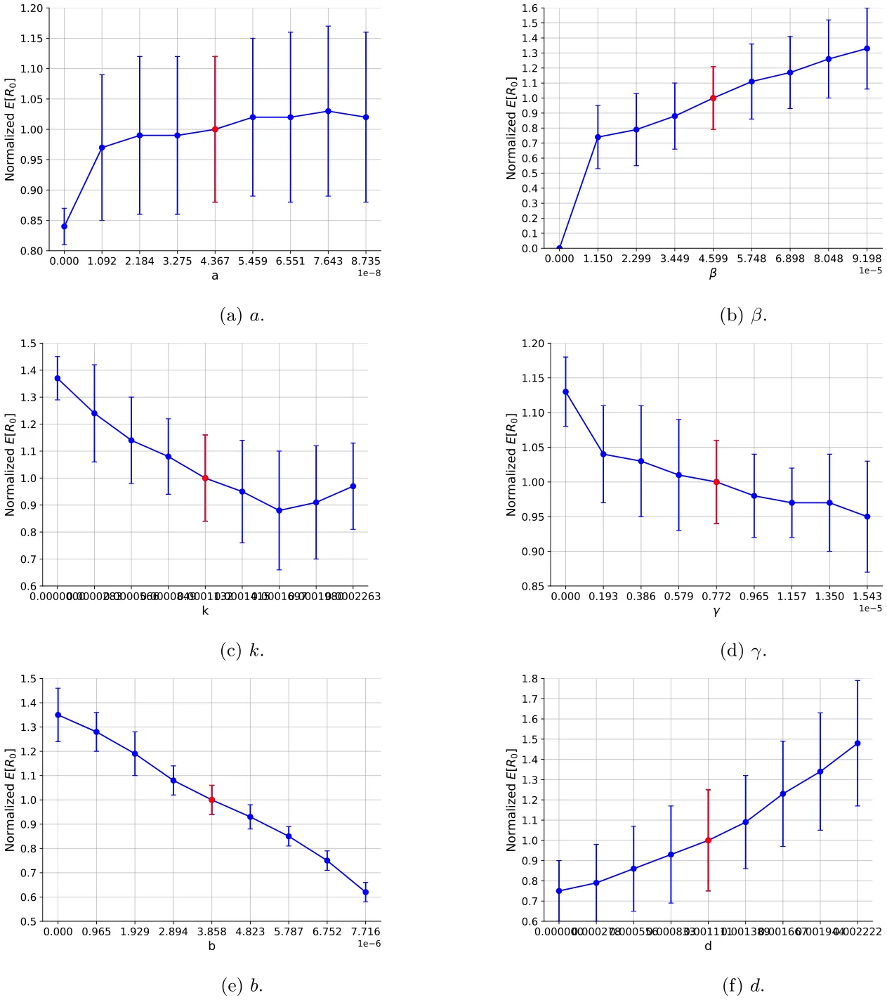
<figcaption><strong>Fig. 3.</strong> A sensitivity analysis of the model’s parameters. The normalized mean reproduction number (<em>𝐸</em>[<em>𝑅</em>0]) values are obtained as an average ± standard deviation of <em>𝑛</em> = 100 simulations with initial condition uniformly sampled from <em>𝑇</em>𝑠(0)<em>, 𝑇</em>𝑖(0)<em>, 𝑆</em>(0) ∈[1<em>,</em> 100].</figcaption>
</figure>

Since the optimal number of the initial snail population is closely dependent on the model’s parameters, we performed a sensitivity of these parameters on the pandemic spread. In particular, we focused on the mean reproduction number as the metric to evaluate the performance of the snails as a pandemic control policy. The obtained results are mainly linear or at least monotonically connected as indicated by Fig. 3. These results agree with other models that merge between prey–predator and epidemiological dynamics (Hadeler and Freedman, 1989; Sahoo and Poria, 2013; Sabir et al., 2022). On the other hand, when extending the sensitivity analysis from one to two dimensions, as revealed by Fig. 4, the connections become non-linear and challenging to interpret analytically. One can associate this phenomenon with the non-linearity found in the model (Eq. (4)). Namely, this phenomenon causes long infection chains when a population of infected trees reinfected after being susceptible as after some time the snail population decreases. This outcome strongly indicates that the model’s parameter values’ accuracy is important to obtain a decent prediction of the dynamics.

However, as these values might be hard to obtain for each farm/region separately as it requires multiple biological and ecological measurements over time, which can be economically expensive and logistically challenging, we assume the model’s parameter values are a good average approximation. Thus, leaving the task of finding the initial conditions alone to the farm owners to decide about the optimal initial snail population size. As Fig. 5 shows, given the initial number of susceptible and infected coffee trees, the optimal number of snails to control the rust pandemic and obtain an equilibrium has a second-order polynomial correlation to the initial susceptible and infected coffee tree populations. Formally, the connection is described by Eq. (16) and can be used to obtain the optimal initial snail population size given the initial conditions, without the need to solve the dynamical system with a high level of accuracy.

<figure id="fig-4">
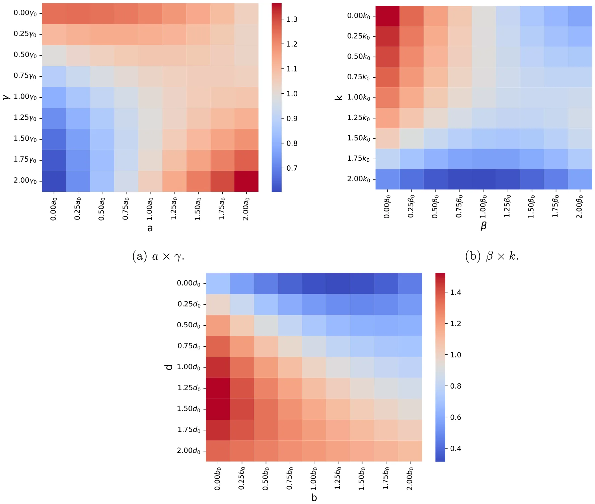
<figcaption><strong>Fig. 4.</strong> Two-dimensional sensitivity analysis of the model’s parameters. The normalized mean reproduction number (<em>𝐸</em>[<em>𝑅</em>0]) values are obtained as an average of <em>𝑛</em> = 100 simulations with initial condition uniformly sampled from <em>𝑇</em>𝑠(0)<em>, 𝑇</em>𝑖(0)<em>, 𝑆</em>(0) ∈[1<em>,</em> 100].</figcaption>
</figure>

<figure id="fig-5">
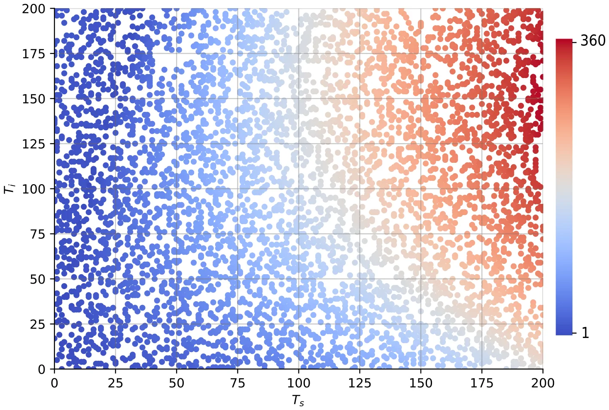
<figcaption><strong>Fig. 5.</strong> The optimal number of snails required to eat rust as a function of the initial number of susceptible and rust-infected coffee trees (<em>𝑇</em>𝑠<em>, 𝑇</em>𝑖). The figure contains <em>𝑛</em> = 10 000 samples, uniformly distributed between 0 and 200.</figcaption>
</figure>

Therefore, researchers can adopt the proposed model and numerical prediction tool to get an estimate of the number of snails that should be introduced into rust-infested areas in order to control the spread of a rust pandemic while leaving the rest of the plants unaffected by the snail population.

Nevertheless, the proposed model has several limitations that can be addressed in future work. First, as no spatial component is taken into consideration, the well-mixture is operating as an upper boundary (Lazebnik and Bunimovich-Mendrazitsky, 2022) for the realistic infection rate. This is also true for the rust-consumed by snails processes. Thus, introducing a spatial component to the model would significantly increase its accuracy (Shen et al., 2020; Kiss et al., 2017; Holme, 2021). Second, one can modify Eq. (3) to be *𝑆*(*𝑡*+*𝜓*) rather than *𝑆*(*𝑡*) in the first term, for *𝜓>* 0, since the population is growing shortly after more resources are available (Mukhopadhyay and Bhattacharyya, 2005). Third, adding a plant population that does not include the coffee trees to the proposed system would allow investigation of the level of damage the snail population cause to the ecosystem (Gibson et al., 2004; Madden, 2006). Forth, as each plant type is susceptible to multiple pathogens, an extension of the proposed model for the case of a multi-strain pandemic is a natural extension of the proposed model (Khyar and Allali, 2020; Lazebnik and Blumrosen, 2022; Gordo et al., 2009; Minayev and Ferguson, 2008; Dang et al., 2016). Finally, one can add an economic component to the model that captures the cost of setting and collecting snails as a spend and getting more healthy trees as a profit (Villarreyna et al., 2020b). This extension would allow finding more complex biological-economic policies to optimize the profit one obtains from a field of coffee trees.

## Funding

This research did not receive any specific grant from funding agencies in the public, commercial, or not-for-profit sectors.

## Declaration of competing interest

The authors declare that they have no known competing financial interests or personal relationships that could have appeared to influence the work reported in this paper.

## Data availability

Data will be made available on request.

## Acknowledgments

The authors wish to thank Liron Simon Keren for her help with the symbolic regression analysis.

## Notes

1 https://github.com/teddy4445/coffee\_tree\_with\_snails

## References

- Adugna, G., Jefuka, C., 2006. Resistance levels of Arabica coffee cultivars to coffee berry disease, coffee wilt and leaf rust diseases in Ethiopia. In: Proceedings of the 12th Crop Science Society of Ethiopia, Vol. 2006. CSSE, pp. 22–24. [link](http://refhub.elsevier.com/S0303-2647%2823%2900091-6/sb1)
- Agarwal, R.P., Lakshmikantham, V., 1993. Uniqueness and nonuniqueness criteria for ordinary differential equations. World Sci. [link](http://refhub.elsevier.com/S0303-2647%2823%2900091-6/sb2)
- Alemu, K., Adugna, G., Lemessa, F., Muleta, D., 2016. Current status of coffee berry disease (Colletotrichum kahawae waller and bridge) in Ethiopia. Arch. Phytopathol. Plant Prot. 49, 421–433. [link](http://refhub.elsevier.com/S0303-2647%2823%2900091-6/sb3)
- Arroyo-Esquivel, J., Sanchez, F., Barboza, L.A., 2019. Infection model for analyzing biological control of coffee rust using bacterial anti-fungal compounds. Math. Biosci. 307, 13–24. [link](http://refhub.elsevier.com/S0303-2647%2823%2900091-6/sb4)
- Avelino, J., M. Cristancho, S., Georgiou, P., Imbach, L., Aguilar, G., Bornemann, P., Laderach, F., Anzueto, A., Hruska, C.M., 2022. Towards an eco-friendly coffee rust control: Compilation of natural alternatives from a nutritional and antifungal perspective. Plants 11, 2745. [link](http://refhub.elsevier.com/S0303-2647%2823%2900091-6/sb5)
- Avelino, J., Willocquet, L., Savary, S., 2004. Effects of crop management patterns on coffee rust epidemics. Plant Pathol. 53 (5), 541–547. [link](http://refhub.elsevier.com/S0303-2647%2823%2900091-6/sb6)
- Avelino, J., Zelaya, H., Merlo, A., Pineda, A., Ordoñez, M., Savary, S., 2006. The intensity of a coffee rust epidemic is dependent on production situations. Ecol. Model. 197 (3), 431–447. [link](http://refhub.elsevier.com/S0303-2647%2823%2900091-6/sb7)
- Biswas, B.N., Chatterjee, S., Mukherjee, S.P., Pal, S., 2013. A discussion on Euler method: A review. Electron. J. Math. Anal. Appl. 1 (2), 294–317. [link](http://refhub.elsevier.com/S0303-2647%2823%2900091-6/sb8)
- Breda, D., Florian, F., Ripoll, J., Vermiglio, R., 2021. Efficient numerical computation of the basic reproduction number for structured populations. J. Comput. Appl. Math. 384, 113165. [link](http://refhub.elsevier.com/S0303-2647%2823%2900091-6/sb9)
- Bunimovich-Mendrazitsky, S., Claude Gluckman, J., Chaskalovic, J., 2011. A mathematical model of combined bacillus Calmette–Guerin (BCG) and interleukin (IL)-2 immunotherapy of superficial bladder cancer. J. Theoret. Biol. 277 (1), 27–40. [link](http://refhub.elsevier.com/S0303-2647%2823%2900091-6/sb10)
- Castillo, N.E.T., Acosta, Y.A., Parra-Arroyo, L., Martínez-Prado, M.A., Rivas- Galindo, V.M., Iqbal, H.M.N., Bonaccorso, A.D., Melchor-Martínez, E.M., Parra- Saldívar, R., 2022. Towards an eco-friendly coffee rust control: Compilation of natural alternatives from a nutritional and antifungal perspective. Plants 11, 2745. [link](http://refhub.elsevier.com/S0303-2647%2823%2900091-6/sb11)
- Chatterjee, K., Chatterjee, K., Kumar, A., Shankar, S., 2020. Healthcare impact of COVID-19 epidemic in India: A stochastic mathematical model. Med. J. Armed Forces India 76 (2), 147–155. [link](http://refhub.elsevier.com/S0303-2647%2823%2900091-6/sb12)
- Cressey, D., 2013. Coffee rust regains foothold. Nature 493, 587. [link](http://refhub.elsevier.com/S0303-2647%2823%2900091-6/sb13)
- Dang, Y.-X., Li, X.-Z., Martcheva, M., 2016. Competitive exclusion in a multi-strain immuno-epidemiological influenza model with environmental transmission. J. Biol. Dyn. 10 (1). [link](http://refhub.elsevier.com/S0303-2647%2823%2900091-6/sb14)
- De Peffye, P.H., Lecoustre, R., Edelin, C., Dinouard, P., 1989. Modelling plant growth and architecture. Cell. Cell. Signal. 240a, 237–246. [link](http://refhub.elsevier.com/S0303-2647%2823%2900091-6/sb15)
- Di Domenico, L., Pullano, G., Sabbatini, C.E., Bo Elle, P.Y., Colizza, V., 2020. Impact of lockdown on COVID-19 epidemic in Ile-de-France and possible exit strategies. BMC Med. [link](http://refhub.elsevier.com/S0303-2647%2823%2900091-6/sb16)
- Djuikem, C., Grognard, F., Wafo, R.T., Touzeau, S., Bowong, S., 2021. Modelling coffee leaf rust dynamics to control its spread. Math. Model. Nat. Phenom. 16, 26. [link](http://refhub.elsevier.com/S0303-2647%2823%2900091-6/sb17)
- Evans, D.J., 1991. A new 4th order runge-kutta method for initial value problems with error control. Int. J. Comput. Math. 39 (3–4), 217–227. [link](http://refhub.elsevier.com/S0303-2647%2823%2900091-6/sb18)
- Getz, W.M., Salter, R., Mgbara, W., 2019. Adequacy of SEIR models when epidemics have spatial structure: Ebola in sierra leone. Trans. R. Soc. [link](http://refhub.elsevier.com/S0303-2647%2823%2900091-6/sb19)
- Gibson, G.J., Kleczkowski, A., Gilligan, C.A., 2004. Bayesian analysis of botanical epidemics using stochastic compartmental models. Proc. Natl. Acad. Sci. 101 (33), 12120–12124. [link](http://refhub.elsevier.com/S0303-2647%2823%2900091-6/sb20)
- Gilligan, C.A., Gubbins, S., 1997. Analysis and fitting of an SIR model with host response to infection load for a plant disease. Philos. Trans. R. Soc. B 352, 353–364. [link](http://refhub.elsevier.com/S0303-2647%2823%2900091-6/sb21)
- Gordo, I., Gomes, M.G.M., Reis, D.G., Campos, P.R.A., 2009. Genetic diversity in the SIR model of pathogen evo. PLoS One 4 (3), e4876. [link](http://refhub.elsevier.com/S0303-2647%2823%2900091-6/sb22)
- Grenfell, B., Kleczkowski, A., Gilligan, C., Bolker, B., 1995. Spatial heterogeneity, nonlinear dynamics and chaos in infectious diseases. Stat. Methods Med. Res. 4 (2), 160–183. [link](http://refhub.elsevier.com/S0303-2647%2823%2900091-6/sb23)
- Hadeler, K.P., Freedman, H.I., 1989. Predator-prey populations with parasitic infect. J. Math. Biol. 27, 609–631. [link](http://refhub.elsevier.com/S0303-2647%2823%2900091-6/sb24)
- Hajian-Forooshani, Z., Vandermeer, J., Perfecto, I., 2020. Insights from excrement: invasive gastropods shift diet to consume the coffee leaf rust and its mycoparasite. Ecology 101 (5). [link](http://refhub.elsevier.com/S0303-2647%2823%2900091-6/sb25)
- Holme, P., 2021. Fast and principled simulations of the SIR model on temporal networks. PLoS One. 16 (2), e0246961. [link](http://refhub.elsevier.com/S0303-2647%2823%2900091-6/sb26)
- Kampmeijer, P., Zadoks, J.C., 1997. Asimulatoroffoci and epidemics in mixtures, multilines, and mosaics of resistant and susceptible plants. EPIMUL 50. [link](http://refhub.elsevier.com/S0303-2647%2823%2900091-6/sb27)
- Kawaguchi, A., Kitabayashi, S., Inoue, K., Tanina, K., 2022. An HLD model for tomato bacterial canker focusing on epidemics of the pathogen due to cutting by infected scissors. Plants 11 (17). [link](http://refhub.elsevier.com/S0303-2647%2823%2900091-6/sb28)
- Kermack, W.O., McKendrick, A.G., 1927. A contribution to the mathematical theory of epidemics. Proc. R. Soc. 115, 700–721. [link](http://refhub.elsevier.com/S0303-2647%2823%2900091-6/sb29)
- Khyar, O., Allali, K., 2020. Global dynamics of a multi-strain SEIR epidemic model with general incidence rates: application to COVID-19 pandemic. Nonlinear Dynam. 102, 489–509. [link](http://refhub.elsevier.com/S0303-2647%2823%2900091-6/sb30)
- Kiss, I.Z., Miller, J.C., Simon, P.L., 2017. Mathematics of epidemics on networks. Cham: Springer. [link](http://refhub.elsevier.com/S0303-2647%2823%2900091-6/sb31)
- Kolmer, J., Ordonez, M., Groth, J., 2009. The rust fungi. ELS. [link](http://refhub.elsevier.com/S0303-2647%2823%2900091-6/sb32)
- Lazebnik, T., Blumrosen, G., 2022. Advanced multi-mutation with intervention policies pandemic model. IEEE Access 10, 22769–22781. [link](http://refhub.elsevier.com/S0303-2647%2823%2900091-6/sb33)
- Lazebnik, T., Bunimovich-Mendrazitsky, S., 2022. Generic approach for mathematical model of multi-strain pandemics. PLoS One 17 (4), e0260683. [link](http://refhub.elsevier.com/S0303-2647%2823%2900091-6/sb34)
- Lazebnik, T., Bunimovich-Mendrazitsky, S., Shaikhet, L., 2021. Novel method to analytically obtain the asymptotic stable equilibria states of extended SIR-type epidemiological models. Symmetry 13 (7), 1120. [link](http://refhub.elsevier.com/S0303-2647%2823%2900091-6/sb35)
- Liu, R., Liu, E., Yang, J., Li, M., Wang, F., 2006. Optimizing the hyper-parameters for SVM by combining evolution strategies with a grid search. In: Intelligent Control and Automation, Vol. 344. In: Lecture Notes in Control and Information Sciences, Springer, Berlin, Heidelberg. [link](http://refhub.elsevier.com/S0303-2647%2823%2900091-6/sb36)
- Madden, L.V., 2006. Botanical epidemiology: Some key advances and its continuing role in disease management. Eur. J. Plant Pathol. 115, 3–23. [link](http://refhub.elsevier.com/S0303-2647%2823%2900091-6/sb37)
- Madden, L.V., Van den Bosch, F., 2002. A population-dynamics approach to assess the threat of plant pathogens as biological weapons against annual crops. BioScience 52, 65–74. [link](http://refhub.elsevier.com/S0303-2647%2823%2900091-6/sb38)
- Minayev, P., Ferguson, N., 2008. Improving the realism of deterministic multi-strain models: implications for modelling influenza a. J. R. Soc. Interface. [link](http://refhub.elsevier.com/S0303-2647%2823%2900091-6/sb39)
- Mohammed, A., Jambo, A., 2015. Importance and characterization of coffee berry disease (Colletotrichum kahawae) in Borena and Guji zones, Southern Ethiopia. J. Plant Pathol. Microb. 6, 302. [link](http://refhub.elsevier.com/S0303-2647%2823%2900091-6/sb40)
- Mukhopadhyay, B., Bhattacharyya, R., 2005. Dynamics of a delay-diffusion prey-predator model with disease in the prey. JAMC 17, 361. [link](http://refhub.elsevier.com/S0303-2647%2823%2900091-6/sb41)
- Parks, P., 1962. A new proof of the Routh–Hurwitz stability criterion using the second method of Liapunov. Math. Proc. Camb. Phil. Soc. 58 (4), 694–702. [link](http://refhub.elsevier.com/S0303-2647%2823%2900091-6/sb42)
- Rafikov, M., Balthazar, J.M., von Bremen, H.F., 2008. Mathematical modeling and control of population systems: Applications in biological pest control. Appl. Math. Comput. 200 (2), 557–573. [link](http://refhub.elsevier.com/S0303-2647%2823%2900091-6/sb43)
- Sabir, Z., Botmart, T., Raja, M.A.Z., Weera, W., 2022. Anadvanced computing scheme for the numerical investigations of an infection-based fractional-order nonlinear prey-predator system. PLoS One 17 (3), e0265064. [link](http://refhub.elsevier.com/S0303-2647%2823%2900091-6/sb44)
- Sahoo, B., Poria, S., 2013. Disease control in a food chain model supplying alternative food. Appl. Math. Model. 37, 5653–5663. [link](http://refhub.elsevier.com/S0303-2647%2823%2900091-6/sb45)
- Schatzman, M., 2002. Numerical Analysis: A Mathematical Introduction. Oxford Univ. Press. [link](http://refhub.elsevier.com/S0303-2647%2823%2900091-6/sb46)
- Sedgwick, P., 2012. Pearson’s correlation coefficient. BMJ 345. [link](http://refhub.elsevier.com/S0303-2647%2823%2900091-6/sb47)
- Sera, G.H., de Carvalho, C.H.S., de Rezende Abrahao, J.C., Pozza, E.A., Matiello, J.B., de Almeida, S.R., Bartelega, L., dos Santos Botelho, D.M., 2022. Coffee leaf rust in Brazil: Historical events, current situation, and control measures. Agronomy 12, 496. [link](http://refhub.elsevier.com/S0303-2647%2823%2900091-6/sb48)
- Shampine, L.F., Reichelt, M.W., 1997. The MATLAB ODE suite. SIAM J. Sci. Comput. 18, 1–22. [link](http://refhub.elsevier.com/S0303-2647%2823%2900091-6/sb49)
- Shampine, L.F., Reichelt, M.W., Kierzenka, J.A., 1999. Solving index-1 DAEs in MATLAB and simulink. SIAM Rev. 41, 538–552. [link](http://refhub.elsevier.com/S0303-2647%2823%2900091-6/sb50)
- Shen, Y., Li, C., Dong, H., Wang, Z., Martinez, L., Sun, Z., Handel, A., Chen, Z., Chen, E., Ebell, M.H., Wang, F., Yi, B., Wang, H., Wang, X., Wang, A., Chen, B., Qi, Y., Liang, L., Li, Y., Ling, F., Chen, J., Xu, G., 2020. Community outbreak investigation of SARS-CoV-2 transmission among bus riders in eastern China. 180, (12), pp. 1665–1671, [link](http://refhub.elsevier.com/S0303-2647%2823%2900091-6/sb51)
- Shi, H., Duan, Z., Chen, G., 2008. An SIS model with infective medium on complex networks. Physica A 387 (8), 2133–2144. [link](http://refhub.elsevier.com/S0303-2647%2823%2900091-6/sb52)
- Simon-Keren, L., Liberzon, A., Lazebnik, T., 2023. A computational framework for physics-informed symbolic regression with straightforward integration of domain knowledge. Sci. Rep. 13, 1249. [link](http://refhub.elsevier.com/S0303-2647%2823%2900091-6/sb53)
- Sternberg, N., 1993. A Hartman–Grobman theorem for a class of retarded functional differential equations. J. Math. Anal. Appl. 176 (1), 156–165. [link](http://refhub.elsevier.com/S0303-2647%2823%2900091-6/sb54)
- Sujaritpong, O., Yoo-Kong, S., Bhadola, P., 2021. Analysis and dynamics of the international coffee trade network. J. Phys. Conf. Ser. 1719, 012106. [link](http://refhub.elsevier.com/S0303-2647%2823%2900091-6/sb55)
- Transtrum, M.K., Sethna, J.P., 2012. Improvements to the levenberg-marquardt algorithm for nonlinear least-squares minimization. arXiv. [link](http://refhub.elsevier.com/S0303-2647%2823%2900091-6/sb56)
- Vandermeer, J., Jackson, D., Perfecto, I., 2014. Qualitative dynamics of the coffee rust epidemic: educating intuition with theoretical ecology. BioScience 63, 210–218. [link](http://refhub.elsevier.com/S0303-2647%2823%2900091-6/sb57)
- Venturino, E., 1994. The influence of diseases on Lotka-Volterra systems. JSTOR 24 (1), 381–402. [link](http://refhub.elsevier.com/S0303-2647%2823%2900091-6/sb58)
- Verbeke, J., Cools, R., 1995. The Newton–Raphson method. Internat. J. Math. Ed. Sci. Tech. 26 (2), 177–193. [link](http://refhub.elsevier.com/S0303-2647%2823%2900091-6/sb59)
- Villarreyna, R., Barrios, M., Vílchez, S., Cerda, R., Vignola, R., Avelino, J., 2020a. Economic constraints as drivers of coffee rust epidemics in Nicaragua. Crop Prot. 127, 104980. [link](http://refhub.elsevier.com/S0303-2647%2823%2900091-6/sb60)
- Villarreyna, R., Barrios, M., Vílchez, S., Cerda, R., Vignola, R., Avelino, J., 2020b. Economic constraints as drivers of coffee rust epidemics in nicaragua. Crop Prot. 127, 104980. [link](http://refhub.elsevier.com/S0303-2647%2823%2900091-6/sb61)
- Wangersky, P.J., 1978. Lotka-Volterra population models. Annu. Rev. Ecol. Syst. 9, 189–218. [link](http://refhub.elsevier.com/S0303-2647%2823%2900091-6/sb62)
- Zhao, S., Stone, L., Gao, D., Musa, S.S., Chong, M.K.C., He, D., Wang, M.H., 2020. Imitation dynamics in the mitigation of the novel coronavirus disease (COVID-19) outbreak in Wuhan, China from 2019 to 2020. Ann. Transnatl. Med. 8. [link](http://refhub.elsevier.com/S0303-2647%2823%2900091-6/sb63)
