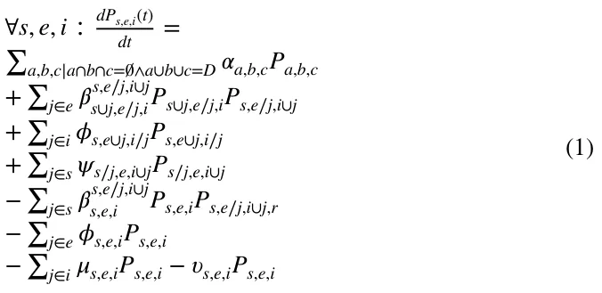
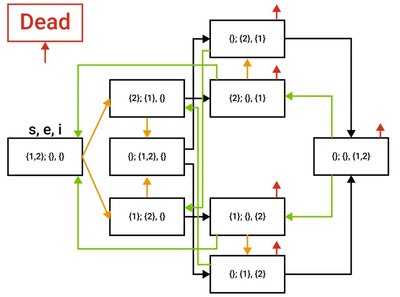
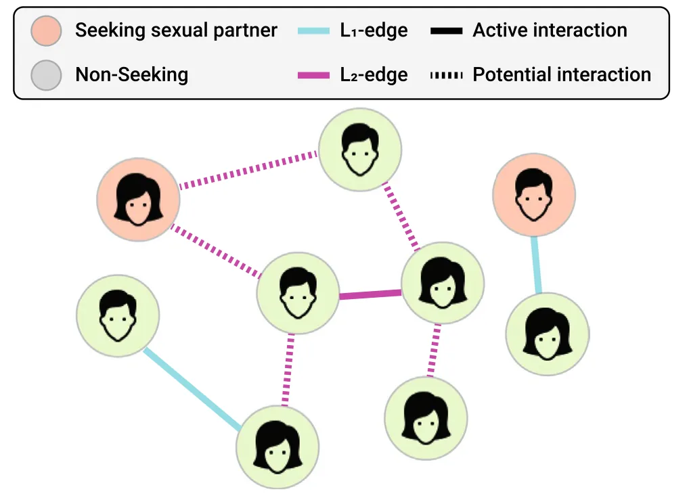
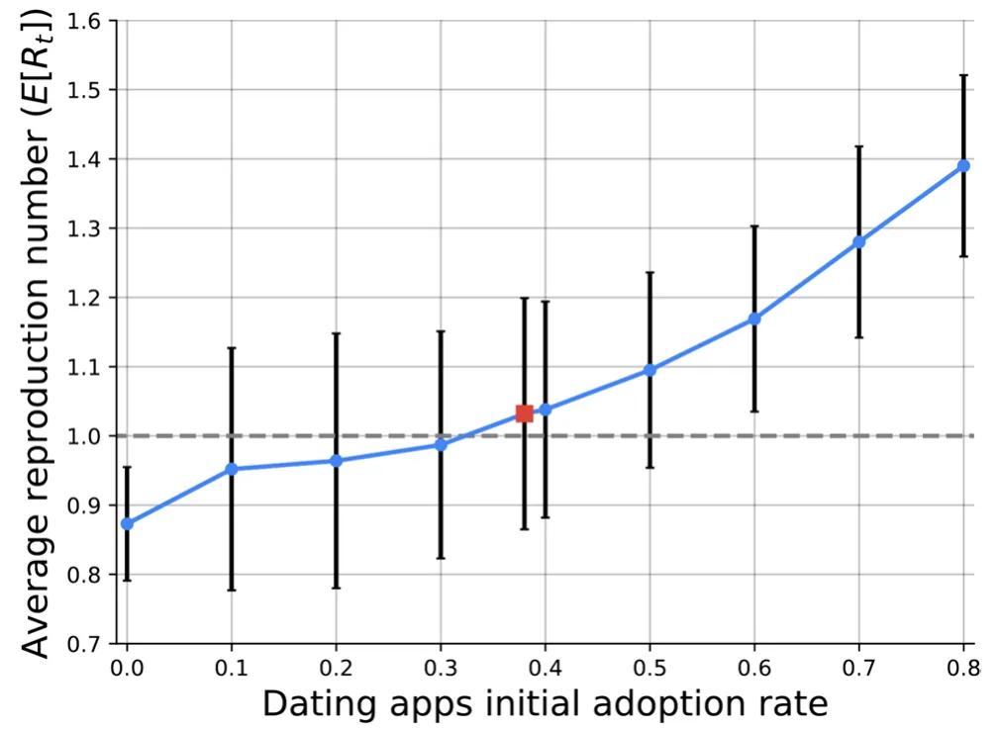
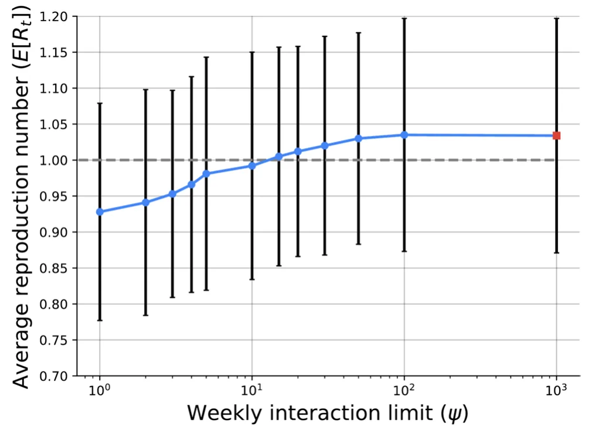
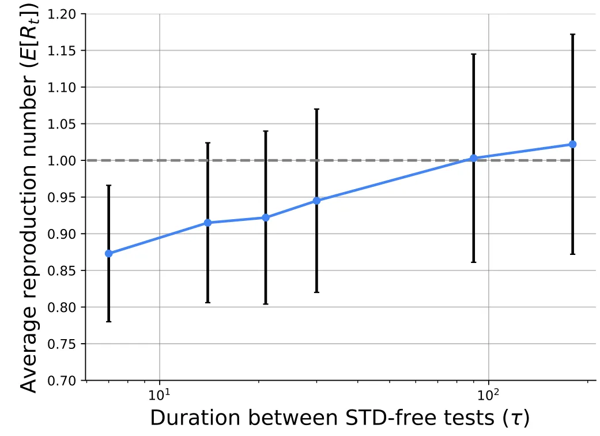

## 1 Introduction

Sexually transmitted diseases (STDs) are a significant public health challenge, exerting a substantial social and economic burden globally (Caruso et al. 2021; Adler 1996; Piot and Islam 1994; Mayaud and Mabey 2004). With an estimated 376 million new infections reported annually, the widespread prevalence of STDs necessitates comprehensive investigations into their transmission dynamics and the factors that contribute to their propagation (World Health Organization 2020; Wasserheit and Aral 1996). In particular, data from the Centers for Disease Control and Prevention (CDC) in the U.S. illustrates a notable upsurge in newly reported cases of chlamydia, gonorrhea, and syphilis since 2013 (Ghani et al. 1997; Van de Laar and Spiteri 2012; Wolitski et al. 2001).

As part of a larger trend of social interactions moving into the digital world (Karanasios et al. 2021; MacLean et al. 2014), the rise of online dating platforms has introduced increased complexity and versatility into the way individuals find life and sexual partners (Barrada et al. 2021; Sin et al. 2021). For instance, recent research has established a correlation between the use of online dating applications and a history of five or more previous sexual partners among young adults (Shapiro et al. 2017; McNicoll and Beaulieu- Prévost 2023). To effectively capture the interplay between sexual network structures, partner formation, and STD transmission, researchers have developed diverse mathematical frameworks (Anderson and May 1991; Boily and Mâsse 1997; Grassly and Fraser 2008). However, existing models often overlook the inherent heterogeneity in individual-level link formation, as they rely on mean-field approximations at the pair level or statistical characterizations of sexual networks (Leng and Keeling 2018; Kretzschmar and Heijne 2017; Yan et al. 2018).

These efforts, however, have predominantly centered on traditional modes of social interaction, overlooking the transformative impact of digital platforms in reshaping interpersonal connections. In the contemporary landscape, dating apps have emerged as a pervasive and influential feature of modern society, revolutionizing the way individuals initiate and cultivate relationships (Duguay et al. 2022; Morrissey 2020). The meteoric rise in dating app adoption and usage underscores the need to reevaluate existing disease transmission models. In this work, we introduce a novel mathematical framework based on an extended Susceptible-Infectious-Susceptible (SIS) epidemiological model to investigate the intricate interplay between dating app usage and STD transmission spread dynamics. **Specifically, we studied the effectiveness of two pandemic intervention policies - limiting the number of interactions between app users and requiring app users to provide proof for STD-free tests every once in a while as by applying these policies, the STD pandemic spread that caused by the dating apps can be mitigated.**

The rest of the paper is organized as follows. Section 2 presents an overview of the dating app design, objective, and social impact as well as STD spread dynamics models. In Sect. 3, we outline the proposed mathematical model constructed from a graph-based spatial model, the influence of dating apps, an extended multi-pathogen SIS model, and an agent-based simulation implementation to allow heterogeneous population dynamics. Next, in Sect. 4, we describe the experiment design of the proposed model with a realistic configuration followed by the obtained results from the experiments. Finally, Sect. 5 provides an analysis of the results as well as the strengths and limitations of the proposed model with possible future work.

## 2 Related work

In order to understand the STD spread dynamics and the role of dating apps in these settings, we overview the current design, objective, and social influence of dating apps on the population followed by a disruption of previous epidemiological models in general and for STDs, in particular.

### 2.1 Dating apps

As technology evolved, a greater number of dating apps were created to help individuals find their partner, whether it may be sexual or romantic (Stoicescu 2019). The proliferation of dating apps has ushered in a new era of interpersonal connectivity, revolutionizing the way individuals form relationships and engage in romantic interactions (Hobbs et al. 2017; Wu and Trottier 2022). Dating apps have witnessed exceptional growth in recent years, with an increasing number of users engaging in diverse forms of interaction facilitated by these platforms (Sobieraj and Humphreys 2022). Interestingly, the business objective of these apps is usually counter to their declared marketing for users since apps are financially gaining from users using the app as much as possible while promising to help find someone that would make the users leave the app (Castro et al. 2020; Sawyer et al. 2020).

While studies about the nature of users’ objectives in such dating apps are spread across the "hookup" and meaningful relationship line, all agree about the fact these mobile applications increase the amount of romantic and sexual interactions overall (Timmermans and Courtois 2018; Dominic and Fung 2016; Lapsley et al. 2022). This fast-paced scenario can fuel an STD spread since the more sexual partners a person has, the higher the likelihood of coming into contact with an infected individual as each new partner represents a potential source of infection, especially if they have multiple partners themselves (Eames and Keeling 2002). Hence, dating apps have garnered interest within the realm of public health research (Castro and Barrada 2020; Taubert et al. 2016). Notably, the potential links between dating app usage and increased sexual risk behavior have raised concerns regarding STDs transmission dynamics (Enomoto et al. 2017). For example, Miller (2020) (Alanna 2020) surveyed almost a thousand university students who used dating apps in the previous year versus students who did not. The author found that students who used dating apps were statistically more likely to have a greater number of sexual partners during this time but the author was not able to find a statistical increase in STD infection, establishing a clear correlation between the two.

Overall, dating apps, arguably, operate as a tool for individuals in the population to increase their network of possible casual and long-term sexual relationships. This increase can be integrated into current STD spread models to understand the possible role dating apps play in STD spread dynamics.

### 2.2 STD spread modeling

Mathematical and computational models are key tools for understanding pandemic spread and designing intervention policies that help control a pandemic’s spread (Atkeson 2020; Andraud et al. 2012). In particular, coupled ordinary and partial differential equations, as well as simpler growth-curve equations, are previously used to capture pandemic spread in general (Madden 2006; Kampmeijer and Zadoks 1997; Madden 2006; Lazebnik 2023; Lazebnik et al. 2021; Zhang et al. 2023; Asadi-Zeydabadi et al. 2021) and STD diseases spread, in particular (Liljeros et al. 2003; Wasserheit and Aral 1996; Galvin and Cohen 2004).

More often than not, the models describing the spread of STDs extend the Susceptible-Infectious-Recovered (SIR) model (Kermack and McKendrick 1927) where each individual in the population is associated with one epidemiological state at a time (Goncalves et al. 2003; Turkyilmazoglu 2021). Commonly, since different STDs have different recovery and re-infection patterns (Da Ros and Da Silva Schmitt 2008), models also adopted the SI, SIS, and SIRS types of models (Liljeros et al. 2003; Hayashi and Eisenberg 2016). In order to further improve these models’ accuracy, many properties such as gender and age are introduced to make the population more heterogeneous (Dietz and Hadeler 1988; Garnett and Anderson 1996; Fernandes and Maldonado 2023). For instance, Miller (2017) proposed a SIR-based disease spread model with multiple transmission mechanisms, such as direct contact or vectors, and showed that the model captures the pandemic spread for large population sizes.

In addition, unlike airborne pathogens that infect individuals by close spatial proximity (Edmunds et al. 1997; Ferguson et al. 2006; Domingo et al. 2020), STDs are transmitted via sexual intercourse. Since sex is not random (Laumann et al. 1994), most models adopt a graph-based spatial component for the spread dynamics (Masuda and Holme 2017; Kiss et al. 2017; Holme 2021). Regularly, the nodes of the graph represent the individuals in the population while the edges indicate one or more types of interaction between them (Moore and Newman 2000; Klovdahl et al. 1994). For example, Yan et al. (2018) proposed a SIR-based model for STD spread on a bipartite random contact network where the two sides of the graph indicate male and female individuals.

In this work, we follow this line of an STD pandemic spread model using an extended SIR model for the temporal component and a graph-based model for the spatial component.

## 3 The model

The proposed model consists of three interconnected components: a temporal component that describes a multi-pathogen STDs spread in the population; a spatial component that describes the interactions between individuals; and a dating app component that specifies how dating apps influence both the spatial and temporal dynamics. Each of these components, as well as the interactions between them, are detailed below. In addition, we propose an agent-based simulation implementation of this model to allow its *in silico* investigation.

### 3.1 Extend multi‑pathogen SIS model

In order to capture the spread of a multi-pathogen STDs spread, we based our model on the work of Alexi et al. (2023). However, this model is proposed for a generic multi-pathogen pandemic spread dynamics and does not capture four important processes in the context of multi-pathogen STDs spread. First, since many STDs have a significant exposure time (Buder et al. 2019; De Schryver et al. 1989), an Expose state ( *E* ) is introduced. Second, since individuals can recover from some STDs, and be reinfected later (Low et al. 2006; Reyna and Adam 2003), we also introduce an immunity decay and re-infection dynamics to the model. Third, individuals can be infected simultaneously by multiple STDs (Choudhry et al. 2010). Thus, we further extended the model to capture these dynamics. Finally, we remove the recovery ( *R* ) state as individuals do not develop long-term immunity to STDs, in general (Paavonen 2004; Omori et al. 2019).

Formally, let us define a model that contains a finite population ( *P* ) of size *n* ∶= |*P*| and their change over finite time [*t*0, *t*f ] such that *t*f *> t*0 . In addition, let us assume a set of disease-generating pathogens *D* such that |*D*| ∶= *k* ∈ ℕ . At each point in time, each individual is either susceptible ( *S* ), exposed ( *E* ), infected ( *I* ), or dead ( *D* ) from each of these pathogens. Hence, the epidemiological state of an individual is represented by a tuple *휂* ∈{*s*, *e*, *i*, *d*}k . For some reason, each individual belongs to a super-position epidemiological state where it is susceptible, exposed, and infected by a set of pathogens, *s*, *e*, *i ⊂ D* , such that *s* ∩ *e* ∩ *i* = ∧ *s* ∪ *e* ∪ *i* = *D* Alexi et al. (2023). One can ignore the dead ( *d* ) state since if a single pathogen caused the death of the individual, the other states *s*, *e*, and *i* do not play any role in the individual’s overall epidemiological state.

As such, for each state, there are 12 processes that influence the number of individuals in each epidemiological state. First, individuals are born at some rate *훼* . Second, individuals are infected by a pathogen *j* ∈ *D* , becoming exposed to it with infection rate *훽* . Third, individuals that are exposed to a pathogen *j* become infectious at a rate *휙* . Fourth, individuals from the group (*s*, *e*, *i*) are infected by a pathogen *j* ∈ *s* by animals from the same species, becoming exposed to it with an infection rate *훽* . Fifth, individuals from the group (*s*, *e*, *i*) which are exposed to pathogen *j* ∈ *e* become infectious at a rate *휙* . Sixth, for each *j* ∈ *i* individuals from the group (*s*, *e*, *i*) lose their immunity and become susceptible again to the pathogen *j* at a rate *휓* . Seventh, individuals from the group (*s*, *e*, *i*) die due to their diseases at a rate *휇* . Finally, individuals are naturally dying at a rate *휐* , independent of the diseases they carry. These dynamics take the ordinary differential equations (ODEs) representation as follows:

A schematic view of the epidemiological states of the model for the case of two pathogens (i.e., *k* = 2 ) is shown in Fig. 1 where each box indicates the epidemiological state of the individual represented by the pathogens belongs to each of the *s*, *e*, *i* sets.

### 3.2 Graph‑based spatial interactions

Following the models proposed by Vajdi et al. (2020) and Shami and Lazebnik (2022), for the proposed model, we adopted a two-layer graph-based spatial component. Formally, we consider a population of individuals, *P* , that have two main types of interactions between them which are represented by two different “layers” of the interaction graph. The first layer, *L*1 , represents steady partnerships among the individuals that resulted from socially accepted long-term sexual partnerships. In addition to these interactions, we assume a second type of interaction that corresponds to potential casual partnerships. These interactions become active with a probability, *휉* ∈[0, 1] when the individuals at both ends of the interactions are simultaneously seeking casual partners, aware of each other, and attracted to each other. This second “layer” of links is denoted by *L*2 . By definition, *L*1 ∩ *L*2 = . We assume that for each individual *x* ∈ ℙ in the population, there is a unique distribution function *훿*x(*y*) that obtains another individual in the population *y* ∈ ℙ and returns the probability that the individuals *x* and *y* would have a *L*1-type interaction. In realistic social networks, each individual has a relatively small group of individuals with whom s/he has long-term sexual partnerships. In order to capture these dynamics in the infection graph, we assume *훿*x(*y*) follows a Poisson distribution with mean values *휌* ∈ ℝ+ . In addition, we assume that a *L*1 and *L*2 type edges can become *L*2 and *L*1 type edges, respectively, with probabilities *휔*2 1 ∈[0, 1] and *휔*1 2 ∈[0, 1] at each step in time. In addition, we assume that each individual is either seeking a sexual partner or not at any point in time, *t* . When an individual seeks a partner, it first updates its *L*2 layer and choose randomly an individual from it, and establishes a casual partnership. Later, when one of the two individuals is no longer looking for a sexual partner state, the edge between the two nodes is removed. We assume node activation processes are independent Poisson processes (Vajdi et al. 2020), where individual *i* seeks a sexual partner with rate *훾*i 1 ∈ ℝ+ , and if it is seeking for a sexual partner, it goes to the non-seeking state with rate *훾*i 2 ∈ ℝ+ . Due to the fact that the inverse of the transition rate is the expected value of transition time, if individual *i* seeks a sexual partner, it is expected to stay in this state for a period of time of length (*훾*i 2)−1 ∈ ℝ+ . Moreover, individuals can interact in either protected or unprotected sexual interactions. If at least one of the sides prefers a protected interaction, it would be protected. Figure 2 shows a schematic view of the interaction graph for a single point in time. **Importantly, the model’s heterogeneous property, at the individual level, manifests from this graph’s topology.**

<figure id="fig-1">

<figcaption><strong>Fig. 1</strong> A schematic view of transition between disease stages, shown for <em>k</em> = 2 . The red arrows indicate that from this stage, the individual might die from the disease. In a similar manner, the orange, black, and green arrows indicate exposure, infection, and recovery with immunity decay, respectively</figcaption>
</figure>

<figure id="fig-2">

<figcaption><strong>Fig. 2</strong> A schematic view of the interaction graph for a single point in time</figcaption>
</figure>

### 3.3 Dating apps dynamics

Dating apps allow individuals in the population to meet more individuals than they would be able to by random encounters. More specifically, dating apps increase the rate at which both sides interact when they both seeking sexual partners as both individuals use dating applications only when they seeking sexual partners. Nonetheless, not all matches done in the dating application result in physical interaction (Blackwell et al. 2014). The probability that a match on the dating app would result in a physical interaction depends on multiple factors. That said, one can simplify these into an abstract attractiveness level, *b* ∈[0, 1] which each individual in the population has for any other individual in the population, which results in the population’s attractiveness matrix, *B* ∈[0, 1]n×n . For simplicity, we assume that *B* is constant over time.

Therefore, in order to further capture the heterogeneity of the population, for each individual we take into consideration its gender ( *g* ∈{*male*, *female*} ) and age ( *a* ∈ ℕ ). These factors are used to determine the attractiveness level of an individual for other individuals according to their own gender and age as well as their preferences of gender and age in their sexual partners. We assume that gender and its preferences are constant over time while age and its preferences change identically over time.

On top of that, dating apps shown empirically to be more popular in some social groups and their users’ activity is also altering over time. To capture these dynamics, we assume that each individual in the population has a probability, *d* ∈[0, 1] , to use a dating app while seeking for sexual partner. Individuals who were successful in finding sexual partners using the dating app are more likely to re-use it by increasing their probability *d* by a factor of *훿*s ∈[0, 1] . On the other hand, individuals who were not successful in finding sexual partners in the dating app are more likely to use it less by decreasing their probability *d* by a factor of *훿*n ∈[0, 1].

### 3.4 Assembling the components into a single framework using the agent‑based simulation approach

A powerful approach to implement this multi-component model into one framework is the agent-based simulation (Chumachenko et al. 2018; Priest et al. 2021; Carley et al. 2006; Tesfatsion et al. 2002; Alexi et al. 2024). Inspired by previous works (Connell et al. 2009; Lazebnik and Alexi 2022; Macal 2010; Alexi et al. 2023), we formally define the model as a whole, denoted by *M* , as follows. Let *M* be a tuple (*P*, *G*) where *P* is a population of agents and *G* is the interaction graph between them.

Let *G* ∶= (*P*, *E ⊂ P* × *P* × {1, 2}) be a two-layer connected graph where each node represents an individual in the population and the edge is a sexual interaction between two individuals. The individuals in the population are interacting in rounds, denoted by *t* ∈[1, … , *T*] such that *T <* ∞ . Each individual in the population, *p* ∈ ℙ , is represented by a timed finite state machine (Alagar and Periyasamy 2011). An individual is described by a tuple *p* ∶= (*휂*, *a*, *g*, *휇*, *휃*, *훾*1, *훾*2, *d*, *훿*s, *훿*n, *휔*2 1, *휔*1 2, *휁*) where *휂* is the agent’s current epidemiological state, *a* is the agent’s age, *g* is the agent’s gender, *휇* ∈[0, 1]n is the attractiveness level of all other individuals in the population according to the individual, *휃* ∈{*T*, *F*} indicates if the individual is currently seeking a sexual partner or not, *훾*1 and *훾*2 is the duration in which *휃* changes between *T* → *F* and *F* → *T* , respectively, *d* is the probability the individual would use a dating app while seeking for a sexual partner, *훿*s and *훿*n are the increase or decrease in *d* due either success or not in finding a sexual partner using the dating app, *휔*2 1, *휔*1 2 are the probability that *L*1 and *L*2 type interactions would become *L*2 and *L*1 type interactions, respectively, and *휁* is a binary variable indicating if the agent wishes to participent in protected or unprotected sexual interaction.

During the first round ( *t* = 1 ), the population ( ℙ ) is generated such that the individual’s properties follow a pre-defined distribution. Moreover, the *L*2 layer in *G* is also generated. Afterward, at each round *t* , each individual in the population, if seeking a sexual partner, can either try and increase the number of *L*1 type edges it has by using a dating app or not. Afterward, each individual chooses, at random, one of the *L*1 or *L*2 edges it has and interacts with the other individual. Similar to previous modeling attempts, we assume that all individuals interact in a single round. These interactions initiate some epidemiological dynamics, following Eq. (1). Recall, that individuals with a susceptible status ( *S* ) have no immunity and are susceptible to infection by a pathogen *i* . When an individual with an *S* status is exposed to the pathogen *i* through an interaction with an infected individual ( *I* status), the individual is assigned with an exposed status (*E*) with a probability *훽* which corresponds to the *휂* states of both individuals. Individuals with an *E* status have the pathogen but are not yet contagious. The individual remains with an *E* status for *휙* rounds, after which the individual is assigned with an infected status (*I*) , which makes her contagious to other individuals. After *훾* rounds, an infected individual transitions back to a susceptible status ( *S* ) or dead status (*D*) with probabilities (1 − *휓*) and (*휓* ), respectively. Dead individuals are removed from the population (and the graph). In addition, at each step in time, new individuals are added to the population as they reach adulthood with a rate corresponding to the population size *훼*.

## 4 Experiment

In this section, we perform *in silico* experiments based on the proposed model. Initially, we find from the literature realistic values for the model’s parameters to obtain realistic realizations of the proposed model. Using this setup, we explore the influence of dating apps on the spread of STDs from three perspectives.

### 4.1 Setup

High-resolution and extensive epidemiological data are required to obtain a real-world realization of the proposed model. Unfortunately, currently, such data is unavailable in the public domain (to our best knowledge). Nonetheless, partial data about STD spread epidemics and general statistics about dating app usage are available in the literature (Bautista et al. 2017; Savchenko et al. 2023; Ahmad et al. 2021). Specifically, we focused on the three common STDs in the United States - Chlamydia, Gonorrhea, and Syphilis (McElligott 2014). In total, according to the Centers for Disease Control and Prevention, around 2.5 million cases of these diseases were reported during 2021 in the United States alone.1 On a more global scale, the World Health Organization (WHO) estimates 129, 82, and 7.1 million cases of Chlamydia, Gonorrhea, and Syphilis during 2020, respectively.2 In addition, to make the socio-demographic distribution realistic, we adopted the age and gender co-distribution from (Savchenko et al. 2023). In particular, for the average number of preeminent interactions, we computed the portion of officially married adults from the entire adult population, assuming only monogamic relationships. Table 1 summarizes the proposed model’s hyper-parameter values based on the available data from the literature, as stated in the **source** column. In particular, we choose to simulate a step in a time ( Δ*t* ) of one hour to balance the computational burden and the model’s accuracy. Moreover, the initial population size ( |*P*(0)| ) range is chosen based on the estimation of sexually active adults in a small-medium US city. **We picked a simulation duration** ( *T* ) **of a single year to allow the dynamics to evolve while keeping it computationally feasible. For the number of pathogens, we picked** *k* = 3 **to agree with the three most common STDs. The app usage-related parameters** *훿*s, *훿*n, and *휔*1 2 **are not available for us** **and therefore, we picked values that are similar to those of similar social interactions outside the dating app.**

Moreover, to assess the epidemic spread, we adopted the widely-used epidemiological metric - the average reproduction number ( *E*[*R*t] ) which measures the number of secondarily infected individuals given the epidemic state at a given time *t* (Di Domenico et al. 2020; Chatterjee et al. 2020; Lazebnik and Bunimovich-Mendrazitsky 2021; Zhao et al. 2019; Breda et al. 2021). Formally, *R*t can be numerically approximated as follows: *R*t ∶= (*I*(*t*) − *I*(*t* − 1) + *S*(*t*) − *S*(*t* − 1))∕*I*(*t* − 1) , where *I*(*t*) and *S*(*t*) are the number of infected (by any pathogen) and recovered (and therefore susceptible again) individuals at time *t* , respectively. Intuitively, the average reproduction number ( *E*[*R*t] ) computes how many, on average, a single infected individual infects other individuals in a pre-defined and fixed duration (i.e., a step in time).

### 4.2 Results

Based on this setup, we conducted two main experiments as well as a sensitivity analysis for the model. First, we explore the influence of dating app adoption in the population on the STD spread dynamics. Second, we compare two scenarios of dating app usage - genuinely helping users to find stable relationships and promoting casual sexual encounters and further usage of the application. Finally, we explore the ability of dating apps to tackle the problem they (might) cause by introducing STD-aware and prevention policies.3

Figure 3 presents the average reproduction number (*E*[*R*0]) as a function of the dating app’s initial adoption rate. The results are shown as the mean value of *n* = 100 simulation realizations and the error bars indicate the standard deviation of the sample. The case inferred from the historical data is marked by a red square while the other cases are marked by blue circles. The gray (dashed) line indicates *E*[*R*t] = 1 which is the epidemic outbreak threshold. One can notice that the increase in the dating apps’ initial adoption rate caused a monotonic increase in the average reproduction number and therefore in the STD pandemic spread. Moreover, an increase of 0.079 in the average reproduction number occurs between no adoption and 0.1 adoption rate. Moreover, the average reproduction number increased rate is growing with the adoption rate, indicating a non-linear relationship between the two parameters. On the other hand, the standard deviations are (almost) monotonically decreased with respect to the adoption rate, excluding the case of no adoption.

<figure class="table-figure" id="table-1">
<figcaption><strong>Table 1</strong> A summary of the proposed model’s parameters and hyperparameters with their realistic value ranges</figcaption>

<table><tr><th>Symbol</th><th>Description</th><th>Default value</th><th>Source</th></tr><tr><td>T</td><td>Number of simulation rounds (spanning over a year in the Δt used) [ 1]</td><td>8760</td><td>Assumed</td></tr><tr><td>Δt</td><td>Simulation round’s duration in time [ t]</td><td>1 h</td><td>Assumed</td></tr><tr><td>|P(0)|</td><td>The initial population size [ 1]</td><td>[105, 106]</td><td>Assumed</td></tr><tr><td>k</td><td>The number of pathogens [ 1]</td><td>3</td><td>Assumed</td></tr><tr><td>훼</td><td>Birth rate in days [ t−1]</td><td>3.24 ⋅10−5</td><td>(Savchenko et al. 2023)</td></tr><tr><td>휐</td><td>Natural death rate in days [ t−1]</td><td>2.27 ⋅10−5</td><td>(Ahmad et al. 2021)</td></tr><tr><td>훽c</td><td>Average Chlamydia infection rate [ 1]</td><td>Protected - 2%, Unprotected - 100%</td><td>(McElligott 2014)</td></tr><tr><td>훽g</td><td>Average Gonorrhea infection rate [ 1]</td><td>Protected - 2%, Unprotected - 100%</td><td>(McElligott 2014)</td></tr><tr><td>훽s</td><td>Average Syphilis infection rate [ 1]</td><td>Protected - 2%, Unprotected - 100%</td><td>(McElligott 2014)</td></tr><tr><td>휙c</td><td>Average Chlamydia exposure to infectious transformation rate in days [ t−1]</td><td>7-14</td><td>[94]</td></tr><tr><td>휙g</td><td>Average Gonorrhea exposure to infectious transformation rate in days [ t−1]</td><td>2-14</td><td>[95]</td></tr><tr><td>휙s</td><td>Average Syphilis exposure to infectious transformation rate in days [ t−1]</td><td>1-9</td><td>[95]</td></tr><tr><td>휓c</td><td>Immunity decay rate for Chlamydia in days [ t−1]</td><td>0-1</td><td>[95]</td></tr><tr><td>휓g</td><td>Immunity decay rate for Gonorrhea in days [ t−1]</td><td>0-2</td><td>(Bautista et al. 2017)</td></tr><tr><td>휓s</td><td>Immunity decay rate for Syphilis in days [ t−1]</td><td>0-2</td><td>(Bautista et al. 2017)</td></tr><tr><td>훾c</td><td>Mortality rate due to Chlamydia [ 1]</td><td>1.8 ⋅10−6</td><td>(McElligott 2014)</td></tr><tr><td>훾g</td><td>Mortality rate due to Gonorrhea [ 1]</td><td>0</td><td>(McElligott 2014)</td></tr><tr><td>훾s</td><td>Mortality rate due to Syphilis [ 1]</td><td>0</td><td>(McElligott 2014)</td></tr><tr><td>훾1</td><td>Sexual partner looking in hours [ 1]</td><td>N(0.72, 0.44)</td><td>(Tyson et al. 2016)</td></tr><tr><td>훾2</td><td>Sexual partner non-looking in hours</td><td>N(15.24, 6.73)</td><td>(Tyson et al. 2016)</td></tr><tr><td>d</td><td>Dating apps initial adoption rate [ 1]</td><td>0.38</td><td>(Smith and Duggan 2013)</td></tr><tr><td>훿s</td><td>Increase in personal usage probability of dating apps due to success- ful interaction using the app [ 1]</td><td>0.05</td><td>Assumed</td></tr><tr><td>훿n</td><td>Decrease in personal usage probability of dating apps due to success- ful interaction using the app [ 1]</td><td>0.02</td><td>Assumed</td></tr><tr><td>휔2 1</td><td>A probability that casual interaction would become a preeminent interaction [ 1]</td><td>0.019</td><td>(Potarca 2021)</td></tr><tr><td>휔1 2</td><td>A probability that preeminent interaction would become a casual interaction [ 1]</td><td>0</td><td>Assumed</td></tr><tr><td>휇</td><td>The average attractiveness distribution in the population [ 1]</td><td>P(0.71)</td><td>(Tyson et al. 2016)</td></tr><tr><td>|P|∕|L1|</td><td>Average number of preeminent interactions [ 1]</td><td>0.32</td><td>Assumed</td></tr><tr><td></td><td>Portion of the population preferring protected sex [ 1]</td><td>0.8</td><td>Assumed</td></tr></table>

<em>N</em>(<em>휇</em>, <em>휎</em>) indicates a normal distribution with a mean value of <em>휇</em> and standard deviation of <em>휎</em> . <em>P</em>(<em>휆</em>) indicates a Poisson distribution with a parameter <em>휆</em>

</figure>

After showing that dating apps adoption in its present form which encourages casual sexual interactions, we moved forward to investigate how changes in the application objective can influence STD spread. Namely, let us consider a scenario where dating apps limit one’s ability to interact with other users over some period of time in order to motivate users to establish long-term relationships. Thus, we introduce a parameter, *휓* ∈ **N** , which indicates how many interactions a user of the dating app is allowed to have in a week. For comparison, the present scenario assumes *휓* → ∞ as no actual limit is present. Figure 4 shows the average reproduction number ( *E*[*R*t] ) with respect to *휓* , demonstrating the STD spread dependency of how dating apps promoting casual sexual encounters and further usage of the application. The results are shown as the mean ± standard deviation of *n* = 100 simulation realizations. One can notice a logarithmic relationship between the two parameters. Furthermore, with less than 10 possible interactions in the dating app, the STD epidemic is dying out as *E*[*R*t] *<* 1.

This outcome reveals that a restricted limit on users’ usage of the dating app is applied, the lower (on average) the STD spread in the population. However, applying such a strategy is undesirable for dating apps that profit from users using the app. Hence, a more economically realistic option is the introduction of some enforcement mechanism that makes sure the dating app’s users are not spreading STDs. One possible implementation of such an enforcement mechanism is to request users to present, periodically, an official document they are free of STDs. As such, users who are infected while required to present such a document would have to wait until they recover. To evaluate the performance of such an enforcement mechanism, we define, *휏* ∈ ℕ , the duration, in days, between two times a user needs to provide an STD-free document to the application. Figure 5 shows the average reproduction number ( *E*[*R*t] ) with respect to *휏* such that the values are presented as the mean ± standard deviation of *n* = 100 simulation realizations. One can see a monotonic increase in both the mean and standard deviation of *E*[*R*t] with respect to *휏*.

<figure id="fig-3">

<figcaption><strong>Fig. 3</strong> A comparison of the STD spread dynamics with different levels of dating app adoption. The results are shown as the mean ± standard deviation of <em>n</em> = 100 simulation realizations. The case inferred from the historical data is marked by a red square while the other cases are marked by blue circles. The gray (dashed) line indicates <em>E</em>[<em>R</em>t] = 1 which is the epidemic outbreak threshold</figcaption>
</figure>

<figure id="fig-4">

<figcaption><strong>Fig. 4</strong> A comparison of the STD spread dynamics for two cases - genuinely helping users to find stable relationships and promoting casual sexual encounters and further usage of the application. The results are shown as the mean ± standard deviation of <em>n</em> = 100 simulation realizations. The x-axis is presented in a logarithmic scale. The gray (dashed) line indicates <em>E</em>[<em>R</em>t] = 1 which is the epidemic outbreak threshold</figcaption>
</figure>

## 5 Discussion and conclusion

In this study, we investigate the influence of dating apps on STDs spread in **a heterogeneous** population by applying a multi-pathogen epidemiological model. The proposed model is based on an extended SIR-based epidemiological model with a spatial component of infection graph, following a sequence of models designed and validated for STD spread analysis (Liljeros et al. 2003; Wasserheit and Aral 1996; Galvin and Cohen 2004). We implemented the proposed model as an agent-based simulation approach while taking into consideration a heterogeneous population and its usage of dating apps. We used historical STD epidemics as well as statistical data about dating app usage to obtain realistic realizations of the proposed model, capturing as closely as possible realistic spread dynamics in this context as previous models are shown to accurately capture similar epidemiological cases with only partial data (Marie and Masaomi 2020; Zhuang et al. 2013; Chen 2015; Agarwal and Bhadauria 2011).

Taken jointly, our results, as shown in Figs. 3, 4, and 5 show a simplistic and consistent outcome - larger usage and adoption of dating apps causes an increase in STD spread. This conclusion, while sounds trivial, has not been empirically explored yet. Previous studies show that more sexual interactions are correlated to more STD spread and that dating apps presumably cause more sexual interactions, on average (Taubert et al. 2016; Eames and Keeling 2002; Hobbs et al. 2017; Boily and Mâsse 1997). That said, only recently, a self-reported, retrospective, and relatively small sample size study was able to statistically associate the two processes (Alanna 2020). Thus, our result is the first to show a large-scale, while *in silico*, correlation between dating apps and STD spread. Moreover, we show (see Fig. 3) that in its current form, more adoption of dating apps in the population would result in a polynomial increase in the average reproduction number of STDs which can quickly be developed into a large-size pandemic. Nonetheless, as presented by Figs. 4 and 5, one can enforce some limitations upon dating apps to control the additional STD spread they cause. That said, such limitations would probably negatively influence these apps’ profits and therefore would not be initiated by their owner companies. Hence, a balance between the two can be achieved where users repeatedly use the dating app while also testing to prevent STD spread. Our analysis shows that every three-month test should prevent any STD outbreak over time, for example.

<figure id="fig-5">

<figcaption><strong>Fig. 5</strong> The average reproduction number ( <em>E</em>[<em>R</em>t] ) with respect to the duration between two times a user has to prove it is STD-free <em>휏</em> . The results are shown as the mean ± standard deviation of <em>n</em> = 100 simulation realizations. The x-axis is presented in a logarithmic scale. The gray (dashed) line indicates <em>E</em>[<em>R</em>t] = 1 which is the epidemic outbreak threshold</figcaption>
</figure>

This research is not without limitations. First, in the proposed model we ignore the role healthcare services play in treating STDs in a direct manner which can alter the proposed results depending on the quality and quantity of this service to the population (Aral 2001). Second, we do not include a socially-aware factor that causes individuals who are aware they have STDs to make sure they do not infect others, as also requested by law in some countries (Tiplica et al. 2015). Third, as evidence regarding the connection between porn and reduced sexual desire is gathered (Kirby 2021), and in the scope of the digital world effect on STD spread, future work can also include the influence of porn. Namely, connecting the usage of porn to the duration of the non-seeking state of individuals in the proposed model. **Finally, while simulation studies such as ours provide valuable insights and allow for controlled exploration of complex systems, they also have inherent limitations. Simulations are simplifications of real-world phenomena, and the assumptions made within the model may not fully capture the variability and complexity present in actual populations; therefore longitudinal or experimental studies, such as randomized controlled trials, are necessary to validate the findings and assess their applicability to real-world scenarios. These follow-up studies** **could provide stronger causal evidence and help confirm or refine the insights gained from the simulations.**

This study highlights the importance of taking into consideration the interactions occurring in the digital world as these influence the physical one, in the context of STD spreads via dating apps. Our model and simulation can be utilized to design and *in silico* test various policies to tackle and control STD spread among the population.

**Acknowledgements** The author wishes to thank Ariel Alexi and Ariel Fenster for helping with this study’s administrative work.

**Funding** This research does not receive any funding.

**Data Availibility Statement** The data that have been used in this study are publicly available in the referenced sources.

### Declarations

#### Conflict of interest None

## Notes

1 We refer the interested reader to https://www.cdc.gov/std/statistics/2021/default.htm (visited 25th of September, 2023)

2 The full report is available online https://www.who.int/news-room/fact-sheets/detail/sexually-transmitted-infections-(stis)?gclid=CjwKC AjwpJWoBhA8EiwAHZFzfpYLqRvh-Tf2UNlypsUZz7s9frmif 0aKHfur7LIw3kbzVsIQOa\_oFhoCAYEQAvD\_BwE (visited 25th of September, 2023)

3 This question is inspired by recent such features by some dating apps: https://www.statnews.com/2022/07/18/dating-apps-help-stop-spread-sexually-transmissible-infections/

## References

- Adler MW (1996) Sexually transmitted diseases control in developing countries. Sex Transm Infect 72(2):83–88
- Agarwal M, Bhadauria AS (2011) Modeling spread of polio with the role of vaccination. Appl Appl Math 6:552–571
- Ahmad FB, Cisewski JA, Minino A, Anderson RN (2021) Provisional mortality data - united states, 2020. MMWR Morb Mortal Wkly Rep 70(14):519–522
- Alagar VS, Periyasamy K (2011) Extended finite state machine. Springer, London, pp 105–128
- Alanna M (2020) The association between mobile dating apps use, sexually transmitted infections and risky sexual behaviour in ontario university students. McMaster University Press
- Alexi A, Rosenfeld A, Lazebnik T (2023) Multi-species prey-predator dynamics during a multi-strain pandemic. Chaos 33:073106
- Alexi A, Rosenfeld A, Lazebnik T (2023) A security games inspired approach for distributed control of pandemic spread. Adv Theory Simul 6(2):2200631
- Alexi A, Lazebnik T, Shami L (2024) Microfounded tax revenue forecast model with heterogeneous population and genetic algorithm approach. Comput Econ 63(5):1705–1734
- Anderson RM, May RM (1991) Infectious diseases of humans: dynamics and control. Oxford University Press
- Andraud M, Hens N, Marais C, Beutels P (2012) Dynamic epidemiological models for dengue transmission: a systematic review of structural approaches. Plos One 7(11):1–14
- Aral SO (2001) Sexually transmitted diseases: magnitude, determinants and consequences. Int J STD & AIDS 12(4):211–215
- Asadi-Zeydabadi M, Buscema M, Lodwick W, Massini G, Della Torre F, Newman F (2021) Analysis of COVID-19 pandemic in USA, using topological weighted centroid. Comput Biol Med 136:104670
- Atkeson A (2020) On Using SIR Models to Model Disease Scenarios for COVID-19. Quarterly Review 41(01):1–35
- Barrada JR, Castro A, Fernández del Río E, Ramos-Villagrasa PJ (2021) Do young dating app users and non-users differ in mating orientations? PLoS ONE 16(2):e0246350
- Bautista CT, Wurapa EK, Sateren WB, Morris SM, Hollingsworth BP, Sanchez JL (2017) Repeat infection with neisseria gonorrhoeae among active duty US army personnel: a population-based case-series study. Int J STD AIDS 28(10):962–968
- Blackwell C, Birnholtz J, Abbott C (2014) Seeing and being seen: Co-situation and impression formation using grindr, a location-aware gay dating app. New Media & Society 17(7):1117–1136
- Boily M-C, Mâsse B (1997) Mathematical models of disease transmission: a precious tool for the study of sexually transmitted diseases. Can J Public Health 88:255–265
- Breda D, Florian F, Ripoll J, Vermiglio R (2021) Efficient numerical computation of the basic reproduction number for structured populations. J Comput Appl Math 384:113165
- Buder S, Schofer H, Meyer T, Bremer V, Kohl KP, Skaletz-Rorowski A, Brockmeyer N (2019) Bacterial sexually transmitted infections. Journal der Deutschen Dermatologischen Gesellschaft 17(3):287–315
- Carley KM, Fridsma DB, Casman E, Yahja A, Altman N, Li-Chiou C, Kaminsky B, Nave D (2006) Biowar: scalable agent-based model of bioattacks. IEEE Trans Syst Man Cybernet Part A Systems and Humans 36(2):252–265
- Caruso G, Giammanco A, Virruso R, Fasciana T (2021) Current and future trends in the laboratory diagnosis of sexually transmitted infections. Int J Environ Res Public Health 18(3):1038
- Castro A, Barrada JR (2020) Dating apps and their sociodemographic and psychosocial correlates: a systematic review. Int J Environ Res Public Health 17(18):6500
- Castro A, Barrada JR, Ramos-Villagrasa PJ, Fernández-del Río E (2020) Profiling dating apps users: sociodemographic and personality characteristics. Int J Environ Res Public Health 17(10):3653
- CDC. Gonorrhea - cdc basic fact sheet
- Chatterjee K, Chatterjee K, Kumar A, Shankar S (2020) Healthcare impact of covid-19 epidemic in India: a stochastic mathematical model. Med J Armed Forces India 76(2):147–155
- Chen W (2015) A mathematical model of ebola virus based on sir model. In 2015 International Conference on Industrial Informatics - Computing Technology, Intelligent Technology, Industrial Information Integration, 213–216
- Choudhry S, Ramachandran VG, Das S, Bhattacharya SN, Mogha NS (2010) Characterization of patients with multiple sexually transmitted infections: A hospital-based survey. Indian J Sex Transm Dis AIDS 31(2):87–91
- Chumachenko D, Dobriak V, Mazorchuk M, Meniailov I, Bazilevych K (2018) On agent-based approach to influenza and acute respiratory virus infection simulation. In: 2018 14th International Conference on Advanced Trends in Radioelecrtronics, Telecommunications and Computer Engineering (TCSET), pages 192–195
- Connell R, Dawson P, Alex S (2009) Comparison of an agent-based model of disease propagation with the generalised sir epidemic model. page ADA510899
- Da Ros CT, Da Silva Schmitt C (2008) Global epidemiology of sexually transmitted diseases. Asian J Androl 10(1):110–114
- De Schryver A, Meheus A (1989) International travel and sexually transmitted diseases. World health statistics quarterly Rapport trimestriel de statistiques sanitaires mondiales 42(2):90–99
- Di Domenico L, Pullano G, Sabbatini CE, Bo Elle PY, Colizza V (2020) Impact of lockdown on Covid-19 epidemic in ile-de- France and possible exit strategies. BMC Med 18:1–13
- Dietz K, Hadeler KP (1988) Epidemiological models for sexually transmitted diseases. J Math Biol 26:1–25
- Domingo JL, Marques M, Rovira J (2020) Influence of airborne transmission of SARS-COV-2 on covid-19 pandemic: a review. Environ Res 188:109861
- Dominic Yeo TE, Fung TH (2016) Relationships form so quickly that you won’t cherish them: Mobile dating apps and the culture of instantaneous relationships. In: Proceedings of the 7th 2016 international conference on social media & society, 1–6,
- Duguay S, Dietzel C, Myles D (2022) The year of the “virtual date”: Reimagining dating app affordances during the covid-19 pandemic. new media & society
- Eames KTD, Keeling MJ (2002) Modeling dynamic and network heterogeneities in the spread of sexually transmitted diseases. Proc Natl Acad Sci 99(20):13330–13335
- Edmunds WJ, O’Callaghan CJ, Nokes DJ (1997) Who mixes with whom? a method to determine the contact patterns of adults that may lead to the spread of airborne infections. Proc Biol Sci 264(1384):949–957
- Enomoto C, Noor S, Widner B (2017) Is social media to blame for the sharp rise in STDS? Soc. Sci. 6(3):78
- Ferguson NM, Cummings DAT, Fraser C, Cajka JC, Cooley PC, Burke DS (2006) Strategies for mitigating an influenza pandemic. Nature, 448–452
- Fernandes GD, Maldonado V (2023) Behavioral aspects and the transmission of monkeypox: a novel approach to determine the probability of transmission for sexually transmissible diseases. Infectious Disease Modelling 8(3):842–854
- Galvin S, Cohen M (2004) The role of sexually transmitted diseases in HIV transmission. Nat Rev Microbiol 2:33–42
- Garnett GP, Anderson RM (1996) Sexually transmitted diseases and sexual behavior: insights from mathematical models. J Infect Dis 174:S150–S161
- Ghani AC, Swinton J, Garnett PG (1997) The role of sexual partnership networks in the epidemiology of gonorrhea. Sex Transm Dis 24(1):45–56
- Goncalves S, Kuperman M, da Costa Ferreira, Gomes M (2003) Promiscuity and the evolution of sexual transmitted diseases. Physica A 327(1):6–11
- Grassly NC, Fraser C (2008) Mathematical models of infectious disease transmission. Nat Rev Microbiol 6(6):477–487
- Hayashi MAL, Eisenberg MC (2016) Effects of adaptive protective behavior on the dynamics of sexually transmitted infections. J Theor Biol 388:119–130
- Hobbs M, Owen S, Gerber L (2017) Liquid love? dating apps, sex, relationships and the digital transformation of intimacy. J Sociol 53(2):271–284
- Holme P (2021) Fast and principled simulations of the sir model on temporal networks. PLoS ONE 16(2):e0246961
- Kampmeijer P, Zadoks JC (1997) Asimulatoroffoci and epidemics in mixtures, multilines, and mosaics of resistant and susceptible plants. In: EPIMUL, 50,
- Karanasios S, Nardi B, Spinuzzi C, Malaurent J (2021) Moving forward with activity theory in a digital world. Mind Cult Act 28(3):234–253
- Kermack WO, McKendrick AG (1927) A contribution to the mathematical theory of epidemics. Proc R Soc 115:700–721
- Kirby M (2021) Pornography and its impact on the sexual health of men. Trends in Urology & Men’s Health 12(2):6–10
- Kiss IZ, Miller JC, Simon PL (2017) Mathematics of epidemics on networks. Springer, Cham
- Klovdahl AS, Potterat JJ, Woodhouse DE, Muth JB, Muth SQ, Darrow WW (1994) Social networks and infectious disease: the Colorado springs study. Soc Sci Med 38(1):79–88
- Kretzschmar M, Heijne JCM (2017) Pair formation models for sexually transmitted infections: a primer. Infect Dis Model 2(3):368–378
- Lapsley JE, Steele AR, Monson O (2022) Swiping right for “Mr Right”: An investigation into the relationship between tinder use and relationship attitudes and behaviors in australian female emerging adults. Psychology of Popular Media,
- Laumann EO, Gagnon JH, Michael RT, Michaels S (1994) The Social Organization of Sexuality. University of Chicago Press
- Lazebnik T (2023) Computational applications of extended sir models: a review focused on airborne pandemics. Ecol Model 483:110422
- Lazebnik T, Alexi A (2022) Comparison of pandemic intervention policies in several building types using heterogeneous population model. Commun Nonlinear Sci Numer Simul 107(4):106176
- Lazebnik T, Bunimovich-Mendrazitsky S (2021) The signature features of covid-19 pandemic in a hybrid mathematical model - implications for optimal work-school lockdown policy. Adv Theory Simul 4(5):200298
- Lazebnik T, Bunimovich-Mendrazitsky S, Shaikhet L (2021) Novel method to analytically obtain the asymptotic stable equilibria states of extended sir-type epidemiological models. Symmetry 13:1120
- Leng T, Keeling MJ (2018) Concurrency of partnerships, consistency with data, and control of sexually transmitted infections. Epidemics 25:35–46
- Liljeros F, Edling CR, Amaral LAN (2003) Sexual networks: implications for the transmission of sexually transmitted infections. Microbes Infect 5(2):189–196
- Low N, Broutet N, Adu-Sarkodie Y, Barton P, Hossain M, Hawkes S (2006) Global control of sexually transmitted infections. The Lancet 368(9551):2001–2016
- Macal CM (2010) To agent-based simulation from system dynamics. In: Proceedings of the 2010 Winter Simulation Conference, 371–382,
- MacLean RR, Geier CF, Henry SL, Wilson SJ (2014) Digital peer interactions affect risk taking in young adults. J Res Adolesc 24(4):772–780
- Madden LV (2006) Botanical epidemiology: some key advances and its continuing role in disease management. Eur J Plant Pathol 115:3–23
- Madden LV (2006) Botanical epidemiology: some key advances and its continuing role in disease management. Eur J Plant Pathol 115:3–23
- Marie IE, Masaomi K (2020) Effects of metapopulation mobility and climate change in si-sir model for malaria disease. page 99-103. Association for Computing Machinery
- Masuda N, Holme P (2017) Temporal network epidemiology. Springer, Singapore
- Mayaud P, Mabey D (2004) Approaches to the control of sexually transmitted infections in developing countries: old problems and modern challenges. Sex transm infect 80(3):174–182
- McElligott KA (2014) Mortality from sexually transmitted diseases in reproductive-aged women: United states, 1999–2010. Am J Public Health 104(8):e101–e105
- McNicoll G, Beaulieu-Prévost D (2023) Is dating app use driving the number of new sexual partners among young adults who date? if not, what is? Can J Hum Sex 32(1):63–76
- Miller JC (2017) Mathematical models of sir disease spread with combined non-sexual and sexual transmission routes. Infectious Disease Modelling 2(1):35–55
- Moore C, Newman MEJ (2000) Epidemics and percolation in small-world networks. Phys Rev E 61(5):5678–82
- Morrissey A (2020) Emerging Adults’ Utilization of Mobile Dating Apps to Find Romantic Relationships. PhD thesis, William James College,
- NHS. Chlamydia
- Omori R, Chemaitelly H, Althaus CL, Abu-Raddad LJ (2019) Does infection with chlamydia trachomatis induce long-lasting partial immunity? insights from mathematical modelling. Sex Transm Infect 95(2):115–121
- Paavonen J (2004) Sexually transmitted chlamydial infections and sub-fertility. Int Congr Ser 1266:277–286
- Piot P, Islam MQ (1994) Sexually transmitted diseases in the 1990s: global epidemiology and challenges for control. Sexually transmitted diseases, S7–S13
- Potarca G (2021) The demography of swiping right. an overview of couples who met through dating apps in switzerland. PLOS ONE, 15(12):1–22, 12
- Priest JD, Kishore A, Machi L, Kuhlman CJ, Machi D, Ravi SS (2021) Csonnet: An agent-based modeling software system for discrete time simulation. In: 2021 Winter Simulation Conference (WSC), 1–12,
- Reyna VF, Adam MB (2003) Fuzzy-trace theory, risk communication, and product labeling in sexually transmitted diseases. Risk Anal 23(2):325–342
- Savchenko E, Rosenfeld A, Bunimovich-Mendrazitsky S (2023) Optimizing sms reminder campaigns for pre- and post-diagnosis cancer check-ups using socio-demographics: An in-silco investigation into bladder cancer. arXiv,
- Sawyer J, Kral P, Durana P, Suler P (2020) Algorithmic compatibility: love, intimacy, and pleasure on geosocial dating apps. J Res Gender Stud 10(1):94–100
- Shami L, Lazebnik T (2022) Economic aspects of the detection of new strains in a multi-strain epidemiological-mathematical model. Chaos, Solitons & Fractals 165:112823
- Shapiro GK, Tatar O, Sutton A, Fisher W, Naz A, Perez S, Rosberger Z (2017) Correlates of tinder use and risky sexual behaviors in young adults. Cyberpsychol Behav Soc Netw 20(12):727–734
- Sin F, Berger S, Kim I-J, Yoon D (2021) Digital social interaction in older adults during the covid-19 pandemic. Proc ACM Human- Comput Interact 5(CSCW2):1–20
- Smith A, Duggan M (2013) Online dating & relationships. Pew Internet & American Life Project
- Sobieraj S, Humphreys L (2022) The tinder games: collective mobile dating app use and gender conforming behavior. Mob Media Commun 10(1):57–75
- Stoicescu M et al (2019) The globalized online dating culture: refram-ing the dating process through online dating. J Compar Res Anthropol Sociol 10(01):21–32
- Taubert J, Van der Burg E, Alais D (2016) Dating apps and their sociodemographic and psychosocial correlates: A systematic review. Scientific Reports, 6,
- Tesfatsion L (2002) Agent-based computational economics: growing economies from the bottom up. Artif Life 8(1):55–82
- Timmermans E, Courtois C (2018) From swiping to casual sex and/or committed relationships: exploring the experiences of tinder users. Inf Soc 34(2):59–70
- Tiplica G-S, Radcliffe K, Evans C, Gomberg M, Nandwani R, Rafila A, Nedelcu L, Salavastru C (2015) 2015 European guidelines for the management of partners of persons with sexually transmitted infections. J Eur Acad Dermatol Venereol 29(7):1251–1257
- Turkyilmazoglu M (2021) Explicit formulae for the peak time of an epidemic from the sir model. Physica D 422:132902
- Tyson G, Perta, VC, Haddadi H, Seto MC (2016) A first look at user activity on tinder. 2016 IEEE/ACM International Conference on Advances in Social Networks Analysis and Mining, pages 461–466,
- Vajdi A, Juher D, Saldana J, Scoglio C (2020) A multilayer temporal network model for STD spreading accounting for permanent and casual partners. Sci Rep 10(1):3846
- Van de Laar M, Spiteri G (2012) Increasing trends of gonorrhoea and syphilis and the threat of drug-resistant gonorrhoea in europe. Eurosurveillance 17(29):20225
- Wasserheit JN, Aral SO (1996) The dynamic topology of sexually transmitted disease epidemics: implications for prevention strategies. J Infect Dis 174:S201–S213
- Wasserheit JN, Aral SO (1996) The dynamic topology of sexually transmitted disease epidemics: implications for prevention strategies. J Infect Dis 174(Supplement–2):S201–S213
- Wolitski RJ, Valdiserri RO, Denning PH, Levine WC (2001) Are we headed for a resurgence of the hiv epidemic among men who have sex with men? Am J Public Health 91(6):883
- World Health Organization (2020) Report on global sexually transmitted infection surveillance 2018,
- Wu S, Trottier D (2022) Dating apps: a literature review. Ann Int Commun Assoc 46(2):91–115
- Yan S, Zhang Y, Ma J, Yuan S (2018) An edge-based sir model for sexually transmitted diseases on the contact network. J Theor Biol 439:216–225
- Yan S, Zhang Y, Ma J, Yuan S (2018) An edge-based sir model for sexually transmitted diseases on the contact network. J Theor Biol 439:216–225
- Zhang J, Zhou P, Zheng Y, Wu H (2023) Predicting influenza with pandemic-awareness via dynamic virtual graph significance networks. Comput Biol Med 158:106807
- Zhao S, Stone L, Gao D, Musa SS, Chong MKC, He D, Wang MH (2019) Imitation dynamics in the mitigation of the novel corona-virus disease (covid-19) outbreak in Wuhan, china from (2019) to 2020. Ann Trans Med 8:2020
- Zhuang L, Cressie N, Pomeroy L, Janies D (2013) Multi-species sir models from a dynamical Bayesian perspective. Theor Ecol 6:457–473
